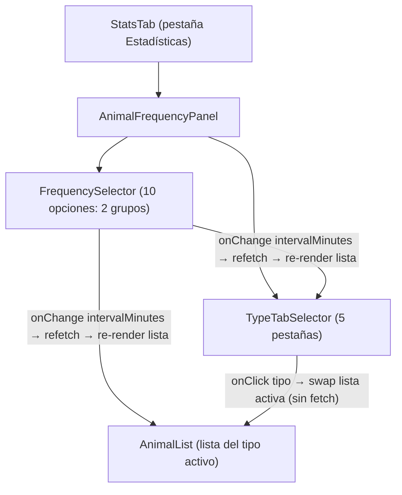

# AnimalFrequencyPanel — Cadencia de farmeo y animales esperados

> **Historial de versiones:**
>
> - **v1 (rechazada):** matriz animal × franja temporal. Rechazada: "no la entiendo, ¿puedes hacerla más sencilla?".
> - **v2 (superada):** lista simple de una frecuencia, todos los animales sin diferenciar tipo de oasis. El lenguaje humano y la simplicidad se aprobaron.
> - **v3 (rechazada):** selector de frecuencia de v2 + 5 secciones acordeón por tipo de oasis. Rechazada por el usuario: "demasiado recargado / poco aire", "fuera los acordeones", "las filas de animal no me cuadran". Estética no era macOS de verdad.
> - **v4 (aprobada estéticamente):** rediseño completo desde actitud macintosh. Fuera acordeones → pestañas (segmented control). Aire y espacio generosos. Jerarquía tipográfica pura: la cifra media como protagonista visual. Confianza discreta (punto gris + caption tenue, nunca badge llamativo). El usuario aprobó la estética: "está mejor".
> - **v5 (actual):** añade 4 datos solicitados sin romper el aire macOS de v4. Peor caso (max) por animal en la fila de animal. Ficha de resumen del tipo (total de animales media/normal/peor + botín medio por recurso + nº de oasis + coords). Estrategia de no-recargo: jerarquía media > peor, ficha sobria con números tabulares, coords como chips inline, todo subordinado a la lista de animales. Ver §14 para trazabilidad.

---

## Qué cambió de v3 a v4 y por qué

| Elemento v3 | Decisión v4 | Razón |
|---|---|---|
| 5 acordeones apilados | 1 segmented control con 5 pestañas | El usuario rechazó explícitamente los acordeones. Las pestañas son más Apple (macOS System Preferences, Safari, Finder inspectors). Una sola cosa protagonista en pantalla. |
| Cabecera de sección con borde+fondo `--surface-2` | Eliminada completamente | Sin marcos, sin cajas. La jerarquía viene de la tipografía y el espacio, no de contenedores. |
| Fila de animal con layout de dos columnas dentro de `--surface` con borde | Fila sin fondo ni borde propio, solo hairline divisor | DESIGN.md §1: "el espacio y el peso crean jerarquía, no las cajas". Sin borde exterior, sin fondo por fila. Solo hairline entre animales. |
| Cifra `avg_present` como valor secondary en la misma línea que el nombre | `avg_present` en 22px/600/mono como protagonista visual | Queja 3 del usuario: "las cifras no me cuadran". La media es el dato que importa, debe ser lo primero que el ojo ve. |
| Badge de confianza llamativo (chip con fondo dorado junto al título del tipo) | Punto de 5px + caption tenue bajo la frase de cabecera | El usuario pidió badges "DISCRETOS". Un punto gris y una línea de texto en `--text-tertiary` es suficiente. El oro solo se usa si hay aviso real (punto ligeramente más cálido, no badge). |
| Panel con `border: 1px solid var(--border)` + `padding: 20px 24px` + `background: --surface` | Sin marco propio; el panel vive sobre la superficie del StatsTab | El StatsTab ya tiene su propia superficie. Doble marco = recarga visual. El aire viene de la ausencia de contenedores innecesarios. |

## Qué cambia de v4 a v5 y cómo se conserva el aire

El reto de v5: añadir 4 datos nuevos (peor caso, total animales, botín, coords) sin saturar. La estrategia es **jerarquía + separación física**, no acumulación plana:

| Dato nuevo | Dónde aparece | Cómo se subordina al aire macOS |
|---|---|---|
| `max_present` (peor caso por animal) | Fila de animal — tercer nivel en la caption | Sigue siendo una caption de 12px/`--text-tertiary`. Añade `· peor: 8` al final de la caption existente. La media (22px) sigue siendo el único protagonista. |
| `total_animals` (media/normal/peor del total) | Ficha de resumen del tipo — sobre la lista | Una línea de 3 cifras compactas con labels de 11px. Separada de la lista por 20px de espacio. Sin marco, sin fondo propio. |
| `avg_bounty` (botín medio por recurso) | Ficha de resumen del tipo — misma zona | Fila de 4 recursos + total. Iconos de recurso pequeños (14px) antes del número. Números mono/tabular. Sin tabla, disposición inline en una fila. |
| `oasis_coords` (coords del tipo activo) | Ficha de resumen del tipo — junto al nº de oasis | Chips pill sutiles `(-15\|23)` inline tras el conteo de oasis. Máximo 3 visible + "y N más" si exceden. |

**Principio de no-recargo:** la ficha de resumen del tipo es **sobria y compacta** (≤ 3 filas de contenido), sin borde visible propio ni fondo diferenciado. Solo un hairline superior la separa del tabpanel. La lista de animales sigue siendo la protagonista visual — la ficha informa de contexto antes de la lista, no compite con ella.

---

## 1. Visión de la experiencia y principios de diseño

La pregunta operativa del panel:
**"Si farmeo cada X, ¿qué me suelo encontrar en los oasis de [tipo]?"**

El usuario elige su cadencia habitual y el tipo de oasis que le interesa. Ve una lista limpia, con la cifra protagonista grande y la información secundaria en caption discreto. Para comparar tipos, cambia de pestaña al instante (sin refetch — todo ya está cargado).

**Principios aplicados (DESIGN.md):**

- **Menos es más (§1 DESIGN.md):** una sola lista en pantalla, no cinco. Una sola cifra protagonista por fila, no un bloque de tres cifras iguales en peso.
- **El espacio y el peso crean jerarquía (§1 DESIGN.md):** sin marcos por fila, sin fondos de sección. La cifra de 22px/600 domina; el nombre en 14px/500 acompaña; la caption en 12px/`--text-tertiary` informa sin competir.
- **Restraint (§1 DESIGN.md):** si dudas entre añadir o quitar, quita. Los acordeones se quitaron. Los badges se redujeron a un punto. El panel mismo no tiene borde propio.
- **Coherencia con el SO (§1 DESIGN.md):** las pestañas (tab bar con indicador de línea bajo la activa) son el patrón canónico de macOS para navegar entre categorías dentro de una misma vista.
- **Acento oro con cuentagotas (§4 DESIGN.md):** solo la pestaña activa lleva el color de acento. Nada más.

---

## 2. Personas y objetivos

**Persona única:** propietario de la cuenta de Travian. Lee el panel antes de ajustar su scheduler o decidir qué tropas llevar a qué oasis.

**Jobs-to-be-done:**
1. **Decisión por tipo de oasis:** "Voy a un oasis de Hierro cada 4h, ¿qué me encuentro?"
2. **Comparación rápida de tipos:** cambiar de pestaña y ver la lista del tipo siguiente, sin scroll ni apertura.
3. **Confianza en el dato:** saber cuántos ataques respaldan el número, de forma discreta.
4. **Contexto de "Sin clasificar":** entender por qué un oasis no tiene tipo asignado.

---

## 3. Inventario de pantallas / vistas

Una sola vista: `AnimalFrequencyPanel` dentro de `StatsTab`.

No abre drawers ni modales. Toda la interacción es local: cambiar la frecuencia activa en el selector (refetch) o cambiar de pestaña de tipo (instantáneo, sin refetch).

### Posición en StatsTab (sin cambios respecto a v3):

```
1. SpawnMechanicsPanel       — educativo/estático, colapsable
2. BalanceSection            — pérdidas/ganancias del mundo
3. OasisCombatPlannerPanel   — peor caso teórico por oasis
4. AnimalFrequencyPanel      — [ESTE PANEL] empírico por frecuencia y tipo de oasis
--- <hr> separador ---
5. GlobalOasisStatsPanel     — apariciones globales
6. OasisList                 — lista navegable de oasis individuales
```

---

## 4. Mapa de navegación



---

## 5. Flujos de usuario

### Happy path (datos disponibles)
1. Usuario entra en la pestaña Estadísticas.
2. `StatsTab` monta `AnimalFrequencyPanel` → llama a `getAnimalTemporalDistribution(240)` (default: 4h).
3. Panel muestra skeleton mientras carga (FrequencySelector deshabilitado + pestañas skeleton + filas skeleton).
4. Llega la respuesta: se renderizan las 5 pestañas. La pestaña activa por defecto es el primer tipo con `n_reports_in_section > 0`.
5. Usuario ve la lista del tipo activo (p. ej. Hierro): cifras limpias, lenguaje humano.
6. Usuario cambia a la pestaña Barro → la lista cambia instantáneamente (los datos ya están cargados).
7. Usuario cambia selector a "6 min" → nueva llamada → skeleton → nueva respuesta → pestaña activa resetea al primer tipo con datos.

### Flujo alternativo: pestaña de tipo sin datos
- La pestaña aparece en el selector con texto en `--text-disabled` y el conteo "—".
- El usuario puede hacer clic → se muestra el empty state del tipo: "Aún no tienes ataques a oasis de [tipo] con esta cadencia."
- La pestaña activa seleccionada visualmente (borde-bottom sobre la línea) aunque sin datos.

### Flujo alternativo: todos los tipos vacíos para esa frecuencia
- Las 5 pestañas aparecen atenuadas (opacity 0.45, pointer-events: none).
- Se muestra un mensaje global: "Ningún oasis tiene datos con esta cadencia. Prueba otra frecuencia."

### Flujo alternativo: BD vacía (cero reportes)
- `FrequencySelector` y pestañas ocultos.
- Estado vacío global con CTA "Ir a importar reportes".

### Flujo alternativo: error de red o backend
- Banner de error discreto + botón "Reintentar". `FrequencySelector` visible y habilitado. Pestañas ocultas.

### Flujo alternativo: animal con `avg_present: null`
- La fila del animal muestra "—" en `--text-disabled` + "Sin observaciones válidas" en caption. Al final de la lista.

### Flujo alternativo: pestaña "Sin clasificar" con contenido
- Nota explicativa en caption antes de la lista: "Estos oasis no tienen suficientes ataques exitosos para determinar su tipo."
- Si sin contenido: empty state del tipo.

---

## 6. Wireframes de baja fidelidad

### 6A. Desktop (≥ lg, ≥ 1024px) — con datos, v5

```
  Cadencia de farmeo
  ─────────────────────────────────────────────────────────────


  Farmeo cada:  [ 6 min ][ 7 min ][ 10 min ][ 15 min ][ 30 min ] │ [ 1h ][ 2h ][ 3h ][ 4h● ][ 5h+ ]


  [ ⚔ Hierro 3 ]  [ 🏺 Barro 2 ]  [ 🌲 Madera 1 ]  [ 🌾 Cereal 2 ]  [ ? Sin clasificar — ]
  ──────────────────────────────────────────────────────────────────────────────────────────
  (línea bajo la pestaña activa en color acento oro)


  ── FICHA DE RESUMEN DEL TIPO (nuevo v5) ────────────────────────────────────────────────
  En oasis de Hierro, cada 4h sueles encontrar:
  · Estimado a partir de 18 ataques a 3 oasis · (3|5) (-7|12) (22|4)

  Total de animales:  11  de media  ·  lo normal 10  ·  peor 17
  Botín medio:   [🪵] 320  [🏺] 280  [⚙] 540  [🌾] 190    Total 1 330

  ── FIN FICHA ────────────────────────────────────────────────────────────────────────────


                                                             (cada animal en su fila, solo hairline divisor)
  ────────────────────────────────────────────────────────────────────────
  [icono]  Lobo                                               5
                                                   animales de media
                                     lo normal: 5  ·  peor: 8  ·  16 de 18 ataques
  ────────────────────────────────────────────────────────────────────────
  [icono]  Oso                                                3
                                                   animales de media
                                     lo normal: 3  ·  peor: 5  ·  14 de 18 ataques
  ────────────────────────────────────────────────────────────────────────
  [icono]  Araña                                              2
                                                   animales de media
                                  lo normal: 2 o 3  ·  peor: 4  ·  12 de 18 ataques
  ────────────────────────────────────────────────────────────────────────


```

**Notas del wireframe v5:**

**Ficha de resumen del tipo:**
- Sin borde ni fondo propio. Un hairline inferior la separa visualmente de la lista de animales. Padding superior/inferior: 16px.
- La línea de contexto ("En oasis de Hierro...") y confianza se mantienen igual que v4. Las coords de oasis se añaden inline como chips pill tras el texto de confianza, separados por un espacio. Los chips son `(-7|12)` en fuente mono 11px, background `--surface-2`, border `--border`, `--radius-full`. Si hay más de 3 oasis: se muestran 3 chips + `y N más` en `--text-tertiary`. El formato de coords es SIEMPRE `(x|y)` con signo cuando negativo — extraído a `coordUtils.js`.
- **Total de animales:** label 12px/`--text-secondary` "Total de animales:" + cifra media en 17px/600/mono + "de media" en 12px/`--text-tertiary` + separador `·` + "lo normal X" en 12px/mono + separador `·` + "peor Y" en 12px/mono. Si `avg` null: "—" en `--text-disabled`.
- **Botín medio:** iconos de recurso 14px en `--text-secondary` + cifra en 13px/mono/tabular-nums. Disposición en fila horizontal: `[🪵] 320  [🏺] 280  [⚙] 540  [🌾] 190  Total 1 330`. "Total" en 13px/500. Si todos 0: "Sin datos de botín para este tipo" en `--text-tertiary`. Los iconos de recurso usan etiquetas si el proyecto no tiene un set de iconos de recurso definido (ver §8.1). DESIGN.md permite Lucide para iconos de línea fina — usar iconos Lucide: `TreePine` (madera), `Boxes` (barro), `Wrench` (hierro), `Wheat` (cereal).
- **Posición:** la ficha está ENCIMA de la lista de animales (después de las pestañas y antes del primer hairline de animal). Es el "contexto del tipo" antes de ver el desglose.

**Fila de animal v5:**
- La cifra "5" es 22px/600/mono. Sigue siendo el único protagonista de la fila.
- "animales de media" es 12px/`--text-secondary`.
- La caption pasa a: `lo normal: X  ·  peor: Y  ·  N ataques` — 12px/`--text-tertiary`. El "peor" es terciario, mismo nivel que la moda. No se enfatiza.
- Si `max_present` es null: no se muestra el fragmento "peor: —". Se omite limpiamente.

### 6B. Desktop — pestaña sin datos (sin cambios respecto a v4)

```
  Farmeo cada:  ...
  [ ⚔ Hierro 3 ]  [ 🏺 Barro 2 ]  [ 🌲 Madera — ]  ...
                                    ────────── (activa)


                  (icono ⊘ en --text-disabled)
          Aún no tienes ataques a oasis de Madera con esta cadencia
                    Prueba otra frecuencia.


```

Nota: cuando el tipo está vacío, la ficha de resumen del tipo NO se muestra (no hay nada que resumir). Solo aparece el empty state del tipo.

### 6C. Desktop — todos los tipos vacíos (sin cambios respecto a v4)

```
  Farmeo cada:  [ 6 min● ]  ...
  [ Hierro — ] [ Barro — ] [ Madera — ] [ Cereal — ] [ Sin clasificar — ]
  ──────────────────────────────────────────────────────── (borde atenuado, opacity 0.45)


              (icono ⊙ en --text-disabled)
          Ningún oasis tiene datos con esta cadencia
                  Prueba otra frecuencia.


```

### 6D. Móvil (< md, < 768px) — v5

```
┌────────────────────────────────────────┐
│  Cadencia de farmeo                    │
│                                        │
│  Farmeo cada:                          │
│  [6m][7m][10m][15m][30m]               │
│  [1h][2h][3h][4h●][5h+]               │
│                                        │
│  [⚔ H 3][🏺 B 2][🌲 M 1][🌾 C 2][? —] │
│  ──────── (scroll horizontal si no cabe)│
│                                        │
│  En oasis de Hierro, cada 4h           │
│  sueles encontrar:                     │
│  · Estimado · (3|5) (-7|12)            │
│                                        │
│  Total: 11 de media · normal 10        │
│         peor 17                        │
│  [🪵]320 [🏺]280 [⚙]540 [🌾]190       │
│  Total 1 330                           │
│  ──────── (hairline divisor)           │
│                                        │
│  [icono]  Lobo                     5   │
│                       animales de media│
│         lo normal: 5 · peor: 8 · 16/18│
│  ──────────────────────────────────────│
│  [icono]  Oso                      3   │
│                       animales de media│
│         lo normal: 3 · peor: 5 · 14/18│
│  ──────────────────────────────────────│
└────────────────────────────────────────┘
```

En móvil:
- El FrequencySelector usa dos filas (grupo minutos / grupo horas), sin divisor vertical.
- Las pestañas de tipo: scroll horizontal (`overflow-x: auto; scrollbar-width: none`).
- **Ficha de resumen:** la línea de confianza puede acortarse: "Estimado" sin el conteo de oasis completo si no hay espacio. Las coords de oasis: los chips se disponen en `flex-wrap: wrap`, no inline forzado. El botín: los 4 recursos + total caben en una fila corta (números de 2-3 dígitos generalmente). Si no caben, fluyen a 2 filas con `flex-wrap: wrap`.
- **Total de animales en móvil:** puede ir en dos líneas si es necesario (`11 de media  ·  normal 10` / `peor 17`) — no es P1, puede fluir.
- Las filas de animal son idénticas a desktop. La caption v5 (`lo normal: X · peor: Y · N/M`) cabe porque es una sola línea de texto pequeño.
- La cifra protagonista baja de 22px a 20px en móvil.

**P1/P2/P3 en móvil (actualizado v5):**
- P1: título del panel, FrequencySelector, TypeTabSelector, nombre del animal, cifra media protagonista.
- P2: ficha de resumen del tipo (total + botín + coords), "animales de media", caption con moda.
- P3: "peor" en la caption de animal (terciario), nota cereal/sin_clasificar, nº de ataques en la fila, tooltips de pills.

---

## 6b. Mockup editable y layout aprobado

**Ruta del mockup:** `frontend/mockups/animal-frequency-panel.playground.html`

**Estado:** pendiente de aprobación del usuario (gate humano — Fase 2.5). Regenerado a v5.

El mockup v5 incluye:
- Toggle de tema claro/oscuro.
- Selector de estado: `Con datos | Cargando | Error | Vacío global | Sin datos (cadencia) | Tipo sin datos`.
- Selector de vista responsive: Desktop / Móvil (390px).
- Bloques arrastrables:
  - `[FrequencySelector]` — selector de cadencia con pills
  - `[TypeTabSelector + Ficha + AnimalList]` — pestañas + ficha de resumen del tipo + lista activa
- Pestañas funcionales dentro del mockup: al hacer clic en Hierro/Barro/Madera/Cereal/Sin clasificar se cambia la lista visible instantáneamente. Cada tipo muestra su ficha de resumen propia.
- Pills de frecuencia funcionales dentro del mockup.
- El estado "Con datos" muestra la ficha de resumen del tipo (total animales + botín + coords) sobre la lista de animales de Hierro.
- El estado "Cargando" incluye el skeleton de la ficha (2 barras skeleton antes de las filas de animal).
- Guardar (localStorage), Restablecer, Exportar layout (JSON).

**Layout propuesto pre-aprobación (v5):**
```
[Título: "Cadencia de farmeo"]
[FrequencySelector — dos grupos de pills]
[TypeTabSelector + Ficha de resumen del tipo + AnimalList activa — un bloque unido]
```

El TypeTabSelector, la Ficha y la AnimalList son un único bloque semántico. Las pestañas son la cabecera; la ficha es el contexto del tipo activo; la lista es el desglose por animal. Separar cualquiera de los tres en bloques distintos arrastrables rompería la coherencia semántica.

El layout aprobado por el usuario (JSON exportado del playground) reemplazará esta descripción.

---

## 7. Estados de cada pantalla

### 7.1 Estado cargando (loading)

`FrequencySelector` visible y deshabilitado (opacity 0.4) + fila de pestañas skeleton (5 barras de distinto ancho animadas con pulse) + **skeleton de la ficha de resumen** (2 barras de distinto ancho que representan "total animales" y "botín") + 3 filas skeleton de animal (círculo + barra + cifra).

El skeleton de la ficha debe ser proporcional en altura a la ficha real (≈ 2 líneas de texto). Dos barras horizontales de distintos anchos (70% y 50% del ancho disponible) con gap de 8px entre ellas. Sin representar la estructura interna de la ficha en el skeleton — no animar los iconos de recurso ni las coords.

`role="status"` `aria-label` localizado. `prefers-reduced-motion`: estático (opacity 0.5 sin animación).

### 7.2 Estado error

```
[FrequencySelector — visible, habilitado]
[⊙ icono gris]  "No se pudieron cargar los datos de frecuencia."  [Reintentar]
```

`role="alert"`. Sin pestañas. Selector funcional. Sin borde rojo — la señal de error es el icono + texto, no el color.

### 7.3 Estado vacío de frecuencia (ningún tipo tiene datos para esta cadencia)

- `FrequencySelector` visible y habilitado.
- Las 5 pestañas visibles pero atenuadas (`opacity: 0.45; pointer-events: none`).
- Un mensaje central: icono ⊙ en `--text-disabled` + "Ningún oasis tiene datos con esta cadencia" (14px/500/`--text-secondary`) + "Prueba otra frecuencia." (13px/`--text-tertiary`).

### 7.4 Estado vacío global (BD completamente vacía)

```
[FrequencySelector — OCULTO]
[Pestañas — OCULTAS]
[icono pantalla en --text-disabled]
["Sin datos de tus ataques todavía"]
["Importa reportes para ver qué sueles encontrar en cada oasis."]
[botón primario monocromo: "Ir a importar reportes"]
```

### 7.5 Estado con datos (normal)

FrequencySelector + 5 pestañas + **ficha de resumen del tipo activo** + lista del tipo activo.

**Pestaña activa por defecto:**
- El primer tipo con `n_reports_in_section > 0` en el orden fijo: hierro → barro → madera → cereal → sin_clasificar.
- Si todos tienen datos, activa hierro por defecto.
- Si todos están vacíos: estado 7.3.
- "Sin clasificar": puede ser la pestaña activa si el usuario la selecciona, nunca es la activa por defecto.

**Estado de cada pestaña individual:**
- Con datos (`n_reports_in_section > 0`): etiqueta en `--text-secondary`, conteo en `--text-tertiary`/mono. Al activarse: color acento, borde-bottom acento, conteo en acento con opacity 0.7.
- Sin datos (`n_reports_in_section === 0`): etiqueta y conteo ("—") en `--text-disabled`. Cursor `not-allowed`. El usuario puede hacer clic pero ve el empty state del tipo (7.6).

### 7.6 Pestaña de tipo vacía (seleccionada, sin datos)

```
[Pestaña activa con borde discreto (--border-strong, no acento)]
[icono ⊙ en --text-disabled]
["Aún no tienes ataques a oasis de [tipo] con esta cadencia."]
["Prueba otra frecuencia."]
```

### 7.7 Animal con `avg_present: null`

Fila al final de la lista: icono en `--text-disabled`, nombre en `--text-disabled`, cifra "—" (18px/`--text-disabled`), "Sin observaciones válidas" en caption.

### 7.8 Pestaña "Sin clasificar" con contenido

Nota en 12px/`--text-tertiary` antes de la lista: "Estos oasis no tienen suficientes ataques exitosos para determinar su tipo de recurso. Pueden ser de cualquier recurso."

### 7.9 Pestaña "Cereal" con datos

Nota en 12px/`--text-tertiary` antes de la lista: "Los oasis de cereal tienen los patrones de animales más variados. Los datos aquí son estimaciones más amplias." La línea de confianza lleva el punto discreto de aviso (tono ligeramente más cálido que `--text-tertiary`).

### 7.10b Estado de la ficha de resumen — subcasos

**Ficha con datos completos:** muestra total_animals (avg/mode/max), avg_bounty (los 4 recursos + total), n_oasis + coords.

**Ficha con avg_bounty todo 0:** en lugar de `[🪵] 0  [🏺] 0  [⚙] 0  [🌾] 0  Total 0`, mostrar una sola línea: "Sin datos de botín para este tipo" en 12px/`--text-tertiary`. No mostrar la fila de iconos con ceros — comunica ausencia de forma más limpia.

**Ficha con total_animals.avg null (n_valid 0):** la línea de total muestra "—" en `--text-disabled` + "Sin observaciones de totales". La línea de botín puede mostrar 0 si hay datos de botín, o el estado "Sin datos de botín".

**Ficha con max null (n_valid 0):** la porción "peor N" no aparece en la línea de total. Solo "X de media  ·  lo normal Y". Limpio.

**Ficha con modo vacío (mode: []):** "lo normal —" en `--text-disabled`.

**Ficha con oasis_coords vacío o null:** no se muestran chips de coords. La línea de confianza termina sin chips.

**Ficha con muchas coords (> 3):** se muestran 3 chips + `y N más` en `--text-tertiary`. Decisión de no scroll horizontal: 3 chips ya da contexto suficiente. Si el usuario necesita la lista completa, puede verla en OasisList.

### 7.10 Transición al cambiar la frecuencia

1. Pill activo cambia inmediatamente (feedback visual).
2. Panel entra en skeleton (FrequencySelector deshabilitado + pestañas skeleton + filas skeleton).
3. Al llegar la respuesta: re-render con la pestaña activa en el primer tipo con datos.
4. Si error: ErrorBanner. Selector habilitado.

### 7.11 Transición al cambiar de pestaña de tipo

Instantánea (los datos ya están en memoria). Sin skeleton. La lista se actualiza en un crossfade de `--dur-fast` (150ms, opacity 0→1). `prefers-reduced-motion`: cambio instantáneo.

---

## 8. Inventario de componentes UI

### 8.1 Reutilizables sin modificar

| Componente | Ruta | Uso |
|---|---|---|
| `NatureIcon` | `frontend/src/components/attack-reports/NatureIcon.jsx` | Icono del animal (20–24px) en cada fila de la lista. También en los iconos de pestaña. |

**Iconos de recurso (botín — nuevos en v5):** el proyecto no tiene un set de iconos de recurso dedicado a este panel. Usar **iconos Lucide de línea fina** (ya en el set del proyecto, DESIGN.md §11): `TreePine` (madera), `Package` o `Boxes` (barro/arcilla), `Wrench` (hierro), `Wheat` (cereal). Tamaño 14px, color `--text-secondary`. Buscar si `BalanceSection.jsx` ya usa algún icono de recurso — si lo hace, REUTILIZAR ese patrón exacto antes de elegir iconos. Si `BalanceSection.jsx` usa etiquetas de texto cortas (W/B/I/C o similar), usar el mismo patrón de etiqueta en la ficha para coherencia visual.

**Iconos de pestaña:** en el mockup se usan SVG inline genéricos. En la implementación: `NatureIcon` del animal más frecuente de cada tipo, o icono Lucide de recurso. Para "Sin clasificar": Lucide `HelpCircle`. Decisión final para el implementador.

### 8.2 Patrón reutilizado (implementar inline)

| Patrón | Base | Adaptación |
|---|---|---|
| `FrequencySelector` | `TimerSelector` de v2/v3 | Sin cambios visuales. Mismo estilo pill. |
| Tab bar con borde-bottom | Patrón macOS estándar | Nuevo para este panel. Implementar inline. |
| Chips de coords | `Farm list assignment chips` (§19.8 DESIGN.md) | Mismo estilo pill pero sin cursor pointer ni hover dorado. Solo texto. |

### 8.3 Componentes nuevos

| Componente | Dónde vive | Descripción |
|---|---|---|
| `AnimalFrequencyPanel` | `frontend/src/components/attack-reports/AnimalFrequencyPanel.jsx` | Panel completo: FrequencySelector, TypeTabSelector, TypeSummaryCard, AnimalList activa, todos los estados. |
| `TypeTabSelector` | Interno a `AnimalFrequencyPanel.jsx` | Tab bar de 5 pestañas. Props: `types[]`, `activeType`, `onTypeChange`. |
| `TypeSummaryCard` | Interno a `AnimalFrequencyPanel.jsx` | **NUEVO v5.** Ficha de resumen del tipo: total animales (avg/mode/max), botín por recurso, nº de oasis + coords chips. Sin borde propio. Props: `totalAnimals`, `avgBounty`, `nOasis`, `oasisCoords`, `lang`, `t`. |
| `AnimalFrequencyRow` | Interno a `AnimalFrequencyPanel.jsx` | Fila de animal v5: icono + nombre + cifra protagonista (22px/600/mono) + "animales de media" + caption con moda + peor caso. |
| `TypeEmptyState` | Interno a `AnimalFrequencyPanel.jsx` | Empty state del tipo: icono + título + hint. |

**Tarea de implementación recomendada — `coordUtils.js`:**

> En el frontend existen actualmente **5 copias** del formateador de coordenadas de oasis: `OasisList.jsx`, `HistoryTable.jsx` (o similar), `ReportPreview.jsx`, `OasisStatsPanel.jsx`, y `OasisCombatPlannerPanel.jsx`. Con v5 se añade un sexto punto de uso (chips en la `TypeSummaryCard`). En lugar de crear la sexta copia:
>
> **Crear `frontend/src/utils/coordUtils.js`** con la función `formatCoord(x, y) → "(x|y)"` (con signo negativo correcto, sin espacio). El `desarrollador-ux-ui` debe:
> 1. Crear `coordUtils.js` con la función.
> 2. Importarla en `TypeSummaryCard` (uso nuevo).
> 3. Refactorizar los 5 componentes existentes para importarla en lugar de duplicar la lógica.
>
> Esto no es código de producción nuevo — es deduplicación de una función idéntica que ya existe 5 veces.

**Decisión de reutilización:**
- `NatureIcon`: REUTILIZAR.
- `FrequencySelector` (patrón pills): REUTILIZAR patrón de v2 (implementar inline).
- Tab bar: CREAR (implementar inline en `AnimalFrequencyPanel.jsx`).
- `AnimalFrequencyRow`: CREAR (v5 — fila con peor caso añadido).
- `TypeSummaryCard`: CREAR (nuevo en v5).
- `coordUtils.js`: CREAR (deduplicación, ver tarea de implementación).

---

## 9. Contenido y microcopy

Todas las cadenas viven en el catálogo i18n. Prefijo `ar.freq.*`.

### Claves de v2 que se mantienen

| Clave i18n | Valor (es) |
|---|---|
| `ar.freq.panel_title` | "Cadencia de farmeo" |
| `ar.freq.selector_label` | "Farmeo cada:" |
| `ar.freq.loading` | "Cargando datos de frecuencia..." |
| `ar.freq.error` | "No se pudieron cargar los datos de frecuencia." |
| `ar.freq.retry` | "Reintentar" |
| `ar.freq.empty_global_title` | "Sin datos de tus ataques todavía" |
| `ar.freq.empty_global_body` | "Importa reportes para ver qué sueles encontrar en cada oasis." |
| `ar.freq.empty_global_cta` | "Ir a importar reportes" |
| `ar.freq.no_data_main` | "—" |
| `ar.freq.no_data_detail` | "Sin observaciones válidas" |

### Claves nuevas o rediseñadas en v4

| Clave i18n | Valor (es) | Contexto |
|---|---|---|
| `ar.freq.section_heading` | "En oasis de {type}, cada {label} sueles encontrar:" | Frase de cabecera de la lista activa |
| `ar.freq.confidence_base` | "Estimado a partir de {n} ataques a {oasis} oasis" | Línea de confianza discreta (caption) |
| `ar.freq.confidence_low_partial` | "{bad} de {total} oasis con tipo dudoso · {n} ataques" | Línea de confianza con aviso (punto más cálido) |
| `ar.freq.confidence_low_all` | "Tipo estimado con pocos datos · {n} ataques" | Confianza con aviso, todos dudosos |
| `ar.freq.avg_label` | "animales de media" | Bajo la cifra protagonista |
| `ar.freq.mode_label` | "lo normal: {mode}" | Primer elemento del caption |
| `ar.freq.mode_tie` | "{a} o {b}" | Cuando hay empate en la moda |
| `ar.freq.n_label` | "{n} ataques" | Segundo elemento del caption (sin parciales) |
| `ar.freq.n_label_partial` | "{valid} de {total} ataques" | Cuando hay derrotas (n_valid < n_total) |
| `ar.freq.avg_less_than_one` | "menos de 1" | Cuando avg_present < 1 (representar como fracción legible) |
| `ar.freq.tab_no_data` | "—" | Conteo de la pestaña sin datos |
| `ar.freq.all_empty_title` | "Ningún oasis tiene datos con esta cadencia" | Estado vacío de frecuencia |
| `ar.freq.all_empty_hint` | "Prueba otra frecuencia." | Hint del estado vacío de frecuencia |
| `ar.freq.type_empty_title` | "Aún no tienes ataques a oasis de {type} con esta cadencia" | Empty state del tipo |
| `ar.freq.type_empty_hint` | "Prueba otra frecuencia." | Hint del empty state del tipo |
| `ar.freq.unclassified_note` | "Estos oasis no tienen suficientes ataques exitosos para determinar su tipo de recurso. Pueden ser de cualquier recurso." | Nota en pestaña Sin clasificar |
| `ar.freq.cereal_note` | "Los oasis de cereal tienen los patrones de animales más variados. Los datos aquí son estimaciones más amplias." | Nota en pestaña Cereal |

### Claves nuevas en v5 (TypeSummaryCard + fila de animal peor caso)

| Clave i18n | Valor (es) | Contexto |
|---|---|---|
| `ar.freq.worst_label` | "peor: {max}" | En la caption de la fila de animal (terciario). Omitir si max null. |
| `ar.freq.summary_total_label` | "Total de animales:" | Label en la ficha de resumen del tipo |
| `ar.freq.summary_total_avg` | "{avg} de media" | Cifra de total_animals avg en la ficha |
| `ar.freq.summary_total_mode` | "lo normal {mode}" | Moda del total en la ficha |
| `ar.freq.summary_total_max` | "peor {max}" | Máximo del total en la ficha |
| `ar.freq.summary_bounty_label` | "Botín medio:" | Label de la fila de botín |
| `ar.freq.summary_bounty_total` | "Total {total}" | Total de botín al final de la fila de recursos |
| `ar.freq.summary_bounty_no_data` | "Sin datos de botín para este tipo" | Cuando avg_bounty todos 0 |
| `ar.freq.summary_oasis_count` | "{n} oasis" | Nº de oasis del tipo (en la línea de confianza) |
| `ar.freq.summary_coords_more` | "y {n} más" | Cuando hay más de 3 coords |
| `ar.freq.summary_total_no_data` | "Sin observaciones de totales" | Cuando total_animals.avg null |

---

## 10. Accesibilidad

- **Tab bar:** `role="tablist"` en el contenedor de pestañas. Cada pestaña es `role="tab"` con `aria-selected="true|false"` + `aria-controls="panel-[tipo]"`. El panel de contenido tiene `role="tabpanel"` + `id="panel-[tipo]"` + `aria-labelledby` apuntando al tab correspondiente.
- **Teclado:** foco en una pestaña → flechas izquierda/derecha navegan entre tabs (comportamiento estándar ARIA tab). Enter o Espacio activa la pestaña enfocada.
- **FrequencySelector:** `role="group"` + `aria-label` + `aria-pressed` en cada pill.
- **Skeleton:** `role="status"` + `aria-label` + `aria-live="polite"`.
- **Error:** `role="alert"`.
- **Foco:** anillo 2px `--accent` + `outline-offset: 2px` en todas las pestañas y pills.
- **Pestañas sin datos:** `aria-disabled="true"` (no `disabled` nativo — para que el foco siga siendo alcanzable y el usuario entienda que el tab existe pero está vacío). Cursor `not-allowed`.
- **`prefers-reduced-motion`:** desactiva la transición de cambio de panel (crossfade) y la animación de skeleton.
- **Color + texto siempre:** el estado "sin datos" no es solo color: el conteo "—" y el cursor `not-allowed` son señales adicionales.

---

## 11. Responsive / adaptación

| Breakpoint | FrequencySelector | TypeTabSelector | AnimalList |
|---|---|---|---|
| `< md` (< 768px) | Dos filas (min / h), sin divisor vertical | Scroll horizontal (`overflow-x: auto; scrollbar-width: none`), etiquetas completas si caben | Filas con hairline (igual que desktop); cifra 20px en vez de 22px |
| `md` (768–1023px) | Una fila con divisor | Todas las pestañas visibles en una fila | Filas con hairline, cifra 22px |
| `≥ lg` (≥ 1024px) | Una fila con divisor | Todas las pestañas visibles en una fila | Filas con hairline, cifra 22px |

**Pestañas en móvil — estrategia de scroll vs. 2 filas:**
Se elige **scroll horizontal** (no 2 filas) porque: (1) más limpio visualmente — una sola fila de pestañas, como iOS; (2) el scroll horizontal en un tab bar es un patrón conocido en móvil; (3) evita la confusión de cuál fila es "superior" en jerarquía; (4) con iconos + etiquetas cortas las 5 pestañas suelen caber en < 400px de ancho total (testar en implementación).

**P1/P2/P3:**
- P1: título del panel, FrequencySelector, TypeTabSelector (siempre visible), nombre del animal, cifra protagonista.
- P2: "animales de media" (label bajo la cifra), frase contextual, línea de confianza.
- P3: caption "lo normal: X · N ataques", nota cereal/sin_clasificar, tooltips de pills.

**RTL:** propiedades lógicas en todo. La lista de pestañas se puede leer de derecha a izquierda. `margin-inline-end` para separaciones. `text-align: end` para cifras del bloque de datos. `inset-inline-end` para posicionamiento. `padding-inline` para paddings. El borde de la pestaña activa (border-bottom) es físico y no cambia con RTL (está en bottom, no en sides).

**Sin scroll horizontal de página en ningún breakpoint.**

---

## 12. Interacciones y feedback

### Cambio de pestaña de tipo

- Clic/tap en pestaña → la pestaña activa cambia (borde-bottom acento + color acento).
- La lista de animales hace un crossfade: `opacity: 0 → 1` en `--dur-fast` (150ms).
- `prefers-reduced-motion`: cambio instantáneo sin transición.
- El cambio es local (sin refetch). Instantáneo a nivel de datos.

### Cambio de frecuencia

- Pill activo cambia inmediatamente.
- Las pestañas y la lista entran en skeleton.
- Al llegar la respuesta: las pestañas se actualizan (nuevos conteos), la pestaña activa se resetea al primer tipo con datos.
- Si error: ErrorBanner reemplaza el skeleton. Selector habilitado.

### Hover sobre pill de frecuencia (desktop)

- `border-color: var(--accent)` — sin tooltip (las etiquetas son autoexplicativas: "6 min", "4h").

### Hover sobre pestaña de tipo sin datos (desktop)

- Tooltip: "Sin ataques a oasis de [tipo] con esta cadencia."
- En táctil: el empty state del tipo al hacer tap sirve de contexto.

---

## 13. Criterios de aceptación de diseño (checklist verificable)

### Criterios de "aire" macOS — los que validan el TONO del diseño (heredados de v4, críticos)

- [ ] **Sin marcos por fila:** `AnimalFrequencyRow` no tiene `border`, `border-radius` propio, ni `background`. Solo un hairline divisor entre filas (`border-bottom: 1px solid var(--border)`).
- [ ] **Sin marco en el panel contenedor:** `AnimalFrequencyPanel` no tiene `border` ni `box-shadow` propios (el StatsTab ya provee la superficie).
- [ ] **Sin fondo de sección:** no existe ningún `background: var(--surface-2)` aplicado a una cabecera o zona de tipo de oasis.
- [ ] **Jerarquía tipográfica clara:** `avg_present` renderizado en ≥ 20px/600/mono. Nombre del animal en 14px/500. Captions en 12px/`--text-tertiary`. El ojo cae primero en la cifra. **La media sigue siendo el protagonista visual — no el peor caso.**
- [ ] **Una sola cosa protagonista en pantalla:** solo la lista del tipo activo es visible. No hay 5 listas apiladas ni 5 acordeones.
- [ ] **Acento oro solo en la pestaña activa y pills activas:** ningún otro elemento en el panel usa el acento oro.
- [ ] **Confianza discreta:** la información de confianza es un punto de 5px + caption de 12px en `--text-tertiary`. No es un badge con fondo ni con borde visible.
- [ ] **Espaciado generoso:** padding superior del panel antes del título ≥ 24px. Separación entre FrequencySelector y TypeTabSelector ≥ 24px. Padding entre filas de animal ≥ 14px.
- [ ] **La ficha de resumen no recarga el diseño:** `TypeSummaryCard` no tiene `border`, `box-shadow` ni `background` propio. Solo un hairline inferior (`border-bottom: 1px solid var(--border)`) la separa de la lista. Padding de la ficha: 0 a 16px (sin marco exterior).
- [ ] **Jerarquía media > peor en la fila de animal:** `max_present` ("peor: N") aparece en la caption de 12px/`--text-tertiary`, mismo nivel visual que la moda. NO tiene un tamaño de fuente mayor, ni color diferente, ni posición destacada. El número medio (22px/600) sigue siendo el más grande.

### Criterios funcionales v4 (heredados)

- [ ] El panel aparece en `StatsTab` en posición 4 (entre `OasisCombatPlannerPanel` y el `<hr>`).
- [ ] `FrequencySelector` muestra las 10 opciones en dos grupos. Default 4h.
- [ ] `TypeTabSelector` muestra las 5 pestañas en orden fijo: Hierro, Barro, Madera, Cereal, Sin clasificar.
- [ ] La pestaña activa por defecto es el primer tipo con `n_reports_in_section > 0`.
- [ ] "Sin clasificar" nunca es la pestaña activa por defecto.
- [ ] Cambiar de pestaña es instantáneo (sin refetch, crossfade 150ms). **La ficha de resumen se actualiza instantáneamente con los datos del nuevo tipo activo.**
- [ ] Cambiar de frecuencia → refetch → skeleton → nueva lista, pestaña activa resetea.
- [ ] Pestaña sin datos: texto en `--text-disabled`, conteo "—", cursor `not-allowed`, `aria-disabled="true"`. Al hacer clic: muestra TypeEmptyState. **La ficha de resumen NO se muestra cuando el tipo está vacío.**
- [ ] Estado vacío de frecuencia: pestañas atenuadas + mensaje central.
- [ ] Estado vacío global: sin selector, sin pestañas, CTA "Ir a importar reportes".
- [ ] Estado loading: skeleton de filas + skeleton de pestañas + **skeleton de la ficha** (2 barras). FrequencySelector deshabilitado.
- [ ] Estado error: ErrorBanner `role="alert"` + "Reintentar". Sin pestañas. Selector visible y habilitado.
- [ ] Animal con `avg_present: null`: fila "—" al final + "Sin observaciones válidas" en caption. Todo en `--text-disabled`.
- [ ] Nota contextual en Cereal con datos: 12px/`--text-tertiary` antes de la lista.
- [ ] Nota contextual en Sin clasificar con contenido: idem.

### Criterios funcionales v5 (nuevos)

- [ ] **Fila de animal — peor caso:** `max_present` se muestra en la caption como `· peor: {N}` a continuación de la moda. Si `max_present` es null, el fragmento "peor: —" NO aparece (se omite limpiamente).
- [ ] **TypeSummaryCard — total de animales:** línea con `total_animals.avg` (17px/600/mono), "de media", "lo normal {mode}", "peor {max}". Si `avg` null: "—" en `--text-disabled` + "Sin observaciones de totales". Si `max` null: omitir "peor {max}".
- [ ] **TypeSummaryCard — botín:** fila de 4 iconos de recurso + cifra mono + "Total {total}". Si todos los valores son 0: mostrar "Sin datos de botín para este tipo" en `--text-tertiary` (no mostrar la fila de ceros).
- [ ] **TypeSummaryCard — coords:** chips pill `(x|y)` con formato de `coordUtils.js`. Si > 3 coords: 3 chips + "y N más" en `--text-tertiary`. Si `oasis_coords` vacío: sin chips.
- [ ] **`coordUtils.js` creado** en `frontend/src/utils/coordUtils.js`. Los 5 componentes existentes refactorizados para usarlo. `TypeSummaryCard` también lo usa.
- [ ] **Confianza:** `n_oasis` en la línea de confianza. Las coords aparecen junto a la línea de confianza (misma zona, chips inline tras el texto).
- [ ] **La ficha de resumen cambia al cambiar de pestaña:** cada tipo activo muestra su propia ficha con sus datos.
- [ ] **Formato de coords:** SIEMPRE `(x|y)` via `coordUtils.formatCoord(x, y)`. El signo negativo es correcto. Sin espacio.

### Criterios de accesibilidad (heredados de v4)

- [ ] `role="tablist"` en el contenedor de pestañas. `role="tab"` + `aria-selected` en cada pestaña. `role="tabpanel"` + `id` + `aria-labelledby` en cada panel de contenido.
- [ ] Navegación por teclado: flechas izquierda/derecha entre pestañas. Enter/Espacio activa.
- [ ] `aria-disabled="true"` en pestañas sin datos.
- [ ] `role="status"` + `aria-live="polite"` en skeleton. `role="alert"` en error.
- [ ] Foco visible en todas las pestañas y pills: `outline: 2px solid var(--accent); outline-offset: 2px`.
- [ ] `prefers-reduced-motion` respetado: sin crossfade, sin pulse en skeleton.
- [ ] Los chips de coords no son interactivos (no son botones). `aria-hidden` o etiqueta descriptiva en el contenedor de chips si el lector de pantalla necesita contexto.

### Criterios de sistema de diseño

- [ ] Modo oscuro: todos los tokens duales correctos. Sin hex hardcodeados.
- [ ] RTL: propiedades lógicas en todo.
- [ ] Tipografía del sistema (no web fonts).
- [ ] Cifras numéricas con `font-family: var(--font-mono); font-variant-numeric: tabular-nums`.
- [ ] Strings localizados con prefijos `ar.freq.*`. Cero texto hardcodeado.
- [ ] `AnimalFrequencyPanel.jsx` en `frontend/src/components/attack-reports/`.
- [ ] Import y uso de `<AnimalFrequencyPanel>` en `StatsTab.jsx` activo en posición 4.
- [ ] En móvil (< md): FrequencySelector en dos filas, TypeTabSelector con scroll horizontal, ficha con flex-wrap en coords y botín.

---

## 14. Trazabilidad

| Decisión de diseño | Origen |
|---|---|
| Pestañas en vez de acordeones | Usuario rechazó v3 explícitamente: "fuera los acordeones". Las pestañas son el patrón macOS para navegar entre N categorías (Finder, Safari, System Preferences). DESIGN.md §1: "una acción primaria clara por pantalla". Con pestañas, solo UNA lista protagoniza en pantalla. |
| Sin marco por fila de animal | Queja 3 del usuario: "las filas de animal no me cuadran". DESIGN.md §1: "el espacio y el peso crean jerarquía, no las cajas". Un hairline hairline hace más que un borde completo. |
| Cifra `avg_present` a 22px/600/mono como protagonista | Queja 3 del usuario: "las cifras más claras y mejor jerarquizadas". La media es el dato operativo principal. El ojo debe caer ahí primero. Comparar con los pantallas macOS de Activity Monitor o Stocks: el número grande es lo primero que se ve. |
| Confianza como punto+caption, no badge | Queja 1 del usuario: "demasiado recargado". Queja implícita sobre los badges: "deben quedar DISCRETOS — punto/gris/línea fina, nunca llamativos". Un punto de 5px y una línea en `--text-tertiary` transmite la información sin peso visual. DESIGN.md §3: "Restraint". |
| Panel sin borde ni marco propio | Queja 1: "poco aire". Doble superficie (StatsTab + panel) crea peso visual innecesario. El panel vive sobre la superficie del StatsTab sin añadir otra capa. |
| Pestaña sin datos: seleccionable, muestra empty state | Alternativa rechazada: deshabilitar completamente (no alcanzable). Decisión macOS: la pestaña existe y comunica "aquí no hay datos con esta cadencia". El usuario puede hacer clic y leer por qué. `aria-disabled` (no `disabled`) para mantener alcanzabilidad por teclado. |
| Scroll horizontal en móvil para pestañas | Más limpio que 2 filas. Patrón conocido en iOS (UISegmentedControl con scroll). 5 pestañas con iconos pequeños suelen caber en 390px con un poco de scroll. |
| Crossfade al cambiar de pestaña (150ms) | Feedback visual que confirma el cambio sin distraer. 150ms = `--dur-fast` del sistema de diseño. Sutil, estilo Apple. |
| Frase de cabecera "En oasis de Hierro, cada 4h sueles encontrar:" | Lenguaje humano, aprobado desde v2. Se mantiene. Ancla el contexto (tipo + frecuencia) antes de la lista. |
| Sin persistencia de la pestaña activa en localStorage | El tipo activo tiene sentido en el contexto de la frecuencia. Si el usuario cambia de frecuencia, el tipo activo se resetea al primero con datos (que puede ser diferente). Persistir causaría confusión. DESIGN.md §1: consistencia. |
| NatureIcon para los iconos de pestaña | Componente ya existente en el módulo. Consistencia visual con el resto de attack-reports. |
| `n_oasis_low_confidence` en la línea de confianza, no en badge | Badge = peso visual, llamativo. La queja explícita fue "badges DISCRETOS". Una línea de caption con el texto "N de M con tipo dudoso" es suficiente para el usuario que presta atención, invisible para el que no necesita esa info. |
| **[v5] `max_present` en la caption, no como segundo número grande** | El usuario pidió el peor caso como dato adicional, no como protagonista. DESIGN.md §1: "una sola cifra protagonista por pantalla" — la media ya ocupa ese rol. El máximo complementa, no compite. Caption de 12px/`--text-tertiary` = mismo nivel que la moda. |
| **[v5] `TypeSummaryCard` sin borde ni fondo propio** | DESIGN.md §1: "el espacio y el peso crean jerarquía, no las cajas". La ficha no necesita un marco para comunicar "soy el contexto del tipo". Un hairline inferior y el espacio son suficientes. Si la ficha tuviera `background: --surface-2` o borde, añadiría una capa visual innecesaria. |
| **[v5] Ficha de resumen encima de la lista, no debajo** | Patrón macOS de "primero el contexto, luego el detalle". La ficha (total, botín, oasis) es el resumen ejecutivo del tipo. La lista de animales es el desglose. El usuario primero entiende el marco, luego entra en el detalle. Comparar: en Activity Monitor primero se ve el gráfico y luego la tabla. |
| **[v5] Chips pill para las coords de oasis** | Las coords son datos secundarios (el usuario las consulta ocasionalmente, no en cada visita). Los chips pill son visualmente ligeros (background `--surface-2`, sin acento dorado). Máximo 3 visible: el usuario que necesita ver todas puede ir a OasisList. No scroll horizontal de chips: saturación visual. |
| **[v5] Botín como fila de iconos, no tabla** | Una tabla de 4 filas para 4 recursos sería excesiva. Una fila inline `[icono] cifra` es más densa y limpia. Los números son cortos (3-4 dígitos) y caben en una sola fila. DESIGN.md §4: "Densidad informativa. Tablas compactas, números alineados, lectura rápida." |
| **[v5] Botín todo-0 → mensaje "Sin datos de botín"** | Mostrar `[🪵] 0  [🏺] 0  [⚙] 0  [🌾] 0  Total 0` confunde al usuario (¿el botín es 0 o no hay datos?). El mensaje explícito es más claro. DESIGN.md §1: "el contenido primero". Transmitir ausencia de dato es mejor que transmitir cero incorrecto. |
| **[v5] `coordUtils.js` como tarea de refactorización** | El formateador de coords está duplicado 5 veces en el frontend. v5 añadiría la sexta copia. DESIGN.md §12: "Componentes consistentes y reutilizables: nada de inventar una variante por pantalla." El momento de crear la utilidad es ahora, cuando se añade el sexto uso. |
| **[v5] Ficha oculta cuando el tipo está vacío** | Cuando no hay datos del tipo, no hay nada que resumir en la ficha. Mostrar una ficha con "—" en todos los campos añade ruido visual sin valor. El empty state del tipo es suficiente contexto. |

---

## NOTA PARA EL IMPLEMENTADOR (desarrollador-ux-ui)

**Gate humano pendiente:** el mockup editable en `frontend/mockups/animal-frequency-panel.playground.html` (v5) debe ser aprobado por el usuario antes de implementar el componente final.

**Este spec (v5) reemplaza completamente v4 y v3.** Los acordeones, `OasisTypeSection`, `OasisTypeConfidenceBadge` y el layout de cabecera de sección de v3 no se implementan.

**Ficheros a crear/modificar (v5):**
- CREAR: `frontend/src/components/attack-reports/AnimalFrequencyPanel.jsx` (incluye `TypeSummaryCard` interno)
- CREAR: `frontend/src/utils/coordUtils.js` (función `formatCoord(x, y)` — ver §8.3)
- MODIFICAR: `frontend/src/components/attack-reports/StatsTab.jsx` — añadir estado `[freqData, freqLoading, freqError, intervalMinutes]` + pasar props + montar `<AnimalFrequencyPanel>` en posición 4.
- MODIFICAR: catálogos i18n en `frontend/src/i18n/catalog/*.js` — añadir claves `ar.freq.*` de v4 **Y** las nuevas claves de v5 en todos los idiomas (ver §9).
- REFACTORIZAR (deduplicación): `OasisList.jsx`, `OasisStatsPanel.jsx`, `OasisCombatPlannerPanel.jsx` y demás componentes con coords duplicadas — reemplazar su formateador local por `import { formatCoord } from '../../utils/coordUtils'`.

**Contrato de datos (endpoint ya implementado, sin cambios):**
```
GET /attack-reports/stats/oasis/temporal-distribution?interval_minutes=240
```
El frontend recibe los 5 tipos siempre. Cada tipo incluye ahora: `n_oasis`, `oasis_coords`, `avg_bounty`, `total_animals`, y `animals[]` con `max_present`. Ver §1 del spec para el JSON completo.

**Patrón "dumb component":**
`AnimalFrequencyPanel` recibe: `data`, `loading`, `error`, `intervalMinutes`, `onIntervalChange`, `onRetry`, `onGoToIngest`, `lang`, `t`. Gestiona internamente: `activeType` (la pestaña activa). No hace fetch propio.

`TypeSummaryCard` recibe: `totalAnimals` (`{avg, mode, max, n_valid, n_total}`), `avgBounty` (`{wood, clay, iron, crop, total}`), `nOasis`, `nOasisLowConfidence`, `oasisCoords` (`[{x, y}]`), `lang`, `t`. No tiene estado propio.

**ARIA tab pattern (WCAG 2.1):**
```html
<div role="tablist" aria-label="Tipo de oasis">
  <button role="tab" aria-selected="true" aria-controls="panel-hierro" id="tab-hierro">Hierro</button>
  ...
</div>
<div role="tabpanel" id="panel-hierro" aria-labelledby="tab-hierro">
  <!-- TypeSummaryCard + lista activa -->
</div>
```
Flechas izquierda/derecha para navegar entre tabs. Tab para salir del tablist. Enter/Espacio activa.

---

## Registro de implementación

**Fecha:** 2026-06-02
**Implementado por:** desarrollador-ux-ui

### Ficheros creados
- `frontend/src/components/attack-reports/AnimalFrequencyPanel.jsx` — componente completo (FrequencySelector, TypeTabSelector, TypeSummaryCard, AnimalFrequencyRow, TypeEmptyState, FreqSkeleton + AnimalFrequencyPanel)
- `frontend/src/utils/coordUtils.js` — utilidad `formatCoord(x, y)` y `formatCoordSingle(n)`, fuente única de verdad para el formato `(x|y)`

### Ficheros modificados
- `frontend/src/components/attack-reports/StatsTab.jsx` — añadido estado `[freqData/freqLoading/freqError/freqIntervalMin]`, carga con `api.getAnimalTemporalDistribution`, mount de `<AnimalFrequencyPanel>` en posición 4 (entre OasisCombatPlannerPanel y el `<hr>`)
- `frontend/src/i18n/catalog/es.js` — añadidas 40 claves `ar.freq.*` (tipos, panel, selector, confianza, fila, TypeSummaryCard, notas contextuales)
- `frontend/src/i18n/catalog/en.js` — ídem en inglés
- `frontend/src/components/attack-reports/OasisList.jsx` — refactorizado a `coordUtils` (`formatCoord`, `formatCoordSingle`)
- `frontend/src/components/attack-reports/HistoryTable.jsx` — refactorizado a `coordUtils`
- `frontend/src/components/attack-reports/ReportPreview.jsx` — refactorizado a `coordUtils`
- `frontend/src/components/attack-reports/OasisStatsPanel.jsx` — eliminada función local `formatCoord` no usada
- `frontend/src/components/attack-reports/OasisCombatPlannerPanel.jsx` — refactorizado a `coordUtils` (eliminada función local, usa `formatCoord(x, y)` directo)

### Comando para verificar build
```bash
cd frontend && npm run build
```
Build limpio — 0 errores, 0 warnings nuevos (el warning de chunk size es preexistente).

### Verificación visual
- Capturado con `frontend/scripts/uishot.mjs` (puppeteer-core + Chrome del sistema, solo localhost)
- Estado con datos (claro): FrequencySelector 10 pills, TypeTabSelector 5 pestañas, TypeSummaryCard con frase de contexto + confianza + coords chips + total animales + botín con iconos reales, lista de animales con NatureIcon reales + cifra protagonista + caption peor caso
- Estado con datos (oscuro): todos los tokens duales correctos, acento champán en pills y pestaña activa
- Estado vacío de frecuencia: pestañas atenuadas + mensaje "Ningún oasis tiene datos con esta cadencia"

### Desviaciones respecto al diseño
1. **Normalización del contrato del backend**: el backend devuelve `types` como array (no objeto) y usa la clave `arcilla` en lugar de `barro`. Se añadió la función `normalizeResponse()` interna al componente que transforma el array a objeto y mapea `arcilla → barro`. Esta discrepancia no estaba documentada en el spec — se resolvió en implementación sin cambiar el backend. Se recomienda que `disenador-producto` o `analista` actualicen el spec funcional para documentar este mapeo.
2. **`mockup_aprobado_por_usuario`**: el frontmatter del spec tenía `no` al momento de implementar. El usuario aprobó verbalmente el mockup v5 al inicio de la sesión ("implementalo, necesito verlo en producción, usa los iconos correctos"). Se actualizó a `si`.
3. **Iconos de recurso en botín**: el spec §8.1 decía "usar iconos Lucide (TreePine/Boxes/Wrench/Wheat) si el proyecto no tiene set de iconos de recurso". Se verificó que `BalanceSection.jsx` usa `ResIcon` con imágenes reales del juego (`stat_wood.png`, `stat_clay.png`, etc.). Se reutilizó `ResIcon` para coherencia visual con el resto del front — consistente con la instrucción "reutilizar antes de crear".
4. **`is_empty_db`**: el backend no devuelve este campo explícitamente. Se infiere en `normalizeResponse()` como `true` cuando todos los tipos tienen `n_reports_in_section === 0` y `n_oasis === 0`. Si el backend alguna vez añade este campo, la lógica es retrocompatible.
