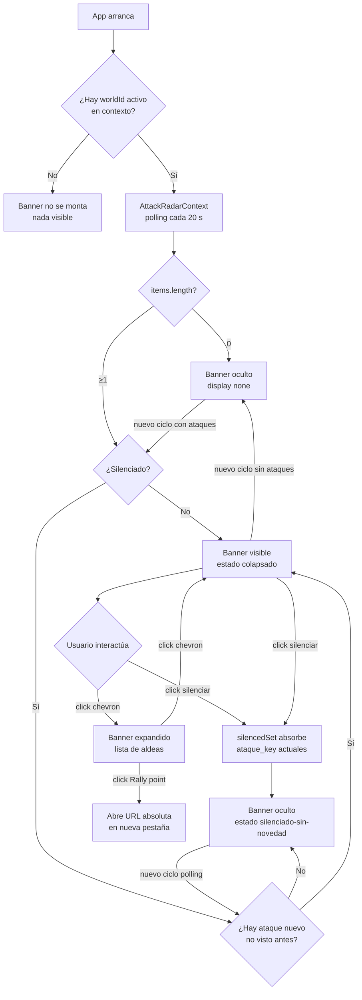

<!--
CHANGELOG
2026-06-07  PO-1, PO-2 y PO-3 cerradas con decisiones explícitas del usuario.
            PO-1: botón silenciar + regla de reaparición por ataque nuevo no visto.
            PO-2: URL absoluta construida desde world.server_url + rally_point_href relativo;
                  tooltip "abre tu navegador", target=_blank+rel=noopener.
            PO-3: Page Visibility API + recálculo inmediato del countdown en visibilitychange.
            Vistas 9 y 10 añadidas al mockup (silenciado-sin-novedad, silenciado-con-novedad).
-->

# Aviso de ataque entrante — banner global persistente

---

## 1. Visión de la experiencia y principios de diseño

El usuario necesita enterarse de un ataque entrante **desde cualquier parte del dashboard**, no solo cuando está en la pestaña del mundo. El diseño debe garantizar que la alerta nunca quede invisible por la pantalla activa.

Principios aplicados (de DESIGN.md):

- **Contenido primero**: la alerta ocupa el mínimo espacio mientras no hay ataques (cero renderizado); cuando los hay, desplaza el contenido con gracia sin taparlo.
- **Menos es más**: una sola señal semántica clara — el rojo `--danger` más el icono `ShieldAlert`, sin capas de ruido.
- **Color solo para estado**: `--danger` es el token exacto del sistema para "error / situación crítica" (DESIGN.md §5). No se inventa un naranja de advertencia.
- **Foco accesible siempre**: la alerta anuncia su aparición vía `aria-live="assertive"` y expone un control de expansión tecleable.
- **Densidad sobre decoración**: la alerta es compacta (barra horizontal de una fila en estado colapsado), nunca un modal o un overlay grande.

---

## 2. Personas y objetivos (jobs-to-be-done)

**Usuario principal:** operador del bot — persona que deja el dashboard abierto mientras gestiona otras pestañas del navegador o hace otras tareas, y necesita reaccionar rápido ante un ataque.

**Job-to-be-done principal:** "Quiero saber en cuántos minutos llega el ataque a cada una de mis aldeas, sin tener que ir a buscar esa información."

**Objetivos secundarios:**
- Saber a qué aldea va el ataque (nombre + coordenadas).
- Navegar rápido al punto de reunión de esa aldea (rally point).
- No perder el contexto de la pantalla en la que estoy (no redirigir forzosamente).

**Lo que NO es el job de este componente:** mostrar quién ataca ni el tipo de operación (esos campos llegan `null` hoy y son de una fase posterior). El diseño los contempla como espacio reservado para cuando lleguen.

---

## 3. Inventario de pantallas / vistas

Este componente no es una pantalla nueva: es un **widget global** que se inserta en las shells existentes. Se comporta de forma idéntica en ambas shells:

| Shell | Ruta(s) | Visibilidad del banner |
|---|---|---|
| ManagementShell | `/cuentas`, `/cuentas/:id`, `/rutas` | Sí — banner justo debajo del Topbar |
| WorldSpace | `/mundos/:id` (todas las pestañas) | Sí — banner justo debajo del Topbar y encima del body |

El banner es **global**: vive en la capa de layout por encima de cualquier contenido de pestaña.

---

## 4. Mapa de navegación



---

## 5. Flujos de usuario clave

### Happy path — ataque detectado

1. El usuario está en cualquier pantalla (ej. `/cuentas`).
2. El contexto global `AttackRadarContext` hace polling cada 20 s a `GET /game/incoming-attacks/{worldId}`.
3. La respuesta devuelve `items` con 1 o más ataques.
4. El banner aparece inmediatamente debajo del Topbar con animación slide-down (`--dur-base`).
5. `aria-live="assertive"` anuncia "N ataques entrantes" al lector de pantalla.
6. El usuario ve la barra colapsada: icono `ShieldAlert` + "2 ataques entrantes" + cuenta atrás del impacto más próximo + botón silenciar (campana).
7. El usuario hace clic en la barra → se expande mostrando una fila por aldea atacada.
8. El usuario hace clic en "Rally point" de una aldea → abre en nueva pestaña con la URL absoluta del servidor de juego. El banner permanece.
9. El polling siguiente confirma que siguen los ataques → el banner se mantiene.
10. El impacto llega (el countdown llega a 00:00:00) → el polling siguiente devuelve esa aldea fuera de la lista → desaparece de las filas; si quedan más, el banner sigue.
11. Cuando `items` llega vacío → el banner desaparece con animación slide-up.

### Alternativo — usuario silencia el banner

1. El usuario hace clic en el icono de campana/silencio del banner (estado colapsado o expandido).
2. El contexto almacena en `silencedSet` las claves únicas de cada ataque activo en ese momento. La clave es `"${village_game_id}:${impact_at_iso}"` (par aldea + momento de impacto).
3. El banner se oculta. Estado: **silenciado-sin-novedad**.
4. El polling sigue ejecutándose en segundo plano (el contexto no se desmonta).
5. En cada ciclo de polling, el contexto compara los `items` recibidos contra `silencedSet`:
   - Si todos los items tienen su clave en `silencedSet` → el banner permanece oculto.
   - Si al menos un item tiene una clave **no presente en `silencedSet`** → el banner reaparece (slide-down) con `aria-live="assertive"`. Estado: **silenciado-pero-llegó-novedad** → pasa a visible normal.
6. Al reaparecer, el banner no tiene "memoria" del silencio anterior: el usuario ve el banner normal y puede silenciarlo de nuevo si quiere.
7. Cuando `items` llega vacío (todos los ataques pasaron) → `silencedSet` se limpia automáticamente; el banner queda oculto por ausencia de ataques (no por silencio).

**Regla de clave de ataque:** `"${village_game_id}:${impact_at_iso}"` donde `impact_at_iso` es el string ISO que devuelve el API (ej. `"342:2026-06-08T09:15:33Z"`). Si el backend en el futuro añade un `attack_id` propio, ese campo reemplaza la clave compuesta.

**Tope temporal del silencio:** no hay tope de tiempo explícito. El silencio expira únicamente por:
- La llegada de un ataque nuevo (clave no vista).
- El fin de todos los ataques (`items` vacío → limpieza del set).

No hay "silenciado durante X minutos": esa opción añade complejidad innecesaria y puede hacer perder de vista un ataque nuevo que llegue pasado ese tiempo.

### Alternativo — múltiples aldeas atacadas simultáneamente

- Si hay ≥ 4 aldeas en la lista, la sección expandida muestra scroll interno (max-height fijo ~200px) para no ocupar media pantalla.

### Alternativo — sin sesión activa para el mundo

- El contexto no tiene `worldId` → el componente no monta ningún polling ni renderiza nada.
- (Si en el futuro hay varios mundos activos: el polling y el banner son por-mundo; esta fase solo contempla uno.)

### Alternativo — error de fetch

- El polling falla (red caída, 500): el banner no aparece ni desaparece. Se mantiene el último estado conocido.
- Si nunca hubo una respuesta exitosa y el primero falla: nada visible (no se muestra error en el banner).
- El error de red se loguea en consola; no se propaga al usuario como toast (el banner no es el lugar para errores de infraestructura).

### Alternativo — campos del atacante ausentes (hoy todos `null`)

- `attacker_name`, `origin_village_name`, `operation_type` están siempre `null` ahora.
- Las filas de aldea no muestran esas columnas (ni placeholder vacío ni "—"). El espacio se reserva para cuando lleguen los datos.
- Cuando en una versión futura lleguen con valor, se añaden bajo el nombre de la aldea sin rediseñar.

---

## 6. Wireframes de baja fidelidad por pantalla

### 6.1 Banner colapsado (1 o más ataques)

```
┌─ Topbar 52px ────────────────────────────────────────────────────────────────┐
│  [TB] TravianBot                                           [🌙] [🌐]          │
├─ AttackRadarBanner (colapsado, 40px) ────────────────────────────────────────┤
│  ⚔  2 ataques entrantes   próximo impacto: 00:42:17 · 09:15:33   [🔕] [∨]  │
├─ Sidebar ──┬─ Contenido principal ────────────────────────────────────────────┤
│            │                                                                  │
│            │                                                                  │
└────────────┴──────────────────────────────────────────────────────────────────┘

Leyenda de la barra (de izquierda a derecha):
  [⚔]        icono ShieldAlert 16px, color var(--danger), aria-hidden
  "N ataques entrantes"  texto 13px/500, color var(--danger)
  [grow]     espacio flexible
  "próximo impacto:"  label 12px, var(--text-secondary)
  Countdown  HH:MM:SS, font-mono 13px/600, tabular-nums, var(--danger)
  "·"        separador en var(--text-disabled)
  ExactTime  hora HH:MM:SS, font-mono 12px, var(--text-secondary)
  [🔕]       botón silenciar 28px, ghost, BellOff icon de Lucide, color var(--danger),
             aria-label "Silenciar avisos de ataque"
             Al hacer clic absorbe todas las claves actuales en silencedSet y oculta el banner.
  [∨]        botón chevron 28px, ghost, expande/colapsa
```

### 6.2 Banner expandido (detalle por aldea)

```
┌─ Topbar 52px ────────────────────────────────────────────────────────────────┐
│  [TB] TravianBot                                           [🌙] [🌐]          │
├─ AttackRadarBanner (expandido) ──────────────────────────────────────────────┤
│  ⚔  2 ataques entrantes   próximo impacto: 00:42:17 · 09:15:33   [🔕] [∧]  │
│  ────────────────────────────────────────────────────────────────────────     │
│  │ Aldea Norte  (45|−12)  2  00:42:17 · 09:15:33  [Rally point ↗]       │   │
│  │ Capital Gala (10|23)   1  01:18:04 · 10:11:20  [Rally point ↗]       │   │
├─ Sidebar ──┬─ Contenido principal ────────────────────────────────────────────┤
│            │                                                                  │
└────────────┴──────────────────────────────────────────────────────────────────┘

Columnas de la lista expandida:
  Nombre de aldea    text 13px/500, var(--text), flex:1
  (x|y) coordenadas  font-mono 12px, var(--text-tertiary), entre paréntesis
  Nº ataques         badge compacto: fondo var(--danger) 10% opacidad, texto var(--danger), 12px
  Countdown          font-mono 13px/600, var(--danger), tabular-nums
  "·" hora exacta    font-mono 12px, var(--text-secondary)
  [Rally point ↗]    <a target="_blank" rel="noopener noreferrer">, botón ghost 12px,
                     var(--accent-text), tooltip visible "Abre en tu navegador".
                     URL = world.server_url + rally_point_href (ver §5 PO-2).

Botón silenciar [🔕]: mismo en colapsado y expandido (mismo control en el header).

Cada fila de aldea: altura 36px, divisor hairline var(--border) entre filas.
Si hay ≥ 4 filas: la zona de lista tiene max-height:144px (4×36px) + overflow-y:auto.
```

### 6.3 Banner silenciado — sin novedad

```
(el banner no existe en el DOM — idéntico al estado "sin ataques")
El polling sigue en segundo plano. Si llega un ataque nuevo, el banner reaparece.
```

### 6.4 Banner silenciado — llega ataque nuevo (reaparece)

```
┌─ Topbar 52px ────────────────────────────────────────────────────────────────┐
│  [TB] TravianBot                                           [🌙] [🌐]          │
├─ AttackRadarBanner (colapsado, reaparece) ────────────────────────────────────┤
│  ⚔  3 ataques entrantes   próximo impacto: 00:12:05 · 08:45:20   [🔕] [∨]  │
├─ Sidebar ──┬─ Contenido principal ────────────────────────────────────────────┤
│            │                                                                  │
└────────────┴──────────────────────────────────────────────────────────────────┘

El banner reaparece con slide-down + aria-live="assertive" cuando el polling detecta
que al menos un item tiene una clave "village_game_id:impact_at_iso" no presente
en el silencedSet. El estado de silencio se ha restablecido: el usuario puede volver
a silenciar si quiere (mismo botón [🔕]).
```

### 6.5 Estado sin ataques

```
(el banner no existe en el DOM — display:none o desmontado)
```

---

## 6b. Mockup editable y layout aprobado

Ruta del mockup: `frontend/mockups/aviso-ataque-entrante.playground.html`

**Mockup generado** (HTML autocontenido, ~2100 líneas). Abrir directamente en el navegador desde el sistema de archivos.

Vistas disponibles en el selector "Vista":
- Vista 1 — Sin ataques: el banner no existe en el DOM (estado nulo)
- Vista 2 — Colapsado 1 ataque: barra 40px, singular, botón silenciar + chevron
- Vista 3 — Colapsado 2 ataques: barra 40px, plural, anatomía de tokens (defecto)
- Vista 4 — Expandido 2 aldeas: tabla con filas Aldea "07" + Capital Gala, Rally point con tooltip, toggle expand/collapse funcional
- Vista 5 — Expandido 4 aldeas: scroll interno activo (max-height 144px = 4×36px)
- Vista 6 — Impacto inminente: countdown con animación `pulse` (≤ 60 s)
- Vista 7 — Campos atacante null: filas sin columnas de atacante + boceto de extensión futura
- Vista 8 — RTL árabe: `dir="rtl"`, chevron y enlace externo espejados, numeración LTR
- Vista 9 — Silenciado sin novedad: banner oculto, nota de estado, polling activo en fondo
- Vista 10 — Silenciado con ataque nuevo: banner reaparece con slide-down, `aria-live` activo

Controles:
- Toggle tema claro/oscuro (persiste en localStorage)
- Selector de idioma (es / en / de / ar) — actualiza labels de vistas 2-7 en tiempo real
- Selector de vista
- Countdown en vivo (tick cada segundo en vistas 3 y 4)
- Botón silenciar funcional en el playground: oculta el banner y simula el estado silenciado
- Modo Editar → drag & drop con imán de 8px → Guardar / Restablecer / Exportar layout (JSON al portapapeles)

**Layout aprobado por el usuario:** pendiente — el usuario abre el playground, recompone los bloques y exporta el JSON para aprobarlo.

---

## 7. Estados de cada pantalla

### 7.1 El banner (único componente de esta feature)

| Estado | Descripción | Visualización |
|---|---|---|
| **Sin datos (inicial)** | La primera petición aún no ha respondido | Nada visible. El banner no se monta. |
| **Sin ataques** | `items` devuelve array vacío | Nada visible. El banner sale del DOM o queda `display:none`. Al llegar a este estado, `silencedSet` se limpia automáticamente. |
| **1 ataque** | Un solo item en `items` | Banner colapsado. Barra dice "1 ataque entrante" (singular i18n). Countdown del único impacto. Botón silenciar visible. |
| **N ataques** | Varios items | Banner colapsado. "N ataques entrantes". Countdown = el `impact_at` más próximo. Botón silenciar visible. |
| **Expandido** | Usuario abrió el detalle | Banner expandido con tabla de aldeas. Botón silenciar sigue visible en el header. |
| **Silenciado — sin novedad** | Usuario pulsó silenciar; todos los ataques tienen clave conocida en `silencedSet` | Banner oculto (idéntico visualmente a "sin ataques"). El polling sigue activo. |
| **Silenciado — ataque nuevo** | Llega un item con clave `village_game_id:impact_at_iso` no registrada en `silencedSet` | Banner reaparece con slide-down + `aria-live="assertive"`. `silencedSet` se descarta (ya no hay silencio activo). El usuario vuelve a ver el banner normal y puede volver a silenciarlo. |
| **Error de fetch** | La petición falla | Último estado conocido permanece (silencioso). Si nunca hubo éxito, nada visible. |
| **Sin worldId activo** | No hay mundo seleccionado (shells sin mundo) | Nada visible. El polling no arranca. |
| **Impacto inminente** | `seconds_remaining` ≤ 60 | El countdown se pone en rojo intenso (`var(--danger)` sin cambio de token, ya es rojo). Opcionalmente pulsa suavemente (solo si `prefers-reduced-motion: no-preference`). |
| **Countdown en cero** | El impacto ya ocurrió pero el polling aún no lo ha quitado | El countdown muestra "00:00:00". En el siguiente ciclo de polling desaparecerá si el endpoint ya no lo lista. |
| **Campo atacante nulo** | `attacker_name` y demás son `null` | No se renderiza esa columna. No hay "—" ni espacio vacío visible. |
| **Campo atacante presente (futuro)** | Cuando lleguen con valor | Se añaden en la fila expandida bajo el nombre de aldea, sin cambio de layout principal. |

---

## 8. Inventario de componentes UI reutilizables

| Componente | Acción | Detalle |
|---|---|---|
| `Countdown` (`world/Countdown.jsx`) | **REUTILIZAR** | Recibe `targetIso`, devuelve HH:MM:SS con `aria-live="off"` y `tabular-nums`. Se usa en el banner colapsado (próximo impacto) y en cada fila de la lista expandida. Para la mitigación de throttling (PO-3), el componente deberá exponer o integrar el recálculo en `visibilitychange` (ver §12). |
| `ExactTime` (`world/Countdown.jsx`) | **REUTILIZAR** | Complemento de Countdown que muestra la hora exacta. Se usa junto al Countdown en colapsado y en filas. |
| Token `--danger` (`styles/tokens.css`) | **REUTILIZAR** | Color semántico de rojo ya definido en claro y oscuro. Es el único color del banner. |
| Icono `ShieldAlert` de `lucide-react` | **REUTILIZAR** | Ya en el bundle. `ShieldAlert` es semánticamente exacto para "alerta de ataque entrante". |
| Icono `BellOff` de `lucide-react` | **REUTILIZAR** | Botón silenciar. Ya en el bundle de Lucide. Mostrar cuando el banner está visible (el usuario puede silenciar). |
| `useI18n()` + catálogos `frontend/src/i18n/catalog/` | **REUTILIZAR** | Claves nuevas bajo namespace `radar.*` (ver §9). |
| `api.request()` / `buildHeaders()` (`api/client.js`) | **REUTILIZAR** | Añadir método `api.getIncomingAttacks(worldId)` — 1 línea que llama a `GET /game/incoming-attacks/{worldId}`. |
| **`AttackRadarContext`** (nuevo) | **CREAR** | Contexto React global que gestiona el polling, el estado de ataques, el `worldId` activo y el `silencedSet`. Expondrá `{ attacks, worldId, setWorldId, silence }`. La función `silence()` absorbe las claves actuales en el set. |
| **`AttackRadarBanner`** (nuevo) | **CREAR** | Componente de presentación. Recibe `attacks[]` desde el contexto. Gestiona colapsado/expandido localmente. Contiene el botón silenciar (llama a `silence()` del contexto). |
| **`AttackRadarProvider`** (nuevo) | **CREAR** | Wrapper del contexto que se monta a nivel de router/App (por encima de las shells). Acepta prop `worldId` o lo lee del contexto de ruta. Gestiona el `setInterval` de polling y el listener de `visibilitychange`. |

---

## 9. Contenido y microcopy

Todas las cadenas van en el namespace `radar.*` de los catálogos i18n (25 idiomas). El desarrollador-ux-ui las añadirá; aquí se documenta el valor de referencia en español.

| Clave | Español | Notas |
|---|---|---|
| `radar.attacks_one` | "1 ataque entrante" | Singular |
| `radar.attacks_other` | "{{count}} ataques entrantes" | Plural con interpolación |
| `radar.next_impact` | "próximo impacto:" | Label antes del countdown |
| `radar.rally_point` | "Rally point" | CTA de cada fila (inglés técnico del juego, igual en todos los idiomas). No traducir. |
| `radar.rally_point_tooltip` | "Abre en tu navegador" | Tooltip visible sobre el enlace "Rally point". Indica al usuario que abre el navegador normal (sesión humana), no el Chrome del bot. 12px, `--text-tertiary`, aparece en hover sobre el enlace. |
| `radar.rally_point_aria` | "Abrir rally point de {{village}}" | aria-label del enlace, incluye el nombre de la aldea para el lector de pantalla. |
| `radar.no_attacker` | (vacío / no renderizado) | Cuando los campos de atacante son null, no se muestra texto |
| `radar.expand_label` | "Expandir ataques entrantes" | aria-label del botón chevron cuando está colapsado |
| `radar.collapse_label` | "Colapsar ataques entrantes" | aria-label del botón chevron cuando está expandido |
| `radar.silence_label` | "Silenciar avisos de ataque" | aria-label del botón silenciar (BellOff). Oculta el banner hasta que llegue un ataque nuevo. |
| `radar.village_attacks_one` | "1 ataque" | Badge en fila de aldea, singular |
| `radar.village_attacks_other` | "{{count}} ataques" | Badge en fila de aldea, plural |

**Formato de coordenadas:** `(x|y)` — con pipe `|` como separador, en font-mono. Ejemplo: `(45|−12)`. No localizar el separador.

**El "Rally point" es intencional en inglés**: es terminología del juego Travian, igual en todas las interfaces del juego. No traducir.

**Tooltip del Rally point — aclaración UX:** el texto "Abre en tu navegador" existe para que el usuario entienda que el enlace abre el navegador normal del sistema (donde tiene su sesión humana de Travian), no el Chrome controlado por el bot. Sin este tooltip el usuario podría confundirse y creer que el bot abrirá el juego en el Chrome automatizado.

---

## 10. Accesibilidad

| Requisito | Implementación |
|---|---|
| Anuncio de aparición | El contenedor raíz del banner lleva `aria-live="assertive"` + `aria-atomic="false"`. Cuando aparece (pasa de vacío a con-ataques), el texto del resumen ("N ataques entrantes") es anunciado inmediatamente. |
| Countdown sin spam | Cada `<Countdown>` individual lleva `aria-live="off"` (ya implementado en el componente). El lector de pantalla no anuncia cada segundo. |
| Botón chevron | `<button>` con `aria-expanded={isExpanded}` + `aria-label` dinámico (expandir/colapsar). |
| Filas de aldea | `role="list"` + `role="listitem"` en la lista expandida. |
| Rally point | `<a target="_blank" rel="noopener noreferrer">` con `aria-label` que incluye el nombre de la aldea: "Abrir rally point de [nombre aldea]". |
| Contraste | `--danger` claro (#C9352C) sobre `--surface` (#FFFFFF): contraste ~5.5:1 (AA cumplido). `--danger` oscuro (#FF453A) sobre `--surface` oscuro (#2C2C2E): contraste ~4.8:1 (AA cumplido). |
| Foco teclado | El botón chevron y cada enlace "Rally point" reciben foco con `outline: 2px solid var(--accent); outline-offset: 2px` (patrón del sistema). |
| Reduced motion | El slide-down/up de aparición del banner respeta `@media (prefers-reduced-motion: reduce)`: si está activo, la aparición es instantánea (sin transición). El pulso en "impacto inminente" también se desactiva. |
| Sin solo-color | El icono `ShieldAlert` + el texto "N ataques" son la señal primaria. El rojo refuerza, no es la única señal. |

---

## 11. Responsive / adaptación a dispositivos

El banner es **P1** (DESIGN.md §17.3): nunca se oculta ni colapsa en móvil. La información es crítica.

| Breakpoint | Comportamiento |
|---|---|
| `< md` (< 768px, móvil) | Banner colapsado por defecto y **siempre visible**. En estado expandido, la lista de aldeas ocupa el ancho completo; las columnas menos importantes (coordenadas, hora exacta) pasan a `display:none` o se colapsan debajo del nombre. Botón "Rally point" sigue presente (P1). Altura de fila de aldea sube a 44px (target táctil mínimo Apple). |
| `md` (768–1023px, tablet) | Igual que desktop pero el área de lista expandida puede ser más compacta. |
| `≥ lg` (≥ 1024px, desktop) | Comportamiento completo descrito en §6. |

**Columnas de la lista expandida por prioridad:**

| Columna | Prioridad | Móvil |
|---|---|---|
| Nombre de aldea | P1 | Siempre visible |
| Nº de ataques | P1 | Siempre visible |
| Countdown | P1 | Siempre visible |
| Rally point | P1 | Siempre visible |
| Coordenadas (x\|y) | P2 | Oculto en móvil, visible en ≥ md |
| Hora exacta (ExactTime) | P2 | Oculto en móvil, visible en ≥ md |

**RTL (ar, he, fa):** el banner usa propiedades lógicas CSS (`padding-inline`, `inset-inline-end`, `margin-inline-start`). El chevron se espeja (es un icono direccional). El layout se invierte correctamente.

**Expansión de texto (de, ru):** las claves `radar.attacks_other` y `radar.next_impact` pueden crecer ~30-35% en alemán. La barra colapsada no tiene ancho fijo en el texto: el texto crece y el countdown se mantiene con `flex-shrink:0` a la derecha.

---

## 12. Interacciones y feedback

| Interacción | Feedback |
|---|---|
| **Aparición del banner** | Slide-down desde altura 0 → altura completa, `transition: height var(--dur-base) var(--ease)` (o `max-height` trick con overflow hidden). `aria-live="assertive"` anuncia el texto. |
| **Desaparición del banner** | Slide-up inverso. Si el usuario tenía el banner expandido y llega una respuesta sin ataques, se contrae primero y luego desaparece. |
| **Click en chevron (expandir)** | La zona de lista aparece con `transition: max-height var(--dur-base) var(--ease)`. El chevron rota 180°. |
| **Click en chevron (colapsar)** | Inverso al anterior. |
| **Hover sobre fila de aldea** | Fondo de fila → `var(--surface-2)`. Transición `var(--dur-fast)`. |
| **Click en "Rally point"** | Abre URL absoluta (`world.server_url + rally_point_href`) en `target="_blank" rel="noopener noreferrer"`. Tooltip "Abre en tu navegador" visible en hover (ver §9). Sin confirmación. No cierra ni colapsa el banner. |
| **Click en silenciar (BellOff)** | El banner desaparece con slide-up. El contexto guarda `silencedSet` con las claves de todos los ataques actuales. El polling sigue corriendo. Sin toast ni confirmación visual (el propio desvanecimiento del banner es el feedback). |
| **Polling — ataque nuevo tras silencio** | El banner reaparece con slide-down + `aria-live="assertive"`. El `silencedSet` se descarta. El usuario puede volver a silenciar. |
| **Polling — nuevos ataques (sin silencio)** | Si ya existía el banner y se añade una aldea nueva, la lista se actualiza silenciosamente (sin colapsar ni reanimar el banner). |
| **Countdown llega a 00:00:00** | Sin animación especial. En el siguiente ciclo de polling, si el endpoint ya no lista esa aldea, la fila desaparece. |
| **Estado "impacto inminente"** | Cuando `seconds_remaining ≤ 60`, el countdown de esa fila puede pulsar suavemente (opacity 1 → 0.6 → 1, 2s loop), solo si `prefers-reduced-motion: no-preference`. |

### 12.1 URL del Rally point (PO-2)

El frontend construye la URL absoluta del punto de reunión de esta forma:

```
URL_final = world.server_url.trimEnd('/') + rally_point_href
```

- `world.server_url`: URL base del servidor del mundo (ej. `"https://tx3.travian.com"`). Se obtiene del objeto `world` que ya se usa en `WorldSpacePage` y `WorldContext`. **Dependencia del ux-ui:** verificar que el campo `server_url` (o equivalente) exista en el endpoint `GET /worlds/{worldId}` o en el contexto de mundo activo. Si no existe hoy, declararlo como dato requerido para el ux-ui que implemente.
- `rally_point_href`: valor relativo devuelto por el API de ataques (ej. `"/build.php?gid=16&tt=1&newdid=342"`). Es un path relativo al dominio del servidor.
- Ejemplo de URL resultante: `"https://tx3.travian.com/build.php?gid=16&tt=1&newdid=342"`.
- El enlace siempre lleva `target="_blank"` + `rel="noopener noreferrer"` para abrir en el navegador normal del usuario (sesión humana de Travian, no el Chrome del bot).

### 12.2 Throttling de segundo plano — Page Visibility API (PO-3)

Chrome ralentiza los `setInterval` a ~1 req/min cuando el tab está en segundo plano. Para que el countdown sea exacto al volver al foco:

**Mecanismo:**

```
AttackRadarProvider:
  useEffect(() => {
    const handleVisibility = () => {
      if (document.visibilityState === 'visible') {
        forceTick();   // recalcula todos los countdowns desde sus targetIso inmediatamente
        poll();        // dispara un ciclo de polling para actualizar la lista de ataques
      }
    };
    document.addEventListener('visibilitychange', handleVisibility);
    return () => document.removeEventListener('visibilitychange', handleVisibility);
  }, []);
```

- `forceTick()` no es una función real del `Countdown` existente sino una señal que el Provider emite (ej. actualizando un contador `refreshKey` en el contexto) para que cada instancia de `Countdown` recalcule `now - targetIso` inmediatamente.
- El componente `Countdown` ya calcula el delta desde el ISO objetivo en cada tick (no acumula segundos), por lo que en cuanto se le fuerce un nuevo render el valor será exacto.
- El `poll()` inmediato al reenfocar asegura que la lista de ataques también esté actualizada (puede que un ataque haya pasado o llegado uno nuevo mientras el tab estaba al fondo).
- **Lo que NO cambia:** el `setInterval` interno de 20 s sigue igual; solo se añade el listener de `visibilitychange` al Provider. El componente `Countdown` no necesita modificarse si el Provider gestiona el `refreshKey`.
- **Resultado UX:** el usuario alterna de pestaña durante 5 minutos, vuelve, y el countdown muestra el tiempo real exacto en lugar del acumulado por el setInterval throttleado.

---

## 13. Decisión de diseño — Slot elegido: B (global en el layout)

### Razonamiento

El usuario recalcó que quiere ver el aviso **desde cualquier parte del dashboard**. Los tres slots evaluados:

**Slot A — dentro de `WorldSpacePage`**
- Ventaja: `worldId` ya disponible, cero complejidad de contexto.
- Desventaja decisiva: solo es visible cuando el usuario está en `/mundos/:id`. Si está en `/cuentas` o `/rutas`, no ve el aviso. Esto contradice directamente la intención del usuario.

**Slot B — global por encima de las dos shells (ELEGIDO)**
- Ventaja: visible desde cualquier pantalla, exactamente lo que pide el usuario.
- Trade-off: requiere un `AttackRadarContext` global que gestione el `worldId` activo y el polling. Esto es complejidad añadida pero moderada (patrón ya conocido en el proyecto: `useEffect` + `setInterval`).
- El `worldId` activo se puede leer del parámetro de ruta con React Router's `useParams` dentro del Provider, o pasarse explícitamente desde `App.jsx`.
- Implementación: el `AttackRadarProvider` se monta en `App.jsx` (o en el componente raíz del router), por encima de `ManagementShell` y `WorldSpacePage`. El banner se renderiza como hijo inmediato del topbar o como segundo elemento del layout de cada shell.

**Slot C — extender `AgentBottomBar`**
- Desventaja: rompe la semántica de la barra inferior (es para tareas del bot, no para alertas de juego). Los ataques son urgencia del jugador, no del agente. Mezclarlos confunde. Descartado.

### Arquitectura del Slot B

```
App.jsx
└── AttackRadarProvider (worldId activo, polling, estado de ataques)
    ├── Router
    │   ├── ManagementShell
    │   │   ├── Topbar
    │   │   ├── AttackRadarBanner  ← aquí, dentro de cada shell
    │   │   └── Outlet
    │   └── WorldSpacePage
    │       ├── (su propio topbar inline)
    │       ├── AttackRadarBanner  ← aquí también
    │       └── (sidebar + contenido)
```

Alternativamente, si se quiere un único punto de montaje, el banner puede ser `position: fixed; top: var(--topbar-h); left: 0; right: 0; z-index: 100` — así flota sobre cualquier shell sin necesitar inserción en cada una. Esta variante evita duplicar el `<AttackRadarBanner />` en ambas shells.

**Recomendación de implementación: variante `position: fixed`** — más simple, un solo punto de montaje en `App.jsx`, compatible con ambas shells sin tocarlas. El contenido de las shells ya tiene `padding-top` o el banner empuja visualmente con su height real. El desarrollador-ux-ui decidirá el detalle de integración.

### ¿Cuándo arranca el polling?

- El polling solo tiene sentido cuando hay un `worldId` activo (el usuario está operando un mundo).
- Si el usuario está en `/cuentas` sin un mundo seleccionado, el polling no arranca.
- Cuando el usuario navega a `/mundos/:id`, el Provider detecta el `worldId` (del parámetro de ruta o pasado por prop) y arranca el polling.
- Cuando el usuario navega fuera de `/mundos/:id`, el polling se detiene y el banner desaparece.

---

## 14. Criterios de aceptación de diseño

**Banner — estados base**
- [ ] El banner no es visible en ningún estado cuando no hay ataques activos.
- [ ] El banner aparece (slide-down) en el primer ciclo de polling que devuelve ≥ 1 ataque, desde cualquier pantalla del dashboard.
- [ ] El banner muestra correctamente: icono ShieldAlert, "N ataques entrantes" (singular/plural), countdown al impacto más próximo, hora exacta, botón silenciar (BellOff) y botón chevron.
- [ ] El countdown se actualiza en tiempo real (cada segundo) usando el componente `Countdown` existente.
- [ ] Al expandir, cada aldea muestra: nombre, coordenadas, badge de nº de ataques, countdown propio, hora exacta y enlace "Rally point" con tooltip "Abre en tu navegador".
- [ ] Ningún campo `null` (attacker, origin, operation) genera texto vacío ni placeholder visible.
- [ ] Con ≥ 4 aldeas, la zona expandida tiene scroll interno (max-height ~144px).
- [ ] El banner permanece visible al navegar entre pestañas dentro de WorldSpace y al cambiar entre shells.

**Silenciar (PO-1)**
- [ ] El botón silenciar (BellOff) es visible en el header del banner tanto en estado colapsado como expandido.
- [ ] Al pulsar silenciar, el banner desaparece (slide-up) y el `silencedSet` absorbe las claves `"${village_game_id}:${impact_at_iso}"` de todos los ataques activos en ese momento.
- [ ] Mientras todos los ataques tienen clave conocida en `silencedSet`, el banner permanece oculto aunque el polling devuelva ataques.
- [ ] Si el polling devuelve al menos un item con clave **no presente** en `silencedSet`, el banner reaparece (slide-down) con `aria-live="assertive"`, descartando el silencio anterior.
- [ ] Cuando `items` llega vacío, `silencedSet` se limpia automáticamente.
- [ ] El botón silenciar tiene `aria-label="Silenciar avisos de ataque"`.

**Rally point (PO-2)**
- [ ] El enlace "Rally point" construye la URL absoluta como `world.server_url + rally_point_href` (relativo).
- [ ] El enlace abre en `target="_blank" rel="noopener noreferrer"`.
- [ ] El tooltip "Abre en tu navegador" es visible en hover sobre el enlace.
- [ ] El `aria-label` del enlace incluye el nombre de la aldea: "Abrir rally point de [nombre]".

**Throttling / Page Visibility (PO-3)**
- [ ] Al volver al foco del tab (`visibilitychange → visible`), todos los countdowns se recalculan inmediatamente desde el `targetIso`, sin esperar al siguiente tick del `setInterval`.
- [ ] Al reenfocar el tab, se dispara un ciclo de polling adicional para actualizar la lista de ataques.
- [ ] El comportamiento del countdown es exacto aunque el tab haya estado 5+ minutos en segundo plano.

**Accesibilidad y sistema de diseño**
- [ ] `aria-live="assertive"` anuncia la aparición del banner (y su reaparición tras silencio).
- [ ] Cada `Countdown` tiene `aria-live="off"` (sin spam al lector de pantalla).
- [ ] El botón chevron tiene `aria-expanded` correcto y `aria-label` dinámico.
- [ ] En móvil (< md): coordenadas y hora exacta se ocultan; nombre, nº ataques, countdown y rally point permanecen visibles.
- [ ] El banner respeta modo claro y oscuro usando solo tokens (`--danger`, `--surface`, `--border`).
- [ ] RTL: el banner y sus propiedades se espejan correctamente con `ar`, `he`, `fa`.
- [ ] Con idioma alemán (`de`): el texto del banner no se corta ni desborda.
- [ ] `prefers-reduced-motion: reduce`: la aparición del banner es instantánea (sin transición).
- [ ] Solo se usa el token `--danger` para el color de alerta.
- [ ] El polling se detiene cuando no hay `worldId` activo; no se hacen peticiones innecesarias.

---

## 15. Preguntas abiertas (CERRADAS)

Todas las preguntas abiertas de la sesión anterior han sido resueltas por el usuario el 2026-06-07. No quedan POs pendientes para este spec.

**PO-1 — CERRADA: SÍ, hay botón silenciar.**
Diseño: icono BellOff en el header del banner (visible en colapsado y expandido). El criterio de reaparición es la llegada de un ataque con clave `"${village_game_id}:${impact_at_iso}"` no vista antes. Sin tope temporal. Ver §5 (flujo alternativo — silenciar), §7 (estados silenciado), §14 (criterios).

**PO-2 — CERRADA: URL absoluta construida en el frontend.**
`URL = world.server_url + rally_point_href`. El enlace abre en nueva pestaña con tooltip "Abre en tu navegador" (sesión humana, no el bot). Ver §12.1.

**PO-3 — CERRADA: Page Visibility API + recálculo inmediato.**
Al reenfocar el tab, el Provider emite un `refreshKey` que fuerza recálculo inmediato de los countdowns y dispara un poll adicional. Ver §12.2.

---

## 16. Trazabilidad

| Decisión de diseño | Origen |
|---|---|
| Banner global (Slot B) | Intención explícita del usuario: "enterarse del ataque desde cualquier parte del dashboard". |
| `position: fixed; top: var(--topbar-h)` | Simplifica el montaje a un único punto en App.jsx sin tocar ManagementShell ni WorldSpacePage. |
| Token `--danger` para el color | DESIGN.md §5: rojo semántico para "error / detenido". No naranja (no existe en el sistema). Instrucción de palantir. |
| Icono `ShieldAlert` (Lucide) | DESIGN.md §11: un único set de iconos de línea fina (Lucide, ya en el bundle). Semántica: alerta de defensa, más preciso que Swords. |
| Icono `BellOff` para silenciar (Lucide) | PO-1 cerrada: el usuario quiere poder silenciar. BellOff es el icono semántico estándar para "silenciar notificación". Ya en el bundle de Lucide. |
| `Countdown` y `ExactTime` reutilizados | Confirmado por palantir. El componente ya maneja `aria-live="off"`, `tabular-nums` y el caso `null`. |
| Polling cada 20 s | Equilibrio entre frescura de datos y carga al backend. Los ataques en Travian son visibles con minutos de antelación; 20 s es suficiente para ser "en tiempo real" sin ser agresivo. |
| Banner colapsado por defecto | DESIGN.md §1 — "Menos es más": la información de resumen es suficiente para el primer vistazo; el detalle es voluntario. Evita que la barra de alarma ocupe demasiado espacio de forma permanente. |
| Silenciar — clave compuesta `village_game_id:impact_at_iso` | PO-1 cerrada. La clave identifica un ataque concreto (aldea + momento de impacto). Un ataque nuevo a la misma aldea tendrá distinto `impact_at_iso`, por lo que el silencio no "absorberá" la novedad. Sin tope temporal (solo por novedad o fin de ataques). |
| Silenciar — sin toast ni confirmación visual | El desvanecimiento del banner es el feedback suficiente. Un toast añadiría ruido en una acción deliberada del usuario. Principio "Menos es más". |
| URL absoluta Rally point = world.server_url + rally_point_href | PO-2 cerrada: el usuario quiere abrir el rally point en su navegador normal (sesión humana). La URL relativa necesita la base del servidor. `world.server_url` es el campo disponible en el contexto de mundo. |
| Tooltip "Abre en tu navegador" | PO-2 cerrada: evitar que el usuario confunda el enlace con una acción del bot. Es información crítica de seguridad UX dado el contexto dual (navegador bot + navegador humano). |
| Page Visibility API + `refreshKey` | PO-3 cerrada: el usuario quiere countdowns exactos al reenfocar. La solución más simple sin WebSocket: listener `visibilitychange` en el Provider que emite `refreshKey` y dispara un poll adicional. El componente `Countdown` ya calcula desde ISO, solo necesita un nuevo render. |
| Sin mostrar campos `null` | DESIGN.md §1 — "Menos es más": mostrar campos vacíos degrada la señal. El espacio de atacante se introduce cuando el dato sea real. |
| `aria-live="assertive"` | Accesibilidad: un ataque es una alerta de alta prioridad que el lector de pantalla debe anunciar de inmediato, interrumpiendo si es necesario. También se usa cuando el banner reaparece tras un silencio por ataque nuevo. |
| Scroll interno en ≥ 4 aldeas | Evita que el banner expanda hasta la mitad de la pantalla en casos extremos. 4×36px = 144px es un límite razonable. |
| RTL con propiedades lógicas | DESIGN.md §16.2: obligatorio en todo componente. |
| P1 en móvil | DESIGN.md §17.3: alertas críticas son siempre P1. |
| `api.getIncomingAttacks(worldId)` nuevo | Palantir confirmó que no existe. 1 línea en `client.js`. |
| `AttackRadarContext` nuevo | No existe patrón de contexto global de ataques. Necesario para la visibilidad cross-shell. Ahora también gestiona `silencedSet` y el listener `visibilitychange`. |
| `attack-reports/` NO importado | Instrucción explícita de palantir: dominio distinto (POST-combate vs PRE-combate). |
