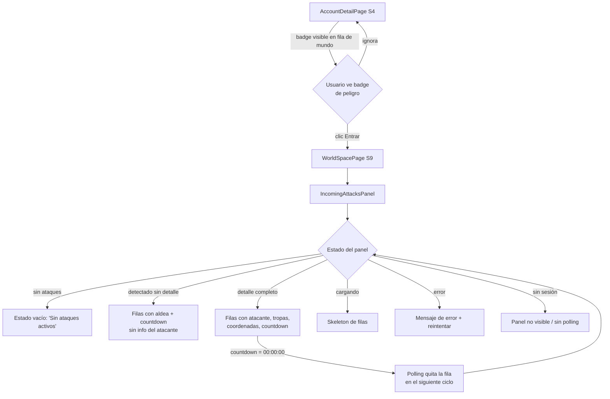

<!--
CHANGELOG
2026-06-07  Spec inicial. Diseño de dos niveles:
            Nivel 1 — badge de peligro en la fila/tarjeta de mundo (AccountDetailPage).
            Nivel 2 — panel IncomingAttacksPanel dentro de WorldSpacePage (nueva pestaña
            "Ataques" o sección expandible bajo el worldheader).
            Dependencia de backend flaggeada: endpoint agregado para badgear varios mundos.

2026-06-07  Cierre de preguntas abiertas PA-1 / PA-2 / PA-3 (respuestas del usuario):
            PA-1 → CERRADA: Nivel 2 vive en la PESTAÑA "Ataques" del sidebar de
                   WorldSpacePage (patrón idéntico a Agentes / Farm Lists / Sesión /
                   Ruido). La pestaña lleva badge de conteo (número rojo) en el nav
                   item cuando hay ataques activos, igual que los demás items con estado.
            PA-2 → CERRADA: endpoint AGREGADO `GET /game/incoming-attacks/summary`
                   (`[{world_id, attack_count}]`) disponible y asumido.
                   El frontend lo usa para el badge de Nivel 1 en AccountDetailPage
                   con una sola petición para todos los mundos.
            PA-3 → CERRADA: `tribe` llega como CLAVE (`gauls`/`romans`/…) y el
                   frontend localiza con `t("tribe.<key>")`. AttackRow llama a
                   `t(\`tribe.${attack.attacker_tribe}\`)`.
            Mockup editable generado: frontend/mockups/aviso-ataque-mundos.playground.html
            Gate humano: pendiente aprobación del usuario sobre el mockup.

2026-06-07b Añadido campo `distance` (Distancia) en la ficha del atacante (Nivel 2,
            detalle completo). El backend (`VillageProfileParser`) ya captura el valor
            como `distance: float` ("7.62 fields"). Se muestra en la misma línea de
            meta del atacante, junto a Pob., como "Dist. 7,62 campos".
            Clave i18n añadida: `radar.attack.distance` (es/en/ar).
            Mockup actualizado: vistas 7, 8, 9.
-->

# Aviso de ataques — badge en lista de mundos + panel de detalle en WorldSpace

---

## 1. Visión de la experiencia y principios de diseño

El usuario gestiona uno o varios mundos desde `AccountDetailPage`. Si abandona el
espacio de un mundo concreto (vuelve a la lista), necesita saber **de un vistazo**
qué mundo está bajo ataque sin tener que entrar a cada uno. Dentro del mundo, necesita
el **detalle operativo** completo: qué aldeas propias reciben el ataque, quién ataca,
con qué tropas y cuándo llega.

El diseño anterior (banner global fijo) quedó descartado por el usuario. El nuevo
enfoque es **contextual y en dos niveles**:

- **Nivel 1 — señal pasiva**: badge `--danger` en la fila/tarjeta del mundo atacado
  dentro de `AccountDetailPage`. Informa sin interrumpir; el usuario lo ve cuando ya
  está mirando la lista.
- **Nivel 2 — detalle activo**: panel de ataques dentro de `WorldSpacePage`. Se
  accede al entrar al mundo. Muestra aldeas propias atacadas y, por cada ataque, la
  ficha del atacante.

Principios aplicados (de `frontend/DESIGN.md`):

- **Contenido primero**: el badge no roba protagonismo a la fila; es un marcador
  semántico pequeño, nunca una barra de alarma. Dentro del mundo el panel es la
  fuente de verdad; no compite con el resto de pestañas.
- **Menos es más**: un solo token `--danger` (rojo), un solo icono `ShieldAlert`.
  No se inventa un naranja de "advertencia media".
- **Color solo para estado**: `--danger` existe en el sistema para exactamente este
  caso (DESIGN.md §5). Se usa con icono para no depender solo del color.
- **Divulgación progresiva**: el badge del Nivel 1 no da detalle; el detalle exige
  entrar al mundo (Nivel 2). Esta separación evita sobrecargar la lista de mundos.
- **Densidad sobre decoración**: tanto el badge como el panel siguen el patrón denso
  del dashboard (filas 40 px, tablas compactas, sin adornos).

---

## 2. Personas y objetivos (jobs-to-be-done)

**Persona única: el Operador** — el mismo jugador que gestiona el bot, técnico o
semi-técnico, usa el dashboard principalmente en desktop. Puede tener varios mundos
activos simultáneamente.

### Jobs-to-be-done

| Job | Pantalla | Contexto |
|---|---|---|
| "Quiero ver, sin entrar a cada mundo, si alguno está siendo atacado ahora mismo" | `AccountDetailPage` (Nivel 1) | El operador tiene varios mundos y hace una revisión rápida de la lista. |
| "Quiero saber cuáles de mis aldeas están siendo atacadas y cuándo llegan los ataques" | `WorldSpacePage` (Nivel 2) | El operador está ya dentro del mundo atacado y necesita decidir si defender. |
| "Quiero ver quién me ataca, con qué tropas y desde qué aldea" | `WorldSpacePage` (Nivel 2) | Decidir si vale la pena cancelar tropas en misión o preparar defensa. |
| "Quiero entrar al mundo atacado desde la lista lo antes posible" | `AccountDetailPage` (Nivel 1) | El operador ve el badge y hace clic en "Entrar" para ir al mundo. |

**Lo que NO es el job de este diseño**:
- Mostrar ataques de mundos sin sesión activa (sin sesión no hay polling).
- Reemplazar el panel de historial de reportes de ataque (eso es post-combate).
- Mostrar ataques de oasis ni a aldeas aliadas (solo aldeas propias del jugador).

---

## 3. Inventario de pantallas / vistas

| ID | Nombre | Ruta | Descripción |
|---|---|---|---|
| S4 | Detalle de cuenta | `/cuentas/:id` | Lista de mundos de la cuenta. Aquí vive el Nivel 1: badge en cada mundo bajo ataque. |
| S9 | Espacio del mundo | `/mundos/:id` | Shell de gestión del mundo. Aquí vive el Nivel 2: panel de ataques entrantes. |

No se crean rutas nuevas. El badge (S4) y el panel (S9) son componentes que se
insertan dentro de las páginas ya existentes.

---

## 4. Mapa de navegación



---

## 5. Flujos de usuario clave

### 5.1 Happy path — operador ve badge y entra al mundo

1. El operador abre `AccountDetailPage` (`/cuentas/:id`).
2. La lista de mundos se renderiza. Para cada mundo con sesión activa, el frontend
   consulta los ataques (ver §8 — dependencia de endpoint).
3. El mundo "tx3 · Romanos" tiene 2 ataques detectados: su fila muestra el badge
   `ShieldAlert + "2"` en el área de nombre/estado de la fila.
4. El operador hace clic en "Entrar" para ese mundo → navega a `/mundos/:worldId`.
5. `WorldSpacePage` se monta. El panel `IncomingAttacksPanel` hace polling a
   `GET /game/incoming-attacks/{worldId}` cada 20 s.
6. El panel muestra la lista de aldeas propias atacadas con countdown y detalle del
   atacante (si disponible).
7. El operador decide su respuesta. Puede cambiar de pestaña (Agentes, Farm Lists)
   mientras el panel permanece visible en su posición (ver §6.2).

### 5.2 Alternativo — detalle del atacante no disponible aún (fase C/D en curso)

1. El panel recibe ataques de la API con `attacker_name: null`, `troops: null`, etc.
2. Cada fila de ataque muestra: aldea propia atacada + countdown + hora exacta.
3. Bajo el nombre de la aldea aparece un badge compacto gris: "Detectado · sin detalle".
4. No aparecen columnas de atacante, tropas ni coordenadas origen. El espacio queda limpio.
5. Cuando el backend rellene esos campos, el siguiente ciclo de polling los mostrará
   automáticamente sin rediseño.

### 5.3 Alternativo — múltiples aldeas atacadas

- Si hay ≥ 4 aldeas atacadas, el panel tiene scroll interno (max-height fijado).
- El contador del badge en S4 refleja el total de ataques (no aldeas): si una aldea
  recibe 2 ataques y otra 1, el badge muestra "3".

### 5.4 Alternativo — mundo sin sesión activa

- El badge de S4 NO aparece en mundos sin sesión activa (sin sesión no hay radar).
- El panel de S9 NO hace polling si no hay sesión activa; muestra estado "sin sesión"
  (ver §7 estados del panel).

### 5.5 Alternativo — error de fetch

- Badge S4: si la consulta de ataques de un mundo falla, ese mundo no muestra badge
  (falla silenciosa; no se degrada la UI de la fila).
- Panel S9: si el polling falla, se mantiene el último estado conocido. Si nunca hubo
  respuesta exitosa, el panel muestra el estado de error con CTA "Reintentar".

### 5.6 Alternativo — ataque con countdown en cero

- El countdown llega a `00:00:00`. La fila permanece hasta que el siguiente ciclo
  de polling confirme que el ataque ya no está en la lista. Esto evita que las filas
  parpadeen al límite de la detección.

---

## 6. Wireframes de baja fidelidad

### 6.1 Nivel 1 — Badge de peligro en fila de mundo (AccountDetailPage)

La tabla de mundos de `AccountDetailPage` ya tiene estas columnas:
`URL completa | Servidor (parsed) | Tribu | Sesión | Acciones`

El badge se inserta en la celda de **Sesión** o inmediatamente a la izquierda de los
botones de Acciones, según exista espacio. La recomendación es añadirlo **junto al
`SessionStatusBadge`** existente, en la misma celda `Sesión`, como elemento adyacente:

```
Desktop (≥ md) — fila de mundo CON ataque:
┌──────────────────┬───────────────┬──────────┬───────────────────────────────────┬──────────────────┐
│ tx3.travian.com  │ tx3           │ Romanos  │ • Activo  ⚔ 2                     │ [Entrar] [Parar] │
│ (P2, oculta<md) │ (P1)          │ (P1)     │ (SessionBadge)(AttackBadge)        │ [⋯]              │
└──────────────────┴───────────────┴──────────┴───────────────────────────────────┴──────────────────┘

Desktop (≥ md) — fila de mundo SIN ataque:
┌──────────────────┬───────────────┬──────────┬───────────────┬──────────────────┐
│ tx3.travian.com  │ tx3           │ Romanos  │ • Activo      │ [Entrar] [Parar] │
│                  │               │          │               │ [⋯]              │
└──────────────────┴───────────────┴──────────┴───────────────┴──────────────────┘
```

**Anatomía del AttackBadge (Nivel 1):**

```
⚔ N
│ │
│ └─ número de ataques (font-mono, 11px, var(--danger))
└─── icono ShieldAlert 12px, var(--danger), aria-hidden

Contenedor: inline-flex, gap 3px, items-center
Fondo: color-mix(in srgb, var(--danger) 10%, transparent)
Border: 1px solid color-mix(in srgb, var(--danger) 25%, transparent)
Padding: 2px 6px
Radius: var(--radius-full)
aria-label: "N ataques entrantes en este mundo"
```

El badge completo mide aproximadamente 40 px de ancho (icono + número de 1-2 dígitos).
Cuando el contador supera 9 se muestra igualmente el número (nunca "9+"; Travian raramente
tiene más de 5 ataques simultáneos sobre el mismo mundo).

**Tarjeta móvil (< md):**

En el diseño de tarjeta, el `AttackBadge` aparece bajo el nombre del servidor,
a la derecha del `SessionStatusBadge`, en la misma línea secundaria. Prioridad P1
(nunca se oculta en móvil).

```
Móvil — tarjeta de mundo CON ataque:
┌──────────────────────────────────────────────────┐
│ tx3  (font-mono, oro)                            │
│ Romanos · • Activo  ⚔ 2                         │ ← línea secundaria
│                        [Entrar]   [Parar]   [⋯] │
└──────────────────────────────────────────────────┘
```

### 6.2 Nivel 2 — IncomingAttacksPanel en WorldSpacePage

**PA-1 cerrada por el usuario: pestaña "Ataques" en el sidebar de WorldSpacePage.**

La ubicación es una pestaña del sidebar, siguiendo el patrón idéntico a Agentes,
Farm Lists, Sesión y Ruido. El item del sidebar lleva un badge de conteo (número
sobre fondo rojo `var(--danger)`) cuando hay ataques activos, igual que los items
de otras secciones con estado numérico.

```
WorldSpacePage — layout con pestaña Ataques activa:
┌─ Topbar 52px ─────────────────────────────────────────────────────────┐
│  [←TB] email@xxx.com  · • Activo · tx3 · Galos   [🌙][🌐]            │
├─ Sidebar 180px ──┬─ Contenido ──────────────────────────────────────────┤
│ [Dashboard]      │                                                      │
│ [Agentes]        │  ┌─ IncomingAttacksPanel ──────────────────────────┐ │
│ [Farm lists]     │  │ ⚔ 2 ataques entrantes             [act. 15 s]  │ │
│ [▶ Ataques] [2] ←│  │ ─────────────────────────────────────────────── │ │
│ [Sesión]         │  │ Aldea Norte (45|−12)               [2 ataques] │ │
│ [Ruido]          │  │   ATAQUE 1 — 00:37:21 · 09:31:38               │ │
│ [Calculadora]    │  │   GonnaDie · (−63|74) · Galos · [Storm] · 692  │ │
│   PRONTO         │  │   ⚔ Espadachín ×2                              │ │
│                  │  └────────────────────────────────────────────────-┘ │
│                  │                                                      │
├──────────────────┴──────────────────────────────────────────────────────┤
│  AgentBottomBar (fixed, 48px)                                           │
└─────────────────────────────────────────────────────────────────────────┘
```

El badge del nav item (`nav-badge`): fondo `var(--danger)`, texto blanco, 10px/600,
border-radius full, min-width 18px, height 18px. Se muestra solo cuando `count ≥ 1`.
Permanece visible incluso cuando la pestaña Ataques está activa (para reforzar la
urgencia). Se oculta en estado "sin sesión" o "sin ataques".

### 6.3 Anatomía del IncomingAttacksPanel (detalle)

```
┌─ IncomingAttacksPanel ─────────────────────────────────────────────────────┐
│                                                                              │
│  ⚔  2 ataques entrantes en 2 aldeas          [actualizado hace 15s]        │
│                                                                              │
│  ──────────────────────────────────────────────────────────────────────     │
│                                                                              │
│  Aldea Norte                    (45|−12)                                    │
│  ┌─────────────────────────────────────────────────────────────────────┐    │
│  │ [badge] 2 ataques                                                   │    │
│  │                                                                     │    │
│  │ ATAQUE 1 — 00:42:17  ·  09:15:33                                   │    │
│  │   Atacante:  ?                    [Detectado · sin detalle]         │    │
│  │                                                                     │    │
│  │ ATAQUE 2 — 01:05:44  ·  09:38:56                                   │    │
│  │   Atacante:  Sargon                                                 │    │
│  │   Desde:     Babilonia  (33|−5)                                     │    │
│  │   Tribu:     Egipcios · Alianza: [BAB] · Pob: 1.240                │    │
│  │   Tropas:    Infante×200  Arquero×100  Caballería×50               │    │
│  └─────────────────────────────────────────────────────────────────────┘    │
│                                                                              │
│  Capital Gala                   (10|23)                                     │
│  ┌─────────────────────────────────────────────────────────────────────┐    │
│  │ [badge] 1 ataque                                                    │    │
│  │ ATAQUE 1 — 01:18:04  ·  10:11:20                                   │    │
│  │   Atacante:  Ur-Nammu                                               │    │
│  │   Desde:     Lagash  (−20|14)                                       │    │
│  │   Tribu:     Sumerios · Alianza: [SUM] · Pob: 890                  │    │
│  │   Tropas:    Espadachín×300  Hondero×150                            │    │
│  └─────────────────────────────────────────────────────────────────────┘    │
│                                                                              │
└──────────────────────────────────────────────────────────────────────────────┘
```

**Elementos del panel:**

| Elemento | Especificación |
|---|---|
| Cabecera del panel | `ShieldAlert` 16px `var(--danger)` + "N ataques entrantes en M aldeas" 14px/500 + label "actualizado hace Xs" 12px `var(--text-tertiary)` en el extremo derecho |
| Separador | hairline 1px `var(--border)` |
| Título de aldea propia | Nombre 15px/600 `var(--text)` + coordenadas `(x\|y)` 12px font-mono `var(--text-tertiary)` |
| Badge de nº de ataques por aldea | fondo `color-mix(var(--danger) 10%, transparent)`, borde `color-mix(var(--danger) 25%, transparent)`, texto `var(--danger)` 12px/500 |
| Etiqueta de ataque | "ATAQUE N —" 11px uppercase `var(--text-secondary)` tracking 0.04em, luego `Countdown` HH:MM:SS (font-mono 13px/600 `var(--danger)` cuando ≤60s, `var(--text)` resto) + "·" + `ExactTime` 12px font-mono `var(--text-tertiary)` |
| Atacante desconocido | Badge gris 11px "Detectado · sin detalle" — fondo `var(--surface-2)`, texto `var(--text-secondary)`. No se muestran filas de atacante vacías. |
| Atacante conocido | `attacker_name` 13px/500, `origin_village_name` + coords origen 12px font-mono, tribu + alianza + población + distancia 12px `var(--text-secondary)`, tropas en chips compactos 11px. La distancia se muestra como "Dist. X,XX campos" (p. ej. "Dist. 7,62 campos") en la misma línea de meta, junto a Pob. Si `distance` es `null`, el campo se omite (sin placeholder). |
| Chip de tropa | icono (NatureIcon o SVG de tribu) + tipo + "×" + cantidad. Separados por espacio, no por coma. |
| Tarjeta de aldea | padding 12–16px, borde 1px `var(--border)`, radius `var(--radius-md)`, fondo `var(--surface)` |
| Separador entre ataques de la misma aldea | hairline `var(--border)` |
| Scroll | Si el panel tiene más de ~400px de contenido: `overflow-y: auto` en el contenedor interno. |

---

## 7. Estados de cada pantalla

### 7.1 Badge de nivel 1 (en AccountDetailPage, por mundo)

| Estado | Descripción | Visualización |
|---|---|---|
| **Sin ataque** | La consulta devuelve 0 ataques o no hay sesión activa | Badge no existe en el DOM. La fila tiene su aspecto normal. |
| **Con ataques** | La consulta devuelve ≥ 1 ataque | Badge `ShieldAlert + N` en la celda de Sesión. |
| **Cargando (inicial)** | La consulta aún no ha respondido (primer render) | Badge no existe (el mundo no muestra badge hasta que llega la primera respuesta). Fila normal. |
| **Error de fetch** | La consulta falla | Badge no existe. Fila normal. Falla silenciosa (el badge es informacional, no crítico). |
| **Sin sesión activa** | El mundo no tiene sesión `active` | Badge nunca aparece (sin sesión no hay radar). |

### 7.2 Panel de nivel 2 (IncomingAttacksPanel en WorldSpacePage)

| Estado | Descripción | Visualización |
|---|---|---|
| **Sin sesión activa** | El mundo no tiene sesión active | El panel no se monta o muestra "Sin sesión activa — inicia el bot para monitorizar ataques" con icono de candado. Sin polling. |
| **Cargando (inicial)** | Primer fetch, aún sin respuesta | Skeleton: 2 filas de "tarjeta de aldea" con barras grises animadas (`skeleton-pulse`). |
| **Sin ataques** | `items` vacío o ausente | Estado vacío: icono `ShieldCheck` + "Sin ataques activos" 16px/600 + "El radar no detecta amenazas en este momento" 14px `var(--text-secondary)`. Fondo limpio. |
| **Detectado sin detalle** | `items` devuelve ataques con `attacker_name: null` | Tarjetas de aldea con badge de nº de ataques, countdown y etiqueta "Detectado · sin detalle" gris. Sin columnas de atacante. |
| **Detalle completo** | `items` devuelve ataques con datos del atacante presentes | Tarjetas de aldea completas con atacante, tropas, coords, tribu, alianza, población. |
| **Mixto** | Algunos ataques tienen detalle y otros no (posible en la misma aldea) | Los ataques con detalle lo muestran completo; los que no tienen detalle muestran la etiqueta "Detectado · sin detalle". Conviven en la misma tarjeta. |
| **Error de red** | El polling falla después de haber cargado | Se mantiene el último estado conocido. Se muestra un aviso inline discrecional: "Error al actualizar · última actualización hace Ns · [Reintentar]" en 12px `var(--text-secondary)`, sin ocupar mucho espacio. |
| **Error de red (primer fetch)** | El primer fetch falla sin datos previos | Estado de error explícito: icono + "No se pudo cargar la información de ataques" + botón "Reintentar" primario monocromo. |
| **Impacto inminente** | Un ataque tiene `seconds_remaining ≤ 60` | El countdown de ese ataque se muestra en `var(--danger)` y pulsa suavemente (si `prefers-reduced-motion: no-preference`). |
| **Countdown en cero** | Un ataque llegó a `00:00:00` | La fila se queda en `00:00:00` hasta que el siguiente polling la retire. |

---

## 8. Inventario de componentes UI

### Componentes reutilizados

| Componente | Acción | Dónde se usa |
|---|---|---|
| `Countdown` (`world/Countdown.jsx`) | REUTILIZAR | Countdown de cada ataque en el panel S9. Props: `targetIso`, `className`. |
| `ExactTime` (`world/Countdown.jsx`) | REUTILIZAR | Hora exacta junto al countdown en cada fila de ataque. |
| Token `--danger` (`styles/tokens.css`) | REUTILIZAR | Color del badge Nivel 1 y del panel Nivel 2. |
| Icono `ShieldAlert` de `lucide-react` | REUTILIZAR | Badge Nivel 1 (12px) y cabecera del panel Nivel 2 (16px). |
| `useI18n()` | REUTILIZAR | Todas las cadenas (ver §9). |
| `api.request()` / `buildHeaders()` (`api/client.js`) | REUTILIZAR | Añadir `api.getIncomingAttacks(worldId)` — ya existe conceptualmente en el spec anterior; se mantiene igual. |
| Patrón `setInterval` + `useEffect` | REUTILIZAR | Polling de 20 s en el panel, igual que el polling de `agentStatus` en `WorldSpacePage`. |
| `SessionStatusBadge` (`AccountDetailPage`) | REUTILIZAR | El `AttackBadge` se sitúa junto a él en la misma celda. |

### Componentes nuevos a crear

| Componente | Descripción |
|---|---|
| `AttackBadge` | Badge compacto (`ShieldAlert` 12px + número). Se renderiza en la celda de Sesión de cada fila de mundo en `AccountDetailPage` cuando ese mundo tiene ≥ 1 ataque activo. Recibe `count: number`. Es puramente presentacional. |
| `IncomingAttacksPanel` | Panel completo de ataques para `WorldSpacePage`. Gestiona su propio polling (`setInterval` 20 s), su estado interno (loading / error / sin-ataques / con-ataques) y el renderizado de `VillageAttackCard` por aldea. Recibe `worldId`. |
| `VillageAttackCard` | Tarjeta de una aldea propia bajo ataque. Muestra nombre + coords de la aldea propia, badge de nº de ataques, y lista de `AttackRow` por cada ataque. Recibe `villageName`, `coords`, `attacks[]`. |
| `AttackRow` | Fila de un ataque individual dentro de `VillageAttackCard`. Muestra etiqueta "ATAQUE N", countdown, hora exacta, y datos del atacante (si disponibles) o badge "Detectado · sin detalle". |
| `TroopChip` | Chip compacto de tropa: icono + nombre de tropa + "×" + cantidad. Reutilizable dentro de `AttackRow`. Si los datos de tropas son un array de `{type, count}`, itera y renderiza un chip por tipo. |

### Dependencia de backend — RESUELTA (PA-2 cerrada)

**PA-2 cerrada por el usuario: endpoint agregado `GET /game/incoming-attacks/summary`.**

El endpoint existe y devuelve:

```
GET /game/incoming-attacks/summary
Accept-Language: es

Response 200:
[
  { "world_id": 3, "attack_count": 2 },
  { "world_id": 7, "attack_count": 0 }
]
```

El frontend lo consume al montar `AccountDetailPage` para poblar los `AttackBadge`
de todos los mundos con una sola petición. Respuesta filtrada por sesión en el backend
(mundos sin sesión activa no devuelven conteo, o devuelven 0 — el frontend trata ambos
como "sin badge").

### Tribu del atacante — RESUELTA (PA-3 cerrada)

**PA-3 cerrada por el usuario: `tribe` llega como CLAVE.**

El campo `attacker_tribe` del atacante llega como clave en minúsculas
(`"gauls"`, `"romans"`, `"teutons"`, `"egyptians"`, `"natars"`).
El frontend localiza con `t(\`tribe.${attack.attacker_tribe}\`)`.
`AttackRow` no hace ninguna conversión; usa la clave directamente.

---

## 9. Contenido y microcopy

Todas las cadenas van en el namespace `radar.*` de los catálogos i18n (25 idiomas).
Los valores de referencia son en español.

### Badge Nivel 1 (AccountDetailPage)

| Clave | Español | Notas |
|---|---|---|
| `radar.badge.aria_one` | "1 ataque entrante en este mundo" | aria-label del badge |
| `radar.badge.aria_other` | "{{count}} ataques entrantes en este mundo" | aria-label plural |

### Panel Nivel 2 (IncomingAttacksPanel)

| Clave | Español | Notas |
|---|---|---|
| `radar.panel.title_one` | "1 ataque entrante en {{villages}} aldea" | Cabecera del panel, singular |
| `radar.panel.title_other` | "{{count}} ataques entrantes en {{villages}} aldeas" | Cabecera del panel, plural |
| `radar.panel.updated` | "actualizado hace {{n}}s" | Label de frescura, extremo derecho cabecera |
| `radar.panel.empty.title` | "Sin ataques activos" | Estado vacío |
| `radar.panel.empty.desc` | "El radar no detecta amenazas en este momento" | Estado vacío |
| `radar.panel.no_session` | "Inicia el bot para monitorizar ataques entrantes" | Estado sin sesión |
| `radar.panel.error.title` | "No se pudo cargar la información de ataques" | Estado error primer fetch |
| `radar.panel.error.inline` | "Error al actualizar · [Reintentar]" | Aviso inline en polling fallido |
| `radar.panel.retry` | "Reintentar" | CTA del estado de error |
| `radar.attack.label` | "Ataque {{n}}" | Etiqueta "ATAQUE N —" en cada fila |
| `radar.attack.detected` | "Detectado · sin detalle" | Badge de ataque sin info del atacante |
| `radar.attack.attacker` | "Atacante" | Label columna atacante (si se usa en tabla) |
| `radar.attack.from` | "Desde" | Label coordenadas de origen |
| `radar.attack.tribe` | "Tribu" | Label tribu del atacante |
| `radar.attack.alliance` | "Alianza" | Label alianza |
| `radar.attack.population` | "Pob." | Abreviatura de población |
| `radar.attack.troops` | "Tropas" | Label de la sección de tropas |
| `radar.attack.distance` | "campos" | Unidad de la distancia; el valor numérico va delante: "Dist. 7,62 campos" |
| `radar.village.attacks_one` | "1 ataque" | Badge dentro de VillageAttackCard, singular |
| `radar.village.attacks_other` | "{{count}} ataques" | Badge plural |

**Formato de coordenadas:** `(x|y)` — pipe como separador, font-mono. Ejemplo: `(45|−12)`.
No localizar el separador. Signo − Unicode (U+2212), no guión.

**"Detectado · sin detalle"** usa el punto mediano `·` (U+00B7) como el resto de la UI.

---

## 10. Accesibilidad

| Requisito | Implementación |
|---|---|
| Badge Nivel 1 — contraste | `var(--danger)` sobre fondo del badge (10% danger) cumple contraste en modo claro (el texto `var(--danger)` #C9352C sobre el fondo tiene ratio ≥ 4.5:1) y oscuro (#FF453A). |
| Badge Nivel 1 — no solo color | `ShieldAlert` (icono) + número (texto). El color refuerza, no es la única señal. |
| Badge Nivel 1 — aria-label | `aria-label` dinámico en el elemento del badge (ver §9). |
| Panel — anuncio de ataques | Si el panel entra en estado "con ataques" desde "sin ataques", el cambio se anuncia con `aria-live="polite"` (no `assertive` — el panel es Nivel 2, el usuario ya entró al mundo voluntariamente). |
| Countdown | `aria-live="off"` en cada `<Countdown>` — no anuncia cada segundo. |
| Foco en tarjetas | Las tarjetas de aldea son contenido estático (no son botones ni links). El foco no entra en ellas a menos que contengan acciones (actualmente ninguna; si en el futuro se añaden botones de respuesta, llevarán foco). |
| Contraste general | Texto `var(--text)` sobre `var(--surface)`: ≥ 7:1. Texto secundario `var(--text-secondary)` sobre `var(--surface)`: ≥ 4.5:1 (AA). |
| Reduced motion | El pulso del countdown inminente respeta `@media (prefers-reduced-motion: reduce)`. |
| No solo color para "detectado sin detalle" | Badge con texto explícito, no solo gris. |

---

## 11. Responsive / adaptación a dispositivos

### Badge Nivel 1 (AccountDetailPage)

| Breakpoint | Comportamiento |
|---|---|
| `≥ md` (≥ 768px, desktop) | Badge en celda de Sesión junto a `SessionStatusBadge`. Fila de tabla estándar. |
| `< md` (< 768px, móvil) | Badge en la tarjeta móvil de mundo, línea secundaria, junto al `SessionStatusBadge`. Prioridad P1 (nunca se oculta). Target táctil de la fila ≥ 44px. |

El badge tiene prioridad P1 (DESIGN.md §17.3): un ataque es información crítica que
nunca se oculta en móvil.

### Panel Nivel 2 (IncomingAttacksPanel / WorldSpacePage)

| Breakpoint | Comportamiento |
|---|---|
| `≥ md` (desktop) | Panel a ancho completo del área de contenido. Tarjetas de aldea con todas las columnas. Tropas en línea horizontal (chips). |
| `< md` (móvil) | Panel a ancho completo. Las columnas P2 (coords de origen, población, alianza) pasan a una segunda línea bajo la línea principal, en 12px `var(--text-secondary)`. Chips de tropa en flex-wrap. Countdown y hora exacta siempre visibles (P1). |

**Prioridad de columnas dentro de AttackRow (móvil):**

| Campo | Prioridad | Móvil |
|---|---|---|
| Nombre de aldea propia + countdown | P1 | Siempre visible |
| Nombre del atacante | P1 | Siempre visible |
| Hora exacta de impacto | P1 | Siempre visible |
| Tropas entrantes | P1 | Visible (pero en flex-wrap) |
| Coordenadas de aldea propia | P2 | Ocultas en `< md` |
| Coordenadas de origen del atacante | P2 | Ocultas en `< md`, visible en `≥ md` |
| Alianza, población | P2 | Ocultas en `< md` |
| Distancia (`distance`) | P2 | Oculta en `< md`, visible en `≥ md` (misma línea que alianza/pob.) |
| Tribu del atacante | P1 | Siempre visible |

**RTL (ar, he, fa):** propiedades lógicas CSS en el badge y en el panel.
El icono `ShieldAlert` es simétrico, no necesita espejo. Las coordenadas `(x|y)`
permanecen en LTR (son datos de juego, no texto narrativo).

---

## 12. Interacciones y feedback

| Interacción | Feedback |
|---|---|
| Badge aparece en S4 | La celda de Sesión actualiza silenciosamente (sin animación). El badge se pinta en `var(--danger)`. No hay toast ni animación de entrada para no interrumpir. |
| Badge desaparece en S4 | La celda vuelve a mostrar solo el `SessionStatusBadge`. Sin animación. |
| Panel carga por primera vez | Skeleton durante el primer fetch (2 tarjetas de placeholder). |
| Panel pasa de "sin ataques" a "con ataques" | El estado vacío es reemplazado por las tarjetas de aldea. Transición suave: `transition: opacity var(--dur-base)`. `aria-live="polite"` anuncia el cambio. |
| Panel pasa de "con ataques" a "sin ataques" | Las tarjetas desaparecen y aparece el estado vacío. Transición suave. |
| Polling actualiza las tarjetas (ataque nuevo añadido) | La tarjeta nueva se añade; las existentes se mantienen. Sin animación de entrada para no distraer. |
| Polling quita una fila de ataque (impacto pasado) | La fila de ataque desaparece de la tarjeta. Si la tarjeta queda sin ataques, la tarjeta entera desaparece. Sin animación. |
| Countdown llega a 00:00:00 | Sin animación especial en el cero. La siguiente respuesta del polling retira la fila. |
| Countdown ≤ 60 s | Pulso suave en el texto del countdown (opacity 1→0.6→1, 2s loop, solo `prefers-reduced-motion: no-preference`). |
| Error de polling inline | Aparece el aviso "Error al actualizar · [Reintentar]" bajo la cabecera del panel, en 12px. El contenido existente permanece. |
| Clic en "Reintentar" | Dispara un fetch inmediato; el aviso desaparece y el panel vuelve a su estado normal o de error. |

---

## 13. Criterios de aceptación de diseño

### Badge Nivel 1 (AccountDetailPage)

- [ ] El `AttackBadge` se renderiza únicamente cuando `count ≥ 1` para ese mundo.
- [ ] El badge usa `ShieldAlert` (12px) + número. Fondo `color-mix(var(--danger) 10%, transparent)`, borde `color-mix(var(--danger) 25%, transparent)`, texto `var(--danger)`.
- [ ] El badge aparece en la celda de Sesión junto al `SessionStatusBadge` (desktop) y en la línea secundaria de la tarjeta móvil.
- [ ] El badge NO aparece si el mundo no tiene sesión activa.
- [ ] El badge tiene `aria-label` dinámico con el conteo ("N ataques entrantes en este mundo").
- [ ] El badge es P1: visible en móvil, nunca oculto.
- [ ] Falla de fetch: badge silenciosamente ausente (no degrada la UI de la fila).
- [ ] Con modo oscuro: `var(--danger)` oscuro (#FF453A) con contraste ≥ 4.5:1 sobre el fondo del badge.

### Panel Nivel 2 (IncomingAttacksPanel)

- [ ] El panel hace polling cada 20 s a `GET /game/incoming-attacks/{worldId}`.
- [ ] Si no hay sesión activa, el panel muestra el estado "sin sesión" y no hace polling.
- [ ] Estado vacío (0 ataques): icono + "Sin ataques activos" + descripción. Sin filas, sin skeletons.
- [ ] Estado cargando (primer fetch): skeleton de 2 tarjetas de aldea.
- [ ] Estado error primer fetch: mensaje de error + botón "Reintentar". Sin contenido fantasma.
- [ ] Estado error polling (ya había datos): aviso inline bajo la cabecera, contenido existente permanece.
- [ ] Para cada aldea propia atacada: tarjeta con nombre de aldea, coords (P2), badge de nº de ataques.
- [ ] Para cada ataque: etiqueta "ATAQUE N", countdown (Countdown.jsx, aria-live="off"), hora exacta (ExactTime).
- [ ] Ataque sin detalle (`attacker_name: null`): badge "Detectado · sin detalle", sin filas de atacante vacías.
- [ ] Ataque con detalle: muestra atacante, aldea de origen, tribu, alianza, población, distancia y tropas en chips.
- [ ] Campo `distance` presente (`≥ 0.0`): se muestra como "Dist. X,XX campos" en la línea de meta del atacante, junto a Pob.
- [ ] Campo `distance` ausente (`null`): el campo no aparece (sin guión ni texto vacío).
- [ ] En móvil (< md): distancia oculta junto al resto de campos P2 (alianza/pob.).
- [ ] Ataques mixtos (con y sin detalle en la misma tarjeta de aldea): conviven correctamente.
- [ ] Countdown ≤ 60 s: pulsa suavemente (si `prefers-reduced-motion: no-preference`).
- [ ] Countdown en cero: se queda en `00:00:00` hasta que el polling lo retire.
- [ ] Con ≥ 4 aldeas atacadas (o contenido largo): scroll interno del panel.
- [ ] En móvil (< md): coords de origen y alianza/población ocultas; nombre atacante, tribu, countdown, tropas visibles.
- [ ] RTL: layout espejado con propiedades lógicas CSS.
- [ ] Solo token `--danger` para el color de peligro; ningún hex hardcodeado.

### Dependencias resueltas (antes preguntas abiertas)

- [x] PA-1 resuelta: `IncomingAttacksPanel` vive en la pestaña "Ataques" del sidebar de WorldSpacePage.
- [x] PA-2 resuelta: el `AttackBadge` en S4 se alimenta de `GET /game/incoming-attacks/summary`.
- [x] PA-3 resuelta: `attacker_tribe` llega como clave; el frontend localiza con `t("tribe.<key>")`.
- [ ] Layout del mockup aprobado por el usuario (gate humano pendiente).

---

## 6b. Mockup editable y layout aprobado

Ruta del mockup: `frontend/mockups/aviso-ataque-mundos.playground.html`

Abrir directamente en el navegador (sin build ni servidor). El selector "Vista" expone
las 12 vistas del spec. Toggle tema y selector de idioma (es/en + ar RTL) en la toolbar.
Datos de ejemplo: atacante GonnaDie, origen (−63|74), tribu Galos, alianza Storm,
pob. 692, 2 Espadachines, llegada countdown en vivo ~37 min / 09:31:38.

Vistas incluidas:
1. Lista de Mundos — SIN ataques (desktop)
2. Lista de Mundos — CON badge en tx3 (desktop)
3. Lista de Mundos — CON badge, tarjeta móvil (max-width 390 px)
4. WorldSpace — Pestaña Ataques — vacío (ShieldCheck + "Sin ataques activos")
5. WorldSpace — Pestaña Ataques — cargando (skeleton 2 tarjetas)
6. WorldSpace — Pestaña Ataques — detectado sin detalle
7. WorldSpace — Pestaña Ataques — detalle completo (countdown en vivo)
8. WorldSpace — Pestaña Ataques — mixto (1 con detalle + 1 sin detalle, misma tarjeta)
9. WorldSpace — Pestaña Ataques — impacto inminente (countdown pulsante + aviso)
10. WorldSpace — Pestaña Ataques — error de polling (aviso inline + contenido previo)
11. WorldSpace — Pestaña Ataques — sin sesión activa (candado + texto)
12. WorldSpace — Pestaña Ataques — RTL árabe (dir="rtl", strings en árabe)

**Gate humano pendiente:** el usuario abre el playground, recompone los bloques y
aprueba la composición antes de que el desarrollador-ux-ui implemente.
Layout aprobado (JSON exportado): pendiente.

---

## 14. Decisiones de diseño cerradas (ex Preguntas Abiertas)

Todas las preguntas abiertas del spec inicial quedaron resueltas por el usuario.

| ID | Pregunta | Decisión |
|---|---|---|
| PA-1 | Ubicación del panel en WorldSpacePage | **Pestaña "Ataques"** en el sidebar (patrón idéntico a Agentes/Farm Lists/Sesión/Ruido). Badge de conteo rojo en el nav item. |
| PA-2 | Endpoint para el badge de Nivel 1 | **`GET /game/incoming-attacks/summary`** — endpoint agregado ya disponible, devuelve `[{world_id, attack_count}]`. |
| PA-3 | Formato del campo `tribe` del atacante | **Clave** (`gauls`/`romans`/…). El frontend localiza con `t("tribe.<key>")`. |

---

## 15. Trazabilidad

| Decisión de diseño | Origen |
|---|---|
| Rediseño de dos niveles (badge + panel) | Usuario descartó el banner global fijo (spec anterior supersedido). El nuevo enfoque es contextual: señal pasiva en la lista, detalle dentro del mundo. |
| Badge en celda de Sesión (junto a SessionStatusBadge) | La celda de Sesión ya agrupa información de estado del mundo. Añadir el badge allí mantiene la cohesión semántica sin añadir una columna nueva. |
| Badge como P1 (nunca oculto en móvil) | DESIGN.md §17.3: información crítica operativa nunca desaparece en móvil. Un ataque es una situación urgente. |
| Token `--danger` para badge y panel | DESIGN.md §5: rojo semántico para "error / situación crítica". No se inventa un naranja de advertencia (DESIGN.md §5 explícitamente lo excluye). |
| Icono `ShieldAlert` (Lucide) | DESIGN.md §11: un único set de iconos de línea fina (Lucide, ya en el bundle). ShieldAlert = alerta de defensa, semánticamente correcto. |
| `Countdown` y `ExactTime` reutilizados | Confirmado por palantir (spec anterior). El componente ya maneja `aria-live="off"`, `tabular-nums` y el caso `null`. |
| Polling 20 s en IncomingAttacksPanel | Mismo intervalo que el spec anterior (equilibrio entre frescura y carga). Patrón ya establecido en WorldSpacePage para el agente (10 s) y schedulers (30 s). |
| "Detectado · sin detalle" — no filas vacías | DESIGN.md §1 — "Menos es más": mostrar campos vacíos degrada la señal. La etiqueta compacta comunica el estado sin ruido visual. |
| Fallo silencioso del badge | El badge es informacional, no crítico. Si falla, el usuario simplemente no ve el badge — puede seguir usando la lista normalmente. Degradar la fila entera sería desproporcionado. |
| Panel con su propio polling (no compartido con contexto global) | El diseño anterior usaba un contexto global `AttackRadarProvider`. Con el nuevo enfoque el panel solo existe dentro de `WorldSpacePage`, que ya tiene el `worldId` disponible. Un `useEffect + setInterval` local es suficiente y más simple. |
| `aria-live="polite"` (no assertive) en el panel | El panel es Nivel 2: el usuario eligió activamente entrar al mundo. No hay que interrumpirle con `assertive`. Contraste con el spec anterior (banner sorpresa = assertive). |
| Opción A (pestaña Ataques) — CONFIRMADA por usuario | Patrón de pestañas del sidebar ya establecido en WorldSpacePage. Menor fricción de integración. PA-1 cerrada. |
| Endpoint summary — CONFIRMADO por usuario | El badge de S4 se alimenta de `GET /game/incoming-attacks/summary` (una sola petición para N mundos). Escalable y semánticamente correcto. PA-2 cerrada. |
| Tribe como clave — CONFIRMADO por usuario | `attacker_tribe` llega en minúsculas como clave; el frontend localiza con `t("tribe.<key>")`. Sin conversiones en el componente. PA-3 cerrada. |
| Badge del nav item (rojo, fondo danger) | El item "Ataques" del sidebar lleva un badge numérico en `var(--danger)` cuando count ≥ 1, reforzando la urgencia incluso cuando la pestaña está activa. Patrón consistente con el sistema de badges del sidebar. |
| Campo `distance` en la ficha del atacante | El backend (`VillageProfileParser`) ya captura `distance: float` de `#tileDetails`. El usuario confirmó que faltaba en la UI. Se coloca en la línea de meta junto a Pob. porque ambos son datos cuantitativos del perfil del atacante, no datos posicionales (que van en la línea de origen). P2 en móvil por la misma razón que alianza/pob. |
| Mixto (ataques con y sin detalle en la misma tarjeta) | La fase C/D que captura el detalle del atacante se construye en paralelo. Los ataques detectados pueden estar en distintas fases de enriquecimiento de datos simultáneamente. El diseño lo contempla explícitamente (§7 estado "Mixto"). |
