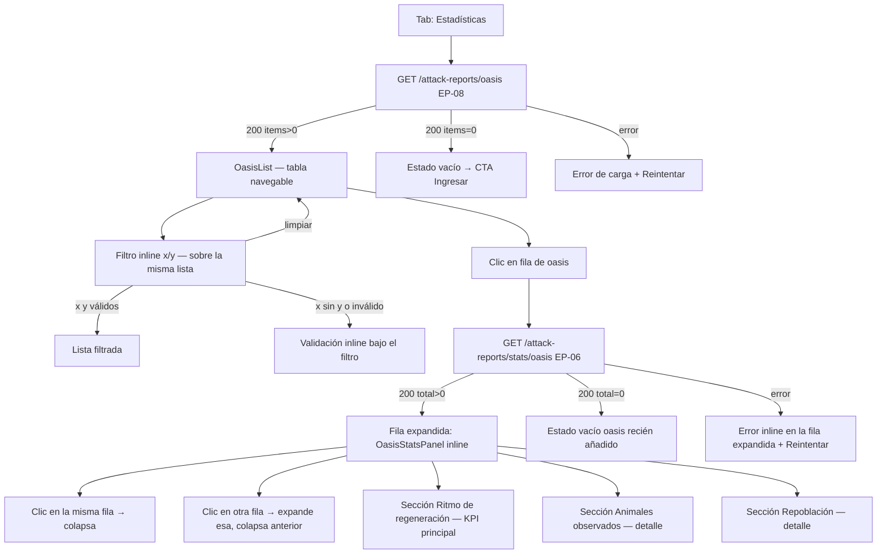

# Rediseño pestaña Estadísticas — lista navegable de oasis + ratio/hora

> **Alcance:** este spec amplía `docs/design/bd-ataques-oasis-ui.md` (estado: implemented).
> Solo cubre la pestaña **Estadísticas** (`StatsTab.jsx` + `OasisStatsPanel.jsx`).
> Las pestañas Ingresar e Historial no cambian.
> El spec padre sigue siendo la referencia para el shell, TabBar, tokens y patrones
> transversales. Las secciones de este documento son el **delta de diseño**.

---

## 1. Visión de la experiencia y principios de diseño

### Problema actual

El `StatsTab` actual obliga al usuario a teclear X e Y a mano y pulsar un botón. El
`OasisStatsPanel` tiene un bug que no pinta datos. El usuario lo resumió: "no me enseñan
nada". Además falta la métrica que más le importa: el ritmo de regeneración por hora
de cada animal (para decidir cuándo atacar de nuevo).

### Visión

Una sola vista que combina tres necesidades del usuario en flujo continuo:

1. **Ver todos mis oasis de un vistazo** (sin teclear nada).
2. **Encontrar uno concreto** filtrando por coordenadas.
3. **Expandir ese oasis** para ver sus estadísticas: el ratio/hora como KPI principal,
   seguido de los datos de aparición y repoblación como detalle.

### Principios aplicados (de `docs/design/PRINCIPIOS.md` y `frontend/DESIGN.md`)

- **Menos es más + contenido primero**: la lista carga sola, sin input obligatorio de
  entrada. El ratio/hora es el primer dato que ve el ojo al expandir, no la última tabla.
- **Divulgación progresiva**: el detalle de un oasis aparece solo cuando el usuario lo
  selecciona. Las tablas de aparición y repoblación (detalle secundario) van detrás del
  ratio/hora (KPI primario).
- **Datos, no formulario**: en la vista anterior el usuario veía un formulario vacío.
  En la nueva ve datos de inmediato.
- **Una sola acción principal por sección**: en la lista, la acción principal es el clic
  en la fila. El filtro es secundario y se manifiesta como un campo de búsqueda compacto,
  no un botón prominente.
- **Tabla densa** (herramienta interna). El oasis seleccionado se expande in-place; no
  abre un panel lateral (el drawer ya lo usamos para el detalle de reportes en la pestaña
  Historial; mezclarlo aquí añadiría confusión de patrones).

---

## 2. Personas y objetivos (jobs-to-be-done)

Sin cambios respecto al spec padre. Persona única (operador del bot). Jobs relevantes
para esta pestaña:

| Job | Frecuencia | Necesidad de diseño |
|---|---|---|
| Saber cuántos animales/hora regenera cada oasis para optimizar cadencia de ataques | Alta (antes de atacar) | Ratio/hora como KPI principal, visible de un vistazo al expandir |
| Comparar oasis entre sí para priorizar ataques | Media | Lista con columnas comparables (ataques, último ataque, botín total) |
| Encontrar un oasis concreto del que recuerdo las coordenadas | Esporádico | Filtro rápido por X e Y sobre la lista |
| Ver detalle de aparición y repoblación de un oasis | Esporádico | Tablas expandidas bajo el KPI de ratio/hora |

---

## 3. Inventario de pantallas / vistas

La feature sigue viviendo en la misma página (`AttackReportsPage`) con sus tres
pestañas. Solo cambia el contenido del tab "Estadísticas":

| Vista | Componente | Descripción |
|---|---|---|
| Tab Estadísticas — lista vacía | `StatsTab` | Sin oasis con reportes en BD; CTA a pestaña Ingresar |
| Tab Estadísticas — lista con oasis | `StatsTab` + `OasisList` | Tabla de oasis navegable + filtro coords |
| Tab Estadísticas — oasis expandido | `StatsTab` + `OasisList` + `OasisStatsPanel` | Fila seleccionada expandida in-place con stats |
| Tab Estadísticas — cargando lista inicial | `StatsTab` | Skeleton de 3 filas mientras llega EP-08 |
| Tab Estadísticas — error de carga | `StatsTab` | Banner de error + Reintentar |
| Tab Estadísticas — cargando detalle del oasis | Panel inline | Spinner bajo la fila seleccionada mientras llega EP-06 |
| Tab Estadísticas — oasis sin suficientes datos | Panel inline | Aviso "aún no hay suficientes ataques..." + stats parciales si las hay |

---

## 4. Mapa de navegación



---

## 5. Flujos de usuario clave

### 5.1 Happy path — ver y comparar oasis

1. Usuario entra a la pestaña "Estadísticas".
2. La lista se carga automáticamente (EP-08, sin input del usuario).
   Mientras carga: skeleton de 3 filas.
3. Aparece la tabla con todos los oasis que tienen reportes.
4. Usuario hace clic en una fila (p. ej. oasis (−70|73)).
5. La fila se expande in-place: spinner breve mientras llega EP-06.
6. Aparece el panel de detalle bajo la fila:
   - Sección "Ritmo de regeneración": lista de animales con su ratio X.XX/h y
     la confianza estadística ("basado en N intervalos").
   - Sección "Animales observados": tabla con apariciones, prom, máx, mín.
   - Sección "Repoblación": tabla con intervalos y regenerados por ataque.
7. Usuario hace clic en otra fila: la anterior se colapsa, la nueva se expande.

### 5.2 Alternativo — filtrar por coordenadas

1. Usuario está en la lista con oasis expandido o no.
2. Escribe X en el campo "x" del filtro. Mientras escribe solo X, no pasa nada.
3. Escribe Y en el campo "y". Al escribir ambos (o pulsar Enter), la lista filtra.
4. Si las coords corresponden a un oasis en la lista: 1 fila visible.
5. Si no corresponden: texto "Ningún oasis con esas coordenadas" + botón "Limpiar".
6. Si solo escribe X sin Y: mensaje de validación inline "Introduce también Y".
7. "Limpiar" → restaura la lista completa.

### 5.3 Alternativo — oasis con un solo ataque

1. Usuario expande un oasis con `total_attacks=1`.
2. Se muestra el KPI de ratio/hora con mensaje de baja confianza:
   "Aún no hay suficientes ataques para calcular el ritmo de repoblación."
3. La tabla de animales observados sí muestra datos (1 ataque = 1 observación).
4. La sección de repoblación no se muestra (requiere 2+ ataques, sin cambios).

### 5.4 Alternativo — lista vacía (ningún oasis tiene reportes)

1. Usuario entra a la pestaña "Estadísticas" por primera vez (sin datos).
2. No hay lista ni filtro: se muestra el estado vacío con CTA.
   "Aún no hay oasis con reportes. Añade tu primer reporte en la pestaña Ingresar."
3. Botón "Ir a Ingresar →" cambia de tab.

### 5.5 Alternativo — error de carga de lista

1. EP-08 falla.
2. Banner de error: icono ✕ + mensaje genérico + botón "Reintentar".
3. Al reintentar, vuelve al skeleton de carga.

### 5.6 Alternativo — error de carga de detalle

1. Usuario hace clic en una fila.
2. EP-06 falla.
3. La fila expandida muestra el error inline: mensaje + botón "Reintentar" dentro del
   panel expandido. La fila sigue visualmente seleccionada (marcada).

---

## 6. Wireframes de baja fidelidad

### 6.1 Tab "Estadísticas" — cargando lista inicial

```
┌──────────────────────────────────────────────────────────────────┐
│  H2  Estadísticas de oasis                                       │
│  ──────────────────────────────────────────────────────────────  │
│  ┌── Barra de búsqueda / filtro ────────────────────────────────┐ │
│  │  [x: ____] [y: ____]   [Limpiar]  (gris, deshabilitado)    │ │
│  └──────────────────────────────────────────────────────────────┘ │
│                                                                  │
│  ┌── Skeleton ─────────────────────────────────────────────────┐ │
│  │  ░░░░░░░░░░  ░░░░  ░░░░░░░░░░░░  ░░░░░░░░░░                 │ │
│  │  ░░░░░░░░░░  ░░░░  ░░░░░░░░░░░░  ░░░░░░░░░░                 │ │
│  │  ░░░░░░░░░░  ░░░░  ░░░░░░░░░░░░  ░░░░░░░░░░                 │ │
│  └──────────────────────────────────────────────────────────────┘ │
└──────────────────────────────────────────────────────────────────┘
```

### 6.2 Tab "Estadísticas" — lista con oasis (ninguno expandido)

```
┌──────────────────────────────────────────────────────────────────┐
│  H2  Estadísticas de oasis           "3 oasis con reportes"      │
│  ──────────────────────────────────────────────────────────────  │
│  ┌── Filtro inline ─────────────────────────────────────────────┐ │
│  │  x: [____]   y: [____]   [Limpiar]                          │ │
│  └──────────────────────────────────────────────────────────────┘ │
│                                                                  │
│  ┌── Tabla de oasis (densa, hairlines) ────────────────────────┐ │
│  │  OASIS      │ ATAQUES │ ÚLTIMO ATAQUE   │ BOTÍN TOTAL │  ▶ │ │
│  │  ─────────────────────────────────────────────────────────  │ │
│  │  (−70|73)   │    5    │ 31 may 26 13:39 │    18.450   │  ▶ │ │
│  │  (−45|12)   │    2    │ 30 may 26 09:14 │     7.200   │  ▶ │ │
│  │  ( 12|−8)   │    1    │ 28 may 26 16:05 │     2.100   │  ▶ │ │
│  └──────────────────────────────────────────────────────────────┘ │
└──────────────────────────────────────────────────────────────────┘
```

Columnas y prioridades:
| Col | P | Móvil |
|---|---|---|
| Oasis (coords en mono) | P1 | Sí |
| Ataques (número) | P1 | Sí |
| Último ataque (fecha formateada) | P1 | Sí |
| Botín total (mono, tabular-nums) | P2 | Oculta < md |
| Chevron ▶/▼ (indicador de selección) | P1 | Sí |

- La fila completa es clickable (no solo el chevron).
- Fila hover: `--surface-2`.
- Cursor: `pointer`.
- Coordenadas en `--font-mono`, formato `(−70|73)`.

### 6.3 Tab "Estadísticas" — fila expandida con detalle

```
┌──────────────────────────────────────────────────────────────────┐
│  ┌── Tabla de oasis ───────────────────────────────────────────┐ │
│  │  OASIS      │ ATAQUES │ ÚLTIMO ATAQUE   │ BOTÍN TOTAL │     │ │
│  │  ─────────────────────────────────────────────────────────  │ │
│  │  (−70|73)   │    5    │ 31 may 26 13:39 │    18.450   │  ▼ │ │  ← SELECCIONADA
│  │  ┌── Panel detalle (colspan=todas las cols) ─────────────┐  │ │
│  │  │                                                        │  │ │
│  │  │  ┌── Ritmo de regeneración ──────────────────────────┐│  │ │
│  │  │  │  ANIMAL   │  RATIO/HORA    │  CONFIANZA            ││  │ │
│  │  │  │  ─────────────────────────────────────────────────││  │ │
│  │  │  │  🐀 Rata  │   4,72 /h      │  ≈4 intervalos        ││  │ │
│  │  │  └───────────────────────────────────────────────────┘│  │ │
│  │  │                                                        │  │ │
│  │  │  ┌── Animales observados ────────────────────────────┐│  │ │
│  │  │  │  ANIMAL │ APARS │ PROM │ MÁX │ MÍN               ││  │ │
│  │  │  │  Rata   │  4/5  │  9,3 │  14 │   7               ││  │ │
│  │  │  └───────────────────────────────────────────────────┘│  │ │
│  │  │                                                        │  │ │
│  │  │  ┌── Repoblación ────────────────────────────────────┐│  │ │
│  │  │  │  ATAQUE   │ INTERVALO   │ RATA │ …                ││  │ │
│  │  │  │  31/05/26 │  6 h 14 min │  +9  │ …               ││  │ │
│  │  │  └───────────────────────────────────────────────────┘│  │ │
│  │  └────────────────────────────────────────────────────────┘  │ │
│  │  ─────────────────────────────────────────────────────────  │ │
│  │  (−45|12)   │    2    │ 30 may 26 09:14 │     7.200   │  ▶ │ │
│  │  ( 12|−8)   │    1    │ 28 may 26 16:05 │     2.100   │  ▶ │ │
│  └──────────────────────────────────────────────────────────────┘ │
└──────────────────────────────────────────────────────────────────┘
```

El panel de detalle inline:
- Se inserta como una **fila de tabla adicional** (`<tr>`) con `colspan` de todas las
  columnas. Esto mantiene el scroll y la alineación de columnas.
- Fondo: `--surface-2` para diferenciarse visualmente de la fila de cabecera.
- Borde superior `--accent` (2px) en la fila seleccionada: señal de selección activa
  que no depende solo del color.
- El panel tiene padding interior de 16px 20px.
- Transición de entrada: `max-height 0 → auto` con `opacity 0 → 1` en `--dur-base`.

### 6.4 Sección "Ritmo de regeneración" (KPI principal) — detalle

```
┌── Ritmo de regeneración ───────────────────────────────────────┐
│  [icono animal] Rata        4,72 /h     ≈ 4 intervalos         │
│  [icono animal] Araña       1,20 /h     ≈ 3 intervalos         │
└────────────────────────────────────────────────────────────────┘
```

Layout: tabla densa con 3 columnas:
- Col 1: icono nature_N.png (16px) + nombre del animal. Ancho: min-content + flex.
- Col 2: `X,XX /h` en `--font-mono` bold, `--text`, 15px. Alineado a la derecha.
- Col 3: `≈ N intervalos` en `--text-tertiary`, 12px. Alineado a la derecha.

El ratio/hora es el dato más grande e importante de la vista. Justificación: el usuario
textualmente pidió "los ratios de aparición por todos los animales, es decir que animales
se generan por hora". Este dato manda sobre el resto.

Icono: si `animal_ordinal` ≤ 10, usar `nature_{ordinal}.png` del servidor
(`/api/static/icons/nature_{ordinal}.png`). Si no existe, fallback a un emoji neutral o
texto solo. El mismo patrón que `ResIcon` pero para animales nature.

Señal de confianza: `valid_intervals` se muestra como `≈ N intervalos`. Si
`valid_intervals >= 5`: color `--success`; si `valid_intervals < 5`: color
`--text-tertiary`. Esto orienta al usuario sobre la fiabilidad del ratio sin saturar
con warnings.

Estado con < 2 ataques (animal_regen_rates = []):
```
┌── Ritmo de regeneración ───────────────────────────────────────┐
│  ⚠  Aún no hay suficientes ataques para calcular el ritmo      │
│     de repoblación. Se necesitan al menos 2 ataques al          │
│     mismo oasis.                                               │
└────────────────────────────────────────────────────────────────┘
```
Color: `--accent` (oro) como "requiere atención", con icono `⚠` además del color.

### 6.5 Tab "Estadísticas" — estado vacío (sin oasis)

```
┌──────────────────────────────────────────────────────────────────┐
│  H2  Estadísticas de oasis                                       │
│  ──────────────────────────────────────────────────────────────  │
│                                                                  │
│     (icono animal, mínimo, 32px)                                 │
│     "Aún no hay oasis con reportes."                             │
│     "Añade tu primer reporte en la pestaña Ingresar."            │
│     [Ir a Ingresar →]                                            │
│                                                                  │
└──────────────────────────────────────────────────────────────────┘
```

CTA "Ir a Ingresar →": botón terciario (texto en `--accent-text`, sin fondo ni borde).
Al hacer clic: cambia el tab activo a "Ingresar" (mismo mecanismo que el TabBar).

### 6.6 Tab "Estadísticas" — lista filtrada sin resultados

```
┌──────────────────────────────────────────────────────────────────┐
│  ┌── Filtro inline ────────────────────────────────────┐         │
│  │  x: [−70]   y: [99]   [Limpiar]                    │         │
│  └─────────────────────────────────────────────────────┘         │
│                                                                  │
│  "Ningún oasis con coordenadas (−70|99)."   [Limpiar]           │
└──────────────────────────────────────────────────────────────────┘
```

### 6.7 Tab "Estadísticas" — cargando detalle del oasis seleccionado

```
│  (−70|73)   │  5  │ 31 may 26 13:39  │  18.450  │  ▼  │
│  ┌── Panel detalle ──────────────────────────────────────┐ │
│  │  (spinner 16px)  "Cargando estadísticas..."            │ │
│  └───────────────────────────────────────────────────────┘ │
```

---

## 6b. Mockup editable y layout aprobado

- Ruta del mockup: `frontend/mockups/stats-oasis-nav.playground.html`
- Aprobación por usuario: **pendiente** (gate humano obligatorio)
- Layout propuesto (a confirmar en el playground):
  - **Bloque A**: Encabezado de sección ("Estadísticas de oasis" + contador)
  - **Bloque B**: Barra de filtro inline (x, y, Limpiar)
  - **Bloque C**: Cabecera de tabla (Oasis | Ataques | Último ataque | Botín total)
  - **Bloque D**: Fila de oasis expandida — parte superior (datos de la fila)
  - **Bloque E**: Panel inline — sección "Ritmo de regeneración" (KPI)
  - **Bloque F**: Panel inline — sección "Animales observados"
  - **Bloque G**: Panel inline — sección "Repoblación"
  - **Bloque H**: Filas de oasis no expandidas (cola)
  - **Bloque I**: Estado vacío (alternativo a C/D/E/F/G/H)
  - **Bloque J**: Estado sin resultados de filtro

---

## 7. Estados de cada pantalla

### Tab "Estadísticas" — estados completos

| Estado | Descripción | Trigger |
|---|---|---|
| Cargando lista | Skeleton de 3 filas | Montaje del componente |
| Lista con oasis (ninguno seleccionado) | Tabla de oasis navegable | EP-08 200 con items |
| Lista vacía (sin oasis en BD) | Ilustración + CTA "Ir a Ingresar" | EP-08 200 total=0 |
| Error carga lista | Banner ✕ + "Reintentar" | EP-08 falla |
| Filtro activo — con resultados | Tabla filtrada (1 fila si coords exactas) | x+y introducidos, resultados |
| Filtro activo — sin resultados | Mensaje + Limpiar | x+y introducidos, 0 resultados |
| Filtro inválido (x sin y) | Mensaje validación inline | x introducido, y vacío, Enter |
| Fila seleccionada — cargando detalle | Fila marcada + spinner en panel expandido | Clic en fila |
| Fila seleccionada — con detalle (2+ ataques) | Fila expandida con ratio/hora + tablas | EP-06 200 total_attacks >= 2 |
| Fila seleccionada — con detalle (1 ataque) | Fila expandida: aviso ratio no disponible + tabla animales | EP-06 200 total_attacks = 1 |
| Fila seleccionada — sin detalle (0 ataques) | Fila expandida: estado vacío | EP-06 200 total_attacks = 0 |
| Fila seleccionada — error detalle | Error inline en panel expandido + Reintentar | EP-06 falla |
| Fila colapsada | Al hacer clic en fila ya expandida | Clic segunda vez en misma fila |

---

## 8. Inventario de componentes UI reutilizables

### Componentes REUTILIZAR (sin cambios)

| Componente | Ruta | Uso en esta feature |
|---|---|---|
| `TabBar` | `frontend/src/components/ui/TabBar.jsx` | Shell de las 3 pestañas (sin cambios) |
| Patrones de tabla densa (§19 DESIGN.md) | Patrón | `OasisList` sigue el mismo patrón de tabla |
| Skeleton rows (patrón existente en `HistoryTab`) | Patrón | Reutilizar el mismo skeleton visual |
| `Spinner` | `frontend/src/components/ui/uiUtils.jsx` | Loading del detalle inline |

### Componentes MODIFICAR (cambio mínimo y retrocompatible)

| Componente | Cambio | Impacto en existentes |
|---|---|---|
| `StatsTab.jsx` | Reemplazar el form de coords por la lista de oasis (`OasisList`). El filtro de coords pasa a ser un input compacto dentro de la lista, no el formulario principal. El `OasisStatsPanel` se sigue usando, embebido en el expand row. | Solo afecta a la pestaña Estadísticas — sin impacto en Ingresar ni Historial. |
| `OasisStatsPanel.jsx` | Corrección de bugs (BUG1: nombres de campo, BUG2: transformación lista→dict) + nueva sección "Ritmo de regeneración" usando `animal_regen_rates`. Cambio aditivo: no se elimina nada, se añade la sección de ratio al inicio. | Sin impacto: el panel solo se usa dentro de `StatsTab`. |
| `client.js` | Añadir método `listOasisSummaries()` → EP-08. El método `getOasisStats` ya existe. | Cambio aditivo — no rompe los 5 métodos existentes. |

### Componentes CREAR (nuevos)

| Componente | Ruta propuesta | Descripción |
|---|---|---|
| `OasisList` | `frontend/src/components/attack-reports/OasisList.jsx` | Tabla navegable de oasis: filtro inline + filas clicables + expand-in-place con `OasisStatsPanel`. Gestiona el estado de selección (una fila a la vez), la carga de detalle por fila y el filtro local. |
| `NatureIcon` | `frontend/src/components/attack-reports/NatureIcon.jsx` | Icono de animal nature de Travian (`/api/static/icons/nature_{ordinal}.png`), fallback a texto. Análogo a `ResIcon` pero para animales. Props: `ordinal` (int), `name` (string, alt text), `size` (default 16). |
| `RegenRatesSection` | `frontend/src/components/attack-reports/RegenRatesSection.jsx` | Sección "Ritmo de regeneración": tabla de ratios/hora con `NatureIcon` + confianza. Cubre estados: lista vacía (aviso < 2 ataques) y con datos. Props: `rates` (array de `animal_regen_rates`), `totalAttacks` (int), `lang`. |

---

## 9. Contenido y microcopy

### Labels y títulos nuevos / modificados

| Elemento | Texto (ES) | Notas |
|---|---|---|
| H2 sección | "Estadísticas de oasis" | Igual que antes |
| Contador de oasis | "N oasis con reportes" / "1 oasis con reportes" | Caption junto al H2 |
| Placeholder filtro x | "x" | Minimalista; la label "Coordenadas" lo da el fieldset |
| Placeholder filtro y | "y" | Ídem |
| Botón limpiar filtro | "Limpiar" | Ghost, visible solo cuando hay filtro activo |
| Hint filtro | "Introduce x e y para filtrar" | Texto debajo del filtro, visible cuando solo x tiene valor, como validación inline |
| Cabecera col. Oasis | "Oasis" | |
| Cabecera col. Ataques | "Ataques" | |
| Cabecera col. Último ataque | "Último ataque" | |
| Cabecera col. Botín total | "Botín total" | |
| Chevron expandido | ▼ (rotado 0°) | Icono Lucide `ChevronDown` |
| Chevron colapsado | ▶ (rotado −90°) | Icono Lucide `ChevronRight` |
| Sección ratio/hora | "Ritmo de regeneración" | Título de sección, uppercase, 11px |
| Col. animal (ratio) | "Animal" | |
| Col. ratio/hora | "Ratio /h" | Abreviado en tabla densa |
| Col. confianza | "Confianza" | `valid_intervals` |
| Confianza baja | "≈ N intervalo" / "≈ N intervalos" | Plural correcto |
| Confianza alta label | "≈ N intervalos" en `--success` si >= 5 | |
| Aviso < 2 ataques | "Aún no hay suficientes ataques para calcular el ritmo de repoblación." | Subtítulo: "Se necesitan al menos 2 ataques al mismo oasis." |
| Loading detalle | "Cargando estadísticas..." | Junto a spinner |
| Error detalle | "Error al cargar las estadísticas. " + botón "Reintentar" | |
| Vacío lista | "Aún no hay oasis con reportes." | Subtítulo: "Añade tu primer reporte en la pestaña Ingresar." |
| CTA vacío | "Ir a Ingresar →" | Botón ghost/terciario |
| Sin resultados filtro | "Ningún oasis con coordenadas {x|y}." | |
| Botón limpiar sin resultados | "Limpiar filtro" | |

### Formato de fechas y números (sin cambios respecto al spec padre)

- Fechas: `Intl.DateTimeFormat(lang, { day:'numeric', month:'short', year:'2-digit', hour:'2-digit', minute:'2-digit' })`
- Coordenadas: `--font-mono`, formato `(−70|73)` con guión largo U+2212.
- Botín: `Intl.NumberFormat(lang)` con `tabular-nums`.
- Ratio/hora: `Intl.NumberFormat(lang, { minimumFractionDigits: 2, maximumFractionDigits: 2 })` + " /h".

---

## 10. Accesibilidad

### Adiciones sobre el spec padre

- **Tabla de oasis**: `role="table"`, cabeceras `scope="col"`, filas `role="row"`.
  La fila expandible lleva `aria-expanded="true|false"` y `aria-controls="detail-{x}-{y}"`.
  El panel de detalle lleva `id="detail-{x}-{y}"` y `role="region"` con `aria-label`.
- **Fila seleccionada**: además del borde de acento, el fondo `--accent-subtle` y el
  chevron ▼, el `aria-expanded` lo señala semánticamente para lectores de pantalla.
- **Navegación por teclado en la tabla**:
  - Tab navega entre filas (las filas son `<button>` o llevan `tabindex=0`).
  - Enter/Space en una fila = mismo efecto que el clic (expand/collapse).
  - Escape dentro del panel expandido = colapsa (foco vuelve a la fila).
- **NatureIcon**: `` o `role="img"` + `aria-label={name}`.
  Si la imagen no carga: el nombre del animal como texto fallback.
- **Filtro de coordenadas**:
  - Fieldset con leyenda "Filtrar por coordenadas".
  - Error de validación (x sin y): `role="alert"` inline.
- **Reducción de movimiento**: la transición de expand/collapse (max-height + opacity)
  respeta `@media (prefers-reduced-motion: reduce)`: sin animación, solo aparece.

---

## 11. Responsive / adaptación a dispositivos

| Sección | Móvil (< md, < 768px) | Tablet (md+) | Desktop (lg+) |
|---|---|---|---|
| Tabla de oasis | Tarjetas apiladas: coords (P1) + ataques (P1) + último ataque (P1). Botín oculto (P2). | Tabla completa sin botín | Tabla completa con botín |
| Filtro coords | 1 col, x e y apilados | Inline horizontal | Inline horizontal |
| Panel expandido | Full width, secciones apiladas | Full width contenido | Full width |
| Sección ratio/hora | Solo nombre + ratio (sin confianza P2) | Todo visible | Todo visible |
| Tabla animales en panel | scroll-x contenido | Tabla completa | Tabla completa |
| Tabla repoblación en panel | scroll-x contenido | Tabla completa | Tabla completa |

**Jerarquía de prioridad (mobile-first):**

- P1: lista de oasis (coords, ataques, último ataque), chevron expand/collapse, ratio/hora al expandir, tabla de animales.
- P2: columna botín total, columna de confianza en ratio, tabla de repoblación.
- P3: timestamps exactos en repoblación.

---

## 12. Interacciones y feedback

| Interacción | Feedback |
|---|---|
| Montar la pestaña (primera vez) | Skeleton de 3 filas durante la carga de EP-08 |
| Carga EP-08 OK | Skeleton desaparece; tabla aparece con `opacity: 0 → 1` en `--dur-base` |
| Hover sobre fila de oasis | Fondo `--surface-2`; cursor `pointer`; chevron resalta |
| Clic en fila de oasis | Fila: borde-top `2px --accent`; fondo `--accent-subtle`; chevron rota ▼; fila de detalle aparece con spinner |
| EP-06 resuelto | Spinner desaparece; contenido aparece con `opacity: 0 → 1` en `--dur-base` |
| Clic en la misma fila (colapsar) | Panel colapsa; borde y fondo de fila vuelven al normal; chevron rota ▶ |
| Clic en otra fila | Anterior colapsa; nueva se expande (sin esperar el colapso — inmediato) |
| Tipear en filtro x o y | Mientras falte el otro campo: validación silenciosa (no muestra error todavía) |
| Ambos campos de filtro con valor | Filtrado inmediato (sin botón "Aplicar"); debounce 300ms |
| Filtro sin resultados | Mensaje inline con "Limpiar filtro" |
| Limpiar filtro | Inputs se vacían; lista vuelve al estado completo |
| Error EP-08 | Banner error con "Reintentar" en lugar de la tabla |
| Error EP-06 | Mensaje inline en el panel expandido con "Reintentar"; la fila sigue marcada como seleccionada |
| Cambio de tab | Al salir de Estadísticas, se recuerda el oasis seleccionado y el estado del filtro (persistencia en state del componente padre, no en localStorage — es información de sesión) |

---

## 13. Criterios de aceptación de diseño

### Lista y filtro

- [ ] **DA-S01**: Al entrar en la pestaña Estadísticas, la lista de oasis se carga automáticamente sin input del usuario (EP-08).
- [ ] **DA-S02**: Durante la carga, se muestra un skeleton de al menos 3 filas.
- [ ] **DA-S03**: La tabla muestra las columnas: Oasis (coords en mono), Ataques, Último ataque, Botín total (P2).
- [ ] **DA-S04**: Toda la fila es clickable; el cursor es `pointer` sobre ella.
- [ ] **DA-S05**: El filtro por x+y filtra la lista sin botón "Aplicar" (debounce 300ms o al completar ambos campos).
- [ ] **DA-S06**: Si solo se introduce x sin y (o viceversa), se muestra una validación inline sin filtrar.
- [ ] **DA-S07**: "Limpiar" restaura la lista completa y vacía los inputs.
- [ ] **DA-S08**: El estado vacío (sin oasis) muestra el CTA "Ir a Ingresar →" funcional.
- [ ] **DA-S09**: El error de carga de la lista muestra un mensaje + botón "Reintentar" funcional.
- [ ] **DA-S10**: En móvil (< 768px), la tabla se convierte en tarjetas apiladas mostrando coords, ataques y último ataque.

### Expand/collapse y detalle

- [ ] **DA-S11**: Al hacer clic en una fila, el panel de detalle se expande in-place bajo ella con un spinner mientras carga EP-06.
- [ ] **DA-S12**: La fila seleccionada tiene un borde superior de `2px` en `--accent` y fondo `--accent-subtle`.
- [ ] **DA-S13**: El chevron de la fila rota de ▶ a ▼ al expandirse y vuelve a ▶ al colapsar.
- [ ] **DA-S14**: Al hacer clic en la misma fila expandida, el panel colapsa.
- [ ] **DA-S15**: Al hacer clic en una fila diferente, la anterior se colapsa y la nueva se expande.
- [ ] **DA-S16**: Solo puede haber una fila expandida a la vez.
- [ ] **DA-S17**: El error de carga del detalle aparece inline en el panel expandido con "Reintentar".

### Panel de detalle — ratio/hora

- [ ] **DA-S18**: La sección "Ritmo de regeneración" es la primera sección visible al expandir (por encima de la tabla de animales).
- [ ] **DA-S19**: Cada animal muestra su ratio en formato "X,XX /h" usando `Intl.NumberFormat` (2 decimales) y `--font-mono`.
- [ ] **DA-S20**: La confianza estadística se muestra como "≈ N intervalos" en `--text-tertiary` (o `--success` si N >= 5).
- [ ] **DA-S21**: Cada animal muestra su icono `nature_{ordinal}.png`; si no carga, muestra el nombre como fallback.
- [ ] **DA-S22**: Cuando `animal_regen_rates` es vacío (< 2 ataques), se muestra el aviso con icono `⚠` en `--accent`.
- [ ] **DA-S23**: El aviso de < 2 ataques NO reemplaza la tabla de animales (que sí puede tener datos con 1 ataque).

### Panel de detalle — animales y repoblación (bug fixes)

- [ ] **DA-S24**: La tabla de animales muestra los campos correctos: `appearances`, `avg_present`, `max_present`, `min_present` (BUG1 corregido).
- [ ] **DA-S25**: La tabla de repoblación muestra los valores regenerados correctos (transformación lista→dict, BUG1 corregido).
- [ ] **DA-S26**: Las secciones "Animales observados" y "Repoblación" siguen apareciendo en ese orden, bajo "Ritmo de regeneración".

### Accesibilidad

- [ ] **DA-S27**: Las filas de la tabla de oasis son navegables por teclado (Tab + Enter/Space para expandir).
- [ ] **DA-S28**: Las filas expandibles tienen `aria-expanded="true|false"` y `aria-controls`.
- [ ] **DA-S29**: El filtro tiene un `<fieldset>` con `<legend>` accesible.
- [ ] **DA-S30**: Los iconos de animales tienen `alt` text con el nombre del animal.

### Visual

- [ ] **DA-S31**: El diseño funciona en modo claro y oscuro (todos los tokens son variables CSS, ningún hex hardcodeado).
- [ ] **DA-S32**: La tabla no produce scroll horizontal de la página en ningún breakpoint.
- [ ] **DA-S33**: El diseño no rompe en alemán (idioma más largo, hasta +35% de expansión de texto).

---

## 14. Trazabilidad

| Decisión de diseño | Necesidad de usuario / regla de negocio |
|---|---|
| Lista precargada automáticamente (sin input obligatorio) | RN-NAV2: el usuario pidió "que me aparezca una lista de todos los oasis precargados actualmente". Carga automática = menor fricción (principio DESIGN.md: menos es más, contenido primero). |
| Expand-in-place (no panel lateral ni nueva ruta) | La lista de oasis es corta (decenas); el usuario quiere comparar oasis entre sí. Con el panel lateral se perdería el contexto de la lista. El drawer ya se usa para el detalle de reportes en la tab Historial: mezclar patrones confunde. Expand-in-place mantiene el contexto de la lista y es coherente con la densidad de la herramienta. |
| Filtro sin botón "Aplicar" (debounce) | RN-NAV1 filtro: el usuario "quiere hacer filtro por las coordenadas". Un filtro que actúa al tipear sin "Aplicar" reduce clics; con debounce de 300ms no se producen peticiones en cada keystroke. |
| "Ritmo de regeneración" como primera sección del panel expandido | El usuario pidió explícitamente "los ratios de aparición… que animales se generan por hora" como la métrica principal. La divulgación progresiva dicta que lo más importante va primero. |
| `valid_intervals` como señal de confianza | RT-REGEN2 del spec funcional: campo de confianza estadística de coste cero con alto valor informativo. Se muestra discretamente (`--text-tertiary` vs `--success`) sin saturar con warnings. |
| Icono `nature_{ordinal}.png` en ratio/hora | Los iconos del juego dan contexto visual inmediato (el usuario de Travian reconoce los animales por icono antes que por nombre). El proyecto ya tiene `ResIcon` como patrón; `NatureIcon` es el análogo para animales. |
| Aviso con `⚠` en acento oro para < 2 ataques | DESIGN.md §5: el oro (acento) se usa para "requiere atención" (no hay naranja warning en este sistema). El aviso es información, no un error crítico (no hay `--danger`). El icono `⚠` + texto + color oro = señal completa sin depender solo del color. |
| Columna "Botín total" como P2 (oculta en móvil) | Comparar botines es útil en desktop; en móvil el espacio es escaso y las coords + ataques + fecha son la información primaria de comparación. Regla §17.3 de DESIGN.md. |
| Solo una fila expandida a la vez | El panel expandido ocupa espacio vertical considerable. Tener múltiples abiertos simultáneamente saturaria la vista. El patrón accordion estándar (one-at-a-time) reduce la carga cognitiva. |
| Filtrado aplicado inmediatamente (debounce, sin spinner en la lista) | EP-08 con filtro x+y devuelve máximo 1 resultado; la latencia es < 50ms. No hay necesidad de un estado de carga intermedio para el filtro. Si la lista completa ya está en memoria local, el filtro puede ser local sin petición adicional (depende de si la API devuelve todos los ítems sin paginación — RT-NAV1 del spec: sin paginación v1). |
| `NatureIcon` como componente nuevo (no reutilizar `ResIcon`) | `ResIcon` está especializado para recursos (wood/clay/iron/crop) con rutas `stat_*.png`. Los animales usan `nature_N.png` con índice numérico. Crear `NatureIcon` evita contaminar `ResIcon` con lógica de animales — principio de responsabilidad única. |

### Reutilización de UI

> Nota: se ejecuta el gate de palantir en el Paso 3.1 antes de marcar como ready-for-impl.
> Las decisiones de REUTILIZAR / MODIFICAR / CREAR quedan anotadas aquí para el implementador.

| Pieza | Decisión | Detalle |
|---|---|---|
| `StatsTab.jsx` | MODIFICAR | Reemplaza form de coords por `OasisList`. Cambio de estructura interna; la interfaz del componente hacia su padre no cambia (misma prop `lang`). |
| `OasisStatsPanel.jsx` | MODIFICAR | Corrección de BUG1 (nombres de campo) + añadir sección `RegenRatesSection` al inicio del render. Cambio aditivo. |
| `client.js` | MODIFICAR | Añadir método `listOasisSummaries()`. Aditivo, sin romper existentes. |
| `TabBar.jsx` | REUTILIZAR | Sin cambios. |
| `Spinner` de `uiUtils.jsx` | REUTILIZAR | Para el loading del detalle inline. |
| `OasisList.jsx` | CREAR | Componente nuevo. |
| `NatureIcon.jsx` | CREAR | Componente nuevo, análogo a `ResIcon` para animales. |
| `RegenRatesSection.jsx` | CREAR | Componente nuevo para la sección de KPI. |


---

## Registro de implementación

**Fecha:** 2026-05-31
**Rama:** `feature/optimizador-balance-multiraid`
**Implementado por:** desarrollador-ux-ui

### Archivos creados
- `frontend/src/utils/formatDateVerbatim.js` — helper verbatim sin new Date()
- `frontend/src/components/attack-reports/NatureIcon.jsx` — icono nature_N.png con fallback
- `frontend/src/components/attack-reports/RegenRatesSection.jsx` — sección KPI ritmo regeneración
- `frontend/src/components/attack-reports/OasisList.jsx` — tabla navegable completa (todos los estados del spec)

### Archivos modificados
- `frontend/src/components/attack-reports/OasisStatsPanel.jsx` — BUG1 corregido + RegenRatesSection añadida
- `frontend/src/components/attack-reports/ReportDetailDrawer.jsx` — BUG2 corregido (ResIcon), formatDateVerbatim
- `frontend/src/components/attack-reports/HistoryTable.jsx` — formatDateVerbatim
- `frontend/src/components/attack-reports/ReportPreview.jsx` — formatDateVerbatim
- `frontend/src/components/attack-reports/StatsTab.jsx` — reescrito usando OasisList (prop onGoToIngest añadida)
- `frontend/src/api/client.js` — añadidos listOasisSummaries, getOasisStats, getAttackReports, getAttackReport, parseAttackReport, saveAttackReport, deleteAttackReport
- `frontend/src/pages/AttackReportsPage.jsx` — pasar onGoToIngest al StatsTab
- `frontend/src/i18n/catalog/es.js` — bloque completo de claves ar.* (historia, ingest, drawer, stats)
- `frontend/src/i18n/catalog/en.js` — ídem en inglés
- `frontend/src/i18n/catalog/{ar,bg,cs,da,de,el,fa,fr,he,hu,it,ja,lt,lv,nl,pl,pt,rs,ru,sl,sv,tr,uk}.js` — bloque ar.* en inglés (fallback funcional)

### Verificación
- `npm run build` pasa sin errores (solo warning de chunk size preexistente)
- Build: 1639 módulos transformados, 969.70 kB

### Desviaciones respecto al diseño
1. **`StatsTab` recibe prop `onGoToIngest`**: el spec indicaba `misma prop lang` como interfaz hacia el padre. Se añadió `onGoToIngest` para el CTA del estado vacío — cambio mínimo, retrocompatible (sin `onGoToIngest` el botón CTA simplemente no hace nada).
2. **`mockup_aprobado_por_usuario`**: el usuario aprobó verbalmente ("me parece perfecto") sin usar el botón de Exportar layout del playground. Se implementó según el layout por defecto del mockup (orden A → B → C/D → E → F → G).
3. **`ar.*` keys como fallback**: los 23 idiomas no traducidos usan las claves en inglés. El sistema de fallback a `es` garantiza que todo funcione sin texto vacío.

### Pendiente de integración con backend
- EP-08 `GET /attack-reports/oasis` — a implementar por `desarrollador-funcionalidades`
- `animal_regen_rates` en EP-06 — a implementar por `desarrollador-funcionalidades`
- La UI funcionará sin errores con backend no actualizado pero mostrará "Error al cargar los oasis" en la lista.
