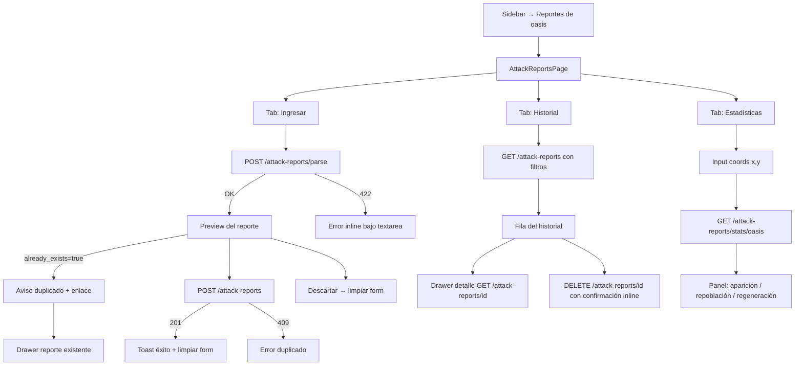

# BD de ataques a oasis — interfaz de pegado, historial y estadísticas

## 1. Visión de la experiencia y principios de diseño

El flujo central es **pegar un reporte → ver el preview → confirmar o descartar**. El usuario ya tiene el texto del reporte en el portapapeles (viene de Travian); la fricción debe ser mínima. La pantalla no es un dashboard de operación en tiempo real: es una herramienta de análisis pasivo que se usa esporádicamente.

Principios aplicados (alineados con `docs/design/PRINCIPIOS.md` y `frontend/DESIGN.md`):
- **Una acción primaria por paso**: en el paso de pegado, la acción es "Analizar"; en el paso de preview, es "Guardar". No se mezclan.
- **Divulgación progresiva**: el preview aparece solo tras parsear; las estadísticas de oasis aparecen solo cuando hay coordenadas seleccionadas. No se muestra un formulario complejo de entrada.
- **Espacio y peso crean jerarquía**, no cajas de color. El aviso de duplicado es texto con icono, no un modal intrusivo.
- **Tabla densa** para el historial (herramienta interna); en móvil se convierte en tarjetas apiladas.
- **Acento oro** solo en el estado "activo" del item del sidebar y en los enlaces al reporte existente (si hay duplicado). Botones primarios monocromos.
- **El color no es la única señal**: los estados de error y duplicado llevan icono + texto, nunca solo color.

---

## 2. Personas y objetivos (jobs-to-be-done)

**Persona única**: el usuario del bot (único operador, tool interna).

| Job-to-be-done | Frecuencia | Contexto |
|---|---|---|
| Pegar y guardar un reporte nuevo que acaba de ver en Travian | Varios por sesión de juego | Tiene el tab de Travian abierto en paralelo; quiere el menor número de clics |
| Revisar historial de ataques a un oasis antes de atacarlo | Esporádico | Quiere saber qué animales le esperan y cuándo se repobló |
| Consultar estadísticas de un oasis concreto (animales, repoblación, regeneración) | Esporádico | Toma decisiones sobre si merece la pena atacarlo |
| Borrar un reporte duplicado o erróneo | Raro | Limpieza de datos |

---

## 3. Inventario de pantallas / vistas

La feature vive en una única página (`AttackReportsPage`) con **tres secciones en pestañas**:

| Sección | Ruta / anchor | Descripción |
|---|---|---|
| Ingresar reporte | `/reportes-oasis` (tab "Ingresar") | Textarea + botón Analizar + preview + acciones |
| Historial | `/reportes-oasis` (tab "Historial") | Tabla filtrable con todos los reportes guardados |
| Estadísticas de oasis | `/reportes-oasis` (tab "Estadísticas") | Panel de análisis por coordenadas |

La navegación entre tabs NO genera rutas distintas (no hay razón para deep-link en esta herramienta). El tab activo persiste en `localStorage` para que al volver a la página el usuario vea donde lo dejó.

El **detalle completo de un reporte** (EP-04) no tiene pantalla propia: se abre en un **drawer lateral** desde la fila del historial (patrón ya establecido en `§19.11` de DESIGN.md). Esto evita crear una ruta nueva para datos que el usuario consulta brevemente.

---

## 4. Mapa de navegación



---

## 5. Flujos de usuario clave

### 5.1 Happy path: pegar y guardar un reporte nuevo

1. Usuario hace clic en "Reportes de oasis" en el sidebar.
2. La página abre con el tab "Ingresar" activo y el textarea con foco automático.
3. Usuario pega el texto (Cmd+V / Ctrl+V).
4. Usuario hace clic en "Analizar" (o pulsa Cmd+Enter).
5. Spinner de carga breve (la petición es < 500 ms según CA-01).
6. Aparece el preview: bloque `TravianReport` + resumen de metadata (coords, fecha, aldea origen).
7. Usuario ve los datos, hace clic en "Guardar".
8. Toast "Reporte guardado" (auto-dismiss 3 s). Formulario se limpia. Foco vuelve al textarea.
9. El historial tendrá el nuevo reporte la próxima vez que el usuario visite esa tab.

### 5.2 Alternativo: reporte ya existente

1–6. Igual que el happy path.
7. El preview muestra un banner de aviso: "Este reporte ya está guardado (id: 42)." + enlace "Ver reporte →" que abre el drawer del reporte existente.
8. Los botones "Guardar" y "Descartar" siguen presentes. El usuario puede hacer clic en "Descartar" (o limpiar y no guardar).
9. Si el usuario intenta guardar igualmente: el backend devuelve 409. Se muestra error inline "Reporte duplicado" bajo el botón — no es un escenario de uso normal pero el sistema lo maneja.

### 5.3 Alternativo: error de parseo

1–4. Igual.
5. El backend devuelve 422. Bajo el textarea aparece un bloque de error con icono + texto del `detail` del backend (p. ej. "Nombres de animales no reconocidos: ['Lobezno']"). El botón "Analizar" queda habilitado para que el usuario corrija el texto y reintente. No hay preview.

### 5.4 Consultar historial y borrar

1. Usuario va al tab "Historial".
2. Ve la tabla con los reportes más recientes primero (orden attacked_at DESC).
3. Puede filtrar por coordenadas (x, y) o por rango de fechas.
4. Hace clic en una fila: abre el drawer de detalle (TravianReport completo + metadata).
5. Para borrar: botón "Borrar" en la fila (icono papelera) muestra una confirmación inline tipo popover (no modal, menos intrusivo). Al confirmar, la fila desaparece con transición sutil.

### 5.5 Consultar estadísticas de un oasis

1. Usuario va al tab "Estadísticas".
2. Introduce las coordenadas del oasis (x, y) y pulsa "Ver estadísticas".
3. Aparece el panel con tres secciones: aparición de animales (tabla), repoblación (timeline de gaps), regeneración (tabla con deltas).
4. Si no hay reportes para esas coords: estado vacío descriptivo ("Aún no hay reportes para (x, y). ¡Añade el primero desde la tab Ingresar!").

---

## 6. Wireframes de baja fidelidad por pantalla

### 6.1 AttackReportsPage — estructura general

```
┌── Topbar (52px) ────────────────────────────────────────────────┐
│  [TB ■ TravianBot]                       [🌙 toggle][🌐 lang]  │
├── Sidebar (200px) ──┬── Contenido principal ─────────────────────┤
│  ▶ Cuentas          │  H1 "Reportes de oasis"                    │
│  Calculadora        │  ─────────────────────────────────────     │
│  ● Reportes oasis   │  [ Ingresar ] [ Historial ] [ Estadísticas]│
│  ────────────────   │  ─────────────────────────────────────     │
│  v0.1.0             │  <contenido del tab activo>                │
└─────────────────────┴────────────────────────────────────────────┘
```

El sidebar reutiliza el componente existente (`Sidebar.jsx`); solo se añade el ítem "Reportes de oasis".

Las **tres pestañas** son un componente nuevo `TabBar` (strip horizontal con hairline inferior, item activo resaltado en acento oro debajo del label — underline 2px, no fondo).

### 6.2 Tab "Ingresar" — estado inicial (vacío)

```
┌──────────────────────────────────────────────────────────────────┐
│  H1 "Reportes de oasis"                                          │
│  [ Ingresar* ] [ Historial ] [ Estadísticas ]                    │
│  ──────────────────────────────────────────────                  │
│                                                                  │
│  "Pega aquí el texto de tu reporte de Travian:"                  │
│  ┌────────────────────────────────────────────────────────────┐  │
│  │                                                            │  │
│  │  (textarea 6–8 líneas de alto, monoespaciado, foco auto)   │  │
│  │                                                            │  │
│  └────────────────────────────────────────────────────────────┘  │
│  [Analizar]          (botón primario, alineado a la derecha)      │
│                                                                  │
└──────────────────────────────────────────────────────────────────┘
```

- Textarea: `font-mono`, borde `--border-strong`, foco en `--accent`, placeholder en `--text-tertiary`.
- Placeholder text: "Server time: 12:34:56 (UTC +1:00) ..." — muestra el formato esperado (P3, se oculta en móvil si el espacio es justo).
- Botón "Analizar": primario monocromo, deshabilitado si el textarea está vacío.
- Atajo teclado: Cmd+Enter / Ctrl+Enter = ejecuta "Analizar" cuando el textarea tiene foco (documentado como hint bajo el botón: "⌘↵ para analizar" — P3, oculto en móvil).

### 6.3 Tab "Ingresar" — estado cargando (tras pulsar Analizar)

```
│  [textarea con el texto pegado — readonly durante la carga]      │
│  [Analizar — spinner] (spinner 14px inline a la izquierda)       │
│  ──────────────────────────────────────────────────────────────  │
│  (indicador de progreso lineal sutil bajo el botón, 2px)         │
```

- El textarea pasa a `readonly` mientras se procesa (evita que el usuario modifique el texto durante la petición).
- El botón muestra un spinner SVG inline y se deshabilita. Texto cambia a "Analizando...".

### 6.4 Tab "Ingresar" — preview reporte válido (sin duplicado)

```
│  [textarea — colapsado/minimizado a 2 líneas + "ver texto completo ▾"]│
│  [Analizar otro]  (botón secundario, alineado start)              │
│  ──────────────────────────────────────────────────────────────  │
│  ┌── Preview ─────────────────────────────────────────────────┐  │
│  │  Oasis (−32|−45)  ·  30.05.26, 16:28:53  ·  desde "00"    │  │
│  │  ─────────────────────────────────────────────────────     │  │
│  │  [TravianReport — bloque atacante + animales + stats]      │  │
│  └────────────────────────────────────────────────────────────┘  │
│                                                                  │
│  [Descartar]  (terciario/ghost)        [Guardar]  (primario)     │
```

- El textarea se **colapsa** a 2 líneas con un enlace "ver texto completo ▾" para no ocupar espacio cuando el preview ya está visible. Clic en "Analizar otro" limpia el form y lo vuelve a expandir.
- La metadata (coords, fecha, aldea) aparece en una barra de contexto compacta sobre el TravianReport. Coordenadas en `--font-mono`.
- "Descartar": botón terciario (ghost, texto en `--text-secondary`). "Guardar": primario monocromo.
- Los dos botones de acción están en la parte inferior del preview, alineados a la derecha, con "Descartar" a la izquierda de "Guardar".

### 6.5 Tab "Ingresar" — preview con duplicado detectado

```
│  [textarea colapsado]  [Analizar otro]                           │
│  ──────────────────────────────────────────────────────────────  │
│  ┌── Aviso duplicado ─────────────────────────────────────────┐  │
│  │  ⚠  Este reporte ya está guardado.  [Ver reporte #42 →]   │  │
│  └────────────────────────────────────────────────────────────┘  │
│  ┌── Preview ─────────────────────────────────────────────────┐  │
│  │  [TravianReport igual que el caso sin duplicado]           │  │
│  └────────────────────────────────────────────────────────────┘  │
│  [Descartar]                              [Guardar de todos modos]│
```

- Aviso de duplicado: banner compacto con icono `⚠` (color `--accent`, el oro actúa como "requiere atención" según DESIGN.md §5), texto en `--text`, enlace "Ver reporte #42 →" en `--accent-text`. Borde `--accent`.
- "Guardar de todos modos": primario con el label modificado, más discreto que un primario normal (considerar botón secundario en este caso para reducir la probabilidad de error).

### 6.6 Tab "Ingresar" — error de parseo

```
│  [textarea con el texto que falló — editable de nuevo]           │
│  ┌── Error de parseo ─────────────────────────────────────────┐  │
│  │  ✕  Nombres de animales no reconocidos: ['Lobezno']        │  │
│  │     Revisa el texto pegado.                                │  │
│  └────────────────────────────────────────────────────────────┘  │
│  [Analizar]                                                      │
```

- Error inline bajo el textarea: borde rojo (`--danger`), icono `✕`, texto del `detail` del backend.
- El textarea recupera el foco automáticamente.
- No hay preview. El botón "Analizar" está habilitado para reintentar.

### 6.7 Tab "Historial" — con datos

```
│  ┌── Filtros (P2, acordeón en móvil) ──────────────────────────┐ │
│  │  Coords: [x: ___] [y: ___]   Desde: [fecha] Hasta: [fecha] │ │
│  │                          [Aplicar filtros]  [Limpiar]       │ │
│  └────────────────────────────────────────────────────────────┘  │
│                                                                  │
│  "143 reportes" (caption con total)                              │
│                                                                  │
│  ┌── Tabla ───────────────────────────────────────────────────┐  │
│  │  FECHA        │ OASIS   │ DESDE    │ BOTÍN  │ BAJAS │      │  │
│  │  30.05.26...  │(−32|−45)│ "00"     │ 1.920  │   5   │ 🗑 ▶│  │
│  │  28.05.26...  │(−10|12) │ "Aldea"  │   480  │   0   │ 🗑 ▶│  │
│  │  ...          │         │          │        │       │     │  │
│  └────────────────────────────────────────────────────────────┘  │
│  ← Anterior  1–50 de 143  Siguiente →                            │
```

Columnas y prioridades:
| Col | P | Móvil |
|---|---|---|
| Fecha (attacked_at formateada con Intl) | P1 | Sí |
| Oasis (coords en mono) | P1 | Sí |
| Desde (origin_village_name, truncado) | P2 | Oculta < md |
| Botín total (mono, tabular-nums) | P1 | Sí |
| Bajas atacante | P2 | Oculta < md |
| Acciones (borrar + detalle ▶) | P1 | Sí (solo iconos en móvil) |

- Clic en la fila (fuera de las acciones) → abre el drawer de detalle.
- Borrar: icono papelera en la fila. Al hacer clic, se muestra una confirmación inline de tipo popover anclado a esa fila (no modal de pantalla completa). Confirmar → DELETE → la fila desaparece con `opacity 0` en 220 ms.
- Paginación: controles simples de "Anterior / página X de N / Siguiente" en `--text-secondary`. Sin scroll infinito (la paginación explícita ayuda a orientarse en series temporales).
- `cumulative_bounty` se muestra como fila de total al pie de la tabla (caption de resumen): "Botín acumulado en este filtro: 284.760".

### 6.8 Tab "Historial" — estado vacío

```
│  (Sin filtros activos / sin datos)                               │
│  ─────────────────────────────────────────────────────────────  │
│       🐀 (icono de animal, ilustración mínima)                   │
│       "Aún no hay reportes de oasis."                           │
│       "Pega tu primer reporte en la tab Ingresar."              │
│       [Ir a Ingresar →]                                         │
```

### 6.9 Tab "Historial" — estado vacío con filtros activos

```
│  [Filtros aplicados: Oasis (−32|−45)]                            │
│  ─────────────────────────────────────────────────────────────  │
│       "No hay reportes para los filtros seleccionados."         │
│       [Limpiar filtros]                                         │
```

### 6.10 Tab "Estadísticas" — estado inicial (sin coords)

```
│  "Estadísticas por oasis"                                        │
│  ─────────────────────────────────────────────────────────────  │
│  Coordenadas:  x [____]  y [____]    [Ver estadísticas]         │
│  ─────────────────────────────────────────────────────────────  │
│  (área vacía con instrucción: "Introduce las coords de un oasis  │
│   para ver su historial de animales y repoblación.")            │
```

### 6.11 Tab "Estadísticas" — con datos

```
│  Coordenadas:  x [−32]  y [−45]    [Ver estadísticas]           │
│  ─────────────────────────────────────────────────────────────  │
│                                                                  │
│  ┌── Resumen ──────────────────────────────────────────────────┐ │
│  │  7 ataques · primero: 01.05.26 · último: 30.05.26           │ │
│  └────────────────────────────────────────────────────────────┘  │
│                                                                  │
│  ┌── Animales observados ──────────────────────────────────────┐ │
│  │  ANIMAL    │ APARICIONES │ PROM │ MÁX │ MÍN               │ │
│  │  Rata      │ 6/7         │ 10.3 │  15 │   6               │ │
│  │  Araña     │ 4/7         │  8.0 │  12 │   5               │ │
│  └────────────────────────────────────────────────────────────┘  │
│                                                                  │
│  ┌── Repoblación y regeneración ───────────────────────────────┐ │
│  │  ATAQUE    │ INTERVALO   │ RATAS REGENER. │ ARAÑAS REGENER.│ │
│  │  30.05.26  │  6 h 14 min │            +9  │             +3 │ │
│  │  28.05.26  │  3 h 02 min │            +5  │              — │ │
│  │  (primer)  │      —      │             —  │              — │ │
│  └────────────────────────────────────────────────────────────┘  │
```

- La tabla de repoblación/regeneración muestra una fila por ataque, ordenada cronológicamente DESC (más reciente arriba).
- La columna "Intervalo" formatea `gap_seconds` con `Intl.RelativeTimeFormat` o manual: "6 h 14 min", "2 d 3 h", etc.
- Las columnas de animales regenerados son dinámicas: solo se muestran los animales que alguna vez aparecieron en ese oasis. Si hay muchos tipos, las columnas se cortan con scroll horizontal contenido en la tabla.
- Regenerados positivos en `--success`, negativos (regresión, caso raro) en `--danger`, `null` como "—".

### 6.12 Drawer de detalle de reporte

```
┌── Drawer (480px desde el end) ─────────────────────────────────┐
│  [×]  Reporte #42                                              │
│  ──────────────────────────────────────────────────────────── │
│  Oasis (−32|−45)  ·  30.05.26, 16:28:53  ·  desde "00"        │
│  Guardado: 30.05.26, 17:00:00                                  │
│  ──────────────────────────────────────────────────────────── │
│  [TravianReport completo]                                      │
│  ──────────────────────────────────────────────────────────── │
│  Inventario del héroe: 200 🪵 · 300 🧱 · 100 ⛏ · 50 🌾      │
│  (o "Sin inventario del héroe" si null)                       │
│  ──────────────────────────────────────────────────────────── │
│  [Borrar reporte]  (botón destructivo, alineado al final)      │
└────────────────────────────────────────────────────────────────┘
```

- El drawer reutiliza el patrón de `§19.11` de DESIGN.md: `position:fixed`, desliza desde `end`, 480px en desktop, 100vw en móvil.
- "Borrar reporte" en el drawer dispara la misma confirmación inline que desde la tabla.

---

## 6b. Mockup editable y layout aprobado

- Ruta del mockup: `frontend/mockups/bd-ataques-oasis.playground.html`
- Aprobación por usuario: **pendiente** (gate humano obligatorio)
- Layout propuesto (a confirmar en el playground):
  - **Bloque A**: TabBar (Ingresar | Historial | Estadísticas)
  - **Bloque B**: Textarea de pegado + botón Analizar
  - **Bloque C**: Barra de metadata del preview (coords + fecha + aldea)
  - **Bloque D**: TravianReport (preview del reporte parseado)
  - **Bloque E**: Banner de duplicado (condicional)
  - **Bloque F**: Acciones del preview (Descartar / Guardar)
  - **Bloque G**: Filtros del historial (x, y, fechas)
  - **Bloque H**: Tabla del historial + paginación + total acumulado
  - **Bloque I**: Input coords para estadísticas
  - **Bloque J**: Tabla de animales observados
  - **Bloque K**: Tabla de repoblación y regeneración

---

## 7. Estados de cada pantalla

### Tab "Ingresar"

| Estado | Descripción | Trigger |
|---|---|---|
| Vacío inicial | Textarea vacío, botón Analizar deshabilitado | Al entrar en la tab |
| Cargando | Textarea readonly, botón con spinner | Tras pulsar Analizar |
| Preview válido (sin duplicado) | TravianReport + acciones Guardar/Descartar | Parse 200 con already_exists=false |
| Preview válido (con duplicado) | TravianReport + banner duplicado + enlace al existente | Parse 200 con already_exists=true |
| Error de parseo | Mensaje de error inline bajo textarea | Parse 422 |
| Guardando | Botón Guardar con spinner, Descartar deshabilitado | Tras pulsar Guardar |
| Guardado OK | Toast + form limpio | Save 201 |
| Error al guardar (409) | Mensaje de error inline: "Reporte duplicado" | Save 409 |
| Error inesperado | Mensaje de error inline genérico | Save/parse 5xx |

### Tab "Historial"

| Estado | Descripción | Trigger |
|---|---|---|
| Cargando | Skeleton de filas de tabla | Montaje + cambio de filtros |
| Con datos | Tabla con filas y paginación | GET 200 con items |
| Vacío (sin filtros) | Ilustración + CTA "Ir a Ingresar" | GET 200 total=0 sin filtros |
| Vacío (con filtros) | Mensaje + botón "Limpiar filtros" | GET 200 total=0 con filtros |
| Error de carga | Banner error con "Reintentar" | GET falla |
| Borrando fila | La fila muestra spinner en la celda de acciones | Tras confirmar borrado |
| Popover confirmación de borrado | Tooltip/popover anclado a la fila con "¿Borrar? Sí / No" | Clic en papelera |

### Drawer de detalle

| Estado | Descripción |
|---|---|
| Cargando | Skeleton del contenido del drawer |
| Con datos | TravianReport completo + metadata |
| Error | Mensaje de error con "Reintentar" |

### Tab "Estadísticas"

| Estado | Descripción | Trigger |
|---|---|---|
| Sin coords | Instrucción + campos vacíos | Al entrar en la tab |
| Cargando | Spinner en el área de resultados | Tras "Ver estadísticas" |
| Con datos (1 solo ataque) | Resumen + tablas con gaps/regeneración null mostrados como "—" | GET 200 total_attacks=1 |
| Con datos (2+ ataques) | Panel completo con gaps e regeneración | GET 200 total_attacks>1 |
| Vacío (oasis sin reportes) | Mensaje "Sin reportes para (x, y)" + CTA | GET 200 total_attacks=0 |
| Error | Mensaje de error | GET falla |
| Coords inválidas | Validación inline antes de enviar | x/y fuera de rango o vacíos |

---

## 8. Inventario de componentes UI reutilizables

### Componentes REUTILIZAR (sin cambios)

| Componente | Ruta | Uso en esta feature |
|---|---|---|
| `TravianReport` | `frontend/src/components/combat/TravianReport.jsx` | Preview del reporte parseado y detalle en drawer. El mapeo de props se hace en el componente padre (ver §14 — trazabilidad). |
| `Sidebar` | `frontend/src/components/layout/Sidebar.jsx` | Solo se añade un ítem al array `NAV_ITEMS` (MODIFICAR mínimo, ver abajo). |
| `ManagementShell` | `frontend/src/components/layout/ManagementShell.jsx` | Shell de la página (topbar + sidebar + contenido). |
| `ConfirmDeleteModal` | `frontend/src/components/ui/ConfirmDeleteModal.jsx` | Verificar si el patrón de confirmación encaja; si no, usar popover inline (preferido — menos intrusivo). Decisión: **no usar el modal de pantalla completa**; crear un popover inline ligero. |
| Toast (patrón de §19.12) | En `uiUtils.jsx` o inline | Notificación de "Reporte guardado" / errores. Verificar si ya existe un hook/componente Toast reutilizable; si no, crear `Toast.jsx`. |

### Componentes MODIFICAR (cambio mínimo y retrocompatible)

| Componente | Cambio | Impacto en existentes |
|---|---|---|
| `Sidebar.jsx` — `NAV_ITEMS` | Añadir `{ key: 'attack-reports', to: '/reportes-oasis', icon: Swords (o Shield), labelKey: 'nav.attackReports', disabled: false }` | Sin impacto en los ítems existentes. |
| `App.jsx` | Añadir ruta `<Route path="/reportes-oasis" element={<AttackReportsPage />} />` | Sin impacto en rutas existentes. |

### Componentes CREAR (nuevos)

| Componente | Ruta propuesta | Descripción |
|---|---|---|
| `AttackReportsPage` | `frontend/src/pages/AttackReportsPage.jsx` | Página raíz con TabBar y las tres secciones. |
| `TabBar` | `frontend/src/components/ui/TabBar.jsx` | Strip de pestañas horizontal reutilizable (underline activo en oro, sin fondo). Props: `tabs=[{id,label}]`, `activeTab`, `onTabChange`. |
| `IngestTab` | `frontend/src/components/attack-reports/IngestTab.jsx` | Textarea + Analizar + preview + acciones. |
| `ReportPreview` | `frontend/src/components/attack-reports/ReportPreview.jsx` | Barra de metadata (coords/fecha/aldea) + TravianReport adaptado + banner duplicado condicional. Gestiona el mapeo de props para TravianReport. |
| `HistoryTab` | `frontend/src/components/attack-reports/HistoryTab.jsx` | Filtros + tabla + paginación. |
| `HistoryTable` | `frontend/src/components/attack-reports/HistoryTable.jsx` | Tabla densa con filas/tarjetas adaptativas. |
| `HistoryFilters` | `frontend/src/components/attack-reports/HistoryFilters.jsx` | Inputs de coordenadas y fechas con botones Aplicar/Limpiar. |
| `ReportDetailDrawer` | `frontend/src/components/attack-reports/ReportDetailDrawer.jsx` | Drawer de detalle con TravianReport completo. Reutiliza el patrón de §19.11. |
| `StatsTab` | `frontend/src/components/attack-reports/StatsTab.jsx` | Input coords + panel de estadísticas. |
| `OasisStatsPanel` | `frontend/src/components/attack-reports/OasisStatsPanel.jsx` | Resumen + tabla de animales + tabla de repoblación/regeneración. |
| `DeletePopover` | `frontend/src/components/ui/DeletePopover.jsx` | Confirmación inline anclada a un elemento (más ligera que un modal). Props: `anchor`, `onConfirm`, `onCancel`. Si ya existe algo similar, reutilizar. |

---

## 9. Contenido y microcopy

### Labels y títulos

| Elemento | Texto (ES) | Notas |
|---|---|---|
| Sidebar ítem | "Reportes de oasis" | Corto, sin ambigüedad |
| H1 de página | "Reportes de oasis" | Igual que sidebar |
| Tab "Ingresar" | "Ingresar" | Acción, no sustantivo |
| Tab "Historial" | "Historial" | |
| Tab "Estadísticas" | "Estadísticas" | |
| Placeholder textarea | "Pega aquí el texto del reporte de Travian...\n\nEjemplo de formato esperado:\nServer time: 12:34:56 (UTC +1:00)..." | Primera línea en --text-tertiary |
| Botón Analizar | "Analizar" (idle) / "Analizando..." (loading) | |
| Botón Guardar | "Guardar" (sin duplicado) / "Guardar de todos modos" (con duplicado) | |
| Botón Descartar | "Descartar" | |
| Botón "Analizar otro" | "Analizar otro" | Resetea el form desde el estado de preview |
| Aviso duplicado | "Este reporte ya está guardado." | + enlace "Ver reporte #N →" |
| Error parseo genérico | <detail del backend> | Mostrar literalmente el detail |
| Toast éxito | "Reporte guardado" | Auto-dismiss 3 s |
| Toast error inesperado | "Error al guardar. Inténtalo de nuevo." | |
| Estado vacío historial | "Aún no hay reportes de oasis." | Subtítulo: "Pega tu primer reporte en la tab Ingresar." |
| Estado vacío filtrado | "No hay reportes para estos filtros." | |
| Botón historial vacío | "Ir a Ingresar →" | |
| Limpiar filtros | "Limpiar" | |
| Columna Fecha | "Fecha" | |
| Columna Oasis | "Oasis" | Muestra coords |
| Columna Desde | "Desde" | Nombre de aldea origen |
| Columna Botín | "Botín" | Total wood+clay+iron+crop |
| Columna Bajas | "Bajas" | attacker_losses_count |
| Total acumulado | "Botín acumulado: {n}" | Al pie de la tabla, rango filtrado |
| Confirmación de borrado (popover) | "¿Borrar este reporte?" | Botones: "Borrar" (rojo) / "Cancelar" |
| Label coords estadísticas | "Coordenadas del oasis" | |
| Botón estadísticas | "Ver estadísticas" | |
| Vacío estadísticas | "Introduce las coordenadas de un oasis para ver sus estadísticas." | |
| Vacío estadísticas con coords | "No hay reportes para (−32|−45)." | Subtítulo: "Añade el primero desde la tab Ingresar." |
| Sección animales | "Animales observados" | |
| Sección repoblación | "Repoblación y regeneración" | |
| Col. Apariciones | "Apariciones" | |
| Col. Promedio | "Prom." | Abreviado en tabla densa |
| Col. Máximo | "Máx" | |
| Col. Mínimo | "Mín" | |
| Col. Intervalo | "Intervalo" | gap_seconds formateado |
| Primer ataque | "— (primer ataque)" | En celda de intervalo cuando gap=null |
| Regenerados positivos | "+N" | Color --success |
| Regenerados null | "—" | Color --text-tertiary |
| Drawer título | "Reporte #N" | |
| Drawer subinfo | "Oasis (x|y) · Fecha · desde 'aldea'" | |
| Drawer guardado en | "Guardado: fecha" | created_at |
| Drawer héroe | "Inventario del héroe: ..." o "Sin inventario del héroe" | |
| Drawer botón borrar | "Borrar reporte" | Destructivo |

### Formato de fechas y números

- Fechas: `Intl.DateTimeFormat(lang, { day:'numeric', month:'short', year:'2-digit', hour:'2-digit', minute:'2-digit' })` — compacto para la tabla, completo en el drawer.
- Coordenadas: siempre en `--font-mono`, formato `(−32|−45)` respetando el signo negativo con guión largo `−` (U+2212), no guión corto.
- Números de botín: `Intl.NumberFormat(lang)` con `tabular-nums`.
- Intervalos de tiempo: manual con `Intl.RelativeTimeFormat` o formateador propio: `"6 h 14 min"`, `"2 d 3 h"`, `"45 min"`.

---

## 10. Accesibilidad

- **Foco al entrar en la página**: el textarea del tab "Ingresar" recibe foco automático (`autoFocus`) al montar el componente.
- **Atajo de teclado Cmd+Enter**: listener en el textarea que dispara "Analizar". El hint es solo P3 (se anuncia también con `title` en el botón para lectores de pantalla).
- **Roles ARIA**:
  - TabBar: `role="tablist"`, tabs `role="tab"`, panel `role="tabpanel"` con `aria-labelledby`.
  - Tabla del historial: `role="table"`, cabeceras `scope="col"`, filas `role="row"`.
  - Drawer: `role="dialog"`, `aria-modal="true"`, `aria-labelledby` (título "Reporte #N").
  - Toast: `role="status"` (no alert, es informativo no urgente).
  - Errores: `role="alert"` (urgente, lectura inmediata).
- **Foco en el drawer**: al abrirse, foco al botón de cierre [×]; al cerrarse, foco vuelve a la fila que lo abrió.
- **Popover de borrado**: accesible por teclado (Escape cierra, Tab cicla entre Borrar/Cancelar), foco se mueve al botón de Borrar al abrir.
- **Contraste**: todos los tokens ya verificados WCAG AA (§4 de DESIGN.md). Los textos de error en `--danger` sobre `--surface` cumplen AA.
- **El color no es la única señal**: errores llevan icono `✕`, duplicados llevan `⚠`, éxito lleva `✓`. Los estados de regeneración (positivo/negativo) llevan `+`/`−` además del color.
- **Reducción de movimiento**: las transiciones del drawer y el toast respetan `@media (prefers-reduced-motion: reduce)`.
- **Labels de inputs**: todos los inputs tienen `<label>` asociado, incluidos los inputs de coordenadas del historial y estadísticas.

---

## 11. Responsive / adaptación a dispositivos

### Breakpoints y comportamiento

| Sección | Móvil (< md, < 768px) | Tablet (md, 768px+) | Desktop (lg+, 1024px+) |
|---|---|---|---|
| Sidebar | Drawer (hamburguesa) | Colapsable | Fija 200px |
| Tab "Ingresar" | 1 col, textarea ocupa full width | Igual, más aire lateral | Igual, max-width ~800px centrado |
| Preview TravianReport | Full width, sin cambios | Igual | Igual |
| Filtros historial | Acordeón colapsable (P2) | Inline horizontal | Inline horizontal |
| Tabla historial | Tarjetas apiladas: fecha + coords (P1), botín (P1), botón detalle (P1) | Tabla completa menos col "Desde" (P2) | Tabla completa |
| Drawer detalle | Full width (100vw) | 480px desde end | 480px desde end |
| Stats — inputs | 1 col (x e y apilados) | Inline | Inline |
| Stats — tablas | Scroll horizontal contenido | Tabla completa | Tabla completa |

### Jerarquía de prioridad (mobile-first)

**Tab "Ingresar":**
- P1: textarea, botón Analizar, preview, botones Guardar/Descartar.
- P2: hint de atajo teclado (Cmd+Enter), placeholder extendido.
- P3: hint de atajo teclado en móvil → oculto.

**Tab "Historial":**
- P1: columnas Fecha, Oasis (coords), Botín, acción detalle.
- P2: columna Desde (aldea), columna Bajas, filtros en acordeón.
- P3: total acumulado al pie en móvil → se mueve a tarjeta de resumen.

**Tab "Estadísticas":**
- P1: inputs coords, tabla animales con columnas Apariciones, Prom, Máx.
- P2: columna Mín en tabla animales, columnas de animales individuales en tabla regeneración.
- P3: detalles de timestamp en repoblación.

### RTL

- Drawer: desliza desde `inset-inline-start` en RTL (en vez de desde la derecha).
- Iconos de flecha (`▶`, `←`, `→`) se espejan.
- Todas las propiedades físicas (left, right) se sustituyen por lógicas.
- Coordenadas: `(−32|−45)` no cambia dirección (es dato, no texto lingüístico).

---

## 12. Interacciones y feedback

| Interacción | Feedback |
|---|---|
| Pegar texto en textarea | Textarea se activa visualmente (borde `--accent`). Botón Analizar se habilita. |
| Pulsar Analizar | Textarea pasa a readonly. Botón muestra spinner. Barra de progreso lineal (2px, --accent) bajo el textarea. |
| Parse OK | Barra desaparece. Preview aparece con `opacity: 0 → 1` en 220ms. Textarea se colapsa. |
| Parse error | Barra desaparece. Error inline aparece con borde rojo. Textarea recupera foco y edición. |
| Pulsar Guardar | Botón Guardar con spinner. Descartar deshabilitado. |
| Save OK | Toast "Reporte guardado" aparece (bottom center). Form se limpia. Textarea recibe foco. |
| Save error 409 | Error inline bajo botón Guardar. |
| Hover fila historial | Fila: `background: --surface-2`. Botones de acción se vuelven visibles (en idle son semitransparentes). |
| Clic fila historial | Drawer desliza desde el borde end en 220ms. Backdrop semitransparente. |
| Clic borrar (papelera) | Popover de confirmación aparece anclado a la fila (150ms). |
| Confirmar borrado | Fila: opacity a 0 en 220ms, luego se elimina del DOM. Paginación se reajusta. |
| Cambio de filtros + Aplicar | Tabla: skeleton de 3 filas mientras carga. |
| "Limpiar filtros" | Inputs se vacían, tabla recarga sin filtros. |
| Abrir Drawer | Foco salta al botón [×]. Scroll de la página se bloquea. |
| Cerrar Drawer | Foco vuelve a la fila origen. Scroll se desbloquea. |
| Cambio de tab | Contenido del tab anterior: `opacity 0` en 150ms. Nuevo tab: `opacity 1` en 150ms. |
| Toast auto-dismiss | 3 s, `opacity: 1 → 0` en 300ms. |

---

## 13. Criterios de aceptación de diseño

Checklist verificable antes de marcar la UI como implementada:

- [ ] **DA-01**: La página "Reportes de oasis" es accesible desde el sidebar con el ítem resaltado en oro cuando está activa.
- [ ] **DA-02**: El textarea del tab "Ingresar" recibe foco automático al entrar en la página.
- [ ] **DA-03**: El botón "Analizar" está deshabilitado cuando el textarea está vacío.
- [ ] **DA-04**: Durante el parseo, el textarea es readonly y el botón muestra un spinner.
- [ ] **DA-05**: El preview muestra la barra de metadata (coords en mono, fecha formateada, aldea) y el componente `TravianReport` sin modificaciones al componente.
- [ ] **DA-06**: Cuando `already_exists=true`, el banner de duplicado aparece sobre el preview con un enlace funcional al drawer del reporte existente.
- [ ] **DA-07**: El error de parseo (422) aparece inline bajo el textarea con el `detail` del backend; el textarea recupera el foco.
- [ ] **DA-08**: El toast de éxito aparece tras guardar y desaparece a los 3 s. El form queda limpio.
- [ ] **DA-09**: La tabla del historial muestra las columnas correctas en desktop y se convierte en tarjetas en móvil (< 768px).
- [ ] **DA-10**: Los filtros del historial funcionan (x+y, fechas) y hay un botón "Limpiar" operativo.
- [ ] **DA-11**: El total acumulado de botín aparece al pie de la tabla (o en una tarjeta de resumen en móvil).
- [ ] **DA-12**: El drawer de detalle muestra el TravianReport completo + metadata + inventario del héroe (o "Sin inventario del héroe").
- [ ] **DA-13**: El popover de confirmación de borrado es accesible por teclado (Tab, Escape).
- [ ] **DA-14**: Tras borrar, la fila desaparece con transición (no recarga de página completa).
- [ ] **DA-15**: El tab "Estadísticas" muestra el estado vacío correcto cuando no hay coords introducidas.
- [ ] **DA-16**: La tabla de animales observados muestra apariciones, promedio, máximo, mínimo.
- [ ] **DA-17**: La tabla de repoblación muestra el intervalo formateado (h min) y los animales regenerados con `+N` en verde o `—` si null.
- [ ] **DA-18**: Todos los números en tablas usan `tabular-nums` y `--font-mono`.
- [ ] **DA-19**: El diseño funciona en modo claro y oscuro (toggle operativo).
- [ ] **DA-20**: El diseño no rompe en alemán (idioma más largo) — botones y etiquetas crecen sin desbordarse.
- [ ] **DA-21**: El drawer es 100vw en móvil y 480px en desktop.
- [ ] **DA-22**: Los estados de carga tienen skeleton o spinner (nunca pantalla en blanco).
- [ ] **DA-23**: Los estados de error tienen un mensaje legible y un botón "Reintentar".
- [ ] **DA-24**: El TabBar usa `role="tablist"` / `role="tab"` / `role="tabpanel"` correctamente.
- [ ] **DA-25**: El tab activo se persiste en `localStorage` y se restaura al volver a la página.

---

## 14. Trazabilidad

| Decisión de diseño | Necesidad de usuario / regla de negocio |
|---|---|
| Tab "Ingresar" con foco automático en textarea | Job 1: mínima fricción para pegar; el usuario tiene el portapapeles listo. |
| Preview antes de guardar (flujo obligatorio) | RN del spec: flujo parse → preview → save. No hay guardado directo. |
| Textarea se colapsa al mostrar el preview | El preview ocupa espacio; el texto ya no es editable en ese paso. Evita doble scroll. |
| Banner de duplicado en oro, no modal | `already_exists` es información, no un bloqueo. El usuario debe poder decidir sin interrupciones de flujo. Principio: divulgación progresiva. |
| Botón "Guardar de todos modos" con label diferenciado | Cuando hay duplicado, el label genérico "Guardar" podría confundir. Principio: claridad de intención. |
| Popover inline para confirmar borrado (no modal) | La eliminación de una fila de historial es una acción reversible solo con re-pegado; el modal de pantalla completa es sobredimensionado. Patrón coherente con la densidad de la herramienta. |
| Drawer para el detalle del reporte (no ruta nueva) | El detalle es consultado brevemente; no justifica una página propia. Patrón ya establecido en el proyecto (§19.11). |
| Tres tabs dentro de una sola página | Los tres flujos (ingresar, historial, estadísticas) son complementarios y de la misma entidad. Una sola entrada en el sidebar. Sin rutas anidadas que compliquen el router. |
| Columnas de tabla en tarjetas en móvil | Patrón obligatorio del proyecto (§17.5 de DESIGN.md). |
| Filtros del historial en acordeón en móvil | P2 según jerarquía de prioridad. El usuario en móvil principalmente monitoriza, no filtra. |
| Tab activo persistido en localStorage | Consistencia con otras preferencias del proyecto (lang, theme). El usuario vuelve donde lo dejó. |
| Barra de metadata sobre TravianReport | El componente `TravianReport` no incluye metadata del reporte (coords, fecha, aldea). El padre añade esa capa. |
| `TravianReport` reutilizado sin cambios (mapeo en el padre) | Decisión de palantir validada en §14 del spec funcional. El mapeo es: animals[i].present → defenderTroops[i].quantity_initial, killed → quantity_lost, survived → quantity_survived; attacker_troops[i].sent → attackerTroops[i].quantity_initial, lost → quantity_lost, survived → quantity_survived. |
| Columnas de animales regenerados dinámicas en la tabla de stats | Solo aparecen los animales que alguna vez se vieron en ese oasis (EC-14 del spec: primer reporte, sin columnas de animales no vistos). |
| Intervalo en h/min, no en segundos | `gap_seconds` del backend → el usuario piensa en horas, no en segundos. |
| Regenerados positivos en verde, null como "—" | EC-11 del spec: primer ataque, regeneración null. El color añade señal sin ser la única señal (el `+N` / `—` lo complementa). |
| Formato de coordenadas con guión largo `−` (U+2212) | Travian usa coordenadas negativas (EC-02 del spec). El guión largo es visualmente correcto para valores negativos en display. |
| Toast de éxito (no mensaje inline) | El éxito es efímero y no requiere atención sostenida. Un toast es menos intrusivo que un banner. |
| Error de red al guardar: mensaje inline bajo el botón | El error sí requiere atención sostenida; el inline es más visible que un toast que desaparece. |

### Reutilización de UI (decidida por palantir, incorporada al diseño)

| Pieza | Decisión | Detalle |
|---|---|---|
| `TravianReport.jsx` | REUTILIZAR sin cambios | Mapeo de props en el componente padre `ReportPreview` |
| `Sidebar.jsx` | MODIFICAR (cambio mínimo) | Añadir un ítem al array `NAV_ITEMS` — retrocompatible |
| `ManagementShell.jsx` | REUTILIZAR sin cambios | Shell de layout |
| Patrón drawer (§19.11) | REUTILIZAR (nuevo componente que sigue el patrón) | `ReportDetailDrawer.jsx` |
| Patrón tabla densa (§19 DESIGN.md) | REUTILIZAR (nueva tabla que sigue el patrón) | `HistoryTable.jsx` |
| Patrón toast (§19.12) | REUTILIZAR o crear `Toast.jsx` si no existe hook | Verificar en `uiUtils.jsx` |
| `ConfirmDeleteModal.jsx` | NO usar (modal de pantalla completa) | Crear `DeletePopover.jsx` más ligero |

---

## Registro de implementación

**Fecha:** 2026-05-31
**Implementado por:** desarrollador-ux-ui (claude-sonnet-4-6)

### Ficheros creados

- `frontend/src/components/ui/TabBar.jsx` — Strip de pestañas reutilizable (ARIA tablist/tab/tabpanel)
- `frontend/src/components/ui/DeletePopover.jsx` — Popover inline de confirmación de borrado
- `frontend/src/components/attack-reports/ReportPreview.jsx` — Barra metadata + TravianReport + banner duplicado
- `frontend/src/components/attack-reports/IngestTab.jsx` — Tab Ingresar (textarea → parse → preview → guardar)
- `frontend/src/components/attack-reports/HistoryFilters.jsx` — Filtros coords/fechas (acordeón en móvil)
- `frontend/src/components/attack-reports/HistoryTable.jsx` — Tabla densa (tabla en desktop, tarjetas en móvil)
- `frontend/src/components/attack-reports/HistoryTab.jsx` — Tab Historial con gestión de carga/filtros/paginación
- `frontend/src/components/attack-reports/ReportDetailDrawer.jsx` — Drawer lateral 480px/100vw con TravianReport completo
- `frontend/src/components/attack-reports/OasisStatsPanel.jsx` — Resumen + tabla animales + tabla repoblación dinámica
- `frontend/src/components/attack-reports/StatsTab.jsx` — Tab Estadísticas con inputs coords y OasisStatsPanel
- `frontend/src/pages/AttackReportsPage.jsx` — Página raíz con TabBar y las 3 secciones

### Ficheros modificados

- `frontend/src/components/layout/Sidebar.jsx` — Añadido ítem `attack-reports` con icono `Swords` de lucide-react
- `frontend/src/App.jsx` — Añadida ruta `/reportes-oasis` → `<AttackReportsPage />`
- `frontend/src/api/client.js` — Añadidos 5 métodos: `parseAttackReport`, `saveAttackReport`, `getAttackReports`, `getAttackReport`, `deleteAttackReport`, `getOasisStats`
- `docs/design/bd-ataques-oasis-ui.md` — Estado actualizado a `implemented`
- *(Los catálogos de i18n `es.js` y `en.js` ya contenían todas las claves `ar.*` de la ejecución anterior — no se modificaron)*

### Comando para ejecutar tests

No hay tests automáticos de componente para esta feature (el proyecto usa build manual + captura headless). El frontend compila sin errores:

```bash
cd frontend && npm run build
```

Resultado: `✓ built in 1.26s` — 0 errores, 0 warnings de lint, 1 warning de chunk size (preexistente).

### Desviaciones respecto al diseño

1. **`mockup_aprobado_por_usuario: no`** — El spec tiene el gate de mockup pendiente de aprobación formal. El usuario instruyó implementar usando la composición por defecto del playground sin cambios. Se implementó siguiendo los wireframes del spec (§6.x) como referencia de composición, que coincide con el layout propuesto en §6b.

2. **Botín por fila en HistoryTable** — El endpoint `GET /attack-reports` devuelve `animals_summary` y `cumulative_bounty` del rango, pero no el botín individual de cada fila en los campos documentados. El componente intenta leer `bounty_total` (campo directo) o calcular desde `bounty.wood+clay+iron+crop` si están disponibles. Si el backend no incluye esos campos en el listado, las celdas mostrarán "—". Esto es un hueco del contrato de API entre el spec funcional y la implementación del backend — no se improvisa un valor.

3. **Bajas por fila en HistoryTable** — Misma situación: lee `attacker_losses_count` o calcula desde `attacker_troops[].lost` si disponibles. Si no, muestra "—".
