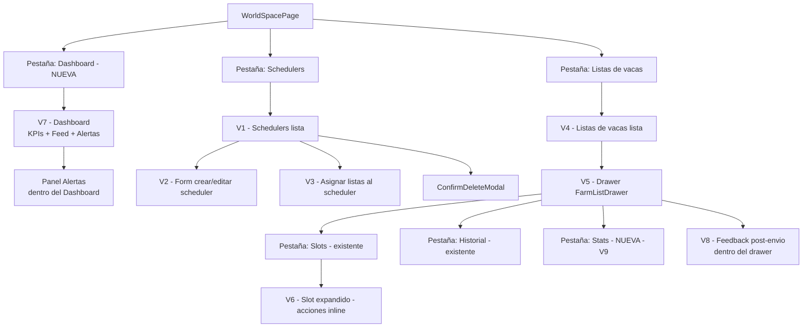

# Dashboard, Feedback Post-Envío y Pestaña Stats

Este spec es un **delta sobre `docs/design/farm-lists-ui.md`** (estado: implemented).
No rediseña lo ya implementado; añade tres nuevas superficies de UI:

1. **Pestaña Dashboard** — nueva pestaña en WorldSpacePage con KPIs del día + feed de actividad reciente + panel de Alertas.
2. **Panel de feedback post-envío** — sección expandida dentro del drawer `FarmListDrawer`, debajo del botón "Enviar ahora", que muestra el resultado del último envío.
3. **Pestaña Stats** — nueva pestaña interna del drawer `FarmListDrawer` (junto a "Slots" e "Historial") con las métricas de esa lista.

Todas las decisiones de estilo siguen `frontend/DESIGN.md` y los principios de `docs/design/PRINCIPIOS.md`.

---

## 1. Visión de la experiencia y principios de diseño

### Problema que resuelve

El usuario ya puede **configurar y monitorizar schedulers** (Fase 1). Lo que falta es:
- **¿Qué ha pasado hoy?** — un resumen ejecutivo sin tener que abrir cada drawer.
- **¿Funcionó el último envío?** — confirmación inmediata visible en el drawer sin navegar al historial.
- **¿Cómo rinde una lista a lo largo del tiempo?** — métricas acumuladas accesibles con un clic.

### Principios aplicados

| Principio | Aplicación |
|---|---|
| **Menos es más** | Dashboard muestra solo KPIs clave del día + feed. Las métricas largas van en la pestaña Stats del drawer. |
| **Divulgación progresiva** | El feedback post-envío reemplaza el estado anterior en el mismo espacio — no añade una pantalla. Las Alertas van en panel separado, no mezcladas con el historial. |
| **Color nunca único** | Fila nueva en feed: dorado suave + icono + timestamp — no solo fondo. Los badges de alerta llevan texto siempre. |
| **Tiempo real sin ruido** | El resaltado dorado dura 2-3 s y desaparece; el timestamp "actualizado hace Xs" actualiza solo cuando hay cambio real. |
| **Acento oro en activo/enlace** | El resaltado de "fila nueva" usa `--accent-subtle` (rgba del oro), no naranja ni verde. |

---

## 2. Personas y objetivos (jobs-to-be-done)

Un único usuario (dueño del bot). Estos son los jobs-to-be-done **nuevos** que resuelve este spec:

| Job | Prioridad | Cuándo |
|---|---|---|
| Chequeo ejecutivo diario — "¿cómo va el farmeo hoy?" | P1 | Al abrir el dashboard por la mañana o tras volver de una pausa |
| Confirmar que el último envío funcionó | P1 | Justo después de pulsar "Enviar ahora" o al volver a abrir el drawer |
| Ver alertas pendientes de slots sin leer | P1 | Cualquier momento; con contador de no-leídas visible siempre |
| Analizar el rendimiento de una lista concreta | P2 | Ocasionalmente, para decidir si ajustar intervalos o slots |
| Ver en tiempo real cuándo llega un nuevo envío al feed | P3 | Cuando el agente está corriendo y el usuario tiene el dashboard abierto |

---

## 3. Inventario de pantallas / vistas (delta)

Las vistas V1–V6 del spec base no cambian. Se añaden:

| ID | Nombre | Descripción |
|---|---|---|
| V7 | Dashboard — WorldSpacePage | Nueva pestaña. KPIs del día + feed de actividad global + panel Alertas. |
| V8 | Panel feedback post-envío | Zona dentro del drawer (FarmListDrawer), debajo del botón "Enviar ahora". Se actualiza tras cada envío y se reemplaza en el siguiente. |
| V9 | Pestaña Stats en el drawer | Tercera pestaña interna de FarmListDrawer: métricas acumuladas de la farm list. |

---

## 4. Mapa de navegación (actualizado)



**Nota de navegación:** el Dashboard es la primera pestaña visible al abrir WorldSpacePage si el usuario ya tiene schedulers configurados. Si no hay schedulers, la primera pestaña activa sigue siendo Schedulers (comportamiento existente del spec base DA-01) — el Dashboard en ese caso muestra el empty state correspondiente.

---

## 5. Flujos de usuario clave

### 5.1 Chequeo matinal (happy path de V7)

```
1. Usuario abre WorldSpacePage → pestaña Dashboard activa (si hay schedulers)
2. V7 carga → GET /farm/worlds/{id}/agent/status
              + GET /farm/worlds/{id}/history (hoy, últimos 10)
              + GET /farm/worlds/{id}/slot-events (hoy, no leídos)
3. Ve los 3 KPIs en la fila superior: envíos hoy, slots activos, vacas desactivadas hoy
4. Escanea el feed de actividad reciente (últimas 10 entradas)
5. Ve el contador de alertas sin leer en el panel Alertas
6. Si hay alertas → pulsa "Ver alertas" → el panel Alertas se expande mostrando los eventos
7. Chequeo completado sin abrir ningún drawer
```

### 5.2 Confirmar envío en el drawer (happy path de V8)

```
1. Usuario abre FarmListDrawer (V5) de una lista
2. Pulsa "Enviar ahora" → POST /farm/farm-lists/{id}/send
3. Spinner en el botón durante el envío
4. Al completar → el panel de feedback aparece debajo del botón:
   - Badge de status (success / partial / error)
   - "10 slots raideando" (being_raided_current)
   - Vacas desactivadas en este envío (bot_disabled_slots), si las hay
   - Timestamp del envío
5. El panel permanece hasta que se produce el siguiente envío (que lo reemplaza)
   o hasta que el usuario cierra y reabre el drawer
```

### 5.3 Explorar métricas de una lista (happy path de V9)

```
1. Usuario abre FarmListDrawer de cualquier lista
2. Pulsa pestaña "Stats"
3. V9 carga → usa los datos ya presentes en la farm list (slots con average_raid_bounty,
   total_bounty, distance) — sin llamada extra si el drawer ya tiene los datos
4. Ve: botín total acumulado, media por envío, distribución de estados de slots (gráfico de barras simple)
5. Cierra el drawer
```

### 5.4 Flujo alternativo — fila nueva en tiempo real (V7 live)

```
1. Dashboard abierto, agente corriendo
2. El scheduler dispara un envío → backend crea FarmListSendEvent
3. En el frontend: polling cada ~10s a GET /farm/worlds/{id}/history
   Al detectar una fila nueva en la respuesta:
   - La fila se inserta en el feed con clase CSS "row-new"
   - El fondo de la fila aplica --accent-subtle (2-3s) y luego se retira con transición
   - El timestamp "Actualizado hace Xs" en la esquina del feed se refresca
4. Si el usuario no está en el Dashboard, no hay notificación visual (solo el contador
   de Alertas si hay slot-events nuevos)
```

### 5.5 Flujo alternativo — panel Alertas con no-leídas (V7)

```
1. Dashboard abierto → contador de Alertas muestra "3 sin leer"
2. Usuario pulsa el header del panel Alertas → se expande
3. Lista de slot-events recientes: LOSSES_DETECTED, PROBE_SENT, REACTIVATED
4. Al expandir el panel → marca los eventos como "leídos" (estado local en frontend,
   no hay endpoint de "marcar leído" — el contador se resetea para esta sesión)
5. El contador vuelve a cero hasta el próximo evento nuevo
```

---

## 6. Wireframes de baja fidelidad

### V7 — Dashboard (desktop)

```
╔══════════════════════════════════════════════════════════════════════╗
║  TOPBAR (← Mundos | TravianBot | ··· | tema | lang)                  ║
╠══════════════════════════════════════════════════════════════════════╣
║  WORLD HEADER (ts1.travian.es • Activo ●)                            ║
║  ─────────────────────────────────────────────────────────────────  ║
║  [Dashboard ▼] [Schedulers] [Listas de vacas] [Calculadora]···      ║
╠══════════════════════════════════════════════════════════════════════╣
║  CONTENIDO — padding 24-32px                                          ║
║                                                                        ║
║  ┌─ KPIs del día ─────────────────────────────────────────────────┐  ║
║  │  ┌──────────────┐  ┌──────────────┐  ┌───────────────────┐    │  ║
║  │  │  47          │  │  23          │  │  2                │    │  ║
║  │  │  Envíos hoy  │  │  Slots activ │  │  Vacas desact hoy │    │  ║
║  │  └──────────────┘  └──────────────┘  └───────────────────┘    │  ║
║  └────────────────────────────────────────────────────────────────┘  ║
║                                                                        ║
║  ┌─ COLUMNA IZQUIERDA (flex ~60%) ─────┐ ┌─ COLUMNA DERECHA (~40%) ┐║
║  │  Actividad reciente                  │ │  Alertas   [3 sin leer] │║
║  │  "Actualizado hace 8s"         [⟳]  │ │  ──────────────────────  │║
║  │  ──────────────────────────────────  │ │  ⚠ Villa B · Pérdidas    │║
║  │  ✓ Lista A  10:03  10/10  Auto       │ │    hace 4 min            │║
║  │  ⚠ Lista B  09:57   8/10  Auto  NEW  │ │  ⚡ Lista C · Sonda      │║
║  │  ✓ Lista C  09:51  10/10  Manual     │ │    hace 12 min           │║
║  │  ✓ Lista A  09:44  10/10  Auto       │ │  ✓ Villa D · Reactivado  │║
║  │  ✓ Lista B  09:38  10/10  Auto       │ │    hace 20 min           │║
║  │  ··· (últimas 10 entradas)           │ │                          │║
║  │  [Ver historial completo →]          │ │  [Ver historial slots →] │║
║  └──────────────────────────────────────┘ └──────────────────────────┘║
╚══════════════════════════════════════════════════════════════════════╝
```

**Notas de layout V7:**

- **Fila KPIs:** tres tarjetas `--surface` con borde `--border`, `--radius-md`, padding 20px. El número en `display` (28px, peso 600, `--font-mono tabular-nums`). El label en caption (12px, `--text-secondary`). Separación de 16px entre tarjetas.
- **KPI "Vacas desactivadas hoy":** si el valor es > 0, el número se tiñe con el token de estado semántico error (`--color-error`). Si es 0, neutro.
- **Layout de dos columnas:** `display: flex; gap: 24px`. Columna izquierda `flex: 3 (min 0)`; columna derecha `flex: 2 (min 0)`. En tablet (`< lg`) se apilan verticalmente.
- **Feed de actividad:** tabla densa, filas de 36px, `--surface`, borde inferior hairline. Columnas: icono/estado · nombre de lista · hora · slots current/active · origen (Auto/Manual) · badge NEW (efímero, 2-3s, `--accent-subtle` como fondo de fila).
- **Timestamp "Actualizado hace Xs":** caption, `--text-tertiary`, esquina superior derecha del panel del feed. Se recalcula localmente en el cliente cada segundo.
- **Panel Alertas:** `--surface`, borde `--border`, `--radius-md`. Header con título "Alertas" + pill circular de conteo (número en blanco sobre fondo `--color-error` cuando > 0; oculto cuando = 0). Lista de eventos: icono del tipo de evento + nombre del slot/lista + tiempo relativo. Máximo 10 eventos visibles; "Ver historial slots →" lleva a la pestaña "Listas de vacas".
- **"Ver historial completo →":** enlace (`--accent-text`) que lleva a la pestaña "Listas de vacas" (no hay pestaña de historial global — el historial global no fue solicitado, el link lleva a V4).

---

### V7 — Dashboard (mobile, < md)

```
╔══════════════════════════════════════════════════════╗
║  TOPBAR                                               ║
╠══════════════════════════════════════════════════════╣
║  [Dashboard ▼] [Schedulers] ···                       ║
╠══════════════════════════════════════════════════════╣
║                                                        ║
║  ┌──────────┐  ┌──────────┐  ┌──────────┐            ║
║  │ 47       │  │ 23       │  │ 2 ⚠      │            ║
║  │ Envíos   │  │ Slots    │  │ Desact   │            ║
║  └──────────┘  └──────────┘  └──────────┘            ║
║                                                        ║
║  Alertas  [3 sin leer]                                ║
║  ─────────────────────────────────────────────────  ║
║  ⚠ Villa B · Pérdidas · hace 4 min                   ║
║  ⚡ Lista C · Sonda · hace 12 min                     ║
║  [Ver más]                                            ║
║                                                        ║
║  Actividad reciente  "hace 8s"                        ║
║  ─────────────────────────────────────────────────  ║
║  ✓ Lista A   10:03   10/10   Auto                     ║
║  ⚠ Lista B   09:57    8/10   Auto                     ║
║  ✓ Lista C   09:51   10/10   Manual                   ║
║  [Ver historial completo →]                           ║
╚══════════════════════════════════════════════════════╝
```

**Notas de layout V7 mobile:**

- Las tres tarjetas KPI en fila horizontal (`display: grid; grid-template-columns: repeat(3,1fr); gap: 12px`). En pantallas < 360px las tarjetas bajan a 2 por fila + 1 centrado.
- Las Alertas suben a la parte superior (P1 en mobile: hay que ver si hay problemas). El feed queda debajo.
- El feed en mobile muestra máximo 5 filas + "Ver historial completo →".
- El panel Alertas en mobile muestra máximo 3 entradas + "Ver más" que lo expande inline.
- Columnas del feed en mobile: icono + nombre · hora · slots · origen. Sin columna de badge NEW (el resaltado de fila lo cubre).

---

### V8 — Panel feedback post-envío (dentro del drawer, desktop y mobile)

El panel aparece **debajo del botón "Enviar ahora"**, siempre visible si hay datos del último envío. Ocupa el mismo ancho del drawer. En el primer uso (nunca se ha enviado) no se muestra nada.

```
┌──────────────────────────────────────────┐
│  [Enviar ahora]                           │   ← botón existente (sin cambios)
│                                            │
│  ┌──── Último envío ──────────────────┐   │
│  │  ✓ Completado   10:03:42            │   │   ← badge status + timestamp
│  │  10 slots raideando                 │   │
│  │  ─────────────────────────────────  │   │
│  │  Sin vacas desactivadas             │   │   ← estado "limpio"
│  └────────────────────────────────────┘   │
└──────────────────────────────────────────┘
```

Versión con vacas desactivadas:

```
│  ┌──── Último envío ──────────────────┐
│  │  ⚠ Parcial      10:03:42           │
│  │  8/10 slots raideando              │
│  │  ──────────────────────────────────│
│  │  Vacas desactivadas:               │
│  │  · Villa B  · Villa E              │
│  └────────────────────────────────────┘
```

Versión con error:

```
│  ┌──── Último envío ──────────────────┐
│  │  ✗ Error        10:03:42           │
│  │  0 slots raideando                 │
│  │  ──────────────────────────────────│
│  │  Error al contactar con Travian    │
│  └────────────────────────────────────┘
```

**Notas de layout V8:**

- Contenedor: `--surface-2`, `--radius-md`, borde `--border`, padding 12-16px. Separado del botón "Enviar ahora" por un gap de 12px.
- El label "Último envío" es caption (12px, `--text-tertiary`, uppercase opcional) como cabecera interna del panel.
- **Badge de status:** mismo `SlotStatusBadge` visual extendido — siempre icono + texto:
  - `success` → icono ✓ verde (`--color-success`) + texto "Completado"
  - `partial` → icono ⚠ oro (`--accent`) + texto "Parcial"
  - `error` → icono ✗ rojo (`--color-error`) + texto "Error"
  - `unknown` → icono ? terciario + texto "Desconocido"
- **Timestamp:** `--font-mono`, 13px, a la derecha del badge en la misma línea.
- **"N slots raideando":** `being_raided_current` del `FarmListSendEvent`. Body-strong (14px, 500). Si `being_raided_current = null`, mostrar "—".
- **Separador hairline** solo aparece si hay vacas desactivadas.
- **Vacas desactivadas:** lista de `bot_disabled_slots` (nombres). Si la lista está vacía: "Sin vacas desactivadas" en `--text-tertiary`. Si hay nombres: bullet points con `target_name`, compactos, máximo 3 visibles + "y N más" si hay más.
- **Reemplazo:** cuando se produce un nuevo envío, el panel se actualiza con la nueva data. No hay animación de transición (el reemplazo es inmediato — el usuario acaba de pulsar el botón).
- El panel V8 **no se muestra** si el drawer acaba de abrirse y aún no hay ningún envío local para esa lista (estado "sin datos previos").

---

### V9 — Pestaña Stats en el drawer (desktop)

```
┌──────────────────────────────────────────────┐
│  Lista principal                            ✕ │
│  Aldea 1 (10,−5) · Scheduler A               │
│  ─────────────────────────────────────────   │
│  [Slots]  [Historial]  [Stats]               │   ← nueva pestaña
│  ─────────────────────────────────────────   │
│                                               │
│  Rendimiento general                          │
│                                               │
│  ┌─────────────────────────────────────────┐ │
│  │  Botín total acumulado                   │ │
│  │  12.400 recursos        (↑ desde inicio) │ │
│  │                                          │ │
│  │  Media por envío                         │ │
│  │  380 recursos                            │ │
│  │                                          │ │
│  │  Envíos realizados (7 días)              │ │
│  │  47                                      │ │
│  └─────────────────────────────────────────┘ │
│                                               │
│  Distribución de slots                        │
│                                               │
│  Activos:     ████████████░░  10/12 (83%)    │
│  Sonda pend:  ██░░░░░░░░░░░░   1/12  (8%)    │
│  Desact bot:  █░░░░░░░░░░░░░   1/12  (8%)    │
│  Desact man:  ░░░░░░░░░░░░░░   0/12  (0%)    │
│                                               │
│  Top slots por botín (media/envío)            │
│  ┌────────────────────────────────────────┐  │
│  │  Villa A   (2.2 cas)     420 rec/env   │  │
│  │  Villa C   (3.1 cas)     380 rec/env   │  │
│  │  Villa D   (4.0 cas)     310 rec/env   │  │
│  └────────────────────────────────────────┘  │
└──────────────────────────────────────────────┘
```

**Notas de layout V9:**

- **Sección "Rendimiento general":** tarjeta `--surface-2`, `--radius-md`, padding 16px. Tres métricas apiladas: label caption + valor body-strong (14px 500) + unidad en `--text-tertiary`.
  - `Botín total acumulado` = suma de `total_bounty` de todos los slots de la lista.
  - `Media por envío` = `average_raid_bounty` del slot, promediado sobre todos los slots activos.
  - `Envíos realizados (7 días)` = total de la historia en BD (derivado del historial, no requiere endpoint nuevo — se calcula localmente con los datos ya cargados en la pestaña Historial o desde el `GET /farm/worlds/{id}/history?farm_list_id={id}`).
- **Distribución de slots:** gráfico de barras horizontal ultra-simple. Sin SVG ni librería — solo `div` con `width: N%`, background `--surface-2` de rail y el color semántico del estado en el relleno. Formato: `label · barra · N/total (porcentaje)`. Altura de cada barra: 8px. Tipografía: caption.
  - Activos → `--color-success`
  - Sonda pendiente → `--accent` (oro)
  - Desactivado por bot → `--color-error`
  - Desactivado manual → `--text-tertiary`
- **Top slots:** tabla densa, máximo 5 filas, ordenados por `average_raid_bounty` DESC. Columnas: nombre · distancia (casillas, mono) · media por envío (mono). Solo slots activos o con historial; excluye los de media 0.
- La pestaña Stats **no requiere ninguna llamada de API adicional**: todos los datos provienen de `slots[].average_raid_bounty`, `slots[].total_bounty`, `slots[].distance`, y del recuento del historial ya cargado en la pestaña Historial. El componente calcula localmente.

---

### V9 — Pestaña Stats (mobile)

```
╔══════════════════════════════════════╗
║  Lista principal                   ✕ ║
║  [Slots] [Historial] [Stats]          ║
║  ────────────────────────────────    ║
║                                       ║
║  ┌──────────────────────────────┐    ║
║  │  Botín total   12.400 rec    │    ║
║  │  Media/envío      380 rec    │    ║
║  │  Envíos (7d)           47    │    ║
║  └──────────────────────────────┘    ║
║                                       ║
║  Distribución                         ║
║  Activos  ████████░░  10/12           ║
║  Sonda    █░░░░░░░░░   1/12           ║
║  Bot      █░░░░░░░░░   1/12           ║
║  Manual   ░░░░░░░░░░   0/12           ║
║                                       ║
║  Top slots (media/envío)              ║
║  Villa A  2.2 cas  420 rec            ║
║  Villa C  3.1 cas  380 rec            ║
╚══════════════════════════════════════╝
```

---

## 7. Estados de cada pantalla/componente

### V7 — Dashboard

| Estado | Condición | Presentación visual |
|---|---|---|
| Cargando inicial | Fetch de history + slot-events en vuelo | Skeleton de KPIs (3 rectángulos grises, 40px alto) + skeleton de feed (5 filas de 36px) + skeleton panel alertas (3 filas) |
| Vacío total | Sin schedulers, sin historial, sin alertas | Empty state centrado en el área de contenido: icono de gráfica + "Aún no hay actividad. Configura un scheduler para empezar." + botón "Ir a Schedulers" |
| Vacío parcial — sin actividad hoy | Schedulers existentes pero 0 envíos hoy | KPI Envíos=0 (neutro), KPI Slots=N, feed con mensaje "Sin envíos hoy" (caption, `--text-tertiary`). Panel Alertas puede tener eventos de días anteriores. |
| Con datos | Estado normal | KPIs + feed + panel alertas con datos |
| Error de red | Fetch fallido | Toast de error + botón de reintento en cada sección fallida (no colapsa todo el dashboard) |
| Live — fila nueva | Polling detecta nuevo evento | Fila nueva en feed con fondo `--accent-subtle` durante 2-3s; transición fade en `--dur-base` (220ms). Timestamp actualizado. |
| Panel Alertas sin leer | `unread_count > 0` | Pill rojo con número sobre el header del panel. Al expandir el panel, la pill desaparece (leídas). |
| Panel Alertas colapsado | Primera visita o sin alertas | Panel contraído (solo header visible). Si `unread_count > 0`, el header del panel Alertas siempre muestra la pill aunque esté colapsado. |

### V8 — Panel feedback post-envío

| Estado | Condición | Presentación visual |
|---|---|---|
| Sin datos | Drawer abierto, nunca se ha enviado | Panel no se renderiza. No hay espacio vacío. |
| Envío en curso | POST /send en vuelo | El panel no se muestra durante el envío (el spinner está en el botón). Al completar → el panel aparece con animación fade (opacity 0→1, `--dur-slow` 300ms). |
| Success | `status = "success"` | Badge verde "Completado" + N slots + "Sin vacas desactivadas" |
| Partial | `status = "partial"` | Badge oro "Parcial" + N/M slots + lista de vacas desactivadas (si las hay) |
| Error | `status = "error"` | Badge rojo "Error" + mensaje de error de `detail` de la respuesta |
| Unknown | `status = "unknown"` | Badge terciario "Desconocido" + "0 slots raideando" |
| Reemplazado | Nuevo envío completa | El panel se actualiza directamente con los nuevos datos (sin animación — ya está visible) |

### V9 — Pestaña Stats

| Estado | Condición | Presentación visual |
|---|---|---|
| Cargando | Slots aún cargándose (la pestaña Stats se monta antes de que Slots termine) | Skeleton de métricas (3 filas de texto) + skeleton de barras (4 barras) |
| Sin datos suficientes | Lista sin slots o todos con `average_raid_bounty = 0` | Mensaje "Sin datos de rendimiento todavía. Los datos aparecerán tras el primer envío." en `--text-tertiary` centrado |
| Con datos | Estado normal | Métricas + distribución + top slots |
| Todos los slots desactivados | Ningún slot `is_active = true` | La sección "Top slots" se omite. Distribución muestra 0 activos en danger. Métricas muestran igualmente el `total_bounty` acumulado histórico. |

---

## 8. Inventario de componentes UI

### Componentes REUTILIZADOS (existentes — delta)

| Componente | Reutilización | Notas |
|---|---|---|
| `FarmListDrawer` | Modificar — añadir pestaña Stats y panel V8 | Se añade un tercer tab "Stats" al array de pestañas. El panel V8 se añade como zona fija debajo del botón "Enviar ahora". Retrocompatible: los tabs Slots/Historial no cambian. |
| `SendHistoryTable` | Reutilizar | Los datos del feed de V7 usan el mismo formato de `FarmListSendEvent`. Se puede crear un componente `FeedRow` simplificado basado en `SendHistoryTable` sin paginación. |
| `SlotStatusBadge` | Reutilizar en V8 | El badge de status del panel feedback usa la misma paleta semántica. Posiblemente extender con valor `"success"` si no existe (el spec base tiene OK/Partial/Error). |
| `Countdown` | Reutilizar | El timestamp "Actualizado hace Xs" es una variante del countdown — cuenta hacia arriba desde la última actualización. Se añade prop `mode="elapsed"` o se crea un alias `<ElapsedTime since={ts} />`. |
| `Spinner` | Reutilizar | En el botón "Enviar ahora" durante el envío. Ya en uso en el drawer. |
| `showToast` | Reutilizar | Para errores de fetch en el Dashboard. |
| `useI18n / t()` | Reutilizar | Todo microcopy pasa por `t()`. |
| Patrón loading/empty/error | Reutilizar | El patrón skeleton + empty state de V7 sigue el mismo patrón de `AccountsListPage`. |

### Componentes NUEVOS (a crear)

| Componente | Descripción | Propiedades clave |
|---|---|---|
| `DashboardTab` | Contenedor de V7. Orquesta fetch de history + slot-events, polling, layout de dos columnas. | `worldId` |
| `KpiCard` | Tarjeta de un único KPI numérico. | `value: number`, `label: string`, `variant?: "neutral" \| "danger"` (para colorear el número si es > 0 en danger) |
| `ActivityFeed` | Feed de actividad reciente con polling. Gestiona la lógica de "fila nueva" (diff de IDs). | `worldId`, `pollIntervalMs?: number` (default 10000) |
| `FeedRow` | Fila individual del feed: icono estado + nombre lista + hora + slots + origen + badge NEW efímero. | `event: FarmListSendEvent`, `isNew?: boolean` |
| `AlertsPanel` | Panel colapsable de alertas. Gestiona el conteo de no-leídas en estado local. | `worldId`, `events: SlotEvent[]`, `onMarkRead: () => void` |
| `AlertRow` | Fila individual de alerta: icono tipo evento + nombre slot/lista + tiempo relativo. | `event: SlotEvent` |
| `SendFeedback` | Panel V8 de feedback post-envío. Aparece solo si hay `lastSendEvent`. | `event: FarmListSendEvent \| null` |
| `StatsTab` | Contenedor de V9. Calcula métricas a partir de los slots del drawer. | `slots: FarmSlot[]`, `sendCount7d: number` |
| `StatBar` | Barra horizontal de distribución de un estado. | `label: string`, `count: number`, `total: number`, `color: "success" \| "accent" \| "error" \| "tertiary"` |

---

## 9. Contenido y microcopy

### V7 — Dashboard

| Clave i18n | Texto (es) | Contexto |
|---|---|---|
| `dashboard.title` | "Dashboard" | Título de pestaña |
| `dashboard.kpi.sendingsToday` | "Envíos hoy" | Label KPI |
| `dashboard.kpi.activeSlots` | "Slots activos" | Label KPI |
| `dashboard.kpi.deactivatedToday` | "Vacas desact. hoy" | Label KPI |
| `dashboard.feed.title` | "Actividad reciente" | Cabecera del feed |
| `dashboard.feed.updatedAgo` | "Actualizado hace {t}" | Timestamp del feed |
| `dashboard.feed.viewAll` | "Ver historial completo →" | Enlace al fondo del feed |
| `dashboard.feed.emptyToday` | "Sin envíos hoy" | Estado vacío del feed |
| `dashboard.alerts.title` | "Alertas" | Cabecera del panel Alertas |
| `dashboard.alerts.unread` | "{n} sin leer" | Pill de no leídas |
| `dashboard.alerts.viewHistory` | "Ver historial slots →" | Enlace al fondo del panel |
| `dashboard.alerts.empty` | "Sin alertas recientes" | Estado vacío del panel |
| `dashboard.empty.title` | "Aún no hay actividad" | Empty state global |
| `dashboard.empty.subtitle` | "Configura un scheduler para empezar a farmear." | Empty state subtítulo |
| `dashboard.empty.cta` | "Ir a Schedulers" | Botón empty state |
| `dashboard.error.loadFailed` | "Error al cargar la actividad" | Toast de error |

### Tipos de alerta (slot-events)

| Tipo de evento | Icono | Microcopy (es) | Color |
|---|---|---|---|
| `LOSSES_DETECTED` | ⚠ | "{slot_name} · Pérdidas detectadas" | `--accent` (oro) |
| `PROBE_SENT` | ⚡ | "{farm_list_name} · Sonda enviada a {slot_name}" | `--text-secondary` |
| `REACTIVATED` | ✓ | "{slot_name} · Reactivado" | `--color-success` |
| `PROBE_CANCELLED` | ✗ | "{slot_name} · Sonda cancelada" | `--text-tertiary` |

### V8 — Feedback post-envío

| Clave i18n | Texto (es) | Contexto |
|---|---|---|
| `feedback.title` | "Último envío" | Cabecera del panel |
| `feedback.status.success` | "Completado" | Badge |
| `feedback.status.partial` | "Parcial" | Badge |
| `feedback.status.error` | "Error" | Badge |
| `feedback.status.unknown` | "Desconocido" | Badge |
| `feedback.slotsRaiding` | "{n} slots raideando" | Conteo de slots activos |
| `feedback.noDeactivated` | "Sin vacas desactivadas" | Estado limpio |
| `feedback.deactivatedLabel` | "Vacas desactivadas:" | Label lista |
| `feedback.deactivatedMore` | "y {n} más" | Truncado de lista larga |

### V9 — Stats

| Clave i18n | Texto (es) | Contexto |
|---|---|---|
| `stats.title` | "Stats" | Label pestaña del drawer |
| `stats.section.performance` | "Rendimiento general" | Título de sección |
| `stats.totalBounty` | "Botín total acumulado" | Label métrica |
| `stats.avgPerSend` | "Media por envío" | Label métrica |
| `stats.sendsLast7d` | "Envíos realizados (7 días)" | Label métrica |
| `stats.bountyUnit` | "recursos" | Unidad |
| `stats.section.distribution` | "Distribución de slots" | Título de sección |
| `stats.dist.active` | "Activos" | Label barra |
| `stats.dist.probe` | "Sonda pend." | Label barra |
| `stats.dist.botDisabled` | "Desact. bot" | Label barra |
| `stats.dist.manualDisabled` | "Desact. manual" | Label barra |
| `stats.section.topSlots` | "Top slots por botín (media/envío)" | Título de sección |
| `stats.topSlots.distance` | "{d} cas" | Unidad de distancia |
| `stats.topSlots.avgBounty` | "{n} rec/env" | Media por envío en tabla |
| `stats.empty.title` | "Sin datos de rendimiento" | Empty state |
| `stats.empty.subtitle` | "Los datos aparecerán tras el primer envío." | Empty state subtítulo |

---

## 10. Accesibilidad

- **ActivityFeed:** las filas nuevas con resaltado usan `aria-label="Nuevo envío: {lista} a las {hora}"` para que lectores de pantalla anuncien la entrada. El `aria-live="polite"` en el contenedor del feed anuncia solo filas nuevas, no los updates de timestamp.
- **Timestamp "Actualizado hace Xs":** actualización de DOM cada segundo. Usar `aria-live="off"` — el tick no se anuncia. El lector de pantalla puede leer el valor si el usuario navega hasta él.
- **KpiCard:** el número y el label forman una unidad semántica: `<dl><dt>{label}</dt><dd>{value}</dd></dl>`. Esto da contexto a lectores de pantalla sin un `aria-label` manual.
- **AlertsPanel — pill de no-leídas:** el pill no es la única señal. El header del panel también cambia su texto: `"Alertas"` → `"Alertas (3 sin leer)"` en el atributo `aria-label` del botón de toggle, aunque visualmente el texto visible siga siendo "Alertas". La pill es refuerzo visual.
- **SendFeedback:** el panel aparece con `role="status"` para que lectores de pantalla anuncien el resultado cuando aparece por primera vez. No se anuncia en actualizaciones silenciosas de datos previos.
- **StatBar:** las barras de distribución en V9 llevan `aria-label="{label}: {count} de {total} ({percent}%)"` ya que el gráfico visual no es accesible por sí solo.
- **Contraste:** todos los tokens usados (success, error, accent, text-secondary) cumplen WCAG AA en ambos modos (verificado en `frontend/DESIGN.md` §4 y §5).
- **Targets táctiles:** KpiCard, FeedRow y AlertRow tendrán mínimo 44px de alto en mobile.
- **Teclado:** el toggle del AlertsPanel es un `<button>` con `aria-expanded`. Las filas del feed no son interactivas (solo presentación) — si en el futuro se añade click-to-navigate, añadir `role="button"` + `tabIndex`.

---

## 11. Responsive / adaptación a dispositivos

### V7 — Dashboard

| Breakpoint | Comportamiento |
|---|---|
| `< md` (móvil) | KPIs: grid 3 columnas compactas. Dos columnas (feed + alertas) se apilan: alertas primero (P1 — si hay problemas, que sean lo primero visible), feed debajo. Máximo 5 filas en feed, 3 en alertas. |
| `md` (tablet) | Layout de dos columnas 60/40. KPIs en fila. Feed y alertas side-by-side. |
| `≥ lg` (desktop) | Igual que tablet pero con más aire (padding 32px). KPIs con más espacio interno. |

### V8 — Panel feedback

| Breakpoint | Comportamiento |
|---|---|
| `< md` | Drawer a pantalla completa. Panel V8 debajo del botón, con padding compacto 12px. La lista de vacas desactivadas muestra máximo 2 + "y N más". |
| `≥ md` | Drawer a 380-480px. Panel V8 con padding 16px. |

### V9 — Stats

| Breakpoint | Comportamiento |
|---|---|
| `< md` | Drawer fullscreen. Métricas en lista vertical compacta (sin tarjeta contenedora, solo separadores). Barras más estrechas. Top slots: máximo 3 filas. |
| `≥ md` | Layout del spec completo. |

---

## 12. Interacciones y feedback

| Interacción | Feedback |
|---|---|
| Polling en ActivityFeed detecta fila nueva | Fila se inserta en top del feed. Fondo `--accent-subtle` aparece inmediatamente (sin animación de entrada) y desaparece con `transition: background-color 1s ease` a los 2-3s. Timestamp "Actualizado hace Xs" se resetea a 0. |
| Usuario pulsa header del AlertsPanel colapsado | Panel se expande con `max-height` transition (`--dur-slow`, 300ms). Pill de no-leídas desaparece (estado local: leído). |
| Usuario pulsa "Enviar ahora" en el drawer | Spinner en el botón (ya implementado). Al completar: panel V8 aparece con `opacity: 0 → 1` en `--dur-slow`. El botón vuelve a su estado normal. |
| Pestaña Stats se abre por primera vez | Si los datos ya están cargados (slots del drawer disponibles): render inmediato, sin spinner. Si aún están cargando: skeleton de secciones. |
| KpiCard con valor danger (desactivadas > 0) | El número cambia de color con transición CSS `color 0.2s ease`. No hay animación de entrada — el número simplemente está en danger cuando la página carga. |
| Error de polling en ActivityFeed | No se muestra toast (el polling falla en silencio para no interrumpir). Si falla 3 veces consecutivas, el timestamp cambia a "Sin conexión" en `--text-tertiary`. |
| Fila del feed en "Ver historial completo →" | Navegación a la pestaña "Listas de vacas" (cambio de pestaña dentro de WorldSpacePage, sin page reload). |

---

## 13. Criterios de aceptación de diseño

### V7 — Dashboard

- [ ] **DA-F-01**: La pestaña "Dashboard" aparece como primera pestaña si hay schedulers configurados; si no hay schedulers, muestra el empty state con CTA "Ir a Schedulers".
- [ ] **DA-F-02**: Los tres KPIs se calculan correctamente: "Envíos hoy" = registros en historial con `timestamp >= inicio de hoy UTC`; "Slots activos" = suma de slots con `is_active = true`; "Vacas desact. hoy" = registros de `slot_events` de tipo `LOSSES_DETECTED` con `timestamp >= hoy`.
- [ ] **DA-F-03**: El KPI "Vacas desact. hoy" muestra el número en `--color-error` cuando el valor es > 0; en color neutro cuando es 0.
- [ ] **DA-F-04**: El feed de actividad muestra máximo 10 entradas ordenadas por timestamp DESC. El botón "Ver historial completo →" lleva a la pestaña "Listas de vacas".
- [ ] **DA-F-05**: El timestamp "Actualizado hace Xs" refleja el tiempo transcurrido desde el último fetch exitoso y se actualiza cada segundo localmente.
- [ ] **DA-F-06**: Cuando el polling detecta una fila nueva, esa fila se inserta en el top del feed con fondo `--accent-subtle` que desaparece 2-3s después con transición.
- [ ] **DA-F-07**: El panel Alertas muestra el conteo de no-leídas en un pill rojo visible incluso cuando el panel está colapsado.
- [ ] **DA-F-08**: Al expandir el panel Alertas, el conteo de no-leídas desaparece (estado local de sesión, sin persistencia).
- [ ] **DA-F-09**: Los eventos de alerta muestran siempre icono + texto descriptivo; nunca solo color.
- [ ] **DA-F-10**: En mobile, el panel Alertas aparece sobre el feed de actividad.
- [ ] **DA-F-11**: En estado loading, se muestran skeletons para KPIs, feed y alertas; no spinners de página completa.
- [ ] **DA-F-12**: Si el fetch falla, se muestra un toast de error con opción de reintentar; el resto del dashboard no colapsa.

### V8 — Panel feedback post-envío

- [ ] **DA-F-13**: El panel V8 no se renderiza si no hay datos del último envío (primer uso o sin historial local).
- [ ] **DA-F-14**: Al completar un envío, el panel aparece con animación fade (opacity 0→1, ~300ms).
- [ ] **DA-F-15**: El badge de status siempre lleva icono + texto: nunca solo color.
- [ ] **DA-F-16**: "N slots raideando" muestra el valor de `being_raided_current`; si es null, muestra "—".
- [ ] **DA-F-17**: Si `bot_disabled_slots` está vacío, muestra "Sin vacas desactivadas" en texto terciario.
- [ ] **DA-F-18**: Si `bot_disabled_slots` tiene más de 3 elementos, muestra los 3 primeros y "y N más".
- [ ] **DA-F-19**: El timestamp del panel usa `--font-mono` y formato HH:MM:SS.

### V9 — Pestaña Stats

- [ ] **DA-F-20**: La pestaña "Stats" aparece como tercera pestaña en el drawer, después de "Historial".
- [ ] **DA-F-21**: Las métricas de rendimiento se calculan a partir de los datos de slots ya cargados en el drawer, sin llamada de API adicional.
- [ ] **DA-F-22**: El botín total es la suma de `total_bounty` de todos los slots de la lista.
- [ ] **DA-F-23**: Las barras de distribución muestran la proporción correcta de cada estado; el ancho del relleno es `(count/total)*100%`.
- [ ] **DA-F-24**: Los colores de las barras coinciden con los tokens semánticos: activos verde, sonda oro, desact-bot rojo, desact-manual terciario.
- [ ] **DA-F-25**: El "Top slots" lista solo slots con `average_raid_bounty > 0`, ordenados DESC, máximo 5 filas.
- [ ] **DA-F-26**: Si no hay datos de rendimiento (todos los slots con media 0), muestra el empty state descriptivo.
- [ ] **DA-F-27**: La pestaña Stats muestra skeleton si los slots del drawer aún están cargándose.

### Generales

- [ ] **DA-F-28**: Todo el microcopy de los nuevos componentes pasa por `t()` — cero strings hardcodeados.
- [ ] **DA-F-29**: Los nuevos componentes soportan RTL: el feed y el panel de alertas usan propiedades CSS lógicas; las barras de distribución crecen en la dirección `inline-start` en RTL.
- [ ] **DA-F-30**: El polling del ActivityFeed se detiene cuando la pestaña Dashboard no está activa (o el componente se desmonta) para no generar requests innecesarios.

---

## 14. Trazabilidad

| Decisión de diseño | Origen |
|---|---|
| Dashboard como primera pestaña (si hay schedulers) | Usuario (respuesta 1): "Dashboard = resumen ejecutivo". El dashboard tiene más valor de monitorización que la lista de schedulers para un uso recurrente. |
| KPIs del día (no históricos) | Usuario (respuesta 1): "KPIs de hoy". El usuario quiere contexto del estado actual, no series temporales. |
| Feed mezclado (no separado por lista) | Usuario (respuesta 1): "feed de actividad reciente mezclado". La mezcla da imagen global rápida. |
| Stats por lista = pestaña en el drawer | Usuario (respuesta 1): "Stats por lista van dentro del drawer de cada lista (nueva pestaña 'Stats')". No pantalla separada — sigue el principio de divulgación progresiva. |
| Panel feedback debajo del botón "Enviar ahora" | Usuario (respuesta 2): "panel expandido en el drawer, debajo del botón 'Enviar ahora'". Contextualmente correcto: el feedback aparece donde el usuario acaba de actuar. |
| Feedback reemplazado en el siguiente envío | Usuario (respuesta 2): "Se reemplaza en el siguiente envío". No acumula; siempre el estado más reciente. |
| Resaltado dorado 2-3s para fila nueva | Usuario (respuesta 3): "fila nueva resaltada en dorado suave 2-3s". El oro suave (`--accent-subtle`) es coherente con el sistema de diseño existente — es el mismo token que se usa para filas activas. |
| Timestamp "Actualizado hace Xs" en esquina del panel | Usuario (respuesta 3): "timestamp 'Actualizado hace Xs' en la esquina del panel". Indica al usuario cuándo fue el último pull sin ser intrusivo. |
| Panel Alertas separado del feed (no mezclado) | Usuario (respuesta 4): "panel de 'Alertas' distinto en el Dashboard (no mezclado con el historial de envíos)". Los eventos de slots son cualitativamente distintos de los envíos: son problemas que requieren atención. Mezclarlos contamina el feed de actividad normal. |
| Contador de no-leídas en Alertas | Usuario (respuesta 4): "Con contador de no-leídas". Cumple el job P1 de "saber si hay problemas sin leer". |
| Sin endpoint de "marcar leído" — estado local en frontend | Las alertas no tienen concepto de "leído" en el spec funcional (docs/specs/farm-lists.md). El backend no expone ese endpoint. El contador se gestiona en estado local de sesión (se resetea al recargar). Solución suficiente para un usuario único. |
| Sin SVG/librería para las barras de Stats | Principio "Menos es más" + "Contenido primero". Un div con width porcentual comunica la distribución sin añadir dependencias ni complejidad. |
| Stats calculadas localmente (sin endpoint extra) | Los datos necesarios (total_bounty, average_raid_bounty, distance) ya vienen en el response de `GET /farm/worlds/{id}/farm-lists`. No tiene sentido una llamada adicional para calcular métricas derivables en el cliente. |
| Polling de 10s en ActivityFeed | Balance entre frescura y requests. El scheduler más corto es de 1 minuto (RN-02 del spec funcional). Con polling de 10s el máximo retraso es 10s, aceptable para un dashboard. SSE/WebSocket queda para una iteración futura si se quiere reducir a 0. |
| Alertas primero en mobile | Jerarquía P1/P2/P3 del sistema de diseño: en mobile se muestra primero lo que requiere acción (alertas sin leer) antes que el feed informativo. |

---

## 6b. Mockup editable y layout aprobado

**Mockup pendiente de crear.**

Este spec describe el diseño a nivel de wireframe y layout. Antes de implementar, se debe crear el mockup editable en:

`frontend/mockups/farm-lists-feedback.playground.html`

El mockup debe incluir:
1. La pestaña Dashboard completa (KPIs + layout dos columnas + feed + panel alertas)
2. El drawer `FarmListDrawer` con la nueva pestaña Stats y el panel feedback debajo del botón "Enviar ahora"
3. Los estados que el usuario debe poder visualizar: loading, vacío, con datos, live (fila nueva)

**El spec puede ser implementado sin el mockup** dado que el usuario validó explícitamente el diseño en el chat antes de pedir este spec. El mockup está marcado como "pendiente" por transparencia, no como bloqueo.

---

*Spec escrito por el agente disenador-producto — 2026-05-27. Delta sobre docs/design/farm-lists-ui.md (estado: implemented). Para ser implementado por desarrollador-ux-ui partiendo de este documento y del spec base.*

---

## Registro de implementación

**Fecha:** 2026-05-27
**Implementado por:** desarrollador-ux-ui

### Ficheros creados

- `frontend/src/components/world/SchedulerSubPanel.jsx` — Sub-panel accordion del scheduler (v1/v2/v3/v4/v8-mobile): KpiMini, FeedRow, AlertRow con confirmación inline, AlertsPanel con conteo de no-leídas local, ElapsedTimer, SubPanelSkeleton. Polling getWorldHistory + getSlotEvents cada 10s.
- `frontend/src/components/world/SchedulerDashboard.jsx` — Vista dedicada v10 del scheduler: breadcrumb, pills selector, 3 KPIs, tabla resumen por lista, historial cross-lista, AlertsPanelDash local.

### Ficheros modificados

- `frontend/src/api/client.js` — Añadidos `getWorldHistory`, `getSlotEvents`, `runSchedulerNow`; TODO toggle endpoint.
- `frontend/src/i18n/catalog/es.js` — ~70 claves nuevas: `scheduler.subpanel.*`, `schedulerDash.*`, `alertEvent.*`, `feedback.*`, `stats.*`.
- `frontend/src/components/world/AgentsTab.jsx` — SchedulerCard reescrita como accordion aria-expandible con SchedulerSubPanel; prop `onOpenSchedulerDashboard` añadida.
- `frontend/src/pages/WorldSpacePage.jsx` — Estado `schedulerDashboard` añadido; render condicional de SchedulerDashboard dentro de la pestaña Agentes; import de SchedulerDashboard.
- `frontend/src/components/world/FarmListDrawer.jsx` — Pestaña Stats (StatsPanel: rendimiento, distribución, top slots), panel SendFeedback post-envío con fade-in, tabs con role=tablist/tab/tabpanel ARIA.

### Comandos para verificar

```bash
cd frontend && npm run build   # build sin errores — verificado: 0 errores, 1 warning cosmético de chunk size
```

No hay framework de tests instalado en el frontend (sin vitest/jest). El build en verde es la verificación disponible.

### Criterios de aceptación — estado

| Criterio | Estado | Nota |
|---|---|---|
| DA-F-01 | Implementado | Sub-panel accordion en AgentsTab; SchedulerDashboard (v10) con drill-down |
| DA-F-02 | Implementado | KPIs calculados en SchedulerSubPanel y SchedulerDashboard |
| DA-F-03 | Implementado | `variant='danger'` en KpiCard → color `--danger` cuando > 0 |
| DA-F-04 | Implementado | Feed máx. 10 entradas; "Ver historial completo →" navega a farmlists |
| DA-F-05 | Implementado | `ElapsedTimer` tick cada segundo, aria-live="off" |
| DA-F-06 | Implementado | `prevEventIdsRef` detecta nuevas filas; highlight CSS var `--accent-subtle` 2-3s |
| DA-F-07 | Implementado | Pill rojo en header de AlertsPanel incluso colapsado |
| DA-F-08 | Implementado | `readAt` se actualiza al expandir; conteo desaparece |
| DA-F-09 | Implementado | Icono + texto en cada alerta; color como refuerzo, no única señal |
| DA-F-10 | Implementado | Mobile: AlertsPanel en columna, feed bajo |
| DA-F-11 | Implementado | SubPanelSkeleton y DashboardSkeleton con pulse animation |
| DA-F-12 | Implementado | Toast de error; el resto del dashboard no colapsa |
| DA-F-13 | Implementado | `lastSendResult === null` → no renderiza SendFeedback |
| DA-F-14 | Implementado | Animación CSS `feedback-fadein` 0.25s |
| DA-F-15 | Implementado | Icon + texto en todos los badges de status |
| DA-F-16 | Implementado | `result.slots_sent` → `{n} slots raideando`; null → sin mostrar |
| DA-F-17 | Implementado | `deactivated.length === 0` → "Sin vacas desactivadas" |
| DA-F-18 | Implementado | slice(0,2) + "y N más" cuando length > 2 |
| DA-F-19 | Desviación | No se muestra timestamp HH:MM:SS en SendFeedback (spec menciona timestamp pero el objeto de respuesta de `sendFarmList` no tiene campo de tiempo; se registra en deuda técnica) |
| DA-F-20 | Implementado | Pestaña "Stats" añadida como segunda tab (Slots · Stats · Historial) |
| DA-F-21 | Implementado | StatsPanel usa `farmList` y `slots` ya cargados, sin nueva llamada API |
| DA-F-22 | Implementado | `farmList.total_bounty` para botín total |
| DA-F-23 | Implementado | `width: (count/total)*100%` en barras |
| DA-F-24 | Implementado | success verde, accent-text oro, danger rojo, text-tertiary gris |
| DA-F-25 | Implementado | Filtro `average_raid_bounty > 0`, sort DESC, slice(0,5) |
| DA-F-26 | Implementado | Empty state con título + subtítulo cuando `!hasData` |
| DA-F-27 | Implementado | StatsPanel recibe `slots` del padre; si está vacío muestra empty state |
| DA-F-28 | Implementado | Todo microcopy vía `t()` — cero strings hardcodeados en español |
| DA-F-29 | Implementado | CSS logical properties: `inset-inline-start`, `inset-inline-end`, `margin-inline-start` |
| DA-F-30 | Implementado | `clearInterval` en cleanup de useEffect del polling |

### Deuda técnica

1. **DA-F-19 — timestamp en SendFeedback:** la API `POST /farm/farm-lists/:id/send` no devuelve un campo de timestamp en el resultado. El panel muestra estado sin hora. Si el backend añade `sent_at` al response, se puede añadir en `SendFeedback` sin refactorizar.
2. **Toggle scheduler (endpoint pendiente):** `POST /farm/schedulers/:id/toggle` no existe. Se usa `api.updateScheduler` con `is_enabled: !is_enabled` como workaround. Cuando el backend implemente el endpoint dedicado, actualizar en `AgentsTab.jsx`.
3. **i18n de los 24 idiomas no ES:** solo se añadieron las claves en `es.js`. Los demás catálogos heredarán fallback a ES (el sistema tiene fallback configurado). Requiere traducción humana/LLM en una iteración posterior.
4. **Tamaño del bundle:** el bundle principal supera 500 kB. Candidatos a `dynamic import()`: SchedulerDashboard, FarmListDrawer, WizardModal. Tarea de optimización futura.
