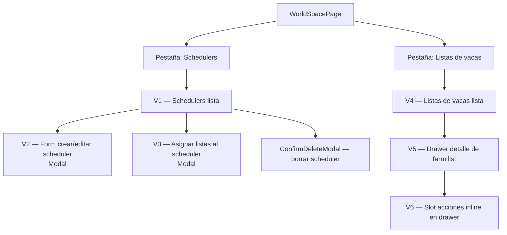

# Pestañas "Schedulers" y "Listas de vacas" (WorldSpacePage)

---

## 1. Visión de la experiencia y principios de diseño

El usuario llega a WorldSpacePage con sesión activa. Las pestañas Schedulers y Listas de vacas son
su centro de mando del farmeo automático. La experiencia tiene dos momentos bien distintos:

**Momento 1 — configuración inicial (poco frecuente):** crear schedulers, asignar listas, ajustar
intervalos. El usuario dedica tiempo aquí y luego no vuelve salvo para tunear.

**Momento 2 — monitorización (lo habitual):** echar un vistazo rápido a si el bot está corriendo,
cuándo será el próximo envío y si hay pérdidas detectadas. Debe responder en un vistazo, sin scroll.

Principios aplicados (de `docs/design/PRINCIPIOS.md` y `frontend/DESIGN.md`):
- **Menos es más**: P1 en pantalla completa; detalles y acciones destructivas tras drawer/modal.
- **Divulgación progresiva**: el scheduler muestra estado + countdown; los slots de cada lista
  están un nivel más abajo, en un drawer lateral.
- **Jerarquía por espacio y peso**: el countdown HH:MM:SS ocupa el máximo visual del scheduler card.
- **Acento oro solo en activo/enlace**: el indicador "activo" del scheduler y el tab activo usan oro.
- **Color nunca único**: todos los estados llevan icono + color + texto.
- **Responsive mobile-first P1/P2/P3**: en móvil solo se ven estado del agente, countdown y CTA principal.

---

## 2. Personas y objetivos (jobs-to-be-done)

**Usuario único** (el dueño del bot):

| Job-to-be-done | Prioridad | Contexto |
|---|---|---|
| Saber si el bot está farmando y cuándo es el próximo envío | P1 | Chequeo rápido en cualquier momento |
| Ver si hay pérdidas o slots en cooldown | P1 | Monitorización diaria |
| Crear y configurar un scheduler con sus listas | P2 | Setup inicial, poco frecuente |
| Asignar / reasignar farm lists a un scheduler | P2 | Ajuste ocasional |
| Activar o desactivar un slot manualmente | P2 | Corrección puntual |
| Ver el historial de envíos de una lista | P3 | Diagnóstico / curiosidad |
| Forzar envío inmediato | P2 | Prueba o urgencia |
| Cancelar sonda de un slot en cooldown | P2 | Gestión de pérdidas |

---

## 3. Inventario de pantallas / vistas

Todas las vistas son **pestañas dentro de WorldSpacePage** (sin navegación separada).

| ID | Nombre | Descripción |
|---|---|---|
| V1 | Schedulers — lista | Vista principal de la pestaña Schedulers. Lista de scheduler cards + panel de estado del agente. |
| V2 | Scheduler — form (crear / editar) | Modal/Sheet para crear o editar un scheduler (nombre, intervalos, is_enabled). |
| V3 | Scheduler — asignar listas | Modal/Sheet para seleccionar qué farm lists asignar al scheduler. |
| V4 | Listas de vacas — lista | Vista principal de la pestaña Listas de vacas. Lista de farm lists agrupadas por aldea propietaria. |
| V5 | Farm list — drawer de detalle | Drawer lateral (slideout) con los slots de una farm list + historial de envíos. |
| V6 | Slot — estado / acciones | Sub-sección del drawer V5. Detalle del slot: estado, cooldown, acciones (activar/desactivar, cancelar sonda). |

---

## 4. Mapa de navegación



---

## 5. Flujos de usuario clave

### 5.1 Happy path — monitorización (el más frecuente)

```
1. Usuario abre WorldSpacePage → pestaña Schedulers activa por defecto
2. V1 carga → GET /farm/worlds/{id}/agent/status + GET /farm/worlds/{id}/schedulers
3. Ve el panel de estado del agente: running + countdown al próximo envío
4. Ve la lista de scheduler cards con su nombre, listas asignadas y countdown individual
5. No hace nada más — chequeo satisfecho
```

### 5.2 Crear scheduler

```
1. V1 — pulsa "+ Nuevo scheduler"
2. Abre V2 (modal) con campos en blanco
3. Rellena nombre + intervalos (min/max) en minutos
4. Pulsa "Guardar" → POST /farm/worlds/{id}/schedulers → 201
5. Modal se cierra, V1 recarga, nuevo scheduler aparece en la lista
6. [Opcional] pulsa "Asignar listas" en el nuevo scheduler → abre V3
7. V3 muestra checkboxes de todas las farm lists disponibles
8. Selecciona listas → "Guardar" → PUT .../farm-lists → 200
9. Scheduler card actualiza su lista de listas asignadas
```

### 5.3 Iniciar / parar agente

```
Iniciar:
1. Panel de agente muestra estado stopped → botón "Arrancar agente"
2. Pulsa → POST .../agent/start → 200 → estado cambia a running
3. Countdown aparece en scheduler cards

Parar:
1. Panel de agente muestra running → botón "Parar agente"
2. Pulsa → POST .../agent/stop → 200 → estado cambia a stopping → luego stopped
```

### 5.4 Ver y gestionar slots de una lista

```
1. V4 — el usuario localiza la farm list de interés
2. Pulsa "Ver slots" (o click en la fila/card) → drawer V5 se desliza desde el extremo end
3. V5 muestra slots en tabla (desktop) / tarjetas (móvil) con estado de cada uno
4. Slot con pérdidas → badge "Sonda pendiente" + cooldown countdown
5. Usuario puede:
   a. Activar/desactivar manualmente → toggle inline
   b. Cancelar sonda → botón "Cancelar sonda" → picker deactivate/send_now
   c. Ver historial → pestaña "Historial" dentro del drawer
6. Drawer se cierra con ESC o pulsando fuera o el botón "×"
```

### 5.5 Flujo alternativo — sin datos en BD (primer uso)

```
1. Usuario abre pestaña "Listas de vacas"
2. BD vacía → V4 empty state con botón "Sincronizar desde Travian"
3. Pulsa → POST /farm/worlds/{id}/farm-lists/read → spinner durante navegación del browser
4. Al completar → V4 muestra las listas sincronizadas
(Nota: la sincronización se dispara automáticamente también; el botón es el fallback si falla)
```

---

## 6. Wireframes de baja fidelidad por pantalla

### V1 — Schedulers (lista)

```
╔══════════════════════════════════════════════════════════════════╗
║  TOPBAR (← Mundos | TB TravianBot | ··· | tema | lang)          ║
╠══════════════════════════════════════════════════════════════════╣
║  WORLD HEADER (ts1.travian.es • Activo ● | [Parar])             ║
║  ─────────────────────────────────────────────────────────────  ║
║  [Dashboard] [Schedulers ▼] [Listas de vacas] [Calculadora]···  ║
╠══════════════════════════════════════════════════════════════════╣
║  CONTENIDO DE PESTAÑA — padding 24–32px                         ║
║                                                                  ║
║  ┌─ Panel de estado del agente ──────────────────────────────┐  ║
║  │  ●running  Bot farmando · 2 schedulers activos            │  ║
║  │  Próximo envío global: 00:03:42  [Parar agente]           │  ║
║  └───────────────────────────────────────────────────────────┘  ║
║                                                                  ║
║  Schedulers  ─────────────────  [+ Nuevo scheduler]            ║
║                                                                  ║
║  ┌─ Scheduler card ─────────────────────────────────────────┐   ║
║  │  ● Scheduler principal         [Asignar listas] [···]    │   ║
║  │  2 listas · cada 3–5 min       Próximo: 00:03:42         │   ║
║  │  ─────────────────────────────────────────────────────── │   ║
║  │  Lista A (aldea 1)  Lista B (aldea 2)                     │   ║
║  └───────────────────────────────────────────────────────────┘  ║
║                                                                  ║
║  ┌─ Scheduler card ─────────────────────────────────────────┐   ║
║  │  ● Scheduler noche             [Asignar listas] [···]    │   ║
║  │  1 lista · cada 10–15 min      Próximo: 00:09:21         │   ║
║  │  ─────────────────────────────────────────────────────── │   ║
║  │  Lista C (aldea 1)                                        │   ║
║  └───────────────────────────────────────────────────────────┘  ║
╚══════════════════════════════════════════════════════════════════╝
```

Notas de layout V1:
- Panel de estado del agente: `--surface`, borde `--border`, `--radius-md`. Fondo del dot verde = `--success`. Countdown en `--font-mono`, 20px, bold.
- Scheduler cards: `--surface`, borde `--border`, `--radius-md`, padding 16–20px. Hover muy sutil.
- Toggle de scheduler enabled/disabled: switch estilo macOS a la derecha del nombre.
- El menú "···" despliega: Editar / Ejecutar ahora / Borrar.
- El countdown en la card usa `--font-mono tabular-nums`, 18px, `--text`.
- En la card: la lista de listas asignadas va en chips pequeños de `--surface-2`.
- En mobile: las cards se apilan a ancho completo; el countdown queda en línea 2 (P1); los chips de listas se ocultan (P3).

### V2 — Form crear / editar scheduler (modal)

```
╔═══════════════════════════════════╗
║  Nuevo scheduler                ✕ ║
╠═══════════════════════════════════╣
║                                   ║
║  Nombre                           ║
║  [ Scheduler principal          ] ║
║                                   ║
║  Intervalo mínimo         máximo  ║
║  [ 3    ] min    [ 5    ] min     ║
║  Nota: mínimo 1 minuto (anti-det) ║
║                                   ║
║  [✓] Activado                     ║
║                                   ║
╠═══════════════════════════════════╣
║  [Cancelar]           [Guardar]   ║
╚═══════════════════════════════════╝
```

Notas V2:
- Modal estándar del proyecto: `w-[min(440px,92vw)]`, `--radius-lg`, `--shadow-lg`.
- Los campos de intervalo son en **minutos** (el usuario no maneja milisegundos). La conversión a ms la hace el frontend antes de enviar a la API.
- Validación en vivo: si min > max → error inline bajo el campo max.
- Si min < 1 min → error "Mínimo 1 minuto (anti-detección)".
- Toggle `is_enabled` usa el mismo switch visual que en la card.
- Al editar: prefilled con los valores actuales.

### V3 — Asignar listas a scheduler (modal)

```
╔═════════════════════════════════════════╗
║  Asignar listas: Scheduler principal  ✕ ║
╠═════════════════════════════════════════╣
║                                         ║
║  Selecciona las listas que usará        ║
║  este scheduler:                        ║
║                                         ║
║  ┌────────────────────────────────────┐ ║
║  │  [✓] Lista A — Aldea 1 (10 slots) │ ║
║  │  [✓] Lista B — Aldea 2 (8 slots)  │ ║
║  │  [ ] Lista C — Aldea 1 (5 slots)  │ ║
║  │  [ ] Lista D — Aldea 3 (12 slots) │ ║
║  └────────────────────────────────────┘ ║
║                                         ║
║  2 listas seleccionadas                 ║
╠═════════════════════════════════════════╣
║  [Cancelar]               [Guardar]     ║
╚═════════════════════════════════════════╝
```

Notas V3:
- La lista de checkboxes usa el patrón de tabla densa: filas de 36px, hairline entre ellas.
- Cada item muestra: checkbox + nombre de la lista + nombre de la aldea + número de slots.
- Si una lista ya está asignada a OTRO scheduler, se muestra con badge "En Scheduler X" y queda deshabilitada (no se puede asignar a dos schedulers a la vez — si se quiere reasignar, debe desasignarse del otro primero).
- Contador "N listas seleccionadas" actualiza en vivo.
- Scroll interno si hay muchas listas (max-height 320px).
- En mobile: modal bottom-sheet a pantalla completa.

### V4 — Listas de vacas (lista)

```
╔══════════════════════════════════════════════════════════════════╗
║  [Dashboard] [Schedulers] [Listas de vacas ▼] [Calculadora]···  ║
╠══════════════════════════════════════════════════════════════════╣
║  CONTENIDO                                                       ║
║                                                                  ║
║  Listas de vacas  ──────────────────  [Sincronizar ahora]       ║
║  Última sincronización: hace 12 min                             ║
║                                                                  ║
║  Aldea 1 (10,−5)                                                ║
║  ┌──────────────────────────────────────────────────────────┐   ║
║  │ Nombre         │ Slots │ Scheduler       │ Último envío  │   ║
║  │────────────────│───────│─────────────────│───────────────│   ║
║  │ Lista principal│ 10/10 │ Scheduler princ │ hace 3 min  > │   ║
║  │ Lista respaldo │  8/8  │ —               │ —           > │   ║
║  └──────────────────────────────────────────────────────────┘   ║
║                                                                  ║
║  Aldea 2 (12,−3)                                                ║
║  ┌──────────────────────────────────────────────────────────┐   ║
║  │ Lista noche    │  5/8  │ Scheduler noche │ hace 9 min  > │   ║
║  └──────────────────────────────────────────────────────────┘   ║
╚══════════════════════════════════════════════════════════════════╝
```

Notas V4:
- Agrupación por aldea propietaria (`village_name` + coordenadas entre paréntesis en `--font-mono`).
- Columna **Slots** muestra `activos/total` (ej. `5/8` si 3 están desactivados). En rojo si 0 activos.
- Columna **Scheduler**: nombre del scheduler asignado o `—` si sin scheduler.
- La fila completa es clicable (cursor pointer) y abre el drawer V5. El `>` al final es indicativo visual, no un botón separado.
- En mobile: tabla → tarjetas (V4-mobile). Cada tarjeta muestra: nombre, slots activos, scheduler asignado. El historial y las columnas secundarias van en "Ver detalle".
- [Sincronizar ahora] solo se muestra si la BD tiene datos. Si está vacía, se muestra el empty state con botón primario.
- El "Último envío" muestra tiempo relativo (ej. "hace 3 min") — calculado en frontend.

### V5 — Drawer detalle de farm list

```
┌─────────────────────────────────┐
│  Lista principal                ✕│
│  Aldea 1 (10,−5) · Scheduler A  │
│  ─────────────────────────────  │
│  [Slots]  [Historial]           │
│  ─────────────────────────────  │
│                                  │
│  Slots (10 activos / 10 total)   │
│                                  │
│  ┌────────────────────────────┐  │
│  │ Nombre  │ Dist │ Botín  St │  │
│  │─────────│──────│──────────│  │
│  │ Villa A │ 3.6  │  450  ✓  │  │
│  │ Villa B │ 5.1  │  320  ⚠  │  │  ← sonda pendiente
│  │ Villa C │ 2.2  │  800  ✓  │  │
│  └────────────────────────────┘  │
│                                  │
│  [Enviar ahora]                  │
└─────────────────────────────────┘
```

Notas V5:
- Drawer (slideout panel): desliza desde el extremo `end` (derecha en LTR, izquierda en RTL).
- Ancho 480px en desktop (`lg:`); panel completo en mobile.
- Tiene dos pestañas internas: **Slots** e **Historial de envíos**.
- El backdrop no bloquea el contenido detrás (opacity 0.4 Negro) — pero sí cierra al clicar fuera.
- `[Enviar ahora]` es botón secundario; llama a `POST /farm/farm-lists/{id}/send`.
- Mientras carga los datos del drawer: skeleton de filas.

### V5 — Pestaña Historial (dentro del drawer)

```
│  Historial de envíos (últimas 7 días)      │
│                                             │
│  ┌─────────────────────────────────────┐   │
│  │ Hora     │ Estado  │ Slots │ Origen │   │
│  │──────────│─────────│───────│────────│   │
│  │ 10:03:42 │ ✓ OK    │ 10/10 │  Auto  │   │
│  │ 09:57:21 │ ⚠ Parc  │  8/10 │  Auto  │   │
│  │ 09:51:05 │ ✓ OK    │ 10/10 │  Manual│   │
│  └─────────────────────────────────────┘   │
│  [Cargar más]                               │
```

Notas historial:
- Tabla densa, filas 36px. Paginación en botón "Cargar más" al final (no scroll infinito automático).
- Estado con icono + texto: `✓ OK` (éxito), `⚠ Parcial`, `✗ Error`, `? Desconocido`.
- "Slots" muestra `current/active` del evento.
- Origen: `Auto` (scheduler) o `Manual`.
- Si slot_events relevantes al mismo timestamp → pequeña nota expandible bajo la fila (divulgación progresiva).

### V6 — Slot en el drawer (fila expandida con acciones)

```
│  Villa B (12,−3) · 5.1 casillas                          │
│  ⚠ Sonda pendiente · cooldown 01:24:00                    │
│                                                           │
│  Último informe: con pérdidas · hace 2 h                 │
│  Botín promedio: 320 · Botín total: 4.800                │
│                                                           │
│  [Cancelar sonda ▾]   [Activar manualmente]              │
│   ├ Desactivar indefinidamente                           │
│   └ Enviar en el próximo ciclo                           │
```

Notas V6:
- Al pulsar una fila del drawer V5, esa fila se expande in-place (accordion / disclosure) mostrando el detalle del slot. No abre otra pantalla.
- El cooldown en el slot expandido usa la misma tipografía mono + countdown en vivo.
- "Cancelar sonda" abre un picker de dos opciones inline (no modal separado): "Desactivar indefinidamente" y "Enviar en el próximo ciclo". Al seleccionar → confirmación inline (un solo clic, sin modal extra para evitar fricción).
- "Activar manualmente" es botón secundario; muestra confirmación solo si el slot tiene `disabled_by_bot=True` (informa que el bot lo desactivó y puede volver a hacerlo).
- Solo se expande una fila a la vez (colapsa la anterior).

---

## 6b. Mockup editable y layout aprobado

Ruta del mockup: `frontend/mockups/farm-lists.playground.html`

**Layout aprobado por el usuario (sesión 2026-05-26):**

- Panel de estado del agente: posición top, ancho completo de la columna de contenido.
- Lista de scheduler cards: debajo del panel, una card por fila.
- Dentro de cada card: nombre + toggle enabled (izquierda) / countdown + menú "···" (derecha).
- Fila de chips de listas asignadas: debajo del separador hairline dentro de la card.
- Botón "+ Nuevo scheduler": extremo end del encabezado de sección.
- En V4: agrupación por aldea con título de sección; tabla de listas dentro de cada grupo.
- Drawer V5: panel lateral deslizante desde el extremo end, con pestañas internas Slots / Historial.

---

## 7. Estados de cada pantalla

### V1 — Schedulers (lista)

| Estado | Descripción | Presentación visual |
|---|---|---|
| Cargando | Petición inicial en vuelo | Skeleton del panel de agente (2 líneas) + 2 skeleton cards |
| Vacío (sin schedulers) | BD no tiene schedulers | Empty state centrado: icono de reloj + "Sin schedulers" + CTA "Crear scheduler" (botón primario) |
| Con datos | Normal | Panel agente + lista de cards |
| Error de red | Fetch fallido | Toast de error + reintentar (enlace en el toast) |
| Agente stopped | WorldAgent parado | Panel de agente en estado stopped (icono gris + "Bot parado"). Botón "Arrancar agente" prominente. Sin countdowns en las cards (texto `—`). |
| Agente error | WorldAgent en error | Panel con badge rojo + último error (en `--font-mono` pequeño). Botón "Reintentar". |
| Scheduler deshabilitado | is_enabled = false | Card con opacity reducida (0.6), badge "Desactivado", sin countdown. |
| Ejecutando scheduler | run-now en vuelo | Spinner inline en la card + botón "Ejecutar ahora" deshabilitado. |

### V2 — Form scheduler

| Estado | Descripción | Presentación visual |
|---|---|---|
| Vacío (crear) | Campos en blanco | Placeholder en inputs |
| Prefilled (editar) | Valores actuales | Campos con valores cargados |
| Validación inline | Error min/max | Mensaje rojo bajo el campo con problema |
| Guardando | POST/PUT en vuelo | Botón "Guardar" → spinner + deshabilitado |
| Error 422 | Validación del servidor | Error-block inline bajo el formulario |

### V3 — Asignar listas

| Estado | Descripción | Presentación visual |
|---|---|---|
| Cargando listas | GET farm-lists en vuelo | Skeleton de checkboxes |
| Sin listas disponibles | No hay farm lists en BD | Mensaje "Primero sincroniza tus listas de vacas" + enlace a pestaña |
| Con listas | Normal | Lista de checkboxes |
| Lista en otro scheduler | Asignada a otro scheduler | Checkbox deshabilitado + badge "En Scheduler X" |
| Guardando | PUT en vuelo | Botón "Guardar" → spinner |

### V4 — Listas de vacas

| Estado | Descripción | Presentación visual |
|---|---|---|
| Cargando | Fetch inicial | Skeleton de filas de tabla agrupadas |
| Vacío (sin listas, BD vacía) | Primera vez | Empty state: icono lista + "Sin listas sincronizadas" + botón primario "Sincronizar desde Travian" |
| Sincronizando | POST /read en vuelo | Banner informativo top de la sección: "Sincronizando desde Travian…" + spinner. Tabla vacía o con datos previos debajo (no bloquea la UI). |
| Error sincronización | 503 / 502 | Toast de error con mensaje descriptivo |
| Con datos | Normal | Grupos por aldea + tabla |
| Lista sin scheduler | scheduler_id = null | Badge `—` en columna Scheduler, en `--text-tertiary` |
| Lista con slots problemáticos | Algún slot en cooldown/sonda | Badge de advertencia en la fila: "N sondas" en color acento oro |

### V5 — Drawer detalle

| Estado | Descripción | Presentación visual |
|---|---|---|
| Cargando | Fetch de slots en vuelo | Skeleton de filas dentro del drawer |
| Sin slots | Lista vacía (improbable) | Mensaje "Esta lista no tiene slots" |
| Envío en curso | POST /send en vuelo | Spinner en botón "Enviar ahora" + deshabilitado |
| Error envío | 502 / 503 | Error-block inline sobre el botón |
| Pestaña historial cargando | Fetch inicial | Skeleton de filas |
| Pestaña historial vacía | Sin historial (< 7 días) | "Sin envíos en los últimos 7 días" |

---

## 8. Inventario de componentes UI

### Componentes reutilizados (EXISTENTES — no rediseñar)

| Componente | Dónde se usa | Fuente |
|---|---|---|
| `ConfirmDeleteModal` | Borrar scheduler | `frontend/src/components/ui/ConfirmDeleteModal.jsx` |
| `useFocusTrap` | V2, V3, V5 (drawer) | `frontend/src/components/ui/uiUtils.jsx` |
| `Spinner` | Botones en loading | `frontend/src/components/ui/uiUtils.jsx` |
| `showToast` | Errores de red | `frontend/src/components/ui/uiUtils.jsx` |
| `useI18n` / `t()` | Todo texto | `frontend/src/i18n/index.jsx` |
| Patrón loading/data/empty/error | V1, V4 | Extraído de `AccountsListPage` |
| Máquina de estados del agente | Panel de agente en V1 | Patrón de `AccountDetailPage` |

### Componentes NUEVOS (a crear)

| Componente | Descripción |
|---|---|
| `AgentStatusPanel` | Panel de estado del WorldAgent: estado (running/stopped/error/paused), botones arrancar/parar, countdown próximo envío global. |
| `SchedulerCard` | Card de un scheduler: nombre, toggle enabled, chips de listas, countdown al próximo envío, menú "···". |
| `SchedulerFormModal` | Modal V2: crear/editar scheduler. Campos nombre + intervalos en minutos + toggle enabled. |
| `AssignFarmListsModal` | Modal V3: checkboxes de farm lists para asignar a un scheduler. |
| `FarmListsTab` | Contenedor de V4: fetching + agrupación por aldea + tabla/tarjetas responsiva. |
| `FarmListDrawer` | Drawer V5: slideout lateral con pestañas Slots / Historial. |
| `SlotRow` | Fila de slot dentro del drawer: nombre, distancia, botín, estado badge, expansión accordion. |
| `SlotDetail` | Contenido del accordion de V6: cooldown countdown, last raid info, botones de acción. |
| `SendHistoryTable` | Tabla de historial de envíos dentro del drawer (pestaña Historial de V5). |
| `SlotStatusBadge` | Badge de estado de slot: activo / desactivado-manual / sonda-pendiente / desactivado-bot. |
| `Countdown` | Componente de countdown HH:MM:SS con ticker de 1s. Usa `--font-mono tabular-nums`. |
| `IntervalInput` | Input de intervalo en minutos con conversión a/desde ms para la API. |

---

## 9. Contenido y microcopy

### Labels y secciones

| Clave i18n | Texto (es) | Contexto |
|---|---|---|
| `schedulers.title` | "Schedulers" | Título pestaña |
| `schedulers.new` | "+ Nuevo scheduler" | CTA crear |
| `schedulers.empty.title` | "Sin schedulers" | Empty state |
| `schedulers.empty.cta` | "Crear scheduler" | Botón primario empty state |
| `schedulers.form.title.create` | "Nuevo scheduler" | Modal crear |
| `schedulers.form.title.edit` | "Editar scheduler" | Modal editar |
| `schedulers.form.name` | "Nombre" | Label campo |
| `schedulers.form.intervalMin` | "Intervalo mínimo" | Label campo |
| `schedulers.form.intervalMax` | "Intervalo máximo" | Label campo |
| `schedulers.form.intervalUnit` | "min" | Unidad |
| `schedulers.form.enabled` | "Activado" | Toggle label |
| `schedulers.form.intervalHelp` | "Mínimo 1 minuto (anti-detección)" | Ayuda bajo intervalo mínimo |
| `schedulers.form.save` | "Guardar" | Botón |
| `schedulers.form.cancel` | "Cancelar" | Botón |
| `schedulers.card.next` | "Próximo:" | Label countdown |
| `schedulers.card.noNext` | "—" | Sin countdown (agente parado) |
| `schedulers.card.assignLists` | "Asignar listas" | Botón en card |
| `schedulers.card.disabled` | "Desactivado" | Badge scheduler disabled |
| `schedulers.card.run` | "Ejecutar ahora" | Menú "···" |
| `schedulers.card.edit` | "Editar" | Menú "···" |
| `schedulers.card.delete` | "Borrar" | Menú "···" |
| `schedulers.delete.title` | "Borrar scheduler" | Modal confirmación |
| `schedulers.delete.question` | "¿Borrar «{name}»?" | Pregunta |
| `schedulers.delete.warning` | "Las listas de vacas asignadas no se borrarán, quedarán sin scheduler." | Advertencia |
| `agent.status.running` | "Bot farmando" | Panel agente |
| `agent.status.stopped` | "Bot parado" | Panel agente |
| `agent.status.error` | "Error en el agente" | Panel agente |
| `agent.status.paused` | "Bot en pausa" | Panel agente |
| `agent.start` | "Arrancar agente" | Botón |
| `agent.stop` | "Parar agente" | Botón |
| `agent.nextGlobal` | "Próximo envío global:" | Label |
| `agent.schedulersActive` | "{n} schedulers activos" | Subtítulo |
| `farmLists.title` | "Listas de vacas" | Título pestaña |
| `farmLists.syncNow` | "Sincronizar ahora" | Botón |
| `farmLists.syncing` | "Sincronizando desde Travian…" | Banner en vuelo |
| `farmLists.lastSync` | "Última sincronización: hace {t}" | Subtítulo |
| `farmLists.empty.title` | "Sin listas sincronizadas" | Empty state |
| `farmLists.empty.cta` | "Sincronizar desde Travian" | Botón primario |
| `farmLists.table.name` | "Nombre" | Cabecera tabla |
| `farmLists.table.slots` | "Slots" | Cabecera tabla |
| `farmLists.table.scheduler` | "Scheduler" | Cabecera tabla |
| `farmLists.table.lastSend` | "Último envío" | Cabecera tabla |
| `farmLists.noScheduler` | "—" | Sin scheduler |
| `farmLists.probesLabel` | "{n} sondas" | Badge de slots en cooldown |
| `drawer.sendNow` | "Enviar ahora" | Botón drawer |
| `drawer.slots.title` | "Slots" | Pestaña drawer |
| `drawer.history.title` | "Historial" | Pestaña drawer |
| `drawer.slots.summary` | "{active} activos / {total} total" | Subtítulo slots |
| `slot.status.active` | "Activo" | Badge |
| `slot.status.disabledManual` | "Desactivado manualmente" | Badge |
| `slot.status.probe` | "Sonda pendiente" | Badge |
| `slot.status.disabledBot` | "Desactivado por bot" | Badge |
| `slot.cooldown` | "Cooldown:" | Label |
| `slot.cancelProbe` | "Cancelar sonda" | Botón |
| `slot.cancelProbe.deactivate` | "Desactivar indefinidamente" | Opción |
| `slot.cancelProbe.sendNow` | "Enviar en el próximo ciclo" | Opción |
| `slot.activate` | "Activar manualmente" | Botón |
| `slot.deactivate` | "Desactivar" | Botón |
| `slot.lastRaid.noLosses` | "Sin pérdidas" | Texto |
| `slot.lastRaid.withLosses` | "Con pérdidas" | Texto |
| `history.status.success` | "OK" | Badge |
| `history.status.partial` | "Parcial" | Badge |
| `history.status.error` | "Error" | Badge |
| `history.status.unknown` | "Desconocido" | Badge |
| `history.triggered.scheduler` | "Auto" | Badge origen |
| `history.triggered.manual` | "Manual" | Badge origen |
| `history.loadMore` | "Cargar más" | Botón paginación |
| `history.empty` | "Sin envíos en los últimos 7 días" | Empty |

### Mensajes de error

| Clave i18n | Texto (es) |
|---|---|
| `schedulers.error.intervalMin` | "El intervalo mínimo no puede superar el máximo" |
| `schedulers.error.intervalTooShort` | "Mínimo 1 minuto para evitar detección" |
| `schedulers.error.saveFailed` | "Error al guardar el scheduler" |
| `schedulers.error.deleteFailed` | "Error al borrar el scheduler" |
| `agent.error.startFailed` | "No se pudo arrancar el agente. ¿Hay sesión activa?" |
| `agent.error.stopFailed` | "Error al parar el agente" |
| `farmLists.error.syncFailed` | "Error al sincronizar. ¿Travian está accesible y el Gold Club activo?" |
| `farmLists.error.sendFailed` | "Error al enviar la lista" |
| `slot.error.actionFailed` | "Error al modificar el slot" |

---

## 10. Accesibilidad

- **Countdown (`Countdown`)**: el texto actualiza en vivo; usar `aria-live="off"` (no anunciar cada segundo — sería ruido). Anunciar solo cuando el estado cambia (el bot dispara un envío).
- **Drawer V5**: focus trap con `useFocusTrap` al abrirse; ESC cierra; foco vuelve al elemento que lo abrió al cerrar.
- **Toggle enabled del scheduler**: `<button role="switch" aria-checked={isEnabled}>`. No un `<input type="checkbox">` porque queremos el estilo macOS.
- **Menú "···"**: `aria-haspopup="menu"` en el botón disparador; opciones con `role="menuitem"`.
- **SlotStatusBadge**: usa icono + texto (nunca solo color). Los badges de estado tienen siempre texto visible.
- **Foco visible**: todos los elementos interactivos siguen la regla `outline: 2px solid var(--accent); outline-offset: 2px`.
- **Contraste**: todos los colores de texto siguen los tokens verificados de DESIGN.md (mínimo 4.5:1 en texto normal).
- **Targets táctiles**: botones de acción en el drawer ≥ 44px de alto en mobile.
- **Tabla V4**: encabezados con `scope="col"`; filas clicables con `role="button"` o `tabIndex={0}` + `onKeyDown` para Enter/Space.

---

## 11. Responsive / adaptación a dispositivos

### V1 — Schedulers

| Breakpoint | Comportamiento |
|---|---|
| `< md` (móvil) | Panel agente a ancho completo. Cards a ancho completo. Chips de listas asignadas ocultos (P3). Solo nombre + countdown + toggle visible. |
| `md` (tablet) | Cards en grid de 1 columna con más aire. |
| `≥ lg` (desktop) | Cards en 1 columna pero más anchas; chips visibles. |

### V4 — Listas de vacas

| Breakpoint | Comportamiento |
|---|---|
| `< md` (móvil) | Tabla → tarjetas. Cada tarjeta: nombre de lista (grande) + N/M slots + scheduler. Columna "Último envío" oculta (P3). Botón "Ver" en cada tarjeta abre el drawer. |
| `md` | Tabla con scroll horizontal contenido; primera columna sticky (nombre). |
| `≥ lg` | Tabla completa con todas las columnas visibles. |

### V5 — Drawer

| Breakpoint | Comportamiento |
|---|---|
| `< md` (móvil) | Drawer ocupa el 100% del viewport (fullscreen bottom-sheet). Swipe-down para cerrar. |
| `md` | Drawer 380px desde el end. |
| `≥ lg` | Drawer 480px desde el end. |

### V2, V3 — Modales

| Breakpoint | Comportamiento |
|---|---|
| `< sm` (móvil pequeño) | Modal fullscreen bottom-sheet (`max-sm:rounded-b-none max-sm:self-end`). Patrón ya establecido en `ConfirmDeleteModal`. |
| `≥ sm` | Modal centrado estándar, `w-[min(440px,92vw)]`. |

---

## 12. Interacciones y feedback

| Interacción | Feedback |
|---|---|
| Toggle enabled en scheduler card | Cambio visual inmediato + PUT silencioso. Si falla → revierte + toast error. |
| Pulsar "Arrancar agente" | Panel pasa a estado "iniciando" con spinner. Botón deshabilitado. Al 200 → estado "running". |
| Pulsar "+ Nuevo scheduler" | Modal V2 abre con `--dur-slow` (300ms) fade+scale sutil. |
| Pulsar fila de tabla en V4 | Drawer V5 desliza desde el end con `--dur-slow`. Backdrop aparece con fade. |
| Expandir fila de slot en drawer | Accordion se abre con `--dur-base` (220ms). |
| "Enviar ahora" | Spinner inline en botón. Al completar → toast "Lista enviada" (2.5s). Si error → toast error. |
| "Cancelar sonda" → opción seleccionada | Confirmación inline con texto "¿Confirmar?" + dos botones Sí/No dentro de la fila — sin modal extra. Al confirmar → acción + badge del slot se actualiza. |
| Countdown tick | Actualización silenciosa cada 1s, sin re-render de toda la página. `aria-live="off"`. |
| Borrar scheduler | `ConfirmDeleteModal` reutilizado. Al confirmar → DELETE → scheduler desaparece de la lista. |
| Error 503 (sin sesión) | Toast con mensaje + sugerencia "Asegúrate de que la sesión esté activa". |

---

## 13. Criterios de aceptación de diseño

- [ ] **DA-01**: La pestaña "Schedulers" es la activa por defecto al entrar en WorldSpacePage.
- [ ] **DA-02**: El panel de estado del agente muestra correctamente los 4 estados (running / stopped / error / paused) con icono + color + texto.
- [ ] **DA-03**: El countdown HH:MM:SS actualiza cada segundo en vivo y usa `--font-mono tabular-nums`.
- [ ] **DA-04**: Cuando el agente está stopped, los countdowns en las cards muestran `—` (sin valor).
- [ ] **DA-05**: En estado empty (sin schedulers), se muestra el empty state con CTA "Crear scheduler".
- [ ] **DA-06**: El form de scheduler (V2) valida en vivo: error si min > max o si min < 1 min.
- [ ] **DA-07**: El modal V3 deshabilita las farm lists ya asignadas a otro scheduler, con badge explicativo.
- [ ] **DA-08**: La pestaña "Listas de vacas" muestra el empty state con botón "Sincronizar desde Travian" cuando la BD está vacía.
- [ ] **DA-09**: Durante sincronización, el banner "Sincronizando…" es visible sin bloquear el resto de la UI.
- [ ] **DA-10**: Las farm lists se agrupan visualmente por aldea propietaria con el nombre y coordenadas de la aldea como cabecera de grupo.
- [ ] **DA-11**: La columna "Slots" muestra `activos/total`; si 0 activos, en color danger.
- [ ] **DA-12**: El drawer V5 se abre desde el extremo end, ocupa 480px en desktop, 100% en mobile.
- [ ] **DA-13**: El drawer tiene focus trap: Tab no escapa al contenido detrás; ESC cierra.
- [ ] **DA-14**: Los slots en cooldown muestran el badge "Sonda pendiente" con su countdown de cooldown restante.
- [ ] **DA-15**: La acción "Cancelar sonda" ofrece las dos opciones (deactivate / send_now) sin abrir un modal adicional (confirmación inline).
- [ ] **DA-16**: El historial de envíos en el drawer muestra el estado con icono + color + texto (no solo color).
- [ ] **DA-17**: Todos los textos pasan por `t()` — cero strings hardcodeados en componentes.
- [ ] **DA-18**: La UI es funcional en los 25 idiomas; en RTL el drawer desliza desde el extremo start (invertido).
- [ ] **DA-19**: En mobile, la tabla V4 se transforma en tarjetas apiladas.
- [ ] **DA-20**: El toggle de scheduler usa `role="switch"` con `aria-checked`.
- [ ] **DA-21**: Los modales V2 y V3 siguen el patrón `max-sm:rounded-b-none max-sm:self-end` de `ConfirmDeleteModal`.
- [ ] **DA-22**: En estado loading, se muestran skeletons en lugar de spinners de página completa.
- [ ] **DA-23**: El botón "Borrar" en el menú "···" usa `ConfirmDeleteModal` con el texto de advertencia de que las listas no se borran.
- [ ] **DA-24**: Los colores de estado nunca son la única señal: siempre hay icono o texto acompañante.

---

## 14. Trazabilidad

| Decisión de diseño | Origen |
|---|---|
| Schedulers como pestaña dentro de WorldSpacePage | Usuario (P1): "los schedulers viven dentro del mundo concreto" |
| Panel de estado del agente en la parte superior de V1 | Usuario (P5): "lo que más mira es el estado del agente y el countdown" |
| Countdown HH:MM:SS como dato principal de cada card | Usuario (P5): "cuándo se envió la última lista y cuándo la siguiente en countdown HH:MM:SS" |
| Drawer para el detalle de slots (no pantalla nueva) | Usuario (P6): "slideout/drawer o lo que parezca más Apple" + Principio "divulgación progresiva" |
| Sincronización automática en primer uso (no botón forzado) | Usuario (P3): "si el sistema no tiene información en BD, que haga automáticamente la petición" |
| Confirmación inline para "Cancelar sonda" (sin modal extra) | Principio "menos fricción" + usuario (P6): "lo que parezca más Apple" — los sheets de iOS usan action confirmations inline |
| Intervalos en minutos en el form (no milisegundos) | La API trabaja en ms pero exponer ms al usuario sería hostile; el frontend convierte. |
| Agrupación de farm lists por aldea propietaria en V4 | Datos del spec funcional: `owner_village_id` + `village_name` son campos de primer nivel. La aldea es la unidad operativa del jugador. |
| Chips de listas asignadas en la card del scheduler | Permite al usuario ver de un vistazo qué listas tiene cada scheduler sin abrir un modal. P3 en mobile. |
| `ConfirmDeleteModal` reutilizado para borrar scheduler | palantir MODO CIERRE: REUTILIZAR `ConfirmDeleteModal` existente — encaja perfectamente. |
| Patrón loading/empty/error de `AccountsListPage` | palantir MODO CIERRE: REUTILIZAR — patrón ya validado y consistente. |
| Máquina de estados del agente inspirada en `AccountDetailPage` | palantir MODO CIERRE: REUTILIZAR — patrón idle→running→stopping→error ya implementado. |
| Toggle de enabled con `role="switch"` (no `<input>`) | Principio de coherencia visual macOS + accesibilidad ARIA correcta para switches. |
| Pestaña Historial dentro del drawer (no sección separada) | Principio "divulgación progresiva": el historial es P3, no necesita pantalla propia. |
| Slots de historial con paginación "Cargar más" (no infinita) | Spec funcional §8.5: paginación `page/page_size` con max 100. La paginación explícita da control al usuario. |
| RTL: drawer desliza desde start en RTL | Principio de propiedades CSS lógicas (DESIGN.md §16.2): `inset-inline-end` para el drawer. |
| Intervalo mínimo 1 minuto hardcodeado en ayuda del form | Regla de negocio RN-02 del spec funcional (anti-detección): `interval_min_ms >= 60000`. |

---

*Spec escrito por el agente disenador-producto — 2026-05-26. Para ser implementado por desarrollador-ux-ui partiendo de este documento y el mockup editable aprobado.*

---

## Registro de implementación

**Fecha:** 2026-05-26
**Implementado por:** desarrollador-ux-ui

### Ficheros creados
- `frontend/src/components/world/Countdown.jsx` — componente Countdown/ExactTime con setInterval 1s, aria-live="off"
- `frontend/src/components/world/AgentBottomBar.jsx` — barra fija bottom:0, dot+label toggle agente, carrusel de pills
- `frontend/src/components/world/AgentsTab.jsx` — V1 completo: AgentStatusPanel, SchedulerCard, ToggleSwitch (role="switch"), SchedulerRowMenu, SchedulerFormModal (V2), AssignFarmListsModal (V3), ConfirmDeleteModal reutilizado
- `frontend/src/components/world/FarmListsTab.jsx` — V4: tabla agrupada por aldea (desktop) + tarjetas (móvil), estados loading/empty/syncing/data, badge sondas, columna Rec/env
- `frontend/src/components/world/FarmListDrawer.jsx` — V5/V6: drawer slideout con focus trap + ESC + backdrop, pestañas Slots/Historial, 3 stat chips, SlotRow accordion (V6), ProbeMenu inline (no alert), SlotDetail con countdown cooldown, HistoryPanel con paginación "Cargar más"

### Ficheros modificados
- `frontend/src/pages/WorldSpacePage.jsx` — shell completo reemplazando el placeholder: topbar + world-header + sidebar (4 nav items) + routing de pestañas + AgentBottomBar + FarmListDrawer
- `frontend/src/api/client.js` — endpoints de farm (schedulers, farm-lists, slots, agente) añadidos
- `frontend/src/i18n/catalog/es.js` — ~100 claves i18n añadidas (worldnav, schedulers, agent, bottomBar, farmLists, drawer, slot, history)
- `frontend/src/i18n/catalog/en.js` — mismas claves en inglés

### Verificación
- `npm run build` — pasa sin errores (solo warning de chunk size pre-existente)
- El proyecto no tiene suite de tests unitarios de front configurada (no hay script `test` en package.json)

### Desviaciones respecto al diseño
1. **`farmLists.table.recPerSend`**: la API no expone `avg_bounty_per_send` directamente en el response de `/farm-lists` del spec actual (`adapters/api/routes/farm.py`). El campo se mapea desde `avg_bounty_per_send` o `last_raid_bounty` del slot; si no está disponible muestra `—`. Hueco de datos pendiente de confirmar con el desarrollador de APIs.
2. **`lastSyncTime`**: la API de `/farm/worlds/:id/farm-lists` no devuelve un campo `last_sync` documentado. Se usa la fecha local del último fetch exitoso como aproximación. Hueco de datos — requiere que el endpoint devuelva `last_sync_at`.
3. **`history.col.slots`**: el endpoint `/farm/worlds/:id/history` devuelve `slots_sent` y `slots_total`; si la API responde con nombres distintos, adaptar en `HistoryPanel`.
4. **Sidebar en mobile**: el spec indica sidebar siempre visible, pero en viewports muy estrechos (< 400px) el sidebar de 180px comprime demasiado el contenido. Se ha mantenido fiel al spec; si se quiere ocultar en mobile es una mejora futura.
5. **i18n en catálogos distintos de es/en**: las ~100 claves nuevas se añadieron a `es.js` y `en.js`. Los otros 23 catálogos usan el fallback a `es` del sistema i18n existente, lo que es comportamiento correcto según la arquitectura del proyecto.
