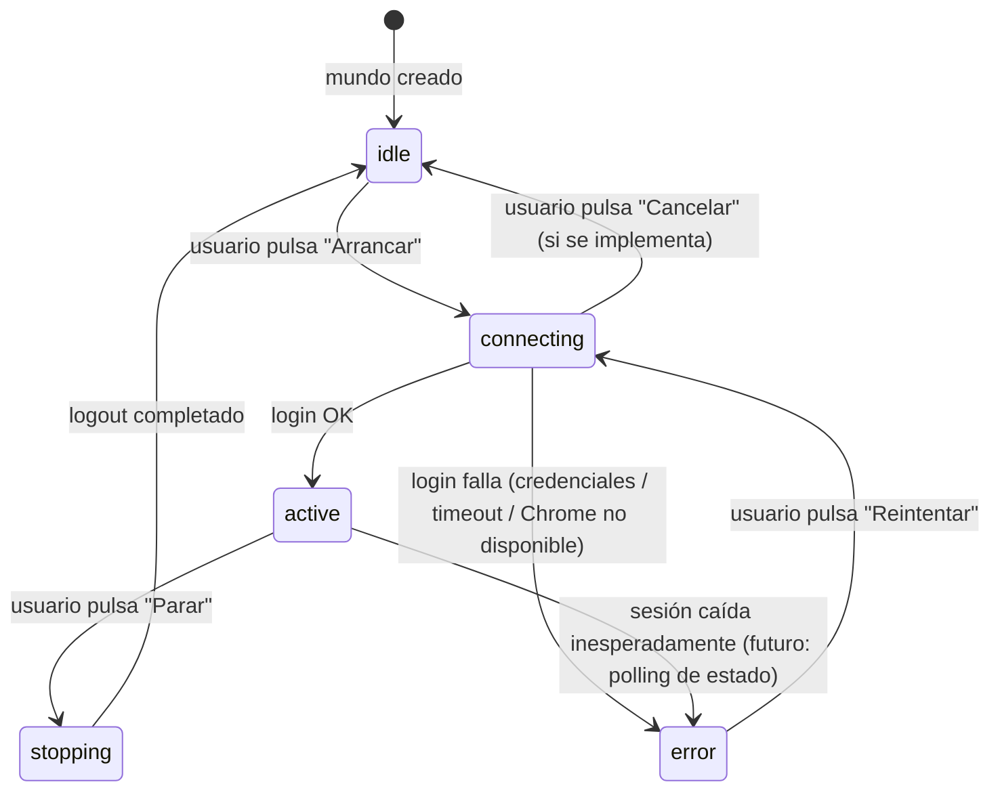

# Gestión de cuentas de Travian y sus mundos

---

## 1. Visión de la experiencia y principios de diseño

El operador necesita registrar y mantener sus cuentas Travian (credenciales del lobby)
y, dentro de cada cuenta, los mundos (servidores de juego) donde juega. Esta pantalla
es el punto de entrada de la app: abre directamente en la lista de cuentas porque no hay
login al dashboard (la app es de uso personal, sin auth).

### Principios aplicados (de `frontend/DESIGN.md`)

- **Densidad sobre decoración.** Es una herramienta de gestión, no una landing. Las
  tablas son compactas, el espacio en blanco se usa para jerarquía, no para relleno
  visual.
- **Una acción primaria por pantalla.** En lista de cuentas: "Nueva cuenta". En detalle:
  "Añadir mundo". El resto son acciones secundarias.
- **Divulgación progresiva.** El wizard de alta se despliega paso a paso; la password de
  edición se oculta detrás de un enlace "Cambiar contraseña"; las acciones destructivas
  exigen confirmación explícita.
- **Neutro primero, color al final.** El acento oro solo aparece en el ítem activo del
  sidebar y en los enlaces. Los estados de error usan el rojo semántico.
- **Coherencia con el mockup de login.** La topbar (wordmark + toggle tema + selector de
  idioma), los tokens de colores, la fuente del sistema y los radios se heredan
  literalmente del mockup `login.html`.
- **Write-only de contraseña.** Nunca se muestra. En edición queda oculta hasta que el
  usuario abre "Cambiar contraseña" explícitamente.

---

## 2. Personas y objetivos (jobs-to-be-done)

### Persona única: el Operador

El mismo jugador que usa el bot. Técnico o semi-técnico. Usa el dashboard principalmente
en desktop (gestión densa) y ocasionalmente en móvil para monitorizar. Habla uno de los
25 idiomas soportados.

### Jobs-to-be-done

| Job | Contexto | Medida de éxito |
|---|---|---|
| Registrar una cuenta nueva con su primer mundo | Primer uso o inicio de temporada en Travian | Alta completada en < 3 minutos, sin ambigüedad en los campos |
| Ver qué cuentas y mundos tiene configurados | Revisión periódica | Lista legible de un vistazo, sin clics adicionales |
| Editar email o username de una cuenta | Cambio en Travian | Formulario prefilled, sin reescribir lo que no cambia |
| Cambiar contraseña de una cuenta | Rotación de credenciales | Accesible pero no expuesto por defecto (write-only) |
| Añadir un mundo nuevo a una cuenta existente | Nueva temporada o nuevo servidor | Formulario simple (solo 2 campos), sin salir del detalle |
| Borrar un mundo o una cuenta que ya no usa | Limpieza de datos | Confirmación clara antes de destruir |

---

## 3. Inventario de pantallas / vistas

| ID | Nombre | Ruta | Descripción |
|---|---|---|---|
| S1 | Shell + Sidebar | — | Contenedor persistente modo Gestión: sidebar vertical + topbar + área de contenido |
| S2 | Lista de cuentas | `/cuentas` | Vista principal; tabla de cuentas con fila vacía si no hay ninguna |
| S3 | Wizard alta de cuenta | `/cuentas?new=1` (modal/overlay) | 2 pasos: datos de cuenta → primer mundo |
| S4 | Detalle de cuenta | `/cuentas/:id` | Datos de la cuenta + lista de sus mundos con affordance de sesión |
| S5 | Modal editar cuenta | (sobre S4) | Formulario prefilled; enlace "Cambiar contraseña" |
| S6 | Modal añadir mundo | (sobre S4) | Formulario server + tribu |
| S7 | Modal confirmar borrado de cuenta | (sobre S2 o S4) | Confirmación destructiva |
| S8 | Modal confirmar borrado de mundo | (sobre S4) | Confirmación destructiva |
| **S9** | **Espacio del mundo** | `/mundos/:world_id` | **Pantalla completa del mundo activo. Sin sidebar de gestión. Navegación interna propia.** |

### 3b. Modelo de dos modos de la app

La aplicación opera en **dos modos excluyentes**:

| Modo | Pantallas | Layout | Cuándo |
|---|---|---|---|
| **Gestión** | S1–S8 | Topbar + sidebar de gestión (200px) + área de contenido | Ningún mundo activo en foco; el operador administra cuentas y mundos |
| **Espacio del mundo** | S9 | Topbar mínima (sin sidebar) + botón "← Mundos" discreto + pestaña interna activa | El operador ha arrancado un mundo y entra a operar en él |

La transición entre modos se produce de forma explícita:
- **Gestión → Espacio del mundo:** arrancar un mundo (S4 → Conectando → 200 OK) o pulsar "Entrar" en un mundo ya activo en S4.
- **Espacio del mundo → Gestión:** pulsar "← Mundos" (topbar) o "Parar" (logout del mundo).

En el Espacio del mundo (S9) el sidebar de gestión desaparece completamente. El operador tiene **más espacio para el mundo y su configuración**. Las secciones de juego (Recursos, Tropas, Construcción, Aldeas) viven como pestañas internas de S9; en esta versión son placeholders deshabilitados "próximamente".

---

## 4. Mapa de navegación

```mermaid
flowchart TD
    APP[App abre] --> S2[S2: Lista de cuentas\n/cuentas]

    S2 -->|Click "Nueva cuenta"| S3[S3: Wizard alta\npaso 1 → paso 2]
    S3 -->|Completar| S2
    S3 -->|Cancelar / ESC| S2

    S2 -->|Click fila de cuenta| S4[S4: Detalle de cuenta\n/cuentas/:id]
    S2 -->|Click ⋯ → Borrar| S7[S7: Modal confirmar borrado cuenta]
    S7 -->|Confirmar| S2
    S7 -->|Cancelar| S2

    S4 -->|Click "Editar"| S5[S5: Modal editar cuenta]
    S5 -->|Guardar / Cancelar| S4

    S4 -->|Click "Añadir mundo"| S6[S6: Modal añadir mundo]
    S6 -->|Guardar / Cancelar| S4

    S4 -->|Click ⋯ → Borrar mundo| S8[S8: Modal confirmar borrado mundo]
    S8 -->|Confirmar| S4
    S8 -->|Cancelar| S4

    S4 -->|Click "Cuentas" en breadcrumb / sidebar| S2

    SIDEBAR[Sidebar] -->|Sección "Cuentas" activa| S2
    SIDEBAR -->|Otras secciones deshabilitadas| PROX[Próximamente]

    %% ── TRANSICIÓN AL ESPACIO DEL MUNDO ──────────────────────────
    S4 -->|"Arrancar" → Conectando 1.5s → 200 OK| S9[S9: Espacio del mundo\n/mundos/:world_id]
    S4 -->|"Entrar" en mundo ya activo| S9

    S9 -->|"← Mundos" topbar| S4
    S9 -->|"Parar" — logout simulado| S4

    %% ── PESTAÑAS INTERNAS DE S9 (futuras features) ───────────────
    S9 -->|Pestaña "Recursos" — próximamente| S9R[S9-Recursos\nprox.]
    S9 -->|Pestaña "Tropas" — próximamente| S9T[S9-Tropas\nprox.]
    S9 -->|Pestaña "Construcción" — próximamente| S9C[S9-Construcción\nprox.]
    S9 -->|Pestaña "Aldeas" — próximamente| S9V[S9-Aldeas\nprox.]
```

### Notas de navegación

- La app abre directamente en S2 (sin pantalla de login).
- Las rutas son del frontend (React Router). El path `/cuentas` es la raíz efectiva de
  la app en esta fase.
- Los modales (S3, S5, S6, S7, S8) no tienen ruta propia; se superponen sobre la vista
  que los invoca. El wizard S3 puede reflejarse en query param `?new=1` por si se quiere
  acceso directo (opcional para la implementación).
- El botón "Atrás" del navegador desde S4 debe regresar a S2.
- **S9 (Espacio del mundo)** es una ruta de nivel superior, no anidada en `/cuentas`.
  El React Router debe mantenerla separada del shell de gestión para que el sidebar no
  aparezca en S9. El botón "← Mundos" en S9 navega de vuelta a S4.
- La transición S4 → S9 solo ocurre si el login devuelve 200 (o el mundo ya está activo).
  Si el login devuelve 401 u otro error, la UI permanece en S4 con el mundo en estado Error.

## 4b. Máquina de estados de sesión por mundo

> **Aviso de backend pendiente.** La UI que implementa este affordance está
> completamente diseñada. Sin embargo, el backend que la alimenta (login real,
> `WorldRuntimePort`, `SessionRegistry`) **NO existe aún**. Se construirá como
> feature independiente en la que el `guardian-antideteccion` deberá auditar el
> diseño del puerto y su implementación antes de cualquier commit. Hasta entonces
> el frontend llama a endpoints aún no existentes y debe manejar el 404/501 como
> estado de error sin romper la interfaz.

### Estados de sesión

| Estado | ID interno | Color semántico | Icono | Descripción |
|---|---|---|---|---|
| Inactivo | `idle` | `--text-tertiary` | círculo vacío `○` | El mundo no está corriendo |
| Conectando | `connecting` | `--accent` (oro) | spinner / `⟳` | Login en curso |
| Activo | `active` | `--success` (verde) | círculo relleno `●` | Sesión en Travian activa |
| Error | `error` | `--danger` (rojo) | `⚠` | Login fallido o sesión caída |
| Parando | `stopping` | `--text-tertiary` | spinner / `⟳` | Logout en curso |

El estado `stopping` es opcional en v1; puede omitirse y pasar directamente de
`active` → `idle` si el logout es instantáneo.

### Transiciones



### Intención de API (pendiente de backend)

No se define un contrato definitivo aquí. La intención es:
- `POST /accounts/{id}/worlds/{world_id}/session` → arrancar (equivale a `login()`)
- `DELETE /accounts/{id}/worlds/{world_id}/session` → parar (equivale a `logout()`)
- `GET /accounts/{id}/worlds/{world_id}/session` → consultar estado (`is_active()`)

El contrato exacto lo definirá el `desarrollador-apis` cuando llegue ese sprint.
El `guardian-antideteccion` debe auditar la implementación antes del commit.

### Restricciones de UI derivadas del estado de sesión

- Un mundo en estado `active` o `connecting` **no puede borrarse** (el backend
  devuelve 409 "sesión activa" — ya contemplado en §5 Flujos 6 y 7).
- Un mundo en estado `active` o `connecting` **no puede editarse su URL o tribu**
  (las acciones de edición del menú ⋯ se deshabilitan visualmente).
- El botón "Borrar cuenta" en S4 también queda deshabilitado si alguno de sus
  mundos está `active` o `connecting` — aunque el 409 ya lo bloquea en backend,
  la UI debe anticiparlo (deshabilitar + tooltip explicativo).
- El indicador de estado es **siempre icono + texto** (nunca solo color, per
  DESIGN.md §5 y §13).

---

## 5. Flujos de usuario clave

### Flujo 1 — Primer uso: crear cuenta con su primer mundo (happy path)

```
1. App abre → S2 (estado vacío: "Aún no tienes cuentas. Añade la primera.")
2. Usuario pulsa "Nueva cuenta" (botón primario, parte superior derecha)
3. Se abre S3 Wizard, paso 1: campos Email, Username, Contraseña
   - Email: input type=email, placeholder "jugador@ejemplo.com"
   - Username: input type=text, placeholder "MiCuenta"
   - Contraseña: input type=password, placeholder "••••••••"
4. Usuario rellena y pulsa "Siguiente →"
   - Validación en cliente: email válido, campos no vacíos → si error, inline bajo el campo
5. Paso 2: campos Server URL + Tribu
   - Server URL: input type=url, placeholder "https://ts1.x1.international.travian.com/"
   - Vista previa parseada bajo el input: "ts1 · x1 · international" (aparece al escribir)
   - Tribu: select con 7 opciones
6. Usuario rellena y pulsa "Crear cuenta"
7. UI llama POST /accounts → 201 → llama POST /accounts/{id}/worlds → 201
8. Wizard se cierra, S2 muestra la nueva cuenta en tabla, toast "Cuenta creada"
```

### Flujo 2 — Listar y entrar en una cuenta

```
1. S2 muestra tabla con filas de cuentas
2. Usuario hace clic en una fila
3. App navega a S4 (/cuentas/:id)
4. S4 carga datos: GET /accounts/:id (con worlds incluidos)
5. Se muestran datos de la cuenta y tabla de mundos
```

### Flujo 3 — Editar cuenta (sin cambiar contraseña)

```
1. En S4, usuario pulsa "Editar"
2. Se abre S5 modal con campos Email y Username prefilled
3. No hay campo contraseña visible; hay enlace "Cambiar contraseña"
4. Usuario edita Email y/o Username, pulsa "Guardar"
5. UI llama PUT /accounts/:id {email, username} (sin password)
6. 200 → modal cierra, S4 actualiza datos, toast "Cambios guardados"
```

### Flujo 4 — Cambiar contraseña

```
1. En S5 modal editar, usuario pulsa "Cambiar contraseña"
2. El enlace se reemplaza por un campo password + confirmación
3. Si los dos campos coinciden y no están vacíos, se habilita "Guardar"
4. PUT /accounts/:id {email, username, password: "nueva"}
5. 200 → modal cierra
```

### Flujo 5 — Añadir mundo a una cuenta existente

```
1. En S4, usuario pulsa "Añadir mundo"
2. Se abre S6 modal: Server URL + Tribu
3. Usuario rellena, pulsa "Añadir"
4. POST /accounts/:id/worlds → 201
5. Modal cierra, tabla de mundos en S4 se actualiza, toast "Mundo añadido"
```

### Flujo 6 — Borrar una cuenta

```
1. En S2, usuario abre menú ⋯ de una fila de cuenta → "Borrar cuenta"
   (también accesible desde botón "Borrar cuenta" en S4)
2. S7 modal: "¿Borrar la cuenta 'MiCuenta'? Esta acción no se puede deshacer.
   Se borrarán también todos sus mundos."
3. Botón "Borrar" (rojo destructivo) + "Cancelar" (secundario)
4. DELETE /accounts/:id
   - 204 → modal cierra, S2 muestra lista sin esa cuenta, toast "Cuenta eliminada"
   - 409 (sesión activa) → mensaje inline en el modal: "No es posible borrar una cuenta
     con una sesión de bot activa. Detén la sesión primero."
     El modal queda abierto para que el usuario lo lea.
```

### Flujo 7 — Borrar un mundo

```
1. En S4, usuario abre menú ⋯ de un mundo → "Borrar mundo"
2. S8 modal: "¿Borrar el mundo 'ts1 · romans'? Esta acción no se puede deshacer."
3. Botón "Borrar" (rojo) + "Cancelar"
4. DELETE /accounts/:id/worlds/:world_id
   - 204 → modal cierra, tabla de mundos se actualiza
   - 409 → mensaje inline: "Hay una sesión activa para este mundo. Detén la sesión primero."
```

### Flujo 8 — Acceder al Espacio del mundo (happy path desde Arrancar)

```
1. En S4, el operador pulsa "Arrancar" en un mundo en estado idle
2. El mundo pasa a estado "Conectando…" (badge oro + spinner, botón Cancelar disabled)
3. El bot realiza el login en Travian (~1–3s) — en el mockup se simula 1.5s
4. Backend responde 200 → el mundo pasa a estado "Activo" (badge verde)
5. La UI navega automáticamente a S9 (/mundos/:world_id)
6. S9 ocupa la pantalla completa, sin sidebar de gestión
   - Topbar mínima: "← Mundos" (start) + wordmark TravianBot (centro) + tema/idioma (end)
   - Cabecera del mundo: nombre parseado ("ts1 · x1 · international") + badge "Activo" + tribu
   - Botón "Parar" (destructivo pequeño) en la cabecera
   - Pestañas internas: "Configuración" (activa) + Recursos/Tropas/Construcción/Aldeas (disabled)
7. El operador interactúa con la configuración del mundo
```

### Flujo 8b — Acceder al Espacio del mundo desde un mundo ya Activo ("Entrar")

```
1. En S4, el operador ve un mundo en estado Activo (sesión ya iniciada)
2. La columna ACCIONES muestra [Entrar] + [Parar] para ese mundo
3. El operador pulsa "Entrar" → navega directamente a S9 sin re-login
4. Este flujo NO realiza el login; simplemente cambia el modo de la app
```

### Flujo 8c — Volver al modo Gestión desde el Espacio del mundo

```
Opción A — "← Mundos":
  1. Operador pulsa "← Mundos" en la topbar de S9
  2. La app navega a S4 (detalle de la cuenta del mundo activo)
  3. El mundo sigue en estado Activo en S4

Opción B — "Parar":
  1. Operador pulsa "Parar" en S9
  2. El bot hace logout del mundo (equivale a la transición active → idle de §4b)
  3. La app navega a S4 con el mundo en estado Inactivo
```

### Flujo 8d — Login fallido (401) — el Espacio del mundo NO se abre

```
1. En S4, el operador pulsa "Arrancar" en un mundo idle
2. El mundo pasa a "Conectando…"
3. Backend responde 401 (credenciales erróneas o sesión caducada)
4. El mundo pasa a estado "Error de conexión" (badge rojo, botón Reintentar)
5. La UI permanece en S4 — NO navega a S9
6. Toast: "No se pudo conectar en {world}"
```

### Flujos alternativos (errores)

| Situación | Pantalla | Respuesta de la UI |
|---|---|---|
| POST /accounts → 409 email duplicado | Paso 1 del wizard | Error inline bajo el campo email: "Este email ya está registrado" |
| POST /accounts/:id/worlds → 409 server duplicado | Paso 2 del wizard o S6 | Error inline bajo el campo server: "Este servidor ya existe en esta cuenta" |
| POST /accounts/:id/worlds → 422 URL inválida | Paso 2 o S6 | Error inline: "Introduce una URL válida (http:// o https://)" |
| PUT /accounts/:id → 409 email duplicado | S5 modal editar | Error inline bajo email |
| GET /accounts/:id → 404 | S4 en carga | Vista de error: "Cuenta no encontrada" + botón "Volver a cuentas" |
| Cualquier endpoint → error de red / 500 | Cualquier pantalla | Toast de error: "Error de conexión. Inténtalo de nuevo." |
| Login mundo → 401 | S4 en Conectando | Mundo pasa a Error; NO se navega a S9 |

---

## 6. Wireframes de baja fidelidad por pantalla

### S1 — Shell + Sidebar (desktop ≥ lg)

```
┌─────────────────────────────────────────────────────────────────┐
│ TOPBAR (hereda login.html)                                      │
│  [TB] TravianBot                    [☀/🌙] [🌐 Español ▾]      │
├──────────────┬──────────────────────────────────────────────────┤
│ SIDEBAR      │ ÁREA DE CONTENIDO                                │
│ 200px fija   │                                                  │
│              │  (aquí se renderizan S2, S4, etc.)               │
│ ● Cuentas    │                                                  │
│   (activo,   │                                                  │
│   oro + bg   │                                                  │
│   sutil)     │                                                  │
│              │                                                  │
│ ○ Recursos   │                                                  │
│   (disabled) │                                                  │
│ ○ Tropas     │                                                  │
│   (disabled) │                                                  │
│ ○ Construcc. │                                                  │
│   (disabled) │                                                  │
│              │                                                  │
│  [versión]   │                                                  │
└──────────────┴──────────────────────────────────────────────────┘
```

**Notas del shell:**
- Topbar: exactamente la misma que en `login.html` (wordmark + theme toggle + lang picker).
  Altura 60px. Borde inferior hairline 1px `--border`.
- Sidebar: fondo `--surface`, borde derecho hairline 1px `--border`. Ancho 200px en `≥ lg`;
  colapsa a 48px (solo iconos) en `md`; drawer en `< md`.
- Ítem activo: fondo `--accent-subtle`, texto `--accent-text`, barra de 3px `--accent` en
  el borde start (izquierda en LTR, derecha en RTL). No subrayado.
- Ítems deshabilitados: texto `--text-disabled`, cursor `not-allowed`, tooltip
  "Próximamente" en hover.
- Separador sutil (hairline) entre el último ítem del menú y el área de versión.
- Versión: texto `--text-tertiary` caption 11px, pegado al fondo del sidebar.

### S2 — Lista de cuentas

```
┌────────────────────────────────────────────────────────────┐
│  Cuentas                           [+ Nueva cuenta]       │
│  Caption: N cuentas                                        │
├────────────────────────────────────────────────────────────┤
│  EMAIL           USERNAME    MUNDOS    CREADA    ACCIONES  │
│ ─────────────────────────────────────────────────────────  │
│  jugador@ej.com  MiCuenta    2         25/05/26  [⋯]       │
│  otro@ej.com     Cuenta2     1         24/05/26  [⋯]       │
│                                                            │
│  (estado vacío si no hay cuentas)                         │
└────────────────────────────────────────────────────────────┘
```

**Cabecera de página:**
- H1 "Cuentas" (28px, peso 600, tracking -0.02em).
- Caption derecha: "N cuentas" en `--text-secondary` (12px).
- Botón "Nueva cuenta" (primario, monocromo, 32px alto) alineado a la derecha.
- Separación entre título y tabla: 24px.

**Tabla de cuentas:**
- Columnas: EMAIL (P1, crece), USERNAME (P1), MUNDOS (P2, número centrado, monospace),
  CREADA (P2, fecha formateada con Intl), ACCIONES (P1, 48px, fija a la derecha).
- Filas: 40px alto. Hover: `--surface-2`. Cursor pointer (la fila entera es clickable).
- Sin zebra striping. Divisores hairline `--border`.
- Cabecera: fondo `--surface-2`, texto `--text-secondary`, 11px mayúsculas opcionales
  con `letter-spacing: 0.04em`.
- ACCIONES: botón ⋯ (icon-btn, 32px) que abre menú contextual con opción "Borrar cuenta"
  (texto rojo semántico). Hacer clic en la fila navega a S4 (no el botón ⋯).
- En `< md` (móvil): tabla → tarjetas. Cada cuenta = tarjeta con email (P1), username,
  número de mundos, y botón ⋯.

**Estado vacío:**
```
┌────────────────────────────────────────────────────────────┐
│  Cuentas                           [+ Nueva cuenta]       │
│  ─────────────────────────────────────────────────────    │
│                                                            │
│              [icono de persona, 48px, --text-tertiary]     │
│              Aún no tienes cuentas                         │
│              Añade la primera para empezar a usar el bot.  │
│              [Nueva cuenta]  ← botón primario centrado     │
│                                                            │
└────────────────────────────────────────────────────────────┘
```

**Estado cargando:**
- La tabla se sustituye por 3 filas "skeleton" (rectángulos `--surface-2` animados con
  pulse suave). El botón "Nueva cuenta" sigue visible y deshabilitado mientras carga.

**Estado error (red/500):**
- Banner inline bajo el título: fondo `--danger` (10% opacity), borde `--danger`, texto
  "No se pudieron cargar las cuentas. [Reintentar]" (enlace gold en "Reintentar").

### S3 — Wizard de alta de cuenta (modal/overlay)

El wizard se presenta como un modal centrado, ancho máximo 480px, sobre un backdrop
`rgba(0,0,0,0.4)` con `backdrop-filter: blur(2px)` (ligero, permitido al ser funcional).
Cierre con ESC o click fuera.

**Estructura del modal:**
```
┌──────────────────────────────────────────┐
│  Nueva cuenta                        [×] │
│  ── ①───────── ②  (stepper)             │
│  Paso 1 de 2                             │
│                                          │
│  ┌ Datos de la cuenta ───────────────┐   │
│  │ Email *                           │   │
│  │ [___________________________]     │   │
│  │ Username *                        │   │
│  │ [___________________________]     │   │
│  │ Contraseña *                      │   │
│  │ [•••••••••••••••••][👁]           │   │
│  └───────────────────────────────────┘   │
│                                          │
│                     [Cancelar] [Siguiente→] │
└──────────────────────────────────────────┘
```

**Paso 1 — Datos de la cuenta:**
- Título del modal: "Nueva cuenta". Botón cerrar [×] en esquina end.
- Stepper visual: 2 círculos numerados con línea entre ellos. Paso activo: círculo sólido
  `--accent`. Paso pendiente: círculo vacío `--border`.
- Label "Paso 1 de 2" en `--text-secondary` caption.
- Sección titulada "Datos de la cuenta" (H3, 17px).
- Campos: Email (type=email), Username (type=text), Contraseña (type=password con toggle
  de visibilidad — icono ojo 18px a la derecha del input).
- Todos los campos son required. Validación inline al salir del campo (blur): error bajo
  el campo en `--danger` 12px.
- Footer: botón "Cancelar" (secundario) + "Siguiente →" (primario). "Siguiente →" se
  deshabilita si algún campo está vacío o inválido.

**Paso 2 — Primer mundo:**
```
┌──────────────────────────────────────────┐
│  Nueva cuenta                        [×] │
│  ①─────────── ②  (paso 2 activo)        │
│  Paso 2 de 2                             │
│                                          │
│  ┌ Primer mundo ─────────────────────┐   │
│  │ URL del servidor *                │   │
│  │ [https://ts1.x1.intl.travian.com] │   │
│  │ ↳ ts1 · x1 · international        │   │  ← vista previa parseada (oro)
│  │                                   │   │
│  │ Tribu *                           │   │
│  │ [Romans              ▾]           │   │
│  └───────────────────────────────────┘   │
│                                          │
│  [← Atrás]  [Cancelar]  [Crear cuenta] │
└──────────────────────────────────────────┘
```

- URL del servidor: input type=url. Debajo del input, en tiempo real al escribir, aparece
  la vista previa parseada: "ts1 · x1 · international" en `--accent-text` 12px. Si la URL
  no es parseable, la vista previa muestra "—" en `--text-tertiary`.
- Tribu: `<select>` nativo con las 7 opciones: Romans, Teutons, Gauls, Egyptians, Huns,
  Spartans, Vikings. Primera opción vacía "Selecciona una tribu".
- Footer: "← Atrás" (terciario/ghost), "Cancelar" (secundario), "Crear cuenta" (primario).
- Al pulsar "Crear cuenta": deshabilitar el botón + mostrar spinner inline (el texto del
  botón se reemplaza por un spinner 16px + "Creando…").
- Secuencia: POST /accounts → POST /accounts/{id}/worlds (en serie). Si el primer paso
  falla, no se hace el segundo.

**Estados del wizard:**

| Estado | Comportamiento |
|---|---|
| Paso 1 incompleto | "Siguiente →" deshabilitado |
| Paso 1 con error de validación inline | Campo con borde `--danger`, mensaje bajo el campo |
| Enviando (paso 2 en curso) | Botón "Crear cuenta" deshabilitado + spinner, campos readonly |
| Error 409 email duplicado (paso 1 ya enviado) | Volver al paso 1 automáticamente, error inline en email |
| Error 409 server duplicado (paso 2) | Error inline bajo URL server |
| Error 422 (paso 2, URL inválida) | Error inline bajo URL server |
| Error de red | Toast de error global, wizard sigue abierto |

### S4 — Detalle de cuenta

```
┌─────────────────────────────────────────────────────────────────────┐
│ ← Cuentas  /  MiCuenta   (breadcrumb)                              │
├─────────────────────────────────────────────────────────────────────┤
│  MiCuenta                                    [Editar] [Borrar]     │
│  jugador@ejemplo.com                                                │
│  Creada: 25 may 2026                                                │
│                                                                     │
│  Mundos (2)                                  [+ Añadir mundo]      │
│ ─────────────────────────────────────────────────────────────────  │
│  SERVIDOR      VISTA PARSADA      TRIBU    SESIÓN      ACCIONES    │
│  https://ts1…  ts1 · x1 · intl.  Romans   ● Activo    [Parar][⋯]  │
│  https://ts3…  ts3 · x3 · europe Teutons  ○ Inactivo  [Arrancar][⋯]│
└─────────────────────────────────────────────────────────────────────┘
```

**Cabecera de cuenta:**
- Breadcrumb: "← Cuentas / MiCuenta". La flecha ← es un enlace que navega a S2.
  En RTL la flecha se espeja (→).
- H1: username de la cuenta (28px, peso 600).
- Debajo: email en `--text-secondary` (14px). Debajo: "Creada: {fecha}" en
  `--text-tertiary` caption (12px), fecha formateada con `Intl.DateTimeFormat`.
- Botones en la esquina end: "Editar" (secundario) + "Borrar" (botón destructivo, texto
  `--danger`, borde `--danger`). Ancho mínimo, no fijo.
- El botón "Borrar cuenta" se deshabilita (+ tooltip "Detén todas las sesiones activas
  primero") si alguno de los mundos de la cuenta está en estado `active` o `connecting`.

**Sección de mundos:**
- Sub-título "Mundos (N)" (H3 17px peso 600). Caption con el conteo entre paréntesis
  en `--text-secondary`.
- Botón "Añadir mundo" (secundario, pequeño, 32px) alineado a la derecha del sub-título.
- Tabla de mundos (columnas desktop, en orden):
  - SERVIDOR (P2, `hide-md`, texto truncado con ellipsis + tooltip completo, monospace)
  - VISTA PARSADA (P1, "ts1 · x1 · international", `--accent-text`)
  - TRIBU (P2, capitalizada)
  - SESIÓN (P1, indicador de estado — ver §6b abajo)
  - ACCIONES (P1, contiene el botón de sesión + botón ⋯)
  - Mismo estilo que la tabla de S2 (40px filas, hairline, no zebra).

**Columna SESIÓN:**
- Muestra el `SessionStatusBadge` del mundo: icono + texto coloreado según estado.
- Nunca solo color: siempre icono + texto (DESIGN.md §5 y §13).

**Columna ACCIONES — composición por estado de sesión:**

| Estado mundo | Botón de sesión | Botón ⋯ (menú) |
|---|---|---|
| `idle` | [Arrancar] btn-secondary pequeño | "Borrar mundo" (rojo) habilitado |
| `connecting` | [Cancelar] btn-secondary pequeño, deshabilitado (spinner) | "Borrar mundo" deshabilitado + tooltip |
| `active` | [Parar] btn-destructive pequeño | "Borrar mundo" deshabilitado + tooltip |
| `error` | [Reintentar] btn-secondary pequeño | "Borrar mundo" habilitado (puede limpiar el mundo en error) |
| `stopping` | [—] (ningún botón, spinner junto al badge) | "Borrar mundo" deshabilitado + tooltip |

El botón de sesión se coloca **a la izquierda** del botón ⋯ dentro de la columna ACCIONES.
Ambos comparten la misma celda (estilo inline-flex con gap 4px).

**Estado vacío de mundos:**
```
│  Mundos (0)                            [+ Añadir mundo]    │
│  ────────────────────────────────────────────────────────  │
│     Todavía no hay mundos en esta cuenta.                  │
│     [Añadir mundo]  ← enlace/botón terciario              │
```

**Estado cargando S4:**
- Skeleton del bloque de cabecera (3 líneas) + skeleton de tabla (3 filas).

**Estado error 404 (cuenta no encontrada):**
```
┌─────────────────────────────────────────────────────────────┐
│ ← Cuentas                                                   │
│                                                             │
│     [icono warning, 48px]                                   │
│     Cuenta no encontrada                                    │
│     La cuenta que buscas no existe o fue eliminada.         │
│     [Volver a cuentas]  ← botón primario                   │
└─────────────────────────────────────────────────────────────┘
```

### S4b — Wireframe detallado de la fila de mundo con sesión

```
  ┌──────────────────────────────────────────────────────────────────────────────────┐
  │ [URL…]   ts1 · x1 · intl.   Romans   ● Activo           [Parar]  [⋯]           │ ← active
  ├──────────────────────────────────────────────────────────────────────────────────┤
  │ [URL…]   ts3 · x3 · europe  Teutons  ○ Inactivo         [Arrancar] [⋯]         │ ← idle
  ├──────────────────────────────────────────────────────────────────────────────────┤
  │ [URL…]   ts5 · x5 · com     Huns     ⟳ Conectando…     [Cancelar] [⋯]         │ ← connecting (spinner)
  ├──────────────────────────────────────────────────────────────────────────────────┤
  │ [URL…]   ts2 · x2 · arabia  Gauls    ⚠ Error conexión  [Reintentar] [⋯]       │ ← error
  └──────────────────────────────────────────────────────────────────────────────────┘

Leyenda de colores:
  ● verde    --success
  ○ gris     --text-tertiary
  ⟳ oro      --accent  (spinner animado + texto oro)
  ⚠ rojo     --danger
```

**En móvil (WorldCard):** el `SessionStatusBadge` aparece debajo del nombre parsado
(segunda línea de la tarjeta). El botón de sesión (Arrancar / Parar / Reintentar)
ocupa la zona junto al ⋯, usando icono solo en ancho muy reducido o texto completo
si cabe. Siempre visualmente distinguible del botón ⋯.

### S5 — Modal editar cuenta

```
┌──────────────────────────────────────────┐
│  Editar cuenta                       [×] │
│                                          │
│  Email *                                 │
│  [jugador@ejemplo.com_____________]      │
│                                          │
│  Username *                              │
│  [MiCuenta_________________________]     │
│                                          │
│  ──────────────────────────────────      │
│  🔒 Cambiar contraseña                   │  ← enlace gold, oculta el campo
│                                          │
│                     [Cancelar] [Guardar] │
└──────────────────────────────────────────┘
```

**Con contraseña desplegada:**
```
┌──────────────────────────────────────────┐
│  Editar cuenta                       [×] │
│                                          │
│  Email *                                 │
│  [jugador@ejemplo.com_____________]      │
│                                          │
│  Username *                              │
│  [MiCuenta_________________________]     │
│                                          │
│  ──────────────────────────────────      │
│  Contraseña nueva                        │
│  [•••••••••••••••••••][👁]              │
│  Confirmar contraseña                    │
│  [•••••••••••••••••••][👁]              │
│  Error: "Las contraseñas no coinciden"   │  ← visible solo si no coinciden
│                                          │
│                     [Cancelar] [Guardar] │
└──────────────────────────────────────────┘
```

- Los campos Email y Username se rellenan con los valores actuales (prefilled desde S4).
- El campo contraseña está oculto hasta que el usuario pulse "Cambiar contraseña".
  El enlace desaparece al desplegarse; no hay forma de volver a ocultar el campo
  (si el usuario no quiere cambiarla, simplemente lo deja vacío — el PUT lo ignora).
- Validación: si los campos de contraseña están visibles y tienen contenido, ambos deben
  coincidir antes de habilitar "Guardar".
- "Guardar" deshabilitado mientras haya errores de validación.
- Ancho máximo: 440px.

### S6 — Modal añadir mundo

```
┌──────────────────────────────────────────┐
│  Añadir mundo                        [×] │
│                                          │
│  URL del servidor *                      │
│  [https://________________________]      │
│  ↳ ts1 · x1 · international             │  ← vista previa parseada (oro)
│                                          │
│  Tribu *                                 │
│  [Romans                         ▾]     │
│                                          │
│                     [Cancelar] [Añadir]  │
└──────────────────────────────────────────┘
```

- Mismo comportamiento que el paso 2 del wizard.
- "Añadir" deshabilitado si la URL está vacía o la tribu no está seleccionada.
- Ancho máximo: 440px.

### S7 — Modal confirmar borrado de cuenta

```
┌──────────────────────────────────────────┐
│  Borrar cuenta                       [×] │
│                                          │
│  ¿Borrar la cuenta "MiCuenta"?          │
│                                          │
│  Esta acción no se puede deshacer.       │
│  Se borrarán también todos sus mundos    │
│  (2 mundos).                             │
│                                          │
│  [Cancelar]               [Borrar]       │
│                            ← rojo        │
└──────────────────────────────────────────┘
```

**Estado de error 409 (sesión activa) — inline en el modal:**
```
┌──────────────────────────────────────────┐
│  Borrar cuenta                       [×] │
│                                          │
│  ⚠ No es posible borrar esta cuenta      │
│    mientras el bot tiene una sesión      │
│    activa. Detén la sesión primero.      │
│                                          │
│                              [Cerrar]    │
└──────────────────────────────────────────┘
```

- El botón "Borrar" se reemplaza por "Cerrar" al recibir el 409.
- El bloque de error usa fondo `--danger` al 10% de opacidad + borde izquierdo 3px
  `--danger` + icono ⚠ en `--danger`.
- Ancho máximo: 420px.

### S8 — Modal confirmar borrado de mundo

```
┌──────────────────────────────────────────┐
│  Borrar mundo                        [×] │
│                                          │
│  ¿Borrar el mundo "ts1 · romans"?        │
│                                          │
│  Esta acción no se puede deshacer.       │
│  Se borrarán también todas las aldeas    │
│  asociadas.                              │
│                                          │
│  [Cancelar]               [Borrar]       │
│                            ← rojo        │
└──────────────────────────────────────────┘
```

- Mismo patrón de error 409 que S7.

### S9 — Espacio del mundo (pantalla completa, sin sidebar de gestión)

```
┌─────────────────────────────────────────────────────────────────────────────┐
│ TOPBAR MÍNIMA (sin sidebar)                                                 │
│  [← Mundos]  |  [TB] TravianBot                  [☀/🌙] [🌐 Español ▾]   │
├─────────────────────────────────────────────────────────────────────────────┤
│ CABECERA DEL MUNDO                                                          │
│  ts1 · x1 · international  ● Activo         [Parar]  ← botón destructivo  │
│  [Romans]  ← chip de tribu                                                  │
│                                                                             │
│  ┌─ Configuración ──┬── Recursos ──┬── Tropas ──┬── Construcción ──┬ Aldeas┤
│  │  (pestaña activa)│  (disabled)  │  (disabled)│  (disabled)      │(dis.) │
├──┴──────────────────┴──────────────┴────────────┴──────────────────┴───────┤
│ CONTENIDO — Pestaña "Configuración"                                         │
│                                                                             │
│  ┌── Panel de estado ──────────────────────────────────────────────────┐   │
│  │  ● Sesión activa  Bot en ejecución · ts1.x1.international.travian   │   │
│  └─────────────────────────────────────────────────────────────────────┘   │
│                                                                             │
│  Automatización                                                             │
│  ┌─── Tareas del bot ──────────────────┐  ┌─── Intervalos ─────────────┐  │
│  │  Cola de construcción     [ON ]     │  │  Comprobación periódica  5 min│ │
│  │  Lista de granjas         [OFF]     │  │  Entre granjas           30 min│ │
│  │  Entrenamiento de tropas  [OFF]     │  │  Variación aleatoria     20 %  │ │
│  └─────────────────────────────────────┘  └────────────────────────────┘  │
│                                                                             │
│  Próximamente en este espacio                                               │
│  ┌─── Recursos (pronto) ───────────┐  ┌─── Tropas (pronto) ────────────┐  │
│  │  Monitorización en tiempo real  │  │  Inventario de unidades…       │  │
│  └─────────────────────────────────┘  └────────────────────────────────┘  │
│  ┌─── Construcción (pronto) ───────┐  ┌─── Aldeas (pronto) ────────────┐  │
│  │  Cola de edificios por aldea…   │  │  Mapa de aldeas, coords…       │  │
│  └─────────────────────────────────┘  └────────────────────────────────┘  │
└─────────────────────────────────────────────────────────────────────────────┘
```

**Topbar mínima de S9:**
- Sin sidebar de gestión — S9 ocupa el 100% del ancho.
- Botón "← Mundos" (ghost/terciario, `--accent-text`) en el extremo start. En RTL la
  flecha se espeja (→). Al pulsar → navega a S4.
- Separador hairline 1px `--border` entre "← Mundos" y el wordmark.
- Wordmark TravianBot (mismo que en S1).
- Extremo end: theme toggle + selector de idioma (igual que en S1).

**Cabecera del mundo:**
- Nombre parseado en monospace `--accent-text` 24px (grande, es lo primero que lee el operador).
- Badge "● Activo" verde (`--success`) con punto relleno 8px. Siempre icono + texto.
- Chip de tribu: fondo `--surface-2`, borde `--border`, texto `--text-secondary` 12px.
- Botón "Parar" (`btn-destructive`, borde + texto `--danger`) en esquina end. No fondo rojo.

**Pestañas de navegación interna:**
- "Configuración": activa (borde inferior 2px `--accent`, texto `--text` peso 500).
- Recursos / Tropas / Construcción / Aldeas: `disabled` (texto `--text-disabled`, cursor
  not-allowed) con etiqueta "pronto" 10px monospace uppercase `--text-disabled`.
- Las pestañas disabled llevan `title="Próximamente"` para tooltip en hover.
- Futuras pestañas se implementan como features independientes; la pestaña se activa
  cuando su feature existe. Nunca se activa una pestaña sin contenido real.

**Panel de estado del mundo:**
- Fondo `--surface`, borde `--border`, radio `--radius-md`.
- Icono de estado: círculo relleno verde `--success` sobre fondo verde al 12%.
- Texto: "Sesión activa" (14px peso 500 verde) + URL del host (12px `--text-secondary`).

**Sección Automatización — Tareas del bot:**
- Dos tarjetas en grid de 2 columnas (1 columna en < md).
- Tarjeta "Tareas": lista de toggle rows (label + descripción + toggle switch).
  Toggle ON: fondo `--success`. Toggle OFF: fondo `--surface-2`.
- Tarjeta "Intervalos": lista de interval rows (label + input numérico + unidad).
  Input: 72px, monospace, alineado a la derecha.

**Sección Próximamente:**
- Cuatro tarjetas en grid 2×2, `opacity: 0.6`, con título + etiqueta "pronto" + descripción.
- Son placeholder informativo, no son interactivas. Desaparecerán cuando llegue la feature real.

---

## 7. Estados de cada pantalla

### S2 — Lista de cuentas

| Estado | Descripción |
|---|---|
| Cargando | Skeleton de 3 filas (pulse). Botón "Nueva cuenta" deshabilitado. |
| Con datos | Tabla con N filas. |
| Vacío | Panel central: icono persona + texto + botón "Nueva cuenta". |
| Error de red / 500 | Banner inline con mensaje + "Reintentar". |
| Error transitorio (toast) | Toast 3s con mensaje de error. |

### S3 — Wizard de alta

| Estado | Descripción |
|---|---|
| Paso 1, limpio | Campos vacíos. "Siguiente →" deshabilitado. |
| Paso 1, validando | Errores inline al blur. "Siguiente →" deshabilitado si hay errores. |
| Paso 1, válido | "Siguiente →" habilitado. |
| Paso 2, limpio | URL vacío, tribu sin seleccionar. "Crear cuenta" deshabilitado. |
| Paso 2, URL escribiendo | Vista previa parseada aparece en tiempo real. |
| Paso 2, enviando | Botón deshabilitado + spinner + campos readonly. |
| Error 409 email (post-envío paso 1) | Vuelta al paso 1, error inline email. |
| Error 409 server / 422 URL | Error inline URL en paso 2. |
| Error red | Toast de error, wizard abierto. |

### S4 — Detalle de cuenta

| Estado | Descripción |
|---|---|
| Cargando | Skeleton cabecera + skeleton tabla mundos. |
| Con datos, sin mundos | Cabecera con datos. Tabla vacía con CTA "Añadir mundo". |
| Con datos, con mundos | Cabecera + tabla de mundos con indicadores de sesión. |
| Error 404 | Vista de "Cuenta no encontrada" + CTA "Volver a cuentas". |
| Error red | Toast de error. |

### S4b — Estados de sesión por mundo (columna SESIÓN en tabla de mundos)

| Estado sesión | Indicador visual | Botón de acción | Restricciones |
|---|---|---|---|
| `idle` (Inactivo) | `○ Inactivo` — gris `--text-tertiary`, icono círculo vacío | `[Arrancar]` btn-secondary | ⋯ habilitado (puede borrar) |
| `connecting` (Conectando) | `⟳ Conectando…` — oro `--accent`, spinner animado | `[Cancelar]` btn-secondary deshabilitado (visual only) | ⋯ deshabilitado; no borrar; no editar URL/tribu |
| `active` (Activo) | `● Activo` — verde `--success`, círculo relleno | `[Parar]` btn-destructive | ⋯ deshabilitado; no borrar; no editar URL/tribu |
| `error` (Error) | `⚠ Error de conexión` — rojo `--danger`, icono triángulo ⚠ | `[Reintentar]` btn-secondary | ⋯ habilitado (puede borrar para limpiar) |
| `stopping` (Parando) | `⟳ Parando…` — gris `--text-tertiary`, spinner | ninguno visible | ⋯ deshabilitado |

**Regla de DESIGN.md §5:** el color nunca es la única señal. Cada estado combina
icono + texto + color. En modo daltonismo, el icono distingue los estados.

**Backend pendiente:** el polling/websocket que mantiene el estado actualizado no
existe aún. En la implementación inicial, el estado se obtiene de una llamada manual
al arrancar S4 y se actualiza optimísticamente al pulsar Arrancar/Parar. El estado
en tiempo real (p. ej. sesión caída inesperadamente) se añadirá cuando exista el
backend de sesiones.

### S5 — Modal editar cuenta

| Estado | Descripción |
|---|---|
| Abierto, campos prefilled | Email y username rellenados, contraseña oculta. |
| Contraseña desplegada | Dos campos de contraseña visibles. |
| Contraseñas no coinciden | Error inline, "Guardar" deshabilitado. |
| Guardando | "Guardar" deshabilitado + spinner. |
| Error 409 email duplicado | Error inline bajo email. |
| Error red | Toast de error. |
| Guardado OK | Modal cierra, toast "Cambios guardados". |

### S6 — Modal añadir mundo

| Estado | Descripción |
|---|---|
| Abierto, limpio | Campos vacíos. "Añadir" deshabilitado. |
| URL escribiendo | Vista previa parseada actualiza en tiempo real. |
| Añadiendo | Botón deshabilitado + spinner. |
| Error 409 server duplicado | Error inline bajo URL. |
| Error 422 URL inválida | Error inline bajo URL. |
| Error red | Toast de error. |
| Añadido OK | Modal cierra, tabla actualiza, toast "Mundo añadido". |

### S7 y S8 — Modales de confirmación de borrado

| Estado | Descripción |
|---|---|
| Abierto | Texto de confirmación. Botones "Cancelar" y "Borrar". |
| Borrando | "Borrar" deshabilitado + spinner. |
| Error 409 sesión activa | Se reemplaza el cuerpo del modal con el mensaje de error + solo "Cerrar". |
| Error red | Toast de error, modal queda abierto. |
| Borrado OK | Modal cierra, lista/detalle se actualiza, toast "Eliminado". |

> **Consistencia con los estados de sesión.** Idealmente el botón "Borrar cuenta" de
> S4 (y el ítem "Borrar mundo" del menú ⋯) ya estarán deshabilitados si la sesión
> está activa (ver §4b restricciones). Si aun así el usuario llega al modal (p. ej. por
> clic antes de que cargue el estado) y el backend devuelve 409, el modal muestra el
> error inline según §6 (S7 / S8).

### S4b-delta — Columna ACCIONES con mundo Activo (actualizado con "Entrar")

Cuando un mundo está en estado `active`, la columna ACCIONES muestra **dos botones**:

```
[Entrar] [Parar] [⋯]
```

- **[Entrar]** — botón ghost-accent (fondo `--accent-subtle`, texto `--accent-text`).
  Sin re-login. Navega directamente al Espacio del mundo (S9). Aria: "Entrar al espacio de {world}".
- **[Parar]** — btn-destructive pequeño (borde + texto `--danger`). Igual que antes.

El botón [Entrar] tiene prioridad visual sobre [Parar] (va primero, a la izquierda).

### S9 — Espacio del mundo

| Estado | Descripción |
|---|---|
| Normal (mundo activo) | Topbar mínima + cabecera con badge Activo + pestaña Configuración activa + contenido. |
| Parando | Botón "Parar" muestra spinner + "Parando…"; topbar y pestañas siguen visibles. Tras logout, navega a S4. |
| Error de sesión (caída inesperada) | (futuro) Badge cambia a Error; aparece un banner inline con "Reconectar". Sin pestaña activa bloqueada por ahora. |
| Pestaña deshabilitada pulsada | Sin respuesta (cursor not-allowed). Tooltip "Próximamente". |
| En móvil (< md) | Cabecera apilada (nombre + badge arriba, tribu + Parar abajo). Pestañas hacen scroll horizontal. Grid de tarjetas pasa a 1 columna. |

---

## 8. Inventario de componentes UI reutilizables

### Nuevos componentes de sesión (delta S4b)

| Componente | Descripción | Notas |
|---|---|---|
| **SessionStatusBadge** | Indicador icono + texto por estado de sesión. Variantes: idle (gris), connecting (oro + spinner), active (verde), error (rojo), stopping (gris + spinner). Nunca solo color. | Nueva — reutilizable en tabla de mundos y WorldCard. |
| **WorldSessionButton** | Botón contextual de acción de sesión. Variantes: "Arrancar" (btn-secondary), "Parar" (btn-destructive), "Reintentar" (btn-secondary), "Cancelar" (btn-secondary disabled), "Entrar" (btn ghost-accent, fondo accent-subtle), ninguno (en `stopping`). Altura 28px, texto 12px para no saturar la celda de acciones. | Nueva — aparece en columna ACCIONES junto al ⋯. En estado `active` muestra [Entrar] + [Parar]. |

> El `SessionStatusBadge` y el `WorldSessionButton` son los únicos componentes
> nuevos que requiere este delta. Todo lo demás (tabla, botones, tokens) reutiliza
> piezas ya inventariadas abajo.

### Nuevos componentes del Espacio del mundo (delta S9)

| Componente | Descripción | Notas |
|---|---|---|
| **WorldTopbar** | Topbar mínima sin sidebar. Contiene: botón "← Mundos" (ghost-accent), separador hairline, wordmark TravianBot, grow, theme toggle, lang picker. En RTL: flecha espejada. | Nueva — solo visible en S9. No comparte shell con el sidebar de gestión. |
| **WorldHeader** | Cabecera del mundo activo. Contiene: nombre parseado (monospace, accent-text, 24px), WorldStatusBadge "Activo", chip de tribu, botón "Parar". En móvil: apilado verticalmente. | Nueva — específica de S9. |
| **WorldStatusBadge** | Badge de estado del mundo en S9. Variante única por ahora: "● Activo" (círculo relleno 8px verde + texto verde). A futuro: "⟳ Parando…". A diferencia del SessionStatusBadge (filas de tabla), este es más prominente (tamaño inline del título). | Nueva — distinta del SessionStatusBadge de la tabla de S4. |
| **WorldTabs** | Barra de pestañas de navegación interna del mundo. Pestaña activa: borde inferior 2px `--accent`, texto `--text` peso 500. Pestañas disabled: `--text-disabled`, cursor not-allowed, etiqueta "pronto". Scroll horizontal en móvil. | Nueva — específica de S9. Las pestañas futuras se activan feature por feature. |
| **WorldStatusPanel** | Panel de estado del mundo: icono verde sobre fondo verde 12% + "Sesión activa" + URL. Fondo `--surface`, borde `--border`, radio `--radius-md`. | Nueva — primera sección dentro de la pestaña Configuración. |
| **ToggleRow** | Fila de toggle switch. Label + descripción secundaria + toggle ON/OFF. Toggle ON: fondo `--success`. Toggle OFF: fondo `--surface-2`. Target ≥ 28px. | Nueva — dentro de la tarjeta "Tareas del bot". |
| **IntervalRow** | Fila de intervalo numérico. Label + input monospace 72px alineado a la derecha + unidad (min, %). | Nueva — dentro de la tarjeta "Intervalos". |
| **ConfigCard** | Tarjeta de configuración. Fondo `--surface`, borde `--border`, radio `--radius-md`, padding 16–20px. Contiene título + descripción + filas de control. | Nueva — base reutilizable en la pestaña Configuración y en futuras secciones. |

### Heredados de `login.html` y `login.playground.html` (sin cambios)

| Componente | Descripción | Reutilización |
|---|---|---|
| **Topbar** | Wordmark (logo TB + "TravianBot") + theme toggle + lang picker | REUTILIZAR exactamente: mismo HTML/CSS. Solo cambia el `<title>`. |
| **Tokens CSS** | Variables `--bg`, `--surface`, `--accent`, etc. de §15 | REUTILIZAR: copiar el bloque `:root` + modo oscuro. |
| **ThemeToggle** | Icono ☀/🌙, lógica `localStorage`, `data-theme` en `<html>` | REUTILIZAR: mismo JS pattern. |
| **LangPicker** | Lista 25 idiomas, buscador, endónimos, lógica `applyLang` | REUTILIZAR: mismo HTML/CSS/JS. |
| **Input (`.inp`)** | Campo de texto con foco en oro, placeholder `--text-tertiary` | REUTILIZAR patrón: `border: 1px solid --border-strong`, foco `--accent`. |
| **Botón primario** | Monocromo invertido (grafito/plata), 32–42px | REUTILIZAR el patrón `.btn-primary`. |
| **Botón secundario** | Fondo `--surface`, borde `--border-strong` | Nuevo pero sigue el patrón §12. |
| **Botón ghost/terciario** | Solo texto `--accent-text`, sin fondo/borde | Nuevo, sigue §12. |
| **Toast** | Notificación flotante, auto-hide 3s | REUTILIZAR el patrón de `login.playground.html`. |
| **I18N + LANGS** | Objeto de traducciones + array de 25 idiomas | REUTILIZAR la estructura; ampliar con claves nuevas. |

### Componentes nuevos (específicos de esta feature)

| Componente | Descripción | Notas |
|---|---|---|
| **Shell** | Topbar heredada + Sidebar + área de contenido | Layout principal. Sidebar con items activos/disabled. |
| **Sidebar** | Nav vertical 200px. Items: icono + label. Activo: accent-subtle + borde start accent 3px. Disabled: text-disabled. | Colapsa a icon-only en `md`, drawer en `< md`. |
| **SidebarItem** | Botón/enlace de nav. Variantes: activo, hover, deshabilitado. | "Próximamente" como tooltip en disabled. |
| **PageHeader** | H1 + caption + acción primaria (alineada a la derecha) | Reutilizable en S2 y S4. |
| **Breadcrumb** | "← Cuentas / MiCuenta". Flecha espejada en RTL. | Solo en S4. |
| **DataTable** | Tabla densa: cabecera surface-2, filas 40px, hairline, hover surface-2, sin zebra. | Base para tabla de cuentas y de mundos. |
| **TableActionsMenu** | Botón ⋯ (icon-btn 32px) + popover con opciones. Opción destructiva en --danger. | En cada fila de DataTable. |
| **EmptyState** | Icono centered + título + descripción + CTA. | Para listas vacías. |
| **SkeletonRow** | Rectángulo pulse surface-2. Se compone en N filas. | Estado de carga de tablas. |
| **Modal** | Overlay backdrop + contenedor 440–480px + header (título + ×) + body + footer. | Base para S3, S5, S6, S7, S8. |
| **Wizard** | Modal con stepper (2 pasos), header fijo, footer con botones contextuales. | Específico para S3. |
| **Stepper** | 2 círculos numerados + línea. Activo: --accent sólido. Pendiente: --border. | Solo dentro del Wizard. |
| **FormField** | Label + input + error inline opcional. Label 12px --text-secondary. Error 12px --danger. | Base para todos los formularios. |
| **PasswordInput** | Input type=password + toggle de visibilidad (icono ojo). | En Wizard paso 1 y Modal editar. |
| **ServerPreview** | Texto parsado debajo del input de URL. Aparece en tiempo real. Formato: "ts1 · x1 · international". Color --accent-text 12px. Si no parseable: "—" en --text-tertiary. | En Wizard paso 2 y S6. |
| **TribeSelect** | `<select>` nativo con las 7 tribus. Primera opción vacía. | En Wizard paso 2 y S6. |
| **ConfirmModal** | Modal destructivo con texto de confirmación + "Cancelar" + "Borrar" (rojo). Estado error 409 inline. | Base para S7 y S8. |
| **ErrorBanner** | Fondo danger 10% + borde start 3px danger + icono ⚠ + texto. | Dentro de modales para errores 409. |
| **WorldCard** | En móvil (< md): tarjeta con server parsado + tribu + ⋯. Sustituye a la fila de tabla. | Responsive breakpoint < md. |
| **AccountCard** | En móvil (< md): tarjeta con email + username + N mundos + ⋯. Sustituye a la fila en S2. | Responsive breakpoint < md. |

---

## 9. Contenido y microcopy

### Claves de traducción (estructura I18N)

Todas las cadenas van en el objeto I18N siguiendo el patrón de `login.html`.
Las claves son consistentes entre idiomas. Valores en español (es):

```
// Navegación
nav.accounts         = "Cuentas"
nav.resources        = "Recursos"
nav.troops           = "Tropas"
nav.construction     = "Construcción"
nav.comingSoon       = "Próximamente"

// S2 — Lista de cuentas
page.accounts.title         = "Cuentas"
page.accounts.caption       = "{n} cuenta" / "{n} cuentas"  (plural)
page.accounts.newAccount    = "Nueva cuenta"
page.accounts.empty.title   = "Aún no tienes cuentas"
page.accounts.empty.desc    = "Añade la primera para empezar a usar el bot."
page.accounts.col.email     = "Email"
page.accounts.col.username  = "Usuario"
page.accounts.col.worlds    = "Mundos"
page.accounts.col.created   = "Creada"
page.accounts.col.actions   = ""  (sin cabecera)
page.accounts.action.delete = "Borrar cuenta"

// S3 — Wizard
wizard.title               = "Nueva cuenta"
wizard.step                = "Paso {current} de {total}"
wizard.section.account     = "Datos de la cuenta"
wizard.section.world       = "Primer mundo"
wizard.field.email         = "Email"
wizard.field.email.ph      = "jugador@ejemplo.com"
wizard.field.username      = "Usuario"
wizard.field.username.ph   = "MiCuenta"
wizard.field.password      = "Contraseña"
wizard.field.password.ph   = "••••••••"
wizard.field.server        = "URL del servidor"
wizard.field.server.ph     = "https://ts1.x1.international.travian.com/"
wizard.field.tribe         = "Tribu"
wizard.field.tribe.ph      = "Selecciona una tribu"
wizard.btn.next            = "Siguiente"
wizard.btn.back            = "Atrás"
wizard.btn.create          = "Crear cuenta"
wizard.btn.creating        = "Creando…"
wizard.btn.cancel          = "Cancelar"
wizard.error.email.invalid = "Introduce un email válido"
wizard.error.email.taken   = "Este email ya está registrado"
wizard.error.server.invalid= "Introduce una URL válida (http:// o https://)"
wizard.error.server.taken  = "Este servidor ya existe en esta cuenta"
wizard.error.required      = "Este campo es obligatorio"

// S4 — Detalle de cuenta
page.account.breadcrumb    = "Cuentas"
page.account.createdAt     = "Creada: {date}"
page.account.editBtn       = "Editar"
page.account.deleteBtn     = "Borrar cuenta"
page.account.worlds.title  = "Mundos ({n})"
page.account.worlds.add    = "Añadir mundo"
page.account.worlds.empty  = "Todavía no hay mundos en esta cuenta."
page.account.col.server    = "Servidor"
page.account.col.parsed    = "Servidor (legible)"
page.account.col.tribe     = "Tribu"
page.account.col.actions   = ""
page.account.action.deleteWorld = "Borrar mundo"
page.account.notFound.title= "Cuenta no encontrada"
page.account.notFound.desc = "La cuenta que buscas no existe o fue eliminada."
page.account.notFound.back = "Volver a cuentas"

// S5 — Modal editar cuenta
modal.edit.title           = "Editar cuenta"
modal.edit.changePassword  = "Cambiar contraseña"
modal.edit.newPassword     = "Contraseña nueva"
modal.edit.confirmPassword = "Confirmar contraseña"
modal.edit.passwordMismatch= "Las contraseñas no coinciden"
modal.edit.saveBtn         = "Guardar"
modal.edit.savingBtn       = "Guardando…"
modal.edit.cancelBtn       = "Cancelar"
modal.edit.savedToast      = "Cambios guardados"

// S6 — Modal añadir mundo
modal.addWorld.title       = "Añadir mundo"
modal.addWorld.addBtn      = "Añadir"
modal.addWorld.addingBtn   = "Añadiendo…"
modal.addWorld.cancelBtn   = "Cancelar"
modal.addWorld.toast       = "Mundo añadido"

// S7 — Borrar cuenta
modal.deleteAccount.title  = "Borrar cuenta"
modal.deleteAccount.body   = "¿Borrar la cuenta "{username}"?"
modal.deleteAccount.warning= "Esta acción no se puede deshacer. Se borrarán también todos sus mundos ({n} mundo/s)."
modal.deleteAccount.confirm= "Borrar"
modal.deleteAccount.cancel = "Cancelar"
modal.deleteAccount.toast  = "Cuenta eliminada"
modal.deleteAccount.active = "No es posible borrar esta cuenta mientras el bot tiene una sesión activa. Detén la sesión primero."
modal.deleteAccount.close  = "Cerrar"

// S8 — Borrar mundo
modal.deleteWorld.title    = "Borrar mundo"
modal.deleteWorld.body     = "¿Borrar el mundo "{parsed}"?"
modal.deleteWorld.warning  = "Esta acción no se puede deshacer. Se borrarán también todas las aldeas asociadas."
modal.deleteWorld.confirm  = "Borrar"
modal.deleteWorld.cancel   = "Cancelar"
modal.deleteWorld.toast    = "Mundo eliminado"
modal.deleteWorld.active   = "Hay una sesión activa para este mundo. Detén la sesión primero."

// ── Botón "Entrar" en S4 (mundo ya activo) ──────────────────────────
world.session.enter       = "Entrar"
world.session.enter.aria  = "Entrar al espacio de {world}"

// ── S9 Espacio del mundo ─────────────────────────────────────────────
topbar.backToWorlds        = "Mundos"          // en: "Worlds"

world.status.active        = "Activo"          // en: "Active"
world.status.panelLabel    = "Sesión activa"   // en: "Active session"
world.action.stop          = "Parar"           // en: "Stop"

// Pestañas internas
world.tab.config           = "Configuración"   // en: "Configuration"
world.tab.resources        = "Recursos"        // en: "Resources"
world.tab.troops           = "Tropas"          // en: "Troops"
world.tab.construction     = "Construcción"    // en: "Construction"
world.tab.villages         = "Aldeas"          // en: "Villages"

// Sección Automatización
world.config.automationTitle   = "Automatización"
world.config.tasksTitle        = "Tareas del bot"
world.config.tasksDesc         = "Activa o pausa las tareas automáticas que el bot ejecuta en este mundo."
world.config.task.buildQueue   = "Cola de construcción"
world.config.task.buildQueueDesc = "Construye edificios según la cola planificada"
world.config.task.farmList     = "Lista de granjas"
world.config.task.farmListDesc = "Envía ataques de granjeo automáticamente"
world.config.task.troops       = "Entrenamiento de tropas"
world.config.task.troopsDesc   = "Mantiene la cola de entrenamiento activa"
world.config.intervalsTitle    = "Intervalos"
world.config.intervalsDesc     = "Tiempo entre comprobaciones del bot. Valores más altos reducen el riesgo de detección."
world.config.interval.check    = "Comprobación periódica"
world.config.interval.farm     = "Entre granjas"
world.config.interval.jitter   = "Variación aleatoria"
world.config.interval.min      = "min"

// Sección Próximamente
world.config.comingSoonTitle     = "Próximamente en este espacio"
world.comingSoon.resourcesDesc   = "Monitorización en tiempo real de madera, barro, hierro y cereal."
world.comingSoon.troopsDesc      = "Inventario de unidades, estadísticas de combate y cola de entrenamiento."
world.comingSoon.constructionDesc= "Cola de edificios por aldea, costes y tiempos."
world.comingSoon.villagesDesc    = "Mapa de aldeas, coordenadas, nombre y tipo."

// Toast al parar
world.stop.toast             = "Bot detenido. Volviendo al detalle de la cuenta…"

// Errores globales
error.network              = "Error de conexión. Inténtalo de nuevo."
error.retry                = "Reintentar"
error.loadFailed           = "No se pudieron cargar los datos."

// Tribus (para select y tabla)
tribe.romans    = "Romans"
tribe.teutons   = "Teutons"
tribe.gauls     = "Gauls"
tribe.egyptians = "Egyptians"
tribe.huns      = "Huns"
tribe.spartans  = "Spartans"
tribe.vikings   = "Vikings"

// ── Sesión del mundo (§4b) ──────────────────────────────────────────
// Botones de acción
world.session.start       = "Arrancar"     // en: "Start"
world.session.stop        = "Parar"        // en: "Stop"
world.session.retry       = "Reintentar"   // en: "Retry"
world.session.cancel      = "Cancelar"     // en: "Cancel"

// Labels de estado (icono + texto)
world.session.idle        = "Inactivo"     // en: "Inactive"
world.session.connecting  = "Conectando…"  // en: "Connecting…"
world.session.active      = "Activo"       // en: "Active"
world.session.error       = "Error de conexión"  // en: "Connection error"
world.session.stopping    = "Parando…"     // en: "Stopping…"

// aria-labels para accesibilidad
world.session.start.aria  = "Arrancar bot en {world}"   // en: "Start bot on {world}"
world.session.stop.aria   = "Parar bot en {world}"      // en: "Stop bot on {world}"
world.session.retry.aria  = "Reintentar conexión en {world}" // en: "Retry connection on {world}"

// Tooltips de botones deshabilitados
world.session.disabled.delete   = "Detén la sesión antes de borrar este mundo"
                                   // en: "Stop the session before deleting this world"
world.session.disabled.editMenu = "No es posible modificar un mundo con sesión activa"
                                   // en: "Cannot modify a world with an active session"
world.session.disabled.deleteAccount = "Detén todas las sesiones activas antes de borrar esta cuenta"
                                        // en: "Stop all active sessions before deleting this account"

// Toast feedback de acciones de sesión
world.session.started.toast    = "Bot arrancado en {world}"   // en: "Bot started on {world}"
world.session.stopped.toast    = "Bot detenido en {world}"    // en: "Bot stopped on {world}"
world.session.error.toast      = "No se pudo conectar en {world}"  // en: "Could not connect to {world}"
```

### Regla de parseo de server URL

La UI extrae la vista legible del dominio de la URL sin hacer petición al backend:

```
https://ts1.x1.international.travian.com/
         ↓
server = "ts1"     (primer segmento antes del primer punto, sin el protocolo)
speed  = "x1"      (segmento que coincide con patrón /^x\d+/)
region = "international"  (tercer segmento si empieza con letra y no es dominio)
```

Formato de salida: `"{server} · {speed} · {region}"`.
Si el parseo no es posible (URL no estándar), mostrar solo el dominio truncado.

---

## 10. Accesibilidad

- **Foco visible:** todos los elementos interactivos muestran `outline: 2px solid var(--accent); outline-offset: 2px` al recibir foco por teclado (mismo patrón que login.html).
- **Navegación por teclado en modales:**
  - Al abrir un modal, el foco se mueve al primer campo focusable (o al título si no hay campo).
  - `Tab` / `Shift+Tab` ciclan solo dentro del modal (focus trap).
  - `Escape` cierra el modal (si no hay una operación en curso).
  - Al cerrar, el foco vuelve al elemento que abrió el modal.
- **Roles ARIA en tabla:**
  - `role="table"`, `role="row"`, `role="columnheader"`, `role="cell"`.
  - Filas clickables: `role="row"` + `tabindex="0"` + `onKeyDown Enter/Space` para navegar.
- **Menú ⋯:** `role="menu"`, opciones `role="menuitem"`. Abre con Enter/Space, navega con flechas, cierra con Escape.
- **Select tribu:** `<select>` nativo (accesibilidad por defecto del sistema operativo).
- **Botones destructivos:** tienen `aria-label` explícito cuando el texto solo es un icono.
- **Estados de error:** `role="alert"` en el contenedor del mensaje de error inline para que lectores de pantalla lo anuncien al aparecer.
- **Stepper del wizard:** `aria-current="step"` en el paso activo.
- **RTL:** propiedades lógicas CSS en toda la interfaz. Sidebar espejado. Flecha del breadcrumb se espeja. Iconos de flecha de navegación se espejan.
- **Contraste:** todos los colores siguen los tokens de DESIGN.md §4, verificados WCAG AA.
- **Targets táctiles:** botones ≥ 32px en desktop, 44px en `pointer: coarse`.
- **Skeleton de carga:** `aria-busy="true"` en el contenedor mientras carga, `aria-hidden="true"` en los elementos skeleton.

---

## 11. Responsive / adaptación a dispositivos

### Desktop (≥ `lg`, ≥ 1024px) — modo primario

- Shell completo: topbar + sidebar fija 200px + área de contenido.
- Tablas densas con todas las columnas visibles.
- Modales centrados con backdrop.
- Densidad P1 + P2 + P3 completamente visible.

### Tablet (`md`, 768–1023px)

- Sidebar colapsa a 48px: solo iconos. Al hover muestra tooltip con el nombre de sección.
  Un botón hamburguesa en la topbar puede expandirla como panel overlay.
- Tablas: se ocultan columnas P3 (CREADA en S2). MUNDOS y TRIBU se conservan (P2).
- Modales mantienen su tamaño (< 90vw con margin mínimo).

### Móvil (< `md`, < 768px)

- Sidebar: drawer. Hamburguesa en la topbar (extremo start). Al pulsar, el drawer
  se despliega con overlay (mismo backdrop que los modales).
- En la topbar móvil: hamburguesa (start) + wordmark (centro) + theme + lang (end).
  El wordmark reduce a solo el logo "TB" ocultando "TravianBot" (P3).
- S2: tabla → lista de AccountCards. Cada tarjeta: email (bold), username (secondary),
  "N mundos" (caption), botón ⋯ en esquina end.
- S4: tabla de mundos → lista de WorldCards. Cada tarjeta: server parsado (bold),
  tribu (caption), botón ⋯.
- Modales: `max-width: 100vw`, `border-radius-bottom: 0`, se pegan al fondo de la
  pantalla (bottom sheet). En paso 2 del wizard, el teclado virtual puede cubrir campos:
  el modal hace scroll internamente (`overflow-y: auto` en el body del modal).
- Botones primarios del wizard: ancho completo en móvil.
- Inputs ≥ 16px para evitar el auto-zoom de iOS.

### Regla de prioridad de columnas en S2

| Columna | Prioridad | Se oculta en |
|---|---|---|
| EMAIL | P1 | Nunca (en móvil es el título de la tarjeta) |
| USERNAME | P1 | Nunca |
| MUNDOS | P2 | < md (aparece en la tarjeta, no como columna) |
| CREADA | P3 | < lg |
| ACCIONES (⋯) | P1 | Nunca |

### Regla de prioridad de columnas en S4 (tabla mundos)

| Columna | Prioridad | Se oculta en |
|---|---|---|
| SERVIDOR (URL completa) | P2 | < md (solo en tarjeta como dato expandible) |
| VISTA PARSADA | P1 | Nunca |
| TRIBU | P1 | Nunca (en tarjeta, como caption) |
| ACCIONES (⋯) | P1 | Nunca |

---

## 12. Interacciones y feedback

### Transiciones

- Modal open: `opacity 0→1` + `translateY 8px→0` en `--dur-slow` (300ms) `--ease`.
- Modal close: lo inverso en `--dur-base` (220ms).
- Drawer sidebar (móvil): `translateX(-100%)→0` en `--dur-base`.
- Toast: aparece desde abajo `translateY(8px)→0`, se desvanece en `--dur-base`. Auto-hide 3s.
- Skeleton pulse: `opacity 0.4→1` en 1.2s loop, `ease-in-out`.
- Hover de fila tabla: `background --dur-fast`.
- Foco de input: border-color + outline en `--dur-fast`.
- `@media (prefers-reduced-motion: reduce)`: eliminar todas las transiciones.

### Feedback de operaciones

| Operación | Feedback inmediato | Feedback de éxito | Feedback de error |
|---|---|---|---|
| Crear cuenta (wizard) | Botón "Crear cuenta" → disabled + spinner "Creando…" | Wizard cierra, S2 actualiza, toast "Cuenta creada" | Error inline en campo (409) o toast (red) |
| Editar cuenta | Botón "Guardar" → disabled + spinner "Guardando…" | Modal cierra, S4 actualiza, toast "Cambios guardados" | Error inline (409) o toast (red) |
| Añadir mundo | Botón "Añadir" → disabled + spinner "Añadiendo…" | Modal cierra, tabla S4 actualiza, toast "Mundo añadido" | Error inline (409/422) o toast (red) |
| Borrar cuenta | Botón "Borrar" → disabled + spinner | Modal cierra, lista S2 actualiza, toast "Cuenta eliminada" | Error inline en modal (409) o toast (red) |
| Borrar mundo | Botón "Borrar" → disabled + spinner | Modal cierra, tabla S4 actualiza, toast "Mundo eliminado" | Error inline en modal (409) o toast (red) |
| Parseo de URL | — | Vista previa actualiza en tiempo real al escribir (debounce 200ms) | Vista previa muestra "—" |
| **Arrancar mundo** | Botón "Arrancar" → badge cambia a `⟳ Conectando…` (oro), botón "Cancelar" aparece deshabilitado | Badge `● Activo` (verde), botón cambia a "Parar", toast "Bot arrancado en {world}" | Badge `⚠ Error de conexión` (rojo), botón cambia a "Reintentar", toast "No se pudo conectar" |
| **Parar mundo** | Botón "Parar" → badge cambia a `⟳ Parando…` (gris), sin botón de acción visible | Badge `○ Inactivo` (gris), botón cambia a "Arrancar", toast "Bot detenido en {world}" | Toast de error + badge vuelve a `● Activo` |
| **Reintentar conexión** | Igual que Arrancar | Igual que Arrancar OK | Igual que Arrancar error |

### Feedback específico de sesión — transiciones de estado en UI

Las transiciones son **optimistas**: la UI actualiza el estado visualmente en cuanto
el usuario pulsa, sin esperar confirmación del backend. Si el backend falla, la UI
revierte al estado anterior y muestra el error.

```
Arrancar pulsado:
  idle → connecting (badge oro + spinner, botón Cancelar disabled)
  Si OK (≈1–3s):  connecting → active (badge verde, botón Parar)
  Si error:       connecting → error   (badge rojo, botón Reintentar)

Parar pulsado:
  active → stopping (badge gris + spinner, sin botón)
  Si OK:   stopping → idle  (badge gris, botón Arrancar)
  Si error: stopping → active (badge verde, botón Parar, toast error)
```

### Validación en cliente

- **Al blur** (al salir del campo): validar formato (email, URL) y presencia.
- **Al submit** (pulsar "Siguiente" o "Crear"): validar todos los campos del paso actual.
- Los errores del servidor (409, 422) se mapean al campo correspondiente, no al toast.
- El toast solo se usa para errores de red (sin campo al que asociarlos).

---

## 13. Criterios de aceptación de diseño (checklist verificable)

### Shell y navegación

- [ ] La app abre directamente en S2 sin pantalla de login.
- [ ] La topbar es visualmente idéntica a `login.html` (mismos tokens, mismo wordmark, mismo toggle de tema, mismo selector de idioma).
- [ ] El sidebar muestra "Cuentas" como ítem activo (con acento oro) y el resto como ítems deshabilitados con tooltip "Próximamente".
- [ ] En desktop (≥ lg): sidebar fija 200px visible.
- [ ] En tablet (md): sidebar colapsa a icon-only 48px.
- [ ] En móvil (< md): sidebar es un drawer abierto con botón hamburguesa.
- [ ] El toggle de tema y el selector de idioma funcionan y persisten en localStorage.
- [ ] Los 3 idiomas RTL (ar, he, fa) espejan correctamente el layout: sidebar en la derecha, breadcrumb espejado, iconos de flecha espejados.

### Lista de cuentas (S2)

- [ ] Estado vacío muestra icono + texto explicativo + botón "Nueva cuenta" centrado.
- [ ] Estado de carga muestra skeleton de filas (sin datos reales).
- [ ] Con datos: tabla con columnas EMAIL, USERNAME, MUNDOS, CREADA, ACCIONES.
- [ ] Hacer clic en una fila navega a S4.
- [ ] El botón ⋯ de una fila abre el menú con "Borrar cuenta" (texto rojo).
- [ ] En móvil (< md): la tabla se reemplaza por tarjetas apiladas.
- [ ] La columna CREADA se oculta en < lg.

### Wizard de alta (S3)

- [ ] El wizard se abre como modal centrado con backdrop.
- [ ] El stepper muestra claramente el paso activo (círculo dorado) y el pendiente.
- [ ] "Siguiente →" está deshabilitado hasta que todos los campos del paso 1 son válidos.
- [ ] Los errores de validación (email inválido, campo vacío) aparecen inline bajo el campo al blur o al intentar avanzar.
- [ ] El toggle de visibilidad de la contraseña funciona.
- [ ] En el paso 2, la vista previa del servidor parseado ("ts1 · x1 · international") aparece debajo del input en tiempo real.
- [ ] El select de tribu muestra las 7 tribus jugables y solo esas.
- [ ] "Crear cuenta" está deshabilitado hasta que URL y tribu son válidas.
- [ ] Durante el envío, el botón muestra spinner + "Creando…" y los campos quedan readonly.
- [ ] Error 409 email lleva de vuelta al paso 1 con error inline.
- [ ] Error 409 server / 422 URL muestra error inline en el paso 2.
- [ ] ESC y click fuera del modal cierran el wizard (sin datos guardados).

### Detalle de cuenta (S4)

- [ ] El breadcrumb "← Cuentas / username" navega correctamente.
- [ ] Los datos de la cuenta (email, username, fecha de creación) se muestran.
- [ ] La contraseña NO aparece en ningún lugar de S4.
- [ ] La tabla de mundos muestra las columnas VISTA PARSADA, TRIBU, ACCIONES.
- [ ] Estado vacío de mundos muestra CTA "Añadir mundo".
- [ ] En estado 404, se muestra la vista de "no encontrado" con CTA de volver.

### Modal editar cuenta (S5)

- [ ] Los campos Email y Username están prefilled con los valores actuales.
- [ ] El campo contraseña está oculto por defecto.
- [ ] Al pulsar "Cambiar contraseña", aparecen los dos campos de contraseña.
- [ ] Si las contraseñas no coinciden, "Guardar" está deshabilitado y hay error inline.
- [ ] Si solo se cambia el email/username (sin tocar la contraseña), el PUT se envía sin el campo `password`.

### Modales de añadir mundo (S6) y confirmación (S7, S8)

- [ ] La vista previa de servidor parseado funciona igual que en el wizard.
- [ ] Los modales de confirmación muestran el nombre del elemento a borrar.
- [ ] El error 409 (sesión activa) se muestra inline en el modal, reemplazando el botón "Borrar" por "Cerrar".
- [ ] Los modales tienen focus trap por teclado.
- [ ] ESC cierra los modales cuando no hay operación en curso.

### Detalle de cuenta S4 — Botón "Entrar" (delta)

- [ ] Para un mundo en estado `active`, la columna ACCIONES muestra [Entrar] + [Parar] (en ese orden).
- [ ] Pulsar "Entrar" en modo preview navega a `mundo.playground.html` (o en producción a `/mundos/:world_id`).
- [ ] Pulsar "Entrar" en modo edición no navega (el guard de edición lo impide).
- [ ] El botón "Entrar" usa el estilo ghost-accent (`--accent-subtle` de fondo, `--accent-text`).
- [ ] "Entrar" tiene `aria-label="Entrar al espacio de {world}"`.

### Espacio del mundo (S9)

- [ ] S9 ocupa el 100% del ancho de ventana, sin ningún sidebar de gestión visible.
- [ ] La topbar de S9 contiene: "← Mundos" (ghost-accent, extremo start) + separador + wordmark + grow + theme + lang.
- [ ] Pulsar "← Mundos" navega a S4 (detalle de la cuenta). El mundo sigue activo.
- [ ] La cabecera muestra: nombre parseado en monospace accent-text 24px + badge "● Activo" verde + chip de tribu.
- [ ] El botón "Parar" es destructivo (borde + texto `--danger`, sin fondo rojo).
- [ ] Pulsar "Parar" hace logout del mundo y navega a S4 con el mundo en estado Inactivo. Toast "Bot detenido…".
- [ ] Las pestañas internas muestran: "Configuración" (activa) + Recursos/Tropas/Construcción/Aldeas (disabled con etiqueta "pronto").
- [ ] Las pestañas disabled tienen `title="Próximamente"` para tooltip en hover y `cursor: not-allowed`.
- [ ] El panel de estado muestra el ícono verde + "Sesión activa" + URL del host.
- [ ] La sección Automatización muestra dos tarjetas: "Tareas del bot" (toggles) e "Intervalos" (inputs).
- [ ] Los toggles son visualmente ON/OFF (verde/gris) — en esta versión son solo representación visual.
- [ ] Los inputs de intervalo son editables en el mockup (placeholder de UI).
- [ ] La sección "Próximamente" muestra 4 tarjetas con opacidad reducida (0.6) y etiqueta "pronto".
- [ ] En móvil (< md): cabecera apilada, pestañas con scroll horizontal, grid de tarjetas pasa a 1 columna.
- [ ] La flecha "← Mundos" se espeja en RTL (→).
- [ ] El badge "● Activo" usa siempre icono + texto (nunca solo el punto de color).
- [ ] En la transición S4 → S9 (post-Arrancar): la UI navega solo si el login simulado concluye con éxito (no en error/401).

### Accesibilidad

- [ ] Todo elemento interactivo tiene foco visible (anillo oro 2px).
- [ ] Los modales hacen focus trap y devuelven el foco al trigger al cerrarse.
- [ ] Los mensajes de error dinámicos tienen `role="alert"`.
- [ ] La navegación completa es operable sin ratón (solo teclado).
- [ ] El contraste de todos los textos cumple WCAG AA (mínimo 4.5:1 en texto normal).
- [ ] El badge de estado del mundo tiene `role="status"` y `aria-label` explícito.
- [ ] Las pestañas deshabilitadas tienen `aria-disabled="true"` además de `disabled`.

### Internacionalización

- [ ] Ningún texto está hardcodeado en el HTML/JSX: todos van por claves I18N.
- [ ] Los 3 idiomas RTL espejan correctamente el layout y los iconos direccionales.
- [ ] Las etiquetas de los campos, botones y mensajes de error cambian al cambiar el idioma.
- [ ] Los nombres de tribu están en el objeto I18N (no hardcodeados en el select).
- [ ] Las fechas se formatean con `Intl.DateTimeFormat` según el locale activo.

---

## 14. Trazabilidad

| Decisión de diseño | Origen |
|---|---|
| App abre directamente en lista de cuentas, sin login | Decisión cerrada 1 del brief |
| No hay botón de activar bot ni indicadores de sesión | Decisión cerrada 1: feature no existe |
| Sidebar vertical estilo macOS con secciones deshabilitadas | Decisión cerrada 2 del brief |
| Topbar heredada de login.html | Coherencia visual; reutilización de UI existente (palantir) |
| Páginas separadas para lista y detalle (no master-detail) | Decisión cerrada 3 del brief |
| Wizard de 2 pasos para el alta | Decisión cerrada 4: crear cuenta + primer mundo en un solo flujo |
| EDITAR = modal prefilled (no wizard) | Decisión cerrada 4: editar es más simple que crear |
| Password write-only, oculta en editar detrás de enlace | Decisión cerrada 5 + RN-03 del spec funcional |
| Vista previa parseada de URL ("ts1 · x1 · international") | Decisión cerrada 6: legibilidad de URLs técnicas |
| Parseo en cliente, sin endpoint de backend | Endpoint no existe (spec funcional §3 "fuera de alcance") |
| 7 tribus hardcodeadas en el select (sin API) | Decisión cerrada 7: no hay endpoint de tribus |
| Error 409 sesión activa en modal de borrado | RN-10 del spec funcional; EC-13, EC-14 |
| Mensaje inline en modal (no toast) para error 409 | Es un error de negocio que el usuario debe leer y actuar; el toast desaparece |
| Tabla → tarjetas en móvil | DESIGN.md §17.5: tablas densas en pantalla pequeña |
| No paginación en lista de cuentas | Escala esperada 1-10 cuentas (spec funcional §11) |
| Acento oro solo en ítem activo del sidebar y en enlaces | DESIGN.md §4: el color se reserva para lo accionable |
| Botón "Borrar" en rojo semántico, no en oro | DESIGN.md §12: destructivo usa --danger, nunca el oro |
| Focus trap en modales | DESIGN.md §13: accesibilidad obligatoria |
| Skeleton de carga en lugar de spinner de página | Evita CLS y da feedback inmediato de estructura |
| Validación de URL en cliente (inline) antes de enviar | DESIGN.md §12: validación en vivo; reduce roundtrips |
| Debounce 200ms en parseo de URL | Evitar re-renders excesivos al escribir rápido |
| S9 sin sidebar de gestión | Decisión de producto 2026-05-26: más espacio para el mundo; los modos Gestión y Espacio del mundo son excluyentes |
| Transición S4 → S9 solo tras 200 OK del login | Flujo 8d: el 401 no abre S9; el error se muestra en S4 |
| Botón "← Mundos" en topbar de S9 (no breadcrumb) | S9 no tiene sidebar ni breadcrumb de gestión; el retorno al modo Gestión debe ser siempre accesible desde la topbar |
| "Entrar" para mundo ya activo en S4 | El operador puede re-entrar al Espacio del mundo sin re-login; la sesión sigue activa |
| Pestañas futuras de S9 empiezan disabled | DESIGN.md §1 (divulgación progresiva): ninguna pestaña se activa sin contenido real; placeholder informativo es suficiente por ahora |
| Toggle y Interval como placeholder estático en v1 | La lógica de configuración del bot no existe aún; los controles son representación visual del futuro modelo de datos |
| UI: reutiliza tokens, LangPicker, ThemeToggle de playgrounds hermanos | Coherencia visual (palantir: mismas piezas, no duplicar) |

---

## 15. Mockups playground

Los mockups se encuentran en `frontend/mockups/`:

| Fichero | Pantalla | Cómo abrir |
|---|---|---|
| `cuentas.playground.html` | Shell + S2 (lista de cuentas, todos sus estados) | Abrir directamente en el navegador |
| `wizard.playground.html` | S3 (wizard de alta, pasos 1 y 2) + S6 (añadir mundo) | Abrir directamente en el navegador |
| `cuenta-detalle.playground.html` | S4 (detalle de cuenta) + S5 (modal editar) + S7/S8 (confirmación de borrado). Con botón "Entrar" para mundos activos y navegación a `mundo.playground.html` | Abrir directamente en el navegador |
| `mundo.playground.html` | **S9 (Espacio del mundo)** — pantalla completa, sin sidebar de gestión. Cabecera del mundo, pestañas internas (Configuración activa, resto disabled), sección de automatización + próximamente. | Abrir directamente en el navegador |

Cada playground es autocontenido (sin dependencias de backend ni build), incluye el toggle
de tema, el selector de idioma y el modo Editar con drag & drop (imán de 8px).

### Flujo completo de navegación entre playgrounds (modo preview)

```
cuentas.playground.html
  → (click en fila de cuenta)
cuenta-detalle.playground.html
  → (click en "Arrancar" → espera 1.5s → 200 simulado → 0.8s de toast → navega)
mundo.playground.html
  → (click en "← Mundos" o "Parar" → toast 1.2s → navega)
cuenta-detalle.playground.html
  → (click en "← Cuentas" en breadcrumb → navega)
cuentas.playground.html

Atajo: en cuenta-detalle, mundo ya activo → click "Entrar" → mundo.playground.html directamente.
Wizard: cuentas.playground.html → click "Nueva cuenta" → wizard.playground.html (dentro del modal).
```

---

*estado: implemented (etapa 1 / cimientos + etapa 2 / wizard S3) — 2026-05-26*

---

## Registro de implementación — Etapa 1 (cimientos)

**Fecha:** 2026-05-26
**Implementado por:** desarrollador-ux-ui

### Ficheros creados

```
frontend/
├── package.json
├── vite.config.js
├── index.html
├── src/
│   ├── main.jsx
│   ├── App.jsx
│   ├── styles/
│   │   ├── tokens.css        — CSS vars duales claro/oscuro (§15.1 DESIGN.md)
│   │   └── app.css           — @import tailwindcss + @theme inline + reset
│   ├── i18n/
│   │   ├── index.jsx         — I18nProvider + useI18n hook
│   │   ├── languages.js      — 25 idiomas con endónimos y flag RTL
│   │   └── catalog/
│   │       ├── es.js         — base completo (redactado con cuidado)
│   │       ├── en.js         — completo (redactado con cuidado)
│   │       └── <23 idiomas>  — claves principales, marcados [AUTO]
│   ├── hooks/
│   │   ├── useTheme.js       — tema claro/oscuro con localStorage
│   │   └── useWindowSize.js  — breakpoints reactivos
│   ├── components/
│   │   ├── layout/
│   │   │   ├── ManagementShell.jsx  — shell modo Gestión (topbar+sidebar+outlet)
│   │   │   ├── Topbar.jsx           — wordmark + ThemeToggle + LangPicker
│   │   │   └── Sidebar.jsx          — nav vertical, Cuentas activo, resto disabled
│   │   └── ui/
│   │       ├── ThemeToggle.jsx      — botón ☀/🌙
│   │       └── LangPicker.jsx       — selector 25 idiomas + buscador + RTL
│   ├── pages/
│   │   ├── AccountsListPage.jsx     — placeholder S2
│   │   ├── AccountDetailPage.jsx    — placeholder S4
│   │   └── WorldSpacePage.jsx       — placeholder S9 (sin sidebar)
│   └── api/
│       └── client.js               — cliente HTTP con Accept-Language obligatorio
```

### Comandos

```bash
cd frontend && npm install   # instalar dependencias
npm run dev                  # desarrollo http://localhost:5173
npm run build                # build producción (✓ 0 errores)
```

### Resultado del build

```
dist/assets/index-DCcnuojJ.css   21.21 kB │ gzip:  5.03 kB
dist/assets/index-PEi1cIh_.js   231.42 kB │ gzip: 72.00 kB
✓ built in 633ms  —  0 errores, 0 warnings
```

### Alcance entregado (Etapa 1)

- [x] A. Scaffold React + Vite + Tailwind v4 con proxy `/api` → `:8000`
- [x] B. Tokens CSS duales (claro/oscuro) cablerads en Tailwind v4 `@theme inline`
- [x] C. Tema claro/oscuro: `prefers-color-scheme` + `localStorage` + toggle, sin FOUC
- [x] D. i18n: catálogo central 25 idiomas (`es`/`en` completos, 23 `[AUTO]`), fallback a `es`, RTL para `ar`/`he`/`fa`
- [x] E. Selector de idioma con endónimos + buscador + toggle de tema en topbar
- [x] F. Cliente HTTP `/api` con `Accept-Language` obligatorio + funciones para todos los endpoints existentes
- [x] G. Routing React Router: shell Gestión (topbar+sidebar Cuentas) + S9 sin sidebar + placeholders i18n

### Desviaciones respecto al diseño

Ninguna. Las pantallas son placeholders según el alcance explícito de la etapa.
Las pantallas reales (formularios, tablas, wizard, modales) son scope de las etapas 2–4.

### Notas

- Los 23 idiomas marcados `[AUTO]` tienen las claves de navegación, botones y errores más frecuentes. Las claves ausentes hacen fallback automático al español. Para claves nuevas: añadir en `es.js` (obligatorio) + `en.js` (recomendado); los 23 restantes reciben fallback.
- El sidebar en móvil (`< md`) queda oculto en esta etapa; el drawer hamburguesa se implementa en Etapa 2 junto con el resto del shell.
- Los endpoints de sesión (`/accounts/:id/worlds/:worldId/session`) están definidos en el cliente pero NO existen en el backend; el spec los marca como pendientes (§4b).

---

## Registro de implementación — Etapa 2 (Wizard S3 + routing /cuentas/nueva)

**Fecha:** 2026-05-26
**Implementado por:** desarrollador-ux-ui

### Ficheros creados/modificados

```
frontend/src/
├── App.jsx                                 — MODIFICADO: ruta /cuentas/nueva añadida antes de /cuentas/:id
├── pages/
│   └── NewAccountPage.jsx                  — NUEVO: renderiza AccountsListPage + WizardModal apilados
├── components/ui/
│   └── WizardModal.jsx                     — NUEVO: wizard S3 completo (2 pasos, estados, API, a11y)
└── i18n/catalog/
    ├── es.js                               — MODIFICADO: +wizard.error.tribe.required, +wizard.btn.showPassword/hidePassword, +wizard.toast.created
    └── en.js                               — MODIFICADO: ídem en inglés
```

### Comandos

```bash
cd frontend && npm run build   # ✓ 0 errores, 0 warnings
npm run dev                    # desarrollo http://localhost:5173
```

### Resultado del build (Etapa 2)

```
dist/assets/index-CUeQQzsM.css   29.59 kB │ gzip:  6.40 kB
dist/assets/index-BcqlUMuQ.js   263.79 kB │ gzip: 78.84 kB
✓ built in 697ms  —  0 errores, 0 warnings
```

### Criterios de aceptación cumplidos (§13 — Wizard de alta S3)

- [x] El wizard se abre como modal centrado con backdrop (Topbar + Sidebar visibles detrás, atenuados).
- [x] El stepper muestra claramente el paso activo (círculo dorado) y el pendiente.
- [x] "Siguiente" deshabilitado hasta que todos los campos del paso 1 son válidos.
- [x] Errores de validación (email inválido, campo vacío) aparecen inline bajo el campo al blur o al intentar avanzar.
- [x] Toggle de visibilidad de la contraseña funciona.
- [x] Paso 2: vista previa parseada ("ts1 · x1 · international") aparece debajo del input en tiempo real.
- [x] Select de tribu muestra las 7 tribus jugables y solo esas.
- [x] "Crear cuenta" deshabilitado hasta que URL y tribu son válidas.
- [x] Durante el envío: botón spinner + "Creando…", campos readonly.
- [x] Error 409 email → permanece en paso 1, error inline bajo email.
- [x] Error 409 server / 422 URL → error inline bajo URL en paso 2.
- [x] ESC y click fuera del modal cierran el wizard (sin datos guardados, mientras no esté enviando).
- [x] Al éxito → navega a /cuentas/:id (detalle de la cuenta nueva).
- [x] Routing corregido: /cuentas/nueva resuelve al wizard (no al placeholder de detalle).
- [x] Accesibilidad: role="dialog" + aria-modal + aria-labelledby, focus trap, ESC, role="alert" en errores, aria-current="step" en stepper, aria-live="polite" en preview de servidor.
- [x] CERO texto hardcodeado: todas las cadenas pasan por t().
- [x] Reset en @layer base no tocado.
- [x] Sidebar no modificado.

### Secuencia de llamadas a la API

1. Usuario completa paso 1 y pulsa "Siguiente".
2. `POST /accounts { email, username, password }` → 201 `{ id, ... }`. Guarda el `id`.
   - 409 → error inline en email, permanece en paso 1.
3. Usuario completa paso 2 y pulsa "Crear cuenta".
4. `POST /accounts/:id/worlds { server: <url>, tribe: <valor> }` → 201.
   - 409 → error inline en URL.
   - 422 → error inline en URL.
5. Éxito → `navigate('/cuentas/:id')`.

### Desviaciones respecto al diseño

- El campo `server` enviado a la API usa la URL completa pegada por el usuario (sin normalización
  adicional). El spec §9 especifica que la vista previa se parsea en cliente; el valor enviado
  a la API es la URL tal como la escribió el usuario.
- En error de red en paso 1 se muestra el mensaje bajo el campo email (no hay campo más
  adecuado en ese punto del flujo). Alternativa anotada para futura iteración: banner inline
  sobre el formulario.
- La prop `triggerRef` de `WizardModal` en `NewAccountPage` es `null`; el foco al cerrar
  el wizard vuelve a `/cuentas` por navegación, no a un elemento específico. Para el flujo
  normal esto es adecuado (el usuario llega a la lista actualizada).

---

## Registro de implementación — Etapa 3 (S4 + modales S5–S8)

**Fecha:** 2026-05-26
**Implementado por:** desarrollador-ux-ui

### Ficheros creados

| Fichero | Descripción |
|---|---|
| `frontend/src/pages/AccountDetailPage.jsx` | Pantalla S4: cabecera, tabla mundos (desktop), tarjetas móvil, estados loading/404/error/vacío, máquina de sesión por mundo |
| `frontend/src/components/ui/uiUtils.jsx` | Utilidades compartidas: `parseServerUrl`, `isValidServerUrl`, `Spinner`, `BadgeSpinner`, `useFocusTrap`, `showToast` |
| `frontend/src/components/ui/EditAccountModal.jsx` | Modal S5: editar cuenta (email + usuario + contraseña opcional) |
| `frontend/src/components/ui/AddWorldModal.jsx` | Modal S6: añadir mundo (URL + tribu, vista previa en tiempo real) |
| `frontend/src/components/ui/ConfirmDeleteModal.jsx` | Modal S7/S8: confirmación de borrado (cuenta y mundo, con estado 409 inline) |

### Ficheros modificados

| Fichero | Cambios |
|---|---|
| `frontend/src/i18n/catalog/es.js` | Añadidas claves `modal.edit.closeBtn` y `modal.edit.error409` |
| `frontend/src/i18n/catalog/en.js` | Añadidas claves `modal.edit.closeBtn` y `modal.edit.error409` |

### Comando para ejecutar tests

```bash
cd frontend && npm run build
```

Build resultado: `✓ built in ~708ms`, 0 errores, 0 warnings.

### Desviaciones respecto al diseño

- Ninguna. La implementación es fiel al spec y al mockup aprobado `cuenta-detalle.playground.html`.
- `fetchSessionState` (GET /session al montar) es silenciosa: cualquier error (404/501/red)
  deja el mundo como `idle` sin romper la UI, tal como indica la nota del spec sobre que el
  backend de sesión no existe aún.
- `handleStart` navega a `/mundos/:worldId` solo tras recibir 200 OK del POST /session,
  consistente con §4b "Al 200 → estado Activo + navega".
- El `triggerRef` del modal de borrar mundo apunta a `deleteWorldBtnRef`, que se pasa desde
  el padre; dado que el botón está en el `RowMenu` (dentro de la fila), el ref se declara
  en `AccountDetailPage` y se reasigna al abrir el modal con la fila correcta.
