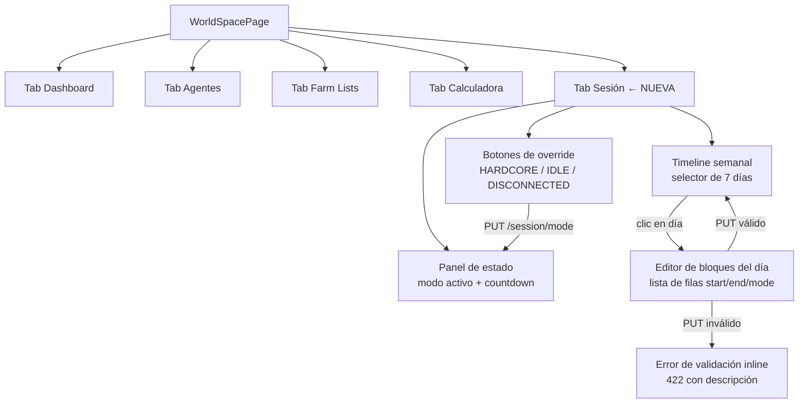

# Human Sessions — Pestaña "Sesión" en WorldSpacePage

## 1. Visión de la experiencia y principios de diseño

### Por qué existe esta vista

El bot fue baneado por Travian al operar 24/7 sin descanso (primera ofensa: -33% de
edificios). Esta pestaña permite al usuario configurar un calendario semanal de actividad
que imita el comportamiento humano: jugar más horas el fin de semana, dormir por la noche,
hacer pausas. La experiencia debe transmitir esta narrativa de forma sutil y no intrusiva.

### Principios aplicados (ref: `docs/design/PRINCIPIOS.md` / `frontend/DESIGN.md`)

- **Contenido primero**: la barra de timeline de 24h es el elemento central; comunica
  de un vistazo qué hace el bot a cada hora.
- **Menos es más**: una acción primaria clara por sección. El override es la acción de
  emergencia; el editor de bloques es la configuración.
- **Divulgación progresiva**: el editor de bloques de un día se expande al seleccionar
  ese día; no todos los días desplegados a la vez.
- **Semántica de color sobria**: se definen tres tokens de modo (HARDCORE/IDLE/DISCONNECTED)
  dentro del sistema existente, sin añadir nuevos acentos que compitan con el oro.
- **Tabular-nums y font-mono** en horas, countdowns y duraciones.

### Tokens de color para los tres modos de sesión

Se añaden al `tokens.css` del proyecto (no son acentos nuevos; son semánticos de estado):

| Token | Modo | Claro | Oscuro | Racional |
|---|---|---|---|---|
| `--mode-hardcore` | HARDCORE | `#248A3D` (= `--success`) | `#34C759` | Bot activo = éxito |
| `--mode-hardcore-subtle` | | `rgba(36,138,61,.12)` | `rgba(52,199,89,.12)` | Fondo de segmento timeline |
| `--mode-idle` | IDLE | `#0A6FCC` (= `--info`) | `#0A84FF` | Presencia ligera = información neutra |
| `--mode-idle-subtle` | | `rgba(10,111,204,.10)` | `rgba(10,132,255,.12)` | |
| `--mode-disconnected` | DISCONNECTED | `#8E8E93` (= `--text-tertiary`) | `#8E8E93` | Silencio total = neutro/inactivo |
| `--mode-disconnected-subtle` | | `rgba(142,142,147,.10)` | `rgba(142,142,147,.14)` | |

Justificación: HARDCORE reutiliza `--success` (bot corriendo = verde); IDLE reutiliza
`--info` (actividad de presencia = azul informativo); DISCONNECTED reutiliza
`--text-tertiary` (inactividad = neutro). El oro sigue reservado exclusivamente a
enlaces/activos.

---

## 2. Personas y objetivos (jobs-to-be-done)

### Persona única: el operador del bot

**Perfil**: usuario técnico que gestiona el bot desde el dashboard. Conoce Travian.
Ha vivido el baneo y entiende por qué los descansos son obligatorios.

**Jobs-to-be-done**:
1. **Monitorizar**: "¿En qué modo está el bot ahora mismo? ¿Cuánto tiempo hasta que cambie?"
2. **Intervención de emergencia**: "Me voy a dormir antes de lo habitual. Quiero forzar
   DISCONNECTED hasta que el calendario retome el control."
3. **Configurar el calendario**: "Quiero que de lunes a viernes esté en HARDCORE de
   08:00 a 23:00 y descanse el resto. Los sábados juego más tarde."
4. **Verificar la cobertura**: "¿Cubro las 24h sin huecos? ¿Hay algún error en mi
   configuración?"

**Frecuencia de uso por job**:
- Monitorizar: varias veces al día (P1 siempre visible)
- Intervención de emergencia: ocasional (P1 accesible)
- Configurar: una vez al principio, ajustes esporádicos (P2)
- Verificar: al editar (inline, en el editor)

---

## 3. Inventario de pantallas / vistas

Esta feature es una **nueva pestaña "Sesión"** dentro de `WorldSpacePage.jsx`. No es
una pantalla independiente. Se añade como ítem en `navItems` (5.º elemento del sidebar).

| Vista | Tipo | Estado |
|---|---|---|
| `SessionTab` | Tab nueva dentro de WorldSpacePage | CREAR |
| Panel de estado actual (`StatusPanel`) | Sección superior del tab | CREAR (patrón KpiCard) |
| Botones de override (`OverridePanel`) | Sección debajo del estado | CREAR (patrón pills) |
| Selector de día semanal (`DaySelector`) | Fila de 7 días clicables | CREAR |
| Barra de timeline 24h (`TimelineBar`) | Barra proporcional coloreada | CREAR |
| Editor de bloques (`BlockEditor`) | Lista editable de filas start/end/mode | CREAR |
| Indicador de error de cobertura | Mensaje de validación en vivo | CREAR |

---

## 4. Mapa de navegación



La vista "Sesión" es plana (sin modales, sin drawers). Todo ocurre inline dentro del tab.
El editor de bloques se expande bajo la barra de timeline del día seleccionado.

---

## 5. Flujos de usuario clave

### Happy path 1 — Monitorizar el estado actual

1. Usuario abre WorldSpacePage → clic en "Sesión" en el sidebar.
2. La vista carga mostrando el Panel de estado: badge del modo activo, bloque en curso
   (HH:MM–HH:MM), jitter actual y countdown al próximo cambio.
3. Si hay override activo: se muestra una fila adicional con el modo del override y su
   expiración.
4. Usuario escanea la info en segundos. No interactúa.

### Happy path 2 — Override de emergencia

1. Usuario está en el tab Sesión.
2. Ve que el modo actual es HARDCORE.
3. Pulsa el botón "Descanso total" (DISCONNECTED) en el panel de override.
4. Botón muestra estado de carga (spinner, deshabilitado).
5. API responde 200. El panel de estado se actualiza mostrando override activo + countdown
   hasta la expiración. El botón DISCONNECTED aparece marcado como activo.
6. El resto de botones de override siguen accesibles (para cambiar de nuevo si hace falta).

### Happy path 3 — Configurar el calendario (día laborable)

1. Usuario clic en "Lun" en el selector de días.
2. Se expande la barra de timeline de ese día (coloreada según los bloques actuales) y
   debajo aparece el editor de bloques.
3. El editor muestra las filas actuales (ejemplo: 00:00–08:00 DISCONNECTED | 08:00–23:00
   HARDCORE | 23:00–24:00 DISCONNECTED). Si es `is_default: true`, aparece un hint
   "Usando configuración por defecto. Edita para personalizar."
4. Usuario modifica una fila: cambia el end de "23:00" a "22:00" con el selector de hora.
5. Validación en vivo (coverage gap: falta 22:00–23:00). La barra de timeline muestra el
   hueco en rojo. El botón "Guardar" está deshabilitado. Aparece el mensaje de error inline.
6. Usuario añade un bloque 22:00–23:00 IDLE. El hueco desaparece. La barra se actualiza.
   "Guardar" se habilita.
7. Clic en "Guardar". Spinner. API responde 200. Toast: "Lunes guardado."
8. El `is_default` cambia a `false`. El día Lun en el selector muestra que está configurado.

### Flujo alternativo — Error de API (422)

1. Usuario pulsa "Guardar" con bloques inválidos que el cliente no detectó (edge case raro).
2. API devuelve 422 con `detail: "Los bloques no cubren las 24h completas (falta: 13:00-14:00)."`.
3. El mensaje de error de la API se muestra inline en el editor (misma zona que la validación
   en vivo). El toast no aparece.

### Flujo alternativo — Override ya activo en el modo solicitado

1. Usuario pulsa "HARDCORE" cuando el bot ya está en HARDCORE (sin override).
2. API devuelve 200 con `already_active: true`.
3. El botón no muestra spinner prolongado. El panel se actualiza sin cambio visible notable.
4. Toast informativo: "El bot ya está en modo HARDCORE."

---

## 6. Wireframes de baja fidelidad

### Vista completa del tab Sesión (desktop ≥ lg)

```
┌─ SIDEBAR (180px) ─┬─────────────── TAB SESIÓN ────────────────────────┐
│  Dashboard        │  PANEL DE ESTADO                                   │
│  Agentes          │  ┌──────────────────────────────────────────────┐  │
│  Farm Lists       │  │ [● HARDCORE]  Bloque 08:00–23:00             │  │
│▶ Sesión (activo)  │  │ Jitter: ±15 min                              │  │
│  Calculadora      │  │ Próximo cambio: [Countdown 04:12:33]         │  │
│                   │  │ ─────────────────────────────────────────── │  │
│                   │  │ ⚠ Override activo: IDLE hasta 11:08          │  │  ← solo si hay override
│                   │  └──────────────────────────────────────────────┘  │
│                   │                                                    │
│                   │  OVERRIDE MANUAL                                  │
│                   │  [HARDCORE ✓] [IDLE] [DESCANSO TOTAL]            │
│                   │  Fuerza el modo hasta el próximo borde de bloque │
│                   │                                                    │
│                   │  CALENDARIO SEMANAL                               │
│                   │  [Lun] [Mar] [Mié] [Jue] [Vie] [Sáb] [Dom]      │
│                   │  ──────────────────────────────────────────────── │
│                   │  Lun  ■■■■■■■■░░░░░░░░░░░░░░░░░░░░░░░░░░░░░     │  ← barra 24h
│                   │  DISCONNECTED 00:00–08:00 · HARDCORE 08:00–23:00 │  ← leyenda
│                   │                                                    │
│                   │  EDITOR DE BLOQUES — Lunes                        │
│                   │  ┌──────┬────────────┬──────────────────────┐    │
│                   │  │ Desde│ Hasta      │ Modo           [+]   │    │
│                   │  ├──────┼────────────┼──────────────────────┤    │
│                   │  │ 00:00│ 08:00  ▾  │ [DISCONNECTED] [✕]   │    │
│                   │  │ 08:00│ 23:00  ▾  │ [HARDCORE    ] [✕]   │    │
│                   │  │ 23:00│ 24:00  ▾  │ [DISCONNECTED] [✕]   │    │
│                   │  └──────┴────────────┴──────────────────────┘    │
│                   │  Cobertura: 24/24h ✓                             │
│                   │                                    [Guardar]      │
└───────────────────┴────────────────────────────────────────────────────┘
```

### Panel de estado (detalle)

```
┌─────────────────────────────────────────────────────────────────┐
│  ● HARDCORE      Bloque activo: 08:00 – 23:00                   │
│                  Jitter: ±15 min                                 │
│  Próximo cambio: 04:12:33   (countdown, font-mono, 22px/700)    │
│  a las ~23:07 aprox.        (hora estimada con jitter, tertiary) │
├──────────────────── solo si hay override ───────────────────────┤
│  ⚠ Override: IDLE  ·  expira en 00:47:21  (countdown)           │
│  [Cancelar override]                                             │
└─────────────────────────────────────────────────────────────────┘
```

### Barra de timeline 24h

```
00:00                    08:00                  23:00          24:00
  |████████████████████|██████████████████████████|████████████|
  DISCONNECTED (gris)          HARDCORE (verde)        DISCONNECTED
```

- Segmentos proporcionales (8h DISCONNECTED = 33.3% del ancho, etc.)
- Color por modo: verde (HARDCORE), azul (IDLE), gris (DISCONNECTED)
- Altura: 16px en desktop, 24px en móvil (target táctil)
- Tooltip/aria al hover: "08:00–23:00 HARDCORE (15h)"

### Editor de bloques — row

```
[  00:00  ] → [  08:00  ▾ ]   [ DISCONNECTED ▾ ]   [✕]
```
- `start` es solo lectura cuando hay bloque anterior (se fija al `end` del anterior)
- Solo el primer bloque tiene `start` editable (debe ser 00:00)
- `end` = `<input type="time">` nativo + opción "24:00" (extensión del selector)
- `mode` = `<select>` con los 3 valores
- El primer bloque de un día vacío tiene start=00:00 fijo

### Selector de días

```
[LUN]  [MAR]  [MIÉ]  [JUE]  [VIE]  [SÁB]  [DOM]
  ↑ activo (borde acento oro, fondo accent-subtle)
```

- Cada día muestra un punto de color del primer modo del día (indicador rápido)
- Si `is_default: true`: etiqueta "DEFAULT" debajo del nombre del día (caption, text-tertiary)
- Día activo en el calendario real: leve borde en `--text-tertiary` (no acento oro, ese es para selección)

---

## 6b. Mockup editable y layout aprobado

**Ruta**: `frontend/mockups/human-sessions.playground.html`

El mockup muestra las siguientes vistas seleccionables:
1. Estado normal — HARDCORE activo, sin override
2. Con override activo (IDLE forzado)
3. Editor de bloques abierto — día lunes con datos default
4. Editor con error de validación (hueco)
5. Estado cargando
6. Estado error de API

El layout propuesto (pendiente de aprobación por el usuario):
- Panel de estado arriba (siempre visible, P1)
- Override debajo del estado (P1 en desktop, P2 en móvil — colapsable)
- Selector de días como fila horizontal (P1)
- Barra de timeline debajo del día seleccionado (P1)
- Editor de bloques debajo de la barra (P2 — visible al seleccionar un día)

---

## 7. Estados de cada pantalla

### Panel de estado (`GET /worlds/{id}/session`)

| Estado | UI |
|---|---|
| **Cargando** | Spinner centrado en el panel. El skeleton no tapa el resto de la vista. |
| **Con datos** | Badge de modo, bloque activo HH:MM–HH:MM, countdown, jitter. |
| **Error de API** | Mensaje inline "No se pudo cargar el estado de la sesión. Reintenta." + botón Reintentar. |
| **Override activo** | Fila adicional con badge override + countdown de expiración + botón "Cancelar override". |
| **Override ya_activo (already_active)** | Toast informativo "El bot ya está en modo X". Sin cambio visual en el panel. |
| **Mundo no encontrado (404)** | Mensaje "Mundo no encontrado." (no debería ocurrir si la navegación es correcta). |

### Botones de override

| Estado | UI |
|---|---|
| **Normal** | Tres botones secundarios: HARDCORE, IDLE, DESCANSO TOTAL. Ninguno marcado. |
| **Modo activo sin override** | El botón del modo actual tiene apariencia "ya activo": fondo `--surface-2`, borde `--border`, texto `--text-secondary`, icono ✓. No está deshabilitado (se puede pulsar, devuelve `already_active`). |
| **Override activo** | El botón del modo del override tiene borde de acento y fondo `--accent-subtle`. |
| **Cargando (tras click)** | El botón pulsado muestra spinner. Los otros tres se deshabilitan temporalmente. |
| **Error** | Toast de error. El botón vuelve a su estado anterior. |

### Selector de días + barra de timeline (`GET .../timeline`)

| Estado | UI |
|---|---|
| **Cargando** | Barra de días skeleton (7 rectángulos grises). |
| **Con datos** | 7 botones de día. El día seleccionado con fondo `--accent-subtle` y borde oro. |
| **is_default: true** | Etiqueta "DEFAULT" en caption debajo del nombre del día. Hint en el editor: "Usando configuración por defecto." |
| **is_default: false** | Sin etiqueta. El día tiene un dot de color del primer modo del día. |
| **Error** | "No se pudo cargar el calendario. Reintenta." |

### Editor de bloques (PUT `...timeline/{weekday}`)

| Estado | UI |
|---|---|
| **Sin día seleccionado** | Placeholder: "Selecciona un día para editar su calendario." (text-tertiary, centrado). |
| **Cargando (tras PUT)** | Botón "Guardar" con spinner. Filas del editor en estado deshabilitado. |
| **Cobertura válida (24/24h)** | "Cobertura: 24h ✓" en verde (`--success`). Botón "Guardar" habilitado. |
| **Hueco** | Mensaje inline en rojo: "Falta cubrir: HH:MM–HH:MM." Botón "Guardar" deshabilitado. |
| **Solape** | Mensaje inline en rojo: "Solape detectado: HH:MM–HH:MM." Botón "Guardar" deshabilitado. |
| **Error 422 de API** | El mensaje `detail` de la API se muestra inline en la zona de error. |
| **Éxito (200)** | Toast "Lunes guardado." El día en el selector actualiza su dot de color. |
| **Un solo bloque (24h)** | Fila única: start=00:00 (fijo), end=24:00, mode=X. Botón "✕" oculto (no se puede borrar el único bloque). |

---

## 8. Inventario de componentes UI reutilizables

### Componentes REUTILIZAR tal cual (decisión palantir)

| Componente | Ubicación | Uso en esta vista |
|---|---|---|
| `Countdown` | `frontend/src/components/world/Countdown.jsx` | Countdown al `next_block_ends_at` en el panel de estado. Countdown al `expires_at` del override. |
| `TabBar` | `frontend/src/components/ui/TabBar.jsx` | No se usa directamente (la nav es el sidebar de WorldSpacePage). |
| `showToast` | `frontend/src/components/ui/uiUtils.jsx` | Confirmación de guardado, feedback de override, errores no recuperables. |
| `ErrorBoundary` | `frontend/src/components/ui/uiUtils.jsx` | Wrap del `SessionTab` completo. |
| `Spinner` | `frontend/src/components/ui/uiUtils.jsx` | Carga del panel de estado, botones en estado loading. |
| `useI18n` | `frontend/src/i18n/index.jsx` | Todos los textos del tab (cero hardcoding). |

### Componentes REUTILIZAR PATRÓN (no exportados — replicar su forma)

| Patrón | Fuente | Aplicación |
|---|---|---|
| `StatusBadge` (pill) | `SchedulerDashboard.jsx` | Badge del modo activo (HARDCORE/IDLE/DISCONNECTED) con dot de color y label. |
| `KpiCard` / `KpiMini` | Patrón de Dashboard | Panel de estado con el countdown principal. |
| Pills selector horizontal | Pestañas de modos en otros paneles | Botones de override (3 pills en fila). |

### Componentes CREAR DE CERO

| Componente | Descripción |
|---|---|
| `SessionTab` | Contenedor raíz del tab. Orquesta las llamadas a las 4 APIs y pasa datos a los sub-paneles. |
| `SessionStatusPanel` | Panel de estado actual: badge, bloque activo, countdown, override info. |
| `SessionOverridePanel` | Los 3 botones de override. Gestiona el loading state individual de cada botón. |
| `WeekdaySelector` | Fila de 7 botones de día con dot de color y etiqueta DEFAULT. Localiza los días con `Intl`. |
| `TimelineBar` | Barra proporcional de 24h con segmentos coloreados por modo. Tooltip por segmento. |
| `BlockEditor` | Lista de filas editable (start/end/mode). Validación en vivo de cobertura. |
| `BlockRow` | Una fila del editor: start (read-only o editable), end (`<input type="time">`), mode (`<select>`), botón eliminar. |
| `TimelineCoverageIndicator` | Mensaje de cobertura "24h ✓" o error de hueco/solape. |

---

## 9. Contenido y microcopy

### Claves i18n necesarias (a añadir al catálogo)

```
session.tab.label = "Sesión"                           # nav item
session.status.title = "Estado actual"
session.status.mode.hardcore = "HARDCORE"
session.status.mode.idle = "IDLE"
session.status.mode.disconnected = "DESCANSO TOTAL"   # más humano que "DISCONNECTED"
session.status.block = "Bloque: {start} – {end}"
session.status.jitter = "Jitter: ±{n} min"
session.status.nextChange = "Próximo cambio"
session.status.approxTime = "aprox. a las {time}"
session.status.loadingError = "No se pudo cargar el estado. Reintenta."
session.status.retry = "Reintentar"

session.override.title = "Forzar modo"
session.override.subtitle = "Activo hasta el próximo borde de bloque"
session.override.active = "Override activo: {mode}"
session.override.expiresIn = "Expira en"
session.override.cancel = "Cancelar override"
session.override.alreadyActive = "El bot ya está en modo {mode}."
session.override.applied = "Override aplicado. Modo {mode} hasta ~{time}."

session.timeline.title = "Calendario semanal"
session.timeline.hint = "Configura el horario del bot por día de la semana."
session.timeline.antiDetectionHint = "Incluir períodos de descanso reduce el riesgo de detección."
session.timeline.default = "Por defecto"
session.timeline.loadingError = "No se pudo cargar el calendario. Reintenta."

session.editor.title = "Editar — {day}"
session.editor.defaultHint = "Usando configuración por defecto. Edita para personalizar."
session.editor.from = "Desde"
session.editor.to = "Hasta"
session.editor.mode = "Modo"
session.editor.addBlock = "Añadir bloque"
session.editor.save = "Guardar"
session.editor.saving = "Guardando…"
session.editor.saved = "{day} guardado."
session.editor.saveError = "Error al guardar. Reintenta."
session.editor.coverage.ok = "Cobertura: 24h ✓"
session.editor.coverage.gap = "Falta cubrir: {from} – {to}"
session.editor.coverage.overlap = "Solape: {from} – {to}"
session.editor.removeBlock = "Eliminar bloque"

# Modos en el selector del editor
session.mode.hardcore = "HARDCORE"
session.mode.idle = "IDLE"
session.mode.disconnected = "Descanso total"
```

### Microcopy de anti-detección (hint, no invasivo)

En el encabezado de "Calendario semanal", debajo del título en caption:

> "Incluir períodos de descanso reduce el riesgo de detección."
> (`session.timeline.antiDetectionHint`, 12px, `--text-tertiary`)

Este es el único recordatorio de la razón de ser de la feature. Breve, sin
alarmar, sin sermones.

### Labels de modos — decisión de naming

`DISCONNECTED` se muestra como "Descanso total" en la UI (más humano y claro que
"DISCONNECTED"). En los logs de API y datos técnicos sigue siendo `DISCONNECTED`.
El badge del panel de estado usa el nombre corto del enum (HARDCORE / IDLE /
DISCONNECTED) porque es información técnica para un usuario avanzado.

---

## 10. Accesibilidad

- **Color nunca es la única señal**: cada modo tiene icono + texto + color (● HARDCORE,
  ~ IDLE, ○ DESCANSO TOTAL). La barra de timeline tiene `aria-label` por segmento:
  `"08:00 – 23:00, HARDCORE, 15 horas"`.
- **Foco visible**: anillo 2px en `--accent` en todos los controles interactivos.
  Los botones de override tienen `outline` visible. Los `input[type=time]` y `select`
  del editor respetan el foco del sistema.
- **Keyboard navigation**: tab order lógico (estado → override → selector de días →
  barra timeline → editor). Dentro del editor, tab entre campos de cada fila.
- **ARIA roles**:
  - Selector de días: `role="tablist"`, cada día `role="tab"`, `aria-selected`.
  - Botones de override: `role="group"` con `aria-label="Forzar modo de sesión"`.
  - Barra de timeline: `role="img"` con `aria-label` descriptivo completo.
  - Countdown: `aria-live="polite"` (no aria-live="assertive" para no interrumpir).
- **Contraste**: todos los colores de modo verificados ≥ 4.5:1 sobre `--surface` y `--bg`.
  `--success` (#248A3D) sobre blanco: 4.9:1 ✓. `--info` (#0A6FCC) sobre blanco: 4.8:1 ✓.
  `--text-tertiary` como color de DISCONNECTED tiene bajo contraste; se acompaña siempre
  de icono y texto en `--text` para compensar.
- **RTL**: propiedades lógicas CSS en todos los layouts (margin-inline, padding-inline,
  inset-inline). La barra de timeline invierte sus segmentos en RTL.
- **`prefers-reduced-motion`**: deshabilitar la transición de la barra de timeline al
  cambiar de día y la animación del countdown.
- **Targets táctiles**: botones de día ≥ 44px de alto en móvil. Botones de override ≥ 44px.
  Inputs del editor ≥ 44px de alto en móvil (font-size: 16px para evitar auto-zoom iOS).

---

## 11. Responsive / adaptación a dispositivos

### Desktop (≥ lg, 1024px+)

Layout vertical en una sola columna dentro del área de contenido de WorldSpacePage:
1. Panel de estado (tarjeta completa)
2. Override panel (3 pills en fila)
3. Calendario semanal: selector de días + barra de timeline + editor de bloques

### Tablet (md, 768–1023px)

Igual que desktop. El editor de bloques usa el espacio disponible. La sidebar de WorldSpace
puede estar colapsada (comportamiento existente de WorldSpacePage).

### Móvil (< md, < 768px)

- **Panel de estado (P1)**: visible completo. Countdown en tamaño grande. Badge de modo.
- **Override (P1)**: los 3 botones de override se muestran en columna (flex-direction: column)
  o en fila con scroll si no caben. Target mínimo 44px.
- **Selector de días (P1)**: fila horizontal con scroll si los 7 días no caben (overflow-x: auto).
  Cada día: botón mínimo 44px. Nombres de día abreviados a 3 letras (Lun, Mar…).
- **Barra de timeline (P1)**: 24px de alto en lugar de 16px. Tooltip → tap para ver info.
- **Editor de bloques (P2)**: se colapsa en un acordeón "Editar {día}" en móvil. Al abrir,
  muestra las filas en forma de tarjetas apiladas (no tabla):
  ```
  ┌──────────────────────────────┐
  │  DISCONNECTED                │
  │  00:00 → 08:00          [✕] │
  └──────────────────────────────┘
  ```
  Los inputs `type="time"` son nativos (funcionan bien en móvil). El `<select>` de modo
  es nativo (hoja de opciones en iOS/Android).

### Datos de prioridad P1/P2/P3

| Elemento | Prioridad | Comportamiento en móvil |
|---|---|---|
| Badge de modo activo | P1 | Siempre visible |
| Countdown al próximo cambio | P1 | Siempre visible, tamaño grande |
| Botones de override | P1 | Siempre visibles, en columna |
| Jitter ±N min | P2 | Colapsa tras disclosure "Más detalles" |
| Hora estimada aproximada | P2 | Visible solo con más espacio |
| Selector de días | P1 | Scroll horizontal |
| Barra de timeline | P1 | Siempre visible (24px) |
| Editor de bloques | P2 | Acordeón |
| Hint anti-detección | P3 | Oculto en móvil |

---

## 12. Interacciones y feedback

### Transitions y animaciones

- **Apertura del editor de bloques**: `max-height: 0 → auto` con `transition: max-height
  300ms ease`. Respeta `prefers-reduced-motion`.
- **Actualización de la barra de timeline al editar**: la barra se actualiza inmediatamente
  (sin animación) al cambiar un campo del editor (feedback reactivo en vivo).
- **Countdown**: actualización cada segundo. `font-variant-numeric: tabular-nums` para
  evitar saltos visuales. Sin animación de cambio.
- **Botón de override en loading**: spinner 14px inline dentro del botón. Duración:
  hasta que llega la respuesta de la API (no hay timeout artificial).
- **Toast**: aparece abajo centrado, auto-dismiss 3s. Animación: `translateY(8px) → 0`
  + `opacity 0 → 1`. Misma implementación que los otros toasts del proyecto.

### Validación en vivo del editor

- Trigger: en `onChange` de cada campo (time o select), no solo en `blur`.
- Resultado: la barra de timeline refleja inmediatamente el estado de los bloques.
  El `TimelineCoverageIndicator` cambia de "✓" a error message.
- El botón "Guardar" se habilita/deshabilita según la validez.
- Los errores se calculan en el cliente (misma lógica que `_validate_timeline()` del backend)
  para dar feedback instantáneo sin round-trip.

### Override panel — states

- El botón del modo actualmente efectivo (modo real o modo del override) tiene apariencia
  "seleccionado": borde `--accent`, fondo `--accent-subtle`, texto `--accent-text`.
- Al hacer click en un botón ya seleccionado: se dispara el PUT igualmente (API responde
  `already_active: true`). Toast: "El bot ya está en modo X."
- Si hay override, aparece debajo de los botones la fila "Override: {mode} · expira en
  {countdown}" + botón ghost "Cancelar override" que dispara `DELETE /session/override`
  (si la API lo expone) o simplemente `PUT /session/mode` con el modo del bloque activo.

---

## 13. Criterios de aceptación de diseño

### Visuales

- [ ] El badge de modo usa exactamente los tres tokens de color definidos en §1 (verde HARDCORE, azul IDLE, gris DISCONNECTED). Nunca el oro ni ningún otro color.
- [ ] El oro (`--accent`, `--accent-text`) aparece solo en: día seleccionado del selector, foco de inputs, borde de botón de override activo, y nav item activo "Sesión" en el sidebar. Nunca como color de modo.
- [ ] Los botones de override son secundarios (fondo `--surface`, borde `--border-strong`). No usan el botón primario monocromo ni el oro como relleno.
- [ ] El countdown usa `--font-mono` y `tabular-nums`.
- [ ] La barra de timeline de 24h es proporcional: un bloque de 4h ocupa exactamente 1/6 del ancho.
- [ ] En modo oscuro todos los elementos mantienen sus contrastes. No hay hex hardcodeados.
- [ ] La vista pasa la revisión visual en 390px, 768px, 1280px y 1920px de ancho.

### Funcionales

- [ ] El panel de estado muestra: modo activo, bloque (start–end), jitter, countdown al `next_block_ends_at`.
- [ ] Si hay override activo: se muestra modo del override y countdown al `expires_at`.
- [ ] Los 3 botones de override disparan `PUT /worlds/{id}/session/mode` con el modo correcto.
- [ ] El botón del modo actualmente en vigor tiene apariencia "seleccionado".
- [ ] Al seleccionar un día, se muestran su barra de timeline y el editor de bloques.
- [ ] Si `is_default: true`, el editor muestra el hint y la etiqueta "Por defecto" en el selector.
- [ ] La barra de timeline se actualiza en tiempo real mientras el usuario edita los bloques.
- [ ] El botón "Guardar" está deshabilitado cuando hay huecos o solapes (validación en vivo).
- [ ] Los errores de validación (hueco/solape) se muestran inline con descripción de la franja horaria afectada.
- [ ] El primer bloque de cada día siempre tiene start=00:00 (no editable por el usuario).
- [ ] El último bloque de cada día siempre tiene end=24:00 (solo editable ajustando el penúltimo).
- [ ] Se puede añadir un nuevo bloque con el botón [+] (se inserta al final con start=end_del_último, end=24:00).
- [ ] No se puede borrar el último bloque si solo queda uno.
- [ ] `Guardar` exitoso muestra toast y actualiza el dot de color del día en el selector.
- [ ] Todos los textos usan claves i18n (`useI18n`). Ningún string hardcodeado en el JSX.
- [ ] Funciona en RTL: barra de timeline espejada, propiedades lógicas en todos los layouts.

### Accesibilidad

- [ ] Todos los controles tienen `aria-label` o `aria-labelledby` descriptivo.
- [ ] Los botones de override tienen `role="group"` y cada botón indica su estado (aria-pressed o aria-checked).
- [ ] La barra de timeline tiene `role="img"` con `aria-label` descriptivo de todos los bloques.
- [ ] El countdown tiene `aria-live="polite"`.
- [ ] El foco es visible en todos los elementos interactivos (anillo 2px `--accent`).
- [ ] Tab order lógico sin trampas de foco.

---

## 14. Trazabilidad

| Decisión de diseño | Necesidad / flujo de origen |
|---|---|
| Nuevo tab "Sesión" en WorldSpacePage (no pantalla independiente) | Encaje en navegación según palantir: la feature pertenece al contexto de un mundo concreto. Patrón existente de navItems en WorldSpacePage. |
| Panel de estado siempre visible arriba (P1) | Job-to-be-done "Monitorizar" es el más frecuente. La info de estado es la más consultada. PRINCIPIOS: contenido primero. |
| Countdown reutilizando componente existente | Palantir: `Countdown.jsx` ya existe y resuelve exactamente este caso. UI: reutilizar, no crear. |
| 3 tokens de modo reutilizando semánticos existentes | DESIGN.md §5: éxito=verde, info=azul, neutro=gris. No añadir acentos nuevos. El oro permanece intacto. |
| Override como 3 pills (no dropdown) | Job-to-be-done "Intervención de emergencia": 3 opciones fijas, visibles de golpe, tap directo. Un dropdown añadiría un click extra en un momento de urgencia. |
| Editor inline (no modal/drawer) | Spec §13 trade-off: la configuración de 7 días × N bloques es compleja. Un modal haría perder contexto visual (no se ve la barra de timeline al editar). Inline mantiene todo visible. PRINCIPIOS: divulgación progresiva (el editor se expande al seleccionar el día). |
| Validación en vivo en el cliente | PRINCIPIOS: feedback inmediato reduce frustración. La lógica de `_validate_timeline()` del backend es determinista y reproducible en JS. Sin round-trip para errores básicos. |
| Microcopy anti-detección en caption (no banner) | El usuario es técnico y ya conoce el contexto del baneo. Un banner intrusivo sería ruido; una caption de 12px en `--text-tertiary` recuerda la razón sin interrumpir el flujo. PRINCIPIOS: menos es más. |
| Nombre "Descanso total" para DISCONNECTED | UX de naming: "DISCONNECTED" es técnico y frío. "Descanso total" transmite la intención ("el humano se fue a dormir") de forma natural. El valor del enum sigue siendo `DISCONNECTED` en la API. |
| `is_default: true` con hint en editor | Spec RN-HS11: el usuario puede nunca haber configurado un día. Sin el hint, podría confundirse pensando que los datos son suyos cuando son defaults del sistema. |
| Barra de timeline proporcional (no iconos/chips) | El componente más importante es la visualización de densidad de actividad en 24h. Una barra proporcional comunica de un vistazo los bloques grandes/pequeños. PRINCIPIOS: contenido primero, espacio informa. |
| Selector de días como fila (no tabs verticales) | 7 elementos: caben en una fila horizontal sin scroll en desktop. En móvil con scroll horizontal. Patrón de tablist accesible. |
| `type="time"` nativo para hora | Reduce superficie de código personalizado. Funciona bien en todos los dispositivos. El único edge case (24:00) se maneja añadiendo una opción especial en el selector. |
| Start del primer bloque = 00:00 fijo | RN-HS04: el timeline debe cubrir desde 00:00 exacto. Si el usuario pudiera cambiar el start del primer bloque a otra hora, crearía un hueco al principio. |

---

🔖 Última revisión: 2026-05-31
