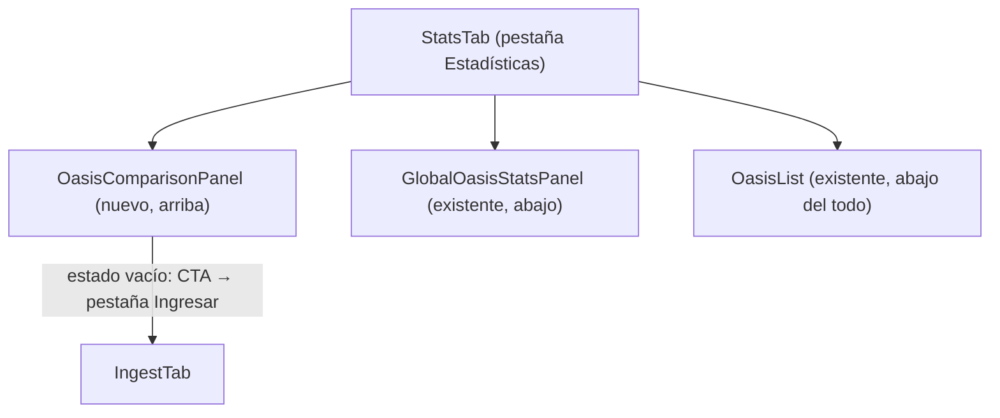

# Tabla comparativa de reaparición de animales por oasis

## 1. Visión de la experiencia y principios de diseño

El usuario necesita comparar en una sola mirada cuáles oasis regeneran más rápido
por especie, y cuántos animales hay ya acumulados en cada uno ahora mismo, para
decidir a cuál atacar primero.

La vista es una herramienta de decisión densa, no un informe bonito. Los principios
que mandan (DESIGN.md §1):

- **Densidad informativa**: tabla compacta, filas de 36-40px, números tabulares.
- **Menos es más**: una sola tabla comparativa como dato principal; el toggle
  tasa/proyección evita saturar las celdas.
- **Divulgación progresiva**: el indicador de confianza (valid_intervals) aparece
  en tooltip, no en la celda; los detalles de baja confianza se marcan visualmente
  sin interrumpir el flujo.
- **Contenido primero**: los iconos de animal van en cabecera de columna, no en cada
  celda; las coordenadas identifican la fila sin adorno.
- **Color con cuentagotas**: solo el oro para la barra de acento activo; rojo solo
  para el banner de error; gris para la marca de baja confianza.

---

## 2. Personas y objetivos (jobs-to-be-done)

| Persona | Job | Contexto |
|---------|-----|----------|
| Jugador activo de Travian | "Ver de un vistazo cuáles oasis tienen más tigres acumulados ahora" | Consulta rápida antes de decidir a cuál oasis atacar |
| Jugador planificador | "Comparar tasas brutas de regeneración de todos mis oasis para optimizar la ruta de farmeo" | Revisión periódica en desktop |

---

## 3. Inventario de pantallas / vistas

Solo hay una vista: la sección `OasisComparisonPanel` dentro de `StatsTab`.

| Vista | Ruta de montaje | Notas |
|-------|-----------------|-------|
| `OasisComparisonPanel` | `StatsTab`, encima de `GlobalOasisStatsPanel` | Carga independiente; un fallo aquí no bloquea el resto de `StatsTab` |

---

## 4. Mapa de navegación



El panel no tiene navegación propia: es una sección de solo lectura dentro de
`StatsTab`. El único punto de salida es el CTA del estado vacío, igual que
`GlobalOasisStatsPanel`.

---

## 5. Flujos de usuario clave

### Happy path — tabla con datos

1. Usuario abre la pestaña Estadísticas.
2. `OasisComparisonPanel` monta → llama `GET /attack-reports/stats/oasis/comparison`.
3. Mientras carga: skeleton de 3 filas + cabecera (estado loading).
4. Respuesta llega: la tabla se renderiza. Columnas = `species_columns` del response.
5. Por defecto se muestra el modo **Tasa** (animales/h por especie).
6. Usuario pulsa toggle → cambia a modo **Proyección** (animales acumulados ahora).
7. Toggle vuelve al modo Tasa: la tabla restaura las tasas.

### Flujo alternativo — BD vacía (`oasis: []`)

- El panel muestra el estado vacío: icono neutro + texto + CTA "Ingresar reportes".
- `GlobalOasisStatsPanel` y `OasisList` siguen funcionando independientemente.

### Flujo alternativo — todos los oasis con 1 solo reporte (has_rates: false para todos)

- La tabla se muestra con todas las celdas en "—".
- La leyenda de baja confianza es visible.
- No es un error; es confianza insuficiente. Sin banner rojo.

### Flujo alternativo — error de red / 500

- Banner de error rojo con botón "Reintentar".
- No bloquea `GlobalOasisStatsPanel` ni `OasisList`.

---

## 6. Wireframes de baja fidelidad por pantalla

### Layout general de OasisComparisonPanel dentro de StatsTab

```
┌─ StatsTab (maxWidth: 900px, padding heredado) ────────────────────┐
│                                                                    │
│  ┌─ OasisComparisonPanel ──────────────────────────────────────┐  │
│  │  [Comparativa de oasis]        [Toggle: Tasa | Proyección]  │  │
│  │  Calculado: hace 2 min                                       │  │
│  │                                                              │  │
│  │  ┌──────── tabla comparativa ────────────────────────────┐  │  │
│  │  │  [scroll horizontal si ># columnas caben; col 1 sticky]│  │  │
│  │  │                                                        │  │  │
│  │  │  OASIS       │ 🐀 Rata │ 🕷 Araña │ 🐯 Tigre │ 🐻 Oso  │  │  │
│  │  │              │  /h  ▲ │   /h    │   /h    │   /h   │  │  │
│  │  │  ─────────────────────────────────────────────────── │  │  │
│  │  │  (−70|73) ●  │  1.25  │    0.80 │    —    │   2.00 │  │  │
│  │  │  8 ataques   │        │         │         │        │  │  │
│  │  │  ─────────────────────────────────────────────────── │  │  │
│  │  │  (12|−45) ●  │    —   │    3.00 │   1.50  │    —   │  │  │
│  │  │  5 ataques   │        │         │         │        │  │  │
│  │  │  ─────────────────────────────────────────────────── │  │  │
│  │  │  (5|22) ◌    │    —   │     —   │    —    │    —   │  │  │
│  │  │  1 ataque  BAJA CONFIANZA                           │  │  │
│  │  └────────────────────────────────────────────────────┘  │  │
│  │                                                              │  │
│  │  ● = has_rates:true  ◌ = has_rates:false                    │  │
│  └──────────────────────────────────────────────────────────┘  │
│                                                                    │
│  ─────────────────────────────── separator ─────────────────────  │
│                                                                    │
│  GlobalOasisStatsPanel (existente, sin cambios)                   │
│  OasisList             (existente, sin cambios)                   │
└───────────────────────────────────────────────────────────────────┘
```

### Cabecera de columna (especie)

```
┌──────────────────┐
│  [img 18px]      │  ← icono nature_{ordinal}.png
│  Tigre           │  ← animal_name, 11px uppercase
│  ───────         │  ← hairline
│  /h  ← modo tasa │  ← unidad (o "ahora" en modo proyección)
└──────────────────┘
```

### Celda con valor (modo tasa)

```
  1.25
  ●●●●○  ← dots de confianza (opcional, solo si hay espacio)
```

Variante con tooltip (sin los dots en celda):
- Hover/foco en la celda → tooltip: "6 intervalos válidos".

### Celda ausencia ("—")

```
  —     ← color --text-disabled, centrado
```

### Celda proyección

```
  23
  (base: 3 supervivieron)   ← solo en tooltip; en celda solo el número entero
```

Cuando `projected_now` es `null` (derrota en último reporte):
```
  ?     ← color --text-tertiary; tooltip "Sin dato: último reporte fue derrota"
```

### Columna fija de oasis (primera columna sticky)

```
┌─────────────────────────────┐
│  (−70 | 73)                 │  ← coords, font-mono, font-weight 600
│  8 ataques · hace 16h       │  ← meta, 11px, text-secondary
└─────────────────────────────┘
```

Para oasis has_rates:false:
```
┌─────────────────────────────┐
│  (5 | 22)                   │
│  1 ataque · hace 50h        │
│  [! Datos insuficientes]    │  ← badge pequeño, text-disabled
└─────────────────────────────┘
```

### Header del panel

```
┌────────────────────────────────────────────────────────┐
│  Comparativa de oasis          [Tasa /h] [Proyección]  │
│  Calculado: 01/06/2026, 14:32                          │
└────────────────────────────────────────────────────────┘
```

---

## 6b. Mockup editable y layout aprobado

**Ruta del mockup:** `frontend/mockups/oasis-comparison.playground.html`

**Estado:** pendiente aprobación del usuario.

El mockup incluye los bloques arrastrables:
1. `[HEADER]` — título + toggle tasa/proyección + timestamp computed_at
2. `[TABLA — cargando]` — skeleton 3 filas
3. `[TABLA — con datos]` — 4 oasis (3 con tasas, 1 baja confianza), 4 especies,
   modo tasa por defecto / toggle activa modo proyección
4. `[TABLA — vacía]` — estado empty con CTA
5. `[BANNER ERROR]` — banner rojo + botón Reintentar
6. `[LEYENDA]` — leyenda de indicadores (● has_rates / ◌ baja confianza / — ausencia / ? derrota)

El usuario recompone los bloques y exporta el layout JSON antes de que
`desarrollador-ux-ui` implemente el componente real.

---

## 7. Estados de cada pantalla

| Estado | Condición | Tratamiento visual |
|--------|-----------|-------------------|
| **Cargando** | `loading: true` | Skeleton: cabecera falsa + 3 filas animadas (pulse) |
| **Error** | `error: string` | Banner rojo full-width con mensaje + botón "Reintentar" (patrón `GlobalOasisStatsPanel.ErrorBanner`) |
| **Vacío** | `oasis.length === 0` | Empty state: icono neutro + "Sin oasis comparables" + CTA "Ingresar reportes" |
| **Solo baja confianza** | Todos `has_rates: false` | Tabla con todas las celdas "—"; leyenda de baja confianza visible. Sin error. |
| **Con datos** | `oasis.length > 0` + al menos uno con `has_rates: true` | Tabla comparativa completa |
| **Proyección null** | `projected_now === null` (modo proyección activo) | Celda con "?" en `--text-tertiary` + tooltip explicativo |
| **has_rates: false** | Oasis en el grupo de baja confianza | Fila con badge "Datos insuficientes", celdas de tasa "—", celdas proyección "—" |

---

## 8. Inventario de componentes UI reutilizables

| Componente | Origen | Uso aquí | Tipo palantir |
|---|---|---|---|
| `NatureIcon` | `attack-reports/NatureIcon.jsx` | Icono de especie en cabecera de columna y en celdas de especie | REUTILIZAR tal cual |
| Patrón `loading/error/empty` | `GlobalOasisStatsPanel.jsx` (skeleton + ErrorBanner + GlobalStatsEmpty) | Copiar el patrón; el nuevo panel tiene su propio skeleton con filas en vez de barras | REUTILIZAR patrón (no el componente) |
| `api.getGlobalOasisStats()` (cliente HTTP) | `frontend/src/api/client.js` | Solo como referencia de patrón; el nuevo método es `api.getOasisComparison()` | CREAR método nuevo |
| Tokens de diseño (CSS vars) | `frontend/src/styles/tokens.css` | Todos los tokens del sistema de diseño; ningún hex hardcodeado | REUTILIZAR |
| `StatsTab` | `StatsTab.jsx` | Se modifica añadiendo `OasisComparisonPanel` encima de `GlobalOasisStatsPanel` | MODIFICAR (cambio mínimo, retrocompatible) |
| `OasisComparisonPanel` | — | Componente nuevo; tabla comparativa multi-oasis × especie | CREAR |
| `ComparisonToggle` | — | Toggle tasa/proyección inline en el header del panel | CREAR (puede ser inline dentro de `OasisComparisonPanel`) |

**Lo que NO se reutiliza:**
- `RegenRatesSection`: su contrato es por-especie de un único oasis; no encaja con la
  tabla comparativa multi-oasis (confirmado en spec §16 / palantir).

---

## 9. Contenido y microcopy

### Claves de traducción a añadir (convencion `ar.stats.comparison.*`)

| Clave | Español (default) | Notas |
|-------|-------------------|-------|
| `ar.stats.comparison.title` | "Comparativa de oasis" | Título del panel H2 |
| `ar.stats.comparison.computed_at` | "Calculado: {datetime}" | Timestamp computed_at; usar Intl.DateTimeFormat |
| `ar.stats.comparison.toggle_rate` | "Tasa /h" | Modo tasa en el toggle |
| `ar.stats.comparison.toggle_projected` | "Proyección" | Modo proyección en el toggle |
| `ar.stats.comparison.col_oasis` | "Oasis" | Cabecera primera columna sticky |
| `ar.stats.comparison.col_attacks` | "{n} ataques" | Sub-meta de cada fila de oasis |
| `ar.stats.comparison.col_hours_ago` | "hace {h}h" | Horas desde último ataque |
| `ar.stats.comparison.absent` | "—" | Celda de ausencia (especie no observada) |
| `ar.stats.comparison.unknown` | "?" | Proyección null (último reporte fue derrota) |
| `ar.stats.comparison.low_confidence` | "Datos insuficientes" | Badge en oasis has_rates:false |
| `ar.stats.comparison.tooltip_intervals` | "{n} intervalos válidos" | Tooltip en celdas con tasa |
| `ar.stats.comparison.tooltip_unknown` | "Sin dato: el último reporte fue derrota" | Tooltip en celdas "?" |
| `ar.stats.comparison.tooltip_projected_base` | "Base: {n} supervivieron en el último ataque" | Tooltip en celda proyección |
| `ar.stats.comparison.empty.title` | "Sin oasis comparables" | Título estado vacío |
| `ar.stats.comparison.empty.sub` | "Ingresa reportes de al menos dos ataques al mismo oasis para ver la comparativa." | Descripción estado vacío |
| `ar.stats.comparison.empty.cta` | "Ingresar reportes" | CTA estado vacío |
| `ar.stats.comparison.error` | "Error al cargar la comparativa de oasis" | Mensaje banner error |
| `ar.stats.comparison.retry` | "Reintentar" | Botón retry |
| `ar.stats.comparison.legend.has_rates` | "Con tasa calculada" | Leyenda ● |
| `ar.stats.comparison.legend.low_confidence` | "Datos insuficientes (1 ataque)" | Leyenda ◌ |
| `ar.stats.comparison.legend.absent` | "Especie no observada en este oasis" | Leyenda — |
| `ar.stats.comparison.legend.unknown_proj` | "Proyección indeterminada (último reporte: derrota)" | Leyenda ? |

---

## 10. Accesibilidad

| Requisito | Implementación |
|-----------|----------------|
| La tabla tiene `role="table"` con `<thead>` y `<tbody>` semánticos | Estructura HTML nativa `<table>` |
| Cabeceras de columna con `scope="col"` | `<th scope="col">` en cada columna de especie |
| Cabeceras de fila con `scope="row"` | `<th scope="row">` en la columna de oasis (primera columna) |
| Celda "—" no pierde semántica para lectores de pantalla | `aria-label="Especie no observada"` en celdas "—" |
| Celda "?" ídem | `aria-label="Proyección indeterminada: último reporte fue derrota"` |
| Tooltips accesibles | `title` + `role="tooltip"` (o `<details>` si se opta por accesible sin JS) |
| Foco visible | Anillo de 2px `--accent` en el toggle y en las celdas interactivas |
| El toggle tiene estado | `role="group"` + botones `aria-pressed` o `<fieldset>` con `<legend>` |
| Color no es la única señal en baja confianza | Badge "Datos insuficientes" + icono ⚠ además del gris |
| Scroll horizontal accesible | `overflow-x: auto` en el contenedor, `tabIndex=0` para alcanzar por teclado |
| `prefers-reduced-motion` | Skeleton animation desactivada si el usuario lo prefiere |

**RTL:** primera columna sticky `position: sticky; inset-inline-start: 0` (propiedad
lógica). Tabla se espeja correctamente en RTL: primer columna sigue siendo la de
identidad, las de especie se leen de derecha a izquierda.

---

## 11. Responsive / adaptación a dispositivos

| Breakpoint | Comportamiento |
|------------|----------------|
| `< md` (< 768px) — móvil | La tabla se transforma en **lista de tarjetas apiladas**. Cada tarjeta = un oasis; contiene coords, meta, y solo las **3 especies con mayor tasa** (P1) expandibles a todas con "Ver más" (P2/P3). Toggle tasa/proyección afecta a las tarjetas igual que a la tabla. |
| `md` – `lg` (768–1024px) — tablet | Tabla compacta con scroll horizontal contenido. Primera columna sticky. Columnas de especie con icono sin texto si no caben (nombre en tooltip). |
| `≥ lg` (≥ 1024px) — desktop | Tabla completa. Cabecera con icono + nombre de especie. Scroll horizontal solo si hay muchas especies (>6). |

**Prioridades responsive en la tabla:**
- P1: coordenadas del oasis, total_attacks, modo tasa/proyección de las especies principales.
- P2: hours_since_last_attack, valid_intervals (via tooltip en desktop → inline en móvil).
- P3: computed_at timestamp (P3 → solo visible en desktop, hidden en móvil).

**Columna fija sticky:** no en móvil (tarjetas). En tablet y desktop: `position: sticky; inset-inline-start: 0; background: var(--surface); z-index: 1`.

---

## 12. Interacciones y feedback

| Interacción | Comportamiento |
|-------------|----------------|
| Toggle Tasa / Proyección | Botón activo se marca con `--accent-subtle` + borde `--accent`. Transición `--dur-fast`. La tabla re-renderiza cambiando los valores de las celdas (sin nueva llamada a la API). |
| Hover en celda con valor | Tooltip con `valid_intervals` (modo tasa) o con `last_survived` base (modo proyección). |
| Hover en celda "?" | Tooltip "Sin dato: el último reporte fue derrota". |
| Clic en botón Reintentar | Nuevo fetch a EP-10; estado loading mientras. |
| Clic en CTA "Ingresar reportes" | Llama a `onGoToIngest` (callback de `StatsTab`), igual que `GlobalOasisStatsPanel`. |
| Scroll horizontal de la tabla | Solo la tabla hace scroll, no la página. Primera columna permanece fija (sticky). |
| Carga inicial | Skeleton: cabecera de tabla falsa + 3 filas pulsantes (animation: pulse). Duración: hasta que llega la respuesta. |

---

## 13. Criterios de aceptación de diseño (checklist verificable)

- [ ] `OasisComparisonPanel` aparece encima de `GlobalOasisStatsPanel` en `StatsTab`.
- [ ] La carga es independiente: si falla `OasisComparisonPanel`, `GlobalOasisStatsPanel` y `OasisList` siguen funcionando.
- [ ] El estado loading muestra un skeleton animado (no un spinner suelto).
- [ ] El estado vacío muestra CTA "Ingresar reportes" que navega a la pestaña Ingresar.
- [ ] El estado error muestra un banner rojo con botón Reintentar.
- [ ] Las columnas de la tabla corresponden exactamente a `species_columns` del response (dinámicas, no hardcodeadas).
- [ ] La primera columna (oasis) es sticky en `≥ md`.
- [ ] Las celdas sin tasa muestran "—" con `--text-disabled`.
- [ ] Las celdas con `projected_now: null` en modo proyección muestran "?" con `--text-tertiary` y tooltip explicativo.
- [ ] Los oasis con `has_rates: false` aparecen al final de la tabla con badge "Datos insuficientes".
- [ ] El toggle Tasa/Proyección cambia todos los valores de celda sin nueva llamada a la API.
- [ ] Números de tasa: `--font-mono` + `tabular-nums`, alineados al extremo final de la celda.
- [ ] Números de proyección: `--font-mono` + `tabular-nums`, alineados al extremo final.
- [ ] En `< md` la tabla se transforma en tarjetas apiladas por oasis.
- [ ] En RTL (ar/he/fa) la primera columna sigue sticky con `inset-inline-start: 0`.
- [ ] El icono de especie (NatureIcon) aparece en la cabecera de columna.
- [ ] `computed_at` formateado con `Intl.DateTimeFormat` según el locale activo.
- [ ] `hours_since_last_attack` formateado con `Intl.NumberFormat` (ej. "16,32h" en es).
- [ ] Sin texto hardcodeado en el componente: todo vía claves `ar.stats.comparison.*`.
- [ ] Sin hexadecimales hardcodeados: todo vía variables CSS.
- [ ] Foco visible en el toggle y en el botón Reintentar.
- [ ] Mockup editable aprobado por el usuario antes de la implementación.

---

## 14. Trazabilidad

| Decisión de diseño | Fuente |
|--------------------|--------|
| Tabla comparativa oasis × especie (no por-oasis) | Spec §1: necesidad central de comparar múltiples oasis en una vista |
| Columnas dinámicas (species_columns del response) | RN-03: columnas = unión de especies con tasa en al menos un oasis |
| Celda "—" para ausencia (no cero) | RN-02 + matiz central del spec §1: ausencia semántica |
| Celda "?" para projected_now null | EC-02 / RN-08: `last_survived` null → proyección indeterminada |
| Oasis has_rates:false al final, con badge | RN-05: ordenar has_rates DESC; badge visual de baja confianza |
| Toggle Tasa / Proyección (sin dos líneas por celda) | Trade-off densidad vs. saturación: mostrar ambos datos satura la celda; el toggle preserva la densidad y respeta el principio "menos es más" (PRINCIPIOS.md) |
| Primera columna sticky | EC-08: tabla puede tener muchas columnas (>50 oasis, N especies); DESIGN.md §17.5 |
| Tooltip para valid_intervals (no inline en celda) | Divulgación progresiva: el dato de confianza es secundario (P2) |
| No reutiliza RegenRatesSection | Spec §16 / palantir: contrato por-especie de un único oasis; no encaja con tabla multi-oasis |
| Reutiliza NatureIcon | Palantir: componente existente para iconos de naturaleza por ordinal |
| Reutiliza patrón loading/error/empty de GlobalOasisStatsPanel | DESIGN.md §12: estados de vista obligatorios; patrón ya establecido en el proyecto |
| Tarjetas en móvil (no tabla con scroll horizontal) | DESIGN.md §17.5: tablas densas → tarjetas en móvil |
| `inset-inline-start: 0` para sticky (no `left: 0`) | DESIGN.md §16.2: propiedades lógicas CSS obligatorias para RTL |
| computed_at con Intl.DateTimeFormat | DESIGN.md §16.5: formatear fechas con Intl según locale |
| OasisComparisonPanel monta encima de GlobalOasisStatsPanel | Spec §3 alcance / StatsTab.jsx: el nuevo panel va "justo encima" |
