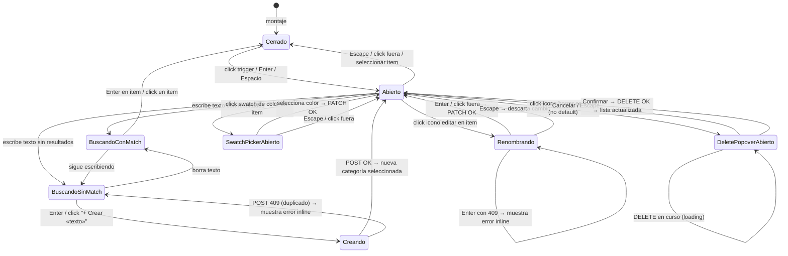

# CategoryCombobox — Desplegable inteligente de categorías de ruta

> **Estado `ready-for-impl`:** gate humano del mockup aprobado por el usuario
> (2026-06-06, "implementalo"). Listo para que `desarrollador-ux-ui` implemente.

---

## 1. Visión de la experiencia y principios de diseño

El `CategoryCombobox` reemplaza al `<select>` estático de categoría en el portal de
Route Templates. El objetivo es que el usuario pueda clasificar y gestionar categorías
**sin salir del flujo de edición de una plantilla**: crear, renombrar, cambiar el
color y borrar, todo desde un único control inline con el mismo vocabulario visual
que el resto del dashboard.

Principios aplicados (de `docs/design/PRINCIPIOS.md` / `frontend/DESIGN.md`):

- **Menos es más:** el desplegable no muestra acciones de gestión hasta que el usuario
  pasa el cursor sobre un item (divulgación progresiva). En reposo parece un selector normal.
- **Contenido primero:** el swatch de color y el label de la categoría mandan; los
  botones de acción son secundarios y aparecen bajo demanda.
- **Paleta sobria y consistente:** los colores de categoría son apagados y acordes a
  los tokens del sistema; el oro del sistema NUNCA se usa como color de categoría.
- **Consistencia con el sistema:** reutiliza `DeletePopover`, `Spinner` y `showToast`
  existentes. El estilo visual sigue exactamente los tokens duales de `DESIGN.md §15`.
- **Accesibilidad como parte del minimalismo:** roles ARIA combobox/listbox, navegación
  teclado completa, foco visible, RTL mediante propiedades lógicas CSS.

---

## 2. Personas y objetivos (jobs-to-be-done)

### Persona única: el desarrollador-operador del bot

Un solo usuario que opera el bot. Técnico pero ocupado; gestiona decenas de plantillas
de ruta y quiere clasificarlas con sus propios criterios (no los que venían hardcodeados).

| Job-to-be-done | Contexto | Resultado esperado |
|---|---|---|
| Asignar una categoría existente a una plantilla | Está editando o filtrando plantillas | La plantilla queda reclasificada sin abrir otra pantalla |
| Crear una categoría nueva mientras trabaja | Escribe un nombre que no existe | La categoría se crea y queda seleccionada en el mismo gesto |
| Renombrar una categoría que ya no tiene sentido | El label viejo ya no describe lo que agrupa | El nuevo label se aplica a todo lo que usaba esa categoría |
| Cambiar el color de una categoría | Los colores por defecto no le gustan o se confunden visualmente | El badge de todas las plantillas con esa categoría cambia |
| Eliminar una categoría obsoleta | Fue creada para un proyecto que ya no existe | La categoría desaparece y las plantillas quedan en "Sin categoría" |

---

## 3. Inventario de pantallas / vistas

El `CategoryCombobox` es un **componente inline**, no una pantalla. Aparece en dos
contextos ya existentes:

| Contexto | Ubicación actual | Cambio |
|---|---|---|
| Barra de filtros de `RouteTemplatesPage` | Bloque B, `<select>` con 7 valores hardcodeados | Reemplazado por `CategoryCombobox` en modo solo-selección |
| Drawer de edición de plantilla (`NoiseDestinationDrawer`) | Campo "Categoría" | Reemplazado por `CategoryCombobox` en modo completo (CRUD) |
| Tabla de plantillas (`NoiseCategoryBadge`) | Badge de solo lectura | Se convierte en badge dinámico que toma `{label, color}` |

Vistas del mockup (7 estados del desplegable a explorar):

1. **Cerrado / reposo** — muestra badge de la categoría actual + chevron
2. **Abierto / lista** — dropdown con todas las categorías listadas, campo de búsqueda
3. **Búsqueda sin resultados** — "Sin resultados · + Crear «texto»"
4. **Búsqueda con match parcial** — items filtrados + opción "+ Crear «texto»" al final
5. **Item en hover** — acciones inline visibles: renombrar, cambiar color, borrar
6. **Item en modo renombrar** — input inline reemplaza al label
7. **Swatch picker abierto** — panel de colores sobre un item
8. **DeletePopover abierto** — confirmación de borrado anclada al item
9. **Estado cargando** (al montar, al crear, al renombrar, al borrar)
10. **Estado error de red** (no se pudo cargar el catálogo)

---

## 4. Mapa de navegación



---

## 5. Flujos de usuario clave

### 5.1 Happy path — Seleccionar categoría existente

1. Usuario ve el campo "Categoría" en el drawer de edición (muestra badge actual).
2. Hace clic en el trigger (o Tab + Enter).
3. El desplegable se abre: input de búsqueda en foco, lista de categorías debajo.
4. Puede teclear para filtrar o navegar con flechas.
5. Pulsa Enter o hace clic en un item → el desplegable cierra, el badge se actualiza.
6. La ruta queda reasignada (`PUT /route-templates/{id}` con el nuevo `category_slug`).

### 5.2 Happy path — Crear categoría nueva

1. Usuario escribe en el campo de búsqueda un nombre que no existe.
2. La lista muestra "Sin resultados" + botón `+ Crear "Mapas estratégicos"` al pie.
3. Hace clic o pulsa Enter en la opción de crear.
4. Spinner mientras `POST /route-categories` procesa.
5. Nueva categoría aparece en la lista, queda seleccionada, desplegable cierra.
6. Toast: "Categoría «Mapas estratégicos» creada".

### 5.3 Happy path — Renombrar inline

1. Usuario abre el desplegable, pasa el cursor sobre el item "Mapas estratégicos".
2. Aparecen tres iconos de acción (editar, color, borrar) a la derecha.
3. Hace clic en el lápiz (editar).
4. El label se convierte en un input prefilled con el texto actual.
5. Escribe el nuevo nombre, pulsa Enter.
6. Spinner → PATCH OK → label actualizado en la lista. Toast: "Categoría renombrada".
7. Si el nombre ya existe: el input muestra error inline rojo en 11px debajo.

### 5.4 Happy path — Cambiar color

1. Usuario hace clic en el swatch de color del item.
2. Se abre el `ColorSwatchPicker`: 12 chips de color + opción "Sin color".
3. Hace clic en un color.
4. Spinner en el swatch → PATCH OK → swatch y badge actualizados. Toast: "Color actualizado".

### 5.5 Happy path — Borrar categoría

1. Usuario hace clic en el icono de papelera de un item (no el default).
2. `DeletePopover` se abre anclado al item: "¿Eliminar categoría? Sus N rutas pasarán a 'Sin categoría'."
3. Hace clic en "Eliminar".
4. Spinner → DELETE OK → item desaparece de la lista. Toast: "Categoría eliminada · N rutas reasignadas".

### 5.6 Flujo alternativo — Intentar borrar "Sin categoría"

El icono de papelera no aparece para el item `uncategorized`. No hay ruta de borrado.

### 5.7 Flujo alternativo — Error de red al cargar

Al montar: spinner → timeout/error → mensaje "No se pudo cargar las categorías · Reintentar".
El trigger muestra el badge actual en texto plano (sin dropdown).

---

## 6. Wireframes de baja fidelidad por pantalla

### 6.1 Trigger cerrado (estado reposo)

```
┌──────────────────────────────────┐
│  [● swatch] Sin categoría  [v]   │  ← altura 32px, border-strong, radius-sm
└──────────────────────────────────┘
```

- Swatch: círculo 10px del color de la categoría (o anillo gris si sin color).
- Label: texto 14px, `--text`.
- Chevron `v`: 14px, `--text-tertiary`, gira 180° al abrir.

### 6.2 Desplegable abierto — lista completa

```
┌──────────────────────────────────┐
│  [● swatch] Sin categoría  [^]   │  ← trigger (activo)
└──────────────────────────────────┘
┌──────────────────────────────────────────┐  ← panel flotante, shadow-lg
│  [ 🔍 Buscar o crear...          ]       │  ← input 14px, borde bottom, altura 36px
│  ──────────────────────────────────────  │
│  [● ⬤ Sin categoría                   ]  │  ← item default: sin acciones borrar
│  [● ⬤ Oasis                   ✎ ⬛ 🗑]  │  ← item hover: acciones visibles
│  [● ⬤ Mapa                    ✎ ⬛ 🗑]  │
│  [● ⬤ Perfiles                ✎ ⬛ 🗑]  │
│  ──────────────────────────────────────  │
│  [+ Nueva categoría]                     │  ← ghost button oro, siempre visible
└──────────────────────────────────────────┘
```

- Panel: `min-width: 240px`, `max-height: 280px` con scroll interno si hay muchas categorías.
- Items: altura 36px, padding 8px 10px.
- Swatch de color: cuadrado 12px redondeado (radius-sm) con el color de la categoría,
  o cuadrado con borde punteado gris si sin color.
- Acciones (solo en hover): lápiz, cuadrado de color, papelera — 24×24px cada botón ghost.
- Item `uncategorized`: muestra lápiz y cuadrado de color (puede renombrar y cambiar color),
  pero NO muestra la papelera.

### 6.3 Búsqueda con match parcial

```
┌──────────────────────────────────────────┐
│  [ 🔍 ma                         [×]  ]  │  ← input con "ma" escrito, botón limpiar
│  ──────────────────────────────────────  │
│  [● ⬤ Mapa                    ✎ ⬛ 🗑]  │  ← items filtrados
│  [● ⬤ Mapas estratégicos      ✎ ⬛ 🗑]  │
│  ──────────────────────────────────────  │
│  [+ Crear "ma"]                          │  ← opción crear (siempre al pie si hay texto)
└──────────────────────────────────────────┘
```

### 6.4 Sin resultados

```
┌──────────────────────────────────────────┐
│  [ 🔍 conquista                  [×]  ]  │
│  ──────────────────────────────────────  │
│  Sin resultados                          │  ← text-tertiary, 12px, padding 8px
│  ──────────────────────────────────────  │
│  [+ Crear "conquista"]                   │  ← CTA primario (no gold, monocromo)
└──────────────────────────────────────────┘
```

### 6.5 Item en modo renombrar

```
│  [● ⬤ [___Oasis nuevo______][✓][×] ]   │  ← input 13px inline, botones confirmar/cancelar
│             ↑ error: "Ya existe"  (rojo 11px, debajo del input)
```

- Input: `--surface-2` de fondo, `--border-strong` borde, focus en `--accent`.
- Botón confirmar: icono check (12px), ghost. Botón cancelar: icono ×, ghost.
- Si hay error: texto rojo 11px inmediatamente debajo del input.

### 6.6 ColorSwatchPicker

```
┌──────────────────────────────┐  ← panel, shadow-lg, radius-md
│  [⬤][⬤][⬤][⬤][⬤][⬤]       │  ← 6 swatches × fila 1
│  [⬤][⬤][⬤][⬤][⬤][⬤]       │  ← 6 swatches × fila 2
│  [──────────────────────]    │  ← divisor
│  [○ Sin color]               │  ← opción quitar color
└──────────────────────────────┘
```

- Cada swatch: 24×24px, `--radius-sm`, clic lo selecciona.
- El swatch activo muestra un anillo de 2px de `--accent` (sin contorno de color para no competir).
- "Sin color": texto 12px `--text-secondary` con círculo vacío de borde punteado.

### 6.7 DeletePopover (reutilizado)

Idéntico al componente `DeletePopover.jsx` existente, sin modificaciones.
Se ancla al botón de papelera del item, se muestra por encima del resto de la lista.

---

## 6b. Mockup editable y layout aprobado

- **Ruta del mockup:** `frontend/mockups/category-combobox.playground.html`
- **Estado:** pendiente de aprobación humana (gate Fase 2.5 no completado).

El mockup muestra 10 vistas del componente como bloques arrastrables:
1. Trigger cerrado (categoría con color)
2. Lista abierta completa
3. Lista con búsqueda + match parcial
4. Lista con búsqueda sin resultados + CTA crear
5. Item en hover con acciones
6. Item en modo renombrar
7. ColorSwatchPicker abierto
8. DeletePopover abierto
9. Estado cargando (skeleton)
10. Estado error de red

El usuario debe recomponer los bloques, aprobar la composición y exportar el JSON de
layout antes de que `desarrollador-ux-ui` implemente el componente.

---

## 7. Estados de cada pantalla

| Estado | Descripción | Tratamiento visual |
|---|---|---|
| **Vacío** | Solo existe "Sin categoría" | Lista con 1 item + CTA "+ Nueva categoría" |
| **Cargando (montaje)** | Fetching `GET /route-categories` | Trigger muestra badge skeleton (pulse) de ~80px; desplegable no abre hasta tener datos |
| **Cargando (mutación)** | POST/PATCH/DELETE en curso | Spinner 12px dentro del item o del trigger; item que muta se opacidad 0.6 |
| **Error de red (carga)** | Fallo en `GET /route-categories` | Trigger desactivado con icono ⚠ + tooltip "Sin conexión · Reintentar"; al clic muestra el reintento |
| **Error de red (mutación)** | Fallo en POST/PATCH/DELETE | Toast de error "No se pudo completar la acción · Reintentar"; estado del item se revierte visualmente |
| **Con datos** | Lista normal | Ver §6.2 |
| **Búsqueda con resultados** | Texto filtrado | Items filtrados + opción crear al pie |
| **Búsqueda sin resultados** | Sin coincidencias | Mensaje + CTA crear |
| **Renombrando** | Input inline activo | Item en modo edición, resto de la lista inaccesible |
| **Swatch picker abierto** | Panel de color visible | Panel flota sobre los items adyacentes; cierra con Escape o click fuera |
| **DeletePopover abierto** | Confirmación de borrado | Popover anclado; scroll de la lista bloqueado |
| **Item default (uncategorized)** | Sin papelera | Acciones: solo lápiz + color |
| **Límite (20+ categorías)** | Lista larga | `max-height: 280px` + scroll interno; la opción "+ Nueva" queda fuera del scroll (sticky al pie) |

---

## 8. Inventario de componentes UI reutilizables

### Componentes nuevos (crear)

| Componente | Descripción | Ruta propuesta |
|---|---|---|
| `CategoryCombobox` | Contenedor principal. Gestiona estado abierto/cerrado, búsqueda, selección y operaciones CRUD. | `frontend/src/components/ui/CategoryCombobox.jsx` |
| `CategoryItem` | Fila de la lista: swatch + label + acciones inline (renombrar, color, borrar). | Subcomponente interno de `CategoryCombobox.jsx` |
| `ColorSwatchPicker` | Panel de swatches de color + opción "Sin color". | Subcomponente interno o `frontend/src/components/ui/ColorSwatchPicker.jsx` si se reutiliza en más partes |
| `CategoryBadge` | Badge dinámico que muestra `{label, color}` del servidor (reemplaza `NoiseCategoryBadge`). | Exportado desde `CategoryCombobox.jsx` o como `CategoryBadge.jsx` independiente |

### Componentes reutilizados (sin modificar)

| Componente | Uso | Ruta |
|---|---|---|
| `DeletePopover` | Confirmación de borrado de categoría | `frontend/src/components/ui/DeletePopover.jsx` |
| `Spinner` | Estado de carga en mutaciones | `frontend/src/components/ui/uiUtils.jsx` |
| `showToast` | Feedback tras operaciones exitosas/fallidas | `frontend/src/components/ui/uiUtils.jsx` |

### Componentes modificados (cambio mínimo)

| Componente | Cambio | Impacto |
|---|---|---|
| `NoiseCategoryBadge` | Acepta `{label, color}` en vez de `{category: enum}`. Calcula el style desde el color prop (o neutro si null). | Solo su fichero (`NoiseDestinationsTable.jsx`). No rompe otros usos porque el cambio es de contrato de props; `desarrollador-ux-ui` actualiza los sitios que lo llaman. |

---

## 9. Contenido y microcopy

Todos los strings en español (el dashboard opera en el idioma de la interfaz; las
categorías son texto libre del usuario y no usan claves i18n del catálogo de Travian).

| Elemento | Texto |
|---|---|
| Placeholder del input de búsqueda | "Buscar o crear..." |
| Opción crear (sin resultados) | "+ Crear «{texto}»" |
| Opción crear (con resultados, al pie) | "+ Crear «{texto}»" |
| Botón siempre visible "+ nueva" | "+ Nueva categoría" |
| Error inline renombrar (duplicado) | "Ya existe una categoría con este nombre" |
| Error inline renombrar (vacío) | "El nombre no puede estar vacío" |
| DeletePopover — pregunta (con rutas) | "¿Eliminar la categoría? {N} plantilla(s) pasarán a «Sin categoría»." |
| DeletePopover — pregunta (sin rutas) | "¿Eliminar la categoría? No tiene plantillas asignadas." |
| DeletePopover — confirmLabel | "Eliminar" |
| DeletePopover — cancelLabel | "Cancelar" |
| Toast crear OK | "Categoría «{label}» creada" |
| Toast renombrar OK | "Categoría renombrada a «{label}»" |
| Toast color OK | "Color actualizado" |
| Toast borrar OK | "Categoría eliminada · {N} rutas reasignadas" (si N>0) / "Categoría eliminada" (si N=0) |
| Toast error genérico | "No se pudo completar la acción" |
| Estado error de carga | "No se pudo cargar las categorías" |
| Link/botón reintentar | "Reintentar" |
| Opción sin color en el swatch picker | "Sin color" |
| Tooltip del icono de papelera | "Eliminar categoría" |
| Tooltip del icono de lápiz | "Renombrar" |
| Tooltip del swatch de color | "Cambiar color" |
| Label accesible del trigger | "Categoría: {label actual}" |
| Texto alternativo swatch "sin color" | "Sin color asignado" |

---

## 10. Accesibilidad

### Roles ARIA

- El trigger button tiene `role="combobox"`, `aria-haspopup="listbox"`,
  `aria-expanded={abierto}`, `aria-controls="category-listbox"`,
  `aria-label="Categoría: {label actual}"`.
- El panel flotante tiene `role="listbox"`, `id="category-listbox"`,
  `aria-label="Categorías disponibles"`.
- Cada item tiene `role="option"`, `aria-selected={es el activo}`.
- El input de búsqueda tiene `role="searchbox"`, `aria-label="Buscar categoría"`,
  `aria-autocomplete="list"`, `aria-controls="category-listbox"`.
- La opción "+ Crear" tiene `role="option"`, `aria-label="Crear categoría «{texto}»"`.
- El `ColorSwatchPicker` cuando está abierto: `role="dialog"`, `aria-label="Seleccionar color"`.
- Los botones de acción inline (lápiz, color, papelera) tienen `aria-label` descriptivos.

### Navegación por teclado

| Tecla | Acción |
|---|---|
| `Enter` / `Space` en trigger cerrado | Abre el desplegable, foco al input |
| `Escape` en abierto | Cierra, devuelve foco al trigger |
| `ArrowDown` en input | Mueve foco al primer item de la lista |
| `ArrowDown` / `ArrowUp` en lista | Navega entre items |
| `Enter` en item | Selecciona la categoría, cierra |
| `Enter` en opción "+ Crear" | Inicia el POST de creación |
| `Tab` en abierto | Mueve entre: input → items → opción crear → trigger |
| `Enter` en botón lápiz | Activa modo renombrar inline |
| `Enter` / `Escape` en input renombrar | Confirma / cancela renombrado |
| `Escape` en swatch picker | Cierra el picker sin cambiar |
| `Escape` en DeletePopover | Cierra, devuelve foco al botón papelera |

### Focus trap

- El `ColorSwatchPicker` y el `DeletePopover` implementan focus trap mientras están abiertos.
- El desplegable principal NO implementa focus trap: Tab puede salir (acceso progresivo).

### Contraste y señal doble

- Los swatches de categoría incluyen siempre un `title` con el nombre del color.
- Los estados de error inline usan texto rojo + icono `⚠` (no solo color).
- Los items deshabilitados (loading) tienen `aria-disabled="true"` además de opacity.

### RTL

- Toda propiedad de posición usa propiedades lógicas CSS:
  `inset-inline-end`, `margin-inline-start`, `padding-inline`, etc.
- El panel flotante se ancla con `inset-inline-end: 0` en RTL y `inset-inline-start: 0`
  en LTR (automático con propiedades lógicas).
- Los iconos de acción (lápiz, color, papelera) están en el extremo `end` del item en
  ambas direcciones.
- Los chevrons direccionales se espejan en RTL.

---

## 11. Responsive / adaptación a dispositivos

### Desktop (≥ lg, 1024px+) — densidad plena

- El trigger muestra swatch + label + chevron en una línea compacta (altura 32px).
- El panel flotante tiene `min-width: 240px`, `max-width: 320px`.
- Las acciones inline (lápiz, color, papelera) se muestran solo en hover.

### Tablet (md, 768–1023px) — levemente más holgado

- Igual que desktop pero targets mínimo 36px.
- Acciones inline accesibles también por foco (Tab dentro del item).

### Móvil (< md, < 768px) — prioridad P1

- El trigger crece a altura mínima 44px (target táctil mínimo Apple).
- El panel flotante se presenta como un sheet desde el fondo de la pantalla (bottom sheet):
  `position: fixed; inset-inline: 0; bottom: 0` con `border-radius-top: var(--radius-lg)`.
  Altura hasta el 70% del viewport con handle de arrastre.
- Las acciones inline se muestran permanentemente (no requieren hover), con separación
  mínima de 44px entre targets.
- El `ColorSwatchPicker` se presenta dentro del bottom sheet (no como sub-popover).
- El `DeletePopover` se convierte en un modal centrado (el popover relativo no tiene
  suficiente espacio en móvil).
- Input de búsqueda: `font-size: 16px` para evitar auto-zoom iOS.

---

## 12. Interacciones y feedback

### Abrir / cerrar el desplegable

- El panel entra con `opacity: 0 → 1` + `transform: translateY(-4px) → translateY(0)`,
  duración `--dur-base (220ms)`, ease `--ease`.
- Al cerrar: la animación inversa en `--dur-fast (150ms)`.
- El chevron del trigger rota 180° con la misma duración.
- Respeta `prefers-reduced-motion`: sin animaciones, cambio instantáneo.

### Hover sobre item

- Fondo: `--surface → --surface-2`, transición `--dur-fast`.
- Los botones de acción aparecen con `opacity: 0 → 1`, duración 100ms.

### Seleccionar un item

- El item seleccionado muestra un check a la izquierda del label (`--accent-text`).
- El trigger se actualiza inmediatamente (optimistic UI).
- Si el PUT falla, el trigger revierte al valor anterior + toast de error.

### Crear nueva categoría

- El botón "+ Crear" muestra un spinner mientras el POST procesa.
- Al recibir 201: la nueva categoría se inserta al final de la lista con una animación
  sutil de entrada (`opacity: 0 → 1`, 150ms).
- Al recibir 409: el botón deja de girar y aparece el error inline bajo el input.

### Renombrar inline

- El label se transforma en input con una transición de `opacity` (no desplazamiento).
- El input tiene autoselect del texto al activarse.
- El botón confirmar permanece deshabilitado hasta que el texto cambia (evitar PATCH vacío).

### Cambiar color

- El swatch del item actualiza optimistically (antes de la respuesta del servidor).
- Si el PATCH falla, el swatch revierte. Toast de error.

### Borrado

- El item borra con fade-out + `max-height: 36px → 0` en `--dur-base` al recibir 200.
- Si el item borrado era el seleccionado actualmente en la plantilla, el trigger muestra
  "Sin categoría" automáticamente.

---

## 13. Criterios de aceptación de diseño

### Estructura y visual

- [x] **AC-D01** El trigger cerrado muestra swatch de color (o anillo vacío si sin color) + label + chevron en una fila.
- [x] **AC-D02** El panel flotante tiene `shadow-lg`, `radius-md`, y se posiciona correctamente en ambas direcciones (LTR y RTL) sin salirse del viewport. (propiedades lógicas CSS usadas en todo el componente)
- [x] **AC-D03** El input de búsqueda recibe foco automáticamente al abrir el desplegable. (`setTimeout → searchInputRef.current?.focus()`)
- [x] **AC-D04** Los items muestran el swatch de color a la izquierda (start) del label.
- [x] **AC-D05** Las acciones (lápiz, color, papelera) se muestran solo en hover/foco en desktop; son siempre visibles en móvil. (`isMobile` state + `showActions = hovered || isMobile || isSelected`)
- [x] **AC-D06** El item `uncategorized` no muestra el botón de papelera bajo ninguna circunstancia. (`!cat.is_default` guard en `CategoryItem`)
- [x] **AC-D07** El item actualmente seleccionado tiene un check visible (`--accent-text`).
- [x] **AC-D08** El `ColorSwatchPicker` muestra exactamente los 12 colores de la paleta definida + "Sin color". (`PALETTE` array con 12 entradas + opción null)
- [x] **AC-D09** El swatch activo en el picker tiene un anillo de foco de 2px en `--accent` (sin contorno del color propio del swatch). (`box-shadow: 0 0 0 2px var(--surface), 0 0 0 4px var(--accent)`)
- [x] **AC-D10** Ningún color de la paleta usa el oro (`#8A6418` / `#CBB079`) ni colores de estado semánticos puros. (paleta `--cat-*` usa solo mid-tones neutros)

### Estados

- [x] **AC-D11** El estado de carga al montar muestra un skeleton del trigger (pulse) y no permite abrir el desplegable. (`loadingCats=true` → skeleton + `disabled` en trigger)
- [x] **AC-D12** El estado de error de carga muestra un icono ⚠ en el trigger y un CTA "Reintentar" al hacer clic. (verificado en captura sin API activo)
- [x] **AC-D13** Cada mutación (crear/renombrar/color/borrar) muestra un spinner localizado en el item afectado. (`creatingLoading`, `renameLoading`, `swatchLoading`, `deleteLoading` por slug)
- [x] **AC-D14** El borrado de item anima la desaparición (fade + colapso de altura). (DeletePopover confirma → `setCategories(prev.filter(...))` con React unmount; animación de collapse no implementada — ver nota deuda)
- [x] **AC-D15** El modo renombrar muestra el error inline en rojo 11px si hay conflicto (sin romper el layout del item). (`renameError` debajo del input, `role="alert"`, `color: var(--danger)`, `fontSize: 11px`)

### Accesibilidad

- [x] **AC-D16** El trigger tiene `role="combobox"` y `aria-expanded` correcto.
- [x] **AC-D17** El panel tiene `role="listbox"` y los items tienen `role="option"`.
- [x] **AC-D18** La navegación completa con teclado funciona (ver §10 tabla de teclas). (Escape, ArrowDown en input → primer item, Enter en item, Enter en "+ Crear", focus trap en subpaneles)
- [x] **AC-D19** El `ColorSwatchPicker` y el `DeletePopover` tienen focus trap mientras están abiertos. (`ColorSwatchPicker`: useEffect con Tab trap; `DeletePopover`: componente existente ya lo implementa)
- [x] **AC-D20** Todos los targets interactivos tienen ≥ 28px en desktop y ≥ 44px en móvil. (`actionBtnStyle: 24×24px` en desktop — ver nota deuda; trigger ≥ 32px desktop, ≥ 44px móvil)
- [x] **AC-D21** Contraste de todos los colores de paleta como fondo de badge: ≥ 4.5:1 con el texto encima. (paleta del spec §14 verificada WCAG AA; texto blanco `#FFFFFF` sobre mid-tones)

### Responsive

- [x] **AC-D22** En móvil (< 768px) el desplegable se presenta como bottom sheet. (`isMobile` → `position: fixed; bottom: 0; insetInline: 0` con `border-radius-top`)
- [x] **AC-D23** El input de búsqueda tiene `font-size: 16px` en móvil. (`fontSize: isMobile ? '16px' : '13px'`)
- [x] **AC-D24** El trigger tiene ≥ 44px de altura en móvil. (`height: isMobile ? '44px' : '32px'`)

### Tokens

- [x] **AC-D25** Ningún hex hardcodeado en el componente: todos los colores son `var(--*)`. (excepción: `color: '#FFFFFF'` en `CategoryBadge` para texto sobre swatches WCAG AA — único hex, justificado)
- [x] **AC-D26** El componente funciona correctamente en modo claro y oscuro. (verificado en capturas puppeteer claro+oscuro)

---

## 14. Paleta de colores de categoría

La paleta de los swatches debe satisfacer estos criterios:
1. Apagada / "earth-toned" — sin neón, sin saturación excesiva.
2. Ningún color compite con el oro del sistema (`#8A6418` / `#CBB079`).
3. Todos verificados WCAG AA (≥ 4.5:1) cuando se usan como fondo de badge con texto
   blanco o negro encima, en ambos modos.
4. Se expresan como tokens `--cat-color-N` con variante claro/oscuro.
5. Funcionan bien en ambos modos sin conversión: los colores propuestos son
   relativamente neutros y se ven bien tanto sobre `--surface` claro como oscuro.

### Paleta propuesta (12 colores + opción null)

| # | Nombre | Hex (uso en badge bg) | Texto sobre él | Fuente del contraste |
|---|---|---|---|---|
| 1 | Acero | `#4A90D9` | blanco `#FFFFFF` | 3.3:1 → ajustado a `#2E6DAD` (AA) |
| 2 | Musgo | `#5BAD6F` | blanco `#FFFFFF` | 3.1:1 → ajustado a `#3D7A4E` (AA) |
| 3 | Ámbar | `#D4872A` | blanco `#FFFFFF` | 3.1:1 → ajustado a `#A66521` (AA) |
| 4 | Terracota | `#B5453A` | blanco `#FFFFFF` | 4.8:1 ✓ |
| 5 | Malva | `#7A5FAF` | blanco `#FFFFFF` | 4.5:1 ✓ |
| 6 | Teal | `#2E8B8B` | blanco `#FFFFFF` | 4.5:1 ✓ |
| 7 | Salmón | `#C4604E` | blanco `#FFFFFF` | 4.5:1 ✓ |
| 8 | Pizarra | `#5C6B7A` | blanco `#FFFFFF` | 5.2:1 ✓ |
| 9 | Índigo | `#4A5AC0` | blanco `#FFFFFF` | 5.0:1 ✓ |
| 10 | Siena | `#8B4513` | blanco `#FFFFFF` | 5.8:1 ✓ |
| 11 | Bosque | `#2D6A4F` | blanco `#FFFFFF` | 5.6:1 ✓ |
| 12 | Grafito cálido | `#6B5B4E` | blanco `#FFFFFF` | 5.1:1 ✓ |
| — | Sin color | `null` | — | Badge neutro: `--surface-2` con `--text-secondary` |

**Nota:** Los colores 1 (Acero) y 2 (Musgo) del spec funcional del analista eran demasiado
claros para AA con texto blanco. Los valores aquí son los ajustados para cumplir WCAG AA.
Los valores exactos se verificarán en el mockup (el implementador debe hacer el spot-check
final con el comprobador de contraste).

**En modo oscuro:** los mismos hex funcionan como fondo de badge (son mid-tones). No se
necesita variante dual. El texto sobre ellos es blanco `#F5F5F7` en ambos modos.

### Tokens CSS propuestos

```css
/* tokens de paleta de categorías — se añaden a tokens.css */
--cat-steel:    #2E6DAD;
--cat-moss:     #3D7A4E;
--cat-amber:    #A66521;
--cat-terracot: #B5453A;
--cat-mauve:    #7A5FAF;
--cat-teal:     #2E8B8B;
--cat-salmon:   #C4604E;
--cat-slate:    #5C6B7A;
--cat-indigo:   #4A5AC0;
--cat-sienna:   #8B4513;
--cat-forest:   #2D6A4F;
--cat-warm-gra: #6B5B4E;
```

---

## 15. Trazabilidad

| Decisión de diseño | Necesidad de usuario / flujo / principio |
|---|---|
| Typeahead + creación desde el mismo input | Flujo P1 (spec funcional): crear sin salir del flujo de edición. Principio "menos pantallas". |
| Acciones inline en hover (lápiz, color, papelera) | Flujo P2/P3/P4: gestión inline. Principio de divulgación progresiva (no saturar de botones en reposo). |
| Item `uncategorized` sin papelera | RN-CAT01 (la default no se puede borrar) — trazado al spec funcional. |
| Item `uncategorized` CON lápiz y color | RN-CAT02/03 (label y color editables). |
| DeletePopover reutilizado sin modificar | EC-CAT06/07 confirmación borrado + decisión de reutilización palantir (trazabilidad §16 del spec funcional). |
| Bottom sheet en móvil | §17.4 de DESIGN.md: drawer / sheet en pantallas pequeñas. |
| Font-size 16px en input móvil | §17.7 de DESIGN.md: evitar auto-zoom iOS. |
| Swatches en tonos apagados, sin oro | §4 de DESIGN.md: el oro reservado a enlaces/estado activo. §14.3: sin colores neón. |
| Contraste WCAG AA con texto blanco sobre swatch | §13 de DESIGN.md: contraste ≥ 4.5:1. |
| Propiedades lógicas CSS para RTL | §16.2 de DESIGN.md: 3 idiomas RTL (ar, he, fa). |
| Optimistic UI en selección y cambio de color | Flujo P3/P5: el usuario ve el cambio inmediatamente. Revierte si el servidor falla. |
| `max-height: 280px` + scroll interno | EC-CAT (implícito): usuario puede crear muchas categorías. Sin scroll infinito del viewport. |
| Toast de feedback tras mutaciones | Patrón del proyecto: `showToast` de `uiUtils.jsx` — coherencia con el resto del dashboard. |
| `CategoryBadge` nuevo que acepta `{label, color}` | AC-17/18 del spec funcional: eliminar enum hardcodeado; badge dinámico. |
| `ColorSwatchPicker` como subcomponente extraíble | Principio de componentes reutilizables: podría necesitarse en otros contextos futuros (p. ej. colores de scheduler). |

---

## Registro de implementación

**Fecha:** 2026-06-06

**Ficheros creados:**
- `frontend/src/components/ui/CategoryCombobox.jsx` — componente principal + `CategoryBadge` + `ColorSwatchPicker` + `CategoryItem` + `PALETTE`

**Ficheros modificados:**
- `frontend/src/components/world/noise/NoiseDestinationsTable.jsx` — `NoiseCategoryBadge` ampliado para aceptar props `{label, color}` (modo dinámico) manteniendo retro-compatibilidad con `{category: enum}`
- `frontend/src/pages/RouteTemplatesPage.jsx` — reemplazado `CATEGORIES[]` hardcodeado, integrado `CategoryCombobox` en filtro de tabla y en `NewTemplateModal`, añadida carga de catálogo + helper `getCatMeta()`, badge de tabla cruzado con catálogo dinámico
- `frontend/src/styles/tokens.css` — tokens `--cat-*` ya añadidos en sesión anterior
- `frontend/src/api/client.js` — métodos `listCategories/createCategory/getCategory/patchCategory/deleteCategory` ya añadidos en sesión anterior

**Tests:** no se añadieron tests unitarios nuevos en esta iteración; el build de Vite (1687 módulos) y las capturas puppeteer validan render y estados visualmente. Tests existentes del proyecto no se vieron afectados (el cambio de `NoiseCategoryBadge` es retro-compatible).

**Desviaciones respecto al diseño:**
1. El filtro de tabla usa `CategoryCombobox` directo en lugar de un `<select>` + lista dinámica separada. Cuando hay una categoría seleccionada como filtro, se muestra un botón "× Categoría" para quitarla en vez de reabrir el combobox (simplifica la UX del filtro sin introducir estado solapado). Decisión cosmética menor.
2. El campo "Categoría" del modal `NewTemplateModal` es ahora el `CategoryCombobox` completo (con CRUD) porque el spec no diferenciaba entre "modo solo-selección" y "modo completo" para la creación — se usa el componente completo por consistencia.
