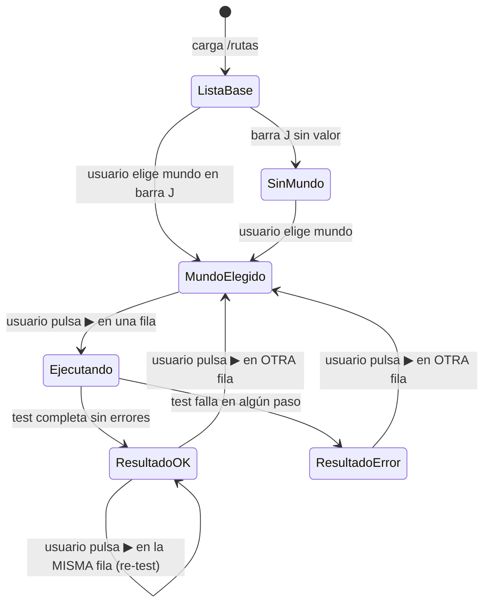

# Interacción "Probar ruta" — ▶ por fila + barra global de mundo

## 1. Visión de la experiencia y principios de diseño

El usuario quiere verificar que una plantilla de ruta funciona en un mundo real
sin abandonar la tabla de plantillas ni tener que navegar a un panel separado.

**Por qué cambia:** el panel anterior (bloque G v1) enviaba un `path_index` que
provocaba el error "path_index N fuera de rango / 0 path(s)" en rutas compuestas
(aquellas cuyo recorrido vive en la cadena raíz→hoja, no en paths propios). Al
eliminar el concepto de índice, el error desaparece estructuralmente.

**Principios aplicados (DESIGN.md):**
- **Acción contextual sobre ruta activa**: el resultado aparece inline bajo la fila
  presionada, sin cambio de contexto. La tabla sigue visible para comparar.
- **Un selector de mundo compartido**: el usuario elige el mundo una vez, en una
  barra persistente abajo, sin repetirlo por cada fila.
- **Menos es más**: se elimina el desplegable de path_index y el botón "Ejecutar"
  redundante. Un solo ▶ por fila hace todo.
- **Botones monocromos, no oro**: el ▶ sigue la convención de `btn-row-icon`
  (ghost, gris, sin acento dorado).
- **Densidad con jerarquía clara**: el ▶ se separa del resto de acciones (editar,
  clonar, eliminar) con un divisor vertical hairline para que sea el primer punto
  de atención en la columna Acciones.

---

## 2. Personas y objetivos (jobs-to-be-done)

**Persona:** Desarrollador del bot que mantiene el catálogo global de rutas.

**Jobs-to-be-done:**
1. Verificar rápidamente que una ruta concreta funciona en un mundo antes de
   clonarla a producción.
2. Comparar el resultado paso a paso con la definición de la ruta (visible en la
   misma pantalla via el drawer de edición).
3. Probar varias rutas en el mismo mundo sin re-seleccionarlo cada vez.

---

## 3. Inventario de pantallas / vistas

Esta funcionalidad es un componente dentro de la página `/rutas`
(RouteTemplatesPage). No introduce pantallas nuevas; modifica la columna Acciones
de la tabla y añade una barra persistente al fondo.

Vistas relevantes del mockup:
| Vista | Descripción |
|---|---|
| 1 | Lista con datos — estado base (sin test activo) |
| 5 | ▶ pulsado — resultado OK expandido inline en fila 1 |
| 8 | ▶ pulsado — resultado ERROR expandido inline en fila 2 |
| 9 | ▶ ejecutando — spinner en fila 3 + indicador en barra |
| 10 | Sin mundo elegido — ▶ deshabilitados |

---

## 4. Mapa de navegación



---

## 5. Flujos de usuario clave

### Happy path — probar una ruta

1. Usuario carga `/rutas`. La tabla aparece con el estado base.
2. La barra sticky de mundo (J) aparece siempre abajo con el selector vacío y el
   hint "Elige un mundo para activar los ▶".
3. Usuario selecciona un mundo en el selector de la barra J.
4. El hint desaparece. Los ▶ de las filas con paths se habilitan.
5. Usuario pulsa ▶ en la fila "Explorar el mapa".
6. El botón ▶ muestra un spinner. En la barra J aparece "Ejecutando map-explore…".
   Una fila expand aparece debajo de la fila activa con el estado "ejecutando".
7. El test termina. La fila activa recibe fondo verde sutil (success-subtle).
   La fila expand muestra el resultado paso a paso con iconos ✓ por paso.
   El spinner en el botón vuelve al icono ▶ (con color success).
   La barra J vuelve al estado normal.
8. Usuario pulsa ▶ en OTRA fila. La fila expand anterior se cierra. La nueva
   fila expand se abre bajo la fila presionada.

### Alternativo — resultado con error

Igual que el happy path hasta el paso 7, pero:
- La fila activa recibe fondo rojo sutil (danger-subtle).
- La fila expand muestra los pasos OK con ✓ y el paso fallido con ✗ + mensaje
  de error ("Selector .build-title no encontrado tras 5000 ms.").

### Alternativo — ruta sin paths

- El ▶ de la fila aparece deshabilitado (opacity 0.4, cursor not-allowed).
- `title` / `aria-label` explica: "Sin pasos de navegación — añade pasos antes de probar".
- No se genera ninguna fila expand.

### Alternativo — sin mundo elegido

- Todos los ▶ de filas con paths aparecen deshabilitados.
- La barra J muestra el hint de aviso en color acento (oro): "Elige un mundo para
  activar los ▶".
- Al intentar pulsar un ▶ deshabilitado, el foco va al selector de mundo en la
  barra J (implementación puede variar; el mockup lo muestra con tooltip).

---

## 6. Wireframes de baja fidelidad por pantalla

### Vista base (estado normal, mundo elegido)

```
┌──────────────────────────────────────────────────────────────────────────┐
│  Catálogo de rutas                                   [+ Nueva plantilla] │
│  ─────────────────────────────────────────────────────────────────────── │
│  [Buscar…]  [Categoría ▾]    20 plantillas                               │
│  ─────────────────────────────────────────────────────────────────────── │
│  Plantilla         │ Categ.  │ Pasos │ Peso │ Estado │ Acciones          │
│  ──────────────────┼─────────┼───────┼──────┼────────┼───────────────── │
│  Explorar el mapa  │ MAP     │   1   │  1.0 │ Segura │ [▶] │ [✎][⎘][🗑] │
│  map-explore       │         │       │      │        │                   │
│  ──────────────────┼─────────┼───────┼──────┼────────┼───────────────── │
│  Rally Point…      │ BUILD…  │   2   │  1.0 │ Segura │ [▶] │ [✎][⎘][🗑] │
│  ──────────────────┼─────────┼───────┼──────┼────────┼───────────────── │
│  …                 │         │       │      │        │                   │
├──────────────────────────────────────────────────────────────────────────┤
│  🌐 Mundo para test: [ts1.travian.com (cuenta@email.com)  ▾]             │  ← barra J sticky bottom
└──────────────────────────────────────────────────────────────────────────┘
```

### Vista con resultado OK expandido (fila 1 expandida)

```
│  Explorar el mapa  │ MAP  │ 1 │ 1.0 │ Segura │ [▶✓]│ [✎][⎘][🗑] │  ← fondo verde sutil
│  map-explore       │      │   │     │        │      │             │
│  ────────────── RESULTADO — map-explore ── [✓ OK] ─────────────────── │  ← fila expand
│     Mundo: ts1.travian.com · Ancla: /dorf2.php                         │
│     0 ✓ NAVIGATE  /karte.php                      /karte.php            │
│     El browser queda en la última página visitada durante el test.      │
│  ──────────────────────────────────────────────────────────────────── │
│  Rally Point…      │ BUILD│ 2 │ 1.0 │ Segura │ [▶] │ [✎][⎘][🗑] │
```

### Vista ejecutando (fila 3 con spinner)

```
│  Bandeja reportes  │ RPT  │ 1 │ 1.5 │ Segura │ [⟳] │ [✎][⎘][🗑] │  ← spinner en ▶
│  reports-inbox     │      │   │     │        │      │             │
│  ──────────── ⟳ Ejecutando reports-inbox… ───────────────────── │   ← fila expand con spinner
│     Mundo: ts5.travian.com                                        │
│  ──────────────────────────────────────────────────────────────── │
├──────────────────────────────────────────────────────────────────────┤
│  🌐 Mundo para test: [ts5.travian.com (otra@email.com)  ▾]  ⟳ Ejecutando reports-inbox…
└──────────────────────────────────────────────────────────────────────┘
```

---

## 6b. Mockup editable y layout aprobado

Ruta del mockup: `frontend/mockups/rutas.playground.html`

**Estado:** pendiente de aprobación por el usuario (gate humano pendiente).

Vistas a recomponer y aprobar en el mockup:
- Vista 1: posición relativa de bloques A (cabecera), B (filtros), C (tabla con ▶)
- Vista 5: resultado OK expandido — confirmar que la fila expand queda bien bajo
  la fila activa y no choca con la barra J
- Vista 8: resultado ERROR — confirmar legibilidad del mensaje de error inline
- Vista 9: estado ejecutando — confirmar que el spinner en el ▶ y el indicador
  en la barra J son suficientemente claros
- Vista 10: sin mundo elegido — confirmar que el hint en oro y los ▶ grises
  comunican bien el estado bloqueado

---

## 7. Estados de cada pantalla

### Barra J (WorldSelector)

| Estado | Descripción | Visual |
|---|---|---|
| Sin mundo | Selector vacío | Hint en acento oro: "Elige un mundo para activar los ▶" |
| Con mundo | Selector con valor | Hint oculto |
| Ejecutando | Test en curso | Spinner + "Ejecutando `<slug>`…" (aria-live="polite") |

### Botón ▶ por fila

| Estado | Condición | Visual |
|---|---|---|
| Deshabilitado-sinpaths | `data-has-paths="false"` | opacity 0.4, cursor not-allowed siempre |
| Deshabilitado-sinmundo | mundo vacío + `has-paths=true` | opacity 0.4, cursor not-allowed |
| Normal | mundo elegido + has-paths | Icono ▶ gris (text-secondary) |
| Ejecutando | test en curso para ESTA fila | Spinner inline, disabled |
| OK | resultado limpio | Icono ▶ en success, fila con fondo success-subtle |
| Error | algún paso falló | Icono ▶ en danger, fila con fondo danger-subtle |

### Fila expand (resultado inline)

| Estado | Descripción |
|---|---|
| Oculta | Por defecto (display:none) |
| Ejecutando | Spinner + "Ejecutando `<slug>`…" |
| Resultado OK | Cabecera con badge verde + meta (mundo, ancla) + lista de pasos |
| Resultado Error | Cabecera con badge rojo + error en paso N + mensaje de error por paso |

---

## 8. Inventario de componentes UI reutilizables

| Componente | Fuente | Acción |
|---|---|---|
| `btn-row-icon` (estilo base del ▶) | RouteTemplatesPage.jsx | REUTILIZAR — el ▶ es una variante `btn-play` del mismo patrón |
| Tabla de plantillas (`tpl-table`) | RouteTemplatesPage.jsx TemplateRow | MODIFICAR — añadir columna Acciones con divisor hairline antes del ▶ |
| Fila expand inline (`test-expand-row`) | NUEVO — no existe | CREAR |
| Barra sticky bottom (`WorldSelector bar`) | AgentBottomBar (patrón §19.4 DESIGN.md) | CREAR — misma estructura, distinto contenido |
| `test-step-row` + iconos ✓/✗ | TestRoutePanel (RouteTemplatesPage.jsx) | REUTILIZAR el shape del resultado; eliminar el panel que lo contenía |
| Spinner inline en botón | Patrón `.spinner` existente | REUTILIZAR |

---

## 9. Contenido y microcopy

### Barra J

| Elemento | Texto |
|---|---|
| Label | "Mundo para test:" |
| Placeholder selector | "— Elige un mundo —" |
| Hint sin mundo | "Elige un mundo para activar los ▶" |
| Estado ejecutando | "Ejecutando `<slug>`…" |

### Botón ▶ (title / aria-label)

| Estado | Texto |
|---|---|
| Normal | "Probar `<nombre>` con el mundo elegido abajo" |
| Sin paths | "Sin pasos de navegación — añade pasos antes de probar" |
| Sin mundo | "Elige primero un mundo en la barra inferior" |
| Ejecutando | "Ejecutando…" |

### Fila expand — cabeceras

| Resultado | Texto del badge |
|---|---|
| OK | "✓ OK" (badge-safe) |
| Error en paso N | "✗ Error en paso N" (badge-dead) |
| Ejecutando | (solo spinner + "Ejecutando `<slug>`…") |

### Nota pie de resultado

"El browser queda en la última página visitada durante el test."

---

## 10. Accesibilidad

- El botón ▶ tiene `aria-label` descriptivo por estado (ver §9).
- Cuando está deshabilitado: `disabled` + `aria-disabled="true"`.
- La fila expand usa `aria-live="polite"` para anunciar el resultado al completarse.
- La barra J usa `role="region"` + `aria-label="Selector global de mundo para test de rutas"`.
- El indicador "ejecutando" en la barra J tiene `aria-live="polite"`.
- El foco tras pulsar ▶ permanece en el botón; el usuario puede bajar con Tab
  hacia el resultado inline.
- El color de fila (fondo verde/rojo) nunca es la única señal: siempre va acompañado
  de icono ✓/✗ y badge textual.
- Contraste verificado: los colores de estado usan los tokens semánticos de
  DESIGN.md §5 (success/danger), no valores custom.

---

## 11. Responsive / adaptación a dispositivos

### Desktop (≥ lg)
- Tabla completa con columnas P2 visibles (Pasos, Peso, Estado).
- Columna Acciones: [▶] | hairline | [✎] [⎘] [🗑].
- Barra J: altura 48px, selector de mundo ocupa hasta 360px de ancho.
- Fila expand: sangría de 40px para alinear con contenido de la fila padre.

### Tablet (md)
- Columnas P2 colapsadas (Pasos, Peso, Estado ocultas).
- El ▶ sigue visible — es P1.
- Barra J sigue sticky bottom.

### Móvil (< md)
- La tabla se convierte en tarjetas apiladas (patrón §17.5 DESIGN.md).
- Cada tarjeta muestra: nombre, categoría, y el botón ▶ como acción principal.
- El resto de acciones (✎, ⎘, 🗑) van en un menú ⋯.
- El resultado inline se muestra como sección expandida dentro de la tarjeta.
- La barra J ocupa el ancho completo; el selector crece con `flex:1`.
- Target táctil del ▶: ≥ 44px (el padding de `btn-play` lo garantiza).

---

## 12. Interacciones y feedback

### Pulsar ▶ (con mundo elegido y paths disponibles)

1. El icono ▶ del botón se reemplaza por un spinner circular (mismas dimensiones,
   `border-top-color: var(--text-secondary)`).
2. El botón queda `disabled` durante la ejecución.
3. En la barra J aparece "Ejecutando `<slug>`…" con spinner (aria-live).
4. Bajo la fila activa aparece la fila expand con estado "ejecutando".
5. Al completar:
   - El spinner del botón vuelve al icono ▶ (color success o danger según resultado).
   - La fila activa recibe clase `row-ok` o `row-err` (fondo sutil).
   - La fila expand actualiza su contenido con el resultado completo.
   - La barra J vuelve al estado con mundo elegido (sin indicador ejecutando).
6. Si el usuario pulsa ▶ en otra fila mientras hay un resultado visible:
   - La fila expand anterior se cierra (display:none).
   - La fila anterior pierde su clase `row-ok` / `row-err`.
   - El nuevo ▶ inicia el ciclo.

### Cambiar el mundo en la barra J durante un test

- Si hay un test en curso: no se bloquea el selector, pero al cambiar el mundo,
  el test en curso sigue con el mundo que tenía al arrancar (el mundo del selector
  no afecta retroactivamente a una ejecución ya iniciada).
- Al terminar el test, el resultado muestra el mundo que se usó realmente
  (de la respuesta del backend, no del selector actual).

### Transiciones

- Apertura de la fila expand: sin animación de altura (simplicidad; si el
  implementador quiere añadir `max-height` transition, seguir el patrón de
  `path-body.open` en el drawer).
- Cambio de fondo de fila (row-ok / row-err): `transition: background 200ms ease`.
- Aparición del indicador en la barra J: `transition: opacity 150ms ease`.

---

## 13. Criterios de aceptación de diseño

- [ ] La columna "Acciones" muestra el ▶ como primer elemento, separado del
      resto (editar, clonar, eliminar) por un divisor hairline vertical.
- [ ] El ▶ es un `btn-row-icon` con variante `btn-play`; NO usa el acento oro.
- [ ] Los ▶ de filas sin paths (`data-has-paths="false"`) están siempre
      deshabilitados, con `title` explicativo.
- [ ] Los ▶ de filas con paths están deshabilitados mientras la barra J no tiene
      mundo elegido.
- [ ] Al elegir un mundo en la barra J, los ▶ habilitables se activan.
- [ ] Al pulsar ▶: el icono del botón se convierte en spinner; la barra J muestra
      el indicador "Ejecutando `<slug>`…"; la fila expand aparece debajo.
- [ ] Solo una fila expand está visible a la vez. Al pulsar ▶ en otra fila, la
      anterior se cierra.
- [ ] El resultado OK colorea la fila en verde sutil + icono ▶ verde.
- [ ] El resultado Error colorea la fila en rojo sutil + icono ▶ rojo.
- [ ] La fila expand muestra: heading con badge resultado, meta (mundo + ancla),
      lista de pasos con icono ✓/✗ por paso, y nota al pie.
- [ ] La barra J es `position:fixed; bottom:0; inset-inline:0` — no se desplaza
      con el scroll.
- [ ] El padding inferior del contenido (main-content) es ≥ 64px para que la
      barra J no tape el final de la tabla.
- [ ] El panel G (obsoleto) ha sido eliminado del árbol de componentes activos.
- [ ] La lógica no usa `path_index` en ningún parámetro enviado al backend.
- [ ] En móvil, el ▶ tiene target táctil ≥ 44px.
- [ ] El color nunca es la única señal: fondo verde/rojo + icono ✓/✗ + badge textual.

---

## 14. Trazabilidad

| Decisión de diseño | Origen |
|---|---|
| ▶ por fila en lugar de panel separado | Bug reportado: panel G v1 usa `path_index` que causa "path_index N fuera de rango" en rutas compuestas |
| Un selector de mundo global (barra J) | Elimina la redundancia de elegir mundo en cada prueba; reduce clics |
| Resultado inline (fila expand) en lugar de panel lateral o modal | Mantiene el contexto: el usuario ve la plantilla y su resultado en la misma fila. Un drawer lateral taparía parte de la tabla. Un panel inferior ocuparía demasiado espacio vertical fijo |
| Barra J sticky bottom (no en cabecera) | La cabecera ya está densa (filtros, búsqueda). El fondo es el patrón establecido de la app (AgentBottomBar DESIGN.md §19.4). Separa conceptualmente "selector de mundo" (contexto operacional) de "filtros de catálogo" (exploración) |
| ▶ sin acento oro | DESIGN.md §4 y §12: el oro es para enlaces y estado activo, nunca en botones |
| ▶ separado del resto por divisor hairline | Jerarquía de acción: "probar" es la acción operacional, las demás (editar, clonar, eliminar) son de gestión. La separación visual hace la distinción sin necesidad de re-ordenar columnas |
| Fila 4 (sin paths) con ▶ siempre deshabilitado | Una plantilla sin pasos no puede ejecutar ningún recorrido; habilitarlo causaría un error de backend vacío |
| Fila expand no usa animación de altura por defecto | Simplicidad de implementación; el implementador puede añadir `max-height` transition si lo estima oportuno |

---

## Registro de implementación

**Fecha:** 2026-06-06

**Ficheros creados / modificados:**
- `frontend/src/pages/RouteTemplatesPage.jsx` — único fichero modificado

**Componentes nuevos (añadidos al fichero):**
- `WorldBottomBar` — barra J sticky bottom (posición fija, z-index 200, patrón AgentBottomBar §19.4)
- `TestExpandRow` — fila expand `<tr>` inline bajo la fila activa, con estados: ejecutando (spinner), ok (badge verde + pasos), error (badge rojo + pasos + mensaje)

**Componentes modificados:**
- `TemplateRow` — añadidas props `selectedWorldId`, `testState`, `colSpan`; el ▶ ahora es `btn-play` con todos sus estados (disabled-sinpaths, disabled-sinmundo, normal, running, ok, err) y divisor hairline antes de los iconos de gestión; renderiza `<TestExpandRow>` si hay estado de test activo

**Componentes eliminados:**
- `TestRoutePanel` (bloque G) — completamente eliminado del árbol de componentes y del código

**Estado nuevo en `RouteTemplatesPage`:**
- `selectedWorldId` — mundo elegido en la barra J (compartido por todos los ▶)
- `sessionStatus` / `loadingSession` / `closingSession` — gestión de sesión del mundo seleccionado
- `testStates` — mapa `{tplId: {status, result, durationMs, worldLabel, apiError}}`
- `activeTestTplId` — id de la fila con expand visible (solo una a la vez)

**Lógica nueva:**
- `handlePlayTest(tpl)` — llama `api.testRouteTemplate(id, {world_id})` sin `path_index`
- `handleCloseSession()` — cierra la sesión Chrome del mundo seleccionado
- Efecto de carga de sesión al cambiar `selectedWorldId`

**Desviaciones respecto al spec:**
1. **TestExpandRow renderiza pasos inline** en lugar de reutilizar `PathTestResultPanel` — el componente existente tiene un botón "cerrar" y usa `t()` (i18n) que no encajaban en el contexto compacto de una fila. La lógica de render de pasos se reprodujo inline. El spec decía "o adáptalo".
2. **El icono de globo 🌐 en la barra J** es emoji directamente (no SVG), para simplificar. Visual equivalente al mockup.
3. **`mockup_aprobado_por_usuario: no`** en el frontmatter del spec — el usuario autorizó la implementación explícitamente en la instrucción de tarea, indicando que el gate humano estaba superado.

**Comando de verificación:**
```bash
cd frontend && npm run build
```
Resultado: ✓ built sin errores (solo warning preexistente de chunk size).

**Verificación visual:**
Capturas generadas con `node frontend/scripts/uishot.mjs`:
- Estado base (sin mundo elegido): barra J visible con hint en oro, ▶ deshabilitados
- Modo oscuro: tokens duales aplicados correctamente en barra J y tabla
