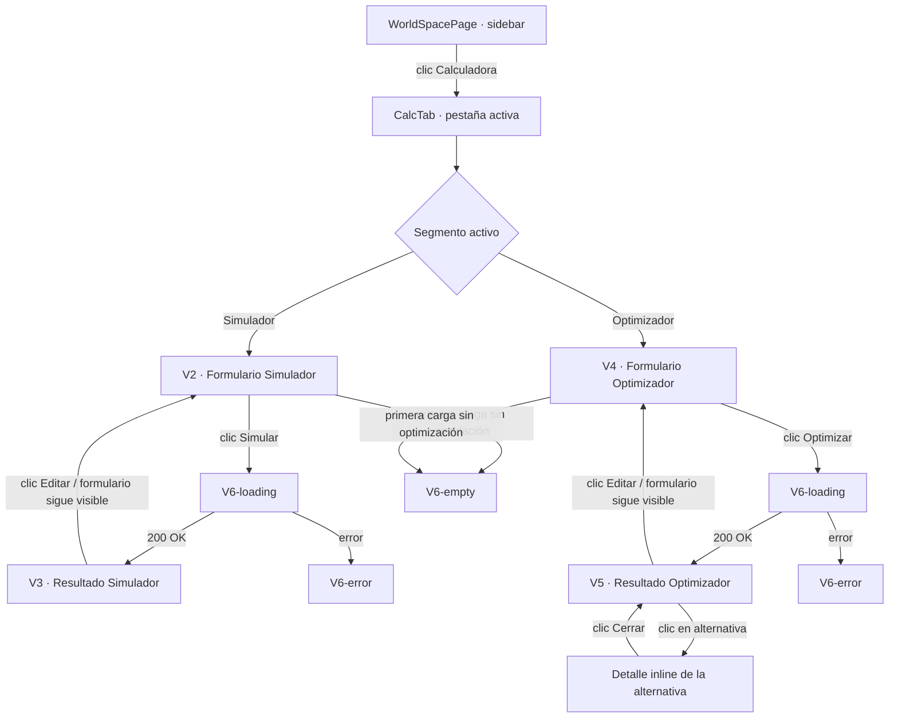

# Calculadora — Simulador y Optimizador de Combate

---

## 1. Visión de la experiencia y principios de diseño

La Calculadora es una herramienta de decisión, no de monitoring. El usuario llega aquí con una pregunta concreta: "¿gana mi ejército?" o "¿qué tropa mínima necesito para este oasis?". La respuesta debe aparecer clara y rápida — sin ruido visual que distraiga.

Principios aplicados (de `docs/design/PRINCIPIOS.md` y `frontend/DESIGN.md`):

- **Densidad informativa sobre decoración**: es una herramienta interna. Tablas compactas, números alineados, máxima información por píxel.
- **Una acción principal clara por estado**: el botón "Simular" o "Optimizar" es el único CTA primario en pantalla.
- **Divulgación progresiva**: configuración avanzada (exponente, artefactos, pesos de optimización) oculta por defecto detrás de un bloque colapsable. Las opciones P3 (nivel smithy por tropa, artefactos de defensor) están colapsadas en móvil.
- **Neutro primero, color al final**: el resultado usa solo dos colores semánticos — verde (atacante gana) y rojo (defensor gana). Sin decoración adicional.
- **Modo claro + oscuro** con tokens duales, sin hex hardcodeado.
- **Mobile-first P1/P2/P3**: en móvil se muestra el resultado (quién gana, botín, supervivientes atacante). La configuración avanzada y el desglose de bajas son P2/P3.

---

## 2. Personas y objetivos (jobs-to-be-done)

| Persona | Job-to-be-done | Contexto |
|---|---|---|
| Jugador que va a farmear oasis | "Quiero saber exactamente cuántas tropas pierdo antes de lanzar el ataque" | Antes de enviar el ejército — tiene prisa, quiere el dato en segundos |
| Jugador planificando la composición óptima | "Quiero saber qué combinación de tropas da más recursos y menos bajas en un oasis concreto" | Sentado planificando, no tiene prisa pero quiere precisión |
| Jugador nuevo | "Quiero entender la mecánica de combate" | Primera vez — necesita que el formulario le guíe sin agobiarlo |

**Job principal del Simulador**: introducir un ejército real y ver el resultado exacto.
**Job principal del Optimizador**: no saber qué enviar y que la herramienta lo calcule.

---

## 3. Inventario de pantallas / vistas

| ID | Nombre | Descripción |
|---|---|---|
| V1 | Selector de modo | Segmento "Simulador / Optimizador" en la parte superior de la pestaña Calculadora |
| V2 | Formulario Simulador | Formulario estructurado en paneles: Atacante, Defensor(es), Config. |
| V3 | Resultado Simulador | Resultado completo: ganador, tropas, botín, pérdidas, daño estructural |
| V4 | Formulario Optimizador | Selector de tribu + modo A/B + defensa del oasis + config |
| V5 | Resultado Optimizador | Ranking de alternativas Pareto + detalle al hacer clic |
| V6-empty | Estado vacío | Primera vez, sin simulación previa |
| V6-loading | Estado cargando | Spinner mientras espera respuesta de la API |
| V6-error | Estado error | Error 400/422 de la API con mensaje descriptivo |

---

## 4. Mapa de navegación



**Nota de layout**: el formulario y el resultado coexisten en la misma pantalla en desktop (split horizontal izq/dcha). En móvil se apilan: el resultado desplaza el formulario hacia arriba pero no lo oculta (el formulario queda colapsado con un botón "Editar formulario").

---

## 5. Flujos de usuario clave

### 5.1 Happy path — Simulador

1. Usuario entra en la pestaña "Calculadora" → ve V6-empty con el segmento "Simulador" activo.
2. Selecciona la tribu atacante en el selector de tribu.
3. La lista de tropas de esa tribu aparece (iconos + nombre + input de cantidad + input de smithy), inicialmente con cantidad 0.
4. Introduce cantidades para las tropas que quiere enviar. Las tropas con cantidad 0 se muestran atenuadas pero siempre presentes (no hay añadir/quitar — todas las tropas de la tribu están disponibles).
5. Opcionalmente: héroe, alianza, moral, artefactos, modo ataque.
6. En el panel Defensor: introduce las tropas de la defensa (tribu nature por defecto para el caso oasis; cambiable para PvP). Nivel de muro y stonemason opcionales.
7. Clic en "Simular". → V6-loading (spinner en el área de resultado).
8. Resultado aparece en V3. El usuario ve inmediatamente el badge "Atacante gana" / "Defensor gana" + supervivientes + botín.
9. Si quiere ajustar: modifica el formulario (que sigue visible a la izquierda) y vuelve a simular.

### 5.2 Happy path — Optimizador

1. Usuario activa el segmento "Optimizador".
2. Selecciona tribu atacante y Modo A (tipos libres) o Modo B (tropas con cantidades).
3. Introduce la defensa del oasis: selecciona animales NATURE con sus cantidades.
4. Opcionalmente: pesos de optimización (sliders — configuración avanzada).
5. Clic en "Optimizar". → V6-loading.
6. Resultado en V5: lista de alternativas ordenadas por rank. Cada alternativa muestra tropas enviadas, bajas, recursos ganados.
7. Clic en una alternativa → detalle inline desplegado (la misma información de V3 pero para esa combinación).

### 5.3 Flujo alternativo — Error de API

1. La API devuelve 400 (idioma) o 422 (validación).
2. El área de resultado muestra V6-error: icono de error + mensaje extraído del campo `detail` de la respuesta.
3. El formulario sigue completamente editable. El usuario corrige y vuelve a enviar.

### 5.4 Flujo alternativo — Defensor vacío (EC-01)

1. El usuario no introduce tropas defensoras (oasis vacío).
2. El simulador acepta el request (FA-03: victoria inmediata).
3. El resultado muestra badge verde "Atacante gana" + ratio null presentado como "Victoria sin combate" + supervivientes = todos + botín = capacidad de carga.

### 5.5 Flujo alternativo — Optimizador sin combinación ganadora (EC-13)

1. El resultado del optimizador muestra un banner "No se encontró combinación ganadora" (`has_winning_combination: false`).
2. Se muestran igualmente las mejores alternativas no-ganadoras con el badge "No gana" en cada fila.

---

## 6. Wireframes de baja fidelidad por pantalla

### 6.1 Estructura general de la pestaña (estado real del código — 2026-05-30)

> **NOTA DE RESINCRONIZACIÓN (2026-05-30)**: el wireframe original describía un layout de 2 columnas
> (formulario 420px + resultado). El código real usa `maxWidth: 720px, flexDirection: 'column'`
> — todo en **columna única** con scroll. El formulario y el resultado están apilados verticalmente,
> no en paralelo. Este wireframe refleja el estado real.

```
┌── Sidebar (180px) ──┬── CalcTab (columna única, max-width 720px, centrada) ─────┐
│  Dashboard          │                                                             │
│  Agentes            │  Calculadora de combate        [ Simulador | Optimizador ] │
│  Listas de vacas    │  ─────────────────────────────────────────────────────────  │
│  ▶ Calculadora      │  ┌── ArmyPanel — ATACANTE ──────────────────────────────┐  │
│                     │  │  header: icono espada + ATACANTE + btn colapsar      │  │
│                     │  │  body: fila controles + TribeBar + TroopGrid         │  │
│                     │  └──────────────────────────────────────────────────────┘  │
│                     │  ┌── ArmyPanel — DEFENSOR ──────────────────────────────┐  │
│                     │  │  header: icono escudo + DEFENSOR + btn colapsar      │  │
│                     │  │  body: fila controles + TribeBar + TroopGrid         │  │
│                     │  └──────────────────────────────────────────────────────┘  │
│                     │  ┌── ArmyPanel — REFUERZO n (si existen) ──────────────┐  │
│                     │  └──────────────────────────────────────────────────────┘  │
│                     │  [ + Añadir refuerzo ]  (botón dashed, full-width 32px)    │
│                     │  [ SIMULAR ]  (botón primario full-width 40px)              │
│                     │  ─── resultado (TravianReport) apilado debajo ────────────  │
│                     │  badge ganador + ratio                                      │
│                     │  TroopBand Tú + TroopBand Defensor                         │
│                     │  StatsTable (inf/cav + recursos W/C/I/C/Σ)                 │
└─────────────────────┴──────────────────────────────────────────────────────────────┘
```

**Responsive**: el contenedor ya es de columna única y `maxWidth: 720px` — en móvil simplemente
estrecha el contenedor. `TroopGrid` usa `overflow-x: auto` para scroll horizontal cuando no
caben todas las columnas de tropas. Las columnas de tropas con qty=0 tienen opacity 0.45.

---

### 6.2 V2 — Formulario Simulador (estado real del código — 2026-05-30)

> **NOTA DE RESINCRONIZACIÓN (2026-05-30)**: el wireframe original usaba listas verticales de tropas
> y un dropdown de tribu. El código real usa `TribeBar` (chips circulares 44px) y `TroopGrid`
> (grid horizontal con scroll, 3 filas: iconos / qty / smithy). Este wireframe refleja el estado real.

```
┌── CombatCalculator (maxWidth 720px, columna única) ─────────────────────────┐
│  Calculadora de combate              [ Simulador | Optimizador ] ← tablist  │
│                                                                               │
│  ┌── ArmyPanel — ATACANTE ──────────────────────────────────────────────┐    │
│  │ header: [espada] ATACANTE                             [colapsar ▾]  │    │
│  │ ─────────────────────────────────────────────────────────────────── │    │
│  │ ctrls: [Saqueo|Ataque] [0% ▾] [Sin artefacto ▾] [Héroe ▾]         │    │
│  │ ── bloque Héroe (colapsable inline, expandido) ──────────────────── │    │
│  │   Pts. ataque héroe [____]   Bonus ataque héroe % [____]            │    │
│  │   [ADD] Moral % [___]  ← pendiente implementar                      │    │
│  │ ─────────────────────────────────────────────────────────────────── │    │
│  │ [ADD] mods-card: +1 200 pts | +30 % | +3 % | [Herr.]               │    │
│  │ ─────────────────────────────────────────────────────────────────── │    │
│  │ TribeBar: (RO) TE  GA  EG  HU  ES  VI    ← chips circulares 44px  │    │
│  │ ─────────────────────────────────────────────────────────────────── │    │
│  │ TroopGrid (scroll horizontal):                                       │    │
│  │  ┌─────┬──────┬──────┬──────┬──────┬──────┬──────┬──────┬──────┐  │    │
│  │  │     │[ico] │[ico] │[ico] │[ico] │[ico] │[ico] │[ico] │[ico] │  │    │
│  │  │ 🛡  │[qty] │[qty] │[qty] │[qty] │[qty] │[qty] │[qty] │[qty] │  │    │
│  │  │ ⚒   │[smy] │[smy] │[smy] │[smy] │[smy] │[smy] │[smy] │[smy] │  │    │
│  │  └─────┴──────┴──────┴──────┴──────┴──────┴──────┴──────┴──────┘  │    │
│  │  (columnas qty=0 → opacity 0.45; scroll horizontal si no caben)   │    │
│  └──────────────────────────────────────────────────────────────────────┘    │
│                                                                               │
│  ┌── ArmyPanel — DEFENSOR ──────────────────────────────────────────────┐    │
│  │ header: [escudo] DEFENSOR                             [colapsar ▾]  │    │
│  │ ─────────────────────────────────────────────────────────────────── │    │
│  │ ctrls: [🛡 10] [⚒ 2] [0% ▾] [Héroe ▾]                             │    │
│  │   (escudo + NumInput muro 42px + ⚒ + NumInput cantero 42px)        │    │
│  │ [ADD] mods-card: Sin modificadores activos                           │    │
│  │ TribeBar: (NA) RO  TE  GA  EG  HU  ES  VI                           │    │
│  │ TroopGrid (scroll horizontal, sin fila smithy)                       │    │
│  │ ─────────────────────────────────────────────────────────────────── │    │
│  │ [ADD] Tribu muro: [Sin especificar ▾]  ← pendiente implementar     │    │
│  │ [ADD] Artefactos defensor ▾  → Edif. resistentes × [___]           │    │
│  └──────────────────────────────────────────────────────────────────────┘    │
│                                                                               │
│  [ + Añadir refuerzo ]  ← botón dashed full-width 32px                       │
│                                                                               │
│  [ADD] ┌── Configuración (colapsable P3) ─────────────────────────────┐      │
│        │ Velocidad: [x1 ▾]   Distancia: [____] campos                 │      │
│        └─────────────────────────────────────────────────────────────────┘    │
│                                                                               │
│  [ SIMULAR ]  ← btn primario monocromo full-width 40px                       │
└─────────────────────────────────────────────────────────────────────────────────┘
```

**Detalles del ArmyPanel real (ArmyPanel.jsx)**:

- **Header**: icon de rol (SVG espada/escudo) coloreado con `--danger`/`--info` + label UPPERCASE
  `font-size:13px font-weight:600 letter-spacing:.04em` + btn colapsar (chevron).
  Refuerzo añade btn papelera antes del chevron.
- **Fila de controles (atacante)**: inline-flex, gap 8px. Orden: `AttackTypeToggle` (pill
  raid/attack, height 26px) → `AllianceBonusSelect` (select 26px, 0–5%) → `ArtifactSelect`
  (select 26px: sin artefacto / ×1.5 / ×2) → btn "Héroe" (toggle expand, 26px).
- **Fila de controles (defensor)**: icono escudo + `NumInput` muro 42px + ⚒ + `NumInput`
  cantero 42px + `AllianceBonusSelect` + btn "Héroe".
- **Bloque Héroe** (atacante o defensor): aparece expandido inline debajo de la fila de controles
  cuando se activa el toggle. Contenedor `surface-2 border-radius-sm padding 10px 12px`. Dos campos
  en flex-wrap: "Pts. ataque/defensa héroe" (70px) + "Bonus ataque/defensa héroe %" (60px).
  [ADD] en atacante: campo adicional "Moral %" (60px, rango 30–100).
- **`mods-card` [ADD]**: debajo de la fila de controles (antes del TribeBar). Mini-tarjeta
  `surface-2 border padding 6px 10px`. Chips `surface border radius-full` con valores de
  modificadores activos. Estado vacío: texto centrado "Sin modificadores activos".
- **TribeBar**: chips circulares `width:44px height:44px border-radius:full`. Iniciales 2 letras
  en mayúsculas. Chip activo: `border 2px accent + outline 2px accent offset 2px` + color de
  fondo propio por tribu (definido en `TRIBE_COLORS`). Atacante: 7 tribus (sin Nature).
  Defensor/refuerzo: 8 tribus (Nature primero).
- **TroopGrid**: grid horizontal con `overflow-x:auto`. Columna de etiquetas (icon escudo 14px +
  icon yunque 14px) + columnas por tropa. Cada columna: icono tropa 28px / input qty 52×28px /
  input smithy 52×24px (smithy `background:transparent border border`). Columnas con qty=0 →
  `opacity:0.45`. Defensor: smithy visible pero no requerido (animales no tienen smithy).
- **Selector de tribu**: NO es dropdown — es `TribeBar` con chips. El dropdown del wireframe
  original era el spec inicial; el código real usa chips.
- **Toggle Modo**: pill `AttackTypeToggle` (Saqueo/Ataque) inline en la fila de controles del
  atacante. NO un segmento separado.
- **Botón "Añadir refuerzo"**: `border:1px dashed border-strong`, full-width, height 32px.
  `margin-bottom:12px`. Hover: border y text cambian a `--accent`.
- **Botón "Simular"**: `height:40px`, full-width, `background:btn-primary-bg`, `font-size:15px`.

**[ADD] Inputs pendientes de implementar en el código**:
- `morale` en el bloque Héroe del atacante.
- `artifacts.diet` en un bloque "Artefactos" colapsable del atacante (hoy no existe ese bloque en el código — `ArtifactSelect` solo controla `fast_troops`).
- `wall_tribe` debajo de los inputs muro/cantero del defensor.
- `strong_buildings` en un sub-bloque "Artefactos defensor" colapsable.
- `server_speed` y `distance_fields` en un bloque "Configuración" colapsable P3 (pendiente).
- `rams` y `catapult_targets` en un bloque "Catapultas y arietes" colapsable (visible solo en modo Ataque).

---

### 6.3 V3 — Resultado del Simulador (estado real del código — 2026-05-30)

> **NOTA DE RESINCRONIZACIÓN (2026-05-30)**: el wireframe original describía un panel "Botín" con
> capacidad/potencial/recursos, "Pérdidas en recursos" colapsable, y "Consumo de trigo". El código
> real usa `TravianReport` con una `StatsTable` que integra Botín+Coste+Neto en una sola tabla de
> recursos. No hay "Consumo de trigo" ni "Botín potencial" ni "Pérdidas" colapsable en el código.

```
┌── TravianReport (columna única, mismo max-width 720px) ─────────────────────┐
│                                                                               │
│  [⚔ Atacante gana]  Ratio: 2.09  ← badge pill + texto ratio (font-mono)    │
│                                                                               │
│  ┌── TroopBand "Tú" ─────────────────────────────────────────────────────┐  │
│  │ ⚔ TÚ  (header rojo/danger + borde rojo)                               │  │
│  │ ┌───────────┬──────┬──────┬──────┬──────┬──────┬──────┬──────┬──────┐ │  │
│  │ │ Tropa     │[ico] │[ico] │[ico] │[ico] │[ico] │[ico] │[ico] │[ico] │ │  │
│  │ │ Enviadas  │ 500  │  0   │ 200  │  0   │  0   │  0   │  0   │  0   │ │  │
│  │ │ Pérdidas  │−136  │  0   │ −54  │  0   │  0   │  0   │  0   │  0   │ │  │
│  │ │ Superv.   │ 364  │  0   │ 146  │  0   │  0   │  0   │  0   │  0   │ │  │
│  │ └───────────┴──────┴──────┴──────┴──────┴──────┴──────┴──────┴──────┘ │  │
│  │   (col Tropa 104px fixed + cols por tropa iguales; scroll horizontal)  │  │
│  └───────────────────────────────────────────────────────────────────────┘  │
│                                                                               │
│  ┌── TroopBand "Defensor" ────────────────────────────────────────────────┐  │
│  │ 🛡 DEFENSOR  (header azul/info + borde azul)                           │  │
│  │ [misma estructura — cols con icono por tropa]                          │  │
│  └───────────────────────────────────────────────────────────────────────┘  │
│                                                                               │
│  [ADD] ▶ Ver desglose de cálculo  (colapsable chain, inicialmente cerrado)  │
│                                                                               │
│  ┌── StatsTable "Estadísticas" ────────────────────────────────────────────┐ │
│  │ header: ESTADÍSTICAS                                                    │ │
│  │ ┌────────────────┬──────────────────┬──────────────────┬──────────┐    │ │
│  │ │                │ Atacante         │ Defensor         │    %     │    │ │
│  │ │ Infantería     │ [icon] 47 650    │ [icon] 27 800    │   100%   │    │ │
│  │ │ Caballería     │ [icon]  —        │ [icon]  —        │     0%   │    │ │
│  │ └────────────────┴──────────────────┴──────────────────┴──────────┘    │ │
│  │                                                                         │ │
│  │ ┌────────────┬──────────┬──────────┬──────────┬──────────┬──────────┐  │ │
│  │ │            │   🪵     │   🧱     │    ⚙    │    🌾   │    Σ    │  │ │
│  │ │ Botín anim.│  5 200   │  5 200   │  5 200   │  5 200  │  20 800  │  │ │
│  │ │ Coste trops│−16 320   │−13 600   │−20 400   │ −4 080  │ −54 400  │  │ │
│  │ │ Neto       │−11 120   │ −8 400   │−15 200   │ +1 120  │ −33 600  │  │ │
│  │ └────────────┴──────────┴──────────┴──────────┴──────────┴──────────┘  │ │
│  └─────────────────────────────────────────────────────────────────────────┘ │
│                                                                               │
│  [!] Avisos  ← chips pill accent-subtle si hay warnings en el response       │
└─────────────────────────────────────────────────────────────────────────────────┘
```

**Badge de resultado (P1 — siempre visible)**:
- Pill `border-radius:full` con icono ⚔ o 🛡 + texto "Atacante gana" / "Defensor gana".
- Atacante gana: `rgba(36,138,61,.12)` + borde 1px `var(--success)` + texto `var(--success)`.
- Defensor gana: `rgba(201,53,44,.12)` + borde 1px `var(--danger)` + texto `var(--danger)`.
- Ratio: texto `font-mono` color `--text-secondary` al lado ("Ratio: 2.09").

**TroopBand — estructura real (TroopBand en TravianReport.jsx)**:
- Contenedor `surface border border-radius-md overflow-hidden margin-bottom 14px`.
- Header banner: fondo `rgba(201,53,44,.12)` atacante / `rgba(40,84,166,.12)` defensor +
  borde inferior del color correspondiente. Icono emoji + texto UPPERCASE `font-size:13px`.
- Interior: tabla HTML con `table-layout:fixed`. Primera columna 104px (label "Tropa" + filas:
  "Enviadas" / "Pérdidas" / "Supervivientes"). Resto de columnas: reparto equitativo del espacio.
- Fila de iconos (thead): icono de tropa 22px por columna.
- Filas (tbody): Enviadas (color `--text`) / Pérdidas (`--danger`, prefijo "−") /
  Supervivientes (`--success` bold si > 0, `--text-tertiary` si = 0).
- Tropas con qty_initial=0 se muestran de todas formas si pasa el catálogo completo (las columnas
  muestran 0 en todas las filas).
- Scroll horizontal en `div(overflow-x:auto)` envolviendo la tabla.

**StatsTable — estructura real (StatsTable en TravianReport.jsx)**:
- Sección de fuerza (inf/cav): tabla 4 col (label 180px / Atacante / Defensor / % 64px).
  Cada celda de valor: `inline-flex align-center gap 6px` con `GameIcon` (img 16px de `/static/icons/`) + número `font-mono`.
  La columna % muestra la proporción inf/cav del atacante.
- Sección de recursos: tabla `table-layout:fixed` con `colgroup` (col lbl 180px + 4 recursos + Σ 88px).
  Header: iconos de recurso reales desde `/api/static/icons/stat_*.png` (no emojis).
  Filas: Botín animales (verde) / Coste tropas perdidas (rojo, prefijo "−") / Neto (verde/rojo/grey bold). Fila Neto con `background:surface-2`.
- Los iconos de recursos son imágenes reales del juego (`stat_wood.png`, `stat_clay.png`, etc.),
  NO emojis. En el playground se usan emojis como fallback visual.

**Refuerzos en el resultado**: si hay refuerzos, el TravianReport muestra N TroopBands defensoras
(una por formación: defensor principal + cada refuerzo). Cada banda lleva su propio título
("Defensor" para la primera, "Refuerzos en defensa" para las siguientes).

**Warnings**: `div` con label "AVISOS" micro-caps + pills `accent-subtle / accent-text / border accent /
border-radius-full / padding 4px 10px`. Icono ⚠ + texto del warning. Se muestran si
`result.warnings.length > 0`.

**[ADD] Cadena de cálculo**: bloque `<details>` colapsable insertado después de las TroopBands
y antes de la StatsTable. Ver ADD-UI-3 del addendum.

---

### 6.4 V4 — Formulario Optimizador

```
┌─────────────────────────────────────────────────────────┐
│  ATACANTE                                               │
│  Tribu: [ Romans ▾ ]                                    │
│                                                         │
│  Modo: ●  A — Tipos libres                              │
│         ○  B — Tropas de aldea con cantidad             │
│                                                         │
│  ── Modo A ──────────────────────────────────────────── │
│  Tropas disponibles (seleccionar tipo + smithy):        │
│  ┌──────────────────────────────────────────────────┐   │
│  │ [✓] [ic] Legionario    Smithy: [__]             │   │
│  │ [✓] [ic] Imperano      Smithy: [__]             │   │
│  │ [ ] [ic] Explorador    Smithy: [__]             │   │
│  │  … (todas las tropas, checkbox por tipo)        │   │
│  └──────────────────────────────────────────────────┘   │
│                                                         │
│  ── Modo B ──────────────────────────────────────────── │
│  Tropas de aldea (cantidad disponible + smithy):        │
│  ┌──────────────────────────────────────────────────┐   │
│  │ [ic] Legionario   Disp: [______]  Smithy: [__]  │   │
│  │ [ic] Imperano     Disp: [______]  Smithy: [__]  │   │
│  │  … (tropas con cantidad > 0 al frente)          │   │
│  └──────────────────────────────────────────────────┘   │
│  ─────────────────────────────────────────────────────  │
│                                                         │
│  ▼ Héroe y bonus (colapsable)                           │
│    Pts ataque: [____]   Bonus %: [____]                 │
│    Alianza %: [__]                                      │
│                                                         │
│  DEFENSA DEL OASIS (animales NATURE)                    │
│  ┌──────────────────────────────────────────────────┐   │
│  │ [ic] Rata          [____qty]                    │   │
│  │ [ic] Araña         [____qty]                    │   │
│  │  … (10 animales NATURE)                        │   │
│  └──────────────────────────────────────────────────┘   │
│                                                         │
│  CONFIG (colapsable — P3)                               │
│  Alternativas: [3 ▾] (1-10)                             │
│  Exponente: [0.5]   Velocidad: [1x ▾]                   │
│  Distancia: [____] campos                               │
│                                                         │
│  ▼ Pesos de optimización (colapsable P3)                │
│   Recursos ganados: ─────●──── [1.0]                   │
│   Pérdidas totales: ─────●──── [1.0]                   │
│   Tropas enviadas:  ──●──────  [0.5]                   │
│   Tiempo de marcha: ●─────────  [0.0]                   │
│                                                         │
│  ┌──────────────────────────────────────────────────┐   │
│  │              [ Optimizar ]                       │   │
│  └──────────────────────────────────────────────────┘   │
└─────────────────────────────────────────────────────────┘
```

**Modo A vs Modo B**: radio buttons en diseño de cápsula (similar al toggle Simulador/Optimizador pero con 2 opciones verticales o en fila). Solo el modo activo muestra su panel de tropas.

**Modo A — lista de tropas con checkbox**: al marcar se activa el input de smithy (deshabilitado si no marcado). Al menos una tropa debe estar marcada para habilitar "Optimizar".

**Modo B — lista de tropas con cantidad**: misma lista que el simulador. Las tropas con cantidad = 0 se muestran atenuadas.

**Animales NATURE**: 10 filas fijas (Rata → Elefante), con icono. Solo se muestra la cantidad — sin smithy (animales NPC no tienen smithy).

**Sliders de pesos**: `<input type="range" min="0" max="2" step="0.1">` con valor numérico visible al lado. Etiqueta y valor en la misma fila.

**Botón "Optimizar"**: deshabilitado si: ninguna tropa seleccionada (modo A) o todas con cantidad 0 (modo B) o ningún animal con cantidad > 0 en la defensa.

---

### 6.5 V5 — Resultado del Optimizador

```
┌──────────────────────────────────────────────────────────────────┐
│  [!] No se encontró combinación ganadora (banner si aplica)      │
│                                                                  │
│  ALTERNATIVAS PARETO  (3 resultados)                             │
│  ┌──────────────────────────────────────────────────────────┐    │
│  │ #  Tropas enviadas         Bajas (rec)  Recursos anim.  │    │
│  │──────────────────────────────────────────────────────────│    │
│  │ 1  [ic]200 [ic]50   ✓     6 540        16 000   ›       │    │
│  │ 2  [ic]180 [ic]60   ✓     5 980        14 400   ›       │    │
│  │ 3  [ic]220 [ic]40   ✗     7 100        16 000   ›       │    │
│  └──────────────────────────────────────────────────────────┘    │
│                                                                  │
│  ── Al hacer clic en la fila 1: detalle inline ─────────────── │
│  [resultado completo de esa alternativa, igual que V3]           │
│  [botón Cerrar detalle]                                          │
│                                                                  │
│  DEFENSA DEL OASIS (referencia)                                  │
│  [ic] Araña ×40  [ic] Jabalí ×20                                │
└──────────────────────────────────────────────────────────────────┘
```

**Tabla de alternativas**:
- Columna #: número de rank, `font-mono`, 28px.
- Columna "Tropas enviadas": iconos de tropas apilados horizontalmente (máx 4 iconos; "+N más" si hay más). Bajo el icono, la cantidad en caption.
- Columna ganador: badge "Gana" (verde, icono escudo) o "No gana" (rojo, icono ×).
- Columna pérdidas en recursos: número total en `font-mono`.
- Columna recursos de animales: número total en `font-mono`.
- Columna chevron (›): indica que la fila es expandible.
- Fila seleccionada: `var(--accent-subtle)` como fondo.

**Banner "Sin combinación ganadora"**: solo visible cuando `has_winning_combination: false`. Fondo `rgba(201,53,44,.08)` + borde 1px `var(--danger)` + icono de advertencia + texto del campo `message` de la API. Badge "No gana" en cada fila de la tabla.

**Detalle inline de alternativa**: panel que aparece debajo de la tabla al hacer clic en una fila. Muestra el mismo contenido que V3 (sin el formulario). Botón "Cerrar" ghost para contraerlo.

**Panel "Defensa del oasis (referencia)"**: lista compacta de animales de la defensa con iconos y cantidades. Siempre visible al pie de los resultados.

---

### 6.6 V6-empty — Estado vacío

```
┌──────────────────────────────────────────────────────────────────┐
│                                                                  │
│                  [icono calculadora grande]                      │
│                                                                  │
│        Introduce los ejércitos y pulsa "Simular"                 │
│        para ver el resultado del combate                         │
│                                                                  │
└──────────────────────────────────────────────────────────────────┘
```

- Icono de calculadora en `var(--text-tertiary)`, 40px.
- Texto en `var(--text-secondary)`, 14px, centrado.
- Ocupa el área de resultado cuando no hay simulación previa.

---

### 6.7 V6-loading — Estado cargando

```
┌──────────────────────────────────────────────────────────────────┐
│                                                                  │
│                    [ ◌ Spinner ]                                 │
│               Calculando resultado…                              │
│                                                                  │
└──────────────────────────────────────────────────────────────────┘
```

- Usa el componente `Spinner` existente.
- Texto "Calculando resultado…" / "Buscando combinación óptima…" en `var(--text-secondary)`.
- El botón "Simular"/"Optimizar" pasa a estado deshabilitado durante la carga.

---

### 6.8 V6-error — Estado error

```
┌──────────────────────────────────────────────────────────────────┐
│  [!] Error                                                       │
│  [mensaje de error de la API, campo detail]                      │
│                                                                  │
│  [ Reintentar ]                                                  │
└──────────────────────────────────────────────────────────────────┘
```

- Icono de error en `var(--danger)`.
- Texto del `detail` de la respuesta en `var(--text-secondary)`, 13px.
- Botón "Reintentar" secundario que re-envía la última petición.

---

## 6b. Mockup editable y layout aprobado

Ruta del mockup: `frontend/mockups/simulador-combate.playground.html`

**Estado**: pendiente de aprobación por el usuario.

**Resincronización 2026-05-30**: la vista 7 del playground se ha reescrito para reflejar fielmente
el estado real del código. Cambios principales:
- Layout de columna única (maxWidth 720px) — ya no hay 2 columnas (formulario+resultado).
- ArmyPanel real: header con icon SVG + label UPPERCASE + btn colapsar. Body: fila controles
  inline → mods-card → TribeBar (chips 44px) → TroopGrid (grid horizontal con scroll).
- TribeBar: chips circulares 44px con iniciales 2 letras. El dropdown del spec original
  no corresponde al código.
- TroopGrid: 3 filas (icono / qty / smithy), scroll horizontal. Columnas dim-col (opacity 0.45)
  cuando qty=0.
- Controles atacante: AttackTypeToggle (pill) + AllianceBonusSelect (select) + ArtifactSelect
  (select) + btn Héroe expand — todos inline en una fila.
- Controles defensor: icon escudo + NumInput muro 42px + ⚒ + NumInput cantero 42px +
  AllianceBonusSelect + btn Héroe — todos inline en una fila.
- Héroe: bloque inline expandible (NO colapsable separado). Dos campos: pts + bonus%.
- TravianReport real: badge pill (winner) + ratio + TroopBand Tú (tabla fixed) +
  TroopBand Defensor (tabla fixed) + [ADD] cadena cálculo + StatsTable (inf/cav + W/C/I/C/Σ).
- StatsTable incluye ahora icono de GameIcon (imagen) + col % inf/cav + sub-tabla
  Botín/Coste/Neto con 4 recursos + Σ. NO hay "Botín potencial", "Consumo trigo" ni
  "Pérdidas en recursos" colapsable en el código real.

**Vistas del mockup**:
- Vista 1: Formulario Simulador + estado vacío
- Vista 2: Formulario Simulador + Resultado (atacante gana)
- Vista 3: Formulario Simulador + Resultado (defensor gana)
- Vista 4: Formulario Optimizador + estado vacío
- Vista 5: Resultado Optimizador (con detalle de alternativa)
- Vista 6: Estado error
- Vista 7: Baseline RESINCRONIZADO + bloques ADD (columna única, TribeBar+TroopGrid+TravianReport reales)
- Toggle de tema claro/oscuro
- Drag & drop de bloques para reordenar

**Layout aprobado**: pendiente (el usuario debe abrir el playground, seleccionar vista 7,
reordenar bloques si lo desea y exportar el JSON).

---

## 7. Estados de cada pantalla

### Pestaña Calculadora (nivel de contenedor)

| Estado | Descripción | Interfaz |
|---|---|---|
| Sin simulación previa | Primera carga | Formulario + V6-empty en el área de resultado |
| Calculando | API en vuelo | Formulario bloqueado (botón disabled) + V6-loading |
| Con resultado | 200 OK recibido | Formulario editable + V3/V5 |
| Error | 400/422 de la API | Formulario editable + V6-error |

### Panel de tropas (formulario)

| Estado | Descripción | Interfaz |
|---|---|---|
| Sin tribu seleccionada | Tribu no elegida | Mensaje "Selecciona una tribu" + lista vacía |
| Cargando iconos | `api.getCatalogIcons` en vuelo | Skeleton de 3-4 filas de tropa (rect gris animado) |
| Con tropas | Tribu seleccionada + iconos cargados | Lista completa de tropas de la tribu |
| Error de iconos | `getCatalogIcons` falla | Lista de tropas sin iconos (nombre solo, sin spinner bloqueante) |
| Tropa con cantidad 0 | Valor por defecto | Fila atenuada (opacity 0.5 en icono/nombre) |
| Tropa con cantidad > 0 | Usuario ha introducido valor | Fila en peso normal, value destacado en font-mono |

### Defensor(es) (formulario Simulador)

| Estado | Descripción | Interfaz |
|---|---|---|
| Sin defensores añadidos | Imposible — siempre hay al menos 1 defensor inicial | N/A |
| 1 defensor (por defecto) | Estado inicial | Panel de defensor con tribu NATURE por defecto, sin botón quitar |
| 2-20 defensores | Usuario ha añadido defensores | Cada defensor tiene header con nombre ("Defensor N") + botón quitar × |
| Límite alcanzado (20) | `max_defenders` alcanzado | Botón "+ Añadir" deshabilitado con tooltip |

### Resultado (V3)

| Estado | Sección | Visibilidad |
|---|---|---|
| Atacante gana | Badge verde | P1, siempre visible |
| Defensor gana | Badge rojo | P1, siempre visible |
| Botín potencial = null | No hay `village_resources` | Mostrar solo capacidad de carga |
| `resources_gained_from_animals` = null | Sin animales en la defensa | "Sin animales muertos" en text-tertiary |
| `structural_damage` = null | attack_type = "raid" | Sección daño estructural oculta |
| `crop_consumption` = null | Sin distancia | Sección consumo de trigo oculta |
| `warnings` vacío | Sin advertencias | Sección warnings oculta |
| `warnings` no vacío | Con advertencias | Chips de advertencia en oro |

### Resultado optimizador (V5)

| Estado | Descripción | Interfaz |
|---|---|---|
| `has_winning_combination: true` | Hay combinaciones ganadoras | Sin banner de error; badge verde en alternativas ganadoras |
| `has_winning_combination: false` | Sin combinaciones ganadoras | Banner rojo + badge "No gana" en todas las filas |
| Detalle cerrado | Ninguna alternativa seleccionada | Solo tabla de alternativas |
| Detalle abierto | Alternativa seleccionada | Fila seleccionada + detalle inline debajo |

---

## 8. Inventario de componentes UI reutilizables

### Componentes REUTILIZAR (ya existen)

| Componente | Uso en esta feature |
|---|---|
| `Spinner` | V6-loading |
| `showToast` | Errores de red inesperados (no los errores de API — esos van en V6-error) |
| `ErrorBoundary` | Envolver CalcTab completo |
| `useI18n()` | Todos los textos |
| `api.getCatalogIcons({ icon_type: 'troop', tribe })` | Iconos de tropas en el formulario y resultados |
| Patrón `FormField` / `inputBase` de `WizardModal.jsx` | Inputs de cantidad y smithy |
| Tokens CSS (`--color-*`, `--radius-*`) | Todo el styling |
| Nav item "Calculadora" en `WorldSpacePage.jsx` | Quitar `disabled: true` y `soon: true` del nav item 'calc' |

### Componentes CREAR (nuevos)

| Componente | Descripción | Reutilizable por otras features |
|---|---|---|
| `CalcTab` | Contenedor de la pestaña con el segmento Simulador/Optimizador | No |
| `ModeSegment` | Toggle/segmento "Simulador / Optimizador" | Potencialmente (es un segmento genérico) |
| `TribeSelector` | Dropdown de tribu con icono | Sí — cualquier formulario con selector de tribu |
| `TroopInputList` | Lista de tropas con icono + input cantidad + input smithy. Acepta prop `withCheckbox` para el modo A del optimizador | Sí |
| `TroopIcon` | Muestra el icono de una tropa. Fallback a inicial del nombre si la URL falla | Sí |
| `HeroBonusPanel` | Panel colapsable de héroe + alianza + moral | Sí |
| `ArtifactPanel` | Panel colapsable de artefactos (atacante o defensor) | Sí |
| `DefenderPanel` | Panel de un defensor: tribu, tropas, muro, stonemason, héroe, artefactos | No (específico del simulador) |
| `DefenderList` | Lista de `DefenderPanel` con botón añadir/quitar | No |
| `CatapultRamPanel` | Panel de catapultas y arietes (solo en modo ataque) | No |
| `ConfigPanel` | Panel colapsable de config (exponente, velocidad, distancia) | Sí |
| `SimulateButton` | Botón primario monocromo que pasa a loading state | No (específico) |
| `CombatResultBadge` | Badge de resultado (atacante gana / defensor gana / sin combate) con ratio | Sí |
| `TroopResultTable` | Tabla densa de resultados de tropa (enviadas, supervivientes, bajas) | Sí |
| `LootPanel` | Panel de botín: capacidad, potencial, recursos de animales desglosados | No |
| `ResourceLossPanel` | Panel colapsable de pérdidas en recursos con tabla de desglose | No |
| `StructuralDamagePanel` | Panel colapsable de daño estructural (catapultas + muro) | No |
| `WarningChips` | Lista de chips de advertencia en oro | Sí |
| `OptimizerModeSelector` | Selector Modo A / Modo B (radio en diseño cápsula) | No |
| `NatureDefenseInput` | Lista de 10 animales NATURE con iconos y inputs de cantidad | No |
| `OptimizationWeightsPanel` | Sliders de pesos de optimización (P3 colapsable) | No |
| `AlternativeTable` | Tabla de alternativas Pareto con iconos de tropas + badges | No |
| `AlternativeDetail` | Detalle inline de una alternativa (expande al hacer clic en fila) | No |
| `EmptyCalcState` | Estado vacío ilustrado (icono calculadora + texto guía) | No |
| `CalcErrorState` | Estado error con mensaje de la API + botón reintentar | No |
| `ResourceIcon` | Icono de recurso (madera/arcilla/hierro/trigo) con fallback textual | Sí |

---

## 9. Contenido y microcopy

### Labels de sección

| Clave i18n | Texto ES | Contexto |
|---|---|---|
| `calc.tab.simulator` | Simulador | Segmento |
| `calc.tab.optimizer` | Optimizador | Segmento |
| `calc.attacker` | Atacante | Header panel |
| `calc.defenders` | Defensor(es) | Header panel |
| `calc.config` | Configuración | Header panel colapsable |
| `calc.addDefender` | + Añadir defensor | Botón |
| `calc.removeDefender` | Quitar | Botón × |
| `calc.defenderN` | Defensor {n} | Header de cada defensor |
| `calc.mode.raid` | Saqueo | Toggle modo |
| `calc.mode.attack` | Ataque | Toggle modo |
| `calc.hero` | Héroe y bonus | Header colapsable |
| `calc.artifacts` | Artefactos | Header colapsable |
| `calc.catapultRam` | Catapultas y arietes | Header colapsable |
| `calc.wall` | Muro | Label |
| `calc.stonemason` | Stonemason | Label |
| `calc.wallTribe` | Tribu del muro | Label |
| `calc.villageResources` | Recursos de aldea (opcional) | Label |
| `calc.exponent` | Exponente | Label config |
| `calc.serverSpeed` | Velocidad del servidor | Label config |
| `calc.distance` | Distancia (campos) | Label config |
| `calc.simulate` | Simular | Botón primario |
| `calc.optimize` | Optimizar | Botón primario |
| `calc.simulating` | Calculando… | Botón en loading |
| `calc.optimizing` | Optimizando… | Botón en loading |

### Labels de resultado — Simulador

| Clave i18n | Texto ES | Contexto |
|---|---|---|
| `calc.result.attackerWins` | Atacante gana | Badge verde |
| `calc.result.defenderWins` | Defensor gana | Badge rojo |
| `calc.result.noCombat` | Victoria sin combate | Badge neutral (defensa vacía) |
| `calc.result.ratio` | Ratio | Label |
| `calc.result.power` | Fuerza | Label |
| `calc.result.attackerTroops` | Tropas atacante | Cabecera tabla |
| `calc.result.defenderTroops` | Tropas defensor | Cabecera tabla |
| `calc.result.sent` | Enviadas | Columna tabla |
| `calc.result.survived` | Supervivientes | Columna tabla |
| `calc.result.lost` | Bajas | Columna tabla |
| `calc.result.loot` | Botín | Header panel |
| `calc.result.lootCapacity` | Capacidad de carga | Label |
| `calc.result.lootPotential` | Botín potencial | Label |
| `calc.result.animalsResources` | Recursos de animales | Label |
| `calc.result.noAnimals` | Sin animales muertos | Label vacío |
| `calc.result.resourceLosses` | Pérdidas en recursos | Header colapsable |
| `calc.result.structuralDamage` | Daño estructural | Header colapsable |
| `calc.result.wallBefore` | Muro antes | Label |
| `calc.result.wallAfter` | Muro después | Label |
| `calc.result.cropConsumption` | Consumo de trigo (viaje) | Label |
| `calc.result.warnings` | Advertencias | Header chips |

### Labels de resultado — Optimizador

| Clave i18n | Texto ES | Contexto |
|---|---|---|
| `calc.opt.noWinner` | No se encontró combinación ganadora | Banner |
| `calc.opt.alternatives` | Alternativas | Header tabla |
| `calc.opt.rank` | # | Columna |
| `calc.opt.troopsSent` | Tropas enviadas | Columna |
| `calc.opt.wins` | Gana | Badge verde |
| `calc.opt.loses` | No gana | Badge rojo |
| `calc.opt.resourceLosses` | Bajas (rec.) | Columna |
| `calc.opt.resourcesGained` | Recursos ganados | Columna |
| `calc.opt.oasisDefense` | Defensa del oasis | Header referencia |
| `calc.opt.modeA` | Tipos libres | Radio |
| `calc.opt.modeB` | Tropas de aldea | Radio |
| `calc.opt.topN` | Alternativas | Label |
| `calc.opt.weights` | Pesos de optimización | Header colapsable |
| `calc.opt.weightResources` | Recursos ganados | Slider label |
| `calc.opt.weightLosses` | Pérdidas totales | Slider label |
| `calc.opt.weightTroops` | Tropas enviadas | Slider label |
| `calc.opt.weightTime` | Tiempo de marcha | Slider label |
| `calc.opt.viewDetail` | Ver detalle | Botón expandir alternativa |
| `calc.opt.closeDetail` | Cerrar detalle | Botón |

### Estados vacíos y errores

| Clave i18n | Texto ES | Contexto |
|---|---|---|
| `calc.empty.title` | Introduce los datos y pulsa Simular | Estado vacío simulador |
| `calc.empty.titleOpt` | Introduce los datos y pulsa Optimizar | Estado vacío optimizador |
| `calc.error.title` | Error al calcular | Header error |
| `calc.error.retry` | Reintentar | Botón |
| `calc.error.noTroops` | El ejército atacante no tiene tropas activas | Error EC-02 |
| `calc.maxDefenders` | Máximo 20 defensores | Tooltip botón disabled |
| `calc.smithy` | S | Label input smithy (abreviado) |
| `calc.available` | Disp. | Label input disponible (optimizador modo B) |

---

## 10. Accesibilidad

- **Foco visible**: todos los inputs, botones, checkboxes y filas de tabla interactivas tienen `outline: 2px solid var(--accent); outline-offset: 2px`.
- **El color nunca es la única señal**: el badge de resultado lleva icono (escudo ✓ o ×) además del color verde/rojo. Las bajas llevan una pequeña flecha ↓ además del color rojo. Los supervivientes llevan ↑ verde.
- **`role="status"` en el área de resultado**: el contenedor del resultado tiene `role="status" aria-live="polite"` para que los lectores de pantalla anuncien el nuevo resultado al aparecer.
- **`aria-label` en inputs de cantidad**: `aria-label="Cantidad de {nombre_tropa}"`.
- **`aria-label` en inputs de smithy**: `aria-label="Nivel de smithy de {nombre_tropa}"`.
- **ToggleSwitch / radio de modo**: `role="radiogroup"` con `role="radio"` en cada opción + `aria-checked`.
- **Colapsables**: usar `<details>/<summary>` nativos donde sea posible (accesibles de serie). `aria-expanded` para los colapsables con JS.
- **Tabla de resultados**: `<table>` semántico con `<th scope="col">` en cabeceras. `scope="row"` en la columna de nombre de tropa.
- **Targets táctiles**: inputs de cantidad ≥ 36px de alto en desktop, ≥ 44px en móvil. Checkboxes del optimizador modo A: área táctil ≥ 44×44px.
- **Sliders de pesos**: `<input type="range">` con `aria-label` descriptivo y valor numérico visible (no solo en el tooltip del slider).
- **Contraste**: todos los colores usan los tokens verificados WCAG AA de DESIGN.md §4.
- **`prefers-reduced-motion`**: las transiciones de colapso y el spinner respetan `@media (prefers-reduced-motion: reduce)`.
- **RTL**: propiedades lógicas CSS en todo el componente (`padding-inline`, `margin-inline`, `inset-inline`). El layout split (formulario izq / resultado dcha) se espeja en RTL con `flex-direction: row-reverse` o equivalente lógico.

---

## 11. Responsive / adaptación a dispositivos

### Desktop (≥ lg, ≥ 1024px)

```
┌── Formulario (420px fijo) ──┬── Resultado (flex:1) ──┐
│  panel atacante             │  V6-empty               │
│  panel defensor(es)         │  V6-loading             │
│  panel config               │  V3 / V5               │
│  [Simular]                  │                         │
└─────────────────────────────┴─────────────────────────┘
```

- El formulario tiene `width: 420px; flex-shrink: 0`.
- El área de resultado tiene `flex: 1; min-width: 0`.
- Separador hairline vertical entre formulario y resultado.
- Los paneles de héroe, artefactos, config son colapsables por defecto (abiertos si el usuario los desplegó — persiste en estado local de React, no en localStorage).

### Tablet (md, 768-1023px)

- El formulario ocupa el ancho completo. No hay split horizontal.
- El resultado aparece debajo del formulario, separado por hairline.
- Los paneles P3 (config avanzada, pesos) están colapsados por defecto.

### Móvil (< md, < 768px)

- El formulario ocupa ancho completo, con padding lateral reducido (16px).
- Cuando hay resultado: el formulario se colapsa en un banner "Formulario · Editar" con un botón ghost que lo expande. El resultado queda en la parte visible sin scroll.
- Tablas de resultado: en móvil, las columnas de detalle (breakdown de pérdidas) se ocultan (P3). Solo visible: nombre de tropa, bajas, supervivientes.
- El botón "Simular"/"Optimizar" tiene altura 44px en móvil (target táctil mínimo Apple).
- Los inputs de cantidad tienen `font-size: 16px` en móvil (previene auto-zoom de iOS).
- Las 10 filas de animales NATURE del optimizador: en móvil se apilan en 2 columnas de 5 (grid de 2 columnas) para reducir el scroll.

### Prioridad P1/P2/P3

| Elemento | Prioridad | Móvil |
|---|---|---|
| Badge resultado (quién gana + ratio) | P1 | Siempre visible |
| Tabla de tropas atacante (supervivientes) | P1 | Visible (simplificada) |
| Botín total (capacidad + potencial) | P1 | Visible |
| Recursos de animales (total) | P1 | Visible |
| Tabla de tropas defensor | P2 | Colapsable |
| Pérdidas en recursos (panel) | P2 | Colapsable |
| Desglose de pérdidas por tipo de recurso | P3 | Oculto |
| Daño estructural | P2 | Colapsable |
| Consumo de trigo | P2 | Visible (línea simple) |
| Configuración avanzada (exponente, pesos) | P3 | Oculto hasta expandir |
| Ratio de fuerzas (attacker_power / defender_power) | P2 | Colapsable |

---

## 12. Interacciones y feedback

### Formulario

- **Cambio de tribu atacante**: reemplaza inmediatamente la lista de tropas con la de la nueva tribu. Los valores de cantidad/smithy se resetean (no hay transferencia entre tribus — las tropas son diferentes). `requestAnimationFrame` para evitar jank visible.
- **Cambio de tribu del defensor**: igual que arriba para ese defensor.
- **Toggle Modo (Saqueo / Ataque)**: los campos de catapultas/arietes aparecen/desaparecen con `transition: opacity 150ms, max-height 220ms`. En modo saqueo, los campos quedan con `display:none` para no contaminar el formulario.
- **Añadir defensor**: el nuevo panel de defensor aparece con fade-in `220ms`. El scroll del panel de formulario baja automáticamente para mostrar el nuevo defensor.
- **Quitar defensor**: el panel desaparece con fade-out `150ms`. La numeración se reordena.
- **Inputs de cantidad**: validación inline (no bloqueante) al salir del input (blur). Si el valor está fuera de rango (> 1 000 000), el borde pasa a `var(--danger)` y aparece un mensaje de error inline en caption.
- **Inputs de smithy**: validación inline igual, rango 0-20.
- **Botón "Simular"/"Optimizar"**: al hacer clic, el botón muestra texto "Calculando…" / "Optimizando…" y un mini spinner a la izquierda del texto. Se deshabilita. El área de resultado pasa a V6-loading.
- **Colapsables**: transición `max-height` + `opacity` para no hacer salto brusco.

### Resultado

- **Aparición del resultado**: el área de resultado pasa de V6-loading a V3/V5 con fade-in `220ms`. El scroll de la página (en móvil) baja automáticamente al inicio del resultado.
- **Hover en filas de tabla**: fondo `var(--surface-2)` con `transition 150ms`.
- **Clic en alternativa (optimizador)**: la fila seleccionada pasa a `var(--accent-subtle)`. El detalle inline aparece debajo con slide-down `220ms`.
- **Warnings**: si hay nuevos warnings en un resultado posterior al primero, los chips parpadean una vez (brief flash de borde accent) para llamar la atención. Solo una vez.
- **Error**: al aparecer V6-error, el botón "Reintentar" tiene foco automático (accesibilidad).

---

## 13. Criterios de aceptación de diseño

- [ ] El segmento "Simulador / Optimizador" es visible y funcional al abrir la pestaña Calculadora.
- [ ] La lista de tropas muestra iconos de `api.getCatalogIcons` con fallback textual si la imagen falla.
- [ ] Las tropas con cantidad 0 están visibles pero atenuadas; nunca desaparecen.
- [ ] El botón "Simular"/"Optimizar" queda deshabilitado si no hay tropas con cantidad > 0.
- [ ] El badge de resultado (atacante gana / defensor gana) es el primer elemento visual tras recibir el resultado.
- [ ] Los números en todas las tablas y paneles usan `font-mono` y `tabular-nums`.
- [ ] En modo Saqueo, los campos de catapultas/arietes no son visibles (ni ocupan espacio).
- [ ] En modo Ataque, los campos de catapultas/arietes aparecen correctamente.
- [ ] Se pueden añadir hasta 20 defensores; al llegar al límite el botón se deshabilita.
- [ ] El panel de pérdidas en recursos es colapsable y arranca colapsado por defecto.
- [ ] El panel de daño estructural solo aparece cuando `structural_damage` no es null.
- [ ] La sección de recursos de animales muestra el desglose por tipo de recurso con iconos.
- [ ] En el optimizador, el modo A muestra checkboxes; el modo B muestra inputs de disponibilidad.
- [ ] El banner "Sin combinación ganadora" aparece cuando `has_winning_combination: false`.
- [ ] Al hacer clic en una alternativa del optimizador, aparece el detalle inline y la fila queda resaltada en accent-subtle.
- [ ] Todos los textos se muestran correctamente en los 25 idiomas (incluido RTL en ar/he/fa).
- [ ] En móvil, el formulario se colapsa cuando hay resultado y hay un botón para volver a expandirlo.
- [ ] Los inputs de cantidad tienen `font-size: 16px` en móvil (sin auto-zoom iOS).
- [ ] El área de resultado tiene `role="status" aria-live="polite"`.
- [ ] Ningún color es la única señal de estado (siempre acompañado de icono o texto).
- [ ] Todos los controles tienen foco visible.
- [ ] El modo claro y oscuro funcionan correctamente con todos los tokens duales.

---

## 14. Trazabilidad

| Decisión de diseño | Justificación | Fuente |
|---|---|---|
| Split horizontal formulario/resultado en desktop | El usuario modifica y re-simula continuamente — necesita ver ambos a la vez sin scroll | Persona "farmero" — modifica y vuelve a simular rápido |
| Formulario colapsable en móvil cuando hay resultado | En móvil el resultado es P1; el formulario es secundario después de la primera simulación | DESIGN.md §17.3 — P1 siempre visible |
| Todas las tropas de la tribu siempre visibles (no añadir/quitar) | El usuario necesita saber que una tropa tiene 0 — no tener que "recordar" añadirla | EC-04, EC-05 del spec funcional: tropas con 0 tienen comportamiento definido |
| NATURE como tribu por defecto del defensor | El uso principal del simulador es oasis farming | Job-to-be-done: "farmear oasis" |
| Toggle Saqueo/Ataque en lugar de siempre mostrar catapultas | El modo saqueo es el 90% del uso; el modo ataque es el caso especial | RN-13: default "raid"; `DESIGN.md` §1 "Menos es más" |
| Config avanzada colapsada por defecto | Exponente y artefactos son para usuarios avanzados; el default 0.5 es correcto | DESIGN.md §1 "Divulgación progresiva" |
| Botón primario monocromo (no oro) | Regla DESIGN.md §4: el oro no se usa en botones | `DESIGN.md` §4 y §12 |
| Tabla densa sin zebra, hairline | Herramienta interna, densidad sobre decoración | `DESIGN.md` §1 y §12 |
| Badge de resultado como primer elemento visual | P1: quién gana es la información más importante | Persona "farmero que decide enviar o no" |
| Recursos de animales con desglose por tipo | RN-08 del spec funcional: el response devuelve objetos con 4 tipos de recurso, no un total único | Spec funcional §4 RN-08 |
| Panel de alternativas con iconos de tropas (no nombres) | Los iconos son más rápidos de leer en una tabla densa; los nombres en el tooltip | Densidad informativa; `api.getCatalogIcons` disponible |
| Detalle de alternativa inline (no modal) | Evitar pérdida de contexto del ranking al ver el detalle | Patrón drawer/detail ya establecido en FarmListDrawer |
| Sliders para pesos de optimización | Los valores 0.0-2.0 son continuos; el slider da feedback inmediato del valor relativo | Spec funcional RN-09: pesos configurables |
| Radio A/B en diseño vertical (no tabs) | Son mutuamente excluyentes y hay solo 2 opciones; las tabs se reservan para la nav principal | RN-10 del spec: modos mutuamente excluyentes |
| `role="status" aria-live="polite"` en área de resultado | El resultado aparece dinámicamente; lectores de pantalla deben anunciarlo | DESIGN.md §13 accesibilidad |
| Nav item 'calc' pierde `disabled` y `soon` | La pestaña ya tiene contenido implementable | WorldSpacePage.jsx líneas 356-359 |
| UI: reutiliza `Spinner`, `showToast`, `ErrorBoundary`, `useI18n`, `api.getCatalogIcons`, patrón `FormField`/`inputBase` | palantir confirmó disponibilidad de todos estos primitivos | Contexto de entrada (resultado palantir) |
| UI: crea `CalcTab`, `TroopInputList`, `TroopResultTable`, `LootPanel`, etc. | No existen en el código — feature completamente nueva | palantir: no hay UI de combate existente |

---

## ADDENDUM 2026-05-30 — Modificadores visibles

> **Estado**: `ready-for-impl`
> **Rama activa**: `feature/optimizador-balance-multiraid`
> **Spec funcional relacionado**: `docs/specs/simulador-combate.md` → sección `ADDENDUM 2026-05-30`
> **Motivación**: el frontend actualmente hardcodea `morale=100` y `diet=1.0`, y nunca envía `strong_buildings`, `wall_tribe`, `rams`, `catapult_targets`, `distance_fields` ni `server_speed`. El backend ya tiene todos esos campos en sus DTOs Pydantic; solo falta que la UI los presente y los envíe. Además, el backend devolverá intermedias nuevas de la cadena de cálculo que la UI mostrará en dos lugares: (1) mini-tarjeta reactiva en cada `ArmyPanel` y (2) bloque colapsable "Cadena de cálculo" en el resultado.

---

### ADD-UI-1. Nuevos inputs en `ArmyPanel` (atacante y defensor)

#### ADD-UI-1.1 Inputs del panel atacante

Los campos de héroe (`hero_attack_points`, `hero_attack_bonus_percent`) y alianza (`alliance_bonus`) ya existen. Se añaden:

**`morale` (rango 30–100, default 100)**

- Ubicación: dentro del bloque colapsable "Héroe y bonus" del atacante, debajo del campo "Alianza %", en la misma fila que una etiqueta "Moral".
- Presentación: `NumInput` compacto (mismo patrón que los de smithy en `ArmyPanel.jsx`) de 60px de ancho, con etiqueta "Moral" + unidad "%" a la derecha. Rango 30–100.
- Pre-sets rápidos: NO. El valor es continuo y específico del servidor; un slider añadiría anchura innecesaria. El input numérico es suficiente.
- Cuándo es relevante: solo en servidores speed > x1. La UI NO oculta el campo en speed=1 (simplifica la implementación; el backend aplica moral=100 sin efecto en speed=1 de todas formas). Se puede añadir un tooltip `title="Solo aplica en servidores speed > x1"` al label.
- Valor en default: `100` — sin cambio de comportamiento respecto al hardcodeado actual.

**`artifacts.diet` (rango 0.01–10.0, default 1.0)**

- Ubicación: dentro del bloque colapsable "Artefactos" del atacante, primera fila, etiqueta "Dieta crop".
- Presentación: `NumInput` de 60px, etiqueta "Dieta crop" + `"×"` a la izquierda. El artefacto de dieta es un multiplicador (0.5 = consume la mitad); se muestra con formato `× {valor}`.
- Valor en default: `1.0` (sin cambio respecto al hardcodeado).
- El bloque "Artefactos" ya existe como colapsable. Este campo va al inicio de ese bloque.

**`artifacts.fast_troops` (rango 0.01–10.0, default 1.0)**

- Situación previa: palantir indica que en `CombatCalculator.jsx` ya hay un control "artifact" que afecta a `fast_troops`. Ese control vive en el nivel de `CombatCalculator`, no en `ArmyPanel`.
- Decisión de diseño: mantenerlo donde está, dentro del bloque colapsable "Artefactos" del atacante en el panel atacante (consolidar todo en un mismo lugar). Si el control actual de `fast_troops` en `CombatCalculator.jsx` está fuera del panel del atacante, moverlo al bloque "Artefactos" del atacante para mantener coherencia de layout. No duplicar el control.
- Presentación: mismo patrón que `artifacts.diet` — `NumInput` de 60px, etiqueta "Veloc. tropa" + `"×"`.

#### ADD-UI-1.2 Inputs del panel defensor (por cada `DefenderPanel`)

**`artifacts.strong_buildings` (rango 0.01–10.0, default 1.0)**

- Ubicación: dentro del bloque colapsable "Artefactos defensor", primera fila, etiqueta "Edif. resistentes".
- Presentación: `NumInput` de 60px + etiqueta "Edif. resistentes" + `"×"`. Nota en caption: "(afecta a arietes)".
- En MVP solo afecta al cálculo de daño de arietes. El bloque colapsable "Artefactos defensor" ya existe como `<details>` en el panel del defensor; añadir este campo como primer item.

**`wall.wall_tribe` (tribu del muro)**

- Ubicación: en la sección de muro del `DefenderPanel`, en la misma fila que `wall_level` y `stonemason_level`, como dropdown `TribeSelector` con label "Tribu muro".
- Decisión de autocomplete: cuando el defensor tiene **una sola tribu** seleccionada, la UI autocompleta `wall_tribe` con esa tribu y deshabilita el dropdown (con tooltip "Tribu del muro inferida de la tribu del defensor"). Esta regla ahorra un selector redundante en el 90% de los casos. Solo cuando el defensor tiene múltiples formaciones de distintas tribus (situación PvP avanzada con refuerzos), el campo queda habilitado y el usuario elige.
- Default en UI: `null` — dropdown muestra "Sin especificar" → el backend usa fallback `0.03 × nivel_muro` con warning. Cuando se autocompleta, el valor pasa directamente.
- Justificación del autocomplete: la tribu del muro casi siempre coincide con la del dueño de la aldea. Pedir dos selects para la misma información viola "Menos es más" de `DESIGN.md §1`. El autocomplete es la decisión correcta para el caso mayoritario, con escape manual para el edge case.

**`attacker.rams` (cantidad + smithy_level)**

- Visibilidad: SOLO cuando `attack_type = "attack"`. El bloque "Catapultas y arietes" ya está especificado en el wireframe §6.2. Este addendum confirma los inputs exactos: `NumInput` de 80px para cantidad (rango 0–1 000 000) + `NumInput` de 40px para smithy (rango 0–20), con etiquetas "Arietes" y "S:" respectivamente.
- Oculto en raid: se mantiene el dato en estado React pero no se envía (se envía `rams: null`). Al volver a modo ataque, el dato reaparece.
- Estado disabled con tooltip: cuando `wall_level = 0` y `attack_type = "attack"`, los inputs de arietes aparecen deshabilitados con tooltip "No hay muro que dañar (nivel 0)". Esto implementa EC-35 del spec funcional ADD-4.

**`attacker.catapult_targets` (lista de edificio + nivel)**

- Visibilidad: SOLO cuando `attack_type = "attack"`. Ya especificado en §6.2. Este addendum confirma: un dropdown de edificio (por gid, con nombre localizado) + `NumInput` de 40px para nivel actual (0–20). Botón "+ Objetivo" para añadir más (sin límite de UI — el backend acepta la lista entera). Botón "×" para quitar.
- Si `attack_type` cambia a "raid", la lista se oculta pero se conserva en estado React.

**`config.distance_fields` y `config.server_speed`**

- Ubicación: bloque colapsable "Configuración" (P3), ya existente en §6.2. Estos campos ya están en el wireframe. Este addendum confirma que son inputs reales que se envían al backend (no hardcodeados). El bloque "Configuración" se separa del formulario de atacante/defensor — vive al pie del formulario completo, antes del botón "Simular". No va dentro de `ArmyPanel`.
- `server_speed`: dropdown con valores 1×, 2×, 3×, 5×, 10× (enteros más frecuentes en Travian). Default 1.
- `distance_fields`: `NumInput` libre (float), placeholder "Campos". Vacío = `null` → crop_consumption no se calcula.

---

### ADD-UI-2. Mini-tarjeta "Modificadores activos" en cada panel

#### ADD-UI-2.1 Posición

La mini-tarjeta se sitúa **dentro del panel del atacante/defensor, inmediatamente debajo de la lista de tropas y encima del bloque "Héroe y bonus" colapsable**. Esta posición:

- Separa visualmente la lista de tropas (input primario) de los modificadores de estado (inputs secundarios/colapsados).
- Queda siempre visible sin scroll en el panel en su estado compacto.
- No requiere espacio extra: ocupa el hueco entre la lista y los colapsables.

NO es colapsable. El espacio está siempre reservado. Esto evita saltos de layout cuando los modificadores aparecen/desaparecen al editar el formulario.

#### ADD-UI-2.2 Comportamiento cuando no hay modificadores activos

Cuando todos los valores están en default (sin modificadores), la tarjeta muestra el texto:

> "Sin modificadores activos"

en `var(--text-tertiary)`, font-size 11px, alineado al centro. La tarjeta no desaparece.

Justificación: mantener el espacio reservado evita saltos de layout. Mostrar el estado vacío en lugar de ocultarlo educa al usuario sobre qué modificadores existen — sabe que hay una tarjeta aquí que se llena cuando activa algo.

#### ADD-UI-2.3 Chips de modificadores activos

Cuando hay al menos un modificador activo, la tarjeta muestra chips inline separados por hairline vertical (o simplemente en fila con gap). Cada chip:

- Fondo: `var(--surface-2)`. Borde: `1px solid var(--border)`. Border-radius: `var(--radius-full)`. Padding: `2px 8px`. Font-size: `11px`.
- Tooltip (`title=""`) con la descripción completa del modificador (i18n key: `calc.mod.<nombre>.tooltip`).

**Formato por tipo de modificador (panel atacante):**

| Modificador | Condición de activación | Formato del chip |
|---|---|---|
| Héroe ataque | `hero_attack_points > 0` | `+ {n} pts` |
| Bonus héroe % | `hero_attack_bonus_percent > 0` | `+ {n} %` |
| Bonus alianza | `alliance_bonus > 0` | `+ {n} %` |
| Moral | `morale < 100` | `× {morale/100 redondeado a 2 dec}` (ej: `× 0.75`) |
| Artefacto dieta | `artifacts.diet !== 1.0` | `× {diet} crop` |
| Artefacto velocidad | `artifacts.fast_troops !== 1.0` | `× {fast_troops} vel.` |
| Smithy activo | Al menos 1 tropa con `smithy_level > 0` | badge `Herr.` en `var(--accent-subtle)` / `var(--accent-text)` (sin detalle — el desglose está en la cadena de cálculo) |

**Formato por tipo de modificador (panel defensor):**

| Modificador | Condición de activación | Formato del chip |
|---|---|---|
| Héroe defensa | `hero_defense_points > 0` | `+ {n} pts` |
| Bonus héroe def % | `hero_defense_bonus_percent > 0` | `+ {n} %` |
| Muro | `wall_level > 0` | `Muro N.{n}` |
| Stonemason | `stonemason_level > 0` | `× 1.{05*n padded}` (ej: `× 1.10`) |
| Edif. resistentes | `artifacts.strong_buildings !== 1.0` | `× {strong_buildings} edif.` |

#### ADD-UI-2.4 Reactividad

La mini-tarjeta se actualiza en tiempo real al cambiar cualquier input del formulario, sin llamar a la API. Es cálculo puro sobre el estado del formulario React (estado local del componente `ArmyPanel` o del padre `CombatCalculator` si los modificadores son props). No depende del response del backend.

#### ADD-UI-2.5 Estilo visual

```
┌─────────────────────────────────────────┐
│ [+ 1200 pts] [+ 30 %] [+ 3 %] [Herr.]  │  ← chips en fila
└─────────────────────────────────────────┘
```

Cuando está en default (sin modificadores):
```
┌─────────────────────────────────────────┐
│          Sin modificadores activos      │  ← text-tertiary centrado
└─────────────────────────────────────────┘
```

La tarjeta tiene borde `1px solid var(--border)`, `border-radius: var(--radius-sm)`, padding `6px 10px`, fondo `var(--surface-2)`. No tiene título/header propio — su posición en el panel la contextualiza.

---

### ADD-UI-3. Bloque "Cadena de cálculo" en `CombatResult` (V3)

#### ADD-UI-3.1 Posición

Debajo de las tablas de tropas (atacante y defensor) y **encima del panel de botín**. Orden actualizado en V3:

1. Badge de resultado (atacante/defensor gana) — P1
2. Tabla tropas atacante — P1
3. Tabla tropas defensor — P1
4. **[NUEVO] Cadena de cálculo** — P2, colapsable por defecto
5. Panel botín — P1
6. Pérdidas en recursos — P2, colapsable
7. Daño estructural — P2, colapsable, solo modo ataque
8. Consumo de trigo — P2
9. Warnings

Justificación de la posición (entre tropas y botín): la cadena de cálculo explica por qué se llegó a esas bajas. El usuario que quiere entenderlo lo hace antes de ver el botín. El botín es P1 para el farmero; la cadena es P2 para el que quiere entender la fórmula. Separarlos por la cadena (colapsada) evita que el botín quede enterrado.

#### ADD-UI-3.2 Estructura colapsable

El bloque es un `<details>/<summary>` nativo (patrón ya usado en el mockup para "Pérdidas en recursos"). Summary: `"Ver desglose de cálculo ▾"` / `"Ocultar desglose ▴"` al abrir. Cerrado por defecto.

Estado de apertura: local en React (no en localStorage). Si el usuario abre la cadena y re-simula, la cadena se muestra cerrada en el nuevo resultado (el resultado nuevo es diferente — no preservar el estado entre simulaciones distintas reduce la confusión).

#### ADD-UI-3.3 Layout interno: una sola columna

Decisión: una sola columna (no dos columnas atacante/defensor). Justificación:

- El contenedor de resultado tiene `flex:1; min-width:0`. En desktop puede tener ≥ 720px, pero en tablet (768-1023px) y móvil el contenedor es full-width. Diseñar para una sola columna garantiza legibilidad en todos los breakpoints sin duplicar el CSS de responsive.
- La secuencia A → D → Resultado ya tiene una narrativa lógica en una columna: primero el atacante construye su fuerza, luego el defensor la suya, luego el combate los pone frente a frente.
- Dos columnas en paralelo requieren que el usuario lea en paralelo — la cadena de cálculo es secuencial por naturaleza.

```
▾ Ver desglose de cálculo

  ATACANTE
  A base        47 650       ← sum(attack_eff × qty) con smithy
  + Héroe       54 798       ← +1 200 pts × (1 + 30%) aplicado
  + Alianza     56 442       ← × 1.03
  A efectivo    56 442       ← moral = 100 (omitida al ser 1.0)

  DEFENSOR
  D base        20 110       ← suma ponderada inf/cav con smithy
  Prop. cav.       28 %      ← solo si cav > 0 y < 100%
  + Héroe       21 719       ← hero_defense_points + bonus %
  × Muro        1.28         ← wall_level=10 (1.18) × stonemason=2 (1.10)
  D efectiva    27 800

  RESULTADO
  Tropas en campo  1 200  →  K 1.50
  Ratio A/D        2.03
  Bajas atacante   18 %
  Bajas defensor  100 %

  ── SMITHY POR TROPA ────────────────────────
  [ic] Legionario    ×  1.18  (smithy 10)
  [ic] Imperano      ×  1.14  (smithy 8)
```

Las líneas con valor default se omiten (ej: si `alliance_bonus = 0`, la línea `+ Alianza` no aparece). Si `D_efectiva = 0` (EC-01), la sección RESULTADO muestra `"Victoria sin combate"` en lugar de ratio y porcentajes.

#### ADD-UI-3.4 Estilo de cada línea

- Etiqueta del paso: `font-size: 13px; color: var(--text-secondary)`. Ancho fijo 140px (alineación de columnas). Propiedad lógica `width: 140px; display: inline-block`.
- Valor: `font-family: var(--font-mono); font-variant-numeric: tabular-nums; font-size: 13px; color: var(--text)`. Alineado a la izquierda (los valores son de distinta magnitud — no tiene sentido alinearlos a la derecha como en una tabla de bajas).
- Línea final destacada (A efectivo, D efectiva, Ratio): `font-weight: 600; color: var(--text)`.
- Separador entre secciones ATACANTE / DEFENSOR / RESULTADO: hairline `var(--border)`, margin `8px 0`.
- Sub-sección "Smithy por tropa": separador `var(--border)` + texto `"SMITHY POR TROPA"` en `font-size: 11px; letter-spacing: .06em; text-transform: uppercase; color: var(--text-tertiary)`. Solo aparece cuando al menos una tropa tiene `smithy_level > 0`. Las tropas con smithy=0 (multiplicador=1.00) se omiten.

#### ADD-UI-3.5 Degradación silenciosa (EC-30)

Si el backend no devuelve un campo intermedio (versión anterior del servidor), la línea correspondiente simplemente no se renderiza. El componente verifica `campo !== undefined && campo !== null` antes de renderizar cada línea. No se lanza error, no hay placeholder, no se interrumpe el render del bloque.

#### ADD-UI-3.6 Accesibilidad y RTL

- `<details>/<summary>` nativo: accesible de serie. El estado abierto/cerrado es anunciado por lectores de pantalla.
- Propiedades lógicas CSS en todo el bloque: `padding-inline`, `margin-inline`. No usar `padding-left`/`right`.
- Los números son `tabular-nums` y `font-mono` — listos para RTL (los números no se invierten).
- El bloque sub-sección Smithy usa flex con `flex-direction: row; align-items: center; gap: 8px` — se espeja correctamente en RTL.

---

### ADD-UI-4. Wireframes de los nuevos elementos

#### ADD-UI-4.1 Mini-tarjeta en panel atacante (con modificadores activos)

```
┌── ATACANTE ─────────────────────────────────────────────────┐
│  Tribu: [ Romans ▾ ]    Modo: [Saqueo◉] [Ataque○]          │
│                                                             │
│  [ic] Legionario    [__500__] [S:10]                        │
│  [ic] Imperano      [__200__] [S: 8]                        │
│  [ic] Explorador    [______] [S: 0]  (dim)                 │
│  ...                                                        │
│                                                             │
│ ┌─ MODIFICADORES ACTIVOS ───────────────────────────────┐   │
│ │ [+ 1200 pts] [+ 30 %] [+ 3 %] [Herr.]                │   │
│ └───────────────────────────────────────────────────────┘   │
│                                                             │
│ ▼ Héroe y bonus   ▼ Artefactos                             │
└─────────────────────────────────────────────────────────────┘
```

#### ADD-UI-4.2 Mini-tarjeta en estado vacío (sin modificadores)

```
│ ┌─────────────────────────────────────────────────────┐   │
│ │         Sin modificadores activos                   │   │  ← text-tertiary centrado
│ └─────────────────────────────────────────────────────┘   │
```

#### ADD-UI-4.3 Bloque colapsable "Héroe y bonus" con morale

```
▼ Héroe y bonus
┌──────────────────────────────────────────────┐
│ Pts ataque: [______]   Bonus %: [______]     │
│ Alianza %:  [____]     Moral:   [___] %      │  ← nuevo: morale
└──────────────────────────────────────────────┘
```

#### ADD-UI-4.4 Bloque colapsable "Artefactos" del atacante

```
▼ Artefactos
┌──────────────────────────────────────────────┐
│ Dieta crop:  × [___]    Veloc. tropa: × [___]│  ← diet + fast_troops
└──────────────────────────────────────────────┘
```

#### ADD-UI-4.5 Bloque arietes (visible solo en modo Ataque, dentro de "Catapultas y arietes")

```
▼ Catapultas y arietes
┌──────────────────────────────────────────────┐
│ Arietes:  [_qty___] [S: __]                  │  ← disabled si wall_level=0
│ Catapultas objetivo:                         │
│   [Edificio ▾] Nivel: [__]  [× quitar]       │
│   [+ Añadir objetivo]                        │
└──────────────────────────────────────────────┘
```

#### ADD-UI-4.6 Sección muro del defensor (con wall_tribe)

```
Muro: [__lv]  Stonemason: [__lv]  Tribu muro: [Romans ▾]
                                              ↑ autocomplete si una sola tribu defensor
```

#### ADD-UI-4.7 Cadena de cálculo en resultado (colapsada por defecto)

```
▶ Ver desglose de cálculo

──────────────────────────────────────────────
[abierta]

  ATACANTE
  A base              47 650
  + Héroe             54 798
  + Alianza           56 442
  A efectivo          56 442

  DEFENSOR
  D base              20 110
  Prop. cav.             28 %
  + Héroe             21 719
  × Muro               1.28
  D efectiva          27 800

  RESULTADO
  N en campo   1 200  →  K 1.50
  Ratio A/D            2.03
  Bajas atacante       18 %
  Bajas defensor      100 %

  SMITHY POR TROPA
  [ic] Legionario      × 1.18
  [ic] Imperano        × 1.14
```

---

### ADD-UI-5. Estados nuevos y edge cases de UI

| ID | Descripción | Tratamiento en UI |
|---|---|---|
| EC-30 | Backend sin campos intermedios (versión antigua) | Mini-tarjeta no renderiza chips sin datos; cadena de cálculo no renderiza líneas sin datos. Sin error visible. |
| EC-31 | `wall_level=0` con `stonemason_level > 0` | Chip de stonemason aparece en la tarjeta del defensor aunque el muro sea nivel 0. En la cadena: línea `× Muro 1.00` + `× Stonemason {n}` siempre visible cuando stonemason > 0. |
| EC-32 | Tropa con `smithy_level=0` | No aparece en sub-bloque "Smithy por tropa". Si todas las tropas tienen smithy=0, el sub-bloque no se renderiza. |
| EC-33 | Cambiar `attack_type` a "raid" con datos en catapult_targets | La UI oculta el bloque; los datos se preservan en estado React. Al volver a "ataque" reaparecen. En la mini-tarjeta, el chip de smithy sigue visible si hay smithy activo. |
| EC-35 | `wall_level=0` con arietes activos | Inputs de arietes deshabilitados con tooltip "No hay muro que dañar (nivel 0)". |
| EC-36 | `attacker_loss_pct`/`defender_loss_pct` = null (defensa vacía) | Cadena muestra "Victoria sin combate" en lugar de líneas de bajas. |
| EC-37 | `morale_factor = 1.0` (moral 100) | La línea "× Moral" se omite de la cadena. En la mini-tarjeta, el chip de moral no aparece. |
| ADD-EC-01 | Panel atacante con `alliance_bonus=0`, `hero_attack_points=0`, `hero_attack_bonus_percent=0`, `morale=100`, `artifacts` en default, sin smithy | Mini-tarjeta muestra "Sin modificadores activos". |
| ADD-EC-02 | Sub-bloque "Smithy por tropa" cuando solo algunas tropas tienen smithy activo | Solo aparecen las tropas con `smithy_level > 0`. Las que tienen 0 se omiten sin indicación. |
| ADD-EC-03 | `wall_tribe` con un solo defensor (caso mayoría) | Dropdown `wall_tribe` se autocompleta con la tribu del defensor y se deshabilita. El valor se envía en el request. Tooltip: "Tribu del muro inferida". |
| ADD-EC-04 | `wall_tribe` con múltiples defensores de distintas tribus | Dropdown habilitado, default "Sin especificar" (`null`). |

---

### ADD-UI-6. Inventario de componentes — delta del addendum

Solo se listan los componentes que cambian o se añaden respecto al inventario de §8:

#### Componentes MODIFICAR (ya existen, reciben nuevas props)

| Componente | Cambio |
|---|---|
| `ArmyPanel.jsx` | Añadir: (1) `NumInput` para `morale` dentro de `HeroBonusPanel`; (2) `ActiveModifiersCard` (nuevo, ver abajo) entre la lista de tropas y los colapsables; (3) props para pasar los valores de modificadores hacia arriba (o leer del contexto del form). |
| `HeroBonusPanel` | Añadir fila "Moral" con `NumInput` rango 30–100, default 100. |
| `ArtifactPanel` (atacante) | Añadir fila "Dieta crop" (diet) y confirmar fila "Veloc. tropa" (fast_troops). |
| `ArtifactPanel` (defensor) | Añadir fila "Edif. resistentes" (strong_buildings). |
| `DefenderPanel` | Añadir dropdown `TribeSelector` para `wall_tribe` en la sección de muro. Lógica de autocomplete con la tribu del defensor. |
| `CatapultRamPanel` | Confirmar presencia de `NumInput` para arietes cantidad + smithy_level. Añadir lógica de disabled cuando `wall_level=0`. |
| `ConfigPanel` | Confirmar que `distance_fields` y `server_speed` son inputs reales (no hardcodeados). |
| `CombatResult.jsx` | Añadir bloque `<details>` colapsable "Cadena de cálculo" entre las tablas de tropas y el panel de botín. |

#### Componentes CREAR (nuevos)

| Componente | Descripción |
|---|---|
| `ActiveModifiersCard` | Mini-tarjeta de modificadores activos. Props: objeto con todos los valores de modificadores del panel (morale, hero_attack_points, etc.). Estado interno: calcula los chips a mostrar. Reactivo al cambio de props. Muestra "Sin modificadores activos" cuando no hay ninguno. |
| `CalcChain` | Bloque "Cadena de cálculo" en el resultado. Props: `CombatResult` completo (solo consume los campos intermedios si existen). Colapsable con `<details>`. Renderiza solo las líneas con valor no-default. Sub-sección "Smithy por tropa" condicional. |

---

### ADD-UI-7. Contenido y microcopy — extensión del §9

| Clave i18n | Texto ES | Contexto |
|---|---|---|
| `calc.attacker.morale` | Moral | Label input |
| `calc.attacker.morale.tooltip` | Solo aplica en servidores speed > x1 | Tooltip |
| `calc.attacker.diet` | Dieta crop | Label artefacto |
| `calc.attacker.fastTroops` | Veloc. tropa | Label artefacto |
| `calc.defender.strongBuildings` | Edif. resistentes | Label artefacto defensor |
| `calc.defender.strongBuildings.note` | (afecta a arietes) | Caption en el campo |
| `calc.wall.tribe` | Tribu muro | Label dropdown |
| `calc.wall.tribe.auto` | Tribu del muro inferida | Tooltip cuando está autocompleto |
| `calc.wall.tribe.none` | Sin especificar | Opción default del dropdown |
| `calc.mods.active` | Modificadores activos | Aria-label de la tarjeta |
| `calc.mods.none` | Sin modificadores activos | Estado vacío |
| `calc.mods.heroAtk` | + {n} pts ataque héroe | Tooltip chip |
| `calc.mods.heroBonusPct` | + {n} % bonus héroe | Tooltip chip |
| `calc.mods.alliance` | + {n} % alianza | Tooltip chip |
| `calc.mods.morale` | × {n} moral ({pct}%) | Tooltip chip |
| `calc.mods.diet` | × {n} consumo crop | Tooltip chip |
| `calc.mods.fastTroops` | × {n} velocidad tropa | Tooltip chip |
| `calc.mods.smithy` | Herrería activa | Badge chip |
| `calc.mods.heroDef` | + {n} pts defensa héroe | Tooltip chip |
| `calc.mods.heroDefBonusPct` | + {n} % bonus héroe def | Tooltip chip |
| `calc.mods.wall` | Muro nivel {n} | Tooltip chip |
| `calc.mods.stonemason` | × {n} stonemason | Tooltip chip |
| `calc.mods.strongBuildings` | × {n} edif. resistentes | Tooltip chip |
| `calc.chain.title` | Ver desglose de cálculo | Summary colapsable |
| `calc.chain.close` | Ocultar desglose | Summary cuando está abierto |
| `calc.chain.attacker` | ATACANTE | Header subsección |
| `calc.chain.defender` | DEFENSOR | Header subsección |
| `calc.chain.result` | RESULTADO | Header subsección |
| `calc.chain.smithyByTroop` | SMITHY POR TROPA | Header sub-bloque |
| `calc.chain.aBase` | A base | Etiqueta línea |
| `calc.chain.aHero` | + Héroe | Etiqueta línea |
| `calc.chain.aAlliance` | + Alianza | Etiqueta línea |
| `calc.chain.aMorale` | × Moral ({pct}%) | Etiqueta línea |
| `calc.chain.aEffective` | A efectivo | Etiqueta línea |
| `calc.chain.dBase` | D base | Etiqueta línea |
| `calc.chain.cavRatio` | Prop. cav. | Etiqueta línea |
| `calc.chain.dHero` | + Héroe | Etiqueta línea |
| `calc.chain.dWall` | × Muro | Etiqueta línea |
| `calc.chain.dEffective` | D efectiva | Etiqueta línea |
| `calc.chain.nField` | N en campo | Etiqueta línea |
| `calc.chain.kFactor` | K | Etiqueta valor K |
| `calc.chain.ratio` | Ratio A/D | Etiqueta línea |
| `calc.chain.atkLoss` | Bajas atacante | Etiqueta línea |
| `calc.chain.defLoss` | Bajas defensor | Etiqueta línea |
| `calc.chain.noCombat` | Victoria sin combate | Texto en lugar de ratio (EC-01) |
| `calc.rams` | Arietes | Label input |
| `calc.rams.disabled` | No hay muro que dañar (nivel 0) | Tooltip disabled |
| `calc.catapult.addTarget` | + Añadir objetivo | Botón |
| `calc.serverSpeed` | Velocidad servidor | Label config |
| `calc.distance` | Distancia (campos) | Label config |

---

### ADD-UI-8. Accesibilidad — extensión del §10

- `ActiveModifiersCard`: `aria-label="Modificadores activos"` en el contenedor. Los chips no son interactivos (son de solo lectura). No tienen `role="button"` — solo tienen `title` para el tooltip nativo.
- `CalcChain`: `<details>/<summary>` nativo — accesible de serie. `aria-label` en `<details>`: `"Desglose de cálculo"`.
- Input `morale`: `aria-label="Moral del atacante"`. Tooltip en el label (nativo `title`).
- Input `diet`: `aria-label="Multiplicador de consumo de crop"`.
- Input `fast_troops`: `aria-label="Multiplicador de velocidad de tropa"`.
- Input `strong_buildings`: `aria-label="Multiplicador de edificios resistentes"`.
- Dropdown `wall_tribe`: `aria-label="Tribu del muro"`. Cuando está autocompleto y deshabilitado: `aria-disabled="true"` + tooltip informativo.
- Inputs de arietes deshabilitados (EC-35): `disabled` nativo + `aria-disabled="true"` + `title` con el texto de la razón.
- Sub-bloque "Smithy por tropa" en `CalcChain`: `aria-label="Desglose de modificadores de herrería por tropa"`.
- Touch targets: inputs `morale`, `diet`, `fast_troops`, `strong_buildings` tienen altura mínima 36px en desktop, 44px en móvil. El dropdown `wall_tribe` sigue el mismo patrón que `TribeSelector`.

---

### ADD-UI-9. Responsive — extensión del §11

| Elemento nuevo | Desktop | Tablet | Móvil |
|---|---|---|---|
| `ActiveModifiersCard` | Visible siempre en el panel | Visible | Visible (P2 — colapsable como parte del panel, que está colapsado con resultado) |
| `CalcChain` | P2, colapsable, una columna | P2, colapsable | P2, colapsable, una columna (igual) |
| Sub-bloque Smithy | Listado simple debajo del resultado | Igual | Igual (pocas líneas) |
| Inputs morale/diet/fast_troops | En fila dentro del colapsable | En fila | En columna (stack vertical dentro del colapsable) |
| Dropdown wall_tribe | En fila con wall_level y stonemason | En fila | Stack vertical debajo de wall_level |
| Inputs arietes (qty + smithy) | En fila | En fila | En fila (ambos caben en < 180px) |

---

### ADD-UI-10. Criterios de aceptación de diseño — extensión del §13

- [ ] La mini-tarjeta "Modificadores activos" muestra "Sin modificadores activos" cuando todos los valores están en default.
- [ ] Al cambiar `morale` a 75, la mini-tarjeta del atacante muestra el chip `× 0.75` sin necesidad de pulsar Simular.
- [ ] Al cambiar `hero_attack_points` a 500, la mini-tarjeta muestra `+ 500 pts` reactivamente.
- [ ] Al cambiar `smithy_level` de cualquier tropa a > 0, aparece el badge `Herr.` en la mini-tarjeta.
- [ ] Al desactivar todos los modificadores (volver a defaults), la mini-tarjeta vuelve a "Sin modificadores activos".
- [ ] El bloque "Cadena de cálculo" está colapsado por defecto al recibir un resultado.
- [ ] Al abrir el bloque, se muestran solo las líneas con valor no-default (si `alliance_bonus=0`, la línea `+ Alianza` no aparece).
- [ ] Si el response no incluye `attacker_attack_base` (EC-30), la cadena no renderiza esa línea y no lanza error en consola.
- [ ] Cuando hay tropas con `smithy_level > 0`, el sub-bloque "Smithy por tropa" aparece con una línea por cada tropa con smithy activo.
- [ ] Tropas con `smithy_level = 0` no aparecen en el sub-bloque "Smithy por tropa".
- [ ] Si la defensa es vacía (EC-01), la cadena muestra "Victoria sin combate" en lugar de ratio y porcentajes de bajas.
- [ ] El dropdown `wall_tribe` se autocompleta y deshabilita cuando hay un solo defensor con tribu seleccionada.
- [ ] Los inputs de arietes están deshabilitados con tooltip cuando `wall_level = 0` y `attack_type = "attack"`.
- [ ] Los inputs nuevos (morale, diet, fast_troops, strong_buildings, wall_tribe, rams, catapult_targets, distance_fields, server_speed) se incluyen en el request JSON al pulsar Simular.
- [ ] Todos los controles nuevos tienen targets táctiles ≥ 44px en móvil.
- [ ] Los chips de la mini-tarjeta tienen tooltip (nativo `title`) con descripción del modificador.
- [ ] El bloque "Cadena de cálculo" usa propiedades lógicas CSS (no `left`/`right`); se renderiza correctamente en RTL.
- [ ] Los valores numéricos de la cadena usan `font-mono` y `tabular-nums`.
- [ ] Los números en la cadena de cálculo son legibles en modo claro y oscuro (usan tokens CSS, no hex hardcodeados).

---

### ADD-UI-11. Trazabilidad del addendum

| Decisión de diseño | Justificación |
|---|---|
| Mini-tarjeta siempre visible (no colapsable) | Evitar saltos de layout cuando aparecen/desaparecen chips. El espacio reservado también educa al usuario nuevo sobre qué modificadores existen — ADD-3.1 del spec funcional. |
| "Sin modificadores activos" en lugar de ocultar tarjeta | ADD-3.1 spec funcional: "el espacio siempre está reservado para evitar saltos de layout". Texto en text-tertiary = visualmente suave, no invasivo. |
| Mini-tarjeta reactiva (sin API) | ADD-3.1 spec funcional: "Cálculo local sin API". Actualizar mientras el usuario edita requiere cálculo inmediato — esperar a la API rompería la experiencia. |
| Cadena de cálculo: una sola columna (no dos en paralelo) | La cadena es narrativa secuencial (A → D → ratio). Dos columnas obligan a lectura en paralelo incompatible con el flujo lógico. Una columna funciona bien en todos los breakpoints sin CSS extra. |
| Cadena colapsada por defecto | ADD-3.2 spec funcional: "el usuario habitual quiere el resultado; la cadena es para depuración/curiosidad". Colapsada no contamina P1. |
| Posición de la cadena: entre tropas y botín | El botín es P1 (siempre visible). La cadena es P2. Situar la cadena colapsada entre las dos secciones P1 no interrumpe el flujo visual cuando está cerrada; cuando se abre, explica las tropas que el usuario acaba de ver antes de pasar al botín. |
| `wall_tribe` con autocomplete desde tribu del defensor | "Menos es más" — DESIGN.md §1. En el 90% de los casos la tribu del muro = tribu del defensor. Pedir la misma información dos veces es un error de UX clásico. El autocomplete resuelve el caso mayoritario; el escape manual cubre el edge case. |
| Inputs morale/diet/fast_troops dentro de los colapsables existentes (no en sección nueva) | Los colapsables "Héroe y bonus" y "Artefactos" ya existen y agrupan información del mismo tipo. Añadir una sección nueva sería ruido visual innecesario — "Divulgación progresiva" DESIGN.md §1. |
| `config.distance_fields` y `config.server_speed` en bloque "Configuración" (P3), no en ArmyPanel | Esos inputs afectan al crop del viaje (global a la misión), no a la fuerza del ejército. Conceptualmente van en el bloque de configuración, no en el panel del atacante o defensor. |
| Chips de mini-tarjeta sin color propio (solo `surface-2`/`border`) excepto el badge Herr. | "Neutro primero, color al final" — DESIGN.md §1. Los chips son informativos, no accionables. Solo el badge de herrería usa `accent-subtle` porque es el único que marca un estado cualitativamente diferente (no es un número sino una categoría). |
| Sub-bloque Smithy dentro de la cadena (no en la mini-tarjeta) | El detalle de smithy por tropa es información técnica avanzada. La mini-tarjeta muestra el badge resumido `Herr.` — suficiente para el usuario habitual. El desglose exacto está en la cadena, colapsada, para quien quiere profundizar. |

---

🔖 Última revisión: 2026-05-30 — resincronización baseline real: layout columna única (maxWidth 720px), TribeBar chips 44px, TroopGrid horizontal, controles inline en ArmyPanel, TravianReport real (StatsTable inf/cav + W/C/I/C/Σ). Vista 7 del playground reescrita. Addendum de inputs pendientes (morale/diet/fast_troops/strong_buildings/wall_tribe/rams/catapult_targets/config/cadena-cálculo) sin cambios.
