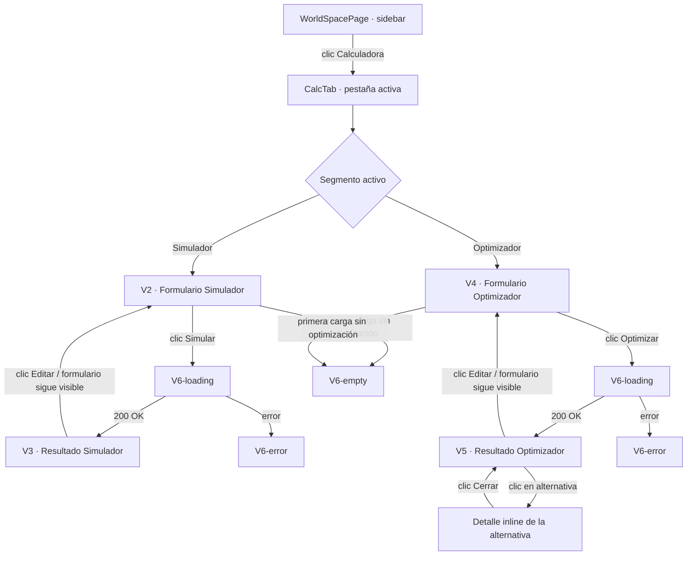

# Calculadora — Simulador y Optimizador de Combate

---

## 1. Visión de la experiencia y principios de diseño

La Calculadora es una herramienta de decisión, no de monitoring. El usuario llega aquí con una pregunta concreta: "¿gana mi ejército?" o "¿qué tropa mínima necesito para este oasis?". La respuesta debe aparecer clara y rápida — sin ruido visual que distraiga.

Principios aplicados (de `docs/design/PRINCIPIOS.md` y `frontend/DESIGN.md`):

- **Densidad informativa sobre decoración**: es una herramienta interna. Tablas compactas, números alineados, máxima información por píxel.
- **Una acción principal clara por estado**: el botón "Simular" o "Optimizar" es el único CTA primario en pantalla.
- **Divulgación progresiva**: configuración avanzada (exponente, artefactos, pesos de optimización) oculta por defecto detrás de un bloque colapsable. Las opciones P3 (nivel smithy por tropa, artefactos de defensor) están colapsadas en móvil.
- **Neutro primero, color al final**: el resultado usa solo dos colores semánticos — verde (atacante gana) y rojo (defensor gana). Sin decoración adicional.
- **Modo claro + oscuro** con tokens duales, sin hex hardcodeado.
- **Mobile-first P1/P2/P3**: en móvil se muestra el resultado (quién gana, botín, supervivientes atacante). La configuración avanzada y el desglose de bajas son P2/P3.

---

## 2. Personas y objetivos (jobs-to-be-done)

| Persona | Job-to-be-done | Contexto |
|---|---|---|
| Jugador que va a farmear oasis | "Quiero saber exactamente cuántas tropas pierdo antes de lanzar el ataque" | Antes de enviar el ejército — tiene prisa, quiere el dato en segundos |
| Jugador planificando la composición óptima | "Quiero saber qué combinación de tropas da más recursos y menos bajas en un oasis concreto" | Sentado planificando, no tiene prisa pero quiere precisión |
| Jugador nuevo | "Quiero entender la mecánica de combate" | Primera vez — necesita que el formulario le guíe sin agobiarlo |

**Job principal del Simulador**: introducir un ejército real y ver el resultado exacto.
**Job principal del Optimizador**: no saber qué enviar y que la herramienta lo calcule.

---

## 3. Inventario de pantallas / vistas

| ID | Nombre | Descripción |
|---|---|---|
| V1 | Selector de modo | Segmento "Simulador / Optimizador" en la parte superior de la pestaña Calculadora |
| V2 | Formulario Simulador | Formulario estructurado en paneles: Atacante, Defensor(es), Config. |
| V3 | Resultado Simulador | Resultado completo: ganador, tropas, botín, pérdidas, daño estructural |
| V4 | Formulario Optimizador | Selector de tribu + modo A/B + defensa del oasis + config |
| V5 | Resultado Optimizador | Ranking de alternativas Pareto + detalle al hacer clic |
| V6-empty | Estado vacío | Primera vez, sin simulación previa |
| V6-loading | Estado cargando | Spinner mientras espera respuesta de la API |
| V6-error | Estado error | Error 400/422 de la API con mensaje descriptivo |

---

## 4. Mapa de navegación



**Nota de layout**: el formulario y el resultado coexisten en la misma pantalla en desktop (split horizontal izq/dcha). En móvil se apilan: el resultado desplaza el formulario hacia arriba pero no lo oculta (el formulario queda colapsado con un botón "Editar formulario").

---

## 5. Flujos de usuario clave

### 5.1 Happy path — Simulador

1. Usuario entra en la pestaña "Calculadora" → ve V6-empty con el segmento "Simulador" activo.
2. Selecciona la tribu atacante en el selector de tribu.
3. La lista de tropas de esa tribu aparece (iconos + nombre + input de cantidad + input de smithy), inicialmente con cantidad 0.
4. Introduce cantidades para las tropas que quiere enviar. Las tropas con cantidad 0 se muestran atenuadas pero siempre presentes (no hay añadir/quitar — todas las tropas de la tribu están disponibles).
5. Opcionalmente: héroe, alianza, moral, artefactos, modo ataque.
6. En el panel Defensor: introduce las tropas de la defensa (tribu nature por defecto para el caso oasis; cambiable para PvP). Nivel de muro y stonemason opcionales.
7. Clic en "Simular". → V6-loading (spinner en el área de resultado).
8. Resultado aparece en V3. El usuario ve inmediatamente el badge "Atacante gana" / "Defensor gana" + supervivientes + botín.
9. Si quiere ajustar: modifica el formulario (que sigue visible a la izquierda) y vuelve a simular.

### 5.2 Happy path — Optimizador

1. Usuario activa el segmento "Optimizador".
2. Selecciona tribu atacante y Modo A (tipos libres) o Modo B (tropas con cantidades).
3. Introduce la defensa del oasis: selecciona animales NATURE con sus cantidades.
4. Opcionalmente: pesos de optimización (sliders — configuración avanzada).
5. Clic en "Optimizar". → V6-loading.
6. Resultado en V5: lista de alternativas ordenadas por rank. Cada alternativa muestra tropas enviadas, bajas, recursos ganados.
7. Clic en una alternativa → detalle inline desplegado (la misma información de V3 pero para esa combinación).

### 5.3 Flujo alternativo — Error de API

1. La API devuelve 400 (idioma) o 422 (validación).
2. El área de resultado muestra V6-error: icono de error + mensaje extraído del campo `detail` de la respuesta.
3. El formulario sigue completamente editable. El usuario corrige y vuelve a enviar.

### 5.4 Flujo alternativo — Defensor vacío (EC-01)

1. El usuario no introduce tropas defensoras (oasis vacío).
2. El simulador acepta el request (FA-03: victoria inmediata).
3. El resultado muestra badge verde "Atacante gana" + ratio null presentado como "Victoria sin combate" + supervivientes = todos + botín = capacidad de carga.

### 5.5 Flujo alternativo — Optimizador sin combinación ganadora (EC-13)

1. El resultado del optimizador muestra un banner "No se encontró combinación ganadora" (`has_winning_combination: false`).
2. Se muestran igualmente las mejores alternativas no-ganadoras con el badge "No gana" en cada fila.

---

## 6. Wireframes de baja fidelidad por pantalla

### 6.1 Estructura general de la pestaña (desktop ≥ lg)

```
┌── Sidebar (180px) ──┬── CalcTab ─────────────────────────────────────────────┐
│  Dashboard          │  ┌─────────────────────────────────────────────────┐   │
│  Agentes            │  │  [  Simulador  ] [  Optimizador  ]   ← segmento │   │
│  Listas de vacas    │  └─────────────────────────────────────────────────┘   │
│  ▶ Calculadora      │                                                         │
│                     │  ┌── Formulario (420px) ──┬── Resultado ─────────────┐ │
│                     │  │  panel atacante        │  (vacío / loading /      │ │
│                     │  │  panel defensor(es)    │   resultado)              │ │
│                     │  │  panel config          │                           │ │
│                     │  │  [Simular]             │                           │ │
│                     │  └────────────────────────┴──────────────────────────┘ │
└─────────────────────┴──────────────────────────────────────────────────────────┘
```

**En móvil (< md)**: formulario full-width arriba, resultado debajo. Cuando hay resultado, el formulario se colapsa en un banner colapsable "Formulario · clic para editar" con el botón Simular visible.

---

### 6.2 V2 — Formulario Simulador

```
┌─────────────────────────────────────────────────────────┐
│  ATACANTE                                               │
│  Tribu: [ Romans ▾ ]    Modo: [ Saqueo ◉ ] [ Ataque ○ ]│
│                                                         │
│  Tropas:                                                │
│  ┌──────────────────────────────────────────────────┐   │
│  │ [icono] Legionario          [____qty] [s:__lv]  │   │
│  │ [icono] Pretoriano           [____qty] [s:__lv]  │   │
│  │ [icono] Imperano             [____qty] [s:__lv]  │   │
│  │  … (todas las tropas de la tribu)               │   │
│  └──────────────────────────────────────────────────┘   │
│                                                         │
│  ▼ Héroe y bonus (colapsable)                           │
│    Pts ataque: [____]   Bonus %: [____]                 │
│    Alianza %: [__]   Moral %: [___]                     │
│                                                         │
│  ▼ Artefactos (colapsable)                              │
│    Velocidad tropa: [__]x   Dieta crop: [__]x           │
│                                                         │
│  ── solo si modo = Ataque ──────────────────────────────│
│  Catapultas: objetivo [ edificio ▾ ] nivel [__]        │
│  Arietes: qty [____] smithy [__]                        │
│  ─────────────────────────────────────────────────────  │
│                                                         │
│  DEFENSOR(ES)                          [+ Añadir]       │
│                                                         │
│  Defensor 1     [Tribu: Nature ▾]   [ × Quitar ]       │
│  ┌──────────────────────────────────────────────────┐   │
│  │ [icono] Rata          [____qty]                 │   │
│  │ [icono] Araña         [____qty]                 │   │
│  │  … (tropas de la tribu seleccionada)            │   │
│  └──────────────────────────────────────────────────┘   │
│  Muro: [__lv]   Stonemason: [__lv]   Trib. muro: [▾]  │
│  Rec. aldea: [________] (opcional)                      │
│  ▼ Héroe defensor (colapsable)                          │
│  ▼ Artefactos defensor (colapsable)                     │
│                                                         │
│  CONFIG (colapsable — P3)                               │
│  Exponente: [0.5]  Velocidad servidor: [1x ▾]           │
│  Distancia campos: [____]                               │
│                                                         │
│  ┌──────────────────────────────────────────────────┐   │
│  │              [  Simular  ]                       │   │
│  └──────────────────────────────────────────────────┘   │
└─────────────────────────────────────────────────────────┘
```

**Detalle del panel de tropas**:
- Columna icono: 24×24px, cargado de `api.getCatalogIcons`.
- Columna nombre: flex:1, texto 13px, `var(--text)`.
- Input cantidad: 72px, `font-mono`, `tabular-nums`, placeholder "0". Mínimo 0.
- Input smithy: 48px, label "S:", 0–20, placeholder "0". Se muestra siempre pero en menor jerarquía (caption, `var(--text-secondary)`).
- Tropas con cantidad = 0: opacity 0.5 en el nombre e icono (no en el input). No se eliminan.
- Tropas con cantidad > 0: aparecen destacadas (sin cambio de color — el peso de la cifra en font-mono es suficiente).

**Selector de tribu**: dropdown con nombre de tribu + pequeño icono (si existe). Lista completa de tribus jugables (no NATURE en el atacante; NATURE y todas las jugables en el defensor). NATURE es el valor por defecto del defensor para el caso oasis.

**Toggle Modo**: segmento inline "Saqueo / Ataque". Por defecto "Saqueo". Al cambiar a "Ataque" aparecen los campos de catapultas y arietes con transición suave.

**Botón "+ Añadir defensor"**: secundario, al lado del header "DEFENSOR(ES)". Máximo 20 defensores (según spec funcional). Si se alcanza el límite, el botón queda deshabilitado con tooltip "Máximo 20 defensores".

**Botón "Simular"**: primario monocromo, ancho completo del panel de formulario. Deshabilitado si no hay ninguna tropa atacante con cantidad > 0.

---

### 6.3 V3 — Resultado del Simulador

```
┌──────────────────────────────────────────────────────────────────┐
│  ┌────────────────────────────────────────────────────────────┐   │
│  │  ● ATACANTE GANA    ratio 2.37   Fuerza: 47650 vs 20110   │   │
│  └────────────────────────────────────────────────────────────┘   │
│                                                                    │
│  TROPAS ATACANTE                                                   │
│  ┌──────────────────────────────────────────────────────────────┐ │
│  │ Tropa          Enviadas   Supervivientes   Bajas             │ │
│  │──────────────────────────────────────────────────────────────│ │
│  │ [ic] Legionario    500         364          136              │ │
│  │ [ic] Imperano      200         146           54              │ │
│  └──────────────────────────────────────────────────────────────┘ │
│                                                                    │
│  TROPAS DEFENSOR                                                   │
│  ┌──────────────────────────────────────────────────────────────┐ │
│  │ Tropa          Enviadas   Supervivientes   Bajas             │ │
│  │──────────────────────────────────────────────────────────────│ │
│  │ [ic] Araña         100           0          100              │ │
│  │ [ic] Jabalí         40           0           40              │ │
│  └──────────────────────────────────────────────────────────────┘ │
│                                                                    │
│  BOTÍN                                                             │
│  Capacidad de carga: 54 600     Botín potencial: 27 300            │
│  Recursos de animales:                                             │
│  [🪵] Madera: 4 000  [🧱] Arcilla: 4 000                         │
│  [⚙] Hierro: 4 000  [🌾] Trigo: 4 000  Total: 16 000            │
│                                                                    │
│  PÉRDIDAS EN RECURSOS   ▼ (colapsable P2)                          │
│  Atacante: 45 200 recursos    Defensor: 0                          │
│  [desglose por tropa en tabla colapsada]                           │
│                                                                    │
│  DAÑO ESTRUCTURAL   ▼ (colapsable P2, solo si attack_type=attack)  │
│  Edificio gid 15: nivel 10 → 7  (24 impactos)                      │
│  Muro: 10 → 8                                                      │
│                                                                    │
│  Consumo de trigo (viaje): 1 240                                   │
│                                                                    │
│  [!] Advertencias (si las hay en chips/badges)                     │
└──────────────────────────────────────────────────────────────────┘
```

**Badge de resultado (P1 — siempre visible)**:
- Atacante gana: fondo `var(--success)` suave (`rgba(36,138,61,.12)`) + borde 1px `var(--success)` + texto "Atacante gana" en `var(--success)` / font-size 15px / weight 600. Icono escudo (Lucide `ShieldCheck` o similar).
- Defensor gana: mismo patrón con `var(--danger)`. Icono escudo roto.
- Ratio como número mono prominente al lado. Fuerza de ataque vs defensa en caption debajo.
- Victoria sin combate (defensa vacía): texto "Victoria sin combate" en `var(--text-secondary)` + ratio omitido.

**Tablas de tropas**:
- Siguen el patrón de tablas densas de DESIGN.md §12: filas 36px, hairline, sin zebra.
- Cabecera: superficie `var(--surface-2)`, texto micro-caps 11px.
- Columna icono: 28px. Columna nombre: flex:1. Columnas numéricas: `font-mono tabular-nums`, alineadas a la derecha, 72px.
- Fila de baja total (si hay): fila de total al pie con peso 500, separador hairline.
- Las bajas se muestran en `var(--danger)` (con icono, no solo color — accesibilidad).
- Los supervivientes se muestran en `var(--success)` cuando > 0.
- Cuando supervivientes = 0: `var(--text-disabled)`.

**Panel botín**:
- Tres líneas: capacidad de carga (siempre), botín potencial (si no es null), desglose de animales (si no es null).
- Recursos de animales en fila horizontal con icono de recurso (madera/arcilla/hierro/trigo) usando los iconos de recursos del catálogo (`api.getCatalogIcons({icon_type: 'resource'})`).
- Los números en `font-mono tabular-nums`.
- Si `resources_gained_from_animals` es null: se muestra "Sin animales muertos" en `var(--text-tertiary)`.

**Pérdidas en recursos (P2)**:
- Colapsable con `<details>/<summary>`. Sumario muestra el total del atacante en bold.
- Interior: tabla compacta con tropa / bajas / coste total por tipo de recurso.

**Daño estructural (P2, solo modo ataque)**:
- Colapsable. Solo visible cuando `structural_damage` no es null.
- Lista de edificios afectados con nivel antes → nivel después.
- Muro: "nivel antes → nivel después" con indicador visual (si bajó → en `var(--danger)`).

**Consumo de trigo**: línea de caption si `crop_consumption` no es null.

**Warnings**: chips/badges en acento oro (`var(--accent-subtle)` con texto `var(--accent-text)`) con icono de advertencia. Uno por warning.

---

### 6.4 V4 — Formulario Optimizador

```
┌─────────────────────────────────────────────────────────┐
│  ATACANTE                                               │
│  Tribu: [ Romans ▾ ]                                    │
│                                                         │
│  Modo: ●  A — Tipos libres                              │
│         ○  B — Tropas de aldea con cantidad             │
│                                                         │
│  ── Modo A ──────────────────────────────────────────── │
│  Tropas disponibles (seleccionar tipo + smithy):        │
│  ┌──────────────────────────────────────────────────┐   │
│  │ [✓] [ic] Legionario    Smithy: [__]             │   │
│  │ [✓] [ic] Imperano      Smithy: [__]             │   │
│  │ [ ] [ic] Explorador    Smithy: [__]             │   │
│  │  … (todas las tropas, checkbox por tipo)        │   │
│  └──────────────────────────────────────────────────┘   │
│                                                         │
│  ── Modo B ──────────────────────────────────────────── │
│  Tropas de aldea (cantidad disponible + smithy):        │
│  ┌──────────────────────────────────────────────────┐   │
│  │ [ic] Legionario   Disp: [______]  Smithy: [__]  │   │
│  │ [ic] Imperano     Disp: [______]  Smithy: [__]  │   │
│  │  … (tropas con cantidad > 0 al frente)          │   │
│  └──────────────────────────────────────────────────┘   │
│  ─────────────────────────────────────────────────────  │
│                                                         │
│  ▼ Héroe y bonus (colapsable)                           │
│    Pts ataque: [____]   Bonus %: [____]                 │
│    Alianza %: [__]                                      │
│                                                         │
│  DEFENSA DEL OASIS (animales NATURE)                    │
│  ┌──────────────────────────────────────────────────┐   │
│  │ [ic] Rata          [____qty]                    │   │
│  │ [ic] Araña         [____qty]                    │   │
│  │  … (10 animales NATURE)                        │   │
│  └──────────────────────────────────────────────────┘   │
│                                                         │
│  CONFIG (colapsable — P3)                               │
│  Alternativas: [3 ▾] (1-10)                             │
│  Exponente: [0.5]   Velocidad: [1x ▾]                   │
│  Distancia: [____] campos                               │
│                                                         │
│  ▼ Pesos de optimización (colapsable P3)                │
│   Recursos ganados: ─────●──── [1.0]                   │
│   Pérdidas totales: ─────●──── [1.0]                   │
│   Tropas enviadas:  ──●──────  [0.5]                   │
│   Tiempo de marcha: ●─────────  [0.0]                   │
│                                                         │
│  ┌──────────────────────────────────────────────────┐   │
│  │              [ Optimizar ]                       │   │
│  └──────────────────────────────────────────────────┘   │
└─────────────────────────────────────────────────────────┘
```

**Modo A vs Modo B**: radio buttons en diseño de cápsula (similar al toggle Simulador/Optimizador pero con 2 opciones verticales o en fila). Solo el modo activo muestra su panel de tropas.

**Modo A — lista de tropas con checkbox**: al marcar se activa el input de smithy (deshabilitado si no marcado). Al menos una tropa debe estar marcada para habilitar "Optimizar".

**Modo B — lista de tropas con cantidad**: misma lista que el simulador. Las tropas con cantidad = 0 se muestran atenuadas.

**Animales NATURE**: 10 filas fijas (Rata → Elefante), con icono. Solo se muestra la cantidad — sin smithy (animales NPC no tienen smithy).

**Sliders de pesos**: `<input type="range" min="0" max="2" step="0.1">` con valor numérico visible al lado. Etiqueta y valor en la misma fila.

**Botón "Optimizar"**: deshabilitado si: ninguna tropa seleccionada (modo A) o todas con cantidad 0 (modo B) o ningún animal con cantidad > 0 en la defensa.

---

### 6.5 V5 — Resultado del Optimizador

```
┌──────────────────────────────────────────────────────────────────┐
│  [!] No se encontró combinación ganadora (banner si aplica)      │
│                                                                  │
│  ALTERNATIVAS PARETO  (3 resultados)                             │
│  ┌──────────────────────────────────────────────────────────┐    │
│  │ #  Tropas enviadas         Bajas (rec)  Recursos anim.  │    │
│  │──────────────────────────────────────────────────────────│    │
│  │ 1  [ic]200 [ic]50   ✓     6 540        16 000   ›       │    │
│  │ 2  [ic]180 [ic]60   ✓     5 980        14 400   ›       │    │
│  │ 3  [ic]220 [ic]40   ✗     7 100        16 000   ›       │    │
│  └──────────────────────────────────────────────────────────┘    │
│                                                                  │
│  ── Al hacer clic en la fila 1: detalle inline ─────────────── │
│  [resultado completo de esa alternativa, igual que V3]           │
│  [botón Cerrar detalle]                                          │
│                                                                  │
│  DEFENSA DEL OASIS (referencia)                                  │
│  [ic] Araña ×40  [ic] Jabalí ×20                                │
└──────────────────────────────────────────────────────────────────┘
```

**Tabla de alternativas**:
- Columna #: número de rank, `font-mono`, 28px.
- Columna "Tropas enviadas": iconos de tropas apilados horizontalmente (máx 4 iconos; "+N más" si hay más). Bajo el icono, la cantidad en caption.
- Columna ganador: badge "Gana" (verde, icono escudo) o "No gana" (rojo, icono ×).
- Columna pérdidas en recursos: número total en `font-mono`.
- Columna recursos de animales: número total en `font-mono`.
- Columna chevron (›): indica que la fila es expandible.
- Fila seleccionada: `var(--accent-subtle)` como fondo.

**Banner "Sin combinación ganadora"**: solo visible cuando `has_winning_combination: false`. Fondo `rgba(201,53,44,.08)` + borde 1px `var(--danger)` + icono de advertencia + texto del campo `message` de la API. Badge "No gana" en cada fila de la tabla.

**Detalle inline de alternativa**: panel que aparece debajo de la tabla al hacer clic en una fila. Muestra el mismo contenido que V3 (sin el formulario). Botón "Cerrar" ghost para contraerlo.

**Panel "Defensa del oasis (referencia)"**: lista compacta de animales de la defensa con iconos y cantidades. Siempre visible al pie de los resultados.

---

### 6.6 V6-empty — Estado vacío

```
┌──────────────────────────────────────────────────────────────────┐
│                                                                  │
│                  [icono calculadora grande]                      │
│                                                                  │
│        Introduce los ejércitos y pulsa "Simular"                 │
│        para ver el resultado del combate                         │
│                                                                  │
└──────────────────────────────────────────────────────────────────┘
```

- Icono de calculadora en `var(--text-tertiary)`, 40px.
- Texto en `var(--text-secondary)`, 14px, centrado.
- Ocupa el área de resultado cuando no hay simulación previa.

---

### 6.7 V6-loading — Estado cargando

```
┌──────────────────────────────────────────────────────────────────┐
│                                                                  │
│                    [ ◌ Spinner ]                                 │
│               Calculando resultado…                              │
│                                                                  │
└──────────────────────────────────────────────────────────────────┘
```

- Usa el componente `Spinner` existente.
- Texto "Calculando resultado…" / "Buscando combinación óptima…" en `var(--text-secondary)`.
- El botón "Simular"/"Optimizar" pasa a estado deshabilitado durante la carga.

---

### 6.8 V6-error — Estado error

```
┌──────────────────────────────────────────────────────────────────┐
│  [!] Error                                                       │
│  [mensaje de error de la API, campo detail]                      │
│                                                                  │
│  [ Reintentar ]                                                  │
└──────────────────────────────────────────────────────────────────┘
```

- Icono de error en `var(--danger)`.
- Texto del `detail` de la respuesta en `var(--text-secondary)`, 13px.
- Botón "Reintentar" secundario que re-envía la última petición.

---

## 6b. Mockup editable y layout aprobado

Ruta del mockup: `frontend/mockups/simulador-combate.playground.html`

**Estado**: pendiente de aprobación por el usuario. El mockup incluye:
- Vista 1: Formulario Simulador + estado vacío (desktop split)
- Vista 2: Formulario Simulador + Resultado completo (atacante gana)
- Vista 3: Formulario Simulador + Resultado (defensor gana)
- Vista 4: Formulario Optimizador + estado vacío
- Vista 5: Resultado Optimizador (con detalle de alternativa)
- Vista 6: Estado error
- Toggle de tema claro/oscuro
- Drag & drop de bloques para reordenar

**Layout aprobado**: pendiente (el usuario debe abrir el playground, reordenar bloques y exportar el JSON).

---

## 7. Estados de cada pantalla

### Pestaña Calculadora (nivel de contenedor)

| Estado | Descripción | Interfaz |
|---|---|---|
| Sin simulación previa | Primera carga | Formulario + V6-empty en el área de resultado |
| Calculando | API en vuelo | Formulario bloqueado (botón disabled) + V6-loading |
| Con resultado | 200 OK recibido | Formulario editable + V3/V5 |
| Error | 400/422 de la API | Formulario editable + V6-error |

### Panel de tropas (formulario)

| Estado | Descripción | Interfaz |
|---|---|---|
| Sin tribu seleccionada | Tribu no elegida | Mensaje "Selecciona una tribu" + lista vacía |
| Cargando iconos | `api.getCatalogIcons` en vuelo | Skeleton de 3-4 filas de tropa (rect gris animado) |
| Con tropas | Tribu seleccionada + iconos cargados | Lista completa de tropas de la tribu |
| Error de iconos | `getCatalogIcons` falla | Lista de tropas sin iconos (nombre solo, sin spinner bloqueante) |
| Tropa con cantidad 0 | Valor por defecto | Fila atenuada (opacity 0.5 en icono/nombre) |
| Tropa con cantidad > 0 | Usuario ha introducido valor | Fila en peso normal, value destacado en font-mono |

### Defensor(es) (formulario Simulador)

| Estado | Descripción | Interfaz |
|---|---|---|
| Sin defensores añadidos | Imposible — siempre hay al menos 1 defensor inicial | N/A |
| 1 defensor (por defecto) | Estado inicial | Panel de defensor con tribu NATURE por defecto, sin botón quitar |
| 2-20 defensores | Usuario ha añadido defensores | Cada defensor tiene header con nombre ("Defensor N") + botón quitar × |
| Límite alcanzado (20) | `max_defenders` alcanzado | Botón "+ Añadir" deshabilitado con tooltip |

### Resultado (V3)

| Estado | Sección | Visibilidad |
|---|---|---|
| Atacante gana | Badge verde | P1, siempre visible |
| Defensor gana | Badge rojo | P1, siempre visible |
| Botín potencial = null | No hay `village_resources` | Mostrar solo capacidad de carga |
| `resources_gained_from_animals` = null | Sin animales en la defensa | "Sin animales muertos" en text-tertiary |
| `structural_damage` = null | attack_type = "raid" | Sección daño estructural oculta |
| `crop_consumption` = null | Sin distancia | Sección consumo de trigo oculta |
| `warnings` vacío | Sin advertencias | Sección warnings oculta |
| `warnings` no vacío | Con advertencias | Chips de advertencia en oro |

### Resultado optimizador (V5)

| Estado | Descripción | Interfaz |
|---|---|---|
| `has_winning_combination: true` | Hay combinaciones ganadoras | Sin banner de error; badge verde en alternativas ganadoras |
| `has_winning_combination: false` | Sin combinaciones ganadoras | Banner rojo + badge "No gana" en todas las filas |
| Detalle cerrado | Ninguna alternativa seleccionada | Solo tabla de alternativas |
| Detalle abierto | Alternativa seleccionada | Fila seleccionada + detalle inline debajo |

---

## 8. Inventario de componentes UI reutilizables

### Componentes REUTILIZAR (ya existen)

| Componente | Uso en esta feature |
|---|---|
| `Spinner` | V6-loading |
| `showToast` | Errores de red inesperados (no los errores de API — esos van en V6-error) |
| `ErrorBoundary` | Envolver CalcTab completo |
| `useI18n()` | Todos los textos |
| `api.getCatalogIcons({ icon_type: 'troop', tribe })` | Iconos de tropas en el formulario y resultados |
| Patrón `FormField` / `inputBase` de `WizardModal.jsx` | Inputs de cantidad y smithy |
| Tokens CSS (`--color-*`, `--radius-*`) | Todo el styling |
| Nav item "Calculadora" en `WorldSpacePage.jsx` | Quitar `disabled: true` y `soon: true` del nav item 'calc' |

### Componentes CREAR (nuevos)

| Componente | Descripción | Reutilizable por otras features |
|---|---|---|
| `CalcTab` | Contenedor de la pestaña con el segmento Simulador/Optimizador | No |
| `ModeSegment` | Toggle/segmento "Simulador / Optimizador" | Potencialmente (es un segmento genérico) |
| `TribeSelector` | Dropdown de tribu con icono | Sí — cualquier formulario con selector de tribu |
| `TroopInputList` | Lista de tropas con icono + input cantidad + input smithy. Acepta prop `withCheckbox` para el modo A del optimizador | Sí |
| `TroopIcon` | Muestra el icono de una tropa. Fallback a inicial del nombre si la URL falla | Sí |
| `HeroBonusPanel` | Panel colapsable de héroe + alianza + moral | Sí |
| `ArtifactPanel` | Panel colapsable de artefactos (atacante o defensor) | Sí |
| `DefenderPanel` | Panel de un defensor: tribu, tropas, muro, stonemason, héroe, artefactos | No (específico del simulador) |
| `DefenderList` | Lista de `DefenderPanel` con botón añadir/quitar | No |
| `CatapultRamPanel` | Panel de catapultas y arietes (solo en modo ataque) | No |
| `ConfigPanel` | Panel colapsable de config (exponente, velocidad, distancia) | Sí |
| `SimulateButton` | Botón primario monocromo que pasa a loading state | No (específico) |
| `CombatResultBadge` | Badge de resultado (atacante gana / defensor gana / sin combate) con ratio | Sí |
| `TroopResultTable` | Tabla densa de resultados de tropa (enviadas, supervivientes, bajas) | Sí |
| `LootPanel` | Panel de botín: capacidad, potencial, recursos de animales desglosados | No |
| `ResourceLossPanel` | Panel colapsable de pérdidas en recursos con tabla de desglose | No |
| `StructuralDamagePanel` | Panel colapsable de daño estructural (catapultas + muro) | No |
| `WarningChips` | Lista de chips de advertencia en oro | Sí |
| `OptimizerModeSelector` | Selector Modo A / Modo B (radio en diseño cápsula) | No |
| `NatureDefenseInput` | Lista de 10 animales NATURE con iconos y inputs de cantidad | No |
| `OptimizationWeightsPanel` | Sliders de pesos de optimización (P3 colapsable) | No |
| `AlternativeTable` | Tabla de alternativas Pareto con iconos de tropas + badges | No |
| `AlternativeDetail` | Detalle inline de una alternativa (expande al hacer clic en fila) | No |
| `EmptyCalcState` | Estado vacío ilustrado (icono calculadora + texto guía) | No |
| `CalcErrorState` | Estado error con mensaje de la API + botón reintentar | No |
| `ResourceIcon` | Icono de recurso (madera/arcilla/hierro/trigo) con fallback textual | Sí |

---

## 9. Contenido y microcopy

### Labels de sección

| Clave i18n | Texto ES | Contexto |
|---|---|---|
| `calc.tab.simulator` | Simulador | Segmento |
| `calc.tab.optimizer` | Optimizador | Segmento |
| `calc.attacker` | Atacante | Header panel |
| `calc.defenders` | Defensor(es) | Header panel |
| `calc.config` | Configuración | Header panel colapsable |
| `calc.addDefender` | + Añadir defensor | Botón |
| `calc.removeDefender` | Quitar | Botón × |
| `calc.defenderN` | Defensor {n} | Header de cada defensor |
| `calc.mode.raid` | Saqueo | Toggle modo |
| `calc.mode.attack` | Ataque | Toggle modo |
| `calc.hero` | Héroe y bonus | Header colapsable |
| `calc.artifacts` | Artefactos | Header colapsable |
| `calc.catapultRam` | Catapultas y arietes | Header colapsable |
| `calc.wall` | Muro | Label |
| `calc.stonemason` | Stonemason | Label |
| `calc.wallTribe` | Tribu del muro | Label |
| `calc.villageResources` | Recursos de aldea (opcional) | Label |
| `calc.exponent` | Exponente | Label config |
| `calc.serverSpeed` | Velocidad del servidor | Label config |
| `calc.distance` | Distancia (campos) | Label config |
| `calc.simulate` | Simular | Botón primario |
| `calc.optimize` | Optimizar | Botón primario |
| `calc.simulating` | Calculando… | Botón en loading |
| `calc.optimizing` | Optimizando… | Botón en loading |

### Labels de resultado — Simulador

| Clave i18n | Texto ES | Contexto |
|---|---|---|
| `calc.result.attackerWins` | Atacante gana | Badge verde |
| `calc.result.defenderWins` | Defensor gana | Badge rojo |
| `calc.result.noCombat` | Victoria sin combate | Badge neutral (defensa vacía) |
| `calc.result.ratio` | Ratio | Label |
| `calc.result.power` | Fuerza | Label |
| `calc.result.attackerTroops` | Tropas atacante | Cabecera tabla |
| `calc.result.defenderTroops` | Tropas defensor | Cabecera tabla |
| `calc.result.sent` | Enviadas | Columna tabla |
| `calc.result.survived` | Supervivientes | Columna tabla |
| `calc.result.lost` | Bajas | Columna tabla |
| `calc.result.loot` | Botín | Header panel |
| `calc.result.lootCapacity` | Capacidad de carga | Label |
| `calc.result.lootPotential` | Botín potencial | Label |
| `calc.result.animalsResources` | Recursos de animales | Label |
| `calc.result.noAnimals` | Sin animales muertos | Label vacío |
| `calc.result.resourceLosses` | Pérdidas en recursos | Header colapsable |
| `calc.result.structuralDamage` | Daño estructural | Header colapsable |
| `calc.result.wallBefore` | Muro antes | Label |
| `calc.result.wallAfter` | Muro después | Label |
| `calc.result.cropConsumption` | Consumo de trigo (viaje) | Label |
| `calc.result.warnings` | Advertencias | Header chips |

### Labels de resultado — Optimizador

| Clave i18n | Texto ES | Contexto |
|---|---|---|
| `calc.opt.noWinner` | No se encontró combinación ganadora | Banner |
| `calc.opt.alternatives` | Alternativas | Header tabla |
| `calc.opt.rank` | # | Columna |
| `calc.opt.troopsSent` | Tropas enviadas | Columna |
| `calc.opt.wins` | Gana | Badge verde |
| `calc.opt.loses` | No gana | Badge rojo |
| `calc.opt.resourceLosses` | Bajas (rec.) | Columna |
| `calc.opt.resourcesGained` | Recursos ganados | Columna |
| `calc.opt.oasisDefense` | Defensa del oasis | Header referencia |
| `calc.opt.modeA` | Tipos libres | Radio |
| `calc.opt.modeB` | Tropas de aldea | Radio |
| `calc.opt.topN` | Alternativas | Label |
| `calc.opt.weights` | Pesos de optimización | Header colapsable |
| `calc.opt.weightResources` | Recursos ganados | Slider label |
| `calc.opt.weightLosses` | Pérdidas totales | Slider label |
| `calc.opt.weightTroops` | Tropas enviadas | Slider label |
| `calc.opt.weightTime` | Tiempo de marcha | Slider label |
| `calc.opt.viewDetail` | Ver detalle | Botón expandir alternativa |
| `calc.opt.closeDetail` | Cerrar detalle | Botón |

### Estados vacíos y errores

| Clave i18n | Texto ES | Contexto |
|---|---|---|
| `calc.empty.title` | Introduce los datos y pulsa Simular | Estado vacío simulador |
| `calc.empty.titleOpt` | Introduce los datos y pulsa Optimizar | Estado vacío optimizador |
| `calc.error.title` | Error al calcular | Header error |
| `calc.error.retry` | Reintentar | Botón |
| `calc.error.noTroops` | El ejército atacante no tiene tropas activas | Error EC-02 |
| `calc.maxDefenders` | Máximo 20 defensores | Tooltip botón disabled |
| `calc.smithy` | S | Label input smithy (abreviado) |
| `calc.available` | Disp. | Label input disponible (optimizador modo B) |

---

## 10. Accesibilidad

- **Foco visible**: todos los inputs, botones, checkboxes y filas de tabla interactivas tienen `outline: 2px solid var(--accent); outline-offset: 2px`.
- **El color nunca es la única señal**: el badge de resultado lleva icono (escudo ✓ o ×) además del color verde/rojo. Las bajas llevan una pequeña flecha ↓ además del color rojo. Los supervivientes llevan ↑ verde.
- **`role="status"` en el área de resultado**: el contenedor del resultado tiene `role="status" aria-live="polite"` para que los lectores de pantalla anuncien el nuevo resultado al aparecer.
- **`aria-label` en inputs de cantidad**: `aria-label="Cantidad de {nombre_tropa}"`.
- **`aria-label` en inputs de smithy**: `aria-label="Nivel de smithy de {nombre_tropa}"`.
- **ToggleSwitch / radio de modo**: `role="radiogroup"` con `role="radio"` en cada opción + `aria-checked`.
- **Colapsables**: usar `<details>/<summary>` nativos donde sea posible (accesibles de serie). `aria-expanded` para los colapsables con JS.
- **Tabla de resultados**: `<table>` semántico con `<th scope="col">` en cabeceras. `scope="row"` en la columna de nombre de tropa.
- **Targets táctiles**: inputs de cantidad ≥ 36px de alto en desktop, ≥ 44px en móvil. Checkboxes del optimizador modo A: área táctil ≥ 44×44px.
- **Sliders de pesos**: `<input type="range">` con `aria-label` descriptivo y valor numérico visible (no solo en el tooltip del slider).
- **Contraste**: todos los colores usan los tokens verificados WCAG AA de DESIGN.md §4.
- **`prefers-reduced-motion`**: las transiciones de colapso y el spinner respetan `@media (prefers-reduced-motion: reduce)`.
- **RTL**: propiedades lógicas CSS en todo el componente (`padding-inline`, `margin-inline`, `inset-inline`). El layout split (formulario izq / resultado dcha) se espeja en RTL con `flex-direction: row-reverse` o equivalente lógico.

---

## 11. Responsive / adaptación a dispositivos

### Desktop (≥ lg, ≥ 1024px)

```
┌── Formulario (420px fijo) ──┬── Resultado (flex:1) ──┐
│  panel atacante             │  V6-empty               │
│  panel defensor(es)         │  V6-loading             │
│  panel config               │  V3 / V5               │
│  [Simular]                  │                         │
└─────────────────────────────┴─────────────────────────┘
```

- El formulario tiene `width: 420px; flex-shrink: 0`.
- El área de resultado tiene `flex: 1; min-width: 0`.
- Separador hairline vertical entre formulario y resultado.
- Los paneles de héroe, artefactos, config son colapsables por defecto (abiertos si el usuario los desplegó — persiste en estado local de React, no en localStorage).

### Tablet (md, 768-1023px)

- El formulario ocupa el ancho completo. No hay split horizontal.
- El resultado aparece debajo del formulario, separado por hairline.
- Los paneles P3 (config avanzada, pesos) están colapsados por defecto.

### Móvil (< md, < 768px)

- El formulario ocupa ancho completo, con padding lateral reducido (16px).
- Cuando hay resultado: el formulario se colapsa en un banner "Formulario · Editar" con un botón ghost que lo expande. El resultado queda en la parte visible sin scroll.
- Tablas de resultado: en móvil, las columnas de detalle (breakdown de pérdidas) se ocultan (P3). Solo visible: nombre de tropa, bajas, supervivientes.
- El botón "Simular"/"Optimizar" tiene altura 44px en móvil (target táctil mínimo Apple).
- Los inputs de cantidad tienen `font-size: 16px` en móvil (previene auto-zoom de iOS).
- Las 10 filas de animales NATURE del optimizador: en móvil se apilan en 2 columnas de 5 (grid de 2 columnas) para reducir el scroll.

### Prioridad P1/P2/P3

| Elemento | Prioridad | Móvil |
|---|---|---|
| Badge resultado (quién gana + ratio) | P1 | Siempre visible |
| Tabla de tropas atacante (supervivientes) | P1 | Visible (simplificada) |
| Botín total (capacidad + potencial) | P1 | Visible |
| Recursos de animales (total) | P1 | Visible |
| Tabla de tropas defensor | P2 | Colapsable |
| Pérdidas en recursos (panel) | P2 | Colapsable |
| Desglose de pérdidas por tipo de recurso | P3 | Oculto |
| Daño estructural | P2 | Colapsable |
| Consumo de trigo | P2 | Visible (línea simple) |
| Configuración avanzada (exponente, pesos) | P3 | Oculto hasta expandir |
| Ratio de fuerzas (attacker_power / defender_power) | P2 | Colapsable |

---

## 12. Interacciones y feedback

### Formulario

- **Cambio de tribu atacante**: reemplaza inmediatamente la lista de tropas con la de la nueva tribu. Los valores de cantidad/smithy se resetean (no hay transferencia entre tribus — las tropas son diferentes). `requestAnimationFrame` para evitar jank visible.
- **Cambio de tribu del defensor**: igual que arriba para ese defensor.
- **Toggle Modo (Saqueo / Ataque)**: los campos de catapultas/arietes aparecen/desaparecen con `transition: opacity 150ms, max-height 220ms`. En modo saqueo, los campos quedan con `display:none` para no contaminar el formulario.
- **Añadir defensor**: el nuevo panel de defensor aparece con fade-in `220ms`. El scroll del panel de formulario baja automáticamente para mostrar el nuevo defensor.
- **Quitar defensor**: el panel desaparece con fade-out `150ms`. La numeración se reordena.
- **Inputs de cantidad**: validación inline (no bloqueante) al salir del input (blur). Si el valor está fuera de rango (> 1 000 000), el borde pasa a `var(--danger)` y aparece un mensaje de error inline en caption.
- **Inputs de smithy**: validación inline igual, rango 0-20.
- **Botón "Simular"/"Optimizar"**: al hacer clic, el botón muestra texto "Calculando…" / "Optimizando…" y un mini spinner a la izquierda del texto. Se deshabilita. El área de resultado pasa a V6-loading.
- **Colapsables**: transición `max-height` + `opacity` para no hacer salto brusco.

### Resultado

- **Aparición del resultado**: el área de resultado pasa de V6-loading a V3/V5 con fade-in `220ms`. El scroll de la página (en móvil) baja automáticamente al inicio del resultado.
- **Hover en filas de tabla**: fondo `var(--surface-2)` con `transition 150ms`.
- **Clic en alternativa (optimizador)**: la fila seleccionada pasa a `var(--accent-subtle)`. El detalle inline aparece debajo con slide-down `220ms`.
- **Warnings**: si hay nuevos warnings en un resultado posterior al primero, los chips parpadean una vez (brief flash de borde accent) para llamar la atención. Solo una vez.
- **Error**: al aparecer V6-error, el botón "Reintentar" tiene foco automático (accesibilidad).

---

## 13. Criterios de aceptación de diseño

- [ ] El segmento "Simulador / Optimizador" es visible y funcional al abrir la pestaña Calculadora.
- [ ] La lista de tropas muestra iconos de `api.getCatalogIcons` con fallback textual si la imagen falla.
- [ ] Las tropas con cantidad 0 están visibles pero atenuadas; nunca desaparecen.
- [ ] El botón "Simular"/"Optimizar" queda deshabilitado si no hay tropas con cantidad > 0.
- [ ] El badge de resultado (atacante gana / defensor gana) es el primer elemento visual tras recibir el resultado.
- [ ] Los números en todas las tablas y paneles usan `font-mono` y `tabular-nums`.
- [ ] En modo Saqueo, los campos de catapultas/arietes no son visibles (ni ocupan espacio).
- [ ] En modo Ataque, los campos de catapultas/arietes aparecen correctamente.
- [ ] Se pueden añadir hasta 20 defensores; al llegar al límite el botón se deshabilita.
- [ ] El panel de pérdidas en recursos es colapsable y arranca colapsado por defecto.
- [ ] El panel de daño estructural solo aparece cuando `structural_damage` no es null.
- [ ] La sección de recursos de animales muestra el desglose por tipo de recurso con iconos.
- [ ] En el optimizador, el modo A muestra checkboxes; el modo B muestra inputs de disponibilidad.
- [ ] El banner "Sin combinación ganadora" aparece cuando `has_winning_combination: false`.
- [ ] Al hacer clic en una alternativa del optimizador, aparece el detalle inline y la fila queda resaltada en accent-subtle.
- [ ] Todos los textos se muestran correctamente en los 25 idiomas (incluido RTL en ar/he/fa).
- [ ] En móvil, el formulario se colapsa cuando hay resultado y hay un botón para volver a expandirlo.
- [ ] Los inputs de cantidad tienen `font-size: 16px` en móvil (sin auto-zoom iOS).
- [ ] El área de resultado tiene `role="status" aria-live="polite"`.
- [ ] Ningún color es la única señal de estado (siempre acompañado de icono o texto).
- [ ] Todos los controles tienen foco visible.
- [ ] El modo claro y oscuro funcionan correctamente con todos los tokens duales.

---

## 14. Trazabilidad

| Decisión de diseño | Justificación | Fuente |
|---|---|---|
| Split horizontal formulario/resultado en desktop | El usuario modifica y re-simula continuamente — necesita ver ambos a la vez sin scroll | Persona "farmero" — modifica y vuelve a simular rápido |
| Formulario colapsable en móvil cuando hay resultado | En móvil el resultado es P1; el formulario es secundario después de la primera simulación | DESIGN.md §17.3 — P1 siempre visible |
| Todas las tropas de la tribu siempre visibles (no añadir/quitar) | El usuario necesita saber que una tropa tiene 0 — no tener que "recordar" añadirla | EC-04, EC-05 del spec funcional: tropas con 0 tienen comportamiento definido |
| NATURE como tribu por defecto del defensor | El uso principal del simulador es oasis farming | Job-to-be-done: "farmear oasis" |
| Toggle Saqueo/Ataque en lugar de siempre mostrar catapultas | El modo saqueo es el 90% del uso; el modo ataque es el caso especial | RN-13: default "raid"; `DESIGN.md` §1 "Menos es más" |
| Config avanzada colapsada por defecto | Exponente y artefactos son para usuarios avanzados; el default 0.5 es correcto | DESIGN.md §1 "Divulgación progresiva" |
| Botón primario monocromo (no oro) | Regla DESIGN.md §4: el oro no se usa en botones | `DESIGN.md` §4 y §12 |
| Tabla densa sin zebra, hairline | Herramienta interna, densidad sobre decoración | `DESIGN.md` §1 y §12 |
| Badge de resultado como primer elemento visual | P1: quién gana es la información más importante | Persona "farmero que decide enviar o no" |
| Recursos de animales con desglose por tipo | RN-08 del spec funcional: el response devuelve objetos con 4 tipos de recurso, no un total único | Spec funcional §4 RN-08 |
| Panel de alternativas con iconos de tropas (no nombres) | Los iconos son más rápidos de leer en una tabla densa; los nombres en el tooltip | Densidad informativa; `api.getCatalogIcons` disponible |
| Detalle de alternativa inline (no modal) | Evitar pérdida de contexto del ranking al ver el detalle | Patrón drawer/detail ya establecido en FarmListDrawer |
| Sliders para pesos de optimización | Los valores 0.0-2.0 son continuos; el slider da feedback inmediato del valor relativo | Spec funcional RN-09: pesos configurables |
| Radio A/B en diseño vertical (no tabs) | Son mutuamente excluyentes y hay solo 2 opciones; las tabs se reservan para la nav principal | RN-10 del spec: modos mutuamente excluyentes |
| `role="status" aria-live="polite"` en área de resultado | El resultado aparece dinámicamente; lectores de pantalla deben anunciarlo | DESIGN.md §13 accesibilidad |
| Nav item 'calc' pierde `disabled` y `soon` | La pestaña ya tiene contenido implementable | WorldSpacePage.jsx líneas 356-359 |
| UI: reutiliza `Spinner`, `showToast`, `ErrorBoundary`, `useI18n`, `api.getCatalogIcons`, patrón `FormField`/`inputBase` | palantir confirmó disponibilidad de todos estos primitivos | Contexto de entrada (resultado palantir) |
| UI: crea `CalcTab`, `TroopInputList`, `TroopResultTable`, `LootPanel`, etc. | No existen en el código — feature completamente nueva | palantir: no hay UI de combate existente |
