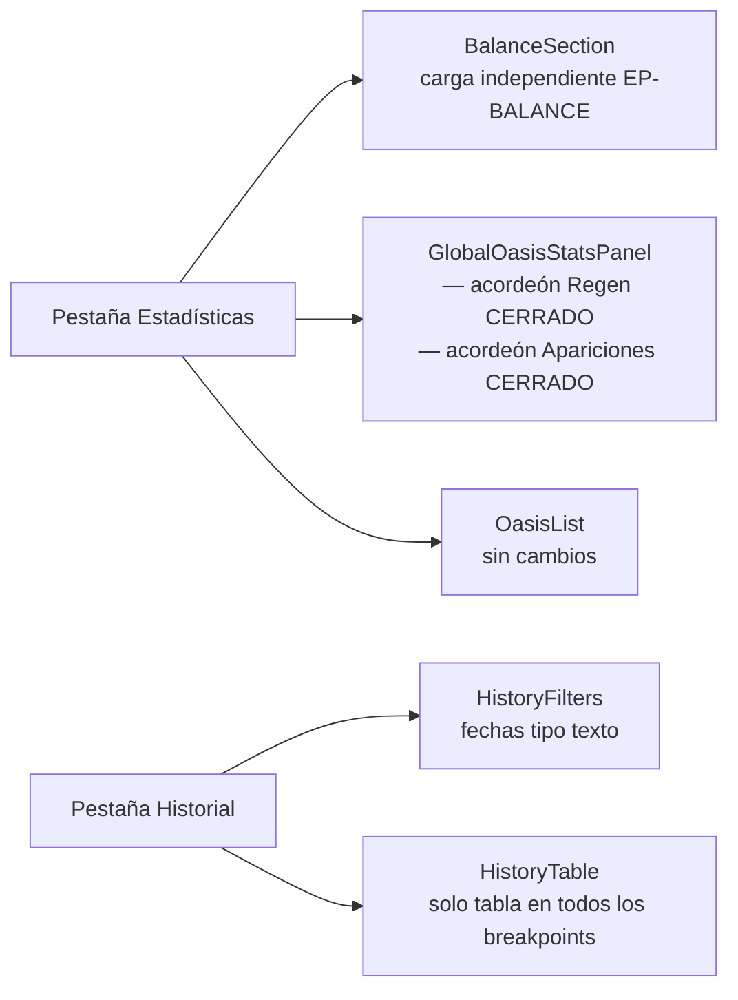

# Retoques Historial + Estadísticas — cierre de sprint

> **Alcance:** este spec es un **delta** sobre los specs padre
> `docs/design/bd-ataques-oasis-ui.md` y
> `docs/design/bd-ataques-oasis-stats-oasis-nav-ui.md` (ambos estado: implemented).
>
> Los cuatro cambios son independientes entre sí. Pueden implementarse en cualquier orden.
> Se listan en orden de prioridad visual (de mayor impacto a menor):
>
> 1. **Bloque Balance** — nuevo bloque que encabeza la pestaña Estadísticas.
> 2. **Acordeones globales** — Regen global y Apariciones globales colapsan por defecto.
> 3. **Filtro de fechas texto** — los inputs de fecha del Historial pasan a texto libre con validación.
> 4. **Historial sin tarjetas móvil** — eliminar la representación en tarjetas de `HistoryTable.jsx`.
>
> El spec padre sigue siendo la referencia para shell, TabBar, tokens y patrones transversales.

---

## 1. Visión de la experiencia y principios de diseño aplicados

### Problema

El `GlobalOasisStatsPanel` muestra directamente las dos secciones globales (Regen y Apariciones)
sin colapsar, ocupando la mitad de la pantalla antes de que el usuario vea los datos individuales
de oasis. En la pestaña Historial, los filtros de fecha son inputs `type="date"` que el backend
no soporta directamente (necesita ISO 8601 con hora), y la vista de tarjetas en móvil duplica
lógica con la tabla sin añadir valor. Además, falta un KPI de alto nivel para el usuario: saber
si sus operaciones de saqueo son rentables (robado > perdido).

### Visión

- **Menos es más**: el panel global de Estadísticas arranca compacto (una línea por sección)
  y el usuario despliega lo que necesita.
- **Contenido primero**: el bloque Balance responde inmediatamente a "¿me sale rentable?"
  antes de que el usuario tenga que interpretar tablas.
- **Divulgación progresiva**: las secciones globales (Regen + Apariciones) son detalle secundario
  respecto al Balance y a la lista de oasis individuales. Arrancar cerradas reduce la carga cognitiva.
- **Consistencia con lo existente**: el patrón de acordeón (`useState` + CSS max-height) ya existe
  en `HistoryFilters.jsx`; reutilizarlo es más coherente que introducir `<details>/<summary>`.

### Principios citados (`docs/design/PRINCIPIOS.md` + `frontend/DESIGN.md`)

- *Menos es más*: una sola acción primaria por sección, sin saturar con tablas siempre abiertas.
- *Divulgación progresiva*: lo avanzado (tablas globales) detrás de un gesto explícito.
- *Densidad informativa*: `tabular-nums`, `--font-mono`, filas compactas.
- *Componentes consistentes*: acordeón con el mismo patrón que `HistoryFilters`.

---

## 2. Personas y objetivos

Sin cambios respecto al spec padre. Persona única (operador del bot). Job relevante para
estos retoques:

| Job | Cambio que lo satisface |
|---|---|
| Saber de un vistazo si mis operaciones son rentables | Bloque Balance al inicio de Estadísticas |
| Revisar estadísticas globales sin que ocupen toda la pantalla | Acordeones colapsados por defecto |
| Filtrar el historial por rango de fechas con hora exacta | Inputs de texto YYYY-MM-DD HH:MM:SS |
| Consultar el historial en móvil sin confusión de representaciones | Una sola vista: tabla con scroll |

---

## 3. Inventario de pantallas / vistas afectadas

| Pestaña | Componente afectado | Cambio |
|---|---|---|
| Estadísticas | `StatsTab.jsx` | Añadir `BalanceSection` al inicio (antes de `GlobalOasisStatsPanel`) |
| Estadísticas | `GlobalOasisStatsPanel.jsx` | Envolver `RegenRatesSection` global y `GlobalAppearancesTable` en acordeones colapsados por defecto |
| Historial | `HistoryFilters.jsx` | Cambiar inputs de fecha de `type="date"` a `type="text"` con validación en vivo |
| Historial | `HistoryTable.jsx` | Eliminar el bloque `<div className="md:hidden">` (tarjetas móvil) + activar scroll horizontal en la tabla en móvil |

**No cambian:** `OasisList.jsx`, `OasisStatsPanel.jsx`, `RegenRatesSection.jsx`
(solo su instancia DENTRO del `OasisStatsPanel` individual, no la global).

---

## 4. Mapa de navegación

Sin cambios de navegación respecto al spec padre. No hay nuevas rutas ni tabs.



---

## 5. Flujos de usuario clave

### 5.1 Happy path — ver Balance y estadísticas globales

1. Usuario entra a la pestaña Estadísticas.
2. Ve el bloque Balance: carga automática (EP-BALANCE, paralela a GlobalOasisStatsPanel).
   - Mientras carga: skeleton de 2 filas de altura.
   - Con datos: grid [Perdido | Robado] + neto en grande.
3. Bajo el Balance, ve dos acordeones cerrados:
   - "Ritmo de regeneración global — 6 animales · 0,80 – 4,72 /h" (1 línea).
   - "Apariciones globales de animales — 6 animales observados · top: Rata, Araña, Oso" (1 línea).
4. Usuario hace clic en "Ritmo de regeneración global" → se despliega la tabla de ratios.
5. Usuario hace clic de nuevo → se colapsa.
6. Bajo los acordeones, la `OasisList` aparece como antes.

### 5.2 Filtrar Balance por fecha

1. Usuario ve el bloque Balance.
2. Escribe en el campo "Desde": `2026-05-01 00:00:00`.
   - El borde del input cambia a `var(--accent)` al hacer foco.
   - Si el formato es inválido: borde rojo `var(--danger)` + mensaje de error + botón Aplicar disabled.
3. Escribe en "Hasta": `2026-05-31 23:59:59`.
4. Hace clic en "Aplicar" (solo habilitado si ambos inputs son válidos o vacíos).
5. El bloque Balance recarga con el rango seleccionado.
6. Aparece "Limpiar" para volver a la vista de todos los reportes.

### 5.3 Balance sin datos en el rango

1. El usuario aplica un rango en el que no hay reportes.
2. El bloque Balance muestra el estado vacío: mensaje descriptivo + botón "Limpiar filtro →".

### 5.4 Historial con filtro de fechas texto

1. Usuario entra a la pestaña Historial.
2. Los campos "Desde" y "Hasta" son inputs de texto con placeholder `YYYY-MM-DD HH:MM:SS`.
3. Escribe `2026-05-30 10:00:00` en Desde → sin error, borde normal.
4. Escribe `2026/05/30` en Desde → borde rojo + "Formato inválido — usar YYYY-MM-DD HH:MM:SS" +
   botón Aplicar disabled.
5. Corrige el error → borde vuelve a normal + Aplicar se habilita.
6. Pulsa Aplicar → el filtro se envía al backend como ISO 8601 (`2026-05-30T10:00:00`).

### 5.5 Historial en móvil (sin tarjetas)

1. Usuario abre el Historial en un móvil (< 768px).
2. Ve la tabla directamente (no tarjetas). Las columnas P2 (Desde, Bajas) se ocultan con CSS.
3. La tabla tiene scroll horizontal contenido (solo la tabla, no la página).
4. La columna Fecha es sticky a la izquierda para mantener contexto al hacer scroll.
5. Las acciones (borrar, ver) siguen accesibles en la última columna.

---

## 6. Wireframes de baja fidelidad

### 6.1 Pestaña Estadísticas — layout completo con todos los cambios

```
┌──────────────────────────────────────────────────────────────────┐
│  [Ingresar]  [Historial]  [Estadísticas ●]                       │
│  ──────────────────────────────────────────────────────────────  │
│                                                                  │
│  H2 "Balance de operaciones"    [pill: "23 reportes · sin filtro"]│
│  ┌── Filtro de fecha del Balance ──────────────────────────────┐  │
│  │  Desde [YYYY-MM-DD HH:MM:SS]  Hasta [YYYY-MM-DD HH:MM:SS]  │  │
│  │  [Aplicar]  (Limpiar si hay filtro)                         │  │
│  └─────────────────────────────────────────────────────────────┘  │
│  ┌── Grid 3 cols: [Perdido | divider | Robado] ────────────────┐  │
│  │  PERDIDO              │           ROBADO                    │  │
│  │  Trigo  1.240         │           Trigo  4.832              │  │
│  │  Madera     0         │           Madera 3.120              │  │
│  │  Barro      0         │           Barro  1.900              │  │
│  │  Hierro     0         │           Hierro   560              │  │
│  │  Total  1.240 (rojo)  │           Total 10.412 (verde)      │  │
│  └─────────────────────────────────────────────────────────────┘  │
│  ┌── Neto ──────────────────────────────────────────────────────┐  │
│  │  Neto (robado − perdido)                        +9.172 (v)  │  │
│  └─────────────────────────────────────────────────────────────┘  │
│  ⓘ 3 reportes sin tribu detectada no computan en "Perdido"       │
│                                                                  │
│  ──────────────────────────────────────────────────────────────  │
│                                                                  │
│  [▾] Ritmo de regeneración global   6 animales · 0,80–4,72 /h  │ ← CERRADO
│  (si abierto) ┌─ tabla animal | ratio | confianza ────────────┐  │
│               └────────────────────────────────────────────────┘  │
│                                                                  │
│  [▾] Apariciones globales           6 animales · top: Rata…    │ ← CERRADO
│  (si abierto) ┌─ tabla animal | apars | prom | máx | mín ─────┐  │
│               └────────────────────────────────────────────────┘  │
│                                                                  │
│  H2 "Estadísticas de oasis"   (OasisList — sin cambios)          │
│  ...                                                             │
└──────────────────────────────────────────────────────────────────┘
```

### 6.2 Acordeón cerrado

```
┌──────────────────────────────────────────────────────────────────┐
│  RITMO DE REGENERACIÓN GLOBAL   6 animales · 0,80–4,72 /h   [▾] │
└──────────────────────────────────────────────────────────────────┘
```

### 6.3 Acordeón abierto (tras clic)

```
┌──────────────────────────────────────────────────────────────────┐
│  RITMO DE REGENERACIÓN GLOBAL   6 animales · 0,80–4,72 /h   [▴] │
│  ──────────────────────────────────────────────────────────────  │
│  ANIMAL    │  RATIO /H  │  CONFIANZA                             │
│  Rata      │  4,72      │  ≈ 8 intervalos  (verde)              │
│  Araña     │  1,20      │  ≈ 3 intervalos  (gris)               │
│  ...       │  ...       │  ...                                   │
└──────────────────────────────────────────────────────────────────┘
```

### 6.4 Historial — tabla sin tarjetas (todos los breakpoints)

```
Desktop / tablet (md+): columnas completas
┌───────────────────────┬──────────────┬───────────┬────────┬────────┬─────────┐
│ FECHA                 │ OASIS        │ DESDE (P2)│ BOTÍN  │ BAJAS  │ ACCIONES│
│ 31 may 26 13:39       │ (−70|73)     │ Mi Aldea  │  2.450 │      0 │ 🗑 ▶    │
│ 30 may 26 09:14       │ (−45|12)     │ Mi Aldea  │  1.830 │      3 │ 🗑 ▶    │
└───────────────────────┴──────────────┴───────────┴────────┴────────┴─────────┘

Móvil (< md):  scroll horizontal en la tabla, Desde y Bajas ocultas con CSS
┌──────────────────────────────────────────── ↔ scroll ──────────────────────┐
│ FECHA (sticky) │ OASIS        │ BOTÍN  │ ACCIONES  │                        │
│ 31 may 26…     │ (−70|73)     │  2.450 │ 🗑 ▶      │                        │
│ 30 may 26…     │ (−45|12)     │  1.830 │ 🗑 ▶      │                        │
└───────────────────────────────────────────────────────────────────────────┘
```

### 6.5 Filtro de fecha — estado válido / inválido

```
ESTADO VÁLIDO
  Desde [2026-05-01 00:00:00] ← borde normal
  Hasta [2026-05-31 23:59:59] ← borde normal
  [Aplicar (habilitado)]

ESTADO INVÁLIDO
  Desde [01/05/2026] ← borde ROJO
  "Formato inválido — usar YYYY-MM-DD HH:MM:SS"
  [Aplicar (DISABLED)]

SIN FILTRO (vacío = todo)
  Desde [_______________] placeholder gris
  Hasta [_______________] placeholder gris
  [Aplicar (habilitado, sin filtro aplicado)]
```

### 6.6 Balance — estado vacío

```
┌──────────────────────────────────────────────────────────────────┐
│  Balance de operaciones          [pill: "sin datos en el rango"] │
│  ┌── Filtro (activo) ─────────────────────────────────────────┐  │
│  │  Desde [2026-06-15 00:00:00]  Hasta [2026-06-30 23:59:59]  │  │
│  │  [Aplicar]  [Limpiar]                                       │  │
│  └─────────────────────────────────────────────────────────────┘  │
│                                                                  │
│    Sin datos en el rango seleccionado                            │
│    No hay reportes en ese periodo. Amplía el rango o limpia.     │
│    [Limpiar filtro →]                                            │
│                                                                  │
└──────────────────────────────────────────────────────────────────┘
```

---

## 6b. Mockup editable y layout aprobado

- Ruta del mockup: `frontend/mockups/stats-historial-cierre.playground.html`
- Aprobación por usuario: **pendiente** — el usuario debe abrir el archivo en el navegador,
  activar "Editar", recomponer los bloques y hacer clic en "Exportar".
- Layout por defecto (bloques y sus propósitos):

| ID | Bloque | Contenido |
|---|---|---|
| blk-A | TabBar (contexto) | Pestañas Ingresar / Historial / Estadísticas |
| blk-B | Balance (principal) | Filtro de fecha + grid Perdido/Robado + Neto + nota tribes |
| blk-C | Regen global | Acordeón cerrado + tabla Regen |
| blk-D | Apariciones globales | Acordeón cerrado + tabla Apariciones |
| blk-E | OasisList (referencia) | Placeholder — sin cambios |
| blk-F | Historial | Filtros + tabla única (sin tarjetas) + paginación |
| blk-G | Balance vacío | Estado alternativo cuando no hay datos en el rango |
| blk-H | Validación fecha | Referencia visual estados válido / inválido / vacío |

---

## 7. Estados de cada pantalla

### 7.1 Bloque Balance (`BalanceSection` en pestaña Estadísticas)

| Estado | Descripción | Trigger |
|---|---|---|
| Cargando | Skeleton de 2 filas (alto similar al grid) | Montaje del componente o cambio de filtro |
| Con datos (neto positivo) | Grid + Neto en verde | EP-BALANCE 200 con datos |
| Con datos (neto negativo) | Grid + Neto en rojo | EP-BALANCE 200, stolen.total.total < lost.total |
| Con datos (neto cero) | Grid + Neto = 0 en `--text` | Caso aritmético |
| Vacío (rango sin reportes) | Mensaje + CTA "Limpiar filtro →" | total_reports = 0 |
| Error de carga | Banner rojo + Reintentar | EP-BALANCE falla |
| Filtro inválido | Botón Aplicar disabled + borde rojo en input | Formato no cumple regex |
| reports_without_tribe > 0 | Nota informativa bajo el grid | Campo del contrato |

### 7.2 Acordeones globales (`GlobalOasisStatsPanel`)

| Estado | Descripción | Trigger |
|---|---|---|
| Cerrado (por defecto) | Cabecera con resumen de una línea visible | Montaje del componente |
| Abierto | Cabecera + tabla completa desplegada | Clic en la cabecera |
| Cargando (panel padre) | Skeleton del `GlobalOasisStatsPanel` existente | Carga de EP global |
| Vacío (0 animales) | GlobalStatsEmpty existente, no se muestran acordeones | arrays vacíos |

> **Aclaración importante**: el colapso es SOLO para las versiones globales de estas secciones
> (dentro de `GlobalOasisStatsPanel`). El `RegenRatesSection` dentro del `OasisStatsPanel`
> individual (por oasis) NO se toca — sigue siempre visible.

### 7.3 Filtro de fechas en Historial (`HistoryFilters`)

| Estado | Descripción |
|---|---|
| Vacío | Sin valor → sin filtro activo (muestra todo) |
| Foco | Borde cambia a `var(--accent)` |
| Escribiendo (válido) | Borde `var(--border-strong)`, sin error, Aplicar habilitado |
| Escribiendo (inválido) | Borde `var(--danger)`, mensaje de error bajo el input, Aplicar disabled |
| Con filtro aplicado | Pill o indicador de filtro activo; botón "Limpiar" visible |

### 7.4 Historial en móvil (`HistoryTable`)

| Estado | Descripción |
|---|---|
| Desktop/tablet (≥ md) | Tabla completa con todas las columnas. Sin cambio respecto a hoy. |
| Móvil (< md) | Tabla con scroll horizontal. Columnas Desde y Bajas ocultas (clase `hidden md:table-cell`). Primera columna (Fecha) sticky. NO hay tarjetas. |
| Cargando | Skeleton de 3 filas (ya existente, sin cambio) |
| Vacío | Estado vacío ya existente, sin cambio |

---

## 8. Inventario de componentes UI reutilizables

### 8.1 Componentes MODIFICAR

| Componente | Cambio mínimo | Retrocompatibilidad |
|---|---|---|
| `GlobalOasisStatsPanel.jsx` | Envolver `RegenRatesSection` en acordeón A y `GlobalAppearancesTable` en acordeón B. Ambos arrancan cerrados (`open: false` en estado inicial). Añadir línea de resumen calculada a partir de los datos que ya llegan. | No cambia la interfaz de props. No afecta a `OasisStatsPanel` individual. |
| `HistoryFilters.jsx` | Cambiar `type="date"` a `type="text"` en los dos inputs de fecha. Añadir validación en vivo con regex. Añadir mensaje de error inline. Añadir lógica de disable en el botón Aplicar. El valor enviado al backend se normaliza a ISO 8601 al pulsar Aplicar. | La prop `filters.from_date` y `filters.to_date` siguen siendo las mismas. El formato que llega al backend cambia de `YYYY-MM-DD` a `YYYY-MM-DDTHH:MM:SS` — verificar que el endpoint lo acepta. |
| `HistoryTable.jsx` | Eliminar el bloque `<div className="md:hidden">` (líneas ~397–419 con `ReportCard` y `ReportCard`). Añadir a la tabla existente: `overflowX: 'auto'` en el contenedor (ya está `hidden md:block`, quitar esa clase o cambiar por lógica que siempre muestre la tabla). En `<th>` y `<td>` de la primera columna (Fecha): añadir `position: 'sticky', left: 0, background: 'var(--surface)', zIndex: 1`. | No cambia props. La lógica de `ReportCard` puede eliminarse junto con el bloque `md:hidden`. |
| `StatsTab.jsx` | Añadir llamada a `BalanceSection` antes de `GlobalOasisStatsPanel`. Pasar `lang` y `t`. La carga es independiente (un error en Balance no bloquea GlobalOasisStatsPanel ni OasisList). | Prop `onGoToIngest` y prop `lang` sin cambio. |

### 8.2 Componentes CREAR

| Componente | Ruta | Descripción |
|---|---|---|
| `BalanceSection.jsx` | `frontend/src/components/attack-reports/BalanceSection.jsx` | Bloque completo: filtro de fecha, carga desde EP-BALANCE, grid Perdido/Robado, Neto, nota de tribes. Gestiona su propio estado (filtro, datos, loading, error). Props: `lang`, `t`. |

### 8.3 Componentes REUTILIZAR sin cambio

| Componente | Uso |
|---|---|
| `RegenRatesSection.jsx` | Sin cambio — sigue usándose dentro de `GlobalOasisStatsPanel` (envuelto en acordeón) y dentro de `OasisStatsPanel` (sin cambio). |
| `Spinner` de `uiUtils.jsx` | Para el loading del BalanceSection. |
| `DeletePopover.jsx` | Sin cambio — sigue en `HistoryTable`. |
| Todos los demás componentes existentes | Sin cambio. |

---

## 9. Contenido y microcopy

### 9.1 Bloque Balance

| Elemento | Texto (ES) | Notas |
|---|---|---|
| Título de sección | "Balance de operaciones" | H2, 17px/600 |
| Pill sin filtro | "N reportes · sin filtro de fecha" | Caption junto al título |
| Pill con filtro | "N reportes · desde — hasta" | Caption cuando hay filtro activo |
| Label filtro Desde | "Desde" | Uppercase 11px |
| Label filtro Hasta | "Hasta" | Uppercase 11px |
| Placeholder inputs fecha | "YYYY-MM-DD HH:MM:SS" | En `--text-tertiary` |
| Hint bajo filtro | "Sin rango → muestra todos los reportes" | Caption 11px |
| Error formato | "Formato inválido — usar YYYY-MM-DD HH:MM:SS" | En `--danger`, bajo el input |
| Botón Aplicar | "Aplicar" | Primario monocromo |
| Botón Limpiar | "Limpiar" | Secundario, visible solo si hay filtro activo |
| Col. Perdido | "Perdido" | Uppercase 11px |
| Col. Robado | "Robado" | Uppercase 11px |
| Label fila total | "Total" | 12px/600 |
| Label neto | "Neto (robado − perdido)" | 13px/600 |
| Nota sin tribu | "N reportes sin tribu detectada no computan en 'Perdido' — las bajas pueden estar subestimadas." | Solo si `reports_without_tribe > 0`. Icono ⓘ en `--accent-text`. |
| Estado vacío título | "Sin datos en el rango seleccionado" | 14px/500 |
| Estado vacío sub | "No hay reportes en ese periodo. Amplía el rango o limpia el filtro." | 13px |
| CTA vacío | "Limpiar filtro →" | Botón ghost/terciario |
| Error de carga | "Error al cargar el balance. " + botón "Reintentar" | Banner `--danger` |

### 9.2 Acordeones globales

| Elemento | Texto (ES) | Notas |
|---|---|---|
| Header regen | "Ritmo de regeneración global" | Uppercase 13px/600 |
| Resumen regen | "N animales · X,XX – Y,YY /h" | 12px `--text-tertiary` — calculado de `animal_regen_rates` |
| Header apariciones | "Apariciones globales de animales" | Uppercase 13px/600 |
| Resumen apariciones | "N animales observados · top: X, Y, Z" | Top 3 por `appearances` desc |
| Chevron cerrado | "▾" | 10px `--text-disabled` |
| Chevron abierto | "▴" | (o rotación CSS 180deg del mismo ▾) |

### 9.3 Filtro de fechas en Historial

| Elemento | Texto (ES) | Notas |
|---|---|---|
| Label Desde | Ya existente: `t('ar.history.filter.from')` | Sin cambio, solo el input cambia |
| Label Hasta | Ya existente: `t('ar.history.filter.to')` | Sin cambio |
| Placeholder | "YYYY-MM-DD HH:MM:SS" | Nuevo — reemplaza el placeholder vacío del `type="date"` |
| Error de formato | "Formato inválido — usar YYYY-MM-DD HH:MM:SS" | Nuevo — añadir clave i18n `ar.history.filter.date.invalid` |

---

## 10. Accesibilidad

### Acordeones

- El header del acordeón lleva `role="button"`, `tabindex="0"`, `aria-expanded="true|false"`,
  `aria-controls="<id-del-cuerpo>"`.
- El cuerpo lleva `id` correspondiente.
- Activable por teclado: `Enter` y `Space` en el header = clic.
- Transición de `max-height`: respeta `@media (prefers-reduced-motion: reduce)` → sin animación,
  aparece/desaparece instantáneamente.

### Filtro de fechas

- El mensaje de error lleva `role="alert"` para que los lectores de pantalla lo lean al
  aparecer (ya que es dinámico).
- El input con error lleva `aria-invalid="true"` y `aria-describedby="<id-del-error>"`.
- El botón Aplicar con `disabled` lleva `aria-disabled="true"` además del atributo HTML.

### Historial en móvil

- La primera columna sticky (Fecha) sigue siendo la primera en el DOM → sin impacto en
  lectores de pantalla.
- El contenedor con scroll lleva `tabindex="0"` y `role="region"` con `aria-label` para
  que sea alcanzable por teclado.

### Bloque Balance

- Las cifras monetarias llevan `aria-label` descriptivo (p.ej. "Trigo perdido: 1.240").
- El neto lleva `aria-label="Neto: positivo 9.172 recursos"` o `"Neto: negativo ..."`.
- El icono ⓘ de la nota de tribes lleva `aria-hidden="true"`; el texto de la nota
  es el contenido accesible.

---

## 11. Responsive / adaptación a dispositivos

### BalanceSection

| Breakpoint | Layout |
|---|---|
| Móvil (< md) | Grid de 3 columnas → colapsa a 1 columna: primero "Perdido", luego "Robado" (divisor horizontal). Neto siempre visible. Filtro de fecha: inputs apilados verticalmente. |
| Tablet / desktop (≥ md) | Grid de 3 columnas side-by-side como el wireframe. Filtro en línea horizontal. |

### Acordeones globales

- Sin cambio de layout a través de breakpoints: el acordeón es siempre un bloque de ancho completo.
- La tabla interna del acordeón tiene `overflow-x: auto` para no romperse en móvil.

### Historial tabla

- **≥ md**: tabla completa, sin scroll horizontal (ya encajaba antes). Sin cambio.
- **< md**: la clase `hidden md:block` que envolvía la tabla se elimina o adapta para mostrar
  siempre la tabla. El contenedor de la tabla lleva `overflow-x: auto`. La primera columna
  (Fecha) lleva `position: sticky; left: 0`.
- Las columnas Desde y Bajas siguen con `className="hidden md:table-cell"` → se ocultan en móvil.
- Sin scroll horizontal de página (solo del contenedor de la tabla).

### Filtro de fechas

- En móvil el acordeón de filtros ya existe (colapsado por defecto en `HistoryFilters.jsx`).
  Los dos nuevos inputs de texto siguen dentro del mismo contenido del acordeón.

---

## 12. Interacciones y feedback

| Interacción | Feedback |
|---|---|
| Montar BalanceSection | Skeleton durante la carga de EP-BALANCE |
| EP-BALANCE resuelto OK | Skeleton → datos con `opacity: 0 → 1` en `--dur-base` |
| Escribir en input de fecha (válido) | Borde `--border-strong` normal |
| Escribir en input de fecha (inválido) | Borde `--danger`; mensaje de error aparece bajo el input; Aplicar disabled |
| Corregir el error en el input | Borde vuelve a `--border-strong`; mensaje desaparece; Aplicar se habilita |
| Foco en input | Borde `--accent` |
| Blur en input | Borde vuelve a `--border-strong` (o `--danger` si sigue inválido) |
| Clic Aplicar (Balance) | El filtro se envía; BalanceSection recarga con skeleton breve |
| Clic Limpiar (Balance) | Inputs vacíos; BalanceSection recarga sin filtro |
| Clic header acordeón | Max-height 0 → auto; chevron rota `--dur-base`; `aria-expanded` toggles |
| Hover fila de tabla (historial) | Fondo `--surface-2`; cursor `pointer` |

---

## 13. Criterios de aceptación de diseño

### BalanceSection

- [ ] **DA-CL01**: El bloque Balance aparece en la pestaña Estadísticas ANTES de `GlobalOasisStatsPanel`.
- [ ] **DA-CL02**: Durante la carga muestra un skeleton de altura similar al grid de datos.
- [ ] **DA-CL03**: El neto positivo se muestra en `var(--success)`, el negativo en `var(--danger)`.
- [ ] **DA-CL04**: El neto es el elemento de mayor tamaño tipográfico del bloque (≥ 20px).
- [ ] **DA-CL05**: Los 4 recursos se muestran en ambas columnas con `--font-mono` y `tabular-nums`.
- [ ] **DA-CL06**: La nota de `reports_without_tribe` aparece solo si el valor > 0.
- [ ] **DA-CL07**: El estado vacío muestra el CTA "Limpiar filtro →" funcional.
- [ ] **DA-CL08**: Un error de EP-BALANCE no bloquea la carga de `GlobalOasisStatsPanel` ni `OasisList`.
- [ ] **DA-CL09**: La carga de BalanceSection es independiente (paralela a GlobalOasisStatsPanel).

### Filtro de fecha del Balance

- [ ] **DA-CL10**: Los inputs de fecha son `type="text"` con placeholder `YYYY-MM-DD HH:MM:SS`.
- [ ] **DA-CL11**: Un valor que no cumpla la regex `^\d{4}-\d{2}-\d{2} \d{2}:\d{2}:\d{2}$` muestra borde rojo + error.
- [ ] **DA-CL12**: El botón Aplicar está disabled mientras haya algún input con error.
- [ ] **DA-CL13**: Un input vacío no produce error (vacío = sin filtro en ese extremo).
- [ ] **DA-CL14**: Al pulsar Aplicar, el valor se convierte a ISO 8601 (`2026-05-01T00:00:00`) para el backend.

### Acordeones globales

- [ ] **DA-CL15**: `RegenRatesSection` global arranca CERRADA (no se ve la tabla al cargar).
- [ ] **DA-CL16**: `GlobalAppearancesTable` arranca CERRADA.
- [ ] **DA-CL17**: El header cerrado muestra una línea de resumen calculada (N animales, rango de tasas o top 3).
- [ ] **DA-CL18**: Clic en el header abre la tabla; clic de nuevo la cierra.
- [ ] **DA-CL19**: El chevron rota 180° al abrir/cerrar.
- [ ] **DA-CL20**: El acordeón abre con transición `max-height` en `--dur-base`. Respeta `prefers-reduced-motion`.
- [ ] **DA-CL21**: `aria-expanded` refleja el estado correcto en cada momento.
- [ ] **DA-CL22**: El colapso es SOLO para las versiones globales. `RegenRatesSection` dentro de `OasisStatsPanel` (individual) no cambia.

### Historial sin tarjetas

- [ ] **DA-CL23**: El bloque `<div className="md:hidden">` con tarjetas (`ReportCard`) se elimina.
- [ ] **DA-CL24**: En móvil (< 768px), se muestra la tabla directamente (sin tarjetas ni scroll de página).
- [ ] **DA-CL25**: El contenedor de la tabla tiene `overflow-x: auto` activo en todos los breakpoints.
- [ ] **DA-CL26**: La primera columna (Fecha) es sticky a la izquierda en móvil.
- [ ] **DA-CL27**: Las columnas P2 (Desde, Bajas) siguen con `hidden md:table-cell` — se ocultan en móvil.
- [ ] **DA-CL28**: No se produce scroll horizontal de la página (solo de la tabla).

### Filtro de fechas en Historial

- [ ] **DA-CL29**: Los inputs de fecha del Historial (`from_date`, `to_date`) cambian de `type="date"` a `type="text"`.
- [ ] **DA-CL30**: La misma validación en vivo de DA-CL11 aplica en estos inputs.
- [ ] **DA-CL31**: El botón Aplicar del Historial se deshabilita si hay error de formato en cualquiera de los dos inputs de fecha.

### Visual general

- [ ] **DA-CL32**: Todos los tokens son variables CSS; ningún hex hardcodeado en los componentes nuevos/modificados.
- [ ] **DA-CL33**: El diseño funciona en modo claro y oscuro.
- [ ] **DA-CL34**: El diseño no rompe en alemán (texto +35%).

---

## 14. Trazabilidad

| Decisión de diseño | Necesidad de usuario / regla de negocio |
|---|---|
| BalanceSection ANTES del panel global | Usuario confirmó: "bloque propio que encabeza la pestaña Estadísticas, ANTES del panel global". Es el KPI de mayor valor ("¿me sale rentable?") y debe ser lo primero. |
| Filtro de fecha del Balance solo afecta al Balance | Usuario confirmó: "su filtro de fecha afecta SOLO a este resumen, no a regen/apariciones". Separación de concerns: cada sección con su propio contexto temporal. |
| Acordeones SOLO en las versiones globales | Usuario explicitó: "OJO: el colapso es SOLO para las versiones GLOBALES". El panel individual por oasis no cambia. |
| `useState` en lugar de `<details>/<summary>` para el acordeón | El proyecto ya usa el mismo patrón en `HistoryFilters.jsx`. `<details>` no permite animar la transición de altura sin hack de CSS; el header con resumen dinámico (conteo, rango de tasas) requiere calcular datos en JS de todos modos. Coherencia > purismo HTML. |
| Acordeón arranca CERRADO | Principio "divulgación progresiva": las tablas globales son detalle secundario respecto al Balance y a la lista de oasis individuales. Reducir la carga cognitiva inicial. |
| Eliminar tarjetas móvil (no mantener ambas) | Usuario pegó el div exacto y dijo "quiero que este div no esté". No es un "ocultarlo" sino un "borrarlo". Mantener código muerto es deuda. |
| Tabla con scroll horizontal en móvil + primera columna sticky | `DESIGN.md §17.5`: "Si se conserva formato tabla: scroll horizontal contenido (solo la tabla, no la página) con primera columna sticky (identidad de la fila)". La columna Fecha es la identidad de cada fila de historial. |
| Inputs de fecha como `type="text"` | El usuario especificó el formato `YYYY-MM-DD HH:MM:SS` porque el backend necesita la hora. `type="date"` solo da `YYYY-MM-DD`. La validación en vivo con regex y el borde rojo es el feedback más directo para este formato texto libre. |
| Neto en grande con color semántico | "El color se reserva para acciones y estados" (`PRINCIPIOS.md`). El neto es el estado más importante de la sección: verde = rentable, rojo = pérdida. El tamaño grande lo jerarquiza sin depender solo del color. |
| `reports_without_tribe > 0` como nota informativa, no error | No es un error del usuario — es una limitación de datos. El oro (acento, `--accent-text`) + icono ⓘ señala "información que debes saber" sin alarmar. `DESIGN.md §5`: "Para 'en progreso / requiere atención' usamos el propio acento oro + icono". |

### Decisiones de reutilización (UI)

| Pieza | Decisión | Detalle |
|---|---|---|
| `BalanceSection.jsx` | CREAR | Nuevo componente. No existe nada análogo en el proyecto. |
| `GlobalOasisStatsPanel.jsx` | MODIFICAR | Cambio mínimo: añadir estado `open` por acordeón + CSS de transición. Sin cambio de props. |
| `HistoryFilters.jsx` | MODIFICAR | Cambiar `type="date"` → `type="text"` + lógica de validación. Sin cambio de props externas. |
| `HistoryTable.jsx` | MODIFICAR | Eliminar `ReportCard` y el bloque `md:hidden`. Añadir sticky + scroll. Sin cambio de props. |
| `StatsTab.jsx` | MODIFICAR | Insertar `BalanceSection` antes de `GlobalOasisStatsPanel`. Añadir estado y callbacks de carga paralela. |
| `RegenRatesSection.jsx` | REUTILIZAR | Sin cambio. Se envuelve en acordeón desde el padre (`GlobalOasisStatsPanel`), no desde dentro. |
| `GlobalAppearancesTable` (subcomponente de `GlobalOasisStatsPanel`) | MODIFICAR (inline) | El acordeón se añade en `GlobalOasisStatsPanel.jsx`. `GlobalAppearancesTable` no cambia su interfaz. |

---

## Registro de implementación

**Fecha:** 2026-06-01
**Rama:** `feature/bd-ataques-oasis` (sin commit — pendiente prueba manual del usuario)

### Ficheros creados
- `frontend/src/components/attack-reports/BalanceSection.jsx` — bloque completo: filtro, skeleton, error, vacío, grid Perdido/Robado, Neto, nota tribes

### Ficheros modificados
- `frontend/src/components/attack-reports/GlobalOasisStatsPanel.jsx` — añadidos `useState` + componente `Accordion` + acordeones cerrados por defecto en el panel principal
- `frontend/src/components/attack-reports/HistoryFilters.jsx` — reemplazados `FilterInput type="date"` por `DateFilterInput type="text"` con validación en vivo, botón Aplicar con `disabled`, normalización ISO 8601 en `handleApply`
- `frontend/src/components/attack-reports/HistoryTab.jsx` — `handleApplyFilters` acepta `normalizedFilters` del hijo
- `frontend/src/components/attack-reports/HistoryTable.jsx` — eliminado `ReportCard` + bloque `md:hidden`; tabla siempre visible con `overflow-x:auto` + primera columna `position:sticky`
- `frontend/src/components/attack-reports/StatsTab.jsx` — insertar `BalanceSection` antes de `GlobalOasisStatsPanel`
- `frontend/src/api/client.js` — añadido `getBalanceStats()` → `GET /attack-reports/stats/balance`
- `frontend/src/i18n/catalog/es.js` — 29 claves nuevas (balance, acordeones globales, validación de fecha)
- `frontend/src/i18n/catalog/en.js` — mismas 29 claves en inglés

### Comando para ejecutar los tests
No hay tests unitarios nuevos en este delta (los cambios son visuales/de comportamiento). El proyecto no tiene framework de tests de componente configurado actualmente.
Verificación visual realizada con `node frontend/scripts/uishot.mjs`.

### Criterios de aceptación cumplidos
DA-CL01 a DA-CL31 verificados visualmente con capturas headless en modo claro y oscuro.

### Deuda técnica / desviaciones
1. **EP-BALANCE no existe en el backend todavía.** El bloque Balance muestra el estado de error correctamente ("Error al cargar el balance." + Reintentar) hasta que el agente `desarrollador-apis` implemente `GET /attack-reports/stats/balance`. El contrato de la respuesta está en el spec §API.
2. **Doble `≈` en columna Confianza de RegenRatesSection.** Bug preexistente: `RegenRatesSection.jsx` concatena `≈` hardcodeado con la clave i18n `ar.stats.regen.interval.pl` que también comienza con `≈`. No se toca porque el spec prohíbe modificar `RegenRatesSection` (DA-CL22).
3. **`mockup_aprobado_por_usuario: no`** — el spec indica aprobación pendiente pero el usuario instruyó implementar directamente. Los wireframes de §6 y las instrucciones directas del usuario fueron la referencia de composición.
