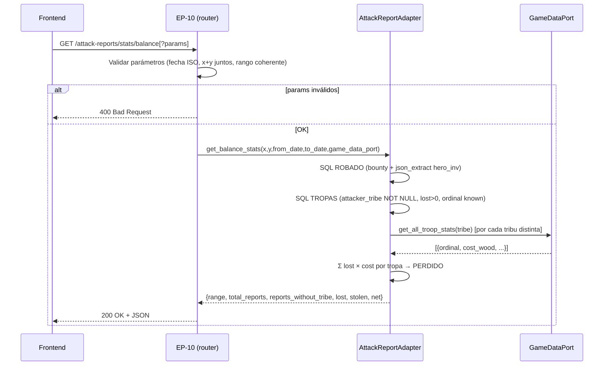

# Balance global PERDIDOS vs ROBADOS en reportes de oasis

> **SPEC DE CAMBIO sobre `bd-ataques-oasis` (estado: implemented) y
> `bd-ataques-oasis-fix-hora-balance` (estado: implemented).**
> Este documento describe SOLO el delta: columna nueva en esquema, migración
> retroactiva, use case extraído al core, método nuevo en el adapter y EP-10 nuevo.
> Lo no mencionado aquí permanece igual al spec base.
>
> **APIs: fallback manual** — la herramienta Agent no estuvo disponible; el contrato
> se revisó contra los criterios C1-C7 del historial de este proyecto (ver §16).
> `apis_validadas_por_desarrollador_apis: false`.

---

## 1. Objetivo de negocio

Mostrar en la pestaña Estadísticas un resumen global de **recursos PERDIDOS frente
a ROBADOS**, con filtro opcional por rango de fecha/hora hasta el segundo y por
oasis destino, para que el usuario pueda comparar la rentabilidad de sus ataques
en distintos periodos (días mejores vs. peores, un oasis en concreto vs. el total).

Definiciones de negocio:

- **PERDIDO** = valor en recursos de las tropas atacantes muertas =
  Σ por reporte de (tropa perdida `lost` × coste unitario de entrenamiento
  `{wood,clay,iron,crop}` de esa tropa, por tribu + ordinal, del catálogo de
  datos de juego).
- **ROBADO** = botín de animales (`bounty_wood/clay/iron/crop`) + inventario
  del héroe (`hero_inventory_json` → campos wood/clay/iron/crop).
- **NET** = `stolen.total.total − lost.total`.

---

## 2. Actores y permisos

Igual que el spec base: usuario único local, sin autenticación multi-tenant.
Solo el backend calcula; el frontend consume el endpoint.

---

## 3. Alcance

### Dentro del alcance

- Añadir columna `attacker_tribe TEXT` (nullable) a `attack_reports`.
- Migración retroactiva: re-parsear `raw_text` de reportes existentes para poblar
  `attacker_tribe` donde sea resoluble.
- Extraer `_compute_attacker_cost_loss` del router al core como use case puro.
- Nuevo método `get_balance_stats` en `AttackReportPort` y su implementación
  en `AttackReportSqliteAdapter`.
- Endpoint EP-10 `GET /attack-reports/stats/balance` con filtros opcionales.

### Fuera del alcance

- Modificar EP-07 `GET /attack-reports/stats/bounty` (tiene consumidores en
  frontend, no se toca).
- Cálculo de PERDIDO para reportes con tribu no resoluble (se excluyen del
  cómputo de PERDIDO y se cuentan en `reports_without_tribe`).
- Exportación o descarga del resultado.
- Cambiar el frontend más allá de añadir la llamada a EP-10 y renderizar el
  resultado en `StatsTab`.

---

## 4. Reglas de negocio

### RN-B01 — Cómputo de PERDIDO requiere tribu conocida
Solo las tropas de reportes cuya `attacker_tribe` esté rellena en BD contribuyen
al cómputo de PERDIDO. Reportes con `attacker_tribe IS NULL` se suman a
`reports_without_tribe` pero no al cómputo de `lost`.

**Justificación:** sin tribu, `troop_ordinal` es ambiguo entre tribus y el coste
unitario de la tropa no se puede determinar con certeza (véase RN-03 del spec
base: nombres de tropas son ambiguos cross-tribe).

### RN-B02 — Coste unitario por tribu + ordinal
El coste de una tropa se obtiene de `GameDataPort.get_all_troop_stats(tribe)`,
que devuelve `{ordinal, cost_wood, cost_clay, cost_iron, cost_crop}`. Si una
tropa tiene `troop_ordinal IS NULL` (nombre ambiguo), no contribuye al cómputo;
no es error.

### RN-B03 — ROBADO = bounty + hero_inventory
El total robado en cada reporte es:
```
robado_wood  = bounty_wood  + (hero_inventory.wood  ?? 0)
robado_clay  = bounty_clay  + (hero_inventory.clay  ?? 0)
robado_iron  = bounty_iron  + (hero_inventory.iron  ?? 0)
robado_crop  = bounty_crop  + (hero_inventory.crop  ?? 0)
```
Reportes con `hero_inventory_json IS NULL` aportan solo el botín de animales.

### RN-B04 — Filtro de fecha sobre `attacked_at`
`attacked_at` es un string ISO 8601 naive (sin zona horaria), guardado verbatim
del reporte Travian. La comparación es lexicográfica (`>=`, `<=`) sobre ese campo
TEXT de SQLite — correcto hasta segundos dado el formato `YYYY-MM-DDTHH:MM:SS`.

### RN-B05 — Filtro de coords (x + y)
Cuando se pasan x e y, el balance se acota al oasis destino `(coord_x_dest,
coord_y_dest) = (x, y)`. Ambos o ninguno (igual que EP-07 y EP-03).

### RN-B06 — Respuesta vacía: todo 0, net 0
Si no hay reportes en el rango (o no hay reportes en absoluto), la respuesta es
200 con todos los campos de recursos en 0 y `net = 0`. Nunca 404.

### RN-B07 — `attacker_tribe` persistida, no re-parseada on-the-fly
La tribu se persiste en la columna nueva para evitar re-parsear `raw_text` de
todos los reportes en cada petición de stats. Con ~255 reportes actuales el
impacto sería mínimo, pero la columna añade claridad semántica y permite
consultas SQL directas sin re-parsing.

**Alternativa descartada:** re-parsear en cada request — peor en escala y
rompe SRP (el adapter de BD haría parsing).

**Alternativa descartada:** lazy-fill solo al guardar nuevos — deja los ~255
reportes existentes sin tribu y el PERDIDO global sale incorrecto hasta que el
usuario rehaga todos sus reportes.

---

## 5. Flujo principal y flujos alternativos

### Flujo principal (con datos)

```
GET /attack-reports/stats/balance[?from_date=...&to_date=...&x=...&y=...]
    ↓ validar parámetros (fecha ISO, coords ambas o ninguna, rango coherente)
    ↓ get_balance_stats(from_date, to_date, x, y) → adapter SQLite
    ↓ [adapter] SELECT bounty + json_extract hero_inventory → ROBADO
    ↓ [adapter] SELECT tropas con tribu conocida → compute_attacker_cost_loss → PERDIDO
    ← 200 OK + JSON con lost/stolen/net
```

### Flujo alternativo A — Sin reportes en rango

```
GET /attack-reports/stats/balance?from_date=2030-01-01T00:00:00
    ← 200 OK { total_reports: 0, reports_without_tribe: 0,
               lost: {wood:0,...,total:0}, stolen: {...}, net: 0 }
```

### Flujo alternativo B — from_date > to_date

```
GET /attack-reports/stats/balance?from_date=2026-06-01&to_date=2026-05-01
    ← 400 Bad Request { detail: "El parámetro 'from_date' no puede ser posterior a 'to_date'." }
```

### Flujo alternativo C — Fecha inválida

```
GET /attack-reports/stats/balance?from_date=no-es-fecha
    ← 400 Bad Request { detail: "El parámetro 'from_date' no es una fecha ISO 8601 válida." }
```

### Flujo alternativo D — Solo x sin y (o solo y sin x)

```
GET /attack-reports/stats/balance?x=10
    ← 400 Bad Request { detail: "Los parámetros 'x' e 'y' deben usarse juntos." }
```

### Flujo alternativo E — Coords fuera de rango

```
GET /attack-reports/stats/balance?x=999&y=0
    ← 422 Unprocessable Entity (FastAPI — ge/le no cumplido)
```

---

## 6. Edge cases

| # | Situación | Tratamiento esperado |
|---|---|---|
| EC-01 | Sin reportes en rango o BD vacía | 200, todo 0, net 0, `reports_without_tribe: 0` |
| EC-02 | Reporte con `attacker_tribe IS NULL` (nombre ambiguo) | Suma en `reports_without_tribe`; no aporta a `lost` |
| EC-03 | Tropa con `troop_ordinal IS NULL` dentro de reporte con tribu conocida | Esa tropa no aporta a `lost`; las demás del mismo reporte sí |
| EC-04 | Reporte de derrota (animales `present/killed/survived = null`) | `bounty = 0/0/0/0` + `hero_inventory` si lo hay → aporta a `stolen`. `lost` = coste de tropas perdidas (que sí se conocen: `lost > 0`) |
| EC-05 | `hero_inventory_json IS NULL` | Ese reporte aporta 0 al bloque `hero_inventory` de stolen; sigue contando en `bounty` |
| EC-06 | `hero_inventory_json` con clave faltante (p.ej. sin `crop`) | Tratar como 0 — `json_extract(col, '$.crop') ?? 0` |
| EC-07 | Coste 0 en datos de juego (tropa gratuita — no existe, pero por robustez) | `0 × lost = 0`, sin error |
| EC-08 | Migración retroactiva con raw_text que no parsea (reporte corrupto antiguo) | Dejar `attacker_tribe = NULL`; loguear warning; no abortar migración |
| EC-09 | `from_date` = `to_date` (exactamente el mismo segundo) | 200 — range de un segundo, reportes con `attacked_at = ese_valor` incluidos |
| EC-10 | x e y válidos pero sin reportes para ese oasis | 200, todo 0 (igual que EC-01) |
| EC-11 | `net` negativo (perdiste más de lo que robaste) | Devolver como entero negativo, sin transformar |

---

## 7. Modelo de datos / cambios de esquema

### 7.1 — Nueva columna en `attack_reports`

```sql
ALTER TABLE attack_reports
    ADD COLUMN attacker_tribe TEXT;
-- Nullable: NULL = tribu no resoluble o reporte pre-migración sin re-parsear.
-- Valores posibles: 'gauls', 'romans', 'teutons', 'huns', 'egyptians', NULL.
-- (Mismos valores que produce _resolve_attacker_tribe en el parser.)
```

El DDL `_CREATE_ATTACK_REPORTS` en `attack_report_sqlite_adapter.py` también debe
actualizarse para que nuevas instalaciones incluyan la columna desde el principio.
La estrategia de migración vs. DDL inicial se detalla en §9.3.

### 7.2 — Índice recomendado (opcional, rendimiento)

```sql
CREATE INDEX IF NOT EXISTS idx_attack_reports_tribe_attacked_at
    ON attack_reports (attacker_tribe, attacked_at);
```

Con ~255 registros actuales el índice no es crítico, pero es barato y acelera
los filtros combinados `WHERE attacker_tribe IS NOT NULL AND attacked_at BETWEEN`.

### 7.3 — Sin cambio en tablas hijas

`attack_report_attacker_troops` y `attack_report_animals` no cambian.

---

## 8. Contratos de API / interfaces

> Revisado manualmente contra criterios C1-C7 del historial del proyecto
> (Agent no disponible). Marcado `apis_validadas_por_desarrollador_apis: false`.

### EP-10 — `GET /attack-reports/stats/balance`

**Declaración en el router:** ANTES de `/{id}`, en la posición entre `stats/global`
(EP-09) y `stats/oasis` (EP-06). Orden final:
```
stats/bounty  (EP-07)
stats/global  (EP-09)
stats/balance (EP-10)  ← nueva posición
stats/oasis   (EP-06)
oasis         (EP-08)
{id}          (EP-04)
```

**Método y ruta:** `GET /attack-reports/stats/balance`

**Query parameters (todos opcionales):**

| Parámetro | Tipo | Restricción | Descripción |
|---|---|---|---|
| `x` | `int \| None` | `ge=-400, le=400` | Coord X del oasis. Requiere `y`. |
| `y` | `int \| None` | `ge=-400, le=400` | Coord Y del oasis. Requiere `x`. |
| `from_date` | `str \| None` | ISO 8601 válido | Inicio del rango (inclusivo). Comparación lexicográfica con `attacked_at`. |
| `to_date` | `str \| None` | ISO 8601 válido | Fin del rango (inclusivo). Comparación lexicográfica con `attacked_at`. |

**Auth / cabeceras requeridas:** ninguna (igual que el resto del router;
`Accept-Language` no obligatorio — datos numéricos).

**Código de éxito:** `200 OK`

**Response schema (200):**

```json
{
  "range": {
    "from": "2026-05-01T00:00:00 | null",
    "to":   "2026-06-01T23:59:59 | null"
  },
  "total_reports": 255,
  "reports_without_tribe": 12,
  "lost": {
    "wood":  1500,
    "clay":  800,
    "iron":  2000,
    "crop":  600,
    "total": 4900
  },
  "stolen": {
    "bounty": {
      "wood":  3000,
      "clay":  2000,
      "iron":  1500,
      "crop":  500,
      "total": 7000
    },
    "hero_inventory": {
      "wood":  240,
      "clay":  240,
      "iron":  240,
      "crop":  240,
      "total": 960
    },
    "total": {
      "wood":  3240,
      "clay":  2240,
      "iron":  1740,
      "crop":  740,
      "total": 7960
    }
  },
  "net": 3060
}
```

Tipos de campos:
- `range.from`, `range.to`: `string | null` (ISO 8601 naive, verbatim del parámetro recibido).
- Todos los campos de recursos (`wood`, `clay`, `iron`, `crop`, `total`): `integer` (≥ 0, excepto `net` que puede ser negativo).
- `total_reports`, `reports_without_tribe`: `integer` (≥ 0).
- `net`: `integer` (puede ser negativo si `lost > stolen`).

**Errores:**

| Código | Condición | `detail` de ejemplo |
|---|---|---|
| 400 | `from_date` no es ISO 8601 válido | `"El parámetro 'from_date' no es una fecha ISO 8601 válida."` |
| 400 | `to_date` no es ISO 8601 válido | `"El parámetro 'to_date' no es una fecha ISO 8601 válida."` |
| 400 | `from_date > to_date` | `"El parámetro 'from_date' no puede ser posterior a 'to_date'."` |
| 400 | Solo `x` sin `y` o solo `y` sin `x` | `"Los parámetros 'x' e 'y' deben usarse juntos."` |
| 422 | `x` o `y` fuera de `[-400, 400]` | (FastAPI automático por `ge/le`) |

### Nuevo método en `AttackReportPort`

```python
@abstractmethod
async def get_balance_stats(
    self,
    x: int | None = None,
    y: int | None = None,
    from_date: str | None = None,
    to_date: str | None = None,
) -> dict:
    """
    Cómputo balance PERDIDOS vs ROBADOS.

    Devuelve:
    {
        range:                  {from: str|None, to: str|None},
        total_reports:          int,
        reports_without_tribe:  int,
        lost:                   {wood, clay, iron, crop, total},
        stolen: {
            bounty:             {wood, clay, iron, crop, total},
            hero_inventory:     {wood, clay, iron, crop, total},
            total:              {wood, clay, iron, crop, total},
        },
        net: int,
    }
    200 con todo 0 si no hay reportes en el rango.
    Ver spec docs/specs/bd-ataques-oasis-balance-perdidos-robados.md §8.
    """
```

---

## 9. Flujo lógico paso a paso

### 9.1 — Handler EP-10 (adapter API)

```python
@router.get("/attack-reports/stats/balance", status_code=200)
async def get_balance_stats(
    request: Request,
    x: int | None = Query(default=None, ge=-400, le=400,
        description="Coord X del oasis (requiere y)"),
    y: int | None = Query(default=None, ge=-400, le=400,
        description="Coord Y del oasis (requiere x)"),
    from_date: str | None = Query(default=None,
        description="Inicio del rango (ISO 8601, inclusivo)"),
    to_date: str | None = Query(default=None,
        description="Fin del rango (ISO 8601, inclusivo)"),
) -> dict:

    # Validación 1: x e y juntos o ninguno
    if (x is None) != (y is None):
        raise HTTPException(400, "Los parámetros 'x' e 'y' deben usarse juntos.")

    # Validación 2: fechas ISO 8601 válidas (mismo patrón que EP-03)
    for param_name, param_val in [("from_date", from_date), ("to_date", to_date)]:
        if param_val is not None:
            try:
                datetime.fromisoformat(param_val)
            except ValueError:
                raise HTTPException(
                    400,
                    f"El parámetro '{param_name}' no es una fecha ISO 8601 válida."
                )

    # Validación 3: rango coherente
    if from_date and to_date and from_date > to_date:
        raise HTTPException(
            400,
            "El parámetro 'from_date' no puede ser posterior a 'to_date'."
        )

    port = request.app.state.attack_report_port
    game_data_port = getattr(request.app.state, "game_data_port", None)
    return await port.get_balance_stats(
        x=x, y=y, from_date=from_date, to_date=to_date,
        game_data_port=game_data_port,
    )
```

> Nota de diseño: `game_data_port` se pasa como argumento al método del adapter
> (en lugar de inyectarse en el constructor) para mantener el adapter de BD
> desacoplado de `GameDataPort`. Alternativa (inyectar en constructor): también
> válida pero añade dependencia a un puerto que solo usa un método. Se elige
> paso-por-argumento para coherencia con el patrón existente en el router
> (véase `_compute_attacker_cost_loss`).

### 9.2 — Use case `compute_attacker_cost_loss` (extraído al core)

**Ubicación nueva:** `core/use_cases/attack_report_balance.py`

```python
async def compute_attacker_cost_loss(
    troops: list[AttackerTroopEntry],
    tribe_str: str | None,
    game_data_port,           # GameDataPort | None
) -> dict:
    """
    Calcula el coste en recursos de tropas atacantes perdidas.

    Requiere tribu conocida y datos de juego. Devuelve {wood,clay,iron,crop,total}.
    Devuelve todos 0 si tribe_str es None, game_data_port es None, o no hay tropas
    con lost > 0 y ordinal conocido.
    """
    if not tribe_str or game_data_port is None:
        return {"wood": 0, "clay": 0, "iron": 0, "crop": 0, "total": 0}
    try:
        tribe = Tribe(tribe_str)
    except ValueError:
        return {"wood": 0, "clay": 0, "iron": 0, "crop": 0, "total": 0}

    stats = await game_data_port.get_all_troop_stats(tribe)
    cost_by_ordinal = {s["ordinal"]: s for s in stats}

    wood = clay = iron = crop = 0
    for t in troops:
        if not t.lost or t.troop_ordinal is None:
            continue
        s = cost_by_ordinal.get(t.troop_ordinal)
        if not s:
            continue
        wood += t.lost * (s.get("cost_wood") or 0)
        clay += t.lost * (s.get("cost_clay") or 0)
        iron += t.lost * (s.get("cost_iron") or 0)
        crop += t.lost * (s.get("cost_crop") or 0)

    total = wood + clay + iron + crop
    return {"wood": wood, "clay": clay, "iron": iron, "crop": crop, "total": total}
```

El router mantiene `_compute_attacker_cost_loss` como wrapper que llama a este
use case (para no romper EP-01 — backward compatible).

### 9.3 — Método `get_balance_stats` en adapter SQLite

```python
async def get_balance_stats(
    self,
    x: int | None = None,
    y: int | None = None,
    from_date: str | None = None,
    to_date: str | None = None,
    game_data_port=None,
) -> dict:

    # ── Construir WHERE dinámico (mismo patrón que list_reports) ─────────────
    where_parts = []
    params = []
    if x is not None:
        where_parts.append("r.coord_x_dest = ? AND r.coord_y_dest = ?")
        params.extend([x, y])
    if from_date is not None:
        where_parts.append("r.attacked_at >= ?")
        params.append(from_date)
    if to_date is not None:
        where_parts.append("r.attacked_at <= ?")
        params.append(to_date)
    where = ("WHERE " + " AND ".join(where_parts)) if where_parts else ""

    # ── Paso 1: ROBADO (bounty + hero_inventory) — una sola query SQL ────────
    stolen_sql = f"""
        SELECT
            COUNT(*)                                          AS total_reports,
            COALESCE(SUM(r.bounty_wood),  0)                  AS b_wood,
            COALESCE(SUM(r.bounty_clay),  0)                  AS b_clay,
            COALESCE(SUM(r.bounty_iron),  0)                  AS b_iron,
            COALESCE(SUM(r.bounty_crop),  0)                  AS b_crop,
            COALESCE(SUM(COALESCE(json_extract(r.hero_inventory_json,'$.wood'), 0)), 0)  AS h_wood,
            COALESCE(SUM(COALESCE(json_extract(r.hero_inventory_json,'$.clay'), 0)), 0)  AS h_clay,
            COALESCE(SUM(COALESCE(json_extract(r.hero_inventory_json,'$.iron'), 0)), 0)  AS h_iron,
            COALESCE(SUM(COALESCE(json_extract(r.hero_inventory_json,'$.crop'), 0)), 0)  AS h_crop,
            COUNT(CASE WHEN r.attacker_tribe IS NULL THEN 1 END) AS without_tribe
        FROM attack_reports r
        {where}
    """
    async with self._conn.execute(stolen_sql, params) as cursor:
        row = await cursor.fetchone()

    total_reports    = row["total_reports"]    if row else 0
    without_tribe    = row["without_tribe"]    if row else 0
    b_wood  = row["b_wood"]   if row else 0
    b_clay  = row["b_clay"]   if row else 0
    b_iron  = row["b_iron"]   if row else 0
    b_crop  = row["b_crop"]   if row else 0
    h_wood  = row["h_wood"]   if row else 0
    h_clay  = row["h_clay"]   if row else 0
    h_iron  = row["h_iron"]   if row else 0
    h_crop  = row["h_crop"]   if row else 0

    # ── Paso 2: PERDIDO — recuperar tropas con tribu conocida ─────────────────
    # Se traen solo los reportes con attacker_tribe NOT NULL del rango.
    troops_sql = f"""
        SELECT
            r.id           AS report_id,
            r.attacker_tribe,
            t.troop_ordinal,
            t.lost
        FROM attack_reports r
        JOIN attack_report_attacker_troops t ON t.report_id = r.id
        {where.replace('r.', 'r.')}
        {"AND" if where else "WHERE"} r.attacker_tribe IS NOT NULL
            AND t.lost > 0
            AND t.troop_ordinal IS NOT NULL
    """
    # NOTA: si where ya tiene "WHERE ...", el AND anterior es correcto.
    # Si where es vacío, usamos "WHERE r.attacker_tribe IS NOT NULL ...".
    # La lógica real en el implementador debe construir esto con cuidado
    # (ver §14 paso 6 para la implementación exacta con where_parts extendido).

    async with self._conn.execute(troops_sql, params) as cursor:
        troop_rows = await cursor.fetchall()

    # Agrupar por (report_id, tribe) y sumar usando el use case del core
    lost_wood = lost_clay = lost_iron = lost_crop = 0
    if game_data_port and troop_rows:
        # Agrupar filas por tribu para una sola llamada a get_all_troop_stats por tribu
        from collections import defaultdict
        by_tribe: dict[str, list] = defaultdict(list)
        for row in troop_rows:
            by_tribe[row["attacker_tribe"]].append(row)

        for tribe_str, rows in by_tribe.items():
            try:
                tribe = Tribe(tribe_str)
            except ValueError:
                continue
            stats = await game_data_port.get_all_troop_stats(tribe)
            cost_by_ord = {s["ordinal"]: s for s in stats}
            for r in rows:
                s = cost_by_ord.get(r["troop_ordinal"])
                if not s:
                    continue
                lost_wood += r["lost"] * (s.get("cost_wood") or 0)
                lost_clay += r["lost"] * (s.get("cost_clay") or 0)
                lost_iron += r["lost"] * (s.get("cost_iron") or 0)
                lost_crop += r["lost"] * (s.get("cost_crop") or 0)

    lost_total   = lost_wood + lost_clay + lost_iron + lost_crop
    bounty_total = b_wood + b_clay + b_iron + b_crop
    hi_total     = h_wood + h_clay + h_iron + h_crop
    stolen_total = bounty_total + hi_total
    s_wood = b_wood + h_wood
    s_clay = b_clay + h_clay
    s_iron = b_iron + h_iron
    s_crop = b_crop + h_crop

    return {
        "range": {"from": from_date, "to": to_date},
        "total_reports": total_reports,
        "reports_without_tribe": without_tribe,
        "lost": {
            "wood": lost_wood, "clay": lost_clay,
            "iron": lost_iron, "crop": lost_crop,
            "total": lost_total,
        },
        "stolen": {
            "bounty": {
                "wood": b_wood, "clay": b_clay,
                "iron": b_iron, "crop": b_crop,
                "total": bounty_total,
            },
            "hero_inventory": {
                "wood": h_wood, "clay": h_clay,
                "iron": h_iron, "crop": h_crop,
                "total": hi_total,
            },
            "total": {
                "wood": s_wood, "clay": s_clay,
                "iron": s_iron, "crop": s_crop,
                "total": stolen_total,
            },
        },
        "net": stolen_total - lost_total,
    }
```

### 9.4 — Migración retroactiva

```python
async def migrate_add_attacker_tribe(conn: aiosqlite.Connection) -> None:
    """
    Migración M-01: añade columna attacker_tribe y la rellena re-parseando raw_text.

    Estrategia:
    1. ADD COLUMN attacker_tribe TEXT (idempotente: capturar OperationalError si ya existe).
    2. Recuperar todos los reportes con attacker_tribe IS NULL.
    3. Para cada uno: parse_attack_report(raw_text) → _resolve_attacker_tribe → UPDATE.
    4. Si el parse falla: loguear warning + dejar NULL (no abortar).
    """
    # Paso 1: ADD COLUMN (idempotente)
    try:
        await conn.execute(
            "ALTER TABLE attack_reports ADD COLUMN attacker_tribe TEXT"
        )
        await conn.commit()
    except aiosqlite.OperationalError:
        pass  # columna ya existe — migración ya corrió

    # Paso 2: poblar retroactivamente
    async with conn.execute(
        "SELECT id, raw_text FROM attack_reports WHERE attacker_tribe IS NULL"
    ) as cursor:
        rows = await cursor.fetchall()

    updated = skipped = 0
    for row in rows:
        try:
            preview = parse_attack_report(row["raw_text"], db_port=None)
            tribe = getattr(preview, "attacker_tribe", None)
        except Exception as exc:
            logger.warning("M-01: no se pudo re-parsear reporte id=%s: %s", row["id"], exc)
            skipped += 1
            continue
        if tribe:
            await conn.execute(
                "UPDATE attack_reports SET attacker_tribe = ? WHERE id = ?",
                (tribe, row["id"]),
            )
            updated += 1

    await conn.commit()
    logger.info("M-01 attacker_tribe: %d actualizados, %d sin tribu resoluble.", updated, skipped)
```

**Cuándo ejecutar:** en `AttackReportSqliteAdapter.ensure_tables()`, tras crear
las tablas. `ensure_tables` ya se llama en el startup de la app (lifespan FastAPI),
por lo que la migración corre una vez al arranque. El `try/except OperationalError`
garantiza idempotencia.

### 9.5 — Diagrama de flujo



---

## 10. Validaciones y reglas

| Validación | Dónde | Detalle |
|---|---|---|
| `x` e `y` juntos o ninguno | Router EP-10 | 400 si solo uno presente |
| `x`, `y` en `[-400, 400]` | FastAPI `ge/le` | 422 automático |
| `from_date` ISO 8601 | Router EP-10 | `datetime.fromisoformat()` → 400 si falla |
| `to_date` ISO 8601 | Router EP-10 | ídem |
| `from_date <= to_date` (si ambos) | Router EP-10 | Comparación string lexicográfica → 400 |
| Tribu NULL no contribuye a PERDIDO | Adapter `get_balance_stats` | Solo rows con `attacker_tribe IS NOT NULL` |
| Tropa con `troop_ordinal IS NULL` no contribuye | Adapter SQL | `AND t.troop_ordinal IS NOT NULL` en el WHERE |
| `hero_inventory_json` keys faltantes | Adapter SQL | `COALESCE(json_extract(col,'$.key'), 0)` |
| Migración idempotente | `ensure_tables` | `try/except OperationalError` en ADD COLUMN |

---

## 11. Seguridad, rendimiento y concurrencia

**Seguridad:** single-tenant local; sin autenticación. Sin riesgo de inyección SQL
(todos los parámetros pasados como `?` vinculados, nunca interpolados en el string).

**Rendimiento:**
- `json_extract` sobre `hero_inventory_json` es O(n) pero eficiente para ~255 filas.
  Con volúmenes mayores (> 10.000 reportes) considerar denormalizar las 4 columnas
  del hero_inventory, pero eso excede el scope de este spec.
- La query de ROBADO es una sola SELECT con SUM agregados — coste constante.
- La query de PERDIDO trae solo filas con `lost > 0` y `troop_ordinal IS NOT NULL`,
  minimizando el volumen de filas en Python.
- `get_all_troop_stats` se llama una vez por tribu distinta (no por reporte),
  reduciendo llamadas al GameDataPort a máximo 5 (una por tribu jugable).

**Concurrencia:** SQLite con WAL. Las queries son solo lectura (SELECT), sin
conflictos con writes concurrentes. La migración escribe en startup antes de que
los handlers acepten peticiones.

---

## 12. Plan de pruebas

### 12.1 — Caso de aceptación numérico (CA-B01, obligatorio)

**Fixture:** reporte de tropas galas perdidas + botín + hero_inventory.

```
Tropa 1: Theutates Thunder (ordinal 5, gauls)
  cost_wood=0, cost_clay=0, cost_iron=130, cost_crop=80  (del catálogo kirilloid)
  lost=2 → cost_iron×2=260, cost_crop×2=160
Tropa 2: Swordsman (ordinal 4, gauls)
  cost_wood=140, cost_clay=130, cost_iron=185, cost_crop=40
  lost=2 → wood×2=280, clay×2=260, iron×2=370, crop×2=80

Totales PERDIDO esperados:
  wood=280, clay=260, iron=630, crop=240, total=1410

Botín del reporte: wood=0, clay=0, iron=0, crop=0
Hero inventory: wood=240, clay=240, iron=240, crop=240, total=960

Totales ROBADO esperados:
  bounty:         {wood:0,  clay:0,  iron:0,  crop:0,  total:0}
  hero_inventory: {wood:240, clay:240, iron:240, crop:240, total:960}
  total:          {wood:240, clay:240, iron:240, crop:240, total:960}

NET esperado: 960 - 1410 = -450
```

> Este fixture usa los datos del reporte de referencia CA-D01 del spec
> `bd-ataques-oasis.md §17` (oasis (-59|25), gauls, Swordsman×2 + Theutates Thunder×2).
> Verificar `cost_wood/clay/iron/crop` en `seeds/game_data/troop_stats.json`
> antes de hardcodear los valores esperados en el test.

### 12.2 — Casos adicionales

| ID | Descripción | Resultado esperado |
|---|---|---|
| CA-B02 | Sin reportes en BD | 200, todo 0, net 0 |
| CA-B03 | Reporte con `attacker_tribe = NULL` | `reports_without_tribe = 1`, `lost.total = 0` |
| CA-B04 | Filtro `from_date` / `to_date` que deja fuera todos los reportes | 200, todo 0 |
| CA-B05 | Filtro por coords (x, y) de oasis con reportes | Solo suma reportes de ese oasis |
| CA-B06 | `from_date > to_date` | 400 |
| CA-B07 | Solo `x` sin `y` | 400 |
| CA-B08 | `from_date` inválido (`"hoy"`) | 400 |
| CA-B09 | `from_date = to_date` (mismo segundo) | 200, incluye ese segundo |
| CA-B10 | Reporte con bounty=0 y hero_inventory no nulo | `stolen.bounty.total=0`, `stolen.hero_inventory.total>0` |
| CA-B11 | Migración retroactiva: reportes pre-migración con tribu resoluble | `attacker_tribe` poblada tras `ensure_tables()` |
| CA-B12 | Migración idempotente: llamar `ensure_tables()` dos veces | Sin error, sin duplicación |

### 12.3 — Tests de unidad del use case

- `compute_attacker_cost_loss` con tribu None → devuelve todo 0.
- `compute_attacker_cost_loss` con tropa `troop_ordinal=None` → tropa ignorada.
- `compute_attacker_cost_loss` con game_data_port=None → devuelve todo 0.

---

## 13. Riesgos y trade-offs

| Riesgo / decisión | Razonamiento |
|---|---|
| **Persistir tribu vs. re-parsear on-the-fly** | Re-parsear es simple pero penaliza cada petición de stats. Con 255 reportes hoy el impacto es mínimo, pero la columna es semánticamente correcta, habilita queries SQL directas y es el camino natural si se añaden más stats que dependan de la tribu. Coste: migración y cambio en `save_report`. |
| **`json_extract` vs. denormalizar hero_inventory** | `json_extract` mantiene el esquema actual sin cambios adicionales. Con <10.000 filas el coste de SQLite JSON1 es despreciable. Denormalizar añadiría 4 columnas más y una migración más compleja. La recomendación es mantener `json_extract` hasta que el profiling muestre bottleneck real. |
| **Pasar `game_data_port` como argumento al adapter vs. inyectar en constructor** | Coherencia con el patrón existente del router (`_compute_attacker_cost_loss` recibe el port). Evita que el adapter de BD dependa en construcción de un puerto de datos de juego. Si en el futuro hay más usos de `GameDataPort` en el adapter, reconsiderar inyección en constructor. |
| **`reports_without_tribe` siempre en la respuesta** | Informa al frontend de la completitud del cómputo de PERDIDO. Si el número es alto, el usuario sabe que el PERDIDO está subestimado. Sin esto, el dato sería opaco. |
| **net puede ser negativo** | Correcto semánticamente: si perdiste más de lo que robaste, el negocio fue malo. El frontend debe manejar enteros negativos. |

---

## 14. Pasos de implementación ordenados

1. **Actualizar DDL base** en `_CREATE_ATTACK_REPORTS` (en
   `adapters/db/attack_report_sqlite_adapter.py`): añadir la línea
   `attacker_tribe TEXT` dentro del DDL de la tabla. Esto aplica a instalaciones
   nuevas; los existentes van por la migración.

2. **Crear índice opcional** en el DDL: añadir
   `_CREATE_IDX_TRIBE_ATTACKED_AT` con el SQL de §7.2 y llamarlo en
   `ensure_tables()`.

3. **Actualizar `save_report`** en el adapter: añadir `attacker_tribe` a las
   columnas del INSERT, mapeado desde `getattr(preview, "attacker_tribe", None)`.

4. **Implementar migración `migrate_add_attacker_tribe`** (ver §9.4) en el adapter.

5. **Llamar la migración desde `ensure_tables()`** justo después de crear las
   tablas y los índices.

6. **Crear `core/use_cases/attack_report_balance.py`** con la función
   `compute_attacker_cost_loss` (ver §9.2). Actualizar `_compute_attacker_cost_loss`
   en el router para delegarle.
   > Nota construcción SQL en §9.3 paso 2 (query de tropas): el WHERE dinámico
   > se construye añadiendo las condiciones de tribu, lost y ordinal al mismo
   > `where_parts` usado para los filtros de fecha/coords, para garantizar que
   > el `WHERE` / `AND` se genere correctamente sin ambigüedad. El pseudocódigo
   > del §9.3 es orientativo; el implementador debe usar `where_parts` extendido.

7. **Añadir `get_balance_stats`** a `AttackReportPort` (puerto abstracto en
   `core/ports/attack_report_port.py`).

8. **Implementar `get_balance_stats`** en `AttackReportSqliteAdapter` (ver §9.3).

9. **Añadir EP-10** al router `adapters/api/routes/attack_reports.py`, en la
   posición correcta (después de `stats/global`, antes de `stats/oasis`).
   Actualizar el comentario de cabecera del router con la nueva ruta.

10. **Tests** (archivo existente `tests/test_attack_reports_api.py`):
    - CA-B01 (numérico con fixture real de costes gaulos).
    - CA-B02 a CA-B12 según tabla §12.2.
    - Tests unitarios del use case `compute_attacker_cost_loss` (§12.3).

---

## 15. Criterios de aceptación

- [ ] **CA-B01** (numérico): dado el reporte de referencia CA-D01 (gauls,
  Swordsman×2 + Theutates Thunder×2, bounty=0/0/0/0, hero_inventory=240/240/240/240),
  `GET /attack-reports/stats/balance` devuelve exactamente:
  `lost.total = 1410` (verificar costes en troop_stats.json antes),
  `stolen.hero_inventory.total = 960`, `stolen.bounty.total = 0`,
  `net = 960 - 1410 = -450`.
  *(Si los costes de kirilloid difieren, actualizar este criterio con los valores reales.)*
- [ ] **CA-B02**: BD vacía → 200, todo 0, net 0.
- [ ] **CA-B03**: reporte con `attacker_tribe = NULL` → `reports_without_tribe ≥ 1`,
  `lost.total = 0`.
- [ ] **CA-B06**: `from_date > to_date` → 400 con `detail` legible.
- [ ] **CA-B07**: solo `x` sin `y` → 400.
- [ ] **CA-B08**: `from_date` no ISO 8601 → 400.
- [ ] Migración idempotente: dos arranques consecutivos no producen error ni
  duplicación de datos.
- [ ] `save_report` de un reporte nuevo persiste `attacker_tribe` correctamente
  (verificar en BD que la columna no es NULL para reportes con tribu resoluble).
- [ ] EP-10 declarado en el router ANTES de `stats/oasis` y de `/{id}`.
- [ ] `get_balance_stats` en `AttackReportPort` (abstracto) y en
  `AttackReportSqliteAdapter` (concreto).
- [ ] `compute_attacker_cost_loss` vive en `core/use_cases/attack_report_balance.py`
  (no solo en el router).

---

## 16. Trazabilidad

| Decisión técnica | Origen |
|---|---|
| Columna `attacker_tribe` nullable en `attack_reports` | RN-B01 (cómputo PERDIDO requiere tribu); decisión de diseño Opción A acordada con el usuario |
| Migración retroactiva en `ensure_tables()` | EC-08 (reportes existentes); RN-B07 (evitar re-parseo on-the-fly) |
| `json_extract` para hero_inventory (no denormalización) | §13 trade-off; EC-05/EC-06 |
| `compute_attacker_cost_loss` extraído al core | Palantir: lógica ya en router; mover al core respeta arquitectura hexagonal |
| EP-10 nuevo (no modificar EP-07) | Decisión de diseño 2 (EP-07 tiene consumidores); §3 Fuera de alcance |
| Parámetros `x`, `y`, `from_date`, `to_date` opcionales | RN-B04, RN-B05; decisión de diseño 2 |
| Misma validación de fechas que EP-03 | REUTILIZAR patrón `datetime.fromisoformat` de `attack_reports.py:328-351` |
| `reports_without_tribe` en response | RN-B01 (EC-02); transparencia del cómputo incompleto |
| `net` puede ser negativo | EC-11; corrección semántica |
| Validación de API (fallback manual) | Agent no disponible; revisión contra C1-C7 del historial del proyecto |
| Ruta declarada antes de `/{id}` | Corrección C6 del historial (colisión FastAPI con rutas literales) |
