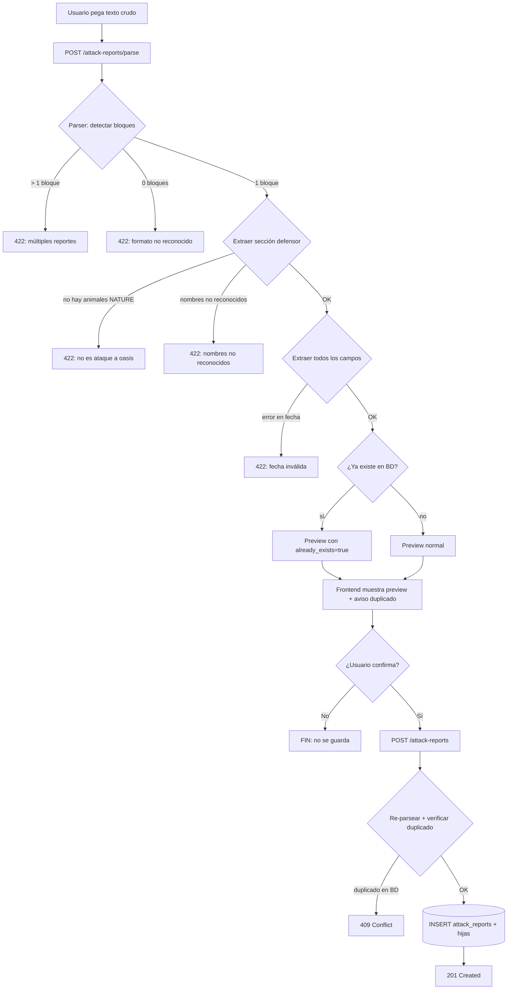

# BD de ataques a oasis por pegado de reporte

## 1. Objetivo de negocio

Permitir al usuario pegar el texto crudo de un reporte de ataque de Travian a un oasis de animales (defensor: Nature) y persistirlo en una base de datos global. El objetivo es acumular datos de ataques para extraer estadísticas sobre:

- Qué animales aparecen en cada oasis y en qué cantidad (por coordenadas destino).
- Cada cuánto tiempo se repuebla un oasis (diferencia temporal entre ataques consecutivos a las mismas coordenadas).
- Cuántos animales se han **regenerado** desde el ataque anterior al mismo oasis (delta por tipo de animal).
- Historial cronológico de ataques filtrable por oasis y fecha, con totales acumulados de botín y bajas.

Esta feature es una herramienta de análisis pasivo: el usuario alimenta la BD pegando reportes que ya tiene en Travian, sin automatización de browser.

---

## 2. Actores y permisos

| Actor | Acción |
|---|---|
| Usuario (único, local) | Pegar reportes, ver preview, confirmar guardado, borrar reportes, consultar estadísticas |
| Sistema (parser) | Parsear texto crudo, detectar idioma, mapear nombres de animales/tropas a ordinales |

No hay autenticación multi-usuario. El sistema es single-tenant (uso local, igual que el resto del proyecto).

---

## 3. Alcance

### Dentro del alcance (MVP)

- Parsing de reportes de ataque a oasis cuyo defensor es **Nature** (NATURE tribe).
- Persistencia en BD global sin asociación a cuenta/mundo.
- Flujo parse → preview → save en dos endpoints separados.
- Borrado de reportes individuales (DELETE). No edición.
- Estadísticas: aparición de animales por oasis, repoblación temporal, regeneración de animales, historial con totales.
- Autodetección de idioma del reporte por inversión del catálogo NATURE.
- Un solo reporte por pegado (si el parser detecta varios bloques, rechaza y avisa).
- Indicación de duplicado con `409 Conflict` y detalle legible (sin guardar copia).
- Página de frontend `AttackReportsPage` con entrada en sidebar.

### Fuera del alcance (MVP)

- Reportes de ataques a aldeas (defensor: tribu jugable o Natars).
- Reportes de defensa (el usuario es defensor).
- Asociación a cuenta/mundo (diseñado con campo `world_id` nullable para extensión futura, pero nunca se rellena en este MVP).
- Edición de reportes guardados.
- Estadística de rentabilidad por tropa (excluida explícitamente por el usuario).
- Exportación de datos (CSV, Excel).
- Importación masiva de múltiples reportes.
- El inventario del héroe como dato con semántica (se guarda como JSON opaco opcional).

---

## 4. Reglas de negocio

### RN-01 — Tipo de reporte aceptado
Solo reportes donde el **defensor** es `Nature`. El identificador de esto en el texto es la sección de defensor que contiene únicamente nombres de animales NATURE (Rata, Rat, Ratte, etc.). Si el parser no encuentra ningún animal NATURE en la sección de defensor, rechaza el reporte con error descriptivo.

### RN-02 — Idioma: autodetección por inversión del catálogo
El parser construye en memoria un índice invertido `name_lower → ordinal` desde `core/i18n/catalog/base/troops.json`, filtrando solo las entradas `NATURE_1..10`. Este índice tiene **215 entradas únicas** (nombres distintos en 25 idiomas), con **cero colisiones cross-language** (ningún nombre de animal mapea a dos ordinales distintos). El parser puede por tanto operar con un único índice global sin necesitar conocer el idioma a priori.

> Nota de implementación: la función de construcción del índice invertido (`build_nature_inverted_index()`) no existe aún. Se crea en `core/use_cases/attack_report_parser.py`.

### RN-03 — Nombres de tropas atacantes: requieren tribu
Los nombres de tropas atacantes son **ambiguos entre tribus** (ejemplo: "Ram" / "Ariete" / "Colono" aparecen en múltiples tribus con el mismo nombre en muchos idiomas). El reporte de Travian NO indica la tribu del atacante. Por tanto:
- El parser **no intenta resolver la tribu** de las tropas atacantes.
- Las tropas atacantes se almacenan como filas con `tribe_key = NULL` y `troop_name = <nombre tal cual aparece>` + un intento de resolución del ordinal si el nombre es unívoco.
- El frontend mostrará el nombre en bruto; el usuario conoce su tribu.
- **Alternativa rechazada**: pedir la tribu al usuario en el flujo de preview añade fricción innecesaria dado que las estadísticas de interés son sobre animales, no sobre tropas atacantes.

### RN-04 — Nombre no reconocido: rechazar, no guardar parcial
Si algún nombre en la sección de animales (defensor NATURE) no se encuentra en el índice invertido, el sistema rechaza el reporte completo con un error que lista los nombres no reconocidos. No se guarda parcialmente. El endpoint de parse devuelve 422 con `detail` descriptivo que incluye los tokens no reconocidos.

### RN-05 — Duplicados: 409, no duplicar
Clave de unicidad: `(coord_x_dest, coord_y_dest, attacked_at, origin_village_name)`. Si ya existe un reporte con esa clave, el endpoint de save devuelve `409 Conflict` con `detail` legible. No se crea una copia.

### RN-06 — Supervivientes calculados, no leídos
El reporte trae dos filas por bando: "enviadas" y "pérdidas". Los supervivientes se calculan: `supervivientes = enviadas - perdidas`. Esto aplica tanto para tropas atacantes como para animales.

### RN-07 — Botín: cuatro recursos + capacidad + inventario del héroe
El bloque de botín contiene:
1. **Botín de animales**: 4 números (wood, clay, iron, crop del drop de animales muertos) — se guarda.
2. **Capacidad**: par "N/M" donde N = capacidad usada, M = capacidad total de carga — se guarda N y M.
3. **Inventario del héroe**: 4 números adicionales (wood, clay, iron, crop añadidos al inventario) — se guarda como JSON opaco en columna `hero_inventory_json`. Es opcional: si no aparece, queda `NULL`.
4. La línea "Additional resources were added to the hero's inventory..." se ignora como dato (es solo señal de que hubo drop al inventario; la señal ya está implícita si `hero_inventory_json` no es NULL).

### RN-08 — Timestamp: parseo con offset
El reporte trae:
- Una línea de encabezado: `Server time: HH:MM:SS (UTC +HH:MM)` o `Server time: HH:MM:SS (UTC +H:MM)`.
- La fecha del ataque en formato `DD.MM.YY, HH:MM:SS` (años como 2 dígitos, `YY` = últimos 2 dígitos del año).

Reglas de parseo:
- El año se interpreta sumando 2000: `26` → `2026`. (Rango soportado: 2000-2099. Edge case: si en algún momento Travian usa años 3 dígitos, el parser fallará — documentado como limitación conocida.)
- El offset se extrae del encabezado con regex `UTC ([+-]\d{1,2}:\d{2})`.
- El timestamp se almacena en UTC derivado restando el offset: `attacked_at_utc = parse(datetime_str) - offset`.
- Si el encabezado de offset no está presente (pegado incompleto), se guarda el timestamp tal cual server-local y `utc_offset` queda `NULL`.
- La columna `attacked_at` almacena el timestamp UTC ISO 8601 (`TEXT` en SQLite). La columna `utc_offset` almacena el offset como string (ej. `+01:00`) o `NULL`.

### RN-09 — Un solo reporte por pegado
Si el parser detecta más de un bloque de reporte (más de una cabecera de fecha + coordenadas), rechaza con error descriptivo indicando cuántos bloques encontró. No guarda ninguno.

### RN-10 — Cajón global, sin cuenta ni mundo
La tabla `attack_reports` no tiene FK a `accounts` ni a `worlds`. El campo `world_id` existe como columna nullable para extensión futura pero siempre se inserta como `NULL` en este MVP.

### RN-11 — Regeneración: delta calculado, no almacenado
La regeneración de animales entre ataques consecutivos al mismo oasis es un cálculo derivado:

```
delta_regenerated(animal_ord, ataque_N) =
    animals_present(ataque_N, animal_ord)
    − animals_survived(ataque_N−1, animal_ord)
```

donde `animals_survived = animals_present - animals_killed` del ataque anterior.

"Consecutivos" = ordenados por `attacked_at` ASC para el mismo `(coord_x_dest, coord_y_dest)`. Este cálculo se realiza en la consulta SQL (window functions o subquery), no como columna persistida.

### RN-12 — Coordenadas: enteros con signo
Las coordenadas de Travian van de -400 a +400 aproximadamente. Se almacenan como `INTEGER` con signo. El parser extrae el par `(X|Y)` o `(X/-Y)` del reporte.

---

## 5. Flujo principal y flujos alternativos

### Flujo principal (reporte válido)

```
Usuario pega texto crudo del reporte
    ↓
POST /attack-reports/parse
    ↓ parser extrae todos los datos
    ↓ construye AttackReportPreview (entidad in-memory)
    ← 200 OK + JSON normalizado del preview
    ↓
Frontend muestra TravianReport (preview) + datos adicionales
    ↓
Usuario confirma "Guardar"
    ↓
POST /attack-reports
    ← 201 Created + {id, attacked_at, coord_x_dest, coord_y_dest}
```

### Flujo alternativo A — Reporte ya existente

```
POST /attack-reports
    ← 409 Conflict + {detail: "Reporte ya registrado (id: 42, atacado el 30.05.26 a las 16:28:53)"}
```

### Flujo alternativo B — Nombre de animal no reconocido

```
POST /attack-reports/parse
    ← 422 Unprocessable Entity + {detail: "Nombres de animales no reconocidos: ['Lobezno', 'Dragón']. Revisa el texto pegado."}
```

### Flujo alternativo C — Reporte no es de oasis Nature

```
POST /attack-reports/parse
    ← 422 Unprocessable Entity + {detail: "El reporte no contiene animales Nature como defensores. Solo se aceptan ataques a oasis."}
```

### Flujo alternativo D — Múltiples reportes detectados

```
POST /attack-reports/parse
    ← 422 Unprocessable Entity + {detail: "Se detectaron 3 bloques de reporte. Pega solo un reporte a la vez."}
```

### Flujo alternativo E — Formato de fecha irreconocible

```
POST /attack-reports/parse
    ← 422 Unprocessable Entity + {detail: "No se pudo parsear la fecha del reporte. Formato esperado: DD.MM.YY, HH:MM:SS"}
```

### Flujo de borrado

```
DELETE /attack-reports/{id}
    ← 204 No Content (si existía)
    ← 404 Not Found + {detail: "Reporte no encontrado"} (si no existía)
```

---

## 6. Edge cases

| ID | Caso | Tratamiento |
|---|---|---|
| EC-01 | Animal NATURE con 0 presentes | Admitido: el parser guarda `present=0, killed=0, survived=0`. Indica que el oasis estaba vacío de ese tipo. |
| EC-02 | Coordenadas negativas (ej. (-32\|-45)) | Parser con regex `\((-?\d+)\|(-?\d+)\)` o `\((-?\d+)\/(-?\d+)\)`. Guardar como INTEGER con signo. |
| EC-03 | Offset UTC faltante en el encabezado | Guardar timestamp server-local, `utc_offset = NULL`. |
| EC-04 | Año ambiguo: el formato `YY` podría ser 1926 o 2026 | Asumir 2000+YY. Documentado como limitación; si YY < 00 el parser fallará explícitamente. |
| EC-05 | Tropa atacante con 0 enviadas | Incluir en la lista (cantidad 0 es válida: el usuario puede haber enviado solo héroe). |
| EC-06 | Sin bajas del atacante | `attacker_losses` = 0 para todos los tipos. Fila "pérdidas" con todos ceros. |
| EC-07 | Sin animales sobrevivientes (todos muertos) | `animals_survived = 0`. `animals_killed = animals_present`. |
| EC-08 | Sin botín (oasis vacío o sin carga) | `bounty_wood/clay/iron/crop = 0`, `capacity_used = 0`. |
| EC-09 | Reporte de ataque con héroe pero sin tropas | Aceptado: todas las cantidades de tropas atacantes son 0 excepto el héroe (héroe no es una tropa en el catálogo; se ignora como tipo). |
| EC-10 | Texto pegado con caracteres extra (encabezado de UI de Travian, menús) | El parser ignora líneas que no encajan con ningún patrón conocido. Solo falla si no puede extraer los bloques obligatorios: fecha+coords, al menos una tropa atacante, al menos un animal Nature. |
| EC-11 | Primer ataque al oasis (sin ataque anterior) | La consulta de regeneración devuelve `null` para ese ataque: no hay ataque previo con el que calcular el delta. |
| EC-12 | Dos ataques al mismo oasis en el mismo segundo | La clave de unicidad incluye `attacked_at` con precisión de segundos. Si dos ataques tienen exactamente el mismo timestamp + coords + aldea, el segundo es rechazado como duplicado (409). Caso extremadamente improbable en la práctica. |
| EC-13 | Nombre de animal con acento/tilde/Unicode | El índice invertido usa `.strip().lower()` sobre el nombre en el catálogo. El parser aplica la misma normalización al token extraído del texto antes de buscar en el índice. Python `.lower()` maneja Unicode correctamente (ej. `Araña` → `araña`). |
| EC-14 | Oasis sin historial (primer reporte) | `GET /attack-reports/stats/oasis` devuelve solo ese reporte; repoblación y regeneración son `null`. |
| EC-15 | Borrar el único reporte de un oasis | La fila desaparece; las estadísticas devuelven vacío para esas coords. No hay restricción FK. |
| EC-16 | Inventario del héroe ausente en el texto | `hero_inventory_json = NULL`. El endpoint lo serializa como `hero_inventory: null`. |
| EC-17 | Texto con múltiples secciones de tiempo (p.ej. el reporte incluye tiempo de llegada y tiempo de servidor) | El parser toma únicamente la línea que encaja exactamente con el patrón `Server time: HH:MM:SS (UTC …)`. La fecha del ataque se extrae de la primera línea que encaja con `DD.MM.YY, HH:MM:SS`. |

---

## 7. Modelo de datos / cambios de esquema

### 7.1 Tablas

#### `attack_reports` — cabecera del reporte

```sql
CREATE TABLE IF NOT EXISTS attack_reports (
    id                  INTEGER PRIMARY KEY AUTOINCREMENT,

    -- Coordenadas del oasis atacado (destino)
    coord_x_dest        INTEGER NOT NULL,
    coord_y_dest        INTEGER NOT NULL,

    -- Aldea origen (nombre tal como aparece en el reporte)
    origin_village_name TEXT    NOT NULL,

    -- Timestamp del ataque
    -- Almacenado en UTC como ISO 8601 (TEXT): "2026-05-30T15:28:53+00:00"
    -- Si el offset no estaba disponible, es server-local sin offset conocido.
    attacked_at         TEXT    NOT NULL,
    utc_offset          TEXT,           -- ej. "+01:00", NULL si desconocido

    -- Botín de animales (recursos del drop por matar animales)
    bounty_wood         INTEGER NOT NULL DEFAULT 0,
    bounty_clay         INTEGER NOT NULL DEFAULT 0,
    bounty_iron         INTEGER NOT NULL DEFAULT 0,
    bounty_crop         INTEGER NOT NULL DEFAULT 0,

    -- Capacidad de carga usada / total de la ola atacante
    capacity_used       INTEGER NOT NULL DEFAULT 0,
    capacity_total      INTEGER NOT NULL DEFAULT 0,

    -- Inventario del héroe (JSON opaco: {wood, clay, iron, crop} o null)
    hero_inventory_json TEXT,

    -- Texto crudo original (para re-parseo futuro si el algoritmo mejora)
    raw_text            TEXT    NOT NULL,

    -- Extensión futura (no se usa en el MVP, siempre NULL)
    world_id            INTEGER,

    -- Auditoría
    created_at          TEXT    NOT NULL,

    -- Clave de unicidad: mismo ataque al mismo oasis desde la misma aldea
    UNIQUE (coord_x_dest, coord_y_dest, attacked_at, origin_village_name)
);

CREATE INDEX IF NOT EXISTS idx_attack_reports_coords_time
    ON attack_reports (coord_x_dest, coord_y_dest, attacked_at);

CREATE INDEX IF NOT EXISTS idx_attack_reports_attacked_at
    ON attack_reports (attacked_at);
```

> Por qué guardar `raw_text`: permite re-parsear con algoritmos mejorados sin que el usuario tenga que volver a pegar el reporte. El texto es el "fuente de verdad" original.

#### `attack_report_attacker_troops` — tropas atacantes por reporte

```sql
CREATE TABLE IF NOT EXISTS attack_report_attacker_troops (
    id              INTEGER PRIMARY KEY AUTOINCREMENT,
    report_id       INTEGER NOT NULL REFERENCES attack_reports(id) ON DELETE CASCADE,

    -- Nombre tal como aparece en el reporte (referencia visual para el usuario)
    troop_name      TEXT    NOT NULL,

    -- Ordinal dentro de la tribu (1-based). NULL si el nombre es ambiguo entre tribus.
    troop_ordinal   INTEGER,

    -- Tropas enviadas / perdidas / supervivientes (calculado: sent - lost)
    sent            INTEGER NOT NULL DEFAULT 0,
    lost            INTEGER NOT NULL DEFAULT 0,
    survived        INTEGER NOT NULL DEFAULT 0   -- = sent - lost, calculado al insertar
);

CREATE INDEX IF NOT EXISTS idx_attacker_troops_report
    ON attack_report_attacker_troops (report_id);
```

#### `attack_report_animals` — animales por reporte (defensor Nature)

```sql
CREATE TABLE IF NOT EXISTS attack_report_animals (
    id              INTEGER PRIMARY KEY AUTOINCREMENT,
    report_id       INTEGER NOT NULL REFERENCES attack_reports(id) ON DELETE CASCADE,

    -- Ordinal NATURE (1=Rata, 2=Araña, ..., 10=Elefante)
    animal_ordinal  INTEGER NOT NULL CHECK (animal_ordinal BETWEEN 1 AND 10),

    -- Nombre localizado tal como apareció en el reporte (para display)
    animal_name     TEXT    NOT NULL,

    -- Presentes / muertos / supervivientes (calculado: present - killed)
    present         INTEGER NOT NULL DEFAULT 0,
    killed          INTEGER NOT NULL DEFAULT 0,
    survived        INTEGER NOT NULL DEFAULT 0   -- = present - killed, calculado al insertar
);

CREATE INDEX IF NOT EXISTS idx_animals_report
    ON attack_report_animals (report_id);

CREATE INDEX IF NOT EXISTS idx_animals_ordinal_report
    ON attack_report_animals (animal_ordinal, report_id);
```

### 7.2 Justificación del diseño (filas hijas vs columnas)

Se eligieron **tablas hijas** (`attack_report_attacker_troops`, `attack_report_animals`) en lugar de 10 columnas fijas por animal porque:
- El número de tipos de tropa varía (el usuario puede enviar 1 tipo o 9).
- Las consultas de estadísticas de animales son naturales en SQL sobre filas (GROUP BY, window functions).
- Extensible sin migración: si se añaden nuevos animales en futuras versiones de Travian, no hay cambio de esquema.

### 7.3 Consultas de estadísticas

#### Aparición de animales por oasis

```sql
-- Para el oasis en (X, Y): qué animales aparecen y con qué frecuencia y cantidad media
SELECT
    a.animal_ordinal,
    a.animal_name,
    COUNT(*)                    AS appearances,      -- en cuántos ataques apareció
    AVG(a.present)              AS avg_present,
    MAX(a.present)              AS max_present,
    MIN(CASE WHEN a.present > 0 THEN a.present END) AS min_present_nonzero
FROM attack_report_animals a
JOIN attack_reports r ON r.id = a.report_id
WHERE r.coord_x_dest = :x AND r.coord_y_dest = :y
  AND a.present > 0
GROUP BY a.animal_ordinal, a.animal_name
ORDER BY a.animal_ordinal;
```

#### Repoblación temporal (diferencia entre ataques consecutivos)

```sql
-- Intervalos entre ataques consecutivos al mismo oasis
SELECT
    r.id,
    r.attacked_at,
    LAG(r.attacked_at) OVER w   AS prev_attacked_at,
    -- Diferencia en segundos (SQLite: UNIXEPOCH requiere ISO 8601)
    (UNIXEPOCH(r.attacked_at) - UNIXEPOCH(LAG(r.attacked_at) OVER w)) AS gap_seconds
FROM attack_reports r
WHERE r.coord_x_dest = :x AND r.coord_y_dest = :y
WINDOW w AS (ORDER BY r.attacked_at)
ORDER BY r.attacked_at;
```

> SQLite >= 3.38 soporta `UNIXEPOCH()`. La versión de Python 3.14 empaqueta sqlite3 3.46+ — compatible.

#### Regeneración de animales desde el ataque anterior

```sql
-- Delta de animales regenerados entre ataques consecutivos al mismo oasis
WITH ordered AS (
    SELECT
        r.id                        AS report_id,
        r.attacked_at,
        a.animal_ordinal,
        a.animal_name,
        a.present,
        a.survived,
        LAG(a.survived) OVER w      AS prev_survived
    FROM attack_reports r
    JOIN attack_report_animals a ON a.report_id = r.id
    WHERE r.coord_x_dest = :x AND r.coord_y_dest = :y
    WINDOW w AS (PARTITION BY a.animal_ordinal ORDER BY r.attacked_at)
)
SELECT
    report_id,
    attacked_at,
    animal_ordinal,
    animal_name,
    present,
    survived,
    prev_survived,
    -- Regenerados = presentes_ahora - supervivientes_del_ataque_anterior
    -- NULL en el primer ataque (prev_survived es NULL)
    CASE WHEN prev_survived IS NOT NULL
         THEN present - prev_survived
         ELSE NULL
    END AS regenerated
FROM ordered
ORDER BY attacked_at, animal_ordinal;
```

#### Historial con totales acumulados

```sql
-- Historial cronológico de ataques + totales acumulados de botín y bajas
SELECT
    r.id,
    r.attacked_at,
    r.coord_x_dest,
    r.coord_y_dest,
    r.origin_village_name,
    r.bounty_wood, r.bounty_clay, r.bounty_iron, r.bounty_crop,
    (r.bounty_wood + r.bounty_clay + r.bounty_iron + r.bounty_crop) AS bounty_total,
    -- Bajas del atacante: suma de lost en tropas atacantes
    (SELECT COALESCE(SUM(t.lost), 0)
     FROM attack_report_attacker_troops t WHERE t.report_id = r.id) AS attacker_losses_count,
    -- Totales acumulados (running sums)
    SUM(r.bounty_wood + r.bounty_clay + r.bounty_iron + r.bounty_crop)
        OVER (ORDER BY r.attacked_at) AS cumulative_bounty
FROM attack_reports r
WHERE
    (:x IS NULL OR r.coord_x_dest = :x)
    AND (:y IS NULL OR r.coord_y_dest = :y)
    AND (:from_date IS NULL OR r.attacked_at >= :from_date)
    AND (:to_date IS NULL OR r.attacked_at <= :to_date)
ORDER BY r.attacked_at DESC
LIMIT :limit OFFSET :offset;
```

---

## 8. Contratos de API / interfaces

> **ESTADO: PENDIENTE VALIDACIÓN POR desarrollador-apis**
> La herramienta Agent no estuvo disponible. El contrato fue diseñado siguiendo estrictamente
> las convenciones de CLAUDE.md. El agente desarrollador-apis debe revisarlo en MODO REVISIÓN
> DE CONTRATO antes de la implementación. Si corrige algo, actualizar este bloque y poner
> `apis_validadas_por_desarrollador_apis: true`.

### Convenciones aplicadas
- Sin prefijo `/api` en rutas (el proxy de Vite lo quita).
- `Accept-Language` obligatorio en todos los endpoints que devuelven texto localizado.
- Para este router los endpoints **no devuelven texto localizado** en el body (devuelven datos de BD en bruto). El `Accept-Language` **no es obligatorio** en estos endpoints (el reporte es texto libre en el idioma del juego del usuario; las respuestas son campos numéricos e ISO). Se omite la dependencia `get_language` para no añadir fricción innecesaria.
- `201` para creación, `204` para borrado sin body, `409` para duplicado, `422` para validación.
- Errores siempre con `detail` legible.

### Router base: `/attack-reports`

---

### EP-01 — Parse (sin guardar)

```
POST /attack-reports/parse
Content-Type: application/json

Request body:
{
  "raw_text": "<texto crudo del reporte pegado desde Travian>"   // obligatorio, no vacío, max 50 000 chars
}

DTO Pydantic (implementación obligatoria):
  class ParseReportRequest(BaseModel):
      raw_text: str = Field(..., min_length=1, max_length=50000)


Response 200 OK:
{
  "attacked_at": "2026-05-30T15:28:53+00:00",  // ISO 8601 UTC
  "utc_offset": "+01:00",                        // null si no disponible
  "coord_x_dest": -32,
  "coord_y_dest": -45,
  "origin_village_name": "00",
  "attacker_troops": [
    {
      "troop_name": "Legionnaire",
      "troop_ordinal": null,           // null si nombre ambiguo entre tribus
      "sent": 100,
      "lost": 5,
      "survived": 95
    }
  ],
  "animals": [
    {
      "animal_ordinal": 1,
      "animal_name": "Rat",
      "present": 12,
      "killed": 12,
      "survived": 0
    }
  ],
  "bounty": {                          // SOLO recursos y capacidad — NO incluye hero_inventory
    "wood": 480,
    "clay": 480,
    "iron": 480,
    "crop": 480,
    "capacity_used": 120,
    "capacity_total": 120
  },
  "hero_inventory": null,              // CAMPO RAÍZ — NO va dentro de bounty. {wood, clay, iron, crop} o null
  "already_exists": false,             // true si la clave de unicidad ya existe en BD
  "existing_id": null                  // id del reporte existente si already_exists=true
}

// IMPORTANTE para el serializador (C2): hero_inventory es un campo RAÍZ del response,
// independiente del objeto bounty. BountyData en el core NO debe incluir hero_inventory;
// AttackReportPreview debe tener hero_inventory como atributo de primer nivel separado.
// Al serializar, el implementador debe verificar que el JSON resultante tiene la forma:
//   { ..., "bounty": { wood, clay, iron, crop, capacity_used, capacity_total },
//          "hero_inventory": null | { wood, clay, iron, crop }, ... }
// y NO:
//   { ..., "bounty": { wood, clay, iron, crop, capacity_used, capacity_total,
//                      "hero_inventory": ... } }   ← INCORRECTO

Response 422 Unprocessable Entity:
{
  "detail": "Nombres de animales no reconocidos: ['Lobezno']. Revisa el texto pegado."
}
// También 422 para: sin sección Nature, múltiples reportes, fecha inválida.
```

> Nota: el parser comprueba duplicados en el endpoint de parse (consulta SELECT por clave de unicidad) para que el preview ya avise al usuario antes de que confirme el guardado. Si `already_exists=true`, el frontend muestra un aviso pero el usuario puede decidir no guardar. El campo `existing_id` permite al frontend ofrecer un enlace al reporte existente.

---

### EP-02 — Save (guardar tras confirmación)

```
POST /attack-reports
Content-Type: application/json

Request body:
{
  "raw_text": "<texto crudo del reporte>"   // obligatorio, no vacío, max 50 000 chars
}
// El backend re-parsea y guarda. No se pasan datos pre-parseados del preview
// para evitar manipulación del cliente y mantener el backend como fuente de verdad.
// Mismo DTO que EP-01: ParseReportRequest con Field(..., min_length=1, max_length=50000).

// Idempotencia natural (NO se usa Idempotency-Key de cabecera):
// La BD garantiza unicidad por (coord_x_dest, coord_y_dest, attacked_at, origin_village_name).
// Si el cliente envía el mismo raw_text dos veces, el segundo intento devuelve 409 Conflict.
// No se necesita Idempotency-Key porque el texto crudo determina unívocamente la clave.

Response 201 Created:
{
  "id": 42,
  "attacked_at": "2026-05-30T15:28:53+00:00",
  "utc_offset": "+01:00",             // null si no estaba disponible en el texto (RN-08)
  "coord_x_dest": -32,
  "coord_y_dest": -45,
  "origin_village_name": "00"
}

Response 409 Conflict:
{
  "detail": "Reporte ya registrado (id: 42, atacado el 30.05.26 16:28:53 UTC desde '00')."
}

Response 422 Unprocessable Entity:
{
  "detail": "<mismo formato que EP-01>"
}
```

> Por qué re-parsear en save: el cliente no es de confianza. El raw_text es idempotente: parsear dos veces el mismo texto produce el mismo resultado determinista. El coste es despreciable (el parsing es en memoria, sin I/O de red).

---

### EP-03 — List (historial filtrable)

```
GET /attack-reports?x=<int>&y=<int>&from_date=<ISO8601>&to_date=<ISO8601>&limit=<int>&offset=<int>

Query params (todos opcionales):
  x, y         — filtrar por coordenadas destino (ambos o ninguno; si se pasa uno, el otro es obligatorio)
  from_date    — filtro desde fecha (ISO 8601, inclusive)
  to_date      — filtro hasta fecha (ISO 8601, inclusive)
  limit        — default 50, max 100 (excepción justificada: limit/offset en lugar de cursor porque
                 el dataset es una serie temporal; el máximo 100 cumple la convención del proyecto)
  offset       — default 0, >= 0

Response 200 OK:
{
  "total": 143,
  "items": [
    {
      "id": 42,
      "attacked_at": "2026-05-30T15:28:53+00:00",
      "coord_x_dest": -32,
      "coord_y_dest": -45,
      "origin_village_name": "00",
      "bounty_total": 1920,
      "bounty": { "wood": 480, "clay": 480, "iron": 480, "crop": 480 },
      "attacker_losses_count": 5,
      "animals_summary": [
        { "animal_ordinal": 1, "animal_name": "Rat", "present": 12, "killed": 12, "survived": 0 }
      ]
    }
  ],
  "cumulative_bounty": 284760  // suma de bounty_total de todos los items del rango FILTRADO actual,
                                // no el total histórico global; varía con los filtros aplicados (C5)
}

Errores 400 Bad Request (lista exhaustiva):
{
  "detail": "Parámetro 'x' requiere 'y' y viceversa."
}
// → cuando se pasa x sin y, o y sin x

{
  "detail": "El parámetro 'limit' debe estar entre 1 y 100."
}
// → cuando limit < 1 o limit > 100

{
  "detail": "El parámetro 'offset' no puede ser negativo."
}
// → cuando offset < 0

{
  "detail": "El parámetro 'from_date' no es una fecha ISO 8601 válida."
}
// → cuando from_date no parseable

{
  "detail": "El parámetro 'to_date' no es una fecha ISO 8601 válida."
}
// → cuando to_date no parseable

{
  "detail": "El parámetro 'from_date' no puede ser posterior a 'to_date'."
}
// → cuando from_date > to_date
```

---

### EP-04 — Detail (un reporte completo)

```
GET /attack-reports/{id}

// REQUISITO OBLIGATORIO DE IMPLEMENTACIÓN (C6):
// El parámetro {id} DEBE tipars como entero con Path(..., ge=1) en FastAPI:
//
//   @router.get("/attack-reports/{id}")
//   async def get_attack_report(id: int = Path(..., ge=1), ...):
//
// Esto garantiza que FastAPI rechace rutas literales como "/attack-reports/stats"
// con 422 (no puede convertir "stats" a int) y las resuelva como ruta literal
// EP-06 (/attack-reports/stats/oasis), evitando cualquier colisión de routing.
// Si {id} fuera str, FastAPI capturaría "/attack-reports/stats" y nunca llegaría a EP-06.

Response 200 OK:
{
  "id": 42,
  "attacked_at": "2026-05-30T15:28:53+00:00",
  "utc_offset": "+01:00",
  "coord_x_dest": -32,
  "coord_y_dest": -45,
  "origin_village_name": "00",
  "attacker_troops": [
    { "troop_name": "Legionnaire", "troop_ordinal": null, "sent": 100, "lost": 5, "survived": 95 }
  ],
  "animals": [
    { "animal_ordinal": 1, "animal_name": "Rat", "present": 12, "killed": 12, "survived": 0 }
  ],
  "bounty": { "wood": 480, "clay": 480, "iron": 480, "crop": 480, "capacity_used": 120, "capacity_total": 120 },
  // bounty contiene SOLO los 6 campos de recursos+capacidad (C2: hero_inventory NO va aquí)
  "hero_inventory": null,              // CAMPO RAÍZ — NO anidado en bounty. null o {wood, clay, iron, crop}
  "created_at": "2026-05-30T17:00:00+00:00"
}

Response 404 Not Found:
{
  "detail": "Reporte no encontrado."
}
```

---

### EP-05 — Delete

```
DELETE /attack-reports/{id}

Response 204 No Content   (sin body)

Response 404 Not Found:
{
  "detail": "Reporte no encontrado."
}
```

---

### EP-06 — Estadísticas de oasis (aparición + repoblación + regeneración)

```
GET /attack-reports/stats/oasis?x=<int>&y=<int>

Query params (obligatorios):
  x, y  — coordenadas del oasis

// ROUTING (C6): esta ruta debe declararse ANTES de /attack-reports/{id} en el router,
// o bien {id} debe tener tipo int (ge=1), para que FastAPI no capture "stats" como {id}.

// CASO SIN REPORTES (C7): si no existe ningún reporte para esas coordenadas, el endpoint
// devuelve 200 OK con el body de "cero ataques" (ver abajo). No devuelve 404.

Response 200 OK — sin reportes para esas coords:
{
  "coord_x_dest": -32,
  "coord_y_dest": -45,
  "total_attacks": 0,
  "first_attack": null,
  "last_attack": null,
  "animal_appearances": [],
  "repopulation_gaps": []
}

Response 200 OK — con reportes:
{
  "coord_x_dest": -32,
  "coord_y_dest": -45,
  "total_attacks": 7,
  "first_attack": "2026-05-01T10:00:00+00:00",
  "last_attack": "2026-05-30T15:28:53+00:00",
  "animal_appearances": [
    {
      "animal_ordinal": 1,
      "animal_name": "Rat",   // nombre crudo extraído del texto del usuario (no localizado por backend)
      "appearances": 6,        // en cuántos ataques apareció (present > 0); animales con present=0 excluidos
      "avg_present": 10.3,
      "max_present": 15,
      "min_present": 6         // mínimo entre los ataques en que el animal APARECIÓ (present > 0);
                               // EXCLUYE ataques con present=0. Si appearances=1, min=max=avg.
    }
  ],
  "repopulation_gaps": [
    {
      "attack_id": 42,
      "attacked_at": "2026-05-30T15:28:53+00:00",
      "prev_attacked_at": "2026-05-30T09:14:21+00:00",  // null en el PRIMER ataque (integer|null)
      "gap_seconds": 22472,    // integer|null — null en el primer ataque (no hay ataque previo)
      "regenerated_animals": [
        {
          "animal_ordinal": 1,
          "animal_name": "Rat",
          "prev_survived": 3,  // integer|null — null en el primer ataque (no hay ataque previo)
          "present_now": 12,
          "regenerated": 9     // integer|null — null en el primer ataque (no hay ataque previo)
        }
      ]
    }
  ]
}

Response 400 Bad Request:
{
  "detail": "Los parámetros 'x' e 'y' son obligatorios."
}
```

---

### Resumen de contratos (tabla)

| Método | Ruta | Código éxito | Descripción |
|---|---|---|---|
| POST | `/attack-reports/parse` | 200 | Parse sin guardar |
| POST | `/attack-reports` | 201 | Guardar reporte |
| GET | `/attack-reports` | 200 | Historial filtrable |
| GET | `/attack-reports/{id}` | 200 | Detalle de un reporte |
| DELETE | `/attack-reports/{id}` | 204 | Borrar reporte |
| GET | `/attack-reports/stats/oasis` | 200 | Estadísticas por oasis |

---

## 9. Flujo lógico paso a paso (pseudocódigo / mermaid)

### 9.1 Diagrama de flujo general



### 9.2 Algoritmo del parser (`attack_report_parser.py`)

```python
def parse_attack_report(raw_text: str) -> AttackReportPreview:
    """
    Algoritmo en 6 pasos:
    
    PASO 1 — Normalizar y detectar bloques
    ──────────────────────────────────────
    - Strip del texto completo.
    - Detectar líneas que encajen con el patrón de fecha:
      FECHA_PATTERN = r'\d{1,2}\.\d{1,2}\.\d{2},\s*\d{2}:\d{2}:\d{2}'
    - Contar cuántas ocurrencias hay. Si > 1: raise MultipleReportsError.
    - Si 0: raise ReportFormatError("No se encontró fecha de ataque").
    
    PASO 2 — Extraer cabecera (fecha, offset, coordenadas, aldea origen)
    ────────────────────────────────────────────────────────────────────
    - Buscar línea con FECHA_PATTERN → extraer fecha_str.
    - Buscar línea con SERVER_TIME_PATTERN = r'Server time:\s*(\d{2}:\d{2}:\d{2})\s*\(UTC\s*([+-]\d{1,2}:\d{2})\)'
      → extraer utc_offset.
    - Parsear fecha_str con formato "%d.%m.%y, %H:%M:%S" (Python: strptime).
      El año 2 dígitos se expande automáticamente (2000-2099 por strptime en Python 3.14).
    - Convertir a UTC: attacked_at_utc = parse(datetime_str) - timedelta(offset) si offset disponible.
    - Buscar coordenadas destino con COORD_PATTERN = r'\((-?\d+)[|/](-?\d+)\)'
      (admite tanto | como / como separador, que varían por idioma de Travian).
    - Buscar aldea origen: línea que contenga un nombre de aldea.
      HEURÍSTICA: la primera aparición de texto entre comillas o el nombre antes de las
      coordenadas atacadas. ALTERNATIVA más robusta: buscar la primera línea del bloque
      "Attacker" y tomar el nombre que precede a las coordenadas.
      DECISIÓN FINAL: el implementador debe probar con reportes reales en español e inglés
      y seleccionar el selector más robusto. La única certeza es que el formato es:
      "<nombre_aldea> (<X>|<Y>)" o similar. Documentar el regex elegido en comentarios.
    
    PASO 3 — Detectar y extraer sección de tropas atacantes
    ────────────────────────────────────────────────────────
    - Buscar el bloque "Attacker" (varía por idioma: "Attacker", "Atacante", "Angreifer", etc.)
      ESTRATEGIA: buscar la primera tabla con formato de cantidades numéricas ANTES de la
      sección de defensor. El bloque tiene siempre 2 filas de números (enviadas, perdidas).
    - Construir índice global de tropas atacantes (opcional; ver RN-03: los nombres son
      ambiguos entre tribus, por eso guardamos el nombre y ordinal solo si unívoco).
      SIMPLIFICACIÓN MVP: guardar troop_name como texto, troop_ordinal = null.
      El usuario conoce sus tropas y el análisis estadístico es sobre animales.
    - Por cada tipo de tropa en la tabla: extraer (nombre, sent, lost).
      survived = sent - lost.
    
    PASO 4 — Detectar y extraer sección de animales (defensor NATURE)
    ────────────────────────────────────────────────────────────────────
    - Buscar el bloque "Defender" (varía: "Defender", "Defensor", "Verteidiger", etc.)
      ESTRATEGIA: buscar la primera tabla con formato de cantidades numéricas DESPUÉS del bloque
      "Attacker", o bien la segunda tabla numericada.
    - Por cada nombre en la cabecera de la tabla de defensor:
      - Normalizar: strip().lower()
      - Buscar en NATURE_INDEX (índice global construido desde troops.json)
      - Si no encontrado: acumular en lista de no_reconocidos
    - Si no_reconocidos no vacío: raise UnrecognizedAnimalError(no_reconocidos)
    - Si ningún animal reconocido: raise NotNatureOasisError()
    - Por cada animal: extraer (present, killed) de las 2 filas. survived = present - killed.
    
    PASO 5 — Extraer botín
    ─────────────────────
    - Buscar bloque "Bounty" o "Resources" (varía por idioma).
    - Línea 1: 4 números separados por coma/espacio → bounty (wood, clay, iron, crop).
    - Línea de capacidad: patrón "\d+/\d+" → capacity_used / capacity_total.
    - Línea de inventario de héroe: 4 números adicionales tras "hero's inventory" u otro
      indicador → hero_inventory {wood, clay, iron, crop}. OPCIONAL: si no aparece, None.
    
    PASO 6 — Verificar unicidad en BD
    ──────────────────────────────────
    - SELECT id FROM attack_reports WHERE coord_x_dest=X AND coord_y_dest=Y
      AND attacked_at=T AND origin_village_name=V
    - Si existe: already_exists=True, existing_id=<id>
    - Si no: already_exists=False, existing_id=None
    
    Retornar AttackReportPreview con todos los campos.
    """
```

### 9.3 Construcción del índice NATURE (función nueva)

```python
# core/use_cases/attack_report_parser.py

import json
from pathlib import Path

_NATURE_INDEX: dict[str, int] | None = None  # name_lower -> ordinal

def _get_nature_index() -> dict[str, int]:
    """
    Construye (una sola vez, lazy) el índice invertido de animales NATURE.
    
    Resultado: { "rat": 1, "ratte": 1, "araña": 2, "spider": 2, ... }
    
    El índice es seguro para uso global sin conocer el idioma:
    - 215 entradas únicas en 25 idiomas.
    - Cero colisiones cross-language (mismo nombre → siempre el mismo ordinal).
    
    Fuente: core/i18n/catalog/base/troops.json (claves NATURE_1..10).
    """
    global _NATURE_INDEX
    if _NATURE_INDEX is not None:
        return _NATURE_INDEX
    
    catalog_path = Path(__file__).parent.parent / "i18n" / "catalog" / "base" / "troops.json"
    with catalog_path.open(encoding="utf-8") as f:
        data = json.load(f)
    
    index = {}
    for key, translations in data.items():
        if not key.startswith("NATURE_"):
            continue
        ordinal = int(key.rsplit("_", 1)[1])
        for name in translations.values():
            name_lower = name.strip().lower()
            index[name_lower] = ordinal  # safe: 0 colisiones confirmadas
    
    _NATURE_INDEX = index
    return _NATURE_INDEX
```

---

## 10. Validaciones y reglas

| Campo | Validación | Código error |
|---|---|---|
| `raw_text` (parse/save) | No vacío, max 50.000 chars | 422 |
| `x`, `y` (query params) | Integers con signo (-400..400) | 400 |
| `limit` | 1..100, default 50 (max 100 por convención del proyecto; excepción justificada: serie temporal con limit/offset) | 400 |
| `offset` | >= 0 | 400 |
| `from_date`, `to_date` | ISO 8601 parseable | 400 |
| `from_date` <= `to_date` | Si ambos presentes | 400 |
| `x` sin `y` o viceversa | Ambos o ninguno | 400 |
| Nombre de animal | Debe estar en NATURE_INDEX | 422 (en parse) |
| Sección Nature | Al menos 1 animal reconocido | 422 (en parse) |
| Bloques de reporte | Exactamente 1 | 422 (en parse) |
| Fecha | Parseable con "%d.%m.%y, %H:%M:%S" | 422 (en parse) |
| Duplicado (save) | Clave única violation | 409 (en save) |

---

## 11. Seguridad, rendimiento y concurrencia

### Seguridad
- El `raw_text` es texto plano pegado por el usuario local. No hay riesgo de inyección SQL porque se usan queries parametrizadas (patron del proyecto). No hay exposición externa.
- El tamaño máximo de `raw_text` (50.000 chars) evita ataques de payload gigante aunque el sistema sea local.
- El `raw_text` se almacena en BD tal cual (sin sanitización adicional) porque es dato de análisis, no renderizado como HTML.

### Rendimiento
- El índice `_NATURE_INDEX` se construye una sola vez en memoria (singleton lazy). Carga de `troops.json` (~30 KB) — despreciable.
- Las consultas de estadísticas usan window functions de SQLite 3.38+ (compatible con Python 3.14). Los índices `idx_attack_reports_coords_time` y `idx_animals_ordinal_report` cubren las consultas más frecuentes.
- El volumen esperado es de cientos a pocos miles de reportes: SQLite WAL es más que suficiente.
- Re-parsear en `POST /attack-reports` (EP-02) es O(n) sobre el tamaño del texto, sin I/O de red. Coste < 10 ms.

### Concurrencia
- El proyecto es single-user. No hay concurrencia real de escritura. El WAL de SQLite gestiona las lecturas concurrentes con el resto de la aplicación.

---

## 12. Plan de pruebas

### Casos felices

| ID | Caso | Verificación |
|---|---|---|
| T-01 | Parse de reporte válido en español | Preview correcto: coords, tropas, animales, botín |
| T-02 | Parse de reporte válido en inglés | Mismo parser, nombres en inglés resueltos a ordinales |
| T-03 | Parse de reporte con offset UTC | `attacked_at` en UTC correcto; `utc_offset="+01:00"` |
| T-04 | Parse de reporte sin inventario de héroe | `hero_inventory: null` |
| T-05 | Save de reporte nuevo | 201; fila en BD; filas hijas en tropas y animales |
| T-06 | List sin filtros | Devuelve todos los reportes, paginado |
| T-07 | List filtrado por coords | Solo reportes del oasis indicado |
| T-08 | List filtrado por fechas | Solo reportes en el rango |
| T-09 | Detail de reporte existente | Todos los campos completos |
| T-10 | Delete de reporte existente | 204; fila borrada; cascade borra tropas y animales |
| T-11 | Estadísticas de oasis con 1 ataque | `repopulation_gaps[0].gap_seconds = null`, `regenerated = null` |
| T-12 | Estadísticas de oasis con 2+ ataques | `gap_seconds` calculado; `regenerated` calculado |
| T-13 | Parse detecta `already_exists=true` | Campo en preview; no 409 |

### Edge cases

| ID | Caso | Verificación |
|---|---|---|
| T-EC01 | Parse con nombre de animal no reconocido | 422 con lista de nombres no reconocidos |
| T-EC02 | Parse de reporte sin sección Nature | 422 "no es ataque a oasis" |
| T-EC03 | Parse con 2 bloques de reporte | 422 "2 bloques detectados" |
| T-EC04 | Save de reporte duplicado | 409 con detail que incluye id existente |
| T-EC05 | Coordenadas negativas | Parse y guardado correctos; stats filtradas correctamente |
| T-EC06 | Oasis con 0 animales de un tipo | present=0, killed=0, survived=0 en la fila |
| T-EC07 | `raw_text` vacío | 422 |
| T-EC08 | `raw_text` > 50.000 chars | 422 |
| T-EC09 | `x` sin `y` en query | 400 |
| T-EC10 | `limit` = 0 o > 100 | 400 |
| T-EC11 | Delete de reporte inexistente | 404 |
| T-EC12 | Stats de oasis sin reportes | 200 con `total_attacks=0` y listas vacías |
| T-EC13 | Parse sin offset UTC en encabezado | `utc_offset=null` en preview |
| T-EC14 | Reporte con animales supervivientes (oasis no limpiado) | survived > 0; regenerated calculado correctamente |

---

## 13. Riesgos y trade-offs

### RT-01 — Robustez del parser ante variaciones del formato de Travian
**Riesgo**: Travian puede cambiar ligeramente el formato de los reportes (nuevas traducciones, cambio en separadores, nuevas secciones). El parser basado en regex puede fallar silenciosamente si el texto varía.

**Mitigación**: Guardar siempre el `raw_text` original. Si el parser mejora, los reportes existentes pueden re-parsearse. El parser falla ruidosamente (422) ante formato inesperado en lugar de guardar datos incorrectos.

**Decisión**: Aceptar el riesgo. La feature es de análisis secundario, no crítica para el bot.

### RT-02 — Tribu del atacante no resoluble
**Riesgo**: Los nombres de tropas atacantes son ambiguos entre tribus (70 nombres ambiguos confirmados). No podemos asignar una tribu sin input del usuario.

**Decisión**: No intentar resolver la tribu. Guardar `troop_name` + `troop_ordinal = null`. El análisis estadístico de interés es sobre animales Nature, no sobre tropas atacantes.

### RT-03 — Colisión de nombres de animales (mitigado)
**Riesgo inicial**: si dos animales comparten nombre en algún idioma, el parser los confunde.

**Análisis realizado**: 0 colisiones cross-language confirmadas programáticamente. El riesgo está mitigado por el catálogo existente.

### RT-04 — Formato de fecha año 2 dígitos
**Riesgo**: `YY=26` → `2026` es correcto hoy. En el año 2100 el bot dejará de funcionar.

**Decisión**: Aceptar la limitación. Python `strptime` con `%y` interpreta 00-68 como 2000-2068 y 69-99 como 1969-1999. Para `YY=26` el resultado es `2026`. Documentado.

### RT-05 — Dependencia de SQLite window functions
**Riesgo**: la consulta de regeneración usa `LAG()` con `WINDOW` clause, disponible desde SQLite 3.25. El proyecto usa Python 3.14 que empaqueta SQLite 3.46+. Sin riesgo.

### RT-06 — Re-parsear en save
**Trade-off**: el endpoint de save re-parsea el `raw_text` en lugar de recibir el preview pre-parseado. Esto evita que el cliente manipule los datos, pero añade coste de procesamiento duplicado.

**Decisión**: Mantener el re-parseo en save. El coste es < 10 ms y la seguridad de consistencia vale más.

---

## 14. Pasos de implementación ordenados

> El implementador debe leer este spec completo antes de empezar. El orden es obligatorio (dependencias entre capas).

### Bloque 1 — Core (sin I/O)

1. **`core/entities/attack_report.py`** — Entidad `AttackReportPreview` (in-memory, parse result) y `AttackReportSummary` (para listados). Usar dataclasses con `from __future__ import annotations`. No tocar `core/entities/combat.py`.

   ```python
   @dataclass
   class AnimalEntry:
       animal_ordinal: int
       animal_name: str
       present: int
       killed: int
       survived: int   # = present - killed

   @dataclass
   class AttackerTroopEntry:
       troop_name: str
       troop_ordinal: int | None   # None si nombre ambiguo
       sent: int
       lost: int
       survived: int   # = sent - lost

   @dataclass
   class BountyData:
       # SOLO recursos de drop y capacidad de carga (C2: hero_inventory NO va aquí)
       wood: int
       clay: int
       iron: int
       crop: int
       capacity_used: int
       capacity_total: int

   @dataclass
   class AttackReportPreview:
       attacked_at: str            # ISO 8601 UTC
       utc_offset: str | None
       coord_x_dest: int
       coord_y_dest: int
       origin_village_name: str
       attacker_troops: list[AttackerTroopEntry]
       animals: list[AnimalEntry]
       bounty: BountyData
       hero_inventory: dict | None   # CAMPO RAÍZ (C2) — {wood, clay, iron, crop} o None
                                     # Al serializar: aparece al mismo nivel que bounty, NOT dentro
       already_exists: bool = False
       existing_id: int | None = None
   ```

2. **`core/use_cases/attack_report_parser.py`** — Función `parse_attack_report(raw_text: str, db_port=None) -> AttackReportPreview` + `build_nature_inverted_index()`. Excepciones propias: `MultipleReportsError`, `NotNatureOasisError`, `UnrecognizedAnimalError(names: list[str])`, `ReportFormatError(reason: str)`.

   El parámetro `db_port` es opcional (None en tests sin BD). Si se pasa, la función verifica la unicidad al final y rellena `already_exists` / `existing_id`.

3. **`core/ports/attack_report_port.py`** — Puerto de persistencia:

   ```python
   class AttackReportPort(ABC):
       async def save_report(self, preview: AttackReportPreview, raw_text: str) -> int: ...
       async def report_exists(self, coord_x: int, coord_y: int,
                               attacked_at: str, origin: str) -> int | None: ...
       async def get_report(self, report_id: int) -> dict | None: ...
       async def list_reports(self, x=None, y=None, from_date=None, to_date=None,
                              limit=50, offset=0) -> dict: ...
       async def delete_report(self, report_id: int) -> bool: ...
       async def get_oasis_stats(self, x: int, y: int) -> dict: ...
   ```

### Bloque 2 — Adaptador de BD

4. **`adapters/db/attack_report_sqlite_adapter.py`** — Implementa `AttackReportPort`. DDL de las 3 tablas con `CREATE TABLE IF NOT EXISTS`. Se inicializa en `lifespan()` de `main.py` igual que los otros adaptadores. El `ensure_tables()` crea las 3 tablas y los 4 índices.

   Flujo de `save_report`:
   ```
   BEGIN TRANSACTION (implícito en aiosqlite)
   INSERT INTO attack_reports → get lastrowid (report_id)
   INSERT INTO attack_report_attacker_troops (bulk, un INSERT por tropa)
   INSERT INTO attack_report_animals (bulk, un INSERT por animal)
   COMMIT
   ```
   Si `UNIQUE` constraint viola → capturar `IntegrityError` y relanzar como `DuplicateReportError(existing_id=...)`. El `existing_id` requiere un SELECT previo por clave de unicidad.

### Bloque 3 — Registro en lifespan

5. **`adapters/api/main.py`** — Añadir en `lifespan()`:
   ```python
   attack_report_adapter = AttackReportSQLiteAdapter(conn)
   await attack_report_adapter.ensure_tables()
   application.state.attack_report_port = attack_report_adapter
   ```
   Añadir import del router: `from adapters.api.routes.attack_reports import router as attack_reports_router`
   Añadir `app.include_router(attack_reports_router)`.

### Bloque 4 — Router de API

6. **`adapters/api/routes/attack_reports.py`** — 6 endpoints según §8. Dependencia de BD via `request.app.state.attack_report_port`. Sin `Accept-Language` obligatorio (ver RN de §8). Gestión de excepciones del parser → HTTP codes correctos.

   Mapa de excepciones → HTTP:
   ```
   MultipleReportsError    → 422
   NotNatureOasisError     → 422
   UnrecognizedAnimalError → 422
   ReportFormatError       → 422
   DuplicateReportError    → 409
   ValueError (coords)     → 400
   ```

### Bloque 5 — Frontend

7. **`frontend/src/pages/AttackReportsPage.jsx`** — Página con:
   - Textarea para pegar el reporte.
   - Botón "Analizar" → `POST /attack-reports/parse`.
   - Preview con `TravianReport` (reutilizar SIN cambios, adaptar props desde el response del parse).
   - Aviso si `already_exists=true`.
   - Botón "Guardar" → `POST /attack-reports`.
   - Sección de historial con tabla filtrable (coords, fechas).
   - Sección de estadísticas por oasis cuando hay coords seleccionadas.

   **Mapeo de props para reutilizar `TravianReport.jsx` sin modificaciones (validado por desarrollador-apis):**
   La adaptación ocurre en el componente padre `AttackReportsPage`, NO dentro de `TravianReport`.
   Antes de pasar los datos al componente, mapear los campos del response del parse así:
   ```
   // Bando defensor (animales Nature)
   animals[i].present  → defenderTroops[i].quantity_initial
   animals[i].killed   → defenderTroops[i].quantity_lost
   animals[i].survived → defenderTroops[i].quantity_survived

   // Bando atacante
   attacker_troops[i].sent      → attackerTroops[i].quantity_initial
   attacker_troops[i].lost      → attackerTroops[i].quantity_lost
   attacker_troops[i].survived  → attackerTroops[i].quantity_survived
   ```
   El componente `TravianReport` recibe las props ya normalizadas; no necesita saber que los datos
   vienen de un reporte de oasis en lugar de un cálculo de combate.

   **`Accept-Language` en este router: NO requerido.**
   Validado por desarrollador-apis: los endpoints devuelven datos numéricos e ISO 8601. El campo
   `animal_name` en el response es el nombre crudo extraído del texto pegado por el usuario (no
   generado ni localizado por el backend), por lo que no aplica la dependencia `get_language`.

8. **`frontend/src/components/layout/Sidebar.jsx`** — Añadir entrada "Reportes de oasis" con ruta `/attack-reports`.

9. **`frontend/src/App.jsx`** — Añadir ruta para `AttackReportsPage`.

### Bloque 6 — Tests

10. **`tests/unit/test_attack_report_parser.py`** — Tests unitarios del parser con texto crudo en varios idiomas (mínimo: español, inglés, alemán). Sin BD.

11. **`tests/test_attack_reports_api.py`** — Tests de integración para los 6 endpoints: casos felices + edge cases de §12.

---

## 15. Criterios de aceptación

Lista verificable por el implementador antes de considerar la feature completa:

- [ ] **CA-01**: Pegar un reporte de ataque a oasis en español y obtener un preview correcto (coords, tropas, animales, botín) en < 500 ms.
- [ ] **CA-02**: Pegar el mismo reporte dos veces: la segunda vez el preview muestra `already_exists=true`.
- [ ] **CA-03**: Confirmar guardado → `201 Created` con id. Confirmar guardado del mismo reporte → `409 Conflict`.
- [ ] **CA-04**: Pegar un reporte con un nombre de animal inventado → `422` con el nombre en el `detail`.
- [ ] **CA-05**: Borrar un reporte → `204`. Verificar que sus tropas y animales también desaparecieron (cascade).
- [ ] **CA-06**: `GET /attack-reports/stats/oasis?x=-32&y=-45` con 2 ataques al mismo oasis devuelve `gap_seconds` > 0 y `regenerated` numérico para al menos un tipo de animal.
- [ ] **CA-07**: `GET /attack-reports/stats/oasis?x=-32&y=-45` con 1 solo ataque devuelve `gap_seconds=null` y `regenerated=null`.
- [ ] **CA-08**: El frontend muestra la página "Reportes de oasis" accesible desde el sidebar.
- [ ] **CA-09**: El componente `TravianReport` se reutiliza en el preview SIN modificaciones.
- [ ] **CA-10**: Todos los tests unitarios del parser pasan (incluyendo casos de idiomas: es, en, de).
- [ ] **CA-11**: Todos los tests de integración de la API pasan.
- [ ] **CA-12**: Las 3 tablas y los 4 índices existen en BD tras arrancar la app.
- [ ] **CA-13**: La app arranca sin errores con la nueva tabla registrada en el lifespan.
- [ ] **CA-14**: `GET /attack-reports` sin filtros devuelve JSON paginado con `total` correcto.

---

## 16. Trazabilidad

| Decisión técnica | Requisito / edge case que la origina |
|---|---|
| Índice invertido NATURE global (sin idioma) | RN-02; confirmado por análisis de 0 colisiones cross-language |
| `troop_ordinal = null` para tropas atacantes | RN-03; 70 nombres ambiguos cross-tribe confirmados |
| 3 tablas hijas (reports + troops + animals) | RN-11 (consulta de regeneración por tipo de animal); §7.2 justificación |
| `raw_text` almacenado | RT-01 (re-parseo futuro si algoritmo mejora) |
| Re-parseo en save (no recibir preview del cliente) | RT-06 (consistencia de datos; cliente no confiable) |
| `world_id` nullable en attack_reports | RN-10 (extensión futura sin migración) |
| `attacked_at` como TEXT ISO 8601 | Patrón del proyecto (farm_list_sqlite_adapter.py usa TEXT VARCHAR(30) para fechas) |
| `survived` calculado en INSERT (no recomputado en query) | Rendimiento: evitar re-computar en cada SELECT de estadísticas |
| Endpoint parse devuelve `already_exists` + `existing_id` | EC-13 + flujo alternativo A: informar antes de confirmar guardado |
| `Accept-Language` no obligatorio en este router | Los endpoints devuelven datos de BD sin texto localizado; añadir la dependencia sería fricción innecesaria sin beneficio real |
| `capacity_used` y `capacity_total` como columnas separadas (no ratio) | Permite filtrar/analizar capacidad en SQL directamente |
| `hero_inventory_json` como JSON opaco (TEXT) | RN-07: el inventario del héroe es dato secundario sin semántica estadística en MVP; JSON opaco evita añadir 4 columnas extra |
| Reutilización de `TravianReport.jsx` sin cambios | Listado de piezas existentes de palantir; las props normalizadas del componente coinciden con la forma del response del parse |
| No `Accept-Language` en este router | Los datos son numéricos/ISO; el texto de animales viene del reporte original del usuario, no del catálogo del backend |

### Reutilización (decidido por palantir, verificado en código)

| Pieza | Decisión | Verificado en |
|---|---|---|
| `core/i18n/catalog/base/troops.json` (NATURE_1..10) | REUTILIZAR como fuente del índice invertido | Confirmado: 10 claves NATURE, 25 langs, 0 colisiones |
| `core/use_cases/nature_animal_drops.py` (NATURE_DROPS) | REUTILIZAR como referencia (no llamar en parser; útil para mostrar drops esperados en stats) | `/Users/german/DEV/Travian con Agentes/core/use_cases/nature_animal_drops.py` |
| `core/entities/combat.py` (AnimalResourceDrop, TroopResult) | REFERENCIA de shape; NO tocar; crear entidades nuevas | `/Users/german/DEV/Travian con Agentes/core/entities/combat.py` |
| `adapters/db/database.py` (get_connection, WAL) | REUTILIZAR: misma conexión compartida | `/Users/german/DEV/Travian con Agentes/adapters/db/database.py` |
| `adapters/db/game_data_sqlite_adapter.py` (patrón DDL) | REFERENCIA de patrón; replicar estructura de `ensure_tables()` | `/Users/german/DEV/Travian con Agentes/adapters/db/game_data_sqlite_adapter.py` |
| `adapters/api/main.py` (lifespan) | MODIFICAR: añadir AttackReportSQLiteAdapter en lifespan | `/Users/german/DEV/Travian con Agentes/adapters/api/main.py` |
| `frontend/src/components/combat/TravianReport.jsx` | REUTILIZAR sin cambios para el preview | `/Users/german/DEV/Travian con Agentes/frontend/src/components/combat/TravianReport.jsx` |
| `adapters/api/routes/combat.py` | REFERENCIA de patrón de router; crear nuevo `attack_reports.py` | `/Users/german/DEV/Travian con Agentes/adapters/api/routes/combat.py` |

### APIs (validado por desarrollador-apis — 7 correcciones C1–C7 incorporadas)

Todos los endpoints son CREAR (nuevos). El router `attack_reports.py` no existe. No hay endpoints existentes que reutilizar o modificar para esta feature.

| Corrección | Descripción | Sección afectada |
|---|---|---|
| C1 | `raw_text` obligatorio, no vacío, `max_length=50000`; DTO Pydantic con `Field(..., min_length=1, max_length=50000)` | EP-01, EP-02, §10 |
| C2 | `hero_inventory` es campo RAÍZ del response, NO va dentro de `bounty`; `BountyData` sin `hero_inventory`; `AttackReportPreview` con `hero_inventory` a primer nivel | EP-01, EP-04, §14 |
| C3 | Response 201 incluye `utc_offset` (`null` si no disponible); idempotencia natural por clave única sin `Idempotency-Key` | EP-02 |
| C4 | Errores 400 exhaustivos en EP-03; límite máximo reducido de 200 a 100 | EP-03, §10, §12 |
| C5 | `cumulative_bounty` documentado como suma del rango FILTRADO actual, no total histórico | EP-03 |
| C6 | `{id}` tipado como `int, ge=1` en EP-04; garantiza no-colisión con EP-06 (`/stats/oasis` se resuelve como literal, no como `{id}`) | EP-04, EP-06 |
| C7 | `min_present` excluye ataques con present=0; caso sin reportes devuelve 200 con total_attacks=0; nullables en `repopulation_gaps`: `prev_attacked_at`, `gap_seconds`, `prev_survived`, `regenerated` | EP-06 |

`Accept-Language` no requerido en este router: validado por desarrollador-apis (datos numéricos/ISO 8601; `animal_name` es texto crudo del usuario, no generado por el backend).

---

## Registro de implementación

**Fecha:** 2026-05-30

**Ficheros creados:**
- `core/entities/attack_report.py` — entidades `AnimalEntry`, `AttackerTroopEntry`, `BountyData`, `AttackReportPreview`
- `core/use_cases/attack_report_parser.py` — parser + `build_nature_inverted_index()` + excepciones propias
- `core/ports/attack_report_port.py` — puerto abstracto `AttackReportPort` + `DuplicateReportError`
- `adapters/db/attack_report_sqlite_adapter.py` — 3 tablas + 4 índices + 6 métodos async
- `adapters/api/routes/attack_reports.py` — 6 endpoints EP-01..EP-06
- `tests/unit/test_attack_report_parser.py` — 28 tests unitarios del parser
- `tests/test_attack_reports_api.py` — 37 tests de integración API

**Ficheros modificados:**
- `adapters/api/main.py` — import + lifespan + router de attack_reports

**Comando para ejecutar los tests:**
```bash
# Tests unitarios del parser
.venv/bin/python -m pytest tests/unit/test_attack_report_parser.py -v

# Tests de integración API
.venv/bin/python -m pytest tests/test_attack_reports_api.py -v

# Suite completa (sin antidetección)
.venv/bin/python -m pytest tests/ --ignore=tests/antideteccion -q
```

**Resultado:** 28 + 37 = 65 tests nuevos, todos en verde. Suite completa: 943 passed, 23 skipped.

**Desviaciones respecto al diseño:**

1. **`db_port` en `parse_attack_report()`:** El spec indica que el parser puede recibir `db_port` y verificar unicidad al final. Sin embargo, `parse_attack_report` es una función síncrona y la verificación de BD es async. La verificación de unicidad se mantiene en el handler async de la ruta (EP-01), que llama a `port.report_exists()` tras el parse y rellena `already_exists`/`existing_id` en el preview. El parser siempre devuelve `already_exists=False` (valor por defecto); el endpoint lo corrige. La firma `db_port=None` se conserva para compatibilidad con tests futuros que quieran inyectar un mock síncrono.

2. **Constante HTTP 422:** Se usó `status.HTTP_422_UNPROCESSABLE_CONTENT` (nombre actual en FastAPI 0.136) en lugar de `HTTP_422_UNPROCESSABLE_ENTITY` (deprecado), eliminando 4 advertencias en los tests.
