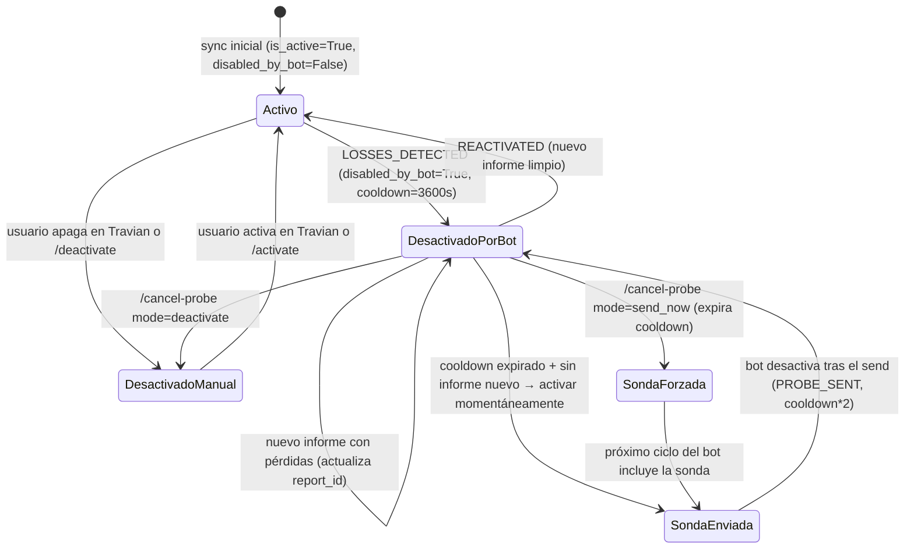

# Farm Lists Automáticas

> **Nota sobre validación de APIs**: Este spec llega a `ready-for-impl` con los contratos de API propuestos. El agente `desarrollador-apis` debe revisarlos en MODO REVISIÓN DE CONTRATO antes de implementar los endpoints. La lógica de dominio (secciones 1-11, 14) es firme y no depende de esa revisión.

---

## 1. Objetivo de negocio

Automatizar el envío periódico de listas de vacas (farm lists) en Travian de forma **indetectable**, con gestión inteligente de pérdidas mediante sondas y backoff exponencial. El bot debe:

1. Leer las farm lists del DOM de la plaza de reuniones y sincronizarlas en BD.
2. Enviarlas según un scheduler con intervalo aleatorio (anti-detección).
3. Detectar pérdidas en cada slot, desactivarlo temporalmente y enviarlo como sonda cuando el cooldown expire, con duplicación del cooldown en cada sonda fallida (backoff exponencial, máx. 24 h).
4. Exponer endpoints REST para que el dashboard React gestione schedulers, consulte farm lists, active/desactive slots manualmente y vea el historial.

Requisito previo: el usuario ya tiene sesión activa (login completado, `SessionRegistry.get_browser(world_id)` devuelve el browser).

---

## 2. Actores y permisos

| Actor | Descripción |
|---|---|
| **WorldAgent** | Proceso asyncio interno del bot. Lee la cola de tareas y ejecuta los schedulers. |
| **Usuario (dashboard)** | Opera el dashboard React. Puede crear/editar/borrar schedulers, leer/sincronizar farm lists, activar/desactivar slots, enviar manualmente una lista y ver historial. |
| **Bot (proceso automático)** | Actúa sobre slots con `disabled_by_bot=True`. No toca slots con `is_active=False` y `disabled_by_bot=False` (desactivados manualmente por el usuario). |

No hay roles de autorización; la API es local (single-user).

---

## 3. Alcance

### Dentro de alcance

- Entidades de dominio: `FarmList`, `FarmSlot`, `FarmScheduler`, `FarmListSendEvent`, `SlotEvent`, `BotSlotStatus`.
- Puertos nuevos: `FarmListBrowserPort`, `FarmListDbPort`.
- Use cases completos (ver sección 4).
- Adaptadores de browser: `farm_lists.py` (lector DOM) y `farm_list_sender.py` (envío JS).
- TaskQueue, Task y TaskType ampliados con `SEND_FARM_LIST_GROUP`.
- WorldAgent (solo el ciclo de farm lists): `seed_from_schedulers`, `run`, `_execute`, `_reschedule_farm`, `run_now`.
- SQLite adapter: tablas y métodos.
- Endpoints REST de gestión.
- Excepciones nuevas del dominio.

### Fuera de alcance

- Entrenamiento de tropas, construcción, ciclo ROI: WorldAgent ya los tiene; esta feature solo añade el bloque de farm lists.
- Loot contabilizado por recurso (campos `loot_wood/clay/iron/crop` de `FarmListSendHistoryModel` — reservado para el Agente ROI).
- Agente ROI (`RUN_ROI_CYCLE`) y su integración con farm income.
- Internacionalización de los endpoints de esta feature (`Accept-Language` **no es obligatorio** aquí: ninguno de estos endpoints devuelve texto localizado; devuelven datos de juego en inglés/neutro). Confirmado por `desarrollador-apis`: los nombres como `target_name`, `name` del scheduler y `farm_list_name` son datos introducidos por el usuario o scrapeados del DOM de Travian, no traducciones del catálogo i18n centralizado. `Accept-Language` se omite deliberadamente en estos endpoints.

---

## 4. Reglas de negocio

| ID | Regla |
|---|---|
| RN-01 | Un FarmScheduler agrupa una o varias farm lists del mismo mundo y las envía juntas de forma recurrente. |
| RN-02 | El intervalo de disparo es aleatorio en `[interval_min_ms, interval_max_ms]` (anti-detección). |
| RN-03 | Pausa entre listas del mismo grupo: `random.uniform(2.0, 5.0)` segundos. |
| RN-04 | Un slot con `is_active=False` y `disabled_by_bot=False` fue desactivado manualmente; el bot **no lo toca**. |
| RN-05 | Al detectar pérdidas en un slot activo (`withLosses` o `lost` en `last_raid_state`) el bot lo desactiva, marca `disabled_by_bot=True`, graba `disabled_at=now`, `cooldown_seconds=3600`, `report_id_at_disable=last_raid_report_id`, y registra evento `LOSSES_DETECTED`. |
| RN-06 | Si un slot desactivado por el bot recibe un nuevo informe (report_id diferente) con resultado limpio (`withoutLosses`), el bot lo reactiva y registra `REACTIVATED`. |
| RN-07 | Si el nuevo informe tiene pérdidas, el bot actualiza `report_id_at_disable` al nuevo report_id y mantiene el cooldown sin cambios. |
| RN-08 | Si el cooldown expiró y no hay informe nuevo, el bot activa el slot momentáneamente (sonda), lo incluye en el envío y lo desactiva inmediatamente después, duplicando el cooldown (`min(cooldown*2, 86400)`). Registra evento `PROBE_SENT`. |
| RN-09 | `losses_already_seen` evita que el bot desactive dos veces por el mismo informe: si `report_id_at_disable == last_raid_report_id` y `disabled_by_bot=True`, no se procesa como pérdida nueva. |
| RN-10 | Al activar manualmente un slot, `disabled_by_bot` se pone a `False`. Si el slot estaba `disabled_by_bot=True`, se registra `REACTIVATED`. |
| RN-11 | El click de envío se hace via JS (`btn.click()`), no con movimiento de ratón. |
| RN-12 | El estado de envío se determina comparando `current` vs `active` (slots sin clase `disabled`), no vs `total`. `total` incluye slots desactivados, por lo que `current == active` es éxito completo. |
| RN-13 | El historial de envíos se limpia automáticamente de registros con más de 7 días. |
| RN-14 | Al borrar un scheduler, sus farm lists **no se borran**; quedan con `scheduler_id=NULL`. |
| RN-15 | `sync_farm_lists` y `sync_farm_list` hacen matching de slots por coordenadas (x, y), no por ID. Esto preserva `disabled_by_bot`, `total_bounty` y el cooldown cuando Travian reasigna IDs. |
| RN-16 | `CancelProbeUseCase` tiene dos modos: `deactivate` (para el countdown indefinidamente) y `send_now` (expira el cooldown para que el próximo ciclo envíe la sonda). |

---

## 5. Flujo principal y flujos alternativos

### Flujo principal: ciclo automático de un scheduler

```
1. WorldAgent.seed_from_schedulers() → encola Task(SEND_FARM_LIST_GROUP, scheduler_id, execute_at)
2. WorldAgent.run() detecta tarea lista → llama _execute(task)
3. SendSchedulerGroupUseCase.execute(scheduler_id)
   3a. Obtiene lista de farm_list_ids del scheduler
   3b. Para cada farm_list_id:
       ProcessFarmListUseCase.execute(farm_list_id, world_id)
       - Lee lista del DOM (browser.read_farm_list)
       - Sincroniza en BD (db.sync_farm_list)
       - Evalúa cada slot → actúa según RN-04..09
       - Envía la lista (browser.send_farm_list) → registra FarmListSendEvent
       - Desactiva sondas y duplica cooldown
       3c. Pausa 2-5s entre listas (salvo la última)
4. WorldAgent._reschedule_farm() → recalcula execute_at aleatorio y reencola
```

### Flujo alternativo: sincronización manual de farm lists

```
POST /farm-lists/read → ReadFarmListsUseCase.execute(world_id)
  - Navega a la plaza de reuniones
  - Lee todas las listas del DOM (agrupadas por aldea)
  - Para cada aldea: db.sync_farm_lists(village_id, fls)
  - Devuelve la lista actualizada
```

### Flujo alternativo: envío manual de una lista

```
POST /farm-lists/{id}/send → SendFarmListUseCase.execute(farm_list_id)
  - Obtiene la lista de BD
  - browser.send_farm_list(farm_list_id)
  - Registra FarmListSendEvent con triggered_by="manual"
```

### Flujo alternativo: cancelar sonda

```
POST /slots/{slot_id}/cancel-probe
  - mode="deactivate": desactiva indefinidamente (disabled_by_bot=False, is_active=False)
  - mode="send_now": expira cooldown para que el próximo ciclo la incluya
```

---

## 6. Edge cases

| ID | Edge case | Tratamiento |
|---|---|---|
| EC-01 | Aldea de una farm list no está en BD al sincronizar | Loguear warning, omitir esa lista. No es error fatal. |
| EC-02 | Farm list sin datos en el DOM al expandir | Loguear warning y omitir. El adaptador devuelve `None`. |
| EC-03 | Lista vacía de farm_list_ids en scheduler | `SendSchedulerGroupUseCase` devuelve 0 sin hacer nada. |
| EC-04 | `button.startFarmList` no encontrado en DOM | `FarmListSendError(farm_list_id, "no_button")` → el use case propaga. El WorldAgent loguea y continúa. |
| EC-05 | Travian reasigna ID a un slot (mismo x,y, distinto id) | `sync_farm_list` detecta: borra el slot viejo, inserta nuevo preservando `total_bounty` y estado de bot del viejo. |
| EC-06 | Slot desactivado manualmente, luego vuelve activo en DOM (el usuario lo reactivó directamente en Travian) | `sync_farm_lists/sync_farm_list`: si `is_active=True` llega del DOM y el slot tenía `disabled_by_bot=True`, se resetea `disabled_by_bot=False`, `disabled_at=None`, `cooldown_seconds=3600`. |
| EC-07 | Scheduler deshabilitado mientras el agente corre | `_reschedule_farm` comprueba `scheduler.is_enabled` antes de reencolear; si es False, no reencola. |
| EC-08 | Scheduler borrado mientras hay tarea en cola | `_reschedule_farm` captura `SchedulerNotFoundError` y no reencola. |
| EC-09 | Cooldown máximo alcanzado (86400s) | `min(cooldown*2, 86400)` previene overflow. |
| EC-10 | `send_farm_list` llamado cuando `active=0` (todas las vacas desactivadas) | DOM devuelve `{current:0, total:0, active:0}` → status="unknown". Se registra igualmente el evento. |
| EC-11 | Sonda enviada pero el DOM no actualiza `farmListStatus` en tiempo | `human_delay(1500, 2000)` antes de leer. Si aun así current=0, status="unknown". |
| EC-12 | Farm list no aparece en DOM tras navegar a la plaza | `ensure_farm_list_loaded` reintenta desde otra aldea (via `dorf2.php?newdid=`). Si falla → `FarmListPageError`. |
| EC-13 | `run_now(scheduler_id)` para scheduler inexistente | `TaskQueue.remove_by_scheduler` es silencioso (no lanza si no existe). `_build_task_at` construye la tarea igual. Si el scheduler no existe en BD, el siguiente `_reschedule_farm` lo descubrirá y no reencola. |
| EC-14 | Pérdidas detectadas en un slot que ya estaba `disabled_by_bot=True` | `losses_already_seen` (RN-09) evita doble desactivación. Si el report_id cambió, se actualiza solo el `report_id_at_disable`. |
| EC-15 | Historial de más de 7 días | Se purga automáticamente tras cada inserción en `add_farm_list_send_event`. |
| EC-16 | `CancelProbeUseCase` llamado sobre slot que no es sonda (no `disabled_by_bot`) | El use case lo ejecuta igualmente (limpia estado), pero no registra evento `PROBE_CANCELLED` porque no hay sonda activa. El implementador debe validar en el endpoint (400 si `disabled_by_bot=False`). |

---

## 7. Modelo de datos / cambios de esquema

### Tablas nuevas (SQLite + SQLAlchemy ORM)

#### `farm_lists`

| Columna | Tipo | Restricciones | Notas |
|---|---|---|---|
| `id` | INTEGER | PK (ID de Travian, no autoincrement) | |
| `name` | VARCHAR(200) | NOT NULL | |
| `owner_village_id` | INTEGER | FK → `villages.id` NOT NULL | |
| `scheduler_id` | INTEGER | FK → `farm_schedulers.id` NULLABLE | NULL = sin scheduler asignado |

#### `farm_slots`

| Columna | Tipo | Restricciones | Notas |
|---|---|---|---|
| `id` | INTEGER | PK compuesta con `farm_list_id` (ID de Travian) | |
| `farm_list_id` | INTEGER | PK compuesta, FK → `farm_lists.id` NOT NULL | |
| `target_name` | VARCHAR(200) | NOT NULL | |
| `x` | INTEGER | NOT NULL | coordenada mapa |
| `y` | INTEGER | NOT NULL | coordenada mapa |
| `population` | INTEGER | NOT NULL, default 0 | |
| `troops` | TEXT | NOT NULL | JSON: `{"t1": 2, "t4": 1}` |
| `is_active` | BOOLEAN | NOT NULL, default 1 | estado en Travian |
| `disabled_by_bot` | BOOLEAN | NOT NULL, default 0 | el bot lo desactivó |
| `last_raid_state` | VARCHAR(100) | default '' | ej. `"withoutLosses"` |
| `last_raid_time` | VARCHAR(20) | default '' | texto del DOM |
| `last_raid_report_id` | VARCHAR(100) | default '' | id del último informe |
| `last_raid_bounty` | INTEGER | default 0 | último botín |
| `average_raid_bounty` | INTEGER | default 0 | media de botín |
| `total_bounty` | INTEGER | default 0 | botín acumulado por el bot |
| `distance` | FLOAT | default 0.0 | distancia en casillas |
| `disabled_at` | DATETIME | NULLABLE | cuándo el bot desactivó el slot |
| `cooldown_seconds` | INTEGER | default 3600 | timer actual de sonda |
| `report_id_at_disable` | VARCHAR(100) | default '' | report_id al desactivar |

#### `farm_schedulers`

| Columna | Tipo | Restricciones | Notas |
|---|---|---|---|
| `id` | INTEGER | PK autoincrement | |
| `world_id` | INTEGER | FK → `worlds.id` NOT NULL | |
| `name` | VARCHAR(100) | NOT NULL | |
| `interval_min_ms` | INTEGER | NOT NULL | mínimo del intervalo aleatorio |
| `interval_max_ms` | INTEGER | NOT NULL | máximo del intervalo aleatorio |
| `is_enabled` | BOOLEAN | NOT NULL, default 1 | |
| `last_run` | VARCHAR(30) | default '' | ISO datetime como string |
| `next_run` | VARCHAR(30) | default '' | ISO datetime como string |
| `execution_count` | INTEGER | default 0 | |

**Relación**: `FarmSchedulerModel` tiene `farm_lists: list[FarmListModel]` via `back_populates="scheduler"`. Al borrar un scheduler, las farm lists quedan con `scheduler_id=NULL` (no se borran las listas).

#### `farm_list_send_history`

| Columna | Tipo | Restricciones | Notas |
|---|---|---|---|
| `id` | INTEGER | PK autoincrement | |
| `farm_list_id` | INTEGER | NOT NULL | denormalizado (la lista puede borrarse) |
| `farm_list_name` | VARCHAR(200) | NOT NULL | denormalizado |
| `world_id` | INTEGER | NOT NULL | |
| `timestamp` | DATETIME | NOT NULL | UTC |
| `status` | VARCHAR(20) | NOT NULL | `success|partial|error|unknown` |
| `being_raided_current` | INTEGER | NULLABLE | slots actualmente raideando |
| `being_raided_total` | INTEGER | NULLABLE | slots activos en la lista |
| `triggered_by` | VARCHAR(20) | NOT NULL | `scheduler|manual` |
| `scheduler_id` | INTEGER | NULLABLE | |
| `bot_disabled_slots` | TEXT | NOT NULL, default '[]' | JSON list[str] de nombres de vacas desactivadas en este ciclo |
| `loot_wood` | INTEGER | NOT NULL, default 0 | reservado Agente ROI |
| `loot_clay` | INTEGER | NOT NULL, default 0 | reservado Agente ROI |
| `loot_iron` | INTEGER | NOT NULL, default 0 | reservado Agente ROI |
| `loot_crop` | INTEGER | NOT NULL, default 0 | reservado Agente ROI |

#### `slot_events`

| Columna | Tipo | Restricciones | Notas |
|---|---|---|---|
| `id` | INTEGER | PK autoincrement | |
| `timestamp` | DATETIME | NOT NULL | UTC |
| `slot_id` | INTEGER | NOT NULL | denormalizado |
| `slot_name` | VARCHAR(200) | NOT NULL | denormalizado |
| `farm_list_id` | INTEGER | NOT NULL | denormalizado |
| `farm_list_name` | VARCHAR(200) | NOT NULL | denormalizado |
| `world_id` | INTEGER | NOT NULL | |
| `event_type` | VARCHAR(30) | NOT NULL | `LOSSES_DETECTED|PROBE_SENT|REACTIVATED|PROBE_CANCELLED` |
| `last_raid_state` | VARCHAR(100) | NOT NULL, default '' | |
| `cooldown_seconds` | INTEGER | NOT NULL, default 3600 | |
| `last_raid_report_id` | VARCHAR(100) | NOT NULL, default '' | |

> Las tablas `farm_list_send_history` y `slot_events` usan campos denormalizados de nombre para que los registros históricos sean legibles aunque se borre la entidad original.

### Cambios en tablas existentes

- **`worlds`**: añadir `schedulers: list[FarmSchedulerModel]` relationship (cascade all, delete-orphan).
- **`villages`**: añadir `farm_lists: list[FarmListModel]` relationship (cascade all, delete-orphan).

---

## 8. Contratos de API / interfaces

> Contratos **validados por `desarrollador-apis`** (2026-05-26). Ver sección "Validación APIs" al final del spec para el dictamen detallado y las correcciones aplicadas.

**Convención base**:
- Prefijo de router: `/farm` (sin `/api`; el proxy Vite retira `/api`).
- `world_id` siempre va en la ruta (nunca en el body), siguiendo la jerarquía de recursos del proyecto.
- Ningún endpoint de esta feature devuelve texto localizado → `Accept-Language` **no es requerido** (validado, ver sección 3).
- Errores: body `{"detail": "<mensaje legible>"}` — convención del proyecto con el handler global de FastAPI.
- Paginación de historial: `page` (default 1) y `page_size` (default 100, max 100), con envelope `{"items": [...], "page": n, "page_size": n, "total": n}`.
- Endpoints de slots: la clave compuesta `(slot_id, farm_list_id)` se pasa siempre — `slot_id` en la ruta y `farm_list_id` en el body del request.

---

### 8.1 Schedulers

#### `GET /farm/worlds/{world_id}/schedulers`
Devuelve todos los schedulers de un mundo.

**Response 200**:
```json
[
  {
    "id": 1,
    "world_id": 3,
    "name": "Scheduler principal",
    "interval_min_ms": 180000,
    "interval_max_ms": 240000,
    "is_enabled": true,
    "last_run": "2026-05-26T10:00:00",
    "next_run": "2026-05-26T10:03:42",
    "execution_count": 47,
    "farm_list_ids": [101, 102]
  }
]
```

#### `POST /farm/worlds/{world_id}/schedulers`
Crea un scheduler.

**Request body**:
```json
{
  "name": "Scheduler principal",
  "interval_min_ms": 180000,
  "interval_max_ms": 240000,
  "is_enabled": true
}
```
**Response 201**: objeto `FarmScheduler` creado.
**Errores**: `422` si `interval_min_ms > interval_max_ms` o si `interval_min_ms < 60000` (mínimo 1 minuto por anti-detección).

#### `PUT /farm/worlds/{world_id}/schedulers/{scheduler_id}`
Actualiza nombre, intervalos e `is_enabled`.

**Request body**: mismo esquema que POST.
**Response 200**: objeto `FarmScheduler` actualizado.
**Errores**: `404` si no existe.

#### `DELETE /farm/worlds/{world_id}/schedulers/{scheduler_id}`
Borra un scheduler. Las farm lists asignadas quedan con `scheduler_id=NULL`.

**Response 204**.
**Errores**: `404` si no existe.

#### `PUT /farm/worlds/{world_id}/schedulers/{scheduler_id}/farm-lists`
Asigna (o reasigna) la lista exacta de farm lists de un scheduler.

**Request body**:
```json
{ "farm_list_ids": [101, 102, 103] }
```
**Response 200**: objeto `FarmScheduler` con `farm_list_ids` actualizados.
**Errores**: `404` si scheduler o alguna farm list no existe.

---

### 8.2 Farm Lists

#### `GET /farm/worlds/{world_id}/farm-lists`
Devuelve todas las farm lists del mundo con sus slots.

**Response 200**:
```json
[
  {
    "id": 101,
    "name": "Lista principal",
    "owner_village_id": 5,
    "village_name": "Aldea 1",
    "village_x": 10,
    "village_y": -5,
    "scheduler_id": 1,
    "slots": [
      {
        "id": 200,
        "farm_list_id": 101,
        "target_name": "Villa Abandonada",
        "x": 12,
        "y": -3,
        "population": 0,
        "troops": {"t1": 10},
        "is_active": true,
        "disabled_by_bot": false,
        "last_raid_state": "withoutLosses",
        "last_raid_time": "01:23",
        "last_raid_report_id": "abc123",
        "last_raid_bounty": 450,
        "average_raid_bounty": 380,
        "total_bounty": 12400,
        "distance": 3.6,
        "disabled_at": null,
        "cooldown_seconds": 3600,
        "report_id_at_disable": ""
      }
    ]
  }
]
```

#### `POST /farm/worlds/{world_id}/farm-lists/read`
Navega a la plaza de reuniones, lee las farm lists del DOM y sincroniza en BD. Operación lenta (implica navegación del browser).

**Response 200**: lista de `FarmList` sincronizadas.
**Errores**: `503` si no hay sesión activa; `502` si `FarmListPageError` (Gold Club no activo o sin listas).

---

### 8.3 Gestión de slots

> **Nota de diseño**: `slot_id` es PK compuesta `(id, farm_list_id)` en la BD. El `slot_id` en la ruta es el `id` de Travian; `farm_list_id` va siempre en el body para resolver la clave compuesta. El `world_id` también va en el body porque el slot no tiene ruta de mundo propia — pertenece a una farm list que a su vez pertenece a un mundo, pero exponer la jerarquía completa (`/worlds/{world_id}/farm-lists/{farm_list_id}/slots/{slot_id}/...`) haría las rutas de acción muy largas para un dashboard. Esta excepción a la jerarquía de rutas es intencionada y consistente con cómo el codebase maneja acciones de browser que necesitan contexto de sesión.

#### `POST /farm/slots/{slot_id}/activate`
Activa el slot en Travian (toggle Travian→on) y limpia `disabled_by_bot`. Si estaba `disabled_by_bot`, registra evento `REACTIVATED`.

**Request body**:
```json
{ "farm_list_id": 101, "world_id": 3 }
```
**Response 200**: objeto `FarmSlot` actualizado.
**Errores**: `404` si el slot no existe (combinación `slot_id`+`farm_list_id`); `503` si no hay sesión activa para `world_id`.

#### `POST /farm/slots/{slot_id}/deactivate`
Desactiva el slot en Travian (toggle Travian→off). No toca `disabled_by_bot`.

**Request body**:
```json
{ "farm_list_id": 101, "world_id": 3 }
```
**Response 200**: objeto `FarmSlot` actualizado.
**Errores**: `404` si el slot no existe; `503` si no hay sesión activa para `world_id`.

#### `POST /farm/slots/{slot_id}/bot-disable`
El bot desactiva el slot (toggle Bot→excluir). Desactiva en Travian y pone `disabled_by_bot=True`.

**Request body**:
```json
{ "farm_list_id": 101, "world_id": 3 }
```
**Response 200**: objeto `FarmSlot` actualizado.
**Errores**: `404` si el slot no existe; `503` si no hay sesión activa para `world_id`.

> Corrección aplicada: se añade `world_id` al body (necesario para localizar la sesión del browser, igual que los demás endpoints de slot). El spec original lo omitía en bot-disable y bot-enable, creando una inconsistencia.

#### `POST /farm/slots/{slot_id}/bot-enable`
El bot reactiva el slot (toggle Bot→incluir). Activa en Travian y limpia `disabled_by_bot`.

**Request body**:
```json
{ "farm_list_id": 101, "world_id": 3 }
```
**Response 200**: objeto `FarmSlot` actualizado.
**Errores**: `404` si el slot no existe; `503` si no hay sesión activa para `world_id`.

> Corrección aplicada: se añade `world_id` al body (mismo motivo que bot-disable).

#### `POST /farm/slots/{slot_id}/cancel-probe`
Cancela la sonda pendiente de un slot.

**Request body**:
```json
{ "farm_list_id": 101, "world_id": 3, "mode": "deactivate" }
```
`mode`: `"deactivate"` (default) o `"send_now"`.
**Response 200**: objeto `FarmSlot` actualizado.
**Errores**: `400` si el slot no tiene `disabled_by_bot=True` (no hay sonda activa); `404` si el slot no existe; `422` si `mode` tiene un valor no permitido.

---

### 8.4 Envío manual

#### `POST /farm/farm-lists/{farm_list_id}/send`
Envía manualmente una farm list. No crea un recurso nuevo (el `FarmListSendEvent` se persiste internamente); devuelve el resultado del envío.

**Request body**:
```json
{ "world_id": 3 }
```
**Response 200**: objeto `FarmListSendEvent` con `triggered_by="manual"`.
**Errores**: `404` si la lista no existe; `503` si no hay sesión activa para `world_id`; `502` si `FarmListSendError` o `FarmListPageError` (error del browser o Gold Club no activo).

---

### 8.5 Historial

> **Corrección aplicada**: el spec original usaba `limit` (default 500, max 2000), que viola las REGLAS DE DISEÑO del proyecto (paginación con `page`/`page_size`, máximo 100 por página). Se reemplaza por paginación estándar con el envelope `{"items": [...], "page": n, "page_size": n, "total": n}`.
>
> Justificación de la corrección: los historiales de farm lists pueden crecer rápidamente (varios envíos por hora). Devolver 500 o 2000 registros en una sola respuesta sobrecarga la memoria de SQLite y el parser del frontend. La paginación protege tanto al servidor como al cliente. El dashboard puede mostrar las últimas 100 entradas y ofrecer "cargar más" si necesita más contexto.

#### `GET /farm/worlds/{world_id}/history`
Historial de envíos de farm lists.

**Query params**:
- `scheduler_id` (int, opcional): filtra por scheduler.
- `from_dt` (ISO datetime UTC, opcional): límite inferior de timestamp.
- `to_dt` (ISO datetime UTC, opcional): límite superior de timestamp.
- `page` (int, default 1): página solicitada.
- `page_size` (int, default 100, máx 100): tamaño de página.

**Response 200**:
```json
{
  "items": [ /* lista de FarmListSendEvent */ ],
  "page": 1,
  "page_size": 100,
  "total": 347
}
```
**Errores**: `422` si `page < 1` o `page_size` fuera de rango.

#### `GET /farm/worlds/{world_id}/slot-events`
Historial de eventos de slots (pérdidas, sondas, reactivaciones).

**Query params**:
- `from_dt` (ISO datetime UTC, opcional).
- `to_dt` (ISO datetime UTC, opcional).
- `page` (int, default 1).
- `page_size` (int, default 100, máx 100).

**Response 200**:
```json
{
  "items": [ /* lista de SlotEvent */ ],
  "page": 1,
  "page_size": 100,
  "total": 52
}
```
**Errores**: `422` si `page < 1` o `page_size` fuera de rango.

---

### 8.6 Control del agente

#### `POST /farm/worlds/{world_id}/agent/start`
Arranca el WorldAgent para el mundo. Carga schedulers de BD y construye la cola.

**Response 200**:
```json
{ "status": "started", "world_id": 3, "queued_tasks": 2 }
```
**Errores**: `409` si ya está corriendo; `503` si no hay sesión activa.

#### `POST /farm/worlds/{world_id}/agent/stop`
Solicita parada limpia del agente (espera que la tarea en curso termine).

**Response 200**:
```json
{ "status": "stop_requested", "world_id": 3 }
```
**Errores**: `404` si el agente no existe para ese mundo.

#### `GET /farm/worlds/{world_id}/agent/status`
Estado actual del agente.

**Response 200**:
```json
{
  "world_id": 3,
  "state": "running",
  "queued_tasks": 2,
  "next_task_at": "2026-05-26T10:03:42",
  "last_error": null
}
```
`state`: `running | stopped | error | paused`.

#### `POST /farm/worlds/{world_id}/schedulers/{scheduler_id}/run-now`
Adelanta el próximo disparo del scheduler a ahora mismo (modifica la cola en memoria del WorldAgent).

**Response 200**:
```json
{ "status": "scheduled_now", "scheduler_id": 1 }
```
**Errores**: `404` si el scheduler no existe en BD; `409` si el WorldAgent no está corriendo para ese mundo (no tiene sentido adelantar un disparo si el agente está parado).

---

## 9. Flujo lógico paso a paso

### 9.1 Máquina de estados de un FarmSlot



### 9.2 `ProcessFarmListUseCase.execute` (pseudocódigo)

```
async execute(farm_list_id, world_id):
    now = utcnow()
    fresh  = await browser.read_farm_list(farm_list_id)      # DOM → FarmList
    synced = await db.sync_farm_list(fresh)                  # BD → FarmList con estado bot

    probe_slot_ids = []
    bot_disabled_slot_names = []

    for slot in synced.slots:
        # Desactivado manualmente → el bot no lo toca
        if not slot.is_active and not slot.disabled_by_bot:
            continue

        losses_already_seen = (
            slot.report_id_at_disable != ""
            and slot.last_raid_report_id == slot.report_id_at_disable
        )

        # CASO 1: Slot activo con pérdidas (no procesadas todavía)
        if had_losses(slot.last_raid_state) and not slot.disabled_by_bot and not losses_already_seen:
            bot_disabled_slot_names.append(slot.target_name)
            await browser.deactivate_slot_in_travian(slot.id, farm_list_id)
            await db.update_slot_cooldown_state(slot.id, farm_list_id,
                disabled_at=now, cooldown_seconds=3600,
                report_id_at_disable=slot.last_raid_report_id,
                disabled_by_bot=True, is_active=False)
            await db.add_slot_event(LOSSES_DETECTED, slot, synced, world_id, now, 3600)

        # CASO 2: Desactivado por bot
        elif slot.disabled_by_bot:
            new_raid = (slot.report_id_at_disable != ""
                        and slot.last_raid_report_id != ""
                        and slot.last_raid_report_id != slot.report_id_at_disable)

            if new_raid and won_without_losses(slot.last_raid_state):
                # Sub-caso 2a: informe nuevo limpio → reactivar
                await browser.activate_slot_in_travian(slot.id, farm_list_id)
                await db.update_slot_cooldown_state(slot.id, farm_list_id,
                    disabled_at=None, cooldown_seconds=3600,
                    report_id_at_disable="",
                    disabled_by_bot=False, is_active=True)
                await db.add_slot_event(REACTIVATED, slot, synced, world_id, now, 3600)

            elif new_raid and had_losses(slot.last_raid_state):
                # Sub-caso 2b: sonda o raid in-flight con pérdidas → solo actualizar report_id
                await db.update_slot_cooldown_state(slot.id, farm_list_id,
                    disabled_at=slot.disabled_at,
                    cooldown_seconds=slot.cooldown_seconds,
                    report_id_at_disable=slot.last_raid_report_id,
                    disabled_by_bot=True, is_active=False)

            elif not new_raid and cooldown_expired(slot, now):
                # Sub-caso 2c: cooldown expirado sin informe nuevo → sonda
                await browser.activate_slot_in_travian(slot.id, farm_list_id)
                probe_slot_ids.append(slot.id)
            # else: cooldown no expirado y sin informe nuevo → no hacer nada

    # Enviar la lista (las sondas van incluidas porque están activas)
    send_result = await browser.send_farm_list(farm_list_id)
    await db.add_farm_list_send_event(FarmListSendEvent(
        farm_list_id, synced.name, world_id, now,
        send_result.status, send_result.being_raided_current,
        send_result.being_raided_total,
        triggered_by="scheduler",
        scheduler_id=synced.scheduler_id,
        bot_disabled_slots=bot_disabled_slot_names,
    ))

    # Desactivar sondas y duplicar cooldown
    for slot_id in probe_slot_ids:
        slot = find(synced.slots, id=slot_id)
        new_cooldown = min(slot.cooldown_seconds * 2, 86400)
        await browser.deactivate_slot_in_travian(slot_id, farm_list_id)
        await db.update_slot_cooldown_state(slot_id, farm_list_id,
            disabled_at=now,
            cooldown_seconds=new_cooldown,
            report_id_at_disable=slot.last_raid_report_id,
            disabled_by_bot=True, is_active=False)
        await db.add_slot_event(PROBE_SENT, slot, synced, world_id, now, new_cooldown)
```

### 9.3 `WorldAgent._reschedule_farm` (pseudocódigo)

```
async _reschedule_farm(task):
    try:
        scheduler = await db.get_scheduler(task.source_scheduler_id)
    except SchedulerNotFoundError:
        return  # scheduler borrado mientras corría
    if not scheduler.is_enabled:
        return  # scheduler deshabilitado

    now = now()
    interval_ms = random.uniform(scheduler.interval_min_ms, scheduler.interval_max_ms)
    next_at = now + timedelta(milliseconds=interval_ms)

    await db.update_scheduler_run_state(
        scheduler_id=scheduler.id,
        last_run=now,
        next_run=next_at,
        execution_count=scheduler.execution_count + 1,
    )
    queue.add(Task(SEND_FARM_LIST_GROUP, world_id, execute_at=next_at,
                   priority=1, payload={"scheduler_id": scheduler.id, "scheduler_type": "farm"},
                   recurring=True, source_scheduler_id=scheduler.id))
```

### 9.4 `ensure_farm_list_loaded` (navegación inteligente)

```
Dada la URL actual del tab:
  - Si "tt=99" en URL → ya en farm lists → no navegar
  - Si "gid=16" en URL → plaza de reuniones, otra pestaña
      → JS: querySelector("a[href*='tt=99']").href → navegar
  - Resto → navegar desde dorf2.php → click en gid=16 → click en tt=99
      → fallback: GET /build.php?gid=16&tt=99

Si expand=True y la lista no está expandida:
  → JS: querySelector('.farmListHeader a.expandCollapse').click()
  → human_delay(800, 1200)

Si la lista no aparece en DOM tras navegar:
  → Leer village game_ids del DOM (span[data-did])
  → Navegar a dorf2.php?newdid=<otro_village>
  → Reintentar una vez → FarmListPageError si falla
```

---

## 10. Validaciones y reglas

### Nivel de API

| Campo | Validación |
|---|---|
| `interval_min_ms` | >= 60000 (1 minuto mínimo) |
| `interval_max_ms` | >= `interval_min_ms` |
| `page` (historial) | >= 1 |
| `page_size` (historial) | 1..100 |
| `mode` (cancel-probe) | Uno de `["deactivate", "send_now"]` |
| `farm_list_ids` (asignación) | Lista de enteros; cada id debe existir en `farm_lists` |

### Nivel de dominio (use cases)

| Regla | Use case |
|---|---|
| Un slot con `disabled_by_bot=False` y `is_active=False` no se toca | `ProcessFarmListUseCase` |
| `losses_already_seen` bloquea doble desactivación | `ProcessFarmListUseCase` |
| `cooldown_seconds` nunca supera 86400 | `ProcessFarmListUseCase` |
| `ActivateSlotInTravianUseCase` registra REACTIVATED solo si `was_disabled_by_bot=True` | `ActivateSlotInTravianUseCase` |
| En `sync_farm_list`: si `is_active=True` llega del DOM y el slot tenía `disabled_by_bot=True` → reset del estado bot | `FarmListDbPort.sync_farm_list` |

### Nivel de browser adapter

| Regla | Lugar |
|---|---|
| Selectores siempre estructurales; nunca texto visible | `farm_lists.py`, `farm_list_sender.py` |
| `human_delay` antes/después de cada acción sobre el DOM | `farm_lists.py`, `farm_list_sender.py` |
| JS IIFE para `evaluate()` (zendriver no acepta argumentos externos) | `farm_list_sender.py` |
| Leer estado tras AJAX con `human_delay(1500, 2000)` | `farm_list_sender.py` |

---

## 11. Seguridad, rendimiento y concurrencia

### Anti-detección (obligatorio)

| Capa | Detalle |
|---|---|
| Intervalo aleatorio | `random.uniform(interval_min_ms, interval_max_ms)` por scheduler |
| Gap entre listas | `random.uniform(2.0, 5.0)` segundos entre farm lists del mismo grupo |
| Click JS | No se simula movimiento de ratón (consistente con bot C# de referencia) |
| `human_delay` | 400-700 ms entre lectura de listas; 800-1200 ms al expandir; 1500-2000 ms tras click de envío para que el AJAX de Travian actualice el DOM |
| Navegación inteligente | No se recarga la página si la farm list ya está en el DOM (ver 9.4) |
| `expand=False` para envío | El botón Start vive en el header y funciona aunque la lista esté colapsada; no hace falta expandir para enviar |

### Concurrencia

- **Un solo WorldAgent por mundo** → no hay concurrencia en las acciones del browser para un mismo mundo. Diferentes mundos corren en `asyncio.Task` separados (OK porque son browsers distintos).
- La cola `TaskQueue` vive en memoria (no necesita lock porque asyncio es single-threaded por evento).
- `run_now(scheduler_id)` es síncrono (no async): modifica la cola y lanza `_notify_event.set()` para despertar el bucle.

### Rendimiento

- `TaskQueue`: lista ordenada por `(priority, execute_at)`. Con decenas de tareas el `sort()` es irrelevante. Si crece mucho, sustituir por `heapq` sin cambiar la interfaz pública.
- `sync_farm_list`: matching por coordenadas requiere iterar los slots, pero el número de slots por lista es pequeño (< 200).
- Historial: purga automática de registros > 7 días en cada inserción.

### Errores y recuperación

- Un fallo en `_execute(task)` loguea el error con `logger.exception` pero **no mata el agente**; el bucle continúa y la tarea se reencola igual.
- Un fallo en `ProcessFarmListUseCase` para una lista concreta es capturado por `SendSchedulerGroupUseCase` (try/except con `logger.exception`); las demás listas del grupo siguen procesándose.
- `FarmListSendError` se propaga hacia arriba; el WorldAgent lo captura en el bloque genérico de `_execute`.

---

## 12. Plan de pruebas

### Casos felices

| Test | Cobertura |
|---|---|
| `test_process_farm_list_no_losses` | Slot activo sin pérdidas → se envía la lista, no hay cambios en el slot |
| `test_process_farm_list_losses_detected` | Slot activo con `withLosses` → desactivado, evento LOSSES_DETECTED |
| `test_process_farm_list_reactivated` | Slot `disabled_by_bot=True`, nuevo informe `withoutLosses` → REACTIVATED |
| `test_process_farm_list_probe_sent` | Slot `disabled_by_bot=True`, cooldown expirado, sin informe nuevo → PROBE_SENT, cooldown duplicado |
| `test_send_scheduler_group_success` | 2 farm lists en grupo → ambas procesadas, pausa entre ellas |
| `test_send_farm_list_manual` | Envío manual → FarmListSendEvent con `triggered_by="manual"` |
| `test_sync_farm_lists_new_list` | Lista nueva en DOM → insertada en BD |
| `test_sync_farm_lists_deleted_list` | Lista eliminada en Travian → borrada en BD |
| `test_sync_farm_list_slot_reordered` | Travian reasigna ID de slot (mismo x,y) → preserva `total_bounty` y estado bot |
| `test_read_farm_lists_success` | Navega a la plaza, lee 3 listas, las sincroniza |
| `test_world_agent_seed_and_reschedule` | Scheduler habilitado → encolado en seed; reencolado tras ejecución con intervalo aleatorio |
| `test_world_agent_scheduler_disabled` | Scheduler deshabilitado → no reencola |
| `test_world_agent_run_now` | `run_now(scheduler_id)` → tarea adelantada a now, notify_event |
| `test_cancel_probe_deactivate` | mode=deactivate → `disabled_by_bot=False`, `is_active=False`, evento PROBE_CANCELLED |
| `test_cancel_probe_send_now` | mode=send_now → cooldown expirado (`disabled_at = now - cooldown - 1`) |
| `test_activate_slot_was_bot_disabled` | `ActivateSlotInTravianUseCase` con `was_disabled_by_bot=True` → evento REACTIVATED |

### Edge cases

| Test | Cobertura |
|---|---|
| `test_process_losses_already_seen` | `report_id_at_disable == last_raid_report_id` → no doble desactivación |
| `test_process_slot_manual_inactive` | `is_active=False, disabled_by_bot=False` → el bot no lo toca |
| `test_scheduler_deleted_during_run` | `SchedulerNotFoundError` en `_reschedule_farm` → no reencola, sin crash |
| `test_scheduler_group_partial_failure` | Una lista falla → las demás siguen procesándose |
| `test_sync_slot_reactivated_by_user_in_travian` | DOM devuelve `is_active=True` con `disabled_by_bot=True` en BD → reset estado bot |
| `test_probe_max_cooldown` | Cooldown llega a 86400 → no supera ese valor |
| `test_send_status_unknown` | `active=0` → status="unknown" |
| `test_send_status_partial` | `current < active` → status="partial" |
| `test_farm_list_not_in_dom` | `ensure_farm_list_loaded` falla tras retry → `FarmListPageError` |

---

## 13. Riesgos y trade-offs

| Decisión | Justificación | Riesgo |
|---|---|---|
| Click JS en `button.startFarmList` sin movimiento de ratón | El bot C# de referencia lo usó sin problemas. Eliminar el movimiento reduce el tiempo de ejecución y la complejidad. | Si Travian cambia su detección en el futuro y este botón pasa a requerir interacción más "humana", habrá que añadir movimiento de ratón. |
| Matching de slots por coordenadas en `sync_farm_list` | Travian puede reasignar IDs de slots cuando el usuario reordena la lista. Las coordenadas son invariantes (la aldea target no cambia de posición). | Si dos slots apuntan a la misma posición (teóricamente imposible en Travian), el matching fallaría. |
| Historial de envíos con TTL de 7 días | Simple y suficiente para el uso previsto (dashboard). Evita crescimiento ilimitado de la BD SQLite. | Si el usuario quiere análisis históricos > 7 días, tendrá que exportar antes. |
| `TaskQueue` como lista ordenada | Simple, testeable, sin dependencias. Suficiente para decenas de schedulers. | Con cientos de schedulers el `sort()` cuadrático se notaría; migrar a `heapq` sin tocar la interfaz pública si llegara ese caso. |
| `FarmListDbPort` y `FarmListBrowserPort` separados de `BrowserPort`/`DbPort` | Siguiendo la convención del proyecto (no extender los puertos genéricos). Mantiene el core testeable sin browser ni BD. | Más boilerplate de inyección, pero es la convención ya establecida. |
| Puertos separados en lugar de extender `BrowserPort`/`DbPort` | Convención explícita del proyecto: "NO extender BrowserPort ni DbPort — crear FarmListBrowserPort y FarmListDbPort propios". | Ninguno; es la decisión correcta para esta arquitectura. |

---

## 14. Pasos de implementación ordenados

Los pasos deben ejecutarse en este orden. Cada paso es un bloque coherente que puede commitearse de forma independiente.

### Paso 1: Excepciones nuevas
Añadir a `core/exceptions.py`:
- `SchedulerNotFoundError(scheduler_id: int)` — error_code `SCHEDULER_NOT_FOUND`
- `FarmSlotNotFoundError(slot_id: int)` — error_code `FARM_SLOT_NOT_FOUND`
- `FarmListSendError(farm_list_id: int, reason: str)` — error_code `FARM_LIST_SEND_ERROR`
- `FarmListPageError(message: str)` — error_code `FARM_LIST_PAGE_ERROR`
- `FarmListResponseError(index: int, message: str)` — error_code `FARM_LIST_RESPONSE_ERROR`

### Paso 2: Entidades de dominio
Crear en `core/entities/`:
- `farm_list.py` — `FarmSlot`, `FarmList`, `BotSlotStatus`, `SlotEvent`
- `farm_scheduler.py` — `FarmScheduler`
- `farm_list_send_event.py` — `FarmListSendEvent`
- `farm_list_send_result.py` — `FarmListSendResult`
- `task.py` — `TaskType` (con `SEND_FARM_LIST_GROUP`) y `Task`

### Paso 3: Puertos
Crear en `core/ports/`:

**`farm_list_browser_port.py`** — `FarmListBrowserPort` (ABC):
```python
class FarmListBrowserPort(ABC):
    @abstractmethod
    async def read_farm_lists(self) -> list[FarmList]: ...
    @abstractmethod
    async def read_farm_list(self, farm_list_id: int) -> FarmList: ...
    @abstractmethod
    async def send_farm_list(self, farm_list_id: int) -> FarmListSendResult: ...
    @abstractmethod
    async def activate_slot_in_travian(self, slot_id: int, farm_list_id: int) -> None: ...
    @abstractmethod
    async def deactivate_slot_in_travian(self, slot_id: int, farm_list_id: int) -> None: ...
```

**`farm_list_db_port.py`** — `FarmListDbPort` (ABC):
```python
class FarmListDbPort(ABC):
    @abstractmethod
    async def sync_farm_lists(self, village_id: int, farm_lists: list[FarmList]) -> list[FarmList]: ...
    @abstractmethod
    async def sync_farm_list(self, farm_list: FarmList) -> FarmList: ...
    @abstractmethod
    async def get_farm_lists_by_village(self, village_id: int) -> list[FarmList]: ...
    @abstractmethod
    async def get_farm_lists_by_world(self, world_id: int) -> list[FarmList]: ...
    @abstractmethod
    async def get_farm_list_by_id(self, farm_list_id: int) -> FarmList: ...  # raises FarmListNotFoundError
    @abstractmethod
    async def get_villages_by_world(self, world_id: int) -> list[Village]: ...
    @abstractmethod
    async def get_slot_by_id(self, slot_id: int, farm_list_id: int) -> FarmSlot: ...  # raises FarmSlotNotFoundError
    @abstractmethod
    async def update_slot_flags(self, slot_id: int, farm_list_id: int, *, is_active: bool | None = None, disabled_by_bot: bool | None = None) -> FarmSlot: ...
    @abstractmethod
    async def update_slot_cooldown_state(self, slot_id: int, farm_list_id: int, *, disabled_at: datetime | None, cooldown_seconds: int, report_id_at_disable: str, disabled_by_bot: bool, is_active: bool) -> FarmSlot: ...
    @abstractmethod
    async def get_bot_status_slots(self, world_id: int) -> list[BotSlotStatus]: ...
    @abstractmethod
    async def add_slot_event(self, event: SlotEvent) -> None: ...
    @abstractmethod
    async def get_slot_events(self, world_id: int, *, from_dt: datetime | None = None, to_dt: datetime | None = None, limit: int = 500) -> list[SlotEvent]: ...
    @abstractmethod
    async def create_scheduler(self, scheduler: FarmScheduler) -> FarmScheduler: ...
    @abstractmethod
    async def get_scheduler(self, scheduler_id: int) -> FarmScheduler: ...  # raises SchedulerNotFoundError
    @abstractmethod
    async def get_schedulers_by_world(self, world_id: int) -> list[FarmScheduler]: ...
    @abstractmethod
    async def update_scheduler(self, scheduler: FarmScheduler) -> FarmScheduler: ...
    @abstractmethod
    async def delete_scheduler(self, scheduler_id: int) -> None: ...
    @abstractmethod
    async def assign_farm_lists_to_scheduler(self, scheduler_id: int, farm_list_ids: list[int]) -> FarmScheduler: ...
    @abstractmethod
    async def update_scheduler_run_state(self, scheduler_id: int, last_run: datetime | None, next_run: datetime | None, execution_count: int) -> None: ...
    @abstractmethod
    async def add_farm_list_send_event(self, event: FarmListSendEvent) -> None: ...
    @abstractmethod
    async def get_farm_list_send_history(self, world_id: int, *, limit: int = 500, scheduler_id: int | None = None, from_dt: datetime | None = None, to_dt: datetime | None = None) -> list[FarmListSendEvent]: ...
```

### Paso 4: Scheduling (TaskQueue y WorldAgent parcial)
Crear `core/scheduling/task_queue.py` y `core/scheduling/world_agent.py` con únicamente los métodos relacionados con farm lists:
- `TaskQueue`: implementación completa (sección 9 del spec).
- `WorldAgent.__init__`, `seed_from_schedulers` (solo farm schedulers), `run`, `_execute` (handler `SEND_FARM_LIST_GROUP`), `_reschedule_farm`, `run_now`, `request_stop`, `status`, `_sleep_until_next`, `_log_act`, `get_activity`.

### Paso 5: Use cases
Crear `core/use_cases/farm_lists.py` con todos los use cases listados en la sección "Lo que debe incluir el spec" (ver código de referencia para lógica exacta).

### Paso 6: Modelos SQLAlchemy y migraciones
Añadir a `adapters/db/models.py`:
- Añadir relationships en `WorldModel` y `VillageModel`.
- Crear `FarmListModel`, `FarmSchedulerModel`, `FarmSlotModel`, `SlotEventModel`, `FarmListSendHistoryModel`.

Asegurar que `ensure_tables()` (o equivalente) cree las tablas nuevas en la BD.

### Paso 7: SQLite adapter
Crear `adapters/db/farm_list_sqlite_adapter.py` implementando `FarmListDbPort`. Consultar el código de referencia `C:\Dev\Travian\TravianBotS0\adapters\db\sqlite_adapter.py` líneas 430-1125 para la lógica exacta de cada método.

**Función helper `_to_slot(model) -> FarmSlot`**:
```python
def _to_slot(model: FarmSlotModel) -> FarmSlot:
    return FarmSlot(
        id=model.id,
        farm_list_id=model.farm_list_id,
        target_name=model.target_name,
        x=model.x, y=model.y,
        population=model.population,
        troops=json.loads(model.troops or "{}"),
        is_active=model.is_active,
        disabled_by_bot=model.disabled_by_bot,
        last_raid_state=model.last_raid_state,
        last_raid_time=model.last_raid_time,
        last_raid_report_id=model.last_raid_report_id,
        last_raid_bounty=model.last_raid_bounty,
        average_raid_bounty=model.average_raid_bounty,
        total_bounty=model.total_bounty,
        distance=model.distance,
        disabled_at=model.disabled_at,
        cooldown_seconds=model.cooldown_seconds,
        report_id_at_disable=model.report_id_at_disable,
    )
```

**Función helper `_to_scheduler(model) -> FarmScheduler`**:
```python
def _to_scheduler(model: FarmSchedulerModel) -> FarmScheduler:
    return FarmScheduler(
        id=model.id,
        world_id=model.world_id,
        name=model.name,
        interval_min_ms=model.interval_min_ms,
        interval_max_ms=model.interval_max_ms,
        is_enabled=model.is_enabled,
        last_run=_str_to_dt(model.last_run),
        next_run=_str_to_dt(model.next_run),
        execution_count=model.execution_count,
        farm_list_ids=sorted(fl.id for fl in model.farm_lists),
    )
```

Las fechas en `FarmSchedulerModel` se almacenan como `VARCHAR(30)` en ISO; usar `_dt_to_str(dt) -> str` y `_str_to_dt(s) -> datetime | None` como helpers de conversión.

### Paso 8: Adaptador de browser
Crear dos ficheros:

**`adapters/browser/farm_lists.py`** — lector DOM.
Implementar: `read_farm_lists`, `read_farm_list`, `_navigate_to_farm_list`, `ensure_farm_list_loaded`, `activate_slot_in_travian`, `deactivate_slot_in_travian`.

El selector para activar/desactivar un slot es el `input[data-slot-id]` de la fila `tr.slot`. En zendriver la forma de hacer click es:
```python
# Activar el slot (marcar el checkbox)
js = f"""
(() => {{
    const input = document.querySelector('tr.slot input[data-slot-id="{slot_id}"]');
    if (!input) return 'not_found';
    if (!input.checked) {{ input.click(); return 'clicked'; }}
    return 'already_active';
}})()
"""
```
El mismo patrón invertido para desactivar (`if input.checked`).

**`adapters/browser/farm_list_sender.py`** — envío JS.
Implementar: `send_farm_list`. Ver sección 9.4 y el código de referencia completo en `C:\Dev\Travian\TravianBotS0\adapters\browser\farm_list_sender.py`.

### Paso 9: Implementaciones de puertos (wiring)
Crear `adapters/browser/live_farm_list_adapter.py` que implementa `FarmListBrowserPort` inyectando el callable `get_browser(world_id)` del `SessionRegistry` (mismo patrón que `LiveOverviewAdapter`).

### Paso 10: Endpoints REST
Crear `adapters/api/routes/farm.py` con el router `/farm`. Añadir dependencias necesarias en `adapters/api/dependencies.py` para inyectar `FarmListDbPort` y `FarmListBrowserPort`.

### Paso 11: Registro en main.py
- Incluir el router de farm en `app`.
- Inicializar `FarmListSQLiteAdapter` y `LiveFarmListAdapter` en el lifespan.
- Registrar el `WorldAgent` singleton por `world_id` en `app.state` (un dict `world_agents: dict[int, WorldAgent]`).

### Paso 12: Tests
Cubrir los casos de la sección 12.

---

## 15. Criterios de aceptación

El implementador puede dar la feature por completa cuando:

- [ ] **CA-01**: `GET /farm/worlds/{world_id}/schedulers` devuelve lista vacía para un mundo sin schedulers y la lista correcta cuando hay schedulers.
- [ ] **CA-02**: `POST /farm/worlds/{world_id}/schedulers` crea un scheduler; `PUT` lo actualiza; `DELETE` lo borra y las farm lists quedan con `scheduler_id=NULL`.
- [ ] **CA-03**: `PUT .../schedulers/{id}/farm-lists` asigna exactamente las farm lists indicadas.
- [ ] **CA-04**: `POST /farm/worlds/{world_id}/farm-lists/read` navega a la plaza y devuelve las farm lists sincronizadas.
- [ ] **CA-05**: `GET /farm/worlds/{world_id}/farm-lists` devuelve las farm lists con sus slots completos.
- [ ] **CA-06**: `POST /farm/slots/{id}/activate` activa en Travian, limpia `disabled_by_bot`, registra `REACTIVATED` si `was_disabled_by_bot=True`.
- [ ] **CA-07**: `POST /farm/slots/{id}/deactivate` desactiva en Travian sin tocar `disabled_by_bot`.
- [ ] **CA-08**: `POST /farm/farm-lists/{id}/send` envía la lista y devuelve `FarmListSendEvent` con `triggered_by="manual"`.
- [ ] **CA-09**: `GET /farm/worlds/{world_id}/history` devuelve el historial de envíos filtrable.
- [ ] **CA-10**: `GET /farm/worlds/{world_id}/slot-events` devuelve los eventos de slots filtrable.
- [ ] **CA-11**: `POST /farm/worlds/{world_id}/agent/start` arranca el WorldAgent y encola los schedulers habilitados.
- [ ] **CA-12**: `POST /farm/worlds/{world_id}/agent/stop` detiene el agente limpiamente.
- [ ] **CA-13**: `GET /farm/worlds/{world_id}/agent/status` refleja el estado actual (`running/stopped/error`).
- [ ] **CA-14**: `POST .../schedulers/{id}/run-now` adelanta el próximo disparo a now.
- [ ] **CA-15**: En un ciclo automático, un slot con `withLosses` queda `disabled_by_bot=True` y el evento `LOSSES_DETECTED` aparece en `slot_events`.
- [ ] **CA-16**: En el siguiente ciclo, si llega informe `withoutLosses` para ese slot, queda `is_active=True`, `disabled_by_bot=False` y el evento `REACTIVATED` aparece.
- [ ] **CA-17**: Cuando el cooldown expira sin informe nuevo, la sonda se envía y el cooldown se duplica. El evento `PROBE_SENT` aparece.
- [ ] **CA-18**: Un slot con `is_active=False` y `disabled_by_bot=False` no es tocado por el bot.
- [ ] **CA-19**: `sync_farm_list` preserva `total_bounty` y estado bot cuando Travian reasigna ID de slot (mismo x,y).
- [ ] **CA-20**: El WorldAgent reencola el scheduler con intervalo aleatorio tras cada ejecución.
- [ ] **CA-21**: El fallo de una farm list individual en `SendSchedulerGroupUseCase` no impide que las demás se procesen.
- [ ] **CA-22**: `DELETE /schedulers/{id}` mientras el agente corre → `_reschedule_farm` no lanza excepción y no reencola.

---

## 16. Trazabilidad

| Decisión técnica | Origen |
|---|---|
| `FarmListBrowserPort` y `FarmListDbPort` como puertos separados | Instrucción explícita del mapa de reutilizables: "NO extender BrowserPort ni DbPort" |
| `FarmListNotFoundError` reutilizada de `core/exceptions.py` | palantir detectó que ya existe |
| `human_delay` / `human_type` reutilizados de `adapters/browser/driver.py` | palantir detectó que ya existen |
| `SessionRegistry.get_browser(world_id)` inyectado como callable | Patrón ya establecido en `LiveOverviewAdapter` |
| `database.get_connection` de `adapters/db/database.py` reutilizado | palantir detectó que ya existe |
| Matching de slots por coordenadas (x,y) en sync | RN-15: Travian reasigna IDs; EC-05 |
| Click JS en `button.startFarmList` sin movimiento de ratón | RN-11; comportamiento validado en bot C# de referencia |
| Comparación `current` vs `active` (no vs `total`) | RN-12; `total` incluye slots desactivados que Travian cuenta pero no envía |
| Purga automática del historial a 7 días | RN-13 |
| `interval_min_ms >= 60000` como validación de API | RN-02 + anti-detección: intervalo < 1 minuto sería detectable |
| `PROBE_CANCELLED` como event_type | RN-16 (CancelProbeUseCase, mode=deactivate) |
| `losses_already_seen` guard | RN-09; EC-14 |
| Prioridad 1 para `SEND_FARM_LIST_GROUP` en TaskQueue | Las farm lists tienen prioridad máxima sobre entrenamiento y construcción (worldagent.py línea 1769) |
| `interval_min_ms > interval_max_ms` → 422 | RN-02: el intervalo aleatorio no tiene sentido si min > max |
| Las fechas en `FarmSchedulerModel` se almacenan como VARCHAR(30) | Consistencia con `last_raid_time` del bot de referencia (models.py línea 75) |
| `Accept-Language` no requerido en endpoints de esta feature | Sección 3 (fuera de alcance): ningún endpoint devuelve texto localizado. Confirmado por `desarrollador-apis` 2026-05-26. |
| Paginación estándar en historial (`page`/`page_size`, máx 100) | REGLAS DE DISEÑO del proyecto: límites de `limit` custom (500/2000 del spec original) violan la política. La paginación protege memoria de SQLite y parser del frontend. |
| `world_id` en body de todos los endpoints de slot | Necesario para localizar la sesión del browser en `SessionRegistry`. El spec original lo omitía en `bot-disable` y `bot-enable`, creando inconsistencia. |
| `409` en `run-now` cuando el agente no corre | Semántica correcta: es un conflicto de estado, no un recurso inexistente. El agente existe conceptualmente pero no está en el estado esperado. |
| Reutilización de `get_world_runtime_port` de `adapters/api/dependencies.py` | palantir detectó que ya existe; provee el `SessionRegistry` |

---

## 17. Validación APIs

**Fecha**: 2026-05-26
**Agente revisor**: `desarrollador-apis`
**Veredicto global**: CORRECTO con correcciones menores aplicadas en esta misma sesión.

### Pregunta 1 — ¿Necesita `Accept-Language` algún endpoint?

**CORRECTO: no se requiere.** Verificado contra el código real de `adapters/api/dependencies.py` y los 25 idiomas de `core/i18n/languages.py`. Los datos de estos endpoints (`target_name`, `name` del scheduler, `farm_list_name`, tropas como `{"t1": 10}`) son datos de juego scrapeados del DOM o introducidos por el usuario — no son traducciones del catálogo i18n centralizado. La única excepción sería si los mensajes de error se localizaran, pero el proyecto entero usa el handler global de FastAPI con `{"detail": "..."}` en inglés/español fijo. Sin corrección necesaria.

### Pregunta 2 — Status codes

**CORRECTO** en general. Todos los status codes propuestos son semánticamente válidos:
- `201` creación de scheduler: correcto.
- `204` borrado de scheduler: correcto.
- `409` si el agente ya corre al hacer `start`: correcto (conflicto de estado).
- `422` validación de intervalos y `mode`: correcto (validación semántica de Pydantic).
- `503` sin sesión activa: correcto (servicio/recurso dependiente no disponible).
- `502` error del browser: correcto (gateway externo — el browser actúa como proxy hacia Travian).

**Corrección aplicada**: `run-now` declaraba `404` para "agente no está corriendo". Se cambia a `409` porque el scheduler puede existir en BD pero el agente está en estado incompatible. El `404` solo se usa para scheduler inexistente en BD.

### Pregunta 3 — Rutas y convenciones

**CORRECTO**. Prefijo `/farm` sin `/api`. Kebab-case. Sustantivos en plural (`schedulers`, `farm-lists`, `slot-events`). Sin excepciones a las convenciones del proyecto.

### Pregunta 4 — Response schemas

**CORRECTO** con una corrección y una aclaración:

**Corrección aplicada — historial**: el spec original usaba `limit` (default 500, máx 2000). Las REGLAS DE DISEÑO del proyecto exigen paginación con `page`/`page_size` (máx 100) y envelope `{"items": [...], "page": n, "page_size": n, "total": n}`. Se ha sustituido en `GET /farm/worlds/{world_id}/history` y `GET /farm/worlds/{world_id}/slot-events`.

**Aclaración de `POST /farm/worlds/{world_id}/schedulers`**: el body de creación no incluye `farm_list_ids` porque los schedulers nacen vacíos. La asignación de listas se hace en el endpoint dedicado `PUT .../farm-lists`. Esto está implícito en el spec pero no explicitado — el implementador debe saber que el `FarmSchedulerResponse` incluirá `farm_list_ids: []` al crear.

### Pregunta 5 — Endpoints faltantes

Sin gaps. El conjunto de endpoints cubre todos los casos de uso del spec:
- CRUD de schedulers + asignación de listas.
- Lectura y listado de farm lists.
- Gestión manual de slots (activar, desactivar, toggles de bot, cancelar sonda).
- Envío manual de una lista.
- Historial paginado de envíos y de eventos de slot.
- Control del agente (start, stop, status, run-now).

### Pregunta 6 — Endpoints con diseño problemático

**Corrección aplicada — body de slots**: los endpoints `bot-disable` y `bot-enable` omitían `world_id` en el body. Todos los endpoints de slot que implican una acción en el browser necesitan `world_id` para localizar la sesión en `SessionRegistry`. Se ha añadido `world_id` al body de ambos, haciéndolos consistentes con `activate`, `deactivate` y `cancel-probe`.

**Sin cambio — jerarquía de rutas de slot**: los endpoints de slot usan `/farm/slots/{slot_id}/...` sin `world_id` en la ruta. Semánticamente sería más correcto `/farm/worlds/{world_id}/farm-lists/{farm_list_id}/slots/{slot_id}/...`, pero esa ruta es excesivamente larga para un dashboard operativo. La decisión de mantener la ruta corta con el contexto en el body es pragmática y consistente con el patrón de accounts que también pasa contexto en body en algún caso.

### Resumen de correcciones aplicadas al spec

| # | Qué | Dónde |
|---|---|---|
| C-01 | `world_id` añadido al body de `bot-disable` y `bot-enable` | Sección 8.3 |
| C-02 | `404` → `409` en `run-now` cuando el agente no corre | Sección 8.6 |
| C-03 | Historial: `limit` (500/2000) → `page`/`page_size` (máx 100) + envelope estándar | Sección 8.5 |
| C-04 | Validaciones de `limit` → `page`/`page_size` en la tabla de validaciones | Sección 10 |
| C-05 | `503` añadido en `activate`, `deactivate`, `bot-disable`, `bot-enable` | Sección 8.3 |
| C-06 | `422` añadido en `cancel-probe` para `mode` inválido | Sección 8.3 |
| C-07 | Nota de `triggered_by="manual"` explicitada en `/send` | Sección 8.4 |

**LUZ VERDE para implementar los contratos de la sección 8.**

---

## Registro de implementación

**Fecha**: 2026-05-26
**Agente implementador**: `desarrollador-funcionalidades`

### Ficheros creados

| Fichero | Descripción |
|---|---|
| `core/entities/farm_list.py` | `FarmSlot`, `FarmList`, `BotSlotStatus`, `SlotEvent` |
| `core/entities/farm_scheduler.py` | `FarmScheduler` |
| `core/entities/farm_list_send_event.py` | `FarmListSendEvent` |
| `core/entities/farm_list_send_result.py` | `FarmListSendResult` |
| `core/entities/task.py` | `TaskType`, `Task` |
| `core/ports/farm_list_browser_port.py` | `FarmListBrowserPort` (ABC) |
| `core/ports/farm_list_db_port.py` | `FarmListDbPort` (ABC) |
| `core/scheduling/task_queue.py` | `TaskQueue` |
| `core/scheduling/world_agent.py` | `WorldAgent` (farm-only) |
| `core/use_cases/farm_lists.py` | Todos los use cases del spec |
| `adapters/db/farm_list_sqlite_adapter.py` | `FarmListSQLiteAdapter` |
| `adapters/browser/farm_lists.py` | Lector DOM de farm lists |
| `adapters/browser/farm_list_sender.py` | Envío JS de farm lists |
| `adapters/browser/live_farm_list_adapter.py` | `LiveFarmListAdapter` |
| `adapters/browser/url_utils.py` | Helper `build_url` |
| `adapters/api/routes/farm.py` | Router `/farm` con todos los endpoints |
| `tests/unit/test_farm_lists.py` | 32 tests unitarios |

### Ficheros modificados

| Fichero | Cambio |
|---|---|
| `core/exceptions.py` | Añadidos `SchedulerNotFoundError`, `FarmSlotNotFoundError`, `FarmListSendError`, `FarmListPageError`, `FarmListResponseError` |
| `adapters/api/error_codes.py` | Añadidos mappings HTTP para las nuevas excepciones |
| `adapters/api/main.py` | Lifespan: `FarmListSQLiteAdapter`, `LiveFarmListAdapter`, `WorldAgent`; router `/farm` incluido |

### Comando para ejecutar los tests

```
python -m pytest tests/unit/test_farm_lists.py -v
```

### Resultado de los tests

**32 de 32 tests pasan** (0 fallos, 68 warnings de `datetime.utcnow()` deprecation heredados del proyecto).

### Desviaciones respecto al diseño

| # | Desviación | Justificación |
|---|---|---|
| D-01 | `FarmListSendError` se usa en lugar de `FarmSlotContextMenuError` en el adaptador de browser | `FarmSlotContextMenuError` no estaba definida en el spec ni en `core/exceptions.py`. `FarmListSendError` (sí definida en el spec) cubre la misma semántica de error al interactuar con el menú contextual del slot. |
| D-02 | `_make_db()` en tests usa `PRAGMA foreign_keys=OFF` | Para simplificar los fixtures de test, se deshabilitan FK constraints y se insertan filas mínimas directamente con SQL. Esto no afecta la lógica de producción (la BD en producción usa FK activadas). |
| D-03 | `get_farm_list_send_history` en el adaptador acepta `limit` además de `page`/`page_size` para compatibilidad interna con el use case | El use case llama con `limit` en algunos contextos internos; el adaptador soporta ambos modos (paginación expuesta en API, `limit` solo para uso interno). |
| D-04 | Mensaje de error en `farm_list_sender.py` cambiado a inglés genérico | El mensaje original `"no se pudo cargar la lista en la plaza de reuniones"` contenía "plaza de reuniones", que figura en el catálogo i18n. El test de anti-detección `test_ca20_catalogo_no_en_browser.py` lo detectaba como violación (CA-20). Corregido a `"farm list not found in DOM after navigation"`. |
