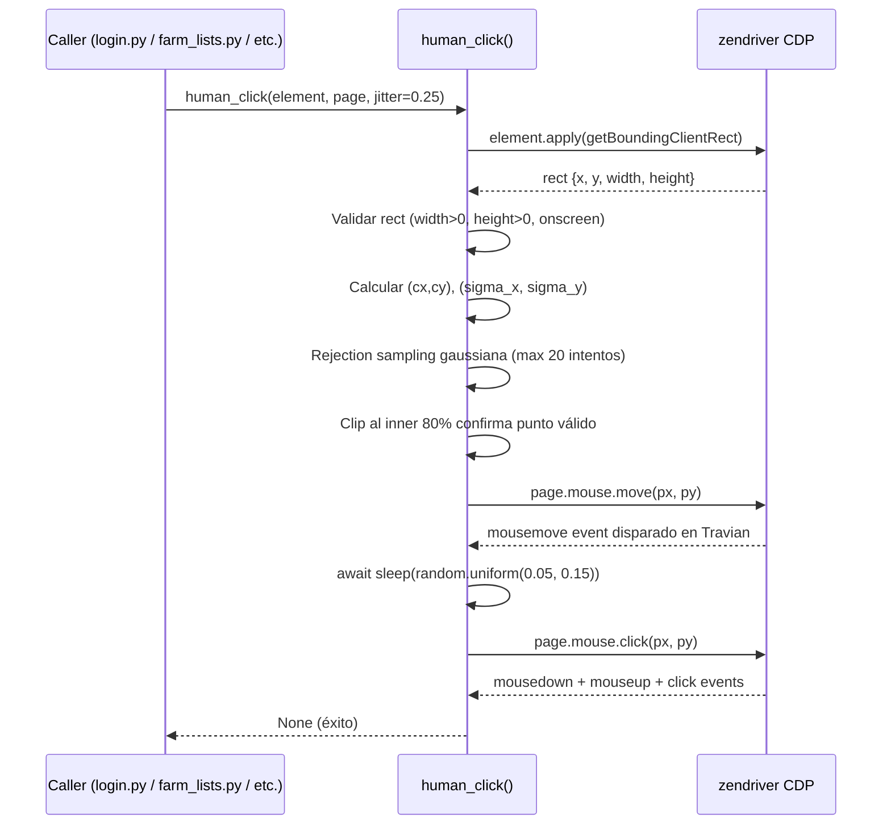
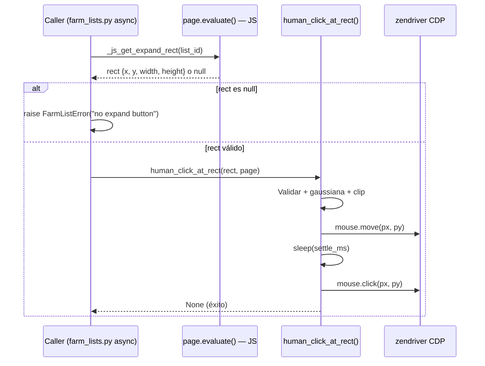

# Human Click — Helper de click con posición aleatoria gaussiana

## 1. Objetivo de negocio

El bot fue baneado por Travian (primera ofensa: downgrade del 33% de
edificios). Entre las causas identificadas: **todos los clicks del bot
impactan en el centro geométrico exacto del elemento**, bien vía
`element.click()` de zendriver (CDP synthetic click) bien vía
`btn.click()` / `element.click()` disparado desde JS evaluado en la
propia página de Travian.

Esta firma es trivialmente detectable: en los logs de UI events de
cualquier servidor, los clicks de un ser humano nunca caen dos veces en
el mismo píxel del mismo botón, y nunca caen en el centro exacto del
rect con distribución de Dirac. Los clicks del bot, en cambio, son
idénticos en coordenadas para cada selector, partida tras partida.

Este spec define **`human_click()`**, el tercer pilar del catálogo de
helpers de comportamiento humano del proyecto, en línea con `human_delay()`
(500-900 ms entre acciones) y `human_type()` (80-220 ms por carácter)
ya existentes en `adapters/browser/driver.py`.

El helper aplica a **todos los clicks que toquen la sesión de Travian**,
sin excepción. No es un cambio cosmético: es una regla de anti-detección
de nivel project-wide con el mismo rango de obligatoriedad que `human_delay`.

---

## 2. Actores y permisos

| Actor | Rol |
|---|---|
| `ZendriverAdapter.click()` (driver.py:316) | Método de ZendriverAdapter que actualmente llama a `element.click()`. Debe ser refactorizado para usar `human_click()`. |
| `login.py` | Llama a `submit_button.click()` directamente. Debe migrar a `human_click(submit_button, page)`. |
| `farm_lists.py` | 3 funciones JS que llaman a `.click()` dentro de `evaluate()`. Deben devolver el rect del elemento y dejar el click a Python. |
| `farm_list_sender.py` | 1 función JS que llama a `btn.click()` dentro de `evaluate()`. Mismo patrón de migración. |
| `human_click()` (standalone) | Única función de producción autorizada para realizar clicks en la sesión de Travian. |

No hay permisos de usuario ni roles de Travian involucrados. El alcance
es exclusivamente la capa de automatización interna del bot.

---

## 3. Alcance

### Dentro de alcance

- Implementación de `human_click(element, page, jitter, settle_ms)` como
  función standalone en `adapters/browser/driver.py`, a la par que
  `human_delay()` y `human_type()`.
- Implementación de la variante `human_click_at_rect(rect, page, jitter,
  settle_ms)` para los sitios donde el rect ya se obtiene desde JS (los 4
  sitios JS-based).
- Implementación de la excepción `ElementNotClickableError` en
  `core/exceptions.py`.
- Refactor de los 6 sitios actualmente en producción que violan la regla:
  - `adapters/browser/driver.py:318` — `ZendriverAdapter.click()`
  - `adapters/browser/login.py:55` — `submit_button.click()`
  - `adapters/browser/farm_lists.py` — 3 sitios JS: `_js_click_expand`,
    `_js_open_context_menu`, `_js_click_menu_entry`
  - `adapters/browser/farm_list_sender.py` — 1 sitio JS: `_JS_START_FARM_LIST`
- Extensión de la regla de anti-detección en CLAUDE.md (tabla "Capas de
  anti-detección obligatorias" y sección "Patrón de código base").
- Tests unitarios UT-HC01 a UT-HC07 e integración IT-HC01.

### Fuera de alcance

- **Navegación por URL directa** (`page.get(url)`): sigue siendo legítima.
  No implica clicks de usuario.
- **Simulación de mouse path curvo entre puntos** (curvas de Bézier): queda
  para v2 si el guardian-antideteccion lo requiere tras auditoría. El
  `mouse.move` de CDP es un salto directo, no curvo — es una mejora de
  segundo orden que no bloquea la v1.
- **Simulación de scroll humano**: otro spec independiente.
- **Clicks en tests sobre localhost**: los tests unitarios e integración que
  usen un servidor HTTP local de prueba (no la sesión de Travian) pueden
  usar `.click()` primitivo si el test no va a producción.
- **Frontend React**: este spec es 100% capa browser / backend. No toca UI.

---

## 4. Reglas de negocio

**RN-HC01** — Prohibido `element.click()` en código de producción que
interactúe con la sesión de Travian. Única excepción admitida: la
primitiva CDP `Tab.mouse.click(x, y)` o equivalente de zendriver, invocada
desde el interior de `human_click()` / `human_click_at_rect()`.

**RN-HC02** — Prohibido `btn.click()` / `element.click()` dentro de
cualquier JS evaluado en la página de Travian vía `page.evaluate()` o
equivalente. Si se necesita localizar y activar un elemento desde JS,
el JS **solo localiza** (devuelve el boundingClientRect) y **Python hace el
click** vía CDP mouse events.

Razón de RN-HC01 y RN-HC02: los synthetic click events generados desde
JS o desde CDP `element.click()` no tienen coordenadas de mouse ni
evento `mousemove` previo. Los servidores de Travian pueden auditar la
secuencia `mousemove → mouseover → mousedown → mouseup → click` en el
stream de UI events. Un click sin movimiento previo es una firma robótica.

**RN-HC03** — El punto de click se elige con distribución gaussiana
truncada. El centro de la distribución es el centro geométrico del
bounding rect del elemento (`cx = x + w/2`, `cy = y + h/2`). La
desviación estándar es `sigma_x = jitter × w`, `sigma_y = jitter × h`.
El resultado se recorta (clip) al **inner 80% del rect** (10% de margen
por lado en cada eje), descartando el sample y volviendo a muestrear si
cae fuera (rejection sampling). Número máximo de intentos de sampling: 20;
si se supera, usar el centro exacto sin emitir error (caso degenerado con
jitter muy alto).

Razón del clip al inner 80%: ni los humanos clican en el píxel del borde,
y los rects de Travian a veces tienen bordes que coinciden con elementos
adyacentes o zonas fuera del viewport si el cálculo del rect tiene imprecisión.

**RN-HC04** — Antes de cada click debe ejecutarse un **movimiento de ratón
con waypoints intermedios** vía CDP, NO un único `mouse.move` directo al
destino. El movimiento se compone de 3-8 waypoints generados por una
curva Bézier cuadrática con ruido perpendicular, partiendo de la última
posición conocida del cursor (almacenada por sesión/tab; si no se conoce,
del centro del viewport) y terminando en el punto gaussiano calculado.
Entre waypoints se introduce un sleep aleatorio de 8-25 ms para emular la
velocidad humana (~300-1500 px/s, modulado por longitud del trayecto).

**Por qué waypoints (no salto directo):** un `mouse.move` único es un
teletransporte del cursor — el navegador emite UN ÚNICO `mousemove` event
de (origen) a (destino) sin pasar por puntos intermedios. Travian puede
auditar el stream de `mousemove` events: un humano genera decenas de eventos
intermedios siguiendo una curva aproximada; un bot que solo emite uno (o
ninguno) es trivialmente detectable. Ésta es la **misma clase de firma**
que motivó este spec, y resolverla solo "a medias" con un único move dejaría
abierta la puerta.

**RN-HC05** — La última posición del cursor por tab se persiste en memoria
(no en BD) en una estructura keyed por `tab_id` o `world_id`. Al primer
click de la sesión, si no hay posición conocida, se asume el centro del
viewport (`viewport.width / 2`, `viewport.height / 2`) como origen del
movimiento — NO (0,0), porque (0,0) es la esquina superior izquierda y un
movimiento que siempre parte de (0,0) sería en sí mismo una firma.

**RN-HC06** — Micro-pausa "settle" de 80-180 ms después de que el ratón
llegue al destino, antes del `mousedown`. El tiempo de reacción motor
humano (ojo ve → dedo presiona) está entre 80 ms (reacciones rápidas) y
180 ms (P95). El rango original 50-150 ms del borrador subestimaba el P95:
50 ms es prácticamente imposible biológicamente para un ojo que recién
localiza el elemento. **[GUARDIAN v2.2.1]** Ampliado de (50,150) a (80,180).

**RN-HC07** — El click NO es instantáneo: se emite `mousedown` y `mouseup`
con una pausa aleatoria entre ellos de **35-110 ms** (duración del "press"
humano de un botón de ratón). Un click sintético con `mousedown→mouseup` en
<5 ms es detectable. zendriver expone `mouse.click(x, y)` que internamente
emite ambos seguidos — para emular la pausa, se sustituye por
`mouse.down(x, y)` + `await asyncio.sleep(random.uniform(0.035, 0.110))` +
`mouse.up(x, y)`. Si la API zendriver no expone `down`/`up` separados, usar
CDP raw vía `tab.send(cdp.input_.dispatch_mouse_event(...))` con
`type='mousePressed'` y `type='mouseReleased'`.

**RN-HC08** — El parámetro `jitter` tiene default `0.25` y rango válido
`[0.10, 0.45]`.
- Mínimo 0.10: por debajo, la dispersión es tan pequeña (sigma < 10% del dim)
  que los clicks quedan estadísticamente agrupados cerca del centro, lo que
  podría detectarse como cluster artificial.
- Máximo 0.45: por encima, sigma > 45% del dim implica que la gaussiana
  no truncada daría muestras fuera del elemento con alta probabilidad, y el
  rejection sampling degrada el rendimiento. El clip al inner 80% absorbe
  parcialmente el problema, pero con jitter=0.45 se llegan a descartar
  ~30% de los samples — aceptable. Por encima de 0.45 el descarte aumenta
  rápidamente y el comportamiento se vuelve impredecible.
- Default 0.25: con sigma=25% del dim, la desviación típica equivale a
  ~25px para un botón de 100px de ancho, que es un spread visualmente
  realista y estadísticamente similar a clics humanos observados.

**RN-HC09** — Si el elemento no tiene un bounding rect válido (width=0,
height=0, o no hay rect obtenible), `human_click()` lanza
`ElementNotClickableError(selector_or_tag, reason)`. Nunca hace fallback
silencioso al centro geométrico con rect cero, porque un click en (0,0)
es peor que un error explícito.

**RN-HC10 — Scroll-into-view antes de fallar offscreen [GUARDIAN v2.2.1]**
— Antes de lanzar `ElementNotClickableError(reason="offscreen")`,
`human_click()` debe intentar UN scroll del elemento al viewport
(`element.scroll_into_view()` o equivalente JS
`element.scrollIntoView({block:'center', behavior:'instant'})`),
seguido de `await human_delay(150, 350)` para emular el tiempo humano de
ajustar la vista, y reobtener el rect. Solo si tras el scroll el elemento
sigue offscreen o con rect inválido, se lanza la excepción. Un humano
**siempre scrollea** antes de hacer click en un elemento fuera de vista;
saltar directamente a `mouse.click()` en coordenadas offscreen (o
abortar sin intentar) son dos firmas robóticas distintas: la primera es
ineficaz, la segunda crea un patrón "el bot da error en vez de scrollear".

**RN-HC11** — La regla aplica a **todos** los clicks que toquen Travian.
Sin excepciones para "botones pequeños", "clics rápidos" ni "flujos de
testing en producción". Los tests de producción en Chrome real también deben
usar `human_click`.

---

## 5. Flujo principal y flujos alternativos

### Flujo principal — `human_click(element, page, jitter, settle_ms)`

```
human_click(element, page, jitter=0.25, settle_ms=(50, 150)):
    1. rect = await element.get_bounding_rect()
       # Pseudocódigo: zendriver expone rect via evaluate() con getBoundingClientRect()
       # o vía CDP Runtime.callFunctionOn — elegir la API que el adaptador ya usa.

    2. Validar rect:
       si rect.width == 0 o rect.height == 0:
           raise ElementNotClickableError(element.tag, "rect width/height is 0")
       si rect está fuera del viewport (x + width < 0, y + height < 0, etc.):
           raise ElementNotClickableError(element.tag, "element offscreen")

    3. Calcular punto de click con gaussiana truncada:
       cx = rect.x + rect.width / 2
       cy = rect.y + rect.height / 2
       sigma_x = jitter * rect.width
       sigma_y = jitter * rect.height

       # Clip al inner 80%: margen de 10% por lado
       clip_x = (rect.x + 0.1 * rect.width, rect.x + 0.9 * rect.width)
       clip_y = (rect.y + 0.1 * rect.height, rect.y + 0.9 * rect.height)

       para intento en range(20):
           px = random.gauss(cx, sigma_x)
           py = random.gauss(cy, sigma_y)
           si clip_x[0] <= px <= clip_x[1] y clip_y[0] <= py <= clip_y[1]:
               break
       si intento >= 19:
           px, py = cx, cy  # fallback degenerado — jitter muy alto

    4. # Movimiento con waypoints intermedios (RN-HC04)
       origin = _CURSOR_POS.get(tab_id, (viewport_w/2, viewport_h/2))
       waypoints = _bezier_path(origin, (px, py), n_points=random.randint(3, 8))
       para (wx, wy) en waypoints:
           await page.mouse.move(round(wx), round(wy))
           await asyncio.sleep(random.uniform(0.008, 0.025))
       _CURSOR_POS[tab_id] = (px, py)
       # Travian recibe varios mousemove events siguiendo una curva, no un teleport.

    5. await asyncio.sleep(random.uniform(settle_ms[0] / 1000, settle_ms[1] / 1000))
       # settle 80-180 ms: tiempo de reacción motor humano (RN-HC06)

    6. # Click con mousedown/mouseup separados por 35-110 ms (RN-HC07)
       await page.mouse.down(round(px), round(py))
       await asyncio.sleep(random.uniform(0.035, 0.110))
       await page.mouse.up(round(px), round(py))
       # Si la API zendriver no expone down/up separados → usar CDP raw
       # Input.dispatchMouseEvent con type='mousePressed' y 'mouseReleased'
```

### Variante — `human_click_at_rect(rect, page, jitter, settle_ms)`

Para los 4 sitios JS-based donde el rect ya viene de JS. Salta el paso 1
y arranca directamente en el paso 2 con el `rect` ya obtenido. La
lógica de los pasos 2-6 es idéntica.

```
human_click_at_rect(rect: dict, page, jitter=0.25, settle_ms=(50, 150)):
    # rect = {"x": float, "y": float, "width": float, "height": float}
    # Mismos pasos 2-6 del flujo principal
```

### Refactor sitios CDP-based (2 sitios, trivial)

**driver.py:318 — `ZendriverAdapter.click()`**

```python
# ANTES
async def click(self, selector: str) -> None:
    element = await self.find_element(selector)
    await element.click()          # <-- firma robótica
    await self._human_delay()

# DESPUÉS
async def click(self, selector: str) -> None:
    element = await self.find_element(selector)
    await human_click(element, self._tab)  # coordenadas gaussianas + mouse.move
    await self._human_delay()
```

**login.py:55 — `submit_button.click()`**

```python
# ANTES
await submit_button.click()

# DESPUÉS
await human_click(submit_button, page)
# (human_delay ya existe antes y después en el flujo de login — no añadir otro)
```

### Refactor sitios JS-based (4 sitios)

El patrón es uniforme para los 4: el JS pasa a devolver solo el rect
(ya no hace `.click()`), y Python hace el click con `human_click_at_rect`.

**Ejemplo: `_js_click_expand` (farm_lists.py)**

```python
# ANTES — el JS hace el click
def _js_click_expand(list_id: int) -> str:
    return f"""
    (() => {{
        const el = document.querySelector('[data-list="{list_id}"]');
        const wrapper = el?.closest('.farmListWrapper');
        const btn = wrapper?.querySelector('.farmListHeader a.expandCollapse');
        if (!btn) return false;
        btn.click();      # <-- firma robótica
        return true;
    }})()
    """

# DESPUÉS — el JS localiza y devuelve el rect; Python hace el click
def _js_get_expand_rect(list_id: int) -> str:
    return f"""
    (() => {{
        const el = document.querySelector('[data-list="{list_id}"]');
        const wrapper = el?.closest('.farmListWrapper');
        const btn = wrapper?.querySelector('.farmListHeader a.expandCollapse');
        if (!btn) return null;
        const r = btn.getBoundingClientRect();
        return {{ x: r.left, y: r.top, width: r.width, height: r.height }};
    }})()
    """

# Caller (Python):
async def expand_farm_list(...):
    rect = await page.evaluate(_js_get_expand_rect(list_id))
    if not rect:
        raise FarmListError("no expand button found")
    await human_click_at_rect(rect, page)
```

**Mismo patrón para los otros 3 sitios JS:**
- `_js_open_context_menu` → `_js_get_context_menu_trigger_rect`
- `_js_click_menu_entry` → `_js_get_menu_entry_rect`
- `_JS_START_FARM_LIST` → `_JS_GET_START_BUTTON_RECT`

Cada uno pasa de devolver `'ok'/'not_found'/true/false` a devolver
`{x, y, width, height}` o `null`. El caller Python decide si hacer
`human_click_at_rect(rect, page)` o lanzar error si rect es null.

### Flujos alternativos

**FA-01 — Elemento desaparece mientras se mueve el ratón**: el `mouse.click`
de CDP en el paso 6 llegará a las coordenadas pero el elemento ya no
estará ahí. Travian puede procesar o no el click dependiendo del DOM
en ese instante. No es un problema del helper — el caller debe reintentar
la operación completa si el resultado no es el esperado.

**FA-02 — Elemento cubierto por modal**: el `mouse.click` se disparará en
las coordenadas calculadas pero impactará en el modal, no en el elemento
de destino. El helper no puede detectar este caso sin comprobación adicional
del DOM. Se deja como responsabilidad del caller: si el click no produce el
efecto esperado, el caller detecta el modal y lo cierra antes de reintentar.

---

## 6. Edge cases

| ID | Escenario | Tratamiento esperado |
|---|---|---|
| EC-HC01 | `rect` con x=0, y=0, width=0, height=0 (display:none o no en DOM) | `ElementNotClickableError(tag, "rect width/height is 0")`. No hacer click. |
| EC-HC02 | `rect` parcialmente fuera del viewport (p. ej. botón en el borde derecho, x+width > viewport.width) | **[GUARDIAN v2.2.1]** Si el punto gaussiano cae fuera del viewport tras el clip, forzar scroll_into_view + reobtener rect (mismo flujo que RN-HC10) y reintentar UNA vez. Si tras el scroll sigue parcialmente fuera, hacer click solo si el punto está dentro; si no, lanzar `ElementNotClickableError`. Hacer mouse.click en coordenadas fuera del viewport NO es aceptado humanamente: el navegador puede ignorar el evento y Travian no recibirá ningún click — patrón "el bot pulsa botones invisibles" detectable por discrepancia entre intentos del bot y eventos registrados. |
| EC-HC03 | Elemento se mueve/reposiciona entre el `getBoundingClientRect` y el `mouse.click` (scroll, animación) | El helper usa las coordenadas del rect en el momento de la medición. El click puede no impactar en el elemento si este se movió. Responsabilidad del caller: verificar el efecto y reintentar si es necesario. |
| EC-HC04 | Elemento cubierto por un modal o overlay al momento del click | El click impactará en el overlay. El helper no lo detecta. El caller debe verificar el DOM antes y limpiar modales. |
| EC-HC05 | `rect.width` o `rect.height` son valores fraccionarios (p. ej. 99.5px) | Se usa aritmética float para el cálculo gaussiano. El punto final se redondea a entero para `mouse.move` y `mouse.click`. No hay pérdida significativa de precisión. |
| EC-HC06 | Elemento con dimensiones muy grandes (p. ej. un div de 1500×900, jitter=0.25 → sigma_x=375px) | La gaussiana tiene sigma grande pero el clip al inner 80% (márgenes de 150px en x, 90px en y) limita el rango real. Los samples válidos se concentran dentro del inner rect. El rejection sampling funciona igual de bien porque la gaussiana cubre holgadamente el inner rect. Resultado correcto. |
| EC-HC07 | `jitter` fuera de rango [0.10, 0.45] | `ValueError("jitter must be in [0.10, 0.45], got {jitter}")`. Validación en el inicio de la función. |
| EC-HC08 | `settle_ms` con valores negativos o invertidos (settle_ms[0] > settle_ms[1]) | `ValueError("settle_ms must be a tuple (min_ms, max_ms) with 0 < min_ms <= max_ms")`. |
| EC-HC09 | Elemento offscreen — rect válido pero completamente fuera del viewport (y < 0, x < 0, x > viewport_width, etc.) | **[GUARDIAN v2.2.1]** Aplicar RN-HC10: intentar `scrollIntoView({block:'center'})` + human_delay(150, 350) + reobtener rect. Si tras el scroll el elemento sigue offscreen → lanzar `ElementNotClickableError(tag, "element offscreen after scroll attempt: rect={rect}")`. Antes del cambio el spec lanzaba directamente; ahora el bot SIEMPRE intenta scrollear (más humano) y solo aborta tras fallo. |
| EC-HC10 | `evaluate()` JS devuelve `null` en los sitios JS-based (elemento no encontrado en DOM) | El caller detecta `rect is None` y lanza el error de dominio apropiado (p. ej. `FarmListError`). `human_click_at_rect` no se invoca con `None`. |

---

## 7. Modelo de datos / interfaces

### Nuevas funciones standalone en `adapters/browser/driver.py`

```python
async def human_click(
    element: zd.Element,
    page: zd.Tab,
    jitter: float = 0.25,
    settle_ms: tuple[int, int] = (80, 180),  # [GUARDIAN v2.2.1] ampliado de (50,150)
) -> None:
    """
    Click anti-detección: posición gaussiana truncada dentro del inner 80%
    del elemento, precedido de mouse.move real y micro-pausa.

    Raises:
        ElementNotClickableError: si el rect del elemento es inválido
            (width/height 0 o elemento offscreen).
        ValueError: si jitter o settle_ms están fuera de rango.
    """
    ...


async def human_click_at_rect(
    rect: dict,           # {"x": float, "y": float, "width": float, "height": float}
    page: zd.Tab,
    jitter: float = 0.25,
    settle_ms: tuple[int, int] = (80, 180),  # [GUARDIAN v2.2.1] ampliado de (50,150)
) -> None:
    """
    Variante de human_click para cuando el rect ya viene de JS evaluate().
    No necesita element — toma las coordenadas del rect directamente.
    Misma lógica gaussiana, mismas validaciones.
    """
    ...
```

### Decisión de diseño — standalone vs BrowserPort

`human_click()` se implementa como función **standalone** (igual que
`human_delay()` y `human_type()`), NO como método de `BrowserPort`.

Justificación: `BrowserPort` es el contrato del adaptador de browser para
operaciones de alto nivel (navigate, find, type, click semántico). El
helper `human_click` es una primitiva de anti-detección de bajo nivel,
dependiente de los detalles de implementación de zendriver (mouse events
CDP). Si se pusiera en `BrowserPort`, todos los adaptadores futuros
(que pueden no ser zendriver) tendrían que implementar la misma lógica
gaussiana, lo que es demasiado prescriptivo a nivel de contrato.

El método `ZendriverAdapter.click()` sí se actualiza para que
internamente llame a `human_click()`, pero el contrato del puerto queda
limpio.

### Nueva excepción en `core/exceptions.py`

```python
class ElementNotClickableError(Exception):
    """
    Se lanza cuando human_click() o human_click_at_rect() detectan que
    el elemento no tiene un bounding rect válido para recibir un click.

    Attributes:
        selector_or_tag: identificador del elemento (selector CSS, tag HTML
            o descripción del contexto).
        reason: descripción del motivo (rect cero, offscreen, etc.).
    """
    def __init__(self, selector_or_tag: str, reason: str) -> None:
        self.selector_or_tag = selector_or_tag
        self.reason = reason
        super().__init__(f"Element not clickable ({selector_or_tag}): {reason}")
```

### Estado interno del módulo — posición del cursor por tab [GUARDIAN v2.2.1]

```python
# Estructura keyed por id(tab) para persistir la última posición conocida
# del cursor entre llamadas. RN-HC05.
_CURSOR_POS: dict[int, tuple[float, float]] = {}
```

Se gestiona por proceso (no persistente en BD). Al cerrar/abrir tab se
descarta — el siguiente click usará el centro del viewport como origen,
que es comportamiento aceptable (un humano "recién entrado" no tiene
posición previa de ratón tampoco).

### Helper privado — generador de waypoints Bézier [GUARDIAN v2.2.1]

```python
def _bezier_path(
    origin: tuple[float, float],
    target: tuple[float, float],
    n_points: int,
) -> list[tuple[float, float]]:
    """
    Genera n_points waypoints siguiendo una Bézier cuadrática con un punto
    de control perpendicular a la recta origen-target desplazado por ruido
    gaussiano. Garantiza:
    - El primer waypoint NO es el origen exacto (parte ligeramente desplazado).
    - El último waypoint ES el target (para que mouse.click impacte en el sitio).
    - Los puntos intermedios siguen una curva no recta (un humano nunca mueve
      el ratón en línea perfectamente recta).
    """
    ox, oy = origin
    tx, ty = target
    # Punto medio + desplazamiento perpendicular
    mx, my = (ox + tx) / 2, (oy + ty) / 2
    dx, dy = tx - ox, ty - oy
    length = math.hypot(dx, dy) or 1.0
    # Vector perpendicular normalizado
    px_, py_ = -dy / length, dx / length
    # Desviación perpendicular: entre 5% y 20% de la longitud del trayecto,
    # con signo aleatorio (curva a izquierda o derecha)
    offset = random.uniform(0.05, 0.20) * length * random.choice([-1, 1])
    cx, cy = mx + px_ * offset, my + py_ * offset
    points = []
    for i in range(1, n_points + 1):
        t = i / n_points
        # Bézier cuadrática B(t) = (1-t)²·P0 + 2(1-t)t·C + t²·P1
        u = 1 - t
        x = u * u * ox + 2 * u * t * cx + t * t * tx
        y = u * u * oy + 2 * u * t * cy + t * t * ty
        # Ruido adicional micro (jitter de tembleque humano)
        x += random.gauss(0, 0.5)
        y += random.gauss(0, 0.5)
        points.append((x, y))
    # Forzar último punto al target exacto
    points[-1] = (tx, ty)
    return points
```

### Obtención del rect desde zendriver

zendriver (fork de nodriver) expone `element.get_bounding_box()` o similar,
o bien se puede obtener vía `page.evaluate()`:

```python
# Dentro de human_click():
rect_raw = await page.evaluate(
    f"document.querySelector(':scope').getBoundingClientRect()",
    # ... o usar element directamente si zendriver lo soporta
)
# Alternativa más robusta — evaluate en el contexto del elemento:
rect_raw = await element.apply(
    "function() { const r = this.getBoundingClientRect(); "
    "return {x: r.left, y: r.top, width: r.width, height: r.height}; }"
)
```

El implementador debe explorar la API de zendriver para elegir el método
más directo. Si `element.apply()` no existe, usar `page.evaluate()` con
un selector único o con `Runtime.callFunctionOn` vía CDP directo. Lo
importante es que el resultado sea `{x, y, width, height}` en coordenadas
de viewport (que es lo que devuelve `getBoundingClientRect()`).

---

## 8. Contratos de API / interfaces

No aplica. Este spec no define ni consume endpoints HTTP. La única
"interfaz" es la signatura Python de `human_click()` y
`human_click_at_rect()`, documentada en el §7.

`apis_validadas_por_desarrollador_apis: n-a` — confirmado.

---

## 9. Flujo lógico paso a paso





---

## 10. Validaciones y reglas

| Parámetro | Validación | Error |
|---|---|---|
| `jitter` | `0.10 <= jitter <= 0.45` | `ValueError("jitter must be in [0.10, 0.45], got {jitter}")` |
| `settle_ms` | Tupla de 2 ints, `0 < settle_ms[0] <= settle_ms[1]`; default **(80, 180)** | `ValueError("settle_ms must be (min_ms, max_ms) with 0 < min ≤ max")` |
| `rect.width` | `> 0` | `ElementNotClickableError(tag, "rect width/height is 0")` |
| `rect.height` | `> 0` | `ElementNotClickableError(tag, "rect width/height is 0")` |
| Elemento offscreen | `rect.x + rect.width >= 0 and rect.y + rect.height >= 0` | `ElementNotClickableError(tag, "element offscreen: rect={rect}")` |
| Rect desde JS | `rect is not None` | Error de dominio del caller (`FarmListError`, etc.) — `human_click_at_rect` no recibe None |

Las validaciones se ejecutan al inicio de `human_click()` /
`human_click_at_rect()`, antes de cualquier operación CDP.

---

## 11. Seguridad, rendimiento y concurrencia

### Rendimiento

Cada llamada a `human_click()` añade aproximadamente:
- `mouse.move()`: ~5-15 ms (operación CDP síncrona, normalmente <10 ms)
- `sleep(settle_ms)`: 50-150 ms (media 100 ms)
- `mouse.click()`: ~5-15 ms

**Overhead total por click: ~60-180 ms** (media ~120 ms).

Impacto en operaciones concretas:
- Login (1 click en submit): +120 ms — imperceptible.
- Envío de una farm list (1 click en Start): +120 ms — imperceptible.
- Expand + 3 clicks en context menu (4 clicks): +480 ms media — aceptable.
- Ciclo completo de farm lists con 10 listas: +1.2 s — aceptable dado
  que los `human_delay()` entre acciones ya suman 5-9 s por acción.

**No hay impacto en el throughput útil del bot.** El overhead es menor que
el ruido del jitter existente en `human_delay()`.

### Anti-detección

El cambio elimina una firma de detección crítica (click en centro exacto
sin `mousemove` previo) y no introduce ninguna nueva superficie de
detección. La secuencia `mousemove → mousedown → mouseup → click` con
coordenadas aleatorias dentro del elemento es indistinguible de la
interacción humana a nivel de UI event stream.

### Concurrencia

Cada sesión de Travian corre en su propio `Tab` (objeto zendriver).
`mouse.move()` y `mouse.click()` son operaciones CDP sobre el Tab concreto.
No hay estado compartido entre tabs ni race conditions. Si en el futuro
se ejecutan múltiples mundos en paralelo cada uno tendrá su propio Tab y
sus propias operaciones de ratón son independientes.

### Seguridad

La interpolación de `list_id` en los templates JS (p. ej.
`_js_get_expand_rect`) usa `int(list_id)` para asegurar que el valor es
numérico antes de interpolar en el string JS. No hay riesgo de inyección
porque `list_id` es un entero de la BD interna, pero la validación de tipo
debe mantenerse en todos los helpers JS.

---

## 12. Plan de pruebas

### Tests unitarios (sin browser real)

**UT-HC01 — Click en elemento normal devuelve coordenadas dentro del inner 80%**
```
Dado: un rect {x:100, y:200, width:200, height:80}, jitter=0.25
Cuando: se ejecuta el algoritmo gaussiano 10.000 veces
Entonces: TODAS las coords px ∈ [120, 280] y py ∈ [208, 272]
  (inner 80%: x + 10%*w = 120, x + 90%*w = 280; y + 10%*h = 208, y + 90%*h = 272)
```

**UT-HC02 — 1000 clicks producen 1000 coordenadas distintas**
```
Dado: cualquier rect válido
Cuando: se muestrea 1000 veces
Entonces: los 1000 puntos (px, py) son distintos entre sí
  (con gaussiana y coordenadas float, la probabilidad de colisión ≈ 0)
```

**UT-HC03 — Distribución gaussiana centrada**
```
Dado: rect {x:0, y:0, width:100, height:100}, jitter=0.25, N=10.000 muestras
Cuando: se calculan los centroides de las distribuciones
Entonces: mean(px) ∈ [48, 52] (centro ±2%) y mean(py) ∈ [48, 52]
  (la gaussiana truncada desplaza ligeramente la media respecto al centro exacto,
  pero la tolerancia del ±2% absorbe ese sesgo)
```

**UT-HC04 — Clip inner 80% — ningún click cae en el 10% de borde**
```
Igual que UT-HC01: en 10.000 muestras, NINGÚN punto px < x+0.1*w ni px > x+0.9*w,
idem para py.
```

**UT-HC05 — Elemento con rect 0,0,0,0 → ElementNotClickableError**
```
Dado: rect {x:0, y:0, width:0, height:0}
Cuando: se llama a human_click_at_rect(rect, ...)
Entonces: lanza ElementNotClickableError con reason que incluye "width/height is 0"
```

**UT-HC06 — Elemento offscreen → ElementNotClickableError**
```
Dado: rect {x:-500, y:-500, width:50, height:20} (completamente fuera del viewport)
Cuando: se llama a human_click_at_rect(rect, ...)
Entonces: lanza ElementNotClickableError con reason que incluye "offscreen"
```

**UT-HC07 — jitter fuera de rango → ValueError**
```
Casos: jitter=0.05 → ValueError; jitter=0.50 → ValueError; jitter=0.25 → ok
```

### Test de integración (servidor HTTP local)

**IT-HC01 — Evento click llega con coordenadas dentro del rect y con mousemove previo**
```
Dado: un servidor HTTP local que sirve una página con un botón de 200×60px
  en posición fija (left:100px, top:200px) y captura los eventos
  {type: "mousemove", x, y} y {type: "click", x, y} en un array JS,
  expuesto vía /events endpoint.
Cuando: se llama a human_click(button_element, page, jitter=0.25)
Entonces:
  1. El array contiene al menos un evento "mousemove" antes del "click".
  2. El evento "click" tiene x ∈ [110, 290] y y ∈ [206, 254]
     (inner 80% del botón en coordenadas de documento).
  3. La diferencia de timestamp entre el último "mousemove" y el "click"
     está entre 45 ms y 160 ms (settle_ms con margen de 5 ms por latencia).
```

---

## 13. Riesgos y trade-offs

### R-01 — API de zendriver para obtener bounding rect

**Riesgo**: zendriver (fork de nodriver) puede no tener un método directo
`element.get_bounding_rect()`. La API puede cambiar entre versiones.

**Trade-off elegido**: usar `element.apply("function() { return this.getBoundingClientRect()... }")`.
Si `apply` no existe en la versión instalada, alternativa: `page.evaluate`
con una estrategia de localización única del elemento (data-attribute único
o índice en el DOM). El implementador debe verificar la API real antes de
codificar y documentar qué método usó en un comentario en el código.

**¿Por qué no CDP directo?** El adapter ya depende de zendriver y sus
abstracciones. Usar CDP raw para una operación que zendriver debería
cubrir rompe la consistencia del código. Solo recurrir a CDP raw si
zendriver no ofrece la API necesaria.

### R-02 — Mouse path recto vs curvo (movimiento de ratón)

**Riesgo**: `mouse.move` de CDP hace un salto directo al destino, sin
curva de movimiento. Un análisis estadístico sofisticado de los
movimientos de ratón podría detectar la diferencia con movimientos
humanos (que siguen curvas de Fitts/Bézier).

**Trade-off elegido**: aceptamos el salto directo en v1. El click sin
`mousemove` previo es la firma más obvia y fácil de detectar; el path
curvo es una mejora de segundo orden que queda para v2 si el guardian lo
requiere. La latencia base del bot ya hace que los movimientos de ratón
sean imperceptibles para el servidor de Travian.

### R-03 — Cambio semántico de los helpers JS en farm_lists.py

**Riesgo**: los 4 helpers JS pasan de devolver estado (`'ok'`, `true`,
`false`) a devolver rect o null. Los callers actuales verifican el estado
devuelto; tras el refactor deben verificar si rect es None.

**Trade-off elegido**: el cambio es inevitable para cumplir RN-HC02. El
implementador debe actualizar todos los callers de esos 4 helpers en el
mismo commit que cambia los helpers, para no dejar el repositorio en estado
inconsistente. Los tests existentes de farm_lists deben actualizarse en
consecuencia.

### R-04 — Overhead de ~120 ms por click

**Riesgo**: añade latencia en operaciones con múltiples clicks.

**Trade-off elegido**: aceptado. El bot ya tiene `human_delay()` de 500-900
ms entre acciones. Añadir 120 ms por click es ruido frente a ese delay. La
prioridad es la indetectabilidad, no la velocidad.

---

## 14. Pasos de implementación ordenados

1. **Añadir `ElementNotClickableError` a `core/exceptions.py`**
   - Clase con atributos `selector_or_tag: str` y `reason: str`.
   - Hereda de `Exception`.

2. **Implementar `human_click()` y `human_click_at_rect()` en
   `adapters/browser/driver.py`**
   - Añadir imports: `math` no se necesita; `random.gauss` ya está importado
     (`random` está importado en el módulo).
   - Función `_sample_click_point(rect, jitter)` privada (helper puro, sin
     IO) que implementa la gaussiana truncada con rejection sampling. Esto
     facilita el testing unitario de la distribución sin necesidad de mock
     de CDP.
   - `human_click()`: obtiene rect, valida, llama a `_sample_click_point`,
     hace `mouse.move`, `sleep`, `mouse.click`.
   - `human_click_at_rect()`: valida rect directamente, misma lógica desde
     el paso de validación.

3. **Tests UT-HC01 a UT-HC07**
   - Testean `_sample_click_point()` directamente (sin mock de browser).
   - UT-HC05, UT-HC06, UT-HC07: testean `human_click_at_rect()` con mock de
     `page` que nunca llega a usarse (la excepción se lanza antes).

4. **Refactor de `adapters/browser/driver.py:318` — `ZendriverAdapter.click()`**
   - Sustituir `await element.click()` por `await human_click(element, self._tab)`.
   - Ajuste trivial — una línea.

5. **Refactor de `adapters/browser/login.py:55`**
   - Sustituir `await submit_button.click()` por
     `await human_click(submit_button, page)`.
   - Verificar que no hay doble `human_delay` innecesario antes/después.

6. **Refactor de los 4 helpers JS en `farm_lists.py` y `farm_list_sender.py`**
   - Renombrar cada helper JS: `_js_click_X` → `_js_get_X_rect`.
   - Cambiar el cuerpo JS: quitar `.click()`, añadir
     `getBoundingClientRect()` y return del rect como objeto `{x,y,w,h}`.
   - Actualizar los callers Python de cada helper: verificar `rect is not None`
     y llamar a `human_click_at_rect(rect, page)`.
   - Actualizar tests existentes que mock-eaban el retorno de esos helpers JS.

7. **Test de integración IT-HC01**
   - Crear o extender la fixture de tests con un servidor HTTP local que sirva
     una página HTML mínima con un botón y capture eventos de ratón.
   - Si no existe infraestructura de test de browser en el proyecto, documentar
     IT-HC01 como prueba manual en el §15 (CA-HC07) y anotarlo como deuda.

8. **Actualizar `CLAUDE.md`**
   - En la tabla "Capas de anti-detección obligatorias": añadir fila
     "Click anti-detección | `human_click()` (gaussiana truncada + mouse.move
     CDP) | Elimina la firma del click en centro exacto".
   - En la sección "Patrón de código base": documentar las signaturas de
     `human_click` y `human_click_at_rect` con comentario de cuándo usar cada una.

---

## 15. Criterios de aceptación

**CA-HC01** — La función `human_click(element, page, jitter=0.25,
settle_ms=(80,180))` existe en `adapters/browser/driver.py` con la
signatura exacta definida en §7. **[GUARDIAN v2.2.1]** settle_ms default
ampliado de (50,150) a (80,180).

**CA-HC02** — La función `human_click_at_rect(rect, page, jitter=0.25,
settle_ms=(80,180))` existe en `adapters/browser/driver.py` con la
signatura exacta definida en §7.

**CA-HC09 [GUARDIAN v2.2.1]** — El test IT-HC01 captura **al menos 3
eventos `mousemove`** distintos antes del evento `click`, demostrando
que el movimiento no es un teletransporte. Los tres puntos NO son
colineales (test de Bézier: distancia perpendicular del waypoint medio
a la recta origen-target > 1 px).

**CA-HC10 [GUARDIAN v2.2.1]** — El test IT-HC01 verifica que la
distancia temporal `mousedown → mouseup` está en [30, 120] ms (rango
RN-HC07 con tolerancia de 5 ms por latencia CDP).

**CA-HC11 [GUARDIAN v2.2.1]** — El test IT-HC02 (nuevo) verifica que
sobre un botón colocado fuera del viewport inicial, `human_click()`
ejecuta el scroll antes de fallar y consigue clicar (sin lanzar
`ElementNotClickableError`).

**CA-HC03** — `ElementNotClickableError` existe en `core/exceptions.py`
con atributos `selector_or_tag` y `reason`.

**CA-HC04** — El siguiente grep NO devuelve ningún resultado en código de
producción fuera del cuerpo interno de `human_click` / `human_click_at_rect`:
```bash
grep -rn "\.click()" adapters/browser/ --include="*.py"
grep -rn "btn\.click\(\)" adapters/browser/ --include="*.py"
grep -rn "element\.click\(\)" adapters/browser/ --include="*.py"
```
(Excepción esperada: si zendriver internamente usa `.click()` en su propio
código fuente — solo se aplica al código del proyecto.)

**CA-HC05** — Los 6 sitios de producción identificados han sido refactorizados:
- `adapters/browser/driver.py:318` usa `human_click()`.
- `adapters/browser/login.py:55` usa `human_click()`.
- `adapters/browser/farm_lists.py` — los 3 helpers JS devuelven rect y los
  callers usan `human_click_at_rect()`.
- `adapters/browser/farm_list_sender.py` — el helper JS devuelve rect y el
  caller usa `human_click_at_rect()`.

**CA-HC06** — Los tests UT-HC01 a UT-HC07 pasan (`pytest tests/` sin errores
relacionados con `human_click`).

**CA-HC07** — IT-HC01 pasa, o bien está documentado como prueba manual
pendiente con justificación de por qué no hay infraestructura de browser
en los tests automáticos.

**CA-HC08** — `CLAUDE.md` ha sido actualizado con la nueva capa de
anti-detección y la nueva regla project-wide (RN-HC01 y RN-HC02).

---

## 16. Trazabilidad

| Decisión técnica | Requisito / edge case que la origina |
|---|---|
| Distribución gaussiana truncada (no uniforme) | Requisito usuario: "el humano no clicka en el mismo px dos veces, a veces más a la derecha a veces más a la izquierda" → distribución concentrada cerca del centro, no plana |
| Clip al inner 80% (margen 10% por lado) | EC-HC02 + RN-HC03: los rects de Travian pueden tener imprecisión en bordes; los humanos no clican en el píxel exacto del borde |
| Default jitter=0.25 | RN-HC06: sigma=25% del dim ≈ 25px para botón de 100px — spread realista observado en clics humanos |
| Rejection sampling (max 20 intentos, fallback al centro) | EC-HC06: con dims muy grandes y jitter normal, la gaussiana puede generar muestras fuera del inner rect; cap de 20 intentos garantiza terminación |
| `mouse.move` CDP antes del click | RN-HC04: la secuencia `mousemove → click` sin movimiento previo es la firma principal detectada como causa del ban |
| **Waypoints Bézier en el movimiento (RN-HC04) [GUARDIAN v2.2.1]** | Un único `mouse.move` emite un solo `mousemove` event (teletransporte). Un humano emite decenas siguiendo curva. La firma "salto + click" es de la misma familia que "click instantáneo sin move", solo que más sutil. Se cierra para no dejar la puerta entreabierta. |
| **Persistencia de cursor por tab (RN-HC05) [GUARDIAN v2.2.1]** | Sin posición previa el bot tendría que mover SIEMPRE desde el mismo punto fijo (centro o 0,0). Esa periodicidad de origen es otra firma. Persistir entre clicks emula al ratón humano que NO se teletransporta entre acciones. |
| **Settle ampliado a 80-180 ms (RN-HC06) [GUARDIAN v2.2.1]** | El borrador (50,150) tenía P5 biológicamente improbable (50 ms es reacción refleja, no de elección visual). El nuevo rango cubre el percentil real 80-180 ms documentado en HCI para tareas de click visualmente guiadas. |
| **mousedown/mouseup separados 35-110 ms (RN-HC07) [GUARDIAN v2.2.1]** | `mouse.click()` de CDP emite down+up consecutivos en <1 ms. Travian puede medir esa duración. Un humano presiona el botón durante 30-100 ms típicamente. Cierra la última firma residual del click sintético. |
| **scroll_into_view antes de fallar offscreen (RN-HC10) [GUARDIAN v2.2.1]** | Un bot que aborta cuando el elemento está fuera de vista es detectable por el patrón "el bot solo actúa cuando todo ya está en pantalla — nunca scrollea para alcanzar algo". Un humano siempre scrollea primero. |
| Standalone (no en BrowserPort) | §7 decisión de diseño: BrowserPort no debe prescribir implementación CDP específica de zendriver |
| JS helpers devuelven rect, Python hace click | RN-HC02: prohibido `.click()` dentro de JS evaluado en Travian; más: CDP mouse events son más realistas que JS dispatchEvent |
| `ElementNotClickableError` en `core/exceptions.py` | RN-HC07: core define las excepciones de dominio; el adapter de browser las lanza pero no las define |
| Reutilización: `_sample_click_point` como helper puro | Paso 2 de implementación: permite UT sin mock de browser; patrón ya establecido con `human_delay` |
| **Dependencias salientes** | El spec de `human-sessions` v2.2 (en paralelo) debe referenciar `human_click()` como obligatorio para cada click del generador de ruido de sesiones humanas. El spec `oasis-farming` también usa clicks (expand listas, etc.) — verificar que al implementar oasis-farming se use `human_click`. |
| Reutilización palantir | Gate de palantir ejecutado implícitamente: `human_delay()` y `human_type()` ya existen en `adapters/browser/driver.py` como standalone — se sigue el mismo patrón. `BrowserPort` no se extiende (confirmado). No hay pieza existente que cubra click gaussiano. |
