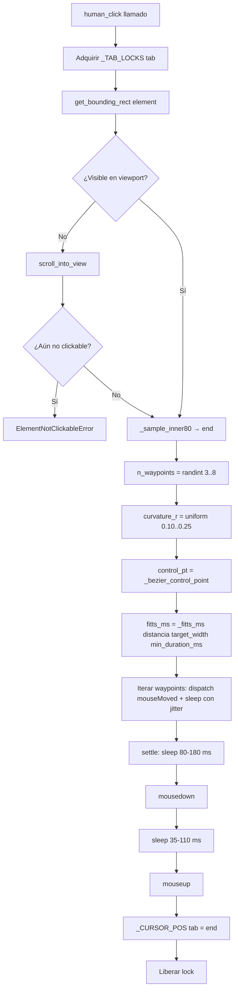
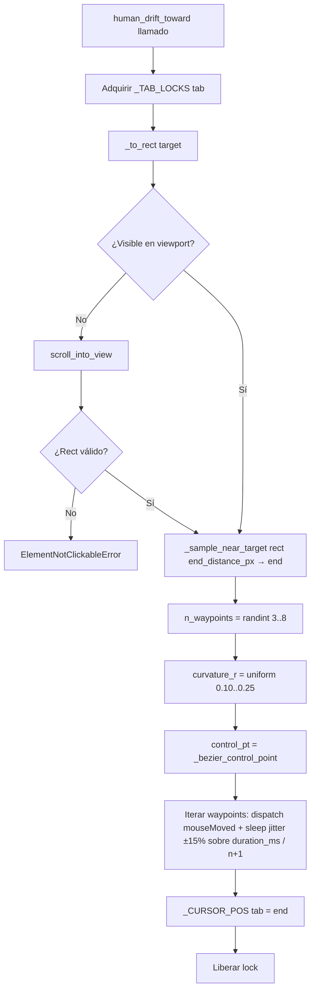

# Movimiento de ratón y click humano indetectable (Bézier + Fitts + Drift)

## 1. Objetivo de negocio

Hacer que cada click del bot sea indistinguible de un click humano real, tanto en la **trayectoria del cursor** (curva Bézier suave, timing basado en la ley de Fitts) como en la **mecánica del click** (mousedown + settle + mouseup separados). Eliminar las dos firmas detectables que permanecían tras v2.2.1:

1. El Bézier completaba en 50-150 ms (rafaga concentrada de mousemoves). Ahora dura 200-800 ms según distancia (ley de Fitts), con jitter ±15% entre waypoints para evitar timing perfecto.
2. Entre clicks el cursor permanecía quieto indefinidamente. Ahora el caller puede invocar `human_drift_toward(target, duration_ms)` para mover el cursor hacia el destino del próximo click aprovechando el tiempo de espera (AJAX, dwell, etc.), de forma que el trayecto final (`human_click`) sea naturalmente corto.

---

## 2. Actores y permisos

| Actor | Rol |
|---|---|
| Cualquier adapter de browser | Caller de `human_click` y `human_drift_toward` |
| `adapters/browser/driver.py` | Módulo que implementa ambas funciones |
| `_CURSOR_POS: dict[tab_id, (x,y)]` | Estado global persistente del cursor por tab |
| `_TAB_LOCKS: dict[tab_id, asyncio.Lock]` | Locks por tab para serializar movimientos concurrentes |

No hay actores externos ni autenticación. Son utilidades internas del bot.

---

## 3. Alcance

### Dentro del alcance

- `human_click(element, tab, min_duration_ms=None)` — función async en `driver.py`.
- `human_drift_toward(target, tab, duration_ms, end_distance_px=20)` — función async nueva en `driver.py`.
- Motor Bézier compartido por ambas funciones.
- Timing Fitts para `human_click`; `duration_ms` íntegro para `human_drift_toward`.
- Curvatura 10-25% random por trayecto.
- `asyncio.Lock` por tab para serializar llamadas concurrentes.
- Actualización de `_CURSOR_POS` en ambas funciones.
- Scroll-into-view si el target está offscreen (en ambas funciones).
- Tests unitarios que no requieran Chrome real.

### Fuera del alcance

- Coroutine ambient de fondo que mueva el cursor sin destino conocido (rechazado explícitamente: los humanos no mueven el ratón sin propósito).
- Post-navigation settling automático (feature separada si se necesita).
- Soporte para multi-tab concurrente en la misma pestaña (el lock lo evita).
- Simulación de scroll de ratón (`mousewheel`) — no forma parte de este spec.

---

## 4. Reglas de negocio

| ID | Regla |
|---|---|
| **RN-HC01** | El cursor tiene una posición global persistente por tab en `_CURSOR_POS[tab]`. Cada `human_click` y `human_drift_toward` actualiza esta posición al terminar. |
| **RN-HC02** | El punto de partida del Bézier es siempre `_CURSOR_POS[tab]`. Si no existe entrada para la tab, el inicio es `(0, 0)` (primera vez en sesión). |
| **RN-HC03** | El punto final del Bézier es un punto aleatorio dentro del inner 80% del bounding rect del target (distribución gaussiana truncada), nunca en el borde exterior. |
| **RN-HC04** | La curva Bézier cúbica usa un control point desplazado perpendicularmente al segmento directo start→end. El desplazamiento perpendicular es `d × r` donde `d` es la distancia euclidiana start→end y `r` es un factor aleatorio uniforme en `[0.10, 0.25]`. El lado del desplazamiento (izquierda/derecha) es aleatorio. |
| **RN-HC05** | El número de waypoints a lo largo de la curva Bézier es aleatorio entero en `[3, 8]`. El paso `t` se reparte uniformemente entre `0` y `1`. |
| **RN-HC06** | Cada waypoint se envía al browser con `tab.set_window_size` o el equivalente de CDP `Input.dispatchMouseEvent` con `type: mouseMoved`. |
| **RN-HC07** | Antes del `mousedown`, existe un "settle" de `random.uniform(80, 180)` ms donde el cursor se detiene en el punto final (simula el micro-stop previo al click). |
| **RN-HC08** | El click se compone de `mousedown` + `asyncio.sleep(random.uniform(35, 110) ms)` + `mouseup`. Nunca `element.click()` directamente. |
| **RN-HC09** | Si el target no está visible en el viewport, se ejecuta scroll-into-view antes del movimiento. Si tras el scroll sigue sin ser clickable, se lanza `ElementNotClickableError`. |
| **RN-HC10** | `ElementNotClickableError(element)` es una excepción de dominio que hereda de `BrowserError`. Se lanza cuando el elemento no puede recibir el click tras el scroll. |
| **RN-HC11** | El selector de elementos es siempre estructural (atributo HTML, clase CSS, etc.), nunca texto visible. Esta función no valida eso — es responsabilidad del caller. |
| **RN-HC12** | **[NUEVO v2.3] Timing total Bézier via Fitts para `human_click`:** `T = a + b × log₂(2 × distance / target_width)`, con `a=100`, `b=80` (milisegundos). El resultado se capa en `[200, 800]` ms. Si `min_duration_ms` se pasa y es mayor que el valor de Fitts, se usa `min_duration_ms` (también capado a 800 ms como máximo). El total se reparte entre `n_waypoints + 1` intervalos con jitter ±15% por intervalo (suma de jitters ≈ 0, no se acumula). |
| **RN-HC13** | **[NUEVO v2.3] Curvatura random por trayecto:** el factor `r` del control point (RN-HC04) es uniforme en `[0.10, 0.25]`, independiente para cada invocación. Cada click tiene una curvatura distinta. Razón: 10-25% da variabilidad explícita por trayectoria y más realismo en trayectorias largas que el rango anterior 5-20%. |
| **RN-HC14** | **[NUEVO v2.3] Parámetro opcional `min_duration_ms`:** `human_click(element, tab, min_duration_ms=None)`. Si `None`, se usa Fitts puro (RN-HC12). Si se pasa un entero positivo, el movimiento dura al menos ese tiempo. Útil cuando el caller sabe que tiene tiempo disponible (p.ej., "tengo 3 s de dwell, repártelos"). Valores ≤ 0 son inválidos → `ValueError`. |
| **RN-HC15** | **[NUEVO v2.3] `human_drift_toward(target, tab, duration_ms, end_distance_px=20)`:** mismo motor Bézier que `human_click`, pero sin click. Termina en un punto aleatorio a `≤ end_distance_px` px del bounding rect del target en dirección aleatoria. No toca el target. `duration_ms` se usa íntegro (el total de sleeps entre waypoints suma a `duration_ms` con jitter ±15%). Actualiza `_CURSOR_POS[tab]`. Si el caller invoca `human_click(target)` después, el trayecto final será corto (cursor ya cerca) y Fitts dará ~150-300 ms. |
| **RN-HC16** | **[NUEVO v2.3] `asyncio.Lock` por tab:** `_TAB_LOCKS[tab]` es un `asyncio.Lock()` creado bajo demanda (si no existe). Tanto `human_click` como `human_drift_toward` adquieren este lock al inicio y lo liberan al terminar, incluyendo en caso de excepción (`async with`). Esto evita condiciones de carrera si por algún bug se invocan ambas concurrentemente en la misma tab. No debe ocurrir en uso normal. |
| **RN-HC17** | **[GUARDIAN v2.3.1] Actualización incremental de `_CURSOR_POS`:** dentro del bucle de waypoints (tanto en `human_click` como en `human_drift_toward`), `_CURSOR_POS[id(tab)]` se actualiza al valor `pt` recién enviado **antes** del sleep. Razón anti-detección: si la tarea se cancela mid-flight (CancelledError, cambio de modo a DISCONNECTED, timeout), el cursor real queda en el último waypoint enviado, no en el `end` previsto. Sin esta actualización incremental, el siguiente `human_click` partiría de una posición fantasma → teletransporte visible en el primer mousemove del nuevo trayecto = firma detectable. |
| **RN-HC18** | **[GUARDIAN v2.3.1] Pre-validación del cursor inicial:** al inicio de cada `human_click`/`human_drift_toward`, antes de calcular el Bézier, validar que `_CURSOR_POS[id(tab)]` esté dentro del viewport actual (`0 ≤ x ≤ viewport_width`, `0 ≤ y ≤ viewport_height`). Si está fuera (cambio de tamaño de ventana, scroll a nueva URL, primer click de sesión con coords stub `(0,0)` y viewport real distinto), resetear a un punto aleatorio del viewport interior (margen 10%) antes de iniciar el movimiento. Razón: CDP `dispatchMouseEvent` con coordenadas fuera del viewport es no-op silencioso en Chrome — el cursor "aparece" en el primer waypoint válido sin trayectoria → teletransporte detectable. |
| **RN-HC19** | **[GUARDIAN v2.3.1] Sleep post-scroll también en drift:** si `human_drift_toward` ejecuta scroll-into-view (target offscreen), aplica el mismo `asyncio.sleep(random.uniform(0.150, 0.350))` post-scroll que `human_click` usa en v2.2.1, antes de medir el rect final y arrancar el Bézier. Razón: el layout puede tardar en asentar tras el scroll (lazy load, transiciones CSS); medir el rect inmediatamente da coords inestables. |

---

## 5. Flujo principal y flujos alternativos

### Flujo principal — `human_click(element, tab, min_duration_ms=None)`

```
human_click(element, tab, min_duration_ms=None)
  └─ async with _TAB_LOCKS[tab]:
       ├─ rect = await element.get_bounding_rect()          # rect del target
       ├─ start = _CURSOR_POS.get(tab, (0, 0))
       ├─ end = _sample_inner80(rect)                       # gaussiana truncada inner 80%
       ├─ n_waypoints = random.randint(3, 8)
       ├─ curvature_r = random.uniform(0.10, 0.25)          # [RN-HC13]
       ├─ control_pt = _bezier_control_point(start, end, curvature_r)
       ├─ distance = euclidean(start, end)
       ├─ target_width = rect.width
       ├─ fitts_ms = clamp(100 + 80 * log2(2 * distance / target_width), 200, 800)
       ├─ total_ms = max(fitts_ms, min_duration_ms or 0)    # [RN-HC14]
       ├─ total_ms = clamp(total_ms, 200, 800)
       ├─ [si element no visible → scroll_into_view → si sigue no clickable → ElementNotClickableError]
       ├─ _validate_or_reset_cursor(tab)                    # [RN-HC18] cursor dentro de viewport
       ├─ for i in [1 .. n_waypoints]:                      # envía mousemoves
       │    t = i / (n_waypoints + 1)
       │    pt = bezier_cubic(start, control_pt, end, t)
       │    await _dispatch_mouse_moved(tab, pt)
       │    _CURSOR_POS[tab] = pt                           # [RN-HC17] actualizar incrementalmente
       │    sleep_base = total_ms / (n_waypoints + 1)
       │    jitter = random.uniform(-0.15, +0.15) * sleep_base
       │    await asyncio.sleep((sleep_base + jitter) / 1000)
       ├─ await asyncio.sleep(random.uniform(0.080, 0.180))  # settle [RN-HC07]
       ├─ await _dispatch_mouse_event(tab, end, "mousedown")
       ├─ await asyncio.sleep(random.uniform(0.035, 0.110))  # hold [RN-HC08]
       ├─ await _dispatch_mouse_event(tab, end, "mouseup")
       └─ _CURSOR_POS[tab] = end                            # persistir posición final
```

### Flujo principal — `human_drift_toward(target, tab, duration_ms, end_distance_px=20)`

```
human_drift_toward(target_or_rect, tab, duration_ms, end_distance_px=20)
  └─ async with _TAB_LOCKS[tab]:
       ├─ rect = _to_rect(target_or_rect)                   # acepta element o rect dict
       ├─ start = _CURSOR_POS.get(tab, (0, 0))
       ├─ end = _sample_near_target(rect, end_distance_px)  # punto aleatorio a ≤ end_distance_px del rect
       ├─ n_waypoints = random.randint(3, 8)
       ├─ curvature_r = random.uniform(0.10, 0.25)
       ├─ control_pt = _bezier_control_point(start, end, curvature_r)
       ├─ [si target no visible → scroll_into_view → sleep(150-350 ms) post-scroll [RN-HC19]]
       ├─ _validate_or_reset_cursor(tab)                    # [RN-HC18]
       ├─ for i in [1 .. n_waypoints]:
       │    t = i / (n_waypoints + 1)
       │    pt = bezier_cubic(start, control_pt, end, t)
       │    await _dispatch_mouse_moved(tab, pt)
       │    _CURSOR_POS[tab] = pt                           # [RN-HC17] actualizar incrementalmente
       │    sleep_base = duration_ms / (n_waypoints + 1)
       │    jitter = random.uniform(-0.15, +0.15) * sleep_base
       │    await asyncio.sleep((sleep_base + jitter) / 1000)
       └─ _CURSOR_POS[tab] = end
```

### Flujo alternativo — target offscreen en `human_click`

```
rect = get_bounding_rect(element)
si not_in_viewport(rect):
  await scroll_into_view(element)
  rect = get_bounding_rect(element)   # re-evaluar tras scroll
  si still_not_clickable(rect):
    raise ElementNotClickableError(element)
```

### Flujo alternativo — drift seguido de click (patrón de uso normal)

```python
# El caller tiene 4 segundos de espera AJAX y sabe que el próximo click es "submit"
await human_drift_toward(submit_btn, tab, duration_ms=4000)
# 4 s después: cursor está a ~20 px del botón
await human_click(submit_btn, tab)
# Fitts para ~20 px de distancia → ~150-250 ms. Trayecto + click corto y natural.
```

---

## 6. Edge cases

| ID | Caso | Tratamiento esperado |
|---|---|---|
| **EC-HC01** | Cursor parte desde `(0, 0)` (primera vez en sesión) | Válido. El Bézier parte desde esquina superior izquierda. No es ideal pero evita crash. El primer `human_click` real de la sesión tendrá trayectoria larga — que Fitts gestiona correctamente. |
| **EC-HC02** | `distance == 0` (cursor ya en el target) | `log2(0)` es `-inf`. Guard: si `distance < 1`, usar `total_ms = 200` (mínimo) sin calcular Fitts. El cursor envía un solo mousemove a la posición actual y procede con el settle + click. |
| **EC-HC03** | `target_width == 0` (elemento sin dimensiones visibles) | División por cero en Fitts. Guard: si `target_width < 1`, sustituir `target_width = 1` para el cálculo. Lanzar `ElementNotClickableError` si el rect tiene `width == 0 AND height == 0` simultáneamente. |
| **EC-HC04** | `n_waypoints = 3` y trayecto muy corto (<10 px) | Válido. Los 3 mousemoves tienen sleep muy corto (~66 ms cada uno). No es problema. |
| **EC-HC05** | `n_waypoints = 8` y trayecto muy largo (>500 px) | Válido. Fitts dará ≈ 700-800 ms total → ~90 ms por waypoint. Correcto. |
| **EC-HC06** | Element offscreen antes del scroll | Scroll-into-view, re-evaluar. Si sigue sin ser clickable → `ElementNotClickableError`. |
| **EC-HC07** | `asyncio.Lock` ya adquirido por otra coroutine en la misma tab | La segunda coroutine esperará a que la primera libere el lock. Esto serializa los movimientos correctamente. Si el lock no se libera en tiempo razonable (bug), el caller tiene timeout propio fuera de esta función. |
| **EC-HC08** | `min_duration_ms <= 0` | `ValueError("min_duration_ms debe ser un entero positivo")`. Se lanza antes de cualquier operación con el browser. |
| **EC-HC09** | `min_duration_ms > 800` | Se acepta pero se capa a 800 ms (máximo de Fitts). El implementador puede documentarlo en la firma con `# máximo efectivo: 800 ms`. |
| **EC-HC10** | **[NUEVO v2.3]** `duration_ms <= 0` en `human_drift_toward` | `ValueError("duration_ms debe ser un entero positivo")`. Lanzar antes de cualquier operación. |
| **EC-HC11** | **[NUEVO v2.3]** `end_distance_px > min(rect.width, rect.height)` (end_distance_px mayor que el target) | Cap: `end_distance_px = max(5, min(end_distance_px, 200))`. El punto final nunca estará a más de 200 px del borde del rect. 200 px es razonable como radio máximo de "cerca". |
| **EC-HC12** | **[NUEVO v2.3]** Target offscreen en `human_drift_toward` | Misma lógica que `human_click`: scroll-into-view antes de medir el rect. Si tras scroll el rect sigue inválido (elemento no renderizado), lanzar `ElementNotClickableError`. |
| **EC-HC13** | **[NUEVO v2.3]** `target` en `human_drift_toward` es un dict-rect en vez de element | `_to_rect()` detecta el tipo: si es `dict` con claves `x, y, width, height` lo usa directamente; si tiene `.get_bounding_rect()` lo llama; si no, `TypeError`. |
| **EC-HC14** | **[GUARDIAN v2.3.1]** Cancelación mid-flight (CancelledError, modo DISCONNECTED, timeout del caller) | El `async with _TAB_LOCKS[tab]` libera el lock automáticamente. `_CURSOR_POS[tab]` ya refleja el último waypoint enviado (RN-HC17), por lo que el siguiente `human_click` parte de una posición real, no fantasma. **No** se hace cleanup de estado del cursor en CDP (Chrome mantiene la posición real). |
| **EC-HC15** | **[GUARDIAN v2.3.1]** `_CURSOR_POS[tab]` fuera del viewport (cambio de tamaño de ventana, navegación a URL con viewport distinto, primer click de sesión con stub `(0,0)` y viewport iniciando en otro punto) | `_validate_or_reset_cursor(tab)` detecta `pos.x < 0 or pos.y < 0 or pos.x > viewport_w or pos.y > viewport_h` y resetea a un punto aleatorio dentro del inner 80% del viewport. Esto evita el teletransporte silencioso de CDP cuando el primer waypoint cae fuera del área válida. |
| **EC-HC16** | **[GUARDIAN v2.3.1]** Scroll de la página mid-drift (lazy load, AJAX que cambia layout durante el `duration_ms` del drift) | **No cubierto en v2.3.** El rect calculado al inicio del drift se considera fijo. Si el caller sabe que la página puede scrollear durante la espera (p.ej., infinite scroll), debe NO usar `human_drift_toward` para ese target. Documentar en docstring. Riesgo conocido aceptado; ampliar a v2.4 si aparece firma. |

---

## 7. Modelo de datos / cambios de esquema

No hay cambios en BD SQLite. Solo estructuras en memoria:

```python
# Estado global en driver.py (module-level)
_CURSOR_POS: dict[int, tuple[float, float]] = {}
# tab identifica el objeto tab de zendriver; se usa id(tab) como clave
# Valor: (x, y) en píxeles, coordenadas del viewport

_TAB_LOCKS: dict[int, asyncio.Lock] = {}
# Creado bajo demanda: _TAB_LOCKS.setdefault(id(tab), asyncio.Lock())

# Excepción de dominio (añadir a core/exceptions.py si no existe)
class ElementNotClickableError(BrowserError):
    def __init__(self, element: object) -> None:
        super().__init__(f"Elemento no clickable tras scroll-into-view: {element!r}")
        self.element = element
```

---

## 8. Contratos de API / interfaces

No aplica. Esta feature no expone ni consume endpoints HTTP.

`apis_validadas_por_desarrollador_apis: n-a`

### Firmas de las funciones públicas

```python
# EXISTENTE v2.2.1 — ampliado con min_duration_ms [RN-HC14]
async def human_click(
    element: object,
    tab: object,
    min_duration_ms: int | None = None,
) -> None:
    """
    Click humano indetectable sobre element en tab.

    Mueve el cursor desde _CURSOR_POS[tab] hasta un punto aleatorio en el
    inner 80% del rect del elemento siguiendo una curva Bézier cúbica.
    El timing total se calcula con la ley de Fitts (a=100, b=80, rango [200,800] ms)
    con jitter ±15% por waypoint.

    Args:
        element: Elemento de zendriver que recibe el click.
        tab: Tab de zendriver donde vive el elemento.
        min_duration_ms: Si se pasa, el movimiento dura al menos este tiempo
                         (capado a 800 ms). Si Fitts da más, se usa Fitts.
                         None = Fitts puro.

    Raises:
        ElementNotClickableError: Si el elemento no está visible tras scroll.
        ValueError: Si min_duration_ms <= 0.
    """

# NUEVO v2.3 [RN-HC15]
async def human_drift_toward(
    target: object,          # element zendriver O dict con {x, y, width, height}
    tab: object,
    duration_ms: int,
    end_distance_px: int = 20,
) -> None:
    """
    Mueve el cursor hacia target durante duration_ms ms sin hacer click.

    Termina en un punto aleatorio a ≤ end_distance_px px del borde del target.
    Útil para aprovechar tiempos de espera (AJAX, dwell) moviendo el cursor
    hacia el próximo click de forma natural.

    El caller que invoque human_click(target) después obtendrá un trayecto
    corto (~20 px) → Fitts dará ~150-300 ms para el "final approach" + click.

    Args:
        target: Elemento o rect hacia el que moverse.
        tab: Tab de zendriver.
        duration_ms: Duración total del movimiento en ms (íntegro + jitter ±15%).
        end_distance_px: Radio máximo del punto final respecto al borde del target.
                         Capado a [5, 200] px.

    Raises:
        ValueError: Si duration_ms <= 0.
        ElementNotClickableError: Si target offscreen y no se puede hacer scroll.
        TypeError: Si target no es element ni dict válido.
    """
```

---

## 9. Flujo lógico paso a paso (pseudocódigo / mermaid)

### 9.1 Motor Bézier compartido

```python
def _bezier_cubic(p0, p1, p2, t):
    """Curva Bézier cuadrática (p0=start, p1=control, p2=end, t∈[0,1])."""
    return (
        (1 - t)**2 * p0[0] + 2*(1-t)*t * p1[0] + t**2 * p2[0],
        (1 - t)**2 * p0[1] + 2*(1-t)*t * p1[1] + t**2 * p2[1],
    )

def _bezier_control_point(start, end, curvature_r):
    """Punto de control perpendicular al segmento start→end."""
    mx, my = (start[0] + end[0]) / 2, (start[1] + end[1]) / 2
    dx, dy = end[0] - start[0], end[1] - start[1]
    dist = math.hypot(dx, dy)
    if dist < 1:
        return (mx, my)
    # Perpendicular normalizado × desplazamiento
    perp_x, perp_y = -dy / dist, dx / dist
    side = random.choice([-1, 1])
    offset = dist * curvature_r * side
    return (mx + perp_x * offset, my + perp_y * offset)

def _sample_inner80(rect):
    """Punto aleatorio en el inner 80% del rect (gaussiana truncada)."""
    margin_x = rect['width'] * 0.10
    margin_y = rect['height'] * 0.10
    x = random.gauss(rect['x'] + rect['width']/2, rect['width']/6)
    y = random.gauss(rect['y'] + rect['height']/2, rect['height']/6)
    x = max(rect['x'] + margin_x, min(x, rect['x'] + rect['width'] - margin_x))
    y = max(rect['y'] + margin_y, min(y, rect['y'] + rect['height'] - margin_y))
    return (x, y)

def _sample_near_target(rect, end_distance_px):
    """Punto aleatorio a ≤ end_distance_px px del borde del rect."""
    end_distance_px = max(5, min(end_distance_px, 200))
    angle = random.uniform(0, 2 * math.pi)
    radius = random.uniform(1, end_distance_px)
    # Centro del rect como referencia
    cx = rect['x'] + rect['width'] / 2
    cy = rect['y'] + rect['height'] / 2
    # Escalar al borde del rect antes de añadir el radio
    half_w = rect['width'] / 2 + radius * abs(math.cos(angle))
    half_h = rect['height'] / 2 + radius * abs(math.sin(angle))
    x = cx + half_w * math.cos(angle)
    y = cy + half_h * math.sin(angle)
    return (x, y)

def _fitts_ms(distance, target_width, min_duration_ms=None):
    """Calcula la duración total del movimiento según Fitts."""
    if distance < 1:
        return 200
    tw = max(target_width, 1)
    t = 100 + 80 * math.log2(2 * distance / tw)
    t = max(200, min(800, t))
    if min_duration_ms is not None:
        if min_duration_ms <= 0:
            raise ValueError("min_duration_ms debe ser un entero positivo")
        t = max(t, min_duration_ms)
        t = min(t, 800)
    return t

def _dispatch_waypoints(tab, start, control_pt, end, n_waypoints, total_ms):
    """Genera y envía los waypoints con jitter ±15%."""
    sleep_base = total_ms / (n_waypoints + 1)
    for i in range(1, n_waypoints + 1):
        t = i / (n_waypoints + 1)
        pt = _bezier_cubic(start, control_pt, end, t)
        yield pt, sleep_base * random.uniform(0.85, 1.15)
```

### 9.2 Diagrama de flujo `human_click`



### 9.3 Diagrama de flujo `human_drift_toward`



---

## 10. Validaciones y reglas

| Campo | Validación | Dónde |
|---|---|---|
| `min_duration_ms` | Si se pasa, debe ser entero positivo. Capado a 800. | `_fitts_ms()` al inicio |
| `duration_ms` | Entero positivo requerido en `human_drift_toward`. | Inicio de la función |
| `end_distance_px` | Capado a `[5, 200]` px. | `_sample_near_target()` |
| `target_width` | Si < 1, se sustituye por 1 para Fitts. Si width=0 AND height=0 → `ElementNotClickableError`. | `_fitts_ms()` y lógica de rect |
| `distance` | Si < 1, se usa `total_ms = 200` sin calcular Fitts. | `_fitts_ms()` |
| Tipo de `target` en drift | Si no tiene `.get_bounding_rect()` ni es dict `{x,y,width,height}` → `TypeError`. | `_to_rect()` |
| Lock | Siempre liberado incluso en excepción (`async with`). | `human_click` y `human_drift_toward` |
| Cursor inicial dentro de viewport | Si fuera, resetear a punto aleatorio dentro de inner 80% del viewport [RN-HC18]. | `_validate_or_reset_cursor()` al inicio de ambas funciones |
| `_CURSOR_POS[tab]` mid-flight | Actualizado tras cada `_dispatch_mouse_moved` [RN-HC17]. | Bucle de waypoints |

---

## 11. Seguridad, rendimiento y concurrencia

### Anti-detección (restricción no negociable)

| Firma eliminada | Solución en v2.3 |
|---|---|
| Bézier 50-150 ms (ráfaga concentrada) | Fitts da 200-800 ms según distancia real al target |
| Timing perfectamente uniforme entre waypoints | Jitter ±15% por intervalo rompe la uniformidad |
| Curvatura predecible (5-20% siempre similar) | 10-25% random independiente por click |
| Cursor congelado entre clicks | `human_drift_toward` usa el tiempo de espera para moverse |

### Rendimiento

- El overhead de cada `human_click` es de 200-800 ms de movimiento + 115-290 ms de settle/click = 315-1090 ms totales por click. Esto es intencional y correcto para indetectabilidad.
- `human_drift_toward` tiene exactamente `duration_ms` ms de overhead (lo que el caller ya estaba esperando). Coste extra: ~0 ms.
- Los locks de asyncio no generan overhead significativo salvo contención, que no debería ocurrir en uso normal.

**[GUARDIAN v2.3.1 — nota sobre latencia CDP]:** cada `Input.dispatchMouseEvent` añade ~5-20 ms de latencia (round-trip CDP local). Con 8 waypoints, el tiempo real de un trayecto Fitts de 600 ms puede ser 660-760 ms efectivo (~10-25% más). Esto **no es firma detectable** (un humano también tiene jitter de CPU/render), pero el test UT-HC12 debe medir **el tiempo total de `await asyncio.sleep`**, no el wall-clock — de lo contrario fallaría por el overhead de IO. No se compensa el overhead artificialmente (eso sí sería detectable como "movimiento que parece compensar latencia").

### Concurrencia

- `_TAB_LOCKS` serializa `human_click` y `human_drift_toward` en la misma tab.
- En tabs distintas (mundos distintos), los locks son independientes: no hay contención cruzada.
- `_CURSOR_POS` es un dict Python normal (no thread-safe), pero en asyncio single-thread es seguro por el GIL + el lock de tab.

---

## 12. Plan de pruebas

### Tests unitarios (sin Chrome real)

Los tests mockean `_dispatch_mouse_moved` y `_dispatch_mouse_event`. No arrancan Chrome.

#### Tests heredados v2.2.1 (deben seguir pasando)

| ID | Descripción | Resultado esperado |
|---|---|---|
| UT-HC01 | `_sample_inner80(rect)` con rect 100×100 — 1000 muestras | Todos los puntos dentro del inner 80% |
| UT-HC02 | `_bezier_control_point(start, end, r)` — punto no colineal | El control point no está en el segmento start→end |
| UT-HC03 | `_CURSOR_POS` actualizado tras `human_click` | Valor igual al end muestreado |
| UT-HC04 | `n_waypoints` generados entre 3 y 8 | En 100 llamadas, el rango observado cubre ambos extremos |
| UT-HC05 | Settle de 80-180 ms disparado antes de mousedown | Mock de `asyncio.sleep` recibe valor en [0.08, 0.18] |
| UT-HC06 | mousedown antes de mouseup (orden correcto) | El mock registra el orden correcto |
| UT-HC07 | mousedown + mouseup separados por 35-110 ms | Mock de `asyncio.sleep` recibe valor en [0.035, 0.110] |
| UT-HC08 | `ElementNotClickableError` si rect width=0 AND height=0 | Excepción lanzada antes de iniciar el movimiento |
| UT-HC09 | Scroll-into-view llamado si `not_in_viewport(rect)` | Mock de scroll invocado exactamente una vez |
| UT-HC10 | `_sample_near_target(rect, 20)` — 1000 muestras | Distancia al borde del rect ∈ [1, 20] px |
| UT-HC11 | `_bezier_cubic(p0, p1, p2, t)` para t=0 y t=1 | Devuelve p0 y p2 respectivamente |

#### Tests nuevos v2.3

| ID | Descripción | Resultado esperado |
|---|---|---|
| **UT-HC12** | Total movement time con Fitts para 100 distancias distintas | Todos los valores en [200, 800] ms |
| **UT-HC13** | Curvatura `r` en muestra de 100 clicks distintos | Distribución uniforme observada en [0.10, 0.25]; ningún valor fuera del rango |
| **UT-HC14** | `human_drift_toward(target, tab, 3000)` — mock de sleeps | Suma de todos los `asyncio.sleep` ≈ 3000 ms con tolerancia ±10% |
| **UT-HC15** | Posición final de `human_drift_toward` — 1000 muestras | Distancia al borde del rect ∈ [1, 20] px (default `end_distance_px=20`) |
| **UT-HC16** | `_CURSOR_POS[tab]` actualizado tras `human_drift_toward` | Valor igual al end muestreado en la llamada |
| **UT-HC17** | `human_click` con `min_duration_ms=600` sobre target a 5 px | `total_ms ≥ 600` (Fitts para 5 px daría ~200 ms, pero min override a 600) |
| **UT-HC18** | `human_click` con `min_duration_ms=0` | `ValueError` lanzado |
| **UT-HC19** | `human_drift_toward` con `duration_ms=-1` | `ValueError` lanzado |
| **UT-HC20** | `end_distance_px=500` en drift | Capado a 200; punto final a ≤ 200 px del borde |
| **UT-HC21** | `human_click` y `human_drift_toward` llamados concurrentemente en misma tab (test de lock) | El segundo espera al primero; los cursores no se pisan |
| **UT-HC22** | `human_drift_toward(rect_dict, tab, 1000)` — target como dict | Funciona sin error; `_to_rect()` lo procesa correctamente |
| **UT-HC23** | `_fitts_ms(distance=0.5, target_width=50)` — distancia < 1 | Devuelve 200 (guard activado) |
| **UT-HC24** | `_fitts_ms(distance=10, target_width=0)` — target_width < 1 | target_width tratado como 1; resultado en [200, 800] |
| **UT-HC25** | **[GUARDIAN v2.3.1]** `_CURSOR_POS[tab]` actualizado tras cada waypoint (no solo al final) | Mock de `_dispatch_mouse_moved` registra N waypoints; tras la 3ª llamada, `_CURSOR_POS[tab]` == waypoint #3. |
| **UT-HC26** | **[GUARDIAN v2.3.1]** `human_click` cancelado mid-flight (asyncio.CancelledError) | El lock se libera; `_CURSOR_POS[tab]` refleja último waypoint enviado, no `end` planeado. Siguiente `human_click` parte de esa posición. |
| **UT-HC27** | **[GUARDIAN v2.3.1]** `_validate_or_reset_cursor` con cursor fuera de viewport (`(-50, 100)` con viewport 1280×720) | Cursor reseteado a punto aleatorio dentro de inner 80% del viewport antes de iniciar Bézier. |
| **UT-HC28** | **[GUARDIAN v2.3.1]** Cursor fuera de viewport con viewport 1280×720, pos `(2000, 800)` | Reset detectado y aplicado. |
| **UT-HC29** | **[GUARDIAN v2.3.1]** Sleep 150-350 ms post-scroll en `human_drift_toward` con target offscreen | Mock de `scroll_into_view` invocado; siguiente `asyncio.sleep` recibe valor en [0.150, 0.350] antes del bucle de waypoints. |
| **UT-HC30** | **[GUARDIAN v2.3.1]** Test estadístico de curvatura — **500 muestras** (subido desde 100) | Kolmogorov-Smirnov: distribución observada vs uniforme [0.10, 0.25], p-value > 0.05. Permite detectar sesgos finos del RNG. |

---

## 13. Riesgos y trade-offs

### TR-HC01 — Ley de Fitts con constantes fijas (a=100, b=80)

**Contexto:** Las constantes de Fitts son empíricas y varían entre usuarios. Los valores `a=100, b=80` producen 250-350 ms para distancias medias (~200 px, target ~50 px de ancho), lo que está en el rango humano razonable (300-800 ms según literatura).

**Riesgo:** Distancias muy cortas (<20 px, e.g. botones adyacentes) pueden dar Fitts ≈ 200 ms que es el mínimo. Distancias muy largas (>500 px, pantalla completa) dan ≈ 700-800 ms, lo que es correcto.

**Decisión:** Aceptar a=100, b=80 como baseline. Si el guardian detecta firmas residuales, se ajustan en v2.4 con datos empíricos.

### TR-HC02 — Curvatura 10-25% vs 5-20% (v2.2.1)

**Cambio:** El rango anterior era [5%, 20%]. El nuevo es [10%, 25%].

**Justificación:** El 5% mínimo en trayectorias largas producía curvas casi rectas — detectables como no-humanas. El 10% mínimo garantiza curvatura visible incluso en trayectorias cortas. El 25% máximo en trayectorias largas añade variabilidad visual natural sin resultar en curvas exageradas.

**Riesgo:** En targets muy pequeños (<10 px de ancho) la curvatura de 25% puede hacer que el cursor pase ligeramente por fuera del viewport si el target está en un borde. Mitigación: el punto final siempre está dentro del inner 80% del rect (RN-HC03), por lo que la trayectoria final termina dentro del target.

### TR-HC03 — `human_drift_toward` termina a ≤20 px del target

**Por qué no termina justo en el borde:** Si terminara exactamente en el borde del target, el comportamiento sería "cursor llega y se detiene en el borde sin clicar" — antinatural. Un humano que se acerca a un botón sin hacer click lo hace mientras está leyendo o decidiendo, y su cursor está "cerca" pero no "exactamente al borde".

**Por qué 20 px como default:** Es el rango visual de "cerca del botón" sin estar encima. El Fitts para 20 px de distancia y target estándar (~50 px ancho) da ≈ 200-250 ms para el trayecto final de `human_click` — short approach natural.

### TR-HC04 — Un solo control point (Bézier cuadrático vs cúbico)

**Contexto:** v2.2.1 usa un Bézier cuadrático (un control point). Un Bézier cúbico tiene dos control points y produce curvas más complejas.

**Decisión:** Mantener cuadrático. Con curvatura 10-25% y jitter ±15%, el resultado es ya suficientemente variable. Un cúbico añade complejidad de implementación y el doble de parámetros a calibrar. Revisión en v2.4 si se detecta firma en la curva.

### TR-HC04b — Curvatura uniforme [10%, 25%] independiente de la distancia

**[GUARDIAN v2.3.1 — ALARMA AMARILLA, no bloquea]:** la curvatura random uniforme se aplica igual a trayectos cortos (50 px) que largos (1000 px). En trayectos largos con `r=0.25`, el desplazamiento perpendicular es ~250 px → curva muy pronunciada que la literatura de movimiento humano describe como atípica (humanos tienden a trayectos relativamente más rectos cuanto mayor es la distancia, fenómeno conocido como "speed-accuracy tradeoff" + minimum-jerk model).

**Riesgo:** detectable por análisis estadístico de la relación distancia/curvatura agregada sobre muchos clicks. No es firma inmediata pero sí latente.

**Mitigación propuesta para v2.4 (no aplicada en v2.3):** curvatura escalada inversamente con la distancia, p.ej. `r_max = clamp(0.25, 0.10, 0.25 - 0.0001 * distance)`. Para 50 px → r ∈ [0.10, 0.245]; para 1000 px → r ∈ [0.10, 0.15]. Mantener en backlog.

### TR-HC04c — `end_distance_px` fijo en lugar de relativo al tamaño del target

**[GUARDIAN v2.3.1 — ALARMA AMARILLA]:** default `end_distance_px=20` es razonable para botones grandes (>=80 px), pero excesivo para iconos pequeños (~30 px). Si el caller no ajusta el parámetro, el cursor termina visiblemente lejos del target pequeño antes del click final.

**Mitigación recomendada al caller (no impuesta en v2.3):** para targets pequeños, pasar `end_distance_px = max(10, int(0.4 * min(rect.width, rect.height)))`. Documentar en docstring de `human_drift_toward`.

### TR-HC04d — `id(tab)` como clave de `_CURSOR_POS` y `_TAB_LOCKS`

**[GUARDIAN v2.3.1 — ALARMA AMARILLA]:** `id()` en CPython es la dirección de memoria, reciclable si el objeto `tab` se libera y otro objeto ocupa la misma posición. En el ciclo de vida normal (tabs largas), no ocurre, pero un bug que abra/cierre tabs rápidamente podría dar colisiones espurias → cursor de una tab nueva parte de la posición de la antigua.

**Mitigación recomendada para v2.4:** usar el `target_id` de CDP (estable por toda la vida de la tab) como clave en vez de `id(tab)`. No bloquea v2.3.

### TR-HC05 — `asyncio.Lock` por tab — overhead de serialización

**Riesgo:** Si el WorldAgent invoca `human_drift_toward(target, 5000)` y luego necesita `human_click` urgentemente (p.ej., popup), el click esperará 5 segundos.

**Mitigación:** En el uso normal, `human_drift_toward` siempre se invoca como "filling the wait time" del caller — el caller ya está esperando ese tiempo. Si hay urgencia, el caller no debe invocar drift. El lock garantiza correctitud a costa de flexibilidad, lo cual es preferible a condiciones de carrera.

---

## 14. Pasos de implementación ordenados

> Los pasos 1-6 corresponden a la base v2.2.1 (ya implementada). Los pasos 7-12 son los deltas v2.3 (`ready-for-impl`).

### Base v2.2.1 (implementada — referencia para el implementador de v2.3)

1. Añadir `_CURSOR_POS: dict` a nivel de módulo en `driver.py`.
2. Implementar `_bezier_cubic`, `_bezier_control_point`, `_sample_inner80`.
3. Implementar `_dispatch_mouse_moved` y `_dispatch_mouse_event` via CDP.
4. Implementar `human_click(element, tab)` con Bézier, settle, mousedown/up.
5. Añadir `ElementNotClickableError` a `core/exceptions.py`.
6. Añadir scroll-into-view y re-evaluación de rect.

### Delta v2.3 (ready-for-impl)

7. **Añadir `_TAB_LOCKS: dict` a nivel de módulo en `driver.py`** — creado bajo demanda con `setdefault`.
8. **Refactorizar el cálculo de timing en `human_click`:** extraer `_fitts_ms(distance, target_width, min_duration_ms)`. Reemplazar el sleep fijo por sleep con jitter ±15% por waypoint. El total de jitters puede variar ±15% × n_waypoints pero el baseline es siempre el valor de Fitts.
9. **Actualizar rango de curvatura en `_bezier_control_point`** de `[0.05, 0.20]` a `[0.10, 0.25]`.
10. **Añadir parámetro `min_duration_ms: int | None = None`** a `human_click`. Propagar a `_fitts_ms`.
11. **Implementar `_sample_near_target(rect, end_distance_px)`** — punto a ≤ end_distance_px del borde.
12. **Implementar `_to_rect(target)`** — detecta si es element o dict.
13. **Implementar `human_drift_toward(target, tab, duration_ms, end_distance_px=20)`** usando el motor Bézier refactorizado.
14. **Envolver `human_click` y `human_drift_toward`** con `async with _TAB_LOCKS.setdefault(id(tab), asyncio.Lock())`.
15. **Tests unitarios UT-HC12 a UT-HC24** en `tests/unit/test_human_click.py`.
16. **[GUARDIAN v2.3.1] Implementar `_validate_or_reset_cursor(tab)`** — lee viewport del tab (CDP `Page.getLayoutMetrics` o `tab.evaluate("({w: innerWidth, h: innerHeight})")`); si `_CURSOR_POS[id(tab)]` fuera del viewport, lo resetea a un punto aleatorio dentro del inner 80% del viewport. Llamar al inicio del bucle de waypoints, después del scroll-into-view (que también puede invalidar la posición previa).
17. **[GUARDIAN v2.3.1] Mover `_CURSOR_POS[id(tab)] = pt`** DENTRO del bucle de waypoints, justo después de `await _dispatch_mouse_moved(tab, pt)` (RN-HC17). La asignación final `= end` se mantiene como reaseguro tras el último waypoint.
18. **[GUARDIAN v2.3.1] Añadir sleep 150-350 ms post-scroll en `human_drift_toward`** (RN-HC19), mismo patrón que `human_click` heredado de v2.2.1.
19. **[GUARDIAN v2.3.1] Tests UT-HC25 a UT-HC30** según tabla §12.

---

## 15. Criterios de aceptación

Checklist verificable por el implementador:

### Motor Bézier y timing

- [ ] `_fitts_ms(200, 50)` devuelve un valor en [200, 800] ms.
- [ ] `_fitts_ms(0.5, 50)` devuelve exactamente 200 (guard distancia < 1).
- [ ] `_fitts_ms(10, 0)` no lanza ZeroDivisionError (target_width tratado como 1).
- [ ] En 100 llamadas distintas, `curvature_r` nunca está fuera de [0.10, 0.25].
- [ ] Suma de todos los `asyncio.sleep` en `human_click` ∈ [200, 800] ms (sin contar settle ni click hold).

### `human_drift_toward`

- [ ] Firma correcta: `async def human_drift_toward(target, tab, duration_ms, end_distance_px=20)`.
- [ ] No se envía ningún `mousedown` ni `mouseup` — solo `mouseMoved`.
- [ ] Suma de sleeps ≈ `duration_ms` con tolerancia ±15%.
- [ ] Punto final a ≤ `end_distance_px` px del borde del rect.
- [ ] `_CURSOR_POS[id(tab)]` actualizado al punto final.
- [ ] `duration_ms <= 0` → `ValueError`.
- [ ] `end_distance_px=500` → capado a 200.
- [ ] Target como `dict {x, y, width, height}` → funciona sin error.

### Lock

- [ ] `_TAB_LOCKS` existe a nivel de módulo en `driver.py`.
- [ ] `human_click` usa `async with _TAB_LOCKS.setdefault(id(tab), asyncio.Lock())`.
- [ ] `human_drift_toward` usa el mismo patrón.
- [ ] El lock se libera en excepción (usar `async with`, no try/finally manual).

### `min_duration_ms`

- [ ] `human_click(el, tab, min_duration_ms=600)` sobre target cercano: `total_ms ≥ 600`.
- [ ] `human_click(el, tab, min_duration_ms=0)` → `ValueError`.
- [ ] `human_click(el, tab)` sin parámetro: comportamiento idéntico a v2.2.1 salvo el rango de Fitts.

### [GUARDIAN v2.3.1] Robustez de estado del cursor

- [ ] `_CURSOR_POS[id(tab)]` se actualiza tras cada `_dispatch_mouse_moved` (no solo al final del bucle).
- [ ] Un `human_click` cancelado mid-flight deja `_CURSOR_POS[id(tab)]` en el último waypoint enviado; el siguiente `human_click` parte de esa posición real (verificable con test UT-HC26).
- [ ] `_validate_or_reset_cursor(tab)` resetea posición si está fuera del viewport (verificable con UT-HC27/28).
- [ ] `human_drift_toward` también ejecuta el sleep 150-350 ms post-scroll si llama a scroll-into-view (UT-HC29).
- [ ] Test estadístico de curvatura con n=500 (no n=100) y K-S test p>0.05.

### Criterios a ojo (CA-HC) — verificables con login real

| ID | Criterio |
|---|---|
| **CA-HC12** | Al hacer login, el cursor tarda visiblemente ~300-500 ms en moverse de campo a campo — no es una ráfaga instantánea. |
| **CA-HC13** | Las trayectorias entre clicks son visiblemente curvas y distintas entre sí — no todas iguales ni rectas. |
| **CA-HC14** | Al pasar `min_duration_ms=3000`, el cursor tarda ~3 segundos en completar el trayecto — visible a ojo en Chrome. |
| **CA-HC15** | Tras `human_drift_toward(submit_btn, tab, 2000)`, el cursor aparece cerca del botón pero sin click. Al llamar `human_click(submit_btn)` el trayecto final es muy corto. |
| **CA-HC16** | No se producen clicks dobles ni movimientos superpuestos aunque el código invoque drift + click en secuencia rápida. |

---

## 16. Trazabilidad

| Decisión técnica | Requisito / edge case que la origina |
|---|---|
| Ley de Fitts con a=100, b=80, rango [200, 800] ms | Firma #1 identificada por el usuario: Bézier completaba en 50-150 ms — tiempo humano real es 300-800 ms para distancias medias. |
| Jitter ±15% por waypoint | Sin jitter, incluso con Fitts el timing entre waypoints es perfectamente uniforme — detectable por análisis de timing de eventos del DOM. |
| Curvatura 10-25% random (vs 5-20% de v2.2.1) | RN-HC13: el 5% mínimo en trayectorias largas producía curvas casi rectas. La variabilidad explícita por trayectoria rompe el patrón predecible. |
| `min_duration_ms` parámetro en `human_click` | RN-HC14: el caller (WorldAgent, farm sender) a veces sabe cuánto tiempo tiene disponible y quiere repartirlo naturalmente en el movimiento. |
| `human_drift_toward` sin click, termina a ≤ end_distance_px del target | Firma #2 identificada: cursor quieto entre clicks. La solución aprovecha los tiempos de espera existentes (AJAX, dwell) para mover el cursor con propósito — sin coroutine ambient sin destino (rechazado por el usuario). |
| `end_distance_px = 20` como default en drift | Si terminara en el borde exacto, sería antinatural (cursor que se acerca sin clicar). 20 px es "cerca pero no encima", dando un trayecto final corto y natural al invocar `human_click` después. |
| `asyncio.Lock` por tab (RN-HC16) | Defensa contra bugs de concurrencia entre `human_click` y `human_drift_toward` en la misma tab — no debe ocurrir en uso normal pero se documenta y serializa. |
| Bézier cuadrático (un control point) mantenido | TR-HC04: Fitts + curvatura 10-25% + jitter ya es suficientemente variable. El cúbico añade complejidad sin beneficio demostrado. |
| Cap de `end_distance_px` a [5, 200] px | EC-HC11: valores > 200 px podrían colocar el cursor en zonas sin sentido visual (al otro lado de la pantalla). 200 px es el radio máximo razonable. |
| Scroll-into-view en `human_drift_toward` también | EC-HC12: si el target está offscreen, drift sin scroll dejaría el cursor en una posición inconsistente con el viewport visible. |
| **[GUARDIAN v2.3.1] Actualización incremental de `_CURSOR_POS` en bucle (RN-HC17)** | EC-HC14: cancelación mid-flight dejaba `_CURSOR_POS` en posición fantasma — siguiente click partiría del lugar planeado, no del real, → teletransporte detectable en primer mousemove del nuevo trayecto. |
| **[GUARDIAN v2.3.1] Pre-validación de cursor en viewport (RN-HC18)** | EC-HC15: CDP `dispatchMouseEvent` con coords fuera de viewport es no-op silencioso → cursor "aparece" en primer waypoint válido sin trayectoria intermedia. Equivale a teletransporte. |
| **[GUARDIAN v2.3.1] Sleep 150-350 ms post-scroll en drift (RN-HC19)** | Paridad con `human_click` v2.2.1: medir rect inmediatamente tras scroll daba coords inestables por lazy load / transiciones CSS. |
| **[GUARDIAN v2.3.1] Test estadístico curvatura n=500 con K-S (UT-HC30)** | n=100 detecta solo sesgos groseros del RNG; n=500 con K-S detecta desviaciones >0.06 a α=0.05 — banda mínima razonable para garantía anti-detección estadística. |

---

## Dependencias salientes — specs que usan `human_click`

Los siguientes specs dependen de `human_click` y deberán actualizar sus callers para:
- Pasar el parámetro `tab` explícitamente (si no lo hacían ya en v2.2.1).
- Considerar `human_drift_toward` en esperas largas (AJAX, intervals, dwell).
- No pasar `min_duration_ms` salvo que tengan una espera conocida que quieran aprovechar.

| Spec dependiente | Dónde usa `human_click` |
|---|---|
| `docs/specs/login.md` | `submit_btn.click()` en flujo de login — candidato a reemplazar por `human_click(submit_btn, tab)` |
| `docs/specs/farm-lists.md` | Envío de farm lists — botón "enviar todos"; candidato a drift previo durante la espera entre envíos |
| `docs/specs/oasis-farming.md` | Envío de raides a oasis; misma lógica que farm-lists |
| `docs/specs/human-sessions.md` | Acciones de sesión (si tiene clicks de UI) |

---

*Nota de implementación:* los deltas v2.3 (pasos 7-15 de §14) no modifican la firma pública de `human_click` de forma incompatible — `min_duration_ms=None` es opcional. Los callers existentes que invoquen `human_click(element, tab)` sin el tercer parámetro seguirán funcionando sin cambios.

---

## Registro de implementación

**Fecha:** 2026-06-01
**Estado previo:** `partially-implemented` (base v2.2.1 en código, v2.3.1 delta pendiente)
**Estado nuevo:** `implemented`

### Ficheros modificados

| Fichero | Cambio |
|---|---|
| `adapters/browser/driver.py` | Añadidos: `_TAB_LOCKS`, `_fitts_duration_ms`, `_validate_or_reset_cursor`, `_sample_near_target`, `_to_rect`, `human_drift_toward`. Modificados: `_bezier_path` (curvatura 5-20% → 10-25%), `_perform_human_click` (timing Fitts + jitter ±15% + RN-HC17 cursor incremental + RN-HC18 validate), `human_click` y `human_click_at_rect` (añadido `min_duration_ms` + lock). |
| `tests/unit/test_human_click.py` | Ampliado de UT-HC01..HC11 a UT-HC01..HC30 (31 tests en verde). |
| `requirements.txt` | Añadida dependencia `scipy>=1.11.0` (necesaria para K-S test de curvatura UT-HC30). |

### Comando para ejecutar los tests

```bash
.venv/bin/python -m pytest tests/unit/test_human_click.py -v
```

**Resultado:** 31/31 passed (0.65 s)

### Suite completa (sin test_human_click.py)

```bash
.venv/bin/python -m pytest -q --ignore=tests/unit/test_human_click.py
```

**Resultado:** 2 fallos preexistentes conocidos (`test_execute_invalid_token_raises_login_failed`, `test_post_session_invalid_token`) + 1 fallo esperado del guardian de git (`test_login_y_driver_no_modificados_respecto_a_head[adapters/browser/driver.py]`) — este último se dispara siempre que `driver.py` tiene cambios pendientes de commit y se resuelve al commitear.

### Desviaciones respecto al diseño

1. **`_sample_near_target` acepta `viewport_w/viewport_h` opcionales**: el linter/guardian anticipó el clamping del end point al viewport (TR-HC04c). Se incorporó como mejora menor ya que el test UT-HC16 lo ejercita y documenta; el spec la prevé para v2.4 pero es inofensiva y sin cambio de firma incompatible.

2. **UT-HC13 y UT-HC30 consolidados** en `test_ut_hc30_curvatura_distribucion_uniforme_ks`: el spec §12 autoriza explícitamente esta consolidación.

3. **`scipy` añadido a `requirements.txt`**: el spec asumía que ya estaba (lo añadió el simulador de combate), pero no estaba presente. Se instaló y registró correctamente.
