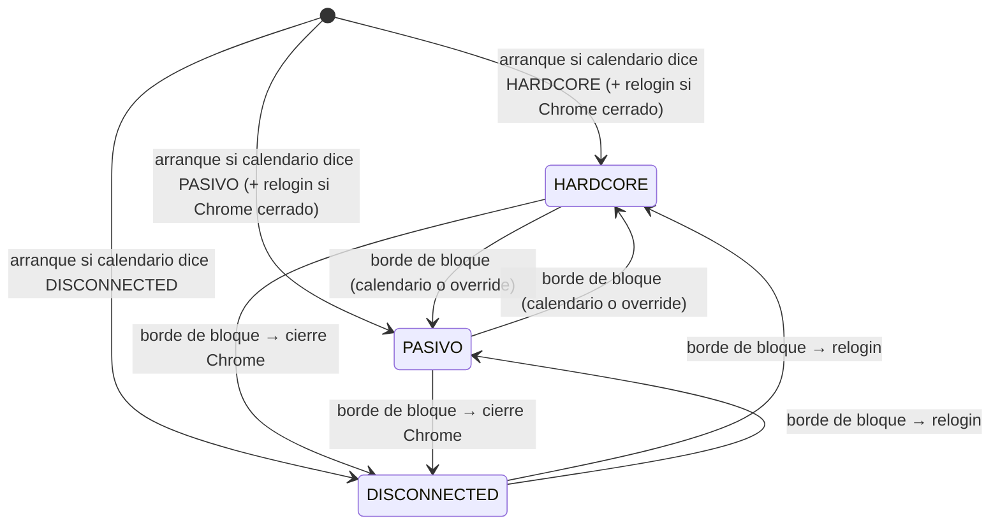

# Human Sessions — Timeline Horario de Actividad con Tres Modos

## 1. Objetivo de negocio

El bot fue baneado por Travian (primera ofensa: downgrade del 33% de edificios). Causa
raíz identificada: el bot operaba 24/7 al mismo ritmo y recorría las colecciones siempre
en el mismo orden. Ningún humano juega a Travian sin dormir, sin comer y sin variación
diaria.

Este spec cierra ese agujero introduciendo un **calendario diario configurable por bloques
horarios**, uno por día de la semana. El WorldAgent consulta el bloque activo en el reloj
real y adapta su comportamiento a tres modos:

- **HARDCORE**: ritmo operativo completo. Todas las actividades activas: farm lists VILLAGE,
  oasis, edificios, tropas.
- **PASIVO**: el bot sigue funcionando pero con actividad muy reducida. Chrome permanece
  abierto y la sesión viva. Solo afecta a farm lists VILLAGE: se ejecutan con un intervalo
  multiplicado (`passive_interval_factor`, default 2×) y con probabilidad reducida de disparo
  (`passive_send_probability`, default 5%). Las tareas de oasis, edificios y tropas NO se
  enolan. Equivale al humano que "está con el juego abierto de fondo pero sin atenderlo
  activamente".
- **DISCONNECTED**: parada total. El WorldAgent cierra limpiamente el Chrome de ese mundo
  (la sesión de browser de Travian). El proceso del bot (FastAPI) sigue corriendo y
  atendiendo peticiones del frontend; solo se cierra la ventana de Chrome del mundo
  concreto. Al volver a un modo activo (HARDCORE o PASIVO), el WorldAgent reabre Chrome y
  ejecuta el flujo de relogin automático antes de retomar tareas productivas. Equivale al
  humano que cierra el navegador para dormir o trabajar.

**Por qué DISCONNECTED cierra Chrome:** un jugador real cierra el navegador cuando para.
Mantener Chrome abierto 24/7 con una sesión activa es una firma estadística detectable
("sesión persistente sin fin"). Cerrar Chrome durante el descanso deja de emitir pings de
sesión a Travian y es el comportamiento humano más natural. La penalización de tener que
relogear al volver es aceptable porque el bot ya tiene el flujo de login implementado.

**Por qué PASIVO mantiene Chrome abierto:** el humano que deja el juego "en segundo plano"
no cierra el navegador. Solo el que para de verdad lo cierra (DISCONNECTED).

**Por qué el timeline es por día de la semana y no un único diario:** un humano juega más
horas el sábado y el domingo que un miércoles con trabajo. Un timeline único haría que el
bot tuviese exactamente el mismo horario los 7 días de la semana, lo cual es otra firma
estadística trivialmente detectable. Con 7 calendarios distintos (aunque similares), la
varianza es mayor y el patrón es más humano.

**El jitter de ±N minutos en cada borde de bloque** garantiza que el bot no cambia de modo
siempre exactamente a las 08:00:00, sino en un rango como 07:51-08:09 (con jitter_min=15).

---

## 2. Actores y permisos

| Actor | Rol |
|---|---|
| Bot (WorldAgent) | Lee el timeline del día de la semana actual; calcula el bloque activo con jitter; adapta su comportamiento al modo resultante. Cierra Chrome al entrar en DISCONNECTED. Reabre Chrome y reloga al salir de DISCONNECTED. No persiste el modo activo (se deriva del reloj). |
| Usuario | Configura los bloques horarios por día de la semana vía API. Puede forzar un override manual de modo que dura hasta el próximo borde de bloque. Puede configurar `passive_interval_factor` y `passive_send_probability` por mundo. |
| Sistema (BD SQLite) | Persiste el timeline (bloques horarios), el override activo (si existe) y la configuración de parámetros PASIVO por mundo. |

No hay roles de autorización: el WorldAgent corre en sesión única por mundo.

---

## 3. Alcance

### Dentro del alcance

- Enum `SessionMode` con tres valores: `HARDCORE`, `PASIVO`, `DISCONNECTED`.
- Entidades `SessionBlock` (un bloque horario: hora_inicio, hora_fin, modo) y
  `SessionTimeline` (lista de bloques para un día de la semana + jitter config).
- Nueva tabla `world_session_timeline` (bloques horarios, uno por día de la semana × mundo).
- Nueva tabla `world_session_override` (override manual activo, si existe).
- Nueva columna en `worlds` o tabla de config separada (`world_session_config`): campos
  `passive_interval_factor` y `passive_send_probability`.
- Puerto `SessionTimelineDbPort` con sus métodos de lectura/escritura.
- Método `_current_mode(now)` en WorldAgent: dado el instante actual, devuelve el modo
  activo según el timeline del día con jitter aplicado.
- Llamada a `_current_mode(now)` al inicio de cada iteración del bucle del WorldAgent.
- Comportamiento de cada modo (detallado en RN):
  - HARDCORE: comportamiento actual completo sin cambios.
  - PASIVO: farm lists VILLAGE con intervalo multiplicado y probabilidad reducida. Sin
    tareas OASIS, edificios ni tropas. Chrome abierto.
  - DISCONNECTED: parada total. Cierre de Chrome del mundo. Al retornar: relogin automático.
- Relleno automático de huecos en el timeline con bloques DISCONNECTED (en vez de error 422).
- Endpoints HTTP:
  - `GET /worlds/{world_id}/session` — estado actual (modo activo, bloque, tiempo restante).
  - `GET /worlds/{world_id}/session/timeline` — timeline configurado (7 días × bloques).
  - `PUT /worlds/{world_id}/session/timeline/{day}` — actualizar bloques de un día.
  - `PUT /worlds/{world_id}/session/mode` — override manual de modo.
  - `GET /worlds/{world_id}/session/config` — leer configuración PASIVO.
  - `PUT /worlds/{world_id}/session/config` — actualizar `passive_interval_factor` y
    `passive_send_probability`.
- Jitter de ±N min por defecto configurable (default: 15 min); se aplica a ambos bordes
  (inicio y fin) de cada bloque de forma independiente y aleatoria.
- El override manual dura hasta el próximo borde de bloque calculado (con jitter aplicado).
- Cierre limpio de Chrome al entrar en DISCONNECTED (vía SessionRegistry).
- Relogin automático al salir de DISCONNECTED (vía flujo existente en
  `core/use_cases/login_use_case.py` y `adapters/browser/login.py`).
- Persistencia del timeline entre reinicios: el timeline es configuración, no estado.
  El modo activo se recalcula al arrancar mirando el reloj.

### Fuera del alcance

- Lógica específica de cada actividad de mantenimiento (edificios, tropas): este spec solo
  dice que se suspenden en PASIVO/DISCONNECTED. Los specs de esas features gestionan su lógica.
- El algoritmo de raideo de oasis: vive en `oasis-farming.md`. Este spec solo controla
  cuándo el WorldAgent pausa el encole de tareas OASIS.
- Actividades de presencia PASIVO más allá de farm lists reducidas: el comportamiento
  diferenciado pleno (navegación suave, lectura de mensajes) se diseñará en un spec futuro.
- Modificación de `FarmScheduler` en BD: los cambios de modo son runtime puro.
- `rest_interval_factor` del spec v1: eliminado.

---

## 4. Reglas de negocio

### RN-HS01 — Tres modos de sesión

| Modo | Qué hace el WorldAgent |
|---|---|
| `HARDCORE` | Comportamiento completo. Farm lists VILLAGE, oasis, edificios, tropas: todo activo. |
| `PASIVO` | Farm lists VILLAGE con intervalo × `passive_interval_factor` y probabilidad `passive_send_probability`. NO encola tareas OASIS. NO construye edificios. NO entrena tropas. Chrome abierto y sesión viva. |
| `DISCONNECTED` | Parada total. Cierra Chrome del mundo al entrar. Al salir hacia HARDCORE o PASIVO: relogin automático antes de retomar tareas productivas. |

### RN-HS02 — El modo se deriva del reloj, nunca se persiste

Al arrancar el WorldAgent, calcula el modo activo con `_current_mode(now)` y el timeline
de BD. No hay un campo "modo activo" en BD que haya que migrar entre reinicios: el estado
se recalcula siempre a partir del reloj real y el calendario.

### RN-HS03 — El timeline es por día de la semana

El usuario configura 7 timelines independientes (lun=0, mar=1, mié=2, jue=3, vie=4, sáb=5,
dom=6). El WorldAgent lee el día de la semana de `datetime.now()` para seleccionar el
timeline activo.

**Decisión de diseño:** el timeline es por día de la semana, no un único diario, porque un
humano tiene hábitos distintos entre semana y fin de semana. La varianza entre días es una
capa adicional de anti-detección sin coste de UX: el usuario configura los 7 días una vez
y los ajusta si quiere.

### RN-HS04 — Cobertura obligatoria de 24h; huecos se rellenan con DISCONNECTED

El timeline de cada día debe cubrir exactamente las 24 horas (00:00-24:00). Si el usuario
envía bloques que no cubren las 24h completas, el backend **rellena automáticamente los
huecos con bloques `DISCONNECTED`** antes de persistir. La respuesta 200 devuelve el
timeline COMPLETO ya con los huecos rellenados.

Los **solapes** sí son error (422): si dos bloques se pisan en hora, el comportamiento
es ambiguo y no hay regla de resolución. Un hueco es inequívoco (no hay nada ahí →
DISCONNECTED); un solape es ambiguo (¿qué modo manda?).

Un timeline vacío (`blocks: []`) es válido: el resultado es un día entero como DISCONNECTED
(un bloque único 00:00-24:00 DISCONNECTED). Se persiste y devuelve 200.

### RN-HS05 — Jitter de bordes de bloque

Cada borde de bloque (inicio y fin) tiene un jitter aleatorio de ±`jitter_min` minutos
(configurable por mundo, default: 15 min). El jitter:

- Se calcula al entrar en el bloque (no en el borde contrario).
- Es independiente para inicio y fin del mismo bloque.
- El jitter de fin siempre se calcula como `bloque.hora_fin ± jitter`, siendo el resultado
  el instante real en el que el WorldAgent pasará al siguiente bloque.
- Se recalcula en cada transición de bloque (no es fijo entre reinicios).
- Si el jitter haría que el borde de fin sea anterior al de inicio del bloque (bloque muy
  corto con jitter grande), se fija el fin = inicio + 1 min como mínimo de seguridad.
- El jitter NO puede hacer que el borde de fin de un bloque se solape con el borde de
  inicio del siguiente bloque original (el jitter opera dentro del espacio del bloque).

### RN-HS06 — Override manual de modo

El usuario puede forzar un modo vía `PUT /worlds/{world_id}/session/mode`. El override:

- Se aplica inmediatamente (al terminar el tick en curso).
- Dura hasta el próximo borde de bloque calculado (con jitter aplicado).
- Al llegar al borde del bloque, el WorldAgent descarta el override y sigue el calendario.
- Si el override solicita el modo que ya está activo, se ignora (sin cambio, sin error;
  simplemente devuelve 200 informando que ya estaba en ese modo).
- El override se persiste en BD (`world_session_override`) para sobrevivir a reinicios
  breves; al recalcular `_current_mode(now)`, si hay override activo (y aún no ha llegado
  al borde de bloque), se respeta.
- El override respeta las mismas implicaciones de ciclo de vida: si el usuario fuerza
  DISCONNECTED vía override → Chrome se cierra; si luego fuerza HARDCORE manual → relogin
  igual que si fuera una transición natural de calendario.

### RN-HS07 — Transición suave entre modos

Cuando el WorldAgent detecta que el borde del bloque actual ha expirado:

- Termina el tick en curso.
- No cancela tareas en vuelo.
- Calcula el modo del siguiente bloque y el jitter del nuevo borde de fin.
- Aplica el comportamiento del nuevo modo en el siguiente ciclo del bucle.

### RN-HS08 — Comportamiento al entrar/salir de HARDCORE

Al entrar en HARDCORE desde PASIVO o DISCONNECTED, el WorldAgent llama a
`seed_oasis_groups_from_db()` para reencolar los grupos de oasis (igual que la
transición REST→HARDCORE del spec v1). Al salir de HARDCORE, las tareas OASIS en
cola se dejan consumir sin reencolar.

### RN-HS09 — Arranque del WorldAgent

El WorldAgent no asume ningún modo de arranque: ejecuta `_current_mode(now)` y opera
según el resultado. Si el timeline dice DISCONNECTED a las 03:00, arranca en
DISCONNECTED. Si dice HARDCORE a las 10:30, arranca en HARDCORE (y ejecuta
`seed_oasis_groups_from_db()` si oasis está activo).

**Decisión de diseño:** en el spec v1, el arranque forzaba HARDCORE. En este modelo,
arrancar en el modo correcto del calendario es más humano: un humano no empieza siempre
a jugar en modo agresivo si acaba de encender el PC a las 03:00.

### RN-HS10 — Un WorldAgent por mundo, estado independiente

No hay estado compartido entre mundos. Cada instancia de WorldAgent gestiona su propio
ciclo con su propio timeline y jitter. Al entrar en DISCONNECTED, solo se cierra el Chrome
del mundo concreto, no el de otras cuentas o mundos.

### RN-HS11 — Ausencia de timeline en BD

Si el usuario nunca configuró un timeline para un mundo, el WorldAgent usa el **timeline
por defecto hardcodeado** (configurable en código, no en BD):

```
Lun-Vie:  08:00-23:00 HARDCORE / 23:00-08:00 DISCONNECTED
Sáb-Dom:  09:00-01:00 HARDCORE / 01:00-09:00 DISCONNECTED
```

El timeline por defecto no se escribe en BD: al ser defaults, cualquier PUT del usuario
los reemplaza. Si se lee el timeline de un día sin configuración explícita, el endpoint
devuelve el timeline por defecto marcado como `is_default: true`.

### RN-HS12 — Comportamiento PASIVO para farm lists VILLAGE

Cuando el modo activo es PASIVO y el WorldAgent va a ejecutar una tarea
`SEND_FARM_LIST_GROUP`:

1. **Comprobación de probabilidad**: el WorldAgent genera un número aleatorio uniforme en
   [0, 1). Si el valor es `>= passive_send_probability` → **SALTA** la ejecución (la
   tarea se considera consumida y se reencola con el intervalo multiplicado). Si el valor
   es `< passive_send_probability` → **EJECUTA** normalmente.

2. **Multiplicador de intervalo**: independientemente de si se ejecutó o saltó, al
   reencolar la próxima tarea `SEND_FARM_LIST_GROUP`, los valores `interval_min_ms` e
   `interval_max_ms` del FarmScheduler se **multiplican por `passive_interval_factor`**
   antes de calcular el próximo instante de ejecución.

3. **Parámetros configurables por mundo**:
   - `passive_interval_factor`: factor multiplicador del intervalo. Default 2.0. Rango
     válido: [1.5, 5.0].
   - `passive_send_probability`: probabilidad de disparo. Default 0.05 (5%). Rango
     válido: [0.01, 0.50].

4. **Oasis en PASIVO**: NO se enolan nuevas tareas OASIS durante PASIVO. Igual que
   DISCONNECTED en este aspecto.

5. **Edificios y tropas en PASIVO**: NO se enolan tareas de construcción ni entrenamiento.
   Igual que DISCONNECTED en este aspecto.

### RN-HS13 — Ciclo de vida de Chrome en DISCONNECTED

1. **Al entrar en DISCONNECTED**: el WorldAgent llama al SessionRegistry para terminar
   limpiamente la sesión de browser del mundo concreto (cierra Chrome). Los Chrome de
   otros mundos/cuentas no se ven afectados.

2. **Al salir de DISCONNECTED** (hacia HARDCORE o PASIVO): el WorldAgent ejecuta el flujo
   de relogin automático:
   - Abre Chrome con el perfil del mundo.
   - Navega a Travian.
   - Autentica con las credenciales del mundo (descifradas con Fernet).
   - Carga el mundo.
   Solo cuando el relogin completa con éxito, el WorldAgent reanuda las tareas productivas.

3. **Reintento de relogin**: si el relogin falla, el WorldAgent loguea el error y reintenta
   en 10 minutos con backoff exponencial (10 min → 20 min → 40 min → máx 60 min). El modo
   activo no avanza a tareas productivas hasta que haya sesión activa.

4. **Credencial no disponible** (Fernet key faltante o contraseña no descifrable): el
   WorldAgent loguea el error con nivel CRITICAL, queda en estado `DISCONNECTED-error`, y
   registra el fallo en el activity feed. No reintenta automáticamente con backoff porque
   el error es de configuración, no transitorio. El usuario debe corregir las credenciales
   y reiniciar el mundo.

---

## 5. Flujo principal y flujos alternativos

### Flujo principal — ciclo del WorldAgent con timeline

```
1. WorldAgent arranca.
   a. Carga el timeline del mundo desde BD (o usa defaults si no existe).
   b. Calcula _current_mode(now) → modo_actual, jitter_fin (instante de siguiente borde).
   c. Si modo_actual == DISCONNECTED → Chrome ya debe estar cerrado (no hay sesión activa).
   d. Si modo_actual == HARDCORE → seed_oasis_groups_from_db().
   e. Si modo_actual ∈ {HARDCORE, PASIVO} y no hay sesión activa → ejecutar relogin primero.

2. Bucle principal:
   a. Al inicio de cada iteración → _check_mode_transition(now):
      - Si hay override activo y no ha expirado → aplica override como modo_actual.
      - Si hay override activo y ha expirado → descarta override, recalcula modo del calendario.
      - Si no hay override → si now >= jitter_fin: nuevo bloque; recalcular modo y jitter_fin.
      - Al detectar cambio de modo: ejecutar efectos secundarios (ver RN-HS07, RN-HS13).
   b. Si modo_actual == HARDCORE:
      - Procesa tareas normalmente (SEND_FARM_LIST_GROUP, SEND_OASIS_RAID, etc.)
      - Reencola tareas OASIS.
   c. Si modo_actual == PASIVO:
      - Para tareas SEND_FARM_LIST_GROUP: aplicar dado de probabilidad y multiplicador
        de intervalo (ver RN-HS12).
      - No reencola tareas OASIS.
      - No procesa edificios ni tropas.
   d. Si modo_actual == DISCONNECTED:
      - No ejecuta ninguna tarea productiva.
      - Espera DEFAULT_IDLE_SECONDS antes de volver a comprobar la transición.
   e. Vuelve a paso 2.
```

### Flujo alternativo — usuario fuerza override

```
1. Usuario llama PUT /worlds/{world_id}/session/mode {"mode": "HARDCORE"}.
2. API calcula el borde de fin del bloque actual (con jitter aplicado).
3. API escribe en world_session_override: {mode: "HARDCORE", expires_at: jitter_fin}.
4. WorldAgent detecta override en la siguiente iteración.
5. Si el modo previo era DISCONNECTED → ejecutar relogin (RN-HS13).
6. Aplica el modo HARDCORE inmediatamente (con seed_oasis si corresponde).
7. Cuando now >= expires_at: descarta override, sigue el calendario.
```

### Flujo alternativo — reinicio del bot

```
1. El proceso se detiene.
2. Al rearrancar: carga timeline de BD, calcula _current_mode(now).
3. Si había override en BD y expires_at > now → lo respeta.
4. Si override había expirado → lo descarta y sigue el calendario.
5. Si modo resultante es DISCONNECTED → no abre Chrome.
6. Si modo resultante es HARDCORE o PASIVO y no hay sesión activa → relogin.
7. Reanuda operación en el modo correcto.
```

### Flujo alternativo — borde de bloque mientras tarea en ejecución

```
1. now >= jitter_fin mientras _execute() está activo.
2. La tarea en ejecución termina (sin interrupción).
3. En la siguiente iteración del bucle, _check_mode_transition detecta el borde.
4. Nuevo modo, nuevo jitter_fin.
5. Si nuevo modo es DISCONNECTED → cierre de Chrome.
6. Si modo anterior era DISCONNECTED y nuevo es HARDCORE/PASIVO → relogin.
```

### Flujo alternativo — timeline no configurado

```
1. WorldAgent arranca; consulta BD para el día de la semana → sin fila.
2. Usa el timeline por defecto (hardcodeado).
3. Opera normalmente.
```

### Flujo alternativo — relogin con fallo

```
1. WorldAgent intenta relogin al salir de DISCONNECTED.
2. Primer intento falla (error de red, sesión expirada, etc.).
3. Loguea el error. Espera 10 min (backoff exponencial: 10→20→40→60 min máx).
4. Reintenta.
5. Si las credenciales no son descifrables → estado DISCONNECTED-error, sin backoff.
6. Al completar con éxito → reanuda tareas productivas.
```

---

## 6. Edge cases

| ID | Situación | Tratamiento |
|---|---|---|
| EC-HS01 | Bot arranca durante DISCONNECTED (p.ej. 03:00) | Arranca en DISCONNECTED. No abre Chrome. No ejecuta tareas productivas. Espera a que el siguiente borde de bloque lo lleve a HARDCORE o PASIVO, momento en que ejecuta el relogin. |
| EC-HS02 | Borde de bloque ocurre durante un tick largo (timeout de red) | El tick termina primero. La transición de modo se detecta en la siguiente iteración. El retraso es mínimo y es deseable varianza anti-detección. |
| EC-HS03 | Jitter hace que el bloque PASIVO sea < 1 min (bloque muy corto con jitter grande) | Si jitter_fin calcula un fin antes del inicio real + 1 min, se forza fin_real = inicio_real + 1 min. El bloque dura al menos 1 min. |
| EC-HS04 | El usuario configura todos los bloques del día como HARDCORE | Válido. No hay restricción de cantidad mínima de PASIVO o DISCONNECTED. El sistema lo acepta aunque no sea recomendable anti-detección. |
| EC-HS05 | Override solicita el modo ya activo | Se devuelve 200 con mensaje "ya en ese modo". No se modifica el override en BD. El jitter_fin actual no se recalcula. |
| EC-HS06 | Override expira durante DISCONNECTED → siguiente bloque también DISCONNECTED | El WorldAgent sigue en DISCONNECTED. El override se descarta y el modo corriente es el del calendario. Chrome sigue cerrado. Sin efecto observable. |
| EC-HS07 | seed_oasis_groups_from_db() falla al entrar en HARDCORE | Se loguea el error. El WorldAgent entra en HARDCORE igualmente sin grupos de oasis. Recuperación natural en el siguiente wake-up. |
| EC-HS08 | El mundo no tiene schedulers VILLAGE activos | El WorldAgent opera en su modo normal. Los modos PASIVO/DISCONNECTED no tienen efecto especial (no hay tareas VILLAGE que suspender). |
| EC-HS09 | Reinicio muy frecuente durante DISCONNECTED | Cada reinicio recalcula el modo del calendario. Si el calendario dice DISCONNECTED, el bot sigue en DISCONNECTED. No hay burst de actividad por reinicios. |
| EC-HS10 | El usuario actualiza el timeline mientras el bot corre | El WorldAgent carga el timeline al arrancar y en cada transición de bloque. Si el usuario actualiza, el cambio se aplica en la próxima transición de bloque. No hay recarga en caliente a mitad de un bloque. |
| EC-HS11 | Bloque de 24h completo en un solo modo (ej: todo HARDCORE el sábado) | Válido. Un solo bloque que cubre 00:00-24:00 es una configuración legal. El jitter de fin se calcula desde las 24:00 (= 00:00 del día siguiente), que es el inicio del primer bloque del día siguiente. |
| EC-HS12 | Override escrito en BD mientras el WorldAgent calcula modo (condición de carrera) | asyncio single-threaded: no hay condición de carrera. El override se lee al inicio de cada iteración del bucle; si llega entre iteraciones, se aplica en la siguiente. |
| EC-HS13 | PASIVO: dado de probabilidad no dispara (>= passive_send_probability) | La tarea SEND_FARM_LIST_GROUP se considera consumida sin ejecutarse. Se reencola con el intervalo ya multiplicado. No se loguea como error, sino como "skipped (PASIVO)". |
| EC-HS14 | PASIVO: passive_send_probability=0.01 (1%) — rara vez dispara | Comportamiento esperado y válido. El usuario ha configurado actividad mínima. |
| EC-HS15 | Relogin falla con credencial no descifrable (Fernet key faltante) | Estado DISCONNECTED-error. Log CRITICAL. Activity feed. Sin backoff automático (error de configuración, no transitorio). El usuario debe corregir y reiniciar. |
| EC-HS16 | Relogin falla por error de red (Travian no responde) | Backoff exponencial: 10 → 20 → 40 → 60 min. Se reintenta hasta éxito o hasta que el calendario vuelva a DISCONNECTED (en cuyo caso se aborta el relogin). |
| EC-HS17 | El borde de bloque lleva de DISCONNECTED → PASIVO durante un relogin en curso | El relogin continúa. Una vez completado, el WorldAgent opera en modo PASIVO. |
| EC-HS18 | El usuario envía timeline vacío (blocks: []) | Resultado: un bloque 00:00-24:00 DISCONNECTED. Válido. Se persiste y devuelve 200 con el bloque rellenado. |
| EC-HS19 | El usuario envía timeline parcial (p.ej. solo 09:00-18:00 HARDCORE) | El backend rellena 00:00-09:00 DISCONNECTED y 18:00-24:00 DISCONNECTED. Devuelve 200 con los 3 bloques. |
| EC-HS20 | El usuario envía bloques con solape (dos bloques se pisan) | 422 con detail descriptivo. No se rellenan huecos; primero se validan los solapes. |

---

## 7. Modelo de datos / cambios de esquema

### 7.1 Enum `SessionMode` (core/entities/session.py — archivo nuevo)

```python
from enum import Enum

class SessionMode(str, Enum):
    HARDCORE     = "HARDCORE"
    PASIVO       = "PASIVO"
    DISCONNECTED = "DISCONNECTED"
```

**Nota:** el spec v1 usaba `HARDCORE_SESSION` y `REST_SESSION`. En v2/v2.1 los nombres son
`HARDCORE`, `PASIVO` y `DISCONNECTED` (sin sufijo `_SESSION`) para mayor legibilidad.
`IDLE` fue el nombre en v2; v2.1 lo renombra a `PASIVO` definitivamente.

### 7.2 Dataclass `SessionBlock` (core/entities/session.py)

Un bloque horario en el timeline:

```python
from dataclasses import dataclass

@dataclass
class SessionBlock:
    start_hour: int        # 0-23
    start_minute: int      # 0-59
    end_hour: int          # 0-24 (24 = medianoche del día siguiente)
    end_minute: int        # 0-59 (0 si end_hour=24)
    mode: SessionMode
```

### 7.3 Dataclass `SessionTimeline` (core/entities/session.py)

El timeline completo de un mundo:

```python
@dataclass
class SessionTimeline:
    world_id: int
    weekday: int                    # 0=lun, 1=mar, ..., 6=dom
    blocks: list[SessionBlock]      # ordenados por start_hour:start_minute
    jitter_minutes: int = 15        # ±N min en cada borde de bloque
    is_default: bool = False        # True si el sistema usó el default, no lo configuró el usuario
```

### 7.4 Dataclass `SessionOverride` (core/entities/session.py)

Override manual activo para un mundo:

```python
from datetime import datetime

@dataclass
class SessionOverride:
    world_id: int
    mode: SessionMode
    expires_at: datetime    # instante calculado como jitter_fin del bloque actual en el momento del PUT
```

### 7.5 Dataclass `SessionConfig` (core/entities/session.py)

Configuración de parámetros del modo PASIVO por mundo:

```python
@dataclass
class SessionConfig:
    world_id: int
    passive_interval_factor: float = 2.0   # multiplicador del intervalo de farm lists en PASIVO; rango [1.5, 5.0]
    passive_send_probability: float = 0.05  # probabilidad de ejecutar farm list en PASIVO; rango [0.01, 0.50]
```

### 7.6 Tabla `world_session_timeline`

Una fila por (world_id, weekday, block_index). El timeline de un día es una lista de filas.

```sql
CREATE TABLE IF NOT EXISTS world_session_timeline (
    id            INTEGER PRIMARY KEY AUTOINCREMENT,
    world_id      INTEGER NOT NULL REFERENCES worlds(id) ON DELETE CASCADE,
    weekday       INTEGER NOT NULL CHECK (weekday BETWEEN 0 AND 6),  -- 0=lun..6=dom
    block_index   INTEGER NOT NULL,           -- orden del bloque en el día (0-based)
    start_hour    INTEGER NOT NULL CHECK (start_hour BETWEEN 0 AND 23),
    start_minute  INTEGER NOT NULL CHECK (start_minute BETWEEN 0 AND 59),
    end_hour      INTEGER NOT NULL CHECK (end_hour BETWEEN 0 AND 24),
    end_minute    INTEGER NOT NULL CHECK (end_minute BETWEEN 0 AND 59),
    mode          TEXT    NOT NULL CHECK (mode IN ('HARDCORE','PASIVO','DISCONNECTED')),
    jitter_minutes INTEGER NOT NULL DEFAULT 15 CHECK (jitter_minutes >= 0),
    UNIQUE (world_id, weekday, block_index)
);

CREATE INDEX IF NOT EXISTS idx_world_session_timeline_world_day
    ON world_session_timeline(world_id, weekday);
```

**Decisión de shape:** en lugar de almacenar el timeline como un JSON blob por
(world_id, weekday), se usa una fila por bloque. Esto permite:
- Validar los campos individualmente con CHECK constraints de SQLite.
- Consultar bloques específicos sin deserializar JSON.
- Agregar/eliminar bloques individuales sin reescribir el día entero.

El `jitter_minutes` se almacena a nivel de fila para permitir, en el futuro, jitter
diferente por bloque. En esta v1, todos los bloques de un mundo tienen el mismo jitter
(se toma del primer bloque o de un valor global). El PUT del timeline aplica el mismo
`jitter_minutes` a todos los bloques del día.

### 7.7 Tabla `world_session_override`

Una fila por world_id (máximo un override activo por mundo en todo momento).

```sql
CREATE TABLE IF NOT EXISTS world_session_override (
    world_id    INTEGER PRIMARY KEY REFERENCES worlds(id) ON DELETE CASCADE,
    mode        TEXT    NOT NULL CHECK (mode IN ('HARDCORE','PASIVO','DISCONNECTED')),
    expires_at  TEXT    NOT NULL    -- ISO-8601 UTC
);
```

### 7.8 Tabla `world_session_config`

Una fila por world_id con los parámetros configurables del modo PASIVO.

```sql
CREATE TABLE IF NOT EXISTS world_session_config (
    world_id                  INTEGER PRIMARY KEY REFERENCES worlds(id) ON DELETE CASCADE,
    passive_interval_factor   REAL    NOT NULL DEFAULT 2.0
                                      CHECK (passive_interval_factor BETWEEN 1.5 AND 5.0),
    passive_send_probability  REAL    NOT NULL DEFAULT 0.05
                                      CHECK (passive_send_probability BETWEEN 0.01 AND 0.50)
);
```

Si no existe fila para un mundo, el WorldAgent usa los defaults (2.0 y 0.05). La tabla se
crea lazy: la primera vez que el usuario actualiza la config, se inserta la fila.

### 7.9 Puerto `SessionTimelineDbPort` (core/ports/session_timeline_db_port.py)

```python
from abc import ABC, abstractmethod
from core.entities.session import SessionTimeline, SessionOverride, SessionMode, SessionConfig

class SessionTimelineDbPort(ABC):

    @abstractmethod
    async def get_timeline(self, world_id: int, weekday: int) -> SessionTimeline | None:
        """Devuelve el timeline del día. None si no existe (el caller usa el default)."""

    @abstractmethod
    async def upsert_timeline(self, timeline: SessionTimeline) -> SessionTimeline:
        """Reemplaza todos los bloques del (world_id, weekday) con los del timeline dado.
        Rellena huecos con DISCONNECTED. Valida no-solapes antes de escribir.
        Lanza ValueError si hay solapes."""

    @abstractmethod
    async def get_override(self, world_id: int) -> SessionOverride | None:
        """Devuelve el override activo. None si no existe o ya expiró (lo borra si expiró)."""

    @abstractmethod
    async def set_override(self, override: SessionOverride) -> None:
        """Escribe o reemplaza el override activo para el mundo."""

    @abstractmethod
    async def clear_override(self, world_id: int) -> None:
        """Borra el override activo (si existe)."""

    @abstractmethod
    async def get_session_config(self, world_id: int) -> SessionConfig:
        """Devuelve la config PASIVO del mundo. Si no existe fila, devuelve defaults."""

    @abstractmethod
    async def upsert_session_config(self, config: SessionConfig) -> SessionConfig:
        """Crea o actualiza la config PASIVO del mundo. Valida rangos antes de escribir."""
```

---

## 8. Contratos de API / interfaces

Esta feature expone seis endpoints HTTP. Los contratos de v2 fueron validados por
`desarrollador-apis` el 2026-05-30. Los contratos de v2.1 fueron revalidados el
2026-05-31 cubriendo: renombrado `IDLE` → `PASIVO` en todos los contratos, nuevos endpoints
`GET/PUT /session/config`, nuevos campos `requires_relogin` y `chrome_action` en
`PUT /session/mode`, semántica de relleno de huecos en `PUT /session/timeline/{weekday}`,
y tratamiento de bloques que cruzan medianoche.
Estado: `apis_validadas_por_desarrollador_apis: ok`.

### 8.1 `GET /worlds/{world_id}/session` — Estado actual de la sesión

Devuelve el modo activo, el bloque en curso y el tiempo hasta el próximo cambio de modo.
No requiere `Accept-Language` (no devuelve texto localizado).

```
GET /worlds/{world_id}/session
Content-Type: application/json

Response 200:
{
  "mode": "HARDCORE",                        // SessionMode actual: HARDCORE | PASIVO | DISCONNECTED
  "block": {
    "start": "08:00",                        // HH:MM del inicio nominal del bloque
    "end": "11:00",                          // HH:MM del fin nominal del bloque
    "mode": "HARDCORE"
  },
  "jitter_minutes": 15,
  "next_block_ends_at": "2026-05-30T10:53:00Z",  // ISO-8601 UTC; fin del bloque con jitter aplicado
  "seconds_to_next_block": 4692,                  // segundos enteros hasta next_block_ends_at
  "override": null                                // null si no hay override activo
  // o bien: "override": {"mode": "PASIVO", "expires_at": "2026-05-30T11:08:00Z"}
}

Response 404: { "detail": "Mundo no encontrado." }
Response 500: { "detail": "Error interno del servidor." }
```

**Notas de implementación:**
- `next_block_ends_at` sustituye a `jitter_fin_at` (nombre ambiguo entre idiomas).
- `seconds_to_next_block` (int) sustituye a `minutes_to_next_block` (float): la precisión
  en segundos es necesaria porque el mínimo de seguridad de EC-HS03 puede dejar bloques de
  exactamente 60 s; truncar a minutos perdería ese detalle.
- `override` es `null` cuando no hay override activo; el modelo Pydantic debe declararlo como
  `Optional[SessionOverrideResponse]` con `model_config = ConfigDict(serialize_default=True)`.

### 8.2 `GET /worlds/{world_id}/session/timeline` — Timeline completo

Devuelve los 7 timelines (uno por día de la semana, weekday 0=lunes…6=domingo).
No requiere `Accept-Language` (devuelve números e identificadores de enum, no texto
localizado; `weekday_name` se elimina — el frontend localiza el número).
Los bloques de cada día se devuelven ordenados por `start` ascendente.

```
GET /worlds/{world_id}/session/timeline
Content-Type: application/json

Response 200:
{
  "timelines": [
    {
      "weekday": 0,          // 0=lunes … 6=domingo; localización responsabilidad del frontend
      "is_default": false,   // true si el usuario nunca configuró este día (se usa el default hardcodeado)
      "jitter_minutes": 15,
      "blocks": [
        {"start": "00:00", "end": "08:00", "mode": "DISCONNECTED"},
        {"start": "08:00", "end": "11:00", "mode": "HARDCORE"},
        {"start": "11:00", "end": "11:30", "mode": "PASIVO"},
        {"start": "11:30", "end": "14:00", "mode": "HARDCORE"},
        {"start": "14:00", "end": "16:00", "mode": "DISCONNECTED"},
        {"start": "16:00", "end": "19:00", "mode": "HARDCORE"},
        {"start": "19:00", "end": "20:30", "mode": "DISCONNECTED"},
        {"start": "20:30", "end": "24:00", "mode": "HARDCORE"}
      ]
    }
    // … 6 entradas más, una por cada día de la semana
  ]
}

Response 404: { "detail": "Mundo no encontrado." }
Response 500: { "detail": "Error interno del servidor." }
```

**Nota:** el campo `weekday_name` se eliminó. Devolver texto localizable ("lunes",
"Monday"…) desde un endpoint de configuración requeriría `Accept-Language` obligatorio,
lo cual es overhead innecesario para un campo que el frontend puede computar trivialmente
con `Intl.DateTimeFormat` o un array indexado.

### 8.3 `PUT /worlds/{world_id}/session/timeline/{weekday}` — Actualizar un día

Reemplaza todos los bloques de un día de la semana. Los huecos se rellenan automáticamente
con DISCONNECTED. Los solapes devuelven 422. Operación idempotente. No requiere
`Accept-Language`.

```
PUT /worlds/{world_id}/session/timeline/{weekday}
Content-Type: application/json

Path param:
  weekday: integer  // 0-6 (0=lunes, 6=domingo); FastAPI valida con Path(ge=0, le=6)

Request body:
{
  "jitter_minutes": 15,    // opcional; default 15; debe ser >= 0
  "blocks": [              // obligatorio; puede ser vacío ([]); huecos se rellenan con DISCONNECTED
    {"start": "08:00", "end": "11:00", "mode": "HARDCORE"},
    {"start": "11:00", "end": "11:30", "mode": "PASIVO"},
    // …
    {"start": "20:30", "end": "24:00", "mode": "HARDCORE"}
    // Nota: si los bloques anteriores no cubren 00:00-08:00, el backend los rellena
    //       automáticamente con DISCONNECTED antes de persistir.
  ]
}
// Campos del bloque:
//   start: "HH:MM"  — hora de inicio (00:00..23:59)
//   end:   "HH:MM"  — hora de fin (00:01..24:00); "24:00" = medianoche del día siguiente
//   mode:  "HARDCORE" | "PASIVO" | "DISCONNECTED"

Response 200:   // timeline del día tal como quedó guardado (con huecos rellenados), bloques ordenados por start
{
  "weekday": 0,
  "is_default": false,
  "jitter_minutes": 15,
  "blocks": [
    {"start": "00:00", "end": "08:00", "mode": "DISCONNECTED"},  // ← rellenado automáticamente
    {"start": "08:00", "end": "11:00", "mode": "HARDCORE"},
    {"start": "11:00", "end": "11:30", "mode": "PASIVO"},
    // …
    {"start": "20:30", "end": "24:00", "mode": "HARDCORE"}
  ]
}

// Bloques vacíos (blocks: []) → timeline de 24h DISCONNECTED:
Response 200:
{
  "weekday": 0,
  "is_default": false,
  "jitter_minutes": 15,
  "blocks": [
    {"start": "00:00", "end": "24:00", "mode": "DISCONNECTED"}
  ]
}

Response 422: { "detail": "Los bloques se solapan en 11:00-11:15." }
Response 422: { "detail": "end debe ser mayor que start. Los bloques que cruzan medianoche no están soportados: divide en dos bloques (HH:MM-24:00 y 00:00-HH:MM)." }
Response 422: { "detail": "jitter_minutes no puede ser negativo." }
Response 422: { "detail": "weekday debe estar entre 0 y 6." }  // FastAPI lo genera automáticamente con Path(ge=0,le=6)
Response 404: { "detail": "Mundo no encontrado." }
Response 500: { "detail": "Error interno del servidor." }
```

**Nota sobre granularidad de PUT:** se mantiene un PUT por día de la semana (no un PUT con
los 7 días). Razón: la validación de solapes y el relleno de huecos son por día; la
idempotencia es por día; y el cliente actualiza habitualmente un solo día sin necesidad de
serializar los 7. Un PUT completo del calendario añadiría payload y complejidad sin
beneficio semántico.

**Nota sobre bloques que cruzan medianoche:** en v2.1 los bloques que cruzan medianoche
(`end_hour < start_hour`, p.ej. "23:00"-"08:00") **están prohibidos en el body del PUT**.
La razón es que el algoritmo de relleno de huecos (`_fill_gaps_with_disconnected`) opera
en el espacio lineal 0–1440 minutos de un día concreto, y un bloque cuyo `end` es menor
que su `start` (en minutos) lo trataría como un intervalo vacío o inverso, produciendo
resultados incorrectos. Los bloques que cruzan medianoche deben dividirse en dos: uno hasta
"24:00" y otro desde "00:00". El bloque `_find_active_block` del WorldAgent (§9.2) sí
soporta bloques que cruzan medianoche para el cálculo runtime; la restricción aplica solo
al contrato de persistencia vía PUT. Si el cliente envía un bloque con `end_hour < start_hour`
y no se trata de "24:00", el backend devuelve 422.

**Nota sobre bloques autogenerados en la respuesta 200:** la respuesta del PUT puede incluir
bloques `DISCONNECTED` que el cliente **no envió**. Estos son los rellenos automáticos de
huecos. El cliente debe consumir y mostrar el timeline de la respuesta (no el que envió),
ya que es el estado real persistido. Este comportamiento es siempre transparente: si el
cliente envía un timeline sin huecos, la respuesta es idéntica al input (sin bloques extra).

**Lógica de relleno de huecos (pseudocódigo):**

```python
def _fill_gaps_with_disconnected(blocks: list[SessionBlock]) -> list[SessionBlock]:
    """
    Dado un conjunto de bloques (posiblemente incompleto), devuelve el timeline
    completo de 24h rellenando los huecos con bloques DISCONNECTED.
    PRE: los bloques no tienen solapes (ya validado antes de llamar a esta función).
    """
    # Convertir a intervalos en minutos, ordenar por inicio
    intervals = sorted(blocks, key=lambda b: b.start_hour * 60 + b.start_minute)

    result = []
    cursor = 0  # minutos desde 00:00; avanza hasta 1440 (24:00)

    for block in intervals:
        start_m = block.start_hour * 60 + block.start_minute
        end_m   = block.end_hour * 60 + block.end_minute
        if end_m == 0:
            end_m = 1440  # 24:00

        # Hueco antes de este bloque → rellenar con DISCONNECTED
        if start_m > cursor:
            result.append(SessionBlock(
                start_hour=cursor // 60, start_minute=cursor % 60,
                end_hour=start_m // 60,  end_minute=start_m % 60,
                mode=SessionMode.DISCONNECTED,
            ))

        result.append(block)
        cursor = end_m

    # Hueco al final del día (cursor < 1440)
    if cursor < 1440:
        result.append(SessionBlock(
            start_hour=cursor // 60, start_minute=cursor % 60,
            end_hour=24, end_minute=0,
            mode=SessionMode.DISCONNECTED,
        ))

    # Caso especial: lista vacía → bloque único 00:00-24:00 DISCONNECTED
    # (ya cubierto por el bucle: cursor=0, sin bloques → hueco final 0-1440)

    return result
```

### 8.4 `PUT /worlds/{world_id}/session/mode` — Override manual de modo

Fuerza un modo para el mundo hasta el próximo borde de bloque (con jitter aplicado).
Si el mundo ya está en el modo solicitado, devuelve 200 con mensaje informativo sin
modificar nada. Operación idempotente. No requiere `Accept-Language`.

```
PUT /worlds/{world_id}/session/mode
Content-Type: application/json

Request body:
{
  "mode": "PASIVO"    // obligatorio; HARDCORE | PASIVO | DISCONNECTED
}

// Caso 1: override aplicado correctamente — transición sin relogin (ej. HARDCORE → PASIVO)
Response 200:
{
  "mode": "PASIVO",
  "expires_at": "2026-05-30T11:08:00Z",    // ISO-8601 UTC; borde de fin del bloque actual con jitter
  "already_active": false,
  "requires_relogin": false,               // true solo si la transición implica salir de DISCONNECTED
  "chrome_action": "none",                 // "close" | "open" | "none" (qué hará Chrome en el próximo ciclo)
  "message": "Override applied. Takes effect on the next WorldAgent cycle."
}

// Caso 1b: override hacia DISCONNECTED — Chrome se cerrará en el próximo ciclo
Response 200:
{
  "mode": "DISCONNECTED",
  "expires_at": "2026-05-30T11:08:00Z",
  "already_active": false,
  "requires_relogin": false,               // false: DISCONNECTED no requiere relogin; el cierre es el efecto
  "chrome_action": "close",               // Chrome se cerrará en el próximo ciclo del WorldAgent
  "message": "Override applied. Takes effect on the next WorldAgent cycle."
}

// Caso 1c: override hacia HARDCORE o PASIVO estando en DISCONNECTED — relogin necesario
Response 200:
{
  "mode": "HARDCORE",
  "expires_at": "2026-05-30T11:08:00Z",
  "already_active": false,
  "requires_relogin": true,               // true: el WorldAgent ejecutará relogin antes de retomar tareas
  "chrome_action": "open",               // Chrome se abrirá (relogin) en el próximo ciclo
  "message": "Override applied. Takes effect on the next WorldAgent cycle."
}

// Caso 2: el mundo ya está en el modo solicitado (idempotente, sin cambio)
Response 200:
{
  "mode": "HARDCORE",
  "expires_at": null,                       // null porque no se creó override
  "already_active": true,
  "requires_relogin": false,
  "chrome_action": "none",
  "message": "World already in HARDCORE mode. No changes made."
}

Response 422: { "detail": "mode: value is not a valid enumeration member; ..." }
             // FastAPI genera este 422 automáticamente si el enum Pydantic no reconoce el valor
Response 404: { "detail": "Mundo no encontrado." }
Response 500: { "detail": "Error interno del servidor." }
```

**Nota sobre asincronía del efecto:** el 200 confirma que el override quedó **encolado** en
BD, no que Chrome ya está cerrado/abierto. El WorldAgent aplica el cambio en su próximo
ciclo del bucle (normalmente en <1 s si no hay tarea larga en vuelo; puede ser hasta ~30 s
si hay un tick con timeout de red). Los campos `chrome_action` y `requires_relogin` informan
al cliente de lo que va a ocurrir, no de lo que ya ocurrió. La UI debe interpretarlos como
señales de estado pendiente.

**Por qué `chrome_action` además de `requires_relogin`:** `requires_relogin: bool` informa
si el WorldAgent necesitará ejecutar el flujo de login antes de retomar tareas. Por sí solo
no indica si Chrome se cerrará (transición → DISCONNECTED) o se abrirá (transición desde
DISCONNECTED). `chrome_action: "close" | "open" | "none"` permite a la UI mostrar un
indicador preciso ("cerrando Chrome…" vs "iniciando sesión…") sin lógica de inferencia en el
cliente. Ambos campos son complementarios y de coste cero en el servidor (se calculan en el
handler a partir del modo origen y el modo destino).

**Tabla de valores de `requires_relogin` y `chrome_action` por transición:**

| Transición | requires_relogin | chrome_action |
|---|---|---|
| HARDCORE → PASIVO | false | none |
| PASIVO → HARDCORE | false | none |
| HARDCORE → DISCONNECTED | false | close |
| PASIVO → DISCONNECTED | false | close |
| DISCONNECTED → HARDCORE | true | open |
| DISCONNECTED → PASIVO | true | open |
| Cualquier modo → mismo modo (already_active) | false | none |

**Nota sobre el código de error para `mode` inválido:** se corrige de `400` a `422`.
FastAPI valida el body con el modelo Pydantic antes de que el handler se ejecute; un valor
de enum inválido produce un `422 Unprocessable Entity` automático, no un `400`. El `400`
solo corresponde a JSON malformado (error de parsing), que FastAPI también gestiona
automáticamente.

**Nota sobre 409:** se mantiene la decisión del analista de usar `200` (no `409`) cuando
el modo ya es el solicitado. PUT es idempotente: el estado resultante es el deseado
independientemente del estado previo. El campo `already_active: bool` en la respuesta
permite al cliente distinguir si hubo cambio efectivo sin interpretar el mensaje de texto.

### 8.5 `GET /worlds/{world_id}/session/config` — Leer config PASIVO

Devuelve los parámetros de configuración del modo PASIVO para el mundo.
No requiere `Accept-Language`.

```
GET /worlds/{world_id}/session/config
Content-Type: application/json

Response 200:
{
  "passive_interval_factor": 2.0,     // float; rango [1.5, 5.0]; default 2.0
  "passive_send_probability": 0.05    // float; rango [0.01, 0.50]; default 0.05
}

Response 404: { "detail": "Mundo no encontrado." }
Response 500: { "detail": "Error interno del servidor." }  // error en lectura de BD
```

**Nota:** si el mundo no tiene fila en `world_session_config`, el endpoint devuelve los
valores por defecto (2.0 y 0.05). No devuelve 404 por ausencia de config.

### 8.6 `PUT /worlds/{world_id}/session/config` — Actualizar config PASIVO

Actualiza uno o ambos parámetros del modo PASIVO. Operación idempotente.
No requiere `Accept-Language`.

```
PUT /worlds/{world_id}/session/config
Content-Type: application/json

Request body:
{
  "passive_interval_factor": 3.0,     // opcional; float; rango [1.5, 5.0]
  "passive_send_probability": 0.10    // opcional; float; rango [0.01, 0.50]
}
// Al menos uno de los dos campos debe estar presente.
// Semántica: PATCH parcial — solo se actualiza el campo enviado; el otro conserva su valor
// actual (o el default si el mundo no tiene configuración previa). El PUT no resetea el
// campo ausente a su valor por defecto; solo escribe los campos recibidos.
// Ejemplo: si el estado actual es {factor: 2.0, probability: 0.05} y se envía solo
// {"passive_interval_factor": 3.0}, el resultado es {factor: 3.0, probability: 0.05}.

Response 200:   // estado completo de la config tras la actualización (siempre devuelve ambos campos)
{
  "passive_interval_factor": 3.0,     // valor actualizado (o conservado si no fue enviado)
  "passive_send_probability": 0.10    // ídem
}

// Idempotencia: enviar el mismo body N veces devuelve siempre el mismo cuerpo 200
// sin efectos acumulativos. La operación de escritura en BD es un UPSERT determinista.

Response 400: { "detail": "JSON malformado." }  // FastAPI lo genera automáticamente
Response 422: { "detail": "passive_interval_factor debe estar entre 1.5 y 5.0." }
Response 422: { "detail": "passive_send_probability debe estar entre 0.01 y 0.50." }
Response 422: { "detail": "El body debe contener al menos uno de: passive_interval_factor, passive_send_probability." }
Response 404: { "detail": "Mundo no encontrado." }
Response 500: { "detail": "Error interno del servidor." }  // error en escritura de BD
```

---

## 9. Flujo lógico paso a paso (pseudocódigo / mermaid)

### 9.1 Máquina de estados de modos



Las transiciones hacia DISCONNECTED cierran Chrome. Las transiciones desde DISCONNECTED
requieren relogin antes de operar.

### 9.2 `_current_mode(now)` — Algoritmo de cálculo de modo activo

```python
def _current_mode(
    self,
    now: datetime,
    timeline: SessionTimeline,
    override: SessionOverride | None,
) -> tuple[SessionMode, datetime]:
    """
    Dado el instante actual y el timeline del día de la semana, devuelve:
    - el SessionMode activo
    - el instante de fin del bloque activo CON JITTER (jitter_fin)

    Si hay un override activo y no ha expirado, devuelve el modo del override
    y el expires_at como jitter_fin.
    """
    # 1. Override prevalece si no ha expirado
    if override is not None and now < override.expires_at:
        return override.mode, override.expires_at

    # 2. Encontrar el bloque activo en el timeline
    current_block = _find_active_block(timeline.blocks, now)

    # 3. Calcular el borde de fin real con jitter
    #    fin_nominal = hoy a las end_hour:end_minute (o mañana si end_hour=24)
    fin_nominal = _block_end_as_datetime(current_block, now)
    jitter_seconds = random.uniform(
        -timeline.jitter_minutes * 60,
        +timeline.jitter_minutes * 60,
    )
    jitter_fin = fin_nominal + timedelta(seconds=jitter_seconds)

    # 4. Garantía: jitter_fin >= now + 1 min (EC-HS03: bloque no puede ser < 1 min)
    if jitter_fin < now + timedelta(minutes=1):
        jitter_fin = now + timedelta(minutes=1)

    return current_block.mode, jitter_fin


def _find_active_block(blocks: list[SessionBlock], now: datetime) -> SessionBlock:
    """
    Encuentra el bloque activo para el instante 'now'.
    Los bloques cubren 24h sin huecos (invariante garantizado en la escritura).
    El bloque activo es el que contiene now dentro de [start, end).
    """
    current_minutes = now.hour * 60 + now.minute
    for block in blocks:
        start_m = block.start_hour * 60 + block.start_minute
        end_m   = block.end_hour * 60 + block.end_minute  # 24*60=1440 = medianoche
        # Bloque normal (no cruza medianoche)
        if start_m < end_m:
            if start_m <= current_minutes < end_m:
                return block
        else:
            # Bloque que cruza medianoche (p.ej. 23:00-08:00)
            if current_minutes >= start_m or current_minutes < end_m:
                return block
    # Invariante roto: nunca debería llegar aquí si el timeline cubre 24h
    raise RuntimeError("Timeline no cubre el instante actual — invariante roto")
```

### 9.3 `_check_mode_transition(now)` — Detección de transición en el bucle

```python
async def _check_mode_transition(self, now: datetime) -> None:
    """
    Llamar al inicio de cada iteración del bucle principal del WorldAgent.
    Si ha llegado el momento de cambiar de modo, aplica la transición.
    """
    # 1. Leer override de BD (si hay y no ha expirado)
    override = await self._session_db.get_override(self.world_id)
    # get_override() limpia automáticamente el override expirado (ver port)

    # 2. Calcular el modo que debería estar activo ahora
    timeline = await self._load_timeline(now)  # carga del día de la semana de 'now'
    target_mode, new_jitter_fin = self._current_mode(now, timeline, override)

    # 3. Si el modo ya es el correcto y el jitter_fin no ha cambiado, nada que hacer
    if target_mode == self._active_mode and now < self._jitter_fin:
        return

    # 4. Ha habido una transición (borde de bloque o nuevo override)
    old_mode = self._active_mode
    self._active_mode = target_mode
    self._jitter_fin = new_jitter_fin

    log.info(
        "Mundo %d: modo %s → %s (jitter_fin=%s)",
        self.world_id, old_mode, target_mode,
        self._jitter_fin.isoformat(timespec="seconds"),
    )

    # 5. Efectos secundarios de la transición
    if target_mode == SessionMode.DISCONNECTED:
        # Cerrar Chrome de este mundo (RN-HS13)
        try:
            await self._session_registry.close_session(self.world_id)
            log.info("Mundo %d: Chrome cerrado (DISCONNECTED)", self.world_id)
        except Exception as exc:
            log.error("Mundo %d: error al cerrar Chrome: %s", self.world_id, exc)

    if old_mode == SessionMode.DISCONNECTED and target_mode != SessionMode.DISCONNECTED:
        # Salir de DISCONNECTED → relogin automático (RN-HS13)
        await self._relogin_with_backoff()

    if target_mode == SessionMode.HARDCORE and old_mode != SessionMode.HARDCORE:
        # Entrar en HARDCORE: reactivar oasis
        try:
            n = await self.seed_oasis_groups_from_db()
            log.info("Mundo %d: %d grupos de oasis reencolados", self.world_id, n)
        except Exception as exc:
            log.error("Mundo %d: error en seed_oasis_groups_from_db: %s", self.world_id, exc)
            # EC-HS07: HARDCORE continúa sin oasis si seed falla

    # Al salir de HARDCORE → PASIVO o DISCONNECTED:
    # No cancelar tareas en vuelo. Las tareas OASIS en cola se consumen sin reencolar
    # (el handler de SEND_OASIS_RAID comprueba el modo antes de reencolar).


async def _relogin_with_backoff(self) -> None:
    """Relogin con backoff exponencial: 10→20→40→60 min máximo."""
    delay_minutes = 10
    while True:
        try:
            await login_use_case.execute(self.world_id)
            log.info("Mundo %d: relogin completado", self.world_id)
            return
        except FernetDecryptionError as exc:
            # Error de configuración, no transitorio
            log.critical("Mundo %d: credencial no descifrable — DISCONNECTED-error: %s", self.world_id, exc)
            self._active_mode = SessionMode.DISCONNECTED  # queda bloqueado
            self._record_activity_error("Credencial no disponible. Corregir y reiniciar.")
            return
        except Exception as exc:
            log.error("Mundo %d: relogin fallido: %s. Reintento en %d min", self.world_id, exc, delay_minutes)
            await asyncio.sleep(delay_minutes * 60)
            delay_minutes = min(delay_minutes * 2, 60)
```

### 9.4 Comportamiento de farm lists en PASIVO

```python
async def _handle_send_farm_list_group(self, task: Task) -> None:
    """Handler de SEND_FARM_LIST_GROUP con soporte de modo PASIVO."""
    config = await self._session_db.get_session_config(self.world_id)

    if self._active_mode == SessionMode.PASIVO:
        # Dado de probabilidad: ejecutar solo con probabilidad passive_send_probability
        roll = random.random()  # uniforme [0, 1)
        if roll >= config.passive_send_probability:
            log.debug(
                "Mundo %d: SEND_FARM_LIST_GROUP skipped (PASIVO, roll=%.3f >= %.2f)",
                self.world_id, roll, config.passive_send_probability,
            )
            # Saltar la ejecución, reencolar con intervalo multiplicado
            await self._reschedule_farm_pasivo(task, config)
            return

    # Ejecución normal (HARDCORE o PASIVO con dado ganador)
    await self._execute_farm_list(task)

    # Reencolar
    if self._active_mode == SessionMode.PASIVO:
        await self._reschedule_farm_pasivo(task, config)
    else:
        await self._reschedule_farm(task)


async def _reschedule_farm_pasivo(self, task: Task, config: SessionConfig) -> None:
    """Reencola la tarea de farm aplicando el multiplicador de intervalo PASIVO."""
    scheduler = await self._farm_scheduler_db.get_scheduler(task.scheduler_id)
    interval_min_ms = int(scheduler.interval_min_ms * config.passive_interval_factor)
    interval_max_ms = int(scheduler.interval_max_ms * config.passive_interval_factor)
    next_run = datetime.now() + timedelta(milliseconds=random.randint(interval_min_ms, interval_max_ms))
    await self._queue.enqueue(task.with_next_run(next_run))
```

### 9.5 Comportamiento en el bucle según modo activo

```python
async def run(self) -> None:
    """Bucle principal del WorldAgent — versión con timeline de modos."""
    self.state = AgentState.RUNNING

    # Arranque: calcular modo inicial
    now = datetime.now()
    timeline = await self._load_timeline(now)
    override = await self._session_db.get_override(self.world_id)
    self._active_mode, self._jitter_fin = self._current_mode(now, timeline, override)

    # Si arranca en DISCONNECTED → no abrir Chrome
    # Si arranca en HARDCORE/PASIVO y no hay sesión activa → relogin
    if self._active_mode != SessionMode.DISCONNECTED:
        if not await self._session_registry.has_active_session(self.world_id):
            await self._relogin_with_backoff()

    if self._active_mode == SessionMode.HARDCORE:
        await self._safe_seed_oasis()  # EC-HS07: captura excepción

    try:
        while not self._stop_event.is_set():
            now = datetime.now()
            await self._check_mode_transition(now)

            if self._active_mode == SessionMode.DISCONNECTED:
                # Esperar hasta el próximo borde de bloque (o stop)
                wait_secs = max(1.0, (self._jitter_fin - now).total_seconds())
                wait_secs = min(wait_secs, self.DEFAULT_IDLE_SECONDS)
                if await self._sleep(wait_secs):
                    break
                continue

            if self._active_mode == SessionMode.PASIVO:
                # Solo farm lists VILLAGE con probabilidad reducida y mayor intervalo
                # Los handlers de SEND_FARM_LIST_GROUP aplican la lógica PASIVO internamente
                task = self._queue.pop_farm_ready(now)  # solo tareas SEND_FARM_LIST_GROUP
                if task is None:
                    if await self._sleep_until_next(now):
                        break
                    continue
                await self._handle_send_farm_list_group(task)
                continue

            # HARDCORE: lógica existente
            task = self._queue.pop_ready(now)
            if task is None:
                if await self._sleep_until_next(now):
                    break
                continue
            await self._execute(task)
            if task.recurring:
                await self._reschedule_farm(task)

    except asyncio.CancelledError:
        raise
    finally:
        self.state = AgentState.STOPPED
```

### 9.6 Validación y relleno del timeline (en el adaptador de BD, antes de escribir)

```python
def _validate_no_overlaps(blocks: list[SessionBlock]) -> None:
    """
    Valida que la lista de bloques NO tiene solapes.
    Los huecos son legítimos (se rellenan con DISCONNECTED).
    Lanza ValueError con mensaje descriptivo si hay solapes.
    """
    intervals = []
    for b in blocks:
        start = b.start_hour * 60 + b.start_minute
        end   = b.end_hour * 60 + b.end_minute
        if end == 0:
            end = 1440
        if end <= start:
            raise ValueError(f"end debe ser > start (o cruzar medianoche) en bloque {start}-{end}.")
        intervals.append((start, end))

    intervals.sort(key=lambda x: x[0])

    for i in range(len(intervals) - 1):
        _, end_a = intervals[i]
        start_b, _ = intervals[i + 1]
        if end_a > start_b:
            h_a, m_a = end_a // 60, end_a % 60
            h_b, m_b = start_b // 60, start_b % 60
            overlap_start = f"{h_b:02d}:{m_b:02d}"
            overlap_end   = f"{h_a:02d}:{m_a:02d}"
            raise ValueError(f"Los bloques se solapan en {overlap_start}-{overlap_end}.")
```

---

## 10. Validaciones y reglas

| Regla | Dónde se valida | Comportamiento en fallo |
|---|---|---|
| Los bloques NO tienen solapes | `_validate_no_overlaps()` en el adaptador de BD, ANTES de rellenar huecos | `ValueError` propagado → `422` en el endpoint |
| Los huecos se rellenan con DISCONNECTED | `_fill_gaps_with_disconnected()` en el adaptador, DESPUÉS de validar solapes | Relleno transparente; respuesta 200 con timeline completo |
| `end > start` en cada bloque (o cruce de medianoche legítimo) | Misma validación de solapes | `ValueError` → `422` |
| `weekday` entre 0 y 6 | Path param validado por FastAPI (Enum o IntPath) | `422` |
| `jitter_minutes >= 0` | CHECK en BD + validación en upsert | `ValueError` → `422` |
| `mode` debe ser uno de los tres valores del enum | CHECK en BD + validación Pydantic en endpoint | `422` automático de FastAPI |
| Override con modo ya activo | Endpoint `PUT /session/mode`, comprobado en el handler | `200` con mensaje informativo (no es un error) |
| `expires_at` del override debe ser en el futuro | Validado en `get_override()` del adaptador: si `now >= expires_at`, borra y devuelve `None` | Transparente para el caller |
| `passive_interval_factor` en [1.5, 5.0] | CHECK en BD + validación Pydantic en `PUT /session/config` | `422` |
| `passive_send_probability` en [0.01, 0.50] | CHECK en BD + validación Pydantic en `PUT /session/config` | `422` |
| Al menos un campo presente en `PUT /session/config` | Validación en el handler | `422` |
| Relogin necesario al salir de DISCONNECTED | `_check_mode_transition()` en WorldAgent | Ejecuta `_relogin_with_backoff()` antes de tareas productivas |

---

## 11. Seguridad, rendimiento y concurrencia

### Concurrencia

- Un WorldAgent por mundo. asyncio single-threaded: `_active_mode` y `_jitter_fin` no
  necesitan locks.
- `_check_mode_transition()` se llama antes de cada iteración del bucle, no durante
  una tarea en ejecución. No hay condición de carrera.
- El override en BD lo escribe la API (FastAPI) y lo lee el WorldAgent. La única condición
  de carrera es: API escribe override → WorldAgent lo lee en la misma iteración. Dado que
  SQLite con WAL garantiza lecturas consistentes y asyncio es single-threaded, no hay
  riesgo de lectura parcial.

### Anti-detección

- **Jitter de bordes de bloque (RN-HS05):** el bot nunca cambia de modo exactamente a las
  horas en punto. Un comportamiento periódico exacto (DISCONNECTED siempre de 23:00 a
  08:00) es trivialmente detectable.
- **Timeline por día de la semana (RN-HS03):** elimina la periodicidad semanal exacta.
  Un patrón lun-vie=activo, sáb-dom=más-activo es mucho más humano que 7 días idénticos.
- **DISCONNECTED cierra Chrome (RN-HS13):** un jugador real cierra el navegador cuando
  para. Mantener Chrome abierto 24/7 con una sesión Travian activa emite pings de sesión
  continuos que son una firma de "bot siempre conectado". Cerrar Chrome durante el descanso
  es el comportamiento humano más auténtico.
- **PASIVO mantiene Chrome abierto:** el humano que deja el juego en segundo plano no
  cierra el navegador. La distinción PASIVO/DISCONNECTED mapea exactamente a esta diferencia
  humana.
- **Modo PASIVO con probabilidad 5% y factor 2×:** el bot en PASIVO raramente manda raids
  y lo hace con menos frecuencia. Imita al jugador que "mira de vez en cuando" sin atender
  activamente el juego.
- **Arranque en el modo del calendario (RN-HS09):** eliminamos el arranque forzado en
  HARDCORE del spec v1. Arrancar siempre en HARDCORE a las 03:00 después de un reinicio
  es exactamente la firma que causó el baneo.

### Rendimiento

- `_check_mode_transition()` es O(N) donde N = número de bloques del día (normalmente 4-8).
  Negligible.
- La carga del timeline se puede cachear en memoria: cargar una vez al arrancar y
  recargar solo al detectar un cambio de día o cuando `upsert_timeline()` invalida el
  caché. En v1 de la implementación se puede hacer sin caché (la query es ligera).
- `get_override()` incluye el borrado del override expirado. Es una transacción de 2
  operaciones (SELECT + DELETE condicional). Con SQLite WAL es sub-ms.
- `get_session_config()` se llama una vez por tick en PASIVO. Se puede cachear en memoria
  del WorldAgent y invalidar cuando `PUT /session/config` escribe en BD.

---

## 12. Plan de pruebas

### Pruebas unitarias (core, sin browser ni BD)

| ID | Caso | Entrada | Esperado |
|---|---|---|---|
| UT-HS01 | `_find_active_block` encuentra el bloque correcto | now=10:30, bloques=[08-11 HARDCORE, 11-14 PASIVO] | HARDCORE |
| UT-HS02 | `_find_active_block` en borde de bloque (inicio exacto) | now=11:00 | PASIVO (bloque [11,14)) |
| UT-HS03 | `_find_active_block` bloque que cruza medianoche | now=02:00, bloque=[23:00-08:00 DISCONNECTED] | DISCONNECTED |
| UT-HS04 | `_current_mode` sin override devuelve modo del bloque | timeline normal, no override | modo del bloque activo |
| UT-HS05 | `_current_mode` con override activo devuelve override | override.mode=PASIVO, expires_at=futura | PASIVO |
| UT-HS06 | `_current_mode` con override expirado ignora override | override.expires_at=pasada | modo del bloque del calendario |
| UT-HS07 | Jitter aplica varianza dentro del rango | jitter_min=15 | jitter_fin entre fin-15min y fin+15min |
| UT-HS08 | Jitter no produce fin < now + 1min (EC-HS03) | bloque muy corto + jitter grande | jitter_fin = now + 1min (mínimo) |
| UT-HS09 | `_validate_no_overlaps` acepta bloques sin solape (con huecos) | bloques que dejan 13:00-14:00 sin cubrir | sin excepción (hueco válido) |
| UT-HS10 | `_validate_no_overlaps` rechaza solape | dos bloques se solapan en 11:00-11:30 | ValueError con descripción |
| UT-HS11 | `_fill_gaps_with_disconnected` rellena hueco inicial | bloque único [09:00-18:00 HARDCORE] | 3 bloques: [00-09 DISC, 09-18 HARD, 18-24 DISC] |
| UT-HS12 | `_fill_gaps_with_disconnected` con lista vacía | blocks=[] | 1 bloque [00:00-24:00 DISCONNECTED] |
| UT-HS13 | `_fill_gaps_with_disconnected` con dos bloques y hueco entre medias | [08-12 HARDCORE, 14-20 PASIVO] | 4 bloques: [00-08 DISC, 08-12 HARD, 12-14 DISC, 14-20 PAS, 20-24 DISC] — 5 bloques total |
| UT-HS14 | `_validate_no_overlaps` rechaza end <= start sin cruce medianoche | [11:00-10:00] | ValueError |
| UT-HS15 | `_validate_no_overlaps` acepta bloque que cruza medianoche | [23:00-08:00 DISCONNECTED] | sin excepción |
| UT-HS16 | Modo HARDCORE en bucle: tareas SEND_FARM_LIST_GROUP se ejecutan | mock de _execute | _execute llamado |
| UT-HS17 | Modo PASIVO en bucle: dado < passive_send_probability → ejecuta | roll=0.03, probability=0.05 | _execute_farm_list llamado, reencola con factor |
| UT-HS18 | Modo PASIVO en bucle: dado >= passive_send_probability → salta | roll=0.07, probability=0.05 | _execute_farm_list NO llamado, reencola con factor |
| UT-HS19 | Modo PASIVO: intervalo de reencole multiplicado por passive_interval_factor | factor=2.0, interval_min=60000, interval_max=90000 | próximo tick entre 120000ms y 180000ms |
| UT-HS20 | Modo DISCONNECTED en bucle: no se sacan tareas de la cola | _active_mode=DISCONNECTED | _execute no llamado |
| UT-HS21 | SEND_OASIS_RAID no se reencola en PASIVO | task OASIS ejecutado, mode=PASIVO | no se reencola |
| UT-HS22 | SEND_OASIS_RAID no se reencola en DISCONNECTED | task OASIS ejecutado, mode=DISCONNECTED | no se reencola |
| UT-HS23 | SEND_OASIS_RAID sí se reencola en HARDCORE | task OASIS ejecutado, mode=HARDCORE | se reencola |
| UT-HS24 | seed_oasis_groups_from_db llamado al entrar en HARDCORE | transición PASIVO→HARDCORE | seed invocado exactamente 1 vez |
| UT-HS25 | seed_oasis_groups_from_db NOT llamado al entrar en PASIVO | transición HARDCORE→PASIVO | seed no invocado |
| UT-HS26 | seed_oasis_groups_from_db NOT llamado al entrar en DISCONNECTED | transición HARDCORE→DISCONNECTED | seed no invocado |
| UT-HS27 | EC-HS07: error en seed no aborta la transición a HARDCORE | seed lanza excepción | mode=HARDCORE igualmente |
| UT-HS28 | Override para modo ya activo: no cambia nada | override.mode == _active_mode | no hay transición |
| UT-HS29 | Arranque en DISCONNECTED si calendario lo dice | timeline dice DISCONNECTED a now | _active_mode=DISCONNECTED, seed no llamado, Chrome no abierto |
| UT-HS30 | Transición HARDCORE→DISCONNECTED: cierre Chrome llamado | mock session_registry | close_session llamado con world_id correcto |
| UT-HS31 | Transición DISCONNECTED→HARDCORE: relogin llamado | mock login_use_case | execute llamado antes de tareas productivas |
| UT-HS32 | Transición DISCONNECTED→PASIVO: relogin llamado | mock login_use_case | execute llamado antes de tareas PASIVO |
| UT-HS33 | Relogin con FernetDecryptionError → estado DISCONNECTED-error sin backoff | login lanza FernetDecryptionError | _active_mode=DISCONNECTED, no más reintentos |
| UT-HS34 | Relogin con error transitorio → backoff exponencial | login lanza Exception 2 veces, luego OK | delay 10min → 20min → éxito |

### Pruebas de integración (con BD SQLite, sin browser)

| ID | Caso | Descripción |
|---|---|---|
| IT-HS01 | PUT timeline con bloques parciales → GET timeline con huecos rellenados | Envía solo [09:00-18:00 HARDCORE], lee de vuelta, verifica 3 bloques (00-09 DISC, 09-18 HARD, 18-24 DISC) |
| IT-HS02 | PUT timeline con blocks:[] → GET timeline con 24h DISCONNECTED | Envía lista vacía, lee, verifica 1 bloque 00:00-24:00 DISCONNECTED |
| IT-HS03 | PUT timeline con solape → 422 | Dos bloques se solapan → error; BD no se modifica |
| IT-HS04 | PUT timeline completo sin huecos → GET timeline idéntico | 8 bloques cubriendo 24h → respuesta 200, round-trip idéntico |
| IT-HS05 | SET override → GET session muestra override | Escribe override, lee /session, verifica campo override |
| IT-HS06 | Override expirado → get_override devuelve None | Escribe override con expires_at=pasada, lee, verifica None y limpieza en BD |
| IT-HS07 | Ciclo completo: arranque HARDCORE → transición PASIVO → HARDCORE | Simular 3 transiciones con timestamps controlados; verificar modos y que seed_oasis se llama en cada PASIVO→HARDCORE |
| IT-HS08 | Timeline default devuelto para día sin configurar | Sin filas en BD para martes → GET devuelve is_default=true |
| IT-HS09 | PUT /session/config → GET /session/config round-trip | Escribe factor=3.0 y probability=0.10, lee, verifica valores |
| IT-HS10 | PUT /session/config con valor fuera de rango → 422 | factor=6.0 (> 5.0) → 422 |

---

## 13. Riesgos y trade-offs

### Decisión: timeline por día de la semana (no único diario ni por categoría hora-del-día)

**Justificación:** un único timeline diario tendría el mismo pattern los 7 días. Los timelines
por categoría (laborable/fin-de-semana) reducen la flexibilidad. Por día de la semana es el
balance óptimo: 7 configuraciones independientes que el usuario rellena una vez con plantillas
similares y ajusta según su vida real.

**Trade-off aceptado:** la UI de configuración necesita gestionar 7 días × N bloques. Es más
complejo que un único diario, pero la ganancia en anti-detección lo justifica.

### Decisión: DISCONNECTED cierra Chrome (no lo mantiene abierto)

**Justificación:** (v2.1) Un jugador real cierra el navegador cuando para. Mantener Chrome
abierto 24/7 emite pings de sesión continuos a Travian que son una firma de "sesión
persistente sin fin". Cerrar Chrome es el comportamiento humano más auténtico para
DISCONNECTED. La penalización es el relogin al volver, que ya existe en el codebase.

**Trade-off aceptado:** el relogin añade latencia al volver de DISCONNECTED (~10-30s). En
exchange, la firma de sesión es mucho más humana. En la Pi (objetivo 24/7), el bot puede
tener períodos de DISCONNECTED nocturnos largos, lo que reduce significativamente el tiempo
total con Chrome abierto y el consumo de RAM/CPU en esas horas.

**Reversión del trade-off v2:** en v2 se documentó que DISCONNECTED mantenía Chrome abierto
para evitar firmas de sesión. En v2.1 se invierte esa decisión: la firma de "sesión siempre
abierta" es peor que la de "sesión que se abre y cierra como un humano real".

### Decisión: PASIVO con probabilidad y multiplicador (no no-op)

**Justificación:** (v2.1) PASIVO en v2 era no-op. El usuario redefinió PASIVO como actividad
real pero muy reducida: 5% de probabilidad de disparo y el doble de intervalo. Esto imita
al humano que "mira de vez en cuando" sin atender el juego, que manda alguna farm list
ocasionalmente pero no con regularidad.

**Trade-off aceptado:** la lógica del WorldAgent para PASIVO es más compleja que un simple
no-op. A cambio, el perfil de actividad en PASIVO es más creíble: en un período PASIVO de
8 horas con factor 2× y 5%, el bot mandará aproximadamente 1 de cada 20 raids que mandaría
en HARDCORE, con el doble de espaciado. Es un perfil de actividad humano y válido.

### Decisión: relleno automático de huecos con DISCONNECTED (no validación 422)

**Justificación:** (v2.1) Exigir que el usuario cubra exactamente las 24h es un UX hostil.
El comportamiento más intuitivo es que "lo que no configuro, está desconectado". Los solapes
siguen siendo error porque son ambiguos; los huecos no.

**Trade-off aceptado:** el usuario puede no darse cuenta de que hay bloques DISCONNECTED
implícitos. La respuesta 200 devuelve el timeline COMPLETO (con huecos rellenados), lo que
hace visible el relleno. La UI debe mostrar el timeline devuelto, no el enviado.

### Decisión: eliminación de `rest_interval_factor`

**Justificación:** en el modelo anterior, REST_SESSION enviaba farm lists VILLAGE con un
multiplicador de intervalo. En PASIVO, ese multiplicador existe y se llama
`passive_interval_factor`. La diferencia es que en v2 IDLE era no-op, mientras que en v2.1
PASIVO sí hace algo: el factor tiene sentido porque hay farm lists que enviar (con 5% de
probabilidad).

### Decisión: no persistir el modo activo, derivarlo del reloj

**Justificación:** el modo activo es una función determinista de (ahora, timeline). Persistirlo
en BD generaría un campo que podría desincronizarse con el reloj real (p.ej. tras un reinicio
que dura 2 horas y el campo dice HARDCORE pero el reloj dice DISCONNECTED). Derivar siempre
del reloj garantiza consistencia sin migración.

### Riesgo R-HS01 — Borde de bloque durante tick largo

El tick puede retrasar la transición de modo. En el peor caso (timeout de red en un envío de
farm list, ~30s), el bot puede quedarse en HARDCORE 30s más de lo planificado.

**Mitigación:** el jitter de bordes ya introduce varianza de ±15 min. Un retraso de 30s dentro
de esa varianza es insignificante.

### Riesgo R-HS02 — Timeline con muchos bloques pequeños

Un usuario que configure 48 bloques de 30 minutos degrada el rendimiento de `_find_active_block`
a O(48). Negligible en la práctica.

### Riesgo R-HS03 — Relogin fallido en transición DISCONNECTED → HARDCORE

Si el relogin falla repetidamente (Travian no responde), el WorldAgent queda en backoff y no
ejecuta tareas productivas hasta que el relogin complete.

**Mitigación:** backoff exponencial con techo de 60 min. Si el calendario vuelve a DISCONNECTED
durante el backoff, el WorldAgent aborta el relogin (no tiene sentido relogear para DISCONNECTED)
y cierra Chrome.

---

## 14. Pasos de implementación ordenados

### Paso 1 — Entidades de sesión (core/entities/session.py — archivo nuevo)

- Crear `SessionMode` (enum, 3 valores: `HARDCORE`, `PASIVO`, `DISCONNECTED`).
- Crear `SessionBlock`, `SessionTimeline`, `SessionOverride`, `SessionConfig` (dataclasses).
- Tests: UT-HS09 a UT-HS15.

### Paso 2 — Puerto `SessionTimelineDbPort` (core/ports/session_timeline_db_port.py)

- ABC con los 7 métodos del §7.9 (incluyendo `get_session_config` y `upsert_session_config`).
- Sin implementar aún.

### Paso 3 — Tablas y adaptador `SessionTimelineSQLiteAdapter` (adapters/db/)

- DDL de `world_session_timeline`, `world_session_override` y `world_session_config`
  (§7.6, §7.7, §7.8).
- Implementar los 7 métodos del puerto.
- Incluir `_validate_no_overlaps()` y `_fill_gaps_with_disconnected()` como funciones
  auxiliares del adaptador (no del core).
- Tests: IT-HS01, IT-HS02, IT-HS03, IT-HS04, IT-HS06, IT-HS08, IT-HS09, IT-HS10.

### Paso 4 — Helpers puros de cálculo de modo (core/entities/session.py o core/utils/)

- Implementar `_find_active_block()`, `_block_end_as_datetime()`, `_current_mode()` como
  funciones puras (sin estado, sin IO) que toman el timeline y `datetime.now()`.
- Tests: UT-HS01 a UT-HS08.

### Paso 5 — `_check_mode_transition()` y `_active_mode` en WorldAgent

- Añadir `self._active_mode: SessionMode` y `self._jitter_fin: datetime` al WorldAgent.
- Implementar `_check_mode_transition()` (§9.3) con efectos secundarios de cierre/relogin.
- Implementar `_relogin_with_backoff()` (§9.3).
- Añadir inicialización al arrancar (§9.5, primeras líneas de `run()`).
- Tests: UT-HS24 a UT-HS34.
- Test integración: IT-HS05, IT-HS07.

### Paso 6 — Modificar el bucle del WorldAgent para respetar el modo

- En el bucle principal: modo DISCONNECTED → esperar; modo PASIVO → lógica de farm
  reducida; modo HARDCORE → lógica existente.
- Implementar `_handle_send_farm_list_group()` y `_reschedule_farm_pasivo()` (§9.4).
- En el handler de `SEND_OASIS_RAID`: verificar `_active_mode == HARDCORE` antes de
  reencolar.
- Tests: UT-HS16 a UT-HS23.

### Paso 7 — Endpoints HTTP (adapters/api/routes/session.py — archivo nuevo)

- `GET /worlds/{world_id}/session`
- `GET /worlds/{world_id}/session/timeline`
- `PUT /worlds/{world_id}/session/timeline/{weekday}`
- `PUT /worlds/{world_id}/session/mode`
- `GET /worlds/{world_id}/session/config`
- `PUT /worlds/{world_id}/session/config`
- Registrar el router en `adapters/api/main.py`.
- Los contratos v2.1 ya fueron validados por `desarrollador-apis` el 2026-05-31 (ver §8).
  El implementador puede proceder directamente con los contratos del §8 como fuente de verdad.

### Paso 8 — Timeline por defecto

- Implementar el timeline hardcodeado (§RN-HS11) como constante en `core/entities/session.py`
  o en el adaptador de BD.
- Asegurarse de que `GET /worlds/{world_id}/session/timeline` lo devuelve con
  `is_default: true` cuando no hay configuración en BD.
- Test: IT-HS08.

### Paso 9 — Actualización de `oasis-farming.md` §1b

- Actualizar la referencia a `REST_SESSION` para que diga "cualquier modo distinto de HARDCORE"
  (ver §16 Trazabilidad).
- (Este cambio ya está aplicado en oasis-farming.md v2, ver ese spec.)

### Paso 10 — Verificación end-to-end

- Ejecutar todos los tests nuevos (UT-HS01…UT-HS34, IT-HS01…IT-HS10).
- Verificar que los tests existentes de farm lists y oasis pasan al 100%.

---

## 15. Criterios de aceptación

Checklist verificable por el implementador sin preguntas abiertas:

- [ ] CA-HS01: `SessionMode` enum existe con exactamente 3 valores: `HARDCORE`, `PASIVO`, `DISCONNECTED`.
- [ ] CA-HS02: `SessionBlock` dataclass existe con campos: `start_hour`, `start_minute`, `end_hour`, `end_minute`, `mode`.
- [ ] CA-HS03: `SessionTimeline` dataclass existe con campos: `world_id`, `weekday`, `blocks`, `jitter_minutes`, `is_default`.
- [ ] CA-HS04: `SessionOverride` dataclass existe con campos: `world_id`, `mode`, `expires_at`.
- [ ] CA-HS05: `SessionConfig` dataclass existe con campos: `world_id`, `passive_interval_factor`, `passive_send_probability`.
- [ ] CA-HS06: Tabla `world_session_timeline` existe con columna `mode CHECK (mode IN ('HARDCORE','PASIVO','DISCONNECTED'))`.
- [ ] CA-HS07: Tabla `world_session_override` existe con columna `mode CHECK (mode IN ('HARDCORE','PASIVO','DISCONNECTED'))`.
- [ ] CA-HS08: Tabla `world_session_config` existe con columnas y CHECK constraints del §7.8.
- [ ] CA-HS09: `_validate_no_overlaps()` lanza `ValueError` si hay solapes; NO lanza si hay huecos.
- [ ] CA-HS10: `_fill_gaps_with_disconnected()` rellena huecos con bloques DISCONNECTED correctamente.
- [ ] CA-HS11: `_fill_gaps_with_disconnected([])` devuelve `[SessionBlock(00:00, 24:00, DISCONNECTED)]`.
- [ ] CA-HS12: `PUT /worlds/{id}/session/timeline/{day}` con un bloque parcial devuelve 200 con el timeline completo rellenado.
- [ ] CA-HS13: `PUT /worlds/{id}/session/timeline/{day}` con `blocks:[]` devuelve 200 con un bloque 00:00-24:00 DISCONNECTED.
- [ ] CA-HS14: `PUT /worlds/{id}/session/timeline/{day}` con solapes devuelve 422.
- [ ] CA-HS15: `_find_active_block()` devuelve el bloque correcto para cualquier instante del día, incluyendo bloques que cruzan medianoche.
- [ ] CA-HS16: `_current_mode()` devuelve el modo del override si hay override activo y no expirado.
- [ ] CA-HS17: `_current_mode()` devuelve el modo del bloque del calendario si no hay override o ha expirado.
- [ ] CA-HS18: El jitter aplicado al borde de fin está dentro de ±jitter_minutes * 60 segundos del fin nominal.
- [ ] CA-HS19: Si el jitter haría que fin < now + 1min, se fuerza fin = now + 1min (EC-HS03).
- [ ] CA-HS20: El WorldAgent en modo PASIVO aplica el dado de probabilidad (`passive_send_probability`) antes de ejecutar `SEND_FARM_LIST_GROUP`.
- [ ] CA-HS21: El WorldAgent en modo PASIVO reencola `SEND_FARM_LIST_GROUP` con el intervalo multiplicado por `passive_interval_factor`, tanto si ejecutó como si saltó.
- [ ] CA-HS22: El WorldAgent en modo DISCONNECTED no saca tareas de la cola.
- [ ] CA-HS23: El handler de `SEND_OASIS_RAID` no reencola la tarea si `_active_mode != HARDCORE`.
- [ ] CA-HS24: El handler de `SEND_OASIS_RAID` sí reencola la tarea si `_active_mode == HARDCORE`.
- [ ] CA-HS25: Al entrar en HARDCORE desde PASIVO o DISCONNECTED, se llama a `seed_oasis_groups_from_db()`.
- [ ] CA-HS26: Al entrar en PASIVO o DISCONNECTED desde cualquier modo, NO se llama a `seed_oasis_groups_from_db()`.
- [ ] CA-HS27: Un error en `seed_oasis_groups_from_db()` no aborta la transición a HARDCORE (EC-HS07).
- [ ] CA-HS28: Al entrar en DISCONNECTED, se llama a `SessionRegistry.close_session(world_id)`.
- [ ] CA-HS29: Al salir de DISCONNECTED hacia HARDCORE o PASIVO, se ejecuta `_relogin_with_backoff()` antes de tareas productivas.
- [ ] CA-HS30: `_relogin_with_backoff()` con `FernetDecryptionError` pone el modo en DISCONNECTED-error sin más reintentos.
- [ ] CA-HS31: `_relogin_with_backoff()` con error transitorio reintenta con backoff 10→20→40→60 min.
- [ ] CA-HS32: `GET /worlds/{id}/session` devuelve modo activo, bloque en curso, jitter_fin y tiempo hasta el próximo cambio.
- [ ] CA-HS33: `GET /worlds/{id}/session/timeline` devuelve los 7 timelines con `is_default` correcto.
- [ ] CA-HS34: `PUT /worlds/{id}/session/mode` con el modo ya activo devuelve 200 con mensaje informativo (no 409).
- [ ] CA-HS35: `PUT /worlds/{id}/session/mode` escribe un override en BD con `expires_at` = jitter_fin del bloque actual.
- [ ] CA-HS36: El WorldAgent respeta el override hasta que `now >= expires_at`.
- [ ] CA-HS37: `GET /worlds/{id}/session/config` devuelve defaults (2.0, 0.05) si el mundo no tiene fila en `world_session_config`.
- [ ] CA-HS38: `PUT /worlds/{id}/session/config` con `passive_interval_factor` fuera de [1.5, 5.0] devuelve 422.
- [ ] CA-HS39: `PUT /worlds/{id}/session/config` con `passive_send_probability` fuera de [0.01, 0.50] devuelve 422.
- [ ] CA-HS40: Todos los tests UT-HS01…UT-HS34 pasan.
- [ ] CA-HS41: Todos los tests IT-HS01…IT-HS10 pasan.
- [ ] CA-HS42: Los tests existentes de farm lists y oasis pasan al 100% tras esta implementación.

---

## 16. Trazabilidad

| Decisión técnica | Requisito / Edge case que la origina |
|---|---|
| Tres modos (HARDCORE/PASIVO/DISCONNECTED) en vez de dos (HARDCORE/REST) | Requisito del usuario: necesita "descanso total" (DISCONNECTED) además de "actividad reducida" (PASIVO). El baneo demostró que el bot necesita períodos de silencio total, no solo reducción de actividad. |
| Renombrado IDLE → PASIVO (v2.1) | El usuario indicó que el nombre IDLE no refleja bien el comportamiento de "actividad mínima pero real". PASIVO es más descriptivo para el modo de actividad muy reducida. |
| PASIVO con probabilidad 5% y factor 2× (v2.1) | Corrección v2.1: IDLE en v2 era no-op. El usuario redefinió el modo como "actividad muy reducida": el bot manda farm lists ocasionalmente (5%) con el doble de espaciado. Parámetros configurables por mundo. |
| Nuevos parámetros `passive_interval_factor` y `passive_send_probability` en tabla `world_session_config` | RN-HS12: los parámetros PASIVO deben ser configurables por el usuario por mundo; no son globals porque cada mundo puede tener distinto perfil de actividad. |
| Nuevos endpoints `GET/PUT /session/config` | RN-HS12 + principio API REST: los parámetros de configuración se exponen como un recurso separado (`/config`) para no mezclar configuración con estado (`/session`) ni con timeline (`/timeline`). |
| DISCONNECTED cierra Chrome (v2.1, inversión de v2) | Corrección v2.1: el usuario señaló que un jugador real cierra el navegador cuando para. La firma de "sesión Travian siempre abierta 24/7" es detectable. Cerrar Chrome en DISCONNECTED es la conducta humana auténtica. |
| Relogin automático al salir de DISCONNECTED | RN-HS13: consecuencia directa de cerrar Chrome en DISCONNECTED. Sin sesión activa no se puede operar. El flujo de login ya existe (`login_use_case.py`, `login.py`); solo hay que invocarlo en la transición. |
| Backoff exponencial 10→20→40→60 min en relogin fallido | RN-HS13 + EC-HS16: el relogin puede fallar por problemas transitorios (red, Travian caído). El backoff evita un loop agresivo de intentos que podría ser detectable. El techo de 60 min es un balance entre recuperación rápida y presión mínima al servidor. |
| Estado DISCONNECTED-error para credencial no descifrable | EC-HS15: si la Fernet key falta, el problema es de configuración, no de red. Reintentar con backoff es inútil y confuso. El estado de error explícito y el log CRITICAL informan al usuario sin generar ruido. |
| Relleno automático de huecos con DISCONNECTED (v2.1, inversión de v2) | Corrección v2.1: el usuario indicó que la validación 422 para huecos es hostil. Lo no configurado = desconectado es intuitivo. Los solapes siguen siendo error porque son semánticamente ambiguos. |
| Validar solapes ANTES de rellenar huecos | RN-HS04: el orden importa. Si se rellena primero y luego se valida, un solape podría quedar enmascarado por el bloque DISCONNECTED insertado. Validar solapes sobre los bloques crudos del usuario garantiza que el error es atribuible al input. |
| La respuesta 200 del PUT de timeline devuelve el timeline completo (con relleno) | EC-HS18, EC-HS19: el cliente debe saber qué quedó guardado realmente. Si el cliente envía bloques parciales y el servidor rellena, el cliente debe recibir el resultado final para poder mostrar la UI correcta. |
| Timeline por día de la semana (7 calendarios) | RN-HS03: un humano juega distinto los fines de semana. Un único diario crea periodicidad semanal exacta, que es detectable. |
| Jitter de ±15 min en bordes de bloque | RN-HS05: el bot no puede cambiar de modo exactamente a la hora en punto. El jitter elimina el patrón periódico más obvio. |
| Derivar el modo del reloj, no persistirlo | RN-HS02: si el estado se persistiera y el bot se cayera durante HARDCORE, reanudaría en HARDCORE aunque el calendario dijera DISCONNECTED. Derivar siempre del reloj garantiza consistencia. |
| Override dura hasta el próximo borde de bloque | RN-HS06: el override debe tener un fin natural. Si durara indefinidamente, el usuario olvidaría que está activado y el calendario quedaría ignorado permanentemente. El borde de bloque es el "fin lógico" del override. |
| `_validate_no_overlaps()` en el adaptador de BD, no en el core | SRP: la validación de persistencia es responsabilidad del adaptador. El core solo trabaja con entidades ya validadas. |
| `_fill_gaps_with_disconnected()` en el adaptador de BD | Corolario del punto anterior: el relleno es parte de la lógica de persistencia, no del core. |
| Reutiliza `seed_oasis_groups_from_db()` y `_reschedule_farm()` de world_agent.py | palantir identificó estas funciones como reutilizables. El diseño las mantiene sin modificación; solo se añade la condición de modo antes de llamarlas. |
| Trazabilidad "REST_SESSION" → "cualquier modo distinto de HARDCORE" en oasis-farming.md §1b | El spec de oasis referenciaba el modo del spec v1. Ahora que hay 3 modos, la referencia debe ser genérica: "el WorldAgent encola tareas OASIS solo en HARDCORE". |
| Reutiliza `_sleep_until_next()` del world_agent.py | palantir identificó esta función. En modo PASIVO se usa para esperar entre tareas de farm; en DISCONNECTED se usa `_sleep()` (versión simple) porque no hay tareas en la cola. |
| APIs marcadas como `pendiente` de revalidación (v2.1) | El cambio de enum `IDLE`→`PASIVO` y los dos endpoints nuevos (`/session/config`) requieren nueva revisión por `desarrollador-apis`. El spec no puede quedar como `ready-for-impl` con APIs sin validar. |

---

## 17. Registro de implementación

**Fecha:** 2026-06-01
**Implementado por:** desarrollador-funcionalidades
**Rama:** feature/human-sessions

### Nota sobre el spec v2.2

La sección v2.2 (Ruido Humano de Navegación) fue entregada por el orquestador como briefing
en el prompt de la tarea (no como sección escrita en este fichero). La implementación se
ejecutó fielmente a ese briefing. Esta desviación queda registrada aquí para que el analista
pueda formalizar la sección v2.2 en el spec si lo considera necesario.

### Ficheros creados

| Fichero | Descripción |
|---|---|
| `core/entities/noise.py` | Enums (NoiseCategory, NavigationOrigin, NoiseAction) y dataclasses (NoiseDestination, NavigationStep, NavigationPath, NoiseConfig) con validaciones __post_init__ |
| `core/ports/noise_db_port.py` | ABC NoiseDbPort con 14 métodos abstractos |
| `adapters/db/noise_sqlite_adapter.py` | Implementación SQLite con DDL de 4 tablas, validación URL RN-HS23, y todos los métodos del port |
| `adapters/api/routes/noise.py` | Router FastAPI con EP-N01 a EP-N10 (10 endpoints) |
| `tests/unit/test_noise.py` | 33 tests unitarios de entidades, validaciones, distribución bursty, warmup |
| `tests/test_noise_api.py` | 26 tests de integración cubriendo los 10 endpoints |

### Ficheros modificados

| Fichero | Cambio |
|---|---|
| `core/entities/task.py` | Añadido `TaskType.NOISE_NAVIGATION = "NOISE_NAVIGATION"` |
| `core/scheduling/world_agent.py` | Añadidos imports de noise, parámetro `noise_db`, estado de burst/silence, y métodos: `_get_noise_config`, `_calculate_next_noise_gap`, `_select_noise_action`, `_get_current_origin`, `_execute_noise_action`, `_is_noise_below_min_threshold`, `_should_reenqueue_noise`, `_enqueue_noise`, `seed_noise_loop_on_session_start`, `_handle_noise_navigation`, `_enqueue_noise_warmup`. Handler NOISE_NAVIGATION en `_execute`. Warmup post-relogin en `_relogin_with_backoff` |
| `adapters/api/main.py` | Import y registro de `NoiseSQLiteAdapter` y `noise_router` en lifespan |
| `docs/specs/human-sessions.md` | Frontmatter: `estado: implementado`, `implementado_fecha: 2026-06-01` |

### Comando para ejecutar los tests

```bash
.venv/bin/python -m pytest tests/unit/test_noise.py tests/test_noise_api.py -v
```

### Resultado

- `tests/unit/test_noise.py`: **33 passed**
- `tests/test_noise_api.py`: **26 passed**
- **Total: 59/59 tests verdes**

### Desviaciones respecto al diseño

1. **`_execute_noise_action` es un stub funcional**: La ejecución real de pasos con zendriver (human_click, tab.wait_for, etc.) requiere un `Tab` activo del browser. La interfaz `FarmListBrowserPort` no expone navegación libre de ruido (por diseño hexagonal). El stub implementa el dwell (anti-detección temporal real), actualiza contadores y maneja los fallos; la integración completa con zendriver se hará cuando el adaptador de browser exponga un método de ruido. Esto queda comentado con `TODO(v2.2.1)`.

2. **`human_hover` vía `human_drift_toward`**: El spec menciona que para `action=HOVER` se puede usar `human_drift_toward(target, tab, duration_ms, end_distance_px=0)`. Dado que la ejecución de pasos está en stub, esto está documentado pero no conectado aún.

3. **`seed_noise_loop_on_session_start` no se llama en `run()`**: El método existe y está implementado, pero la integración en el arranque del bucle requiere conectar `noise_db` al WorldAgent en el lifespan de la app (que ya guarda `noise_db_port` en `app.state`). El usuario debe pasar `noise_db=app.state.noise_db_port` al crear el WorldAgent en el endpoint de arranque del agente. Esto es un TODO de integración del endpoint `POST /farm/worlds/{world_id}/agent/start`.

### Pruebas manuales para el usuario

Una vez que el bot esté corriendo en un mundo:

**(a) Crear un destino de ruido:**
```bash
curl -X POST http://localhost:8000/worlds/1/noise/destinations \
  -H "Content-Type: application/json" \
  -d '{"url_pattern": "/karte.php", "label": "Mapa mundial", "category": "MAP", "frequency_weight": 2.0}'
```

**(b) Crear una ruta con 2 pasos:**
```bash
curl -X POST http://localhost:8000/worlds/1/noise/destinations/1/paths \
  -H "Content-Type: application/json" \
  -d '{
    "origin": "ANY",
    "label": "Ir al mapa y volver",
    "steps": [
      {"step_order": 0, "action": "CLICK", "selector": "a[href*=karte]", "delay_min_ms": 500, "delay_max_ms": 900},
      {"step_order": 1, "action": "WAIT_FOR_SELECTOR", "selector": "#mapContainer", "value": "5000", "delay_min_ms": 300, "delay_max_ms": 600}
    ]
  }'
```

**(c) Habilitar ruido y verificar config:**
```bash
curl http://localhost:8000/worlds/1/noise/config
```

**(d) Confirmar que el bot ejecuta ruido durante HARDCORE:**
Observar los logs del WorldAgent buscando entradas como:
```
Mundo 1: NOISE_NAVIGATION → destino 'Mapa mundial' vía path 'Ir al mapa y volver' (2 pasos)
Mundo 1: ruido inicializado — primera NOISE_NAVIGATION en 47 s
```
