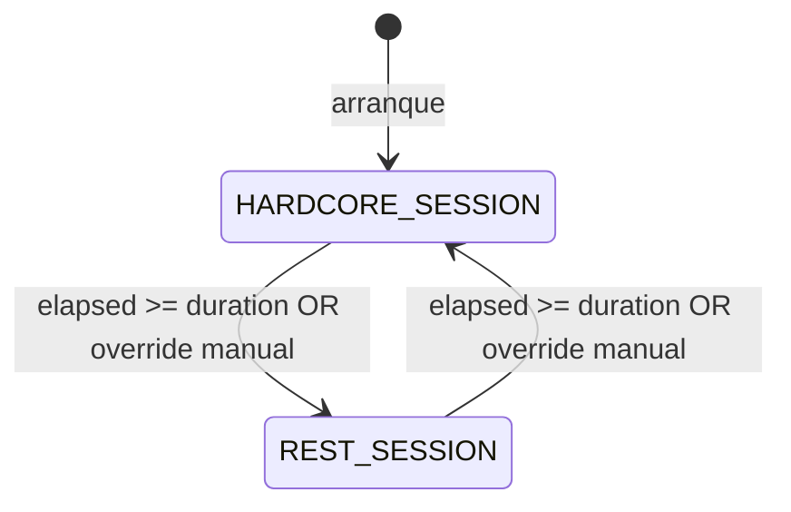

# Human Sessions — Ciclo de Actividad Humana del Bot

## 1. Objetivo de negocio

Simular el ritmo de trabajo de un jugador humano real en **todas** las actividades del bot, no solo en el farming. Un humano no juega a Travian al mismo ritmo durante 24 horas: alterna períodos de atención intensa con pausas donde sigue conectado pero actúa con menos frecuencia.

El WorldAgent implementa este ritmo alternando entre dos modos de sesión:

- **HARDCORE_SESSION:** el bot trabaja al ritmo operativo normal. Todas las actividades se procesan sin modificación de intervalos. El farming de oasis queda activo si está habilitado.
- **REST_SESSION:** el bot simula a un humano que sigue jugando pero con menor intensidad. Las farm lists de vacas (`VILLAGE`) siguen enviándose, pero con un multiplicador de intervalo de 1.5× a 2×. Las farm lists de oasis (`OASIS_*`) se detienen completamente. Las actividades de mantenimiento del bot (subir edificios, entrenar tropas) continúan con normalidad.

El bot **nunca queda completamente idle**: en REST_SESSION hay actividad reducida, no ausencia.

**Las duraciones de HARDCORE y REST son configurables por el usuario** (no hardcodeadas). El usuario también puede **forzar manualmente el modo activo** en cualquier momento desde el exterior del bucle del WorldAgent.

Esta feature toca el esquema de BD (tabla de configuración de sesión) y expone un endpoint HTTP para que el usuario cambie el modo. Por eso `apis_validadas_por_desarrollador_apis: pendiente`.

---

## 2. Actores y permisos

| Actor | Rol |
|---|---|
| Bot (WorldAgent) | Gestiona el ciclo HARDCORE/REST. Aplica el multiplicador de intervalo al reencolar tareas SEND_FARM_LIST_GROUP durante REST. Omite encolar SEND_OASIS_RAID durante REST. Lee la configuración de duraciones desde BD. Detecta cambios de modo forzados por el usuario. |
| Usuario | Configura las duraciones de HARDCORE y REST por mundo (rangos min/max). Puede forzar el cambio al modo que quiera en cualquier momento vía API. |
| Sistema (BD SQLite) | Persiste la configuración de duraciones (`session_config` por mundo) y el override de modo activo. |

No hay roles de autorización: el WorldAgent corre en sesión única por mundo.

---

## 3. Alcance

### Dentro del alcance

- Estado de sesión en memoria del WorldAgent: modo (`HARDCORE_SESSION` / `REST_SESSION`), tiempo de inicio, duración elegida para la sesión actual.
- **Arranque siempre en `HARDCORE_SESSION`.**
- Alternancia automática `HARDCORE → REST → HARDCORE → …` con duraciones aleatorias dentro de los rangos configurados por el usuario.
- **Nueva tabla `world_session_config`** (una fila por world_id) que almacena los rangos de duración y el override de modo activo.
- **Nuevo endpoint HTTP** `PUT /worlds/{world_id}/session/mode` para que el usuario fuerce el modo activo en cualquier momento.
- **Nuevo endpoint HTTP** `GET /worlds/{world_id}/session` para que el usuario consulte el modo activo, la duración elegida y el tiempo restante estimado.
- **Nuevo endpoint HTTP** `PUT /worlds/{world_id}/session/config` para actualizar los rangos de duración.
- Multiplicador de intervalo 1.5×-2× aplicado a `interval_min_ms` e `interval_max_ms` del `FarmScheduler` al reencolar tareas `SEND_FARM_LIST_GROUP` durante REST.
- El múltiplo se escoge aleatoriamente una vez al inicio de cada `REST_SESSION` y se mantiene fijo durante toda esa sesión.
- Supresión completa de encole de tareas `SEND_OASIS_RAID` durante `REST_SESSION` (todos los roles OASIS_*).
- Las transiciones de sesión son suaves: el bot termina el tick en curso antes de cambiar de modo.
- Nuevo enum `SessionMode` en el core.
- Nuevo dataclass `HumanSessionState` en memoria del WorldAgent.
- Nuevo dataclass `SessionConfig` (persistido en BD) con los rangos de duración por mundo.
- No se necesita un nuevo `TaskType` para señalizar la transición (la transición se detecta por tiempo transcurrido o por override en BD en el propio bucle del WorldAgent).

### Fuera del alcance

- Lógica específica de cada actividad de mantenimiento (edificios, tropas): este spec solo afirma que esas actividades se procesan normalmente en REST. Los specs de esas features son independientes.
- El algoritmo de raideo de oasis: eso vive en `oasis-farming.md`. Este spec solo controla cuándo el WorldAgent pausa el encole de tareas OASIS.
- Modificación de `FarmScheduler` en BD: el multiplicador de REST es runtime puro.
- Persistencia del modo activo entre reinicios: al reiniciar el bot, siempre arranca en HARDCORE independientemente del override previo. El override de modo es volátil: se aplica al ciclo en curso y se descarta al reiniciar.

---

## 4. Reglas de negocio

### RN-HS01 — Modos de sesión

El WorldAgent opera siempre en uno de dos modos. No hay un tercer modo de "apagado" en este spec.

| Modo | Duración objetivo | Comportamiento |
|---|---|---|
| `HARDCORE_SESSION` | Configurable por el usuario (default: 4-6 h) | Todas las actividades a ritmo normal. Farm lists VILLAGE e intervalos de oasis sin modificar. |
| `REST_SESSION` | Configurable por el usuario (default: 30-90 min) | Farm lists VILLAGE con multiplicador 1.5×-2×. Oasis detenido. Actividades de mantenimiento sin modificar. |

### RN-HS02 — Arranque siempre en HARDCORE_SESSION

Al iniciar el WorldAgent, el estado inicial es siempre `HARDCORE_SESSION`. La duración se elige aleatoriamente dentro del rango configurado para HARDCORE.

### RN-HS03 — Duraciones configurables por el usuario

Las duraciones de HARDCORE y REST son configurables por el usuario, separadamente para cada mundo, y se almacenan en `world_session_config`. El usuario puede cambiarlas en cualquier momento vía API; el nuevo rango se aplica en la siguiente sesión (no interrumpe la sesión en curso).

El WorldAgent carga la config de BD al arrancar y la mantiene en memoria. Si el usuario actualiza la config durante el ciclo, la detecta al inicio de la siguiente sesión.

Valores por defecto si no existe fila en `world_session_config`:

```
HARDCORE: duración = random.uniform(240, 360) minutos   [4-6 horas]
REST:     duración = random.uniform(30, 90)   minutos   [30 min - 1:30 h]
```

El `rest_interval_factor` (multiplicador 1.5×-2×) no es configurable: se escoge aleatoriamente al inicio de cada REST. Su rango [1.5, 2.0] es fijo por diseño anti-detección.

### RN-HS04 — Multiplicador de intervalo REST para farm lists VILLAGE

Al inicio de cada `REST_SESSION`, el WorldAgent escoge un multiplicador `rest_interval_factor = random.uniform(1.5, 2.0)`.

Este factor se aplica al reencolar la siguiente tarea `SEND_FARM_LIST_GROUP`:

```
next_interval_ms = random.uniform(
    scheduler.interval_min_ms * rest_interval_factor,
    scheduler.interval_max_ms * rest_interval_factor,
)
```

El factor se mantiene fijo durante toda la REST_SESSION. Al entrar en HARDCORE, se descarta y el siguiente reencole usa los intervalos del `FarmScheduler` sin multiplicar.

El factor NO modifica el `FarmScheduler` en BD. Es solo un parámetro de runtime del WorldAgent.

### RN-HS05 — Farm lists de oasis detenidas en REST_SESSION

Durante `REST_SESSION`, el WorldAgent **no encola nuevas tareas** `SEND_OASIS_RAID` para ningún rol (OASIS_HARDCORE, OASIS_MAINTENANCE, OASIS_CLEANUP reactivo).

- Las tareas OASIS que ya estén en la cola cuando comienza REST se dejan consumir (no se cancelan), pero no se reenquelan.
- La transición REST → HARDCORE reactiva el encole de oasis: el WorldAgent llama a `seed_oasis_groups_from_db()` al entrar en HARDCORE para recuperar el estado de los grupos desde BD y reencolar según las bandas de wake-up inteligente (definidas en `oasis-farming.md`).

### RN-HS06 — Actividades de mantenimiento sin cambios en REST_SESSION

Las tareas de mantenimiento del WorldAgent (subir edificios, entrenar tropas, etc.) se procesan normalmente durante REST. Este spec no modifica su comportamiento. Solo farm lists VILLAGE e OASIS se ven afectadas.

### RN-HS07 — Transición suave entre sesiones

Cuando el WorldAgent detecta que la duración de la sesión actual ha expirado, espera a terminar el tick en curso antes de cambiar de modo. No cancela tareas en vuelo ni raids en curso.

### RN-HS08 — El estado de sesión no se persiste

El estado (`SessionMode`, tiempo de inicio, duración elegida, `rest_interval_factor`) vive únicamente en la instancia de `WorldAgent`. Al reiniciar el proceso, se pierde y siempre arranca en REST con warmup (RN-HS02). Esta es una decisión intencional: la firma de anti-detección de arrancar en REST es siempre correcta.

### RN-HS09 — Un WorldAgent por mundo

No hay estado compartido entre mundos. Cada instancia de WorldAgent gestiona su propio ciclo de sesiones de forma independiente.

### RN-HS10 — Override manual de modo por el usuario

El usuario puede forzar el modo activo en cualquier momento llamando al endpoint `PUT /worlds/{world_id}/session/mode`. El WorldAgent detecta este override al inicio del siguiente ciclo del bucle (misma cadencia que `_check_and_transition_session()`).

Comportamiento del override:
- El WorldAgent pasa **inmediatamente** (al terminar el tick en curso) al modo solicitado, aunque la sesión actual no haya expirado.
- Se elige una nueva duración aleatoria dentro del rango configurado para el modo solicitado.
- Si el modo solicitado es REST: se elige un nuevo `rest_interval_factor`.
- Si el modo solicitado es HARDCORE: se llama a `seed_oasis_groups_from_db()` (igual que en la transición automática REST → HARDCORE).
- El override es de un solo uso: tras ejecutarse se borra de BD (campo `mode_override` vuelve a NULL). No persiste entre reinicios.
- Si el override solicita el modo que ya está activo, se ignora (no hay cambio de modo, no se recalcula duración).

El campo `mode_override` en `world_session_config` es la señal: el WorldAgent lo lee en cada iteración del bucle. Si es distinto de NULL y distinto del modo actual, aplica el override y lo borra.

---

## 5. Flujo principal y flujos alternativos

### Flujo principal — ciclo HARDCORE → REST → HARDCORE

```
1. WorldAgent arranca. Carga SessionConfig desde BD (o usa defaults si no existe).
   Estado inicial: HARDCORE_SESSION, duration = random.uniform(cfg.hardcore_min_min, cfg.hardcore_max_min).

2. Durante HARDCORE: el bucle procesa tareas sin multiplicador.
   - SEND_FARM_LIST_GROUP: intervalos directos del FarmScheduler.
   - SEND_OASIS_RAID: se encola normalmente según el algoritmo de oasis.
   - Otras tareas: sin modificación.

3. Inicio de cada iteración del bucle → _check_and_transition_session():
   a. Lee mode_override de BD. Si != NULL y != modo actual → aplica override (RN-HS10).
   b. Si elapsed >= session_duration → transición automática.

4. Transición HARDCORE → REST:
   - Termina el tick en curso.
   - session_duration = random.uniform(cfg.rest_min_min, cfg.rest_max_min)
   - rest_interval_factor = random.uniform(1.5, 2.0)
   - No encola nuevas tareas OASIS (las existentes en cola se consumen sin reencolar).

5. Durante REST: el bucle principal procesa tareas de la TaskQueue.
   - SEND_FARM_LIST_GROUP: se ejecuta, pero al reencolar aplica rest_interval_factor.
   - SEND_OASIS_RAID: tareas existentes en cola se consumen sin reencolar.
   - Otras tareas (edificios, tropas): sin modificación.

6. Transición REST → HARDCORE:
   - session_duration = random.uniform(cfg.hardcore_min_min, cfg.hardcore_max_min)
   - rest_interval_factor = None
   - Llama seed_oasis_groups_from_db() para reencolar grupos de oasis.

7. Volver a paso 2.
```

### Flujo alternativo — reinicio del bot

```
1. El proceso se detiene (razón: excepción, reinicio manual, actualización).
2. Al rearrancar, WorldAgent.session_mode = HARDCORE_SESSION (RN-HS02).
3. session_duration = random.uniform(cfg.hardcore_min_min, cfg.hardcore_max_min)
4. El bot retoma actividad directamente en HARDCORE.
```

### Flujo alternativo — usuario fuerza cambio de modo

```
1. Usuario llama PUT /worlds/{world_id}/session/mode {"mode": "REST_SESSION"}.
2. API escribe mode_override = "REST_SESSION" en world_session_config.
3. WorldAgent detecta mode_override en la siguiente iteración del bucle.
4. Si mode_override != modo actual:
   - Aplica la transición correspondiente (igual que la automática).
   - Borra mode_override (lo pone a NULL en BD).
5. Si mode_override == modo actual: lo ignora y lo borra.
```

### Flujo alternativo — tarea SEND_OASIS_RAID llega a ejecución durante REST

```
1. La tarea estaba en cola cuando el REST comenzó (venía del HARDCORE anterior).
2. WorldAgent._execute() la procesa normalmente (la tarea ya encolada se honra).
3. Al terminar: NO se reencola la tarea OASIS.
4. El grupo de oasis queda sin tareas en cola hasta el próximo HARDCORE.
5. Cuando HARDCORE comience, seed_oasis_groups_from_db() recupera el estado del grupo.
   - Si elapsed desde last_raid_time < 10 min: Banda 1 (retoma normal).
   - Si 10 min <= elapsed < 90 min: Banda 2 (empieza con MAINTENANCE).
   - Si elapsed >= 90 min: Banda 3 (fuerza ALERT, encola CLEANUP).
   (Las bandas están definidas en oasis-farming.md §9.4.)
```

---

## 6. Edge cases

| ID | Situación | Tratamiento |
|---|---|---|
| EC-HS01 | Bot arranca y no hay schedulers VILLAGE activos | El WorldAgent arranca en HARDCORE igualmente. El ciclo de sesiones no depende de que haya schedulers. |
| EC-HS02 | REST_SESSION dura más de lo esperado porque el tick en curso tarda (tarea lenta) | La duración de sesión es una target, no un deadline hard. El tick termina siempre antes de transicionar. La siguiente detección de elapsed >= duration ocurre en el siguiente ciclo del bucle. |
| EC-HS03 | HARDCORE_SESSION sin grupos de oasis configurados | `seed_oasis_groups_from_db()` devuelve 0 grupos. No hay error. Las farm lists VILLAGE operan normalmente. |
| EC-HS04 | El multiplicador `rest_interval_factor` produce un intervalo mayor al máximo razonable | Si `interval_max_ms * 2.0` resulta, por ejemplo, en 40 minutos (para un scheduler con max de 20 min), es aceptado. El multiplicador no tiene cap superior adicional: el resultado es coherente con un humano que sigue conectado pero distante. |
| EC-HS05 | Transición HARDCORE → REST ocurre mientras una tarea SEND_OASIS_RAID está en ejecución (await) | La transición ocurre al detectar `elapsed >= duration` en el bucle entre tareas, no durante una ejecución. Al terminar el tick actual, se transiciona. La tarea en ejecución no se interrumpe. |
| EC-HS06 | Reinicio muy frecuente del bot (varios reinicios en < 1 hora) | Cada reinicio arranca en HARDCORE. Si los reinicios son muy frecuentes, el bot sigue operando en HARDCORE, que es el comportamiento preferible (no se pierde actividad). |
| EC-HS07 | El usuario deshabilita todos los schedulers VILLAGE durante REST | No hay tareas SEND_FARM_LIST_GROUP en cola. El bot procesa otras tareas (edificios, tropas). Al entrar en HARDCORE, tampoco hay tareas VILLAGE si siguen deshabilitados. Sin efectos secundarios en el ciclo de sesiones. |
| EC-HS08 | seed_oasis_groups_from_db() falla al entrar en HARDCORE | La excepción se captura en el bucle del WorldAgent (misma convención que otros errores en _execute()). El WorldAgent entra en HARDCORE igualmente; simplemente no hay grupos de oasis encolados. Los reintentos ocurrirán en el siguiente ciclo natural si el scheduler reactiva tareas. |
| EC-HS09 | rest_interval_factor se aplica a un FarmScheduler con interval_min_ms == interval_max_ms | Se aplica igualmente. El resultado es `random.uniform(min * f, max * f)` con min == max, que devuelve exactamente `min * f`. Comportamiento determinista aceptado. |

---

## 7. Modelo de datos / cambios de esquema

### 7.1 Enum `SessionMode` (core/entities/session.py — archivo nuevo)

```python
from enum import Enum

class SessionMode(str, Enum):
    HARDCORE_SESSION = "HARDCORE_SESSION"
    REST_SESSION     = "REST_SESSION"
```

### 7.2 Dataclass `HumanSessionState` (core/entities/session.py — mismo archivo)

Estado en memoria del WorldAgent para la sesión actual:

```python
from dataclasses import dataclass, field
from datetime import datetime

@dataclass
class HumanSessionState:
    mode: SessionMode = SessionMode.HARDCORE_SESSION
    session_start: datetime = field(default_factory=datetime.now)
    session_duration_min: float = 240.0     # minutos; default 4h (rango: cfg.hardcore)
    rest_interval_factor: float | None = None  # None en HARDCORE; 1.5-2.0 en REST
```

El WorldAgent instancia un `HumanSessionState` al arrancar y lo muta directamente.

### 7.3 Dataclass `SessionConfig` (core/entities/session.py — mismo archivo)

Configuración persistida en BD. Una fila por mundo:

```python
@dataclass
class SessionConfig:
    world_id: int
    hardcore_min_min: float = 240.0   # duración mínima HARDCORE en minutos (default: 4h)
    hardcore_max_min: float = 360.0   # duración máxima HARDCORE en minutos (default: 6h)
    rest_min_min: float    = 30.0     # duración mínima REST en minutos (default: 30 min)
    rest_max_min: float    = 90.0     # duración máxima REST en minutos (default: 1:30h)
    mode_override: str | None = None  # NULL en estado normal; "HARDCORE_SESSION" o "REST_SESSION" si el usuario forzó un cambio
```

### 7.4 Nueva tabla `world_session_config`

```sql
CREATE TABLE IF NOT EXISTS world_session_config (
    world_id          INTEGER PRIMARY KEY REFERENCES worlds(id),
    hardcore_min_min  REAL    NOT NULL DEFAULT 240.0,
    hardcore_max_min  REAL    NOT NULL DEFAULT 360.0,
    rest_min_min      REAL    NOT NULL DEFAULT 30.0,
    rest_max_min      REAL    NOT NULL DEFAULT 90.0,
    mode_override     TEXT            DEFAULT NULL  -- NULL | 'HARDCORE_SESSION' | 'REST_SESSION'
);
```

El WorldAgent inserta la fila con defaults en el arranque si no existe (UPSERT). Si existe, usa los valores almacenados.

### 7.5 Puerto `SessionConfigDbPort` (core/ports/session_config_db_port.py)

```python
class SessionConfigDbPort(ABC):

    @abstractmethod
    async def get_or_create_session_config(self, world_id: int) -> SessionConfig: ...
    """Devuelve la config del mundo. Si no existe, crea la fila con defaults y la devuelve."""

    @abstractmethod
    async def update_session_config(self, config: SessionConfig) -> SessionConfig: ...
    """Actualiza hardcore_min/max y rest_min/max. No toca mode_override."""

    @abstractmethod
    async def set_mode_override(self, world_id: int, mode: SessionMode | None) -> None: ...
    """Escribe el override de modo (o lo borra si mode=None)."""

    @abstractmethod
    async def consume_mode_override(self, world_id: int) -> SessionMode | None: ...
    """Lee el mode_override y lo borra (lo pone a NULL) en una sola operación atómica.
    Devuelve el modo leído, o None si no había override."""
```

---

## 8. Contratos de API / interfaces

Esta feature expone tres endpoints HTTP. Los contratos definitivos los valida el agente `desarrollador-apis`; los que siguen son los contratos preliminares.

### 8.1 `GET /worlds/{world_id}/session` — Estado actual de sesión

```
Response 200:
{
  "mode": "HARDCORE_SESSION",          // o "REST_SESSION"
  "session_start": "2026-05-29T14:23:00Z",
  "session_duration_min": 312.5,       // duración elegida para esta sesión
  "elapsed_min": 47.3,                 // tiempo transcurrido desde session_start
  "estimated_remaining_min": 265.2,    // session_duration_min - elapsed_min
  "rest_interval_factor": null,        // null en HARDCORE; 1.5-2.0 en REST
  "config": {
    "hardcore_min_min": 240.0,
    "hardcore_max_min": 360.0,
    "rest_min_min": 30.0,
    "rest_max_min": 90.0
  }
}
```

### 8.2 `PUT /worlds/{world_id}/session/mode` — Forzar cambio de modo

```
Request body: { "mode": "REST_SESSION" }   // o "HARDCORE_SESSION"

Response 200: { "mode": "REST_SESSION", "message": "Override encolado. Se aplicará en el próximo ciclo del WorldAgent." }
Response 400: { "detail": "Modo inválido. Valores aceptados: HARDCORE_SESSION, REST_SESSION." }
Response 404: { "detail": "Mundo no encontrado." }
Response 409: { "detail": "El bot ya está en REST_SESSION." }
```

### 8.3 `PUT /worlds/{world_id}/session/config` — Actualizar configuración de duraciones

```
Request body:
{
  "hardcore_min_min": 180.0,   // mínimo 30.0; máximo 720.0
  "hardcore_max_min": 300.0,   // debe ser >= hardcore_min_min
  "rest_min_min": 20.0,        // mínimo 10.0; máximo 180.0
  "rest_max_min": 60.0         // debe ser >= rest_min_min
}

Response 200: { ...SessionConfig actualizado... }
Response 422: { "detail": "hardcore_max_min debe ser >= hardcore_min_min." }
```

### 8.4 Propiedad interna del WorldAgent

```python
@property
def session_mode(self) -> SessionMode:
    return self._session.mode
```

---

## 9. Flujo lógico paso a paso (pseudocódigo / mermaid)

### 9.1 Máquina de estados del ciclo de sesiones



El ciclo es infinito mientras el WorldAgent está activo. El override manual puede forzar cualquier transición en cualquier momento.

### 9.2 Inicialización del WorldAgent

```python
async def _init_human_session(self) -> None:
    """
    Inicializa el ciclo de sesiones al arrancar el WorldAgent.
    SIEMPRE arranca en HARDCORE_SESSION.
    Carga la configuración de duraciones desde BD (o usa defaults si no existe).
    """
    self._session_cfg = await self._session_db.get_or_create_session_config(self.world_id)
    duration_min = random.uniform(
        self._session_cfg.hardcore_min_min,
        self._session_cfg.hardcore_max_min,
    )
    self._session = HumanSessionState(
        mode=SessionMode.HARDCORE_SESSION,
        session_start=datetime.now(),
        session_duration_min=duration_min,
        rest_interval_factor=None,
    )
    log.info(
        "Mundo %d: arrancando en HARDCORE_SESSION (%.1f h)",
        self.world_id,
        duration_min / 60,
    )
```

### 9.3 Detección y transición de sesión (en el bucle principal)

La transición se detecta al inicio de cada iteración del bucle del WorldAgent, antes de sacar la siguiente tarea de la cola. Primero comprueba overrides manuales, luego expiración por tiempo:

```python
async def _check_and_transition_session(self) -> None:
    """
    1. Lee mode_override de BD y aplica si != modo actual.
    2. Si no hay override, comprueba si la sesión expiró por tiempo.
    Llamar al inicio de cada iteración del bucle principal.
    """
    # 1. Override manual del usuario (RN-HS10)
    override = await self._session_db.consume_mode_override(self.world_id)
    if override is not None and override != self._session.mode:
        log.info("Mundo %d: override manual → %s", self.world_id, override)
        await self._transition_to(override)
        return

    # 2. Expiración por tiempo
    elapsed_min = (datetime.now() - self._session.session_start).total_seconds() / 60
    if elapsed_min >= self._session.session_duration_min:
        target = (
            SessionMode.REST_SESSION
            if self._session.mode == SessionMode.HARDCORE_SESSION
            else SessionMode.HARDCORE_SESSION
        )
        await self._transition_to(target)


async def _transition_to(self, target: SessionMode) -> None:
    """Aplica la transición al modo indicado, actualiza self._session."""
    cfg = self._session_cfg

    if target == SessionMode.HARDCORE_SESSION:
        duration_min = random.uniform(cfg.hardcore_min_min, cfg.hardcore_max_min)
        self._session = HumanSessionState(
            mode=SessionMode.HARDCORE_SESSION,
            session_start=datetime.now(),
            session_duration_min=duration_min,
            rest_interval_factor=None,
        )
        log.info("Mundo %d: → HARDCORE_SESSION (%.1f h)", self.world_id, duration_min / 60)
        try:
            n = await self.seed_oasis_groups_from_db()
            log.info("Mundo %d: %d grupos de oasis reencolados", self.world_id, n)
        except Exception as exc:
            log.error("Mundo %d: error en seed_oasis_groups_from_db: %s", self.world_id, exc)
            # EC-HS08: el HARDCORE continúa sin oasis si seed falla

    else:  # REST_SESSION
        duration_min = random.uniform(cfg.rest_min_min, cfg.rest_max_min)
        factor = random.uniform(1.5, 2.0)
        self._session = HumanSessionState(
            mode=SessionMode.REST_SESSION,
            session_start=datetime.now(),
            session_duration_min=duration_min,
            rest_interval_factor=factor,
        )
        log.info(
            "Mundo %d: → REST_SESSION (%.0f min, factor=%.2f)",
            self.world_id, duration_min, factor,
        )
        # No se cancela nada: las tareas OASIS en cola se consumen sin reencolar (RN-HS05)
```

### 9.4 Modificación del reencole de farm lists VILLAGE durante REST

En el punto donde el WorldAgent calcula el `execute_at` del siguiente tick de `SEND_FARM_LIST_GROUP`, aplica el factor si está en REST:

```python
def _next_farm_list_interval_ms(self, scheduler: FarmScheduler) -> float:
    """
    Calcula el intervalo de reencole para una farm list VILLAGE.
    Durante REST_SESSION aplica rest_interval_factor.
    """
    min_ms = scheduler.interval_min_ms
    max_ms = scheduler.interval_max_ms

    if (
        self._session.mode == SessionMode.REST_SESSION
        and self._session.rest_interval_factor is not None
    ):
        f = self._session.rest_interval_factor
        min_ms = min_ms * f
        max_ms = max_ms * f

    return random.uniform(min_ms, max_ms)
```

### 9.5 Supresión de reencole OASIS durante REST

En el punto donde el WorldAgent reencola la siguiente tarea `SEND_OASIS_RAID` tras ejecutar un tick:

```python
def _should_reenqueue_oasis_raid(self) -> bool:
    """
    Devuelve False durante REST_SESSION: no se encolan nuevas tareas OASIS.
    """
    return self._session.mode == SessionMode.HARDCORE_SESSION
```

Uso en el handler de `SEND_OASIS_RAID`:

```python
elif task.task_type == TaskType.SEND_OASIS_RAID:
    await self._oasis_use_case.execute_raid(...)
    if self._should_reenqueue_oasis_raid():
        self._reenqueue_oasis_task(task)   # añade la siguiente tarea a la cola
    # Si REST: no reencolar. La tarea muere aquí.
```

---

## 10. Validaciones y reglas

| Regla | Dónde se valida | Comportamiento en fallo |
|---|---|---|
| `session_duration_min` > 0 | Constructor de `HumanSessionState` | `ValueError` con mensaje claro |
| `rest_interval_factor` en [1.5, 2.0] si no None | Constructor de `HumanSessionState` | `ValueError`. El intervalo fuera de rango rompe la semántica de REST. |
| `session_mode` coherente con `rest_interval_factor` | Constructor / transición | `ValueError`: HARDCORE con factor no-None, o REST con factor None, son estados incoherentes. |
| `random.uniform(20, 30)` para warmup | `_init_human_session()` | N/A — valores hardcodeados correctos por diseño. |

---

## 11. Seguridad, rendimiento y concurrencia

### Concurrencia

- Un WorldAgent por mundo. asyncio single-threaded: `HumanSessionState` no necesita locks.
- `_check_and_transition_session()` se llama en el hilo del event loop, antes de sacar la siguiente tarea. No hay condición de carrera.

### Anti-detección

- **Arranque en REST con warmup (RN-HS02):** evita la firma más común de bots — arranque brusco en modo agresivo tras un período de inactividad.
- **Duraciones aleatorias de sesión (RN-HS03):** elimina patrones periódicos predecibles. Un bot que siempre esté activo exactamente 5 horas y en pausa exactamente 45 minutos es trivialmente detectable.
- **Factor de REST aleatorio por sesión (RN-HS04):** los intervalos de farm lists VILLAGE no tienen un patrón fijo en REST. Cada sesión de descanso tiene su propia "velocidad" de trabajo.
- **Oasis detenidos en REST (RN-HS05):** un humano que descansa no hace farming agresivo de oasis cada 6-8 minutos. Mantener el oasis activo en REST sería una firma.
- **El bot nunca está completamente idle (RN-HS06):** las farm lists VILLAGE siguen enviándose (con multiplicador) y el mantenimiento sigue. Un humano conectado siempre hace algo, aunque sea lento.

### Rendimiento

- `_check_and_transition_session()` es una operación O(1): una comparación de timestamps.
- `seed_oasis_groups_from_db()` se llama una sola vez por transición REST → HARDCORE. Con decenas de grupos, es una query SQL ligera.
- No hay nuevas queries ni escrituras en BD en el camino caliente del bucle.

---

## 12. Plan de pruebas

### Pruebas unitarias (core, sin browser ni BD)

| ID | Caso | Entrada | Esperado |
|---|---|---|---|
| UT-HS01 | Arranque siempre en HARDCORE_SESSION | Inicializar WorldAgent | `session.mode == HARDCORE_SESSION`, `rest_interval_factor == None` |
| UT-HS02 | session_duration_min en rango HARDCORE al arrancar | Inspeccionar duration tras init con cfg default | duration en [240, 360] |
| UT-HS03 | Transición HARDCORE → REST cuando elapsed >= duration | Simular elapsed > session_duration_min en HARDCORE | mode cambia a REST, nuevo factor en [1.5, 2.0], nueva duration en [rest_min, rest_max] |
| UT-HS04 | Transición REST → HARDCORE cuando elapsed >= duration | Simular elapsed > session_duration_min en REST | mode cambia a HARDCORE, rest_interval_factor = None, nueva duration en [hardcore_min, hardcore_max] |
| UT-HS05 | Sin transición antes de que expire el tiempo | elapsed < session_duration_min | mode no cambia |
| UT-HS06 | `_next_farm_list_interval_ms` en REST aplica factor | scheduler con min=600_000, max=900_000; factor=1.5 | resultado en [900_000, 1_350_000] |
| UT-HS07 | `_next_farm_list_interval_ms` en HARDCORE no aplica factor | mismo scheduler, mode=HARDCORE | resultado en [600_000, 900_000] |
| UT-HS08 | `_should_reenqueue_oasis_raid` en REST devuelve False | mode=REST | False |
| UT-HS09 | `_should_reenqueue_oasis_raid` en HARDCORE devuelve True | mode=HARDCORE | True |
| UT-HS10 | seed_oasis_groups_from_db llamado al entrar en HARDCORE | mock de seed_oasis_groups_from_db | se invoca exactamente 1 vez en la transición REST→HARDCORE |
| UT-HS11 | seed_oasis_groups_from_db NO llamado al entrar en REST | transición HARDCORE→REST | no se invoca seed_oasis_groups_from_db |
| UT-HS12 | Factor nuevo en cada REST_SESSION | 2 transiciones HARDCORE→REST consecutivas | factores distintos (probabilidad de igualdad ≈ 0; basta comprobar que se regenera) |
| UT-HS13 | HumanSessionState con rest_interval_factor fuera de rango | factor=0.5 | ValueError |
| UT-HS14 | HumanSessionState con session_duration_min <= 0 | duration=0 | ValueError |
| UT-HS15 | EC-HS09: factor aplicado a scheduler con min==max | min=max=600_000; factor=2.0 | resultado == 1_200_000 (determinista) |
| UT-HS16 | Override manual REST → se aplica aunque sesión no haya expirado | HARDCORE en curso, override=REST en BD | transición inmediata a REST, override borrado de BD |
| UT-HS17 | Override manual ignorado si ya está en el modo solicitado | REST en curso, override=REST en BD | no hay cambio de modo, override borrado |
| UT-HS18 | Override manual HARDCORE → seed_oasis_groups_from_db se llama | REST en curso, override=HARDCORE | seed llamado, mode=HARDCORE |
| UT-HS19 | Duración HARDCORE respeta cfg personalizado | cfg con hardcore_min=180, hardcore_max=240 | duration en [180, 240] |
| UT-HS20 | Duración REST respeta cfg personalizado | cfg con rest_min=15, rest_max=45 | duration en [15, 45] |

### Pruebas de integración (sin browser, con componentes reales)

| ID | Caso | Descripción |
|---|---|---|
| IT-HS01 | Ciclo completo REST→HARDCORE→REST | Simular tiempo transcurrido con timestamps controlados; verificar que los 3 estados se alcanzan en orden con los valores correctos |
| IT-HS02 | Tarea SEND_OASIS_RAID no se reencola en REST | Ejecutar un tick de SEND_OASIS_RAID con mode=REST; verificar que no se añade nueva tarea OASIS a la TaskQueue |
| IT-HS03 | Tarea SEND_OASIS_RAID se reencola en HARDCORE | Ejecutar mismo tick con mode=HARDCORE; verificar que se añade nueva tarea a la TaskQueue |
| IT-HS04 | seed_oasis_groups_from_db se llama solo en REST→HARDCORE | Ejecutar ciclo completo; verificar que seed_oasis_groups_from_db se llama exactamente en las transiciones REST→HARDCORE |
| IT-HS05 | EC-HS08: error en seed no aborta el HARDCORE | Simular excepción en seed_oasis_groups_from_db; verificar que el WorldAgent entra en HARDCORE igualmente |

---

## 13. Riesgos y trade-offs

### Decisión: estado de sesión en memoria, sin persistencia en BD

**Decisión: NO PERSISTIR el estado de sesión.**

**Justificación:**
1. Reiniciar siempre en REST es el comportamiento anti-detección correcto (RN-HS02). Persistir el estado solo añadiría complejidad sin beneficio de indetectabilidad.
2. La firma de "pausa + warmup suave" al arrancar es más segura que "continuar en HARDCORE exactamente donde se dejó" (que podría generar un patrón de tiempo de sesión muy exacto).
3. Sin nuevas tablas ni migraciones: la feature tiene cero coste de BD.

**Trade-off aceptado:** Si el bot se reinicia frecuentemente, la mayor parte del tiempo transcurrido puede ser en REST. Esto es una consecuencia benigna: el bot es conservador en caso de inestabilidad.

### Decisión: no usar TaskType para señalizar transiciones

**Decisión: DETECCIÓN POR TIEMPO en el bucle, sin TaskType de transición.**

**Justificación:**
La alternativa sería encolar una tarea `SWITCH_SESSION_MODE` con `execute_at = session_start + duration`. Esto añadiría complejidad (un nuevo TaskType, un nuevo handler, posibilidad de que la tarea quede huérfana si el bot se reinicia) sin ninguna ventaja funcional. La detección por tiempo en el bucle es más simple, más robusta y no crea deuda.

**Trade-off aceptado:** La detección no es exacta al milisegundo (ocurre "en el siguiente ciclo del bucle tras el tick en curso"). Esta imprecisión es deliberada (RN-HS07) y deseable desde el punto de vista de anti-detección.

### Riesgo R-HS01 — Tick muy largo retrasa la transición

Si un tick (por ejemplo, un envío de farm lists con timeout de red) dura mucho, la transición de sesión puede retrasarse significativamente respecto a la duración teórica.

**Mitigación:** La duración de sesión es una guía, no una garantía de tiempo exacto. El efecto es mínimo en el peor caso (un tick de farm list raramente supera 30 segundos). El retraso en la detección aumenta la variabilidad, que es deseable anti-detección.

### Riesgo R-HS02 — seed_oasis_groups_from_db puede tener latencia en mundos con muchos grupos

En un mundo con decenas de grupos, la query a BD puede tardar. Se ejecuta en async, dentro del event loop, bloqueando brevemente el bucle del WorldAgent.

**Mitigación:** Con SQLite WAL y decenas (no millones) de grupos, la latencia es de milisegundos. Aceptable. En una versión futura, si el número de grupos crece, puede cachearse el resultado.

### Riesgo R-HS03 — El multiplicador de REST puede hacer que una farm list VILLAGE se encole tan tarde que nunca se ejecute en la REST_SESSION

Si una REST_SESSION dura 30 minutos y el multiplicador 2.0 hace que el próximo tick sea en 40 minutos, la tarea no se ejecutará durante ese REST.

**Mitigación:** Este es el comportamiento correcto. En REST, "descansamos": si el intervalo multiplied cae fuera de la ventana de REST, simplemente no se envía esa vez. Al entrar en HARDCORE, la tarea tiene `execute_at` en el futuro calculado con el multiplicador, que ya no aplica, así que el siguiente reencole en HARDCORE usará intervalos normales.

---

## 14. Pasos de implementación ordenados

Los pasos están ordenados de menor a mayor dependencia. Cada paso puede compilar y testearse antes de continuar.

### Paso 1 — Entidades de sesión (core/entities/session.py — archivo nuevo)

- Crear `SessionMode` (enum, 2 valores: `HARDCORE_SESSION`, `REST_SESSION`).
- Crear `HumanSessionState` (dataclass con validaciones en `__post_init__`).
- Crear `SessionConfig` (dataclass con los campos del §7.3).
- Tests: UT-HS13, UT-HS14.

### Paso 2 — Puerto `SessionConfigDbPort` (core/ports/session_config_db_port.py)

- ABC con los 4 métodos del §7.5.
- Sin implementar aún.

### Paso 3 — Tabla y adaptador `SessionConfigSQLiteAdapter` (adapters/db/)

- DDL de `world_session_config` (§7.4).
- Implementar `get_or_create_session_config`, `update_session_config`, `set_mode_override`, `consume_mode_override` (la última debe ser atómica: SELECT + UPDATE NULL en una transacción).
- Tests de integración: IT-HS01 (parcial), UT-HS16 (parcial — consume_mode_override atómico).

### Paso 4 — `_init_human_session()` en WorldAgent

- Añadir `self._session_cfg: SessionConfig` y `self._session: HumanSessionState` al WorldAgent.
- Implementar `_init_human_session()` arrancando en HARDCORE con duración del rango configurado.
- Añadir propiedad `session_mode`.
- Tests: UT-HS01, UT-HS02, UT-HS19, UT-HS20.

### Paso 5 — `_check_and_transition_session()` y `_transition_to()` en WorldAgent

- Implementar detección de override manual (consume_mode_override) y expiración por tiempo.
- Implementar `_transition_to(target)` con la lógica de ambas transiciones (§9.3).
- Llamar a `_check_and_transition_session()` al inicio de cada iteración del bucle principal.
- Tests: UT-HS03, UT-HS04, UT-HS05, UT-HS10, UT-HS11, UT-HS16, UT-HS17, UT-HS18.
- Test integración: IT-HS01, IT-HS04, IT-HS05.

### Paso 6 — `_next_farm_list_interval_ms()` con factor REST

- Extraer o modificar el cálculo de intervalo de reencole de `SEND_FARM_LIST_GROUP`.
- Aplicar `rest_interval_factor` si `session.mode == REST_SESSION`.
- Tests: UT-HS06, UT-HS07, UT-HS15.

### Paso 7 — `_should_reenqueue_oasis_raid()` y supresión en REST

- Implementar `_should_reenqueue_oasis_raid()`.
- Modificar el handler de `SEND_OASIS_RAID` en `WorldAgent._execute()`.
- Tests: UT-HS08, UT-HS09, IT-HS02, IT-HS03.

### Paso 8 — Endpoints HTTP (adapters/api/routes/session.py — archivo nuevo)

- `GET /worlds/{world_id}/session`
- `PUT /worlds/{world_id}/session/mode`
- `PUT /worlds/{world_id}/session/config`
- Registrar el router en `adapters/api/main.py`.
- Delegar la validación de contratos al agente `desarrollador-apis` antes de commitear.
- Tests: CA-HS18, CA-HS19, CA-HS20.

### Paso 9 — Verificación end-to-end

- Ejecutar todos los tests nuevos (UT-HS01…UT-HS20, IT-HS01…IT-HS05).
- Verificar que los tests existentes de farm lists y oasis siguen al 100%.

---

## 15. Criterios de aceptación

Checklist verificable por el implementador sin preguntas abiertas:

- [ ] CA-HS01: `SessionMode` enum existe en `core/entities/session.py` con exactamente 2 valores: `HARDCORE_SESSION` y `REST_SESSION`.
- [ ] CA-HS02: `HumanSessionState` dataclass existe en `core/entities/session.py` con campos: `mode`, `session_start`, `session_duration_min`, `rest_interval_factor`. Valida en `__post_init__` que `session_duration_min > 0` y que `rest_interval_factor` es None (en HARDCORE) o en [1.5, 2.0] (en REST).
- [ ] CA-HS02b: `SessionConfig` dataclass existe en `core/entities/session.py` con campos: `world_id`, `hardcore_min_min`, `hardcore_max_min`, `rest_min_min`, `rest_max_min`, `mode_override`.
- [ ] CA-HS02c: Tabla `world_session_config` existe en BD con las columnas del §7.4 y los defaults correctos.
- [ ] CA-HS03: `WorldAgent._init_human_session()` inicializa `self._session` con `mode=HARDCORE_SESSION`, `session_duration_min` dentro del rango cfg.hardcore_min/max, `rest_interval_factor=None`.
- [ ] CA-HS04: `WorldAgent.session_mode` es una propiedad de solo lectura que devuelve `self._session.mode`.
- [ ] CA-HS05: `WorldAgent._check_and_transition_session()` no transiciona si no hay override y `elapsed_min < session_duration_min`.
- [ ] CA-HS05b: `_check_and_transition_session()` aplica el override manual si `mode_override` en BD es distinto del modo actual, y lo borra atómicamente con `consume_mode_override()`.
- [ ] CA-HS05c: Si el override coincide con el modo actual, se borra sin aplicar transición.
- [ ] CA-HS06: Al transicionar (automática o manual) REST → HARDCORE: `session.mode == HARDCORE_SESSION`, `rest_interval_factor == None`, `session_duration_min` en [cfg.hardcore_min, cfg.hardcore_max], `seed_oasis_groups_from_db()` invocado exactamente una vez.
- [ ] CA-HS07: Al transicionar (automática o manual) HARDCORE → REST: `session.mode == REST_SESSION`, `rest_interval_factor` en [1.5, 2.0], `session_duration_min` en [cfg.rest_min, cfg.rest_max], `seed_oasis_groups_from_db()` NO invocado.
- [ ] CA-HS08: `_next_farm_list_interval_ms(scheduler)` durante REST devuelve un valor en `[scheduler.interval_min_ms * f, scheduler.interval_max_ms * f]` donde `f` es `rest_interval_factor`.
- [ ] CA-HS09: `_next_farm_list_interval_ms(scheduler)` durante HARDCORE devuelve un valor en `[scheduler.interval_min_ms, scheduler.interval_max_ms]` sin multiplicar.
- [ ] CA-HS10: El handler de `SEND_OASIS_RAID` en `WorldAgent._execute()` no reencola la tarea si `session.mode == REST_SESSION`.
- [ ] CA-HS11: El handler de `SEND_OASIS_RAID` en `WorldAgent._execute()` sí reencola la tarea si `session.mode == HARDCORE_SESSION`.
- [ ] CA-HS12: Una excepción en `seed_oasis_groups_from_db()` al entrar en HARDCORE no aborta la transición: el WorldAgent entra en HARDCORE igualmente (EC-HS08).
- [ ] CA-HS13: `HumanSessionState(mode=REST_SESSION, session_duration_min=0, rest_interval_factor=1.5)` lanza `ValueError`.
- [ ] CA-HS14: `HumanSessionState(mode=REST_SESSION, session_duration_min=25, rest_interval_factor=0.5)` lanza `ValueError`.
- [ ] CA-HS15: Todos los tests existentes de farm lists y oasis pasan al 100% tras esta implementación.
- [ ] CA-HS16: Todos los tests UT-HS01…UT-HS20 pasan.
- [ ] CA-HS17: Todos los tests IT-HS01…IT-HS05 pasan.
- [ ] CA-HS18: Los 3 endpoints (GET /session, PUT /session/mode, PUT /session/config) devuelven los códigos de estado correctos según §8.
- [ ] CA-HS19: `PUT /session/mode` con el modo ya activo devuelve 409.
- [ ] CA-HS20: `PUT /session/config` con max < min devuelve 422.

---

## 16. Trazabilidad

| Decisión técnica | Requisito / Edge case que la origina |
|---|---|
| Estado de sesión en memoria, sin BD | RN-HS08: reiniciar en REST es siempre el comportamiento correcto anti-detección. Sin persistencia = sin migración = sin coste. |
| Arranque siempre en REST con warmup 20-30 min | RN-HS02: evita la firma "pausa larga → burst de actividad repentina" en el historial de Travian. |
| Duración de sesión decidida al inicio, no cambiada | RN-HS03: un bot que cambie de modo exactamente cuando se cumplen N minutos tiene una firma periódica. La duración aleatoria eliminada al inicio rompe cualquier patrón. |
| Multiplicador REST fijado por sesión (no por tick) | RN-HS04: un factor que cambiara en cada reencole sería detectable como "ruido blanco". Un factor fijo durante la sesión imita la velocidad constante de un humano en un período de menor actividad. |
| Oasis completamente detenidos en REST | RN-HS05: un humano que descansa no hace farming agresivo cada 6-8 min. La pausa de oasis es la firma más humana posible. |
| seed_oasis_groups_from_db en REST→HARDCORE | Flujo alternativo §5.3: las tareas OASIS que se consumieron sin reencolar durante REST necesitan reactivarse. seed_oasis_groups_from_db aplica el wake-up inteligente (bandas de elapsed) definido en oasis-farming.md. |
| No usar TaskType de transición | §13 trade-off: mayor simplicidad, mayor robustez. La detección por tiempo en el bucle no crea tareas huérfanas ni dependencias adicionales. |
| `_check_and_transition_session()` antes del tick (no durante) | RN-HS07: transición suave. El tick en curso siempre termina en el modo con el que empezó. |
| Propiedad `session_mode` de solo lectura | §8.1: interfaz interna para logging y otros componentes. Sin setter para garantizar que solo `_check_and_transition_session()` modifica el estado. |
| Error en seed no aborta HARDCORE | EC-HS08: el error es recuperable. El bot en HARDCORE sin oasis es mejor que el bot bloqueado esperando que seed funcione. |
| Bot nunca idle en REST | RN-HS06: farm lists VILLAGE con multiplicador + actividades de mantenimiento siguen activas. Un humano conectado siempre hace algo. |
