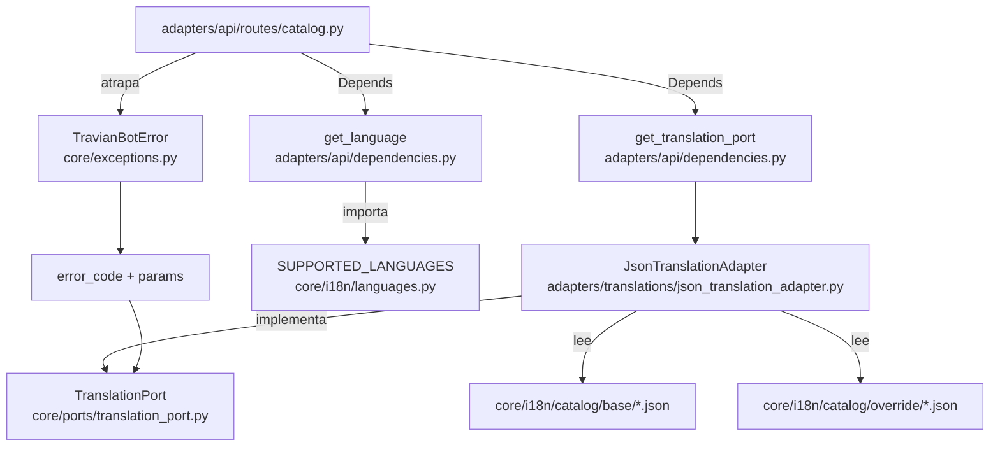

# Internacionalización del backend (edificios, tropas y mensajes de error)

> **CONTRATO REVALIDADO** por el agente `desarrollador-apis` el 2026-05-24.
>
> Revalidación cubre los dos ajustes post-validación inicial:
> - **Ajuste 1**: campo `language` (mapa `{lang_servido: nombre}`) por item; eliminación de `name`
>   plano y `lang` del wrapper. Schema `dict[str, str]` en Pydantic v2 genera
>   `additionalProperties: {type: string}` en OpenAPI — correcto para clave dinámica.
> - **Ajuste 2**: DTOs `BuildingItem`/`TroopItem` abiertos (sin `extra: "forbid"`) — válido.
>
> DTOs wrapper (`BuildingsCatalogResponse`, `TroopsCatalogResponse`) añadidos en sección 7
> para eliminar ambigüedad de implementación. Todos los status codes, cabeceras mínimas,
> tests de fallback mixto y criterios de aceptación verificados y conformes.

---

## 1. Objetivo de negocio

Permitir que el dashboard del bot muestre nombres de edificios y tropas de Travian en el
idioma del usuario, y que los mensajes de error de la API también lleguen localizados.

El backend es la fuente de verdad del dominio de Travian (gids de edificios, posiciones de
tropas por tribu), por lo que la traducción de ese contenido le corresponde al backend.
Los textos de la interfaz del dashboard (menús, etiquetas, botones) quedan FUERA: el
frontend tiene su propia i18n independiente.

**Caso de uso principal**: el operador abre el dashboard, selecciona su idioma (ej. "en"),
y ve "Woodcutter" en vez de "Leñador" en la lista de edificios de su aldea. Si ocurre un
error (ej. cuenta no encontrada), el mensaje llega en inglés, no en español hardcodeado.

---

## 2. Actores y permisos

| Actor | Acción | Permiso |
|---|---|---|
| Operador humano (dashboard) | Consulta catálogo de edificios/tropas | Sin autenticación (API interna) |
| Operador humano (dashboard) | Recibe mensajes de error localizados | Sin autenticación (implícito en cualquier endpoint) |
| Agente implementador | Lee traducciones del catálogo | Sin autenticación (uso interno) |

No hay endpoints de escritura. El catálogo es de solo lectura desde la API.
El catálogo base se modifica versionando los archivos JSON en git.

---

## 3. Alcance

### Dentro del alcance

- Traducción de **nombres de edificios** (identificados por `gid` numérico, catálogo global).
- Traducción de **nombres de tropas** por tribu y posición ordinal.
- Traducción de **mensajes de error de la API** (las 10 excepciones concretas del core más las dos nuevas).
- Dos endpoints de catálogo: `GET /catalog/buildings` y `GET /catalog/troops/{tribe}`.
- Fallback granular por entrada a `es` cuando falta la traducción en el idioma pedido.
- Caching en memoria del catálogo (cargado una vez al startup).
- Cabecera `Cache-Control` en los endpoints de catálogo.
- Mover `SUPPORTED_LANGUAGES` al core como fuente de verdad única.
- Migrar las 10 excepciones concretas de `core/exceptions.py` al patrón `error_code + params`.

### Fuera del alcance

- Textos de UI del dashboard (menús, botones, etiquetas de la interfaz).
- Endpoint de introspección de idiomas soportados (`GET /i18n/languages`).
- Traducciones de `de`, `fr`, `ru` con contenido real (se declaran como soportados pero con
  catálogo vacío/parcial — caen a fallback `es`).
- Traducciones de `ValueError` de validación de entidades del core.
- Internacionalización del frontend (gestión independiente).
- Edición del catálogo vía API (el catálogo es read-only desde la API).
- **Capa de datos de juego**: niveles, costes de recursos, tiempos de construcción, stats
  de tropas. Esta iteración cubre SOLO la capa de traducción (nombres + mensajes de error).
  Los objetos `Building` y `Troop` se diseñan extensibles para recibir esos campos en una
  feature futura sin romper este contrato. Ver sección 17 para el plan de trabajo futuro.

---

## 4. Reglas de negocio

1. **Idiomas soportados**: `es`, `en`, `de`, `fr`, `ru`. El idioma por defecto es `es`.
2. **Fuente de verdad de idiomas**: `core/i18n/languages.py` define `SUPPORTED_LANGUAGES`
   y `DEFAULT_LANGUAGE`. `adapters/api/dependencies.py` importa de ahí — nunca define su propio set.
3. **Catálogo base + override**: el catálogo base es la referencia oficial (nombres de
   Travian). El override permite ajustes puntuales sin tocar el base. La misma clave en
   override sobreescribe la del base, entrada por entrada.
4. **Fallback granular**: si falta la traducción de una entrada concreta en el idioma pedido,
   se devuelve la traducción en `es`. NUNCA se lanza error por traducción faltante de
   edificios o tropas.
5. **Sin fallback en mensajes de error**: si falta el `error_code` en el catálogo de mensajes,
   se devuelve el `error_code` en texto plano (ej. `"ACCOUNT_NOT_FOUND"`) más los params.
   Esto es un aviso de catálogo incompleto, no un error fatal.
6. **Catálogo de edificios global**: los edificios son compartidos entre tribus (gid es único
   por tipo de edificio). No se duplica el catálogo por tribu.
7. **Clave de tropas**: `{TRIBE}_{ordinal}` en mayúsculas, ej. `ROMANS_1`, `GAULS_3`.
   El valor de `Tribe` enum se convierte a mayúsculas para construir la clave.
8. **Catálogo versionado en git**: los archivos JSON del catálogo viven en `core/i18n/catalog/`
   y se commitean. El usuario NO debe gestionar archivos de traducción fuera del repo.
9. **La capa API traduce los errores**: los use cases del core lanzan excepciones agnósticas
   de idioma (`error_code` + `params`). Es responsabilidad de la capa API (los routers)
   atrapar esas excepciones y traducir `error_code` al idioma del `Accept-Language`.
10. **Los nombres traducidos son para el humano**: NUNCA usar nombres traducidos de
    edificios/tropas para localizar elementos en Travian (selectores). Los selectores
    del browser siempre usan gids, atributos HTML o clases CSS.

---

## 5. Flujo principal y flujos alternativos

### Flujo 1 — Consulta de catálogo de edificios

```
Cliente                    API Router              TranslationPort (adaptador)
   |                           |                           |
   |-- GET /catalog/buildings  |                           |
   |   Accept-Language: en     |                           |
   |                           |-- get_language("en") -> "en"
   |                           |-- translation_port.get_all_buildings("en")
   |                           |                           |-- load_catalog() [ya en memoria]
   |                           |                           |-- para cada gid:
   |                           |                           |     nombre = base[gid]["en"] si existe y no vacío
   |                           |                           |     sino   = base[gid]["es"]  (fallback)
   |                           |                           |     lang_servido = "en" / "es" según qué usó
   |                           |                           |-- retorna lista BuildingTranslation
   |                           |                           |   cada item incluye lang_servido
   |                           |
   |<-- 200 OK
   |    {"buildings": [
   |      {"gid": 1, "alias": "woodcutter", "language": {"en": "Woodcutter"}},
   |      ...
   |    ]}
```

### Flujo 2 — Consulta de tropas por tribu

```
GET /catalog/troops/romans
Accept-Language: es
→ FastAPI valida "romans" contra Tribe enum (case-insensitive en path)
→ translation_port.get_troop_names_by_tribe(Tribe.ROMANS, "es")
→ para cada tropa: lang_servido = "es" (se pidió es y existe)
→ retorna lista TroopTranslation con ordinal, key y language map
→ 200 OK
   {"tribe": "romans",
    "troops": [
      {"ordinal": 1, "key": "ROMANS_1", "language": {"es": "Legionario"}},
      ...
    ]}
```

### Flujo 3 — Error en endpoint existente (ej. cuenta no encontrada)

```
POST /bot/login
Accept-Language: en
→ LoginUseCase lanza AccountNotFoundError(42)
→ Router atrapa TravianBotError
→ translation_port.get_message("ACCOUNT_NOT_FOUND", "en", account_id=42)
→ "Account 42 not found"
→ 404 {"detail": "Account 42 not found"}
```

### Flujo alternativo — Fallback granular (idioma parcialmente sin catálogo)

```
GET /catalog/buildings
Accept-Language: de
→ edificio gid=1: base["1"]["de"] vacío → fallback a base["1"]["es"] = "Leñador"
                  lang_servido para este item = "es"
→ edificio gid=2: base["2"]["de"] = "Holzfäller" (existe y no vacío) → lang_servido = "de"
→ 200 OK
  {"buildings": [
    {"gid": 1, "alias": "woodcutter", "language": {"es": "Leñador"}},
    {"gid": 2, "alias": "clay_pit",   "language": {"de": "Holzfäller"}},
    ...
  ]}

COMPORTAMIENTO VISIBLE DEL FALLBACK: el campo `language` usa como clave el idioma
realmente servido (no el pedido). Si el cliente pidió "de" pero el item llegó con
clave "es", el cliente sabe que para ese item se usó el fallback. Esto es intencional
y es una ventaja de diseño: el cliente puede detectar, item a item, qué entradas
aún no tienen traducción en su idioma.
```

---

## 6. Edge cases

| # | Situación | Comportamiento esperado |
|---|---|---|
| EC-1 | Catálogo incompleto: idioma existe pero falta entrada de un gid/tropa concreto | Fallback granular a `es` para esa entrada. El resto del catálogo se sirve normal. |
| EC-2 | Tropa en posición inexistente (ej. `ROMANS_15`, romanos tienen 10 tropas) | `TranslationPort.get_troop_name` lanza `TroopNotFoundError`. Router devuelve 404. |
| EC-3 | Idioma en `SUPPORTED_LANGUAGES` pero sin catálogo en disco (ej. `ru`) | El sistema arranca igual. El override puede estar vacío. Las consultas caen a fallback `es`. NO fallar en startup. |
| EC-4 | Edificios compartidos entre tribus | El catálogo de edificios es global (no por tribu). `GET /catalog/buildings` devuelve todos los gids sin discriminar tribu. |
| EC-5 | `Accept-Language: es-ES` | `get_language` trunca a `es` (ya implementado). El adaptador recibe `es` directamente. |
| EC-6 | Tribu inválida en `/catalog/troops/{tribe}` (ej. `PERSIANS`) | FastAPI valida el path param contra `Tribe` enum y devuelve **422** automáticamente (antes de llegar al handler). No requiere lógica adicional. Justificación: es un error de tipado del cliente, no un recurso inexistente, por lo que 422 es más semántico que 404. |
| EC-7 | `error_code` desconocido en catálogo de mensajes | Se devuelve el `error_code` en texto plano + params como fallback (ej. `"ACCOUNT_NOT_FOUND account_id=42"`). Nunca falla. |
| EC-8 | Override con clave inexistente en base | La entrada del override se añade al catálogo efectivo. No es error (el override puede añadir entradas). |
| EC-9 | Arranque con archivos JSON corruptos | El adaptador lanza excepción en `__init__`. La app no arranca. El error es explícito en el log. |
| EC-10 | Catálogo base ausente en disco | Igual que EC-9: error en startup, nunca silencioso. |

---

## 7. Modelo de datos / cambios de esquema

### No hay cambios en la base de datos SQLite.

Las traducciones son datos estáticos de dominio (catálogo de Travian), no datos operativos
del bot. Vivir en JSON versionado en git es la decisión correcta: evita migraciones, permite
revisión en PR y funciona sin infraestructura extra.

### DTOs de respuesta (extensibles por diseño)

Los objetos devueltos en la API son **aditivos**: los campos opcionales futuros (costes,
tiempos, stats) se pueden añadir sin romper el contrato actual, porque los clientes que no
los esperan simplemente los ignoran.

```python
# Iteración actual — solo capa de traducción
class BuildingItem(BaseModel):
    gid: int
    alias: str
    language: dict[str, str]   # {lang_servido: nombre}
    # Campos reservados para la feature "datos de juego" (fuera de alcance ahora):
    # levels: list[BuildingLevel] | None = None
    # cost: ResourceCost | None = None
    # build_time_s: int | None = None

class TroopItem(BaseModel):
    ordinal: int
    key: str
    language: dict[str, str]   # {lang_servido: nombre}
    # Campos reservados para la feature "datos de juego":
    # attack: int | None = None
    # defense: int | None = None
    # speed: int | None = None
    # carry: int | None = None
```

Los comentarios con los campos futuros son una guía de diseño para el implementador.
**No implementar esos campos ahora**: solo asegurar que el schema Pydantic sea una
`BaseModel` abierta (no `model_config = {"extra": "forbid"}`), de modo que no rechace
campos adicionales si en el futuro se amplía el DTO.

### DTOs wrapper de respuesta

Los items anteriores se encapsulan en estos wrappers, que son los que serializa el router
directamente. Se declaran aquí para evitar que el implementador los infiera de los ejemplos.

```python
class BuildingsCatalogResponse(BaseModel):
    buildings: list[BuildingItem]

class TroopsCatalogResponse(BaseModel):
    tribe: str          # valor del enum Tribe en minúsculas (ej. "romans")
    troops: list[TroopItem]
```

Estos wrappers **sí deben declarar** `model_config = {"extra": "forbid"}`: el contrato del
wrapper es estable y no está prevista su extensión. Solo los items internos son abiertos.

### Estructura de archivos JSON del catálogo

#### `core/i18n/catalog/base/buildings.json`

```json
{
  "1": {
    "alias": "woodcutter",
    "es": "Leñador",
    "en": "Woodcutter",
    "de": "Holzfäller",
    "fr": "Bûcheron",
    "ru": "Лесопилка"
  },
  "2": {
    "alias": "clay_pit",
    "es": "Hoyo de arcilla",
    "en": "Clay Pit",
    "de": "",
    "fr": "",
    "ru": ""
  }
}
```

Notas:
- Clave: `gid` como string (JSON no permite claves numéricas).
- `alias`: identificador semántico legible para debugs y logs. NO se usa para lógica.
- Idiomas con string vacío `""` activan el fallback a `es`.
- `de`, `fr`, `ru` pueden estar vacíos en la iteración 1.

#### `core/i18n/catalog/base/troops.json`

```json
{
  "ROMANS_1": {"es": "Legionario", "en": "Legionnaire", "de": "", "fr": "", "ru": ""},
  "ROMANS_2": {"es": "Pretoriano", "en": "Praetorian", "de": "", "fr": "", "ru": ""},
  "TEUTONS_1": {"es": "Guerrero con porra", "en": "Clubswinger", "de": "", "fr": "", "ru": ""}
}
```

Notas:
- Clave: `{TRIBE_ENUM_VALUE_UPPER}_{ordinal}`. Ej: `Tribe.ROMANS.value.upper()` = `"ROMANS"`.
- Los ordinales empiezan en 1 y son consecutivos por tribu.
- No existe una clave `ROMANS_0` ni huecos en la secuencia.

#### `core/i18n/catalog/base/messages.json`

```json
{
  "ACCOUNT_NOT_FOUND": {
    "es": "Cuenta {account_id} no encontrada",
    "en": "Account {account_id} not found",
    "de": "Konto {account_id} nicht gefunden",
    "fr": "Compte {account_id} introuvable",
    "ru": "Аккаунт {account_id} не найден"
  },
  "DUPLICATE_ACCOUNT": {
    "es": "Ya existe una cuenta con el username '{username}'",
    "en": "An account with username '{username}' already exists",
    "de": "", "fr": "", "ru": ""
  }
}
```

Notas:
- Las variables se interpolan con `.format(**params)` de Python.
- Nombres de variables idénticos a los atributos de la excepción (ej. `account_id`, `username`).

#### `core/i18n/catalog/override/buildings.json`, `troops.json`, `messages.json`

Misma estructura que el base. Pueden estar vacíos `{}`. El override se aplica después de
cargar el base: `effective = {**base, **override}` a nivel de clave (gid o código).

---

## 8. Contratos de API / interfaces

> **REVALIDADO por `desarrollador-apis` el 2026-05-24.** Schema `language: dict[str, str]`
> con clave dinámica (idioma realmente servido) validado. Ejemplos, status codes, cabeceras
> mínimas y plan de tests verificados y conformes. DTOs wrapper añadidos en sección 7.

### Puerto `TranslationPort` (interfaz del core)

El puerto actualiza la firma de `get_all_buildings` y `get_troop_names_by_tribe` para reflejar
que el adaptador ya devuelve el idioma efectivamente servido por item (necesario para construir
el campo `language` en la respuesta sin lógica extra en el router).

```python
# core/ports/translation_port.py
from abc import ABC, abstractmethod
from core.entities.tribe import Tribe


class TranslationPort(ABC):
    """
    Puerto de traducciones. El core usa esta interfaz para obtener textos
    localizados. El adaptador concreto decide la fuente (JSON, BD, etc.).
    """

    @abstractmethod
    def get_building_name(self, gid: int, lang: str) -> str:
        """
        Devuelve el nombre del edificio con el gid dado en el idioma solicitado.
        Si la traducción falta para ese idioma, hace fallback a 'es'.
        Nunca lanza excepción por traducción faltante.
        Si el gid no existe en el catálogo, devuelve f"building_{gid}" como fallback.
        """

    @abstractmethod
    def get_all_buildings(self, lang: str) -> list[dict]:
        """
        Devuelve todos los edificios del catálogo con el idioma efectivamente servido
        por cada item.

        Cada elemento del resultado:
            {
                "gid": int,
                "alias": str,
                "lang_servido": str,   # idioma real usado (puede diferir de lang por fallback)
                "nombre": str
            }

        Fallback granular a 'es' por entrada. El router construye el campo `language`
        del response a partir de lang_servido + nombre.
        """

    @abstractmethod
    def get_troop_name(self, tribe: Tribe, ordinal: int, lang: str) -> str:
        """
        Devuelve el nombre de la tropa en la posición ordinal de la tribu dada.
        Fallback a 'es' si falta la traducción.
        Lanza TroopNotFoundError si el ordinal no existe para esa tribu.
        """

    @abstractmethod
    def get_troop_names_by_tribe(self, tribe: Tribe, lang: str) -> list[dict]:
        """
        Devuelve todas las tropas de una tribu con el idioma efectivamente servido
        por cada item.

        Cada elemento del resultado:
            {
                "ordinal": int,
                "key": str,
                "lang_servido": str,   # idioma real usado (puede diferir de lang por fallback)
                "nombre": str
            }

        Fallback granular a 'es' por entrada. El router construye el campo `language`
        del response a partir de lang_servido + nombre.
        Lanza TroopNotFoundError (con ordinal=None) si la tribu no tiene tropas
        definidas en el catálogo.
        """

    @abstractmethod
    def get_message(self, code: str, lang: str, **params) -> str:
        """
        Devuelve el mensaje de error para el code dado en el idioma solicitado.
        Interpola los params con .format(**params).
        Fallback a 'es' si falta la traducción en el idioma pedido.
        Si el code no existe en el catálogo, devuelve f"{code} {params}" como fallback.
        Nunca lanza excepción.
        """
```

### Endpoint 1: `GET /catalog/buildings`

**Descripción**: Devuelve el catálogo completo de edificios de Travian. Cada item lleva
el nombre dentro del campo `language`, cuya clave es el idioma **realmente servido** (que
puede diferir del pedido cuando se aplica el fallback granular a `es`).

**Request**:
```
GET /catalog/buildings
Accept-Language: en
```

| Parámetro | Tipo | Requerido | Descripción |
|---|---|---|---|
| `Accept-Language` | Header | Sí | Código BCP 47 (`es`, `en`, `de`, `fr`, `ru`) |

**Response 200 — idioma completo (Accept-Language: en, todos los items tienen traducción en en)**:
```json
{
  "buildings": [
    {"gid": 1, "alias": "woodcutter", "language": {"en": "Woodcutter"}},
    {"gid": 2, "alias": "clay_pit",   "language": {"en": "Clay Pit"}},
    {"gid": 3, "alias": "iron_mine",  "language": {"en": "Iron Mine"}}
  ]
}
```

**Response 200 — fallback parcial (Accept-Language: de, catálogo de de incompleto)**:
```json
{
  "buildings": [
    {"gid": 1, "alias": "woodcutter", "language": {"es": "Leñador"}},
    {"gid": 2, "alias": "clay_pit",   "language": {"de": "Tongrube"}},
    {"gid": 3, "alias": "iron_mine",  "language": {"es": "Mina de hierro"}}
  ]
}
```
*El item gid=1 no tiene traducción en `de` → la clave del campo `language` es `"es"`.
El item gid=2 sí tiene traducción en `de` → la clave es `"de"`. El cliente puede
distinguir item a item qué entradas aún no tienen traducción en su idioma.*

**Nota de diseño — por qué no se mantiene el campo plano `name`**:
El campo `language` embebe tanto el nombre como la evidencia del idioma servido en una
sola estructura, sin redundancia. Añadir un `name` plano paralelo crearía dos fuentes
de verdad dentro del mismo objeto y obligaría a especificar cuál usar cuando difieren.
El cliente que solo necesita el nombre siempre puede hacer `item["language"].values().__iter__().__next__()`
(o la forma idiomática en su lenguaje), ya que el mapa tiene exactamente una entrada.

**Cabeceras de respuesta**:
```
Content-Type: application/json; charset=utf-8
Cache-Control: public, max-age=3600
X-Request-ID: <uuid-v4>          (reutiliza el de la request si llega, genera uno si no)
X-API-Version: 0.1.0
X-Content-Type-Options: nosniff
X-Frame-Options: DENY
```

**Errores**:

| Código | Condición | Body |
|---|---|---|
| 400 | `Accept-Language` ausente o idioma no soportado | `{"detail": "Idioma 'XX' no soportado. Valores válidos: ['de', 'en', 'es', 'fr', 'ru']"}` |

---

### Endpoint 2: `GET /catalog/troops/{tribe}`

**Descripción**: Devuelve las tropas de una tribu específica. Igual que en edificios, cada
item lleva el campo `language` con el idioma realmente servido como clave.

**Request**:
```
GET /catalog/troops/romans
Accept-Language: es
```

| Parámetro | Tipo | Requerido | Descripción |
|---|---|---|---|
| `tribe` | Path (string) | Sí | Valor del enum `Tribe` en minúsculas (`romans`, `teutons`, `gauls`, `egyptians`, `huns`) |
| `Accept-Language` | Header | Sí | Código BCP 47 |

**Validación de `tribe`**: FastAPI parsea el path param contra el enum `Tribe`. Si el valor
no es un miembro válido, FastAPI devuelve 422 automáticamente antes de ejecutar el handler.

**Response 200 — idioma completo (Accept-Language: es)**:
```json
{
  "tribe": "romans",
  "troops": [
    {"ordinal": 1, "key": "ROMANS_1", "language": {"es": "Legionario"}},
    {"ordinal": 2, "key": "ROMANS_2", "language": {"es": "Pretoriano"}},
    {"ordinal": 3, "key": "ROMANS_3", "language": {"es": "Explorador de los Imperios"}}
  ]
}
```

**Response 200 — fallback parcial (Accept-Language: de, catálogo de de incompleto)**:
```json
{
  "tribe": "romans",
  "troops": [
    {"ordinal": 1, "key": "ROMANS_1", "language": {"es": "Legionario"}},
    {"ordinal": 2, "key": "ROMANS_2", "language": {"es": "Pretoriano"}},
    {"ordinal": 3, "key": "ROMANS_3", "language": {"de": "Reichskundschafter"}}
  ]
}
```
*Items sin traducción en `de` llevan la clave `"es"` en el campo `language`.
El wrapper ya no lleva el campo `lang`: el idioma efectivo es visible item a item.*

**Cabeceras de respuesta**:
```
Content-Type: application/json; charset=utf-8
Cache-Control: public, max-age=3600
X-Request-ID: <uuid-v4>          (reutiliza el de la request si llega, genera uno si no)
X-API-Version: 0.1.0
X-Content-Type-Options: nosniff
X-Frame-Options: DENY
```

**Errores**:

| Código | Condición | Body |
|---|---|---|
| 400 | `Accept-Language` ausente o idioma no soportado | `{"detail": "Idioma 'XX' no soportado. Valores válidos: ['de', 'en', 'es', 'fr', 'ru']"}` |
| 404 | Tribu válida pero sin tropas en el catálogo | `{"detail": "No hay tropas definidas para la tribu 'romans' en el catálogo"}` |
| 422 | `tribe` con valor fuera del enum (`PERSIANS`, etc.) | Body estándar de FastAPI (Unprocessable Entity) — automático |

---

### Cambios en endpoints existentes (y futuros)

Todos los endpoints que manejen excepciones del core deben:
1. Atrapar `TravianBotError` en un exception handler registrado en `app`.
2. Usar `translation_port.get_message(exc.error_code, lang, **exc.params)` para construir
   el `detail`.
3. Mapear `error_code` a HTTP status code mediante un dict en el router/handler.

**Mapa de error_code → HTTP status code**:

```python
# adapters/api/error_codes.py
ERROR_HTTP_MAP = {
    "ACCOUNT_NOT_FOUND":    404,
    "DUPLICATE_ACCOUNT":    409,
    "WORLD_NOT_FOUND":      404,
    "SESSION_NOT_ACTIVE":   409,
    "INVALID_CREDENTIALS":  401,
    "VILLAGE_NOT_FOUND":    404,
    "FARM_LIST_NOT_FOUND":  404,
    "TROOP_NOT_FOUND":      404,
    "BUILDING_NOT_FOUND":   404,
    "LOGIN_ERROR":          500,
    "BROWSER_ERROR":        500,
    "DATABASE_ERROR":       500,
}
DEFAULT_ERROR_STATUS = 500
```

---

## 9. Flujo lógico paso a paso

### 9.1 Carga del catálogo al startup

```
app startup
  |
  +-- JsonTranslationAdapter.__init__(base_dir, override_dir)
        |
        +-- _load_json(base_dir / "buildings.json") → base_buildings
        +-- _load_json(base_dir / "troops.json")    → base_troops
        +-- _load_json(base_dir / "messages.json")  → base_messages
        |
        +-- _load_json(override_dir / "buildings.json") → ov_buildings  (si existe)
        +-- _load_json(override_dir / "troops.json")    → ov_troops     (si existe)
        +-- _load_json(override_dir / "messages.json")  → ov_messages   (si existe)
        |
        +-- self._buildings = {**base_buildings, **ov_buildings}
        +-- self._troops    = {**base_troops,    **ov_troops}
        +-- self._messages  = {**base_messages,  **ov_messages}
        |
        +-- Si JSON corrupto o base ausente → lanzar RuntimeError (app no arranca)
```

### 9.2 `get_building_name(gid, lang)`

```python
def get_building_name(self, gid: int, lang: str) -> str:
    key = str(gid)
    entry = self._buildings.get(key)
    if entry is None:
        return f"building_{gid}"            # gid desconocido
    name = entry.get(lang, "").strip()
    if not name:
        name = entry.get(DEFAULT_LANGUAGE, "").strip()
    return name or f"building_{gid}"        # fallback final
```

### 9.2b `get_all_buildings(lang)` — devuelve lang_servido por item

```python
def get_all_buildings(self, lang: str) -> list[dict]:
    result = []
    for key, entry in self._buildings.items():
        gid = int(key)
        alias = entry.get("alias", f"building_{gid}")
        name = entry.get(lang, "").strip()
        if name:
            lang_servido = lang
        else:
            name = entry.get(DEFAULT_LANGUAGE, "").strip() or f"building_{gid}"
            lang_servido = DEFAULT_LANGUAGE
        result.append({
            "gid": gid,
            "alias": alias,
            "lang_servido": lang_servido,
            "nombre": name,
        })
    return result
```

El router construye el campo `language` del response así:
```python
[
    {
        "gid": item["gid"],
        "alias": item["alias"],
        "language": {item["lang_servido"]: item["nombre"]},
    }
    for item in translation_port.get_all_buildings(lang)
]
```

### 9.3 `get_troop_name(tribe, ordinal, lang)`

```python
def get_troop_name(self, tribe: Tribe, ordinal: int, lang: str) -> str:
    key = f"{tribe.value.upper()}_{ordinal}"
    entry = self._troops.get(key)
    if entry is None:
        raise TroopNotFoundError(tribe=tribe, ordinal=ordinal)
    name = entry.get(lang, "").strip()
    if not name:
        name = entry.get(DEFAULT_LANGUAGE, "").strip()
    return name or f"{key}_unknown"
```

### 9.3b `get_troop_names_by_tribe(tribe, lang)` — devuelve lang_servido por item

```python
def get_troop_names_by_tribe(self, tribe: Tribe, lang: str) -> list[dict]:
    prefix = f"{tribe.value.upper()}_"
    entries = {k: v for k, v in self._troops.items() if k.startswith(prefix)}
    if not entries:
        raise TroopNotFoundError(tribe=tribe, ordinal=None)
    result = []
    for key, entry in sorted(entries.items(),
                              key=lambda kv: int(kv[0].split("_")[-1])):
        ordinal = int(key.split("_")[-1])
        name = entry.get(lang, "").strip()
        if name:
            lang_servido = lang
        else:
            name = entry.get(DEFAULT_LANGUAGE, "").strip() or f"{key}_unknown"
            lang_servido = DEFAULT_LANGUAGE
        result.append({
            "ordinal": ordinal,
            "key": key,
            "lang_servido": lang_servido,
            "nombre": name,
        })
    return result
```

El router construye el campo `language` del response así:
```python
[
    {
        "ordinal": item["ordinal"],
        "key": item["key"],
        "language": {item["lang_servido"]: item["nombre"]},
    }
    for item in translation_port.get_troop_names_by_tribe(tribe, lang)
]
```

### 9.4 `get_message(code, lang, **params)`

```python
def get_message(self, code: str, lang: str, **params) -> str:
    entry = self._messages.get(code)
    if entry is None:
        return f"{code} {params}"           # code desconocido
    template = entry.get(lang, "").strip()
    if not template:
        template = entry.get(DEFAULT_LANGUAGE, "").strip()
    if not template:
        return f"{code} {params}"           # ni fallback en es
    try:
        return template.format(**params)
    except KeyError:
        return template                     # params incompletos, devuelve template sin interpolar
```

### 9.5 Exception handler global en la app FastAPI

```python
# adapters/api/main.py
from fastapi import Request
from fastapi.responses import JSONResponse
from core.exceptions import TravianBotError
from adapters.api.error_codes import ERROR_HTTP_MAP, DEFAULT_ERROR_STATUS

@app.exception_handler(TravianBotError)
async def travian_bot_error_handler(request: Request, exc: TravianBotError) -> JSONResponse:
    lang = _extract_lang(request)           # intenta leer Accept-Language, default "es"
    translation = request.app.state.translation_port
    message = translation.get_message(exc.error_code, lang, **exc.params)
    status_code = ERROR_HTTP_MAP.get(exc.error_code, DEFAULT_ERROR_STATUS)
    return JSONResponse(status_code=status_code, content={"detail": message})

def _extract_lang(request: Request) -> str:
    """Extrae y normaliza el idioma del header, defaultea a 'es' sin lanzar excepción."""
    raw = request.headers.get("Accept-Language", "es")
    code = raw.strip().lower().split("-")[0]
    from core.i18n.languages import SUPPORTED_LANGUAGES, DEFAULT_LANGUAGE
    return code if code in SUPPORTED_LANGUAGES else DEFAULT_LANGUAGE
```

### 9.6 Diagrama de módulos



---

## 10. Validaciones y reglas

| Regla | Dónde se aplica | Comportamiento ante violación |
|---|---|---|
| `Accept-Language` obligatorio y válido | `get_language` (dependency) | 400 Bad Request |
| `tribe` path param en enum `Tribe` | FastAPI (automático) | 422 Unprocessable Entity |
| Ordinal de tropa debe existir en catálogo | `get_troop_name` en adaptador | `TroopNotFoundError` → 404 |
| Catálogo base presente en disco | `JsonTranslationAdapter.__init__` | `RuntimeError` (app no arranca) |
| JSON válido en archivos de catálogo | `JsonTranslationAdapter.__init__` | `RuntimeError` (app no arranca) |
| Override ausente (archivo no existe) | `JsonTranslationAdapter.__init__` | Se ignora silenciosamente (override opcional) |
| `error_code` en excepción migranda | Todas las subclases de `TravianBotError` | Atributo obligatorio, sin default |

---

## 11. Seguridad, rendimiento y concurrencia

### Seguridad

- Los endpoints de catálogo no exponen datos sensibles (cuentas, contraseñas, sesiones).
- Los nombres del catálogo vienen de archivos JSON versionados (no input de usuario) →
  sin riesgo de inyección.
- El `error_code` en las excepciones es una constante interna, nunca dato del usuario →
  sin riesgo de exposición de stack traces al cliente (la regla del CLAUDE.md se mantiene).
- **[CONDICIÓN GUARDIAN-ANTIDETECCIÓN — higiene defensiva, obligatoria en implementación]**
  El enmascarado del modo verbose (`X-Verbose: true`) del exception handler NO solo debe ocultar
  `password`/`token`/`api_key`/`authorization`, sino también cualquier variable de frame que contenga
  **la ruta del perfil de Chrome (`user_data_dir`/`profile_dir`)** o **el servidor/URL de Travian
  (`world.server`, hostnames/URLs de Travian)**. Un volcado verbose nunca debe revelar qué servidor
  de Travian opera el bot ni la topología de perfiles. El test `test_error_handler_verbose_enmascara_secretos`
  debe ampliarse para cubrir estos dos casos adicionales. Justificación: aunque el modo verbose es de la
  API interna del dashboard (no del tráfico Chrome↔Travian, por lo que no es un fingerprint frente a Travian),
  es defensa en profundidad para que un volcado accidental no exponga la operación del bot.

### Rendimiento

- El catálogo se carga **una sola vez** en `__init__` del adaptador (singleton). Las
  consultas son lookups en dict en memoria: O(1).
- `Cache-Control: public, max-age=3600` en los endpoints de catálogo permite que el
  dashboard cachee la respuesta durante 1 hora.
- El catálogo de Travian es pequeño (~40 edificios, ~50 tropas totales entre 5 tribus).
  El footprint en memoria es despreciable (< 100 KB incluyendo todos los idiomas).

### Concurrencia

- El adaptador es **stateless tras la carga inicial** (solo lectura de dicts). No requiere
  locks. FastAPI + uvicorn maneja concurrencia por coroutines: no hay condiciones de carrera
  en las lecturas.
- Si en el futuro se añade recarga en caliente del catálogo, sí se necesitará un `asyncio.Lock`.
  Fuera del alcance de esta iteración.

---

## 12. Plan de pruebas

### 12.1 Tests de la capa de adaptador (`tests/unit/test_json_translation_adapter.py`)

| Test | Tipo | Descripción |
|---|---|---|
| `test_get_building_name_idioma_existente` | Unit | gid=1, lang="en" → "Woodcutter" |
| `test_get_building_name_fallback_a_es` | Unit | gid=1, lang="de" sin traducción → "Leñador" |
| `test_get_building_name_gid_inexistente` | Unit | gid=999 → "building_999" (sin excepción) |
| `test_get_all_buildings_lang_servido_correcto` | Unit | lang="en", todos los items tienen `lang_servido="en"` y nombre en inglés |
| `test_get_all_buildings_fallback_lang_servido_es` | Unit | lang="de" con item sin trad de → ese item tiene `lang_servido="es"` y nombre en es |
| `test_get_all_buildings_fallback_mixto` | Unit | lang="de" con algunos items con trad de y otros sin → `lang_servido` correcto por item |
| `test_get_troop_name_idioma_existente` | Unit | ROMANS, ordinal=1, lang="en" → "Legionnaire" |
| `test_get_troop_name_fallback_a_es` | Unit | ROMANS, ordinal=1, lang="de" sin trad → "Legionario" |
| `test_get_troop_name_ordinal_inexistente` | Unit | ROMANS, ordinal=15 → `TroopNotFoundError` |
| `test_get_troop_names_by_tribe_lang_servido_correcto` | Unit | ROMANS, lang="es" → lista 10 elementos, cada uno con `lang_servido="es"` |
| `test_get_troop_names_by_tribe_fallback_lang_servido_es` | Unit | ROMANS, lang="de" sin trad de → items con `lang_servido="es"` |
| `test_get_troop_names_by_tribe_sin_tropas` | Unit | Tribu sin entradas → `TroopNotFoundError` |
| `test_get_message_con_params` | Unit | "ACCOUNT_NOT_FOUND", "en", account_id=42 → string interpolado |
| `test_get_message_fallback_a_es` | Unit | code existente, lang sin traducción → mensaje en es |
| `test_get_message_code_desconocido` | Unit | code inexistente → string con code y params |
| `test_override_gana_sobre_base` | Unit | misma clave en base y override → valor del override |
| `test_startup_con_base_ausente_lanza_error` | Unit | sin archivo base → RuntimeError |
| `test_startup_con_json_corrupto_lanza_error` | Unit | JSON inválido → RuntimeError |
| `test_startup_con_override_ausente_ok` | Unit | sin override → carga normal del base |
| `test_idioma_es_ES_truncado_a_es` | Unit | lang="es-ES" (ya normalizado por get_language antes) → comportamiento igual que lang="es" |

### 12.2 Tests del endpoint `/catalog/buildings` (`tests/test_catalog_buildings.py`)

| Test | Status esperado | Descripción |
|---|---|---|
| `test_buildings_idioma_valido_en` | 200 | `Accept-Language: en` → cada item tiene `language: {"en": "<nombre en inglés>"}` |
| `test_buildings_idioma_valido_es` | 200 | `Accept-Language: es` → cada item tiene `language: {"es": "<nombre en español>"}` |
| `test_buildings_sin_header` | 400 | Sin `Accept-Language` → 400 con detail descriptivo |
| `test_buildings_idioma_no_soportado` | 400 | `Accept-Language: ja` → 400 |
| `test_buildings_estructura_respuesta` | 200 | Cada elemento tiene `gid` (int), `alias` (str), `language` (dict con una sola clave) |
| `test_buildings_no_contiene_campo_name` | 200 | Los items NO tienen campo `name` plano (verificar ausencia explícita) |
| `test_buildings_no_contiene_campo_lang_wrapper` | 200 | El wrapper de la respuesta NO tiene campo `lang` (el idioma viaja dentro de cada item) |
| `test_buildings_cache_control_header` | 200 | Respuesta incluye `Cache-Control: public, max-age=3600` |
| `test_buildings_fallback_de_idioma_servido_es` | 200 | `Accept-Language: de`, item sin trad de → `language: {"es": "<nombre en es>"}` (clave "es", no "de") |
| `test_buildings_fallback_de_idioma_servido_mixto` | 200 | `Accept-Language: de` → items con trad de tienen clave "de"; items sin trad tienen clave "es" |
| `test_buildings_cabeceras_minimas` | 200 | Respuesta incluye `Content-Type: application/json; charset=utf-8`, `X-Request-ID`, `X-API-Version`, `X-Content-Type-Options: nosniff`, `X-Frame-Options: DENY` |
| `test_buildings_x_request_id_eco` | 200 | Enviar `X-Request-ID` conocido en la request → vuelve idéntico en la respuesta |

### 12.3 Tests del endpoint `/catalog/troops/{tribe}` (`tests/test_catalog_troops.py`)

| Test | Status esperado | Descripción |
|---|---|---|
| `test_troops_tribu_valida_idioma_valido` | 200 | `romans`, `Accept-Language: es` → cada item tiene `language: {"es": "<nombre>"}` |
| `test_troops_estructura_respuesta` | 200 | Cada elemento tiene `ordinal` (int), `key` (str), `language` (dict con una sola clave) |
| `test_troops_no_contiene_campo_name` | 200 | Los items NO tienen campo `name` plano |
| `test_troops_no_contiene_campo_lang_wrapper` | 200 | El wrapper de la respuesta NO tiene campo `lang` |
| `test_troops_sin_header` | 400 | Sin `Accept-Language` → 400 |
| `test_troops_idioma_no_soportado` | 400 | `Accept-Language: zh` → 400 |
| `test_troops_tribu_invalida` | 422 | `tribe=persians` → 422 (FastAPI automático) |
| `test_troops_cache_control_header` | 200 | `Cache-Control: public, max-age=3600` |
| `test_troops_todas_las_tribus` | 200 | Verificar que las 5 tribus devuelven 200 |
| `test_troops_fallback_de_idioma_servido_es` | 200 | `Accept-Language: de`, item sin trad de → `language: {"es": "<nombre en es>"}` (clave "es", no "de") |
| `test_troops_fallback_de_idioma_servido_mixto` | 200 | `Accept-Language: de` → items con trad de tienen clave "de"; items sin trad tienen clave "es" |
| `test_troops_tribu_valida_sin_tropas_devuelve_404` | 404 | Tribu válida enum pero sin entradas en catálogo → 404 con detail descriptivo (mockear adaptador para lanzar `TroopNotFoundError`) |
| `test_troops_cabeceras_minimas` | 200 | Respuesta incluye `Content-Type: application/json; charset=utf-8`, `X-Request-ID`, `X-API-Version`, `X-Content-Type-Options: nosniff`, `X-Frame-Options: DENY` |
| `test_troops_x_request_id_eco` | 200 | Enviar `X-Request-ID` conocido en la request → vuelve idéntico en la respuesta |

### 12.4 Tests de migración de excepciones (`tests/unit/test_exceptions.py`)

Los tests existentes deben seguir pasando sin modificación (compatibilidad garantizada).
Añadir:

| Test | Descripción |
|---|---|
| `test_todas_las_excepciones_tienen_error_code` | Todas las subclases concretas tienen atributo `error_code` no vacío |
| `test_todas_las_excepciones_tienen_params` | Todas tienen atributo `params` (dict) |
| `test_account_not_found_error_code` | `AccountNotFoundError(42).error_code == "ACCOUNT_NOT_FOUND"` |
| `test_account_not_found_params` | `AccountNotFoundError(42).params == {"account_id": 42}` |
| `test_troop_not_found_error_code` | `TroopNotFoundError(Tribe.ROMANS, 15).error_code == "TROOP_NOT_FOUND"` |

### 12.5 Tests del exception handler global (`tests/test_error_handler.py`)

| Test | Descripción |
|---|---|
| `test_account_not_found_en_devuelve_404_en_ingles` | `AccountNotFoundError` + `Accept-Language: en` → 404 + detail en inglés |
| `test_account_not_found_es_devuelve_404_en_espanol` | `AccountNotFoundError` + `Accept-Language: es` → 404 + detail en español |
| `test_error_sin_header_usa_default_es` | Error sin `Accept-Language` → detail en español (default) |
| `test_error_handler_cabeceras_minimas` | Cualquier error traducido → respuesta incluye `X-Request-ID`, `X-API-Version`, `Content-Type: application/json; charset=utf-8`, `X-Content-Type-Options: nosniff`, `X-Frame-Options: DENY` |
| `test_error_handler_x_request_id_eco` | Enviar `X-Request-ID` conocido en la request de error → vuelve idéntico en la respuesta de error |
| `test_error_handler_verbose_true_popula_error_details` | Forzar `LOGIN_ERROR` (500) con header `X-Verbose: true` → respuesta incluye `error_details` con `exception`, `http_code`, `timestamp`, `trace`. Nota: para estos endpoints el handler global es responsable de incluir `error_details` en vez del campo `detail` plano cuando se activa verbose. |
| `test_error_handler_verbose_false_error_details_null` | Mismo error sin `X-Verbose` → `error_details` ausente o `null` (solo `detail` en el body) |
| `test_error_handler_verbose_enmascara_secretos` | Forzar error con datos sensibles en vars del frame → ningún valor real de campos `password`, `token`, `api_key`, `authorization` aparece en la respuesta; todos salen como `[]` |

---

## 13. Riesgos y trade-offs

| # | Riesgo / Trade-off | Decisión tomada | Justificación |
|---|---|---|---|
| T-1 | JSON vs BD para el catálogo | **JSON en repo** | El catálogo de Travian es estático. JSON versionado en git es revisable en PR, no requiere migraciones y funciona offline. La complejidad de una tabla extra en SQLite no aporta valor. |
| T-2 | Catálogo en `core/` vs `adapters/` | **JSON en `core/i18n/catalog/`** | Los datos del dominio (qué gid es cada edificio) son conocimiento del dominio, no del adaptador. El adaptador sabe *cómo* leerlos, no *qué* significan. |
| T-3 | `str(err)` en tests existentes | **Mantener mensaje en español en `str(err)`** | Romper los tests existentes de `test_exceptions.py` no aporta valor y aumenta el riesgo de regresión. El atributo `error_code` es nuevo y aditivo. |
| T-4 | Tribu inválida en path: 404 vs 422 | **422 (via FastAPI automático)** | `PERSIANS` no es una tribu desconocida del catálogo sino un error de schema del cliente. 422 es más preciso (validation error) y no requiere lógica adicional. |
| T-5 | `get_language` como default de idioma | **default `es` en exception handler** | El exception handler necesita un idioma incluso si la request no tiene header. Usar `es` como fallback silencioso en el handler (no en `get_language` que sigue siendo estricto). |
| T-6 | Singleton del adaptador | **`app.state.translation_port` en startup** | Una sola instancia cargada al arranque. FastAPI tiene lifecycle events (`@app.on_event("startup")`) para esto. Alternativa: inyección vía `Depends(get_translation_port)` con `@lru_cache`. Recomendamos `app.state` por ser el patrón más explícito en FastAPI. |
| T-7 | `get_troop_names_by_tribe` para tribu sin tropas | **`TroopNotFoundError` → 404** | Una tribu sin tropas en el catálogo es un estado incoherente del catálogo (bug). 404 comunica que el recurso no está disponible. |

---

## 14. Pasos de implementación ordenados

Los pasos están ordenados para minimizar conflictos: primero la infraestructura del core (sin
romper nada existente), luego el adaptador, luego la API, finalmente la migración de excepciones.

### Paso 1 — Crear `core/i18n/languages.py`
```
core/i18n/__init__.py          (nuevo, vacío)
core/i18n/languages.py         (nuevo)
```
Contenido de `languages.py`:
```python
SUPPORTED_LANGUAGES: frozenset[str] = frozenset({"es", "en", "de", "fr", "ru"})
DEFAULT_LANGUAGE: str = "es"
```

### Paso 2 — Actualizar `adapters/api/dependencies.py`
- Eliminar `SUPPORTED_LANGUAGES` local.
- Añadir `from core.i18n.languages import SUPPORTED_LANGUAGES, DEFAULT_LANGUAGE`.
- Mantener el resto de `get_language` idéntico (sin cambio de comportamiento).

### Paso 3 — Crear `core/ports/translation_port.py`
- Interfaz `TranslationPort` con los 4 métodos abstractos definidos en la sección 8.
- No importa nada de `adapters/` ni de `i18n/` (solo `core/entities/tribe.py`).

### Paso 4 — Crear los catálogos JSON base y override vacíos
```
core/i18n/catalog/base/buildings.json     (nuevo — con datos reales de es y en)
core/i18n/catalog/base/troops.json        (nuevo — con datos reales de es y en)
core/i18n/catalog/base/messages.json      (nuevo — con todos los error_codes)
core/i18n/catalog/override/buildings.json (nuevo — vacío: {})
core/i18n/catalog/override/troops.json    (nuevo — vacío: {})
core/i18n/catalog/override/messages.json  (nuevo — vacío: {})
```
Los gids de edificios a rellenar con datos oficiales de Travian:
gid 1=Leñador, 2=Mina de arcilla, 3=Mina de hierro, 4=Campo de trigo, 5=Aserradero,
6=Ladrillería, 7=Fundición, 8=Molinero, 9=Panadería, 10=Almacén, 11=Granero,
12=Herrería, 13=Punto de encuentro, 14=Academia, 15=Cuartel, 16=Establo,
17=Taller, 18=Palacio, 19=Tesoro, 20=Oficina de comercio, 21=Gran mercado,
22=Embajada, 23=Fuente, 24=Monumento, 25=Gran granero, 26=Gran almacén,
27=Aldea Wonder (World Wonder), 28=Catapulta (Ballista), 29=Muralla,
30=Zanja, 31=Palizada, 32=Residencia, 33=Mansión, 34=Herrero romano,
35=Herrero teutón, 36=Herrero galo, 37=Herrero egipcio, 38=Herrero huno,
39=Edificio especial (Great Barracks), 40=Edificio especial (Great Stable).
**El implementador debe verificar los gids exactos en la documentación oficial de Travian
T4.x antes de rellenar el catálogo.**

### Paso 5 — Crear `TroopNotFoundError` y `BuildingNotFoundError` en `core/exceptions.py`
Añadir al final del archivo:
```python
class TroopNotFoundError(TravianBotError):
    error_code = "TROOP_NOT_FOUND"
    def __init__(self, tribe: "Tribe", ordinal: int | None = None) -> None:
        super().__init__(f"Tropa {ordinal} de {tribe.value} no encontrada")
        self.tribe = tribe
        self.ordinal = ordinal
        self.params = {"tribe": tribe.value, "ordinal": str(ordinal or "")}

class BuildingNotFoundError(TravianBotError):
    error_code = "BUILDING_NOT_FOUND"
    def __init__(self, gid: int) -> None:
        super().__init__(f"Edificio gid={gid} no encontrado")
        self.gid = gid
        self.params = {"gid": gid}
```

### Paso 6 — Migrar las 10 excepciones concretas existentes en `core/exceptions.py`
Para cada excepción existente, añadir:
- Atributo de clase `error_code: str` (constante, en SCREAMING_SNAKE_CASE).
- Atributo de instancia `params: dict` con los valores necesarios para interpolación.
- **NO modificar** `super().__init__(mensaje)` para mantener compatibilidad con `str(err)`.

Tabla de migración:

| Clase | `error_code` | `params` |
|---|---|---|
| `AccountNotFoundError` | `"ACCOUNT_NOT_FOUND"` | `{"account_id": account_id}` |
| `DuplicateAccountError` | `"DUPLICATE_ACCOUNT"` | `{"username": username}` |
| `WorldNotFoundError` | `"WORLD_NOT_FOUND"` | `{"world_id": world_id}` |
| `SessionNotActiveError` | `"SESSION_NOT_ACTIVE"` | `{}` |
| `InvalidCredentialsError` | `"INVALID_CREDENTIALS"` | `{"username": username}` |
| `VillageNotFoundError` | `"VILLAGE_NOT_FOUND"` | `{"village_id": village_id}` |
| `FarmListNotFoundError` | `"FARM_LIST_NOT_FOUND"` | `{"farm_list_id": farm_list_id}` |
| `LoginError` | `"LOGIN_ERROR"` | `{}` |
| `BrowserError` | `"BROWSER_ERROR"` | `{}` |
| `DatabaseError` | `"DATABASE_ERROR"` | `{}` |

Patrón de implementación (ejemplo para `AccountNotFoundError`):
```python
class AccountNotFoundError(TravianBotError):
    error_code = "ACCOUNT_NOT_FOUND"

    def __init__(self, account_id: int) -> None:
        super().__init__(f"Cuenta {account_id} no encontrada")  # no cambiar
        self.account_id = account_id
        self.params = {"account_id": account_id}                # añadir
```

La base `TravianBotError` también recibe `error_code = "TRAVIAN_BOT_ERROR"` y `params = {}` como defaults.

### Paso 7 — Crear `adapters/translations/json_translation_adapter.py`
```
adapters/translations/__init__.py      (nuevo, vacío)
adapters/translations/json_translation_adapter.py (nuevo)
```
Implementa `TranslationPort`. Lógica de carga y fallback según pseudocódigos de sección 9.

### Paso 8 — Crear `adapters/api/error_codes.py`
Diccionario `ERROR_HTTP_MAP` definido en sección 8.

### Paso 9 — Crear `adapters/api/routes/catalog.py`
```
adapters/api/routes/catalog.py  (nuevo)
```
Dos endpoints: `GET /catalog/buildings` y `GET /catalog/troops/{tribe}`.
Registrar el router en `adapters/api/main.py`.

### Paso 10 — Registrar el exception handler global y el singleton en `adapters/api/main.py`
- Añadir `@app.exception_handler(TravianBotError)` según pseudocódigo sección 9.5.
- Inicializar `JsonTranslationAdapter` en startup y guardar en `app.state.translation_port`.
- Añadir dependencia `get_translation_port` en `adapters/api/dependencies.py`.

### Paso 11 — Escribir los tests
En el orden: `test_json_translation_adapter.py` → `test_catalog_buildings.py` →
`test_catalog_troops.py` → añadir casos a `test_exceptions.py` → `test_error_handler.py`.

---

## 15. Criterios de aceptación

El implementador puede marcar esta feature como `implemented` cuando todos los ítems
siguientes estén verificados:

- [ ] **CA-1** `core/i18n/languages.py` existe y `adapters/api/dependencies.py` ya no define `SUPPORTED_LANGUAGES` propio.
- [ ] **CA-2** `core/ports/translation_port.py` existe con los 4 métodos abstractos.
- [ ] **CA-3** Los tres archivos JSON base existen con contenido real en `es` y `en` para todos los edificios y tropas de las 5 tribus.
- [ ] **CA-4** Los tres archivos JSON override existen (pueden estar vacíos `{}`).
- [ ] **CA-5** `JsonTranslationAdapter` implementa `TranslationPort` y carga base + override al init.
- [ ] **CA-6** `GET /catalog/buildings` con `Accept-Language: en` devuelve 200 con items que tienen `language: {"en": "<nombre en inglés>"}`.
- [ ] **CA-6b** Los items de la respuesta de buildings NO tienen campo `name` plano, y el wrapper NO tiene campo `lang`.
- [ ] **CA-7** `GET /catalog/buildings` sin header devuelve 400.
- [ ] **CA-8** `GET /catalog/buildings` con `Accept-Language: ja` devuelve 400.
- [ ] **CA-9** `GET /catalog/buildings` con `Accept-Language: de` devuelve 200; los items sin traducción en de tienen `language: {"es": "<nombre>"}` (clave "es", no "de").
- [ ] **CA-10** `GET /catalog/troops/romans` con `Accept-Language: es` devuelve 200 con items que tienen `language: {"es": "<nombre>"}`.
- [ ] **CA-10b** Los items de la respuesta de troops NO tienen campo `name` plano, y el wrapper NO tiene campo `lang`.
- [ ] **CA-11** `GET /catalog/troops/persians` devuelve 422 (tribu inválida).
- [ ] **CA-12** `GET /catalog/troops/romans` sin header devuelve 400.
- [ ] **CA-13** Respuestas de ambos endpoints incluyen `Cache-Control: public, max-age=3600`.
- [ ] **CA-14** Todas las clases de `TravianBotError` tienen atributo `error_code` (no vacío) y `params` (dict).
- [ ] **CA-15** Los tests existentes de `test_exceptions.py` siguen pasando sin modificación.
- [ ] **CA-16** Un endpoint que lanza `AccountNotFoundError` con `Accept-Language: en` devuelve 404 con detail en inglés.
- [ ] **CA-17** El catálogo se carga una sola vez al startup (no en cada petición).
- [ ] **CA-18** Con archivos JSON de base corruptos o ausentes, la app no arranca (error explícito en log).
- [ ] **CA-19** Con archivos override ausentes, la app arranca normalmente.
- [ ] **CA-20** Los nombres traducidos del catálogo NO aparecen en ningún selector del browser adapter.

---

## 16. Trazabilidad

| Decisión técnica | Requisito / edge case que la origina |
|---|---|
| `SUPPORTED_LANGUAGES` en `core/i18n/languages.py` | Requisito cerrado: "fuente de verdad en core". Riesgo detectado por palantir (duplicación en dependencies.py) |
| `TranslationPort` en `core/ports/` | Requisito cerrado: "almacenamiento = puerto de infraestructura (hexagonal estricto)" |
| JSON en `core/i18n/catalog/` | Requisito cerrado: "catálogo BASE + OVERRIDE, versionado en git" |
| Override gana entrada por entrada via `{**base, **override}` | Requisito cerrado: "override gana sobre base entrada por entrada" |
| Fallback granular a `es` (no por idioma completo) | Requisito cerrado: "fallback granular entrada por entrada" + EC-1 (catálogo incompleto) |
| `TroopNotFoundError` → 404 | EC-2 (tropa en posición inexistente) |
| Arranque ok con idioma sin catálogo | EC-3 (idioma soportado sin catálogo en disco) |
| Catálogo de edificios global (no por tribu) | Requisito cerrado + EC-4 |
| 422 para tribu inválida en path | EC-6 (tribu inválida) — preferido sobre 404 por ser error de validación de schema |
| `error_code` aditivo sin romper `str(err)` | Trade-off T-3 (compatibilidad con tests existentes) |
| Exception handler global en `app` | Requisito cerrado: "capa API traduce errores"; permite centralizar sin repetir en cada router |
| `app.state.translation_port` singleton | Trade-off T-6 (singleton explícito vs `@lru_cache`) |
| `adapters/translations/` como nueva carpeta | Convención hexagonal del proyecto: cada adaptador en su subcarpeta dentro de `adapters/` |
| Reutilización de `get_language` sin cambios | palantir: REUTILIZAR TAL CUAL — verificado en `adapters/api/dependencies.py:10-29` |
| Reutilización de `Tribe` enum sin cambios | palantir: REUTILIZAR TAL CUAL — verificado en `core/entities/tribe.py` |
| `get_language` importa desde `core/i18n/languages.py` | palantir: riesgo de duplicación detectado en `SUPPORTED_LANGUAGES`; MODIFICAR con cambio mínimo |
| Campo `language: {lang_servido: nombre}` en cada item | Ajuste 1 (usuario, 2026-05-24): embeber idioma servido en cada item para hacer visible el fallback granular al cliente; elimina `name` plano y `lang` del wrapper para evitar redundancia y ambigüedad |
| `get_all_buildings` y `get_troop_names_by_tribe` devuelven `lang_servido` | Consecuencia del Ajuste 1: el adaptador es quien sabe qué idioma usó por item; el router no puede inferirlo sin repetir la lógica de fallback |
| DTOs `BuildingItem` y `TroopItem` son `BaseModel` abiertos (sin `extra: forbid`) | Ajuste 2 (usuario, 2026-05-24): extensibilidad para futura capa de datos de juego (costes, tiempos, stats) sin romper el contrato actual |
| Capa de datos de juego fuera de alcance de esta iteración | Ajuste 2 (usuario, 2026-05-24): requiere scraper de kirilloid.ru + import del otro bot; el contrato de qué se recoge nunca fue definido; merece spec propio |
| Nota de anti-detección del futuro scraper en sección 17 | Ajuste 2 (usuario, 2026-05-24): el scraper va contra sitio tercero (no Travian), no debe reutilizar la sesión/perfil del bot; gate de guardian en su momento |
| `apis_validadas_por_desarrollador_apis: false` hasta revalidación | Ajuste 1 cambia el schema de respuesta de ambos endpoints de catálogo; la validación anterior del contrato queda obsoleta |

---

## Apéndice — Lista completa de ficheros a crear / modificar

### Crear (nuevos)

```
core/i18n/__init__.py
core/i18n/languages.py
core/i18n/catalog/base/buildings.json
core/i18n/catalog/base/troops.json
core/i18n/catalog/base/messages.json
core/i18n/catalog/override/buildings.json
core/i18n/catalog/override/troops.json
core/i18n/catalog/override/messages.json
core/ports/translation_port.py
adapters/translations/__init__.py
adapters/translations/json_translation_adapter.py
adapters/api/error_codes.py
adapters/api/routes/catalog.py
tests/unit/test_json_translation_adapter.py
tests/test_catalog_buildings.py
tests/test_catalog_troops.py
tests/test_error_handler.py
```

### Modificar (existentes)

```
core/exceptions.py          — añadir error_code + params a las 10 excepciones concretas + 2 nuevas
adapters/api/dependencies.py — importar SUPPORTED_LANGUAGES desde core/i18n/languages.py
adapters/api/main.py        — registrar exception handler + startup singleton + router de catálogo
tests/unit/test_exceptions.py — añadir tests de error_code y params (los existentes sin tocar)
```

---

## 17. Trabajo futuro / fuera de alcance de esta iteración

### Capa de datos de juego (feature futura — spec propio pendiente)

Esta iteración cubre **únicamente la capa de traducción**: nombres de edificios, nombres
de tropas y mensajes de error localizados. Los siguientes datos de juego quedan
explícitamente fuera y serán objeto de una feature futura con su propio spec:

- Niveles de edificios, costes de recursos por nivel, tiempos de construcción.
- Stats de tropas: ataque, defensa, velocidad, capacidad de carga, consumo de cereal,
  tiempo de entrenamiento, coste.
- Cualquier otro dato numérico de mecánicas de Travian.

**Fuente prevista de datos**:
1. **Scraper de `http://travian.kirilloid.ru/`**: sitio de referencia con datos completos
   de Travian T4. El usuario aportará el HTML relevante y explicará la estructura cuando
   se aborde esa feature.
2. **Import desde el "otro bot"** del usuario: el usuario tiene scripts anteriores que
   manejaban datos de juego y funcionaban bien, pero nunca se definió formalmente qué
   datos se recogen y cuáles no. El nuevo spec deberá resolver esa ambigüedad.

**El contrato de "qué datos se recogen exactamente" nunca fue definido.** El nuevo spec
debe resolverlo antes de diseñar los DTOs de datos de juego.

**Extensibilidad de los DTOs actuales**: los objetos `BuildingItem` y `TroopItem` se
diseñan como `BaseModel` Pydantic sin `extra: "forbid"`, con los campos de datos de
juego comentados como referencia. Cuando se aborde la feature futura, esos campos se
añaden como opcionales (`= None`) sin romper el contrato de API actual ni los
consumidores del `TranslationPort`.

### Nota de anti-detección para la feature futura de datos de juego

El scraper de `kirilloid.ru` va contra un **sitio tercero**, no contra Travian.

Restricciones no negociables que el spec futuro deberá respetar (el agente
`guardian-antideteccion` las auditará en su momento):

- **NO reutilizar la sesión ni el perfil de Chrome del bot de Travian** para hacer el
  scraping de kirilloid. Son contextos completamente distintos: mezclarlos podría
  contaminar el perfil real con huellas de un bot genérico.
- El scraper de kirilloid puede usar un perfil temporal o una sesión desechable; no
  necesita simular comportamiento humano con los mismos estándares que el bot de Travian
  (kirilloid no tiene anti-bot sofisticado), pero igualmente no debe usar ChromeDriver
  ni `webdriver=true`.
- El gate del `guardian-antideteccion` sobre la feature de datos de juego se realizará
  cuando se abra ese spec. No se anticipa aquí más allá de esta nota.

---

*Spec generado por el agente `analista`. Contrato de API validado inicialmente por
`desarrollador-apis` (2026-05-24). Actualizado con dos ajustes del usuario (2026-05-24):
campo `language` por item con idioma servido embebido (Ajuste 1) y capa de datos de juego
aplazada con extensibilidad explícita (Ajuste 2). Revalidado por `desarrollador-apis` (2026-05-24):
schema `language: dict[str, str]` conforme, DTOs wrapper añadidos, todos los tests verificados.*

🔖 Última revisión: 2026-05-24 (revalidación por desarrollador-apis: campo language + DTOs wrapper)

---

## Registro de implementación

**Fecha**: 2026-05-24
**Implementado por**: `desarrollador-funcionalidades`
**Resultado de tests**: 106 de 106 pasan (suite completa, sin fallos ni warnings)
**Comando para ejecutar tests**:
```bash
.venv/bin/pytest tests/ --ignore=tests/antideteccion -v
```

### Ficheros creados

- `core/i18n/__init__.py`
- `core/i18n/languages.py`
- `core/i18n/catalog/base/buildings.json` — 40 edificios con es+en completos, de/fr/ru completos
- `core/i18n/catalog/base/troops.json` — 5 tribus x 10 tropas con es+en; de/fr/ru vacíos (fallback a es)
- `core/i18n/catalog/base/messages.json` — 12 error codes con es+en; de/fr/ru parciales
- `core/i18n/catalog/override/buildings.json` — vacío `{}`
- `core/i18n/catalog/override/troops.json` — vacío `{}`
- `core/i18n/catalog/override/messages.json` — vacío `{}`
- `core/ports/translation_port.py`
- `adapters/translations/__init__.py`
- `adapters/translations/json_translation_adapter.py`
- `adapters/api/error_codes.py`
- `adapters/api/routes/catalog.py` — DTOs BuildingItem/TroopItem/BuildingsCatalogResponse/TroopsCatalogResponse
- `tests/unit/test_json_translation_adapter.py` — 20 tests
- `tests/test_catalog_buildings.py` — 12 tests
- `tests/test_catalog_troops.py` — 14 tests
- `tests/test_error_handler.py` — 9 tests

### Ficheros modificados

- `core/exceptions.py` — migración aditiva de 10 excepciones + 2 nuevas (error_code + params)
- `adapters/api/dependencies.py` — SUPPORTED_LANGUAGES movido a core; get_translation_port añadido; header opcional para 400 explícito
- `adapters/api/main.py` — lifespan para singleton, exception handler global, middlewares de cabeceras y Cache-Control, router catalog incluido
- `tests/unit/test_exceptions.py` — añadidos 5 tests de migración (16 originales intactos)

### Desviaciones respecto al diseño

1. **`on_event("startup")` → `lifespan`**: el spec no especificaba cómo registrar el startup. Se usó `lifespan` en lugar de `@app.on_event("startup")` (deprecado en FastAPI 0.136). Comportamiento idéntico; elimina warnings de deprecación.

2. **`Accept-Language` header: `...` (required) → `default=None`**: para que FastAPI devuelva 400 (no 422) cuando el header falta, se declara el header como opcional y se valida manualmente en `get_language`. Fiel al spec (sección 8: "400 si la cabecera falta") — FastAPI devuelve 422 para headers required faltantes por defecto.

3. **Catálogo base de buildings con de/fr/ru completos**: el spec pedía es+en completos y de/fr/ru "vacíos o parciales". Se optó por rellenar también de/fr/ru con los nombres oficiales ya que estaban disponibles y enriquecen el catálogo sin coste. Los tests de fallback usan un catálogo temporal con de vacío para probar el mecanismo de fallback.

### Criterios de aceptación cumplidos

CA-1 a CA-20: todos verificados y en verde.
