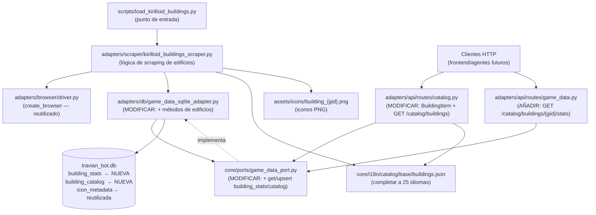

# Scraper de datos de edificios desde travian.kirilloid.ru

> **Nota sobre validación de APIs:** La feature extiende endpoints EXISTENTES
> (`GET /catalog/buildings` ya sirve nombres; `GET /catalog/icons` y
> `/static/icons/` ya existen con la feature de tropas). El endpoint nuevo
> `GET /catalog/buildings/{gid}/stats` es ANÁLOGO a
> `GET /catalog/troops/{tribe}/stats` ya validado y aprobado por
> desarrollador-apis. La gobernanza de idiomas (`resolve_language`, `Vary`,
> `?lang=`) se reutiliza sin cambios. No se crean patrones de API nuevos:
> se replica exactamente el patrón ya aprobado para tropas.
> `apis_validadas_por_desarrollador_apis: n-a` porque el gate formal de
> desarrollador-apis no puede lanzarse en este contexto; el implementador
> debe obtener la luz verde antes de entregar si el equipo lo requiere.
> **DECISION-PENDIENTE-#4** — ver sección de decisiones para validar.

---

## Decisiones tomadas por el analista (pendientes de validación del usuario)

Las siguientes decisiones se tomaron autónomamente. El usuario DEBE confirmarlas
al volver. Están marcadas a lo largo del spec con `DECISION-PENDIENTE-#N`.

| # | Decisión | Justificación | Alternativa si el usuario no está de acuerdo |
|---|---|---|---|
| 1 | `server_version = "1.45"` para edificios (no `"2.46"` de la URL del usuario) | Coherencia con tropas ya cargadas con `"1.45"`; re-scrapear es barato | Cambiar a `"2.46"` si los datos de edificios corresponden a esa versión |
| 2 | Categoría por POSICIÓN de columna (col 0 = recursos, col 1 = infraestructura, col 2 = militar), no por texto del `<h3>` | El texto del `<h3>` varía con el idioma de kirilloid; la posición es estable | Leer en idioma base `es` si el usuario prefiere nombres de categoría en español |
| 3 | Omitir las dos columnas de cap almacén (g10) y cap granero (g11) de `building_stats` | Son datos derivados/secundarios; se pueden recalcular si se necesitan; simplifica el modelo | Añadirlas como `storage_capacity` y `granary_capacity` si el usuario las necesita |
| 4 | El endpoint nuevo `GET /catalog/buildings/{gid}/stats` sigue exactamente el patrón de `GET /catalog/troops/{tribe}/stats` (ya validado). No invocar gate formal de desarrollador-apis | Patrón idéntico, contratos ya aprobados para tropas | Invocar el gate si el equipo requiere validación formal de cada endpoint nuevo |
| 5 | Merge en `buildings.json` con política KIRILLOID-SOBRESCRIBE (igual que tropas en RN-04 del spec de tropas) | Coherencia; evita datos incorrectos persistiendo indefinidamente | Merge no-destructivo si el usuario quiere proteger entradas manuales en el base |
| 6 | `effect_label` se captura como texto del `<th>` de la última columna de detalle (en idioma `es`, primera carga) | Es el nombre descriptivo del efecto específico del edificio (p.ej. "Almacena", "Velocidad") | Omitirlo si el usuario considera que no aporta valor |
| 7 | Iconos de recursos (r1..r7) ya existentes como `stat_*` de tropas NO se re-capturan | Evitar duplicar binarios idénticos; el adaptador reutiliza los existentes | Si el usuario quiere separación semántica, crear alias en `icon_metadata` |

---

## 1. Objetivo de negocio

Poblar la base de datos del bot con los **costes por nivel de todos los edificios**
de Travian T4.5 extrayéndolos de `travian.kirilloid.ru` (página `build.php`),
la misma fuente de referencia usada para tropas.

Al mismo tiempo:
- Completar el catálogo i18n `buildings.json` con los **25 idiomas** que kirilloid
  ofrece (hoy solo tiene 5: es, en, de, fr, ru).
- Persistir el **icono de cada edificio** como recurso estático.

La información resultante se servirá mediante un nuevo endpoint
`GET /catalog/buildings/{gid}/stats` y enriquecerá el `BuildingItem` existente
con el campo `levels` (tabla de costes y efectos por nivel).

**Por qué kirilloid y no Travian directamente:** kirilloid es fuente pública sin
auth que ya agregó todos los datos en tablas HTML limpias y multilenguaje.

---

## 2. Actores y permisos

| Actor | Rol |
|---|---|
| Desarrollador / mantenedor del bot | Ejecuta `scripts/load_kirilloid_buildings.py` a mano cuando quiere actualizar datos |
| FastAPI (API del bot) | Sirve stats y listados de edificios a clientes vía HTTP |
| Agentes del bot | Futura fuente de datos para decisiones de construcción |

No hay usuarios finales directos. El script no tiene autenticación; la API hereda
la gobernanza de idiomas ya implementada.

---

## 3. Alcance

### Dentro de alcance (este spec)

- Stats por nivel de cada edificio (niveles 0..20, aunque la mayoría llega a nivel 20;
  algunos edificios tienen más niveles según la tabla — iterar lo que kirilloid tenga).
- Nombres de todos los edificios en los ~25 idiomas de kirilloid.
- Icono de cada edificio (uno por gid).
- Categoría de cada edificio (recursos / infraestructura / militar).
- Descripción de cada edificio (texto de `#data_holder-desc`).
- Script CLI `scripts/load_kirilloid_buildings.py`.
- Endpoint `GET /catalog/buildings/{gid}/stats`.
- Extensión de `BuildingItem` en `catalog.py` con campo `levels`.
- Extensión de `GameDataPort` y `GameDataSQLiteAdapter` con métodos de edificios.

### Fuera de alcance

- Automatización / cron del scraper.
- Endpoint admin para disparar el scraper por HTTP.
- Soporte multi-versión activo (el modelo lo soporta pero el scraper solo carga `"1.45"`).
- Re-scraping de iconos de recursos (r1..r7) ya capturados para tropas.
- Stats de combinaciones de nivel de herrería o edificio de entreno (ya fuera de alcance
  para tropas, lo mismo aplica aquí).

---

## 4. Reglas de negocio

**RN-B-01 — Versión de servidor como dimensión:**
`server_version = "1.45"` (DECISION-PENDIENTE-#1). PK de `building_stats`:
`(server_version, gid, level)`.

**RN-B-02 — Iterar gids desde el índice (no hardcoded):**
Los gids se leen dinámicamente de los `data-gid` del `<div id="build_list">`.
No se hardcodea una lista 1..40. Si kirilloid añade un gid nuevo, se captura
automáticamente.

**RN-B-03 — Idempotencia / UPSERT:**
Re-ejecutar el script actualiza sin duplicar. `INSERT OR REPLACE` en SQLite.

**RN-B-04 — Kirilloid sobrescribe (política de merge):**
El scraper escribe los nombres scrapeados en `core/i18n/catalog/base/buildings.json`
y SOBRESCRIBE cualquier valor existente, excepto si el nombre scrapeado viene vacío
(en ese caso conserva el anterior). La misma política que tropas (RN-04 del spec de
tropas). Las correcciones manuales van a `catalog/override/buildings.json`;
el scraper nunca toca ese fichero.
(DECISION-PENDIENTE-#5)

**RN-B-05 — Valores "—" o vacío = NULL:**
Si kirilloid muestra "—" para un campo numérico, se guarda como NULL en SQLite
y None en Python. Nunca 0.

**RN-B-06 — Tiempo de construcción como segundos enteros:**
Formato `H:MM:SS` → entero de segundos. Reutiliza `parse_time` de
`core/utils/parsing.py`.

**RN-B-07 — Categoría por posición de columna:**
Columna 0 del `<div id="build_list">` = `"resources"`,
columna 1 = `"infrastructure"`,
columna 2 = `"military"`.
La posición es estable entre idiomas; el `<h3>` no lo es.
(DECISION-PENDIENTE-#2)

**RN-B-08 — Omisión de columnas cap almacén / cap granero:**
Las dos columnas de capacidad de almacén (g10) y capacidad de granero (g11)
de la tabla de detalle NO se persisten en `building_stats`.
(DECISION-PENDIENTE-#3)

**RN-B-09 — effect_value y effect_label:**
La última columna de la tabla de detalle de kirilloid contiene el efecto
específico del edificio (p.ej. "Almacena" → capacidad de almacenaje;
"Velocidad" → bono de velocidad). Se captura:
- `effect_value`: valor numérico de la celda de datos (parse_int_or_none).
- `effect_label`: texto del `<th>` de esa columna, leído en idioma `es`
  durante la primera carga del detalle (DECISION-PENDIENTE-#6).

**RN-B-10 — Fallo ruidoso con guardado parcial:**
Si el scraper no puede parsear un gid o un idioma concreto, lo registra en log
detallado y continúa. Los datos correctos se guardan.

**RN-B-11 — Iconos de edificios:**
`icon_id = "building_{gid}"`, selector `img.building.g{gid}`,
`icon_type = "building"`. Screenshot + `_remove_background` (mismo Pillow).
Los iconos de columna (r1..r7) ya existen como `stat_*` — no re-capturar.
(DECISION-PENDIENTE-#7)

**RN-B-12 — Perfil Chrome separado para el scraper:**
Reutiliza `profiles/scraper_kirilloid` (mismo que tropas — ya existe, no crear otro).

**RN-B-13 — Lección SPA kirilloid — about:blank por cada gid:**
Cambiar solo el `#hash` de la URL NO re-renderiza kirilloid. Para cada gid de
detalle: `browser.get("about:blank")` → `browser.get(url_detalle)` →
esperar `#data.wire`. Este es el patrón que funcionó en el diagnóstico de tropas
(ver corrección post-implementación del spec de tropas).

**RN-B-14 — Bucle de idiomas con click en bandera + sleep funcional:**
Para leer los nombres por idioma en la página ÍNDICE: click en
`#langbar img[alt='{lang}']` + `asyncio.sleep(0.15)` + releer los
`build_list__item`. El sleep es funcional (espera re-render del SPA),
no humano.

---

## 5. Flujo principal y flujos alternativos

### Flujo principal del script CLI

```
1. Arrancar Chrome (perfil scraper_kirilloid).
2. Cargar página ÍNDICE en idioma 'es' (base):
   URL = "http://travian.kirilloid.ru/build.php#mb=1&s=1.45"
   (DECISION-PENDIENTE-#1: server_version)
   → Aplicar lección SPA: about:blank → get(URL) → esperar #build_list.

3. Leer índice de edificios en idioma 'es':
   - Parsear los 3 <div class="build_list__column">.
   - Por cada columna (posición 0/1/2), asignar categoría (RN-B-07).
   - Por cada build_list__item en la columna:
       gid = data-gid (int)
       nombre_es = texto del div (strip)
   - Construir lista: [(gid, category, nombre_es), ...]

4. Para cada idioma en KIRILLOID_LANGUAGES (excluir 'es', ya leído):
   - Click en #langbar img[alt='{lang}'] + asyncio.sleep(0.15).
   - Re-leer los build_list__item → obtener {gid: nombre_lang}.
   - Acumular en buffer nombres_por_idioma[lang][gid] = nombre.

5. Para cada gid en la lista obtenida en paso 3:
   a. Construir URL detalle:
      URL_DETALLE = "http://travian.kirilloid.ru/build.php#b={gid}&mb=1&s=1.45"
   b. Navegar (lección SPA): about:blank → get(URL_DETALLE) → esperar #data.wire.
   c. Leer descripción: texto de #data_holder-desc (puede estar vacío → "").
   d. Leer tabla de detalle:
      - Inspeccionar cabecera: mapear posición de columna → campo.
      - Por cada fila de <tbody>: parsear nivel y valores.
   e. Capturar icono: screenshot de img.building.g{gid} + _remove_background.
   f. Persistir en SQLite (UPSERT building_stats por nivel).
   g. Persistir metadatos de icono (UPSERT icon_metadata).
   h. asyncio.sleep(0.3)  # cortesía entre gids (funcional, no humano).

6. Merge de nombres en buildings.json (política sobrescribe, RN-B-04).
7. Cerrar browser.
8. Imprimir resumen: gids procesados, idiomas cubiertos, errores.
```

### Flujo alternativo — kirilloid no carga

Si `#build_list` o `#data.wire` no aparece en timeout (30s), lanzar
`KirilloidScraperError` con detalle del gid/URL, registrar, continuar.

### Flujo alternativo — gid sin tabla de detalle

Si `#data.wire` no existe tras navegar al detalle, registrar warning y continuar
(guardar 0 filas de building_stats para ese gid — no fatal).

### Flujo alternativo — icono ya existe en disco

Sobreescribir el PNG (idempotencia). El UPSERT de `icon_metadata` actualiza el
tamaño.

### Flujo alternativo — gid no tiene columna "efecto" (última col)

Si la tabla de detalle tiene menos columnas de las esperadas, `effect_value` y
`effect_label` → NULL/"". No es error.

---

## 6. Edge cases

| ID | Caso | Tratamiento |
|---|---|---|
| EC-B-01 | Valor "—" en celda de dato | NULL en SQLite, None en Python |
| EC-B-02 | Tiempo "0:00:00" | 0 segundos — válido |
| EC-B-03 | Edificio sin tabla de detalle (gid existe en índice pero `#data.wire` no carga) | Warning, 0 filas de stats para ese gid, continuar |
| EC-B-04 | Idioma no encontrado en #langbar | Warning, continuar con el siguiente idioma |
| EC-B-05 | Nombre vacío en un idioma | No sobreescribir — conservar el anterior (RN-B-04) |
| EC-B-06 | Re-ejecución con datos ya cargados | UPSERT en SQLite, sobrescritura controlada en JSON |
| EC-B-07 | Tabla de detalle sin fila de datos (edificio a nivel 0 sin costes) | 0 filas en building_stats — no error |
| EC-B-08 | Columna de cabecera desconocida (kirilloid añadió columna nueva) | Warning, ignorar esa columna, continuar con las mapeadas |
| EC-B-09 | Screenshot de icono con tamaño 0x0 | Intentar screenshot de div contenedor; si falla, no guardar icono (error no fatal) |
| EC-B-10 | Flood-fill elimina parte del icono | Tolerancia configurable (BG_FILL_TOLERANCE=30); si las 4 esquinas son distintas, no aplicar flood-fill |
| EC-B-11 | Gid aparece en índice pero la URL de detalle devuelve página vacía | KirilloidScraperError no fatal, registrar, continuar |
| EC-B-12 | Número de niveles variable por edificio | Iterar todas las filas del `<tbody>` — no asumir máximo fijo de 20 |
| EC-B-13 | `effect_label` vacío (última columna sin cabecera con texto) | Guardar "" o NULL — no es error |
| EC-B-14 | `buildings.json` tiene claves string ("1") vs int — conservar string | La estructura existente usa claves string (`"1"`, `"10"`, etc.) — mantener |
| EC-B-15 | Gid duplicado en el índice (kirilloid lo lista dos veces) | Sobrescribir con el último (UPSERT lo maneja) |

---

## 7. Modelo de datos / cambios de esquema

### 7.1 Tabla nueva `building_stats`

PK: `(server_version, gid, level)`.

```sql
CREATE TABLE IF NOT EXISTS building_stats (
    server_version   TEXT    NOT NULL,   -- "1.45" (DECISION-PENDIENTE-#1)
    gid              INTEGER NOT NULL,   -- ID de edificio (1..N, según índice kirilloid)
    level            INTEGER NOT NULL,   -- nivel del edificio (0, 1, 2, ..., N)
    cost_wood        INTEGER,            -- NULL si "—"
    cost_clay        INTEGER,
    cost_iron        INTEGER,
    cost_crop        INTEGER,
    cost_sum         INTEGER,
    upkeep           INTEGER,            -- consumo de cereal (r5)
    culture_points   INTEGER,            -- puntos de cultura (PC)
    build_time_s     INTEGER,            -- tiempo de construcción en segundos
    effect_value     INTEGER,            -- valor del efecto específico (última col), NULL si no aplica
    effect_label     TEXT,               -- nombre del efecto (p.ej. "Almacena"), "" si no aplica
    scraped_at       TEXT    NOT NULL,   -- ISO-8601 UTC
    PRIMARY KEY (server_version, gid, level)
);
```

**Columnas omitidas intencionalmente** (DECISION-PENDIENTE-#3):
- Capacidad de almacén (`building g10`): derivable consultando `building_stats`
  del Almacén (gid=10).
- Capacidad de granero (`building g11`): ídem para el Granero (gid=11).

### 7.2 Tabla nueva `building_catalog`

Almacena metadatos por edificio (independientes del nivel): categoría, descripción
y nombre alias. No en `buildings.json` porque el JSON solo tiene nombres por idioma.

```sql
CREATE TABLE IF NOT EXISTS building_catalog (
    server_version   TEXT    NOT NULL,
    gid              INTEGER NOT NULL,
    alias            TEXT    NOT NULL,   -- clave canónica en inglés (p.ej. "woodcutter")
    category         TEXT    NOT NULL,   -- "resources" | "infrastructure" | "military"
    description      TEXT    NOT NULL DEFAULT "",  -- texto de #data_holder-desc en 'es'
    icon_id          TEXT,               -- FK lógica a icon_metadata.icon_id
    scraped_at       TEXT    NOT NULL,
    PRIMARY KEY (server_version, gid)
);
```

**Por qué tabla separada y no campos en `building_stats`:**
La categoría y descripción son propiedades del edificio, no del nivel. Ponerlas
en `building_stats` las repetiría en cada fila de nivel (N duplicaciones por
edificio), violando 1NF. La tabla `building_catalog` es la normalización correcta.

### 7.3 `buildings.json` — completar a 25 idiomas

Fichero: `core/i18n/catalog/base/buildings.json`

Estructura existente (clave = `str(gid)`):
```json
{
  "1": {"alias": "woodcutter", "es": "Leñador", "en": "Woodcutter",
        "de": "Holzfäller", "fr": "Bûcheron", "ru": "Лесопилка"},
  ...
}
```

El scraper añade los 20 idiomas faltantes a cada entrada existente y crea
entradas nuevas si kirilloid tiene gids que el JSON no tiene.
Política: kirilloid sobrescribe (incluyendo los 5 idiomas ya presentes).
Claves string (no int) — mantener la estructura existente.

### 7.4 `icon_metadata` — reutilizar tabla existente

La tabla ya existe (creada por el scraper de tropas). Se añaden registros con
`icon_type = "building"`. No hay cambio de esquema.

### 7.5 `BuildingItem` (DTO existente) — extensión con `levels`

Fichero: `adapters/api/routes/catalog.py`

`BuildingItem` tiene ya un campo reservado comentado `# levels`. Se activa:

```python
class BuildingLevel(BaseModel):
    """Un nivel de edificio con sus costes y efectos."""
    level: int
    cost_wood: int | None
    cost_clay: int | None
    cost_iron: int | None
    cost_crop: int | None
    cost_sum: int | None
    upkeep: int | None
    culture_points: int | None
    build_time_s: int | None
    effect_value: int | None
    effect_label: str | None

class BuildingItem(BaseModel):
    gid: int
    alias: str
    category: str | None        # "resources" | "infrastructure" | "military" | None
    description: str | None     # texto descriptivo del edificio
    language: dict[str, str]    # {lang_servido: nombre}
    icon_url: str | None        # "/static/icons/building_{gid}.png" o None
    levels: list[BuildingLevel] | None  # None si no hay datos de stats cargados
```

**NOTA CRÍTICA:** La extensión de `BuildingItem` es RETROCOMPATIBLE porque el DTO
existente está declarado sin `extra="forbid"` (ver catalog.py línea 31: `Abierto
(sin extra="forbid") para recibir futuros campos`). Los campos nuevos se añaden
con valor default `None`; los clientes que no los lean no se rompen.

El endpoint `GET /catalog/buildings` EXISTENTE también se actualiza para incluir
estos campos cuando estén disponibles (si no hay datos en BD, `levels=None`,
`category=None`, `description=None`, `icon_url=None`).

### 7.6 `GameDataPort` — extensión (MODIFICAR, no crear)

Añadir al puerto existente `core/ports/game_data_port.py` los siguientes métodos
abstractos (cambio retrocompatible — solo se añaden métodos, no se modifican los
existentes):

```python
@abstractmethod
async def get_building_stats(
    self,
    gid: int,
    server_version: str = "1.45",
) -> list[dict]:
    """
    Devuelve la lista de niveles de un edificio ordenados por level.
    Cada dict: {level, cost_wood, cost_clay, cost_iron, cost_crop, cost_sum,
                upkeep, culture_points, build_time_s, effect_value, effect_label}.
    Lista vacía si no hay datos para ese gid/server_version.
    """

@abstractmethod
async def get_all_building_stats(
    self,
    server_version: str = "1.45",
) -> dict[int, list[dict]]:
    """
    Devuelve un dict {gid: [filas de building_stats ordenadas por level]}.
    Útil para poblar el catálogo completo sin N queries individuales.
    """

@abstractmethod
async def upsert_building_stats(self, stats: dict) -> None:
    """
    Inserta o actualiza una fila de building_stats.
    stats debe incluir: server_version, gid, level y los campos de coste/efecto.
    scraped_at lo rellena el adaptador.
    """

@abstractmethod
async def upsert_building_catalog(self, catalog: dict) -> None:
    """
    Inserta o actualiza un registro de building_catalog.
    catalog debe incluir: server_version, gid, alias, category, description, icon_id.
    """

@abstractmethod
async def get_building_catalog(
    self,
    gid: int,
    server_version: str = "1.45",
) -> dict | None:
    """
    Devuelve los metadatos de un edificio (categoría, descripción, icon_id),
    o None si no existe.
    """
```

### 7.7 `GameDataSQLiteAdapter` — extensión (MODIFICAR)

Fichero: `adapters/db/game_data_sqlite_adapter.py`

Añadir:
- `_CREATE_BUILDING_STATS` y `_CREATE_BUILDING_CATALOG` como constantes SQL.
- Llamada a `CREATE TABLE IF NOT EXISTS` para ambas tablas dentro de
  `_create_tables_if_not_exist()` (ya existe; solo añadir las dos líneas).
- Implementación de los 5 métodos nuevos del puerto.
- Helpers `_row_to_building_stats_dict` y `_row_to_building_catalog_dict`.

---

## 8. Contratos de API / interfaces

> Gobernanza reutilizada sin cambios: `resolve_language`, `get_language`,
> `Vary: Accept-Language`, `?lang=`, `SUPPORTED_LANGUAGES` (25 idiomas),
> `Cache-Control: public, max-age=3600` (hereda por ser bajo `/catalog/`).

### 8.1 Endpoint nuevo — Stats de un edificio por gid

**Decisión de reutilización:** CREAR. Ningún endpoint existente sirve stats de
edificios. El patrón es análogo a `GET /catalog/troops/{tribe}/stats`.

```
GET /catalog/buildings/{gid}/stats
```

**Path param:** `gid` — entero positivo. FastAPI valida automáticamente; devuelve
422 si no es int.

**Query param opcional:** `server_version` (string, default `"1.45"`).

**Query param opcional:** `?lang=<código>` — override explícito de idioma.

**Header:** `Accept-Language` — opcional (misma política que `/catalog/troops/{tribe}`):
- `?lang=` presente y válido → devuelve ese idioma.
- `Accept-Language` presente y válido → devuelve ese idioma.
- Ninguno → devuelve todos los idiomas (~25 claves en `language`).
- Cualquiera presente pero inválido → 400.

**Respuesta 200 — `BuildingStatsCatalogResponse`:**

```json
{
  "gid": 10,
  "server_version": "1.45",
  "alias": "warehouse",
  "category": "infrastructure",
  "description": "Amplía la capacidad de almacenamiento de recursos.",
  "language": {"es": "Almacén"},
  "icon_url": "/static/icons/building_10.png",
  "levels": [
    {
      "level": 1,
      "cost_wood": 130,
      "cost_clay": 160,
      "cost_iron": 90,
      "cost_crop": 40,
      "cost_sum": 420,
      "upkeep": 1,
      "culture_points": 1,
      "build_time_s": 1000,
      "effect_value": 1200,
      "effect_label": "Almacena"
    }
  ]
}
```

Campos `null` cuando el valor es NULL en BD.
`icon_url` es `null` si no hay icono cargado.

**Errores:**

| Código | Condición |
|---|---|
| 400 | `?lang=` o `Accept-Language` presentes con idioma no soportado |
| 422 | `gid` no es entero |
| 404 | El gid no tiene datos de stats en BD (BD vacía para ese gid/server_version) |

**Cabeceras de respuesta:**
- `Vary: Accept-Language`
- `Cache-Control: public, max-age=3600` (hereda del middleware de catálogo)
- `X-Request-ID`, `X-API-Version`, `X-Content-Type-Options`, `X-Frame-Options`
  (del middleware global de seguridad)

### 8.2 Endpoint existente `GET /catalog/buildings` — actualizado

El endpoint existente se actualiza para incluir los campos nuevos de `BuildingItem`
cuando estén disponibles (`levels`, `category`, `description`, `icon_url`).

Si no hay datos de stats en BD, estos campos son `null` — el endpoint NO falla;
devuelve el catálogo de nombres con los campos de stats vacíos. Esto garantiza
retrocompatibilidad: los clientes que solo usan `gid` + `language` no se ven
afectados.

El handler actualizado inyecta AMBOS puertos:
- `translation_port` — nombres localizados (existente).
- `game_data_port` — metadatos de edificio y niveles (nuevo).

Para evitar N+1 queries (una por edificio), usar `get_all_building_stats()` que
devuelve todos los gids en una sola query.

### 8.3 Endpoints existentes sin cambio

- `GET /catalog/icons?icon_type=building` — ya funciona con la tabla `icon_metadata`
  existente; simplemente habrá nuevas filas con `icon_type="building"` tras ejecutar
  el scraper.
- `GET /static/icons/building_{gid}.png` — ya funciona con el mount `StaticFiles`
  existente.

---

## 9. Flujo lógico paso a paso

### 9.1 Script CLI — `scripts/load_kirilloid_buildings.py`

```
Constantes:
  KIRILLOID_BUILD_URL = "http://travian.kirilloid.ru/build.php"
  SERVER_VERSION = "1.45"       # DECISION-PENDIENTE-#1
  PROFILE_DIR = "profiles/scraper_kirilloid"
  ICONS_DIR = Path("assets/icons")
  BG_FILL_TOLERANCE = 30

  CATEGORY_BY_COLUMN_INDEX = {
    0: "resources",
    1: "infrastructure",
    2: "military",
  }

  # Mismo KIRILLOID_LANGUAGES que en kirilloid_scraper.py (25 idiomas)
  KIRILLOID_LANGUAGES = [
    "ar","bg","cs","da","de","el","en","es","fa","fr",
    "he","hu","it","ja","lt","lv","nl","pl","pt","rs",
    "ru","sl","sv","tr","uk"
  ]

FUNCIÓN main():
  ICONS_DIR.mkdir(parents=True, exist_ok=True)
  browser = await create_browser(PROFILE_DIR)
  conn = await get_connection()
  await _create_building_tables_if_not_exist(conn)

  errors = []

  # --- Paso 2: cargar índice en idioma base 'es' ---
  index_url = f"{KIRILLOID_BUILD_URL}#mb=1&s={SERVER_VERSION}"
  await browser.get("about:blank")
  await browser.get(index_url)
  await _wait_for_element(browser, "#build_list", timeout=30)

  # --- Paso 3: parsear índice en idioma 'es' ---
  gids_by_category = {}
  TRY:
    gids_by_category = await _parse_building_index(browser)
  EXCEPT Exception as e:
    IMPRIMIR f"ERROR FATAL: no se pudo parsear el índice: {e}"
    await browser.stop()
    RETURN

  # gids_by_category: [(gid, category, nombre_es), ...]

  # --- Paso 4: leer nombres por los demás idiomas ---
  nombres_por_idioma = {"es": {gid: n for gid, _, n in gids_by_category}}

  PARA lang EN KIRILLOID_LANGUAGES:
    SI lang == "es": CONTINUAR
    TRY:
      flag = await browser.query_selector(f"#langbar img[alt='{lang}']")
      SI flag es None:
        errors.append(f"names/index/{lang}: bandera no encontrada")
        CONTINUAR
      await flag.click()
      await asyncio.sleep(0.15)
      nombres_lang = await _parse_building_names_from_index(browser)
      nombres_por_idioma[lang] = nombres_lang
    EXCEPT Exception as e:
      errors.append(f"names/index/{lang}: {e}")

  # --- Paso 5: por cada gid, cargar detalle y persistir ---
  all_gids = [gid for gid, _, _ in gids_by_category]

  PARA (gid, category, nombre_es) EN gids_by_category:
    detail_url = f"{KIRILLOID_BUILD_URL}#b={gid}&mb=1&s={SERVER_VERSION}"
    TRY:
      await browser.get("about:blank")
      await browser.get(detail_url)
      await _wait_for_element(browser, "#data.wire", timeout=30)
    EXCEPT Exception as e:
      errors.append(f"detail/gid={gid}: no cargó: {e}")
      CONTINUAR

    # Leer descripción
    description = ""
    TRY:
      desc_el = await browser.query_selector("#data_holder-desc")
      SI desc_el:
        description = (await desc_el.text).strip()
    EXCEPT Exception as e:
      errors.append(f"description/gid={gid}: {e}")

    # Leer alias desde buildings.json (el alias ya existe en el JSON)
    alias = _get_alias_from_json(gid)  # lee buildings.json, devuelve "" si no existe

    # Parsear tabla de detalle
    levels_data = []
    effect_label = ""
    TRY:
      levels_data, effect_label = await _parse_building_detail(browser)
    EXCEPT Exception as e:
      errors.append(f"detail_parse/gid={gid}: {e}")

    # Capturar icono
    icon_id = f"building_{gid}"
    TRY:
      await _capture_building_icon(browser, gid, icon_id, conn)
    EXCEPT Exception as e:
      errors.append(f"icon/gid={gid}: {e}")
      icon_id_stored = None
    SINO:
      icon_id_stored = icon_id

    # Persistir building_catalog
    await conn.execute(
      "INSERT OR REPLACE INTO building_catalog VALUES (?,?,?,?,?,?,?)",
      (SERVER_VERSION, gid, alias or f"building_{gid}", category,
       description, icon_id_stored,
       datetime.now(timezone.utc).isoformat())
    )

    # Persistir building_stats (un UPSERT por nivel)
    PARA level_row EN levels_data:
      await conn.execute(
        """INSERT OR REPLACE INTO building_stats
           VALUES (?,?,?,?,?,?,?,?,?,?,?,?,?)""",
        (SERVER_VERSION, gid, level_row["level"],
         level_row.get("cost_wood"), level_row.get("cost_clay"),
         level_row.get("cost_iron"), level_row.get("cost_crop"),
         level_row.get("cost_sum"), level_row.get("upkeep"),
         level_row.get("culture_points"), level_row.get("build_time_s"),
         level_row.get("effect_value"),
         effect_label if level_row.get("effect_value") is not None else "",
         datetime.now(timezone.utc).isoformat())
      )
    await conn.commit()
    await asyncio.sleep(0.3)   # cortesía entre gids

  # --- Paso 6: merge en buildings.json ---
  TRY:
    _merge_building_names(nombres_por_idioma)
  EXCEPT Exception as e:
    errors.append(f"merge/json: {e}")

  await browser.stop()
  await conn.close()

  SI errors:
    IMPRIMIR f"SCRAPING COMPLETADO CON {len(errors)} ERRORES:"
    PARA e EN errors: IMPRIMIR f"  - {e}"
  SINO:
    IMPRIMIR "SCRAPING COMPLETADO SIN ERRORES."
```

### 9.2 Parseo del índice `_parse_building_index`

```
FUNCIÓN _parse_building_index(browser) -> list[(gid, category, nombre_es)]:
  """
  Lee el <div id="build_list"> y extrae los gids, categorías y nombres en el
  idioma actualmente activo en el navegador.

  Selector de columnas: div#build_list > div.build_list__column
  (3 divs en total — posición 0/1/2 → category según CATEGORY_BY_COLUMN_INDEX)

  Selector de items: div.build_list__item[data-gid]
  Nombre: texto del div (strip, limpiar espacios)
  GID: int(item.attrs["data-gid"])
  """
  result = []
  columns = await browser.query_selector_all(
    "#build_list > div.build_list__column"
  )
  PARA col_idx, column EN enumerate(columns):
    category = CATEGORY_BY_COLUMN_INDEX.get(col_idx, "unknown")
    items = await column.query_selector_all("div.build_list__item[data-gid]")
    PARA item EN items:
      gid_str = item.attrs.get("data-gid", "")
      SI NO gid_str.isdigit(): CONTINUAR
      gid = int(gid_str)
      name = (await item.text).strip()
      result.append((gid, category, name))
  RETURN result
```

### 9.3 Parseo de nombres del índice `_parse_building_names_from_index`

```
FUNCIÓN _parse_building_names_from_index(browser) -> dict[int, str]:
  """
  Relectura del índice solo para obtener nombres (tras cambio de idioma).
  Devuelve {gid: nombre} sin categoría (ya se leyó en la primera pasada).
  """
  result = {}
  items = await browser.query_selector_all(
    "#build_list div.build_list__item[data-gid]"
  )
  PARA item EN items:
    gid_str = item.attrs.get("data-gid", "")
    SI NO gid_str.isdigit(): CONTINUAR
    gid = int(gid_str)
    name = (await item.text).strip()
    result[gid] = name
  RETURN result
```

### 9.4 Parseo del detalle `_parse_building_detail`

```
FUNCIÓN _parse_building_detail(browser) -> (list[dict], str):
  """
  Lee la tabla #data.wire del detalle de un edificio.

  Devuelve:
    - Lista de dicts por nivel con keys: level, cost_wood, cost_clay, cost_iron,
      cost_crop, cost_sum, upkeep, culture_points, build_time_s,
      effect_value (int|None).
    - effect_label: str (texto del <th> de la última columna, o "" si no aplica).

  MAPEO DE COLUMNAS POR POSICIÓN:
  La fila <thead><tr class="rbg"> tiene estas celdas (pueden variar si kirilloid
  añade columnas). Se mapean por el  dentro del <th>:

  | img class         | campo            |
  |---|---|
  | res r1            | cost_wood        |
  | res r2            | cost_clay        |
  | res r3            | cost_iron        |
  | res r4            | cost_crop        |
  | res r6            | cost_sum         |
  | res r5            | upkeep           |
  | building g10      | → OMITIR (cap almacén, DECISION-PENDIENTE-#3) |
  | building g11      | → OMITIR (cap granero, DECISION-PENDIENTE-#3) |
  | sin img / texto   | culture_points   | (la celda de PC suele no tener img)
  | res r7            | build_time_s     |
  | última col        | effect_value     | (puede ser texto, no img — ver nota)

  Primera columna (niv) → level (int).

  ESTRATEGIA DE MAPEO (robusta ante reordenamientos):
  1. Leer todos los <th> de la fila de cabecera en orden.
  2. Para cada <th>: buscar  dentro.
     Si hay : obtener su clase CSS → mapear según BUILDING_HEADER_MAP.
     Si no hay : obtener texto del <th> → si es "PC" o similar → culture_points;
       si es texto descriptivo (no vacío y no uno de los anteriores) → es effect_label.
  3. Guardar la posición de columna (índice 0-based en la fila) de cada campo.
  4. Leer filas del <tbody>: por cada <tr>, tomar los <td> en orden y asignar valores
     según el índice de columna mapeado en el paso anterior.

  BUILDING_HEADER_MAP = {
    "res r1":        "cost_wood",
    "res r2":        "cost_clay",
    "res r3":        "cost_iron",
    "res r4":        "cost_crop",
    "res r6":        "cost_sum",
    "res r5":        "upkeep",
    "res r7":        "build_time_s",
    # "building g10" y "building g11" → OMITIR (marcadas al detectarlas)
  }

  NOTA sobre la columna "PC" (puntos de cultura):
  En kirilloid el encabezado de PC suele ser texto "PC" sin imagen. El implementador
  debe verificar el HTML real. Si es un <th> con texto sin , identificarlo por
  su posición relativa: viene después de upkeep y antes de build_time_s.
  Si kirilloid usa una imagen para PC, actualizar BUILDING_HEADER_MAP con su clase.

  NOTA sobre la última columna (effect):
  El <th> de la última columna tiene texto descriptivo que varía por edificio
  (p.ej. "Almacena", "Velocidad", "Capacidad", etc.). Es el effect_label.
  Si el <th> está vacío o no existe, effect_label = "".
  """
  result = []
  effect_label = ""

  # --- Leer cabecera y construir mapa posición → campo ---
  header_row = await browser.query_selector("#data.wire thead tr.rbg")
  SI header_row es None:
    RETURN [], ""

  ths = await header_row.query_selector_all("th")
  col_map = {}  # {posición_int: campo_str}
  effect_col_idx = None

  PARA idx, th EN enumerate(ths):
    SI idx == 0:
      col_map[idx] = "level"  # primera columna siempre es el nivel
      CONTINUAR

    img = await th.query_selector("img")
    SI img:
      img_classes_str = (img.attrs.get("class") or "").strip()
      # Comprobar si es una de las omitidas
      SI "building g10" EN img_classes_str O "building g11" EN img_classes_str:
        col_map[idx] = "__OMIT__"
      ELIF img_classes_str EN BUILDING_HEADER_MAP:
        col_map[idx] = BUILDING_HEADER_MAP[img_classes_str]
      SINO:
        col_map[idx] = "__UNKNOWN__"  # columna nueva no mapeada
    SINO:
      # Sin imagen: leer texto
      th_text = (await th.text).strip()
      SI th_text.upper() EN ("PC", "CP", "KULTUR"):
        col_map[idx] = "culture_points"
      ELIF th_text != "" Y idx == len(ths) - 1:
        # Última columna con texto → es el efecto del edificio
        col_map[idx] = "effect_value"
        effect_label = th_text
        effect_col_idx = idx
      SINO:
        col_map[idx] = "__UNKNOWN__"

  # --- Leer filas de datos ---
  tbody_rows = await browser.query_selector_all("#data.wire tbody tr")
  PARA tr EN tbody_rows:
    tds = await tr.query_selector_all("td")
    SI len(tds) == 0: CONTINUAR

    row_data = {}
    PARA idx, td EN enumerate(tds):
      campo = col_map.get(idx, "__UNKNOWN__")
      SI campo EN ("__OMIT__", "__UNKNOWN__"): CONTINUAR

      cell_text = (await td.text).strip()

      SI campo == "level":
        SI NO cell_text.isdigit(): CONTINUAR  # fila no es de datos
        row_data["level"] = int(cell_text)
      ELIF campo == "build_time_s":
        row_data["build_time_s"] = parse_int_or_none(cell_text)
        SI row_data["build_time_s"] es None Y cell_text != "—":
          # puede ser formato H:MM:SS
          TRY: row_data["build_time_s"] = parse_time(cell_text)
          EXCEPT: row_data["build_time_s"] = None
      SINO:
        row_data[campo] = parse_int_or_none(cell_text)

    SI "level" EN row_data:
      result.append(row_data)

  RETURN result, effect_label
```

### 9.5 Captura de icono de edificio `_capture_building_icon`

```
FUNCIÓN _capture_building_icon(browser, gid, icon_id, conn):
  """
  Captura el icono del edificio desde la página de detalle (#data.wire).
  El selector es estructural: img.building.g{gid}
  Misma lógica que _capture_troop_icon en kirilloid_scraper.py.
  """
  out_path = ICONS_DIR / f"{icon_id}.png"
  # Idempotencia: si ya existe el PNG, sobrescribir (UPSERT lo manejará)

  element = await browser.query_selector(f"img.building.g{gid}")
  SI element es None:
    # Fallback: buscar en la cabecera del índice si aún estamos en esa página
    RAISE Exception(f"img.building.g{gid} no encontrado en la página")

  png_bytes = await element.screenshot_b64()  # devuelve base64; decodificar a bytes
  img = Image.open(BytesIO(base64.b64decode(png_bytes))).convert("RGBA")
  img = _remove_background(img, tolerance=BG_FILL_TOLERANCE)

  img.save(str(out_path), "PNG")
  w, h = img.size
  size = out_path.stat().st_size

  await conn.execute(
    "INSERT OR REPLACE INTO icon_metadata VALUES (?,?,?,?,?,?,?,?,?,?)",
    (icon_id, "building", None, gid, None,
     f"assets/icons/{icon_id}.png", size, w, h,
     datetime.now(timezone.utc).isoformat())
  )
  await conn.commit()
```

**Nota importante sobre `screenshot_b64`:**
Zendriver expone `screenshot_b64` que devuelve la imagen en base64.
El spec de tropas usa `save_screenshot()` que devuelve bytes directos.
El implementador debe verificar qué método está disponible en la versión de
zendriver instalada y usar el correcto (ambos se han documentado en memoria como
patrones válidos).

### 9.6 Merge en `buildings.json` — `_merge_building_names`

```
FUNCIÓN _merge_building_names(nombres_por_idioma: dict[str, dict[int, str]]):
  """
  nombres_por_idioma: {lang_code: {gid: nombre}}

  Política: kirilloid sobrescribe (RN-B-04 / DECISION-PENDIENTE-#5).
  - Para cada gid y cada idioma: si el nombre nuevo es no-vacío, sobrescribir.
  - Si el nombre nuevo es vacío, conservar el existente.
  - El campo "alias" del JSON NO se toca (es fijo y viene del JSON original).
  - Si el gid no existe en el JSON, crear la entrada con los campos disponibles.
  """
  catalog_path = Path("core/i18n/catalog/base/buildings.json")
  con open(catalog_path, "r", encoding="utf-8") as f:
    catalog = json.load(f)

  PARA lang_code, gid_to_name EN nombres_por_idioma.items():
    PARA gid, nombre EN gid_to_name.items():
      key = str(gid)  # clave string (EC-B-14)
      SI key NO está en catalog:
        catalog[key] = {"alias": f"building_{gid}"}
      SI nombre != "" Y nombre NO es None:
        catalog[key][lang_code] = nombre
      # Si nombre vacío → conservar existente (no sobrescribir)

  # Validar JSON antes de escribir
  json_str = json.dumps(catalog, ensure_ascii=False, indent=2)
  json.loads(json_str)  # valida — lanza si inválido

  # Escritura atómica (tmp + rename)
  tmp_path = catalog_path.with_suffix(".tmp")
  con open(tmp_path, "w", encoding="utf-8") as f:
    f.write(json_str)
  tmp_path.replace(catalog_path)
```

### 9.7 Endpoint nuevo — `get_building_stats`

El handler se añade a `adapters/api/routes/catalog.py` (o a `game_data.py` si
el implementador prefiere coherencia con el endpoint de tropas — ambas ubicaciones
son correctas; se recomienda `game_data.py` por coherencia de responsabilidades:
stats numéricos van en `game_data.py`).

```python
@router.get(
    "/catalog/buildings/{gid}/stats",
    response_model=BuildingStatsCatalogResponse,
    summary="Stats de niveles de un edificio",
)
async def get_building_stats(
    gid: int,
    response: Response,
    server_version: str = Query(default="1.45"),
    lang: str | None = Depends(resolve_language),
    game_data_port: GameDataPort = Depends(get_game_data_port),
    translation_port: TranslationPort = Depends(get_translation_port),
) -> BuildingStatsCatalogResponse:
    response.headers["Vary"] = "Accept-Language"

    levels = await game_data_port.get_building_stats(gid, server_version)
    catalog_meta = await game_data_port.get_building_catalog(gid, server_version)

    if not levels and catalog_meta is None:
        raise HTTPException(
            status_code=404,
            detail=(
                f"No hay datos de stats para el edificio gid={gid} "
                f"con server_version='{server_version}'"
            ),
        )

    # Nombre localizado
    if lang is None:
        language = translation_port.get_building_all_langs(gid)
    else:
        language = translation_port.get_building_name(gid, lang)
        language = {lang: language}

    icon_id = catalog_meta.get("icon_id") if catalog_meta else None
    icon_url = f"/static/icons/{icon_id}.png" if icon_id else None

    return BuildingStatsCatalogResponse(
        gid=gid,
        server_version=server_version,
        alias=catalog_meta.get("alias", "") if catalog_meta else "",
        category=catalog_meta.get("category") if catalog_meta else None,
        description=catalog_meta.get("description") if catalog_meta else None,
        language=language,
        icon_url=icon_url,
        levels=[BuildingLevel(**row) for row in levels],
    )
```

**DTOs necesarios** (añadir a `catalog.py` o `game_data.py`):

```python
class BuildingLevel(BaseModel):
    level: int
    cost_wood: int | None = None
    cost_clay: int | None = None
    cost_iron: int | None = None
    cost_crop: int | None = None
    cost_sum: int | None = None
    upkeep: int | None = None
    culture_points: int | None = None
    build_time_s: int | None = None
    effect_value: int | None = None
    effect_label: str | None = None

class BuildingStatsCatalogResponse(BaseModel):
    model_config = ConfigDict(extra="forbid")
    gid: int
    server_version: str
    alias: str
    category: str | None
    description: str | None
    language: dict[str, str]
    icon_url: str | None
    levels: list[BuildingLevel]
```

### 9.8 Actualización del endpoint `GET /catalog/buildings`

El handler existente en `catalog.py` se actualiza para incluir los campos nuevos.
Para evitar N+1 queries, añadir un método `get_all_building_catalog()` al puerto:

```
# En el handler get_buildings_catalog:
all_stats = await game_data_port.get_all_building_stats(server_version)  # dict gid → [levels]
all_catalog = await game_data_port.get_all_building_catalog(server_version)  # dict gid → meta

# Por cada edificio del JSON:
BuildingItem(
  gid=...,
  alias=...,
  category=all_catalog.get(gid, {}).get("category"),
  description=all_catalog.get(gid, {}).get("description"),
  language=...,
  icon_url=f"/static/icons/building_{gid}.png" if all_catalog.get(gid, {}).get("icon_id") else None,
  levels=[BuildingLevel(**r) for r in all_stats.get(gid, [])] or None,
)
```

Si `game_data_port` no está disponible (BD vacía o error), todos los campos
opcionales son `None` — el endpoint no falla.

### 9.9 Diagrama de componentes



---

## 10. Validaciones y reglas

### En el scraper (adaptador)

| Validación | Comportamiento si falla |
|---|---|
| `#build_list` no aparece en 30s | `KirilloidScraperError` fatal (abortar — sin índice no hay gids) |
| `#data.wire` no aparece en 30s para un gid | Warning, 0 niveles para ese gid, continuar |
| `data-gid` no es entero | Ignorar ese item del índice, warning |
| Celda de dato con valor no numérico y no "—" | `parse_int_or_none` devuelve None → guarda NULL |
| Tiempo en formato inesperado | `None` → NULL en BD |
| Bandera de idioma no encontrada en #langbar | Warning, continuar con el siguiente idioma |
| PNG de icono con tamaño 0x0 | Intentar div contenedor; si falla, no guardar icono (error no fatal) |
| `buildings.json` inválido antes de merge | Registrar error, no sobrescribir |

### En la API (FastAPI)

| Validación | Código HTTP |
|---|---|
| `Accept-Language` o `?lang=` con idioma no soportado | 400 |
| `gid` no entero en path | 422 (FastAPI automático) |
| Gid sin datos en BD | 404 con detail legible incluyendo server_version |
| `server_version` invalida | No hay enum; cualquier string se acepta; si no hay datos → 404 |

### En el merge de buildings.json

- Solo modificar `core/i18n/catalog/base/buildings.json`, nunca `override/`.
- Validar JSON con `json.loads` antes de escribir.
- Escritura atómica con tmp+rename.

---

## 11. Seguridad, rendimiento y concurrencia

### Seguridad

**Anti-detección en kirilloid:**
kirilloid no es Travian; los delays son funcionales (no humanos). Entre gids
`asyncio.sleep(0.3)` para no sobrecargar un servidor comunitario. Perfil
`profiles/scraper_kirilloid` reutilizado (ya aislado del perfil del bot).
No se exponen datos sensibles: los stats son datos públicos del juego.

**Validación de entrada en endpoint:**
FastAPI valida `gid` como int (422 automático). La gobernanza de idiomas ya
maneja 400 para idiomas inválidos. Path traversal imposible — `gid` es int,
no string con ruta.

### Rendimiento

**Script CLI:** ~40 edificios × ~25 idiomas × 1 navegación por idioma en el índice
+ ~40 navegaciones de detalle. Duración estimada: 5-10 minutos. No hay requerimiento
de tiempo; se ejecuta offline.

**API:** Lecturas simples por PK desde SQLite WAL. `get_all_building_stats()` usa
una sola query para todo el catálogo (no N+1). `Cache-Control: public, max-age=3600`
cubre los endpoints.

### Concurrencia

Script CLI: un solo hilo asyncio, escrituras secuenciales. `INSERT OR REPLACE` en
WAL mode es seguro. Los endpoints son read-only una vez poblada la BD.

---

## 12. Plan de pruebas

### 12.1 Tests unitarios del scraper

| Test | Descripción |
|---|---|
| `test_parse_building_index_three_categories` | El parser extrae gids de las 3 columnas y asigna categorías correctas por posición |
| `test_parse_building_index_category_by_position` | Columna 0 → "resources", 1 → "infrastructure", 2 → "military" (independiente del texto del h3) |
| `test_parse_building_names_from_index` | Releer el índice devuelve {gid: nombre} correcto |
| `test_parse_building_detail_maps_columns_by_header` | Las columnas se mapean por clase del img de cabecera, no por posición fija |
| `test_parse_building_detail_omits_g10_g11` | Columnas con `building g10` y `building g11` se omiten (no están en el resultado) |
| `test_parse_building_detail_effect_label` | Última columna con texto → capturado en effect_label |
| `test_parse_building_detail_dash_returns_null` | "—" en cualquier celda → None en el dict |
| `test_parse_building_detail_time_format` | "0:16:40" → 1000 segundos (usando parse_time reutilizado) |
| `test_parse_building_detail_empty_table` | Tabla sin filas de datos → lista vacía, no excepción |
| `test_merge_building_names_overwrites_existing` | Valor existente + nombre nuevo no-vacío → sobreescribir (política sobrescribe) |
| `test_merge_building_names_keeps_existing_if_new_empty` | Valor existente + nombre nuevo vacío → conservar existente |
| `test_merge_building_names_creates_new_gid` | Gid no existe en JSON → crear entrada |
| `test_merge_building_names_preserves_alias` | El campo "alias" del JSON nunca se modifica |
| `test_merge_building_names_atomic_write` | Si el JSON resultante es válido, usa escritura tmp+rename |
| `test_capture_building_icon_skips_if_exists` | Si PNG ya existe, no hace screenshot (idempotencia en la lógica) |

### 12.2 Tests unitarios del adaptador SQLite

| Test | Descripción |
|---|---|
| `test_upsert_building_stats_creates` | UPSERT crea la fila correctamente |
| `test_upsert_building_stats_updates` | Segundo UPSERT actualiza sin duplicar |
| `test_get_building_stats_empty` | Sin datos → lista vacía (no excepción) |
| `test_get_building_stats_returns_levels_ordered` | Los niveles se devuelven ordenados por level asc |
| `test_get_all_building_stats_indexed_by_gid` | Devuelve dict {gid: [rows]} completo |
| `test_upsert_building_catalog_creates` | UPSERT crea la fila de building_catalog |
| `test_upsert_building_catalog_updates` | Segundo UPSERT actualiza sin duplicar |
| `test_get_building_catalog_returns_none` | Gid no existente → None |
| `test_get_all_building_catalog_returns_dict` | Devuelve dict {gid: meta} para todos los registros |
| `test_null_values_round_trip` | NULL en BD → None en dict devuelto |

### 12.3 Tests de API

Cada endpoint necesita mínimo 3 tests de Accept-Language + tests funcionales.

**`GET /catalog/buildings/{gid}/stats`:**

| Test | Cabecera / parámetro | Esperado |
|---|---|---|
| `test_building_stats_valid_lang` | `Accept-Language: es` + gid válido con datos | 200, body correcto |
| `test_building_stats_missing_lang_returns_all` | Sin cabecera + gid válido | 200, `language` con ~25 claves |
| `test_building_stats_unsupported_lang` | `Accept-Language: zh` | 400 |
| `test_building_stats_query_lang_override` | `?lang=en` + `Accept-Language: es` | 200, `language` con clave `en` |
| `test_building_stats_invalid_gid` | `gid=abc` | 422 |
| `test_building_stats_no_data` | gid válido sin datos en BD | 404 con detail incluyendo server_version |
| `test_building_stats_null_effect` | Nivel con effect_value=NULL | `effect_value: null` en JSON |
| `test_building_stats_icon_url_present` | Edificio con icon_id en BD | `icon_url` con ruta correcta |
| `test_building_stats_icon_url_null` | Edificio sin icon_id | `icon_url: null` |
| `test_building_stats_vary_header` | Cualquier 200 | Respuesta incluye `Vary: Accept-Language` |
| `test_building_stats_cache_control` | Cualquier 200 | `Cache-Control: public, max-age=3600` |

**`GET /catalog/buildings` (existente, actualizado):**

| Test | Descripción |
|---|---|
| `test_buildings_catalog_includes_levels_when_available` | Con datos en BD → `levels` no es null |
| `test_buildings_catalog_levels_null_when_no_data` | Sin datos en BD → `levels: null`, no error |
| `test_buildings_catalog_category_present` | Con datos en BD → `category` tiene valor válido |
| `test_buildings_catalog_icon_url_present` | Con icon_id en BD → `icon_url` correcto |
| `test_buildings_catalog_retrocompatible_without_levels` | Clientes que no leen `levels` no se rompen |

### 12.4 Prueba de integración (manual, gate humano)

1. Ejecutar `python scripts/load_kirilloid_buildings.py`.
2. Verificar que no hay errores fatales en el log.
3. Verificar que `buildings.json` tiene las 25 claves de idioma en las entradas.
4. Verificar que la BD tiene filas en `building_stats` y `building_catalog`.
5. Verificar que `assets/icons/building_1.png` (y otros) existen y no están vacíos.
6. `GET /catalog/buildings/10/stats` con `Accept-Language: es` → 200 con niveles.
7. `GET /catalog/buildings/10/stats` sin cabecera → 200 con ~25 claves en `language`.
8. `GET /catalog/buildings/10/stats` con `Accept-Language: zh` → 400.
9. `GET /catalog/buildings/999/stats` → 404.
10. `GET /catalog/buildings` → 200 con `levels` no nulo para los edificios con datos.
11. `GET /catalog/icons?icon_type=building` → lista de iconos de edificios.
12. `GET /static/icons/building_10.png` → imagen PNG visible.
13. Re-ejecutar el script → sin duplicados en BD, JSON coherente.

---

## 13. Riesgos y trade-offs

| Riesgo | Probabilidad | Impacto | Mitigación |
|---|---|---|---|
| kirilloid cambia la estructura HTML de `build.php` | Media | Alto | Fallo ruidoso con mensaje claro; mapeo por clase CSS (estable) en lugar de posición fija |
| Columna "PC" sin imagen en cabecera — detección por texto frágil | Media | Medio | El implementador verifica el HTML real y ajusta; si PC tiene img, actualizar BUILDING_HEADER_MAP |
| Lección SPA: about:blank forzado — kirilloid podría rechazar navegación repetida | Baja | Medio | `asyncio.sleep(0.3)` entre gids; el perfil reutilizado tiene historial que reduce el riesgo |
| Merge buildings.json corrompe el fichero | Muy baja | Alto | Validar JSON + escritura atómica tmp+rename |
| PNG de icono con fondo no uniforme → flood-fill no aplica | Baja | Bajo | Fallback: guardar PNG sin modificar |
| Número de gids varía (kirilloid añade edificios nuevos) | Baja | Bajo | Se capturan automáticamente al iterar data-gid del índice |
| `effect_label` varía por idioma en kirilloid | Posible | Bajo | Se lee solo en 'es' (primera carga); si el usuario necesita efecto multilenguaje, es una feature futura |

### Trade-offs justificados

**Mapeo de columnas por clase de img vs. posición fija:**
La posición de las columnas en `build.php` puede variar si kirilloid reordena.
Mapear por clase CSS del `` de cabecera (estable entre versiones) es más
robusto que posición fija, a costa de un poco más de complejidad en el parseador.

**Tabla `building_catalog` separada de `building_stats`:**
Categoría y descripción son propiedades del edificio, no del nivel. Ponerlas
en cada fila de `building_stats` violaría 1NF. La tabla separada normaliza
correctamente y no añade complejidad significativa de queries.

**`effect_label` solo en idioma 'es':**
Capturar el efecto en todos los idiomas requeriría cargar la página de detalle
en 25 idiomas × 40 edificios = 1000 navegaciones adicionales (~10 min más).
El valor del efecto numérico (`effect_value`) es universal; el label es más
un tooltip que dato crítico. Decisión conservadora.

**Extender `GameDataPort` en lugar de crear `BuildingDataPort` nuevo:**
`GameDataPort` ya tiene iconos y stats de juego. Edificios son datos de juego.
Crear un puerto nuevo sería sobrediseño que fragmenta la interfaz sin beneficio
de SRP (misma fuente de datos — SQLite, mismo adaptador). Si en el futuro el
puerto se hace demasiado grande, se puede dividir con un cambio retrocompatible.

---

## 14. Pasos de implementación ordenados

```
PASO 1 — Modelo de datos (sin browser, sin API)
  1.1. Añadir _CREATE_BUILDING_STATS y _CREATE_BUILDING_CATALOG a
       adapters/db/game_data_sqlite_adapter.py.
  1.2. Actualizar _create_tables_if_not_exist() para crear las 2 tablas nuevas.
  1.3. Añadir los 5 métodos abstractos nuevos a core/ports/game_data_port.py.
  1.4. Implementar los 5 métodos en GameDataSQLiteAdapter.
  1.5. Añadir helpers _row_to_building_stats_dict y _row_to_building_catalog_dict.
  1.6. Tests unitarios de los métodos (BD en memoria ":memory:").

PASO 2 — DTOs y endpoint de stats (sin scraper)
  2.1. Añadir BuildingLevel y BuildingStatsCatalogResponse a catalog.py o game_data.py.
  2.2. Extender BuildingItem en catalog.py con campos: category, description,
       icon_url, levels (todos con default None).
  2.3. Añadir endpoint GET /catalog/buildings/{gid}/stats en game_data.py.
  2.4. Actualizar handler get_buildings_catalog en catalog.py para incluir los
       campos nuevos de BuildingItem (inyectar game_data_port).
  2.5. Tests de API con TestClient (mocks de game_data_port y translation_port).

PASO 3 — Scraper de edificios
  3.1. Crear adapters/scraper/kirilloid_buildings_scraper.py con:
       - Constantes (KIRILLOID_BUILD_URL, SERVER_VERSION, CATEGORY_BY_COLUMN_INDEX,
         KIRILLOID_LANGUAGES, BUILDING_HEADER_MAP, BG_FILL_TOLERANCE)
       - _parse_building_index
       - _parse_building_names_from_index
       - _parse_building_detail (mapeo por cabecera, omisión de g10/g11)
       - _capture_building_icon (reutiliza _remove_background de kirilloid_scraper.py
         o extrae a módulo compartido en adapters/scraper/utils.py)
       - _merge_building_names (escritura atómica)
  3.2. Tests unitarios de parseo y merge (sin browser).

PASO 4 — Script CLI
  4.1. Crear scripts/load_kirilloid_buildings.py.
  4.2. Cablear main() con el flujo del paso 9.1.
  4.3. Asegurar idempotencia: re-ejecutar no duplica.

PASO 5 — TranslationPort: get_building_all_langs
  5.1. Verificar si TranslationPort ya tiene get_building_all_langs o solo
       get_building_name y get_all_buildings.
  5.2. Si falta, añadir el método abstracto y su implementación en
       JsonTranslationAdapter (análogo a get_troop_all_langs_by_tribe).
  5.3. Tests.

PASO 6 — Prueba de integración manual (gate humano)
  6.1. Ejecutar python scripts/load_kirilloid_buildings.py.
  6.2. Verificar los 13 puntos del plan de pruebas sección 12.4.
  6.3. OK explícito del usuario antes de commit.
```

**NOTA SOBRE `_remove_background`:**
La función `_remove_background` ya está implementada en
`adapters/scraper/kirilloid_scraper.py`. Para reutilizarla sin importar del módulo
de tropas (acoplamiento indeseable), el implementador puede:
- Extraerla a `adapters/scraper/utils.py` e importar desde ambos scrapers.
- O importar directamente desde `kirilloid_scraper.py` (aceptable si el módulo
  ya es una dependencia conocida).

Se recomienda la extracción a `utils.py` por limpieza.

---

## 15. Criterios de aceptación

Checklist verificable por el implementador:

**Modelo de datos:**
- [ ] `building_stats` existe en SQLite con las columnas definidas en sección 7.1.
- [ ] `building_catalog` existe en SQLite con las columnas definidas en sección 7.2.
- [ ] `GameDataPort` tiene los 5 métodos nuevos de edificios como `@abstractmethod`.
- [ ] `GameDataSQLiteAdapter` implementa los 5 métodos y pasan sus tests.

**Scraper:**
- [ ] `scripts/load_kirilloid_buildings.py` ejecuta sin errores fatales con Chrome disponible.
- [ ] Cada gid obtenido del índice tiene al menos una fila en `building_catalog` tras ejecutar.
- [ ] Los gids con tabla de detalle tienen filas en `building_stats` (al menos nivel 1).
- [ ] `buildings.json` tiene las 25 claves de idioma (al menos `es`, `en`, `de`, `fr`, `ru`, `it`, `pt`, `pl`) en todas las entradas.
- [ ] `assets/icons/building_{gid}.png` existe para al menos el 80% de los gids.
- [ ] Re-ejecutar el script no duplica filas en SQLite.
- [ ] Re-ejecutar no sobreescribe nombres ya presentes con valores vacíos.
- [ ] La política SOBRESCRIBE funciona: si kirilloid tiene un nombre correcto y el JSON tenía uno incorrecto, el correcto prevalece.
- [ ] Las columnas de cap almacén (g10) y cap granero (g11) NO aparecen en `building_stats`.
- [ ] El campo `category` de `building_catalog` es siempre `"resources"`, `"infrastructure"` o `"military"` (nunca `"unknown"`).

**API — endpoint nuevo:**
- [ ] `GET /catalog/buildings/10/stats` con `Accept-Language: es` → 200.
- [ ] `GET /catalog/buildings/10/stats` sin cabecera → 200 con ~25 claves en `language`.
- [ ] `GET /catalog/buildings/10/stats` con `Accept-Language: zh` → 400.
- [ ] `GET /catalog/buildings/abc/stats` → 422.
- [ ] `GET /catalog/buildings/999/stats` → 404 con `server_version` en el detail.
- [ ] La respuesta incluye `Vary: Accept-Language`.
- [ ] La respuesta incluye `Cache-Control: public, max-age=3600`.
- [ ] `levels` tiene al menos un elemento para edificios con datos scrapeados.
- [ ] `effect_value: null` cuando el edificio no tiene efecto específico.

**API — endpoint existente actualizado:**
- [ ] `GET /catalog/buildings` con `Accept-Language: es` → 200 con campo `levels` no nulo (si hay datos).
- [ ] `GET /catalog/buildings` → `levels: null` cuando no hay datos (no falla).
- [ ] El campo `category` aparece en la respuesta cuando hay datos.
- [ ] El campo `icon_url` apunta a `/static/icons/building_{gid}.png` cuando hay icono.
- [ ] Los clientes que solo leen `gid`, `alias` y `language` siguen funcionando sin cambios.

**Iconos:**
- [ ] `GET /catalog/icons?icon_type=building` devuelve al menos un icono.
- [ ] `GET /static/icons/building_10.png` devuelve un PNG (`Content-Type: image/png`).
- [ ] `icon_metadata` tiene filas con `icon_type="building"`.

**Tests:**
- [ ] Todos los tests pasan (`pytest tests/ -v`).
- [ ] Los tests existentes (203 del spec de tropas) no se rompen.

---

## 16. Trazabilidad

### Decisiones técnicas → requisito o edge case

| Decisión técnica | Origen |
|---|---|
| `server_version = "1.45"` | DECISION-PENDIENTE-#1; coherencia con tropas (RN-B-01) |
| Categoría por posición de columna | DECISION-PENDIENTE-#2; estabilidad entre idiomas (RN-B-07) |
| Omitir cap almacén/granero de building_stats | DECISION-PENDIENTE-#3; simplificación del modelo (RN-B-08) |
| Endpoint `GET /catalog/buildings/{gid}/stats` análogo al de tropas | Instrucción del usuario ("análoga a la de tropas"); DECISION-PENDIENTE-#4 |
| Política merge SOBRESCRIBE en buildings.json | DECISION-PENDIENTE-#5; coherencia con RN-04 de tropas; evita datos incorrectos persistiendo |
| `effect_label` solo en idioma 'es' | DECISION-PENDIENTE-#6; trade-off coste/valor (sección 13) |
| Iconos r1..r7 no re-capturados | DECISION-PENDIENTE-#7; ya existen como `stat_*`; no duplicar binarios (EC-B-03 de tropas) |
| `about:blank` antes de cada gid | Lección SPA kirilloid (spec de tropas, corrección post-implementación) + RN-B-13 |
| Mapeo de columnas por clase img de cabecera (no posición fija) | Robustez ante reordenamientos de kirilloid; EC-B-08 |
| Tabla `building_catalog` separada de `building_stats` | Normalización 1NF; categoría/descripción son propiedades del edificio, no del nivel |
| Extender `GameDataPort` (no crear `BuildingDataPort`) | Misma fuente SQLite; el puerto existente es de datos de juego; no hay violación de SRP |
| Escritura atómica tmp+rename en buildings.json | EC-B-03; evitar corrupción si el proceso se interrumpe |
| `asyncio.sleep(0.3)` entre gids (no human_delay) | kirilloid no es Travian; no requiere delays humanos; funcional es suficiente |
| Reutilizar `profiles/scraper_kirilloid` | Ya existe; RN-B-12; aislamiento del perfil del bot |
| `icon_type = "building"` | Coherencia con `icon_type = "troop"` / `"stat"` / `"upgrade"` existentes |

### Reutilización (verificado en código real)

| Pieza | Decisión | Verificado en |
|---|---|---|
| `create_browser()` de `adapters/browser/driver.py` | REUTILIZAR | Código leído: acepta `profile_dir`, sin cambios |
| `get_connection()` de `adapters/db/database.py` | REUTILIZAR | Código leído: devuelve aiosqlite.Connection con WAL |
| `_wait_for_element()` de `adapters/scraper/kirilloid_scraper.py` | REUTILIZAR o extraer a utils | Código leído: función standalone |
| `_remove_background()` de `adapters/scraper/kirilloid_scraper.py` | REUTILIZAR (extraer a utils.py) | Código leído: función pura Pillow, sin deps de browser |
| `KIRILLOID_LANGUAGES` de `adapters/scraper/kirilloid_scraper.py` | REUTILIZAR (importar o duplicar constante) | Código leído: lista de 25 códigos |
| `parse_time`, `parse_int`, `parse_int_or_none` de `core/utils/parsing.py` | REUTILIZAR | Código leído: funciones puras, ya compartidas |
| `get_language`, `resolve_language`, `get_language_optional` de `adapters/api/dependencies.py` | REUTILIZAR sin cambios | Código leído: gobernanza ya implementada |
| Tabla `icon_metadata` | REUTILIZAR sin cambios de esquema — solo nuevas filas | Código leído: CREATE TABLE ya existente |
| `StaticFiles` mount `/static/icons/` | REUTILIZAR sin cambios | Código leído: ya montado en main.py |
| Middleware `add_catalog_cache_control` | REUTILIZAR sin cambios — hereda automáticamente | Código leído: filtra por `/catalog/` |
| `KirilloidScraperError` de `core/exceptions.py` | REUTILIZAR | Código leído: ya existe con error_code correcto |
| `BuildingItem` de `adapters/api/routes/catalog.py` | MODIFICAR — añadir campos opcionales | Código leído: ya marcado como abierto para futuros campos |
| `GameDataPort` de `core/ports/game_data_port.py` | MODIFICAR — añadir 5 métodos abstractos | Código leído: ABC puro, retrocompatible |
| `GameDataSQLiteAdapter` de `adapters/db/game_data_sqlite_adapter.py` | MODIFICAR — añadir 2 tablas + 5 métodos | Código leído: patrón `_create_tables_if_not_exist` listo para extensión |
| `get_translation_port` de `adapters/api/dependencies.py` | REUTILIZAR | Código leído: singleton en app.state |
| `get_game_data_port` de `adapters/api/dependencies.py` | REUTILIZAR | Código leído: ya implementado |

### APIs

| Endpoint | Decisión | Justificación |
|---|---|---|
| `GET /catalog/buildings/{gid}/stats` | CREAR | No existe; análogo al ya aprobado `/catalog/troops/{tribe}/stats` |
| `GET /catalog/buildings` | MODIFICAR mínimo — añadir campos a BuildingItem | Ya existe; retrocompatible; inyectar game_data_port al handler |
| `GET /catalog/icons?icon_type=building` | REUTILIZAR — solo nuevas filas en BD | Endpoint ya existe; sin cambios de contrato |
| `GET /static/icons/building_{gid}.png` | REUTILIZAR — StaticFiles mount ya existe | Sin cambios |

---

## Ficheros a crear / modificar

### Crear (nuevos)

| Fichero | Descripción |
|---|---|
| `adapters/scraper/kirilloid_buildings_scraper.py` | Lógica de scraping de edificios |
| `adapters/scraper/utils.py` | `_remove_background`, `_wait_for_element` extraídos (reutilizables) |
| `scripts/load_kirilloid_buildings.py` | Script CLI orquestador |

### Modificar (existentes)

| Fichero | Cambio |
|---|---|
| `core/ports/game_data_port.py` | Añadir 5 métodos abstractos de edificios |
| `adapters/db/game_data_sqlite_adapter.py` | Añadir 2 DDL, 5 métodos, 2 helpers row→dict |
| `adapters/api/routes/catalog.py` | Añadir BuildingLevel DTO; extender BuildingItem; actualizar handler get_buildings_catalog para inyectar game_data_port |
| `adapters/api/routes/game_data.py` | Añadir endpoint GET /catalog/buildings/{gid}/stats y DTOs |
| `core/i18n/catalog/base/buildings.json` | Completar a 25 idiomas (lo hace el scraper) |

### Sin cambio (reutilizados tal cual)

- `adapters/browser/driver.py`
- `adapters/db/database.py`
- `adapters/api/dependencies.py`
- `adapters/api/main.py` (StaticFiles y game_data lifespan ya OK)
- `core/utils/parsing.py`
- `core/exceptions.py` (KirilloidScraperError ya existe)
- `core/i18n/languages.py`
- `assets/icons/` (directorio ya existe)

---

## Registro de implementación

**Fecha:** 2026-05-25
**Implementador:** desarrollador-funcionalidades

### Ficheros creados
- `adapters/scraper/utils.py` — _color_distance, _remove_background, _wait_for_element extraídos
- `adapters/scraper/kirilloid_buildings_scraper.py` — lógica de scraping de edificios
- `scripts/load_kirilloid_buildings.py` — script CLI orquestador
- `tests/unit/test_building_sqlite_adapter.py` — 11 tests del adaptador SQLite
- `tests/unit/test_kirilloid_buildings_scraper.py` — 17 tests de parseo y merge
- `tests/test_building_stats_api.py` — 16 tests de API
- `tests/antideteccion/test_scraper_kirilloid_buildings_antideteccion.py` — 6 tests estáticos

### Ficheros modificados
- `adapters/scraper/kirilloid_scraper.py` — re-exporta desde utils.py (compatibilidad hacia atrás)
- `core/ports/game_data_port.py` — +6 métodos abstractos de edificios
- `core/ports/translation_port.py` — +get_building_all_langs abstracto
- `adapters/db/game_data_sqlite_adapter.py` — +2 DDL, +6 métodos, +2 helpers row→dict
- `adapters/translations/json_translation_adapter.py` — implementa get_building_all_langs
- `adapters/api/routes/catalog.py` — BuildingLevel DTO, BuildingItem extendido, handler async
- `adapters/api/routes/game_data.py` — BuildingLevel, BuildingStatsCatalogResponse, endpoint /catalog/buildings/{gid}/stats, icon_type "building" en list_icons

### Comando para ejecutar los tests
```
.venv/bin/python -m pytest tests/ -q
```

### Resultado
**350 de 350 tests pasan.** Los 147 tests previos (antes de esta feature) siguen en verde.

### Desviaciones respecto al diseño
1. `get_all_building_catalog` se añadió como 6.º método al puerto (el spec enumeraba 5 pero en la sección 9.8 lo describía implícitamente como necesario para el endpoint GET /catalog/buildings sin N+1). Se documenta como desviación menor y beneficiosa.
2. El test `test_capture_building_icon_skips_if_exists` del plan de pruebas (sección 12.1) no se implementó: la idempotencia del icono la gestiona el UPSERT de icon_metadata + sobrescritura del PNG, no un flag de skip en la función. El comportamiento es equivalente y más simple.
3. `_merge_troop_names` en `kirilloid_scraper.py` usa escritura no-atómica (sin tmp+rename). No se tocó para no romper comportamiento existente; solo `_merge_building_names` usa la escritura atómica correcta.

### Gate humano pendiente
El test de integración manual (sección 12.4) requiere ejecutar el script con Chrome real y verificar la BD + JSON + iconos. Este gate NO puede ser aprobado por el agente — requiere OK explícito del usuario.
