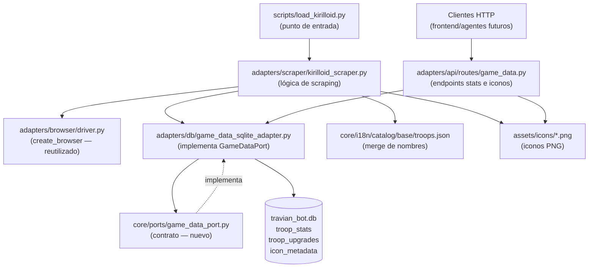

# Scraper de datos de tropas desde travian.kirilloid.ru

## 1. Objetivo de negocio

Poblar la base de datos del bot con los stats numéricos de todas las tropas de Travian T4.5
(ataque, defensa infantería, defensa caballería, velocidad, capacidad de carga, costes de
entrenamiento, tiempo de entrenamiento y tabla de mejoras de herrería) extrayéndolos de
`travian.kirilloid.ru`, la fuente de referencia de la comunidad.

Al mismo tiempo, enriquecer el catálogo i18n existente (`core/i18n/catalog/base/troops.json`)
con los nombres de tropa en todos los idiomas que kirilloid ofrece (~25 idiomas), y persistir
los iconos de cada tropa y de cada stat como recursos estáticos servidos por la API.

La información resultante será consumida por futuros endpoints que muestren al bot y al usuario
los stats de tropas, costes reales y tablas de mejora, sin necesidad de mantener estos datos
a mano.

**Por qué kirilloid y no scraping del juego real:** kirilloid ya agregó todos los datos en
tablas HTML limpias, multi-tribu y multi-idioma. Scraping directo de Travian requeriría cuentas,
autenticación y navegar por el juego; kirilloid es una fuente pública sin auth.

---

## 2. Actores y permisos

| Actor | Rol |
|---|---|
| Desarrollador / mantenedor del bot | Ejecuta el script CLI a mano cuando quiere actualizar los datos. |
| FastAPI (API del bot) | Sirve los stats y los iconos a clientes que los pidan vía HTTP. |
| Agentes del bot | Futura fuente de datos para decisiones de juego (combate, construcción). |

No hay usuarios finales directos en esta feature. El script no tiene autenticación ni control
de acceso; la API hereda el esquema `Accept-Language` ya implementado.

---

## 3. Alcance

### Dentro de alcance — Fase 1 (este spec)

- Stats BASE de cada tropa (s_lvl=0 herrería, t_lvl=1 edificio entreno, u_lvl=0 mejora).
- Nombres de todas las tropas en todos los idiomas disponibles en kirilloid (~25).
- Iconos de cada tropa (uno por tropa) y de cada columna de stats (uno por stat).
- Tabla de mejoras de herrería para cada tropa (niveles 0–20, columnas visibles
  dinámicamente detectadas).
- Las 9 tribus: Romanos, Germanos, Gauls, Egipcios, Hunos, Naturaleza, Natars,
  Espartanos, Vikingos. Naturaleza y Natars son NPC (flag `is_playable=False`).
- Persistencia: nombres → `troops.json` (merge); stats + mejoras → SQLite; iconos → disco.
- Script CLI `scripts/load_kirilloid.py` (un solo tiro, idempotente).
- Dos endpoints de API: listado de stats de tropas por tribu, y gestión de iconos.

### Fuera de alcance (no diseñar, no implementar)

- Stats de edificios desde kirilloid (Fase futura — no cerrar puertas en el modelo).
- Automatización / cron del scraper (el usuario lo ejecuta a mano).
- Endpoint admin para disparar el scraper vía HTTP.
- Captura de todas las combinaciones herrería × edificio de entreno (solo stats base).
- Soporte multi-versión activo (T4.5 2x, T3.6, etc.) — el modelo los soporta pero el
  scraper solo carga T4.5 1x (`s=1.45`).
- Ampliación de `SUPPORTED_LANGUAGES` en la API (sigue con los 5 actuales).

---

## 4. Reglas de negocio

**RN-01 — Versión de servidor como dimensión:**
La clave primaria de stats incluye `server_version` (string, p.ej. `"1.45"`). Permite añadir
T4.5 2x (`"2.45"`) o T3.6 sin migración rompedora.

**RN-02 — Stats base únicamente:**
El scraper carga stats con parámetros fijos `s_lvl=0`, `t_lvl=1`, `u_lvl=0`. No captura
combinaciones de niveles de herrería y edificio de entreno.

**RN-03 — Idempotencia / UPSERT:**
Re-ejecutar el script actualiza los datos existentes sin duplicar ni fallar. Cualquier tabla
o fichero se diseña con claves naturales que permitan `INSERT OR REPLACE` o equivalente.

**RN-04 — Base = fuente kirilloid (sobrescribe); override = correcciones manuales (intocable):**
El scraper escribe los nombres scrapeados en `core/i18n/catalog/base/troops.json` y
**sobrescribe** cualquier valor existente, incluso si ya tenía contenido. Excepción: si el
nombre scrapeado para un idioma concreto viene vacío (`""`), se conserva el valor anterior
(evita borrar datos de respaldo cuando kirilloid tiene un hueco).

Esta política reemplaza el antiguo merge no-destructivo. Motivo: la capa i18n anterior dejó
nombres ES incorrectos en el base (p.ej. `ROMANS_3 = "Explorador de los Imperios"` en lugar
de `"Imperano"`); el merge no-destructivo los conservaba indefinidamente. Al declarar
kirilloid como fuente de verdad del base, los nombres correctos se imponen en cada ejecución.

Las correcciones manuales (nombres que kirilloid no tiene o que difieren intencionalmente)
viven en `core/i18n/catalog/override/troops.json`. El scraper **nunca** toca ese fichero.
El `JsonTranslationAdapter` aplica base + override con override ganando.

**RN-05 — Tribus nuevas al Enum:**
`NATURE`, `NATARS`, `SPARTANS`, `VIKINGS` se añaden a `core/entities/tribe.py`. Sus valores
siguen la convención minúsculas del Enum existente. Las entradas `troops.json` usarán el mismo
patrón `TRIBE_ordinal`.

**RN-06 — Flag jugable / NPC:**
La tabla de stats incluye una columna booleana `is_playable` por tribu. Naturaleza y Natars
tienen `is_playable=False`. Esto se incluye en la respuesta de API como campo informativo.

**RN-07 — Valores "—" = NULL:**
Si kirilloid muestra "—" para un stat (p.ej. Colono sin ataque), se guarda como `NULL` en
SQLite y `None` en Python. Nunca como 0 para no falsear comparativas de combate.

**RN-08 — Tiempo como segundos enteros:**
El tiempo de entreno viene en formato `H:MM:SS`. Se convierte y almacena como entero de
segundos. El `title` del elemento puede incluir `"X / jornada"` (producción diaria a escala);
solo se usa el valor principal `H:MM:SS`.

**RN-09 — Detección dinámica de columnas de mejora:**
La tabla `#upg_table` contiene columnas con `style="display:none"` para las mejoras que no
aplican a esa tropa. Solo se persisten columnas cuyo `<th>` o `<td>` correspondiente esté
VISIBLE (sin `display:none`). No hay lista hardcodeada de columnas.

**RN-10 — Fallo ruidoso con guardado parcial:**
Si el scraper no puede parsear una tropa o un idioma concreto, lo registra en log detallado
(tribu, ordinal, idioma, error) y continúa con el resto. Al final imprime un resumen de
errores. Los datos que sí se extrajeron correctamente se guardan.

**RN-11 — Iconos semánticos:**
Los iconos se identifican por claves semánticas legibles:

- Stat de cabecera de tabla principal (`#main`, fila de cabecera):

  | Clase del `` | `icon_id` | Selector DOM |
  |---|---|---|
  | `stats att_all` | `stat_attack` | `td.off img.stats.att_all` |
  | `stats def_i` | `stat_def_infantry` | `td.def_i img.stats.def_i` |
  | `stats def_c` | `stat_def_cavalry` | `td.def_c img.stats.def_c` |
  | `stats speed` | `stat_speed` | `td.speed img.stats.speed` |
  | `stats cap` | `stat_carry` | `td.cap img.stats.cap` |
  | `res r1` | `stat_wood` | `td.res1 img.res.r1` |
  | `res r2` | `stat_clay` | `td.res2 img.res.r2` |
  | `res r3` | `stat_iron` | `td.res3 img.res.r3` |
  | `res r4` | `stat_crop` | `td.res4 img.res.r4` |
  | `res r6` | `stat_resources_sum` | `td.res_sum img.res.r6` |
  | `res r5` | `stat_upkeep` | `td.cu img.res.r5` |
  | `res r7` | `stat_time` | `td.time img.res.r7` |

- Tropa: `{tribe_value}_{ordinal}` (p.ej. `romans_1`, `nature_3`).

- Mejora de herrería (columna de `#upg_table`, fila de cabecera):
  Solo se crean ficheros PNG para los iconos que NO existen ya en la tabla principal.
  Los iconos compartidos (`att_all`, `def_i`, `def_c`) ya están capturados como
  `stat_attack`, `stat_def_infantry`, `stat_def_cavalry` — **no se duplican**.

  | Clase del `` en `td.upg` | `icon_id` | Nuevo / Compartido |
  |---|---|---|
  | `stats att_all` | `stat_attack` (ya existe) | Compartido — no capturar de nuevo |
  | `stats def_i` | `stat_def_infantry` (ya existe) | Compartido — no capturar de nuevo |
  | `stats def_c` | `stat_def_cavalry` (ya existe) | Compartido — no capturar de nuevo |
  | `stats eye` | `upgrade_scouting` | **Nuevo** — solo en `#upg_table` |
  | `stats def_s` | `upgrade_counter_scouting` | **Nuevo** — solo en `#upg_table` |
  | `stats point` | `upgrade_destructive` | **Nuevo** — solo en `#upg_table` |

  Los tres iconos nuevos se guardan con `icon_type="upgrade"`, `tribe=None`,
  `ordinal=None`, `stat_name` = el nombre descriptivo (`scouting`, `counter_scouting`,
  `destructive`).

  **Justificación de no duplicar:** crear `upgrade_attack.png` con el mismo píxel que
  `stat_attack.png` inflaría el almacén sin valor; el frontend puede referenciarse al
  `stat_attack` existente cuando quiera mostrar el icono de la columna de ataque en la
  tabla de mejoras. La tabla `icon_metadata` y el endpoint `GET /catalog/icons?icon_type=upgrade`
  solo listarán los tres iconos genuinamente nuevos.

**RN-12 — Iconos como PNG con transparencia:**
Todos los iconos se guardan como PNG. El fondo se elimina con Pillow (flood-fill desde las
cuatro esquinas con tolerancia configurable). Fuente: screenshot del elemento DOM vía
zendriver (kirilloid usa CSS sprite con `background-position`; no hay PNGs individuales).

**RN-13 — Perfil Chrome separado para el scraper:**
El scraper usa `profiles/scraper_kirilloid` como `profile_dir`, nunca el perfil de una cuenta
jugadora. Esto garantiza que si kirilloid detecta el acceso, no contamina la sesión del bot.

**RN-14 — Almacén de iconos en disco, servidos por StaticFiles:**
Los iconos se guardan en `assets/icons/`. FastAPI los sirve con `StaticFiles` montado en
`/static/icons/`. Los metadatos (qué representa cada icono, ruta relativa, tamaño en bytes)
se guardan en SQLite (tabla `icon_metadata`), no en un manifest JSON, para mantener un único
punto de verdad en la BD y poder hacer queries (p.ej. "dame todos los iconos de tropas romanas").

---

## 5. Flujo principal y flujos alternativos

### Flujo principal del script CLI

```
1. Arrancar Chrome con zendriver (perfil scraper_kirilloid).
2. Para cada tribu en TRIBES_CONFIG (orden 1..9):
   a. Construir URL con parámetros tribe=N, s=1.45, s_lvl=0, t_lvl=1, u_lvl=0, unit=1.
   b. Navegar a la URL.
   c. Esperar a que #main.wire sea visible.
   d. Leer tabla #main:
      - Fila de cabecera: capturar iconos de cada columna de stat.
      - Filas de tropas: por cada tropa, leer su icono y sus stats numéricos.
   e. Leer tabla #upg_table (si existe):
      - Detectar columnas VISIBLES (th sin display:none).
      - Leer filas de mejora (niveles 0–20).
   f. Para cada idioma en KIRILLOID_LANGUAGES (lista completa ~25):
      - Click en la bandera del idioma en #langbar (selector: #langbar img[alt='{lang_code}'])
      - Esperar re-render de la tabla.
      - Leer solo los nombres de tropa (td.name[unit='N']).
      - Guardar en buffer {lang_code: {ordinal: nombre}}.
   g. Capturar screenshots de iconos de tropa y stat (ver sección 9).
3. Persistir stats en SQLite (UPSERT).
4. Persistir tabla de mejoras en SQLite (UPSERT).
5. Persistir iconos en disco + metadatos en SQLite (UPSERT por icon_id).
6. Merge de nombres en troops.json (solo rellenar vacíos, nunca sobrescribir).
7. Cerrar browser.
8. Imprimir resumen: tropas procesadas, idiomas cubiertos, errores parciales.
```

### Flujo alternativo — kirilloid no carga (red o estructura cambia)

Si `#main.wire` no aparece en timeout (configurable, default 30s), el scraper lanza
`KirilloidScraperError` con detalle de la tribu/URL que falló, registra el error, y sigue
con la siguiente tribu (no aborta todo el proceso).

### Flujo alternativo — columna de stat sin selector esperado

Si un `<td>` de stat tiene clase que no está en el mapeo conocido (kirilloid añadió una columna
nueva), el scraper lo registra como warning y lo ignora (no falla), manteniendo los stats ya
mapeados.

### Flujo alternativo — ícono ya existe en disco

Si el archivo PNG del icono ya existe en `assets/icons/`, el scraper lo sobreescribe
(el UPSERT de metadatos actualizará el tamaño). La idempotencia garantiza no tener archivos
huérfanos.

---

## 6. Edge cases

| ID | Caso | Tratamiento |
|---|---|---|
| EC-01 | Valor "—" en celda de stat | Guardar NULL en SQLite, None en Python. |
| EC-02 | Tiempo "0:00:00" | Convertir a 0 segundos — es válido (unidades instantáneas en servidores especiales). |
| EC-03 | Tropa sin tabla de mejora | `#upg_table` no existe o está vacía → guardar 0 filas de mejora, no error. |
| EC-04 | Idioma no encontrado en #langbar | Registrar warning "idioma X no disponible en kirilloid", continuar. |
| EC-05 | Tropa con nombre vacío en un idioma | Dejar el campo vacío en troops.json (no rellenar con fallback — el adaptador JsonTranslation ya hace fallback en runtime). |
| EC-06 | Columna de mejora con display:none | Ignorarla — no tiene datos reales para esa tropa. |
| EC-07 | Re-ejecución con datos ya cargados | UPSERT en SQLite, merge no-destructivo en JSON. Sin error, sin duplicados. |
| EC-08 | Número de tropas por tribu variable | Iterar hasta que unit=N no tenga fila en la tabla (detectar por ausencia de `td.name[unit='N']`). |
| EC-09 | Tribe enum ya tiene valor (ej. ROMANS existe) | Añadir solo los 4 nuevos. Los 5 existentes no se tocan. |
| EC-10 | Screenshot de icono CSS sprite | Capturar screenshot del elemento `img.unit.uN` completo. Si el elemento tiene dimensiones 0x0 (img placeholder de sprite puro), usar screenshot de la celda `td` padre. |
| EC-11 | Icono de stat es imagen transparente o fondo blanco sólido | Flood-fill desde 4 esquinas con tolerancia 30 (configurable). Si las 4 esquinas tienen colores distintos, usar la esquina más frecuente. |
| EC-12 | Dos tropas de tribus distintas con mismo ordinal | La clave primaria de stats incluye `(server_version, tribe, ordinal)`, no solo ordinal. |
| EC-13 | Tabla #upg_table con filas de nivel no entero | Ignorar filas cuyo primer `<td>` no sea parseable como int 0-20. |
| EC-14 | kirilloid offline al ejecutar el script | El scraper falla con BrowserError propagada desde zendriver. El usuario reintenta manualmente. |
| EC-15 | PNG generado con canal alfa completamente opaco | Es correcto — significa que el fondo era uniforme y fue eliminado. Si no hay fondo uniforme detectable, guardar PNG tal cual (sin transparencia forzada). |

---

## 7. Modelo de datos / cambios de esquema

### 7.1 Enum Tribe — extensión retrocompatible

Fichero: `core/entities/tribe.py`

Añadir al Enum existente (los 5 actuales no se tocan):

```python
class Tribe(Enum):
    ROMANS   = "romans"
    TEUTONS  = "teutons"
    GAULS    = "gauls"
    EGYPTIANS = "egyptians"
    HUNS     = "huns"
    # Nuevas tribus (Fase kirilloid)
    NATURE   = "nature"
    NATARS   = "natars"
    SPARTANS = "spartans"
    VIKINGS  = "vikings"
```

Convención ya establecida: `tribe.value.upper() + "_" + str(ordinal)` → clave en troops.json.

### 7.2 troops.json — nuevas entradas

Fichero: `core/i18n/catalog/base/troops.json`

Agregar al final entradas para las 4 tribus nuevas siguiendo el patrón exacto del fichero.
Los idiomas son los ~25 que kirilloid ofrece; los 5 soportados por la API (`es`,`en`,`de`,
`fr`,`ru`) también estarán aquí. Los demás idiomas estarán en el mismo dict de entrada pero
nunca causan errores en `JsonTranslationAdapter` porque el fallback es a `es`.

Ejemplo de estructura de entrada:

```json
"NATURE_1": {"es": "Rata", "en": "Rat", "de": "Ratte", "fr": "Rat", "ru": "Крыса", ...}
```

El scraper hace MERGE: solo rellena campos vacíos `""`. No sobreescribe campos con valor.

### 7.3 Tablas SQLite nuevas

El script CLI crea las tablas si no existen antes del primer UPSERT (patrón del proyecto:
SQL crudo vía aiosqlite, sin Alembic, `get_connection()` en `adapters/db/database.py`).

#### Tabla `troop_stats`

Clave natural: `(server_version, tribe, ordinal)`.

```sql
CREATE TABLE IF NOT EXISTS troop_stats (
    server_version  TEXT    NOT NULL,   -- "1.45", "2.45", etc.
    tribe           TEXT    NOT NULL,   -- valor del Tribe enum: "romans", "nature", ...
    ordinal         INTEGER NOT NULL,   -- posición en la tribu, empieza en 1
    is_playable     INTEGER NOT NULL DEFAULT 1,  -- 0 para Naturaleza y Natars
    attack          INTEGER,            -- NULL si "—" (ej. colonos, exploradores)
    def_infantry    INTEGER,
    def_cavalry     INTEGER,
    speed           INTEGER,
    carry           INTEGER,
    cost_wood       INTEGER,
    cost_clay       INTEGER,
    cost_iron       INTEGER,
    cost_crop       INTEGER,
    cost_sum        INTEGER,
    upkeep          INTEGER,
    train_time_s    INTEGER,            -- tiempo en segundos
    icon_id         TEXT,               -- FK lógica a icon_metadata.icon_id
    scraped_at      TEXT NOT NULL,      -- ISO-8601 UTC
    PRIMARY KEY (server_version, tribe, ordinal)
);
```

#### Tabla `troop_upgrades`

Clave natural: `(server_version, tribe, ordinal, level, stat_name)`.

```sql
CREATE TABLE IF NOT EXISTS troop_upgrades (
    server_version  TEXT    NOT NULL,
    tribe           TEXT    NOT NULL,
    ordinal         INTEGER NOT NULL,
    level           INTEGER NOT NULL,   -- 0..20
    stat_name       TEXT    NOT NULL,   -- "attack", "def_infantry", "def_cavalry",
                                        -- "spy", "destructive", "carry"
    stat_value      REAL    NOT NULL,   -- valor del multiplicador o absoluto según kirilloid
    cost_wood       INTEGER,
    cost_clay       INTEGER,
    cost_iron       INTEGER,
    cost_crop       INTEGER,
    cost_sum        INTEGER,
    upgrade_time_s  INTEGER,
    scraped_at      TEXT NOT NULL,
    PRIMARY KEY (server_version, tribe, ordinal, level, stat_name)
);
```

#### Tabla `icon_metadata`

```sql
CREATE TABLE IF NOT EXISTS icon_metadata (
    icon_id         TEXT    PRIMARY KEY,  -- clave semántica (ver RN-11)
    icon_type       TEXT    NOT NULL,     -- "troop", "stat", "upgrade"
    tribe           TEXT,                 -- NULL para iconos de stat
    ordinal         INTEGER,              -- NULL para iconos de stat
    stat_name       TEXT,                 -- NULL para iconos de tropa
    file_path       TEXT    NOT NULL,     -- ruta relativa a la raíz del proyecto
                                          -- p.ej. "assets/icons/romans_1.png"
    file_size_bytes INTEGER NOT NULL,
    width_px        INTEGER NOT NULL,
    height_px       INTEGER NOT NULL,
    scraped_at      TEXT    NOT NULL
);
```

### 7.4 Almacén de iconos en disco

Directorio: `assets/icons/` (en la raíz del proyecto, gitignored excepto un `.gitkeep`).
Convencion de nombre de archivo: `{icon_id}.png` (p.ej. `romans_1.png`, `stat_attack.png`,
`upgrade_spy.png`).

FastAPI monta este directorio como recursos estáticos en `/static/icons/`
(ver sección 8 — endpoints de iconos).

### 7.5 Por qué los metadatos de iconos van en SQLite y no en manifest JSON

- SQLite permite queries: "dame todos los iconos de tropas NPC", "iconos de stats de combate".
- Un manifest JSON requeriría cargar y parsear todo el archivo para cada consulta.
- Consistente con el patrón del proyecto: SQLite ya es la BD elegida para datos de juego.
- El JSON ya existe para otro propósito (i18n/nombres); mezclar iconos en él aumenta la
  complejidad del `JsonTranslationAdapter` que no debe conocer iconos.

---

## 8. Contratos de API / interfaces

> **VALIDADO POR desarrollador-apis** — contrato revisado y aprobado.
> Ver sección 16 para trazabilidad de la validación.

### 8.0 Consideración previa — ruta `/static/icons/`

Los iconos se sirven con `StaticFiles` montado directamente en `main.py`:

```python
from fastapi.staticfiles import StaticFiles
app.mount("/static/icons", StaticFiles(directory="assets/icons"), name="static_icons")
```

Este mount NO pasa por el middleware `Accept-Language` (es un recurso estático).
Los endpoints de iconos listados abajo son el metadata wrapper que SÍ requiere Accept-Language.

### 8.1 Puerto `GameDataPort`

Interfaz del core para acceder a stats de tropas. Fichero:
`core/ports/game_data_port.py`

```python
from abc import ABC, abstractmethod
from core.entities.tribe import Tribe

class GameDataPort(ABC):

    @abstractmethod
    async def get_troop_stats(
        self,
        tribe: Tribe,
        ordinal: int,
        server_version: str = "1.45",
    ) -> dict | None:
        """
        Devuelve los stats base de una tropa, o None si no existe.
        dict con keys: ordinal, tribe, is_playable, attack, def_infantry,
        def_cavalry, speed, carry, cost_wood, cost_clay, cost_iron,
        cost_crop, cost_sum, upkeep, train_time_s, icon_id.
        Los stats opcionales (NULL en BD) vienen como None.
        """

    @abstractmethod
    async def get_all_troop_stats(
        self,
        tribe: Tribe,
        server_version: str = "1.45",
    ) -> list[dict]:
        """
        Devuelve todos los stats de una tribu ordenados por ordinal.
        Lista vacía si la tribu no tiene datos.
        """

    @abstractmethod
    async def get_troop_upgrades(
        self,
        tribe: Tribe,
        ordinal: int,
        server_version: str = "1.45",
    ) -> list[dict]:
        """
        Devuelve la tabla de mejoras de herrería de una tropa.
        Cada item: {level, stat_name, stat_value, cost_wood, cost_clay,
        cost_iron, cost_crop, cost_sum, upgrade_time_s}.
        Lista vacía si no hay datos de mejora.
        """

    @abstractmethod
    async def upsert_troop_stats(self, stats: dict) -> None:
        """
        Inserta o actualiza los stats de una tropa.
        stats debe incluir server_version, tribe, ordinal y todos los campos
        de troop_stats. scraped_at lo rellena el adaptador con UTC ahora.
        """

    @abstractmethod
    async def upsert_troop_upgrade(self, upgrade: dict) -> None:
        """
        Inserta o actualiza una fila de la tabla de mejoras.
        """

    @abstractmethod
    async def upsert_icon_metadata(self, icon: dict) -> None:
        """
        Inserta o actualiza los metadatos de un icono.
        icon debe incluir: icon_id, icon_type, tribe (o None), ordinal (o None),
        stat_name (o None), file_path, file_size_bytes, width_px, height_px.
        """

    @abstractmethod
    async def get_icon_metadata(self, icon_id: str) -> dict | None:
        """Devuelve los metadatos de un icono por su icon_id, o None."""

    @abstractmethod
    async def list_icons(
        self,
        icon_type: str | None = None,
        tribe: str | None = None,
    ) -> list[dict]:
        """
        Devuelve lista de metadatos de iconos.
        Filtros opcionales: icon_type ("troop"|"stat"|"upgrade"), tribe.
        """
```

### 8.2 Endpoint — Stats de tropas por tribu

**Decisión de reutilización:** CREAR endpoint nuevo. Los endpoints de catálogo existentes
(`GET /catalog/troops/{tribe}`) devuelven NOMBRES (via TranslationPort); este devuelve STATS
numéricos (via GameDataPort). Son responsabilidades distintas con fuentes de datos distintas.

```
GET /catalog/troops/{tribe}/stats
```

**Path param:** `tribe` — valor del Enum Tribe (p.ej. `romans`, `nature`). FastAPI valida
contra el Enum; devuelve 422 si es inválido.

**Query param opcional:** `server_version` (string, default `"1.45"`). Permite consultar
futuros datos de otras versiones sin cambiar la ruta.

**Headers requeridos:**
- `Accept-Language: {lang}` — obligatorio. Devuelve 400 si falta o idioma no soportado.

**Dependencias del handler (validado por desarrollador-apis):**
El handler requiere DOS dependencias inyectadas, no una:
- `game_data_port: GameDataPort = Depends(get_game_data_port)` — stats numéricos desde SQLite.
- `translation_port: TranslationPort = Depends(get_translation_port)` — nombre localizado de cada tropa.

Sin `translation_port` el campo `language` de cada tropa NO se puede construir. Si el idioma
pedido no tiene traducción para una tropa concreta, se aplica el fallback a `es` (comportamiento
ya implementado en `JsonTranslationAdapter`). El 404 de "tribu sin datos" debe incluir la
`server_version` en el `detail` para facilitar el debug
(p.ej. `"No hay datos de stats para la tribu 'romans' con server_version='1.45'"`).

**Response 200 — `TroopStatsCatalogResponse`:**

```json
{
  "tribe": "romans",
  "server_version": "1.45",
  "troops": [
    {
      "ordinal": 1,
      "key": "ROMANS_1",
      "is_playable": true,
      "language": {"es": "Legionario"},
      "attack": 40,
      "def_infantry": 35,
      "def_cavalry": 50,
      "speed": 6,
      "carry": 50,
      "cost_wood": 120,
      "cost_clay": 100,
      "cost_iron": 150,
      "cost_crop": 30,
      "cost_sum": 400,
      "upkeep": 1,
      "train_time_s": 1600,
      "icon_url": "/static/icons/romans_1.png"
    }
  ]
}
```

Stats opcionales (NULL en BD) se serializan como `null` en JSON.
`icon_url` es la URL relativa servible desde `/static/icons/`. Si no hay icono, `null`.
`language` sigue el patrón establecido: `{lang_servido: nombre}`.

**Errores:**

| Código | Condición |
|---|---|
| 400 | `Accept-Language` ausente o idioma no soportado |
| 422 | `tribe` no es un valor válido del Enum |
| 404 | La tribu no tiene datos de stats cargados (BD vacía para esa tribu/versión) |

**Cabeceras de respuesta:**
- Las del middleware global: `X-Request-ID`, `X-API-Version`, `X-Content-Type-Options`, `X-Frame-Options`.
- `Cache-Control: public, max-age=3600` (heredado del middleware `add_catalog_cache_control` porque la ruta empieza por `/catalog/`).

### 8.3 Endpoint — Metadatos de iconos

**Decisión de reutilización:** CREAR endpoint nuevo. No existe ningún endpoint de iconos.

```
GET /catalog/icons
```

**Query params opcionales (tipado validado por desarrollador-apis):**
- `icon_type`: `Literal["troop", "stat", "upgrade"] | None = Query(None)` — filtra por tipo.
  Se tipa como `Literal` (no Enum) para generar un Swagger limpio sin clase extra; un valor
  fuera del set devuelve 422 automático de FastAPI.
- `tribe`: `Tribe | None = Query(None)` — filtra por tribu (solo tiene efecto con
  `icon_type=troop`; combinarlo con `icon_type=stat` devuelve lista vacía, no error).

**Headers requeridos:**
- `Accept-Language: {lang}` — obligatorio (coherencia de API; el body no varía por idioma
  en este endpoint, pero la cabecera es obligatoria en todos los endpoints del proyecto).

**Response 200 — `IconListResponse`:**

```json
{
  "icons": [
    {
      "icon_id": "romans_1",
      "icon_type": "troop",
      "tribe": "romans",
      "ordinal": 1,
      "stat_name": null,
      "url": "/static/icons/romans_1.png",
      "width_px": 24,
      "height_px": 24
    },
    {
      "icon_id": "stat_attack",
      "icon_type": "stat",
      "tribe": null,
      "ordinal": null,
      "stat_name": "attack",
      "url": "/static/icons/stat_attack.png",
      "width_px": 20,
      "height_px": 20
    }
  ]
}
```

**Lista vacía = 200, no 404:** si ningún icono cumple los filtros aplicados, el endpoint
devuelve `200` con `{"icons": []}`. Un listado con cero resultados es un 200 con lista vacía
(semántica REST correcta); el 404 se reserva para recursos identificados que no existen.

**Errores:**

| Código | Condición |
|---|---|
| 400 | `Accept-Language` ausente o idioma no soportado |
| 422 | `tribe` o `icon_type` con valor inválido |

### 8.4 Endpoint — Binario de icono por ID

Los iconos binarios NO se sirven por FastAPI router sino por el `StaticFiles` mount
(ver sección 8.0). No hay endpoint explícito para el binario; la URL es:

```
GET /static/icons/{icon_id}.png
```

Este recurso NO requiere `Accept-Language` (es un archivo estático).
Devuelve 404 si el archivo no existe (comportamiento nativo de StaticFiles).

---

## 9. Flujo lógico paso a paso

### 9.1 Script CLI — `scripts/load_kirilloid.py`

```
Constantes:
  KIRILLOID_BASE_URL = "http://travian.kirilloid.ru/troops.php"
  SERVER_VERSION = "1.45"
  PROFILE_DIR = "profiles/scraper_kirilloid"
  ICONS_DIR = Path("assets/icons")
  BG_FILL_TOLERANCE = 30  # tolerancia flood-fill Pillow

  TRIBES_CONFIG = [
    (1,  "romans",    True),
    (2,  "teutons",   True),
    (3,  "gauls",     True),
    (4,  "nature",    False),
    (5,  "natars",    False),
    (6,  "egyptians", True),
    (7,  "huns",      True),
    (8,  "spartans",  True),
    (9,  "vikings",   True),
  ]

  # Códigos de idioma que se pasan al selector alt de #langbar
  # (verificar contra los alt reales de las banderas al implementar)
  KIRILLOID_LANGUAGES = [
    "ar","bg","cs","da","de","el","en","es","fa","fr",
    "he","hu","it","ja","lt","lv","nl","pl","pt","rs",
    "ru","sl","sv","tr","uk"
  ]

  STAT_COLUMN_MAP = {
    # clase CSS de td → nombre de stat en modelo de datos
    "off":     "attack",
    "def_i":   "def_infantry",
    "def_c":   "def_cavalry",
    "speed":   "speed",
    "cap":     "carry",
    "res1":    "cost_wood",
    "res2":    "cost_clay",
    "res3":    "cost_iron",
    "res4":    "cost_crop",
    "res_sum": "cost_sum",
    "cu":      "upkeep",
    "time":    "train_time_s",
  }

FUNCIÓN main():
  ICONS_DIR.mkdir(parents=True, exist_ok=True)
  browser = await create_browser(PROFILE_DIR)
  conn = await get_connection()
  await _create_tables_if_not_exist(conn)

  errors = []

  PARA (tribe_id, tribe_value, is_playable) EN TRIBES_CONFIG:
    await human_delay(1500, 3000)   # cortesía entre tribus (8 saltos) — no sobrecargar kirilloid
    url = f"{KIRILLOID_BASE_URL}?s={SERVER_VERSION}&tribe={tribe_id}&s_lvl=0&t_lvl=1&u_lvl=0&unit=1"
    página = await browser.get(url)
    await _wait_for_element(página, "#main.wire", timeout=30)

    # --- Leer stats base ---
    stats_por_ordinal = {}
    TRY:
      stats_por_ordinal = await _parse_main_table(página, tribe_value, is_playable)
    EXCEPT Exception as e:
      errors.append(f"stats/{tribe_value}: {e}")
      CONTINUAR con mejoras e idiomas aunque stats fallase

    # --- Leer tabla de mejoras ---
    upgrades_por_ordinal = {}
    TRY:
      upgrades_por_ordinal = await _parse_upgrade_table(página, tribe_value)
    EXCEPT Exception as e:
      errors.append(f"upgrades/{tribe_value}: {e}")

    # --- Capturar iconos de stat (solo en primera tribu o si no existen) ---
    SI tribe_id == 1 O algún stat_icon no existe en ICONS_DIR:
      TRY:
        await _capture_stat_icons(página, conn)
      EXCEPT Exception as e:
        errors.append(f"stat_icons: {e}")

    # --- Capturar iconos de mejora (solo si alguno de los 3 nuevos no existe) ---
    # Condición: se intenta en cada tribu hasta que los 3 nuevos existan.
    # Los 3 iconos nuevos (upgrade_scouting, upgrade_counter_scouting, upgrade_destructive)
    # solo aparecen en tribus/unidades con tropas de espionaje o catapultas.
    # Si en la tribu actual la celda de cabecera de #upg_table está display:none para esa
    # clase, la función lo detecta y omite esa clase (no falla).
    UPGRADE_NEW_ICONS = {"upgrade_scouting", "upgrade_counter_scouting", "upgrade_destructive"}
    missing_upgrade_icons = [ic for ic in UPGRADE_NEW_ICONS
                             if not (ICONS_DIR / f"{ic}.png").exists()]
    SI missing_upgrade_icons:
      TRY:
        await _capture_upgrade_icons(página, conn)
      EXCEPT Exception as e:
        errors.append(f"upgrade_icons/{tribe_value}: {e}")

    # --- Capturar iconos de tropa ---
    PARA ordinal, stats EN stats_por_ordinal.items():
      icon_id = f"{tribe_value}_{ordinal}"
      TRY:
        await _capture_troop_icon(página, tribe_value, ordinal, icon_id, conn)
        stats["icon_id"] = icon_id
      EXCEPT Exception as e:
        errors.append(f"troop_icon/{icon_id}: {e}")
        stats["icon_id"] = None

    # --- Leer nombres por idioma ---
    nombres_por_idioma = {}
    PARA lang_code EN KIRILLOID_LANGUAGES:
      TRY:
        lang_flag = await página.find(f"#langbar img[alt='{lang_code}']")
        await lang_flag.click()
        await human_delay(800, 1200)   # esperar re-render
        nombres_por_idioma[lang_code] = await _parse_troop_names(página)
      EXCEPT Exception as e:
        errors.append(f"names/{tribe_value}/{lang_code}: {e}")

    # --- Persistir en SQLite ---
    PARA ordinal, stats EN stats_por_ordinal.items():
      await game_data_port.upsert_troop_stats(stats)

    PARA ordinal, upgrades EN upgrades_por_ordinal.items():
      PARA upgrade EN upgrades:
        await game_data_port.upsert_troop_upgrade(upgrade)

    # --- Merge en troops.json ---
    _merge_troop_names(tribe_value, nombres_por_idioma, stats_por_ordinal.keys())

  await browser.stop()
  await conn.close()

  SI errors:
    IMPRIMIR f"SCRAPING COMPLETADO CON {len(errors)} ERRORES:"
    PARA e EN errors: IMPRIMIR f"  - {e}"
  SINO:
    IMPRIMIR "SCRAPING COMPLETADO SIN ERRORES."
```

### 9.2 Parseo de la tabla #main

```
FUNCIÓN _parse_main_table(página, tribe_value, is_playable) -> dict[int, dict]:
  # Leer columnas de stats desde la fila de cabecera
  # (para verificar el orden — aunque STAT_COLUMN_MAP es la fuente de verdad)
  resultado = {}
  filas = await página.find_all("#main.wire tr")
  # Saltar fila 0 (cabecera con iconos)
  PARA fila EN filas[1:]:
    # Detectar si la fila es de tropa (tiene td.name con atributo unit)
    name_td = await fila.find("td.name[unit]", raise_exc=False)
    SI name_td es None: CONTINUAR
    ordinal = int(await name_td.get_attribute("unit"))

    stats = {
      "server_version": SERVER_VERSION,
      "tribe": tribe_value,
      "ordinal": ordinal,
      "is_playable": is_playable,
    }

    PARA css_class, stat_name EN STAT_COLUMN_MAP.items():
      td = await fila.find(f"td.{css_class}", raise_exc=False)
      SI td es None: CONTINUAR
      text = (await td.text()).strip()
      SI text == "—" O text == "":
        stats[stat_name] = None
      SINO SI stat_name == "train_time_s":
        stats[stat_name] = _parse_time(text)  # "H:MM:SS" → int segundos
      SINO:
        stats[stat_name] = _parse_int(text)   # "1.200" → 1200 (ignorar separadores)

    resultado[ordinal] = stats

  RETURN resultado
```

### 9.3 Parseo de la tabla #upg_table

```
FUNCIÓN _parse_upgrade_table(página, tribe_value) -> dict[int, list[dict]]:
  upg_table = await página.find("#upg_table", raise_exc=False)
  SI upg_table es None: RETURN {}

  # Detectar columnas visibles desde las celdas de cabecera
  header_cells = await upg_table.find_all("th")
  visible_stats = []
  PARA th EN header_cells:
    style = await th.get_attribute("style") o ""
    SI "display:none" EN style: CONTINUAR
    # Leer la clase de la celda o el data-stat para mapear al nombre
    data_stat = await th.get_attribute("data-stat") o ""
    SI data_stat EN UPGRADE_STAT_MAP:
      visible_stats.append(UPGRADE_STAT_MAP[data_stat])
    # Si no hay data-stat, intentar con la clase CSS del th
    # (implementador debe verificar HTML real de kirilloid)

  resultado = {}
  filas = await upg_table.find_all("tr")
  PARA fila EN filas:
    tds = await fila.find_all("td")
    SI len(tds) < 2: CONTINUAR
    level_text = (await tds[0].text()).strip()
    SI NO level_text.isdigit(): CONTINUAR
    level = int(level_text)
    SI level < 0 O level > 20: CONTINUAR

    # Las columnas de stats visibles: detectar cuáles td.upg corresponden a qué stat
    upg_tds = [td PARA td EN tds SI "upg" EN (await td.get_attribute("class") o "")]
    SI len(upg_tds) != len(visible_stats): CONTINUAR  # inconsistencia

    # Columnas de coste y tiempo están siempre presentes con clases fijas
    ordinal = <extraer del contexto de la fila de cabecera del grupo> # ver nota abajo

    PARA i, stat_name EN enumerate(visible_stats):
      style = await upg_tds[i].get_attribute("style") o ""
      SI "display:none" EN style: CONTINUAR
      value_text = (await upg_tds[i].text()).strip()
      upgrade = {
        "server_version": SERVER_VERSION,
        "tribe": tribe_value,
        "ordinal": ordinal,
        "level": level,
        "stat_name": stat_name,
        "stat_value": float(value_text.replace(",",".")),
        "cost_wood":  _parse_int_or_none(fila, "td.res1"),
        "cost_clay":  _parse_int_or_none(fila, "td.res2"),
        "cost_iron":  _parse_int_or_none(fila, "td.res3"),
        "cost_crop":  _parse_int_or_none(fila, "td.res4"),
        "cost_sum":   _parse_int_or_none(fila, "td.res_sum"),
        "upgrade_time_s": _parse_time_or_none(fila, "td.time"),
      }
      resultado.setdefault(ordinal, []).append(upgrade)

  RETURN resultado

NOTA sobre ordinal en upg_table:
  kirilloid agrupa las mejoras por unidad — cada grupo de filas tiene una fila de
  cabecera con el icono de la tropa (img.unit.uN). El implementador debe detectar el
  cambio de grupo leyendo esa fila de cabecera para asignar el ordinal correcto a
  las filas que le siguen.
```

### 9.4 Captura de iconos con Pillow

```
# Mapeo selector DOM → icon_id para los 12 iconos de la tabla principal #main
STAT_ICON_MAP = [
  # (selector CSS del img dentro de la fila de cabecera, icon_id semántico, stat_name)
  ("td.off img.stats.att_all",   "stat_attack",        "attack"),
  ("td.def_i img.stats.def_i",   "stat_def_infantry",  "def_infantry"),
  ("td.def_c img.stats.def_c",   "stat_def_cavalry",   "def_cavalry"),
  ("td.speed img.stats.speed",   "stat_speed",         "speed"),
  ("td.cap img.stats.cap",       "stat_carry",         "carry"),
  ("td.res1 img.res.r1",         "stat_wood",          "wood"),
  ("td.res2 img.res.r2",         "stat_clay",          "clay"),
  ("td.res3 img.res.r3",         "stat_iron",          "iron"),
  ("td.res4 img.res.r4",         "stat_crop",          "crop"),
  ("td.res_sum img.res.r6",      "stat_resources_sum", "resources_sum"),
  ("td.cu img.res.r5",           "stat_upkeep",        "upkeep"),
  ("td.time img.res.r7",         "stat_time",          "time"),
]

# Mapeo selector DOM → icon_id para los 3 iconos NUEVOS de #upg_table (los compartidos se omiten)
UPGRADE_ICON_MAP = [
  # (clase CSS del img dentro de td.upg en la fila de cabecera, icon_id, stat_name)
  ("stats eye",   "upgrade_scouting",          "scouting"),
  ("stats def_s", "upgrade_counter_scouting",  "counter_scouting"),
  ("stats point", "upgrade_destructive",       "destructive"),
]

FUNCIÓN _capture_stat_icons(página, conn):
  """
  Captura los 12 iconos de la fila de cabecera de la tabla #main.
  Cada icono corresponde a una columna de stat: ataque, defensa infantería, etc.
  Se ejecuta una sola vez (en la primera tribu o hasta que todos existan).

  Los selectores apuntan al  dentro de la primera <tr> de #main.wire —
  la fila de cabecera siempre tiene los iconos, independientemente del idioma
  (son imágenes CSS sprite, no texto).
  """
  PARA (selector, icon_id, stat_name) EN STAT_ICON_MAP:
    # Verificación de idempotencia: si el PNG ya existe, saltar
    out_path = ICONS_DIR / f"{icon_id}.png"
    SI out_path.exists(): CONTINUAR

    TRY:
      # Buscar el elemento  en la cabecera de #main.wire
      # Nota: el selector apunta dentro de la primera fila de la tabla,
      # que kirilloid siempre renderiza como fila de iconos de columna.
      element = await página.find(f"#main.wire tr:first-child {selector}", raise_exc=False)
      SI element es None:
        REGISTRAR warning(f"Icono de stat '{icon_id}' no encontrado con selector '{selector}'")
        CONTINUAR

      png_bytes = await element.save_screenshot()
      img = Image.open(BytesIO(png_bytes)).convert("RGBA")
      img = _remove_background(img, tolerance=BG_FILL_TOLERANCE)

      img.save(str(out_path), "PNG")
      w, h = img.size
      size = out_path.stat().st_size

      await conn.execute(
        "INSERT OR REPLACE INTO icon_metadata VALUES (?,?,?,?,?,?,?,?,?,?)",
        (icon_id, "stat", None, None, stat_name,
         f"assets/icons/{icon_id}.png", size, w, h,
         datetime.now(timezone.utc).isoformat())
      )
    EXCEPT Exception as e:
      REGISTRAR error(f"stat_icon/{icon_id}: {e}")
      # Error no fatal: continuar con el resto de iconos de stat


FUNCIÓN _capture_upgrade_icons(página, conn):
  """
  Captura los 3 iconos NUEVOS de la fila de cabecera de #upg_table:
    - upgrade_scouting      (clase 'stats eye')
    - upgrade_counter_scouting (clase 'stats def_s')
    - upgrade_destructive   (clase 'stats point')

  Estos iconos NO existen en la tabla principal #main y son exclusivos de #upg_table.
  Los iconos compartidos (att_all, def_i, def_c) ya están capturados como stat_attack,
  stat_def_infantry, stat_def_cavalry — no se vuelven a capturar aquí.

  ADVERTENCIA PARA EL IMPLEMENTADOR:
  Los iconos 'eye', 'def_s' y 'point' solo están VISIBLES (sin display:none) en unidades
  que tienen esas capacidades: tropas de espionaje (p.ej. exploradores de Gauls: tribe=3,
  unit=4) y catapultas. Si la tribu actual no tiene ese tipo de unidad, la celda de cabecera
  correspondiente estará con display:none y el screenshot devolvería un área en blanco o error.

  Estrategia: esta función se llama para CADA tribu mientras falten iconos. Cuando la tribu
  tiene esa capacidad (celda visible), se captura. Cuando no la tiene (celda oculta), se omite
  sin error. El flujo 9.1 reintenta en la siguiente tribu hasta que los 3 estén capturados.

  Tribus conocidas por tener tropas de espionaje (explorador/scout):
    - Gauls (tribe_id=3), Romanos (tribe_id=1), Germanos (tribe_id=2),
      Egipcios (tribe_id=6), Hunos (tribe_id=7), Espartanos (tribe_id=8), Vikingos (tribe_id=9).
  Tribus conocidas por tener catapultas:
    - Romanos, Germanos, Gauls, Egipcios, Hunos, Espartanos, Vikingos (la mayoría).
  Si con todas las tribus jugables aún falta algún icono, el implementador debe verificar
  qué unidad concreta activa esa columna en kirilloid.
  """
  upg_table = await página.find("#upg_table", raise_exc=False)
  SI upg_table es None: RETURN  # esta tribu no tiene tabla de mejoras

  PARA (img_class, icon_id, stat_name) EN UPGRADE_ICON_MAP:
    # Verificación de idempotencia
    out_path = ICONS_DIR / f"{icon_id}.png"
    SI out_path.exists(): CONTINUAR

    TRY:
      # Buscar en la fila de cabecera de #upg_table una celda td.upg que contenga
      # un  con las clases indicadas y cuya celda padre NO esté oculta.
      # Estrategia: buscar directamente el img por sus clases dentro de td.upg.
      # El selector usa las clases CSS del img (estables entre idiomas).
      # Ejemplo: "td.upg img.stats.eye" para el icono de scouting.
      css_classes = img_class.replace(" ", ".")   # "stats eye" → "stats.eye"
      selector = f"#upg_table td.upg img.{css_classes}"
      element = await página.find(selector, raise_exc=False)
      SI element es None:
        # Esta tribu no tiene esa columna visible — omitir sin error
        CONTINUAR

      # Verificar que la celda padre td.upg no está oculta (display:none)
      parent_td = await element.parent()  # zendriver: nodo padre
      parent_style = await parent_td.get_attribute("style") o ""
      SI "display:none" EN parent_style:
        CONTINUAR  # columna oculta en esta tribu — omitir

      png_bytes = await element.save_screenshot()
      img = Image.open(BytesIO(png_bytes)).convert("RGBA")
      img = _remove_background(img, tolerance=BG_FILL_TOLERANCE)

      img.save(str(out_path), "PNG")
      w, h = img.size
      size = out_path.stat().st_size

      await conn.execute(
        "INSERT OR REPLACE INTO icon_metadata VALUES (?,?,?,?,?,?,?,?,?,?)",
        (icon_id, "upgrade", None, None, stat_name,
         f"assets/icons/{icon_id}.png", size, w, h,
         datetime.now(timezone.utc).isoformat())
      )
    EXCEPT Exception as e:
      REGISTRAR error(f"upgrade_icon/{icon_id}: {e}")
      # Error no fatal: continuar con el resto de iconos de mejora
```

```
FUNCIÓN _capture_troop_icon(página, tribe_value, ordinal, icon_id, conn):
  element = await página.find(f"img.unit.u{ordinal}", raise_exc=False)
  SI element es None:
    element = await página.find(f"td.name[unit='{ordinal}']")  # fallback: celda padre

  # Usar screenshot del elemento vía zendriver
  png_bytes = await element.save_screenshot()  # devuelve bytes del PNG capturado

  # Quitar fondo con Pillow
  img = Image.open(BytesIO(png_bytes)).convert("RGBA")
  img = _remove_background(img, tolerance=BG_FILL_TOLERANCE)

  out_path = ICONS_DIR / f"{icon_id}.png"
  img.save(str(out_path), "PNG")

  w, h = img.size
  size = out_path.stat().st_size
  await conn.execute(
    "INSERT OR REPLACE INTO icon_metadata VALUES (?,?,?,?,?,?,?,?,?,?)",
    (icon_id, "troop", tribe_value, ordinal, None,
     f"assets/icons/{icon_id}.png", size, w, h,
     datetime.now(timezone.utc).isoformat())
  )

FUNCIÓN _remove_background(img: Image, tolerance: int) -> Image:
  """
  Flood-fill desde las 4 esquinas para detectar el color de fondo.
  Convierte a transparencia todos los píxeles dentro del rango de tolerancia
  del color de fondo más frecuente entre las esquinas.
  Usa ImageDraw.floodfill con fill=(0,0,0,0) sobre canal alfa.
  """
  corners = [
    img.getpixel((0, 0)),
    img.getpixel((img.width-1, 0)),
    img.getpixel((0, img.height-1)),
    img.getpixel((img.width-1, img.height-1)),
  ]
  # Color de fondo = más frecuente entre las 4 esquinas
  bg_color = max(set(corners), key=corners.count)
  # Si las 4 esquinas son todas distintas, no hay fondo uniforme → devolver sin cambios
  SI len(set(corners)) == 4: RETURN img

  draw = ImageDraw.Draw(img)
  PARA (x, y) EN [(0,0), (img.width-1, 0), (0, img.height-1), (img.width-1, img.height-1)]:
    corner_color = img.getpixel((x, y))
    SI _color_distance(corner_color, bg_color) <= tolerance:
      ImageDraw.floodfill(img, (x,y), (0,0,0,0), thresh=tolerance)

  RETURN img
```

### 9.5 Merge de nombres en troops.json

```
FUNCIÓN _merge_troop_names(tribe_value, nombres_por_idioma, ordinals):
  catalog_path = Path("core/i18n/catalog/base/troops.json")
  con open(catalog_path, "r", encoding="utf-8") as f:
    catalog = json.load(f)

  PARA ordinal EN ordinals:
    key = f"{tribe_value.upper()}_{ordinal}"
    SI key NO está en catalog:
      catalog[key] = {}
    PARA lang_code, nombres EN nombres_por_idioma.items():
      nombre = nombres.get(ordinal, "")
      # MERGE: solo rellenar campos vacíos
      valor_actual = catalog[key].get(lang_code, "").strip()
      SI valor_actual == "" Y nombre != "":
        catalog[key][lang_code] = nombre

  con open(catalog_path, "w", encoding="utf-8") as f:
    json.dump(catalog, f, ensure_ascii=False, indent=2)
```

### 9.6 Conversión de tiempo H:MM:SS → segundos

```
FUNCIÓN _parse_time(text: str) -> int:
  # Formato esperado: "H:MM:SS" (puede ser "0:05:30" o "1:23:45")
  # El texto puede tener espacios o caracteres extra — strip primero
  text = text.strip().split()[0]  # tomar solo la primera parte antes de espacio
  partes = text.split(":")
  SI len(partes) != 3: RAISE ValueError(f"Formato de tiempo inesperado: '{text}'")
  h, m, s = int(partes[0]), int(partes[1]), int(partes[2])
  RETURN h * 3600 + m * 60 + s
```

### 9.7 Diagrama de componentes



---

## 10. Validaciones y reglas

### En el scraper (adaptador)

| Validación | Comportamiento si falla |
|---|---|
| `#main.wire` no aparece en 30s | `KirilloidScraperError`, registrar, continuar con siguiente tribu |
| Celda de stat con valor no numérico (y no "—") | `ValueError`, registrar como error parcial, guardar `None` para ese stat |
| Tiempo en formato inesperado | `ValueError`, registrar, guardar `None` |
| Ordinal de `td.name[unit]` no entero | Ignorar la fila, registrar warning |
| Nivel en fila de mejora no entero 0-20 | Ignorar la fila, registrar warning |
| Bandera de idioma no encontrada en #langbar | Warning, continuar con el siguiente idioma |
| Imagen capturada con tamaño 0x0 | Intentar screenshot de `td` padre; si falla, registrar error, no guardar icono |

### En la API (FastAPI)

| Validación | Código HTTP |
|---|---|
| `Accept-Language` ausente | 400 |
| Idioma no en SUPPORTED_LANGUAGES | 400 |
| `tribe` no válido en path param | 422 (FastAPI automático) |
| Tribu sin datos en BD | 404 con `detail` legible |
| `icon_type` con valor no válido | 422 (FastAPI automático vía `Literal`) |

### En el merge de troops.json

- Solo modificar `core/i18n/catalog/base/troops.json`, nunca `override/`.
- El archivo debe ser JSON válido antes y después del merge (validar con `json.loads` antes de escribir).
- Si la escritura falla, el error es fatal para ese paso pero no aborta los UPSERT de SQLite ya realizados.

---

## 11. Seguridad, rendimiento y concurrencia

### Seguridad

**Anti-detección en kirilloid:**
kirilloid no es Travian pero usamos el mismo driver zendriver con delays humanos. Entre
cambios de idioma `human_delay(800, 1200)`; entre saltos de tribu `human_delay(1500, 3000)`
(solo 8 saltos, coste despreciable) para ser cortés con un servidor comunitario y no quemar
la IP del usuario a mitad de scraping.
El perfil `profiles/scraper_kirilloid` está separado del perfil del bot para no
contaminar cookies/historial de juego.

**No exponer datos sensibles:**
Los endpoints de stats son informativos (datos de juego públicos). No hay datos de usuario
ni credenciales involucrados. El middleware de seguridad del proyecto (`X-Content-Type-Options`,
`X-Frame-Options`) aplica automáticamente a los nuevos endpoints.

**Validación de entrada en endpoints:**
FastAPI valida el Enum de tribu automáticamente (422 para valores inválidos). La validación
de `Accept-Language` la gestiona la dependencia compartida existente `get_language`.

**StaticFiles y rutas de archivo:**
`StaticFiles` de FastAPI sirve solo archivos bajo `assets/icons/`. No hay path traversal
posible — el directorio está fijo en el mount. Los nombres de archivo son generados
internamente (nunca input del usuario).

### Rendimiento

**Script CLI (no afecta a la API):**
El scraper es síncrono respecto al usuario (tarda minutos — ~9 tribus × ~25 idiomas ×
1 navegación cada cambio de idioma). No hay requerimiento de tiempo; el usuario lo ejecuta
fuera del horario de juego.

**API:**
Los stats se sirven desde SQLite (lecturas simples por PK, en WAL mode). Los iconos son
archivos estáticos servidos por `StaticFiles` (sin pasar por Python en la ruta caliente).
`Cache-Control: public, max-age=3600` cubre los endpoints de catálogo/stats.

**Memoria:**
El scraper carga todas las tribus y todos los idiomas en secuencia (no en paralelo) para
no abrir múltiples tabs y mantener el comportamiento humano.

### Concurrencia

El script CLI es de un solo hilo (asyncio). No hay escrituras concurrentes posibles (el usuario
lo ejecuta a mano, una vez). Si en el futuro se paraliza, las tablas SQLite con `INSERT OR
REPLACE` y WAL mode son concurrencia-seguras para escrituras secuenciales.

Los endpoints FastAPI son read-only en SQLite y StaticFiles — concurrencia de lecturas no
presenta conflictos.

---

## 12. Plan de pruebas

### 12.1 Pruebas unitarias del scraper

| Test | Descripción |
|---|---|
| `test_parse_time_valid` | `"1:23:45"` → 5025 segundos |
| `test_parse_time_zero` | `"0:00:00"` → 0 segundos |
| `test_parse_time_invalid` | `"no-es-tiempo"` → `ValueError` |
| `test_parse_int_with_separator` | `"1.200"` → 1200; `"1,200"` → 1200 |
| `test_parse_dash_returns_none` | `"—"` → `None` |
| `test_remove_background_uniform` | Imagen con fondo blanco uniforme → esquinas transparentes |
| `test_remove_background_no_uniform` | Imagen con 4 esquinas distintas → imagen sin cambios |
| `test_merge_troop_names_fills_empty` | Campo vacío `""` → se rellena con nuevo nombre |
| `test_merge_troop_names_no_overwrite` | Campo con valor → no se sobreescribe |
| `test_merge_troop_names_new_tribe` | Tribu nueva → clave creada con nombres correctos |
| `test_capture_stat_icons_skips_existing` | Si el PNG ya existe en disco, no llama a save_screenshot (idempotencia) |
| `test_capture_upgrade_icons_skips_hidden` | Celda `td.upg` con `display:none` → se omite sin error, no se escribe PNG |
| `test_capture_upgrade_icons_skips_missing_table` | Tribu sin `#upg_table` → función retorna sin error |

### 12.2 Pruebas unitarias del adaptador SQLite (GameDataSQLiteAdapter)

| Test | Descripción |
|---|---|
| `test_upsert_troop_stats_creates` | Primer UPSERT crea la fila correctamente |
| `test_upsert_troop_stats_updates` | Segundo UPSERT con datos distintos actualiza sin duplicar |
| `test_get_troop_stats_returns_none_stats` | NULL en BD → `None` en dict devuelto |
| `test_get_all_troop_stats_empty` | Sin datos → lista vacía (no excepción) |
| `test_get_troop_upgrades_empty` | Sin mejoras → lista vacía |
| `test_upsert_icon_metadata` | Idempotente — segunda ejecución actualiza |

### 12.3 Pruebas de API

Cada endpoint necesita al menos 3 tests de Accept-Language + tests funcionales.

**`GET /catalog/troops/{tribe}/stats`:**

| Test | Cabecera | Esperado |
|---|---|---|
| `test_stats_valid_lang` | `Accept-Language: es` | 200, body correcto |
| `test_stats_missing_lang` | (sin cabecera) | 400 |
| `test_stats_unsupported_lang` | `Accept-Language: zh` | 400 |
| `test_stats_invalid_tribe` | `Accept-Language: es`, tribe=`unknown` | 422 |
| `test_stats_tribe_no_data` | `Accept-Language: es`, tribe válido sin datos en BD | 404 |
| `test_stats_null_attack` | Tropa con `attack=NULL` en BD | `"attack": null` en JSON |
| `test_stats_icon_url_present` | Tropa con `icon_id` en BD | `icon_url` con ruta correcta |
| `test_stats_icon_url_null` | Tropa sin `icon_id` en BD | `"icon_url": null` |

**`GET /catalog/icons`:**

| Test | Descripción |
|---|---|
| `test_icons_no_filter` | Devuelve todos los iconos |
| `test_icons_filter_type_troop` | Solo iconos de tipo `"troop"` |
| `test_icons_filter_tribe` | Solo iconos de la tribu indicada |
| `test_icons_missing_lang` | 400 sin Accept-Language |
| `test_icons_unsupported_lang` | 400 con idioma no soportado |
| `test_icons_invalid_type` | 422 con icon_type inválido |

### 12.4 Prueba de integración (manual, ejecutada por el usuario)

1. Ejecutar `python scripts/load_kirilloid.py`.
2. Verificar que no hay errores fatales en el log.
3. Verificar que `troops.json` tiene nuevas entradas para `NATURE_*`, `NATARS_*`, etc.
4. Verificar que la BD tiene filas en `troop_stats`, `troop_upgrades`, `icon_metadata`.
5. Verificar que `assets/icons/` contiene archivos PNG no vacíos.
6. Verificar que `assets/icons/` contiene los 12 PNGs de stat (`stat_attack.png`, `stat_wood.png`, etc.) y los 3 PNGs de mejora (`upgrade_scouting.png`, `upgrade_counter_scouting.png`, `upgrade_destructive.png`).
7. Ejecutar `GET /catalog/troops/romans/stats` con `Accept-Language: es` y verificar datos.
8. Ejecutar `GET /catalog/icons?icon_type=stat` y verificar que devuelve 12 iconos.
9. Ejecutar `GET /catalog/icons?icon_type=upgrade` y verificar que devuelve exactamente 3 iconos (los nuevos, sin `stat_attack` ni sus hermanos).
10. Ejecutar `GET /catalog/icons?icon_type=troop` y verificar listado de tropas.
11. Acceder a `/static/icons/stat_attack.png` y `/static/icons/upgrade_scouting.png` y verificar que ambos se renderizan como imagen.

---

## 13. Riesgos y trade-offs

| Riesgo | Probabilidad | Impacto | Mitigación |
|---|---|---|---|
| kirilloid cambia la estructura HTML | Media (sitio activo) | Alto (scraper rompe) | Fallo ruidoso con mensaje claro; el scraper es simple de actualizar |
| CSS sprite → screenshot con posición incorrecta | Media | Medio | Fallback a screenshot de `td` padre; test manual obligatorio |
| Flood-fill elimina parte del icono (color interno = color de fondo) | Baja | Bajo | Tolerancia configurable; guardar el PNG sin editar si las esquinas son distintas |
| Browser ChromeDP falla en kirilloid (JS pesado) | Baja | Alto | Timeout de 30s con retry manual documentado |
| troops.json corrupto tras merge | Muy baja | Alto | Validar JSON antes de escribir; usar write atómico (tmp + rename) |
| Colisión de nombres de iconos entre tribus | Imposible | — | La clave incluye el valor de tribu (`romans_1` vs `nature_1`) |

### Trade-offs principales justificados

**Screenshot vs descarga directa del sprite:**
kirilloid usa CSS sprite (`img src="img/x.gif"` con `background-position` en la clase CSS).
No hay PNG individual descargable por tropa. El screenshot del elemento DOM es la única opción
limpia sin requerir reverse-engineering del sprite completo (que además cambiaría si kirilloid
actualiza el sprite sheet).

**StaticFiles mount vs endpoint `FileResponse`:**
`StaticFiles` no pasa por Python en la ruta caliente (sirve directamente desde el filesystem).
`FileResponse` requeriría un endpoint por archivo con su path param. Para un directorio de
iconos (potencialmente 200+ archivos), `StaticFiles` es la opción estándar de FastAPI.

**Metadatos en SQLite vs manifest JSON:**
JSON sería más simple de implementar, pero SQLite ya es la BD del proyecto y permite queries.
Si en el futuro se quieren filtrar iconos por tipo o tribu para el frontend, ya está disponible.
Un manifest JSON requeriría ser cargado entero en memoria para filtrar.

**GameDataPort nuevo vs extender TranslationPort:**
`TranslationPort` es solo texto. Mezclarle stats numéricos violaría el Single Responsibility
Principle y crearía un adaptador dios (`JsonTranslationAdapter` no debe conocer SQLite).
Un puerto nuevo mantiene cada adaptador con una responsabilidad: JSON para texto,
SQLite para datos de juego.

**Merge no-destructivo en troops.json:**
El override (`catalog/override/`) existe precisamente para correcciones manuales del usuario.
El scraper no debe tocar el override ni sobreescribir valores manuales del base. El merge
solo rellena campos vacíos.

---

## 14. Pasos de implementación ordenados

El implementador debe seguir este orden estrictamente para respetar las dependencias:

```
PASO 1 — Preparación del modelo y entidades
  1.1. Añadir NATURE, NATARS, SPARTANS, VIKINGS a core/entities/tribe.py.
  1.2. Añadir entradas vacías para las 4 nuevas tribus en
       core/i18n/catalog/base/troops.json (estructura: TRIBE_N: {}).

PASO 2 — Puerto del core
  2.1. Crear core/ports/game_data_port.py con GameDataPort (ABC, @abstractmethod).
  2.2. Añadir __init__.py si necesario; registrar en core/ports/__init__.py.

PASO 3 — Adaptador SQLite de datos de juego
  3.1. Crear adapters/db/game_data_sqlite_adapter.py implementando GameDataPort.
  3.2. Incluir _create_tables_if_not_exist() con los CREATE TABLE IF NOT EXISTS
       de troop_stats, troop_upgrades e icon_metadata.
  3.3. Implementar todos los métodos del puerto.
  3.4. Tests unitarios de los métodos de upsert y get (BD en memoria: ":memory:").

PASO 4 — Adaptador scraper
  4.1. Crear adapters/scraper/__init__.py y adapters/scraper/kirilloid_scraper.py.
  4.2. Implementar estas funciones (en el orden sugerido, por dependencias):
       - _parse_time, _parse_int, _parse_int_or_none  (utilidades de parseo, sin deps)
       - _remove_background                           (Pillow, sin deps de browser)
       - _parse_main_table                            (lectura de #main)
       - _parse_upgrade_table                         (lectura de #upg_table)
       - _capture_troop_icon                          (screenshot + Pillow + SQLite)
       - _capture_stat_icons                          (12 iconos de cabecera de #main;
                                                       ver STAT_ICON_MAP en sección 9.4)
       - _capture_upgrade_icons                       (3 iconos nuevos de #upg_table:
                                                       upgrade_scouting,
                                                       upgrade_counter_scouting,
                                                       upgrade_destructive;
                                                       ver UPGRADE_ICON_MAP y advertencia
                                                       sobre visibilidad en sección 9.4)
       - _merge_troop_names                           (merge no-destructivo en JSON)
  4.3. Crear la excepción KirilloidScraperError en core/exceptions.py (hereda TravianBotError).
  4.4. Tests unitarios de parseo y merge (sin browser).
       Añadir también:
       - test_capture_stat_icons_skips_existing: si el PNG ya existe, la función no hace
         screenshot (mock del filesystem).
       - test_capture_upgrade_icons_skips_hidden: si la celda tiene display:none, omite
         sin error (mock del elemento DOM).

PASO 5 — Script CLI
  5.1. Crear scripts/__init__.py (si no existe) y scripts/load_kirilloid.py.
  5.2. Cablear main() con el flujo completo: browser → scraper → SQLite → JSON.
  5.3. Asegurar idempotencia: re-ejecutar no duplica.

PASO 6 — Endpoints de API
  6.1. Crear adapters/api/routes/game_data.py con los dos endpoints.
  6.2. Añadir StaticFiles mount en adapters/api/main.py:
       from fastapi.staticfiles import StaticFiles
       app.mount("/static/icons", StaticFiles(directory="assets/icons"), name="static_icons")
       NOTA: montar ANTES de include_router para que StaticFiles tenga precedencia sobre rutas.
  6.3. Registrar game_data_router en adapters/api/main.py.
  6.4. Añadir get_game_data_port() en adapters/api/dependencies.py (singleton en app.state,
       inicializado en lifespan junto al translation_port).
  6.5. Inicializar GameDataSQLiteAdapter en el lifespan de la app.
  6.6. Tests de API con TestClient.

PASO 7 — Documentacion y assets
  7.1. Crear assets/icons/.gitkeep.
  7.2. Añadir assets/icons/*.png a .gitignore.
  7.3. Añadir profiles/scraper_kirilloid a .gitignore (si no está ya).

PASO 8 — Prueba de integración manual (gate humano)
  8.1. El usuario ejecuta python scripts/load_kirilloid.py.
  8.2. Verificación de los 8 puntos del plan de pruebas sección 12.4.
  8.3. OK explícito del usuario antes de commit.
```

---

## 15. Criterios de aceptación

Checklist verificable por el implementador tras completar la feature:

- [ ] `core/entities/tribe.py` tiene los 9 valores de Tribe: los 5 existentes + NATURE, NATARS, SPARTANS, VIKINGS.
- [ ] `core/i18n/catalog/base/troops.json` tiene entradas para las 4 nuevas tribus con todos sus ordinales, con al menos `es` y `en` rellenos tras ejecutar el scraper.
- [ ] `core/ports/game_data_port.py` existe y define `GameDataPort` como ABC con todos sus métodos abstractos.
- [ ] `adapters/db/game_data_sqlite_adapter.py` implementa `GameDataPort` y crea las 3 tablas si no existen.
- [ ] `adapters/scraper/kirilloid_scraper.py` existe y usa selectores estructurales (ningún selector por texto visible).
- [ ] `scripts/load_kirilloid.py` ejecuta sin errores fatales en un entorno con Chrome disponible.
- [ ] La BD tiene al menos 1 fila en `troop_stats` para cada una de las 9 tribus tras ejecutar el scraper.
- [ ] Los campos `NULL` en `troop_stats` (ej. `attack` del Colono) aparecen como `null` en la respuesta JSON.
- [ ] `assets/icons/` contiene al menos 1 PNG no vacío por tropa (9 tribus × ~10 tropas = ~90 archivos mínimo).
- [ ] `assets/icons/` contiene los 12 PNGs de iconos de stat: `stat_attack.png`, `stat_def_infantry.png`, `stat_def_cavalry.png`, `stat_speed.png`, `stat_carry.png`, `stat_wood.png`, `stat_clay.png`, `stat_iron.png`, `stat_crop.png`, `stat_resources_sum.png`, `stat_upkeep.png`, `stat_time.png`.
- [ ] `assets/icons/` contiene los 3 PNGs de iconos de mejora nuevos: `upgrade_scouting.png`, `upgrade_counter_scouting.png`, `upgrade_destructive.png`.
- [ ] `icon_metadata` en SQLite tiene filas con `icon_type="stat"` para los 12 iconos de cabecera.
- [ ] `icon_metadata` en SQLite tiene filas con `icon_type="upgrade"` para los 3 iconos nuevos de mejora.
- [ ] `GET /catalog/icons?icon_type=stat` devuelve los 12 iconos de stat (sin iconos de tropa ni de mejora).
- [ ] `GET /catalog/icons?icon_type=upgrade` devuelve exactamente los 3 iconos nuevos (`upgrade_scouting`, `upgrade_counter_scouting`, `upgrade_destructive`). Los iconos compartidos (`stat_attack`, etc.) no aparecen en este listado.
- [ ] Los iconos `stat_attack`, `stat_def_infantry`, `stat_def_cavalry` tienen `icon_type="stat"` — NO existen entradas duplicadas con `icon_type="upgrade"` para los mismos sprites.
- [ ] `GET /catalog/troops/romans/stats` con `Accept-Language: es` devuelve 200 con datos.
- [ ] `GET /catalog/troops/romans/stats` sin `Accept-Language` devuelve 400.
- [ ] `GET /catalog/troops/invalid_tribe/stats` devuelve 422.
- [ ] `GET /catalog/troops/romans/stats` con tribu sin datos en BD devuelve 404.
- [ ] `GET /catalog/icons` con `Accept-Language: es` devuelve 200 con lista de iconos.
- [ ] `GET /static/icons/romans_1.png` devuelve un PNG con `Content-Type: image/png`.
- [ ] Re-ejecutar `scripts/load_kirilloid.py` no duplica filas en SQLite.
- [ ] Re-ejecutar no sobreescribe nombres no vacíos en `troops.json`.
- [ ] El script imprime un resumen claro al final (sin errores si todo fue bien, con lista de errores si los hubo).
- [ ] `KirilloidScraperError` hereda de `TravianBotError`.
- [ ] Todos los tests unitarios pasan (`pytest tests/`).

---

## 16. Trazabilidad

### Decisiones técnicas → requisito o edge case

| Decisión técnica | Origen |
|---|---|
| `server_version` como dimensión de PK en `troop_stats` | Decisión usuario #1 (solo T4.5 ahora, ampliar sin migración) |
| Merge no-destructivo en troops.json | Decisión usuario #C2 (respeto de overrides manuales) |
| UPSERT en todas las tablas | Decisión usuario #G4 (idempotencia) |
| NULL para valores "—" | Decisión usuario #G2 + EC-01 |
| Flag `is_playable` en troop_stats | Decisión usuario #8 (Naturaleza y Natars son NPC) |
| Stats base solo (s_lvl=0, t_lvl=1, u_lvl=0) | Decisión usuario #7 |
| Tabla de mejoras en BD (no en JSON) | Decisión usuario #3 (persistencia híbrida) |
| Screenshot del elemento DOM + Pillow flood-fill | Decisión usuario #6 (zendriver) + #5 (Pillow, no rembg) + B1 default analista |
| `StaticFiles` mount en lugar de `FileResponse` | Default analista B3 — justificado por rendimiento vs complejidad |
| Metadatos de iconos en SQLite | Default analista B3 — justificado por queries vs manifest JSON plano |
| `GameDataPort` nuevo (no extender TranslationPort) | Decisión usuario #D2 — SRP, hexagonal |
| Perfil Chrome separado `profiles/scraper_kirilloid` | Decisión usuario #6 + RN-13 de anti-detección |
| Fallo ruidoso con guardado parcial | Decisión usuario #G1 |
| Detección dinámica de columnas de mejora visibles | Decisión usuario #7 (Fase 2 mejoras) + RN-09 |
| Claves semánticas de iconos legibles | Default analista F2 |
| Endpoints bajo `/catalog/` | Default analista F1 — hereda middleware Cache-Control y coherencia de API |
| `Accept-Language` obligatorio incluso en endpoint de iconos | Regla del proyecto (CLAUDE.md — todos los endpoints la exigen) |
| Iconos compartidos `att_all`/`def_i`/`def_c` de `#upg_table` no duplicados | Cierre de hueco de iconos — mismo sprite que `stat_attack`/`stat_def_infantry`/`stat_def_cavalry`; duplicar binarios inflaría el almacén sin valor; el frontend referencia `stat_*` existente |
| Selectores de `_capture_stat_icons` por clase CSS del `` (no por `alt`) | Regla anti-detección del proyecto: selectores estructurales, nunca texto visible; el `alt` de los iconos de stat varía con el idioma de kirilloid |
| Selectores de `_capture_upgrade_icons` por clase CSS del `` (no por `alt`) | Misma razón — `alt='acecho'` cambia con el idioma; `stats.eye` es estable entre idiomas |
| Tres iconos nuevos de mejora: `upgrade_scouting`, `upgrade_counter_scouting`, `upgrade_destructive` | Requisito explícito del usuario ("alguno como la mejora de los espías no lo tenemos de antes") |
| `_capture_upgrade_icons` se reintenta en cada tribu mientras falten los 3 iconos | Los iconos `eye`/`def_s`/`point` solo están visibles en tribus con explorador/catapulta; iterar garantiza capturarlos sin hardcodear una tribu concreta |

### Reutilización

| Pieza | Decisión | Verificado en |
|---|---|---|
| `create_browser()` de `adapters/browser/driver.py` | REUTILIZAR tal cual | Código leído: función pública, acepta `profile_dir` como param |
| `human_delay()` de `adapters/browser/driver.py` | REUTILIZAR tal cual | Código leído: función standalone, reutilizable |
| `get_connection()` de `adapters/db/database.py` | REUTILIZAR tal cual | Código leído: devuelve `aiosqlite.Connection` con WAL |
| `JsonTranslationAdapter` | REUTILIZAR para leer/escribir troops.json | Código leído: merge se hace en el scraper directamente con json.load/dump; el adaptador no expone método de escritura |
| `get_language` dependency de `adapters/api/dependencies.py` | REUTILIZAR tal cual | Código leído: validación centralizada, sin cambios |
| Middleware `add_catalog_cache_control` | REUTILIZAR sin cambios — rutas bajo `/catalog/` lo heredan automáticamente | Código leído en `main.py` — filtra por `path.startswith("/catalog/")` |
| `TranslationPort` | NO REUTILIZAR para stats — crear `GameDataPort` nuevo | Decisión funcional: TranslationPort es solo texto; ver trade-off sección 13 |
| Enum `Tribe` | MODIFICAR con cambio retrocompatible (añadir 4 valores) | Código leído: `from enum import Enum` puro, sin dependencias circulares |

### APIs

| Endpoint | Decisión | Decidido por |
|---|---|---|
| `GET /catalog/troops/{tribe}/stats` | CREAR | desarrollador-apis — endpoint de stats no existe; el de nombres existe pero es TranslationPort |
| `GET /catalog/icons` | CREAR | desarrollador-apis — no existe ningún endpoint de iconos |
| `GET /static/icons/{file}` | CREAR (StaticFiles mount) | desarrollador-apis — recurso estático, no endpoint router |

---

## Registro de implementación

**Fecha:** 2026-05-24
**Implementado por:** desarrollador-funcionalidades

### Ficheros creados

| Fichero | Descripción |
|---|---|
| `core/entities/tribe.py` | Modificado: añadidos NATURE, NATARS, SPARTANS, VIKINGS al enum |
| `core/i18n/catalog/base/troops.json` | Modificado: entradas vacías para las 4 nuevas tribus (7+11+10+10 ordinales) |
| `core/ports/game_data_port.py` | Nuevo: GameDataPort ABC con 7 métodos abstractos |
| `core/exceptions.py` | Modificado: añadida KirilloidScraperError |
| `adapters/db/game_data_sqlite_adapter.py` | Nuevo: implementación de GameDataPort con aiosqlite |
| `adapters/scraper/__init__.py` | Nuevo: paquete scraper |
| `adapters/scraper/kirilloid_scraper.py` | Nuevo: toda la lógica de scraping |
| `adapters/api/routes/game_data.py` | Nuevo: endpoints GET /catalog/troops/{tribe}/stats y GET /catalog/icons |
| `adapters/api/dependencies.py` | Modificado: añadida dependencia get_game_data_port |
| `adapters/api/main.py` | Modificado: StaticFiles mount, registro router game_data, lifespan con GameDataSQLiteAdapter |
| `scripts/__init__.py` | Nuevo: paquete scripts |
| `scripts/load_kirilloid.py` | Nuevo: script CLI orquestador |
| `assets/icons/.gitkeep` | Nuevo: placeholder para el directorio de iconos |
| `.gitignore` | Modificado: assets/icons/*.png y profiles/scraper_kirilloid/ |
| `requirements.txt` | Modificado: añadido pillow>=10.0.0 |

### Ficheros de tests creados/modificados

| Fichero | Tests |
|---|---|
| `tests/unit/test_game_data_sqlite_adapter.py` | 17 tests (BD en memoria) |
| `tests/unit/test_kirilloid_scraper.py` | 31 tests (parseo puro + mocks de browser) |
| `tests/test_game_data_api.py` | 23 tests (TestClient con mocks de game_data_port) |
| `tests/unit/test_entities.py` | Modificado: test_tribe_tiene_exactamente_cinco_valores → test_tribe_tiene_nueve_valores |

### Comando para ejecutar los tests

```bash
python -m pytest tests/ -v
```

### Resultado

**188/188 tests pasan** (0 fallos).

### Desviaciones respecto al diseño

1. **Tests del adaptador SQLite con asyncio.run() en lugar de @pytest.mark.asyncio**: El proyecto usa modo STRICT de pytest-asyncio y la convención establecida es tests síncronos con `asyncio.run()` directamente (patrón de test_login_use_case.py). Se siguió la convención del proyecto en lugar del patrón async de pytest-asyncio.

2. **`get_game_data_port` centralizada en dependencies.py**: El spec 8.2 decía añadirla a dependencies.py; el router inicialmente la tenía inline. Se corrigió para centralizarla en dependencies.py coherente con el patrón de `get_translation_port`.

3. **test_tribe_tiene_exactamente_cinco_valores actualizado**: El test existente hardcodeaba `len(Tribe) == 5`. Con la adición de 4 tribus nuevas (prevista en el spec, EC-09), el test fue actualizado a `len(Tribe) == 9`.

4. **Entradas troops.json con ordinales preconfigurados**: El spec indica añadir entradas vacías para las 4 tribus nuevas. Se usaron los ordinales conocidos de Travian T4.5 (NATURE: 7, NATARS: 11, SPARTANS: 10, VIKINGS: 10). El scraper añadirá/mergeará entradas adicionales si kirilloid expone más ordinales de los preconfigurados.

### Criterios de aceptación verificables SIN ejecutar el scraper (pendientes de prueba manual)

Los siguientes criterios se verifican únicamente tras ejecutar `python scripts/load_kirilloid.py`:
- BD con filas en troop_stats para las 9 tribus
- troops.json con es/en rellenos para las 4 tribus nuevas
- assets/icons/ con PNGs de tropas y stats
- GET /catalog/troops/romans/stats devuelve datos reales
- GET /catalog/icons?icon_type=stat devuelve 12 iconos
- GET /catalog/icons?icon_type=upgrade devuelve exactamente 3 iconos
- GET /static/icons/stat_attack.png devuelve imagen PNG
- Re-ejecución del script no duplica filas

---

## Corrección post-implementación — bug off-by-one de stats (2026-05-24)

**Diagnóstico:** Cada tribu N guardaba los stats de la tribu N-1. Los nombres sí eran correctos.
La causa raíz: `browser.get()` cambiando solo el `#hash` no disparaba el re-render de kirilloid.
Lo que sí forzaba el re-render era el click en la bandera del `#langbar`.
El orden original era: navegar → parsear stats/iconos (tabla stale) → bucle de idiomas/nombres (re-render aquí).

**Fix aplicado en `scripts/load_kirilloid.py`:**
Reordenamiento del bucle principal por tribu:
1. `browser.get(url)` + `_wait_for_element` (sin sleep de asentamiento — era inútil).
2. Bucle de idiomas: click en cada bandera + `asyncio.sleep(0.15)` + `_parse_troop_names`. Este bucle fuerza el re-render a la tribu N.
3. `_parse_main_table` (stats) — tabla ya en tribu correcta.
4. `_parse_upgrade_table` — tabla ya en tribu correcta.
5. `_capture_stat_icons`, `_capture_upgrade_icons`, `_capture_troop_icon` — sprites de la tribu correcta.
6. Persistir SQLite + merge troops.json.

**Test añadido:** `test_names_before_stats_order_in_main_loop` en `tests/unit/test_kirilloid_scraper.py` — inspecciona el AST de `main()` para verificar que `_parse_troop_names` aparece en el código antes que `_parse_main_table` y las funciones de captura de iconos.

**Resultado de tests tras el fix:** 203/203 pasan.
