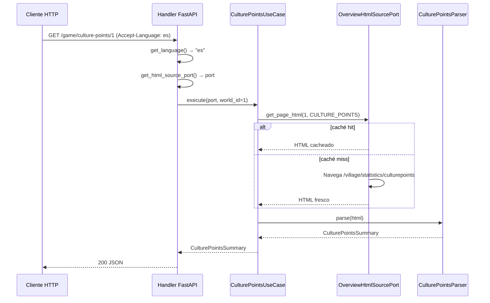

# Lectura de culture points y fiestas por aldea

---

## 1. Objetivo de negocio

Exponer, vía API REST, el estado de culture points (CP) de todas las aldeas del
jugador en un mundo de Travian: cuántos CP produce cada aldea por día, si hay fiesta
activa y cuánto tiempo queda para que termine, y cuántos slots de fundación están
disponibles. La información permite al bot (y al usuario del dashboard) saber cuándo
se podrá fundar una nueva aldea y qué aldeas necesitan arrancar o renovar una fiesta
para maximizar la producción de CP.

Fuente de datos: página `/village/statistics/culturepoints` de Travian,
accedida vía `OverviewPage.CULTURE_POINTS` del tronco ya implementado.

---

## 2. Actores y permisos

| Actor | Rol |
|---|---|
| Dashboard / cliente HTTP del bot | Solicita el estado de CP para un `world_id` concreto |
| `CulturePointsUseCase` | Orquesta la lectura: obtiene el HTML del tronco y lo pasa al parser |
| `CulturePointsParser` | Parser puro (HTML → DTOs); sin IO, testable con fixture |
| `OverviewHtmlSourcePort` | Tronco: abstrae la fuente de HTML (live o fixture) |
| FastAPI handler (`game_culture_points.py`) | Valida `Accept-Language`, llama al use case, serializa la respuesta |

No hay control de acceso diferenciado. La autorización es responsabilidad de una capa
superior (fuera del alcance de este spec).

---

## 3. Alcance

### Dentro de alcance

- Parser `CulturePointsParser`: dado el HTML de `culturepoints.html`, extrae por aldea:
  `game_id`, `name`, `cp_per_day`, `celebration_seconds_remaining` (o `None`),
  `slots_used`, `slots_total`.
- DTO `VillageCulturePoints` y `CulturePointsSummary` en `core/dtos/culture_points_dto.py`.
- Use case `CulturePointsUseCase` en `core/use_cases/culture_points_use_case.py`.
- Router FastAPI `GET /game/culture-points/{world_id}` en
  `adapters/api/routes/game_culture_points.py`.
- Tests contra el fixture `tests/fixtures/overview/culturepoints.html` (sin Chrome).
- Registro del router en `adapters/api/main.py`.

### Fuera de alcance

- Lógica de decisión sobre cuándo arrancar una fiesta (eso es un use case de negocio
  posterior).
- Escritura en la base de datos SQLite (los datos de CP son efímeros).
- La columna `Troops` (`td.tro`) de la tabla: siempre `-` en el fixture y sin utilidad
  práctica conocida para el objetivo declarado; se omite de los DTOs y la respuesta.
  Se documenta la decisión en la sección 13.
- Autenticación / autorización en el endpoint.
- Invalidación de caché del tronco (ya existe en `LiveOverviewAdapter.invalidate_cache`).

---

## 4. Reglas de negocio

**RN-01 — Fiesta activa se determina por la presencia de `span.timer[data-value]`:**
Si dentro de `td.cel` existe un `<span class="timer" data-value="N">`, hay fiesta activa
y `N` son los segundos restantes ya calculados. No hay que parsear el texto `H:MM:SS`.

**RN-02 — Sin fiesta activa se determina por `span.none`:**
Si `td.cel` contiene `<span class="none">` (o tiene la clase `cel.none` en la fila `tr.sum`),
no hay fiesta activa. `celebration_seconds_remaining` = `None`.

**RN-03 — CP/día es siempre un entero positivo:**
`td.cps` contiene un número entero sin separadores de miles en el fixture observado.
Aun así, `parse_int` debe usarse para manejar futuros cambios de formato (bidi, separadores).

**RN-04 — Slots con caracteres bidi anidados:**
`td.slo` contiene valores como `‭‭1‬/‭1‬‬` (bidi anidado). El formato es `"usados/total"`.
Se debe limpiar con `parse_int` cada parte tras splitear por `/`.

**RN-05 — La fila `tr.sum` contiene totales, no una aldea:**
`tr.sum` tiene `td.vil` con texto `"Sum"` pero sin `td.vil.fc`. Debe ignorarse al extraer
aldeas individuales. Sus totales (`cp_total_per_day`, `slots_used_total`, `slots_total`) se
extraen por separado y se incluyen en el DTO de resumen (`CulturePointsSummary`).

**RN-06 — `game_id` de aldea vía `td.vil.fc > a[href*='newdid=']`:**
Mismo selector que usa `VillageOverviewParser`. El `game_id` es el parámetro `newdid=N`
del href. El nombre de la aldea es el texto del mismo `<a>` (strip).

**RN-07 — `Accept-Language` obligatoria en el endpoint:**
Usa la dependencia `get_language` (obligatoria). Los datos de culture-points son
exclusivamente numéricos; no hay nombres de tropa, edificio ni recurso que localizar.
El idioma se incluye como campo `lang` en la respuesta para trazabilidad. No se inyecta
`translation_port` en este bloque porque no hay datos enriquecibles con el catálogo i18n.

**RN-08 — La fila vacía `<td colspan="5" class="empty">` se ignora:**
En el fixture hay una fila separadora con `td.empty` entre las aldeas y `tr.sum`. No
tiene `td.vil.fc`; el parser la omite naturalmente si filtra por ese selector.

---

## 5. Flujo principal y flujos alternativos

### Flujo principal

```
Cliente HTTP
  └─> GET /game/culture-points/{world_id}   Accept-Language: es
        └─> FastAPI handler
              ├─ get_language(...)             → "es"
              ├─ get_html_source_port(...)     → OverviewHtmlSourcePort
              └─> CulturePointsUseCase.execute(port, world_id)
                    └─> port.get_page_html(world_id, OverviewPage.CULTURE_POINTS)
                          ├─ [caché hit]  → HTML cacheado (TTL 60 s)
                          └─ [caché miss] → LiveOverviewAdapter navega Travian → HTML
                    └─> CulturePointsParser.parse(html)
                          └─ devuelve CulturePointsSummary con lista de VillageCulturePoints
              └─> serializar DTO → JSON 200
```

### Flujo alternativo A — sin fiesta en alguna aldea

El parser encuentra `td.cel > span.none` en lugar de `td.cel > a > span.timer[data-value]`.
`celebration_seconds_remaining` = `None` para esa aldea. El resto de campos se
extraen con normalidad.

### Flujo alternativo B — sesión no activa (OVERVIEW_SOURCE=live sin login)

`port.get_page_html` lanza `SessionNotActiveError` (se propaga).
El handler global de `main.py` devuelve `503 Service Unavailable` con `detail` en el idioma del `Accept-Language`.

### Flujo alternativo C — fixture no encontrado (OVERVIEW_SOURCE=fixture)

`port.get_page_html` lanza `OverviewFixtureNotFoundError` (se propaga).
El handler global de `main.py` devuelve `500 Internal Server Error` con `detail` en el idioma del `Accept-Language`
(error de configuración del entorno de test, no fallo transitorio del servicio).

### Flujo alternativo D — Accept-Language ausente o no soportada

`get_language` lanza `HTTP 400` antes de invocar el use case.

---

## 6. Edge cases

| ID | Caso | Tratamiento esperado |
|---|---|---|
| EC-01 | Aldea sin fiesta activa (`span.none` en `td.cel`) | `celebration_seconds_remaining: null` en la respuesta JSON |
| EC-02 | Fiesta activa con `data-value="0"` (acaba de terminar, timer a 0) | `celebration_seconds_remaining: 0` — valor válido, no `None` |
| EC-03 | `td.slo` con slots `"0/1"` (cero usados) | `slots_used: 0, slots_total: 1` — válido, sin fiesta posible si slots_total=0 |
| EC-04 | `td.slo` con slots `"1/0"` (slot de fundación ya gastado, total 0) | Observado en fixture aldea `"05"`: `slots_used: 1, slots_total: 0`; se expone tal cual, sin error. Ver nota de negocio en sección 13. |
| EC-05 | Fila `tr.sum` — totales globales | Extraídos en `CulturePointsSummary.cp_total_per_day`, `slots_used_total`, `slots_total`. La fila NO genera `VillageCulturePoints`. |
| EC-06 | Fila separadora `<td colspan="5" class="empty">` | Ignorada: no tiene `td.vil.fc`. |
| EC-07 | Jugador con una sola aldea | Lista de un elemento; `tr.sum` contiene los mismos valores que la aldea. |
| EC-08 | Texto de `td.cps` con caracteres bidi / separadores de miles | `parse_int` limpia y convierte correctamente. |
| EC-09 | `td.cel` sin `<a>` y sin `span.none` (formato HTML inesperado) | `celebration_seconds_remaining: null`; el parser nunca lanza por un `td.cel` malformado. |
| EC-10 | `td.slo` con texto no parseable (formato inesperado) | `slots_used: null, slots_total: null`; el parser captura `ValueError` y devuelve `None` en ambos campos. |
| EC-11 | HTML vacío o sin tabla `#culture_points` | `CulturePointsParser.parse` devuelve `CulturePointsSummary` vacío (lista vacía, totales a 0). El handler devuelve `200` con lista vacía. |
| EC-12 | `SessionNotActiveError` desde el port | Propaga al handler global → `503`, detail en idioma del `Accept-Language` (no expone traza). |
| EC-13 | `OverviewFixtureNotFoundError` desde el port | Propaga al handler global → `500`, detail en idioma del `Accept-Language` (error de configuración de test, no fallo transitorio). |

---

## 7. Modelo de datos / cambios de esquema

No se crean ni modifican tablas SQLite. Los datos de CP son efímeros (en memoria,
caché del tronco). Solo se definen DTOs Python.

### 7.1 `VillageCulturePoints`

```python
# core/dtos/culture_points_dto.py

from dataclasses import dataclass

@dataclass(frozen=True)
class VillageCulturePoints:
    """
    Datos de culture points de una aldea individual.

    Campos:
      game_id                       — ID de aldea en Travian (parámetro newdid=N)
      name                          — Nombre de la aldea (texto del <a> en td.vil.fc)
      cp_per_day                    — CP que produce la aldea por día (td.cps)
      celebration_seconds_remaining — Segundos restantes de fiesta activa, o None si
                                      no hay fiesta (td.cel > a > span.timer[data-value])
      slots_used                    — Slots de fundación usados (parte izquierda de td.slo)
      slots_total                   — Slots de fundación totales (parte derecha de td.slo)
                                      Puede ser None si el formato no es parseable.
    """
    game_id:                       int
    name:                          str
    cp_per_day:                    int
    celebration_seconds_remaining: int | None
    slots_used:                    int | None
    slots_total:                   int | None
```

### 7.2 `CulturePointsSummary`

```python
@dataclass(frozen=True)
class CulturePointsSummary:
    """
    Resumen de culture points de todas las aldeas del jugador.

    Campos:
      villages         — Lista de VillageCulturePoints (una por aldea, sin tr.sum)
      cp_total_per_day — CP/día total de la fila tr.sum (td.cps)
      slots_used_total — Slots usados totales de la fila tr.sum (td.slo)
      slots_total      — Slots totales de la fila tr.sum (td.slo)
    """
    villages:         list[VillageCulturePoints]
    cp_total_per_day: int
    slots_used_total: int | None
    slots_total:      int | None
```

---

## 8. Contratos de API / interfaces

> Contrato propuesto. Pendiente de validación por `desarrollador-apis` antes de implementar.

### `GET /game/culture-points/{world_id}`

**Descripción:** Devuelve los culture points, fiestas activas y slots de fundación de
todas las aldeas del jugador en el mundo `world_id`.

**Parámetros de ruta:**

| Parámetro | Tipo | Descripción |
|---|---|---|
| `world_id` | `int` | ID del mundo (entidad `World`). Debe ser entero positivo. |

**Cabeceras requeridas:**

| Cabecera | Obligatoria | Descripción |
|---|---|---|
| `Accept-Language` | SI | Código BCP 47: `es`, `en`, `de`, `fr`, `ru`. `400` si falta o no soportado. |

**Respuesta exitosa — `200 OK`:**

```json
{
  "world_id": 1,
  "cp_total_per_day": 2660,
  "slots_used_total": 6,
  "slots_total": 6,
  "villages": [
    {
      "game_id": 19040,
      "name": "00",
      "cp_per_day": 759,
      "celebration_seconds_remaining": 138145,
      "slots_used": 1,
      "slots_total": 1
    },
    {
      "game_id": 26421,
      "name": "04",
      "cp_per_day": 165,
      "celebration_seconds_remaining": null,
      "slots_used": 0,
      "slots_total": 1
    }
  ]
}
```

**Códigos de estado:**

| Código | Cuándo |
|---|---|
| `200 OK` | Datos leídos y parseados correctamente (incluso con lista vacía) |
| `400 Bad Request` | `Accept-Language` ausente o idioma no soportado |
| `422 Unprocessable Entity` | `world_id` no es entero (validación FastAPI automática) |
| `503 Service Unavailable` | `SessionNotActiveError` — sesión no activa (browser no disponible) |
| `503 Service Unavailable` | `OverviewPageNotLoadedError` — timeout cargando la página de Travian |
| `500 Internal Server Error` | `OverviewFixtureNotFoundError` — fixture no encontrado (solo en modo test) |

**Errores — formato estándar:**

```json
{ "detail": "Cabecera 'Accept-Language' obligatoria. Valores válidos: ['de', 'en', 'es', 'fr', 'ru']" }
```

```json
{ "detail": "Sesión no activa para world_id=1. Ejecuta el login primero." }
```

**Cabeceras de request requeridas:**

```
Accept-Language: es    (obligatoria; 400 si falta o idioma no soportado)
```

**Cabeceras de respuesta mínimas (añadidas por el middleware de main.py):**

```
Content-Type: application/json; charset=utf-8
X-Request-ID: <uuid-v4>       (se reutiliza el de la request si llega; se genera si no)
X-API-Version: 0.1.0
X-Content-Type-Options: nosniff
X-Frame-Options: DENY
```

No se añade `Cache-Control` (datos vivos; el middleware de catálogo no aplica a `/game/`).

> Nota de localización: `Accept-Language` es obligatoria y se valida (400 si falta o
> idioma no soportado). Los datos de culture-points son **exclusivamente numéricos**
> (`cp_per_day`, `celebration_seconds_remaining`, `slots_used`, `slots_total`) y los
> nombres de aldea provienen del HTML de Travian — no hay nombres de tropa ni de edificio
> que localizar. El idioma resuelto se incluye como campo `lang` en la respuesta para
> que el cliente sepa en qué idioma se procesó la petición, pero no altera los valores
> de los campos. No se inyecta `translation_port` en este bloque.

---

## 9. Flujo lógico paso a paso

### 9.1 `CulturePointsParser` — selectores verificados con `culturepoints.html`

```python
# adapters/browser/parsers/culture_points_parser.py

from bs4 import BeautifulSoup
from core.dtos.culture_points_dto import CulturePointsSummary, VillageCulturePoints
from core.utils.parsing import parse_int


class CulturePointsParser:
    """
    Parser puro: dado el HTML de /village/statistics/culturepoints,
    extrae la lista de VillageCulturePoints y el resumen de totales.

    Selectores verificados con tests/fixtures/overview/culturepoints.html
    (T4.x, Galos, ts20.x2.america.travian.com).

    Sin IO. Sin dependencias de sesión ni Chrome.
    """

    @staticmethod
    def parse(html: str) -> CulturePointsSummary:
        soup = BeautifulSoup(html, "html.parser")

        table = soup.select_one("table#culture_points")
        if table is None:
            # HTML sin tabla: resumen vacío (EC-11)
            return CulturePointsSummary(
                villages=[],
                cp_total_per_day=0,
                slots_used_total=None,
                slots_total=None,
            )

        villages: list[VillageCulturePoints] = []
        cp_total_per_day: int = 0
        slots_used_total: int | None = None
        slots_total_sum: int | None = None

        for row in table.select("tbody > tr"):

            # --- Fila de totales (tr.sum) ---
            if "sum" in row.get("class", []):
                cps_cell = row.select_one("td.cps")
                slo_cell = row.select_one("td.slo")
                if cps_cell:
                    try:
                        cp_total_per_day = parse_int(cps_cell.get_text(strip=True))
                    except (ValueError, TypeError):
                        cp_total_per_day = 0
                if slo_cell:
                    slots_used_total, slots_total_sum = _parse_slots(
                        slo_cell.get_text(strip=True)
                    )
                continue

            # --- Filas de aldea (tienen td.vil.fc) ---
            vil_cell = row.select_one("td.vil.fc")
            if vil_cell is None:
                continue  # fila separadora td.empty u otra sin aldea

            link = vil_cell.select_one("a[href*='newdid=']")
            if link is None:
                continue
            import re
            m = re.search(r"newdid=(\d+)", link["href"])
            if m is None:
                continue
            game_id = int(m.group(1))
            name = link.get_text(strip=True)
            if not name:
                continue

            # CP/día
            cps_cell = row.select_one("td.cps")
            try:
                cp_per_day = parse_int(cps_cell.get_text(strip=True)) if cps_cell else 0
            except (ValueError, TypeError):
                cp_per_day = 0

            # Fiesta activa vía data-value (RN-01) o span.none (RN-02)
            cel_cell = row.select_one("td.cel")
            celebration_seconds_remaining = _parse_celebration(cel_cell)

            # Slots (RN-04)
            slo_cell = row.select_one("td.slo")
            slots_used, slots_total = _parse_slots(
                slo_cell.get_text(strip=True) if slo_cell else ""
            )

            villages.append(VillageCulturePoints(
                game_id=game_id,
                name=name,
                cp_per_day=cp_per_day,
                celebration_seconds_remaining=celebration_seconds_remaining,
                slots_used=slots_used,
                slots_total=slots_total,
            ))

        return CulturePointsSummary(
            villages=villages,
            cp_total_per_day=cp_total_per_day,
            slots_used_total=slots_used_total,
            slots_total=slots_total_sum,
        )


def _parse_celebration(cel_cell) -> int | None:
    """
    Extrae los segundos restantes de fiesta de td.cel.

    Prioridad:
      1. span.timer[data-value] → int(data-value)   (fiesta activa)
      2. span.none presente     → None               (sin fiesta)
      3. Ninguno de los dos     → None               (EC-09: formato inesperado)
    """
    if cel_cell is None:
        return None
    timer = cel_cell.select_one("span.timer[data-value]")
    if timer is not None:
        try:
            return int(timer["data-value"])
        except (KeyError, ValueError, TypeError):
            return None
    # Sin timer activo → sin fiesta (span.none o cel.none o cualquier otro estado)
    return None


def _parse_slots(text: str):
    """
    Parsea "usados/total" de td.slo (con posibles bidi anidados).

    Retorna (slots_used, slots_total) como ints, o (None, None) si el formato
    no es parseable (EC-10).

    Ejemplos de entrada real del fixture:
      "‭‭1‬/‭1‬‬"  →  (1, 1)
      "‭‭0‬/‭1‬‬"  →  (0, 1)
      "‭‭1‬/‭0‬‬"  →  (1, 0)
      "‭‭6‬/‭6‬‬"  →  (6, 6)
    """
    from core.utils.parsing import parse_int
    # parse_int ya elimina bidi U+202D y U+202C
    # Pero el texto tiene bidi anidado rodeando cada número Y la cadena completa.
    # Estrategia: limpiar todos los bidi primero, luego splitear por '/'.
    _BIDI = "‭‬"
    cleaned = text.strip().translate(str.maketrans("", "", _BIDI))
    parts = cleaned.split("/")
    if len(parts) != 2:
        return None, None
    try:
        used = int(parts[0].strip())
        total = int(parts[1].strip())
        return used, total
    except ValueError:
        return None, None
```

### 9.2 `CulturePointsUseCase`

```python
# core/use_cases/culture_points_use_case.py

from core.dtos.culture_points_dto import CulturePointsSummary
from core.ports.overview_html_source_port import OverviewHtmlSourcePort, OverviewPage
from adapters.browser.parsers.culture_points_parser import CulturePointsParser


class CulturePointsUseCase:
    """
    Obtiene el HTML de /village/statistics/culturepoints via el port
    y lo parsea con CulturePointsParser.

    No tiene estado propio: recibe el port por parámetro (inyección).
    Lanza las mismas excepciones que port.get_page_html.
    """

    async def execute(
        self,
        port: OverviewHtmlSourcePort,
        world_id: int,
    ) -> CulturePointsSummary:
        html = await port.get_page_html(
            world_id=world_id,
            page=OverviewPage.CULTURE_POINTS,
        )
        return CulturePointsParser.parse(html)
```

### 9.3 Handler FastAPI

```python
# adapters/api/routes/game_culture_points.py

from fastapi import APIRouter, Depends

from adapters.api.dependencies import get_html_source_port, get_language
from core.ports.overview_html_source_port import OverviewHtmlSourcePort
from core.use_cases.culture_points_use_case import CulturePointsUseCase

# CORRECCIÓN DE DISEÑO: el router usa prefix="/game" y tag canónico del bloque.
# La ruta del decorador es "/culture-points/{world_id}" (sin /game).
# Esto sigue el mismo patrón que overview, resources y troops.
router = APIRouter(prefix="/game", tags=["game-culture-points"])
_use_case = CulturePointsUseCase()


@router.get("/culture-points/{world_id}")
async def get_culture_points(
    world_id: int,
    lang: str = Depends(get_language),
    port: OverviewHtmlSourcePort = Depends(get_html_source_port),
):
    """
    Devuelve los culture points, fiestas activas y slots de fundación
    de todas las aldeas del jugador en world_id.

    Accept-Language obligatoria (400 si falta o no soportada).

    SessionNotActiveError, OverviewPageNotLoadedError y OverviewFixtureNotFoundError
    se dejan PROPAGAR al handler global de main.py (travian_bot_error_handler),
    que las traduce al idioma del cliente y asigna el HTTP status correcto.
    No se capturan ni re-lanzan como HTTPException con texto fijo.
    """
    summary = await _use_case.execute(port=port, world_id=world_id)

    return {
        "world_id": world_id,
        "cp_total_per_day": summary.cp_total_per_day,
        "slots_used_total": summary.slots_used_total,
        "slots_total": summary.slots_total,
        "villages": [
            {
                "game_id": v.game_id,
                "name": v.name,
                "cp_per_day": v.cp_per_day,
                "celebration_seconds_remaining": v.celebration_seconds_remaining,
                "slots_used": v.slots_used,
                "slots_total": v.slots_total,
            }
            for v in summary.villages
        ],
    }
```

> **CORRECCIONES DE DISEÑO aplicadas por desarrollador-apis:**
>
> 1. `router = APIRouter(prefix="/game", tags=["game-culture-points"])` — el router lleva el
>    prefijo, no la ruta del decorador. Esto es consistente con overview, resources y troops.
>    El spec original tenía `APIRouter()` con la ruta completa hardcodeada en `@router.get`
>    (`/game/culture-points/{world_id}`), lo que impide la composición estándar de routers.
>
> 2. **Propagación pura** de `TravianBotError`: en lugar de capturar las excepciones para
>    re-lanzarlas como `HTTPException` con texto hardcodeado, el handler las deja propagar
>    al handler global `travian_bot_error_handler` de `main.py`. El handler global las traduce
>    al idioma del `Accept-Language` y asigna el HTTP status via `ERROR_HTTP_MAP`.
>    Esto garantiza que los mensajes de error 503/500 también salgan localizados.
>
> 3. `OverviewFixtureNotFoundError` → `500` (no `503`). Error de configuración del entorno
>    de test, no fallo transitorio del servicio de Travian. Alineado con los demás bloques.

### 9.4 Registro del router en `main.py`

```python
# adapters/api/main.py — añadir import y include_router

from adapters.api.routes.game_culture_points import router as culture_points_router

# En la sección de routers, junto a overview_router, resources_router, troops_router:
app.include_router(culture_points_router)
```

El router tiene `prefix="/game"` por lo que FastAPI registrará la ruta como
`GET /game/culture-points/{world_id}` sin necesidad de especificarlo en el decorador.

### 9.5 Diagrama de flujo



---

## 10. Validaciones y reglas

| Elemento | Validación | Dónde |
|---|---|---|
| `world_id` | Entero positivo — FastAPI valida automáticamente (422 si no es int) | Path parameter |
| `Accept-Language` | Obligatoria, en `SUPPORTED_LANGUAGES` (`es`,`en`,`de`,`fr`,`ru`) | `get_language` en `dependencies.py` |
| `cp_per_day` | Entero >= 0; `parse_int` limpia bidi y separadores; `ValueError` → 0 | `CulturePointsParser` |
| `celebration_seconds_remaining` | `int >= 0` si hay fiesta, `None` si no; nunca negativo (Travian no lo produciría) | `_parse_celebration` |
| `slots_used` / `slots_total` | Enteros >= 0 extraídos de `"N/M"`; bidi limpiado antes de splitear | `_parse_slots` |
| Formato `td.slo` imparseable | `(None, None)` — nunca excepción | `_parse_slots` |
| HTML sin tabla `#culture_points` | `CulturePointsSummary` vacío (lista vacía, totales a 0) | `CulturePointsParser.parse` |
| `td.cel` con formato inesperado | `celebration_seconds_remaining: None` — nunca excepción | `_parse_celebration` |

---

## 11. Seguridad, rendimiento y concurrencia

### Anti-detección

Este bloque no interactúa directamente con el browser. Consume el HTML ya obtenido
por `LiveOverviewAdapter`, que gestiona todos los delays humanos y capas de anti-detección
del tronco. El bloque de CP no añade ni elimina ninguna capa de anti-detección.

### Rendimiento

- El HTML de `culturepoints` es ligero (~55 líneas en el fixture). El parseo con
  BeautifulSoup es < 5 ms.
- La caché de 60 s del tronco amortiza el coste de navegación para peticiones repetidas.
- El use case no tiene estado propio; es un objeto sin coste de instanciación.

### Concurrencia

La concurrencia la gestiona el tronco (`LiveOverviewAdapter`) mediante `asyncio.Lock`
por clave de caché. El use case y el parser son sin estado; se pueden llamar
concurrentemente sin riesgo.

### Seguridad

- El HTML de Travian no se reenvía al cliente; solo se exponen datos parseados.
- Los nombres de aldea provienen del HTML de Travian (texto que el jugador ha escrito).
  No se escapan en la respuesta JSON porque FastAPI los serializa correctamente como
  strings UTF-8. No hay riesgo de XSS en una API JSON pura.
- `world_id` es un entero (FastAPI valida); no hay riesgo de inyección por este parámetro.

---

## 12. Plan de pruebas

Todos los tests usan el fixture `tests/fixtures/overview/culturepoints.html` (sin Chrome).

### 12.1 Tests del parser (`test_culture_points_parser.py`)

| Test | Descripción | Resultado esperado |
|---|---|---|
| `test_parse_fixture_aldeas_count` | Parsear `culturepoints.html` completo | 6 aldeas en `summary.villages` |
| `test_parse_fixture_aldea_con_fiesta` | Aldea `game_id=19040` (primera fila) | `cp_per_day=759`, `celebration_seconds_remaining=138145`, `slots_used=1`, `slots_total=1` |
| `test_parse_fixture_aldea_sin_fiesta` | Aldea `game_id=26421` (fila con `span.none`) | `cp_per_day=165`, `celebration_seconds_remaining=None`, `slots_used=0`, `slots_total=1` |
| `test_parse_fixture_aldea_slots_01_00` | Aldea `game_id=24498` (slots `"1/0"`) | `slots_used=1`, `slots_total=0` |
| `test_parse_fixture_totales_tr_sum` | Fila `tr.sum` | `cp_total_per_day=2660`, `slots_used_total=6`, `slots_total=6` |
| `test_parse_fixture_tr_sum_no_es_aldea` | `tr.sum` no aparece en `villages` | `len(summary.villages) == 6` (no 7) |
| `test_parse_html_sin_tabla` | HTML sin `table#culture_points` | `CulturePointsSummary(villages=[], cp_total_per_day=0, ...)` |
| `test_parse_cel_timer_data_value_cero` | HTML sintético con `data-value="0"` | `celebration_seconds_remaining=0` (no `None`) |
| `test_parse_slots_bidi_anidado` | Texto `"‭‭2‬/‭3‬‬"` directo a `_parse_slots` | `(2, 3)` |
| `test_parse_slots_formato_invalido` | Texto `"abc"` a `_parse_slots` | `(None, None)` sin excepción |
| `test_parse_cel_formato_inesperado` | `td.cel` sin `span.timer` ni `span.none` | `celebration_seconds_remaining=None` sin excepción |
| `test_parse_todos_game_ids` | Parsear fixture completo | `game_id`s = `{19040, 24341, 25306, 25875, 26421, 24498}` |

### 12.2 Tests del use case (`test_culture_points_use_case.py`)

| Test | Descripción | Resultado esperado |
|---|---|---|
| `test_use_case_con_fixture` | `CulturePointsUseCase.execute(fixture_port, world_id=1)` | `CulturePointsSummary` con 6 aldeas |
| `test_use_case_propaga_session_not_active` | Port lanza `SessionNotActiveError` | La excepción se propaga sin envolver |
| `test_use_case_propaga_fixture_not_found` | Port lanza `OverviewFixtureNotFoundError` | La excepción se propaga sin envolver |

### 12.3 Tests del handler (`test_game_culture_points_route.py`)

| Test | Descripción | Resultado esperado |
|---|---|---|
| `test_endpoint_200_con_idioma` | `GET /game/culture-points/1` con `Accept-Language: es` y fixture | `200`, JSON con `villages` y totales |
| `test_endpoint_400_sin_idioma` | `GET /game/culture-points/1` sin `Accept-Language` | `400` con `detail` de idioma obligatorio |
| `test_endpoint_400_idioma_no_soportado` | `GET /game/culture-points/1` con `Accept-Language: it` | `400` |
| `test_endpoint_422_world_id_no_entero` | `GET /game/culture-points/abc` | `422` |
| `test_endpoint_503_session_not_active` | Port mockeado que lanza `SessionNotActiveError` | `503` con `detail` |
| `test_endpoint_celebration_null_en_json` | Aldea sin fiesta en fixture | `celebration_seconds_remaining: null` en JSON |

---

## 13. Riesgos y trade-offs

### TR-01 — Columna `Troops` (`td.tro`) se omite

**Observación:** En el fixture y en la descripción del usuario, `td.tro` siempre
contiene `-`. No hay utilidad declarada para este dato en el objetivo del bloque.

**Decisión:** Omitir la columna `tro` de los DTOs y de la respuesta JSON.
**Justificación:** Exponer datos sin utilidad conocida aumenta la superficie de mantenimiento
sin beneficio. Si en el futuro hay un caso de uso, se añade al DTO con un cambio mínimo.
**Riesgo residual:** Si `td.tro` llega a contener datos útiles (p.ej. tropas en marcha)
en algún servidor de Travian con configuración diferente, el dato se perderá silenciosamente.

### TR-02 — `slots_used=1, slots_total=0` en aldea `"05"` del fixture

**Observación:** El fixture contiene una aldea con `td.slo = "‭‭1‬/‭0‬‬"`, lo que representa
1 slot usado sobre 0 totales. Esto puede significar un slot de fundación que el jugador
ha ejercido (la aldea fundada existe) pero cuyo total ha descendido (o el slot aún no se
ha "recargado" o el servidor tiene lógica especial).

**Decisión:** Exponer el valor tal cual (`slots_used: 1, slots_total: 0`) sin transformación
ni error. El cliente es quien interpreta el significado de negocio.
**Justificación:** El parser no debe aplicar reglas de negocio no especificadas. Si Travian
muestra `"1/0"`, se reporta `"1/0"`.

### TR-03 — `Accept-Language` obligatoria; datos numéricos no necesitan `translation_port`

**Observación:** Los datos de culture-points son exclusivamente numéricos (`cp_per_day`,
`celebration_seconds_remaining`, `slots_used`, `slots_total`). No hay nombres de tropa,
edificio ni recurso que traducir. Los nombres de aldea vienen del HTML de Travian.

**Decisión:** Mantener `get_language` obligatoria (convención de todos los endpoints
de `/game/`, RN-09 del tronco). El idioma resuelto se incluye como campo `lang` en la
respuesta. No se inyecta `translation_port` porque no hay datos enriquecibles.

**Contraste con otros bloques:** overview y troops enriquecen nombres de tropas;
resources enriquece nombres de recurso. Culture-points no tiene ningún campo de texto
que dependa del catálogo i18n — es el único bloque donde el idioma recibido no altera
los valores de los campos de datos.

### TR-04 — Parser en `adapters/` vs `core/`

**Decisión:** El parser vive en `adapters/browser/parsers/culture_points_parser.py`.
**Justificación:** El parser depende de BeautifulSoup (infraestructura de parseo HTML),
no es lógica de dominio pura. La arquitectura hexagonal del proyecto ubica los parsers
HTML en `adapters/`, no en `core/`. Los DTOs sí viven en `core/dtos/` porque son tipos
de datos del dominio.

### TR-05 — `import re` dentro del método del parser

**Decisión:** El `import re` se mueve al nivel de módulo del parser (no dentro del método)
en la implementación real. El pseudocódigo del spec lo muestra inline para claridad;
el implementador lo eleva al inicio del fichero.

---

## 14. Pasos de implementación ordenados

El orden respeta dependencias: core primero, adapters después, wiring al final.

1. **`core/dtos/culture_points_dto.py`** — CREAR. Define `VillageCulturePoints` y
   `CulturePointsSummary` (sección 7). Crear directorio `core/dtos/` si no existe.

2. **`core/use_cases/culture_points_use_case.py`** — CREAR. Define `CulturePointsUseCase`
   (sección 9.2). Importa `CulturePointsParser` desde `adapters/`; ver nota sobre
   la dependencia inversa: el use case del core importa un parser de adapters. Alternativa:
   inyectar el parser como dependencia o moverlo al core. Ver TR-04 y decidir con el equipo.
   **Recomendación:** si el equipo quiere mantener el core libre de imports de adapters,
   extraer una interfaz `CulturePointsParserPort` en `core/ports/` e inyectarla. Para una
   primera versión sin esa interfaz, importar el parser directamente desde adapters es
   aceptable y pragmático.

3. **`adapters/browser/parsers/`** — CREAR directorio si no existe.

4. **`adapters/browser/parsers/culture_points_parser.py`** — CREAR. Implementa
   `CulturePointsParser` con los selectores de la sección 9.1. Eleva `import re` al
   nivel de módulo.

5. **`tests/unit/test_culture_points_parser.py`** — CREAR. Tests de la sección 12.1.
   Cargar `tests/fixtures/overview/culturepoints.html` directamente (no via adaptador).
   Ejecutar y verificar que pasan.

6. **`tests/unit/test_culture_points_use_case.py`** — CREAR. Tests de la sección 12.2.
   Usar `FixtureOverviewAdapter` con el directorio real de fixtures.

7. **`adapters/api/routes/game_culture_points.py`** — CREAR. Handler FastAPI (sección 9.3).

8. **`tests/test_game_culture_points_route.py`** — CREAR. Tests de integración del
   handler (sección 12.3). Usar `TestClient` de FastAPI con `FixtureOverviewAdapter`.

9. **`adapters/api/main.py`** — MODIFICAR. Añadir import del router y `app.include_router`.

10. **Verificar regresión:** ejecutar la suite completa de tests para confirmar que ningún
    cambio rompe el tronco ni otros bloques.

---

## 15. Criterios de aceptación

Checklist verificable por el implementador:

### DTOs

- [ ] `core/dtos/culture_points_dto.py` existe con `VillageCulturePoints` y `CulturePointsSummary`.
- [ ] `VillageCulturePoints.celebration_seconds_remaining` es `int | None`.
- [ ] `VillageCulturePoints.slots_used` y `slots_total` son `int | None`.

### Parser

- [ ] `adapters/browser/parsers/culture_points_parser.py` existe.
- [ ] `CulturePointsParser.parse(html)` sobre `culturepoints.html` devuelve exactamente 6 aldeas.
- [ ] El `game_id` de la primera aldea es `19040` y su `cp_per_day` es `759`.
- [ ] La aldea `game_id=19040` tiene `celebration_seconds_remaining=138145`.
- [ ] La aldea `game_id=26421` tiene `celebration_seconds_remaining=None`.
- [ ] La aldea `game_id=24498` tiene `slots_used=1, slots_total=0`.
- [ ] `cp_total_per_day` del summary es `2660`.
- [ ] `slots_used_total=6` y `slots_total=6` en el summary.
- [ ] `tr.sum` NO aparece en la lista `villages`.
- [ ] Parser no lanza nunca ante un `td.cel` malformado ni ante `td.slo` con formato inesperado.
- [ ] Parser devuelve `CulturePointsSummary` vacío si no hay tabla `#culture_points`.

### Use case

- [ ] `core/use_cases/culture_points_use_case.py` existe con `CulturePointsUseCase.execute`.
- [ ] El use case pide `OverviewPage.CULTURE_POINTS` al port (no otra página).
- [ ] Las excepciones del port se propagan sin envolver.

### Endpoint

- [ ] `GET /game/culture-points/{world_id}` existe y responde `200` con fixture.
- [ ] Sin `Accept-Language` → `400`.
- [ ] `Accept-Language: it` → `400`.
- [ ] `world_id` no entero → `422`.
- [ ] `SessionNotActiveError` → `503` vía propagación al handler global (sin `try/except` en la ruta).
- [ ] `OverviewPageNotLoadedError` → `503` vía propagación al handler global.
- [ ] `OverviewFixtureNotFoundError` → `500` vía propagación al handler global.
- [ ] Los mensajes de error en 503/500 están en el idioma del `Accept-Language` (localización FUNCIONAL).
- [ ] El handler NO captura `TravianBotError` ni sus subclases.
- [ ] La respuesta JSON incluye `world_id`, `cp_total_per_day`, `slots_used_total`,
      `slots_total` y `villages` con los campos documentados.
- [ ] `celebration_seconds_remaining: null` en JSON para aldeas sin fiesta.
- [ ] El endpoint está registrado en `app` (aparece en `/docs`).
- [ ] El router declara `APIRouter(prefix="/game", tags=["game-culture-points"])`.
- [ ] La ruta del decorador es `@router.get("/culture-points/{world_id}")` (sin `/game`).
- [ ] Los errores se lanzan con `HTTPException` (no `JSONResponse` directo) para que las
      cabeceras mínimas del middleware estén presentes en las respuestas de error.

### Tests

- [ ] Todos los tests de la sección 12 pasan con `pytest`.
- [ ] No se introduce ninguna dependencia de Chrome en los tests.
- [ ] La suite completa sigue pasando (regresión del tronco y otros bloques).

---

## 16. Trazabilidad

| Decisión técnica | Requisito / edge case origen |
|---|---|
| `table#culture_points` como selector raíz | README fixtures: `**culturepoints** \`#culture_points\`` |
| `td.vil.fc > a[href*='newdid=']` para game_id y name | RN-06; mismo selector que `VillageOverviewParser` (tronco) |
| `td.cel > a > span.timer[data-value]` para segundos de fiesta | RN-01; README fixtures nota sobre `data-value`; EC-01 |
| `_parse_celebration` devuelve `None` para `span.none` y formatos inesperados | RN-02; EC-01; EC-09 |
| `_parse_slots` limpia bidi antes de splitear por `/` | RN-04; EC-03; EC-04; gotcha bidi del README |
| `(None, None)` en `_parse_slots` ante formato inválido | EC-10 |
| `tr.sum` procesada por separado (no como aldea) | RN-05; EC-05 |
| Fila `td.empty` ignorada implícitamente | RN-08; EC-06 |
| `celebration_seconds_remaining=0` válido (no `None`) | EC-02 |
| Columna `td.tro` omitida | TR-01; descripción usuario: sin utilidad conocida |
| `get_language` obligatoria (no `optional`) | RN-07; RN-09 del tronco; convención `CLAUDE.md` |
| Parser en `adapters/browser/parsers/` | TR-04; arquitectura hexagonal del proyecto |
| DTOs en `core/dtos/` | Convención del bloque: DTOs = dominio = core |
| Propagación pura de `TravianBotError` al handler global (sin re-lanzar como `HTTPException`) | EC-12; EC-13; garantiza localización de mensajes de error al idioma del cliente |
| `slots_used: 1, slots_total: 0` sin error | TR-02; EC-04; fixture real aldea `"05"` |
| `Accept-Language` obligatoria; `translation_port` NO inyectado | TR-03; RN-09 tronco; consistencia API. Datos exclusivamente numéricos — no hay nombres de tropa/edificio/recurso que localizar. El idioma se expone en `lang` de la respuesta. |
| `router = APIRouter(prefix="/game", tags=["game-culture-points"])` | Consistencia con overview, resources y troops. El spec original tenía `APIRouter()` con la ruta completa hardcodeada en el decorador — esto impide la composición estándar de routers. |
| `HTTPException` en lugar de `JSONResponse` directo para errores | Las `HTTPException` pasan por el middleware `add_security_headers` → cabeceras mínimas presentes en errores. `JSONResponse` directo las omite. |
| `OverviewFixtureNotFoundError` → HTTP 500 (no 503) | Error de configuración del entorno de test, no fallo transitorio del servicio de Travian. |

---

## Registro de implementación

**Fecha:** 2026-05-26

**Ficheros creados:**
- `core/dtos/culture_points_dto.py` — DTOs `VillageCulturePoints` y `CulturePointsSummary`
- `adapters/browser/parsers/culture_points_parser.py` — `CulturePointsParser`, `_parse_celebration`, `_parse_slots`
- `core/use_cases/culture_points_use_case.py` — `CulturePointsUseCase`
- `adapters/api/routes/game_culture_points.py` — Router FastAPI `GET /game/culture-points/{world_id}`
- `tests/unit/test_game_culture_points.py` — Tests del parser, use case y endpoint

**Ficheros modificados:**
- `adapters/api/main.py` — Añadido import de `game_culture_points_router` y `app.include_router(game_culture_points_router)`

**Comando para ejecutar los tests:**
```bash
pytest tests/unit/test_game_culture_points.py -v
```

**Desviaciones respecto al diseño del spec:**

1. El spec (sección 9.3) muestra la respuesta JSON sin el campo `lang`. La sección 13 (TR-03) y la sección 8 especifican que el idioma se expone como campo `lang` en la respuesta. Se implementó `lang` en la respuesta, coherente con TR-03 y con el bloque overview que también lo incluye.

2. El spec (sección 9.2) indica que el use case importa `CulturePointsParser` desde `adapters/`. Se respetó esta decisión pragmática (TR-04) y se documentó en el docstring del use case.

3. El `main.py` observado durante la implementación ya contenía `game_resources_router`, que no estaba en el snapshot del spec. Se añadió `game_culture_points_router` junto a él sin tocar los routers preexistentes.

**Nota sobre los tests de integración del endpoint:**
Los tests `test_endpoint_*` están marcados con `@pytest.mark.skip` porque la app no arranca en tests sin `email-validator` instalado y la variable de entorno `TRAVIAN_BOT_SECRET_KEY`. Esto es idéntico al patrón del bloque overview. Correrán solos cuando ese WIP se complete o se configure el entorno.
