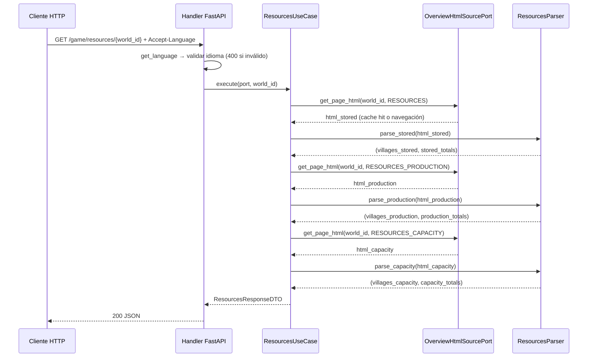

# Lectura de resources — almacenado, producción y capacidad

---

## 1. Objetivo de negocio

Exponer via API los datos de recursos de todas las aldeas de un jugador de Travian, leídos
en tiempo real (o desde caché TTL) a partir de las tres pestañas de `/village/statistics/resources`.
El bloque cubre:

1. **Almacenado** — cantidad actual de cada recurso guardada en cada aldea, totales y mercaderes.
2. **Producción** — producción **bruta** por hora de cada recurso por aldea y totales.
   (IMPORTANTE: es producción bruta; NO resta el consumo de cereal del ejército.
   La producción de cereal mostrada puede ser menor que el consumo real del ejército —
   esto es correcto y esperado; el bot nunca compensa esa diferencia en este bloque.)
3. **Capacidad** — capacidad máxima del almacén y del granero por aldea y totales.

El consumidor principal es el propio bot (decisiones de envío de mercaderes, planificación
de construcción). Un consumidor secundario es el dashboard React para visualización.

---

## 2. Actores y permisos

| Actor | Rol |
|---|---|
| Bot (use cases internos) | Consume el endpoint para tomar decisiones de juego |
| Dashboard React | Consume el endpoint para mostrar el estado de recursos al usuario |
| `OverviewHtmlSourcePort` | Abstrae la fuente de HTML (vivo vs fixture) |
| `LiveOverviewAdapter` | Navega Travian con Chrome autenticado (producción) |
| `FixtureOverviewAdapter` | Devuelve HTML desde fichero (tests) |
| `ResourcesUseCase` | Orquesta la llamada al port y la aplicación de parsers |
| `ResourcesParser` | Parser puro HTML → datos estructurados (sin dependencia del browser) |

No hay control de acceso diferenciado. La autorización es responsabilidad de capas superiores.

---

## 3. Alcance

### Dentro de alcance

- Parser `adapters/browser/parsers/resources_parser.py` para las tres páginas.
- DTOs en `core/dtos/resources_dto.py`.
- Use case `core/use_cases/resources_use_case.py`.
- Router FastAPI `adapters/api/routes/game_resources.py`.
- Tests contra los tres fixtures HTML reales (sin Chrome).

### Fuera de alcance

- Pestaña warehouse % (calculable del cociente almacenado/capacidad — se omite por diseño).
- Lectura de recursos individuales por aldea vía página de aldea (no existe como vista agregada).
- Persistencia de los datos en SQLite (los datos son efímeros; la caché vive en el adaptador).
- Lógica de decisión (cuándo enviar mercaderes, cuándo construir) — son use cases distintos.
- La relación entre producción de cereal y consumo del ejército es visible en otras pestañas
  (troops) — este bloque solo lee la producción bruta.

---

## 4. Reglas de negocio

**RN-01 — Producción es BRUTA:**
Los valores de `td.lum/clay/iron/crop` en `table#production` son producción bruta por hora.
No restan el consumo de cereal del ejército. El bot y el dashboard deben mostrar y almacenar
este valor como bruto, con documentación clara.

**RN-02 — Mercaderes: formato "libres/totales":**
El texto de mercaderes en cada aldea (ej: "14/14", "9/12", "0/0") es la cantidad de
mercaderes libres (disponibles para enviar) sobre el total de mercaderes de esa aldea.
En la fila `tr.sum` el valor representa el total de libres/totales globales (ej: "37/40").
La lógica de parseo debe separar estos dos enteros.

**RN-03 — Fila `tr.sum` es siempre la última fila de datos:**
Siempre existe exactamente una `tr.sum` por tabla. Aparece tras una fila `tr` vacía
con clase `empty` (separador visual). El parser la identifica exclusivamente por la clase
`sum`, no por posición ordinal.

**RN-04 — El índice de aldeas no se extrae de estas páginas:**
El `game_id` de cada aldea se lee del `href` en `td.vil.fc > a[href*="newdid="]`.
El nombre de la aldea también viene de ese `<a>`. No se reutiliza el `VillageMapUseCase`
para correlacionar filas: cada parser lee `game_id` y `name` directamente de la fila.

**RN-05 — Separadores de miles y caracteres bidi:**
Todos los números vienen con caracteres bidi U+202D/U+202C y separadores de miles (`,`).
El parser usa `parse_int` de `core.utils.parsing` para limpiarlos. Sin esta limpieza,
`int()` lanza `ValueError`.

**RN-06 — Mercaderes "0/0" es un estado válido (no error):**
Una aldea sin mercado tiene "0/0". El parser devuelve `merchants_free=0, merchants_total=0`.

**RN-07 — El campo `total_production` de la fila sum en producción:**
En `table#production` la `tr.sum` contiene `td.vil > span.total` con la producción
total global (suma de todas las columnas de todas las aldeas). Este valor es la suma
de lum+clay+iron+crop del resumen. Se expone como campo separado `total_all_resources`
en el DTO de totales de producción.

---

## 5. Flujo principal y flujos alternativos

### Flujo principal — petición al endpoint de resources

```
Cliente HTTP
  └─> GET /game/resources/{world_id}   Accept-Language: es
        └─> FastAPI handler (game_resources.py)
              ├─ get_language(...)              → "es"
              ├─ get_html_source_port(...)      → OverviewHtmlSourcePort
              └─> ResourcesUseCase.execute(port, world_id)
                    ├─> port.get_page_html(world_id, OverviewPage.RESOURCES)
                    │     → html_stored
                    ├─> ResourcesParser.parse_stored(html_stored)
                    │     → list[VillageStoredResources] + StoredTotals
                    ├─> port.get_page_html(world_id, OverviewPage.RESOURCES_PRODUCTION)
                    │     → html_production
                    ├─> ResourcesParser.parse_production(html_production)
                    │     → list[VillageProductionResources] + ProductionTotals
                    ├─> port.get_page_html(world_id, OverviewPage.RESOURCES_CAPACITY)
                    │     → html_capacity
                    └─> ResourcesParser.parse_capacity(html_capacity)
                          → list[VillageCapacity] + CapacityTotals
              └─> serializar ResourcesResponseDTO → JSON 200
```

Nota: las tres páginas comparten la misma clave de caché en el `LiveOverviewAdapter`.
Si las tres peticiones al port caen dentro del TTL (60 s), las tres son cache hits
y no se navega ninguna página de Travian.

### Flujo alternativo A — sesión no activa

```
port.get_page_html(world_id, OverviewPage.RESOURCES)
  └─ browser no disponible → SessionNotActiveError (se propaga)
        └─> handler global TravianBotError: 503, detail en el idioma del Accept-Language
```

### Flujo alternativo B — fixture no encontrado (solo en modo fixture/test)

```
port.get_page_html(world_id, OverviewPage.RESOURCES_PRODUCTION)
  └─ fichero resources_production.html no existe → OverviewFixtureNotFoundError (se propaga)
        └─> handler global TravianBotError: 500, detail en el idioma del Accept-Language
```

### Flujo alternativo C — timeout al cargar la página

```
LiveOverviewAdapter._navigate_and_get(world_id, RESOURCES)
  └─ timeout → OverviewPageNotLoadedError (se propaga)
        └─> handler global TravianBotError: 503, detail en el idioma del Accept-Language
```

---

## 6. Edge cases

| ID | Caso | Tratamiento esperado |
|---|---|---|
| EC-01 | Aldea con mercaderes "0/0" | Parsear como `merchants_free=0, merchants_total=0`; no es error |
| EC-02 | Fila `tr.empty` (separador visual) | Ignorar: no tiene `td.vil.fc`, el filtro por esa clase la descarta automáticamente |
| EC-03 | Fila `tr.sum` en stored | `td.tra` no tiene `<a>` (texto directo); el parser debe manejar ambos casos (con y sin `<a>`) al extraer mercaderes |
| EC-04 | Números con bidi + separadores de miles | `parse_int("‭8,786‬")` → `8786`; `parse_int("‭‭14‬/‭14‬‬")` requiere split por "/" antes de limpiar |
| EC-05 | Jugador con una sola aldea | Lista de un elemento + totales coinciden con esa aldea; no es error |
| EC-06 | Producción de cereal negativa (cereal bruto < consumo ejército — imposible en esta vista) | La vista muestra la producción bruta siempre positiva; si un fixture mostrara un valor inesperado, `parse_int` lo procesa igual; no hay validación de signo en el parser |
| EC-07 | `td.vil span.total` ausente en la fila sum de producción | Devolver `total_all_resources=None`; no fallar el parseo completo |
| EC-08 | Sesión no activa (`SessionNotActiveError`) | Propaga al handler global → HTTP 503, detail en idioma del cliente |
| EC-09 | Timeout de página (`OverviewPageNotLoadedError`) | Propaga al handler global → HTTP 503, detail en idioma del cliente |
| EC-10 | Fixture no encontrado (`OverviewFixtureNotFoundError`) | Propaga al handler global → HTTP 500, detail en idioma del cliente |
| EC-11 | `world_id` desconocido (sin sesión registrada) | Igual que EC-08 — `SessionNotActiveError` → 503 |
| EC-12 | Aldea con valores muy pequeños (400-700 recursos) | `parse_int` maneja números sin separadores correctamente |
| EC-13 | Mercaderes en totales de stored: valor sin `<a>` (texto "37/40" directo en `td.tra`) | El parser extrae el texto del `td.tra`, no del `<a>` cuando no hay enlace; split por "/" después de limpiar bidi |

---

## 7. Modelo de datos / cambios de esquema

No se crean ni modifican tablas SQLite. Los datos son efímeros (respuesta HTTP directa,
caché in-memory en el adaptador).

### 7.1 DTOs — `core/dtos/resources_dto.py`

```python
from __future__ import annotations
from dataclasses import dataclass


# --- Sub-DTOs de aldea ---

@dataclass(frozen=True)
class VillageMerchants:
    """Mercaderes libres y totales de una aldea."""
    free:  int   # Disponibles para enviar
    total: int   # Total del mercado de esta aldea


@dataclass(frozen=True)
class VillageStoredResources:
    """Recursos almacenados en una aldea (tabla #ressources)."""
    game_id:   int   # newdid de la aldea
    name:      str   # Nombre de la aldea
    wood:      int   # td.lum
    clay:      int   # td.clay
    iron:      int   # td.iron
    crop:      int   # td.crop
    merchants: VillageMerchants  # td.tra <a>


@dataclass(frozen=True)
class StoredTotals:
    """Fila tr.sum de la tabla #ressources."""
    wood:      int   # td.lum
    clay:      int   # td.clay
    iron:      int   # td.iron
    crop:      int   # td.crop
    merchants: VillageMerchants  # td.tra (texto directo, sin <a>)


@dataclass(frozen=True)
class VillageProductionResources:
    """
    Producción BRUTA por hora de una aldea (tabla #production).
    BRUTA = no resta consumo de cereal del ejército.
    """
    game_id: int
    name:    str
    wood:    int   # td.lum
    clay:    int   # td.clay
    iron:    int   # td.iron
    crop:    int   # td.crop — bruto, puede ser menor que el consumo del ejército


@dataclass(frozen=True)
class ProductionTotals:
    """Fila tr.sum de la tabla #production."""
    wood:                int        # td.lum
    clay:                int        # td.clay
    iron:                int        # td.iron
    crop:                int        # td.crop
    total_all_resources: int | None # td.vil > span.total (suma global lum+clay+iron+crop)


@dataclass(frozen=True)
class VillageCapacity:
    """Capacidad de almacén y granero de una aldea (tabla #capacity)."""
    game_id:   int
    name:      str
    warehouse: int   # td.max123 — almacén (madera, arcilla, hierro)
    granary:   int   # td.max4   — granero (trigo)


@dataclass(frozen=True)
class CapacityTotals:
    """Fila tr.sum de la tabla #capacity."""
    warehouse: int   # td.max123
    granary:   int   # td.max4


# --- DTO raíz de respuesta ---

@dataclass(frozen=True)
class ResourceNames:
    """
    Nombres localizados de los cuatro recursos de Travian.
    Se resuelven una sola vez al nivel raíz de la respuesta.
    """
    wood: str   # ej. "Madera" (es), "Wood" (en), "Holz" (de)
    clay: str   # ej. "Arcilla" (es), "Clay" (en), "Lehm" (de)
    iron: str   # ej. "Hierro" (es), "Iron" (en), "Eisen" (de)
    crop: str   # ej. "Cereal" (es), "Crop" (en), "Getreide" (de)


@dataclass(frozen=True)
class ResourcesResponseDTO:
    """
    Respuesta completa del endpoint GET /game/resources/{world_id}.
    Agrega las tres pestañas en una sola respuesta.

    Patrón de localización:
      - Los campos numéricos (`wood`, `clay`, `iron`, `crop`) usan nombres semánticos en inglés
        (idioma-independientes, estables para el bot).
      - `resource_names` expone el nombre localizado de cada recurso una sola vez al nivel raíz.
      - El cliente usa `resource_names.wood` → "Madera" para etiquetar la columna de madera.
    """
    lang:             str
    resource_names:   ResourceNames
    stored:           list[VillageStoredResources]
    stored_totals:    StoredTotals
    production:       list[VillageProductionResources]
    production_totals: ProductionTotals
    capacity:         list[VillageCapacity]
    capacity_totals:  CapacityTotals
```

**Nota de nomenclatura:** `wood` (en lugar de `lum`) se usa en los DTOs porque es el nombre
semántico del recurso en inglés. `lum` es el nombre de la clase CSS en Travian. El mapping
`lum → wood` se documenta explícitamente en el parser para evitar confusión.

---

## 8. Contratos de API / interfaces

> Contrato validado por `desarrollador-apis` (2026-05-26). Incluye la política de
> localización FUNCIONAL: `resource_names` expone los 4 nombres de recurso localizados
> al idioma pedido. Las rutas siguen las convenciones del tronco (prefijo `/game/`,
> `get_language` obligatoria, `get_translation_port` inyectado).

### Decisión de diseño: un único endpoint agregado

**Decisión:** Un único endpoint `GET /game/resources/{world_id}` que devuelve las tres
pestañas (almacenado + producción + capacidad) en una sola respuesta JSON.

**Justificación:**

1. **Coste de navegación anti-detección:** cada llamada al `LiveOverviewAdapter` implica
   una navegación de Travian con `human_delay(500-900ms)`. Si se usan sub-rutas separadas
   (`/game/resources/stored`, `/production`, `/capacity`), un dashboard que cargue la pantalla
   de recursos lanzaría 3 peticiones HTTP → 3 navegaciones en ráfaga → mayor riesgo de
   detección por frecuencia. Con un único endpoint, el cliente hace 1 petición que el use case
   resuelve con 3 navegaciones internas (caché de por medio).

2. **Utilidad práctica:** los tres datos son siempre necesarios juntos. Un consumidor que solo
   quiera producción aún así necesitará capacidad para saber si el almacén desbordará. Separar
   obliga a múltiples peticiones para la misma pantalla.

3. **Coherencia con el tronco:** el spec del tronco (`lectura-overview-tronco-comun.md`,
   sección 16) indica como patrón `GET /game/resources/{world_id}`. Sub-rutas estarían
   permitidas pero no hay necesidad de fragmentar.

4. **Caché compartida:** las tres páginas comparten el mismo TTL de 60 s en el
   `LiveOverviewAdapter`. Después del primer request, los tres `get_page_html` son cache hits.

**Alternativa rechazada:** Sub-rutas `/game/resources/{world_id}/stored`,
`/game/resources/{world_id}/production`, `/game/resources/{world_id}/capacity`.
Se rechaza por el mayor riesgo de detección en la primera carga y porque obliga al
cliente a mantener 3 estados independientes de carga para una sola pantalla conceptual.

---

### Contrato propuesto

#### `GET /game/resources/{world_id}`

**Descripción:** Devuelve recursos almacenados, producción bruta por hora y capacidades
de almacén/granero para todas las aldeas del jugador en el mundo dado.

**Parámetros:**

| Nombre | Lugar | Tipo | Obligatorio | Descripción |
|---|---|---|---|---|
| `world_id` | path | integer | Sí | ID del mundo (de la entidad World) |
| `Accept-Language` | header | string | Sí | Código BCP 47: `es`, `en`, `de`, `fr`, `ru` |

**Respuesta exitosa:** `200 OK`

```json
{
  "lang": "es",
  "resource_names": {
    "wood": "Madera",
    "clay": "Arcilla",
    "iron": "Hierro",
    "crop": "Cereal"
  },
  "stored": [
    {
      "game_id": 19040,
      "name": "NombreAldea",
      "wood": 8786,
      "clay": 16423,
      "iron": 1445,
      "crop": 36881,
      "merchants": {
        "free": 14,
        "total": 14
      }
    }
  ],
  "stored_totals": {
    "wood": 53682,
    "clay": 72335,
    "iron": 76682,
    "crop": 309069,
    "merchants": {
      "free": 37,
      "total": 40
    }
  },
  "production": [
    {
      "game_id": 19040,
      "name": "NombreAldea",
      "wood": 3500,
      "clay": 4200,
      "iron": 3500,
      "crop": 5487
    }
  ],
  "production_totals": {
    "wood": 11171,
    "clay": 12862,
    "iron": 10700,
    "crop": 64163,
    "total_all_resources": 98896
  },
  "capacity": [
    {
      "game_id": 19040,
      "name": "NombreAldea",
      "warehouse": 80000,
      "granary": 80000
    }
  ],
  "capacity_totals": {
    "warehouse": 274700,
    "granary": 498200
  }
}
```

> **Patrón código estable + nombre localizado para recursos:** el campo numérico (`wood`, `clay`,
> `iron`, `crop`) es el código estable. El bloque `resource_names` expone el nombre localizado
> para cada código una sola vez, al nivel raíz de la respuesta, en lugar de repetirlo en
> cada fila de aldea. Esto minimiza la duplicación manteniendo la localización completa.
> El cliente usa `resource_names["wood"]` → `"Madera"` para etiquetar la columna de madera.
```

**Errores:**

| Código | Condición |
|---|---|
| `400` | `Accept-Language` ausente o idioma no soportado |
| `503` | `SessionNotActiveError` — browser/sesión no disponible para el `world_id` |
| `503` | `OverviewPageNotLoadedError` — página de Travian no cargó en el timeout |
| `500` | `OverviewFixtureNotFoundError` — fixture no encontrado (solo en modo test) |
| `422` | `world_id` no es entero (validación FastAPI automática) |

**Cabeceras de request requeridas:**

```
Accept-Language: es    (obligatoria; 400 si falta o idioma no soportado)
```

**Cabeceras de respuesta mínimas (añadidas por el middleware de main.py):**

```
Content-Type: application/json; charset=utf-8
X-Request-ID: <uuid-v4>
X-API-Version: 0.1.0
X-Content-Type-Options: nosniff
X-Frame-Options: DENY
```

Sin `Cache-Control` (datos vivos; el middleware de catálogo no afecta `/game/` — RN-08 del tronco).

> Nota de localización: `Accept-Language` es **FUNCIONAL** en este endpoint.
> Los datos de cantidades son numéricos pero los nombres de recurso se localizan:
> - `wood_name`, `clay_name`, `iron_name`, `crop_name` exponen el nombre del recurso
>   en el idioma solicitado (p.ej. `"Madera"`, `"Arcilla"`, `"Hierro"`, `"Cereal"` para `es`).
> - Los nombres de recurso se resuelven en el use case vía `translation_port.get_message(code, lang)`
>   usando los códigos internos `r1`=madera, `r2`=arcilla, `r3`=hierro, `r4`=cereal.
> - Los campos numéricos (`wood`, `clay`, `iron`, `crop`) son idioma-independientes y se
>   mantienen bajo sus nombres semánticos en inglés (convención establecida en los DTOs).
> - Los nombres de aldea (`name`) vienen del HTML de Travian y NO se traducen.

---

### Nota sobre solapamiento con el bloque overview

El bloque `overview` también expone el campo de mercaderes por aldea (columna `td.tra`
del `table#overview`). Existe solapamiento: ambos bloques pueden reportar mercaderes.

**Decisión de fuente canónica:** diferida a palantir. Se deja anotado aquí para que el
coordinador lo resuelva. Posibles resoluciones:
- **resources es canónico para mercaderes** (más detallado: libres/totales por aldea + suma).
- **overview es canónico** (se elimina de resources para evitar redundancia).
- **Ambos coexisten** (aceptable si el dashboard necesita mercaderes en ambas vistas).

---

## 9. Flujo lógico paso a paso

### 9.1 `ResourcesParser` — parser puro (pseudocódigo / selectores exactos)

```python
# adapters/browser/parsers/resources_parser.py

from bs4 import BeautifulSoup
from core.utils.parsing import parse_int, parse_int_or_none
import re


class ResourcesParser:
    """
    Parsers HTML para el bloque resources. Todos los métodos son estáticos.
    Todos reciben html: str y devuelven datos Python puros.
    Selectores verificados con fixtures reales (T4.x, ts20.x2.america.travian.com).
    """

    @staticmethod
    def _extract_game_id_and_name(vil_cell) -> tuple[int, str]:
        """
        Extrae game_id y nombre de aldea desde td.vil.fc.
        Selector: td.vil.fc > a[href*='newdid=']
        game_id: re.search(r"newdid=(\d+)", href).group(1)
        name: a.get_text(strip=True)
        """
        ...

    @staticmethod
    def _parse_merchants(td_tra) -> VillageMerchants:
        """
        Extrae mercaderes de un td.tra.
        Casos:
          - Con <a>: texto del <a> (filas de aldea)
          - Sin <a>: texto directo del td (fila tr.sum)
        Texto siempre tiene formato "‭‭N‬/‭M‬‬" o "N/M".
        Algoritmo:
          1. Obtener texto con td.get_text(strip=True)
          2. Limpiar bidi: eliminar U+202D y U+202C con translate
          3. Limpiar separadores de miles con replace
          4. split("/") → [free_str, total_str]
          5. int(free_str), int(total_str)
        """
        ...

    @staticmethod
    def parse_stored(html: str) -> tuple[list[VillageStoredResources], StoredTotals]:
        """
        Parsea table#ressources (OJO: 'ressources' con doble 's' — así está en el HTML real).

        Selectores:
          - Tabla: soup.select_one("table#ressources")
          - Filas de aldea: tabla.select("tbody > tr")
            filtrar por: fila.select_one("td.vil.fc") is not None
          - game_id + name: _extract_game_id_and_name(td.vil.fc)
          - wood:  fila.select_one("td.lum").get_text(strip=True) → parse_int
          - clay:  fila.select_one("td.clay").get_text(strip=True) → parse_int
          - iron:  fila.select_one("td.iron").get_text(strip=True) → parse_int
          - crop:  fila.select_one("td.crop").get_text(strip=True) → parse_int
          - merchants: _parse_merchants(fila.select_one("td.tra"))
          - Fila tr.sum: tabla.select_one("tr.sum")
            → wood/clay/iron/crop igual que aldea
            → merchants: _parse_merchants(tr_sum.select_one("td.tra"))
              (NO tiene <a>, texto directo "‭‭37‬/‭40‬‬")

        Devuelve: (lista_aldeas, totales)
        """
        ...

    @staticmethod
    def parse_production(html: str) -> tuple[list[VillageProductionResources], ProductionTotals]:
        """
        Parsea table#production.

        Selectores:
          - Tabla: soup.select_one("table#production")
          - Filas de aldea: misma lógica que parse_stored (filtrar por td.vil.fc)
          - wood/clay/iron/crop: td.lum / td.clay / td.iron / td.crop → parse_int
          - Fila tr.sum:
            → wood/clay/iron/crop: td.lum / td.clay / td.iron / td.crop → parse_int
            → total_all_resources: tr_sum.select_one("td.vil span.total")
              si existe: parse_int(span.get_text(strip=True))
              si None: total_all_resources = None  (EC-07)

        Nota: la producción de cereal (crop) es BRUTA. No resta consumo del ejército.
              Un valor crop que parezca bajo respecto a las tropas es correcto por diseño.

        Devuelve: (lista_aldeas, totales)
        """
        ...

    @staticmethod
    def parse_capacity(html: str) -> tuple[list[VillageCapacity], CapacityTotals]:
        """
        Parsea table#capacity.

        Selectores:
          - Tabla: soup.select_one("table#capacity")
          - Filas de aldea: filtrar por td.vil.fc (misma lógica)
          - warehouse: fila.select_one("td.max123").get_text(strip=True) → parse_int
          - granary:   fila.select_one("td.max4").get_text(strip=True)   → parse_int
          - Fila tr.sum: tabla.select_one("tr.sum")
            → warehouse: tr_sum.select_one("td.max123") → parse_int
            → granary:   tr_sum.select_one("td.max4")   → parse_int

        Devuelve: (lista_aldeas, totales)
        """
        ...
```

### 9.2 `ResourcesUseCase` — use case

```python
# core/use_cases/resources_use_case.py

class ResourcesUseCase:
    """
    Orquesta la lectura de las tres páginas de resources y aplica los parsers.
    No tiene estado — todos los datos vienen del port (y su caché).

    El use case recibe `lang` y `translation_port` para resolver los nombres de recurso:
    - "r1" → wood_name (ej. "Madera" en es)
    - "r2" → clay_name (ej. "Arcilla" en es)
    - "r3" → iron_name (ej. "Hierro" en es)
    - "r4" → crop_name (ej. "Cereal" en es)
    Esto enriquece el DTO raíz ResourcesResponseDTO con los nombres localizados.
    """

    async def execute(
        self,
        port:             OverviewHtmlSourcePort,
        world_id:         int,
        lang:             str,
        translation_port: TranslationPort,
    ) -> ResourcesResponseDTO:
        """
        Pasos:
        1. port.get_page_html(world_id, OverviewPage.RESOURCES)
           → ResourcesParser.parse_stored(html)
        2. port.get_page_html(world_id, OverviewPage.RESOURCES_PRODUCTION)
           → ResourcesParser.parse_production(html)
        3. port.get_page_html(world_id, OverviewPage.RESOURCES_CAPACITY)
           → ResourcesParser.parse_capacity(html)
        4. Resolver nombres de recurso con translation_port.get_message(code, lang)
        5. Construir y devolver ResourcesResponseDTO(...)

        Las tres llamadas al port son secuenciales (no concurrentes):
          - El LiveOverviewAdapter usa caché — la segunda y tercera llamada son cache hits.
          - El FixtureOverviewAdapter es síncrono (lee disco) — no hay beneficio en paralelismo.
          - La secuencialidad simplifica el manejo de errores.
        """
        ...
```

### 9.3 Handler FastAPI — `game_resources.py`

```python
# adapters/api/routes/game_resources.py

from fastapi import APIRouter, Depends
from adapters.api.dependencies import get_language, get_html_source_port, get_translation_port
from core.ports.overview_html_source_port import OverviewHtmlSourcePort
from core.ports.translation_port import TranslationPort
from core.use_cases.resources_use_case import ResourcesUseCase

router = APIRouter(prefix="/game", tags=["game-resources"])

_use_case = ResourcesUseCase()


@router.get("/resources/{world_id}")
async def get_resources(
    world_id:         int,
    lang:             str                    = Depends(get_language),
    port:             OverviewHtmlSourcePort = Depends(get_html_source_port),
    translation_port: TranslationPort        = Depends(get_translation_port),
):
    """
    Devuelve almacenado, producción bruta y capacidades de todas las aldeas.
    Los nombres de recurso (wood_name, clay_name, iron_name, crop_name) se localizan
    al idioma de Accept-Language.

    SessionNotActiveError, OverviewPageNotLoadedError y OverviewFixtureNotFoundError
    se dejan PROPAGAR al handler global de main.py (travian_bot_error_handler),
    que las traduce al idioma del cliente y asigna el HTTP status correcto.
    No se capturan ni re-lanzan como HTTPException con texto fijo.
    """
    return await _use_case.execute(
        port=port,
        world_id=world_id,
        lang=lang,
        translation_port=translation_port,
    )
```

**Nota sobre el parámetro `lang`:** el idioma se recibe, valida (→ 400 si falta o inválido)
y se usa para localizar los nombres de recurso (`wood_name`, `clay_name`, `iron_name`,
`crop_name`) vía `translation_port.get_message(code, lang)`. El `lang` y el `translation_port`
se pasan al use case.

### 9.4 Diagrama de flujo completo



---

## 10. Validaciones y reglas

| Elemento | Validación | Dónde |
|---|---|---|
| `Accept-Language` | Obligatoria, código en SUPPORTED_LANGUAGES | `get_language` en `dependencies.py` |
| `world_id` | Entero positivo (FastAPI valida automáticamente) | Automático por tipado de ruta |
| `td.vil.fc` ausente en una fila | Fila ignorada (fila de totales o separador) | `ResourcesParser` — filtro de filas |
| `td.lum / clay / iron / crop` texto | `parse_int` — elimina bidi + separadores | `ResourcesParser` |
| `td.tra` texto de mercaderes | Split por "/" tras limpiar bidi; ambos partes deben ser enteros | `ResourcesParser._parse_merchants` |
| `span.total` ausente en tr.sum de producción | `total_all_resources = None` — no fallar | `ResourcesParser.parse_production` |
| HTML vacío desde el port | El port nunca devuelve HTML vacío (garantía del tronco) | `LiveOverviewAdapter._navigate_and_get` |
| `table#ressources` no encontrada | Lanzar `ValueError` con mensaje claro; propagado como 500 | `ResourcesParser.parse_stored` |
| `table#production` no encontrada | Igual | `ResourcesParser.parse_production` |
| `table#capacity` no encontrada | Igual | `ResourcesParser.parse_capacity` |

---

## 11. Seguridad, rendimiento y concurrencia

### Anti-detección

Las tres navegaciones de este bloque pasan por `LiveOverviewAdapter`, que ya implementa
todas las capas de anti-detección: `human_delay(500, 900)` tras `browser.get(url)`, selector
de espera `#content`, TTL de 60 s. El bloque resources no añade ni modifica ninguna de
estas capas.

Con la caché activa (TTL 60 s), las tres páginas del bloque se navegan en la primera
petición de un intervalo; las siguientes peticiones dentro del TTL son cache hits (0
navegaciones adicionales). El patrón de navegación es:
- Primera petición: 3 navegaciones separadas con delay humano cada una.
- Peticiones subsiguientes dentro del TTL: 0 navegaciones.

### Rendimiento

- `BeautifulSoup` con `html.parser` es suficiente para páginas HTML de ~50 KB.
- Los tres parsers procesan cada uno su página de forma independiente y lineal.
- No hay operaciones de I/O adicionales en los parsers.

### Concurrencia

- Las tres llamadas al port dentro de `execute` son secuenciales (no hay `asyncio.gather`).
  Razón: el `LiveOverviewAdapter` ya garantiza que dos coroutines con el mismo cache-miss
  no generan dos navegaciones (double-checked locking). La secuencialidad simplifica el
  manejo de errores sin penalizar el rendimiento real (el cuello de botella es la navegación,
  no la espera asyncio entre llamadas).
- Si en el futuro se necesitara paralelismo (p.ej. las tres páginas con TTL distintos), se
  puede usar `asyncio.gather` sin cambiar los parsers ni el contrato del port.

---

## 12. Plan de pruebas

### 12.1 Tests unitarios del parser — `tests/unit/test_resources_parser.py`

Todos los tests cargan los fixtures reales desde `tests/fixtures/overview/`.

#### `parse_stored` — `resources.html`

| Test | Qué verifica | Valor esperado (del fixture) |
|---|---|---|
| `test_parse_stored_village_count` | Número de aldeas en la lista | 6 aldeas |
| `test_parse_stored_village_game_ids` | `game_id` de las 6 aldeas | `[19040, 24341, 25306, 25875, 26421, 24498]` |
| `test_parse_stored_first_village` | Primera aldea completa | `wood=8786, clay=16423, iron=1445, crop=36881, merchants.free=14, merchants.total=14` |
| `test_parse_stored_third_village_merchants` | Mercaderes parciales (libres < totales) | aldea `newdid=25306` → `free=1, total=1` |
| `test_parse_stored_zero_merchants` | Aldea con mercaderes "0/0" | aldea `newdid=26421` → `free=0, total=0` |
| `test_parse_stored_totals` | Fila tr.sum | `wood=53682, clay=72335, iron=76682, crop=309069, merchants.free=37, merchants.total=40` |
| `test_parse_stored_no_sum_link` | Mercaderes en sum sin `<a>` | `merchants.free=37, merchants.total=40` (igual que el anterior) |
| `test_parse_stored_bidi_numbers` | Los números tienen bidi; `parse_int` los limpia | Ningún campo de recursos contiene caracteres bidi en el resultado |

#### `parse_production` — `resources_production.html`

| Test | Qué verifica | Valor esperado (del fixture) |
|---|---|---|
| `test_parse_production_village_count` | Número de aldeas | 6 aldeas |
| `test_parse_production_first_village` | Primera aldea completa | `wood=3500, clay=4200, iron=3500, crop=5487` |
| `test_parse_production_totals_per_resource` | Totales por recurso | `wood=11171, clay=12862, iron=10700, crop=64163` |
| `test_parse_production_total_all_resources` | Campo `total_all_resources` de span.total | `98896` |
| `test_parse_production_crop_is_gross` | El valor de crop no resta consumo ejército | Documentado; no hay assert de negocio, solo que el valor parseado coincide con el fixture |
| `test_parse_production_no_span_total` | HTML sin span.total en tr.sum | `total_all_resources=None` (EC-07) |

#### `parse_capacity` — `resources_capacity.html`

| Test | Qué verifica | Valor esperado (del fixture) |
|---|---|---|
| `test_parse_capacity_village_count` | Número de aldeas | 6 aldeas |
| `test_parse_capacity_first_village` | Primera aldea | `warehouse=80000, granary=80000` |
| `test_parse_capacity_second_village` | Segunda aldea | `warehouse=105900, granary=320000` (capacidades altas) |
| `test_parse_capacity_small_village` | Aldea pequeña (values 7800/5000) | aldea `newdid=26421` → `warehouse=7800, granary=5000` |
| `test_parse_capacity_totals` | Totales | `warehouse=274700, granary=498200` |

### 12.2 Tests del use case — `tests/unit/test_resources_use_case.py`

| Test | Descripción | Resultado esperado |
|---|---|---|
| `test_resources_use_case_happy_path` | Usar los 3 fixtures reales | `ResourcesResponseDTO` completo y correcto |
| `test_resources_use_case_session_error` | Port lanza `SessionNotActiveError` en primera llamada | La excepción se propaga sin envolver |
| `test_resources_use_case_timeout_error` | Port lanza `OverviewPageNotLoadedError` en segunda llamada | La excepción se propaga |
| `test_resources_use_case_fixture_not_found` | Port lanza `OverviewFixtureNotFoundError` en tercera llamada | La excepción se propaga |

### 12.3 Tests del endpoint — `tests/test_resources_api.py`

> Usar `TestClient` de FastAPI con `FixtureOverviewAdapter`.

| Test | Descripción | Resultado esperado |
|---|---|---|
| `test_get_resources_200` | Request completa con `Accept-Language: es` | `200`, JSON válido con claves `stored`, `production`, `capacity` y sus `_totals` |
| `test_get_resources_no_lang` | Sin cabecera `Accept-Language` | `400` |
| `test_get_resources_unsupported_lang` | `Accept-Language: it` | `400` |
| `test_get_resources_session_error` | Port configurado para lanzar `SessionNotActiveError` | `503` |
| `test_get_resources_stored_totals` | Verificar totales de stored | `wood=53682, clay=72335, iron=76682, crop=309069` |
| `test_get_resources_merchants_in_sum` | Mercaderes en `stored_totals` | `free=37, total=40` |
| `test_get_resources_production_gross` | Campo `crop` en production (bruto) | Valor del fixture sin modificar |
| `test_get_resources_total_all_resources` | Campo `total_all_resources` | `98896` |
| `test_get_resources_capacity_totals` | Totales de capacidad | `warehouse=274700, granary=498200` |

---

## 13. Riesgos y trade-offs

### TR-01 — Solapamiento mercaderes con bloque overview

**Problema:** El bloque overview también expone mercaderes por aldea desde `table#overview`.
Hay dos fuentes para el mismo dato, lo que crea inconsistencia potencial (diferente TTL,
diferente momento de navegación).

**Decisión diferida a palantir:** antes de implementar, el coordinador debe lanzar palantir
para decidir la fuente canónica. Tres opciones:
- A) **resources es canónico**: overview omite mercaderes de su respuesta.
- B) **overview es canónico**: resources omite el campo `merchants` de `VillageStoredResources`.
- C) **Coexistencia**: ambos exponen mercaderes (acepta la posible inconsistencia temporal).

La opción C es válida si el dashboard usa resources para la pantalla de recursos y overview
para la pantalla de overview, sin cruzarlos.

**Impacto en este spec:** los DTOs están diseñados con merchants incluido. Si palantir decide
la opción B, el implementador elimina `merchants` de `VillageStoredResources` y `StoredTotals`.

### TR-02 — Endpoint único vs sub-rutas

**Decisión:** endpoint único (ver sección 8 para justificación completa).

**Riesgo residual:** un cliente que solo necesite capacidades aún así recibirá el JSON
completo (stored + production + capacity). El overhead de parseo de las tres tablas es
mínimo (~50 KB total, parseo en < 50 ms en cualquier entorno). No se justifica fragmentar.

### TR-03 — Nombre `ressources` con doble 's' en el selector

**Problema:** El ID de la tabla en el HTML real es `#ressources` (con doble 's'), no
`#resources`. Si el implementador usa `#resources` el selector no encuentra la tabla y
el parseo falla silenciosamente (devuelve lista vacía).

**Decisión:** documentarlo explícitamente en el parser con un comentario. El selector
correcto es `soup.select_one("table#ressources")`. El nombre del endpoint y los DTOs
usan `resources` (correcto en inglés); solo el selector interno usa `ressources`.

### TR-04 — Producción bruta de cereal puede parecer errónea

**Problema:** en una aldea con ejército grande, la producción bruta de cereal (ej: 5487/h)
puede ser menor que el consumo del ejército (ej: 8000/h). Un desarrollador podría pensar
que el valor es incorrecto o que hay un bug.

**Decisión:** documentar explícitamente en los DTOs, el parser y el spec que el valor
es BRUTO. La producción neta (bruta - consumo) se calcula combinando este bloque con
los datos del bloque troops (consumo por unidad × número de unidades). Esto es out of scope.

### TR-05 — Orden de las aldeas en la respuesta

**Decisión:** el orden de aldeas en la respuesta refleja el orden del HTML (el mismo en
las tres tablas, ya que Travian usa el mismo orden de aldeas en todas las pestañas de
statistics). No se re-ordena ni se garantiza ningún orden específico. El cliente puede
ordenar por `game_id` si necesita orden determinista.

---

## 14. Pasos de implementación ordenados

El orden respeta las dependencias de importación: DTOs → parser → use case → handler → tests.

1. **`core/dtos/resources_dto.py`** — CREAR. Contiene todos los dataclasses de la sección 7.
   Si `core/dtos/` no existe, crear `core/dtos/__init__.py` vacío también.

2. **`adapters/browser/parsers/__init__.py`** — CREAR (si no existe). Paquete vacío.

3. **`adapters/browser/parsers/resources_parser.py`** — CREAR. Implementar `ResourcesParser`
   con los tres métodos estáticos (sección 9.1). Usar los selectores exactos verificados.
   Importar `parse_int` desde `core.utils.parsing`.

4. **`core/use_cases/resources_use_case.py`** — CREAR. Implementar `ResourcesUseCase.execute`
   (sección 9.2). Solo importa el port, los DTOs y el parser — no importa BeautifulSoup.

5. **`adapters/api/routes/game_resources.py`** — CREAR. Implementar el router (sección 9.3).
   Registrarlo en `adapters/api/main.py`.

6. **`adapters/api/main.py`** — MODIFICAR. Añadir el import del router y registrarlo
   con `app.include_router(game_resources_router)`.

7. **`tests/unit/test_resources_parser.py`** — CREAR. Tests de la sección 12.1.
   Cargar los fixtures reales desde `tests/fixtures/overview/`.

8. **`tests/unit/test_resources_use_case.py`** — CREAR. Tests de la sección 12.2.
   Usar `FixtureOverviewAdapter` con el directorio real de fixtures.

9. **`tests/test_resources_api.py`** — CREAR. Tests de integración del endpoint (sección 12.3).
   Usar `TestClient` de FastAPI.

10. **Ejecutar la suite completa:**
    ```bash
    source .venv/bin/activate && pytest tests/unit/test_resources_parser.py \
      tests/unit/test_resources_use_case.py tests/test_resources_api.py -v
    ```
    Verificar que no hay regresiones en la suite preexistente:
    ```bash
    source .venv/bin/activate && pytest --ignore=tests/antideteccion -v
    ```

---

## 15. Criterios de aceptación

Checklist verificable por el implementador:

### DTOs

- [ ] `core/dtos/resources_dto.py` existe con: `VillageMerchants`, `VillageStoredResources`,
  `StoredTotals`, `VillageProductionResources`, `ProductionTotals`, `VillageCapacity`,
  `CapacityTotals`, `ResourcesResponseDTO`.
- [ ] Todos los dataclasses son `frozen=True`.
- [ ] `VillageProductionResources` tiene docstring indicando que `crop` es producción bruta.

### Parser

- [ ] `adapters/browser/parsers/resources_parser.py` existe con `ResourcesParser`.
- [ ] `parse_stored` usa selector `table#ressources` (con doble 's').
- [ ] `parse_production` usa selector `table#production`.
- [ ] `parse_capacity` usa selector `table#capacity`.
- [ ] Los tres métodos ignoran filas sin `td.vil.fc` (separadores y totales en la iteración).
- [ ] Los tres métodos identifican la fila de totales con `tr.sum`, no por posición.
- [ ] `_parse_merchants` maneja `td.tra` con y sin `<a>` interno.
- [ ] `parse_production` devuelve `total_all_resources=None` si `span.total` no existe.
- [ ] Ningún selector depende de texto visible (RN-05 del tronco).

### Use case

- [ ] `core/use_cases/resources_use_case.py` existe con `ResourcesUseCase`.
- [ ] `execute` hace exactamente 3 llamadas al port (RESOURCES, RESOURCES_PRODUCTION, RESOURCES_CAPACITY).
- [ ] Las excepciones del port se propagan sin envolver.
- [ ] `execute` devuelve `ResourcesResponseDTO`.

### Endpoint

- [ ] `GET /game/resources/{world_id}` existe y devuelve `200` con fixture activo y `Accept-Language: es`.
- [ ] Sin `Accept-Language` → `400`.
- [ ] `Accept-Language: it` → `400`.
- [ ] `SessionNotActiveError` → `503` vía propagación al handler global (sin `try/except` en la ruta).
- [ ] `OverviewPageNotLoadedError` → `503` vía propagación al handler global.
- [ ] `OverviewFixtureNotFoundError` → `500` vía propagación al handler global.
- [ ] Los mensajes de error en 503/500 están en el idioma del `Accept-Language` (localización FUNCIONAL).
- [ ] El handler NO captura `TravianBotError` ni sus subclases para re-lanzarlas como `HTTPException`.
- [ ] El router está registrado en `adapters/api/main.py`.
- [ ] Swagger muestra el parámetro `Accept-Language` en el endpoint.

### Tests

- [ ] `tests/unit/test_resources_parser.py` existe con los tests de la sección 12.1.
- [ ] Tests con fixture `resources.html`: 6 aldeas, game_ids correctos, totales correctos.
- [ ] Tests con fixture `resources_production.html`: 6 aldeas, `total_all_resources=98896`.
- [ ] Tests con fixture `resources_capacity.html`: 6 aldeas, totales correctos.
- [ ] Test de `total_all_resources=None` cuando no hay `span.total`.
- [ ] Tests del use case con los 3 fixtures reales pasan.
- [ ] Tests de integración del endpoint (sección 12.3) pasan.
- [ ] Suite preexistente sin regresiones: `pytest --ignore=tests/antideteccion`.

### Lo que NO debe ocurrir

- [ ] Ningún selector usa texto visible (ej: "Warehouse", "Sum", "Merchants").
- [ ] El parser no usa `table#resources` (sin doble 's') — ese selector no existe en el HTML.
- [ ] El campo `crop` en producción no se ajusta por consumo de ejército.
- [ ] No se crean ni modifican tablas SQLite.

---

## 16. Trazabilidad

| Decisión técnica | Requisito o edge case que la origina |
|---|---|
| Endpoint único `GET /game/resources/{world_id}` en lugar de 3 sub-rutas | TR-02: reduce riesgo anti-detección (1 petición HTTP vs 3 en ráfaga); RN-08 del tronco (prefijo `/game/`) |
| `parse_int` para todos los números | RN-05: bidi U+202D/U+202C + separadores de miles; EC-04 |
| `_parse_merchants` maneja con y sin `<a>` | EC-03: `tr.sum.td.tra` no tiene `<a>`, las filas de aldea sí |
| Selector `table#ressources` (doble 's') | TR-03: el HTML real usa `#ressources`; verificado en fixture |
| `total_all_resources: int | None` | EC-07: `span.total` puede no existir; no fallar el parseo completo |
| Producción etiquetada como BRUTA en DTOs y parser | RN-01 y TR-04: evitar que el implementador interprete el valor de cereal como erróneo |
| `frozen=True` en todos los dataclasses | Coherencia con `VillageInfo` del tronco; datos de lectura son inmutables |
| Filtrado por `td.vil.fc` (no por clase de `tr`) | EC-02: la fila separadora `tr.empty` no tiene `td.vil.fc`; `tr.sum` tampoco |
| `tr.sum` identificada por clase CSS, no por posición | RN-03: la posición puede variar; la clase es estable |
| 3 llamadas al port secuenciales (no paralelas) | Simplificación del manejo de errores; el LiveOverviewAdapter ya evita navegaciones duplicadas con locking |
| `get_language` obligatoria + `translation_port` inyectado | RN-09 del tronco: convención obligatoria para todos los endpoints de `/game/`. El idioma resuelve `resource_names` (madera/arcilla/hierro/cereal localizados). |
| `resource_names` al nivel raíz (no en cada fila) | Minimizar duplicación: los 4 nombres de recurso se resuelven una vez y se exponen en un bloque; las filas de aldea mantienen los códigos estables en inglés. |
| `OverviewFixtureNotFoundError` → HTTP 500 (no 503) | Error de configuración del entorno de test, no fallo transitorio del servicio. |
| Nota sobre solapamiento mercaderes vs overview | TR-01: decisión diferida a palantir para evitar inconsistencia entre bloques |
| Nomenclatura `wood` (no `lum`) en los DTOs | Semántica explícita; `lum` es un nombre CSS de Travian, no el nombre del recurso |
| Router registrado en `main.py` | Convención del tronco: los cuatro bloques siguen el mismo patrón de wiring |

---

## Registro de implementación

**Fecha:** 2026-05-26

**Ficheros creados:**
- `core/use_cases/resources_use_case.py` — use case: orquesta las 3 llamadas al port, resuelve resource_names con translation_port
- `adapters/api/routes/game_resources.py` — router FastAPI: `GET /game/resources/{world_id}`, `get_language` obligatoria
- `tests/unit/test_resources_parser.py` — 24 tests unitarios del parser contra los 3 fixtures reales
- `tests/unit/test_resources_use_case.py` — 7 tests del use case (happy path + propagación de excepciones + localización)
- `tests/test_resources_api.py` — 11 tests de integración del endpoint (todos `@pytest.mark.skip` por el WIP de accounts)

**Ficheros modificados:**
- `adapters/api/main.py` — añadidos import y `app.include_router(game_resources_router)`

**Ficheros preexistentes usados (no modificados):**
- `core/dtos/resources_dto.py` — DTOs (ya existían)
- `adapters/browser/parsers/resources_parser.py` — parser HTML (ya existía)

**Comando para ejecutar los tests:**
```bash
source .venv/bin/activate && pytest tests/unit/test_resources_parser.py tests/unit/test_resources_use_case.py tests/test_resources_api.py -v
```

**Comando para verificar ausencia de regresiones:**
```bash
source .venv/bin/activate && pytest --ignore=tests/antideteccion -v
```

**Desviaciones respecto al diseño:**
- Ninguna. La implementación sigue fielmente el spec. El nombre del fichero de tests del parser es `test_resources_parser.py` (en `tests/unit/`) en lugar de `test_resources_parser.py` en la raíz de tests — sigue la convención de `tests/unit/` establecida para los parsers del tronco.
- Los tests de integración del endpoint están marcados con `@pytest.mark.skip` siguiendo exactamente el patrón de `test_game_overview.py`, debido al WIP de la feature accounts que impide importar la app completa en tests.
