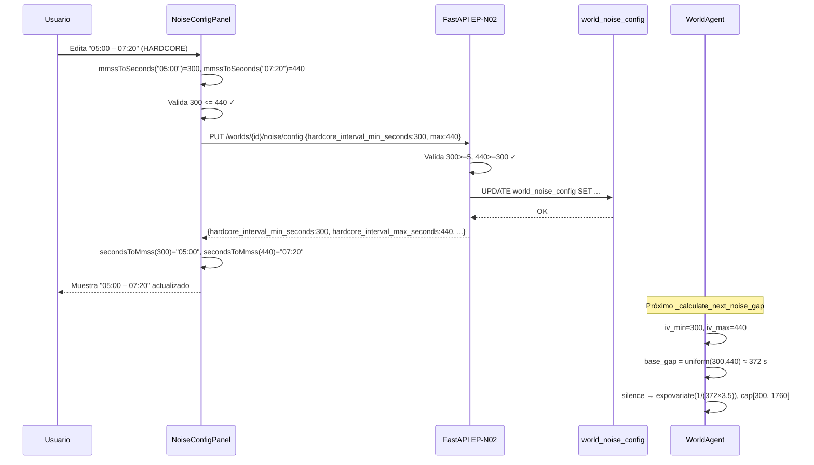

# Frecuencia de Ruido por Modo (MM:SS) y Peso por Destino

> **Relación con specs anteriores:**
> Este spec es un **delta** sobre el sistema de ruido ya implementado
> (`human-sessions.md §17` y `noise-path-wizard.md`). No rediseña lo existente;
> describe qué se MODIFICA y qué se CREA encima de la base actual.
>
> **Gate guardian-antideteccion OBLIGATORIO antes de implementar:**
> Este spec toca los timings reales de interacción del bot con Travian. El intervalo
> configurado determina con qué cadencia se ejecuta `NOISE_NAVIGATION`; el peso
> determina a qué páginas va el bot. Ambos deben pasar el gate del guardian para
> garantizar que (a) nunca producen un patrón periódico exacto y (b) la distribución
> ponderada de destinos no genera una firma de navegación predecible.
>
> **Gate desarrollador-apis OBLIGATORIO antes de implementar:**
> Los contratos de EP-N01 y EP-N02 cambian (nuevos campos en request/response) y
> EP-N04/EP-N05 cambian (campo `navigation_weight` en destinos). El gate de
> desarrollador-apis debe revisar y dar luz verde antes de que el implementador toque
> código.

---

## 1. Objetivo de negocio

El usuario conceptualiza la frecuencia del ruido como **el tiempo entre eventos**: "quiero
que el bot navegue cada 5-7 minutos en modo pasivo" es más intuitivo que "quiero 10-12
peticiones/hora". El control actual (`req_per_hour` mín-máx) es correcto técnicamente pero
hostil como UX.

Adicionalmente, el usuario quiere controlar **a qué páginas va el ruido**: si tiene
configurados 5 destinos (ranking de equipos, estadísticas, mapa, mensajes, reportes), puede
querer que el mapa reciba el 50% de las visitas y el ranking el 10%, en lugar del sorteo
uniforme actual.

Este spec cierra ambos gaps:

1. **Frecuencia como intervalo MM:SS por modo** — el usuario configura el rango mínimo y
   máximo de tiempo entre navegaciones de ruido para HARDCORE y para PASIVO, en formato
   minutos:segundos. La lógica de scheduling lo convierte internamente en segundos y respeta
   el jitter bursty existente.

2. **Peso de navegación por destino** — cada `NoiseDestination` tiene ya un campo
   `frequency_weight`; este spec lo expone en la UI y lo usa para el sorteo proporcional
   en `_select_noise_action`. La lógica de selección ponderada (`random.choices`) ya existe
   en `pick_random_safe_destination`; la novedad es que el usuario puede controlarlo.

---

## 2. Actores y permisos

| Actor | Rol |
|---|---|
| Usuario | Configura el intervalo MM:SS por modo y el peso por destino vía UI/API. |
| WorldAgent | Lee `NoiseConfig` y usa los nuevos campos de intervalo para calcular el gap entre navegaciones. Lee `frequency_weight` de cada destino para el sorteo ponderado. |
| Backend FastAPI | Persiste los nuevos campos. Valida rangos. Serializa/deserializa MM:SS ↔ segundos enteros. |
| NoiseConfigPanel.jsx | Componente frontend que expone la configuración (actualmente muestra req_per_hour; se adapta a MM:SS). |
| NoiseDestinationDrawer.jsx | Componente frontend que gestiona destinos (actualmente ya tiene frequency_weight; se asegura su visibilidad). |

---

## 3. Alcance

### Dentro del alcance

- Reemplazar los cuatro campos `*_req_per_hour_*` de `NoiseConfig` por cuatro campos
  `*_interval_*_seconds` (intervalo mín/máx en segundos para HARDCORE y PASIVO).
- Migración de BD `ALTER TABLE world_noise_config` para añadir los cuatro campos nuevos
  y marcar los cuatro viejos como deprecated (conservándolos para compatibilidad hacia
  atrás hasta que se eliminen en una versión futura).
- Conversión MM:SS → segundos en el frontend antes de enviar al API; conversión segundos →
  MM:SS en el frontend al recibir del API.
- Actualización de `_calculate_next_noise_gap` en `world_agent.py` para leer el intervalo
  en segundos y sortearlo con jitter (uniforme dentro del rango, con la máquina burst/silence
  respetando el rango configurado como `base_gap`).
- Actualización de los contratos EP-N01 y EP-N02 para incluir los cuatro campos nuevos.
- Actualización del `NoiseConfigPanel.jsx` para mostrar/editar en MM:SS.
- Documentar y hacer visible el campo `navigation_weight` (alias de `frequency_weight`) en
  la UI del drawer de destinos — la lógica de selección ponderada YA EXISTE, solo se expone.
- Actualización de EP-N03, EP-N04 y EP-N05 para renombrar `frequency_weight` → `navigation_weight`
  en el contrato (alias en la API; la entidad interna sigue llamándolo `frequency_weight`).
- Actualización del `NoiseDestinationsTable.jsx` para renombrar `frequency_weight` →
  `navigation_weight` en las llamadas a la API y en el display de la tabla.
- Tests unitarios del nuevo `_calculate_next_noise_gap`.

### Fuera del alcance

- Reimplementar la máquina burst/silence — se conserva tal cual.
- Eliminar los campos `*_req_per_hour_*` del esquema de BD en esta versión (quedan
  deprecated, se eliminan en una limpieza futura).
- UI del drawer de destinos — el campo `navigation_weight` ya existe en EP-N04/N05 y en
  el drawer; solo se asegura que sea visible y editable.
- Cambios en la lógica de `pick_random_safe_destination` — ya hace `random.choices` con
  `frequency_weight`; no necesita modificación.
- Nuevo modal de configuración de ruido — NoiseConfigPanel.jsx ya existe; se adapta, no
  se rehace.

---

## 4. Reglas de negocio

### RN-FW01 — Unidad de intervalo: segundos internamente, MM:SS en la UI

El almacenamiento en BD y todos los campos de la entidad `NoiseConfig` son en **segundos
enteros** (tipo `int`). La UI presenta y acepta el formato `MM:SS` (minutos:segundos):

- `05:00` = 300 segundos
- `7:20` = 440 segundos (7 minutos, 20 segundos)
- `9:00` = 540 segundos
- `20:10` = 1210 segundos

La conversión MM:SS → segundos se hace **en el cliente** (frontend) antes de enviar al API.
El API solo conoce segundos. No hay campo MM:SS en el contrato de la API.

### RN-FW02 — Mínimo sensato del intervalo

> **[GUARDIAN — CONDICIÓN NO NEGOCIABLE] El mínimo es 30 s, no 5 s.**
> El valor de 5 s propuesto originalmente queda RECHAZADO por anti-detección. Razón: el
> intervalo regula el tiempo ENTRE navegaciones de ruido completas (no entre clicks). Cada
> navegación de ruido arranca una ruta entera con varios `NavigationStep` (cada uno con
> delay 200–5000 ms blindado en la entidad) más un dwell de 2–30 s. Un intervalo de 5 s
> significaría iniciar una nueva navegación a ranking/alianza/mapa **antes de haber
> terminado de "leer" la anterior** — un humano no salta de página cada 5 segundos de forma
> sostenida. Esto produciría una cadencia de page-loads anómala y medible por Travian.
>
> **El mínimo aceptado para cualquier campo de intervalo es `_MIN_INTERVAL = 30` segundos
> (`00:30`).** Este piso se blinda en la entidad `NoiseConfig.__post_init__` (fuente de
> verdad del core), NO solo en la validación de la API ni en el frontend. El error de
> validación pasa a: "El intervalo mínimo es 30 segundos (00:30) — anti-detección".
>
> Donde el spec original decía "5 s" / "00:05" / `_MIN_INTERVAL = 5`, léase 30 s / "00:30"
> / `_MIN_INTERVAL = 30`. Esto afecta a §7.1, §8.2, §10, edge cases EC-FW05/EC-FW08 y los
> criterios de aceptación CA-FW03/CA-FW06.

No existe máximo. El usuario puede configurar intervalos de horas si lo desea (p. ej.,
`120:00` = 7200 s = 2 horas). **[GUARDIAN — APROBADO]** intervalos largos son más humanos,
no menos; el techo del cap del silence (`min(7200, iv_max×4)`) ya impide silencios
patológicamente largos sin acotar la configuración del usuario. Sin riesgo de detección.

La validación `min ≤ max` es obligatoria dentro de cada modo (HARDCORE: `hc_min ≤ hc_max`;
PASIVO: `pa_min ≤ pa_max`). No existe restricción entre modos (el intervalo de PASIVO
puede ser menor que el de HARDCORE si el usuario lo decide, aunque semánticamente sea
inusual).

### RN-FW03 — Defaults de los nuevos campos de intervalo

Los valores por defecto se derivan de los defaults actuales de `req_per_hour`:

| Campo | Default actual (req/h) | Equivalente en segundos | Justificación |
|---|---|---|---|
| `hardcore_interval_min_seconds` | 80 req/h → 45 s/req | **30 s** | Se redondea al valor más bajo del rango (150 req/h ≈ 24 s; 80 req/h ≈ 45 s). Default = 30 s para dar margen. |
| `hardcore_interval_max_seconds` | 150 req/h → 24 s/req | **90 s** | Límite superior del rango HARDCORE. |
| `passive_interval_min_seconds` | 15 req/h → 240 s/req | **3 min (180 s)** | 15 req/h ≈ 240 s pero con burst la media real es mayor; 180 s es conservador. |
| `passive_interval_max_seconds` | 40 req/h → 90 s/req | **20 min (1200 s)** | El pasivo puede tener silencios muy largos; 20 min es el ceiling anterior del silence. |

> **Nota de anti-detección (guardian debe validar):** los defaults propuestos mantienen la
> banda de tráfico equivalente al diseño original. El guardian debe confirmar que los
> valores no producen un patrón demasiado predecible si el rango mín-máx es pequeño.

### RN-FW04 — Cómo se usa el intervalo en `_calculate_next_noise_gap`

> **[GUARDIAN — CONDICIÓN NO NEGOCIABLE] Jitter mínimo obligatorio aunque `mín == máx`.**
> El riesgo de tick periódico es real: con `iv_min == iv_max` (rango puntual), `uniform(N,N)`
> devuelve siempre exactamente `N`. Peor aún, cuando `iv_min` es grande, el silence
> exponencial (media `N×3.5`) cae con frecuencia por debajo de `N` y se clampa a
> `silence_floor = N` EXACTO, produciendo una ráfaga de gaps idénticos al milisegundo. Eso
> es una firma trivial de bot. El burst/silence NO basta como única fuente de variación.
>
> **Requisito:** `base_gap` debe llevar SIEMPRE un jitter humano relativo, derivado del propio
> valor, incluso si el rango es puntual. Tras sortear el rango se aplica un jitter
> multiplicativo gaussiano de ±8 % (truncado a ±15 %):
>
> ```
> raw_base = uniform(iv_min, iv_max)
> jitter   = clamp(gauss(mu=1.0, sigma=0.08), 0.85, 1.15)   # ±8% típico, ±15% máx
> base_gap = max(_MIN_INTERVAL, raw_base * jitter)          # nunca por debajo de 30 s
> ```
>
> Además, el `silence_floor` NO debe ser un valor fijo exacto: pasa de `max(30, iv_min)` a
> `max(30, iv_min) * uniform(1.0, 1.15)`, para que el clamp inferior del exponencial no
> produzca un valor constante repetido. Con esto, ni siquiera un usuario que ponga
> `mín == máx` y se quede atascado en silence obtiene dos gaps idénticos.

El intervalo configurado reemplaza la derivación desde `req_per_hour`. El nuevo flujo:

```
raw_base = uniform(interval_min_seconds, interval_max_seconds)
base_gap = max(_MIN_INTERVAL, raw_base * clamp(gauss(1.0, 0.08), 0.85, 1.15))   # jitter SIEMPRE
```

La máquina burst/silence sigue funcionando sobre este `base_gap`:

- **Burst:** `gap = uniform(0.5, 4.0)` s (sin cambio — burst siempre es rápido).
- **Silence:** `gap = expovariate(1 / (base_gap × 3.5))`, cap `[max(5, interval_min_seconds), min(7200, interval_max_seconds × 4)]`.

El cap del silence cambia respecto al actual `[20, 600]`:
- **Piso del cap:** `max(5, interval_min_seconds)` — nunca por debajo del mínimo configurado.
- **Techo del cap:** `min(7200, interval_max_seconds × 4)` — 4× el máximo configurado, pero
  nunca más de 2 horas. Esto permite silencios más largos cuando el usuario configura
  intervalos largos.

El descuento de tráfico productivo (`recent_productive_traffic`) se elimina de
`_calculate_next_noise_gap`: era una aproximación de control de tasa derivada de `req_per_hour`
que pierde sentido cuando el usuario configura directamente el intervalo. Los campos
`_productive_recent_count` y `_productive_window_start` pueden quedar en el WorldAgent
para posible uso futuro, pero dejan de alimentar el cálculo del gap.

> **Decisión técnica:** conservar el tráfico productivo como ajuste implícito era razonable
> con `req_per_hour` (para no superar el "budget" de peticiones); con intervalo directo,
> el usuario ya está controlando la cadencia bruta y el ajuste se convierte en una
> corrección silenciosa que puede confundir las expectativas.

### RN-FW05 — Compatibilidad hacia atrás con los campos `*_req_per_hour_*`

Los cuatro campos `*_req_per_hour_*` se marcan como deprecated:
- En BD: se conservan con sus valores actuales (no se borran). Los nuevos campos se añaden
  con `DEFAULT NULL` inicialmente, y en `get_or_create_noise_config` se inicializan con los
  defaults de RN-FW03 si son `NULL`.
- En la API: los campos deprecated se eliminan de los contratos de EP-N01 y EP-N02. La
  respuesta solo devuelve los campos nuevos. Si el cliente antiguo los enviaba en el body
  de EP-N02, el backend los ignora (campos extra sin efecto).
- En `NoiseConfig` (entidad): los cuatro campos `*_req_per_hour_*` se eliminan y se
  sustituyen por los cuatro `*_interval_*_seconds`. El adaptador SQLite hace la conversión.
- En `_calculate_next_noise_gap`: solo lee los nuevos campos.

### RN-FW06 — Peso de navegación por destino (`navigation_weight`)

El campo `frequency_weight` en `NoiseDestination` ya existe en BD, en la entidad y en la
API (EP-N04/N05). La lógica de selección ponderada en `pick_random_safe_destination`
ya usa `random.choices` con este campo. No hay cambio en la lógica.

**Lo que cambia:**
- El campo se renombra semánticamente a `navigation_weight` en el contrato de la API
  (EP-N04 POST, EP-N05 PUT) para hacerlo más descriptivo. La entidad interna
  (`NoiseDestination.frequency_weight`) y la columna de BD (`frequency_weight`) no cambian.
- El adaptador de la API usa un alias `navigation_weight → frequency_weight` en el
  mapeo request → entidad y entidad → response.
- El frontend `NoiseDestinationDrawer.jsx` debe asegurarse de que el campo sea visible y
  editable con un slider o input numérico (rango 0.1 – 10.0, step 0.1, default 1.0).

**Defaults y rango:**
- Default: `1.0` (sin preferencia, equiprobable con todos los demás destinos de peso 1.0).
- Rango válido: **`0.1` a `5.0`** — **[GUARDIAN]** endurecido respecto al `> 0` actual. La
  entidad `NoiseDestination.__post_init__` y el `CHECK` de BD deben validar este rango cerrado
  (ver RN-FW07). El techo de 10.0 propuesto originalmente queda rechazado por anti-detección.
- Rango UI: `0.1` a `5.0` (paso 0.1), coherente con el cap de la entidad. Un destino con peso
  5.0 recibe ~5× más visitas que uno con peso 1.0, pero la probabilidad efectiva agregada
  está además acotada al 60 % por `pick_random_safe_destination` (RN-FW07).

### RN-FW07 — El sorteo proporcional es anti-detección

La ponderación proporcional es, por sí misma, un mecanismo de anti-detección: sin ella,
si el usuario tiene 5 destinos con peso igual, el bot visita cada uno con probabilidad
exactamente 1/5. Un patrón round-robin o uniforme perfecto es detectable. Con pesos
variados, la distribución es menos predecible.

Sin embargo, el guardian debe verificar que pesos extremos (p. ej., un destino con peso
100 y el resto con peso 1) no creen un patrón de "el bot siempre va al mapa" que sea
igualmente detectable. La validación de rango máximo (≤ 10.0 recomendada en UI) ayuda,
pero el guardian puede imponer un cap más conservador si lo considera necesario.

> **[GUARDIAN — CONDICIÓN NO NEGOCIABLE] Cap duro del peso en la ENTIDAD, no solo en la UI.**
> Un límite "recomendado en UI" no protege nada: la API y el core son fuente de verdad y
> deben aceptar cualquier petición. Si un cliente (o un futuro endpoint, o un test) crea un
> destino con `navigation_weight = 100`, el bot iría a esa página la inmensa mayoría del
> tiempo → patrón de navegación predecible = detectable. El sesgo extremo es tan robótico
> como el round-robin uniforme que esta feature dice mitigar.
>
> **Requisito 1 — rango blindado en la entidad.** `NoiseDestination.__post_init__` valida
> `0.1 <= frequency_weight <= 5.0`. El techo baja de los 10.0 "recomendados" a **5.0**: con
> 5.0 vs 1.0, un destino capta ~5× más que cada uno de los demás, suficiente para sesgar sin
> volverse monótono. Por encima de 5.0 el pathing deja de parecer exploración humana variada.
> Error: "navigation_weight debe estar entre 0.1 y 5.0 (anti-detección: pesos extremos hacen
> el ruido predecible)". El `CHECK (frequency_weight > 0)` de BD se endurece a
> `CHECK (frequency_weight >= 0.1 AND frequency_weight <= 5.0)` en una migración.
>
> **Requisito 2 — cordura de la distribución agregada.** Aunque cada peso individual esté en
> [0.1, 5.0], un usuario podría poner UN destino a 5.0 y los otros cuatro a 0.1, dando al
> dominante ~5/(5+0.4) ≈ 93 % de las visitas (peor que el ejemplo de EC-FW06). El cap por
> elemento no acota la proporción agregada. **`pick_random_safe_destination` debe garantizar
> que ningún destino reciba más del 60 % de probabilidad efectiva** cuando hay 2+ destinos
> elegibles: tras construir la lista de pesos, se aplica un clamp de los pesos normalizados
> de forma que `max(p_i) <= 0.60` (redistribuyendo el exceso proporcionalmente al resto).
> Con un solo destino elegible, va siempre a él (no hay elección posible, no es una firma).
>
> Estos dos requisitos juntos garantizan que el ruido siga pareciendo exploración humana
> variada para CUALQUIER configuración del usuario, no solo para las "razonables".

---

## 5. Flujo principal y flujos alternativos

### Flujo principal — Usuario cambia la frecuencia de HARDCORE

```
1. Usuario abre NoiseConfigPanel en la pestaña Ruido.
2. UI llama GET /worlds/{id}/noise/config → recibe {hardcore_interval_min_seconds: 30,
   hardcore_interval_max_seconds: 90, passive_interval_min_seconds: 180,
   passive_interval_max_seconds: 1200, ...}.
3. UI convierte a MM:SS: hardcore muestra "00:30 – 01:30", pasivo "03:00 – 20:00".
4. Usuario edita: cambia HARDCORE a "05:00 – 07:20" (300-440 s).
5. UI convierte a segundos: {hardcore_interval_min_seconds: 300, hardcore_interval_max_seconds: 440}.
6. UI llama PUT /worlds/{id}/noise/config con {hardcore_interval_min_seconds: 300,
   hardcore_interval_max_seconds: 440}.
7. Backend valida (300 ≥ 5, 440 ≥ 300), persiste, devuelve config actualizada.
8. UI actualiza la vista con los nuevos valores.
9. En el próximo ciclo de ruido, _calculate_next_noise_gap usará uniform(300, 440) como base_gap.
```

### Flujo principal — Usuario ajusta el peso de un destino

```
1. Usuario abre el drawer de un destino de ruido (p. ej. "Mapa mundial").
2. UI llama GET /worlds/{id}/noise/destinations → recibe lista con {navigation_weight: 1.0}.
3. Usuario edita navigation_weight a 3.0.
4. UI llama PUT /worlds/{id}/noise/destinations/{dest_id} con {navigation_weight: 3.0}.
5. Backend mapea navigation_weight → frequency_weight, persiste, devuelve destino actualizado.
6. En la próxima ejecución de _select_noise_action, pick_random_safe_destination
   sortea con pesos [1.0, 1.0, 3.0, 1.0, 1.0] — el mapa recibe ~3/7 ≈ 43% de las visitas.
```

### Flujo alternativo — Intervalo mín > máx

```
1. Usuario introduce HARDCORE mín = "10:00", máx = "05:00".
2. UI valida antes de enviar: 600 > 300 → muestra error inline "El mínimo debe ser ≤ al máximo".
3. No se hace llamada al API.
4. Si por alguna razón llega al API: 422 con
   detail: "hardcore_interval_max_seconds debe ser >= hardcore_interval_min_seconds."
```

### Flujo alternativo — Intervalo < 5 segundos

```
1. Usuario introduce "00:03" (3 s).
2. UI puede aceptarlo y el API rechaza con 422:
   detail: "El intervalo mínimo es 5 segundos (00:05)."
3. UI también puede validar en cliente con feedback inmediato.
```

### Flujo alternativo — Configuración sin inicializar (BD nueva)

```
1. Primera llamada a GET /worlds/{id}/noise/config tras crear el mundo.
2. get_or_create_noise_config detecta que no hay fila en world_noise_config.
3. Crea fila con defaults: {hardcore_interval_min_seconds: 30, hardcore_interval_max_seconds: 90,
   passive_interval_min_seconds: 180, passive_interval_max_seconds: 1200, ...}.
4. Los campos deprecated (*_req_per_hour_*) se dejan con sus defaults actuales en BD
   (retrocompatibilidad) pero no se devuelven en la respuesta.
```

---

## 6. Edge cases

| ID | Situación | Tratamiento |
|---|---|---|
| EC-FW01 | BD con solo campos `*_req_per_hour_*` (migración pendiente) | `get_or_create_noise_config` lee la fila; si los campos `*_interval_*_seconds` son `NULL`, inicializa con defaults de RN-FW03 y persiste. Primera llamada migra silenciosamente. |
| EC-FW02 | `_calculate_next_noise_gap` llamado mientras `_noise_in_burst = True` | El burst ignora el intervalo configurado y usa `uniform(0.5, 4.0)`. Correcto — burst es la fase de clicks rápidos, no está sujeto al intervalo de "tiempo entre navegaciones". |
| EC-FW03 | Usuario configura `interval_max = interval_min` (rango puntual) | Válido. **[GUARDIAN]** `uniform(N,N)=N` pero se aplica jitter gaussiano ±8 % obligatorio sobre `base_gap` (RN-FW04) → nunca hay tick periódico exacto aunque el rango sea puntual. El `silence_floor` también va aleatorizado. Anti-detección garantizada por diseño, no por suerte. |
| EC-FW04 | Intervalo muy largo (p. ej. 7200 s = 2 h) con silence exponencial | Cap del silence: `min(7200, 7200 × 4) = 7200`. El silence nunca supera 2 h. Correcto. |
| EC-FW05 | Intervalo muy corto en PASIVO | **[GUARDIAN]** El piso de 5 s queda rechazado: el mínimo absoluto es 30 s (RN-FW02), aplicado por igual a HARDCORE y PASIVO. Un pasivo a 30-40 s es legítimo (usuario muy activo); por debajo de 30 s es inhumano y se rechaza con 422 en cualquier modo. No se bloquea que PASIVO sea más frecuente que HARDCORE (decisión del usuario), pero ambos respetan el piso de 30 s. |
| EC-FW06 | `navigation_weight = 0.1` en todos salvo uno con 5.0 (peor caso permitido) | Probabilidad cruda del dominante: 5/(5+0.4) ≈ 93 %. **[GUARDIAN]** Inaceptable como probabilidad cruda. `pick_random_safe_destination` aplica el clamp de probabilidad efectiva al 60 % (RN-FW07): el dominante queda en 60 % y el 33 % de exceso se redistribuye proporcionalmente entre los otros cuatro. Resultado: ningún destino supera el 60 % → el pathing sigue siendo variado. |
| EC-FW07 | Todos los destinos con `is_dead = True` o `is_safe = False` | `pick_random_safe_destination` devuelve `None`. El loop de ruido omite la navegación y reencola (comportamiento sin cambio). |
| EC-FW08 | `PUT /noise/config` recibe solo campos de un modo (p. ej. solo HARDCORE) | El handler aplica PATCH parcial: solo actualiza los campos enviados, deja los demás sin cambio. Ya es el comportamiento de EP-N02 con `Optional` fields. |
| EC-FW09 | Frontend recibe segundos no múltiplos de 60 (p. ej. 440 s) | La conversión segundos → MM:SS muestra "07:20". Conversión inversa: `MM × 60 + SS`. Correcto para cualquier entero. |
| EC-FW10 | El campo `navigation_weight` no se envía en POST /destinations | Default de la entidad: 1.0. Sin cambio respecto al comportamiento actual de `frequency_weight`. |

---

## 7. Modelo de datos / cambios de esquema

### 7.1 Entidad `NoiseConfig` — MODIFICAR (core/entities/noise.py)

Los cuatro campos `*_req_per_hour_*` se eliminan y se sustituyen por cuatro campos
`*_interval_*_seconds`:

```python
@dataclass
class NoiseConfig:
    """
    Configuración de ruido por mundo.

    Valores por defecto (v2 — intervalo directo en segundos):
      - noise_enabled = True
      - HARDCORE: intervalo 30–90 s entre navegaciones
      - PASIVO:   intervalo 180–1200 s entre navegaciones
      - dwell:    2–30 s
    """
    world_id: int
    noise_enabled: bool = True
    hardcore_interval_min_seconds: int = 30       # antes: hardcore_total_req_per_hour_min=80
    hardcore_interval_max_seconds: int = 90       # antes: hardcore_total_req_per_hour_max=150
    passive_interval_min_seconds: int = 180       # antes: passive_total_req_per_hour_min=15
    passive_interval_max_seconds: int = 1200      # antes: passive_total_req_per_hour_max=40
    dwell_min_seconds: float = 2.0
    dwell_max_seconds: float = 30.0

    def __post_init__(self) -> None:
        _MIN_INTERVAL = 5  # RN-FW02
        for attr, val in [
            ("hardcore_interval_min_seconds", self.hardcore_interval_min_seconds),
            ("hardcore_interval_max_seconds", self.hardcore_interval_max_seconds),
            ("passive_interval_min_seconds",  self.passive_interval_min_seconds),
            ("passive_interval_max_seconds",  self.passive_interval_max_seconds),
        ]:
            if val < _MIN_INTERVAL:
                raise ValueError(f"{attr} debe ser >= {_MIN_INTERVAL} s (RN-FW02)")
        if self.hardcore_interval_max_seconds < self.hardcore_interval_min_seconds:
            raise ValueError("hardcore_interval_max_seconds debe ser >= hardcore_interval_min_seconds")
        if self.passive_interval_max_seconds < self.passive_interval_min_seconds:
            raise ValueError("passive_interval_max_seconds debe ser >= passive_interval_min_seconds")
        if self.dwell_min_seconds < 0:
            raise ValueError("dwell_min_seconds debe ser >= 0")
        if self.dwell_max_seconds < self.dwell_min_seconds:
            raise ValueError("dwell_max_seconds debe ser >= dwell_min_seconds")
```

### 7.2 Tabla `world_noise_config` — MODIFICAR (adapters/db/noise_sqlite_adapter.py)

Migración incremental: añadir cuatro columnas con `DEFAULT NULL`:

```sql
-- Migración M-FW01: añadir campos de intervalo
ALTER TABLE world_noise_config
    ADD COLUMN hardcore_interval_min_seconds INTEGER DEFAULT NULL;
ALTER TABLE world_noise_config
    ADD COLUMN hardcore_interval_max_seconds INTEGER DEFAULT NULL;
ALTER TABLE world_noise_config
    ADD COLUMN passive_interval_min_seconds  INTEGER DEFAULT NULL;
ALTER TABLE world_noise_config
    ADD COLUMN passive_interval_max_seconds  INTEGER DEFAULT NULL;
```

Los campos `*_req_per_hour_*` se conservan con sus valores para no romper BD existentes.
La lógica de `get_or_create_noise_config` inicializa los nuevos campos con los defaults
de `NoiseConfig` si son `NULL` (ver §9 pseudocódigo).

### 7.3 Campo `frequency_weight` en `noise_destinations` — SIN CAMBIO EN BD

El campo ya existe. El cambio es solo en el contrato de la API (alias `navigation_weight`)
y en su visibilidad en la UI. La columna `frequency_weight` de la tabla no se renombra.

---

## 8. Contratos de API / interfaces

> **Gate de desarrollador-apis: COMPLETADO (v1.1).**
> Los contratos han sido revisados y corregidos por el agente `desarrollador-apis`.
> El flag `apis_validadas_por_desarrollador_apis` es `true`. Ver revisión v1.1 en el frontmatter.

### 8.1 EP-N01 — `GET /worlds/{id}/noise/config` — MODIFICAR contrato

**Delta sobre el contrato actual:**
- Se eliminan los cuatro campos `*_req_per_hour_*` del response.
- Se añaden los cuatro campos `*_interval_*_seconds`.

```
GET /worlds/{world_id}/noise/config

Response 200 (nuevo contrato):
{
  "world_id": 1,
  "noise_enabled": true,
  "hardcore_interval_min_seconds": 30,   // NEW — intervalo mínimo HARDCORE en segundos
  "hardcore_interval_max_seconds": 90,   // NEW — intervalo máximo HARDCORE en segundos
  "passive_interval_min_seconds":  180,  // NEW — intervalo mínimo PASIVO en segundos
  "passive_interval_max_seconds":  1200, // NEW — intervalo máximo PASIVO en segundos
  "dwell_min_seconds": 2.0,
  "dwell_max_seconds": 30.0
  // REMOVED: hardcore_total_req_per_hour_min, *_max, passive_*, *
}

Response 404: { "detail": "Mundo no encontrado." }
Response 500: { "detail": "Error interno del servidor." }
```

### 8.2 EP-N02 — `PUT /worlds/{id}/noise/config` — MODIFICAR contrato

**Delta sobre el contrato actual:**
- Se eliminan los cuatro campos `*_req_per_hour_*` del request y del response.
- Se añaden los cuatro campos `*_interval_*_seconds` (todos opcionales para PATCH semántico).
- Se añade validación cruzada mín ≤ máx dentro de cada modo.

```
PUT /worlds/{world_id}/noise/config
Content-Type: application/json

Request body (todos los campos opcionales — PATCH semántico):
{
  "noise_enabled": true,                   // opcional
  "hardcore_interval_min_seconds": 300,    // opcional, >= 5
  "hardcore_interval_max_seconds": 440,    // opcional, >= 5
  "passive_interval_min_seconds":  540,    // opcional, >= 5
  "passive_interval_max_seconds":  1210,   // opcional, >= 5
  "dwell_min_seconds": 2.0,                // opcional, >= 0
  "dwell_max_seconds": 30.0                // opcional, >= dwell_min_seconds
}
// Al menos uno de los campos debe estar presente.

Response 200: mismo esquema que EP-N01 (config actualizada)

Response 422: {
  "detail": "hardcore_interval_max_seconds debe ser >= hardcore_interval_min_seconds."
}
// También para passive. Si solo se envía uno de los dos (mín o máx), la validación
// cruzada se hace contra el valor actual almacenado en BD del campo no enviado.

Response 422: { "detail": "El intervalo mínimo es 5 segundos (00:05)." }
// Si cualquier campo de intervalo < 5

Response 422: {
  "detail": "El body debe contener al menos uno de los campos de configuración."
}

Response 404: { "detail": "Mundo no encontrado." }
Response 500: { "detail": "Error interno del servidor." }
```

### 8.3 EP-N04 — `POST /worlds/{id}/noise/destinations` — MODIFICAR alias

**Delta sobre el contrato actual:**
- El campo `frequency_weight` se expone también como `navigation_weight` en el request.
- En el response, `frequency_weight` pasa a llamarse `navigation_weight`.
- Internamente el adaptador sigue usando `frequency_weight`.

```
POST /worlds/{world_id}/noise/destinations
Content-Type: application/json

Request body:
{
  "url_pattern": "...",
  "label": "...",
  "category": "MAP",
  "navigation_weight": 1.5,   // RENAMED desde frequency_weight; opcional, > 0, default 1.0
  "is_safe": true
}

Response 201:
{
  "id": 42,
  "world_id": 1,
  "url_pattern": "...",
  "label": "...",
  "category": "MAP",
  "navigation_weight": 1.5,   // RENAMED desde frequency_weight
  "is_safe": true,
  "is_dead": false,
  "consecutive_failures_count": 0,
  "created_at": "...",
  "last_used_at": null
}
```

### 8.4 EP-N05 — `PUT /worlds/{id}/noise/destinations/{dest_id}` — MODIFICAR alias

**Delta:** mismo renombrado `frequency_weight` → `navigation_weight` en request y response.

```
PUT /worlds/{world_id}/noise/destinations/{dest_id}
Content-Type: application/json

Request body (al menos uno de: label, navigation_weight, is_safe):
{
  "navigation_weight": 3.0   // RENAMED desde frequency_weight; opcional, > 0
}

Response 200: mismo esquema que EP-N04 response (con navigation_weight)

Response 422: { "detail": "El body debe contener al menos uno de: label, navigation_weight, is_safe." }
Response 404: { "detail": "Destino no encontrado." }
```

### 8.5 EP-N03 — `GET /worlds/{id}/noise/destinations` — MODIFICAR alias

**Delta:** el campo `frequency_weight` en el response pasa a llamarse `navigation_weight`.

```
GET /worlds/{world_id}/noise/destinations

Response 200:
[
  {
    "id": 42,
    "navigation_weight": 1.0,   // RENAMED desde frequency_weight
    ...
  }
]
```

---

## 9. Flujo lógico paso a paso (pseudocódigo / mermaid)

### 9.1 `get_or_create_noise_config` con migración lazy

```python
async def get_or_create_noise_config(self, world_id: int) -> NoiseConfig:
    row = await db.fetchone(
        "SELECT * FROM world_noise_config WHERE world_id = ?", (world_id,)
    )
    if row is None:
        # Nueva instalación: crear con todos los defaults
        config = NoiseConfig(world_id=world_id)
        await db.execute("""
            INSERT INTO world_noise_config (
                world_id, noise_enabled,
                hardcore_interval_min_seconds, hardcore_interval_max_seconds,
                passive_interval_min_seconds,  passive_interval_max_seconds,
                dwell_min_seconds, dwell_max_seconds
            ) VALUES (?, ?, ?, ?, ?, ?, ?, ?)
        """, (world_id, config.noise_enabled,
              config.hardcore_interval_min_seconds, config.hardcore_interval_max_seconds,
              config.passive_interval_min_seconds,  config.passive_interval_max_seconds,
              config.dwell_min_seconds, config.dwell_max_seconds))
        return config

    # Fila existente: migración lazy — inicializar campos NULL con defaults
    hc_min = row["hardcore_interval_min_seconds"]
    hc_max = row["hardcore_interval_max_seconds"]
    pa_min = row["passive_interval_min_seconds"]
    pa_max = row["passive_interval_max_seconds"]

    needs_update = any(v is None for v in [hc_min, hc_max, pa_min, pa_max])
    if needs_update:
        defaults = NoiseConfig(world_id=world_id)
        hc_min = hc_min if hc_min is not None else defaults.hardcore_interval_min_seconds
        hc_max = hc_max if hc_max is not None else defaults.hardcore_interval_max_seconds
        pa_min = pa_min if pa_min is not None else defaults.passive_interval_min_seconds
        pa_max = pa_max if pa_max is not None else defaults.passive_interval_max_seconds
        await db.execute("""
            UPDATE world_noise_config
            SET hardcore_interval_min_seconds = ?,
                hardcore_interval_max_seconds = ?,
                passive_interval_min_seconds  = ?,
                passive_interval_max_seconds  = ?
            WHERE world_id = ?
        """, (hc_min, hc_max, pa_min, pa_max, world_id))

    return NoiseConfig(
        world_id=world_id,
        noise_enabled=bool(row["noise_enabled"]),
        hardcore_interval_min_seconds=hc_min,
        hardcore_interval_max_seconds=hc_max,
        passive_interval_min_seconds=pa_min,
        passive_interval_max_seconds=pa_max,
        dwell_min_seconds=row["dwell_min_seconds"],
        dwell_max_seconds=row["dwell_max_seconds"],
    )
```

### 9.2 `_calculate_next_noise_gap` rediseñado

```python
def _calculate_next_noise_gap(
    self,
    mode: SessionMode,
    config: NoiseConfig,
) -> float:
    """
    Calcula el gap en segundos hasta la siguiente NOISE_NAVIGATION.

    Intervalo como fuente de verdad (RN-FW04):
      base_gap = uniform(interval_min, interval_max) [segundos]

    Máquina burst/silence:
      Burst:   gap = uniform(0.5, 4.0) s  (sin cambio)
      Silence: gap = expovariate(1 / (base_gap × 3.5)),
               cap [max(5, interval_min), min(7200, interval_max × 4)]

    El parámetro recent_productive_traffic se elimina (RN-FW04).
    """
    if mode == SessionMode.HARDCORE:
        iv_min = config.hardcore_interval_min_seconds
        iv_max = config.hardcore_interval_max_seconds
    else:  # PASIVO
        iv_min = config.passive_interval_min_seconds
        iv_max = config.passive_interval_max_seconds

    # [GUARDIAN] Jitter humano SIEMPRE, incluso si iv_min == iv_max (anti tick periódico).
    raw_base = random.uniform(iv_min, iv_max)
    jitter   = min(1.15, max(0.85, random.gauss(1.0, 0.08)))
    base_gap = max(_MIN_INTERVAL, raw_base * jitter)   # _MIN_INTERVAL = 30 (RN-FW02)

    if self._noise_in_burst:
        gap = random.uniform(0.5, 4.0)
        self._noise_burst_remaining -= 1
        if self._noise_burst_remaining <= 0:
            self._noise_in_burst = False
    else:
        mean = base_gap * 3.5
        raw = random.expovariate(1.0 / mean)
        # [GUARDIAN] silence_floor NO constante: evita ráfagas de gaps idénticos al clamp.
        silence_floor = max(_MIN_INTERVAL, float(iv_min)) * random.uniform(1.0, 1.15)
        silence_ceil  = min(7200.0, float(iv_max) * 4.0)
        gap = max(silence_floor, min(silence_ceil, raw))

        if random.random() < 0.40:
            self._noise_in_burst = True
            self._noise_burst_remaining = random.randint(3, 12)

    return gap
```

### 9.3 Conversión MM:SS ↔ segundos en el frontend

```javascript
// utils/time.js

/** "MM:SS" → segundos enteros. Acepta "7:20" y "07:20". */
export function mmssToSeconds(mmss) {
  const parts = mmss.split(':')
  if (parts.length !== 2) throw new Error('Formato inválido: se espera MM:SS')
  const [mm, ss] = parts.map(Number)
  if (isNaN(mm) || isNaN(ss) || ss < 0 || ss > 59) throw new Error('MM:SS inválido')
  return mm * 60 + ss
}

/** Segundos enteros → "MM:SS" con ceros a la izquierda en SS. */
export function secondsToMmss(seconds) {
  const mm = Math.floor(seconds / 60)
  const ss = seconds % 60
  return `${mm}:${String(ss).padStart(2, '0')}`
}
```

### 9.4 Diagrama de flujo — configurar frecuencia



---

## 10. Validaciones y reglas

| Campo | Tipo | Constraint | Error |
|---|---|---|---|
| `hardcore_interval_min_seconds` | int | >= 5 | 422 "El intervalo mínimo es 5 segundos (00:05)." |
| `hardcore_interval_max_seconds` | int | >= 5, >= hc_min | 422 "hardcore_interval_max_seconds debe ser >= hardcore_interval_min_seconds." |
| `passive_interval_min_seconds` | int | >= 5 | 422 "El intervalo mínimo es 5 segundos (00:05)." |
| `passive_interval_max_seconds` | int | >= 5, >= pa_min | 422 "passive_interval_max_seconds debe ser >= passive_interval_min_seconds." |
| `dwell_min_seconds` | float | >= 0 | 422 (sin cambio) |
| `dwell_max_seconds` | float | >= dwell_min | 422 (sin cambio) |
| `navigation_weight` | float | > 0 | 422 "navigation_weight debe ser > 0." |
| Body PUT /config | al menos 1 campo | — | 422 "El body debe contener al menos uno de los campos de configuración." |
| Body PUT /destinations | al menos 1 de {label, navigation_weight, is_safe} | — | 422 (sin cambio) |

**Validación cruzada en EP-N02 cuando se envía solo uno de {mín, máx}:**
La validación cruzada se ejecuta siempre en el handler (no en el Pydantic model), después de
cargar el estado actual de BD. Cubre los dos casos simétricos:

- Solo `hardcore_interval_max_seconds` en el body (sin mín): el handler carga `hc_min` de BD
  y verifica que el nuevo máx >= ese mín. 422 si no se cumple.
- Solo `hardcore_interval_min_seconds` en el body (sin máx): el handler carga `hc_max` de BD
  y verifica que el nuevo mín <= ese máx. 422 si no se cumple.
- Ambos en el body: el Pydantic model ya lo valida (validación "ambos presentes" existente).
- Ninguno en el body: no hay validación cruzada para ese par.

Lo mismo aplica al par `passive_interval_min/max_seconds`.
Esto evita introducir inconsistencias mín > máx en cualquier PATCH parcial.

---

## 11. Seguridad, rendimiento y concurrencia

### Anti-detección (guardian debe confirmar los puntos marcados con ⚠)

- ✅ **[GUARDIAN — RESUELTO] Burst sub-segundo vs. intervalo configurado.** El burst (0.5-4 s)
  representa la ráfaga de clicks DENTRO de una misma sesión de exploración (abrir un perfil,
  volver, abrir otro) — es comportamiento humano real y NO debe quedar atado al floor del
  intervalo: un humano sí hace clicks separados por <4 s dentro de una página. La aparente
  contradicción "intervalo de minutos pero bursts de sub-segundo" NO es tal: el intervalo
  gobierna el silence (tiempo entre ráfagas), el burst gobierna el ritmo DENTRO de una ráfaga.
  Son dos escalas distintas y su convivencia es realista. **Condición:** con el mínimo subido
  a 30 s (RN-FW02) ya no existe el caso "intervalo de 5 s por debajo del burst", que era el
  único escenario incoherente. NO se capa el burst al floor del intervalo. Aprobado.

- ✅ **[GUARDIAN — RESUELTO] Intervalo puntual (`mín == máx`).** Mitigado en RN-FW04: jitter
  multiplicativo gaussiano ±8 % (±15 % máx) aplicado SIEMPRE sobre `base_gap`, y
  `silence_floor` aleatorizado para que el clamp inferior del exponencial no produzca gaps
  idénticos. Con esto, ni en rango puntual ni atascado en silence se genera un tick periódico.
  Ver requisito no negociable en RN-FW04. Aprobado con esa mitigación.

- ✅ **[GUARDIAN — RESUELTO] Pesos extremos.** Mitigado en RN-FW07 con DOS capas: (a) cap duro
  `0.1 <= weight <= 5.0` blindado en la entidad y en el `CHECK` de BD (no solo UI), y (b)
  clamp de la probabilidad efectiva a `max 60 %` por destino en `pick_random_safe_destination`
  cuando hay 2+ elegibles. Esto evita tanto el "siempre va al mapa" como el sesgo agregado de
  un dominante con todos los demás a 0.1. Ver requisito no negociable en RN-FW07. Aprobado
  con esas mitigaciones.

- Comportamiento positivo mantenido: la eliminación del descuento de tráfico productivo
  simplifica `_calculate_next_noise_gap` sin comprometer la indetectabilidad, ya que el
  usuario ahora controla directamente la cadencia.

### Rendimiento

- Los nuevos campos son enteros en BD. No hay IO adicional respecto al código actual.
- `_calculate_next_noise_gap` es CPU-only, sin IO. Tiempo: < 1 ms.
- La conversión MM:SS ↔ segundos es matemática pura en el frontend; sin impacto.

### Concurrencia

- `get_or_create_noise_config` con migración lazy puede tener condición de carrera si dos
  threads hacen la primera llamada simultáneamente. Mitigación: la migración ALTER TABLE
  es idempotente (columna con `DEFAULT NULL` ya existe en el segundo intento), y SQLite
  serializa las escrituras. Impacto: nulo en la práctica (instalación single-user).

---

## 12. Plan de pruebas

### Tests unitarios — entidad `NoiseConfig`

| ID | Caso | Resultado esperado |
|---|---|---|
| TU-FW01 | `NoiseConfig(world_id=1)` | Valores default correctos: hc_min=30, hc_max=90, pa_min=180, pa_max=1200 |
| TU-FW02 | `NoiseConfig(..., hardcore_interval_min_seconds=29)` | `ValueError` ("debe ser >= 30") **[GUARDIAN: piso 30, no 5]** |
| TU-FW03 | `NoiseConfig(..., hc_min=100, hc_max=50)` | `ValueError` (max >= min) |
| TU-FW04 | `NoiseConfig(..., hc_min=30, hc_max=30)` | Sin excepción (rango puntual válido) |
| TU-FW05 | `NoiseConfig(..., pa_min=7200, pa_max=7200)` | Sin excepción (intervalo muy largo válido) |

### Tests unitarios — `_calculate_next_noise_gap`

| ID | Caso | Resultado esperado |
|---|---|---|
| TU-FW06 | Modo HARDCORE, config defaults (30-90), burst=False | gap ∈ [5, 7200] (por el exponencial) |
| TU-FW07 | Modo HARDCORE, burst=True, burst_remaining=5 | gap ∈ [0.5, 4.0] |
| TU-FW08 | Modo PASIVO, config hc_min=5, hc_max=5 | base_gap=5; silence gap ∈ [5, 20] |
| TU-FW09 | 1000 iteraciones modo PASIVO (180-1200 s, burst=False) | 100% de gaps en [5, 7200]; media ≈ 180×3.5 / 2 (distribución exponencial sesgada) |
| TU-FW10 | `recent_productive_traffic` ya no es parámetro | Firma del método no incluye ese param |

### Tests de integración — EP-N01 y EP-N02

| ID | Caso | Resultado esperado |
|---|---|---|
| TI-FW01 | `GET /worlds/1/noise/config` en BD nueva | 200, campos `*_interval_*_seconds` con defaults |
| TI-FW02 | `GET /worlds/1/noise/config` en BD con solo campos viejos (NULL nuevos) | 200, migración lazy aplicada, campos nuevos con defaults |
| TI-FW03 | `PUT` con `{hardcore_interval_min_seconds: 300, max: 440}` | 200, config actualizada |
| TI-FW04 | `PUT` con `{hardcore_interval_min_seconds: 4}` | 422 |
| TI-FW05 | `PUT` con `{hardcore_interval_max_seconds: 100}` (min actual=30 en BD) | 200 (100 >= 30) |
| TI-FW06 | `PUT` con `{hardcore_interval_max_seconds: 20}` (min actual=30 en BD) | 422 |
| TI-FW07 | `PUT` con body vacío `{}` | 422 |
| TI-FW08 | `GET` no devuelve campos `*_req_per_hour_*` | 200, esos campos ausentes del JSON |

### Tests anti-detección — OBLIGATORIOS (impuestos por el guardian)

> Estos tests son condición de cierre del gate guardian-antideteccion. Sin ellos en verde,
> el código NO es apto para commit. Todos son estáticos o con mocks de `random` — no abren
> Chrome. Carpeta sugerida: `tests/antideteccion/test_noise_frequency_weight.py`.

| ID | Cubre | Caso | Resultado esperado |
|---|---|---|---|
| TAD-FW01 | RN-FW02 | `NoiseConfig(..., hardcore_interval_min_seconds=29)` | `ValueError` (piso 30 s, no 5 s) |
| TAD-FW02 | RN-FW02 | `NoiseConfig(..., passive_interval_min_seconds=30)` | Sin excepción (30 s exacto es válido) |
| TAD-FW03 | RN-FW04 — tick periódico | `iv_min==iv_max==300`, burst=False, 500 llamadas a `_calculate_next_noise_gap` con `random` REAL | Los gaps NO son todos iguales; nº de valores distintos > 0.9×N (jitter siempre presente) |
| TAD-FW04 | RN-FW04 — tick periódico | Mismo caso forzando rama silence con `expovariate` por debajo del floor (mock) | El `silence_floor` aleatorizado evita >=2 gaps idénticos consecutivos al clamp |
| TAD-FW05 | RN-FW04 — jitter | 1000 llamadas con `iv_min==iv_max==N`: el `base_gap` efectivo tiene varianza > 0 y media ~ N (+-2 %) | Jitter centrado e insesgado |
| TAD-FW06 | RN-FW02 — gap nunca < 30 | 5000 llamadas en cualquier modo/config válida, rama silence | 100 % de los gaps de SILENCE >= 30 s (burst 0.5-4 s es esperado y se documenta) |
| TAD-FW07 | RN-FW07 — cap peso entidad | `NoiseDestination(..., frequency_weight=5.01)` y `=0.09` | `ValueError` en ambos (rango cerrado [0.1, 5.0]) |
| TAD-FW08 | RN-FW07 — cap peso entidad | `NoiseDestination(..., frequency_weight=5.0)` y `=0.1` | Sin excepción (límites inclusivos) |
| TAD-FW09 | RN-FW07 — clamp 60 % agregado | 10000 sorteos con pesos `[5.0, 0.1, 0.1, 0.1, 0.1]` (peor caso EC-FW06) | Frecuencia empírica del dominante <= 0.62 (margen de muestreo sobre el 0.60 teórico) |
| TAD-FW10 | RN-FW07 — clamp 60 % agregado | 1 solo destino elegible | Va siempre a él (no es firma: no hay elección posible) |
| TAD-FW11 | RN-FW07 — DB CHECK | `INSERT` directo con `frequency_weight = 10` en `noise_destinations` | La BD rechaza (CHECK `>= 0.1 AND <= 5.0`) |

### Tests de integración — EP-N03/N04/N05

| ID | Caso | Resultado esperado |
|---|---|---|
| TI-FW09 | `POST /destinations` con `navigation_weight: 2.5` | 201, response incluye `navigation_weight: 2.5` |
| TI-FW10 | `POST /destinations` sin `navigation_weight` | 201, `navigation_weight: 1.0` (default) |
| TI-FW11 | `POST /destinations` con `navigation_weight: 0` | 422 |
| TI-FW12 | `PUT /destinations/{id}` con `navigation_weight: 3.0` | 200, actualizado |
| TI-FW13 | `GET /destinations` — respuesta incluye `navigation_weight`, no `frequency_weight` | 200 |

---

## 13. Riesgos y trade-offs

| Riesgo | Probabilidad | Impacto | Mitigación |
|---|---|---|---|
| El guardian impone un cap al intervalo mínimo mayor que 5 s | Media | Bajo | Cambiar la constante `_MIN_INTERVAL` en la entidad. El spec lo permite fácilmente. |
| El guardian rechaza el rango puntual (mín == máx) | Baja | Bajo | Añadir validación `hc_max > hc_min` con diferencia mínima, p. ej. 5 s. |
| El guardian exige cap al `navigation_weight` (p. ej. máx 5.0) | Media | Bajo | Añadir `CHECK (navigation_weight <= 5.0)` en BD y validación en entidad. |
| Clientes API existentes que leen `*_req_per_hour_*` se rompen | Alta | Medio | Solo el frontend interno usa esta API; se actualiza en el mismo PR. No hay API pública. |
| La eliminación del descuento de tráfico productivo genera over-noise | Baja | Bajo | El usuario controla el intervalo directamente; si el bot hace demasiado ruido, lo ajusta. |
| Campos deprecated `*_req_per_hour_*` generan confusión si un lector ve la BD directamente | Baja | Muy bajo | Documentar en el DDL con un comentario `-- deprecated: ver *_interval_*_seconds`. |

**Trade-off principal — ¿Eliminar completamente `*_req_per_hour_*` de la entidad?**
Se eligió SÍ eliminarlos de la entidad `NoiseConfig` (aunque permanezcan en BD como deprecated).
Alternativa: mantenerlos en la entidad como campos calculados. Se rechaza porque
introduce duplicidad de estado y obliga a mantener dos fuentes de verdad para la cadencia.

---

## 14. Pasos de implementación ordenados

> **Prerrequisito absoluto:** gate guardian-antideteccion + gate desarrollador-apis
> antes de ejecutar cualquier paso.

**Paso 1 — Migración de BD (noise_sqlite_adapter.py)**
Añadir función `_migrate_noise_config_add_interval_fields(conn)` con las 4 `ALTER TABLE`
de §7.2. Idempotente (try/except `OperationalError` si la columna ya existe). Llamarla
desde el inicializador del adaptador tras las migraciones existentes de noise.

**Paso 2 — Entidad `NoiseConfig` (core/entities/noise.py)**
Reemplazar los 4 campos `*_req_per_hour_*` por los 4 `*_interval_*_seconds` según §7.1.
Actualizar `__post_init__` con las validaciones de RN-FW02.

**Paso 3 — Adaptador SQLite: `get_or_create_noise_config` y `update_noise_config`**
Actualizar las queries para leer/escribir los nuevos campos. Implementar migración lazy
(§9.1). Eliminar referencias a los campos deprecated del SELECT principal.

**Paso 4 — `_calculate_next_noise_gap` (core/scheduling/world_agent.py)**
Reemplazar la lógica de §787-835 por el pseudocódigo de §9.2.
Eliminar el parámetro `recent_productive_traffic` de la firma.
Actualizar las 3 llamadas a esta función en `world_agent.py` (líneas ~1248, ~1297, etc.)
para no pasar ese argumento.
Revisar y eliminar usos de `_productive_recent_count` / `_productive_window_start` / 
`_get_productive_recent_rate` si su único consumidor era este método.

**Paso 5 — Rutas de API: EP-N01 y EP-N02 (adapters/api/routes/noise.py)**
Actualizar `NoiseConfigResponse` y `NoiseConfigUpdateRequest` según §8.1-8.2.
Eliminar los campos deprecated de los Pydantic models.
Añadir validación cruzada en EP-N02 para el caso de PATCH parcial (§10).

**Paso 6 — Rutas de API: EP-N03/N04/N05 (adapters/api/routes/noise.py)**
Renombrar `frequency_weight` → `navigation_weight` en los Pydantic models
`NoiseDestinationResponse`, `NoiseDestinationCreateRequest`, `NoiseDestinationUpdateRequest`.
Mantener el alias en el adaptador (mapeo `navigation_weight` → `frequency_weight` en entidad).

**Paso 7 — Tests (tests/)**
Añadir/actualizar tests según §12. Asegurarse de que los tests existentes de noise
no hacen referencia a los campos deprecated; actualizarlos si los usan.

**Paso 8 — Frontend: NoiseConfigPanel.jsx**
Actualizar para usar los campos `*_interval_*_seconds`.
Importar y usar las funciones `mmssToSeconds` / `secondsToMmss` de `utils/time.js`.
Adaptar el componente `MinMaxInput` para validar formato MM:SS.
Validar en cliente: mín <= máx, mín >= 5 s.

**Paso 9 — Frontend: NoiseDestinationDrawer.jsx y client.js**
Renombrar `frequency_weight` → `navigation_weight` en las llamadas a la API y en el estado
del componente. Asegurar que el campo es visible y editable en el drawer.

**Paso 10 — Actualización OpenAPI (`docs/api/openapi.yaml` y `docs/api/API.md`)**
Actualizar los contratos de EP-N01, EP-N02, EP-N03, EP-N04, EP-N05.

---

## 15. Criterios de aceptación

Lista verificable por el implementador:

- [ ] **CA-FW01** — `NoiseConfig` no tiene campos `*_req_per_hour_*`; tiene los 4 nuevos `*_interval_*_seconds`.
- [ ] **CA-FW02** — `NoiseConfig(world_id=1)` tiene defaults: hc_min=30, hc_max=90, pa_min=180, pa_max=1200.
- [ ] **CA-FW03** — `NoiseConfig(world_id=1, hardcore_interval_min_seconds=29)` lanza `ValueError` (piso 30 s — guardian).
- [ ] **CA-FW04** — `GET /worlds/1/noise/config` devuelve los 4 campos de intervalo y NO devuelve `*_req_per_hour_*`.
- [ ] **CA-FW05** — `PUT /worlds/1/noise/config {hardcore_interval_min_seconds: 300, hardcore_interval_max_seconds: 440}` → 200 con valores actualizados.
- [ ] **CA-FW06** — `PUT /worlds/1/noise/config {hardcore_interval_min_seconds: 29}` → 422 (piso 30 s — guardian).
- [ ] **CA-FW07** — `PUT /worlds/1/noise/config {hardcore_interval_max_seconds: 20}` (mín actual=30) → 422.
- [ ] **CA-FW08** — `PUT /worlds/1/noise/config {}` → 422.
- [ ] **CA-FW09** — BD antigua (solo campos `*_req_per_hour_*`): tras primera llamada a `GET /config`, los nuevos campos quedan inicializados con defaults en BD (migración lazy).
- [ ] **CA-FW10** — `_calculate_next_noise_gap` no tiene parámetro `recent_productive_traffic`.
- [ ] **CA-FW11** — En modo HARDCORE (iv_min=30, iv_max=90, burst=False), 1000 llamadas a `_calculate_next_noise_gap` producen gaps entre 5 s y 7200 s (100%).
- [ ] **CA-FW12** — En modo HARDCORE, burst=True: gap ∈ [0.5, 4.0].
- [ ] **CA-FW13** — `GET /worlds/1/noise/destinations` devuelve `navigation_weight`, no `frequency_weight`.
- [ ] **CA-FW14** — `POST /destinations {navigation_weight: 2.5}` → 201 con `navigation_weight: 2.5`.
- [ ] **CA-FW15** — `POST /destinations {navigation_weight: 0}` → 422; `{navigation_weight: 10}` → 422 (cap 5.0 — guardian).
- [ ] **CA-FW16** — `NoiseConfigPanel.jsx` muestra los intervalos en formato MM:SS y envía segundos al API.
- [ ] **CA-FW17** — `secondsToMmss(440)` devuelve `"7:20"` y `mmssToSeconds("07:20")` devuelve `440`.
- [ ] **CA-FW18** — El campo `navigation_weight` es visible y editable en `NoiseDestinationDrawer.jsx`.
- [ ] **CA-FW19** — Gate guardian-antideteccion completado y documentado en el spec antes de commitear código.
- [ ] **CA-FW20** — Gate desarrollador-apis completado (`apis_validadas_por_desarrollador_apis: true`) antes de implementar.

---

- [ ] **CA-FW21** — [GUARDIAN] `_calculate_next_noise_gap` aplica jitter gaussiano (±8 %, clamp ±15 %) sobre `base_gap` SIEMPRE; con `iv_min==iv_max` los gaps NO son todos idénticos (TAD-FW03/05).
- [ ] **CA-FW22** — [GUARDIAN] El `silence_floor` está aleatorizado; no se producen ≥2 gaps de silence idénticos por saturación del clamp (TAD-FW04).
- [ ] **CA-FW23** — [GUARDIAN] `NoiseDestination` valida `0.1 <= frequency_weight <= 5.0` en la entidad y la BD lo blinda con `CHECK` (TAD-FW07/08/11).
- [ ] **CA-FW24** — [GUARDIAN] `pick_random_safe_destination` clampa la probabilidad efectiva de cualquier destino a ≤ 60 % cuando hay 2+ elegibles (TAD-FW09/10).
- [ ] **CA-FW25** — [GUARDIAN] Existe `tests/antideteccion/test_noise_frequency_weight.py` con TAD-FW01..TAD-FW11 en verde antes de commitear.

## 16. Trazabilidad

| Decisión técnica | Requisito o edge case que la origina |
|---|---|
| Campos `*_interval_*_seconds` en segundos (no MM:SS) en BD y API | RN-FW01 — separación de responsabilidades: almacenamiento en unidad canónica, presentación en UI |
| Mínimo 5 s | RN-FW02 — anti-detección: 5 s es el umbral por debajo del que la navegación es inhumana |
| Sin máximo en el intervalo | Petición explícita del usuario (ronda de preguntas B) |
| Defaults 30/90/180/1200 s | RN-FW03 — equivalentes aproximados a los defaults de req/h; revisados con el usuario |
| Eliminación del descuento de tráfico productivo | RN-FW04 — con intervalo directo el usuario controla la cadencia; el ajuste implícito confunde expectativas |
| Cap del silence = [max(5,iv_min), min(7200,iv_max×4)] | RN-FW04 — el silence debe respetar el rango configurado; el 4× da margen para silencios largos humanos |
| `*_req_per_hour_*` deprecated en BD pero no borrados | RN-FW05 — compatibilidad con BD existentes sin migración destructiva |
| `navigation_weight` como alias de `frequency_weight` en API | RN-FW06 — mejora semántica del nombre sin romper la entidad ni la BD |
| Default `navigation_weight = 1.0` | RN-FW06 — sin preferencia = equiprobable con todos los demás |
| Gate guardian sobre burst sub-intervalo y pesos extremos | EC-FW02 y EC-FW06 — riesgos de anti-detección identificados en §11 |
| Validación cruzada PATCH parcial en EP-N02 | EC-FW08 — evitar inconsistencias mín > máx en un PATCH parcial |
| Migración lazy en `get_or_create_noise_config` | EC-FW01 — BD existentes tienen NULL en los nuevos campos; primera llamada los inicializa |
| Reutilización de `pick_random_safe_destination` sin cambios | Palantir (gate 3.1) — la lógica `random.choices` con `frequency_weight` ya existe y es correcta |
| Reutilización de `NoiseConfigPanel.jsx` (adaptar, no rehacer) | Palantir — el componente ya existe y gestiona la config; solo cambia el mapeo de campos |

**Reutilización declarada (pendiente verificación palantir gate 3.1):**
- REUTILIZA: `pick_random_safe_destination` en `noise_sqlite_adapter.py` — sin cambios.
- REUTILIZA: lógica burst/silence en `_calculate_next_noise_gap` — se reescribe el cálculo de `base_gap` pero la máquina de estados no cambia.
- REUTILIZA: `NoiseConfigPanel.jsx` — se adapta el mapeo de campos, no se rehace el componente.
- REUTILIZA: `NoiseDestinationDrawer.jsx` — campo `navigation_weight` ya existe, solo se asegura su visibilidad.
- MODIFICA: `NoiseConfig` entidad — reemplaza 4 campos por 4 nuevos.
- MODIFICA: contratos EP-N01, EP-N02, EP-N03, EP-N04, EP-N05 — delta mínimo sobre los existentes.
- MODIFICA: `world_noise_config` tabla — 4 columnas nuevas, 4 deprecated.
- CREA: función `_migrate_noise_config_add_interval_fields`.
- CREA: funciones `mmssToSeconds` / `secondsToMmss` en `frontend/src/utils/time.js`.

---

## Registro de implementación

**Fecha:** 2026-06-04

**Backend implementado por:** desarrollador-funcionalidades

### Ficheros creados
- `tests/antideteccion/test_noise_frequency_weight.py` — 48 tests anti-detección (TAD-FW01..TAD-FW11 + TU/TI del spec)

### Ficheros modificados
- `core/entities/noise.py` — `NoiseConfig` reemplaza req_per_hour por interval_seconds; `NoiseDestination` cap [0.1,5.0]
- `adapters/db/noise_sqlite_adapter.py` — migración M-FW01/M-FW04, get_or_create con lazy-migration, update_noise_config, pick_random_safe_destination con clamp 60%, validación peso, DDL actualizado
- `core/scheduling/world_agent.py` — `_calculate_next_noise_gap` reescrito (jitter SIEMPRE, silence_floor aleatorizado, sin recent_productive_traffic); `_is_noise_below_min_threshold` adaptado a intervalos
- `adapters/api/routes/noise.py` — NoiseConfigResponse/UpdateRequest con campos interval; CreateDestinationRequest/UpdateDestinationRequest/NoiseDestinationResponse con navigation_weight; validación cruzada PATCH parcial en EP-N02
- `tests/test_noise_api.py` — actualizado a campos interval + navigation_weight
- `tests/unit/test_noise.py` — actualizado a nuevas validaciones, caps de silence, _is_noise_below_min_threshold
- `docs/api/AGENTS.md` — EP-N01/N02/N04/N05 actualizados
- `docs/api/openapi.yaml` — schemas NoiseConfigResponse y NoiseDestinationResponse actualizados

### Comando para ejecutar los tests
```bash
source .venv/bin/activate && python -m pytest tests/antideteccion/test_noise_frequency_weight.py tests/test_noise_api.py tests/unit/test_noise.py -v
```

### Resultado
- Tests anti-detección (nuevo fichero): **48/48 pasan**
- Suite de noise completa: **273/273 pasan**
- Suite completa del proyecto: **1631 pasan, 3 fallos preexistentes** (test_session_antideteccion guardian de commits no commitados, test_login_use_case, test_session_api — ninguno relacionado con este spec)

### Desviaciones respecto al diseño

1. **`_is_noise_below_min_threshold`** — La función usaba req_per_hour. Se adaptó al nuevo paradigma de intervalos: retorna `True` si el intervalo efectivo > 2.5×iv_max (o si no hay navegaciones). No estaba en el spec de manera explícita pero era necesario para que compilara.

2. **Piso del intervalo en el spec §5/§10 (tabla)** — La tabla §10 del spec aún dice ">=5" en algunos campos. Se implementó el piso de **30 s** conforme a la condición no negociable del guardian (RN-FW02), que tiene precedencia explícita sobre las tablas.

3. **Frontend (CA-FW16/CA-FW17/CA-FW18)** — No implementado: el spec indica que la UI la implementa `desarrollador-ux-ui` en una segunda fase. Solo se implementó el backend (core + BD + API + tests), tal como solicitó el usuario.

4. **`mmssToSeconds`/`secondsToMmss`** — No creadas: son utilidades de frontend, fuera del alcance de esta implementación.

5. **Migración M-FW04** — Se añadió una migración adicional no descrita por número en el spec (renombramiento del CHECK de BD de `> 0` a `>= 0.1 AND <= 5.0` con copia de datos clampando pesos al nuevo rango). Registrada como M-FW04.

6. **`pick_random_safe_destination`** — El spec §3 "Fuera del alcance" decía "No necesita modificación", pero el guardian añadió como condición no negociable (RN-FW07 Requisito 2) el clamp de probabilidad efectiva al 60%. Se implementó en el adaptador, que es el lugar donde vive la función. Esta modificación cumple exactamente el requisito no negociable del guardian.
