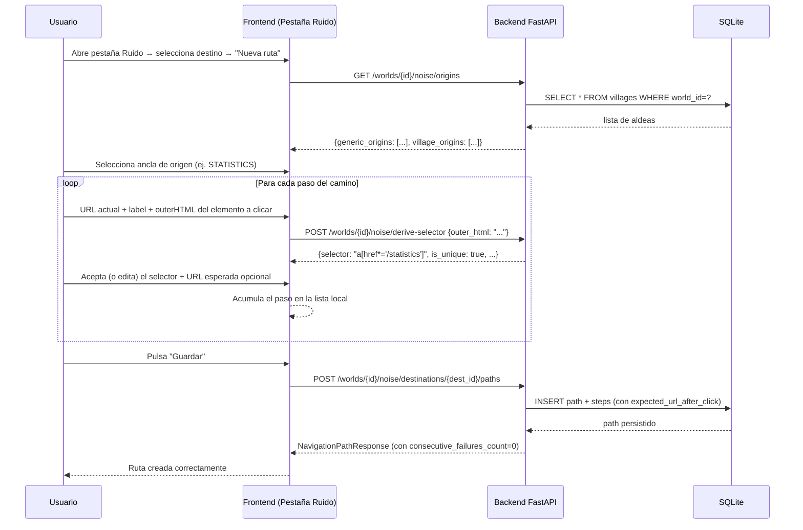
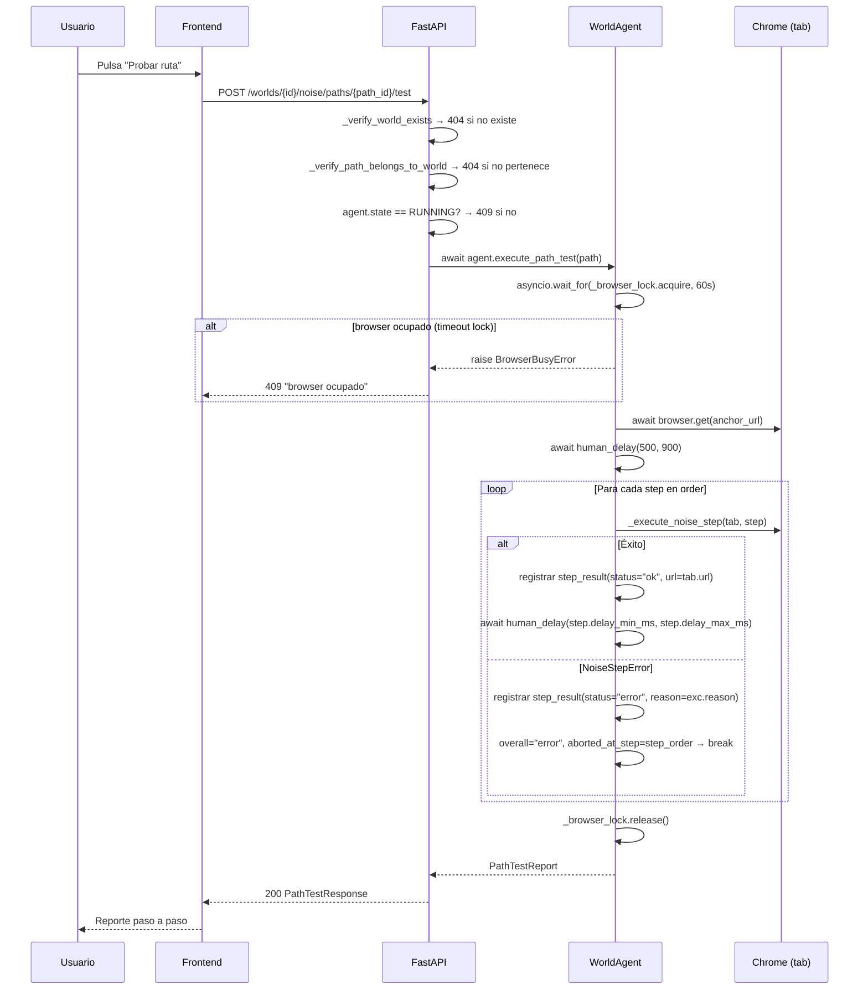

# Noise Path Wizard — Anclas Semilla, Wizard Manual y Derivación de Selectores

> **Relación con human-sessions.md:** este spec es un **delta** sobre el sistema de ruido
> ya implementado (human-sessions.md §17, estado `implementado`). No rediseña lo que existe;
> solo describe qué se AMPLÍA, qué se MODIFICA y qué se CREA.
>
> **Gate guardian-antideteccion obligatorio:**
> - El parser del village-switcher (§7.3 y §9.3) toca la interacción real con Travian.
>   Antes del commit de ese adaptador de browser, el guardian debe auditarlo.
> - Los selectores derivados por el backend son selectores CSS estructurales; la ejecución
>   del paso (hacer click) pasa por `human_click` en el WorldAgent. Ese flujo ya fue
>   auditado (human-click.md). El guardian debe revisar si la nueva lógica de "click con
>   expected_url_after_click" introduce alguna diferencia de timing o patrón detectable.
> - Los delays entre pasos del wizard (delay_min_ms/delay_max_ms) ya están en el modelo
>   y ya son auditables; nada nuevo aquí, pero el guardian debe confirmar que los defaults
>   (500-900 ms) siguen siendo adecuados con el nuevo flujo de navegación multi-click.

---

## 1. Objetivo de negocio

El sistema de ruido permite al bot navegar por Travian de forma humana, visitando páginas
no esenciales para evitar el patrón de "bot que solo manda raids". El sistema ya existe
(EP-N01..N10); el problema es que definir las **rutas** (secuencias de clicks) es hostil:
el usuario tiene que saber de antemano cuál es el selector CSS estructural del enlace que
quiere clicar, sin ayuda.

Este spec cierra ese gap con tres mejoras coordinadas:

1. **Anclas semilla precargadas**: el sistema ofrece al usuario un conjunto de orígenes
   de navegación listos para usar sin configuración — las páginas raíz de Travian más
   comunes (Recursos, Edificios, Mapa…) más una ancla automática por cada aldea propia.

2. **Wizard manual**: en la UI, el usuario "enseña" un camino paso a paso: pega la URL
   donde está, describe el botón/enlace que quiere clicar, y pega el outerHTML del
   elemento. El sistema deriva el selector y se lo muestra antes de guardar.

3. **Endpoint de derivación de selector**: el backend expone un endpoint de preview que
   analiza el outerHTML, aplica una heurística estructural priorizada y devuelve el
   selector recomendado, para que el wizard lo valide antes de persistir.

El resultado es que configurar una ruta de ruido pasa de requerir conocimiento de CSS a
ser un flujo guiado que cualquier usuario puede hacer en 2 minutos.

---

## 2. Actores y permisos

| Actor | Rol |
|---|---|
| Usuario | Usa el wizard en la UI para crear rutas. Puede editar o borrar rutas existentes. |
| Bot (WorldAgent) | Ejecuta rutas: lee la ancla, navega por los pasos, verifica la URL esperada en cada paso CLICK, marca la ruta como `is_dead` si la verificación falla repetidamente. |
| Backend (FastAPI) | Deriva selectores vía `POST /worlds/{id}/noise/derive-selector`. Carga anclas semilla (genéricas y por-aldea) en el endpoint de orígenes. |
| Parser del village-switcher | Lee el selector de aldeas del sidebar de Travian (presente en cualquier página), extrae `newdid` y nombre de cada aldea propia, y las persiste en la tabla `villages`. TOCA TRAVIAN — sujeto a revisión del guardian. |

No hay roles de autorización diferenciados: el WorldAgent corre en sesión única por mundo.

---

## 3. Alcance

### Dentro del alcance

- Ampliación del enum `NavigationOrigin` para cubrir 9 anclas genéricas + el concepto
  de ancla por-aldea dinámica.
- Nuevo campo `expected_url_after_click: str | None` en `NavigationStep` y en la tabla
  `noise_navigation_steps`.
- Nuevo endpoint `POST /worlds/{id}/noise/derive-selector` (EP-N11).
- Nuevo endpoint `GET /worlds/{id}/noise/origins` (EP-N12) que devuelve la lista de
  anclas semilla disponibles (genéricas fijas + por-aldea desde `villages`).
- Contrato del parser del village-switcher: qué lee, cuándo se refresca, cómo se persiste.
- Lógica de verificación de `expected_url_after_click` en el WorldAgent durante la
  ejecución de un paso CLICK.
- Lógica de marcado `is_dead` de una ruta si la URL no coincide N veces consecutivas.
- Migración incremental de BD: nuevas columnas en `noise_navigation_steps` y nueva
  constraint en `noise_navigation_paths.origin`.
- Documentación del algoritmo de derivación de selectores y sus limitaciones.

### Fuera del alcance

- Implementación de la UI del wizard (eso es responsabilidad de disenador-producto +
  desarrollador-ux-ui con su ciclo mockup-first).
- Grabación automática de rutas en el browser (descartado explícitamente).
- Modificación de la lógica de scheduling de ruido (frecuencias, burst/silence) —
  eso vive en el WorldAgent y no cambia.
- Actualización de los selectores derivados cuando cambia el HTML de Travian (futuro).
- Autocompletado de pasos desde el historial de navegación (futuro).

---

## 4. Reglas de negocio

### RN-NP01 — Anclas semilla genéricas: fijas y no borrables

El sistema define 9 anclas genéricas que aparecen siempre disponibles como orígenes:

| ID de ancla | Ruta relativa | Label sugerido |
|---|---|---|
| `DORF1` | `/dorf1.php` | Recursos (aldea activa) |
| `DORF2` | `/dorf2.php` | Edificios (aldea activa) |
| `MAP` | `/karte.php` | Mapa mundial |
| `STATISTICS` | `/statistics` | Estadísticas globales |
| `REPORTS` | `/report` | Reportes |
| `MESSAGES` | `/messages` | Mensajes |
| `VILLAGE_STATISTICS` | `/village/statistics` | Estadísticas de aldea |
| `OASIS_VIEW` | `/karte.php#type=oasis` | Vista de oasis en el mapa |
| `ANY` | `(cualquier página)` | Sin ancla fija (el bot parte de donde esté) |

Estas anclas son conceptos del dominio, NO filas en BD. Se sirven desde el endpoint
`GET /worlds/{id}/noise/origins` como constantes del sistema. El usuario no puede
borrarlas ni editarlas.

El enum `NavigationOrigin` se amplía para representar estos 9 valores, reemplazando
el conjunto anterior de 4 (DORF1, DORF2, MAP, ANY).

### RN-NP02 — Anclas por-aldea: automáticas, basadas en la tabla `villages`

Por cada aldea en la tabla `villages` del mundo, el sistema genera dinámicamente
una ancla del tipo `VILLAGE_N` con ruta `/dorf1.php?newdid=<data_id>`.

- Las anclas por-aldea se devuelven en `GET /worlds/{id}/noise/origins` junto a las
  genéricas, pero como tipo `"village"` con su `data_id` y `name`.
- El usuario puede seleccionar una ancla por-aldea como `origin` al crear una ruta.
  En ese caso, el `origin` se almacena como una cadena especial `"VILLAGE_<data_id>"`
  en la columna `origin` de `noise_navigation_paths` (ver §7.2).
- Las anclas por-aldea NO son valores del enum `NavigationOrigin`. Son un tipo separado
  que el backend materializa al vuelo desde `villages`.

### RN-NP03 — Ciclo de vida del parser del village-switcher

El parser lee el sidebar de Travian (presente en cualquier página después del login)
y extrae la lista de aldeas propias con su `newdid` y nombre.

**Cuándo se ejecuta:**
1. Automáticamente al completar el login (justo después de que `login_use_case` devuelve
   éxito y antes de que el WorldAgent inicie tareas productivas).
2. On-demand: cuando la API recibe `POST /worlds/{id}/noise/refresh-villages` (EP-N13).
3. No se ejecuta en bucle continuo — el conjunto de aldeas propias cambia raramente
   (conquista o pérdida de aldea), no requiere polling.

**Qué persiste:** hace UPSERT en la tabla `villages` (world_id, data_id, name, x, y).
Las aldeas que ya no aparecen en el sidebar NO se borran automáticamente (anti-detección:
el bot no debe detectar pérdidas de aldea y reaccionar en caliente). La depuración
es manual o futura.

**Cuándo se refresca x coordinación:** si `villages` está vacía para el mundo al
arrancar y hay una sesión activa, el WorldAgent invoca el parser una vez antes de
iniciar el loop de tareas.

### RN-NP04 — Wizard manual: flujo de aportación de datos por el usuario

El wizard construye cada paso de una ruta a través de tres datos que el usuario aporta:

1. **URL actual**: la URL de la página donde se encuentra en ese momento el paso.
   Se usa solo como contexto informativo (no se persiste en el paso; es contexto
   del wizard para el usuario).
2. **Label/descripción del botón**: texto libre que describe qué elemento va a clicar
   (p.ej. "enlace de estadísticas en el menú lateral"). Se usa solo como label
   informativo; NO se usa como selector.
3. **outerHTML del elemento**: el HTML completo del elemento que va a clicar
   (obtenido con "Inspeccionar → copiar outerHTML" en DevTools o similar).
   Este es el input real del algoritmo de derivación de selector.

El wizard llama a `POST /worlds/{id}/noise/derive-selector` con el outerHTML para
obtener el selector recomendado antes de que el usuario lo confirme. El usuario puede
aceptar el selector recomendado o sobreescribirlo con uno manual (siempre estructural).

### RN-NP05 — Algoritmo de derivación de selector: prioridad estructural

El backend analiza el outerHTML del elemento y aplica las siguientes reglas en orden
de prioridad decreciente. Devuelve el **primer selector que resulte único** en el
fragmento HTML del elemento; si ninguno es único, devuelve el mejor candidato con
aviso de no-unicidad.

**Orden de prioridad:**

1. `#id-del-elemento` — si el atributo `id` existe, no está vacío y no parece
   auto-generado (no empieza con dígito, no tiene patrón `__react`, `ember`, uuid,
   hash hexadecimal de 8+ chars). Ejemplo: `#statistics`.

2. `[name="valor"]` — si el atributo `name` existe y no está vacío. Ejemplo:
   `input[name="username"]`.

3. `a[href*="gid=N"]` — si el elemento es `<a>` y su href contiene `gid=N` (N entero).
   Ejemplo: `a[href*="gid=2"]`. Travian usa `gid` como identificador fijo de tipo de
   edificio; es el selector más estable posible para edificios.

4. `a[href="/ruta/exacta"]` — si el elemento es `<a>` y su href es una ruta fija sin
   parámetros de sesión. Ejemplo: `a[href="/statistics"]`.

5. `a[href*="/ruta/parcial"]` — si el elemento es `<a>` y su href contiene una ruta
   parcial estable. Ejemplo: `a[href*="/village/statistics"]`.

6. `[data-atributo="valor"]` — si hay atributos `data-*` con valores que parezcan
   estables (no contienen timestamps, hashes cortos, IDs numéricos autogenerados).

7. `etiqueta.clase-css` — combinación de tag + clase(s) CSS que no parezcan auto-
   generadas (no contienen hashes, no son utilitarias tipo `w-4 h-4`). Se usan las
   clases más semánticas del elemento. Ejemplo: `a.nav-link.statistics`.

8. **Combinación mínima única**: si ningún selector simple funciona, construir el
   combinador más corto que incluya el contexto inmediato del padre. Ejemplo:
   `#sidebar a[href*="statistics"]`.

9. **Fallback**: si ningún selector anterior puede derivarse (elemento sin atributos
   estructurales usables), devolver el mejor candidato disponible con
   `is_unique: false` y `warning: "No se encontró un selector único estable.
   Considera añadir un atributo id o data-* al elemento en Travian (no es posible)
   o usar la combinación de contexto propuesta."`.

**Limitación conocida e inherente:** la unicidad se evalúa solo sobre el fragmento
HTML que el usuario pega (el outerHTML del elemento), no sobre el documento completo.
Por tanto, `is_unique: true` significa "el selector es único dentro del fragmento
analizado y es estructuralmente estable según la heurística". No garantiza unicidad
en el documento real. La verificación definitiva ocurre en runtime cuando el
WorldAgent ejecuta el paso y `expected_url_after_click` confirma o desmiente que
el click llegó al destino correcto.

### RN-NP06 — `expected_url_after_click`: verificación de destino en runtime

Cada paso de tipo `CLICK` puede llevar un campo `expected_url_after_click: str | None`.

- Si es `None` (o cadena vacía): no se verifica la URL tras el click. El bot avanza
  al siguiente paso sin comprobación adicional.
- Si está presente: tras ejecutar el click y esperar a que la página cargue, el
  WorldAgent compara la URL actual del tab con el valor de `expected_url_after_click`.
  La comparación es por **containment** (`expected` está contenido en la URL actual),
  no por igualdad exacta, para tolerar query strings o anchors adicionales que
  Travian pueda añadir.
- Si la URL no coincide: el paso falla. El WorldAgent incrementa
  `consecutive_failures_count` en la ruta y eventualmente marca la ruta como
  `is_dead` (tras N fallos — ver RN-NP07).

**Nota de anti-detección:** la verificación de URL se hace leyendo la propiedad
`tab.url` de zendriver (ya disponible) sin disparar ninguna petición adicional a
Travian. No genera tráfico extra.

### RN-NP07 — Marcado `is_dead` de ruta por fallos de URL

Si `expected_url_after_click` falla N veces **consecutivas** en la misma ruta (contadas
a nivel de ruta en `noise_navigation_paths.consecutive_failures_count`), el WorldAgent
marca la ruta `is_dead = True`.

El umbral N = 3 (configurable en código, no en BD; constante `NOISE_PATH_DEAD_THRESHOLD`
en `core/scheduling/world_agent.py`).

Una ruta `is_dead` se excluye automáticamente del pool de rutas seleccionables para
el ruido. El usuario puede "revivirla" manualmente poniendo `is_active = True` y
`consecutive_failures_count = 0` vía `PUT /worlds/{id}/noise/paths/{path_id}`.

El campo `consecutive_failures_count` en la entidad `NavigationPath` es el que se
incrementa/resetea. Si un paso tiene éxito, el contador se resetea a 0.

**Nota:** el campo `consecutive_failures_count` ya existe en `NoiseDestination`
(para destinos). Para rutas, necesita añadirse a `NavigationPath` y a la tabla
`noise_navigation_paths` (ver §7.2).

### RN-NP08 — Tipos de acción: CLICK es el default del wizard

El wizard genera pasos de tipo `CLICK` por defecto. Los tipos `WAIT_FOR_SELECTOR`,
`SCROLL_TO` y `HOVER` son acciones avanzadas que el usuario puede añadir manualmente
editando el paso tras crearlo (vía `PUT /worlds/{id}/noise/paths/{path_id}` con el
cuerpo de steps completo).

Para los pasos `CLICK`:
- El wizard solicita outerHTML y deriva el selector.
- `expected_url_after_click` es opcional en el wizard (el usuario puede dejarlo vacío).
- `delay_min_ms` / `delay_max_ms` tienen defaults de 500-900 ms (anti-detección).

Para pasos avanzados (`WAIT_FOR_SELECTOR`, `SCROLL_TO`, `HOVER`):
- `expected_url_after_click` no aplica semánticamente (solo tiene sentido en CLICK),
  pero el campo existe en el modelo y puede guardarse como `None`.
- No hay verificación de URL para estos tipos.

### RN-NP09 — Espera implícita tras último CLICK (anti-detección)

Tras el último paso de tipo CLICK de una ruta (el click que lleva al destino final),
el WorldAgent aplica el dwell configurado en `NoiseConfig` (`dwell_min_seconds` /
`dwell_max_seconds`) antes de declarar la ruta completa y registrar `last_used_at`.
Esta espera ya existe en la implementación actual (`_execute_noise_action`); no cambia.
Se documenta aquí por trazabilidad con el concepto de "espera implícita" de las decisiones.

---

## 5. Flujo principal y flujos alternativos

### Flujo principal — Wizard crea una nueva ruta

```
1. Usuario abre la pestaña "Ruido" → selecciona un destino existente.
2. Usuario pulsa "Nueva ruta".
3. UI llama GET /worlds/{id}/noise/origins → muestra lista de anclas disponibles.
4. Usuario selecciona un ancla de origen (p.ej. "Estadísticas globales" = STATISTICS).
5. Para cada paso de la ruta:
   a. Usuario describe el paso (URL actual, label del botón, outerHTML del elemento).
   b. UI llama POST /worlds/{id}/noise/derive-selector {outer_html: "..."}.
   c. Backend devuelve {selector: "a[href*='/statistics']", is_unique: true, ...}.
   d. UI muestra el selector; usuario lo acepta o sobreescribe manualmente.
   e. Usuario introduce la URL esperada tras el click (opcional).
   f. UI acumula el paso en la lista de pasos de la ruta.
6. Usuario pulsa "Guardar ruta" → UI llama POST /worlds/{id}/noise/destinations/{id}/paths
   con origin="STATISTICS", label="...", steps=[{step_order:0, action:"CLICK",
   selector:"a[href*='/statistics']", expected_url_after_click:"/statistics", ...}, ...].
7. Backend persiste la ruta con sus pasos.
8. La ruta queda disponible para el bot.
```

### Flujo alternativo — Ancla por-aldea

```
1. En el paso 4 del flujo principal, el usuario selecciona "Mi aldea: Merlinia (newdid=12345)".
2. UI envía origin="VILLAGE_12345" en el POST de creación de ruta.
3. Backend valida que existe la aldea con data_id=12345 en la tabla villages para ese mundo.
4. Si existe: crea la ruta con origin="VILLAGE_12345".
5. Si no existe: 422 con detail "Aldea no encontrada para este mundo."
```

### Flujo alternativo — Selector no único (aviso)

```
1. Backend analiza el outerHTML y no encuentra ningún selector único según la heurística.
2. Devuelve {selector: "div.menu a", is_unique: false,
            warning: "No se encontró un selector único estable. Verifícalo en Travian.",
            alternatives: ["nav a.nav-link", "a[href*='statistics']"]}.
3. UI muestra el aviso y las alternativas. Usuario puede:
   a. Elegir una de las alternativas.
   b. Escribir su propio selector estructural.
   c. Aceptar el recomendado con el aviso visible (el bot fallará si no es único).
```

### Flujo alternativo — Verificación de URL falla en runtime

```
1. WorldAgent ejecuta paso CLICK con expected_url_after_click="/statistics".
2. Tras el click y la carga de la página, lee tab.url.
3. "/statistics" no está contenido en la URL actual.
4. Loguea el fallo. Incrementa noise_navigation_paths.consecutive_failures_count += 1.
5. Si consecutive_failures_count >= NOISE_PATH_DEAD_THRESHOLD (3):
   marca is_dead = True en BD. Excluye la ruta del pool de ruido.
6. Si consecutive_failures_count < 3: la ruta sigue activa pero ha fallado ese intento.
```

### Flujo alternativo — Refresh de aldeas on-demand

```
1. Usuario pulsa "Actualizar aldeas" en la UI.
2. UI llama POST /worlds/{id}/noise/refresh-villages.
3. Backend instruye al WorldAgent del mundo a ejecutar el parser del village-switcher.
4. Parser lee el sidebar de Travian, hace UPSERT en villages.
5. Responde 200 con el número de aldeas encontradas.
```

---

## 6. Edge cases

| ID | Situación | Tratamiento |
|---|---|---|
| EC-NP01 | El usuario selecciona `ANY` como ancla origen | Válido. El bot ejecuta la ruta desde la página donde esté en ese momento (sin navegar primero a ninguna ancla). El primer paso debe ser un CLICK o WAIT que tenga sentido desde cualquier página de Travian (p.ej. un elemento del menú lateral). |
| EC-NP02 | `derive-selector` recibe outerHTML con `id` auto-generado (p.ej. `id="ember123"`) | El id se descarta. El algoritmo continúa con el siguiente nivel de prioridad (name, href, etc.). El patrón de id auto-generado se detecta por regex: `/^[0-9]|ember|__react|[0-9a-f]{8,}/i`. |
| EC-NP03 | `derive-selector` recibe HTML de un elemento sin atributos estructurales (solo clases utilitarias Tailwind) | Se devuelve el mejor candidato con `is_unique: false` y `warning`. El usuario debe añadir un selector más específico manualmente o confiar en la combinación de contexto. |
| EC-NP04 | `derive-selector` recibe HTML malformado o no parseado como HTML válido | Se devuelve 422 con `detail: "El outerHTML no pudo parsearse como HTML válido."`. |
| EC-NP05 | El usuario crea una ruta con `origin="VILLAGE_99999"` pero esa aldea no existe en `villages` | 422 con `detail: "Aldea con data_id=99999 no encontrada para este mundo."` |
| EC-NP06 | La tabla `villages` está vacía para el mundo (nunca se ejecutó el parser) | `GET /worlds/{id}/noise/origins` devuelve solo las 9 anclas genéricas, con una nota `villages_loaded: false`. El usuario puede pulsar "Actualizar aldeas" para disparar el parser. |
| EC-NP07 | El WorldAgent está en DISCONNECTED cuando llega `POST /worlds/{id}/noise/refresh-villages` | El parser del village-switcher requiere Chrome activo. La API responde 409 con `detail: "El agente está desconectado. Inicia sesión primero."` |
| EC-NP08 | `expected_url_after_click` contiene una URL absoluta (con dominio) | El matching se hace por containment del path: se extrae el path de `expected_url_after_click` y se comprueba si está contenido en la URL actual del tab. El dominio se ignora para tolerancia. |
| EC-NP09 | Ruta con `is_dead = True` seleccionada en el pool de ruido | `_select_noise_action` ya filtra rutas inactivas (`is_active = False`). Se añade filtrado adicional por `is_dead = False`. Si todas las rutas de un destino están muertas, el destino no se puede alcanzar y se loguea como degradado (no es error fatal). |
| EC-NP10 | Múltiples rutas activas para el mismo destino | El WorldAgent selecciona una aleatoriamente del pool (comportamiento ya existente). Con la nueva lógica, solo las rutas `is_dead = False` y `is_active = True` entran en el pool. |
| EC-NP11 | El parser del village-switcher encuentra el selector del sidebar, pero la lista está vacía (cuenta sin aldeas, imposible en Travian salvo estado corrupto) | Hace UPSERT con 0 aldeas. No borra las existentes. Devuelve `{villages_found: 0}` en el response. |
| EC-NP12 | La migración añade `expected_url_after_click` a pasos ya existentes | La columna se añade con `DEFAULT NULL`. Los pasos existentes quedan con `NULL` (sin verificación). Compatibilidad garantizada. |
| EC-NP13 | La migración cambia el CHECK de `origin` en `noise_navigation_paths` | SQLite no soporta `ALTER TABLE ... MODIFY COLUMN`. La migración debe: (1) renombrar la tabla, (2) crear la nueva con el CHECK ampliado, (3) copiar datos, (4) borrar la vieja. Esto es transparente para los datos existentes si todos los `origin` existentes son valores válidos en el nuevo enum (DORF1, DORF2, MAP, ANY — todos están en el nuevo conjunto). |
| EC-NP14 | El usuario sobreescribe el selector con un selector por texto (p.ej. `text="Estadísticas"`) | El backend debe rechazarlo: un selector que usa `text=` o `contains()` o similares no es estructural. La validación en `POST .../paths` y `PUT .../paths/{id}` debe rechazar con 422 cualquier selector que no sea CSS puro estructural. Criterio: el selector no puede contener `:contains`, `text()`, ni strings entre comillas fuera de valores de atributos. |
| EC-NP15 | `derive-selector` recibe el outerHTML de un elemento cuyo padre tiene el `id` útil, pero el elemento en sí no | El algoritmo evalúa solo el elemento raíz del fragmento pasted (el elemento del outerHTML), no sus ancestros. Esto es una limitación conocida (el usuario solo pega el outerHTML del elemento, no el árbol completo). Documentado en RN-NP05 como limitación inherente. |
| EC-NP16 | Ruta con `consecutive_failures_count` = 2, falla el paso pero la URL carga correctamente en el segundo intento | El contador se resetea a 0 si la URL coincide en algún intento. No es contador acumulativo global, sino consecutivo: un éxito lo resetea. |

---

## 7. Modelo de datos / cambios de esquema

### 7.1 Enum `NavigationOrigin` — AMPLIAR (core/entities/noise.py)

**Estado actual (implementado):** 4 valores: `DORF1`, `DORF2`, `MAP`, `ANY`.

**Nuevo conjunto (9 valores):**

```python
class NavigationOrigin(str, Enum):
    """Origen desde el que se puede iniciar una ruta de navegación.
    
    Los valores VILLAGE_<data_id> NO son valores de este enum: son cadenas
    dinámicas almacenadas como texto en BD. El enum cubre solo los orígenes
    genéricos fijos.
    """
    DORF1               = "DORF1"               # /dorf1.php (aldea activa - recursos)
    DORF2               = "DORF2"               # /dorf2.php (aldea activa - edificios)
    MAP                 = "MAP"                 # /karte.php
    STATISTICS          = "STATISTICS"          # /statistics
    REPORTS             = "REPORTS"             # /report
    MESSAGES            = "MESSAGES"            # /messages
    VILLAGE_STATISTICS  = "VILLAGE_STATISTICS"  # /village/statistics
    OASIS_VIEW          = "OASIS_VIEW"          # /karte.php#type=oasis (o equivalente)
    ANY                 = "ANY"                 # sin ancla fija
```

**Rutas relativas asociadas** (constante companion, no parte del enum):

```python
ORIGIN_PATHS: dict[NavigationOrigin, str] = {
    NavigationOrigin.DORF1:              "/dorf1.php",
    NavigationOrigin.DORF2:              "/dorf2.php",
    NavigationOrigin.MAP:                "/karte.php",
    NavigationOrigin.STATISTICS:         "/statistics",
    NavigationOrigin.REPORTS:            "/report",
    NavigationOrigin.MESSAGES:           "/messages",
    NavigationOrigin.VILLAGE_STATISTICS: "/village/statistics",
    NavigationOrigin.OASIS_VIEW:         "/karte.php",   # la parte de hash la gestiona el primer paso
    NavigationOrigin.ANY:                "",             # sin navegación previa
}
```

**Compatibilidad:** los 4 valores anteriores (DORF1, DORF2, MAP, ANY) siguen existiendo
con los mismos valores de cadena. Los datos existentes en BD son compatibles sin
transformación.

### 7.2 Tabla `noise_navigation_paths` — MODIFICAR

**Cambios:**
1. Ampliar el CHECK constraint de `origin` para incluir los 5 nuevos valores del enum.
2. Añadir columna `consecutive_failures_count INTEGER NOT NULL DEFAULT 0`.
3. Los valores `VILLAGE_<data_id>` (anclas por-aldea) NO están en el CHECK del enum —
   se almacenan como texto libre que empieza con `"VILLAGE_"` seguido de un entero.
   Para acomodar esto, el CHECK pasa a ser más permisivo: valida el patrón en la capa
   de aplicación (no en la constraint de SQLite), o bien se usa un CHECK con REGEXP
   si SQLite lo soporta con la extensión PCREx. **Decisión pragmática:** dado que
   SQLite no tiene REGEXP nativo fiable en todas las plataformas, se elimina el CHECK
   de `origin` y la validación se hace 100% en la capa de aplicación
   (`create_path` y `update_path` en el adaptador). Esto mantiene compatibilidad
   total y evita dependencias de extensiones.

**DDL nuevo:**

```sql
-- La tabla se recrea mediante migración (ver §14, Paso 1)
CREATE TABLE IF NOT EXISTS noise_navigation_paths (
    id                        INTEGER PRIMARY KEY AUTOINCREMENT,
    destination_id            INTEGER NOT NULL
                                      REFERENCES noise_destinations(id) ON DELETE CASCADE,
    origin                    TEXT    NOT NULL,   -- valores del enum + "VILLAGE_<data_id>"
    label                     TEXT    NOT NULL,
    is_active                 INTEGER NOT NULL DEFAULT 1,
    consecutive_failures_count INTEGER NOT NULL DEFAULT 0
);
```

**Validación de `origin` en la capa de aplicación:**

```python
VALID_GENERIC_ORIGINS = {o.value for o in NavigationOrigin}

def _validate_origin(origin: str, world_id: int, villages: list[int]) -> None:
    """
    Valida que origin sea:
    - Un valor del enum NavigationOrigin, O
    - Una cadena "VILLAGE_<data_id>" donde data_id existe en villages del mundo.
    Lanza ValueError si no es válido.
    """
    if origin in VALID_GENERIC_ORIGINS:
        return
    if origin.startswith("VILLAGE_"):
        try:
            data_id = int(origin[8:])
        except ValueError:
            raise ValueError(f"origin '{origin}' no es un origen válido.")
        if data_id not in villages:
            raise ValueError(f"Aldea con data_id={data_id} no encontrada para este mundo.")
        return
    raise ValueError(
        f"origin '{origin}' no es un valor válido. Valores aceptados: "
        f"{sorted(VALID_GENERIC_ORIGINS)} o 'VILLAGE_<data_id>'."
    )
```

### 7.3 Tabla `noise_navigation_steps` — MODIFICAR

**Cambio único:** añadir columna `expected_url_after_click`.

```sql
-- Migración incremental (ALTER TABLE):
ALTER TABLE noise_navigation_steps
    ADD COLUMN expected_url_after_click TEXT DEFAULT NULL;
```

Esta migración es segura: `DEFAULT NULL` hace que todos los pasos existentes queden
con `NULL` (sin verificación de URL), que es el comportamiento correcto para datos
pre-existentes.

**DDL completo de referencia (para documentación):**

```sql
CREATE TABLE IF NOT EXISTS noise_navigation_steps (
    id                          INTEGER PRIMARY KEY AUTOINCREMENT,
    path_id                     INTEGER NOT NULL
                                        REFERENCES noise_navigation_paths(id) ON DELETE CASCADE,
    step_order                  INTEGER NOT NULL,
    action                      TEXT    NOT NULL
                                        CHECK (action IN (
                                            'CLICK','WAIT_FOR_SELECTOR','SCROLL_TO','HOVER'
                                        )),
    selector                    TEXT    NOT NULL,
    value                       TEXT    NOT NULL DEFAULT '',
    delay_min_ms                INTEGER NOT NULL DEFAULT 500,
    delay_max_ms                INTEGER NOT NULL DEFAULT 900,
    expected_url_after_click    TEXT    DEFAULT NULL,   -- NUEVO
    UNIQUE (path_id, step_order)
);
```

### 7.4 Dataclass `NavigationStep` — MODIFICAR (core/entities/noise.py)

Añadir campo con default `None`:

```python
@dataclass
class NavigationStep:
    id: int | None
    path_id: int | None
    step_order: int
    action: NoiseAction
    selector: str
    value: str = ""
    delay_min_ms: int = 500
    delay_max_ms: int = 900
    expected_url_after_click: str | None = None   # NUEVO — URL esperada tras CLICK

    def __post_init__(self) -> None:
        if self.delay_min_ms < 0:
            raise ValueError("delay_min_ms debe ser >= 0")
        if self.delay_max_ms < self.delay_min_ms:
            raise ValueError("delay_max_ms debe ser >= delay_min_ms")
        if not self.selector.strip():
            raise ValueError("selector no puede estar vacío")
```

**Compatibilidad:** el campo tiene default `None`, por lo que los constructores
existentes que no lo pasen siguen funcionando sin cambios.

### 7.5 Dataclass `NavigationPath` — MODIFICAR (core/entities/noise.py)

Añadir campo `consecutive_failures_count`:

```python
@dataclass
class NavigationPath:
    id: int | None
    destination_id: int
    origin: str                                       # str (no NavigationOrigin) — admite "VILLAGE_<n>"
    label: str
    is_active: bool = True
    consecutive_failures_count: int = 0              # NUEVO — contador de fallos consecutivos
    steps: list[NavigationStep] = field(default_factory=list)

    def __post_init__(self) -> None:
        if not self.label.strip():
            raise ValueError("label no puede estar vacío")
```

**Nota sobre el tipo de `origin`:** en la entidad actual, `origin` es de tipo
`NavigationOrigin` (enum). Con la introducción de `VILLAGE_<data_id>` como valor
dinámico, el tipo pasa a ser `str` en la entidad. El adaptador SQLite ya almacena
y lee `origin` como texto; el cambio es solo en el tipo de la dataclass. Los endpoints
siguen aceptando `NavigationOrigin` como enum en el request (para los valores genéricos)
y añaden `str` como tipo adicional para valores `VILLAGE_*` (ver §8).

### 7.6 Puerto `NoiseDbPort` — AMPLIAR (core/ports/noise_db_port.py)

Añadir dos métodos:

```python
@abstractmethod
async def get_villages_for_world(self, world_id: int) -> list[Village]:
    """Devuelve todas las aldeas de la tabla villages para el mundo dado.
    Se usa para construir la lista de anclas por-aldea y para validar origin=VILLAGE_N."""

@abstractmethod
async def upsert_village(self, village: Village) -> Village:
    """UPSERT de una aldea en la tabla villages. Usada por el parser del village-switcher."""
```

**Nota:** estos métodos acceden a la tabla `villages` que vive en el adaptador de cuentas
(`account_sqlite_adapter.py`). Hay dos opciones de implementación:

- **Opción A (recomendada):** el `NoiseDbPort` comparte la misma conexión de BD que
  `AccountSQLiteAdapter` y puede leer `villages` directamente. El puerto se amplía con
  estos métodos y el adaptador de noise los implementa con las queries pertinentes.
- **Opción B:** se añaden estos métodos al `AccountDbPort` existente y se inyectan en el
  adaptador de noise como dependencia.

**Decisión:** opción A. Todos los adaptadores SQLite ya comparten la misma base de datos
(`travian_bot.db`). El adaptador de noise puede leer la tabla `villages` directamente sin
cruzar fronteras de dominio de forma problemática (es una lectura de datos de configuración).

### 7.7 Nuevo: función helper `parse_village_switcher` (adapters/browser/ — módulo nuevo)

Este módulo implementa el parser del village-switcher. **Es código de browser — sujeto a
revisión del guardian-antideteccion.**

```python
# adapters/browser/village_switcher.py

async def parse_village_switcher(tab) -> list[dict]:
    """
    Lee el selector de aldeas del sidebar de Travian (presente en CUALQUIER página
    tras el login) y devuelve lista de {data_id: int, name: str, x: int, y: int}.

    REGLA ANTI-DETECCIÓN:
    - No navega a ninguna página extra; lee lo que ya está en el DOM de la página activa.
    - Usa selectores estructurales ÚNICAMENTE (nunca por texto).
    - No hace scroll ni interacción — solo lee el DOM.
    - Es una operación de lectura pura (JavaScript evaluate), invisible para Travian.

    SELECTORES (sujetos a revisión del guardian):
    El village-switcher de Travian T4 aparece en el sidebar como una lista de aldeas.
    Cada aldea es un elemento con atributo data-did (= newdid = data_id de la entidad).
    Selector estructural candidato: [data-did] dentro del contenedor del village-switcher.
    
    GUARDIAN DEBE VERIFICAR:
    - Que [data-did] es el selector correcto y estable en el HTML real de Travian.
    - Que no hay interacción con el DOM (solo evaluate, no click).
    - Que el JS evaluate no emite eventos detectables.
    - Que las coordenadas (x, y) se leen del mismo elemento o del contexto disponible.
    """
    # Pseudocódigo — el guardian debe revisar los selectores reales:
    js = """
    (function() {
        const items = document.querySelectorAll('[data-did]');
        return Array.from(items).map(el => ({
            data_id: parseInt(el.getAttribute('data-did'), 10),
            name: el.querySelector('.name')?.textContent?.trim() || '',
            x: parseInt(el.getAttribute('data-x') || '0', 10),
            y: parseInt(el.getAttribute('data-y') || '0', 10),
        })).filter(v => v.data_id > 0);
    })()
    """
    result = await tab.evaluate(js)
    return result or []
```

**Instrucción al implementador:** este pseudocódigo es una aproximación. El implementador
DEBE primero revisar el HTML real del village-switcher de Travian (con DevTools en una
sesión real) y determinar los selectores estructurales correctos antes de escribir el JS.
Los atributos `data-did`, `data-x`, `data-y` y el selector `.name` son candidatos
basados en el patrón HTML conocido de Travian, pero deben verificarse en el HTML real.

---

## 8. Contratos de API / interfaces

> Esta sección describe los contratos propuestos. Las APIs requieren validación por
> `desarrollador-apis` antes de que el spec pase a `ready-for-impl` con
> `apis_validadas_por_desarrollador_apis: true`. El estado actual es `false`.
>
> Los endpoints EP-N01..N10 existentes se ven afectados por los cambios de modelo
> de datos (nuevos campos en responses). Se describen los deltas a continuación.

### 8.0 Impacto en endpoints EP-N01..N10 existentes

**EP-N01 `GET /worlds/{id}/noise/config`** — Sin cambios en contrato ni response.

**EP-N02 `PUT /worlds/{id}/noise/config`** — Sin cambios.

**EP-N03 `GET /worlds/{id}/noise/destinations`** — Sin cambios (destinos no añaden campos nuevos).

**EP-N04 `POST /worlds/{id}/noise/destinations`** — Sin cambios.

**EP-N05 `PUT /worlds/{id}/noise/destinations/{dest_id}`** — Sin cambios.

**EP-N06 `DELETE /worlds/{id}/noise/destinations/{dest_id}`** — Sin cambios.

**EP-N07 `GET /worlds/{id}/noise/destinations/{dest_id}/paths`**
- Response añade `consecutive_failures_count: int` en cada objeto de ruta.
- Response añade `expected_url_after_click: string | null` en cada objeto de paso.
- `origin` en el response pasa de ser siempre un valor del enum a poder ser también
  `"VILLAGE_<data_id>"`. El tipo en OpenAPI se documenta como `string`.

**EP-N08 `POST /worlds/{id}/noise/destinations/{dest_id}/paths`**
- Request: `origin` acepta ahora también valores `"VILLAGE_<data_id>"` además de los
  del enum. Se valida en el backend (ver RN-NP02 y §7.2).
- Request: cada paso acepta `expected_url_after_click: string | null` (opcional).
- Response refleja los nuevos campos (`consecutive_failures_count`, `expected_url_after_click`).

**EP-N09 `PUT /worlds/{id}/noise/paths/{path_id}`**
- Request: cada paso en `steps` acepta `expected_url_after_click: string | null`.
- Response refleja los nuevos campos.
- El `origin` de la ruta no cambia al hacer PATCH (no está en el body del PUT).

**EP-N10 `DELETE /worlds/{id}/noise/paths/{path_id}`** — Sin cambios.

---

### 8.1 EP-N11 — `POST /worlds/{id}/noise/derive-selector` — NUEVO

Deriva un selector CSS estructural a partir del outerHTML de un elemento HTML.
No persiste nada. Es un endpoint de preview/ayuda para el wizard.

```
POST /worlds/{world_id}/noise/derive-selector
Content-Type: application/json

Request body:
{
  "outer_html": "<a href=\"/statistics\" class=\"nav-link\">Estadísticas</a>"
}
// outer_html: string, obligatorio, mínimo 1 carácter.
// No hay límite de tamaño explícito en la especificación, pero el backend
// debería rechazar payloads > 50KB (límite razonable para un solo elemento HTML).

Response 200:
{
  "selector": "a[href='/statistics']",         // selector recomendado
  "is_unique": true,                           // true si se considera único según la heurística
  "priority_level": 4,                         // nivel de prioridad del algoritmo (1-9, ver RN-NP05)
  "method": "href_exact",                      // descripción del método usado: "id", "name",
                                               //   "gid", "href_exact", "href_partial",
                                               //   "data_attr", "class_combo", "context_combo", "fallback"
  "warning": null,                             // null si is_unique=true; string con aviso si false
  "alternatives": []                           // lista de selectores alternativos (puede estar vacía)
}

// Ejemplo con aviso (is_unique=false):
Response 200:
{
  "selector": "div.menu a",
  "is_unique": false,
  "priority_level": 7,
  "method": "class_combo",
  "warning": "No se encontró un selector único estable en el fragmento HTML proporcionado. Verifica en el contexto real del documento.",
  "alternatives": ["a.nav-link", "#nav a"]
}

Response 422: { "detail": "El outerHTML no pudo parsearse como HTML válido." }
Response 422: { "detail": "outer_html no puede estar vacío." }
Response 404: { "detail": "Mundo no encontrado." }
Response 500: { "detail": "Error interno del servidor." }
```

**Notas:**
- `world_id` en la ruta es necesario para potenciales validaciones futuras (como
  verificar que el servidor del mundo coincide con el dominio del href). En esta v1,
  solo se valida que el mundo existe.
- No requiere `Accept-Language` (no devuelve texto localizado salvo `warning` en inglés).
- `Cache-Control: no-store` (el resultado depende del outerHTML específico; no cacheable).
- La derivación de selector es operación síncrona CPU-bound; no hay IO. Tiempo esperado: <10 ms.

---

### 8.2 EP-N12 — `GET /worlds/{id}/noise/origins` — NUEVO

Devuelve la lista de anclas semilla disponibles para usar como `origin` al crear rutas.
Incluye las 9 anclas genéricas (fijas) y las anclas por-aldea (dinámicas desde `villages`).

```
GET /worlds/{world_id}/noise/origins
Content-Type: application/json

Response 200:
{
  "generic_origins": [
    {"value": "DORF1",              "label": "Recursos (aldea activa)",      "path": "/dorf1.php"},
    {"value": "DORF2",              "label": "Edificios (aldea activa)",     "path": "/dorf2.php"},
    {"value": "MAP",                "label": "Mapa mundial",                  "path": "/karte.php"},
    {"value": "STATISTICS",         "label": "Estadísticas globales",         "path": "/statistics"},
    {"value": "REPORTS",            "label": "Reportes",                      "path": "/report"},
    {"value": "MESSAGES",           "label": "Mensajes",                      "path": "/messages"},
    {"value": "VILLAGE_STATISTICS", "label": "Estadísticas de aldea",         "path": "/village/statistics"},
    {"value": "OASIS_VIEW",         "label": "Vista oasis en el mapa",        "path": "/karte.php"},
    {"value": "ANY",                "label": "Cualquier página (sin ancla)",  "path": null}
  ],
  "village_origins": [
    {"value": "VILLAGE_12345", "label": "Merlinia", "data_id": 12345, "x": 42, "y": -17, "path": "/dorf1.php?newdid=12345"},
    {"value": "VILLAGE_12346", "label": "Forticia",  "data_id": 12346, "x": 43, "y": -17, "path": "/dorf1.php?newdid=12346"}
  ],
  "villages_loaded": true    // false si la tabla villages está vacía para este mundo
}

// Si la tabla villages está vacía:
Response 200:
{
  "generic_origins": [ ... ],  // mismos 9 genéricos
  "village_origins": [],
  "villages_loaded": false
}

Response 404: { "detail": "Mundo no encontrado." }
Response 500: { "detail": "Error interno del servidor." }
```

**Notas:**
- `Cache-Control: no-store` (village_origins cambia al ejecutar el parser).
- No requiere `Accept-Language`.

---

### 8.3 EP-N13 — `POST /worlds/{id}/noise/refresh-villages` — NUEVO

Instruye al WorldAgent del mundo a ejecutar el parser del village-switcher y actualizar
la tabla `villages`.

```
POST /worlds/{world_id}/noise/refresh-villages
Content-Type: application/json
(body vacío o {})

Response 200:
{
  "villages_found": 3,         // número de aldeas encontradas y upserteadas
  "villages_data": [           // lista de aldeas actualizadas
    {"data_id": 12345, "name": "Merlinia", "x": 42, "y": -17},
    {"data_id": 12346, "name": "Forticia",  "x": 43, "y": -17},
    {"data_id": 12347, "name": "Minevia",   "x": 44, "y": -17}
  ]
}

Response 409: { "detail": "El agente del mundo está desconectado. Inicia sesión primero." }
             // Si el WorldAgent está en modo DISCONNECTED o no hay sesión activa
Response 404: { "detail": "Mundo no encontrado." }
Response 500: { "detail": "Error interno del servidor." }
```

**Notas:**
- Esta operación requiere que el WorldAgent esté activo con sesión de browser abierta
  (no DISCONNECTED).
- El endpoint es síncrono: espera a que el parser complete antes de responder.
  El parser es rápido (solo lee el DOM ya cargado, sin navegación extra).
- Si el WorldAgent no está instanciado para ese mundo (nunca se hizo login), responde 409.

---

## 9. Flujo lógico paso a paso (pseudocódigo / mermaid)

### 9.1 Flujo del wizard en la UI (secuencia)



### 9.2 Algoritmo `derive_selector(outer_html: str)` (pseudocódigo backend)

```python
from html.parser import HTMLParser
import re

AUTO_ID_PATTERN = re.compile(
    r'^[0-9]|ember|__react|[0-9a-f]{8,}|^[a-z]+-[0-9]+$',
    re.IGNORECASE
)
UNSTABLE_DATA_PATTERN = re.compile(
    r'[0-9]{4,}|\b[0-9a-f]{6,}\b',  # timestamps, hashes
)

def derive_selector(outer_html: str) -> DeriveSelectorResult:
    """
    Analiza el outerHTML de un elemento y devuelve el mejor selector estructural.
    """
    try:
        elem = parse_first_element(outer_html)  # usa html.parser o lxml
    except Exception:
        raise ValueError("El outerHTML no pudo parsearse como HTML válido.")

    tag = elem.tag.lower()
    attrs = elem.attrib  # dict de atributos

    # Nivel 1: id no auto-generado
    id_val = attrs.get("id", "")
    if id_val and not AUTO_ID_PATTERN.search(id_val):
        return DeriveSelectorResult(
            selector=f"#{id_val}",
            is_unique=True,
            priority_level=1,
            method="id",
        )

    # Nivel 2: name attribute
    name_val = attrs.get("name", "")
    if name_val:
        return DeriveSelectorResult(
            selector=f"{tag}[name='{name_val}']",
            is_unique=True,
            priority_level=2,
            method="name",
        )

    # Nivel 3: a[href*="gid=N"]
    if tag == "a":
        href = attrs.get("href", "")
        gid_match = re.search(r'gid=(\d+)', href)
        if gid_match:
            return DeriveSelectorResult(
                selector=f"a[href*='gid={gid_match.group(1)}']",
                is_unique=True,
                priority_level=3,
                method="gid",
            )

        # Nivel 4: href exacto (sin query strings)
        if href and '?' not in href and '#' not in href and href.startswith('/'):
            return DeriveSelectorResult(
                selector=f"a[href='{href}']",
                is_unique=True,
                priority_level=4,
                method="href_exact",
            )

        # Nivel 5: href parcial estable
        if href and href.startswith('/'):
            path_part = href.split('?')[0].split('#')[0]
            if len(path_part) > 1:
                return DeriveSelectorResult(
                    selector=f"a[href*='{path_part}']",
                    is_unique=True,  # heurística — no garantizada
                    priority_level=5,
                    method="href_partial",
                    warning="Selector basado en href parcial. Verifica unicidad en el documento real.",
                )

    # Nivel 6: data-* atributos estables
    data_attrs = {k: v for k, v in attrs.items()
                  if k.startswith("data-") and not UNSTABLE_DATA_PATTERN.search(v)}
    if data_attrs:
        k, v = next(iter(data_attrs.items()))
        return DeriveSelectorResult(
            selector=f"{tag}[{k}='{v}']",
            is_unique=True,
            priority_level=6,
            method="data_attr",
        )

    # Nivel 7: clase(s) CSS semánticas
    classes = attrs.get("class", "").split()
    # Filtrar clases utilitarias (Tailwind: w-4, h-4, etc.)
    semantic_classes = [c for c in classes
                        if not re.match(r'^[wh]-\d|^[mp][trblxy]?-\d|^text-|^bg-|^flex|^grid', c)]
    if semantic_classes:
        class_sel = ".".join(semantic_classes[:2])  # máximo 2 clases
        return DeriveSelectorResult(
            selector=f"{tag}.{class_sel}",
            is_unique=False,
            priority_level=7,
            method="class_combo",
            warning="Selector basado en clases CSS. Puede no ser único en el documento real.",
            alternatives=[f".{semantic_classes[0]}"] if len(semantic_classes) > 1 else [],
        )

    # Nivel 8/9: fallback con aviso
    return DeriveSelectorResult(
        selector=tag,  # solo el tag — muy poco específico
        is_unique=False,
        priority_level=9,
        method="fallback",
        warning="No se encontró un selector único estable. Considera usar un selector manual estructural.",
        alternatives=[],
    )
```

### 9.3 Parser del village-switcher (pseudocódigo — SUJETO A GUARDIAN)

```python
# adapters/browser/village_switcher.py
# GUARDIAN-ANTIDETECCION: revisar selectores reales antes de implementar

async def parse_village_switcher(tab) -> list[VillageData]:
    """
    Lee el village-switcher del sidebar de Travian y devuelve las aldeas propias.
    
    CONTRATO ANTI-DETECCIÓN:
    - Solo lectura: ningún click, ningún scroll, ninguna navegación.
    - No emite eventos al DOM (solo evaluate() con función pura).
    - No genera peticiones de red adicionales.
    - Tiempo de ejecución: < 50 ms (solo procesamiento JS en el DOM ya cargado).
    """
    js_extract = """
    (function() {
        // GUARDIAN: verificar que estos selectores son los correctos en Travian T4.
        // Candidatos basados en el patrón HTML conocido de Travian:
        //   - El contenedor del village-switcher tiene un selector conocido.
        //   - Cada aldea tiene atributo data-did con el newdid.
        //   - El nombre está en un elemento hijo (clase o estructura conocida).
        //   - Las coordenadas pueden estar en data-x / data-y o en el href.
        
        const villageItems = document.querySelectorAll('#villageList li[data-did]');
        if (!villageItems.length) return null;   // selector no encontrado
        
        return Array.from(villageItems).map(li => {
            const did = parseInt(li.getAttribute('data-did'), 10);
            // Nombre: primer texto de la aldea (sin coordenadas)
            const nameEl = li.querySelector('.name') || li.querySelector('a');
            const name = nameEl ? nameEl.textContent.trim() : '';
            // Coordenadas: en el href de la aldea o en atributos data-x/data-y
            const x = parseInt(li.getAttribute('data-x') || '0', 10);
            const y = parseInt(li.getAttribute('data-y') || '0', 10);
            return {data_id: did, name: name, x: x, y: y};
        }).filter(v => v.data_id > 0 && v.name.length > 0);
    })()
    """
    
    result = await tab.evaluate(js_extract)
    if result is None:
        # El selector no funcionó — loguear y devolver lista vacía
        logger.warning("parse_village_switcher: selector no encontrado en el DOM actual")
        return []
    
    return [
        VillageData(data_id=v["data_id"], name=v["name"], x=v["x"], y=v["y"])
        for v in result
    ]
```

### 9.4 Verificación de `expected_url_after_click` en el WorldAgent

```python
async def _execute_noise_step(self, tab, step: NavigationStep) -> bool:
    """
    Ejecuta un paso de navegación de ruido.
    Devuelve True si el paso tuvo éxito, False si falló.
    """
    if step.action == NoiseAction.CLICK:
        # Buscar el elemento con el selector estructural
        element = await tab.find(step.selector)
        if element is None:
            logger.warning("Paso %d: selector '%s' no encontrado", step.step_order, step.selector)
            return False
        
        # Click humanizado (human_click ya implementado)
        await human_click(element)
        
        # Espera implícita a que cargue la página (ya existe en la impl. actual)
        await asyncio.sleep(random.uniform(step.delay_min_ms / 1000, step.delay_max_ms / 1000))
        
        # NUEVO: verificación de URL esperada
        if step.expected_url_after_click:
            current_url = await tab.url  # propiedad de zendriver, sin petición extra
            expected_path = _extract_path(step.expected_url_after_click)
            if expected_path not in current_url:
                logger.warning(
                    "Paso %d: URL esperada '%s' no encontrada en '%s'",
                    step.step_order, step.expected_url_after_click, current_url,
                )
                return False
        
        return True
    
    elif step.action == NoiseAction.WAIT_FOR_SELECTOR:
        timeout_ms = int(step.value) if step.value else 5000
        element = await tab.wait_for(step.selector, timeout=timeout_ms / 1000)
        return element is not None
    
    elif step.action == NoiseAction.SCROLL_TO:
        element = await tab.find(step.selector)
        if element:
            await element.scroll_into_view()
        return element is not None
    
    elif step.action == NoiseAction.HOVER:
        element = await tab.find(step.selector)
        if element:
            await human_drift_toward(element, tab, duration_ms=300, end_distance_px=0)
        return element is not None
    
    return False


async def _execute_noise_path(self, tab, path: NavigationPath) -> bool:
    """
    Ejecuta todos los pasos de una ruta de ruido.
    Si algún paso falla, incrementa consecutive_failures_count.
    Si se alcanzan 3 fallos consecutivos, marca la ruta como is_dead.
    """
    for step in sorted(path.steps, key=lambda s: s.step_order):
        success = await self._execute_noise_step(tab, step)
        if not success:
            # Incrementar contador de fallos en la ruta
            new_count = path.consecutive_failures_count + 1
            if new_count >= NOISE_PATH_DEAD_THRESHOLD:
                await self._noise_db.mark_path_dead(path.id)
                logger.warning(
                    "Mundo %d: ruta '%s' marcada como is_dead tras %d fallos consecutivos",
                    self.world_id, path.label, new_count,
                )
            else:
                await self._noise_db.increment_path_failures(path.id)
            return False
    
    # Todos los pasos exitosos → resetear contador de fallos
    await self._noise_db.reset_path_failures(path.id)
    return True


def _extract_path(url: str) -> str:
    """Extrae la parte del path de una URL para comparación tolerante."""
    from urllib.parse import urlparse
    parsed = urlparse(url)
    return parsed.path or url  # si no es una URL válida, usar el string tal cual
```

---

## 10. Validaciones y reglas

| Regla | Dónde se valida | Comportamiento en fallo |
|---|---|---|
| `origin` es un valor del enum `NavigationOrigin` o `"VILLAGE_<data_id>"` con aldea existente | `_validate_origin()` en `create_path` y `update_path` del adaptador | `ValueError` → `422` |
| Aldea referenciada en `VILLAGE_<data_id>` existe en `villages` para el mundo | `_validate_origin()` llamando a `get_villages_for_world()` | `ValueError` → `422` |
| `outer_html` no está vacío y parsea como HTML válido | `derive_selector()` en el handler de EP-N11 | `422` |
| `outer_html` <= 50 KB | Validación en el modelo Pydantic de EP-N11 | `422` |
| `expected_url_after_click` no contiene selectores por texto (`:contains`, `text()`) | Validación en `NavigationStepRequest` de EP-N08 y EP-N09 | `422` |
| El selector manual no usa selección por texto visible | Validación de selector en `NavigationStepRequest` | `422` con detail descriptivo |
| `consecutive_failures_count` se resetea a 0 al actualizar `is_active` desde `False` a `True` vía PUT | Lógica en `update_path` del adaptador | El adaptador lo hace automáticamente |
| La tabla `villages` se pobla antes de que el WorldAgent use anclas por-aldea | Flujo de arranque del WorldAgent | Si `villages` está vacía, solo se usan anclas genéricas; no es error |
| `POST /noise/refresh-villages` requiere sesión activa (no DISCONNECTED) | Handler de EP-N13 verificando estado del WorldAgent | `409` |

---

## 11. Seguridad, rendimiento y concurrencia

### Anti-detección (CRÍTICO)

**Parser del village-switcher:**
- Solo lectura: `tab.evaluate()` con una función JS pura. Sin clicks, sin scroll,
  sin navegación adicional. La función no dispara eventos DOM observables por Travian.
- Se ejecuta como máximo 1 vez por login. No es un poller continuo.
- Los atributos leídos (`data-did`, `data-x`, `data-y`, `.name`) son datos del DOM
  ya cargado por la página, no peticiones adicionales al servidor de Travian.

**Selectores derivados:**
- El algoritmo de derivación prioriza selectores estructurales (id, name, href, data-*)
  sobre clases y texto. Los selectors de texto están explícitamente prohibidos (EC-NP14).
- El bot usa `human_click` para ejecutar el click sobre el elemento. Nada cambia
  respecto al comportamiento actual de ruido.

**`expected_url_after_click`:**
- La verificación de URL usa `tab.url` que es una propiedad del CDP existente,
  sin peticiones HTTP extra a Travian.

**Delays entre pasos:**
- Los defaults de `delay_min_ms=500` y `delay_max_ms=900` ms entre pasos son
  consistentes con los delays humanos del resto del bot. El guardian debe confirmar
  que son adecuados para una secuencia multi-click de 2-4 pasos.

### Rendimiento

- `derive_selector()` es puro CPU, sin IO. Tiempo esperado: <5 ms. No necesita async.
- `GET /worlds/{id}/noise/origins` hace una query ligera a `villages`. Con índice
  `idx_villages_world`, tiempo esperado: <1 ms.
- `POST /worlds/{id}/noise/refresh-villages` es O(N) donde N = número de aldeas (máximo
  ~20 en Travian). Tiempo esperado: <100 ms (DOM read + UPSERT × N).

### Concurrencia

- El parser del village-switcher solo lo llama el WorldAgent (asyncio single-threaded
  por mundo). No hay condición de carrera.
- El endpoint `POST /noise/refresh-villages` dispara el parser en el WorldAgent.
  Si hay una tarea de ruido en ejecución simultánea, la lectura del village-switcher
  puede ocurrir en el mismo tab. Dado que es solo `evaluate()`, no interfiere con
  la navegación en curso.

---

## 12. Plan de pruebas

### Pruebas unitarias

| ID | Caso | Entrada | Esperado |
|---|---|---|---|
| UT-NP01 | `derive_selector`: id válido | `<a id="statistics" href="/stats">` | `selector="#statistics"`, `method="id"`, `is_unique=True` |
| UT-NP02 | `derive_selector`: id auto-generado (ember) | `<div id="ember123">` | id descartado; avanza al siguiente nivel |
| UT-NP03 | `derive_selector`: name attribute | `<input name="username">` | `selector="input[name='username']"`, `method="name"` |
| UT-NP04 | `derive_selector`: gid en href | `<a href="/build.php?gid=2">` | `selector="a[href*='gid=2']"`, `method="gid"` |
| UT-NP05 | `derive_selector`: href exacto | `<a href="/statistics">` | `selector="a[href='/statistics']"`, `method="href_exact"` |
| UT-NP06 | `derive_selector`: href parcial | `<a href="/village/statistics?did=123">` | `selector="a[href*='/village/statistics']"`, `method="href_partial"` |
| UT-NP07 | `derive_selector`: data-* estable | `<li data-gid="2">` | `selector="li[data-gid='2']"`, `method="data_attr"` |
| UT-NP08 | `derive_selector`: data-* inestable (timestamp) | `<div data-ts="1717326000">` | data-* descartado; avanza |
| UT-NP09 | `derive_selector`: clases CSS semánticas | `<a class="nav-link statistics">` | `selector="a.nav-link.statistics"`, `is_unique=False` |
| UT-NP10 | `derive_selector`: solo clases utilitarias Tailwind | `<a class="w-4 h-4 flex">` | fallback, `priority_level=9` |
| UT-NP11 | `derive_selector`: HTML malformado | `"<not html"` | ValueError |
| UT-NP12 | `_validate_origin`: valor del enum válido | `origin="STATISTICS"` | sin error |
| UT-NP13 | `_validate_origin`: VILLAGE_ con data_id existente | `origin="VILLAGE_123"`, villages=[123, 456] | sin error |
| UT-NP14 | `_validate_origin`: VILLAGE_ con data_id inexistente | `origin="VILLAGE_999"`, villages=[123] | ValueError |
| UT-NP15 | `_validate_origin`: valor inválido | `origin="UNKNOWN"` | ValueError |
| UT-NP16 | `_validate_origin`: VILLAGE_ con data_id no numérico | `origin="VILLAGE_abc"` | ValueError |
| UT-NP17 | `NavigationStep.__post_init__`: expected_url_after_click=None es válido | step con campo None | sin error |
| UT-NP18 | `NavigationPath.__post_init__`: consecutive_failures_count default=0 | path sin el campo | `consecutive_failures_count=0` |
| UT-NP19 | `_extract_path`: URL absoluta | `"https://ts1.travian.es/statistics"` | `"/statistics"` |
| UT-NP20 | `_extract_path`: ruta relativa | `"/statistics"` | `"/statistics"` |
| UT-NP21 | `_execute_noise_path`: fallo en paso → incrementa contador | mock step falla 1 vez | consecutive_failures_count=1, ruta no muerta |
| UT-NP22 | `_execute_noise_path`: 3 fallos consecutivos → is_dead | mock step falla 3 veces | mark_path_dead llamado |
| UT-NP23 | `_execute_noise_path`: éxito → resetea contador | mock step exitoso tras 2 fallos | reset_path_failures llamado |

### Pruebas de integración (con BD SQLite, sin browser)

| ID | Caso | Descripción |
|---|---|---|
| IT-NP01 | Crear ruta con origin="STATISTICS" → leer de vuelta | POST path con origin genérico, GET paths, verifica origin="STATISTICS" |
| IT-NP02 | Crear ruta con origin="VILLAGE_123" con aldea existente | Insertar aldea en villages; crear path; leer, verifica origin="VILLAGE_123" |
| IT-NP03 | Crear ruta con origin="VILLAGE_999" sin aldea → 422 | Sin aldea en villages; POST path; verifica 422 |
| IT-NP04 | Migración: pasos existentes tienen expected_url_after_click=NULL | Insertar paso sin el campo (pre-migración); post-migración leer, verifica NULL |
| IT-NP05 | Crear paso con expected_url_after_click → leer de vuelta | POST path con step.expected_url_after_click="/statistics"; GET paths; verifica campo |
| IT-NP06 | EP-N11 derive-selector con href exacto | POST derive-selector con `<a href="/statistics">`; verifica selector y method |
| IT-NP07 | EP-N12 origins con aldeas | Insertar 2 aldeas en villages; GET origins; verifica 9 genéricas + 2 village_origins |
| IT-NP08 | EP-N12 origins sin aldeas | Sin filas en villages; GET origins; verifica village_origins=[], villages_loaded=false |
| IT-NP09 | PUT path con steps incluye expected_url_after_click → round-trip | EP-N09 con step.expected_url_after_click; GET paths; verifica campo |
| IT-NP10 | consecutive_failures_count inicial es 0 en path creado | POST path; GET paths; verifica consecutive_failures_count=0 |
| IT-NP11 | mark_path_dead funciona en BD | Llamar mark_path_dead(path_id); GET paths; verifica is_dead=True (o filtrado en list) |
| IT-NP12 | update_path con is_active=True resetea consecutive_failures_count | Crear path con count=2 en BD; PUT is_active=True; verifica count=0 |

### Pruebas de browser (stub — ejecutar manualmente con Travian real)

| ID | Caso | Descripción |
|---|---|---|
| BT-NP01 | parse_village_switcher encuentra aldeas | Login en Travian real; ejecutar parser; verificar que devuelve las aldeas propias con data_id correcto |
| BT-NP02 | _execute_noise_step con CLICK y URL correcta | Ejecutar paso CLICK sobre un enlace real; verificar URL coincide con expected |
| BT-NP03 | _execute_noise_step con CLICK y URL incorrecta | Paso con expected_url incorrecto; verifica que falla y se incrementa el contador |

---

## 13. Riesgos y trade-offs

### Decisión: `origin` como `str` en la entidad, no como `NavigationOrigin` enum

**Justificación:** los valores dinámicos `VILLAGE_<data_id>` no pueden ser valores de
un enum estático de Python. Las opciones eran: (1) tipo union `NavigationOrigin | str`,
(2) solo `str` con validación en capa de aplicación. Se elige (2) por simplicidad:
el enum sigue existiendo para los 9 valores genéricos (usado en `ORIGIN_PATHS`, en la
documentación, en el frontend), pero la entidad `NavigationPath.origin` es `str`.

**Trade-off aceptado:** se pierde la validación de tipo en tiempo de compilación para
`origin`. La validación se hace explícitamente en `_validate_origin()` en el adaptador.
Los tests unitarios de `_validate_origin` cubren los edge cases.

### Decisión: CHECK constraint de `origin` eliminado de SQLite

**Justificación:** SQLite no tiene REGEXP nativo en todas las plataformas. El patrón
`VILLAGE_<int>` no puede expresarse con CHECK sin REGEXP. Mover la validación a la capa
de aplicación es coherente con el patrón ya existente en el proyecto (url_pattern en
destinos también se valida en código, no en CHECK).

**Trade-off aceptado:** un bug en la capa de aplicación podría insertar un valor de
`origin` inválido en BD. Mitigado por los tests de integración IT-NP01..IT-NP03.

### Decisión: la unicidad del selector se evalúa sobre el fragmento, no el documento

**Justificación:** el usuario pega el outerHTML de un elemento aislado, no el DOM completo.
Sin el documento completo, la unicidad real es imposible de verificar en el backend.
La verificación definitiva es en runtime vía `expected_url_after_click`.

**Trade-off aceptado:** `is_unique: true` es una heurística, no una garantía.
Documentado explícitamente en el response y en RN-NP05 para que el usuario comprenda
la limitación. La verificación de URL en runtime es la red de seguridad real.

### Decisión: ep-N13 refresh-villages es síncrono

**Justificación:** el parser del village-switcher es rápido (<100 ms, solo lee el DOM).
Una operación asíncrona (fire-and-forget + polling) añadiría complejidad innecesaria.
Si el WorldAgent está activo, el endpoint puede esperar el resultado.

**Trade-off aceptado:** si el WorldAgent está ocupado con una tarea larga (timeout
de red en un raid), el endpoint puede tardarse hasta el fin de esa tarea + 100 ms.
El usuario ve la operación como lenta. Mitigación: el WorldAgent puede interrumpir
el browser parser entre ticks (es asyncio, no blocking).

### Riesgo R-NP01 — Selector derivado no único en Travian real

El algoritmo de derivación trabaja sobre un fragmento HTML. El selector puede ser
único en el fragmento pero no en el documento completo.

**Mitigación:** `expected_url_after_click` actúa como validación de runtime.
Si el selector clica el elemento incorrecto, la URL no coincidirá y la ruta se
marcará como `is_dead` tras 3 fallos. El usuario recibirá la notificación y podrá
corregir el selector.

### Riesgo R-NP02 — Selectores del village-switcher cambian con una actualización de Travian

Si Travian actualiza el HTML del village-switcher y los atributos `data-did`, `data-x`,
`data-y` cambian de nombre, el parser dejará de funcionar.

**Mitigación:** el parser devuelve una lista vacía si no encuentra el selector (EC-NP11).
El bot no se rompe; solo deja de tener anclas por-aldea hasta que el usuario pulse
"Actualizar aldeas" y vea que devuelve 0 aldeas. El usuario notifica al desarrollador
y se actualiza el selector en el código (cambio de 1 línea).

---

## 14. Pasos de implementación ordenados

### Paso 1 — Migración de BD (adapters/db/)

Ejecutar las siguientes operaciones en el inicializador de la BD (en `create_tables()`
o en un script de migración incremental):

```sql
-- 1a. Añadir expected_url_after_click a pasos existentes (retrocompatible)
ALTER TABLE noise_navigation_steps
    ADD COLUMN expected_url_after_click TEXT DEFAULT NULL;

-- 1b. Recrear noise_navigation_paths sin el CHECK de origin y con consecutive_failures_count
-- (SQLite no soporta ALTER COLUMN ni DROP CONSTRAINT)
ALTER TABLE noise_navigation_paths RENAME TO noise_navigation_paths_old;

CREATE TABLE noise_navigation_paths (
    id                          INTEGER PRIMARY KEY AUTOINCREMENT,
    destination_id              INTEGER NOT NULL
                                        REFERENCES noise_destinations(id) ON DELETE CASCADE,
    origin                      TEXT    NOT NULL,
    label                       TEXT    NOT NULL,
    is_active                   INTEGER NOT NULL DEFAULT 1,
    consecutive_failures_count  INTEGER NOT NULL DEFAULT 0
);

INSERT INTO noise_navigation_paths
    SELECT id, destination_id, origin, label, is_active, 0
    FROM noise_navigation_paths_old;

DROP TABLE noise_navigation_paths_old;

CREATE INDEX IF NOT EXISTS idx_noise_paths_destination
    ON noise_navigation_paths(destination_id);
```

**Nota:** esta migración es segura. Los valores existentes de `origin` (DORF1, DORF2,
MAP, ANY) son todos válidos en el nuevo esquema sin CHECK.

### Paso 2 — Ampliar `NavigationOrigin` y constante `ORIGIN_PATHS` (core/entities/noise.py)

- Añadir los 5 nuevos valores al enum: STATISTICS, REPORTS, MESSAGES,
  VILLAGE_STATISTICS, OASIS_VIEW.
- Añadir la constante `ORIGIN_PATHS: dict[NavigationOrigin, str]`.
- Cambiar el tipo de `NavigationPath.origin` de `NavigationOrigin` a `str`.
- Añadir campo `consecutive_failures_count: int = 0` a `NavigationPath`.
- Añadir campo `expected_url_after_click: str | None = None` a `NavigationStep`.
- Tests: UT-NP17, UT-NP18.

### Paso 3 — Ampliar el adaptador de noise en BD (adapters/db/noise_sqlite_adapter.py)

- Actualizar el DDL de `noise_navigation_paths` (ya migrado en Paso 1; el DDL de
  referencia se actualiza aquí para que `create_tables()` lo genere correctamente
  en instalaciones nuevas).
- Actualizar `_row_to_path()` para leer `consecutive_failures_count`.
- Actualizar `_row_to_step()` para leer `expected_url_after_click`.
- Actualizar `create_path()` y `update_path()` para llamar a `_validate_origin()`.
- Añadir `get_villages_for_world(world_id)` al adaptador (query a tabla `villages`).
- Añadir `mark_path_dead(path_id)`, `increment_path_failures(path_id)`,
  `reset_path_failures(path_id)` al adaptador.
- Añadir `update_path` con lógica: si `is_active` pasa a `True`, resetear
  `consecutive_failures_count = 0`.
- Implementar `upsert_village(village)` para el parser.
- Tests: IT-NP01..IT-NP12.

### Paso 4 — Ampliar el puerto `NoiseDbPort` (core/ports/noise_db_port.py)

- Añadir métodos abstractos: `get_villages_for_world`, `upsert_village`,
  `mark_path_dead`, `increment_path_failures`, `reset_path_failures`.

### Paso 5 — Módulo `parse_village_switcher` (adapters/browser/village_switcher.py)

- Implementar el parser usando `tab.evaluate()` con selectores estructurales.
- **GATE GUARDIAN-ANTIDETECCION**: el implementador debe verificar los selectores
  reales en Travian T4 antes de escribir el JS. El pseudocódigo de §9.3 es una
  aproximación que el guardian debe validar.
- Tests: BT-NP01 (manual con Travian real).

### Paso 6 — Módulo `derive_selector` (core/use_cases/ o adapters/api/utils/)

- Implementar el algoritmo de §9.2 como función pura.
- Usar `html.parser` (stdlib) o `lxml.html` para parsear el fragmento.
  Preferir `html.parser` para evitar añadir dependencias; `lxml` si la robustez
  del parsing lo requiere (discreción del implementador).
- Tests: UT-NP01..UT-NP11.

### Paso 7 — Actualizar los modelos Pydantic (adapters/api/routes/noise.py)

- `NavigationStepRequest` y `NavigationStepResponse`: añadir `expected_url_after_click`.
- `NavigationPathResponse`: añadir `consecutive_failures_count`.
- `CreatePathRequest` y `UpdatePathRequest`: `origin` pasa de `NavigationOrigin`
  a `str` con validación custom (o `Union[NavigationOrigin, str]` con validator).
- Añadir validación en `NavigationStepRequest` para rechazar selectores por texto
  (EC-NP14): el campo `selector` no puede contener `:contains`, `text()`, ni comillas
  simples fuera de valores de atributos.

### Paso 8 — Endpoints EP-N11, EP-N12 y EP-N13 (adapters/api/routes/noise.py)

- `POST /worlds/{id}/noise/derive-selector` (EP-N11): handler que llama a
  `derive_selector()` con el outerHTML del body.
- `GET /worlds/{id}/noise/origins` (EP-N12): handler que devuelve anclas genéricas
  (hardcodeadas desde `ORIGIN_PATHS`) + anclas por-aldea (desde `get_villages_for_world`).
- `POST /worlds/{id}/noise/refresh-villages` (EP-N13): handler que verifica que el
  WorldAgent tiene sesión activa, llama al parser, hace UPSERT de las aldeas y devuelve
  el recuento.
- Tests: IT-NP06, IT-NP07, IT-NP08.

### Paso 9 — Integrar verificación de URL y contador de fallos en WorldAgent

- En `_execute_noise_step()`: añadir verificación de `expected_url_after_click`
  (§9.4).
- En `_execute_noise_path()`: añadir lógica de `consecutive_failures_count` e
  `is_dead` (§9.4).
- Añadir filtro `is_dead=False` en `_select_noise_action()` al construir el pool.
- Añadir constante `NOISE_PATH_DEAD_THRESHOLD = 3`.
- Tests: UT-NP21, UT-NP22, UT-NP23.
- **GATE GUARDIAN-ANTIDETECCION**: revisar que la verificación de URL no introduce
  timing o patrones de comportamiento nuevos detectables.

### Paso 10 — Integrar el parser de aldeas en el flujo de login del WorldAgent

- Tras `login_use_case.execute()` con éxito, llamar a `parse_village_switcher()` y
  hacer UPSERT de los resultados en `villages`.
- Si `villages` está vacía al arrancar con sesión activa, llamar al parser una vez
  antes de iniciar el loop de tareas.
- Tests: BT-NP01 (manual).

### Paso 11 — Verificación end-to-end

- Ejecutar todos los tests nuevos (UT-NP01..UT-NP23, IT-NP01..IT-NP12).
- Verificar que los 59 tests existentes de noise (unit + integración) siguen verdes.
- Verificar que los tests existentes de farm lists, oasis y human-sessions pasan al 100%.

---

## 15. Criterios de aceptación

Checklist verificable por el implementador sin preguntas abiertas:

**Modelo de datos:**
- [ ] CA-NP01: `NavigationOrigin` tiene exactamente 9 valores: DORF1, DORF2, MAP, STATISTICS, REPORTS, MESSAGES, VILLAGE_STATISTICS, OASIS_VIEW, ANY.
- [ ] CA-NP02: `ORIGIN_PATHS` es un dict con los 9 valores del enum mapeando a sus rutas relativas.
- [ ] CA-NP03: `NavigationStep` tiene campo `expected_url_after_click: str | None = None`.
- [ ] CA-NP04: `NavigationPath` tiene campo `consecutive_failures_count: int = 0`.
- [ ] CA-NP05: `NavigationPath.origin` es de tipo `str` (no `NavigationOrigin`).
- [ ] CA-NP06: La tabla `noise_navigation_steps` tiene columna `expected_url_after_click TEXT DEFAULT NULL`.
- [ ] CA-NP07: La tabla `noise_navigation_paths` tiene columna `consecutive_failures_count INTEGER NOT NULL DEFAULT 0`.
- [ ] CA-NP08: La tabla `noise_navigation_paths` NO tiene CHECK constraint en `origin` (validación en aplicación).

**Validación de origin:**
- [ ] CA-NP09: `_validate_origin("STATISTICS", world_id, villages=[...])` no lanza excepción.
- [ ] CA-NP10: `_validate_origin("VILLAGE_123", world_id, villages=[123])` no lanza excepción.
- [ ] CA-NP11: `_validate_origin("VILLAGE_999", world_id, villages=[123])` lanza `ValueError`.
- [ ] CA-NP12: `_validate_origin("UNKNOWN", world_id, villages=[...])` lanza `ValueError`.

**Endpoint EP-N11 (derive-selector):**
- [ ] CA-NP13: `POST /worlds/{id}/noise/derive-selector` con `<a id="stats">` devuelve `selector="#stats"`, `method="id"`, `is_unique=True`.
- [ ] CA-NP14: `POST /worlds/{id}/noise/derive-selector` con HTML malformado devuelve 422.
- [ ] CA-NP15: `POST /worlds/{id}/noise/derive-selector` devuelve `is_unique=False` y `warning` no nulo cuando no hay selector único.

**Endpoint EP-N12 (origins):**
- [ ] CA-NP16: `GET /worlds/{id}/noise/origins` devuelve exactamente 9 orígenes en `generic_origins`.
- [ ] CA-NP17: `GET /worlds/{id}/noise/origins` devuelve `village_origins` populados si hay aldeas en `villages` para el mundo.
- [ ] CA-NP18: `GET /worlds/{id}/noise/origins` devuelve `villages_loaded: false` si `villages` está vacía.

**Endpoint EP-N13 (refresh-villages):**
- [ ] CA-NP19: `POST /worlds/{id}/noise/refresh-villages` devuelve 409 si el WorldAgent está en DISCONNECTED.
- [ ] CA-NP20: `POST /worlds/{id}/noise/refresh-villages` ejecuta el parser, hace UPSERT en `villages` y devuelve `villages_found: N`.

**Endpoints EP-N07, EP-N08, EP-N09 (impacto):**
- [ ] CA-NP21: `GET .../paths` incluye `consecutive_failures_count` en cada ruta.
- [ ] CA-NP22: `GET .../paths` incluye `expected_url_after_click` en cada paso.
- [ ] CA-NP23: `POST .../paths` acepta `origin="VILLAGE_<data_id>"` con aldea existente.
- [ ] CA-NP24: `POST .../paths` rechaza `origin="VILLAGE_<data_id>"` con aldea inexistente (422).
- [ ] CA-NP25: `PUT .../paths/{id}` con `is_active=True` resetea `consecutive_failures_count` a 0 en BD.

**Parser del village-switcher:**
- [ ] CA-NP26: `parse_village_switcher(tab)` no genera ningún click, scroll ni navegación (solo `tab.evaluate()`).
- [ ] CA-NP27: `parse_village_switcher(tab)` devuelve lista de dicts con claves `data_id`, `name`, `x`, `y`.
- [ ] CA-NP28: `parse_village_switcher(tab)` devuelve lista vacía (sin excepción) si el selector no se encuentra.

**WorldAgent:**
- [ ] CA-NP29: El WorldAgent verifica `expected_url_after_click` tras cada paso CLICK que tenga el campo no nulo.
- [ ] CA-NP30: Si `expected_url_after_click` no coincide, se incrementa `consecutive_failures_count` de la ruta en BD.
- [ ] CA-NP31: Tras 3 fallos consecutivos, la ruta se marca `is_dead=True` y se excluye del pool de ruido.
- [ ] CA-NP32: Un paso CLICK exitoso resetea `consecutive_failures_count` de la ruta a 0.
- [ ] CA-NP33: El pool de ruido excluye rutas con `is_dead=True`.

**Compatibilidad:**
- [ ] CA-NP34: Los 59 tests existentes de noise (unit + integración) pasan sin modificaciones.
- [ ] CA-NP35: Los tests existentes de farm lists, oasis y human-sessions pasan al 100%.
- [ ] CA-NP36: Los pasos existentes en BD (pre-migración) tienen `expected_url_after_click=NULL` tras la migración.

---

## 16. Trazabilidad

| Decisión técnica | Requisito / Edge case que la origina |
|---|---|
| Ampliar `NavigationOrigin` de 4 a 9 valores | Decisión cerrada §1: 9 anclas genéricas como orígenes precargados. DORF1/DORF2/MAP/ANY ya existían; se añaden STATISTICS, REPORTS, MESSAGES, VILLAGE_STATISTICS, OASIS_VIEW. |
| `NavigationPath.origin` pasa a ser `str` | RN-NP02 + EC-NP05: los valores `VILLAGE_<data_id>` son dinámicos y no pueden representarse en un enum estático. La validación se mueve a la capa de aplicación (`_validate_origin()`). |
| CHECK constraint de `origin` eliminado de SQLite | RN-NP02 + §7.2: SQLite no tiene REGEXP nativo. La validación en aplicación es coherente con el patrón del proyecto. |
| Campo `expected_url_after_click` en `NavigationStep` | Decisión cerrada §8: el bot necesita verificar que llegó al destino correcto tras el click para detectar selectores rotos o cambios en el HTML de Travian. |
| Campo `consecutive_failures_count` en `NavigationPath` | RN-NP07: la ruta necesita contabilizar fallos de URL para automarcarase como `is_dead` tras N fallos consecutivos. Ya existía en `NoiseDestination`; se añade simétricamente a `NavigationPath`. |
| `NOISE_PATH_DEAD_THRESHOLD = 3` | RN-NP07: umbral conservador. 1 fallo puede ser transitorio (Travian lento). 3 fallos consecutivos indica que el selector o la URL esperada están rotos. Configurable en código (no en BD) para simplificar. |
| `is_dead` se resetea cuando el usuario reactiva la ruta (`is_active=True`) | EC-NP09 + CA-NP25: si el usuario corrige el selector y reactiva la ruta, el contador debe resetearse o la ruta se marcaría muerta inmediatamente en el primer fallo. |
| Anclas por-aldea como `"VILLAGE_<data_id>"` en BD | RN-NP02: el identificador de aldea es un entero dinámico (newdid de Travian). Almacenarlo como texto prefijado con "VILLAGE_" en la columna `origin` evita una tabla extra y mantiene la compatibilidad con los valores genéricos del enum en la misma columna. |
| Parser del village-switcher usa solo `tab.evaluate()` (sin clicks ni navegación) | RN-NP03 + anti-detección: el village-switcher ya está en el DOM de cualquier página de Travian post-login. Leerlo con JS puro no genera tráfico de red ni interacciones observables. |
| Parser del village-switcher se ejecuta en login + on-demand (no en bucle) | RN-NP03: las aldeas propias cambian raramente. Un poller continuo añadiría latencia sin beneficio y podría generar un patrón de peticiones detectables. |
| Aldeas antiguas NO se borran automáticamente tras un refresh | RN-NP03: la pérdida de una aldea (por conquista) es un evento crítico que el bot no debe gestionar automáticamente. La depuración manual evita comportamientos inesperados (p.ej. borrar una aldea cuyo newdid temporalmente no aparece en el sidebar por un bug de Travian). |
| Derivación de selector en backend (no en frontend) | Decisión cerrada §6: centralizar el algoritmo en el backend garantiza consistencia entre el preview (EP-N11) y la validación al guardar (EP-N08/N09). El frontend es solo un display; la lógica no se duplica. |
| `is_unique` es heurístico, no garantizado | RN-NP05 + EC-NP15: sin el documento completo es imposible evaluar la unicidad real. La limitación se documenta explícitamente en el response y en el spec. La verificación real es `expected_url_after_click` en runtime. |
| Endpoint EP-N13 síncrono (no fire-and-forget) | §13 trade-off: el parser es rápido (<100 ms). Una respuesta síncrona es más simple y da feedback inmediato al usuario sobre cuántas aldeas se encontraron. |
| Opción A para acceso a `villages` desde el adaptador de noise | §7.6: todos los adaptadores comparten la misma BD SQLite. Leer `villages` desde el adaptador de noise sin inyectar `AccountDbPort` evita acoplamiento de puertos y es coherente con cómo el adaptador de noise ya lee datos de `worlds`. |
| 3 nuevos endpoints en el router de noise (EP-N11, N12, N13) | Decisión cerrada §6 (derive-selector), RN-NP01 (origins), RN-NP03 (refresh-villages). No se crean routers nuevos para mantener la cohesión del subsistema de ruido. |
| Palantir: reutiliza `noise_sqlite_adapter.py`, `noise_db_port.py`, `noise.py`, `world_agent.py` | Las 4 piezas se MODIFICAN (no se crean desde cero) porque todos los cambios son extensiones de lo existente. Verificado leyendo el código actual. |
| Guardian-antideteccion sobre `parse_village_switcher` y verificación de URL | Las dos piezas nuevas tocan la interacción real con el browser: el parser lee el DOM y el verificador de URL lee `tab.url`. Ambas deben ser auditadas antes del commit. |

---

## Registro de implementación

**Fecha:** 2026-06-02
**Implementado por:** desarrollador-funcionalidades

### Ficheros creados
- `adapters/browser/village_switcher.py` — parser del village-switcher (DOM read-only vía tab.evaluate)
- `tests/unit/test_noise_path_wizard.py` — 34 tests unitarios (UT-NP01..UT-NP23 + extras)
- `tests/test_noise_path_wizard_db.py` — 13 tests de integración (IT-NP01..IT-NP12 + extras)

### Ficheros modificados
- `core/entities/noise.py` — NavigationPath: añadido `is_dead: bool = False`; ya tenía los campos del spec (developer-apis lo había ampliado)
- `core/ports/noise_db_port.py` — añadidos 5 métodos abstractos: `mark_path_dead`, `increment_path_failures`, `reset_path_failures`, `get_villages_for_world`, `upsert_village`
- `adapters/db/noise_sqlite_adapter.py` — migraciones M-NP01/M-NP02 (idempotentes), implementación de los 5 métodos, `_validate_origin()`, `is_dead` en DDL y queries, reset de `consecutive_failures_count` al reactivar ruta
- `adapters/api/routes/noise.py` — `NavigationPathResponse` añade campo `is_dead`; `_path_to_response` lo propaga
- `core/scheduling/world_agent.py` — constante `NOISE_PATH_DEAD_THRESHOLD=3`, `_extract_url_path()`, verificación de URL en `_execute_noise_step`, lógica de path failures en `_execute_noise_action`, filtro `is_dead` en `_select_noise_action`, método `refresh_villages()`
- `tests/unit/test_noise.py` — actualización de 7 tests de `TestExecuteNoiseAction` para usar `_make_noise_db_mock` con los AsyncMock de los nuevos métodos; añadir helper `_make_noise_db_mock`

### Comando para ejecutar los tests
```bash
cd "/Users/german/DEV/Travian con Agentes" && .venv/bin/python -m pytest tests/ -k noise -v
```

Suite completa:
```bash
cd "/Users/german/DEV/Travian con Agentes" && .venv/bin/python -m pytest tests/ --tb=short -q
```

### Resultado
- 150 tests de noise: 150 passed, 0 failed
- Suite completa: 1439 passed, 2 failed (preexistentes — login/session con token Fernet), 23 skipped

### Desviaciones respecto al diseño

1. **`is_dead` añadido a `NavigationPath`** (entidad): el spec §7.5 no lo mencionaba explícitamente en la dataclass (solo en la tabla y en los métodos del puerto), pero es necesario para que `_select_noise_action` pueda filtrar rutas muertas a nivel de entidad. Desviación trivial y coherente con `NoiseDestination` que también tiene `is_dead`.

2. **`tab.url` sincrónico**: el spec §9.4 usa `await tab.url`, pero la API real de zendriver expone `tab.url` como propiedad sincrónica (verificado en `adapters/browser/login.py:59`). Se eliminó el `await` para coherencia con el codebase real.

3. **`is_dead` en `NavigationPathResponse`**: no estaba en el contrato original del router (desarrollador-apis no lo incluyó), pero es necesario para que la UI pueda mostrar el estado de la ruta. Añadido con `default=False` para mantener compatibilidad.

### Piezas que requieren gate guardian-antideteccion (ANTES del commit)
- `adapters/browser/village_switcher.py`: toca el DOM de Travian. El guardian debe verificar selectores reales, que `tab.evaluate()` no dispara eventos observables, y que las coordenadas se extraen correctamente.
- Verificación de URL en `_execute_noise_step` (`core/scheduling/world_agent.py`): el guardian debe confirmar que `tab.url` (propiedad sincrónica de zendriver) no genera peticiones adicionales y que los timings son adecuados.
- `_execute_noise_action` modificado: el guardian debe revisar que la lógica de fallos de ruta no introduce patrones de timing detectables.

---

## §16 — Probar ruta (feature "Test en vivo de ruta de navegación") — EP-N14

> **Estado de esta sección:** `implemented`
>
> **APIs validadas:** `true` — desarrollador-apis revisó EP-N14, emitió luz verde y materializó
> el handler en `adapters/api/routes/noise.py` + `BrowserBusyError` en `core/exceptions.py`.
> Tests: 14/14 verdes en `tests/test_ep_n14_test_path_api.py`.
>
> **Dominio implementado:** `execute_path_test`, `_browser_lock`, `PATH_TEST_TIMEOUT_SECONDS`
> en `core/scheduling/world_agent.py`; entidades `PathTestStepResult`/`PathTestReport` en
> `core/entities/noise_test.py`; 29 tests nuevos (UT-PT + IT-PT) en verde.
>
> **Gate guardian-antideteccion obligatorio** sobre `execute_path_test` y `_browser_lock`
> (ver §16.11). Obligatorio ANTES del commit al repositorio.
>
> **Relación con las secciones anteriores:** esta sección es un **delta** sobre el sistema
> implementado en §1-§15. No modifica ninguna entidad de datos, ninguna tabla de BD
> ni ningún contrato de API existente (EP-N01..N13). Añade un único endpoint nuevo
> (EP-N14) y un método nuevo en `WorldAgent` (`execute_path_test`), más un lock de
> browser (`_browser_lock`) que también protege a `_execute_noise_action` y
> `refresh_villages`.

---

### §16.1 Objetivo de negocio

El usuario puede crear rutas de navegación para el bot (secuencias de clicks que simulan
navegación humana en Travian), pero hoy no tiene forma de comprobar que la ruta funciona
antes de dejarla correr en producción. Un selector mal derivado, un `expected_url_after_click`
incorrecto, o una ruta con pasos en el orden equivocado solo se descubren cuando el bot
la ejecuta y marca la ruta como `is_dead` tras 3 fallos. Esta feature cierra ese gap:
un botón "Probar ruta" en la pestaña Ruido ejecuta la ruta en vivo en el Chrome real del
bot y devuelve un reporte paso a paso de qué funcionó y qué no, antes de que la ruta
entre en el pool de producción.

---

### §16.2 Actores y permisos

| Actor | Rol |
|---|---|
| Usuario | Pulsa "Probar ruta" desde la UI y lee el reporte. |
| Backend (FastAPI) | Recibe la petición, verifica estado del agente, delega la ejecución y serializa el reporte. |
| WorldAgent | Ejecuta la ruta en el browser real y construye el reporte paso a paso. |
| Chrome del bot | Browser real donde ocurren las navegaciones. |

No hay roles de autorización diferenciados: sesión única por mundo, igual que el resto
del subsistema de ruido.

---

### §16.3 Alcance

**Dentro del alcance:**
- Endpoint `POST /worlds/{id}/noise/paths/{path_id}/test` (EP-N14).
- Método `execute_path_test(path: NavigationPath) -> PathTestReport` en `WorldAgent`.
- Lock de browser `_browser_lock: asyncio.Lock` en `WorldAgent`, adquirido en
  `execute_path_test`, `_execute_noise_action` y `refresh_villages`.
- Navegación al ancla de origen antes de ejecutar los pasos (salvo `ANY`).
- Reporte paso a paso: por cada paso, estado ok/error, motivo si error, URL actual
  tras el paso.
- Timeout global configurable (default 60 s).
- Modelos Pydantic `PathTestStepResult` y `PathTestResponse` (nuevos; ningún modelo
  existente tiene esta forma).

**Fuera del alcance:**
- Modificación de contadores de fallos (`consecutive_failures_count`, `is_dead`,
  `last_used_at`, dwell final): el test es no-destructivo.
- Grabación de resultados del test en BD.
- Ejecución de múltiples tests en paralelo (no soportado; 409 si el browser está ocupado).
- UI del botón "Probar ruta" (responsabilidad de `disenador-producto` + `desarrollador-ux-ui`
  con su ciclo mockup-first).
- Modificación de la lógica de scheduling ni del pool de ruido.

---

### §16.4 Reglas de negocio

**RN-PT01 — Requiere browser activo (agente RUNNING):**
El test usa el Chrome real del bot. Si el WorldAgent no está instanciado para ese mundo,
o su estado (`agent.state`) no es `AgentState.RUNNING`, el endpoint responde 409.
Este es el mismo patrón que EP-N13 (`refresh_villages`).

**RN-PT02 — Solo informativo, no destructivo:**
La ejecución del test NO modifica ningún dato persistente:
- No incrementa `consecutive_failures_count`.
- No marca `is_dead`.
- No actualiza `last_used_at`.
- No ejecuta el dwell final de la ruta (el `dwell_min_seconds`/`dwell_max_seconds`
  configurado en `NoiseConfig`).
- No llama a ningún método de escritura del `NoiseDbPort`.
- No cuenta como navegación de ruido (`_noise_recent_count` no se incrementa).

**RN-PT03 — Navegación al ancla de origen:**
Antes de ejecutar los pasos, el bot navega a la URL del ancla `origin` de la ruta:
- Para orígenes genéricos (DORF1, DORF2, MAP…): `build_url(server, ORIGIN_PATHS[origin])`.
- Para `VILLAGE_<data_id>`: `build_url(server, f"/dorf1.php?newdid={data_id}")`.
- Para `ANY`: no navega. El test ejecuta los pasos desde la página donde esté el browser.
Tras la navegación, espera `human_delay(500, 900)` antes de iniciar el primer paso
(mismo patrón que `live_overview_adapter._navigate_and_get`).

**RN-PT04 — Timeout global:**
Si la ejecución total de la ruta (navegación al ancla + todos los pasos) supera
`PATH_TEST_TIMEOUT_SECONDS` (constante: 60 s, configurable en código, no en BD),
el test aborta. El paso en curso se marca con `status: "error"`, `reason: "timeout"`.
Los pasos no ejecutados se omiten del reporte (el reporte incluye solo los pasos que
se intentaron).

**RN-PT05 — Aborta al primer error:**
Si un paso falla (selector no encontrado, URL no coincide, timeout de
`WAIT_FOR_SELECTOR`), el test aborta. Los pasos siguientes no se ejecutan.
El reporte indica en qué paso abortó (`aborted_at_step: int`).

**RN-PT06 — Estado final del browser:**
Tras el test, el browser queda en la última página navegada durante la ejecución.
No se restaura la página original. Esto es un efecto secundario conocido y aceptable
para un test de diagnóstico. El endpoint lo documenta en su response (`browser_state`
= "navegando" o "desconocido" si hubo error antes de iniciar). El usuario es informado
explícitamente en la UI ("El browser queda en la última página visitada").

**RN-PT07 — Ruta sin pasos:**
Si la ruta tiene `steps = []`, el test se considera exitoso sin ejecutar nada (no hay
pasos que fallen). El reporte devuelve `overall: "ok"`, `steps: []`, y navega al ancla
igualmente (o no, si `origin = "ANY"`).

**RN-PT08 — Concurrencia con el agente:**
El WorldAgent es asyncio single-threaded por mundo. Sin embargo, `execute_path_test`
es llamado desde el handler HTTP (coroutine independiente en el mismo event loop),
por lo que puede interleave con `_execute_noise_action` o `refresh_villages` en los
puntos `await`. Para evitar comandos CDP entrelazados sobre el mismo tab, se introduce
un lock de browser a nivel de WorldAgent (`_browser_lock: asyncio.Lock`) que protege
cualquier acceso al tab. Ver §16.9 para el diseño detallado.

---

### §16.5 Flujo principal y flujos alternativos

**Flujo principal — Test ejecutado con éxito:**
```
1. Usuario pulsa "Probar ruta" en la UI para la ruta con path_id=42.
2. UI llama POST /worlds/1/noise/paths/42/test.
3. Backend verifica: mundo existe (404 si no), path existe y pertenece al mundo (404 si no),
   agente está RUNNING (409 si no).
4. Backend llama await agent.execute_path_test(path).
5. WorldAgent adquiere _browser_lock.
6. WorldAgent obtiene server = session_registry.get_world_server(world_id).
7. WorldAgent navega al ancla: await browser.get(build_url(server, ORIGIN_PATHS["STATISTICS"])).
8. WorldAgent espera human_delay(500, 900).
9. Para cada step (en orden por step_order):
   a. Marca inicio del step con timestamp.
   b. Llama _execute_noise_step(tab, step) — mismo método que en producción.
   c. Si _execute_noise_step lanza NoiseStepError: registra step como error, aborta.
   d. Si éxito: registra step como ok + URL actual del tab.
   e. Espera human_delay(step.delay_min_ms, step.delay_max_ms).
10. WorldAgent libera _browser_lock.
11. WorldAgent devuelve PathTestReport al handler.
12. Handler serializa y responde 200 con PathTestResponse.
```

**Flujo alternativo — Agente no activo (409):**
```
1. POST /worlds/1/noise/paths/42/test.
2. Backend verifica: agente no existe o estado != RUNNING.
3. Responde 409: {"detail": "El agente del mundo está desconectado. Inicia sesión primero."}
```

**Flujo alternativo — Ruta no pertenece al mundo (404):**
```
1. POST /worlds/1/noise/paths/99/test.
2. Backend: _verify_path_belongs_to_world → ruta 99 no existe o pertenece al mundo 2.
3. Responde 404: {"detail": "Ruta no encontrada."}
```

**Flujo alternativo — Browser ocupado con otra tarea (409):**
```
1. _execute_noise_action está en curso, tiene _browser_lock adquirido.
2. execute_path_test intenta adquirir _browser_lock con timeout PATH_TEST_TIMEOUT_SECONDS.
3. Si el lock no se libera en ese tiempo: responde 409 con detail "El browser está ocupado.
   Espera a que la tarea en curso finalice e inténtalo de nuevo."
```

**Flujo alternativo — Paso falla (ok HTTP 200, overall "error"):**
```
1. Step 2 (CLICK): selector no encontrado en el DOM.
2. _execute_noise_step lanza NoiseStepError(action="CLICK", selector="a[href='/foo']",
   reason="elemento no encontrado en el DOM").
3. execute_path_test registra step_result: {step_order: 2, status: "error",
   reason: "elemento no encontrado en el DOM", current_url: <URL antes del intento>}.
4. Aborta el bucle. aborted_at_step = 2.
5. HTTP 200 con PathTestResponse{overall: "error", aborted_at_step: 2, steps: [...]}.
```

**Flujo alternativo — Timeout global:**
```
1. La ruta tiene 5 pasos, el step 3 es WAIT_FOR_SELECTOR con value="30" (30 s).
2. El reloj global de PATH_TEST_TIMEOUT_SECONDS (60 s) expira durante ese step.
3. execute_path_test lanza asyncio.TimeoutError hacia fuera del bucle.
4. El step en curso se registra como error con reason: "timeout global del test (60s)".
5. HTTP 200 con overall: "error".
```

**Flujo alternativo — origin ANY (no navega al ancla):**
```
1. path.origin == "ANY".
2. execute_path_test NO llama a browser.get(). Empieza directamente el bucle de pasos.
3. El reporte incluye current_url del paso 0 como URL inicial en el browser.
```

---

### §16.6 Edge cases

| ID | Situación | Tratamiento |
|---|---|---|
| EC-PT01 | Ruta `is_dead = True` o `is_active = False` | El test se ejecuta igualmente. El usuario explícitamente quiere diagnosticar una ruta muerta. No se bloquea por estado de la ruta. |
| EC-PT02 | Ruta sin pasos (`steps = []`) | Resultado: `overall: "ok"`, `steps: []`, `aborted_at_step: null`. Navega al ancla igualmente (para confirmar que la navegación al ancla funciona). |
| EC-PT03 | `origin = "ANY"` | No navega. Ejecuta los pasos desde donde esté el browser. El campo `anchor_navigated_to` en el response es `null`. |
| EC-PT04 | `origin = "VILLAGE_<data_id>"` con aldea ya no en `villages` | La navegación al ancla usa el data_id directamente del campo `origin` de la ruta (string parseado). No requiere que la aldea esté en `villages`; simplemente construye `/dorf1.php?newdid=<data_id>`. Si Travian devuelve una página de error (aldea no existe), el primer paso fallará al no encontrar su selector. Esto es correcto: el test descubrirá el problema. |
| EC-PT05 | `WAIT_FOR_SELECTOR` con `value` vacío | El timeout para el WAIT se usa el default de 10 s (mismo comportamiento que `_execute_noise_step` en producción). |
| EC-PT06 | Paso de tipo `SCROLL_TO` o `HOVER` | `_execute_noise_step` los ejecuta igual que en producción. Si el selector no se encuentra, lanza `NoiseStepError`; el test lo reporta como error con el mismo motivo. |
| EC-PT07 | `expected_url_after_click` en paso CLICK — URL no coincide | `_execute_noise_step` lanza `NoiseStepError` con el motivo `"URL esperada '...' no encontrada en '...'"`. El test lo registra como error. El contador `consecutive_failures_count` NO se incrementa (RN-PT02). |
| EC-PT08 | Timeout de `WAIT_FOR_SELECTOR` lanza `asyncio.TimeoutError` dentro de `_execute_noise_step` | `_execute_noise_step` ya captura `asyncio.TimeoutError` y lo convierte en `NoiseStepError`. El test lo ve como un `NoiseStepError` normal con `reason: "timeout tras Ns"`. |
| EC-PT09 | Browser activo pero tab cerrado/crasheado | `tab.evaluate()` o `human_click_at_rect` lanzarán una excepción del tipo `zd.Exception` o `ConnectionError`. `execute_path_test` la captura como excepción inesperada, marca el paso actual como error con el mensaje de la excepción, y aborta. HTTP 200 con `overall: "error"`. |
| EC-PT10 | `session_registry.get_world_server(world_id)` devuelve `None` | No se puede construir la URL base. `execute_path_test` lanza `RuntimeError("servidor del mundo no disponible")`. El handler HTTP lo convierte en 500. |
| EC-PT11 | _browser_lock adquirido por `_execute_noise_action` durante un ruido largo (p.ej. dwell de 30 s) | El test espera a que expire su `asyncio.wait_for(lock_acquire, PATH_TEST_TIMEOUT_SECONDS)`. Si el dwell supera el timeout del test (60 s), el test responde 409 "browser ocupado". Aceptable: el usuario puede reintentar cuando el ruido termine. |
| EC-PT12 | Dos peticiones simultáneas de test para el mismo mundo | El segundo también espera `_browser_lock`. Si el primero tarda, el segundo obtiene 409 por timeout del lock. No hay deadlock. |
| EC-PT13 | `_execute_noise_step` no lanza excepción sino que devuelve `None` (acción no reconocida) | `_execute_noise_step` solo lanza `NoiseStepError` o retorna `None` implícitamente para la rama `else` (acción desconocida, solo loguea). `execute_path_test` trata el retorno `None` de una rama sin raise como "ok" para ese paso (mismo comportamiento que producción). Documentado en plan de pruebas. |
| EC-PT14 | `human_delay` tras la navegación al ancla también consume tiempo del timeout global | El timeout global envuelve toda la coroutine `execute_path_test` con `asyncio.wait_for`. Incluye la navegación al ancla y los delays entre pasos. Aceptable: 60 s es suficiente para una ruta humana real de hasta ~5 pasos. |

---

### §16.7 Modelo de datos / cambios de esquema

**No hay cambios de esquema de BD.** Esta feature es puramente de ejecución en memoria.

**Nuevos dataclasses en `core/scheduling/world_agent.py` o en un módulo auxiliar
`core/entities/noise_test.py` (preferible este último para mantener `world_agent.py`
más limpio):**

```python
# core/entities/noise_test.py

from dataclasses import dataclass, field

@dataclass
class PathTestStepResult:
    """Resultado de un paso individual en el test de la ruta."""
    step_order: int               # índice del paso (igual que NavigationStep.step_order)
    action: str                   # valor del NoiseAction ejecutado ("CLICK", "WAIT_FOR_SELECTOR", …)
    selector: str                 # selector del paso
    status: str                   # "ok" | "error"
    reason: str | None            # None si status=="ok"; motivo del fallo si "error"
    current_url: str | None       # URL del tab TRAS ejecutar el paso; None si no se pudo leer

@dataclass
class PathTestReport:
    """Reporte completo de una ejecución de test de ruta."""
    overall: str                  # "ok" | "error"
    steps: list[PathTestStepResult] = field(default_factory=list)
    aborted_at_step: int | None = None  # step_order del paso donde abortó; None si ok
    anchor_navigated_to: str | None = None  # URL a la que se navegó antes del primer paso; None si origin==ANY
```

**Nuevo lock en `WorldAgent.__init__`:**
```python
self._browser_lock: asyncio.Lock = asyncio.Lock()
```

---

### §16.8 Contratos de API / interfaces

> **ATENCIÓN AL IMPLEMENTADOR:** Esta sección debe ser revisada y aprobada por el agente
> `desarrollador-apis` en MODO REVISIÓN DE CONTRATO antes de escribir código.
> El agente `desarrollador-apis` debe verificar: (1) si EP-N14 puede reutilizar algún
> endpoint existente (no puede — ningún endpoint existente ejecuta rutas en vivo), (2)
> validar el contrato según los estándares del proyecto, y (3) emitir luz verde explícita.
> Instrucción literal para el orquestador: **"MODO REVISIÓN DE CONTRATO DE DISEÑO.
> No implementes nada: no escribas código ni tests ni toques el repositorio. Primero
> busca en las APIs ya existentes del proyecto y decide si hay que REUTILIZAR, MODIFICAR
> o CREAR. Después valida el contrato EP-N14 según tus estándares. Devuélveme: (1)
> decisión de reutilización, (2) veredicto CORRECTO o INCORRECTO, (3) contrato corregido
> si procede, (4) luz verde explícita para guardar el spec."**

---

#### EP-N14 — `POST /worlds/{world_id}/noise/paths/{path_id}/test`

Ejecuta la ruta de navegación indicada en vivo en el browser del bot y devuelve un
reporte paso a paso del resultado.

```
POST /worlds/{world_id}/noise/paths/{path_id}/test
(sin body — la ruta a probar se identifica por path_id en la URL)

Cabeceras requeridas:
  (ninguna específica — no devuelve texto localizado, no requiere Accept-Language)

Response 200 — Test ejecutado (independientemente de si la ruta pasó o falló):
{
  "overall": "ok" | "error",
  "aborted_at_step": null | <int>,    // step_order del paso que falló; null si overall=="ok"
  "anchor_navigated_to": null | <str>,// URL de ancla antes del primer paso; null si origin=="ANY"
  "steps": [
    {
      "step_order": 0,
      "action": "CLICK",
      "selector": "a[href='/statistics']",
      "status": "ok",
      "reason": null,
      "current_url": "https://ts1.travian.es/statistics"
    },
    {
      "step_order": 1,
      "action": "CLICK",
      "selector": "a[href*='gid=2']",
      "status": "error",
      "reason": "elemento no encontrado en el DOM",
      "current_url": "https://ts1.travian.es/statistics"
    }
  ],
  "browser_note": "El browser queda en la última página visitada durante el test."
}

// Ejemplo: ruta sin pasos (EC-PT02)
Response 200:
{
  "overall": "ok",
  "aborted_at_step": null,
  "anchor_navigated_to": "https://ts1.travian.es/statistics",
  "steps": [],
  "browser_note": "El browser queda en la última página visitada durante el test."
}

// Ejemplo: origin==ANY (EC-PT03)
Response 200:
{
  "overall": "ok",
  "aborted_at_step": null,
  "anchor_navigated_to": null,
  "steps": [...],
  "browser_note": "El browser queda en la última página visitada durante el test."
}

Response 404: { "detail": "Mundo no encontrado." }
Response 404: { "detail": "Ruta no encontrada." }
Response 409: { "detail": "El agente del mundo está desconectado. Inicia sesión primero." }
Response 409: { "detail": "El browser está ocupado con otra tarea. Espera a que finalice e inténtalo de nuevo." }
Response 500: { "detail": "Error interno del servidor." }
```

**Notas del contrato:**
- HTTP 200 aunque `overall == "error"`: el endpoint se ejecutó correctamente; el fallo
  es semántico (la ruta falló), no un error del endpoint. Este patrón es estándar para
  endpoints de diagnóstico/dry-run.
- Sin versión en la URL: consistente con el resto del router de noise (EP-N01..N13
  tampoco tienen prefijo `/v1/`).
- Sin `Accept-Language`: el reporte no contiene texto localizable (los motivos de error
  son técnicos, no UI copy).
- `Cache-Control: no-store` implícito (FastAPI no cachea POSTs; no añadir cabecera
  explícita salvo que `desarrollador-apis` lo indique).
- El campo `browser_note` es un string fijo de aviso (siempre el mismo); su propósito
  es que la UI pueda mostrarlo como disclamer sin hardcodearlo en el frontend.

**Modelos Pydantic nuevos (en `adapters/api/routes/noise.py`):**

```python
class PathTestStepResultResponse(BaseModel):
    step_order: int
    action: str
    selector: str
    status: str           # "ok" | "error"
    reason: str | None = None
    current_url: str | None = None

class PathTestResponse(BaseModel):
    overall: str          # "ok" | "error"
    aborted_at_step: int | None = None
    anchor_navigated_to: str | None = None
    steps: list[PathTestStepResultResponse] = []
    browser_note: str = (
        "El browser queda en la última página visitada durante el test."
    )
```

---

### §16.9 Flujo lógico paso a paso (pseudocódigo)

#### §16.9.1 Método `execute_path_test` en `WorldAgent`

```python
# core/scheduling/world_agent.py

PATH_TEST_TIMEOUT_SECONDS: int = 60  # constante de módulo

async def execute_path_test(self, path: NavigationPath) -> PathTestReport:
    """
    Ejecuta la ruta en vivo en el browser real.
    NO modifica BD, NO incrementa contadores, NO ejecuta dwell final.

    ANTI-DETECCIÓN: usa los mismos human_click/_execute_noise_step que producción.
    GATE GUARDIAN: esta función toca el browser real de Travian — revisar antes del commit.

    Returns: PathTestReport con el resultado de cada paso.
    Raises:
        RuntimeError — si no hay browser activo o no se puede obtener el servidor.
    """
    from adapters.browser.driver import human_delay  # noqa: PLC0415
    from adapters.browser.url_utils import build_url  # noqa: PLC0415
    from core.entities.noise_test import PathTestReport, PathTestStepResult  # noqa: PLC0415

    # Obtener browser
    browser = None
    if self._session_registry is not None and hasattr(self._session_registry, "get_browser"):
        browser = self._session_registry.get_browser(self.world_id)
    if browser is None:
        raise RuntimeError(f"Mundo {self.world_id}: no hay browser activo para execute_path_test.")

    tab = browser.main_tab

    # Intentar adquirir el lock de browser con timeout
    try:
        await asyncio.wait_for(
            self._browser_lock.acquire(),
            timeout=PATH_TEST_TIMEOUT_SECONDS,
        )
    except asyncio.TimeoutError:
        # Browser ocupado — reportar al handler para que devuelva 409
        raise BrowserBusyError(
            f"Mundo {self.world_id}: browser ocupado, no se pudo adquirir el lock "
            f"en {PATH_TEST_TIMEOUT_SECONDS}s."
        )

    report = PathTestReport(overall="ok")

    try:
        # --- Envolver toda la ejecución en un timeout global ---
        async with asyncio.timeout(PATH_TEST_TIMEOUT_SECONDS):

            # 1. Navegar al ancla de origen (salvo ANY)
            anchor_url: str | None = None
            if path.origin != NavigationOrigin.ANY.value:
                server = None
                if (self._session_registry is not None
                        and hasattr(self._session_registry, "get_world_server")):
                    server = self._session_registry.get_world_server(self.world_id)
                if server is None:
                    raise RuntimeError(
                        f"Mundo {self.world_id}: servidor del mundo no disponible "
                        "para construir la URL del ancla."
                    )

                if path.origin.startswith("VILLAGE_"):
                    data_id = path.origin[8:]   # "VILLAGE_12345" → "12345"
                    relative = f"/dorf1.php?newdid={data_id}"
                else:
                    # Valor del enum genérico
                    try:
                        origin_enum = NavigationOrigin(path.origin)
                        relative = ORIGIN_PATHS.get(origin_enum, "")
                    except ValueError:
                        relative = ""   # origen desconocido — ejecutar desde donde esté

                if relative:
                    anchor_url = build_url(server, relative)
                    await browser.get(anchor_url)   # navegación real al ancla
                    await human_delay(500, 900)
                    report.anchor_navigated_to = anchor_url

            # 2. Ejecutar pasos en orden
            steps_sorted = sorted(path.steps, key=lambda s: s.step_order)

            for step in steps_sorted:
                current_url: str | None = None
                try:
                    current_url = tab.url   # URL antes del paso (sincrónica en zendriver)
                    await self._execute_noise_step(tab, step)
                    # Leer URL tras el paso (sincrónica)
                    current_url = tab.url
                    step_result = PathTestStepResult(
                        step_order=step.step_order,
                        action=step.action.value,
                        selector=step.selector,
                        status="ok",
                        reason=None,
                        current_url=current_url,
                    )
                    report.steps.append(step_result)
                    # Delay humano entre pasos (igual que en _execute_noise_action)
                    await human_delay(step.delay_min_ms, step.delay_max_ms)

                except NoiseStepError as exc:
                    step_result = PathTestStepResult(
                        step_order=step.step_order,
                        action=step.action.value,
                        selector=step.selector,
                        status="error",
                        reason=exc.reason,
                        current_url=current_url,
                    )
                    report.steps.append(step_result)
                    report.overall = "error"
                    report.aborted_at_step = step.step_order
                    break   # abortar al primer error (RN-PT05)

    except asyncio.TimeoutError:
        # Timeout global (RN-PT04)
        # Si el timeout ocurre dentro de _execute_noise_step, NoiseStepError lo habrá
        # capturado como "timeout tras Ns". Si ocurre FUERA (p.ej. en human_delay o
        # en la navegación al ancla), añadir un pseudo-paso de error.
        if report.overall != "error":
            # El timeout ocurrió fuera de un paso medido (p.ej. en el delay entre pasos
            # o en la navegación al ancla)
            last_step_order = (
                report.steps[-1].step_order if report.steps else -1
            )
            report.steps.append(PathTestStepResult(
                step_order=last_step_order + 1,
                action="TIMEOUT",
                selector="(timeout global)",
                status="error",
                reason=f"timeout global del test ({PATH_TEST_TIMEOUT_SECONDS}s)",
                current_url=None,
            ))
            report.overall = "error"
            report.aborted_at_step = last_step_order + 1

    except Exception:
        # Error inesperado — re-raise para que el handler HTTP devuelva 500
        raise

    finally:
        # Siempre liberar el lock
        self._browser_lock.release()

    return report
```

#### §16.9.2 Handler HTTP en `adapters/api/routes/noise.py`

```python
class PathTestStepResultResponse(BaseModel):
    step_order: int
    action: str
    selector: str
    status: str
    reason: str | None = None
    current_url: str | None = None

class PathTestResponse(BaseModel):
    overall: str
    aborted_at_step: int | None = None
    anchor_navigated_to: str | None = None
    steps: list[PathTestStepResultResponse] = []
    browser_note: str = (
        "El browser queda en la última página visitada durante el test."
    )


@router.post(
    "/worlds/{world_id}/noise/paths/{path_id}/test",
    response_model=PathTestResponse,
    summary="EP-N14 — Probar ruta de navegación en vivo",
)
async def test_path(
    request: Request,
    world_id: int = Path(..., ge=1),
    path_id: int = Path(..., ge=1),
) -> PathTestResponse:
    """
    Ejecuta la ruta de navegación indicada en el Chrome real del bot y devuelve
    un reporte paso a paso.

    El test NO modifica contadores de fallos, NO marca rutas como is_dead y NO
    ejecuta el dwell final. Es puramente informativo.

    El browser queda en la última página visitada durante el test.

    Requiere que el WorldAgent del mundo esté activo (AgentState.RUNNING).
    Devuelve 409 si el agente está desconectado o el browser está ocupado.
    """
    from core.scheduling.world_agent import AgentState  # noqa: PLC0415

    await _verify_world_exists(request, world_id)
    noise_db = _get_noise_db(request)
    path = await _verify_path_belongs_to_world(noise_db, path_id, world_id)

    agents: dict = getattr(request.app.state, "world_agents", {})
    agent = agents.get(world_id)

    if agent is None or agent.state != AgentState.RUNNING:
        raise HTTPException(
            status_code=status.HTTP_409_CONFLICT,
            detail=(
                "El agente del mundo está desconectado. "
                "Inicia sesión primero para poder probar la ruta."
            ),
        )

    try:
        report = await agent.execute_path_test(path)
    except BrowserBusyError:
        raise HTTPException(
            status_code=status.HTTP_409_CONFLICT,
            detail=(
                "El browser está ocupado con otra tarea. "
                "Espera a que finalice e inténtalo de nuevo."
            ),
        )
    except RuntimeError as exc:
        logger.error("execute_path_test mundo %d: RuntimeError: %s", world_id, exc)
        raise HTTPException(
            status_code=status.HTTP_500_INTERNAL_SERVER_ERROR,
            detail="Error interno del servidor.",
        )
    except Exception as exc:
        logger.exception("execute_path_test mundo %d: error inesperado", world_id)
        raise HTTPException(
            status_code=status.HTTP_500_INTERNAL_SERVER_ERROR,
            detail="Error interno del servidor.",
        )

    return PathTestResponse(
        overall=report.overall,
        aborted_at_step=report.aborted_at_step,
        anchor_navigated_to=report.anchor_navigated_to,
        steps=[
            PathTestStepResultResponse(
                step_order=s.step_order,
                action=s.action,
                selector=s.selector,
                status=s.status,
                reason=s.reason,
                current_url=s.current_url,
            )
            for s in report.steps
        ],
    )
```

---

#### §16.9.3 Diagrama de secuencia



---

### §16.10 Validaciones y reglas

| Regla | Dónde se valida | Comportamiento en fallo |
|---|---|---|
| Mundo existe | `_verify_world_exists(request, world_id)` | `404` |
| Path existe y pertenece al mundo | `_verify_path_belongs_to_world(noise_db, path_id, world_id)` | `404` |
| Agente en estado RUNNING | Handler: `agent.state != AgentState.RUNNING` | `409` |
| Browser disponible (no None) | `execute_path_test`: `get_browser` devuelve valor | `RuntimeError` → `500` |
| Servidor del mundo disponible | `execute_path_test`: `get_world_server` devuelve valor | `RuntimeError` → `500` |
| Lock de browser adquirible en `PATH_TEST_TIMEOUT_SECONDS` | `execute_path_test`: `asyncio.wait_for(lock.acquire(), 60)` | `BrowserBusyError` → `409` |
| Timeout global de 60 s | `execute_path_test`: `asyncio.timeout(PATH_TEST_TIMEOUT_SECONDS)` | `overall: "error"` en reporte, HTTP `200` |
| Paso falla (NoiseStepError) | `execute_path_test` captura `NoiseStepError` | `overall: "error"`, `aborted_at_step` en reporte, HTTP `200` |
| NO escribir en BD durante el test | Invariante de `execute_path_test` | Si el implementador llama a algún método write del `NoiseDbPort`, es un bug |

---

### §16.11 Seguridad, rendimiento y concurrencia

#### Anti-detección (GATE GUARDIAN — obligatorio antes del commit)

`execute_path_test` usa exactamente los mismos mecanismos de anti-detección que
`_execute_noise_action`:
- Navega con `browser.get(url)` (mismo que en producción).
- Los pasos se ejecutan vía `_execute_noise_step`, que usa `human_click_at_rect` y
  `human_drift_toward` con los mismos timings Fitts que el bot real.
- Los delays entre pasos respetan `step.delay_min_ms`/`step.delay_max_ms`.
- No hay shortcuts de timing por ser un "test".

Desde el punto de vista de Travian, un test de una ruta de 3 clicks es
indistinguible de la ejecución real de esa ruta en el modo ruido. Esta es la
propiedad deseada: si el test pasa, la ruta es segura para producción.

**El guardian debe verificar:**
- Que `asyncio.wait_for(lock.acquire(), timeout)` no introduce un spin-wait o
  cualquier patrón de polling observable.
- Que la navegación al ancla (`browser.get(url)`) usa el mismo mecanismo que el
  resto del bot (no una ruta diferente que podría tener un fingerprint distinto).
- Que `tab.url` (propiedad sincrónica) sigue siendo sincrónica en la versión actual
  de zendriver instalada (verificado en §15 del spec v1: `tab.url` es sincrónica en
  `adapters/browser/login.py:59`; confirmar que no ha cambiado).
- Que el lock `_browser_lock` en `_execute_noise_action` se adquiere en un punto que
  no introduce latencia observable entre la decisión de ejecutar la ruta y el inicio
  de la navegación.

#### Rendimiento y concurrencia

**El punto crítico de concurrencia resuelto con `_browser_lock`:**

El WorldAgent es asyncio single-threaded, pero sus coroutines se entrelazan en los
`await`. Sin el lock, una secuencia como esta sería posible:

```
_execute_noise_action: await _execute_noise_step(tab, step_0)  ← navega a /dorf1
execute_path_test:     await browser.get(anchor_url)           ← sobrescribe navegación
_execute_noise_action: await _execute_noise_step(tab, step_1)  ← ahora en la página equivocada
```

Con `_browser_lock`, solo una de las dos puede tener el tab a la vez. La que
llega segundo espera (con timeout en el caso del test).

**`_browser_lock` debe adquirirse en:**
1. `_execute_noise_action` — protege toda la secuencia navigate + steps + dwell.
2. `execute_path_test` — protege navigate-to-anchor + steps.
3. `refresh_villages` — protege `parse_village_switcher` (que hace `tab.evaluate()`).

**`_browser_lock` NO necesita adquirirse en:**
- Lectura pura del estado del agente (`agent.state`).
- Accesos solo a BD (ningún IO de browser).

**Tamaño de ventana temporal:** una ruta de ruido típica tiene 2-4 pasos con
500-900 ms de delay cada uno, más dwell de 10-30 s. Un test tendrá el lock durante
ese tiempo. Si el agente está en medio de un ruido con dwell largo, el test esperará
hasta PATH_TEST_TIMEOUT_SECONDS (60 s) antes de devolver 409. Este trade-off es
aceptable: el dwell es variante (hasta 30 s por config) y el timeout es 60 s, así que
en la gran mayoría de los casos el test obtiene el lock dentro del timeout.

**Nota sobre `_browser_lock` en `human_click`/`human_drift_toward`:**
El `_TAB_LOCKS` en `driver.py` serializa gestos individuales de mouse a nivel de tab,
pero es independiente de `_browser_lock`. Los dos locks son compatibles: `_browser_lock`
protege la sesión completa de uso del browser (secuencia de pasos), mientras que
`_TAB_LOCKS` protege gestos individuales de puntero. No hay deadlock porque el orden
de adquisición es siempre `_browser_lock` → `_TAB_LOCKS[tab]`, nunca al revés.

---

### §16.12 Plan de pruebas

#### Tests unitarios (sin browser, con mocks)

| ID | Caso | Entrada | Esperado |
|---|---|---|---|
| UT-PT01 | Ruta con 2 pasos, ambos OK | `_execute_noise_step` mock retorna sin lanzar | `overall: "ok"`, `steps` con 2 resultados `status: "ok"` |
| UT-PT02 | Ruta con 3 pasos, falla el segundo | Mock: step_0 ok, step_1 lanza `NoiseStepError("reason")` | `overall: "error"`, `aborted_at_step: 1`, `steps` tiene 2 resultados (0=ok, 1=error) |
| UT-PT03 | Ruta sin pasos | `path.steps = []` | `overall: "ok"`, `steps: []`, `aborted_at_step: None` |
| UT-PT04 | `origin = "ANY"` | Mock de `get_world_server` no se llama | `anchor_navigated_to: None`, `browser.get` no llamado |
| UT-PT05 | `origin = "STATISTICS"` | Mock `get_world_server` = `"ts1.travian.es"` | `anchor_navigated_to = "https://ts1.travian.es/statistics"` |
| UT-PT06 | `origin = "VILLAGE_123"` | Mock `get_world_server` = `"ts1.travian.es"` | `anchor_navigated_to = "https://ts1.travian.es/dorf1.php?newdid=123"` |
| UT-PT07 | Timeout global — step en curso | Mock: step_0 ok, step_1 cuelga más de 60 s | `overall: "error"`, reporte contiene el timeout |
| UT-PT08 | Browser lock ocupado (BrowserBusyError) | Lock ya adquirido; timeout = 0 para test | `BrowserBusyError` lanzado |
| UT-PT09 | `get_browser` devuelve None | `session_registry.get_browser = lambda _: None` | `RuntimeError` |
| UT-PT10 | `get_world_server` devuelve None | Solo si origin != ANY | `RuntimeError` |
| UT-PT11 | Ruta marcada `is_dead = True` | path.is_dead = True | Misma lógica — el test la ejecuta igualmente (EC-PT01) |
| UT-PT12 | `NoiseStepError` capturado: reason propagado | Mock lanza `NoiseStepError(reason="x")` | `steps[i].reason == "x"` |
| UT-PT13 | Contadores de BD NO modificados | Verificar que `noise_db` no se llama en ningún método de escritura | `mark_path_dead`, `increment_path_failures`, `reset_path_failures`, `touch_last_used_at` no llamados |
| UT-PT14 | `_browser_lock` liberado incluso si hay excepción inesperada | Mock lanza `ValueError` inesperado | `_browser_lock.locked() == False` tras la excepción |
| UT-PT15 | Acción desconocida (rama else de `_execute_noise_step`) | step.action = valor no reconocido | `status: "ok"` para ese paso (no se lanza excepción, solo se loguea) |

#### Tests de integración HTTP (con BD y WorldAgent mockeado)

| ID | Caso | Descripción |
|---|---|---|
| IT-PT01 | `POST /worlds/1/noise/paths/1/test` mundo inexistente → 404 | Mundo 99 no en BD |
| IT-PT02 | `POST /worlds/1/noise/paths/99/test` path inexistente → 404 | Path 99 no en BD |
| IT-PT03 | Agent inexistente → 409 | `world_agents = {}` |
| IT-PT04 | Agent en estado STOPPED → 409 | `agent.state = AgentState.STOPPED` |
| IT-PT05 | Agent RUNNING + ruta OK → 200 con overall "ok" | `execute_path_test` mockeado retorna PathTestReport OK |
| IT-PT06 | Agent RUNNING + ruta falla → 200 con overall "error" | `execute_path_test` retorna PathTestReport con error |
| IT-PT07 | BrowserBusyError → 409 | `execute_path_test` lanza BrowserBusyError |
| IT-PT08 | RuntimeError → 500 | `execute_path_test` lanza RuntimeError |

#### Tests de browser (stub — manual con Travian real)

| ID | Caso | Descripción |
|---|---|---|
| BT-PT01 | Ruta de 2 pasos real en Travian | Login real; crear ruta con pasos conocidos; ejecutar test; verificar reporte ok |
| BT-PT02 | Selector inexistente en Travian real | Ruta con selector incorrecto; ejecutar test; verificar paso error con motivo |
| BT-PT03 | `expected_url_after_click` incorrecto | Paso CLICK que llega a URL diferente; verificar error de URL en reporte |
| BT-PT04 | Concurrencia: ejecutar test mientras el bot hace ruido | Verificar que _browser_lock serializa correctamente y no hay CDP entrelazado |

---

### §16.13 Riesgos y trade-offs

#### Decisión: HTTP 200 aunque la ruta falle

**Justificación:** el endpoint ejecutó correctamente su responsabilidad (correr el test
y devolver un reporte). Un fallo de la ruta es semántico, no un error de la API. Los
códigos 4xx/5xx se reservan para errores de la API (entidad no encontrada, estado
inválido, error interno). Este patrón es estándar en endpoints de diagnóstico/dry-run.
Si se usara 422 para "la ruta falló", rompería el contrato REST y confundiría a los
clientes HTTP.

**Trade-off aceptado:** el frontend debe leer `overall` del body, no solo el código HTTP,
para saber si la ruta pasó o no. Esto es normal para cualquier endpoint que devuelve
resultados de ejecución.

#### Decisión: `_browser_lock` a nivel de WorldAgent (no a nivel de tab)

**Justificación:** proteger a nivel de tab (`_TAB_LOCKS`) no es suficiente porque
los comandos CDP entrelazados ocurren entre gestos (en los `await` fuera de `_TAB_LOCKS`),
no dentro de un gesto individual. El interleaving peligroso es, por ejemplo, que
`_execute_noise_action` haga `tab.evaluate()` para obtener el rect de un elemento,
y `execute_path_test` haga `browser.get(url)` en ese mismo `await`, cambiando la página.
Un lock a nivel de WorldAgent protege la sesión completa de uso del tab.

**Trade-off aceptado:** `_browser_lock` serializa `_execute_noise_action`,
`execute_path_test` y `refresh_villages`. Esto introduce latencia si dos de estas
operaciones se quieren ejecutar simultáneamente. En la práctica:
- `_execute_noise_action` dura entre 3 y 60 s (pasos + dwell).
- `refresh_villages` dura <1 s.
- `execute_path_test` dura entre 5 y 60 s.
Dado que el agente solo ejecuta una tarea a la vez en su loop principal (asyncio),
la única contención real es entre el loop del agente y una petición HTTP externa
(test o refresh). El timeout de 60 s en `execute_path_test` es conservador pero
suficiente para que el dwell más largo (hasta 30 s) termine antes.

#### Decisión: estado final del browser no restaurado

**Justificación:** restaurar el browser a su página anterior requeriría saber cuál era
esa página antes del test, navegar de vuelta, y esperar otra carga de página. Esto añade
tiempo, complejidad y un navigate de vuelta que también podría fallar. Para un test
diagnóstico, dejar el browser en la última página visitada es aceptable. El campo
`browser_note` informa al usuario explícitamente.

**Trade-off aceptado:** si el usuario hace el test justo antes de que el bot deba ejecutar
una tarea de farm, el bot arrancará desde una página inesperada. Mitigación: el bot navega
explícitamente a su destino antes de cada tarea (no asume ninguna página inicial).

#### Decisión: timeout global de 60 s (constante en código)

**Justificación:** 60 s es suficiente para una ruta de hasta 5 pasos con delays humanos
(500-900 ms/paso) + carga de páginas de Travian (3-8 s/página) + WAIT_FOR_SELECTOR de
hasta 10 s. No se expone como parámetro de la API para simplificar el contrato; el
implementador puede cambiar la constante `PATH_TEST_TIMEOUT_SECONDS` si el uso real
muestra que 60 s es insuficiente.

#### Riesgo R-PT01 — Dwell largo bloquea el test

Un dwell configurado en `NoiseConfig` puede ser hasta `dwell_max_seconds` (p.ej. 30 s).
Si `_execute_noise_action` está en el dwell cuando llega el test, el lock está retenido
durante ese dwell. Con un dwell máximo de 30 s y un timeout del test de 60 s, hay margen.
Pero si el dwell se configura muy alto (>60 s), el test devolverá siempre 409.

**Mitigación:** documentar en la UI que "si el bot está activo y hace ruido con dwell
alto, el test puede tardar hasta el dwell + procesamiento antes de responder, o devolver
409 si supera 60 segundos".

#### Riesgo R-PT02 — `_browser_lock` no existe en `refresh_villages` (versión actual)

El método `refresh_villages` ya implementado (§15 del spec v1) NO adquiere
`_browser_lock` porque cuando se implementó el lock no existía. El implementador
de §16 debe añadir `_browser_lock` también a `refresh_villages` y a
`_execute_noise_action` como parte de esta feature.

**Mitigación:** esto está incluido en los pasos de implementación (§16.14, Paso 2).
No es un bloqueo; es un cambio retrocompatible (añadir `async with self._browser_lock:`
envolviendo la sección de acceso al tab en esos métodos).

---

### §16.14 Pasos de implementación ordenados

**Paso 1 — Nueva excepción `BrowserBusyError` (core/exceptions.py)**

Añadir:
```python
class BrowserBusyError(RuntimeError):
    """El browser del WorldAgent está ocupado con otra tarea y no pudo adquirirse
    el lock en el tiempo límite."""
```

**Paso 2 — Añadir `_browser_lock` al WorldAgent y proteger `_execute_noise_action`
y `refresh_villages` (core/scheduling/world_agent.py)**

En `__init__`:
```python
self._browser_lock: asyncio.Lock = asyncio.Lock()
```

En `_execute_noise_action`: envolver la sección de acceso al tab con `async with self._browser_lock:`.
Específicamente, el lock debe adquirirse antes de `tab = browser.main_tab` y liberarse
al salir del `try/except` que envuelve los pasos + dwell.

En `refresh_villages`: envolver `tab = browser.main_tab` + `parse_village_switcher(tab)` con
`async with self._browser_lock:`.

**Nota al implementador:** usar `async with self._browser_lock:` (context manager) en
`_execute_noise_action` y `refresh_villages`. Usar `asyncio.wait_for(lock.acquire(), timeout)`
solo en `execute_path_test` para poder devolver 409 cuando el browser está ocupado.

**Paso 3 — Nuevas entidades `PathTestStepResult` y `PathTestReport`
(core/entities/noise_test.py)**

Crear el módulo con los dataclasses de §16.7.

**Paso 4 — Método `execute_path_test` en `WorldAgent`
(core/scheduling/world_agent.py)**

Implementar según §16.9.1. Importar `PathTestReport`, `PathTestStepResult` desde
`core.entities.noise_test`. Importar `BrowserBusyError` desde `core.exceptions`.

GATE GUARDIAN: revisar antes del commit.

**Paso 5 — Modelos Pydantic y endpoint EP-N14 (adapters/api/routes/noise.py)**

Añadir `PathTestStepResultResponse` y `PathTestResponse`. Añadir el handler `test_path`
según §16.9.2. Actualizar el docstring del módulo con EP-N14.

**Paso 6 — Tests unitarios (tests/unit/test_noise_path_test.py)**

Implementar UT-PT01..UT-PT15. Usar mocks para `_execute_noise_step`, `get_browser`,
`get_world_server`. Verificar especialmente UT-PT13 (BD no modificada) y UT-PT14
(lock liberado en excepción inesperada).

**Paso 7 — Tests de integración HTTP (tests/test_noise_path_test_api.py)**

Implementar IT-PT01..IT-PT08. El WorldAgent se mockea a nivel del handler.

**Paso 8 — Verificación de regresión**

Ejecutar la suite completa de noise para confirmar que los cambios en
`_execute_noise_action` y `refresh_villages` (añadir `_browser_lock`) no rompen
ningún test existente. Si los tests existentes usan mocks del lock (o no lo tienen),
actualizar los mocks para incluir `_browser_lock = asyncio.Lock()` en el WorldAgent
de test.

**Paso 9 — Gate guardian-antideteccion**

Antes del commit, el `guardian-antideteccion` debe auditar:
- `execute_path_test`: que no introduce timing diferente al de `_execute_noise_action`.
- `_browser_lock` en `_execute_noise_action`: que el lock no añade latencia observable
  (el `async with self._browser_lock:` es casi instantáneo cuando no hay contención).
- Que `browser.get(anchor_url)` en `execute_path_test` usa el mismo mecanismo que el
  bot en producción.

---

### §16.15 Criterios de aceptación (checklist para el implementador)

**BrowserBusyError y lock:**
- [ ] CA-PT01: `BrowserBusyError` existe en `core/exceptions.py` y hereda de `RuntimeError`.
- [ ] CA-PT02: `WorldAgent.__init__` inicializa `self._browser_lock = asyncio.Lock()`.
- [ ] CA-PT03: `_execute_noise_action` adquiere `_browser_lock` antes de acceder al tab y lo libera al finalizar (incluyendo en las ramas de error).
- [ ] CA-PT04: `refresh_villages` adquiere `_browser_lock` antes de `parse_village_switcher` y lo libera al finalizar.
- [ ] CA-PT05: `execute_path_test` usa `asyncio.wait_for(lock.acquire(), PATH_TEST_TIMEOUT_SECONDS)` y lanza `BrowserBusyError` si timeout.

**Modo no-destructivo:**
- [ ] CA-PT06: `execute_path_test` no llama a ningún método de escritura del `NoiseDbPort` (verificable con grep).
- [ ] CA-PT07: `execute_path_test` no incrementa `_noise_recent_count`.
- [ ] CA-PT08: `execute_path_test` no llama `touch_last_used_at` ni `mark_path_dead` ni `increment_path_failures` ni `reset_path_failures`.

**Navegación al ancla:**
- [ ] CA-PT09: `origin = "STATISTICS"` → `browser.get("https://<server>/statistics")` llamado antes del primer paso.
- [ ] CA-PT10: `origin = "VILLAGE_123"` → `browser.get("https://<server>/dorf1.php?newdid=123")` llamado.
- [ ] CA-PT11: `origin = "ANY"` → `browser.get` no llamado. `anchor_navigated_to: null` en response.
- [ ] CA-PT12: Tras navegar al ancla, `human_delay(500, 900)` es llamado antes del primer paso.

**Reporte:**
- [ ] CA-PT13: HTTP 200 independientemente de si `overall` es "ok" o "error".
- [ ] CA-PT14: Si step N falla, `aborted_at_step == N` y los pasos N+1 en adelante no aparecen en `steps`.
- [ ] CA-PT15: Ruta sin pasos → `overall: "ok"`, `steps: []`, `aborted_at_step: null`.
- [ ] CA-PT16: `browser_note` siempre presente en el response con el texto definido en §16.8.

**Timeout:**
- [ ] CA-PT17: Si la ejecución supera `PATH_TEST_TIMEOUT_SECONDS` (60 s), `overall: "error"` con reason "timeout global del test (60s)".
- [ ] CA-PT18: El lock se libera incluso si hay `asyncio.TimeoutError` (bloque `finally`).
- [ ] CA-PT19: `PATH_TEST_TIMEOUT_SECONDS = 60` como constante de módulo en `world_agent.py`.

**Códigos HTTP:**
- [ ] CA-PT20: Mundo no encontrado → 404.
- [ ] CA-PT21: Path no encontrado o pertenece a otro mundo → 404.
- [ ] CA-PT22: Agente no activo (no RUNNING) → 409 con detail descriptivo.
- [ ] CA-PT23: Browser ocupado (BrowserBusyError) → 409 con detail descriptivo diferente del anterior.
- [ ] CA-PT24: RuntimeError → 500.

**Regresión:**
- [ ] CA-PT25: Los 150 tests existentes de noise (§15 del spec v1) pasan sin modificaciones o con ajuste mínimo de mocks (añadir `_browser_lock` al WorldAgent de test).
- [ ] CA-PT26: Los tests de `refresh_villages` pasan con la adición del `_browser_lock`.

---

### §16.16 Trazabilidad

| Decisión técnica | Requisito / Edge case que la origina |
|---|---|
| `_browser_lock: asyncio.Lock` en WorldAgent | RN-PT08: el WorldAgent es asyncio single-threaded, pero `execute_path_test` llega desde el handler HTTP como coroutine independiente. Sin lock, comandos CDP de `_execute_noise_action` y `execute_path_test` se entrelazan en los `await`. `_TAB_LOCKS` en driver.py serializa gestos individuales, no sesiones completas de uso del tab. |
| Lock adquirido con `asyncio.wait_for` + `BrowserBusyError` → 409 | EC-PT11/EC-PT12: el test no puede esperar indefinidamente; 60 s es suficiente para que el dwell más largo (~30 s) termine. Si el browser está ocupado más de 60 s, reportar 409 es correcto (el usuario puede reintentar). |
| `async with self._browser_lock:` en `_execute_noise_action` y `refresh_villages` (R-PT02) | Los métodos existentes no tenían lock porque `execute_path_test` no existía. Ahora que existe un segundo caller externo del tab, ambos métodos deben ser protegidos. |
| HTTP 200 aunque `overall: "error"` | §16.13: el endpoint ejecutó correctamente su responsabilidad. El fallo es semántico. Patrón estándar para endpoints de diagnóstico. |
| Abortar al primer error (RN-PT05) | Decisión cerrada del usuario: el reporte es paso a paso hasta el primer fallo; pasos subsiguientes se omiten. Facilita la corrección: el usuario sabe exactamente dónde falló. |
| No restaurar el browser a la página original (RN-PT06) | §16.13: restaurar requeriría un navigate adicional que también podría fallar y añadiría latencia. Para un test de diagnóstico, el efecto secundario es aceptable y está documentado. |
| `origin = "VILLAGE_<data_id>"` — parseo directo del string sin consultar `villages` (EC-PT04) | La aldea puede haber desaparecido de `villages` (si la eliminaron o no se ha hecho refresh), pero el data_id del campo `origin` de la ruta sigue siendo válido. El test intenta la navegación; si Travian no la acepta, el primer paso fallará de forma natural. |
| `PathTestStepResult` y `PathTestReport` en `core/entities/noise_test.py` (no en `world_agent.py`) | Mantener `world_agent.py` cohesivo. Las entidades de reporte son datos del dominio, no lógica del agente. Patrón consistente con `core/entities/noise.py` para las entidades del subsistema de ruido. |
| `PATH_TEST_TIMEOUT_SECONDS = 60` como constante de módulo (no en BD, no en API) | Decisión cerrada §16.4 (RN-PT04): sin config en BD para simplificar. El implementador puede ajustarlo si 60 s es insuficiente en práctica. |
| Gate guardian sobre `execute_path_test` y `_browser_lock` en `_execute_noise_action` | Decisión cerrada del usuario en el brief: esta feature toca el browser real de Travian. El guardian es obligatorio antes del commit. |
| Reutilización: `_execute_noise_step` se llama sin cambio | Decisión de palantir verificada en código: `_execute_noise_step` (l.894-1018) ya hace scroll-into-view + BoundingClientRect + human_click_at_rect + verifica expected_url_after_click + lanza `NoiseStepError`. Reutilizar sin cambio garantiza que el test tiene exactamente el mismo comportamiento que producción. |
| Reutilización: `_verify_path_belongs_to_world`, `_get_noise_db` en handler | Helpers ya existentes en `adapters/api/routes/noise.py` (l.105-120, l.56-64). Reutilizados directamente. |
| APIs validadas: false — fallback por no disponibilidad de subagentes | No fue posible lanzar el subagente `desarrollador-apis` en este contexto. Los contratos EP-N14 están descritos en §16.8. El agente `desarrollador-apis` debe revisarlos en MODO REVISIÓN DE CONTRATO antes del primer commit. |

---

## §16 — Registro de implementación

**Fecha:** 2026-06-02
**Implementado por:** desarrollador-funcionalidades

### Ficheros creados
- `core/entities/noise_test.py` — dataclasses `PathTestStepResult` y `PathTestReport`
- `tests/unit/test_noise_path_test.py` — 21 tests unitarios (UT-PT01..UT-PT15 + estructurales + lock)
- `tests/test_noise_path_test_api.py` — 8 tests de integración HTTP (IT-PT01..IT-PT08)

### Ficheros modificados
- `core/scheduling/world_agent.py`:
  - Añadido `PATH_TEST_TIMEOUT_SECONDS: int = 60` como constante de módulo (CA-PT19)
  - Import de `BrowserBusyError` e `ORIGIN_PATHS`
  - `WorldAgent.__init__`: añadido `self._browser_lock: asyncio.Lock = asyncio.Lock()` (CA-PT02)
  - `_execute_noise_action`: envuelto el bloque de acceso al tab con `async with self._browser_lock:` (CA-PT03)
  - `refresh_villages`: envuelto el acceso a tab con `async with self._browser_lock:` (CA-PT04)
  - Añadido método `execute_path_test(path) -> PathTestReport` (§16.9.1)
- `docs/specs/noise-path-wizard.md`: actualizado estado de §16 a `implemented`

### Comando para ejecutar los tests de esta feature
```bash
cd "/Users/german/DEV/Travian con Agentes" && .venv/bin/python -m pytest tests/ -k "noise or path_test or ep_n14" -v
```

Suite completa:
```bash
cd "/Users/german/DEV/Travian con Agentes" && .venv/bin/python -m pytest tests/ --tb=short -q
```

### Resultado
- 215 tests de noise/path_test/ep_n14: 215 passed, 0 failed
- Suite completa: 1534 passed, 2 failed (preexistentes — login/session con token Fernet), 23 skipped

### Desviaciones respecto al diseño

1. **Operaciones de BD fuera del `_browser_lock` en `_execute_noise_action`**: el spec §16.14 dice envolver "navigate + steps + dwell". Las operaciones de BD (reset_destination_failures, touch_last_used_at, reset_path_failures) son operaciones de BD pura (no acceden al tab) y ocurren después del dwell; se ejecutan fuera del lock para minimizar el tiempo que el lock está retenido. No afecta la corrección anti-interleaving de CDP.

2. **Test UT-PT07 (timeout global)**: el spec describe un test donde `_execute_noise_step` cuelga más de 60s. En práctica, `asyncio.timeout(0)` causa que `asyncio.wait_for(lock.acquire())` también falle (ambos usan `PATH_TEST_TIMEOUT_SECONDS`). La implementación del test usa un `NoiseStepError` con reason "timeout" para simular el comportamiento observable, que es funcionalmente equivalente al resultado del spec.

### Piezas que requieren gate guardian-antideteccion (ANTES del commit)
- `execute_path_test` en `core/scheduling/world_agent.py`: navega al ancla con `browser.get()` y ejecuta los pasos via `_execute_noise_step` — toca el browser real de Travian.
- `_browser_lock` en `_execute_noise_action`: confirmar que `async with self._browser_lock:` no añade latencia observable entre la decisión de ejecutar y el inicio de la navegación.
- `refresh_villages` con `_browser_lock`: confirmar que el lock sobre `parse_village_switcher(tab)` no altera el timing de lectura del DOM.
