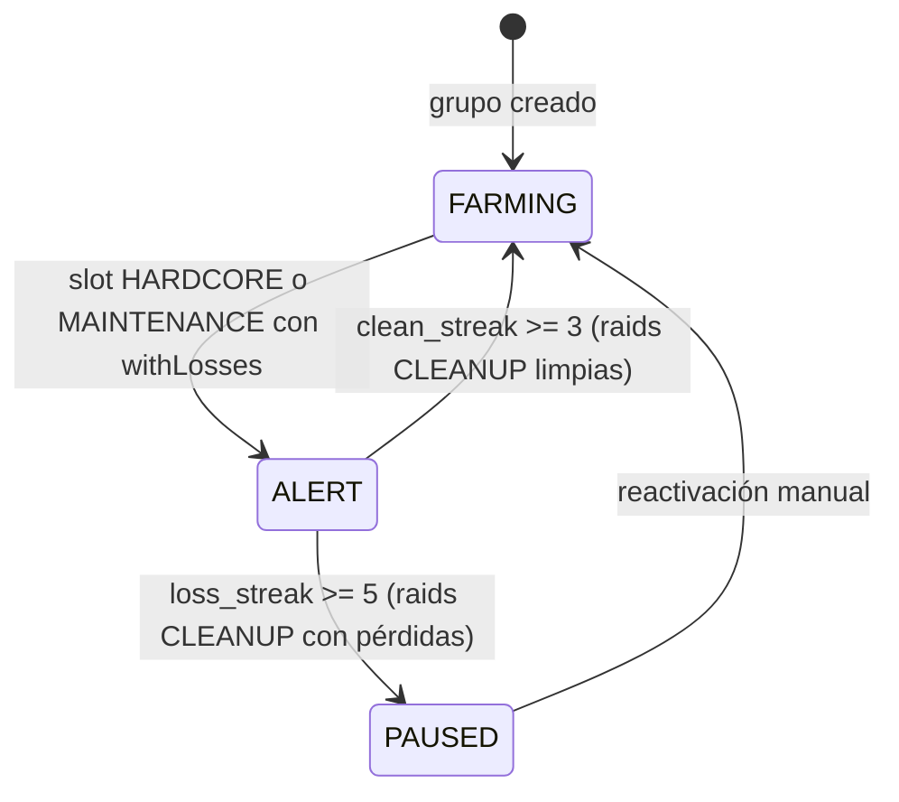

# Oasis Farming Automatizado

## 1. Objetivo de negocio

Automatizar el farming de oasis de forma indetectable para maximizar el botín de recursos mientras el bot permanece activo 24/7.

El usuario ya tiene en Travian farm lists organizadas por rol: listas cuyo contenido son slots que apuntan a oasis. El bot lee el campo `role` de cada `FarmScheduler` y aplica la lógica de ciclo de actividad correspondiente:

- **OASIS_HARDCORE**: envío agresivo cada 5:40-8:10 min (340-490 s). Equipo por slot: 2TT.
- **OASIS_MAINTENANCE**: envío moderado cada ~25 min ±20%. Equipo por slot: 4TT.
- **OASIS_CLEANUP**: activación manual por el WorldAgent cuando hay pérdidas. Equipo por slot: 1 Espada + 1TT + 1 Haeduan.
- **VILLAGE**: farm lists normales (vacas). Lógica existente, sin cambios.

Las listas HARDCORE + MAINTENANCE + CLEANUP que cubren los mismos oasis forman un **grupo de oasis** (`oasis_group_id`). La máquina de estados opera a nivel de grupo: si un slot de la lista HARDCORE detecta pérdidas, el WorldAgent activa la lista CLEANUP del mismo grupo.

Esta feature es exclusivamente de backend/lógica de negocio + BD. **No expone ni consume endpoints HTTP** (la interacción con el usuario se realiza a través del frontend de farm lists existente una vez el dashboard de oasis se diseñe en una feature posterior). Por eso `apis_validadas_por_desarrollador_apis: n-a`.

---

## 1b. Dependencias de otros specs

**Este spec presupone que `docs/specs/human-sessions.md` está implementado.**

El WorldAgent solo encola tareas `SEND_OASIS_RAID` (para cualquier rol OASIS_*) cuando la sesión activa es `HARDCORE_SESSION`, según el estado gestionado por `HumanSessionState` en `human-sessions.md`.

El algoritmo de oasis definido en este spec **no necesita saber en qué sesión está**: simplemente no recibe ticks durante `REST_SESSION`, porque el WorldAgent no encola nuevas tareas OASIS fuera de HARDCORE. Al reactivarse (`REST → HARDCORE`), el WorldAgent llama a `seed_oasis_groups_from_db()` (definido en §9.4 de este spec) para recuperar el estado de los grupos desde BD y reencolar según las bandas de wake-up.

El arranque conservador (warmup 20-30 min en REST antes del primer HARDCORE) también es responsabilidad de `human-sessions.md`, no de este spec.

**Orden de implementación:**
1. `human-sessions.md` — define `SessionMode`, `HumanSessionState`, `_init_human_session()`, `_check_and_transition_session()`.
2. Este spec (`oasis-farming.md`) — define las entidades, grupos, máquina de estados y los métodos del WorldAgent para oasis, que dependen de que `session_mode` exista.

---

## 2. Actores y permisos

| Actor | Rol |
|---|---|
| Bot (WorldAgent) | Ejecuta el bucle de oasis de forma autónoma. Lee `role` y `oasis_group_id` de cada `FarmScheduler` para decidir qué lógica aplicar. Modifica el estado de los grupos (`oasis_groups`) en tiempo real. |
| Usuario | Registra listas con su rol en `farm_schedulers`, configura el `oasis_group_id` para agrupar listas relacionadas. Interviene manualmente para sacar un grupo de PAUSED. No interactúa durante el ciclo normal. |
| Sistema (BD SQLite) | Persiste roles, grupos y el estado de cada grupo de oasis. |

No hay roles de autorización diferenciados: el bot corre en sesión única por mundo (un WorldAgent por world_id).

---

## 3. Alcance

### Dentro del alcance

- Nuevo campo `role TEXT NOT NULL DEFAULT 'VILLAGE'` en `farm_schedulers`.
- Nuevo campo `oasis_group_id INTEGER` (NULL para VILLAGE) en `farm_schedulers`.
- Nueva tabla `oasis_groups` con máquina de estados a nivel de grupo: FARMING → ALERT → PAUSED.
- Entidad `OasisGroup` + enum `OasisGroupState` en el core.
- Puerto `OasisGroupDbPort` con su adaptador SQLite `OasisGroupSQLiteAdapter`.
- Use case `OasisGroupUseCase` para las transiciones de estado del grupo.
- Dos roles de timing de oasis (`OASIS_HARDCORE` e `OASIS_MAINTENANCE`) con sus intervalos propios: el WorldAgent decide cuándo encolarlos según el ciclo de sesiones de `human-sessions.md`.
- Wake-up inteligente al reactivar el bot: bandas por tiempo transcurrido, aplicadas al nivel de grupo.
- Offset incremental anti-detección entre grupos en el wake-up (C2 — guardian).
- Distribución bimodal de intervalos HARDCORE (C3 — guardian).
- Cálculo de `travel_time` usando velocidad de tropa + server_speed (sin bonus de plaza de torneos, WIP).
- `TaskType.SEND_OASIS_RAID` como nuevo tipo en el enum existente.
- Reutilización de `FarmListBrowserPort.send_farm_list(farm_list_id)` sin modificación.
- Los 21 endpoints existentes de farm lists no se tocan: `role` y `oasis_group_id` son campos opacos para esas rutas.

### Fuera del alcance (WIP explícito)

- Parseo completo del informe de batalla (animales muertos, bajas por tipo). Se usa `last_raid_state` del DOM del slot.
- Bonus de plaza de torneos en `travel_time`. La fórmula asume velocidad base.
- Notificación push al usuario cuando un grupo entra en PAUSED (requiere feature de notificaciones).
- UI/Dashboard de oasis (requiere feature de diseño de producto separada).
- Detección automática de tipo de oasis desde el DOM. El usuario configura el rol en la farm list manualmente.
- Farming de oasis de tipo Crop (excluidos de esta versión: demasiados peligros sin parseo completo de informe).
- Modificación dinámica del equipo en el DOM de Travian (el equipo ya está configurado manualmente por el usuario en cada farm list).

---

## 4. Reglas de negocio

### RN-O01 — Tipos de oasis soportados
Los slots de las listas con rol OASIS_* apuntan a oasis Iron, Iron+crop, Clay, Clay+crop, Wood o Wood+clay. Los oasis Crop quedan fuera del alcance hasta que exista parseo de informes (ver §3 WIP). El bot no valida el tipo de oasis de cada slot; el usuario es responsable de la configuración.

### RN-O02 — Timers de respawn exactos (referencia)
Los animales respawnean a intervalos fijos. El intervalo de HARDCORE (340-490 s) está calibrado para el peor caso de Iron/Clay (3 arañas a 6 min, 2 murciélagos a 8 min). El equipo de 2TT es el mínimo que liquida ese peor caso sin pérdidas para Galos:

```
Rata:5'  Araña:6'  Serpiente:7'  Murciélago:8'  Jabalí:9'
Lobo:10' Oso:11'  Cocodrilo:12' Tigre:13'      Elefante:14'
```

### RN-O03 — Roles de farm list
Un `FarmScheduler` tiene un campo `role` con uno de estos valores:

| Valor | Significado |
|---|---|
| `VILLAGE` | Farm list normal (vacas). Comportamiento existente sin cambios. |
| `OASIS_HARDCORE` | Envío agresivo cada 340-490 s. Equipo por slot: 2TT. |
| `OASIS_MAINTENANCE` | Envío moderado cada 1.200.000-1.800.000 ms (~25 min ±20%). Equipo por slot: 4TT. |
| `OASIS_CLEANUP` | Sin scheduler propio. Activada manualmente por el WorldAgent al detectar pérdidas en el grupo. Equipo por slot: 1 Espada + 1TT + 1 Haeduan. |

### RN-O04 — Grupos de oasis
Las listas OASIS_HARDCORE + OASIS_MAINTENANCE + OASIS_CLEANUP del mismo `oasis_group_id` forman un grupo. Un mundo puede tener múltiples grupos (para repartir oasis entre grupos de gestión). La lista VILLAGE nunca tiene `oasis_group_id`.

### RN-O05 — Máquina de estados del grupo
El estado vive en la tabla `oasis_groups`, no en las farm lists. Opera a nivel de grupo:

```
FARMING → ALERT   : cualquier slot de HARDCORE del grupo devuelve withLosses
ALERT   → FARMING : 3 raids CLEANUP del grupo sin pérdidas (clean_streak >= 3)
ALERT   → PAUSED  : 5+ raids CLEANUP del grupo con pérdidas (loss_streak >= 5)
PAUSED  → FARMING : intervención manual del usuario (ReactivateOasisGroupUseCase)
```

### RN-O06 — La lista CLEANUP no tiene scheduler propio
El `FarmScheduler` con rol OASIS_CLEANUP puede tener `is_enabled = False` (el bot no lo dispara periódicamente). El WorldAgent lo activa directamente cuando el grupo está en estado ALERT, llamando a `FarmListBrowserPort.send_farm_list(cleanup_scheduler.farm_list_ids[0])`. Tras la CLEANUP, según la respuesta, aplica la transición correspondiente (§9.3).

### RN-O07 — Consecuencia aceptada: CLEANUP es a nivel de grupo
Si 1 oasis del grupo tiene un animal peligroso, los slots de CLEANUP del mismo grupo (que apuntan a todos los oasis del grupo) reciben la raid de limpieza. Es conservador pero simple y seguro. No hay CLEANUP por oasis individual en esta versión.

### RN-O08 — Señal de pérdidas a nivel de slot
Después de llamar a `send_farm_list(hardcore_list_id)`, el WorldAgent lee el estado de los slots vía `read_farm_list(hardcore_list_id)`. Si **cualquier slot** devuelve `last_raid_state` con `"withLosses"`, se registra como pérdida a nivel de grupo. El bot es conservador: 1 slot con pérdidas activa el protocolo de limpieza del grupo entero.

### RN-O09 — Dependencia del ciclo de sesiones global

El WorldAgent solo encola tareas `SEND_OASIS_RAID` (para cualquier rol OASIS_*) cuando la sesión activa es `HARDCORE_SESSION`, según el estado gestionado por `human-sessions.md`. Durante `REST_SESSION`, ninguna tarea de oasis se encola ni reencola.

El algoritmo de oasis no necesita conocer en qué sesión está: simplemente no recibe ticks durante `REST_SESSION` porque el WorldAgent no encola nuevas tareas OASIS. Al reactivarse (`REST → HARDCORE`), el WorldAgent llama a `seed_oasis_groups_from_db()` para recuperar el estado de los grupos y reencolar según las bandas de wake-up (§9.4).

**Referencia:** Ver spec `docs/specs/human-sessions.md` para la lógica de alternancia HARDCORE_SESSION / REST_SESSION, duración de sesiones y multiplicadores de intervalo.

### RN-O10 — Cálculo de travel_time
```
travel_time_minutes = distance_fields / (troop_speed_fph * server_speed) * 60
```
Donde `distance_fields` está disponible en `FarmSlot.distance`, `troop_speed_fph` es la velocidad de la tropa en campos/hora y `server_speed` es `World.server_speed`. Usado en el wake-up inteligente para calcular delays. Sin bonus de plaza de torneos (WIP).

Velocidades de referencia (Galos):
- TT (Theutates Thunder): 19 campos/hora
- Haeduan: 13 campos/hora
- Espada: ~7 campos/hora

### RN-O11 — Prioridad de tareas
Las tareas `SEND_OASIS_RAID` tienen `priority=2`. Las farm lists VILLAGE (`SEND_FARM_LIST_GROUP`) tienen `priority=1`. Si coinciden en el mismo instante, las farm lists de vacas tienen preferencia.

### RN-O12 — Pausa entre listas consecutivas (anti-detección)
Entre el envío de listas de oasis consecutivas dentro del mismo tick, el bot aplica una pausa aleatoria de 2-5 segundos (mismo patrón que el `_GROUP_GAP` de farm lists en `adapters/browser/farm_list_sender.py`).

### RN-O13 — TTL del historial de raids de oasis
El historial en `oasis_group_raid_history` se purga automáticamente tras 30 días (vs 7 días de farm lists — los grupos necesitan historial más largo para detectar patrones a lo largo del tiempo).

### RN-O14 — Grupo en PAUSED no genera tareas
Un grupo en estado PAUSED no genera nuevas tareas SEND_OASIS_RAID para ninguna de sus listas. Requiere intervención manual explícita (`ReactivateOasisGroupUseCase`) para volver a FARMING.

---

## 5. Flujo principal y flujos alternativos

### Flujo principal — tick de fase HARDCORE (grupo en estado FARMING)

```
1. WorldAgent.run() saca tarea SEND_OASIS_RAID de la TaskQueue (execute_at <= now).
   payload = {"oasis_group_id": G, "role": "OASIS_HARDCORE"}
2. OasisGroupUseCase.execute_hardcore(group_id=G):
   a. Lee grupo de BD → verifica state == FARMING.
   b. Obtiene el FarmScheduler con role=OASIS_HARDCORE y oasis_group_id=G.
   c. Llama FarmListBrowserPort.send_farm_list(hardcore_scheduler.farm_list_ids[0]).
   d. Llama FarmListBrowserPort.read_farm_list(hardcore_list_id).
   e. Recorre slots: si alguno devuelve "withLosses" → had_losses = True.
   f. Si had_losses:
      - Actualiza grupo: state=ALERT, loss_streak=1, clean_streak=0.
      - Registra en oasis_group_raid_history.
      - Activa CLEANUP del grupo (§5 flujo ALERT).
   g. Si sin pérdidas:
      - Registra en oasis_group_raid_history.
3. WorldAgent reencola la tarea HARDCORE con intervalo bimodal (C3).
```

### Flujo alternativo — tick de fase MAINTENANCE (grupo en estado FARMING)

```
1. WorldAgent saca tarea SEND_OASIS_RAID con role=OASIS_MAINTENANCE.
2. OasisGroupUseCase.execute_maintenance(group_id=G):
   a. Verifica estado FARMING.
   b. Llama send_farm_list(maintenance_list_id).
   c. Llama read_farm_list(maintenance_list_id).
   d. Si algún slot devuelve withLosses → mismo protocolo que HARDCORE (→ ALERT + CLEANUP).
   e. Sin pérdidas → registra historial.
3. WorldAgent reencola MAINTENANCE con intervalo ±20%.
```

### Flujo alternativo — grupo en estado ALERT (activación de CLEANUP)

```
1. WorldAgent detecta que el grupo pasó a ALERT.
2. Cancela (o ignora el reencole de) las tareas HARDCORE y MAINTENANCE del grupo.
3. Llama send_farm_list(cleanup_list_id) directamente (sin esperar al scheduler).
4. Llama read_farm_list(cleanup_list_id).
5. Evalúa slots:
   - Sin pérdidas → clean_streak += 1.
     Si clean_streak >= 3 → state=FARMING, encola de nuevo HARDCORE y MAINTENANCE.
   - Con pérdidas → loss_streak += 1, clean_streak = 0.
     Si loss_streak >= 5 → state=PAUSED + log de aviso.
6. Reencola tarea CLEANUP para ~25 min si el grupo sigue en ALERT.
```

### Flujo alternativo — reactivación manual desde PAUSED

```
1. Usuario llama ReactivateOasisGroupUseCase(group_id).
2. Use case resetea estado: state=FARMING, clean_streak=0, loss_streak=0.
3. WorldAgent reencola las tareas HARDCORE y MAINTENANCE del grupo.
```

### Flujo alternativo — arranque del bot (wake-up inteligente)

Ver sección §9.4 para el pseudocódigo completo de `seed_oasis_groups_from_db()`.

---

## 6. Edge cases

| ID | Situación | Tratamiento |
|---|---|---|
| EC-O01 | Grupo nuevo (ningún raid previo, last_raid_time == '') | elapsed = ∞ → Banda 3 (>90 min) → arrancar en MAINTENANCE primero. |
| EC-O02 | Bot arranca y grupo.state == FARMING, elapsed < 10 min | Banda 1: encolar directo con delay corto (30-90 s). |
| EC-O03 | Bot arranca y grupo.state == ALERT o PAUSED | Respeta el estado persistido. No resetea automáticamente. PAUSED: no encolar. ALERT: encolar solo CLEANUP. |
| EC-O04 | send_farm_list() falla (FarmListSendError / FarmListPageError) | Se loguea, el grupo NO cambia de estado, la tarea se reencola con el intervalo normal. |
| EC-O05 | read_farm_list() devuelve slots sin last_raid_state (vacío) | Se considera "sin datos nuevos". No se penaliza el grupo. Se registra en historial con raid_state="". |
| EC-O06 | Grupo en ALERT: todas las raids CLEANUP son limpias pero clean_streak se corta por error de red | EC-O04 aplica: el error no cambia estado ni incrementa counters. Solo raids con dato real cuentan. |
| EC-O07 | FarmScheduler con role=OASIS_CLEANUP no tiene farm_list asignada | Se loguea un error de configuración, el grupo queda en ALERT pero no escala a PAUSED por este motivo. Se notifica en log. |
| EC-O08 | Múltiples grupos en el mismo mundo | Cada grupo es independiente. El fallo de un grupo (PAUSED) no para los demás. |
| EC-O09 | oasis_group_id configurado en VILLAGE por error | El WorldAgent ignora `oasis_group_id` para schedulers con role=VILLAGE. No crea OasisGroup. |
| EC-O10 | Grupo en FARMING recibe withLosses en una raid de MAINTENANCE | Mismo protocolo que HARDCORE: → ALERT + CLEANUP. El campo que detecta la pérdida no importa, el protocolo es idéntico. |
| EC-O11 | Bot se reinicia mientras hay raids en vuelo | Al rearrancar, el WorldAgent lee el last_raid_state que encuentre en BD en los slots. Si el informe llegó en el gap, lo procesa en el siguiente tick. |
| EC-O12 | Dos schedulers HARDCORE en el mismo oasis_group_id | Error de configuración del usuario. El WorldAgent usa el primero que encuentre (ORDER BY id ASC) y loguea una advertencia. |
| EC-O13 | FarmScheduler OASIS_CLEANUP con is_enabled=True | El WorldAgent puede ignorar el scheduler periódico y siempre controlarlo manualmente. Si el usuario lo habilita como scheduler normal (is_enabled=True), no interfiere: simplemente tendrá un scheduler extra que puede convivir. Sin embargo, la lógica de activación por pérdidas es la que controla el ciclo; el scheduler periódico de CLEANUP no aplica transiciones de estado al grupo. |

---

## 7. Modelo de datos / cambios de esquema

### 7.1 Modificación a `farm_schedulers` (tabla existente)

Añadir dos columnas. DDL de migración:

```sql
ALTER TABLE farm_schedulers ADD COLUMN role TEXT NOT NULL DEFAULT 'VILLAGE';
ALTER TABLE farm_schedulers ADD COLUMN oasis_group_id INTEGER;

CREATE INDEX IF NOT EXISTS idx_farm_schedulers_role
    ON farm_schedulers(world_id, role);
CREATE INDEX IF NOT EXISTS idx_farm_schedulers_group
    ON farm_schedulers(oasis_group_id)
    WHERE oasis_group_id IS NOT NULL;
```

**Decisión — por qué `role` vive en `FarmScheduler` y no en `FarmList`:**
- El `FarmScheduler` ya controla el timing de cada lista. Añadir `role` aquí es el cambio mínimo (2 columnas nuevas) sin tocar `farm_lists`, `farm_slots` ni los 21 endpoints existentes.
- El rol es una propiedad del scheduling (cómo se dispara), no del contenido de la lista.
- `oasis_group_id` en el scheduler permite agrupar directamente las listas A+B+C sin tabla pivot adicional.

**Compatibilidad retroactiva:** El valor por defecto `'VILLAGE'` garantiza que todos los schedulers existentes mantienen el comportamiento actual sin ninguna migración de datos.

### 7.2 Tabla nueva: `oasis_groups`

```sql
CREATE TABLE IF NOT EXISTS oasis_groups (
    id           INTEGER PRIMARY KEY AUTOINCREMENT,
    world_id     INTEGER NOT NULL REFERENCES worlds(id),
    name         TEXT    NOT NULL DEFAULT '',   -- nombre descriptivo (usuario lo asigna)
    state        TEXT    NOT NULL DEFAULT 'FARMING',  -- OasisGroupState
    clean_streak INTEGER NOT NULL DEFAULT 0,   -- raids CLEANUP limpias consecutivas
    loss_streak  INTEGER NOT NULL DEFAULT 0,   -- raids CLEANUP con pérdidas consecutivas
    last_raid_time TEXT  NOT NULL DEFAULT '',  -- ISO timestamp última raid del grupo
    last_raid_role TEXT  NOT NULL DEFAULT '',  -- OASIS_HARDCORE | OASIS_MAINTENANCE | OASIS_CLEANUP
    paused_reason  TEXT  NOT NULL DEFAULT ''   -- motivo de PAUSED (para log/UI futura)
);

CREATE INDEX IF NOT EXISTS idx_oasis_groups_world ON oasis_groups(world_id);
```

**Decisión — por qué no hay tabla `oasis` individual:**
El modelo anterior (1 oasis = 1 entidad con estado propio) fue descartado porque en Travian los oasis son slots dentro de listas, no entidades independientes. No existe una entidad "oasis" con identidad propia en el sistema. La unidad mínima de gestión es el grupo de listas, que comparten el mismo conjunto de oasis.

### 7.3 Tabla nueva: `oasis_group_raid_history`

```sql
CREATE TABLE IF NOT EXISTS oasis_group_raid_history (
    id              INTEGER PRIMARY KEY AUTOINCREMENT,
    oasis_group_id  INTEGER NOT NULL REFERENCES oasis_groups(id) ON DELETE CASCADE,
    world_id        INTEGER NOT NULL,
    timestamp       TEXT    NOT NULL,   -- ISO timestamp UTC
    state_before    TEXT    NOT NULL,   -- OasisGroupState antes del raid
    state_after     TEXT    NOT NULL,   -- OasisGroupState después del raid
    raid_role       TEXT    NOT NULL,   -- OASIS_HARDCORE | OASIS_MAINTENANCE | OASIS_CLEANUP
    had_losses      INTEGER NOT NULL DEFAULT 0,   -- 1 si algún slot devolvió withLosses
    slots_snapshot  TEXT    NOT NULL DEFAULT '[]' -- JSON: [{slot_id, last_raid_state}] del momento
);

CREATE INDEX IF NOT EXISTS idx_oasis_group_history_group
    ON oasis_group_raid_history(oasis_group_id, timestamp);
CREATE INDEX IF NOT EXISTS idx_oasis_group_history_world
    ON oasis_group_raid_history(world_id, timestamp);
```

TTL: 30 días. La purga se realiza en `add_oasis_group_raid_record()`.

### 7.4 Modificación a `TaskType` (core/entities/task.py)

```python
class TaskType(str, Enum):
    SEND_FARM_LIST_GROUP = "SEND_FARM_LIST_GROUP"
    SEND_OASIS_RAID      = "SEND_OASIS_RAID"   # NUEVO
```

### 7.5 Enums y entidades nuevas en el core

#### `FarmSchedulerRole` (core/entities/farm_scheduler.py)

```python
class FarmSchedulerRole(str, Enum):
    VILLAGE            = "VILLAGE"
    OASIS_HARDCORE     = "OASIS_HARDCORE"
    OASIS_MAINTENANCE  = "OASIS_MAINTENANCE"
    OASIS_CLEANUP      = "OASIS_CLEANUP"
```

#### `OasisGroupState` (core/entities/oasis_group.py)

```python
class OasisGroupState(str, Enum):
    FARMING = "FARMING"
    ALERT   = "ALERT"
    PAUSED  = "PAUSED"
```

#### `OasisGroup` (core/entities/oasis_group.py)

```python
@dataclass
class OasisGroup:
    id: int
    world_id: int
    name: str = ""
    state: str = OasisGroupState.FARMING   # OasisGroupState enum value
    clean_streak: int = 0    # raids CLEANUP limpias consecutivas (para salir de ALERT)
    loss_streak: int = 0     # raids CLEANUP con pérdidas consecutivas (para entrar en PAUSED)
    last_raid_time: str = "" # ISO timestamp
    last_raid_role: str = "" # OASIS_HARDCORE | OASIS_MAINTENANCE | OASIS_CLEANUP
    paused_reason: str = ""
```

#### `OasisGroupRaidRecord` (core/entities/oasis_group.py)

```python
@dataclass
class OasisGroupRaidRecord:
    oasis_group_id: int
    world_id: int
    timestamp: datetime
    state_before: str
    state_after: str
    raid_role: str
    had_losses: bool
    slots_snapshot: list[dict]   # [{slot_id, last_raid_state}]
    id: int = 0
```

#### `FarmScheduler` actualizado (core/entities/farm_scheduler.py)

Añadir dos campos al dataclass existente:

```python
@dataclass
class FarmScheduler:
    # ... campos existentes sin cambios ...
    role: str = FarmSchedulerRole.VILLAGE   # NUEVO
    oasis_group_id: int | None = None       # NUEVO — None para VILLAGE
```

---

## 8. Contratos de API / interfaces

No aplica. Esta feature no expone ni consume endpoints HTTP en esta versión. La interacción del usuario con los grupos de oasis se realizará a través de un dashboard futuro (feature independiente de diseño de producto).

Los puertos nuevos son contratos internos del core (Python ABC), no contratos HTTP.

### 8.1 Puerto nuevo: `OasisGroupDbPort` (core/ports/oasis_group_db_port.py)

```python
class OasisGroupDbPort(ABC):

    @abstractmethod
    async def create_oasis_group(self, group: OasisGroup) -> OasisGroup: ...
    """Crea un grupo nuevo. Lanza OasisGroupAlreadyExistsError si ya existe un grupo
    con el mismo (world_id, name). Devuelve el grupo con id asignado."""

    @abstractmethod
    async def get_oasis_group(self, group_id: int) -> OasisGroup: ...
    """Lanza OasisGroupNotFoundError si no existe."""

    @abstractmethod
    async def get_oasis_groups_by_world(self, world_id: int) -> list[OasisGroup]: ...
    """Devuelve todos los grupos del mundo (incluyendo PAUSED)."""

    @abstractmethod
    async def update_oasis_group_state(
        self,
        group_id: int,
        *,
        state: str,
        clean_streak: int,
        loss_streak: int,
        last_raid_time: str,
        last_raid_role: str,
        paused_reason: str,
    ) -> OasisGroup: ...
    """Actualiza solo los campos de estado (no name, no world_id)."""

    @abstractmethod
    async def add_oasis_group_raid_record(self, record: OasisGroupRaidRecord) -> None: ...
    """Inserta registro histórico y purga los >30 días para el world_id."""

    @abstractmethod
    async def get_oasis_group_raid_history(
        self,
        group_id: int,
        *,
        limit: int = 50,
    ) -> list[OasisGroupRaidRecord]: ...

    @abstractmethod
    async def reactivate_oasis_group(self, group_id: int) -> OasisGroup: ...
    """Resetea state=FARMING, clean_streak=0, loss_streak=0, paused_reason=''."""
```

**Convención:** `OasisGroupDbPort` NO extiende `FarmListDbPort`. Puerto independiente (SRP, misma convención que el resto del proyecto).

### 8.2 Utilidad nueva: `calculate_travel_time` (core/utils/travel_time.py)

```python
def calculate_travel_time(
    distance: float,
    troop_speed_fph: float,
    server_speed: float,
) -> float:
    """
    Calcula el tiempo de viaje en minutos.

    distance        — distancia en campos (FarmSlot.distance).
    troop_speed_fph — velocidad de la tropa en campos/hora.
    server_speed    — multiplicador de velocidad del servidor (World.server_speed).

    Fórmula: travel_time_min = distance / (troop_speed_fph * server_speed) * 60

    Sin bonus de plaza de torneos (WIP).
    Lanza ValueError si troop_speed_fph <= 0 o server_speed <= 0.
    """
```

---

## 9. Flujo lógico paso a paso (pseudocódigo / mermaid)

### 9.1 Máquina de estados del grupo



**Nota importante:** La máquina de estados NO tiene estados COLD_START ni STABILIZING. El spec anterior los modelaba porque asumía una entidad Oasis separada. En el modelo de roles, los oasis ya están en producción (el usuario los configura en Travian antes de activar el bot). El grupo arranca directamente en FARMING.

### 9.2 OasisGroupUseCase — lógica de transición

```python
class OasisGroupUseCase:
    """
    Gestiona las transiciones de estado de los grupos de oasis.
    Inyecta FarmListBrowserPort (reutilizado) + OasisGroupDbPort + FarmListDbPort.
    """

    async def execute_raid(
        self,
        group_id: int,
        world_id: int,
        raid_role: str,  # OASIS_HARDCORE | OASIS_MAINTENANCE | OASIS_CLEANUP
        farm_list_id: int,
    ) -> None:
        group = await self._oasis_db.get_oasis_group(group_id)
        if group.state == OasisGroupState.PAUSED:
            return  # grupo pausado, no hacer nada

        state_before = group.state
        now = datetime.now()

        # 1. Enviar la farm list correspondiente al rol
        try:
            await self._browser.send_farm_list(farm_list_id)
        except (FarmListSendError, FarmListPageError) as exc:
            log.error("OasisGroup %d: error envío %s — %s", group_id, raid_role, exc)
            return  # EC-O04: no cambiar estado, reencolar con intervalo normal

        # 2. Leer resultado de los slots
        try:
            farm_list = await self._browser.read_farm_list(farm_list_id)
        except Exception as exc:
            log.error("OasisGroup %d: error lectura %s — %s", group_id, raid_role, exc)
            return  # EC-O05: sin datos, no penalizar

        # 3. Detectar pérdidas en cualquier slot
        slots_snapshot = [
            {"slot_id": s.id, "last_raid_state": s.last_raid_state}
            for s in farm_list.slots
        ]
        had_losses = any(
            "withLosses" in s.last_raid_state or "lost" in s.last_raid_state
            for s in farm_list.slots
            if s.last_raid_state  # EC-O05: ignorar vacíos
        )

        # 4. Aplicar transición según estado actual y resultado
        new_state = group.state
        new_clean = group.clean_streak
        new_loss = group.loss_streak
        paused_reason = group.paused_reason

        if group.state == OasisGroupState.FARMING:
            if had_losses:
                new_state = OasisGroupState.ALERT
                new_clean = 0
                new_loss = 1

        elif group.state == OasisGroupState.ALERT:
            # Solo las raids CLEANUP cuentan para salir de ALERT
            if raid_role == FarmSchedulerRole.OASIS_CLEANUP:
                if had_losses:
                    new_loss += 1
                    new_clean = 0
                    if new_loss >= 5:
                        new_state = OasisGroupState.PAUSED
                        paused_reason = "repeated_losses_in_cleanup"
                else:
                    new_clean += 1
                    new_loss = 0
                    if new_clean >= 3:
                        new_state = OasisGroupState.FARMING
                        new_clean = 0
                        new_loss = 0

        # 5. Persistir estado
        updated = await self._oasis_db.update_oasis_group_state(
            group_id,
            state=new_state,
            clean_streak=new_clean,
            loss_streak=new_loss,
            last_raid_time=now.isoformat(),
            last_raid_role=raid_role,
            paused_reason=paused_reason,
        )

        # 6. Historial
        await self._oasis_db.add_oasis_group_raid_record(OasisGroupRaidRecord(
            oasis_group_id=group_id,
            world_id=world_id,
            timestamp=now,
            state_before=state_before,
            state_after=new_state,
            raid_role=raid_role,
            had_losses=had_losses,
            slots_snapshot=slots_snapshot,
        ))

        # 7. Si el grupo acaba de entrar en ALERT, activar CLEANUP inmediatamente
        if new_state == OasisGroupState.ALERT and state_before == OasisGroupState.FARMING:
            log.warning(
                "OasisGroup %d: pérdidas detectadas en %s → ALERT. Activando CLEANUP.",
                group_id, raid_role,
            )
            await self._trigger_cleanup(group_id, world_id)

        # 8. Si el grupo acaba de entrar en PAUSED, loguear aviso
        if new_state == OasisGroupState.PAUSED and state_before != OasisGroupState.PAUSED:
            log.warning(
                "OasisGroup %d: PAUSED tras %d raids CLEANUP con pérdidas. Motivo: %s",
                group_id, new_loss, paused_reason,
            )

    async def _trigger_cleanup(self, group_id: int, world_id: int) -> None:
        """
        Activa la lista CLEANUP del grupo de forma directa (sin esperar scheduler).
        Busca el FarmScheduler con role=OASIS_CLEANUP y oasis_group_id=group_id.
        """
        schedulers = await self._farm_db.get_schedulers_by_world(world_id)
        cleanup = next(
            (s for s in schedulers
             if s.role == FarmSchedulerRole.OASIS_CLEANUP
             and s.oasis_group_id == group_id
             and s.farm_list_ids),
            None,
        )
        if cleanup is None:
            log.error(
                "OasisGroup %d: no hay scheduler CLEANUP configurado (EC-O07).",
                group_id,
            )
            return
        await self.execute_raid(
            group_id=group_id,
            world_id=world_id,
            raid_role=FarmSchedulerRole.OASIS_CLEANUP,
            farm_list_id=cleanup.farm_list_ids[0],
        )
```

### 9.3 Lógica de activación en WorldAgent._execute()

```python
async def _execute(self, task: Task) -> None:
    try:
        if task.task_type == TaskType.SEND_FARM_LIST_GROUP:
            # ... lógica existente sin cambios ...

        elif task.task_type == TaskType.SEND_OASIS_RAID:
            group_id   = task.payload["oasis_group_id"]
            raid_role  = task.payload["role"]     # OASIS_HARDCORE | OASIS_MAINTENANCE
            list_id    = task.payload["farm_list_id"]
            self._log_act("info", f"OasisGroup={group_id} raid role={raid_role}…")
            await self._oasis_use_case.execute_raid(
                group_id=group_id,
                world_id=self.world_id,
                raid_role=raid_role,
                farm_list_id=list_id,
            )
            self._log_act("ok", f"OasisGroup={group_id} raid {raid_role} completada")

        else:
            log.warning("Tipo de tarea desconocido: %s", task.task_type)

    except asyncio.CancelledError:
        raise
    except Exception as exc:
        self.state = AgentState.ERROR
        self.last_error = str(exc)
        self._log_act("error", f"Error en {task.task_type}: {exc}")
        log.exception("Fallo ejecutando %s en mundo %d", task.task_type, self.world_id)
```

### 9.4 Wake-up inteligente: `seed_oasis_groups_from_db()`

Al reactivar el bot, análogo a `seed_from_schedulers()`. Opera sobre los grupos (no sobre las listas individuales):

```python
async def seed_oasis_groups_from_db(self) -> int:
    """
    Reconstruye la cola de oasis en memoria a partir de los grupos persistidos.
    Devuelve cuántos grupos se encolaron.
    """
    groups = await self._oasis_db.get_oasis_groups_by_world(self.world_id)
    schedulers = await self._db.get_schedulers_by_world(self.world_id)
    now = datetime.now()
    enqueued = 0

    # Índices auxiliares
    hardcore_by_group = {
        s.oasis_group_id: s
        for s in schedulers
        if s.role == FarmSchedulerRole.OASIS_HARDCORE and s.oasis_group_id is not None
    }
    maintenance_by_group = {
        s.oasis_group_id: s
        for s in schedulers
        if s.role == FarmSchedulerRole.OASIS_MAINTENANCE and s.oasis_group_id is not None
    }

    for i, group in enumerate(groups):
        if group.state == OasisGroupState.PAUSED:
            continue  # EC-O03: no encolar — requiere intervención manual

        # Calcular elapsed desde último raid
        elapsed_min = (
            (now - datetime.fromisoformat(group.last_raid_time)).total_seconds() / 60
            if group.last_raid_time
            else float("inf")   # EC-O01: grupo nuevo, tratar como Banda 3
        )

        # C2 (guardian): offset incremental entre grupos para evitar burst
        burst_offset = i * random.uniform(3, 8)  # segundos

        if elapsed_min < 10:
            # Banda 1: grupo reciente → retomar en la fase actual
            execute_at = now + timedelta(seconds=burst_offset + random.uniform(30, 90))
            self._enqueue_oasis_group(group, hardcore_by_group, maintenance_by_group, execute_at)

        elif elapsed_min < 90:
            # Banda 2: acumulación moderada → arrancar con MAINTENANCE antes de HARDCORE
            execute_at = now + timedelta(seconds=burst_offset + random.uniform(60, 180))
            maintenance = maintenance_by_group.get(group.id)
            if maintenance and maintenance.farm_list_ids:
                self._queue.add(Task(
                    task_type=TaskType.SEND_OASIS_RAID,
                    world_id=self.world_id,
                    execute_at=execute_at,
                    priority=2,
                    payload={
                        "oasis_group_id": group.id,
                        "role": FarmSchedulerRole.OASIS_MAINTENANCE,
                        "farm_list_id": maintenance.farm_list_ids[0],
                    },
                    recurring=True,
                ))
                enqueued += 1

        else:
            # Banda 3: gap largo → CLEANUP antes de retomar (si el grupo estaba en FARMING)
            execute_at = now + timedelta(seconds=burst_offset + random.uniform(120, 300))
            if group.state == OasisGroupState.FARMING:
                # Forzar estado a ALERT para que execute_raid active CLEANUP al ejecutar
                # (la lógica de OasisGroupUseCase.execute_raid en estado FARMING+losses no
                # aplica aquí; se activa CLEANUP directamente marcando el grupo en ALERT)
                await self._oasis_db.update_oasis_group_state(
                    group.id,
                    state=OasisGroupState.ALERT,
                    clean_streak=0,
                    loss_streak=0,
                    last_raid_time=group.last_raid_time,
                    last_raid_role=group.last_raid_role,
                    paused_reason="wake_up_gap_over_90min",
                )
            # Solo encolar CLEANUP
            cleanup_schedulers = [
                s for s in schedulers
                if s.role == FarmSchedulerRole.OASIS_CLEANUP
                and s.oasis_group_id == group.id
                and s.farm_list_ids
            ]
            if cleanup_schedulers:
                cleanup = cleanup_schedulers[0]
                self._queue.add(Task(
                    task_type=TaskType.SEND_OASIS_RAID,
                    world_id=self.world_id,
                    execute_at=execute_at,
                    priority=2,
                    payload={
                        "oasis_group_id": group.id,
                        "role": FarmSchedulerRole.OASIS_CLEANUP,
                        "farm_list_id": cleanup.farm_list_ids[0],
                    },
                    recurring=False,  # CLEANUP no es recurrente en este contexto
                ))
                enqueued += 1

    log.info("Mundo %d: %d grupos de oasis encolados en wake-up", self.world_id, enqueued)
    return enqueued


def _enqueue_oasis_group(
    self,
    group: OasisGroup,
    hardcore_by_group: dict,
    maintenance_by_group: dict,
    execute_at: datetime,
) -> None:
    """
    Encola la tarea HARDCORE para un grupo en estado FARMING.
    `seed_oasis_groups_from_db()` solo se llama cuando el WorldAgent entra en
    HARDCORE_SESSION (via human-sessions.md), así que aquí siempre encola HARDCORE
    como primera tarea. Si no hay scheduler HARDCORE configurado, cae a MAINTENANCE.
    """
    hardcore = hardcore_by_group.get(group.id)
    maintenance = maintenance_by_group.get(group.id)

    if hardcore and hardcore.farm_list_ids:
        self._queue.add(Task(
            task_type=TaskType.SEND_OASIS_RAID,
            world_id=self.world_id,
            execute_at=execute_at,
            priority=2,
            payload={
                "oasis_group_id": group.id,
                "role": FarmSchedulerRole.OASIS_HARDCORE,
                "farm_list_id": hardcore.farm_list_ids[0],
            },
            recurring=True,
        ))
    elif maintenance and maintenance.farm_list_ids:
        self._queue.add(Task(
            task_type=TaskType.SEND_OASIS_RAID,
            world_id=self.world_id,
            execute_at=execute_at,
            priority=2,
            payload={
                "oasis_group_id": group.id,
                "role": FarmSchedulerRole.OASIS_MAINTENANCE,
                "farm_list_id": maintenance.farm_list_ids[0],
            },
            recurring=True,
        ))
```

### 9.5 OasisSchedulerConfig — intervalos de oasis

```python
@dataclass
class OasisSchedulerConfig:
    """
    Configuración en memoria de los intervalos de reencole de oasis.
    No controla la alternancia de sesiones globales (eso es responsabilidad de HumanSessionState
    en human-sessions.md). Solo define los intervalos de disparo cuando el WorldAgent
    está en HARDCORE_SESSION y encola tareas de oasis.
    """
    # HARDCORE: distribución bimodal (C3 — guardian)
    # 60% zona central [360, 440] s + 40% rango completo [340, 490] s
    hardcore_interval_central_min_ms: int = 360_000
    hardcore_interval_central_max_ms: int = 440_000
    hardcore_interval_full_min_ms:    int = 340_000
    hardcore_interval_full_max_ms:    int = 490_000
    # MAINTENANCE: intervalo base con varianza ±20%
    maintenance_interval_base_ms:     int = 1_500_000  # 25 min
    maintenance_variance:             float = 0.20


def _next_hardcore_interval_ms(self) -> float:
    """
    C3 (guardian): distribución bimodal para HARDCORE.
    60% de las veces: zona central 360-440 s.
    40% de las veces: rango completo 340-490 s.
    Más cercana a las preferencias horarias humanas que uniforme pura.
    """
    cfg = self._oasis_config
    if random.random() < 0.60:
        return random.uniform(cfg.hardcore_interval_central_min_ms,
                              cfg.hardcore_interval_central_max_ms)
    else:
        return random.uniform(cfg.hardcore_interval_full_min_ms,
                              cfg.hardcore_interval_full_max_ms)


def _next_maintenance_interval_ms(self) -> float:
    cfg = self._oasis_config
    base = cfg.maintenance_interval_base_ms
    variance = cfg.maintenance_variance
    return random.uniform(base * (1 - variance), base * (1 + variance))
```

**Nota:** El arranque del bot siempre ocurre en `REST_SESSION` (warmup 20-30 min) según `human-sessions.md`. Por eso `OasisSchedulerConfig` ya no contiene los campos `hardcore_duration_*` ni `maintenance_duration_*`. Esa lógica pertenece a `HumanSessionState` (spec `human-sessions.md`). Los oasis solo reciben ticks cuando el WorldAgent está en `HARDCORE_SESSION`.

---

## 10. Validaciones y reglas

| Regla | Dónde se valida | Comportamiento en fallo |
|---|---|---|
| `role` debe ser uno de los valores de `FarmSchedulerRole` | Capa API / use case de creación de scheduler | `422 Unprocessable Entity` (si por API) o ValueError en el use case |
| `oasis_group_id` debe existir en `oasis_groups` si `role != VILLAGE` | Use case de creación/actualización de scheduler | Lanza `OasisGroupNotFoundError` |
| `oasis_group_id` debe ser NULL si `role == VILLAGE` | Use case / validación de esquema | Lanza `ValueError` con mensaje claro |
| Un grupo PAUSED no genera tareas | `seed_oasis_groups_from_db()` y `execute_raid()` | `return` silencioso; se loguea a nivel DEBUG |
| `troop_speed_fph` y `server_speed` > 0 en `calculate_travel_time()` | Función utilitaria | Lanza `ValueError` |
| Scheduler OASIS_CLEANUP sin farm_list asignada | `OasisGroupUseCase._trigger_cleanup()` | Log de error nivel ERROR, grupo queda en ALERT (EC-O07) |
| EC-O12: múltiples schedulers HARDCORE/MAINTENANCE en el mismo grupo | `seed_oasis_groups_from_db()` | Log WARNING, se usa el primero por ORDER BY id ASC |

---

## 11. Seguridad, rendimiento y concurrencia

### Concurrencia
- **Un WorldAgent por mundo.** asyncio es single-threaded por evento: no hay concurrencia dentro de un mundo → no se necesitan locks.
- **Grupos de oasis y farm lists VILLAGE comparten la misma TaskQueue.** La ordenación por `(priority, execute_at)` garantiza que las farm lists VILLAGE (priority=1) no se bloquean por los oasis (priority=2).
- **Cada grupo tiene tareas independientes** en la cola. Nunca dos tareas `SEND_OASIS_RAID` del mismo grupo están en cola simultáneamente: el WorldAgent solo reencola después de ejecutar.
- **Activación de CLEANUP es síncrona** dentro de `execute_raid()`: el WorldAgent espera el resultado antes de reencolar. No hay tareas CLEANUP flotando en la cola.

### Anti-detección
- **Intervalo bimodal en HARDCORE (C3):** 60% zona central (360-440 s), 40% rango completo (340-490 s). Imita preferencias horarias humanas.
- **Pausa 2-5 s entre raids consecutivas de oasis distintos** (misma convención que farm lists, RN-O12).
- **Arranque en REST_SESSION con warmup 20-30 min (C1 — gestionado por human-sessions.md):** el WorldAgent arranca en REST antes de encolar cualquier tarea OASIS. Ver spec `human-sessions.md` para la lógica completa.
- **Oasis completamente detenidos en REST_SESSION (gestionado por human-sessions.md):** durante REST no se encolan tareas SEND_OASIS_RAID. El oasis solo opera cuando la sesión activa es HARDCORE_SESSION.
- **Offset incremental entre grupos en wake-up (C2):** `i * random.uniform(3, 8)` segundos, donde `i` es el índice del grupo en la lista ordenada. Evita que N grupos arrranquen al mismo tiempo.
- **Reutilización de `FarmListBrowserPort.send_farm_list()`:** no hay nueva ruta de código en la capa de browser, minimizando la superficie de detección.

### Rendimiento
- Con 22 oasis en 1 grupo: 1 HARDCORE cada ~7 min ≈ 8-9 raids/hora en HARDCORE. Carga muy inferior a la de las farm lists de vacas. SQLite WAL lo maneja sin ningún problema.
- `oasis_group_raid_history` con TTL 30 días y ~9 filas/hora ≈ 6.480 filas. Con índice en `(oasis_group_id, timestamp)`, las queries son O(log n).

### Seguridad
No aplica: el sistema es local (SQLite), sin exposición de red en esta feature.

---

## 12. Plan de pruebas

### Pruebas unitarias (core, sin browser ni BD)

| ID | Caso | Entrada | Esperado |
|---|---|---|---|
| UT-O01 | Transición FARMING → ALERT en execute_raid | had_losses=True, group.state=FARMING | new_state==ALERT, clean_streak==0, loss_streak==1 |
| UT-O02 | ALERT + CLEANUP limpio → incrementa clean_streak | raid_role=CLEANUP, had_losses=False, group.state=ALERT, clean_streak=2 | new_clean==3, new_state==FARMING |
| UT-O03 | ALERT + CLEANUP limpio, clean_streak insuficiente | raid_role=CLEANUP, had_losses=False, clean_streak=1 | new_clean==2, state==ALERT |
| UT-O04 | ALERT + CLEANUP con pérdidas → incrementa loss_streak | raid_role=CLEANUP, had_losses=True, group.state=ALERT, loss_streak=4 | new_loss==5, new_state==PAUSED |
| UT-O05 | FARMING con raid MAINTENANCE y pérdidas | raid_role=MAINTENANCE, had_losses=True, state=FARMING | new_state==ALERT |
| UT-O06 | PAUSED: execute_raid no hace nada | group.state=PAUSED | return inmediato, sin cambios en BD |
| UT-O07 | EC-O04: FarmListSendError no cambia estado | send_farm_list() lanza FarmListSendError | estado sin cambios, sin fila en historial |
| UT-O08 | EC-O05: last_raid_state vacío en todos los slots | slots con last_raid_state="" | had_losses==False, sin cambio de estado |
| UT-O09 | Pérdidas parciales (1 slot de N con withLosses) | 1 de 5 slots con "withLosses" | had_losses==True (cualquier slot cuenta) |
| UT-O10 | `calculate_travel_time` valor correcto | distance=10, speed=19, server_speed=1 | ≈ 31.58 min |
| UT-O11 | `calculate_travel_time` con server_speed x3 | distance=10, speed=19, server_speed=3 | ≈ 10.53 min |
| UT-O12 | `calculate_travel_time` speed <= 0 | troop_speed_fph=0 | ValueError |
| UT-O13 | wake-up Banda 1: elapsed < 10 min | last_raid_time hace 5 min, state=FARMING | execute_at en [30+burst, 90+burst] s |
| UT-O14 | wake-up Banda 2: elapsed 10-90 min | elapsed=45 min | encola MAINTENANCE (no HARDCORE directo) |
| UT-O15 | wake-up Banda 3: elapsed > 90 min, state=FARMING | elapsed=120 min, state=FARMING | BD actualiza state a ALERT, encola solo CLEANUP |
| UT-O16 | wake-up: grupo PAUSED no encola | state=PAUSED | no añade tarea a la cola |
| UT-O17 | Distribución bimodal HARDCORE: estadística | 1000 muestras de _next_hardcore_interval_ms() | ~60% en [360000, 440000], ~40% fuera |
| UT-O18 | EC-O12: dos schedulers HARDCORE en el mismo grupo | dos schedulers HARDCORE con oasis_group_id=1 | log WARNING, se usa el primero |

### Pruebas de integración (BD real, sin browser)

| ID | Caso | Descripción |
|---|---|---|
| IT-O01 | CRUD OasisGroup completo | create, get, update_state (todas las transiciones), get_history, reactivate |
| IT-O02 | Purga TTL | Insertar filas con timestamp >30 días y verificar que add_oasis_group_raid_record las elimina |
| IT-O03 | Migración farm_schedulers | Columnas role y oasis_group_id existen y tienen defaults correctos tras migración |
| IT-O04 | Schedulers VILLAGE no afectados | Schedulers existentes con role=VILLAGE mantienen comportamiento idéntico |
| IT-O05 | Schedulers oasis y VILLAGE en misma cola | VILLAGE (priority=1) se ejecuta antes que SEND_OASIS_RAID (priority=2) con mismo execute_at |
| IT-O06 | Grupo en ALERT: reactivation resetea counters | Tras reactivate_oasis_group(): state=FARMING, clean_streak=0, loss_streak=0 |

---

## 13. Riesgos y trade-offs

### Decisión arquitectónica central: rol en FarmScheduler vs entidad Oasis separada

**Decisión: CAMPO `role` EN `FarmScheduler` (modelo de roles).**

**Justificación:**

El spec anterior modelaba cada oasis como una entidad separada con su propia farm list. Esto era incorrecto porque en Travian una farm list contiene múltiples slots y cada slot apunta a un objetivo (aldea o oasis). Los oasis no son entidades con identidad propia en el sistema: son slots dentro de listas.

La decisión correcta es añadir `role` al `FarmScheduler` porque:
1. **Cambio mínimo:** 2 columnas nuevas en una tabla existente, 0 cambios en los 21 endpoints existentes.
2. **No rompe retrocompatibilidad:** `DEFAULT 'VILLAGE'` garantiza que el comportamiento actual de todas las listas se conserva sin migración de datos.
3. **Alineación con el modelo de Travian:** las listas ya son la unidad de gestión de Travian. El rol es una propiedad de cómo se schedula esa lista, no del contenido.
4. **Reutilización máxima:** `FarmListBrowserPort.send_farm_list()`, `WorldAgent`, `TaskQueue`, `FarmListDbPort.get_schedulers_by_world()` se reutilizan sin modificación.

**Trade-off aceptado:** La máquina de estados del grupo requiere una nueva tabla `oasis_groups` y un nuevo puerto `OasisGroupDbPort`. El coste es mínimo y aislado en el dominio de oasis, sin contaminar el dominio de farm lists.

### Riesgo R01 — `last_raid_state` no disponible inmediatamente
El DOM puede no haber procesado aún el informe cuando el bot lo lee. El valor puede ser del raid anterior.

**Mitigación:** EC-O05 trata slots con `last_raid_state == ""` como "sin datos nuevos". El bot solo penaliza con pérdidas confirmadas (string "withLosses" explícito). Riesgo residual bajo.

### Riesgo R02 — Configuración manual del equipo en Travian
El equipo ya está configurado en la farm list de Travian por el usuario antes de activar el scheduling. El bot no modifica el equipo.

**Mitigación:** Documentado como limitación. En una versión futura, el adaptador de browser gestionará el equipo en el DOM.

### Riesgo R03 — Reinicio del bot detiene el oasis hasta que HARDCORE_SESSION comience
Reiniciar el bot hace que el WorldAgent arranque en REST_SESSION (gestionado por `human-sessions.md`). Las tareas OASIS no se encolan hasta la primera transición REST → HARDCORE. El tiempo de warmup (20-30 min) es un período sin oasis.

**Mitigación:** El impacto en anti-detección es positivo: arrancar suavemente es más humano que un burst inmediato. El estado de los grupos de oasis se persiste en BD, por lo que al entrar en HARDCORE el wake-up inteligente (`seed_oasis_groups_from_db()`) aplica las bandas de tiempo transcurrido y no genera un burst artificial.

### Riesgo R04 — CLEANUP colectivo puede ser innecesario
Si 1 oasis del grupo acumula un animal peligroso, todos los oasis del grupo reciben la raid de limpieza (aunque estén limpios). Es ineficiente en botín pero seguro.

**Mitigación:** Decisión aceptada explícitamente (RN-O07). La granularidad por oasis individual requeriría parseo de informes de batalla (WIP).

### Riesgo R05 — Scheduler CLEANUP sin farm_list asignada (EC-O07)
Si el usuario no configura la lista CLEANUP del grupo, el WorldAgent no puede ejecutar la limpieza.

**Mitigación:** Error de configuración detectado en runtime con log ERROR claro. El grupo queda en ALERT (no escala a PAUSED por ausencia del scheduler). El usuario debe corregir la configuración.

---

## 14. Pasos de implementación ordenados

Los pasos están ordenados de forma que cada uno pueda compilar y testearse de forma independiente antes de continuar.

### Paso 1 — Migración de `farm_schedulers` (adapters/db/farm_list_sqlite_adapter.py)
- Añadir las sentencias `ALTER TABLE` en `_ensure_tables_exist()` o en un método de migración.
- Añadir los dos índices nuevos (`idx_farm_schedulers_role`, `idx_farm_schedulers_group`).
- Verificar que los tests existentes siguen pasando (los campos tienen DEFAULT y son transparentes).
- Test: IT-O03, IT-O04.

### Paso 2 — Enum `FarmSchedulerRole` (core/entities/farm_scheduler.py)
- Añadir el enum `FarmSchedulerRole` con los 4 valores.
- Actualizar el dataclass `FarmScheduler` con los dos campos nuevos (`role`, `oasis_group_id`).
- Sin dependencias externas. Sin cambios en los adaptadores aún.

### Paso 3 — Actualizar `FarmListSQLiteAdapter` para leer/escribir `role` y `oasis_group_id` (adapters/db/farm_list_sqlite_adapter.py)
- Actualizar `_row_to_scheduler()` para mapear las dos columnas nuevas.
- Actualizar `create_scheduler()` y `update_scheduler()` para persistirlas.
- Los tests de scheduler existentes deben seguir pasando.

### Paso 4 — Entidades y enums de grupo (core/entities/oasis_group.py)
- Crear `OasisGroupState`, `OasisGroup`, `OasisGroupRaidRecord`.
- Sin dependencias externas.

### Paso 5 — TaskType SEND_OASIS_RAID (core/entities/task.py)
- Añadir `SEND_OASIS_RAID` al enum `TaskType`.
- Sin otras modificaciones a task.py.

### Paso 6 — Excepciones nuevas (core/exceptions.py)
- Añadir: `OasisGroupNotFoundError`, `OasisGroupAlreadyExistsError`.
- Misma estructura que las excepciones existentes.

### Paso 7 — Puerto `OasisGroupDbPort` (core/ports/oasis_group_db_port.py)
- ABC con los métodos del §8.1.
- No implementar aún.

### Paso 8 — Adaptador `OasisGroupSQLiteAdapter` (adapters/db/oasis_group_sqlite_adapter.py)
- DDL de tablas `oasis_groups` y `oasis_group_raid_history` (§7.2 y §7.3).
- Implementar todos los métodos de `OasisGroupDbPort`.
- Tests: IT-O01, IT-O02, IT-O06.

### Paso 9 — Utilidad `calculate_travel_time` (core/utils/travel_time.py)
- Función pura, sin dependencias de BD ni browser.
- Tests unitarios: UT-O10, UT-O11, UT-O12.

### Paso 10 — Use case `OasisGroupUseCase` (core/use_cases/oasis_group.py)
- Lógica completa de transición de estado (§9.2).
- Inyecta `FarmListBrowserPort` (reutilizado) + `OasisGroupDbPort` + `FarmListDbPort`.
- Tests unitarios: UT-O01 … UT-O09.

### Paso 11 — Use case `ReactivateOasisGroupUseCase` (core/use_cases/oasis_group.py)
- Método sencillo que llama `oasis_db.reactivate_oasis_group(group_id)`.
- Test: IT-O06.

### Paso 12 — `OasisSchedulerConfig` e intervalos de oasis en WorldAgent (core/scheduling/world_agent.py)
- Añadir `OasisSchedulerConfig` en memoria al WorldAgent (sin los campos de duración de fase, que pertenecen a `HumanSessionState` de `human-sessions.md`).
- Añadir `_next_hardcore_interval_ms()` con **distribución bimodal (C3 — guardian)**.
- Añadir `_next_maintenance_interval_ms()` con varianza ±20%.
- **Prerrequisito:** `human-sessions.md` debe estar implementado antes de este paso, pues el WorldAgent debe tener `session_mode` disponible para que `seed_oasis_groups_from_db()` y el handler de `SEND_OASIS_RAID` puedan comprobar si deben encolar o no.
- Tests: UT-O17.

### Paso 13 — `seed_oasis_groups_from_db()` en WorldAgent (core/scheduling/world_agent.py)
- Implementar el wake-up inteligente con las tres bandas (§9.4).
- **C2 (guardian):** Offset incremental `i * random.uniform(3, 8)` s por grupo.
- Tests: UT-O13, UT-O14, UT-O15, UT-O16, UT-O18.

### Paso 14 — Handler `SEND_OASIS_RAID` en `WorldAgent._execute()` (core/scheduling/world_agent.py)
- Añadir rama `elif task.task_type == TaskType.SEND_OASIS_RAID` (§9.3).
- Añadir `_reschedule_oasis()` que calcula el siguiente intervalo desde `OasisSchedulerConfig` (distribución bimodal para HARDCORE, varianza ±20% para MAINTENANCE).
- El reencole solo ocurre si `session_mode == HARDCORE_SESSION` (ver RN-O09 y `human-sessions.md`). Si el WorldAgent está en REST_SESSION, no reencola: la tarea muere aquí.
- Test: IT-O05.

### Paso 15 — Inyección de `OasisGroupUseCase` en WorldAgent
- Actualizar el constructor de `WorldAgent` para recibir `OasisGroupDbPort` y construir `OasisGroupUseCase`.
- Actualizar todos los puntos de instanciación del `WorldAgent` en el proyecto.

### Paso 16 — Registro manual de grupos y schedulers (script auxiliar)
- En esta versión sin UI, el usuario configura los schedulers con rol directamente en BD o via un script Python auxiliar (`scripts/configure_oasis.py`).
- Este script no forma parte del arranque principal; es una herramienta de configuración.

---

## 15. Criterios de aceptación

Checklist verificable por el implementador sin preguntas abiertas:

- [ ] CA-O01: `farm_schedulers` tiene columnas `role TEXT NOT NULL DEFAULT 'VILLAGE'` y `oasis_group_id INTEGER`. Todos los schedulers existentes tienen `role='VILLAGE'` tras la migración.
- [ ] CA-O02: `FarmSchedulerRole` enum existe en `core/entities/farm_scheduler.py` con 4 valores: `VILLAGE`, `OASIS_HARDCORE`, `OASIS_MAINTENANCE`, `OASIS_CLEANUP`.
- [ ] CA-O03: `FarmScheduler` dataclass tiene campos `role` (default `VILLAGE`) y `oasis_group_id` (default `None`).
- [ ] CA-O04: `OasisGroupState` enum existe en `core/entities/oasis_group.py` con 3 valores: `FARMING`, `ALERT`, `PAUSED`.
- [ ] CA-O05: `OasisGroup` y `OasisGroupRaidRecord` existen en `core/entities/oasis_group.py` con todos los campos del §7.5.
- [ ] CA-O06: `TaskType.SEND_OASIS_RAID` existe en `core/entities/task.py`.
- [ ] CA-O07: `OasisGroupDbPort` existe en `core/ports/oasis_group_db_port.py` con todos los métodos del §8.1.
- [ ] CA-O08: `OasisGroupSQLiteAdapter` crea las tablas `oasis_groups` y `oasis_group_raid_history` con el DDL del §7.2/§7.3. La purga de `oasis_group_raid_history` elimina filas >30 días.
- [ ] CA-O09: `calculate_travel_time(distance, troop_speed_fph, server_speed)` existe en `core/utils/travel_time.py` y lanza `ValueError` si algún denominador es <= 0.
- [ ] CA-O10: `OasisGroupUseCase.execute_raid()` implementa exactamente las transiciones del §9.2. Un fallo en `send_farm_list()` o `read_farm_list()` no cambia el estado del grupo (EC-O04).
- [ ] CA-O11: Un grupo en estado PAUSED: `execute_raid()` retorna sin enviar ni modificar BD (UT-O06).
- [ ] CA-O12: El WorldAgent maneja `TaskType.SEND_OASIS_RAID` en `_execute()` y llama a `OasisGroupUseCase.execute_raid()`.
- [ ] CA-O13: Las tareas `SEND_OASIS_RAID` tienen `priority=2`. Una tarea `SEND_FARM_LIST_GROUP` (priority=1) con el mismo `execute_at` se ejecuta antes (IT-O05).
- [ ] CA-O14: `WorldAgent.seed_oasis_groups_from_db()` clasifica grupos por elapsed time en 3 bandas. Los grupos PAUSED no se encolan. Los grupos FARMING con elapsed > 90 min se pasan a ALERT en BD antes de encolar solo CLEANUP (UT-O15, UT-O16).
- [ ] CA-O15: El arranque del WorldAgent en REST_SESSION con warmup 20-30 min está implementado en `human-sessions.md` y es un prerrequisito de este spec. Las tareas SEND_OASIS_RAID solo se encolan cuando `session_mode == HARDCORE_SESSION` (gestionado por human-sessions.md).
- [ ] CA-O16: `_next_hardcore_interval_ms()` devuelve valores de la zona central [360.000, 440.000] ms en ~60% de las llamadas y del rango completo [340.000, 490.000] ms en ~40% (UT-O17, tolerancia ±5%).
- [ ] CA-O17: `seed_oasis_groups_from_db()` aplica offset incremental `i * random.uniform(3, 8)` s entre grupos (C2 — guardian). El primer grupo recibe offset 0.
- [ ] CA-O18: Todos los tests UT-O01…UT-O18 pasan.
- [ ] CA-O19: Todos los tests IT-O01…IT-O06 pasan.
- [ ] CA-O20: Los schedulers VILLAGE no se ven afectados por ningún cambio: tests existentes de farm lists siguen pasando al 100%.
- [ ] CA-O21: `last_raid_state == ""` en todos los slots no cambia el estado del grupo ni lo penaliza (UT-O08).

---

## 16. Trazabilidad

| Decisión técnica | Requisito / Edge case que la origina |
|---|---|
| `role` en `FarmScheduler` (no entidad Oasis separada) | Corrección del modelo: en Travian los oasis son slots dentro de listas, no entidades con identidad propia. Cambio mínimo que no toca los 21 endpoints existentes. |
| `oasis_group_id` en `FarmScheduler` | RN-O04: necesario para agrupar HARDCORE + MAINTENANCE + CLEANUP del mismo conjunto de oasis sin tabla pivot adicional. |
| `DEFAULT 'VILLAGE'` para columna `role` | Compatibilidad retroactiva: todos los schedulers existentes mantienen comportamiento actual sin migración de datos. |
| Estado de máquina a nivel de grupo (no por oasis individual) | RN-O07: la CLEANUP es colectiva por diseño (conservadora pero simple). La granularidad por oasis individual requiere parseo de informes (WIP). |
| Solo 3 estados: FARMING / ALERT / PAUSED | Eliminación de COLD_START y STABILIZING del spec anterior: no tienen sentido en el modelo de roles (los oasis ya están configurados en Travian por el usuario antes de activar el bot). |
| CLEANUP sin scheduler periódico propio | RN-O06: la CLEANUP es reactiva (se activa por pérdidas), no periódica. Un scheduler periódico de CLEANUP sería incoherente con su semántica. |
| `priority=2` para tareas `SEND_OASIS_RAID` | RN-O11: las farm lists VILLAGE (vacas) tienen prioridad sobre los oasis. |
| `TaskType.SEND_OASIS_RAID` como nuevo tipo | Riesgo R05 del spec anterior (ahora Paso 14): necesita handler propio en WorldAgent para reencole sin depender del mecanismo de `source_scheduler_id`. |
| Reutilizar `FarmListBrowserPort.send_farm_list()` | §13 (decisión arquitectónica): el puerto de envío ya es genérico (recibe un `farm_list_id`). No hay nueva lógica de browser. |
| TTL 30 días en `oasis_group_raid_history` | RN-O13: historial más largo que farm lists (7 días) para detectar patrones de peligrosidad a lo largo del tiempo. |
| `calculate_travel_time` en `core/utils/travel_time.py` | RN-O10: función pura sin dependencias de BD ni browser; reutilizable desde cualquier use case futuro. |
| Distribución bimodal HARDCORE (C3 — guardian) | Corrección guardian: distribución uniforme pura es detectable; la bimodal imita preferencias horarias humanas. |
| Arranque en REST_SESSION con warmup 20-30 min (C1 — heredado de human-sessions.md) | El arranque conservador no está implementado en este spec: es responsabilidad de `human-sessions.md`. Oasis-farming.md solo define que las tareas OASIS no se encolan fuera de HARDCORE_SESSION (RN-O09). |
| Oasis detenidos en REST_SESSION (heredado de human-sessions.md) | RN-O09: el algoritmo de oasis no necesita saber en qué sesión está; simplemente no recibe ticks durante REST. El control de encole/no-encole es responsabilidad del WorldAgent via `session_mode` de human-sessions.md. |
| Offset incremental entre grupos en wake-up (C2 — guardian) | Corrección guardian: N grupos arrancando simultáneamente generan un burst detectable en el log de Travian. |
| Pérdidas detectadas por cualquier slot del grupo | RN-O08: el bot es conservador (1 slot con pérdidas = protocolo de limpieza del grupo entero). Evita falsos negativos a costa de limpiezas innecesarias en oasis ya seguros. |

---

## WIP — Items explícitamente aplazados

| Item | Por qué aplazado | Trigger para retomar |
|---|---|---|
| Parseo HTML completo de informes de batalla | Requiere `BattleReportBrowserPort` + parser de `/report.php`. Complejidad alta sin ROI inmediato. | Feature: "lectura-informes-batalla" |
| Detección automática de animales peligrosos por oasis individual | Depende del parseo de informes de batalla | Feature: "lectura-informes-batalla" |
| Bonus de plaza de torneos en `travel_time` | Requiere leer el nivel de la plaza desde el DOM o BD. No está en scope. | Feature: "lectura-edificios" |
| Notificación push al usuario cuando grupo entra en PAUSED | Requiere feature de notificaciones (WebSocket / polling). | Feature: "notificaciones-bot" |
| UI/Dashboard de oasis | Requiere diseño de producto separado. | Feature: "ui-oasis-dashboard" |
| Modificación dinámica del equipo en el DOM de Travian | Requiere nuevo adaptador de browser para gestionar slots de farm list por tropa. | Feature: "browser-oasis-troop-config" |
| Oasis tipo Crop | Demasiado peligroso sin parseo de informe. | Feature: "lectura-informes-batalla" completada |
| CLEANUP por oasis individual (granularidad fina) | Requiere parseo de informes para saber qué oasis tiene el animal peligroso. | Feature: "lectura-informes-batalla" |
| Configuración de grupos via UI | Sin dashboard de oasis. El usuario configura via BD o script auxiliar. | Feature: "ui-oasis-dashboard" |
