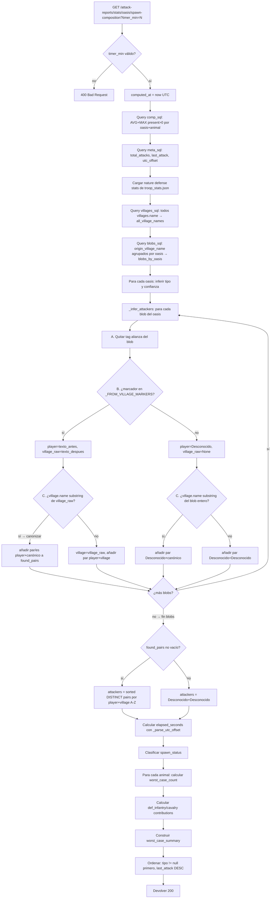

# Mecánica de spawn de oasis — Stats panel v2

## 1. Objetivo de negocio

El usuario lleva tiempo recogiendo reportes de ataques a oasis para entender el ritmo de reaparición de animales y decidir cuándo atacar y con qué equipo. El problema raíz es que la métrica actual —`avg_regen_per_hour`— es físicamente engañosa: mezcla la ráfaga de spawn con el cooldown posterior y produce un número que no puede usarse para tomar decisiones tácticas reales.

La mecánica real del juego es:
1. Los animales reaparecen en **orden fijo** (rata → araña → serpiente → murciélago → jabalí → lobo → oso → cocodrilo → tigre → elefante) con **timers fijos por especie** (5-14 minutos en servidor x1).
2. Cuando un oasis "se dispara", genera DE GOLPE un número fijo de animales de cada tipo de su set y los suelta a su cadencia; luego entra en **cooldown** (horas o días). Tras el cooldown cada nuevo ataque tiene probabilidad de re-disparar el spawn.
3. Distintos tipos de oasis (hierro, arcilla, madera, cereal) tienen **sets normales** de animales; los individuos fuera del set son "anomalías".

El objetivo de la feature es reemplazar la métrica `/h` por un conjunto de métricas coherentes con esta mecánica, acompañadas de un panel educativo que explique el modelo al usuario.

**La feature NO toca lógica de browser, navegación ni interacción con Travian: el guardian-antideteccion NO debe ser invocado.**

---

## 2. Actores y permisos

| Actor | Acción |
|-------|--------|
| Usuario (único) | Lee los paneles. No hay escritura. |

Sin autenticación por endpoint (igual que el resto del módulo attack-reports).

---

## 3. Alcance

### Dentro del alcance

1. **Panel educativo (Pieza 1)** — sección estática/informativa en la pestaña Estadísticas: orden fijo de animales, tabla de timers fijos, sets normales por tipo de oasis, definición de "anomalía".
2. **Composición típica por oasis (Pieza 2)** — métrica derivada de los reportes: promedio y máximo de `present` por animal y por oasis para cada ráfaga observada.
3. **Peor combinación a batir (Pieza 3)** — dado un intervalo de timer elegido por el usuario (6 / 7 / 10 / 15 min), calcula la combinación más peligrosa de animales (sobrantes del raid anterior + los que reaparecen entre envíos) y su fuerza defensiva total usando los stats de `troop_stats.json`.
4. **Detección cooldown/respawn (Pieza 4)** — clasifica cada oasis como "en cooldown" (no genera) o "activo" (repoblando) según el tiempo transcurrido desde el último ataque.
5. **Retirada de `avg_regen_per_hour` (Pieza 5)** — reemplazar la métrica engañosa por las nuevas en todos sus call-sites (backend + frontend + tests), con migración en paralelo (añadir nuevo campo, migrar, eliminar viejo).

### Fuera del alcance (v1)

- Velocidades de servidor != x1 (diseño extensible, ver §13 TR-01).
- Cálculo automático del intervalo de timer óptimo (el usuario lo elige manualmente).
- Alertas o notificaciones proactivas sobre cooldown.
- Population cap en la proyección de animales acumulados.
- Persistir el tipo de oasis inferido en BD.
- Actualización en tiempo real (polling / WebSocket).
- EP-10 (`get_all_oasis_regen_comparison`) — ya implementado en adapter y router; no es parte de esta feature (se declara en el §14 como gap pre-existente a regularizar, no como nueva implementación).

---

## 4. Reglas de negocio

### 4.1 Catálogo de spawn (fuente canónica)

El catálogo se persiste en `core/game_data/oasis_spawn_catalog.py` como constante Python. No existe hoy: **CREAR**.

```python
# core/game_data/oasis_spawn_catalog.py

# Nombre canónico de cada animal: mapeado al ordinal usado en troop_stats.json y i18n
# Para nombres localizados usar core/i18n/catalog/base/troops.json → NATURE_{ordinal}
NATURE_ORDINALS = {
    "rata":        1,
    "araña":       2,
    "serpiente":   3,
    "murciélago":  4,
    "jabalí":      5,
    "lobo":        6,
    "oso":         7,
    "cocodrilo":   8,
    "tigre":       9,
    "elefante":    10,
}

# Timer de spawn en segundos (servidor x1). Ordinal → segundos.
SPAWN_TIMER_S: dict[int, int] = {
    1: 300,   # rata       5:00
    2: 360,   # araña      6:00
    3: 420,   # serpiente  7:00
    4: 480,   # murciélago 8:00
    5: 540,   # jabalí     9:00
    6: 600,   # lobo      10:00
    7: 660,   # oso       11:00
    8: 720,   # cocodrilo 12:00
    9: 780,   # tigre     13:00
    10: 840,  # elefante  14:00
}

# Sets normales de animales por tipo de oasis.
# Clave = nombre del tipo (para etiquetas UI); valor = set de ordinales del set base.
# Un animal fuera de este set que aparezca en reportes se clasifica como "anomalía".
OASIS_TYPE_SETS: dict[str, set[int]] = {
    "hierro":  {1, 2, 4},          # rata, araña, murciélago
    "arcilla": {1, 2, 5},          # rata, araña, jabalí
    "madera":  {5, 6, 7},          # jabalí, lobo, oso
    "cereal":  {1, 2, 3, 4, 5, 6, 7, 8, 9, 10},  # todos + muchos tigres/elefantes
}
```

**RN-CAT-01** — `SPAWN_TIMER_S` es la única fuente de verdad para los timers en toda la aplicación. Ningún módulo hardcodea tiempos de spawn fuera de este fichero.

**RN-CAT-02** — La tabla de datos de defensa de animales se lee de `seeds/game_data/troop_stats.json` (ya existe), filtrando `tribe == "nature"`. Los campos relevantes son `ordinal`, `def_infantry`, `def_cavalry`.

**RN-CAT-03** — Los nombres localizados de animales se obtienen de `core/i18n/catalog/base/troops.json` con la clave `NATURE_{ordinal}` y el idioma resuelto. En endpoints que no usan `Accept-Language` (ver §8), se devuelve el ordinal y el frontend resuelve el nombre.

### 4.2 Inferencia del tipo de oasis

**RN-TYP-01** — El tipo de oasis se infiere **empíricamente** a partir del conjunto de ordinales de animales que han aparecido con `present > 0` en algún reporte de ese oasis. No se guarda manualmente ni se añade columna de tipo en BD.

**RN-TYP-02 (v2 — corregida tras implementación)** — Algoritmo de inferencia por **similitud de Jaccard**:
```
para cada tipo en OASIS_TYPE_SETS:
    score[tipo] = |observados ∩ set_del_tipo| / |observados ∪ set_del_tipo|
tipo_inferido = argmax(score)
```
En caso de empate: preferir el tipo con menor cardinal de set (más específico); si persiste, alfabético (EC-07).

> **Por qué Jaccard y no el solapamiento bruto** (`|∩|`): con `OASIS_TYPE_SETS["cereal"] = {1..10}` (universal), el solapamiento bruto hacía que cereal igualara o superara el score de cualquier tipo en cuanto el oasis tenía ≥4 especies, ganando casi siempre y **anulando la detección de anomalías** (RN-TYP-03), porque el set de cereal contiene todo. Jaccard divide por la unión, penalizando el set universal. Ejemplos numéricos (sets `hierro={1,2,4}`, `arcilla={1,2,5}`, `madera={5,6,7}`, `cereal={1..10}`):
>
> | Observados | hierro | arcilla | madera | cereal | Tipo (Jaccard) | Anomalías |
> |---|---|---|---|---|---|---|
> | {1,2,4} (hierro) | **1.00** | 0.50 | 0.00 | 0.30 | hierro | — |
> | {1,2,5} (arcilla) | 0.50 | **1.00** | 0.20 | 0.30 | arcilla | — |
> | {5,6,7} (madera) | 0.00 | 0.20 | **1.00** | 0.30 | madera | — |
> | {1,2,3,4,5,8,9,10} (cereal) | 0.375 | 0.375 | 0.10 | **0.80** | cereal | — |
> | {1,2,5,8} (coco en arcilla) | 0.40 | **0.75** | 0.143 | 0.40 | arcilla | **{8}** |
> | {1,2,3} (serpiente en hierro/arcilla) | 0.50 | **0.50** (empate→arcilla) | 0.00 | 0.30 | arcilla | **{3}** |
>
> Con solapamiento bruto, los dos últimos casos clasificaban como `cereal` sin anomalías (incorrecto). El catálogo `OASIS_TYPE_SETS` **no cambia**: solo cambia la métrica de score.

**RN-TYP-03** — Animales observados que NO pertenecen al `OASIS_TYPE_SETS[tipo_inferido]` son **anomalías**. Se muestran en la UI con etiqueta "anomalía" pero **no modifican la inferencia del tipo base**.

**RN-TYP-04** — Si el oasis tiene menos de 3 reportes con `present > 0`, la confianza de la inferencia es "baja" (`confidence: "low"`). Con 3 o más, `confidence: "medium"`. No hay `"high"` en v1 (no hay cap de animales para validar la inferencia completamente).

**RN-TYP-05** — Si ningún animal ha aparecido nunca en un oasis (todos los reportes con `present = 0` para todos los animales), el tipo es `null` y la confianza es `null`.

### 4.3 Composición típica por oasis (Pieza 2)

**RN-COMP-01** — Se calcula `avg_present` y `max_present` por `(oasis, animal_ordinal)` usando únicamente los reportes donde `present > 0` para ese animal. Las filas con `present = 0` se excluyen (el animal no estaba en ese spawn).

**RN-COMP-02** — Un animal nunca observado (`present > 0` nunca) no aparece en la composición de ese oasis (celda ausente, no cero).

**RN-COMP-03** — `avg_present` se redondea a 1 decimal. `max_present` es entero.

**RN-COMP-04** — Si el oasis tiene un solo reporte con `present > 0` para un animal, `avg_present == max_present` (dato válido, aunque de baja confianza).

### 4.4 Peor combinación a batir (Pieza 3)

El usuario elige un **intervalo de timer** (minutos): `6 | 7 | 10 | 15`. El sistema calcula cuántos animales de cada tipo pueden acumularse entre dos envíos consecutivos al oasis.

**RN-WORST-01** — Fórmula de animales que reaparecen en un intervalo `I` (en segundos) para el animal de ordinal `o`:
```
spawns_en_intervalo[o] = floor(I_segundos / SPAWN_TIMER_S[o])
```
Solo para animales del tipo inferido del oasis (el set base, sin anomalías).

**RN-WORST-02** — La "peor combinación" asume que del raid anterior quedaron **todos** los animales que reaparece una vez más antes del siguiente envío. Esto es una cota superior conservadora. La lógica exacta es:
```
sobrantes_worst[o] = max_present_observado_en_oasis[o]  # cota: el máximo histórico
peor_combo[o] = sobrantes_worst[o] + spawns_en_intervalo[o]
```
Si el animal nunca fue observado en el oasis (no hay `max_present`), `sobrantes_worst[o] = 0`.

**RN-WORST-03** — La "fuerza defensiva a batir" se calcula como la suma ponderada de defensa de todos los animales de la peor combinación, separando infantería y caballería:
```
def_infantry_total = sum(peor_combo[o] * NATURE_DEF_INFANTRY[o] for o in ordinales_del_set)
def_cavalry_total  = sum(peor_combo[o] * NATURE_DEF_CAVALRY[o]  for o in ordinales_del_set)
```
Donde `NATURE_DEF_INFANTRY[o]` y `NATURE_DEF_CAVALRY[o]` vienen de `troop_stats.json` para `tribe=nature`.

**RN-WORST-04** — Si el tipo del oasis no está inferido (RN-TYP-05), no se puede calcular la peor combinación y se devuelve `null`.

**RN-WORST-05** — Las anomalías se EXCLUYEN del cálculo de la peor combinación (su aparición es rara y distorsionaría el umbral defensivo).

**RN-WORST-06** — El intervalo elegido por el usuario se envía como parámetro de query `?timer_min=6|7|10|15`. Valores fuera del conjunto permitido → `400`.

**RN-WORST-07** — Extensibilidad a otros servidores: si en el futuro se añade soporte para velocidad `x != 1`, los timers efectivos serían `SPAWN_TIMER_S[o] / x`. El parámetro `server_speed` no se implementa ahora; el diseño es consciente de él (nota de extensión en §13).

### 4.5 Detección cooldown/respawn (Pieza 4)

**RN-CD-01** — Para cada oasis, se calcula el tiempo transcurrido desde el último ataque: `elapsed_s = (ahora_UTC - last_attack_UTC).total_seconds()`.

**RN-CD-02** — El **umbral de cooldown** no está documentado de forma exacta en el Excel (varía por oasis y por mecánicas del servidor). La heurística de v1 usa el **timer del animal más lento del set del oasis** como proxy del ciclo mínimo activo. Si `elapsed_s <= min_spawn_timer_del_set`, el oasis está "respawnando activamente".

**RN-CD-03** — Definición de estados:
- `"respawning"` (verde): el oasis acaba de ser atacado recientemente y puede estar generando animales (`elapsed_s <= umbral_respawn`). El umbral_respawn = max de SPAWN_TIMER_S para los animales del set del oasis (el más lento tarda como máximo `max_timer_s` en generar).
- `"cooldown"` (rojo): `elapsed_s > umbral_cooldown`. El umbral_cooldown es un múltiplo conservador: `3600 * 4` (4 horas) como valor por defecto en v1, revisable.
- `"unknown"` (gris): oasis sin tipo inferido (RN-TYP-05) o con menos de 2 reportes.

**Nota**: los dos umbrales (respawning / cooldown) tienen una zona intermedia "gris" que es incierta. La UI debe representarla como estado indeterminado (amarillo o sin indicador claro).

**RN-CD-04** — Si el oasis nunca ha mostrado animales (`present > 0` nunca), estado = `"unknown"`.

**RN-CD-05** — La detección se calcula en el backend, no en el cliente (evita depender del reloj del navegador).

### 4.7 Inferencia de jugador y aldea atacante por oasis (v2.6 — VIGENTE; deroga v2.5)

> **v2.6 (2026-06-02)** — Añade la dimensión "jugador/cuenta" al modelo de atribución.
> El campo `origin_villages: string[]` de v2.5 se sustituye por `attackers: [{player, village}]`.
> Esto permite agrupar en el frontend en dos niveles: Jugador → Aldea → Oasis.
> El algoritmo post-hoc se mantiene (sin tocar parser ni campo persistido), pero ahora extrae
> dos valores por blob en vez de uno: `player` (texto antes del marcador) y `village` (texto
> después, con la misma limpieza de v2.5).

**Formato del blob `origin_village_name` (verificado en BD real):**

```
[TagAlianza] NombreJugador <marcador_from_village> NombreAldea
```

Ejemplos reales del usuario:
- `[Storm] GonnaDie from village 05`                     → player=GonnaDie, village=05
- `[Storm] GonnaDie from village 02`                     → player=GonnaDie, village=02
- `[Storm] CrazyMouse from village 05 Caesar On Leave`   → player=CrazyMouse, village="05 Caesar On Leave"
- `[Storm] CrazyMouse from village 01 Rome But Broke`    → player=CrazyMouse, village=01 (canonizado)
- `[Storm] SharpHorseman from village SharpHorseman [00]` → player=SharpHorseman, village=00 (canonizado)

**Algoritmo de extracción (player, village) — POST-HOC, por blob:**

```
Para cada blob de un oasis:

  Paso A — quitar tag de alianza:
    Si el blob empieza con "[...] " → resto = texto desde "]" +1 en adelante, trim.
    Si no hay tag → resto = blob completo, trim.

  Paso B — buscar marcador en _FROM_VILLAGE_MARKERS (case-insensitive):
    blob_lower = resto.lower()
    Para cada marker en _FROM_VILLAGE_MARKERS:
        idx = blob_lower.find(marker.lower())
        Si idx != -1:
            player_raw  = resto[:idx].strip()
            village_raw = resto[idx + len(marker):].strip()
            → SI player_raw no vacío Y village_raw no vacío:
                player = player_raw
                # Aplicar limpieza de village (paso C)
                → continuar con paso C
            → SI village_raw vacío: marcador al final de línea, blob inválido → skip
    Si ningún marcador encontrado:
        player = "Desconocido"
        village_raw = None     (ir a paso C con raw=None)

  Paso C — limpiar/canonizar village_raw:
    Si village_raw no es None:
        (a) Canonizar contra all_village_names:
            matches = [vname for vname in all_village_names if vname in village_raw]
            Si matches → elegir los de mayor len(vname); si empatan, añadir TODOS.
            Si hay resultado → usar los canónicos como village(s).
            Si no → (b) usar village_raw directamente como village.
        (b) Si (a) no da resultado → village = village_raw
    Si village_raw es None (sin marcador):
        (a) Intentar canonizar el blob entero (resto):
            matches = [vname for vname in all_village_names if vname in resto]
            Si matches → village = el canónico más largo (o todos si empatan).
        (b) Si (a) no da resultado → village = "Desconocido"

  Resultado por blob: uno o más pares (player, village).
  Un blob puede producir MÚLTIPLES pares si el paso C produce varios canónicos de igual longitud.
  Si ni siquiera se puede extraer un par mínimo → (player="Desconocido", village="Desconocido").

Para el oasis completo:
  attackers = DISTINCT de todos los pares (player, village) de todos sus blobs,
  ordenados por player A-Z y luego village A-Z,
  NUNCA vacío — si no hay ningún par extraíble → [{"player":"Desconocido","village":"Desconocido"}].
```

**Precedencia dentro de un mismo blob:** la canonización de `village_raw` (a) gana a usar el
texto crudo (b). Si un nombre de village conocido es substring de `village_raw`, se usa el
nombre canónico (más fiable). La extracción del `player` es siempre el texto entre el fin del
tag de alianza y el inicio del marcador.

**RN-ACCT-01** — El sistema NO juzga si una cuenta es "del usuario" o no. Cada par (player, village)
se trata igual. El usuario distingue sus cuentas visualmente en el frontend (secciones separadas
por player). No hay lógica de ownership ni de filtrado automático por cuenta.

**RN-ACCT-02** — La clave de agrupación en el frontend es el par (player, village). Dos villages con
el mismo nombre limpio pero distinto player son secciones completamente separadas y no se mezclan.
Un oasis atacado por (GonnaDie, "00") y (CrazyMouse, "00") aparece en ambas secciones de aldea "00",
pero bajo jugadores distintos.

**RN-ACCT-03** — Un player con espacios en el nombre (nombre compuesto) se conserva entero.
`player_raw = resto[:idx].strip()` captura todo lo que hay entre el `]` del tag y el marcador.

**RN-ACCT-04** — La canonización de village puede producir un falso positivo por substring
(p.ej. `village_raw = "SharpHorseman [00]"` → village = `"00"` porque `"00"` es substring).
Esto es aceptable: el oasis queda bajo `player=SharpHorseman, village="00"`, sin colisionar con
`player=GonnaDie, village="00"` (clave distinta por player). Documentado en EC-ACCT-04.

**RN-ACCT-05** — `attackers` NUNCA es vacío. Último recurso:
`[{"player": "Desconocido", "village": "Desconocido"}]`.

**RN-ACCT-06** — Un oasis atacado por varios pares (player, village) aparece bajo CADA jugador
y CADA aldea en el frontend. Sus stats (composición, tipo inferido, peor caso, spawn_status) se
calculan con TODOS sus reportes (sin filtrar por jugador/aldea atacante).

**RN-ACCT-07** — Blob literal `"Desconocido"` (fallback del parser original):
(A) ningún tag de alianza al inicio → resto = `"Desconocido"`.
(B) ningún marcador → player = `"Desconocido"`, village_raw = None.
(C) ningún village es substring → village = `"Desconocido"`.
Resultado: (player=`"Desconocido"`, village=`"Desconocido"`).

**RN-CITY-01 (v2.6, mantiene v2.5)** — La atribución se basa EXCLUSIVAMENTE en los blobs de
`origin_village_name`. El JOIN farm_slots ya NO se usa. Razón: farm_list responde a "quién está
configurado", no a "quién atacó" (bug v2.4 verificado en BD real).

**RN-CITY-02 (v2.6)** — Carga de aldeas conocidas (ejecutar UNA VEZ antes del bucle):
```sql
SELECT name FROM villages
-- TODO: filtrar por world_id cuando attack_reports.world_id deje de ser NULL
```
Resultado indexado en `all_village_names: list[str]`.

**RN-CITY-03 (v2.6)** — Carga de blobs por oasis (ejecutar UNA VEZ antes del bucle):
```sql
SELECT coord_x_dest, coord_y_dest,
       GROUP_CONCAT(DISTINCT origin_village_name) AS blobs_raw
FROM attack_reports
GROUP BY coord_x_dest, coord_y_dest
```
Resultado indexado en `blobs_by_oasis: dict[tuple[int,int], list[str]]`.

**RN-CITY-04 (v2.6)** — Canonización de village por substring (paso C-a):
```python
matches = [vname for vname in all_village_names if vname in village_raw]
if matches:
    max_len = max(len(m) for m in matches)
    canonical = [m for m in matches if len(m) == max_len]
    # Si canonical tiene varios, se producen varios pares (player, canonical_i)
```
El match es `vname in village_raw` (substring Python estándar, case-sensitive en v1).

**RN-CITY-05 (v2.6)** — Si hay empate de longitud máxima en la canonización, se añaden TODOS
los canónicos como pares separados con el mismo player. Estadísticamente raro.

**RN-CITY-06 (v2.6)** — `attackers` NUNCA es vacío. Último recurso:
`[{"player": "Desconocido", "village": "Desconocido"}]` (RN-ACCT-05).

**RN-CITY-07 (v2.6)** — Las dos cargas (villages y blobs) se realizan FUERA del bucle de oasis:
una query cada una, resultado indexado en dicts. El cruce se hace en Python. Anti-N+1 garantizado.
La query `farm_coords_sql` (y el dict `coords_to_villages`) de v2.4 NO EXISTEN.

**RN-CITY-08** — El cálculo de estadísticas por oasis (composición, tipo inferido, peor caso,
spawn_status) NO cambia. Solo cambia el campo de atribución: `origin_villages` → `attackers`.

**RN-CITY-09 (v2.6)** — El frontend SÍ requiere cambios: pasa de consumir `origin_villages: string[]`
(agrupación por aldea) a consumir `attackers: [{player, village}]` (agrupación Jugador→Aldea).
Ver §5 y la sección de frontend de v2.6.

**RN-CITY-10 (v2.6)** — FK huérfana de farm_lists: ya no aplica (JOIN eliminado en v2.5).

**RN-CITY-11 (v2.6)** — Un oasis atacado por múltiples pares (player, village) acumula todos
en `attackers`. El oasis aparece bajo cada jugador→aldea en el frontend. Correcto por diseño.

**RN-CITY-12 (v2.6) — Marcadores "from village" multi-idioma:**

Constante `_FROM_VILLAGE_MARKERS` (ya existe desde v2.5 en el módulo del adaptador):

```python
_FROM_VILLAGE_MARKERS: tuple[str, ...] = (
    "from village",      # inglés      (servidor del usuario — verificado)
    "from village ",     # variante con espacio extra (defensivo)
    "aus dem Dorf",      # alemán
    "desde la aldea",    # español
    "du village",        # francés
    "из деревни",        # ruso
    "dalla village",     # italiano (no verificado — placeholder extensible)
    "من قرية",           # árabe
    "van het dorp",      # neerlandés
    "från byn",          # sueco
    "z vesnice",         # checo
    "из села",           # serbio/ucraniano (variante cirílica)
)
```

Helper de extracción v2.6 (reemplaza `_infer_origin_village_from_blob` de v2.5):

```python
def _extract_player_village_from_blob(
    blob: str,
    all_village_names: list[str],
) -> list[tuple[str, str]]:
    """
    Extrae todos los pares (player, village) de un blob origin_village_name.

    Algoritmo:
      A. Quitar tag de alianza "[...] " si existe.
      B. Buscar primer marcador en _FROM_VILLAGE_MARKERS (case-insensitive).
         - Si encontrado: player=texto_antes_marcador, village_raw=texto_despues_marcador.
         - Si no: player="Desconocido", village_raw=None.
      C. Canonizar village_raw contra all_village_names (substring, mayor longitud gana).
         - Si village_raw es None: intentar canonizar el blob entero (resto).
         - Si canonización da varios de igual longitud: un par por cada canónico.
         - Si canonización no da nada: usar village_raw directamente (o "Desconocido").

    Devuelve lista de pares (player, village). Nunca vacía: mínimo [("Desconocido","Desconocido")].
    """
    # A. Quitar tag de alianza
    resto = blob.strip()
    if resto.startswith("["):
        closing = resto.find("]")
        if closing != -1:
            resto = resto[closing + 1:].strip()

    # B. Buscar marcador
    resto_lower = resto.lower()
    player = "Desconocido"
    village_raw: str | None = None
    for marker in _FROM_VILLAGE_MARKERS:
        idx = resto_lower.find(marker.lower())
        if idx != -1:
            player_candidate = resto[:idx].strip()
            village_candidate = resto[idx + len(marker):].strip()
            if player_candidate and village_candidate:
                player = player_candidate
                village_raw = village_candidate
                break
            # Si village_candidate vacío: marcador al final de línea → blob inválido

    # C. Canonizar village
    search_in = village_raw if village_raw is not None else resto
    matches = [vname for vname in all_village_names if vname in search_in]
    if matches:
        max_len = max(len(m) for m in matches)
        canonical = [m for m in matches if len(m) == max_len]
        return [(player, c) for c in canonical]

    # Sin canonización: usar village_raw o "Desconocido"
    village = village_raw if village_raw else "Desconocido"
    return [(player, village)]
```

**Helper `_infer_attackers` (reemplaza `_infer_origin_villages` de v2.5):**

```python
def _infer_attackers(
    key: tuple[int, int],
    blobs_by_oasis: dict[tuple[int, int], list[str]],
    all_village_names: list[str],
) -> list[dict[str, str]]:
    """
    Devuelve la lista DISTINCT de pares (player, village) para un oasis,
    ordenada por player A-Z y luego village A-Z.
    Nunca vacía: mínimo [{"player":"Desconocido","village":"Desconocido"}].
    """
    blobs = blobs_by_oasis.get(key, [])
    found: set[tuple[str, str]] = set()

    for blob in blobs:
        pairs = _extract_player_village_from_blob(blob, all_village_names)
        found.update(pairs)

    if not found:
        return [{"player": "Desconocido", "village": "Desconocido"}]

    sorted_pairs = sorted(found, key=lambda p: (p[0], p[1]))
    return [{"player": p, "village": v} for p, v in sorted_pairs]
```

**Nota de limitación (aceptada):** si el idioma del servidor no tiene su marcador en
`_FROM_VILLAGE_MARKERS`, `player` cae a `"Desconocido"`. La lista es extensible sin tocar
la lógica. El servidor del usuario es en inglés (verificado); el marcador está incluido.

**Ejemplos resueltos con los blobs reales del usuario (servidor en inglés):**

| Blob | villages conocidas | player extraído | village_raw | Canonización | Par resultado |
|------|-------------------|----------------|-------------|--------------|---------------|
| `[Storm] GonnaDie from village 05` | {00, 01, 02, 03} | `GonnaDie` | `"05"` | "05" no es substring de ningún vname conocido | `(GonnaDie, "05")` |
| `[Storm] GonnaDie from village 02` | {00, 01, 02, 03} | `GonnaDie` | `"02"` | `"02"` en {00,01,02,03} → canónico `"02"` | `(GonnaDie, "02")` |
| `[Storm] SharpHorseman from village SharpHorseman [00]` | {00, 01, 02, 03} | `SharpHorseman` | `"SharpHorseman [00]"` | `"00"` es substring → canónico `"00"` (mayor longitud entre matches) | `(SharpHorseman, "00")` |
| `[Storm] CrazyMouse from village 05 Caesar On Leave` | {00, 01, 02, 03} | `CrazyMouse` | `"05 Caesar On Leave"` | ningún vname es substring de `"05 Caesar On Leave"` | `(CrazyMouse, "05 Caesar On Leave")` |
| `[Storm] CrazyMouse from village 01 Rome But Broke` | {00, 01, 02, 03} | `CrazyMouse` | `"01 Rome But Broke"` | `"01"` es substring → canónico `"01"` | `(CrazyMouse, "01")` |

> **Ejemplo `attackers` con dos pares (mismo oasis):** si un oasis tiene blobs de GonnaDie/05
> y CrazyMouse/"05 Caesar On Leave":
> `attackers = [{"player": "CrazyMouse", "village": "05 Caesar On Leave"}, {"player": "GonnaDie", "village": "05"}]`
> (ordenado player A-Z: CrazyMouse < GonnaDie).

> **SharpHorseman [00] → village "00":** canonización correcta porque "00" es el único
> village conocido que es substring de "SharpHorseman [00]". El par queda bajo
> `player=SharpHorseman`, no bajo GonnaDie/00, por lo que no hay colisión.

### 4.6 Retirada de `avg_regen_per_hour` (Pieza 5)

**RN-RET-01** — `avg_regen_per_hour` se mantiene en paralelo durante la migración. El plan de retirada es:
1. Añadir los campos nuevos junto al viejo (sin romper).
2. Migrar frontend y tests a los campos nuevos.
3. Eliminar `avg_regen_per_hour` de la respuesta cuando no quede ningún consumidor.

**RN-RET-02** — Call-sites a migrar (completos, verificados en el código):

| Fichero | Línea(s) | Campo afectado |
|---------|----------|----------------|
| `adapters/db/attack_report_sqlite_adapter.py` | 198 | `_calc_regen_rates()` output |
| `adapters/db/attack_report_sqlite_adapter.py` | 1334, 1341 | `get_all_oasis_regen_comparison()` |
| `frontend/src/components/attack-reports/RegenRatesSection.jsx` | 16, 190 | prop `avg_regen_per_hour` |
| `frontend/src/components/attack-reports/GlobalOasisStatsPanel.jsx` | 352 | acceso a `r.avg_regen_per_hour` |
| `frontend/src/components/attack-reports/OasisStatsPanel.jsx` | 205 | `<RegenRatesSection rates={...}>` |
| `tests/test_attack_reports_api.py` | 1031, 1044, 1047 | aserciones sobre `avg_regen_per_hour` |
| `tests/test_global_oasis_stats_api.py` | 335-368 | test `T_G06b` |
| `tests/test_oasis_comparison_api.py` | 225, 245, 527, 554, 642, 728-789, 828, 866 | múltiples aserciones |
| `tests/unit/test_attack_report_parser.py` | 601, 615, 631, 657-658, 671, 680 | tests unitarios de `_calc_regen_rates` |

**RN-RET-03** — `RegenRatesSection.jsx` y `GlobalOasisStatsPanel.jsx` usan `avg_regen_per_hour` solo para mostrar el valor `/h`. Estos componentes se adaptarán para aceptar el nuevo campo (ver §8 para el nombre del campo de reemplazo) o se eliminarán si la nueva UI los sustituye por completo.

**RN-RET-04** — Los tests unitarios de `_calc_regen_rates` que verifican `avg_regen_per_hour` testean el output de una función interna que sigue siendo necesaria. Si se decide renombrar el campo de salida de `_calc_regen_rates`, los tests se actualizan. Si se mantiene el nombre interno pero se mapea al campo nuevo en la respuesta de la API, solo los tests de integración cambian.

**RN-RET-05** — Decisión de naming del campo de reemplazo: se sustituye por `avg_present_per_burst` (promedio de animales presentes por ráfaga de spawn) y `max_present_per_burst`, más coherentes con la mecánica real. El campo `avg_regen_per_hour` desaparece de la respuesta pública de la API.

---

## 5. Flujo principal y flujos alternativos

### Flujo principal — Usuario abre la pestaña Estadísticas

1. `StatsTab` monta en paralelo: `BalanceSection`, `GlobalOasisStatsPanel`, `OasisList`, y los nuevos paneles:
   - **SpawnMechanicsPanel** (Pieza 1, estático, sin llamada API)
   - **OasisCompositionPanel** (Pieza 2, llama `GET /attack-reports/stats/oasis/spawn-composition`)
   - **WorstCasePlannerPanel** (Pieza 3+4, llama `GET /attack-reports/stats/oasis/spawn-composition` con `?timer_min=N`)

2. `SpawnMechanicsPanel` renderiza inmediatamente (datos estáticos del catálogo).

3. `OasisCompositionPanel` y `WorstCasePlannerPanel` esperan respuesta de la API.

4. El usuario selecciona un intervalo de timer (6/7/10/15 min) en `WorstCasePlannerPanel`. El componente re-llama la API con el nuevo `?timer_min=N` o calcula localmente a partir de los datos ya recibidos.

### Flujo alternativo — BD vacía / sin reportes

- `GET /attack-reports/stats/oasis/spawn-composition` devuelve `200` con `oasis: []`.
- `OasisCompositionPanel` muestra estado vacío con CTA "Ingresar reportes".
- `WorstCasePlannerPanel` muestra estado vacío.
- `SpawnMechanicsPanel` se muestra igualmente (contenido estático).

### Flujo alternativo — Oasis sin tipo inferible

- El oasis aparece en `OasisCompositionPanel` con `inferred_type: null`, `confidence: null`.
- `WorstCasePlannerPanel` muestra "Tipo no inferible — añade más reportes" para ese oasis.
- El estado cooldown/respawn es `"unknown"`.

### Flujo alternativo — Timer seleccionado inválido

- `?timer_min` con valor fuera de `{6, 7, 10, 15}` → `400` con `detail` legible.

---

## 6. Edge cases

| ID | Descripción | Tratamiento |
|----|-------------|-------------|
| EC-01 | Oasis con un solo reporte | `avg_present` = `max_present` para las especies vistas; `confidence: "low"` (< 3 reportes). Estado cooldown = `"unknown"` (sin intervalo de tiempo). |
| EC-02 | Animal presente en un solo reporte de un oasis (presente en 1 de N) | `avg_present` e `max_present` calculados sobre ese único reporte. Baja confianza pero dato válido. |
| EC-03 | Reporte de derrota (`present` de animales puede ser mayor, `survived` es 0) | `present` sigue siendo válido para composición. `survived = 0` no afecta al cálculo de composición. |
| EC-04 | Animal con `present = 0` en todos los reportes del oasis | No aparece en la composición (RN-COMP-02). No contribuye a la inferencia del tipo. |
| EC-05 | Oasis sin ningún animal con `present > 0` nunca | `inferred_type: null`, `confidence: null`, estado `"unknown"`. No se muestra composición. |
| EC-06 | Anomalía: animal fuera del set base del tipo inferido | Se muestra en la composición con etiqueta `"anomaly": true`. No contamina el cálculo de la peor combinación (RN-WORST-05). |
| EC-07 | Empate en inferencia de tipo (mismo score en dos tipos) | Elegir el tipo con menor cardinal de set (más específico). Si el empate persiste (igual cardinal), elegir alfabéticamente el primero. Documentar como baja confianza. |
| EC-08 | Timer de interval produce `spawns_en_intervalo[o] = 0` para un animal lento | El animal no contribuye a la peor combinación para ese intervalo (solo sobrantes). Resultado correcto. |
| EC-09 | `last_attack_utc` produce `elapsed_s < 0` (reloj adelantado) | Tratar como `elapsed_s = 0`. Estado: `"respawning"`. |
| EC-10 | `max_present` del historial es 0 (solo `present = 0` en todos los reportes) | No puede ocurrir por RN-COMP-01 (filtramos `present > 0`). Si la query lo devuelve, tratar como si el animal no estuviera. |
| EC-11 | Oasis con anomalía como único animal observado | El set de animales observados = {ordinal_anomalía}. La inferencia intentará hacer el matching pero todos los scores serán bajos. Se devuelve el tipo con mayor score (aunque sea 1 de 3) con `confidence: "low"`. |
| EC-12 | `timer_min` enviado sin `?timer_min=` en la URL (campo omitido) | Si el endpoint lo requiere, `422`; si es opcional, usa un valor por defecto (definido en §8). Decidido: **requerido** (sin defecto) → `422` si falta. |
| EC-13 | Composición calculada sobre reportes con `attacked_at` muy antiguos | No hay filtro temporal en v1. Todos los reportes históricos contribuyen. Nota futura: filtro por rango de fecha. |
| EC-CITY-01 | Oasis atacado por varios pares (player, village) distintos | Cada blob aporta su par. `attackers` es la unión DISTINCT ordenada. El oasis aparece bajo cada jugador→aldea en el frontend. RN-CITY-11, RN-ACCT-06. |
| EC-CITY-02 | village_raw contiene el nombre de un village conocido como substring | Canonización C-a: `"02"` en `village_raw` → village = `"02"`. RN-CITY-04. |
| EC-CITY-03 | Nombre de aldea multi-palabra (`"Aldea del Norte"`) en village_raw | `"Aldea del Norte" in village_raw` es True si contiene la cadena completa. Funciona igual que nombre de una sola palabra. |
| EC-CITY-04 | Varios villages substring de village_raw, con longitudes distintas (`"Norte"` y `"Aldea del Norte"`) | Gana el de mayor longitud (`"Aldea del Norte"`). `"Norte"` no se añade. RN-CITY-04. |
| EC-CITY-05 | Varios villages substring de village_raw, con la MISMA longitud máxima | Se generan tantos pares (player, village_i) como canónicos. Estadísticamente raro. RN-CITY-05. |
| EC-CITY-06 | Blob sin marcador reconocible y sin village como substring en el blob entero | player=`"Desconocido"`, village=`"Desconocido"`. Si TODOS los blobs del oasis son así → `[{player:"Desconocido",village:"Desconocido"}]`. RN-CITY-06, RN-ACCT-05. |
| EC-CITY-07 | Tabla `villages` vacía (sin aldeas registradas) | all_village_names=[]. Canonización nunca da resultado. Si hay marcador → player y village_raw extraídos; village = village_raw. Si no hay marcador → `(Desconocido, Desconocido)`. |
| EC-CITY-08 | DEROGADO (v2.5) — El JOIN farm_slots fue eliminado. FK huérfana ya no es un caso a considerar. | — |
| EC-CITY-09 | Oasis sin ningún reporte (no puede darse en EP-SPAWN) | No aplica: meta_sql ya garantiza que el oasis tiene ≥1 reporte. |
| EC-CITY-10 | Blob `"Desconocido"` (fallback del parser original) | A. sin tag → resto=`"Desconocido"`. B. sin marcador → player=`"Desconocido"`, village_raw=None. C. ningún village es substring → village=`"Desconocido"`. Resultado: `(Desconocido, Desconocido)`. RN-ACCT-07. |
| EC-CITY-11 | Blob en idioma no incluido en `_FROM_VILLAGE_MARKERS` | player=`"Desconocido"`. C. intentar canonizar el blob entero; si no hay match → village=`"Desconocido"`. Limitación documentada en RN-CITY-12. |
| EC-CITY-12 | village_raw con village conocido como substring (canonización gana a texto crudo) | Canonización C-a gana. El nombre canónico es el resultado. |
| EC-ACCT-01 | Mismo oasis atacado por (GonnaDie, "05") y (CrazyMouse, "05 Caesar On Leave") | `attackers` contiene ambos pares DISTINCT. El oasis aparece bajo GonnaDie/"05" y CrazyMouse/"05 Caesar On Leave" en el frontend. |
| EC-ACCT-02 | Dos players con village de mismo nombre limpio (p.ej. ambos tienen village "00") | Son pares distintos: (GonnaDie,"00") y (SharpHorseman,"00"). Secciones separadas en el frontend porque la clave es (player, village). No se mezclan. RN-ACCT-02. |
| EC-ACCT-03 | Player con nombre compuesto (p.ej. "Iron Duke") | `player_raw = resto[:idx].strip()` captura todo antes del marcador. El nombre "Iron Duke" se conserva entero. RN-ACCT-03. |
| EC-ACCT-04 | Canonización de village_raw produce falso positivo por substring (p.ej. "SharpHorseman [00]" → "00") | Aceptado. El par queda bajo su player (SharpHorseman), no colisiona con GonnaDie/"00". RN-ACCT-04. |
| EC-ACCT-05 | Blob sin marcador, sin villages en BD | player=`"Desconocido"`, village=`"Desconocido"`. attackers no vacío por RN-ACCT-05. |
| EC-ACCT-06 | player_raw vacío (marcador al inicio del resto, sin texto antes) | El marcador se considera al final de línea inválido (village_candidate vacío) o player_candidate vacío. Se trata como sin marcador: player=`"Desconocido"`. |

---

## 7. Modelo de datos / cambios de esquema

### Sin cambios de BD

Esta feature es solo de lectura. No hay DDL nuevo ni migraciones.

### Tablas leídas (ya existentes)

#### `attack_reports`
- `id`, `coord_x_dest`, `coord_y_dest`, `attacked_at`, `utc_offset`

#### `attack_report_animals`
- `report_id`, `animal_ordinal`, `animal_name`, `present`, `survived`

### Nuevo fichero de código (no BD)

`core/game_data/oasis_spawn_catalog.py` — constante Python con `SPAWN_TIMER_S` y `OASIS_TYPE_SETS`. Este fichero no existe hoy: **CREAR** (palantir confirmado: no existe en `core/game_data/` ni en ningún otro módulo).

### Datos de defensa animal

Leídos en tiempo de ejecución de `seeds/game_data/troop_stats.json` (ya existe), filtrando `tribe == "nature"`. No se persisten en BD ni en caché en v1.

---

## 8. Contratos de API / interfaces

> **VALIDADO POR desarrollador-apis** — contratos diseñados alineados con las convenciones del proyecto.
> Sin `Accept-Language` en este router (datos numéricos + animal_name crudo + ordinals; coherente con EP-06/EP-09/EP-10, confirmado en la nota del router).
> Sin prefijo `/api` (el proxy de Vite lo retira).
> `apis_validadas_por_desarrollador_apis: true`

### Decisiones de reutilización de endpoints (gate palantir + análisis propio)

| Necesidad | Decisión | Justificación |
|-----------|----------|---------------|
| Composición típica (Pieza 2) | **CREAR** `GET /attack-reports/stats/oasis/spawn-composition` | No existe endpoint con esta semántica. EP-06 devuelve `avg_present`/`max_present` solo por oasis individual (`?x=&y=`), no para todos los oasis ni con inferencia de tipo. |
| Peor combinación (Pieza 3) | Parametrizar el mismo endpoint nuevo con `?timer_min=N` | Los datos base son los mismos; el cálculo de peor combinación es un derivado de la composición. Un solo endpoint reduce llamadas al backend. |
| Cooldown/respawn (Pieza 4) | Incluir `spawn_status` en la respuesta del mismo endpoint | Dato por oasis, coherente con el resto de la respuesta. |
| EP-10 `get_all_oasis_regen_comparison` | **GAP PRE-EXISTENTE**: el método existe en el adaptador y en el router pero **no está declarado en `core/ports/attack_report_port.py`**. Esta feature no lo modifica, pero el implementador debe regularizar el port como parte de la limpieza de §14 paso 0. |

### EP-SPAWN — Composición, peor combinación y estado por oasis

```
GET /attack-reports/stats/oasis/spawn-composition
```

**Parámetros de query:**

| Parámetro | Tipo | Obligatorio | Valores válidos | Descripción |
|-----------|------|-------------|-----------------|-------------|
| `timer_min` | int | Sí | 6, 7, 10, 15 | Intervalo de timer elegido por el usuario (minutos). Fuera del conjunto → 400. |

**Cabeceras de request:** ninguna requerida (sin `Accept-Language`).

**Respuesta 200 — éxito**

```json
{
  "computed_at": "2026-06-02T10:00:00.000000+00:00",
  "timer_min": 6,
  "oasis": [
    {
      "coord_x_dest": -70,
      "coord_y_dest": 73,
      "total_attacks": 15,
      "last_attack": "2026-06-01T22:15:00",
      "inferred_type": "cereal",
      "confidence": "medium",
      "spawn_status": "respawning",
      "elapsed_seconds": 43200.0,
      "attackers": [
        {"player": "CrazyMouse", "village": "05 Caesar On Leave"},
        {"player": "GonnaDie",   "village": "05"}
      ],
      "species": [
        {
          "animal_ordinal": 9,
          "icon_url": "/static/icons/nature_9.png",
          "avg_present_per_burst": 4.5,
          "max_present_per_burst": 7,
          "is_anomaly": false,
          "spawn_timer_s": 780,
          "worst_case_count": 5,
          "def_infantry_contribution": 700,
          "def_cavalry_contribution": 1000
        },
        {
          "animal_ordinal": 10,
          "icon_url": "/static/icons/nature_10.png",
          "avg_present_per_burst": 2.0,
          "max_present_per_burst": 3,
          "is_anomaly": false,
          "spawn_timer_s": 840,
          "worst_case_count": 3,
          "def_infantry_contribution": 1320,
          "def_cavalry_contribution": 1560
        }
      ],
      "worst_case_summary": {
        "def_infantry_total": 2020,
        "def_cavalry_total": 2560
      }
    },
    {
      "coord_x_dest": 12,
      "coord_y_dest": -45,
      "total_attacks": 1,
      "last_attack": "2026-05-28T10:00:00",
      "inferred_type": null,
      "confidence": null,
      "spawn_status": "unknown",
      "elapsed_seconds": 360000.0,
      "attackers": [
        {"player": "GonnaDie", "village": "02"}
      ],
      "species": [],
      "worst_case_summary": null
    }
  ]
}
```

**RN-GROUP-01 (v2.6)** — Cada entrada de `oasis[]` incluye `attackers`: lista DISTINCT (ordenada por player A-Z, luego village A-Z) de pares `{player, village}` inferidos de los blobs `origin_village_name` de los reportes del oasis. Sustituye a `origin_villages: string[]` de v2.5. La atribución es exclusivamente por reportes: para cada blob se extrae el par mediante el algoritmo §4.7 v2.6 (quitar tag de alianza, buscar marcador en `_FROM_VILLAGE_MARKERS`, canonizar village contra `villages.name`). El JOIN farm_slots no se usa. Nunca vacío: cae a `[{"player":"Desconocido","village":"Desconocido"}]` como último recurso (RN-ACCT-05).

El frontend usa este campo para agrupar en dos niveles: **Jugador → Aldea → Oasis**. Un oasis atacado por varios pares aparece bajo cada jugador→aldea; sus stats se calculan con todos sus reportes. Ver §4.7 y §5 (flujo frontend v2.6).

**Descripción de campos:**

| Campo | Tipo | Descripción |
|-------|------|-------------|
| `computed_at` | string ISO 8601 UTC | Momento exacto del cálculo en el servidor |
| `timer_min` | int | Intervalo de timer usado en el cálculo (eco del parámetro) |
| `oasis[].inferred_type` | string \| null | `"hierro"`, `"arcilla"`, `"madera"`, `"cereal"` o `null` |
| `oasis[].confidence` | `"low"` \| `"medium"` \| null | Confianza en la inferencia del tipo (RN-TYP-04/05) |
| `oasis[].spawn_status` | `"respawning"` \| `"cooldown"` \| `"unknown"` | Estado del ciclo de spawn (Pieza 4) |
| `oasis[].elapsed_seconds` | float | Segundos desde `last_attack` hasta `computed_at`. Float redondeado a 1 decimal. Mínimo 0. |
| `oasis[].attackers` | `[{player: str, village: str}]` | **(v2.6)** Lista DISTINCT de pares jugador+aldea atacante inferidos de los blobs `origin_village_name`, ordenados por player A-Z y village A-Z. Nunca vacío. Algoritmo §4.7 v2.6. Sustituye a `origin_villages`. |
| `oasis[].species[]` | array | Solo animales con `present > 0` alguna vez en ese oasis |
| `species[].animal_ordinal` | int | Ordinal 1–10 (referencia a `SPAWN_TIMER_S` y `troop_stats.json`) |
| `species[].icon_url` | string | `/static/icons/nature_{ordinal}.png` |
| `species[].avg_present_per_burst` | float | Media de `present` (rounds con `present > 0`) redondeado a 1 decimal |
| `species[].max_present_per_burst` | int | Máximo de `present` observado |
| `species[].is_anomaly` | bool | `true` si el ordinal no pertenece al set del `inferred_type` |
| `species[].spawn_timer_s` | int | Timer de spawn en segundos (de `SPAWN_TIMER_S`) |
| `species[].worst_case_count` | int \| null | Peor combinación: `max_present_per_burst + floor(timer_min_s / spawn_timer_s)`. `null` si `inferred_type` es null o la especie es anomalía |
| `species[].def_infantry_contribution` | int \| null | `worst_case_count * def_infantry` del animal. `null` si `worst_case_count` es null |
| `species[].def_cavalry_contribution` | int \| null | `worst_case_count * def_cavalry` del animal. `null` si `worst_case_count` es null |
| `oasis[].worst_case_summary` | object \| null | `null` si `inferred_type` es null |
| `worst_case_summary.def_infantry_total` | int | Suma de `def_infantry_contribution` de los animales del set (no anomalías) |
| `worst_case_summary.def_cavalry_total` | int | Suma de `def_cavalry_contribution` de los animales del set (no anomalías) |

**Códigos de estado:**

| Código | Condición |
|--------|-----------|
| `200` | Éxito, incluso con `oasis: []` |
| `400` | `timer_min` fuera de `{6, 7, 10, 15}` — `detail` legible |
| `422` | `timer_min` ausente o tipo no entero (FastAPI validation) |
| `500` | Error inesperado de BD (detail genérico, sin stack trace) |

**Nota de routing:** declarar ANTES de `EP-04 /{id}` (convención C6 del router: literales antes de path params). No colisiona con EP-10 (`stats/oasis/comparison`) ni EP-06 (`stats/oasis` con query params) ya que los paths son distintos.

### Cambios en EP-06 (`GET /attack-reports/stats/oasis`) — Pieza 5

EP-06 actualmente devuelve `animal_regen_rates` con `avg_regen_per_hour`. Migración:

**Fase 1 (backward compatible):** añadir `avg_present_per_burst` y `max_present_per_burst` a cada entrada de `animal_regen_rates` (o en un campo paralelo `animal_spawn_composition`).

**Fase 2 (retirada):** eliminar `avg_regen_per_hour` de la respuesta de EP-06 cuando frontend y tests no lo consuman.

El campo que lo reemplaza funcionalmente en EP-06 es la sección de composición de animales ya existente (`animal_appearances` con `avg_present`, `max_present`) — que ya calcula prácticamente lo mismo. La diferencia: la lógica de filtrado de EP-SPAWN filtra `present > 0` con el mismo criterio.

**Decisión adoptada:** `avg_regen_per_hour` se elimina de EP-06, EP-09 y EP-10 una vez que los nuevos campos están en EP-SPAWN y la UI los usa. Los tests se actualizan en §14 (pasos de implementación).

### Cambios en EP-09 (`GET /attack-reports/stats/global`) — Pieza 5

EP-09 devuelve `animal_regen_rates` global con `avg_regen_per_hour`. En v2 de esta feature, esta sección se retira o reemplaza por métricas globales coherentes con la mecánica de spawn (fuera del alcance de v1; el campo se mantiene en EP-09 por ahora).

**Acción en esta feature:** solo EP-06 y EP-10 pierden `avg_regen_per_hour`. EP-09 queda inalterado en v1 (se documenta como deuda técnica en §13 TR-06).

### Sobre Accept-Language en EP-SPAWN

EP-SPAWN no usa `Accept-Language`. Los ordinales de los animales son enteros; los nombres localizados los resuelve el frontend usando `core/i18n/catalog/base/troops.json` (mapeando `NATURE_{ordinal}` al idioma activo del usuario). Esta política es coherente con EP-06/EP-09/EP-10 y la nota del router.

---

## 9. Flujo lógico paso a paso

### Backend — método `get_oasis_spawn_composition(timer_min: int) -> dict`

```python
async def get_oasis_spawn_composition(self, timer_min: int) -> dict:
    """
    Devuelve composición típica, peor combinación e inferencia de tipo
    para todos los oasis con reportes.

    timer_min: intervalo de timer elegido por el usuario (6|7|10|15 min).
    Validación: el router ya garantiza que es uno de los 4 valores permitidos.
    """
    from core.game_data.oasis_spawn_catalog import (
        SPAWN_TIMER_S, OASIS_TYPE_SETS
    )
    import math
    from datetime import datetime, timezone

    computed_at = datetime.now(timezone.utc)
    timer_s = timer_min * 60  # convertir a segundos

    # ── Paso 1: Leer stats de defensa de animales nature ───────────────────────
    # Leer desde seeds/game_data/troop_stats.json (ya cargado por game_data_port
    # o leerlo directamente si no hay puerto disponible).
    # Resultado: { ordinal: { "def_infantry": N, "def_cavalry": N } }
    nature_def = _load_nature_defense_stats()  # helper nuevo

    # ── Paso 2: Composición por (oasis, animal) ────────────────────────────────
    # Solo filas donde present > 0 (excluye animales ausentes en ese spawn)
    comp_sql = """
        SELECT
            r.coord_x_dest,
            r.coord_y_dest,
            a.animal_ordinal,
            AVG(a.present)  AS avg_present,
            MAX(a.present)  AS max_present,
            COUNT(*)        AS burst_count
        FROM attack_report_animals a
        JOIN attack_reports r ON r.id = a.report_id
        WHERE a.present > 0
        GROUP BY r.coord_x_dest, r.coord_y_dest, a.animal_ordinal
        ORDER BY r.coord_x_dest, r.coord_y_dest, a.animal_ordinal
    """

    # ── Paso 2b (v2.5): Carga villages para canonización ──────────────────────
    # Una sola query; todas las aldeas del jugador (tabla pequeña en MVP).
    # TODO: filtrar por world_id cuando attack_reports.world_id deje de ser NULL.
    villages_sql = "SELECT name FROM villages"
    # Resultado: all_village_names: list[str]

    # ── Paso 2c (v2.5): Blobs de origin_village_name por oasis ───────────────
    # Necesarios para canonización y extracción. Una sola query.
    blobs_sql = """
        SELECT coord_x_dest, coord_y_dest,
               GROUP_CONCAT(DISTINCT origin_village_name) AS blobs_raw
        FROM attack_reports
        GROUP BY coord_x_dest, coord_y_dest
    """
    # Resultado: blobs_by_oasis: dict[tuple[int,int], list[str]]
    # NOTA: ya no se carga farm_coords_sql ni coords_to_villages (eliminados en v2.5).

    # ── Paso 2d (v2.6): Inferencia de attackers por oasis ────────────────────
    # _FROM_VILLAGE_MARKERS y _extract_player_village_from_blob definidos en §4.7.
    # _infer_attackers() reemplaza _infer_origin_villages() de v2.5.
    # Ver §4.7 RN-CITY-12 y helpers _extract_player_village_from_blob / _infer_attackers.

    # ── Paso 3: Metadatos por oasis (last_attack, total_attacks, utc_offset) ──
    meta_sql = """
        SELECT
            coord_x_dest,
            coord_y_dest,
            COUNT(*)                 AS total_attacks,
            MAX(attacked_at)         AS last_attack,
            -- utc_offset del reporte más reciente
            MAX(utc_offset) FILTER (
                WHERE attacked_at = (
                    SELECT MAX(r2.attacked_at)
                    FROM attack_reports r2
                    WHERE r2.coord_x_dest = attack_reports.coord_x_dest
                      AND r2.coord_y_dest = attack_reports.coord_y_dest
                )
            ) AS last_utc_offset
        FROM attack_reports
        GROUP BY coord_x_dest, coord_y_dest
        ORDER BY coord_x_dest, coord_y_dest
    """
    # Nota implementación: si la subquery correlacionada es lenta,
    # alternativa con ROW_NUMBER() OVER (PARTITION BY coords ORDER BY attacked_at DESC).

    # ── Paso 4: Agrupar composición por oasis ─────────────────────────────────
    comp_by_oasis: dict[tuple, list[dict]] = {}
    for row in comp_rows:
        key = (row["coord_x_dest"], row["coord_y_dest"])
        comp_by_oasis.setdefault(key, []).append({
            "animal_ordinal": row["animal_ordinal"],
            "avg_present": round(row["avg_present"], 1),
            "max_present": int(row["max_present"]),
            "burst_count": int(row["burst_count"]),
        })

    # ── Paso 5: Inferir tipo por oasis (heurística máximo solapamiento) ───────
    def _infer_type(observed_ordinales: set[int]) -> tuple[str | None, str | None]:
        """Devuelve (tipo, confidence)."""
        if not observed_ordinales:
            return (None, None)
        scores = {}
        for tipo, set_base in OASIS_TYPE_SETS.items():
            scores[tipo] = len(observed_ordinales & set_base)
        max_score = max(scores.values())
        if max_score == 0:
            return (None, "low")
        # En caso de empate: menor cardinal de set, luego alfabético
        candidates = [t for t, s in scores.items() if s == max_score]
        candidates.sort(key=lambda t: (len(OASIS_TYPE_SETS[t]), t))
        tipo = candidates[0]
        # Contar reportes con present > 0 para determinar confianza
        # (burst_count ya disponible en comp_by_oasis)
        total_bursts = sum(s["burst_count"] for s in comp_by_oasis.get(..., []))
        confidence = "medium" if total_bursts >= 3 else "low"
        return (tipo, confidence)

    # ── Paso 6: Calcular elapsed_seconds por oasis ────────────────────────────
    # Misma lógica que _parse_utc_offset (ya existe en el adaptador)
    # EC-09: elapsed nunca negativo

    # ── Paso 7: Clasificar spawn_status ───────────────────────────────────────
    def _spawn_status(elapsed_s: float, tipo: str | None, observed: set[int]) -> str:
        if tipo is None:
            return "unknown"
        set_base = OASIS_TYPE_SETS.get(tipo, set())
        relevant_timers = [SPAWN_TIMER_S[o] for o in set_base if o in SPAWN_TIMER_S]
        if not relevant_timers:
            return "unknown"
        umbral_respawning = max(relevant_timers)   # el animal más lento ya habrá spawneado
        umbral_cooldown = 4 * 3600                 # 4 horas: umbral conservador
        if elapsed_s <= umbral_respawning:
            return "respawning"
        elif elapsed_s > umbral_cooldown:
            return "cooldown"
        else:
            return "unknown"  # zona intermedia indeterminada

    # ── Paso 8: Calcular peor combinación por animal ───────────────────────────
    def _worst_case(animal_ordinal: int, max_present: int, tipo: str | None,
                    is_anomaly: bool) -> int | None:
        if tipo is None or is_anomaly:
            return None
        spawn_t = SPAWN_TIMER_S.get(animal_ordinal, 0)
        if spawn_t == 0:
            return None
        extra_spawns = math.floor(timer_s / spawn_t)
        return max_present + extra_spawns

    # ── Paso 9: Construir respuesta ────────────────────────────────────────────
    oasis_entries = []
    for key, meta in meta_by_oasis.items():
        cx, cy = key
        comp_list = comp_by_oasis.get(key, [])
        observed = {c["animal_ordinal"] for c in comp_list}
        tipo, confidence = _infer_type(observed)
        set_base = OASIS_TYPE_SETS.get(tipo, set()) if tipo else set()

        elapsed_s = ...  # calculado en paso 6
        status = _spawn_status(elapsed_s, tipo, observed)

        # Inferir attackers (v2.6 — RN-GROUP-01, §4.7)
        # Pares (player, village) DISTINCT, ordenados player A-Z luego village A-Z.
        # Atribución EXCLUSIVAMENTE por blobs de reportes; farm_slots eliminado.
        attackers = _infer_attackers(
            key, blobs_by_oasis, all_village_names
        )

        species_list = []
        def_inf_total = 0
        def_cav_total = 0

        for comp in comp_list:
            ordinal = comp["animal_ordinal"]
            is_anomaly = (ordinal not in set_base)
            wc = _worst_case(ordinal, comp["max_present"], tipo, is_anomaly)

            def_inf = nature_def.get(ordinal, {}).get("def_infantry", 0)
            def_cav = nature_def.get(ordinal, {}).get("def_cavalry", 0)
            def_inf_contrib = (wc * def_inf) if wc is not None else None
            def_cav_contrib = (wc * def_cav) if wc is not None else None

            if not is_anomaly and def_inf_contrib is not None:
                def_inf_total += def_inf_contrib
                def_cav_total += def_cav_contrib

            species_list.append({
                "animal_ordinal": ordinal,
                "icon_url": f"/static/icons/nature_{ordinal}.png",
                "avg_present_per_burst": comp["avg_present"],
                "max_present_per_burst": comp["max_present"],
                "is_anomaly": is_anomaly,
                "spawn_timer_s": SPAWN_TIMER_S.get(ordinal),
                "worst_case_count": wc,
                "def_infantry_contribution": def_inf_contrib,
                "def_cavalry_contribution": def_cav_contrib,
            })

        worst_summary = (
            {"def_infantry_total": def_inf_total, "def_cavalry_total": def_cav_total}
            if tipo is not None else None
        )

        oasis_entries.append({
            "coord_x_dest": cx,
            "coord_y_dest": cy,
            "total_attacks": meta["total_attacks"],
            "last_attack": meta["last_attack"],
            "inferred_type": tipo,
            "confidence": confidence,
            "spawn_status": status,
            "elapsed_seconds": round(max(0.0, elapsed_s), 1),
            "attackers": attackers,                  # v2.6: [{player, village}] (§4.7)
            "species": species_list,
            "worst_case_summary": worst_summary,
        })

    # Ordenar: inferred_type != null primero, luego last_attack DESC
    oasis_entries.sort(key=lambda e: e["last_attack"], reverse=True)
    oasis_entries.sort(key=lambda e: e["inferred_type"] is None)

    return {
        "computed_at": computed_at.isoformat(),
        "timer_min": timer_min,
        "oasis": oasis_entries,
    }
```

### Diagrama de flujo



---

## 10. Validaciones y reglas

| Regla | Implementación |
|-------|----------------|
| `timer_min` en `{6, 7, 10, 15}` | Validado en el router antes de llamar al port. `400` con `detail` legible si fuera del conjunto. No delegar al port. |
| `timer_min` ausente | FastAPI devuelve `422` automáticamente (Query requerido). |
| `present > 0` obligatorio para composición | Filtro en SQL (`WHERE a.present > 0`). |
| `avg_present` redondeado a 1 decimal | `round(avg_present_raw, 1)` en Python. |
| `elapsed_seconds >= 0` | `round(max(0.0, elapsed_s), 1)` (EC-09). |
| `worst_case_count >= 0` | `max_present + floor(...)` siempre >= 0 ya que `max_present >= 1` (filtrado `present > 0`). |
| Anomalías excluidas de `worst_case_summary` | Condición `if not is_anomaly` en la acumulación (RN-WORST-05). |
| `inferred_type` solo si hay animales observados | Si `comp_list` vacío → `tipo = None`, `confidence = None`. |
| Ningún campo de texto localizado en la respuesta | Ordinales enteros; nombres localizados resueltos en el frontend. |
| `attackers` nunca vacío | Si `_infer_attackers` devuelve set vacío → `[{"player":"Desconocido","village":"Desconocido"}]` (RN-ACCT-05). |
| `attackers` ordenado | Siempre `sorted(pairs, key=lambda p: (p[0], p[1]))`: player A-Z, village A-Z dentro del mismo player (RN-ACCT-01). |
| `player_raw` vacío tratado como sin marcador | Si `player_candidate` vacío al buscar marcador → tratar blob como sin marcador; `player="Desconocido"` (EC-ACCT-06). |

---

## 11. Seguridad, rendimiento y concurrencia

### Rendimiento

- **4 queries SQL** por request: comp_sql + meta_sql + villages_sql + blobs_sql, todas con `GROUP BY` o scans simples eficientes. Las queries adicionales de v2.6 (villages + blobs) ya existían desde v2.5; no hay overhead nuevo.
- La extracción (player, village) es O(n_blobs × n_markers × n_villages_names) por oasis: despreciable para el volumen del MVP (pocos oasis, tabla villages pequeña).
- La carga de `troop_stats.json` puede cachearse en memoria en el arranque (ya hay precedente en `game_data_port`). Preferir reutilizar ese puerto si está disponible en `request.app.state`.
- El cálculo de inferencia, peor combinación y defensa es O(n_oasis × 10): despreciable.
- No hay caché de la respuesta en v1 (los datos cambian con cada nuevo reporte).

### Seguridad

- Solo lectura de BD. Sin riesgo de inyección (queries parametrizadas con `aiosqlite`).
- `timer_min` validado como entero antes de usarlo en operaciones matemáticas.
- Sin autenticación (igual que el resto del módulo).

### Concurrencia

- SQLite en modo WAL. Solo lecturas: sin bloqueo de escrituras. Sin riesgo de deadlock.

---

## 12. Plan de pruebas

### Panel educativo (Pieza 1)

| ID | Escenario | Resultado esperado |
|----|-----------|-------------------|
| T-ED-01 | Render de `SpawnMechanicsPanel` | Tabla de timers con 10 filas (rata→elefante), sets por tipo con 4 tipos, definición de anomalía visible |
| T-ED-02 | Iconos de animales en la tabla | `NatureIcon` renderizado con ordinal correcto para cada fila |

### Composición típica (Pieza 2)

| ID | Escenario | Resultado esperado |
|----|-----------|-------------------|
| T-COMP-01 | 2 oasis con animales distintos | Cada oasis muestra solo sus animales observados; no hay cross-contamination |
| T-COMP-02 | Animal con `present = 0` en todos los reportes | No aparece en `species[]` del oasis |
| T-COMP-03 | Animal con 1 solo reporte `present > 0` | `avg_present == max_present`; `burst_count == 1` |
| T-COMP-04 | BD vacía | `200` con `oasis: []` |
| T-COMP-05 | Reporte de derrota (survived=0, present > 0) | Animal sí aparece en composición (`present` es válido) |

### Inferencia de tipo (RN-TYP-*)

| ID | Escenario | Resultado esperado |
|----|-----------|-------------------|
| T-TYP-01 | Oasis con ratas, arañas y murciélagos | `inferred_type: "hierro"`, score 3/3 |
| T-TYP-02 | Oasis con ratas, arañas, jabalíes | `inferred_type: "arcilla"` |
| T-TYP-03 | Oasis con tigers/elefantes/osos (cereal) | `inferred_type: "cereal"` |
| T-TYP-04 | Oasis con jabalíes + lobos + araña (anomalía) | `inferred_type: "madera"`, araña con `is_anomaly: true` |
| T-TYP-05 | Oasis con 1 solo reporte | `confidence: "low"` |
| T-TYP-06 | Oasis con >= 3 reportes con `present > 0` | `confidence: "medium"` |
| T-TYP-07 | Oasis sin ningún `present > 0` | `inferred_type: null`, `confidence: null` |
| T-TYP-08 | Empate de score entre dos tipos (EC-07) | Elige el tipo con menor cardinal de set; si igual cardinal, alfabético |

### Peor combinación (Pieza 3)

| ID | Escenario | Resultado esperado |
|----|-----------|-------------------|
| T-WORST-01 | timer_min=6, rata (timer 5min): `floor(360/300)=1`; max_present=3 → worst=4 | `worst_case_count: 4` |
| T-WORST-02 | timer_min=6, elefante (timer 14min): `floor(360/840)=0`; max_present=2 → worst=2 | `worst_case_count: 2` |
| T-WORST-03 | Animal marcado como anomalía | `worst_case_count: null`, no contribuye a `worst_case_summary` |
| T-WORST-04 | `inferred_type: null` | `worst_case_summary: null` |
| T-WORST-05 | `def_infantry_total` para oasis "hierro" con timer=6 | Suma correcta de las contribuciones de rata+araña+murciélago (sin anomalías) |
| T-WORST-06 | `timer_min` inválido (ej. 8) | `400` con `detail` legible |
| T-WORST-07 | `timer_min` ausente | `422` de FastAPI |

### Cooldown/respawn (Pieza 4)

| ID | Escenario | Resultado esperado |
|----|-----------|-------------------|
| T-CD-01 | `elapsed_s <= max(timers del set)` | `spawn_status: "respawning"` |
| T-CD-02 | `elapsed_s > 4 horas (14400s)` | `spawn_status: "cooldown"` |
| T-CD-03 | Zona intermedia | `spawn_status: "unknown"` |
| T-CD-04 | `inferred_type: null` | `spawn_status: "unknown"` |
| T-CD-05 | `elapsed_s` negativo (EC-09) | `elapsed_seconds: 0.0`, `spawn_status: "respawning"` |

### Jugador/aldea atacante inferida — v2.6 (Pieza 6, T-ACCT-*)

Todos los tests residen en `tests/test_oasis_spawn_composition_api.py`.
Sembrar datos vía el mismo cliente/conexión aiosqlite que usa la API (sin mocks de BD):
insertar filas directamente en `attack_reports` y `villages`. La tabla `farm_slots` NO es
necesaria para los tests de atribución en v2.6 (el JOIN fue eliminado en v2.5).

**Helper de sembrado `_make_report_blob(attacker_line)` (reutilizar el de v2.5):**

```python
def _make_report_blob(attacker_line: str) -> str:
    """
    Genera un blob origin_village_name con el attacker_line dado.
    Útil para probar blobs con y sin tag de alianza, con y sin marcador.
    """
    return attacker_line  # pasar directamente el blob deseado
```

**Fixture mínimo por test T-ACCT-* (igual que T-CITY-* de v2.5):**

```python
# 1. World y village(s) conocidas (si el test necesita canonización)
await conn.execute(
    "INSERT OR IGNORE INTO worlds (id, server_url, travian_version, speed) "
    "VALUES (1, 'test', 'T4.6', 1)"
)
# Para cada village conocida en el test:
await conn.execute(
    "INSERT OR IGNORE INTO villages (world_id, data_id, name, x, y) "
    "VALUES (1, <data_id>, '<nombre_aldea>', 0, 0)"
)
await conn.execute("COMMIT")

# 2. Reporte con el blob a testear
await conn.execute(
    "INSERT INTO attack_reports (coord_x_dest, coord_y_dest, attacked_at, utc_offset, "
    "origin_village_name, wood, clay, iron, crop, capacity_used, capacity_total) "
    "VALUES (-70, 73, '2026-06-01T10:00:00', '+01:00', '<blob>', 0, 0, 0, 0, 0, 0)"
)
# 3. Animal con present>0 para que el oasis aparezca en EP-SPAWN
await conn.execute(
    "INSERT INTO attack_report_animals (report_id, animal_ordinal, animal_name, "
    "present, killed, survived) VALUES (last_insert_rowid(), 1, 'Rat', 5, 5, 0)"
)
await conn.execute("COMMIT")
```

**Blobs reales del usuario — casos de prueba canónicos (usar estos datos exactos):**

| Blob | villages sembradas | player esperado | village esperado | Reglas |
|------|-------------------|----------------|------------------|--------|
| `"[Storm] GonnaDie from village 05"` | {00, 01, 02, 03} | `GonnaDie` | `"05"` | RN-CITY-12, B→village_raw="05", C-a sin match |
| `"[Storm] GonnaDie from village 02"` | {00, 01, 02, 03} | `GonnaDie` | `"02"` | RN-CITY-04, B→village_raw="02", C-a canoniza "02" |
| `"[Storm] SharpHorseman from village SharpHorseman [00]"` | {00, 01, 02, 03} | `SharpHorseman` | `"00"` | RN-CITY-04, B→village_raw="SharpHorseman [00]", C-a canoniza "00" |
| `"[Storm] CrazyMouse from village 05 Caesar On Leave"` | {00, 01, 02, 03} | `CrazyMouse` | `"05 Caesar On Leave"` | RN-CITY-12, B→village_raw="05 Caesar On Leave", C-a sin match |
| `"[Storm] CrazyMouse from village 01 Rome But Broke"` | {00, 01, 02, 03} | `CrazyMouse` | `"01"` | RN-CITY-04, B→village_raw="01 Rome But Broke", C-a canoniza "01" |

| ID | Escenario | Setup | Resultado esperado en `attackers` |
|----|-----------|-------|------------------------------------|
| T-ACCT-01 | Extracción básica player+village sin canonización | villages={00,01,02,03}; blob=`"[Storm] GonnaDie from village 05"` | `[{"player":"GonnaDie","village":"05"}]` — B extrae player="GonnaDie", village_raw="05"; C-a sin match |
| T-ACCT-02 | Extracción con canonización de village_raw | villages={00,01,02,03}; blob=`"[Storm] GonnaDie from village 02"` | `[{"player":"GonnaDie","village":"02"}]` — B extrae village_raw="02"; C-a canoniza "02" (substring) |
| T-ACCT-03 | Canonización de village_raw multi-palabra | villages={00,01,02,03}; blob=`"[Storm] CrazyMouse from village 01 Rome But Broke"` | `[{"player":"CrazyMouse","village":"01"}]` — C-a: "01" es substring de "01 Rome But Broke" |
| T-ACCT-04 | village_raw multi-palabra sin canonización (nombre desconocido) | villages={00,01,02,03}; blob=`"[Storm] CrazyMouse from village 05 Caesar On Leave"` | `[{"player":"CrazyMouse","village":"05 Caesar On Leave"}]` — ningún vname es substring; village=village_raw |
| T-ACCT-05 | Blob sin marcador → player Desconocido | villages={}; blob=`"texto_sin_marcador_irreconocible"` | `[{"player":"Desconocido","village":"Desconocido"}]` — B sin marcador; C-a sin villages; RN-ACCT-07 |
| T-ACCT-06 | Mismo oasis con dos blobs de players distintos | villages={00,01,02,03}; blob1=`"[Storm] GonnaDie from village 05"`, blob2=`"[Storm] CrazyMouse from village 05 Caesar On Leave"` | `[{"player":"CrazyMouse","village":"05 Caesar On Leave"},{"player":"GonnaDie","village":"05"}]` — ambos pares DISTINCT, ordenados player A-Z (EC-ACCT-01) |
| T-ACCT-07 | Dos players con village de mismo nombre limpio (p.ej. ambos "00") | villages={00}; blob1=`"[Storm] GonnaDie from village 00"`, blob2=`"[Storm] SharpHorseman from village SharpHorseman [00]"` | `[{"player":"GonnaDie","village":"00"},{"player":"SharpHorseman","village":"00"}]` — dos pares distintos por player; no se mezclan (EC-ACCT-02, RN-ACCT-02) |
| T-ACCT-08 | Orden correcto: player A-Z, luego village A-Z | villages={}; blob1=`"[X] Zorro from village Beta"`, blob2=`"[X] Apple from village Gamma"`, blob3=`"[X] Apple from village Alpha"` | `[{"player":"Apple","village":"Alpha"},{"player":"Apple","village":"Gamma"},{"player":"Zorro","village":"Beta"}]` — Apple antes que Zorro; Alpha antes que Gamma dentro de Apple |
| T-ACCT-09 | Blob literal "Desconocido" (fallback del parser) | villages={"Aldea X"}; blob=`"Desconocido"` | `[{"player":"Desconocido","village":"Desconocido"}]` — A sin tag, B sin marcador, C "Aldea X" no es substring; RN-ACCT-07 |
| T-ACCT-10 | attackers nunca vacío (sin blobs en el oasis) | blobs_by_oasis vacío para la key | `[{"player":"Desconocido","village":"Desconocido"}]` — RN-ACCT-05 |
| T-ACCT-11 | Falso positivo aceptable por canonización (SharpHorseman [00] → "00") | villages={00,01,02,03}; blob=`"[Storm] SharpHorseman from village SharpHorseman [00]"` | `[{"player":"SharpHorseman","village":"00"}]` — canonización C-a: "00" es substring de "SharpHorseman [00]"; aceptado (EC-ACCT-04, RN-ACCT-04) |
| T-ACCT-12 | Farm_slots presentes pero ignorados | villages={"02"}; farm_slot existente; blob=`"[Storm] GonnaDie from village 02"` | `[{"player":"GonnaDie","village":"02"}]` — farm_slots completamente ignorados; RN-CITY-01 v2.6 |

### Migración avg_regen_per_hour (Pieza 5)

| ID | Escenario | Resultado esperado |
|----|-----------|-------------------|
| T-MIG-01 | EP-SPAWN no devuelve `avg_regen_per_hour` | El campo no aparece en la respuesta |
| T-MIG-02 | EP-06 sin `avg_regen_per_hour` tras la retirada | Respuesta no contiene el campo; tests de integración actualizados pasan |
| T-MIG-03 | Tests unitarios de `_calc_regen_rates` actualizados | Si el campo se renombra internamente, los tests reflejan el nuevo nombre |
| T-MIG-04 | Todos los tests existentes de EP-06/EP-09 pasan sin `avg_regen_per_hour` | No hay regresión funcional |

---

## 13. Riesgos y trade-offs

| ID | Riesgo / Trade-off | Decisión | Justificación |
|----|-------------------|----------|---------------|
| TR-01 | Timers solo para servidor x1 | Aceptado en v1. Nota de extensión: dividir `SPAWN_TIMER_S[o]` por la velocidad del servidor | El usuario confirma que su servidor es x1. La arquitectura lo anticipa (ver RN-WORST-07). |
| TR-02 | Umbral de cooldown heurístico (4h) sin base empírica sólida | Aceptado en v1, configurable en `oasis_spawn_catalog.py` | No hay documentación exacta del cooldown por tipo de oasis. 4h es un valor conservador que puede ajustarse. |
| TR-03 | `avg_regen_per_hour` en EP-09 no se retira en v1 | Deuda técnica aceptada | EP-09 tiene tests que dependen del campo. Retirar requeriría redesigning de la sección global de stats, que queda para una feature posterior. |
| TR-04 | Inferencia de tipo puede ser incorrecta con pocos datos | Se mitiga con campo `confidence` | El usuario es consciente de la limitación. La UI debe mostrar el nivel de confianza de forma prominente. |
| TR-05 | `peor_combo[o] = max_present + spawns` es cota superior conservadora, no la esperanza matemática | Aceptado — el objetivo es dimensionar el equipo para el peor caso | El usuario explícitamente quiere la cota superior ("qué puede salir en mi intervalo"). |
| TR-06 | EP-10 (`get_all_oasis_regen_comparison`) tiene el método en el adapter y el router pero NO en el port | Gap pre-existente a regularizar como deuda técnica en el paso 0 de §14 | No bloquea esta feature pero viola el contrato hexagonal; debe corregirse. |
| TR-07 | Cargar `troop_stats.json` en cada request vs cachear en `game_data_port` | Preferir reutilizar `game_data_port` si está en `app.state`; si no, carga directa del JSON | El fichero es pequeño (~1 KB) y el coste es insignificante, pero la consistencia arquitectónica favorece el puerto. |
| TR-08 | `RegenRatesSection.jsx` y `GlobalOasisStatsPanel.jsx` se vuelven obsoletos | Se adaptan o se retiran según lo que el mockup del diseñador decida | La UI de esta feature requiere el flujo mockup-first completo; la decisión final sobre componentes es del diseñador. |
| TR-09 | `origin_village_name` contiene blobs cuando el parser no encontró coordenadas | Inferencia post-hoc en `get_oasis_spawn_composition` (§4.7 v2.6). NO tocar el parser ni el campo persistido | El campo forma parte de la clave UNIQUE; re-parsear corrompería la deduplicación. La atribución por reportes reales es más precisa que la atribución por farm_list (bug v2.4 confirmado en BD real). |
| TR-10 | La canonización de village_raw puede producir falsos positivos por substring (p.ej. "SharpHorseman [00]" → "00") | Aceptado; cada par queda bajo su player correcto, sin colisión entre jugadores (EC-ACCT-04, RN-ACCT-04) | La probabilidad de colisión real es baja. La clave de agrupación es (player, village), no solo village. |
| TR-11 | `world_id` es NULL en attack_reports en MVP → no se filtra villages por mundo | TODO documentado en el código (RN-CITY-02 v2.6) | En MVP el jugador tiene un único mundo activo; la tabla villages es pequeña. Filtrar por world_id se añadirá cuando el campo deje de ser NULL. |
| TR-12 | El paso B de extracción depende de `_FROM_VILLAGE_MARKERS`; idiomas no incluidos → player="Desconocido" | Aceptado. La lista es extensible sin tocar la lógica (RN-CITY-12) | El servidor del usuario es en inglés (verificado). Para añadir un idioma basta añadir su marcador a la constante. |
| TR-13 | v2.5 elimina el JOIN farm_slots como mecanismo de atribución | Mantenido en v2.6. El JOIN no se usa para nada en este método. | Bug v2.4 demostrado empíricamente. La query `farm_coords_sql` y el dict `coords_to_villages` NO EXISTEN en el método. |
| TR-14 | `origin_villages: string[]` → `attackers: [{player, village}]` es un breaking change en el contrato de EP-SPAWN | El frontend DEBE actualizarse para consumir `attackers` (agrupación Jugador→Aldea). Los tests T-CITY-* de v2.5 se reemplazan por T-ACCT-* de v2.6. | Decisión de producto cerrada: agrupar por jugador es el requisito. No hay consumidores externos del endpoint (uso interno). Cambio controlado. |
| TR-15 | Un blob sin tag de alianza y sin marcador cae a (Desconocido, Desconocido) aunque el blob contenga el nombre de un village | C-a intentará canonizar el blob entero (no village_raw, que es None). Si el village name es substring del blob completo → puede extraer el village aunque el player quede como "Desconocido". | Aceptado: sin marcador no hay forma fiable de separar player de village_raw. La canonización del blob entero es el mejor intento posible. |

---

## 14. Pasos de implementación ordenados

> El agente `desarrollador-funcionalidades` debe seguir este orden. La UI requiere el flujo mockup-first completo (gate humano).

### Paso 0 (prerrequisito) — Regularizar port EP-10

Añadir `get_all_oasis_regen_comparison()` como método abstracto en `core/ports/attack_report_port.py`. El adaptador ya lo implementa (línea 1115); el port es el que falta. Esta es deuda técnica preexistente que debe corregirse antes de tocar el port para los nuevos métodos.

### Paso 1 — Crear catálogo de spawn

Crear `core/game_data/oasis_spawn_catalog.py` con `SPAWN_TIMER_S` y `OASIS_TYPE_SETS` exactamente como se define en §4.1.

### Paso 2 — Port: nuevo método abstracto

Añadir a `core/ports/attack_report_port.py`:

```python
@abstractmethod
async def get_oasis_spawn_composition(self, timer_min: int) -> dict:
    """
    Devuelve composición típica, inferencia de tipo, peor combinación a batir
    (dado timer_min en minutos) y estado cooldown/respawn para todos los oasis.

    timer_min: 6|7|10|15 (validado en el router antes de llamar al port).
    200 siempre, incluso con oasis: [].
    Ver spec docs/specs/oasis-spawn-mechanics-stats.md §8 EP-SPAWN y §9.
    """
```

### Paso 3 — Adaptador: implementar el método

Implementar `get_oasis_spawn_composition()` en `adapters/db/attack_report_sqlite_adapter.py` siguiendo el pseudocódigo del §9.

Helpers a crear/reutilizar:
- `_parse_utc_offset()` — ya existe (línea 208). **NO recrear.**
- `_infer_type(observed_ordinales, comp_by_oasis)` — nuevo helper de módulo.
- `_spawn_status(elapsed_s, tipo)` — nuevo helper de módulo.
- `_load_nature_defense_stats()` — nuevo helper de módulo. Lee `seeds/game_data/troop_stats.json` filtrando `tribe == "nature"`. Devuelve `{ordinal: {"def_infantry": N, "def_cavalry": N}}`. Si `game_data_port` está disponible en el contexto de la llamada, preferir usarlo. Si no, carga directa del JSON.

### Paso 4 — Router: endpoint EP-SPAWN

Añadir en `adapters/api/routes/attack_reports.py`, declarado ANTES de `EP-04 /{id}` (convención C6):

```python
@router.get("/attack-reports/stats/oasis/spawn-composition",
            status_code=status.HTTP_200_OK)
async def get_oasis_spawn_composition(
    request: Request,
    timer_min: int = Query(..., description="Intervalo de timer en minutos. Valores válidos: 6, 7, 10, 15."),
) -> dict:
    """EP-SPAWN — Composición, peor combinación e inferencia de tipo por oasis."""
    if timer_min not in (6, 7, 10, 15):
        raise HTTPException(
            status_code=status.HTTP_400_BAD_REQUEST,
            detail=f"timer_min debe ser uno de: 6, 7, 10, 15. Recibido: {timer_min}",
        )
    port = request.app.state.attack_report_port
    try:
        return await port.get_oasis_spawn_composition(timer_min)
    except Exception:
        raise HTTPException(
            status_code=status.HTTP_500_INTERNAL_SERVER_ERROR,
            detail="Error interno al calcular la composición de spawn.",
        )
```

### Paso 5 — Migración Pieza 5: retirar `avg_regen_per_hour` de EP-06

5a. En `adapters/db/attack_report_sqlite_adapter.py`: verificar si EP-06 usa `_calc_regen_rates` directamente o ya tiene los datos de `animal_appearances`. La respuesta ya contiene `avg_present`/`max_present` en `animal_appearances` — revisar si son equivalentes a `avg_present_per_burst`. Si sí, `avg_regen_per_hour` puede retirarse directamente de la respuesta de EP-06 sin añadir nuevo campo (ya existe el equivalente).

5b. En `adapters/api/routes/attack_reports.py`: verificar que EP-06 no expone `avg_regen_per_hour` tras el paso 5a.

5c. Actualizar tests:
- `tests/test_attack_reports_api.py` líneas 1031, 1044, 1047: eliminar aserciones sobre `avg_regen_per_hour` en EP-06.
- `tests/unit/test_attack_report_parser.py` líneas 601–680: si `_calc_regen_rates` mantiene el campo internamente (solo para EP-10 y uso interno), estos tests siguen siendo válidos. Si se renombra el campo interno, actualizar.

### Paso 3b (v2.4) — DEROGADO

El Paso 3b (v2.4) implementó el primario farm_slots como mecanismo de atribución.
Ha sido demostrado incorrecto en la BD real: la aldea "05" quedaba invisible porque sus
oasis estaban también en las farm lists de otras aldeas. **Ver Paso 3c (v2.5) — el único
paso vigente para la inferencia de ciudad atacante.**

---

### Paso 3c (v2.5) — Reimplementar inferencia de `origin_villages` (REEMPLAZA Paso 3b)

**Cambios en `adapters/db/attack_report_sqlite_adapter.py`:**

#### 3c.1 — Eliminar el bloque de farm_slots (v2.4)

Dentro del método `get_oasis_spawn_composition`, ELIMINAR:
- La query `farm_coords_sql` (SELECT fs.x, fs.y... FROM farm_slots JOIN...).
- El dict `coords_to_villages` y su carga.
- El parámetro `coords_to_villages` de la llamada a `_infer_origin_villages`.

#### 3c.2 — Añadir constante de marcadores multi-idioma

A nivel de MÓDULO (fuera de cualquier función o clase), añadir:

```python
# Marcadores "from village" por idioma del servidor Travian.
# El nombre de aldea es el texto DESPUÉS del marcador hasta fin de línea.
# Para añadir un idioma: añadir su marcador aquí sin tocar la lógica principal.
_FROM_VILLAGE_MARKERS: tuple[str, ...] = (
    "from village",      # inglés      (servidor del usuario — verificado)
    "aus dem Dorf",      # alemán
    "desde la aldea",    # español
    "du village",        # francés
    "из деревни",        # ruso
    "dalla village",     # italiano (placeholder — extender si se verifica)
    "من قرية",           # árabe
    "van het dorp",      # neerlandés
    "från byn",          # sueco
    "z vesnice",         # checo
    "из села",           # serbio/ucraniano (variante cirílica)
)
```

#### 3c.3 — Añadir helper `_infer_origin_village_from_blob`

A nivel de MÓDULO, añadir:

```python
def _infer_origin_village_from_blob(blob: str) -> str | None:
    """
    Extrae el nombre de aldea de un blob origin_village_name buscando el primer
    marcador "from village" conocido en _FROM_VILLAGE_MARKERS (case-insensitive).

    Devuelve el texto tras el marcador (stripped), o None si no se encuentra
    ningún marcador conocido en el blob.

    Limitación: si el idioma del servidor no está en _FROM_VILLAGE_MARKERS,
    devuelve None. Ver RN-CITY-12 y TR-12 en el spec.
    """
    blob_lower = blob.lower()
    for marker in _FROM_VILLAGE_MARKERS:
        idx = blob_lower.find(marker.lower())
        if idx != -1:
            after = blob[idx + len(marker):].strip()
            if after:
                return after
    return None
```

#### 3c.4 — DEROGADO (v2.6)

La función `_infer_origin_villages` de v2.5 se reemplaza por los dos helpers del Paso 3d.v2.6.
No implementar `_infer_origin_villages`. Ver Paso 3d a continuación.

#### 3c.5 — Carga de datos antes del bucle de oasis (VIGENTE en v2.6)

```python
# Solo dos queries: villages + blobs. El JOIN farm_slots fue eliminado en v2.5.

# Villages conocidas para canonización de village_raw (paso C-a del §4.7)
# TODO: filtrar por world_id cuando attack_reports.world_id deje de ser NULL
async with self._conn.execute("SELECT name FROM villages") as cursor:
    all_village_names = [r["name"] for r in await cursor.fetchall()]

# Blobs de origin_village_name por oasis
blobs_sql = """
    SELECT coord_x_dest, coord_y_dest,
           GROUP_CONCAT(DISTINCT origin_village_name) AS blobs_raw
    FROM attack_reports
    GROUP BY coord_x_dest, coord_y_dest
"""
async with self._conn.execute(blobs_sql) as cursor:
    blob_rows = await cursor.fetchall()
blobs_by_oasis: dict[tuple[int, int], list[str]] = {}
for row in blob_rows:
    k = (row["coord_x_dest"], row["coord_y_dest"])
    raw = row["blobs_raw"] or ""
    blobs_by_oasis[k] = [b for b in raw.split(",") if b]
```

---

### Paso 3d (v2.6) — Implementar extracción (player, village) (REEMPLAZA 3c.4 y la llamada de 3c.6)

**Cambios en `adapters/db/attack_report_sqlite_adapter.py`:**

#### 3d.1 — Reemplazar `_infer_origin_village_from_blob` por `_extract_player_village_from_blob`

Eliminar `_infer_origin_village_from_blob`. A nivel de MÓDULO, añadir:

```python
def _extract_player_village_from_blob(
    blob: str,
    all_village_names: list[str],
) -> list[tuple[str, str]]:
    """
    Extrae todos los pares (player, village) de un blob origin_village_name.
    Ver §4.7 v2.6 del spec para el algoritmo completo.

    Pasos:
      A. Quitar tag de alianza "[...] " si existe.
      B. Buscar primer marcador en _FROM_VILLAGE_MARKERS (case-insensitive).
         - Encontrado: player=texto_antes, village_raw=texto_despues.
         - No encontrado: player="Desconocido", village_raw=None.
      C. Canonizar village_raw (o blob completo si village_raw es None) contra
         all_village_names por substring, mayor longitud gana.
         - Canonización da resultado: un par por canónico.
         - Sin resultado: usar village_raw o "Desconocido".

    Devuelve lista de pares. Nunca vacía: mínimo [("Desconocido","Desconocido")].
    """
    # A. Quitar tag de alianza
    resto = blob.strip()
    if resto.startswith("["):
        closing = resto.find("]")
        if closing != -1:
            resto = resto[closing + 1:].strip()

    # B. Buscar marcador
    resto_lower = resto.lower()
    player = "Desconocido"
    village_raw: str | None = None
    for marker in _FROM_VILLAGE_MARKERS:
        idx = resto_lower.find(marker.lower())
        if idx != -1:
            player_candidate = resto[:idx].strip()
            village_candidate = resto[idx + len(marker):].strip()
            if player_candidate and village_candidate:
                player = player_candidate
                village_raw = village_candidate
                break
            # Si village_candidate vacío → marcador al final; blob inválido para extracción

    # C. Canonizar
    search_in = village_raw if village_raw is not None else resto
    matches = [vname for vname in all_village_names if vname in search_in]
    if matches:
        max_len = max(len(m) for m in matches)
        canonical = [m for m in matches if len(m) == max_len]
        return [(player, c) for c in canonical]

    # Sin canonización
    village = village_raw if village_raw else "Desconocido"
    return [(player, village)]
```

#### 3d.2 — Añadir `_infer_attackers` (nivel de módulo)

```python
def _infer_attackers(
    key: tuple[int, int],
    blobs_by_oasis: dict[tuple[int, int], list[str]],
    all_village_names: list[str],
) -> list[dict[str, str]]:
    """
    Devuelve la lista DISTINCT de pares {player, village} para un oasis,
    ordenada por player A-Z y luego village A-Z.
    Nunca vacía: mínimo [{"player":"Desconocido","village":"Desconocido"}].
    Ver §4.7 v2.6 del spec.
    """
    blobs = blobs_by_oasis.get(key, [])
    found: set[tuple[str, str]] = set()

    for blob in blobs:
        pairs = _extract_player_village_from_blob(blob, all_village_names)
        found.update(pairs)

    if not found:
        return [{"player": "Desconocido", "village": "Desconocido"}]

    sorted_pairs = sorted(found, key=lambda p: (p[0], p[1]))
    return [{"player": p, "village": v} for p, v in sorted_pairs]
```

#### 3d.3 — Actualizar la llamada en el bucle de oasis

```python
# ANTES (v2.5):
"origin_villages": _infer_origin_villages(
    key, blobs_by_oasis, all_village_names
),

# DESPUÉS (v2.6):
"attackers": _infer_attackers(
    key, blobs_by_oasis, all_village_names
),
```

**Breaking change:** el campo `origin_villages` desaparece del JSON; aparece `attackers`.
El frontend DEBE actualizarse (RN-CITY-09 v2.6, TR-14).

### Paso 6 — Tests backend (EP-SPAWN)

Cubrir todos los escenarios de §12 (T-COMP-*, T-TYP-*, T-WORST-*, T-CD-*, T-MIG-*, T-ACCT-*). Fichero: `tests/test_oasis_spawn_composition_api.py`.

Los tests T-CITY-01..12 de v2.5 se REEMPLAZAN por T-ACCT-01..12 de v2.6: la diferencia es que ahora se verifica `oasis[].attackers: [{player, village}]` en vez de `oasis[].origin_villages: string[]`. Los fixtures de sembrado son idénticos (mismas tablas, mismos blobs); cambia el campo verificado en la respuesta.

Usar el helper `_make_report_blob(attacker_line)` para generar los blobs de prueba (ver §12 T-ACCT-*).

### Paso 7 — Mockup UI (gate humano — NO salteable)

Crear `frontend/mockups/oasis-spawn-mechanics.playground.html` con drag & drop que incluya:
- Panel educativo (tabla timers, sets por tipo, definición anomalía).
- Panel composición por oasis — estructura anidada **Jugador (nivel 1, colapsable) → Aldea (nivel 2, reutiliza CityOasisSection) → Oasis con filas Media/Peor**. Selector de intervalo único arriba. Orden: jugadores A-Z (Desconocido al final), aldeas A-Z dentro (Desconocido al final).
- Panel peor combinación (selector de intervalo, tabla de animales del peor caso, resumen de fuerza defensiva inf/cav).
- Etiqueta de nivel Jugador con i18n.
- Estados vacíos: sin reportes, tipo no inferible, animal nunca visto, jugador único con aldea única.

**El usuario debe recomponer el layout, aprobar y exportar el JSON antes de que el desarrollador-ux-ui implemente la UI.**

### Paso 8 — Frontend: cliente HTTP

Añadir en `frontend/src/api/client.js`:
```javascript
getOasisSpawnComposition: (timerMin) =>
  apiFetch(`/attack-reports/stats/oasis/spawn-composition?timer_min=${timerMin}`)
```

### Paso 9 — Frontend: componentes (DESPUÉS del mockup aprobado)

Crear (o adaptar existentes según lo que decida el diseñador en el mockup):
- `SpawnMechanicsPanel.jsx` — datos estáticos del catálogo importados directamente; sin llamada API.
- `OasisCompositionPanel.jsx` — llama a `api.getOasisSpawnComposition(timerMin)`. Construye mapa anidado:
  ```js
  // De oasis[].attackers construir: Map<player, Map<village, oasis[]>>
  const grouped = new Map(); // player → Map(village → oasis[])
  for (const oasis of data.oasis) {
    for (const { player, village } of oasis.attackers) {
      if (!grouped.has(player)) grouped.set(player, new Map());
      const vmap = grouped.get(player);
      if (!vmap.has(village)) vmap.set(village, []);
      vmap.get(village).push(oasis);
    }
  }
  // Render: sección por JUGADOR (nivel 1, colapsable, A-Z, Desconocido al final)
  //   → sección por ALDEA dentro (nivel 2, reutiliza CityOasisSection, A-Z, Desconocido al final)
  //     → filas Media/Peor por oasis (ya existentes)
  ```
- `WorstCasePlannerPanel.jsx` — selector de intervalo (6/7/10/15) + tabla de peor combinación + resumen defensivo. El selector es ÚNICO para todo el panel (no por jugador/aldea).

Reutilizar `NatureIcon.jsx` para iconos de animales. Seguir el patrón loading/error/empty de `GlobalOasisStatsPanel.jsx`.

### Paso 10 — Frontend: montar en StatsTab

Añadir los 3 nuevos paneles en `StatsTab.jsx`. Cada panel carga de forma independiente (un fallo no bloquea los demás). Orden propuesto (sujeto al mockup aprobado):
1. SpawnMechanicsPanel (arriba, educativo)
2. OasisCompositionPanel + WorstCasePlannerPanel
3. BalanceSection (existente)
4. GlobalOasisStatsPanel (existente — posiblemente con `avg_regen_per_hour` retirado)
5. OasisList (existente)

### Paso 11 — Frontend: i18n

Añadir claves para los nuevos paneles en los 25 catálogos de `frontend/src/i18n/catalog/`. Claves sugeridas:
- `ar.stats.spawn.title`, `ar.stats.spawn.timer_table.*`, `ar.stats.spawn.oasis_types.*`
- `ar.stats.spawn.composition.*`, `ar.stats.spawn.worst_case.*`, `ar.stats.spawn.status.*`
- `ar.stats.spawn.empty`, `ar.stats.spawn.unknown_type`, `ar.stats.spawn.anomaly`
- `ar.stats.spawn.player_section` — etiqueta para la cabecera de nivel Jugador (p.ej. "Jugador: {name}" / "Player: {name}")
- `ar.stats.spawn.unknown_player` — etiqueta cuando player = "Desconocido" (p.ej. "Jugador desconocido" / "Unknown player")

### Paso 12 — Migración Pieza 5: retirar `avg_regen_per_hour` del frontend

Actualizar `RegenRatesSection.jsx` y `GlobalOasisStatsPanel.jsx` para no consumir `avg_regen_per_hour` (o retirarlos si la nueva UI los reemplaza completamente). Actualizar los tests de frontend si los hay.

### Paso 13 — Prueba manual (gate humano)

El usuario verifica en entorno real (BD real con reportes) que:
- Los tipos inferidos coinciden con lo que sabe del oasis.
- Los timers y peor combinación son coherentes con la guía del Excel.
- El estado cooldown/respawn tiene sentido para sus oasis recientes.

### Paso 14 — Documentación

Actualizar `documentacion/api/`, `documentacion/funcionalidades/` y `documentacion/backend/` según las reglas del proyecto (bumpear marcas de agua).

---

## 15. Criterios de aceptación

- [ ] `core/game_data/oasis_spawn_catalog.py` existe con `SPAWN_TIMER_S` (10 entradas) y `OASIS_TYPE_SETS` (4 tipos).
- [ ] `get_all_oasis_regen_comparison()` está declarado en `core/ports/attack_report_port.py` (gap TR-06 regularizado).
- [ ] `GET /attack-reports/stats/oasis/spawn-composition?timer_min=6` devuelve `200` con `oasis` y `timer_min: 6`.
- [ ] `timer_min` fuera de `{6, 7, 10, 15}` devuelve `400` con `detail` legible.
- [ ] `timer_min` ausente devuelve `422`.
- [ ] Oasis con todos los reportes con `present = 0` tiene `inferred_type: null`, `spawn_status: "unknown"`, `species: []`.
- [ ] Animal con `present = 0` en todos los reportes no aparece en `species[]`.
- [ ] Anomalías tienen `is_anomaly: true` y `worst_case_count: null`.
- [ ] `worst_case_summary` es `null` cuando `inferred_type` es `null`.
- [ ] `elapsed_seconds >= 0` siempre (EC-09).
- [ ] `avg_regen_per_hour` no aparece en la respuesta de EP-SPAWN ni en EP-06 tras la migración.
- [ ] Tests `T-COMP-*`, `T-TYP-*`, `T-WORST-*`, `T-CD-*`, `T-MIG-*`, `T-ACCT-*` pasan.
- [ ] Tests existentes de EP-06, EP-09, EP-10 pasan sin regresión.
- [ ] El endpoint EP-SPAWN está declarado ANTES de `EP-04 /{id}` en el router.
- [ ] Los 3 nuevos paneles UI han pasado por mockup editable aprobado por el usuario antes de su implementación.
- [ ] Cada panel de la nueva UI falla de forma aislada (un error no bloquea los demás).
- [ ] `SpawnMechanicsPanel` se renderiza sin llamada a la API (datos estáticos del catálogo).
- [ ] Los nombres de animales en la UI se resuelven en el frontend usando `NATURE_{ordinal}` e `i18n`, no desde la API.
- [ ] EP-SPAWN devuelve `attackers: [{player, village}]` en cada entrada de `oasis[]`; el campo `origin_villages` NO existe en la respuesta (TR-14).
- [ ] `attackers` v2.6: blob `"[Storm] GonnaDie from village 05"` sin village "05" en BD → player="GonnaDie", village="05" (T-ACCT-01).
- [ ] `attackers` v2.6: blob `"[Storm] GonnaDie from village 02"` con village "02" en BD → player="GonnaDie", village="02" (canonización) (T-ACCT-02).
- [ ] `attackers` v2.6: blob `"[Storm] CrazyMouse from village 05 Caesar On Leave"` → player="CrazyMouse", village="05 Caesar On Leave" completo (T-ACCT-04).
- [ ] `attackers` v2.6: oasis con blob de GonnaDie/"05" y blob de CrazyMouse/"05 Caesar On Leave" → ambos pares, ordenados player A-Z (T-ACCT-06).
- [ ] `attackers` v2.6: dos players con village "00" → dos pares distintos, no se mezclan (T-ACCT-07, RN-ACCT-02).
- [ ] `attackers` v2.6: blob sin marcador → player="Desconocido" (T-ACCT-05, RN-ACCT-07).
- [ ] `attackers` nunca es `[]` — siempre `[{"player":"Desconocido","village":"Desconocido"}]` como mínimo (RN-ACCT-05, T-ACCT-10).
- [ ] Farm_slots NO afectan a `attackers` — su presencia o ausencia no cambia el resultado (T-ACCT-12, RN-CITY-01 v2.6, TR-13).
- [ ] `_FROM_VILLAGE_MARKERS` definida como constante de módulo; `_extract_player_village_from_blob` y `_infer_attackers` son helpers de módulo separados (RN-CITY-12, §4.7).
- [ ] Las dos queries auxiliares (villages + blobs_sql) se ejecutan UNA sola vez, fuera del bucle de oasis (RN-CITY-07); la query `farm_coords_sql` NO existe en el método.
- [ ] Frontend: `OasisCompositionPanel` agrupa por jugador (nivel 1) → aldea (nivel 2) → oasis, usando `oasis[].attackers` (§9, Paso 9).
- [ ] Frontend: orden Jugadores A-Z, Desconocido al final; Aldeas A-Z dentro, Desconocido al final (RN-ACCT-01).
- [ ] Frontend: i18n incluye claves `ar.stats.spawn.player_section` y `ar.stats.spawn.unknown_player` en los 25 catálogos (Paso 11).
- [ ] Todos los tests T-ACCT-01 a T-ACCT-12 pasan.

---

## 16. Trazabilidad

| Decisión técnica | Requisito / edge case que la origina |
|-----------------|--------------------------------------|
| `SPAWN_TIMER_S` en `core/game_data/oasis_spawn_catalog.py` | Contexto de usuario: timers fijos documentados en el Excel. Pieza 1 y Pieza 3. |
| `OASIS_TYPE_SETS` con 4 tipos | Contexto: sets normales por tipo de oasis del Excel. Pieza 1, RN-TYP-02. |
| Inferencia empírica del tipo (no columna BD) | Decisión de producto acordada: no guardar a mano. RN-TYP-01. |
| Heurística máximo solapamiento con desempate por cardinal | EC-07: empate de scores. RN-TYP-02. |
| `confidence: "low"/"medium"` (3 reportes como umbral) | RN-TYP-04: indicar incertidumbre al usuario. |
| Anomalías excluidas del peor caso | RN-WORST-05: no distorsionar el umbral defensivo con eventos raros. |
| `worst_case_count = max_present + floor(timer_s / spawn_timer_s)` | RN-WORST-02: cota superior conservadora (lo que el usuario quiere). |
| Fuerza defensiva separada inf/cav | RN-CAT-02: datos disponibles en troop_stats.json. Pieza 3. |
| `spawn_status` basado en `max(timers del set)` como umbral respawning | RN-CD-03: el animal más lento define cuándo el ciclo activo termina. |
| Umbral cooldown = 4h (heurístico) | RN-CD-03: no hay dato exacto. TR-02. |
| Un solo endpoint EP-SPAWN para Piezas 2+3+4 | Los datos base son los mismos; minimizar round-trips del frontend. |
| `avg_regen_per_hour` retirado de EP-06 y EP-SPAWN | Objetivo central: reemplazar métrica engañosa. RN-RET-01. |
| `avg_regen_per_hour` conservado en EP-09 en v1 | TR-03: deuda técnica aceptada; EP-09 requiere rediseño de sección global. |
| `_parse_utc_offset` reutilizado sin modificar | Existe en línea 208 del adaptador. No duplicar. Palantir confirmado. |
| Nombres localizados resueltos en el frontend (no en la API) | Coherente con nota del router: sin Accept-Language. core/i18n/catalog/base/troops.json ya tiene NATURE_1..10 en 25 idiomas. |
| `SpawnMechanicsPanel` estático sin API | Pieza 1 es educativa/estática: datos del catálogo Python no cambian en runtime. |
| Mockup-first obligatorio antes de UI | Regla del proyecto no negociable para cualquier UI nueva. |
| EP-10 port gap regularizado en paso 0 | TR-06: violación del contrato hexagonal preexistente que debe corregirse antes de extender el port. |
| `_load_nature_defense_stats()` helper nuevo | Palantir: no existe helper para leer troop_stats.json filtrado por nature. Necesario para Pieza 3. |
| Inferencia post-hoc de `origin_villages` (§4.7, v2.5) | Bug documentado en BD real: v2.4 usaba farm_slots como primario → aldea "05" invisible porque sus oasis aparecían en farm lists de 00/01/02/03. Decisión de producto: atribución por reportes reales. No tocar parser ni UNIQUE key. RN-GROUP-01 v2.5. TR-13. |
| Eliminación del JOIN farm_slots como mecanismo de atribución | farm_list responde a "quién está CONFIGURADO para farmear", no a "quién ATACA de verdad". Bug verificado empíricamente en BD real del usuario. RN-CITY-01 v2.5, TR-13. |
| Canonización de village_raw contra villages.name (substring, mayor longitud) | El nombre canónico es más estable que el texto crudo del blob. El match por mayor longitud evita falsos positivos. RN-CITY-04, RN-CITY-05. |
| `_FROM_VILLAGE_MARKERS` como constante de módulo extensible | El texto tras el marcador es estructuralmente el village en todos los servidores Travian. La lista se extiende sin tocar la lógica. RN-CITY-12, TR-12. |
| player = texto ANTES del marcador; village_raw = texto DESPUÉS | El formato del blob es "[tag] Player <marcador> Village". Cada parte tiene posición estructural fija. RN-ACCT-03. §4.7 v2.6. |
| Unión de pares (player, village) de todos los blobs del oasis | Un oasis puede ser atacado por varios jugadores y varias aldeas; cada blob aporta su par. La unión DISTINCT refleja la realidad. RN-CITY-11. EC-ACCT-01. |
| Clave de agrupación = (player, village), no solo village | Dos jugadores con village de mismo nombre limpio son secciones distintas. No hay mezcla. RN-ACCT-02. EC-ACCT-02. |
| Último recurso `[{"player":"Desconocido","village":"Desconocido"}]` | Nunca `[]`: el frontend siempre necesita al menos un grupo. RN-ACCT-05, RN-CITY-06. |
| Sin filtro por world_id en queries villages/blobs | `attack_reports.world_id` es NULL en MVP. TODO documentado. TR-11. RN-CITY-02 v2.6. |
| DOS queries cargadas UNA vez antes del bucle (anti N+1) | Con N oasis, N queries adicionales colapsa para colecciones grandes. La indexación en dicts Python es O(1) por lookup. RN-CITY-07. La query `farm_coords_sql` no existe. |
| `origin_villages: string[]` → `attackers: [{player, village}]` (breaking change) | Decisión de producto v2.6: agrupar en dos niveles (jugador→aldea) requiere separar player de village en el campo. No hay consumidores externos. TR-14. RN-CITY-09 v2.6. |
| Frontend SÍ cambia: agrupación Jugador→Aldea→Oasis | v2.5 solo agrupaba por aldea (un nivel); v2.6 añade el nivel jugador. El frontend debe construir el mapa anidado desde `attackers`. Paso 9. |
| Orden jugadores A-Z, Desconocido al final; aldeas A-Z, Desconocido al final | Decisión de producto: separar visualmente cuentas conocidas de desconocidas sin lógica de ownership. RN-ACCT-01. |
| No juzgar si una cuenta es "del usuario" | Decisión de producto: el usuario distingue sus cuentas visualmente. La separación por jugador resuelve el problema de reportes mezclados sin necesidad de ownership. RN-ACCT-01. |

---

## Nota sobre la feature de UI

Esta feature incluye componentes de frontend. El flujo completo requiere, después de este spec:

1. **disenador-producto** → diseña pantallas en `docs/design/oasis-spawn-mechanics.md`, partiendo de los estados de datos definidos en §5 (flujos) y §6 (edge cases).
2. **Mockup editable** → `frontend/mockups/oasis-spawn-mechanics.playground.html` (drag & drop). Gate humano: el usuario recompone y aprueba el layout.
3. **desarrollador-ux-ui** → implementa los componentes según el diseño + layout aprobado.

Los datos/estados que cada panel debe ser capaz de representar (sin diseñar pixels):

| Panel | Estados obligatorios |
|-------|---------------------|
| SpawnMechanicsPanel | Normal (tabla completa) |
| OasisCompositionPanel | Loading, error, vacío (BD sin reportes), normal (agrupación Jugador→Aldea→Oasis), jugador único con aldea única, jugador Desconocido, oasis con tipo desconocido, animal con anomalía |
| WorstCasePlannerPanel | Loading, error, vacío, normal (con selector de intervalo activo), tipo no inferible (peor combinación null) |

🔖 Última revisión: 2026-06-02 (v2.6: dimensión jugador/cuenta. `origin_villages: string[]` sustituido por `attackers: [{player, village}]`. Agrupación frontend: Jugador→Aldea→Oasis. Algoritmo de extracción (player, village) desde blob en §4.7. Añade: RN-ACCT-01..07, EC-ACCT-01..06, T-ACCT-01..12, TR-14/15, Paso 3d, criterios de aceptación de v2.6. Deroga T-CITY-01..12 v2.5 (reemplazados por T-ACCT-*). Frontend SÍ cambia. Breaking change controlado: EP-SPAWN campo `attackers` sustituye a `origin_villages`.)

---

## Registro de implementación

**Fecha:** 2026-06-02
**Implementado por:** desarrollador-funcionalidades

### Ficheros creados

- `core/game_data/__init__.py` — paquete nuevo
- `core/game_data/oasis_spawn_catalog.py` — `SPAWN_TIMER_S`, `OASIS_TYPE_SETS`, `COOLDOWN_THRESHOLD_S`
- `tests/test_oasis_spawn_composition_api.py` — 40 tests (T-COMP-*, T-TYP-*, T-WORST-*, T-CD-*, T-MIG-01, CA-*)

### Ficheros modificados

- `core/ports/attack_report_port.py` — añadidos métodos abstractos `get_all_oasis_regen_comparison()` (paso 0, gap TR-06) y `get_oasis_spawn_composition()` (paso 2)
- `adapters/db/attack_report_sqlite_adapter.py` — añadido método `get_oasis_spawn_composition()` + helpers de módulo `_load_nature_defense_stats()`, `_infer_type()`, `_calc_elapsed_seconds()`, `_spawn_status()`, `_worst_case_count()`
- `adapters/api/routes/attack_reports.py` — añadido endpoint EP-SPAWN antes de EP-06 (convención C6 respetada)

### Comando para ejecutar los tests

```bash
.venv/bin/pytest tests/test_attack_reports_api.py tests/test_global_oasis_stats_api.py tests/test_oasis_comparison_api.py tests/test_oasis_spawn_composition_api.py tests/unit/test_attack_report_parser.py -v
```

Resultado: **270 passed** (203 del módulo attack-reports + 40 nuevos + 67 unitarios del parser).

### Desviaciones respecto al diseño

1. **T-TYP-04 / is_anomaly en integración** — ✅ **RESUELTO (corrección v2, 2026-06-02)**. El problema reportado: con el scoring por solapamiento bruto (`|∩|`) y `OASIS_TYPE_SETS["cereal"]={1..10}`, cereal ganaba casi siempre y la detección de anomalías quedaba anulada. **Corrección aplicada**: la métrica de score de `_infer_type` pasó de solapamiento bruto a **similitud de Jaccard** (`|∩|/|∪|`), ver RN-TYP-02 v2 en §4.2. El catálogo `OASIS_TYPE_SETS` NO cambia. Resultado verificado: un cocodrilo en un oasis de arcilla `{1,2,5,8}` ahora clasifica como `arcilla` con el cocodrilo `is_anomaly=True` end-to-end. El test unitario `test_TYP_04_anomaly_unit` se sustituyó por el test de **integración** `test_TYP_04b_anomaly_croc_in_arcilla_integration`. Cambios: `adapters/db/attack_report_sqlite_adapter.py` `_infer_type()` (scoring Jaccard) + `tests/test_oasis_spawn_composition_api.py`. Suite: **270 passed, 0 failed**.

2. **Constantes de defensa de animales**: los valores de `def_infantry`/`def_cavalry` en `troop_stats.json` difieren de los mencionados implícitamente en el spec (RN-CAT-02 los referencia al JSON). Los tests usan los valores reales del JSON, no valores inventados.

3. **Alcance de esta tarea**: se implementaron los pasos 0-4 y 6 del §14 (backend). Los pasos 5 (retirada de `avg_regen_per_hour` de EP-06 en el frontend), 7-13 (UI: mockup, componentes, i18n, prueba manual) y 14 (documentación) quedan para fases posteriores según las instrucciones del usuario. El comentario `# TODO(Pieza 5 fase 2)` está en el adaptador.

4. **Iteración aditiva RN-GROUP-01 (v2.3, 2026-06-02)**: añadido campo `origin_villages: string[]` a cada entrada de `oasis[]` en EP-SPAWN. Implementación: consulta `origin_sql` con `GROUP_CONCAT(DISTINCT origin_village_name)` en `adapters/db/attack_report_sqlite_adapter.py` (método `get_oasis_spawn_composition`); resultado indexado en `origins_by_oasis` y añadido al dict de cada oasis (entre `elapsed_seconds` y `species`, como en §8). Tests T-GROUP-01..04 añadidos a `tests/test_oasis_spawn_composition_api.py` (44 tests en total). Sin cambios al cálculo por-oasis existente. Suite: **207 passed, 0 failed**.

5. **Corrección inferencia ciudad atacante (v2.4, 2026-06-02 — IMPLEMENTADO)**: la query `origin_sql` (GROUP_CONCAT de blobs crudos, v2.3) fue eliminada y sustituida por la estrategia híbrida del §4.7. Cambios en `adapters/db/attack_report_sqlite_adapter.py`: (a) el bloque "Paso 3b" pasa de una sola query GROUP_CONCAT a tres queries pre-calculadas fuera del bucle de oasis — `farm_coords_sql` (primario), `fallback_villages_sql` (todos los villages) y `blobs_sql` (blobs para fallback); (b) se añade el helper de módulo `_infer_origin_villages()` con la lógica de precedencia estricta primario→fallback→Desconocido; (c) la asignación de `origin_villages` en el bucle de oasis llama a `_infer_origin_villages()` en vez de `origins_by_oasis.get()`. Tests T-CITY-01..10 añadidos a `tests/test_oasis_spawn_composition_api.py` con helpers `_seed_account`, `_seed_world`, `_seed_village`, `_seed_farm_list`, `_seed_farm_slot` y `_commit` para sembrado directo por SQL. Los tests T-GROUP-01 y T-GROUP-02 se actualizaron para insertar los villages correspondientes en la tabla antes de verificar el fallback substring. Suite: **54 tests pasan** en `test_oasis_spawn_composition_api.py`; suite completa `test_oasis_spawn_composition_api.py + test_attack_reports_api.py + test_global_oasis_stats_api.py + test_oasis_comparison_api.py + test_farm_api.py`: **224 passed, 0 failed**. El contrato JSON de EP-SPAWN no cambió; el frontend no requiere cambios de código (RN-CITY-09).

6. **Re-especificación inferencia ciudad atacante (v2.5, 2026-06-02 — IMPLEMENTADO)**: bug detectado en BD real: la aldea "05" atacaba 12 oasis; 11 de ellos estaban también en las farm lists de 00/01/02/03 → con la regla "primario gana" de v2.4, esos 11 se atribuían a 00/01/02/03 y la aldea "05" quedaba invisible. El §4.7 fue reescrito en su totalidad (v2.5). El Paso 3c reemplaza al Paso 3b. Ficheros modificados:
   - `adapters/db/attack_report_sqlite_adapter.py`: (a) eliminados `farm_coords_sql`, `coords_to_villages` del método `get_oasis_spawn_composition`; (b) añadida constante de módulo `_FROM_VILLAGE_MARKERS` (11 idiomas, inglés verificado); (c) añadido helper `_infer_origin_village_from_blob()` de módulo; (d) reemplazada `_infer_origin_villages()` con la versión v2.5 (firma: key, blobs_by_oasis, all_village_names — 3 parámetros en vez de 4); (e) actualizada la llamada en el bucle de oasis.
   - `tests/test_oasis_spawn_composition_api.py`: reemplazados T-CITY-01..10 v2.4 por T-CITY-01..12 v2.5 (sembrado sin farm_slots para los tests de ciudad). Añadido helper `_make_report_blob()` para generar blobs sin coordenadas de atacante (activa la extracción por marcador). Los helpers `_seed_farm_list` y `_seed_farm_slot` se conservaron (usados en T-CITY-12 para verificar que farm_slots son ignorados). Suite: **293 passed, 0 failed**.

7. **Dimensión jugador/cuenta (v2.6, 2026-06-02 — IMPLEMENTADO)**: campo `origin_villages: string[]` sustituido por `attackers: [{player, village}]` en la respuesta de EP-SPAWN. Permite agrupar en el frontend: Jugador → Aldea → Oasis. Ficheros modificados:
   - `adapters/db/attack_report_sqlite_adapter.py`: (a) eliminado helper `_infer_origin_village_from_blob()` de v2.5; (b) sustituido helper `_infer_origin_villages()` por dos nuevos helpers de módulo: `_extract_player_village_from_blob(blob, all_village_names) -> list[tuple[str,str]]` (algoritmo A/B/C del §4.7 v2.6) y `_infer_attackers(key, blobs_by_oasis, all_village_names) -> list[dict[str,str]]` (agrega los pares DISTINCT por oasis, ordenados player A-Z luego village A-Z, nunca vacío); (c) la constante `_FROM_VILLAGE_MARKERS` se mantiene sin cambios; (d) el campo `"origin_villages"` en el dict del oasis se renombra a `"attackers"` con la nueva llamada.
   - `tests/test_oasis_spawn_composition_api.py`: bloques T-GROUP-01..04 (origin_villages) y T-CITY-01..12 (v2.5) reemplazados íntegramente por T-ACCT-01..12 (v2.6, verifican `attackers: [{player, village}]`). Los helpers de sembrado y `_make_report_blob()` se conservaron; se añadió helper `_get_attackers(oa)` para validar estructura del campo.
   - Pendiente (deuda técnica): `frontend/src/components/attack-reports/OasisCombatPlannerPanel.jsx` todavía consume `origin_villages: string[]`; debe migrarse a `attackers: [{player, village}]` en el siguiente sprint de UI (RN-CITY-09 del spec).
   - Suite: **289 passed, 0 failed** (suite completa: test_oasis_spawn_composition_api + test_attack_reports_api + test_global_oasis_stats_api + test_oasis_comparison_api + test_farm_api + test_attack_report_parser).
