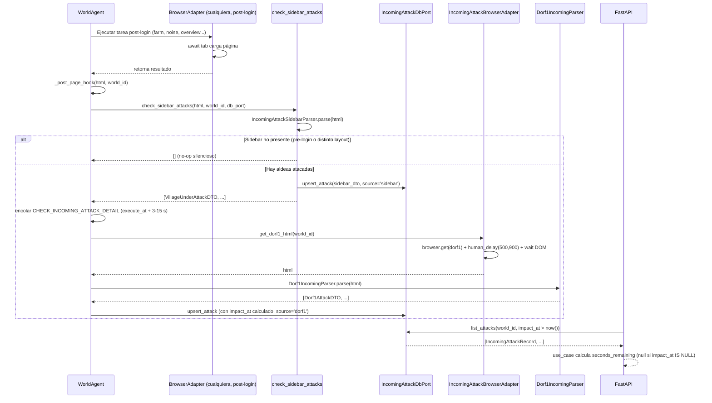

# Radar de ataques entrantes

> **Estado por componente**
>
> | Componente | Estado | Razón |
> |---|---|---|
> | A — Radar cross-cutting del sidebar | `ready-for-impl` **pleno** | Discriminador `div.listEntry.village.attack` confirmado con diff con-ataque vs sin-ataque (GAP-01 cerrado) |
> | B — Detección en dorf1 con timer | `ready-for-impl` | Fixture disponible |
> | C — Detalle del rally point | `blocked-needs-fixture` | Sin HTML de `build.php?gid=16&tt=1` |
> | D — Ficha de la aldea atacante | `blocked-needs-fixture` | Sin HTML de la página destino del hipervínculo de aldea |

---

## 1. Objetivo de negocio

Detectar en tiempo real que el jugador está recibiendo un ataque en Travian y registrar
los datos del atacante antes del impacto (datos pre-combate). El radar opera en dos
planos:

1. **Cross-cutting (Componente A):** un hook que se ejecuta tras CADA carga de página en
   Travian **post-login** (nunca en páginas de login o pre-autenticación), sin coste de
   navegación adicional, leyendo el sidebar ya cargado. Identifica qué aldeas propias
   tienen ataques entrantes.

2. **Detalle bajo demanda (Componentes B, C, D):** cuando el radar detecta un ataque, el
   bot puede profundizar: leer el timer de dorf1 (B), navegar al rally point para conocer
   atacante + origen + tipo (C), y seguir el hipervínculo de la aldea atacante para
   registrar sus datos (D).

Los datos capturados son **pre-combate** y se almacenan en una tabla separada de
`attack_reports` (que es post-combate). El ciclo de vida queda ligado al mundo: borrado
en cascada cuando se borra el mundo.

---

## 2. Actores y permisos

| Actor | Rol |
|---|---|
| WorldAgent | Orquesta el bucle de tareas por mundo; invoca el hook del radar tras cada interacción de browser **post-login** (paso `_post_page_hook`) |
| IncomingAttackSidebarParser | Parsea el HTML ya cargado del sidebar (función pura, sin navegación) |
| Dorf1Parser | Parsea el HTML de dorf1.php (función pura) |
| RallyPointParser | BLOQUEADO — parsea la tabla del rally point (requiere fixture GAP-02) |
| VillageProfileParser | BLOQUEADO — parsea la ficha de la aldea atacante (requiere fixture GAP-03) |
| IncomingAttackBrowserPort | Puerto de browser: obtiene HTML de dorf1 y navega al rally point / ficha |
| IncomingAttackDbPort | Puerto de BD: persiste y consulta ataques entrantes por mundo |
| IncomingAttackSQLiteAdapter | Implementación concreta del puerto de BD |
| FastAPI handler | Expone los endpoints de consulta al frontend |
| Frontend | Consulta y muestra los ataques pendientes |

Sistema single-tenant: no hay autenticación de usuario final. La autorización se delega
al mecanismo de sesiones del proyecto (ya existente en `SessionRegistry`).

---

## 3. Alcance

### Dentro del alcance

- **Componente A:** parser de sidebar (HTML ya cargado), extracción de `data-did` + nombre
  + coordenadas de aldeas con ataque entrante. Hook transversal en todos los flujos de
  browser **post-login** (no en `login.py` antes de autenticar).
- **Componente B:** parser de dorf1.php, extracción de ataques entrantes con cantidad,
  segundos al impacto y href del rally point. Adaptador de browser para obtener el HTML
  de dorf1 sin caché (TTL ≤ 30 s).
- **Componente C (diseño del contrato):** definición de campos deseados del rally point y
  flujo de navegación por click humano. Parser marcado BLOQUEADO hasta recibir fixture.
- **Componente D (diseño del contrato):** definición de campos de la ficha del atacante,
  límites de ritmo anti-detección. Parser marcado BLOQUEADO hasta recibir fixture.
- **Persistencia:** tabla `incoming_attacks` por mundo (FK `world_id` + DELETE CASCADE).
  La "alerta activa" se filtra por `impact_at > NOW()` en la consulta; no se borran filas
  al impactar.
- **API:** `GET /game/incoming-attacks/{world_id}` (ataques pendientes) y
  `POST /game/incoming-attacks/{world_id}/check` (forzar comprobación).

### Fuera del alcance

- Notificaciones push / alertas en tiempo real al usuario (WebSocket, polling desde el
  frontend es suficiente en esta fase).
- Deducción del tipo de tropa del atacante antes del impacto (no disponible en el sidebar
  ni en el timer de dorf1).
- Histórico permanente del atacante (el ciclo de vida se ata al mundo, no a una entidad
  `Player` global).
- Detección automática de si el ataque es asalto, refuerzo o spy (eso llega en C, que
  está bloqueado; mientras tanto el tipo es `unknown`).
- Cruzar datos con `attack_reports` (tabla post-combate) — integración futura.
- Alertas sonoras o de sistema operativo.

---

## 4. Reglas de negocio

| ID | Regla |
|---|---|
| RN-01 | La detección del sidebar (Componente A) NO añade ninguna petición HTTP extra a Travian: parsea el HTML ya presente en la página cargada. |
| RN-02 | **[CONFIRMADO — GAP-01 cerrado]** El discriminador de "aldea con ataque entrante" en el sidebar es, exclusivamente, la clase CSS `attack` en el elemento `div.listEntry.village`. Selector oficial: `div.listEntry.village.attack`. El parser extrae de cada match: `data-did` (village_game_id), `span.name` (nombre), `.coordinateX` / `.coordinateY` (coordenadas con regex `[-−]?\d+` para normalizar el signo Unicode). Evidencia del diff con-ataque vs sin-ataque: (1) `svg.attack` dentro de `span.incomingTroops` está presente en **todas** las entradas independientemente del estado — es un señuelo permanente, NO discrimina; (2) `svg.handle` (drag-handle en `div.dragAndDrop`) también está en todas las entradas — NO discrimina; (3) la ÚNICA diferencia observada es la clase `attack` en el `div.listEntry`. El parser debe ignorar completamente `svg.attack` y `svg.handle` como indicadores. |
| RN-03 | Selectores SIEMPRE estructurales — nunca por texto visible (25 idiomas, 3 RTL). |
| RN-04 | El HTML de dorf1 NO se cachea (o TTL ≤ 30 s) porque el timer cambia en tiempo real. La lectura de dorf1 es **puntual**: se hace una vez al detectar el ataque, no en polling metronómico. El `impact_at` calculado es absoluto y no se re-lee en bucle. |
| RN-05 | Los ataques entrantes se identifican por `img.att1` en el bloque `troopMovements` de dorf1. Los salientes por `img.att2`. El radar SOLO persiste los entrantes (`img.att1`). |
| RN-06 | El timer de impacto se lee de `span.timer[value]`; si no hay `value`, usar `data-value` como fallback. El valor es segundos enteros al impacto desde el momento de la lectura. El adapter calcula `impact_at = now() + timedelta(seconds=value)` y lo guarda en ISO-8601 UTC. |
| RN-07 | La cantidad de ataques se lee del número presente dentro de `span.a1` (p.ej. "1 Attack", "114 Attacks") extrayendo solo el primer token numérico con regex `\d+`. NO usar el texto literal. |
| RN-08 | El href del rally point (`build.php?gid=16&tt=1&filter=1&subfilters=1`) se extrae del `<a>` que envuelve `img.att1`. Se guarda íntegro para navegación posterior. |
| RN-09 | La navegación al rally point (Componente C) se hace por CLICK humano sobre el enlace/icono, nunca por URL directa. Firma: `human_click(element, tab)` — el parámetro `tab` (el `zd.Tab` activo) es **obligatorio**. |
| RN-10 | La navegación a la ficha del atacante (Componente D) se hace por CLICK humano sobre el hipervínculo de la aldea atacante en la tabla del rally point. Firma: `human_click(element, tab)` — el `tab` es **obligatorio**. |
| RN-11 | Límite de plausibilidad para Componente D: máximo **3 aldeas atacantes** por evento de radar. Si hay más, seguir las 3 con el timer más corto (prioridad de urgencia). |
| RN-12 | Delay entre consultas de ficha de aldea atacante (Comp. D): `human_delay(4000, 9000)` ms entre cada una (rango de lectura humana — un humano mira la ficha varios segundos). Seguir N aldeas en ráfaga sin pausa NO es un comportamiento humano plausible. |
| RN-13 | La tabla `incoming_attacks` tiene FK `world_id` con `ON DELETE CASCADE`. Borrar el mundo elimina todos sus ataques. |
| RN-14 | Un ataque se considera "pendiente" cuando `impact_at > NOW()`. La API filtra por esta condición; no se borran filas cuando el impacto ocurre. |
| RN-15 | La unicidad de un ataque se define por `(world_id, village_game_id_defender, impact_at)`. Si llega un duplicado al upsert, actualizar los campos mutables (attack_count, attacker_name, origin_village_name, operation_type) en lugar de insertar. |
| RN-16 | El hook del radar se ejecuta DESPUÉS de que la página cargue (tras el `await` de espera del DOM), pero ANTES de que el use case procese la respuesta. Es un step adicional que no bloquea el flujo principal — si el parser falla, loggea el error y continúa. |
| RN-17 | Los Componentes C y D están BLOQUEADOS. Mientras no existan sus parsers, los campos `attacker_name`, `origin_village_name`, `operation_type` se guardan como `None` en BD. |
| RN-18 | La deuda anti-detección de URL directa (ver `stats-overview-direct-url-debt`) NO debe agravarse: el adapter de dorf1 debe navegar con el mismo patrón que `LiveOverviewAdapter` (browser.get + human_delay + espera DOM), no saltarse los delays. **El `browser.get` a dorf1 es deuda conocida vinculada a `stats-overview-direct-url-debt`** (ver §13 RT-08). |
| RN-19 | **El hook del Componente A aplica SOLO a páginas post-login.** Si el HTML no contiene `#sidebarBoxVillageList`, el hook hace **no-op silencioso** (retorna lista vacía, sin excepción, sin log de error). El hook NO se cablea en `login.py` ni en ninguna navegación anterior a la autenticación. |
| RN-20 | **Idempotencia del snapshot de detalle (Comp. D):** una vez que `attacker_snapshot_json` está poblado para un `incoming_attack` vigente (no nulo), NO volver a navegar esa ficha mientras el ataque siga activo. El adapter verifica si el snapshot ya existe antes de encolar la tarea. Evita decenas de visitas repetidas a las mismas fichas durante los ~30 min del ataque. |
| RN-21 | **Punto de invocación único del hook:** el hook `check_sidebar_attacks` es una función pura que recibe el HTML ya cargado. Su único punto de invocación centralizado es `WorldAgent._post_page_hook`, ejecutado tras cada tarea de browser que devuelva HTML. Los adapters individuales NO replican la llamada. Esto evita el "radar silencioso" cuando se añadan adapters nuevos. |
| RN-22 | **Retraso humano antes de encolar Comp. B:** al detectar un ataque en el hook, encolar `CHECK_INCOMING_ATTACK_DETAIL` con `execute_at = utcnow() + timedelta(seconds=random(3..15))` (retraso variable) — un humano no salta al rally point en el mismo tick de la detección. La tarea mantiene prioridad máxima (0). |

---

## 5. Flujo principal y flujos alternativos

### Flujo principal — Radar cross-cutting (Componente A)

```
1. El WorldAgent completa cualquier interacción de browser post-login
   (farm list, noise, overview...). NO aplica durante login.py.
2. WorldAgent llama a _post_page_hook(html, world_id) — el HTML ya está cargado,
   no se hace ninguna petición adicional.
3. _post_page_hook llama a check_sidebar_attacks(page_html, world_id, db_port).
4. Si el HTML no contiene #sidebarBoxVillageList → retorna [] (no-op silencioso, RN-19).
5. IncomingAttackSidebarParser.parse(html) → lista de VillageUnderAttackDTO.
   [CONFIRMADO GAP-01: discrimina por div.listEntry.village.attack (clase 'attack'
    en el div.listEntry). svg.attack en span.incomingTroops es señuelo permanente —
    presente en TODAS las entradas, ignorar. svg.handle también ignorar.]
6. Si la lista está vacía → no hace nada (happy path sin ataque).
7. Si hay aldeas atacadas → upserta en BD (source='sidebar', impact_at=None).
8. WorldAgent encola tarea CHECK_INCOMING_ATTACK_DETAIL con
   execute_at = utcnow() + timedelta(seconds=random(3..15))
   si no hay una ya encolada para ese mundo.
```

### Flujo alternativo A1 — Parser del sidebar falla

```
4b. IncomingAttackSidebarParser.parse lanza excepción.
5b. check_sidebar_attacks loggea WARNING y retorna [] (no propaga la excepción).
6b. El flujo principal continúa normalmente.
```

### Flujo principal — Detección en dorf1 con timer (Componente B)

```
1. WorldAgent ejecuta tarea CHECK_INCOMING_ATTACK_DETAIL para world_id.
2. IncomingAttackBrowserAdapter.get_dorf1_html(world_id) → HTML de dorf1.php.
   [Patrón: browser.get + human_delay(500,900) + wait DOM — deuda RT-08]
3. Dorf1IncomingParser.parse(html) → lista de Dorf1AttackDTO (cantidad, seconds_to_impact, rally_point_href).
4. Por cada Dorf1AttackDTO con img.att1:
   a. Calcular impact_at = utcnow() + timedelta(seconds=dto.seconds_to_impact).
   b. Upsert en incoming_attacks (via IncomingAttackDbPort.upsert_attack).
5. Si Componentes C/D están disponibles: encolar tarea FETCH_RALLY_POINT_DETAIL.
   Si no (estado actual): attacker_name, origin_village_name, operation_type = None.
```

### Flujo alternativo B1 — dorf1 no carga en timeout

```
2b. IncomingAttackBrowserAdapter lanza IncomingAttackPageError.
3b. WorldAgent loggea ERROR, no encola FETCH_RALLY_POINT_DETAIL, continúa.
```

### Flujo principal — Detalle del rally point (Componente C — BLOQUEADO)

```
[DISEÑO DEL CONTRATO — parser bloqueado hasta recibir fixture GAP-02]
1. WorldAgent ejecuta tarea FETCH_RALLY_POINT_DETAIL para world_id + village_game_id.
2. IncomingAttackBrowserAdapter.click_rally_point_link(tab, rally_point_href):
   a. Localizar el elemento <a> con href que contiene 'gid=16'
      (selector: a[href*='gid=16'] — substring, no igualdad exacta, RN-G9/G2).
   b. Aplicar human_click(element, tab) — tab es el zd.Tab activo (OBLIGATORIO).
      PROHIBIDO cualquier tab.evaluate("...click()") — click sintético detectable.
   c. Esperar carga del DOM del rally point.
   d. Retornar HTML de la página.
3. RallyPointParser.parse(html) → lista de RallyPointAttackDTO (por implementar).
4. Por cada RallyPointAttackDTO: upsert en incoming_attacks con attacker_name,
   origin_village_href, operation_type.
```

### Flujo principal — Ficha de la aldea atacante (Componente D — BLOQUEADO)

```
[DISEÑO DEL CONTRATO — parser bloqueado hasta recibir fixture GAP-03]
1. WorldAgent ejecuta tarea FETCH_ATTACKER_VILLAGE_PROFILE.
2. Verificar idempotencia (RN-20): si attacker_snapshot_json ya no es NULL para
   ese incoming_attack → saltar (no navegar de nuevo).
3. IncomingAttackBrowserAdapter.click_origin_village_link(tab, origin_village_href):
   a. Localizar el hipervínculo de la aldea atacante (selector estructural — no por texto).
   b. Aplicar human_click(element, tab) — tab obligatorio (PROHIBIDO evaluate click).
   c. Esperar carga del DOM.
   d. Retornar HTML.
4. VillageProfileParser.parse(html) → VillageProfileDTO.
5. Persistir en attacker_village_snapshots / attacker_snapshot_json.
6. human_delay(4000, 9000) antes de la próxima aldea (RN-12 — rango de lectura humana).
7. Repetir máximo 3 aldeas (RN-11).
```

---

## 6. Edge cases (con tratamiento esperado)

| ID | Escenario | Tratamiento |
|---|---|---|
| EC-01 | **Sidebar sin `#sidebarBoxVillageList`** (página pre-login, página no completamente cargada, o layout diferente) | No-op silencioso: retorna lista vacía. No loggea nada (RN-19). |
| EC-02 | **[CERRADO — GAP-01 resuelto]** Falso positivo por `svg.attack` en el sidebar | El diff con-ataque vs sin-ataque confirma que `svg.attack` dentro de `span.incomingTroops` está presente en TODAS las entradas (señuelo permanente). El parser NO lo usa como discriminador. Cualquier lógica que detecte ataque basándose en la presencia de `svg.attack` daría falso positivo en las 8 aldeas. El parser SOLO lee la clase `attack` del `div.listEntry`. Prueba de regresión UT-RA07 cubre este caso. |
| EC-03 | **Aldea propia sin `data-did`** en el sidebar | Parser ignora ese `div` (loggea WARNING). |
| EC-04 | **`span.timer` sin atributo `value` ni `data-value`** en dorf1 | Parser descarta ese bloque de ataque (loggea WARNING). No persiste en BD. |
| EC-05 | **dorf1 sin bloque `troopMovements`** (aldea sin ningún movimiento) | Dorf1IncomingParser.parse devuelve lista vacía. |
| EC-06 | **Múltiples ataques entrantes a la misma aldea** en dorf1 | El timer más corto corresponde al primero en la lista HTML. Parsear y persistir TODOS los ataques entrantes (un upsert por `impact_at`). |
| EC-07 | **impact_at en el pasado al upsertear** (retraso entre lectura del timer y escritura) | Accepted: el upsert persiste el valor calculado. La API filtra `impact_at > NOW()` en la query; la fila quedará "invisible" en consultas futuras automáticamente. |
| EC-08 | **Duplicado exacto** `(world_id, village_game_id_defender, impact_at)` | Upsert: actualizar campos mutables (attack_count, etc.). No insertar copia. |
| EC-09 | **Browser no disponible** cuando se ejecuta el hook del radar | `SessionNotActiveError` → hook loggea WARNING y retorna vacío. No propaga. |
| EC-10 | **Mundo borrado** mientras hay ataques pendientes | CASCADE garantiza que `incoming_attacks` queda limpio. No necesita lógica adicional. |
| EC-11 | **Componente C: tabla del rally point vacía** (no hay ataques en el momento de navegar — ya impactaron) | Parser retorna lista vacía. Los registros ya en BD quedan con `attacker_name=None`. No es error. |
| EC-12 | **Componente D: hipervínculo de aldea atacante apunta a un jugador inactivo o borrado** | Si la página carga pero el parser no encuentra los campos esperados → VillageProfileDTO con campos `None`. Si la página no carga (404, timeout) → loggea y continúa con la siguiente aldea. |
| EC-13 | **Más de 3 aldeas atacantes simultáneas** | Seguir solo las 3 con `impact_at` más próximo (RN-11). Persistir los campos de detalle del atacante para esas 3; las demás quedan con `attacker_name=None`. |
| EC-14 | **`span.a1` contiene texto no numérico** | Regex `\d+` sobre el texto; si no hay match, `attack_count=1` como fallback conservador (siempre hay al menos un ataque si el bloque aparece). |
| EC-15 | **Hook del radar lanza excepción inesperada** | WorldAgent captura la excepción en bloque `try/except Exception`, loggea ERROR con traceback, y continúa el flujo principal. El radar nunca debe bloquear una operación de bot. |
| EC-16 | **snapshot de atacante ya existe** cuando se re-detecta el mismo ataque activo | Verificar RN-20 antes de encolar FETCH_ATTACKER_VILLAGE_PROFILE: si `attacker_snapshot_json IS NOT NULL`, skip. No navegar de nuevo. |
| EC-17 | **`impact_at IS NULL`** (ataque detectado solo vía sidebar, sin timer de dorf1 todavía) | `seconds_remaining` = `null` en la respuesta de API (calculado en use case, no en handler). |

---

## 7. Modelo de datos / cambios de esquema

### Tabla `incoming_attacks`

```sql
CREATE TABLE IF NOT EXISTS incoming_attacks (
    id                     INTEGER PRIMARY KEY AUTOINCREMENT,
    world_id               INTEGER NOT NULL
                               REFERENCES worlds(id) ON DELETE CASCADE,

    -- Aldea propia atacada
    village_game_id        INTEGER NOT NULL,   -- data-did del sidebar / game_id de dorf1
    village_name           TEXT,               -- nombre en el sidebar (puede ser NULL si solo viene de dorf1)
    village_coord_x        INTEGER,            -- coordenada X de nuestra aldea
    village_coord_y        INTEGER,            -- coordenada Y de nuestra aldea

    -- Datos del ataque (Componente B)
    attack_count           INTEGER NOT NULL DEFAULT 1,  -- número de ataques de este impact_at
    impact_at              TEXT,                        -- ISO-8601 UTC calculado desde timer (NULL si solo vino de sidebar)
    rally_point_href       TEXT,                        -- href extraído del <a> de img.att1

    -- Datos del atacante (Componentes C+D — NULL hasta que estén disponibles)
    attacker_name          TEXT,               -- nombre del jugador atacante
    origin_village_name    TEXT,               -- nombre de la aldea de origen del ataque
    origin_village_coord_x INTEGER,            -- coords del origen (si disponible)
    origin_village_coord_y INTEGER,            -- coords del origen (si disponible)
    operation_type         TEXT,               -- 'attack' | 'raid' | 'spy' | 'reinforce' | NULL
    origin_village_href    TEXT,               -- href de la ficha de la aldea origen (para Comp.D)

    -- Snapshot de la aldea atacante (Componente D — NULL hasta que esté disponible)
    attacker_snapshot_json TEXT,               -- JSON con datos de VillageProfileDTO

    -- Metadatos
    detected_at            TEXT NOT NULL,      -- ISO-8601 UTC del momento de la detección
    source                 TEXT NOT NULL,      -- 'sidebar' | 'dorf1' | 'rally_point'
    updated_at             TEXT NOT NULL,      -- ISO-8601 UTC del último upsert

    -- Unicidad: un ataque = una aldea + un momento de impacto, en un mundo
    UNIQUE (world_id, village_game_id, impact_at)
);

CREATE INDEX IF NOT EXISTS idx_incoming_attacks_world_impact
    ON incoming_attacks (world_id, impact_at);
```

**Notas del modelo:**

- `impact_at` es NULLABLE (sin `NOT NULL`): puede ser NULL cuando el ataque viene
  exclusivamente del sidebar (Comp. A) sin que Comp. B haya leído el timer aún.
- `village_coord_x/y` son las coordenadas de NUESTRA aldea (defensora), no del atacante.
- `origin_village_coord_x/y` son las coordenadas de la aldea atacante (origen del ataque).
- `attacker_snapshot_json` almacena como JSON opaco el `VillageProfileDTO` completo (dict
  serializable). Evita añadir columnas sueltas para cada campo de la ficha hasta tener
  el fixture real.
- `source` documenta de dónde se obtuvo el dato: `'sidebar'` si solo vino del hook A,
  `'dorf1'` si fue completado por B, `'rally_point'` si fue enriquecido por C/D.
- El campo `impact_at` incluye la precisión de segundos que proporciona el timer (no se
  redondea).

### DTOs del core (en `core/dtos/` o `core/entities/`)

```python
# core/dtos/incoming_attack_dto.py

from dataclasses import dataclass

@dataclass(frozen=True)
class VillageUnderAttackDTO:
    """Resultado del Componente A (sidebar). Identifica una aldea propia con ataque."""
    village_game_id: int        # data-did del div.listEntry.village.attack
    village_name:    str        # texto de span.name
    coord_x:         int        # valor de span.coordinateX (sin paréntesis)
    coord_y:         int        # valor de span.coordinateY (sin paréntesis)


@dataclass(frozen=True)
class Dorf1AttackDTO:
    """Resultado del Componente B (dorf1). Un bloque de ataque entrante."""
    attack_count:       int         # número extraído de span.a1 con regex \d+
    seconds_to_impact:  int         # value de span.timer
    rally_point_href:   str         # href del <a> que envuelve img.att1


@dataclass(frozen=True)
class RallyPointAttackDTO:
    """Resultado del Componente C (rally point) — CONTRATO DESEADO, parser BLOQUEADO."""
    attacker_name:       str        # nombre del jugador atacante
    origin_village_name: str        # nombre de la aldea de origen
    origin_village_href: str        # href de la ficha de la aldea atacante (para Comp.D)
    operation_type:      str        # 'attack' | 'raid' | 'spy' | 'reinforce'
    impact_at_display:   str        # hora de impacto tal como aparece en la tabla (para correlacionar con dorf1)


@dataclass(frozen=True)
class VillageProfileDTO:
    """Resultado del Componente D (ficha del atacante) — CONTRATO DESEADO, parser BLOQUEADO."""
    village_name:   str
    coord_x:        int
    coord_y:        int
    player_name:    str | None
    tribe:          str | None      # código de tribu ('romans', 'teutons', etc.)
    population:     int | None
```

### Excepciones nuevas (en `core/exceptions.py`)

```python
class IncomingAttackPageError(TravianBotError):
    """
    Error al cargar la página requerida por el radar de ataques
    (dorf1, rally point o ficha de atacante).
    """
    error_code = "INCOMING_ATTACK_PAGE_ERROR"
```

---

## 8. Contratos de API / interfaces

> Validado por desarrollador-apis (luz verde condicional — correcciones A1-A7 aplicadas).
> Ver Trazabilidad §16 para decisiones de reutilización.

### EP-RA01 — Listar ataques entrantes pendientes

```
GET /game/incoming-attacks/{world_id}
```

**Auth:** ninguna (sistema single-tenant local).

**Headers requeridos:** ninguno.

> **Desviación consciente de la regla global `Accept-Language`:** este endpoint NO
> requiere `Accept-Language` porque ningún campo de la respuesta es texto localizado
> (nombres se almacenan verbatim desde Travian, `operation_type` es enum en inglés).
> Esta es la misma postura de los endpoints de sesión. Si en el futuro se añaden campos
> localizados (p.ej. etiquetas de estado), revisar esta decisión y añadir el header.

**Path params:**

| Param | Tipo | Descripción |
|---|---|---|
| `world_id` | `int` | ID del mundo |

**Query params:**

| Param | Tipo | Default | Descripción |
|---|---|---|---|
| `include_past` | `bool` | `false` | Si `true`, incluye ataques con `impact_at` en el pasado (histórico). Si `false`, solo pendientes (`impact_at > now()`). |
| `village_game_id` | `int?` | `null` | Filtrar por aldea concreta. |
| `limit` | `int` | `50` | Máximo registros por página (rango 1-100). |
| `offset` | `int` | `0` | Offset de paginación. |

**Response 200:**

```json
{
  "items": [
    {
      "id": 42,
      "village_game_id": 27322,
      "village_name": "07",
      "village_coord_x": -68,
      "village_coord_y": 73,
      "attack_count": 1,
      "impact_at": "2026-06-05T14:30:18Z",
      "seconds_remaining": 1818,
      "rally_point_href": "/build.php?gid=16&tt=1&filter=1&subfilters=1",
      "attacker_name": null,
      "origin_village_name": null,
      "origin_village_coord_x": null,
      "origin_village_coord_y": null,
      "operation_type": null,
      "attacker_snapshot": null,
      "source": "dorf1",
      "detected_at": "2026-06-05T14:00:00Z"
    }
  ],
  "total": 1,
  "limit": 50,
  "offset": 0
}
```

> `seconds_remaining` es calculado en el **use case** (no en el handler) como
> `max(0, (impact_at - utcnow()).total_seconds())` cuando `impact_at` no es NULL.
> Cuando `impact_at IS NULL` (ataque detectado solo vía sidebar) → `seconds_remaining: null`.
> No se almacena en BD.

**Errores:**

| Código | Condición | `detail` |
|---|---|---|
| `404` | `world_id` no existe | `"Mundo {world_id} no encontrado"` |
| `422` | Parámetros de query con tipo incorrecto | Error estándar FastAPI/Pydantic |
| `500` | Error interno inesperado | `"Error interno del servidor"` |

---

### EP-RA02 — Forzar comprobación inmediata del radar

```
POST /game/incoming-attacks/{world_id}/check
```

Dispara manualmente la lectura de dorf1 para ese mundo (sin esperar al ciclo del
WorldAgent). Útil para pruebas y para que el usuario pueda forzar una actualización.

**Headers requeridos:** ninguno (acción, no devuelve texto localizado).

**Path params:** `world_id: int`.

**Response 200:**

```json
{
  "world_id": 1,
  "attacks_detected": 2,
  "message": "Check completado"
}
```

**Errores:**

| Código | Condición | `detail` |
|---|---|---|
| `404` | `world_id` no existe | `"Mundo {world_id} no encontrado"` |
| `503` | Sesión no activa para ese mundo | `"No hay sesión activa para el mundo {world_id}"` |
| `500` | Error interno inesperado | `"Error interno del servidor"` |

> El `503` refleja que `SessionNotActiveError` mapea a `503` en `ERROR_HTTP_MAP`
> (coherente con el patrón del proyecto para errores de disponibilidad de sesión).

---

## 9. Flujo lógico paso a paso

### 9.1 — Componente A: hook post-página

```python
# adapters/browser/incoming_attack_hook.py

async def check_sidebar_attacks(
    page_html: str,
    world_id: int,
    db_port: IncomingAttackDbPort,
) -> list[VillageUnderAttackDTO]:
    """
    Hook transversal. Llamado desde WorldAgent._post_page_hook con el HTML ya cargado.
    NO hace ninguna petición HTTP adicional — usa el HTML que ya tiene el caller.
    NO se llama desde login.py ni desde adapters individuales (RN-19, RN-21).
    Nunca propaga excepciones; loggea y retorna lista vacía ante cualquier error.

    Si #sidebarBoxVillageList no está en el HTML → retorna [] sin loggear (no-op silencioso).
    """
    try:
        attacks = IncomingAttackSidebarParser.parse(page_html)
        if attacks:
            await _notify_attacks(attacks, world_id, db_port)
        return attacks
    except Exception as exc:
        logger.warning("Radar sidebar falló: %s", exc)
        return []


async def _notify_attacks(
    attacks: list[VillageUnderAttackDTO],
    world_id: int,
    db_port: IncomingAttackDbPort,
) -> None:
    now_iso = datetime.now(timezone.utc).isoformat()
    for dto in attacks:
        await db_port.upsert_attack(IncomingAttackRecord(
            world_id=world_id,
            village_game_id=dto.village_game_id,
            village_name=dto.village_name,
            village_coord_x=dto.coord_x,
            village_coord_y=dto.coord_y,
            attack_count=1,          # sidebar no conoce la cantidad exacta
            impact_at=None,          # tampoco tiene timer; se completará en Comp. B
            source="sidebar",
            detected_at=now_iso,
            updated_at=now_iso,
        ))
```

### 9.2 — Componente A: parser del sidebar

```python
# adapters/browser/parsers/incoming_attack_sidebar_parser.py

class IncomingAttackSidebarParser:
    @staticmethod
    def parse(html: str) -> list[VillageUnderAttackDTO]:
        soup = BeautifulSoup(html, "html.parser")
        sidebar = soup.select_one("#sidebarBoxVillageList")
        if not sidebar:
            # No-op silencioso: página pre-login o sidebar no cargado (RN-19)
            return []

        results = []
        # DISCRIMINADOR CONFIRMADO (GAP-01 cerrado — diff con-ataque vs sin-ataque):
        # El ÚNICO indicador de "aldea bajo ataque" es la clase CSS 'attack'
        # en el div.listEntry. Selector: div.listEntry.village.attack
        #
        # SEÑUELOS A IGNORAR (presentes en TODAS las entradas, con o sin ataque):
        #   - span.incomingTroops > svg.attack  →  señuelo permanente, NO discrimina
        #   - div.dragAndDrop > svg.handle      →  drag-handle, NO discrimina
        # Cualquier lógica basada en svg.attack daría falso positivo en las 8 aldeas.
        attacked_entries = sidebar.select("div.listEntry.village.attack")

        for entry in attacked_entries:
            did = entry.get("data-did")
            if not did:
                logger.warning("div.listEntry.village.attack sin data-did — ignorando")
                continue

            name_el = entry.select_one("span.name")
            x_el    = entry.select_one("span.coordinateX")
            y_el    = entry.select_one("span.coordinateY")

            results.append(VillageUnderAttackDTO(
                village_game_id=int(did),
                village_name=name_el.get_text(strip=True) if name_el else "",
                coord_x=_parse_coord(x_el),
                coord_y=_parse_coord(y_el),
            ))

        return results


def _parse_coord(el) -> int:
    """
    Extrae el entero de un span de coordenada.
    El texto puede incluir paréntesis y el separador '|': "(−63" → -63.
    Usa regex r'[-−]?\d+' (guion normal + guion Unicode menos).
    """
    if el is None:
        return 0
    text = el.get_text(strip=True)
    m = re.search(r"[-−]?\d+", text)
    return int(m.group().replace("−", "-")) if m else 0
```

### 9.3 — Componente B: obtener HTML de dorf1

```python
# adapters/browser/incoming_attack_browser_adapter.py

class IncomingAttackBrowserAdapter:

    def __init__(
        self,
        get_browser: Callable[[int], Browser | None],
        get_world_server: Callable[[int], str],
    ):
        self._get_browser = get_browser
        self._get_world_server = get_world_server

    async def get_dorf1_html(self, world_id: int) -> str:
        """
        Navega a dorf1.php y devuelve el HTML.
        SIN caché (dorf1 cambia en tiempo real — RN-04). Lectura PUNTUAL, no en polling.
        Reutiliza el patrón de LiveOverviewAdapter:
          browser.get(url) + human_delay(500, 900) + espera DOM.
        NOTA: el uso de browser.get directo es deuda vinculada a stats-overview-direct-url-debt
        (RT-08). Cuando se implemente el sistema de rutas in-game, migrar a navegación
        con clicks humanos.
        """
        browser = self._get_browser(world_id)
        if browser is None:
            raise SessionNotActiveError()

        server = self._get_world_server(world_id)
        url = build_url(server, "dorf1.php")

        tab = await browser.get(url)
        await human_delay(500, 900)
        await tab.wait_for("#content", timeout=30)
        return await tab.get_content()

    async def click_rally_point_link(self, tab, rally_point_href: str) -> str:
        """
        [COMP. C — BLOQUEADO hasta fixture GAP-02]
        Localiza el <a> del rally point por substring 'gid=16' (no igualdad exacta —
        el href puede traer parámetros de sesión variables) y hace click humano.
        tab: zd.Tab activo — OBLIGATORIO.
        PROHIBIDO: tab.evaluate('...click()') — click sintético detectable.
        """
        element = await tab.select("a[href*='gid=16']")
        if element is None:
            raise IncomingAttackPageError("No se encontró el enlace al rally point")
        await human_click(element, tab)
        await tab.wait_for("#content", timeout=30)
        return await tab.get_content()

    async def click_origin_village_link(self, tab, origin_village_href: str) -> str:
        """
        [COMP. D — BLOQUEADO hasta fixture GAP-03]
        Localiza el hipervínculo de la aldea atacante por href estructural y hace click humano.
        tab: zd.Tab activo — OBLIGATORIO.
        PROHIBIDO: tab.evaluate('...click()') — click sintético detectable.
        """
        selector = f"a[href*='{origin_village_href}']"
        element = await tab.select(selector)
        if element is None:
            raise IncomingAttackPageError(
                f"No se encontró el enlace a aldea atacante: {origin_village_href}"
            )
        await human_click(element, tab)
        await tab.wait_for("#content", timeout=30)
        return await tab.get_content()
```

### 9.4 — Componente B: parser de dorf1

```python
# adapters/browser/parsers/dorf1_incoming_parser.py

class Dorf1IncomingParser:
    @staticmethod
    def parse(html: str) -> list[Dorf1AttackDTO]:
        soup = BeautifulSoup(html, "html.parser")
        results = []

        for img in soup.select("img.att1"):
            # El <a> padre contiene el href al rally point
            link = img.find_parent("a")
            if not link:
                continue
            href = link.get("href", "")

            # La fila hermana (siguiente <tr>) contiene el timer y la cantidad
            row = img.find_parent("tr")
            if not row:
                continue
            next_row = row.find_next_sibling("tr")
            if not next_row:
                continue

            # Timer
            timer_el = next_row.select_one("span.timer")
            if not timer_el:
                logger.warning("Bloque att1 sin span.timer — ignorando")
                continue
            value_str = timer_el.get("value") or timer_el.get("data-value")
            if value_str is None:
                logger.warning("span.timer sin value ni data-value — ignorando")
                continue
            try:
                seconds = int(value_str)
            except ValueError:
                logger.warning("span.timer value no numérico: %s — ignorando", value_str)
                continue

            # Cantidad
            count = 1
            count_el = next_row.select_one("span.a1")
            if count_el:
                m = re.search(r"\d+", count_el.get_text())
                if m:
                    count = int(m.group())

            results.append(Dorf1AttackDTO(
                attack_count=count,
                seconds_to_impact=seconds,
                rally_point_href=href,
            ))

        return results
```

### 9.5 — Integración con WorldAgent

```python
# En world_agent.py — añadir TaskType.CHECK_INCOMING_ATTACK_DETAIL

# Constructor: incoming_db_port es OPCIONAL (default None) — patrón de noise_db (P4)
def __init__(
    self,
    ...,
    incoming_db_port: IncomingAttackDbPort | None = None,
):
    ...
    self._incoming_db_port = incoming_db_port

# Punto ÚNICO de invocación del hook (RN-21):
# llamado desde WorldAgent._post_page_hook tras CADA tarea post-login que cargue página.
# Los adapters individuales NO llaman al hook directamente.
async def _post_page_hook(self, html: str, world_id: int) -> None:
    """
    Hook post-página transversal. html es el contenido ya cargado.
    No hace ninguna petición HTTP adicional.
    Solo aplica en páginas post-login (si #sidebarBoxVillageList no está → no-op).
    """
    if self._incoming_db_port is None:
        return
    attacks = await check_sidebar_attacks(html, world_id, self._incoming_db_port)
    if attacks and not self._has_pending_radar_task(world_id):
        # Retraso humano variable antes de encolar Comp. B (RN-22)
        import random  # import diferido — patrón del proyecto (P5)
        delay_s = random.uniform(3, 15)
        self._task_queue.add(Task(
            type=TaskType.CHECK_INCOMING_ATTACK_DETAIL,
            world_id=world_id,
            priority=0,         # Prioridad máxima — más urgente que farm lists
            execute_at=utcnow() + timedelta(seconds=delay_s),
        ))

def _has_pending_radar_task(self, world_id: int) -> bool:
    """Evita encolar múltiples CHECK_INCOMING_ATTACK_DETAIL para el mismo mundo."""
    return any(
        t.type == TaskType.CHECK_INCOMING_ATTACK_DETAIL and t.world_id == world_id
        for t in self._task_queue
    )
```

### 9.6 — Diagrama de flujo general



---

## 10. Validaciones y reglas

| Regla | Dónde se valida | Qué ocurre si falla |
|---|---|---|
| `world_id` existe en BD | Router FastAPI (use case) | `404 WorldNotFoundError` |
| `impact_at` es ISO-8601 UTC (cuando no es NULL) | Adaptador SQLite al insertar | Se rechaza con log ERROR (no debe pasar si el adapter calcula correctamente) |
| `village_game_id` es entero positivo | Parser (cast directo) | WARNING + skip de esa entrada |
| `seconds_to_impact` es entero ≥ 0 | Parser | WARNING + skip si es negativo |
| Unicidad `(world_id, village_game_id, impact_at)` | UNIQUE constraint SQLite | Upsert (ON CONFLICT DO UPDATE) |
| `include_past` es bool | FastAPI query param (Pydantic) | `422` automático |
| `limit` en rango 1-100 | Router (validación Pydantic `ge=1, le=100`) | `422` |
| `seconds_remaining` nunca negativo | Use case: `max(0, ...)` o `null` | N/A — el use case lo garantiza |

---

## 11. Seguridad, rendimiento y concurrencia

### Anti-detección (obligatorio — auditado por guardian-antideteccion)

- El Componente A no añade ninguna petición HTTP: costo de detección CERO.
- El Componente B parsea `page_html` del **mismo `dorf1.php`** que ya está cargado cuando
  el hook A detectó el ataque en dorf1. Si el bot NO estaba en dorf1 al detectar, el
  adapter navega con el mismo patrón que `LiveOverviewAdapter`:
  `browser.get` + `human_delay(500, 900)` + `await tab.wait_for("#content", timeout=30)`.
  Esta segunda ruta es **deuda explícita vinculada a `stats-overview-direct-url-debt`**
  (ver §13 RT-08) — no se presenta como patrón aceptable a largo plazo.
- Componentes C y D: **SIEMPRE** `human_click(element, tab)` sobre el elemento clicable.
  Nunca `browser.get` directo si hay un elemento interactivo. El parámetro `tab` (el
  `zd.Tab` activo) es **obligatorio** en todas las firmas.
  **PROHIBIDO:** `tab.evaluate("elemento.click()")` — click sintético directamente
  detectable por Travian.
- Selector del rally point: `a[href*='gid=16']` (substring) — NO igualdad exacta porque
  el href puede traer parámetros de sesión variables.
- Delay entre fichas de atacantes (Comp. D): `human_delay(4000, 9000)` entre cada una
  (rango de lectura humana — un humano lee varios segundos la ficha antes de seguir).
- Máximo 3 fichas por evento de radar (RN-11).
- Retraso de 3-15 s antes de ejecutar Comp. B (RN-22) — un humano no reacciona
  instantáneamente.
- **Idempotencia de snapshot (RN-20):** no volver a navegar una ficha cuyo snapshot ya
  está en BD, evitando decenas de visitas repetidas en los ~30 min del ataque.

**Lo que el guardian debe auditar antes de implementar:**
1. Verificar que `get_dorf1_html` tiene `human_delay(500-900)` y espera `#content`.
2. Verificar que la navegación al rally point (Comp. C) usa `human_click(element, tab)`.
3. Verificar que el loop de fichas (Comp. D) aplica `human_delay(4000, 9000)` entre iteraciones.
4. Confirmar que el hook del sidebar NO hace ningún `browser.get` adicional.
5. Confirmar que ningún método usa `tab.evaluate("...click()")`.
6. Confirmar que el `tab` se propaga correctamente en `IncomingAttackBrowserAdapter`.

### Rendimiento

- El hook del sidebar parsea HTML in-memory: latencia < 10 ms esperada.
- El adaptador SQLite usa índice `(world_id, impact_at)` para consultas eficientes.
- El use case calcula `seconds_remaining` en Python, no en SQL.

### Concurrencia

- El `WorldAgent` es el único actor que escribe en `incoming_attacks` para un mundo dado.
  No hay condiciones de carrera entre tareas del mismo mundo (el WorldAgent serializa las
  tareas).
- El endpoint de consulta (`GET`) es solo lectura; SQLite WAL permite lecturas concurrentes.
- El endpoint `POST /check` puede correr en paralelo con el WorldAgent si el usuario lo
  llama manualmente. El UNIQUE constraint + ON CONFLICT DO UPDATE hace el upsert
  idempotente.

---

## 12. Plan de pruebas

### Componente A — Sidebar parser

| Test | Tipo | Fixture | Criterio |
|---|---|---|---|
| UT-RA01 | Unit | sidebar_with_attack.html | Detecta `data-did=27322`, nombre `"07"`, coords `(-68, 73)`. |
| UT-RA02 | Unit | sidebar_with_attack.html | NO detecta `data-did=24341` (clase `listEntry village active`, sin `attack`). |
| UT-RA03 | Unit | sidebar_without_attack.html (fixture disponible — GAP-01 cerrado) | Retorna lista vacía: todas las entradas tienen `svg.attack` en `span.incomingTroops` pero carecen de la clase `attack` en el `div.listEntry` → cero falsos positivos. |
| UT-RA04 | Unit | HTML sin `#sidebarBoxVillageList` | Retorna lista vacía (no-op silencioso, sin log). |
| UT-RA05 | Unit | `div.listEntry.village.attack` sin `data-did` | Retorna lista vacía, loggea WARNING. |
| UT-RA06 | Unit | span.coordinateX con texto `"(−63"` (guion unicode) | `coord_x = -63` (no `0`). |
| UT-RA07 | Unit | HTML con TODAS las aldeas teniendo `svg.attack` en `span.incomingTroops` pero solo una con `div.listEntry.village.attack` | Solo se detecta la aldea con la clase `attack` en el `div.listEntry`; las demás (con `svg.attack` pero sin clase `attack` en el div) NO se detectan — valida que el señuelo no genera falso positivo. |
| UT-RA08 | Unit | HTML con `div.dragAndDrop > svg.handle` en todas las entradas pero ninguna con clase `attack` en el `div.listEntry` | Retorna lista vacía — `svg.handle` no genera falso positivo. |

### Componente B — Dorf1 parser

| Test | Tipo | Fixture | Criterio |
|---|---|---|---|
| UT-RB01 | Unit | dorf1_with_incoming.html | Detecta 1 ataque: `attack_count=1`, `seconds_to_impact=1818`, `rally_point_href` contiene `gid=16`. |
| UT-RB02 | Unit | dorf1_with_incoming.html | NO detecta el ataque saliente (`img.att2`). |
| UT-RB03 | Unit | dorf1_without_movements.html | Retorna lista vacía. |
| UT-RB04 | Unit | `span.timer` sin `value` ni `data-value` | Retorna lista vacía, loggea WARNING. |
| UT-RB05 | Unit | `span.a1` con texto `"114 Attacks"` | `attack_count=114`. |
| UT-RB06 | Unit | `span.a1` con texto no numérico | `attack_count=1` (fallback). |

### Puerto y adaptador de BD

| Test | Tipo | Criterio |
|---|---|---|
| UT-RD01 | Integration (SQLite en memoria) | `upsert_attack` con datos mínimos → inserción OK, `id` devuelto. |
| UT-RD02 | Integration | Segundo `upsert_attack` con misma clave `(world_id, village_game_id, impact_at)` → actualización, no duplicado. |
| UT-RD03 | Integration | `list_attacks(include_past=False)` → solo filas con `impact_at > utcnow()`. |
| UT-RD04 | Integration | `list_attacks(include_past=True)` → incluye todas. |
| UT-RD05 | Integration | Borrar el mundo → CASCADE elimina `incoming_attacks`. |
| UT-RD06 | Integration | `list_attacks(village_game_id=X)` → solo filas de esa aldea. |
| UT-RD07 | Integration | `upsert_attack` con `impact_at=None` → inserción OK (campo nullable). |

### Endpoints de API

| Test | Tipo | Criterio |
|---|---|---|
| UT-RE01 | API (TestClient) | `GET /game/incoming-attacks/999` (mundo inexistente) → `404`. |
| UT-RE02 | API | `GET /game/incoming-attacks/1` con ataques pendientes → `200` con `seconds_remaining > 0`. |
| UT-RE03 | API | `seconds_remaining` en respuesta es ≥ 0 cuando `impact_at` no es NULL. |
| UT-RE04 | API | `seconds_remaining` es `null` cuando `impact_at IS NULL` (solo sidebar). |
| UT-RE05 | API | `POST /game/incoming-attacks/1/check` sin sesión activa → `503`. |
| UT-RE06 | API | Respuesta EP-RA01 tiene wrapper `{items, total, limit, offset}` sin `world_id` en raíz. |
| UT-RE07 | API | `limit=101` → `422` (excede máximo 100). |
| UT-RE08 | API | `GET /game/incoming-attacks/1` sin `Accept-Language` → `200` (el header NO es requerido). |

---

## 13. Riesgos y trade-offs

| ID | Riesgo / Trade-off | Decisión |
|---|---|---|
| RT-01 | **[CERRADO] Selector `div.listEntry.village.attack` confirmado** — diff con-ataque vs sin-ataque demuestra que la clase `attack` en el `div.listEntry` es el ÚNICO cambio entre ambos estados. `svg.attack` en `span.incomingTroops` es señuelo permanente (presente en todas las entradas). `svg.handle` también irrelevante. | Selector oficial adoptado: `div.listEntry.village.attack`. El hook puede activarse en producción. Sin riesgo de falso positivo por señuelo siempre que el parser NO use `svg.attack` como discriminador. |
| RT-02 | **dorf1 sin aldea activa seleccionada** — si el bot está en una aldea diferente al navegar a dorf1, los movimientos pueden corresponder a otra aldea. | La URL `dorf1.php` sin parámetros muestra la aldea activa en la sesión. Si es necesario mostrar los movimientos de una aldea específica, usar `dorf1.php?newdid={game_id}`. Añadir parámetro `village_game_id` al adaptador si hace falta. |
| RT-03 | **Timer de dorf1 deriva respecto a `impact_at`** — el `value` del timer es "segundos restantes al momento de carga"; si la carga tarda 2 s, `impact_at` estará 2 s adelantado en la realidad. | Aceptado: la precisión de segundos es suficiente para el uso previsto (alerta de amenaza). No es un sistema de control de misiles. |
| RT-04 | **Componentes C y D bloqueados** — si el usuario tarda en proporcionar los fixtures, A y B son útiles en solitario. | Diseño modular: A y B son `ready-for-impl` independientemente de C y D. C y D se implementarán en un spec delta cuando lleguen los fixtures. |
| RT-05 | **`impact_at=None` cuando el ataque viene solo del sidebar** — un upsert posterior desde dorf1 rellenará el campo. Si nunca se ejecuta B, la fila tiene `impact_at=NULL`, que no es filtrable por `impact_at > NOW()`. | La API maneja este caso: `WHERE impact_at IS NULL OR impact_at > NOW()` cuando `include_past=False`, mostrando registros sin timer como "pendientes" (postura conservadora — mejor mostrar de más que perder un ataque). `seconds_remaining` se devuelve como `null`. |
| RT-06 | **Punto de invocación único del hook (P2)** — centralizar en `WorldAgent._post_page_hook` vs. llamarlo desde cada adapter individualmente. | Diseño adoptado: `WorldAgent._post_page_hook` es el único punto de invocación. Los adapters devuelven el HTML al WorldAgent, que invoca el hook. Ventaja: añadir un adapter nuevo no puede crear un "radar silencioso". Contra: `WorldAgent` acumula responsabilidades. Justificación: la alternativa distribuida ya causó bugs similares en el proyecto (deuda `stats-overview`); la centralización es el patrón más seguro. |
| RT-07 | **Posible deuda de arquitectura**: el hook necesita `IncomingAttackDbPort` inyectado en `WorldAgent`, lo que puede parecer acoplamiento. | El hook recibe el port como parámetro (inyección funcional), no lo importa directamente. El port es opcional en el constructor (default `None`) siguiendo el patrón de `noise_db`. Sigue la frontera hexagonal. |
| RT-08 | **`browser.get` directo a dorf1 (Comp. B) — deuda anti-detección vinculada a `stats-overview-direct-url-debt`.** El patrón correcto sería navegar a dorf1 via clicks desde la página actual, no con URL directa. | Asumido como deuda explícita. El `browser.get` se documenta como fallback temporal. Cuando se implemente el sistema de rutas in-game (roadmap), migrar a navegación con clicks. NO copiar este patrón para nuevas features. |
| RT-09 | **No añadir `ignore_imports` a `.importlinter` (P5)** — si `WorldAgent` necesita `human_delay`, debe hacerlo con import diferido. | Adoptado: usar `import random` diferido dentro del método, igual que `_execute_noise_step`. La lista de `ignore_imports` solo encoge. Ejecutar `lint-imports` antes de cerrar cada bloque de implementación. |

---

## 14. Pasos de implementación ordenados

> **GAP-01 cerrado (v3):** el discriminador `div.listEntry.village.attack` está confirmado
> con evidencia del diff con-ataque vs sin-ataque. El hook puede activarse en producción.
> No existe prerequisito pendiente para los Componentes A y B. Los Componentes C y D
> siguen bloqueados por GAP-02 y GAP-03 (fixtures del rally point y ficha del atacante).

### Bloque 1 — Modelo de datos y puertos (sin browser)

1. Crear `core/dtos/incoming_attack_dto.py` con `VillageUnderAttackDTO`, `Dorf1AttackDTO`,
   `RallyPointAttackDTO` (stub), `VillageProfileDTO` (stub).
2. Crear `core/ports/incoming_attack_db_port.py` con `IncomingAttackDbPort` (ABC).
   Métodos mínimos: `ensure_tables()`, `upsert_attack()`, `list_attacks()`.
3. Crear `adapters/db/incoming_attack_sqlite_adapter.py` con DDL de la tabla y los
   métodos del port. Patrón: igual que `attack_report_sqlite_adapter.py`.
4. Añadir `IncomingAttackPageError` a `core/exceptions.py`
   (`error_code = "INCOMING_ATTACK_PAGE_ERROR"`, subclase de `TravianBotError`).
5. Añadir `ensure_tables()` al lifespan de `adapters/api/main.py`.
6. Tests UT-RD01 a UT-RD07 (SQLite en memoria).
7. Verificar `lint-imports` — el port NO importa adapters; el adapter NO importa core
   directamente más allá de dtos y ports.

### Bloque 2 — Parsers (sin browser)

8. Crear fixture `tests/fixtures/incoming_attacks/sidebar_with_attack.html`
   (extracto del HTML del sidebar con ataque — aldea `data-did=27322` con clase `attack`).
9. Crear fixture `tests/fixtures/incoming_attacks/sidebar_without_attack.html`
   (extracto del HTML del sidebar sin ataque — todas las aldeas con `svg.attack` en
   `span.incomingTroops` pero SIN clase `attack` en el `div.listEntry`, confirmado GAP-01).
10. Crear `adapters/browser/parsers/incoming_attack_sidebar_parser.py`.
    Tests UT-RA01, UT-RA02, UT-RA03, UT-RA04, UT-RA05, UT-RA06, UT-RA07, UT-RA08.
11. Crear fixture `tests/fixtures/incoming_attacks/dorf1_with_incoming.html`
    (extracto del HTML de dorf1 proporcionado en el spec).
12. Crear `adapters/browser/parsers/dorf1_incoming_parser.py`.
    Tests UT-RB01 a UT-RB06.

### Bloque 3 — Hook transversal y browser adapter

13. Crear `adapters/browser/incoming_attack_hook.py` con `check_sidebar_attacks`.
    No requiere browser real; testeable con HTML en memoria.
14. Crear `adapters/browser/incoming_attack_browser_adapter.py` con `get_dorf1_html`.
    Patrón: igual que `LiveOverviewAdapter` (inyección de `get_browser` + `get_world_server`).
15. Añadir `_post_page_hook(html, world_id)` a `WorldAgent` — punto ÚNICO de invocación
    del hook (RN-21). Añadir `TaskType.CHECK_INCOMING_ATTACK_DETAIL`.
16. Inyectar `IncomingAttackDbPort` en `WorldAgent` como parámetro OPCIONAL
    (default `None`) siguiendo el patrón de `noise_db` (P4).
17. Cablear `IncomingAttackBrowserAdapter` en el lifespan y conectarlo al `WorldAgent`.

### Bloque 4 — API

18. Crear `adapters/api/routes/incoming_attacks.py` con EP-RA01
    (`GET /game/incoming-attacks/{world_id}`) y EP-RA02
    (`POST /game/incoming-attacks/{world_id}/check`).
    Router con `prefix="/game"` (coherente con `game_overview_router`).
19. Registrar el router en `adapters/api/main.py`.
20. Tests UT-RE01 a UT-RE08 con `TestClient`.
21. Verificar que ambos endpoints aparecen en Swagger.

### Bloque 5 — Componentes C y D (futuro — requieren fixtures)

22. **[BLOQUEADO]** Cuando el usuario proporcione el fixture de `build.php?gid=16&tt=1`:
    crear `adapters/browser/parsers/rally_point_parser.py` + test.
    Añadir método `click_rally_point_link(tab, rally_point_href)` al browser adapter.
    Añadir tarea `FETCH_RALLY_POINT_DETAIL` al WorldAgent.
    Selector obligatorio: `a[href*='gid=16']` (substring).
    Click: `human_click(element, tab)` — tab obligatorio.
23. **[BLOQUEADO]** Cuando el usuario proporcione el fixture de la ficha del atacante:
    crear `adapters/browser/parsers/village_profile_parser.py` + test.
    Añadir método `click_origin_village_link(tab, origin_village_href)` al browser adapter.
    Añadir tarea `FETCH_ATTACKER_VILLAGE_PROFILE` al WorldAgent.
    Respetar: RN-11 (máx 3), RN-12 (`human_delay(4000,9000)`), RN-20 (idempotencia snapshot).

---

## 15. Criterios de aceptación

### Componente A

- [ ] `IncomingAttackSidebarParser.parse` identifica `data-did=27322` como atacada en el fixture proporcionado (clase `attack` en `div.listEntry`).
- [ ] NO identifica `data-did=24341` (clase `listEntry village active` sin `attack`).
- [ ] NO identifica entradas con clase `listEntry village` plain (sin `attack`).
- [ ] Con fixture sin-ataque → retorna lista vacía aunque TODAS las entradas tengan `svg.attack` en `span.incomingTroops` (señuelo permanente, confirmado GAP-01). [UT-RA03]
- [ ] Aldea con `listEntry village attack` → detectada. Aldea con `listEntry village` + `svg.attack` presente en `span.incomingTroops` → NO detectada (el señuelo no genera falso positivo). [UT-RA07]
- [ ] `svg.handle` (drag-handle presente en todas las entradas) → NO genera falso positivo. [UT-RA08]
- [ ] Coordenadas con guion unicode (−63) se parsean como `-63`, no como `0`. [UT-RA06]
- [ ] Si `#sidebarBoxVillageList` no existe en el HTML → retorna lista vacía sin log de error. [UT-RA04]
- [ ] El hook NO hace ningún `browser.get` adicional.
- [ ] `lint-imports` pasa sin nuevas violaciones.

### Componente B

- [ ] `Dorf1IncomingParser.parse` extrae 1 ataque del fixture: `attack_count=1`, `seconds_to_impact=1818`.
- [ ] NO extrae el bloque `img.att2` (saliente).
- [ ] `rally_point_href` contiene `gid=16`.
- [ ] `impact_at` calculado correctamente: `utcnow() + timedelta(seconds=1818)`.
- [ ] `span.timer` sin atributos → skip + WARNING.
- [ ] `span.a1` con `"114 Attacks"` → `attack_count=114`.
- [ ] El adaptador navega dorf1 con `human_delay(500, 900)` y espera `#content`.
- [ ] Upsert en BD: segundo call con misma clave → actualización, no duplicado.

### Componente C/D (firmas anti-detección — verificar antes de desbloquear)

- [ ] `human_click(element, tab)` — `tab` siempre presente.
- [ ] Selector del rally point: `a[href*='gid=16']` (substring, no igualdad exacta).
- [ ] NINGÚN método usa `tab.evaluate("...click()")`.
- [ ] `human_delay(4000, 9000)` entre fichas de atacante.
- [ ] Máximo 3 fichas por evento.
- [ ] Idempotencia: si `attacker_snapshot_json IS NOT NULL` → no navegar de nuevo.

### API

- [ ] `GET /game/incoming-attacks/{world_id}` sin `Accept-Language` → `200` (header NO requerido).
- [ ] `GET` con mundo inexistente → `404`.
- [ ] `GET` con ataques pendientes → `200`, `seconds_remaining > 0` cuando hay `impact_at`.
- [ ] `seconds_remaining` es `null` cuando `impact_at IS NULL`.
- [ ] `seconds_remaining` nunca negativo en la respuesta.
- [ ] `include_past=false` (default) → solo `impact_at > now()`.
- [ ] Wrapper de respuesta: `{items, total, limit, offset}` — sin `world_id` en raíz.
- [ ] `limit=101` → `422`.
- [ ] `POST /check` sin sesión activa → `503`.
- [ ] Router declarado con `prefix="/game"`.

### Componentes C y D (contenido — pendiente fixtures)

- [ ] [BLOQUEADO] Los campos `attacker_name`, `origin_village_name`, `operation_type` están en el modelo de BD y en la respuesta de la API (valor `null` hasta que C/D estén implementados).

---

## 16. Trazabilidad

| Decisión técnica | Requisito / Edge case origen | Corrección aplicada |
|---|---|---|
| Discriminador `div.listEntry.village.attack` | **[CONFIRMADO GAP-01 — v3]** Diff con-ataque vs sin-ataque: clase `attack` en `div.listEntry` es el ÚNICO cambio de estado. `svg.attack` en `span.incomingTroops` es señuelo permanente (presente en todas las entradas). `svg.handle` también irrelevante. RT-01 cerrado. | U2: `svg.handle` no es discriminador (v2). v3: `svg.attack` también señuelo — parser no lo consulta. |
| No-op silencioso si `#sidebarBoxVillageList` ausente | RN-19 (hook solo post-login) | U1: páginas pre-login no tienen sidebar |
| No cablear hook en `login.py` | RN-19 | U1 |
| Parseo de coordenadas con regex (`[-−]?\d+`) | EC-06 (guion unicode en `"(−63"`) | — |
| Sin caché en dorf1; lectura puntual, no polling | RN-04 / G4 | G4: `impact_at` es absoluto, no se re-lee en bucle |
| Timer leído de `value` con fallback `data-value` | Fixture dorf1: `value="1818" data-value="1818"` | — |
| `attack_count` con regex `\d+` sobre `span.a1` | RN-07 (no usar texto literal — multi-idioma) | — |
| Tabla `incoming_attacks` separada de `attack_reports` | Pre-combate ≠ post-combate | — |
| FK `world_id` con `ON DELETE CASCADE` | RN-13 + ciclo de vida atado al mundo | — |
| `impact_at` NULLABLE | RT-05 / EC-17 — sidebar no tiene timer | A6 |
| Filtro `impact_at > NOW()` en query, no borrar filas | Decisión de producto | — |
| `UNIQUE (world_id, village_game_id, impact_at)` + ON CONFLICT DO UPDATE | RN-15 (evitar duplicados sin perder datos) | — |
| Máximo 3 fichas de atacante por evento | RN-11 (plausibilidad humana) | — |
| `human_delay(4000, 9000)` entre fichas | RN-12 / G5 — rango de lectura humana | G5: subido de 1500-3000 a 4000-9000 |
| Idempotencia snapshot (`attacker_snapshot_json`) | RN-20 / G6 | G6: no re-navegar ficha si snapshot ya existe |
| Firma `human_click(element, tab)` — tab obligatorio | G1 | G1: `tab` es parámetro obligatorio en todas las menciones |
| Selector rally point: `a[href*='gid=16']` (substring) | G9 / G2 — href puede traer params de sesión | G2/G9 |
| PROHIBIDO `tab.evaluate("...click()")` | G2 — click sintético detectable | G2 |
| Hook NO re-serializa DOM — recibe HTML ya cargado | G7 / RN-21 | G7: el HTML lo pasa el WorldAgent |
| Punto de invocación único: `WorldAgent._post_page_hook` | RN-21 / P2 | P2: evita "radar silencioso" al añadir adapters |
| `execute_at = utcnow() + random(3..15 s)` | RN-22 / G8 — retraso humano variable | G8 |
| `IncomingAttackDbPort` inyectado como parámetro OPCIONAL (default None) | P4 — patrón `noise_db` | P4 |
| Import diferido de `random` en `WorldAgent` | P5 — no añadir `ignore_imports` a `.importlinter` | P5 |
| Router con `prefix="/game"` | P3 — coherente con `game_overview_router` | P3 |
| `IncomingAttackPageError` en `core/exceptions.py` | P1 — catálogo de excepciones del proyecto | P1 |
| Rutas: `GET /game/incoming-attacks/{world_id}` y `POST /game/incoming-attacks/{world_id}/check` | A1 — patrón `game/*` establecido | A1 |
| Sin `Accept-Language` en EP-RA01 | A2 — ningún campo localizado; desviación consciente documentada | A2 |
| `503` para sesión no activa en EP-RA02 | A3 — `SessionNotActiveError` mapea a 503 en `ERROR_HTTP_MAP` | A3 |
| `limit` máximo 100 (`ge=1, le=100`) | A4 | A4 |
| Wrapper `{items, total, limit, offset}` sin `world_id` en raíz | A5 | A5 |
| `seconds_remaining=null` cuando `impact_at IS NULL` | A6 / EC-17 — calculado en use case | A6 |
| `500` en cuadros de errores de ambos endpoints | A7 | A7 |
| `browser.get` directo a dorf1 documentado como deuda RT-08 | G3 / RN-18 — vinculado a `stats-overview-direct-url-debt` | G3 |
| Reutilización: `build_url` de `url_utils.py` | Mapa de reutilización palantir | — |
| Reutilización: `human_delay` de `driver.py` | Mapa de reutilización palantir | — |
| Reutilización: patrón de puerto ABC | Convención del proyecto (`project-arch-conventions`) | — |
| Reutilización: patrón parser estático | `OverviewParser.extract_overview_data` como referencia | — |
| Reutilización: `get_world_server` / `get_browser` callables | Patrón `LiveOverviewAdapter` | — |

---

## GAPS / BLOQUEOS

> Estos tres fixtures son prerequisitos para implementar los componentes marcados.
> Sin ellos, los parsers no pueden escribirse de forma correcta y segura.

### GAP-01 — Fixture del sidebar SIN ningún ataque — **CERRADO (v3, 2026-06-05)**

**Estado:** RESUELTO. El discriminador está confirmado con evidencia definitiva.

**Evidencia del diff con-ataque vs sin-ataque:**
- Fixture CON ataque: `data-did=27322` tiene `class="listEntry village attack"`.
- Fixture SIN ataque: `data-did=27322` tiene `class="listEntry village"`. El resto de
  aldeas permanecen `listEntry village` en ambos estados.
- Hallazgo crítico: en AMBOS estados, TODAS las entradas contienen
  `<span class="incomingTroops">...<svg class="attack">...</svg></span>`.
  Por tanto, `svg.attack` es un **señuelo permanente**: no discrimina, genera falso
  positivo en las 8 aldeas si se usa como indicador.
- `svg.handle` (drag-handle en `div.dragAndDrop`) también presente en todos — igualmente irrelevante.

**Conclusión confirmada:**
El ÚNICO discriminador es la clase `attack` en `div.listEntry`. Selector oficial:
`div.listEntry.village.attack`. El parser NO consulta `svg.attack` ni `svg.handle`.

**Impacto en el spec:**
- RN-02 actualizado a CONFIRMADO.
- RT-01 cerrado.
- UT-RA03 desbloqueado (fixture disponible).
- UT-RA07 y UT-RA08 añadidos para cubrir el señuelo.
- Prerequisito de GAP-01 eliminado del §14.
- Componente A: `ready-for-impl` pleno (sin salvedades).

---

### GAP-02 — Fixture del rally point (`build.php?gid=16&tt=1`)

**Bloquea:** Componente C completo (parser, adaptador, tarea del WorldAgent).

**Qué necesito del usuario:**
El HTML de la tabla del rally point tal como aparece cuando hay ataques entrantes listados.
Específicamente:
- La tabla o lista con los ataques entrantes (quién ataca, desde qué aldea, de qué tipo, cuándo).
- Selectores exactos para: nombre del jugador atacante, hipervínculo de la aldea de origen,
  tipo de operación (texto o clase CSS), hora de impacto.
- Si el atacante es anónimo (spy con sigilo), cómo se representa en el HTML.

**Cómo capturarlo:**
1. Cuando el bot detecte un ataque (Componente B operativo), navegar manualmente a
   `build.php?gid=16&tt=1` en la misma sesión.
2. F12 → Elements → buscar el contenedor de la tabla de ataques entrantes.
3. Copiar el elemento raíz de la tabla.

---

### GAP-03 — Fixture de la ficha de la aldea atacante

**Bloquea:** Componente D completo (parser, adaptador, tarea del WorldAgent).

**Qué necesito del usuario:**
El HTML de la página a la que lleva el hipervínculo de la aldea atacante desde el rally
point. Interesa:
- Nombre de la aldea.
- Coordenadas (x, y).
- Nombre del jugador propietario.
- Tribu (o cómo se representa: ¿clase CSS? ¿texto? ¿imagen?).
- Población.
- Si hay algún identificador estructural (ID de aldea, ID de jugador en el href).

**Cómo capturarlo:**
1. Desde el rally point (GAP-02 resuelto), hacer click en el hipervínculo de la aldea.
2. Copiar el HTML de la zona de información de la aldea.

---

> **Resumen de estado de implementación (v3):**
>
> - Bloques 1 y 2 del §14: `ready-for-impl` pleno. GAP-01 cerrado — no hay hipótesis pendiente en código.
> - Bloque 3 del §14: `ready-for-impl` pleno. El hook puede activarse en producción.
> - Bloque 4 del §14: `ready-for-impl`.
> - Bloque 5 del §14: `blocked-needs-fixture` (GAP-02 y GAP-03).

---

## CHANGELOG — Revisiones del spec

### v3 — 2026-06-05

**Cierre de GAP-01 con evidencia definitiva (diff HTML con-ataque vs sin-ataque):**

- GAP-01 cerrado: el usuario aportó el HTML completo del sidebar en estado SIN ataques.
  El diff es concluyente: `svg.attack` en `span.incomingTroops` está presente en TODAS
  las entradas en ambos estados — es señuelo permanente, no discrimina. La ÚNICA
  diferencia es la clase `attack` en `div.listEntry` de la aldea atacada.
- RN-02 actualizado de hipótesis a CONFIRMADO. Selector oficial: `div.listEntry.village.attack`.
  Datos extraídos: `data-did`, `span.name`, `.coordinateX`/`.coordinateY` (regex `[-−]?\d+`).
- RT-01 cerrado (hipótesis → confirmación).
- EC-02 reescrito: ya no habla de "discriminador incorrecto posible" sino de "señuelo
  confirmado — el parser lo ignora".
- Pseudocódigo §9.2 limpiado: eliminada la lógica de confirmación adicional de `svg.attack`
  (que resultó ser señuelo). El comentario ahora explica el señuelo y por qué se ignora.
- Plan de pruebas §12: UT-RA03 desbloqueado; UT-RA07 reescrito para validar el señuelo;
  UT-RA08 añadido para validar que `svg.handle` tampoco genera falso positivo.
- Criterios de aceptación §15: actualizados con los nuevos tests y sin el item bloqueado.
- §14 Paso 9: desbloqueado; fixture `sidebar_without_attack.html` ya disponible.
- Prerequisito del Bloque 1 de §14: actualizado (no hay gate pendiente para Componentes A y B).
- Componente A: estado cambiado a `ready-for-impl` pleno (eliminada la salvedad de GAP-01).
- Resumen de estado de implementación actualizado.

---

### v2 — 2026-06-05

**Correcciones del usuario (U1, U2):**
- U1: Hook limitado a páginas post-login. Si `#sidebarBoxVillageList` ausente → no-op silencioso (sin log). `login.py` excluido del cableado. Reflejado en RN-19, §1, §3, §5, §15.
- U2: GAP-01 sigue abierto. Nueva evidencia: `svg.handle` (drag-handle) no es el discriminador; el parser debe buscar `svg.attack` SOLO dentro de `span.incomingTroops`. Se añadió lógica de confirmación adicional en el pseudocódigo del parser (§9.2). Actualizado RN-02, EC-02, §GAP-01.

**Correcciones de palantir (P1-P5):**
- P1: `IncomingAttackPageError` añadida al catálogo de excepciones (§7, paso 4 de §14).
- P2: Diseño del punto de invocación único resuelto — `WorldAgent._post_page_hook` es el único caller del hook. Añadida RN-21 y RT-06 actualizado con justificación del trade-off.
- P3: Router con `prefix="/game"` confirmado en §8, §14 y §15.
- P4: `IncomingAttackDbPort` inyectado como parámetro OPCIONAL (default `None`) en `WorldAgent`. Añadido patrón en §9.5.
- P5: Import diferido de `random` en `WorldAgent`. Añadida RT-09 y nota en §9.5.

**Correcciones de guardian-antideteccion (G1-G9):**
- G1: Firma `human_click(element, tab)` y `human_click_at_rect(rect, tab)` corregidas en TODO el spec. `tab` es parámetro obligatorio.
- G2: Click en rally point por `human_click(element, tab)`. PROHIBIDO explícitamente `tab.evaluate("...click()")`.
- G3: Comp. B reescrito para parsear el `page_html` ya cargado cuando la detección A ocurrió en dorf1. `browser.get` a dorf1 queda como fallback documentado como deuda RT-08.
- G4: `impact_at` es absoluto una vez calculado. No polling metronómico. Aclarado en RN-04.
- G5: `human_delay` entre fichas subido de `(1500, 3000)` a `(4000, 9000)` en RN-12, §5, §11, §15.
- G6: RN-20 añadida — idempotencia de snapshot. EC-16 añadido. Paso 2 de Comp. D en §5 actualizado.
- G7: Hook recibe HTML ya cargado; no re-serializa DOM. Reflejado en §9.1 y RN-21.
- G8: `execute_at = utcnow() + random(3..15 s)`. RN-22 añadida. §9.5 actualizado.
- G9: Selector `a[href*='gid=16']` (substring) en todo el spec.

**Correcciones de desarrollador-apis (A1-A7):**
- A1: Rutas corregidas a `GET /game/incoming-attacks/{world_id}` y `POST /game/incoming-attacks/{world_id}/check`.
- A2: `Accept-Language` eliminado de EP-RA01. Desviación consciente documentada. Tests UT-RE01 y UT-RE08 actualizados. Criterio de API actualizado.
- A3: `409` → `503` para "sesión no activa" en EP-RA02. UT-RE05 actualizado.
- A4: `limit` máximo 100 (no 200). `Query(default=50, ge=1, le=100)`. §10 y UT-RE07 actualizados.
- A5: Wrapper `{items, total, limit, offset}` sin `world_id` en raíz. Ejemplo de respuesta EP-RA01 actualizado.
- A6: `seconds_remaining=null` cuando `impact_at IS NULL`. Calculado en use case (no handler). EC-17, UT-RE04, §9.5 actualizados.
- A7: `500` añadido a cuadros de errores de ambos endpoints.
