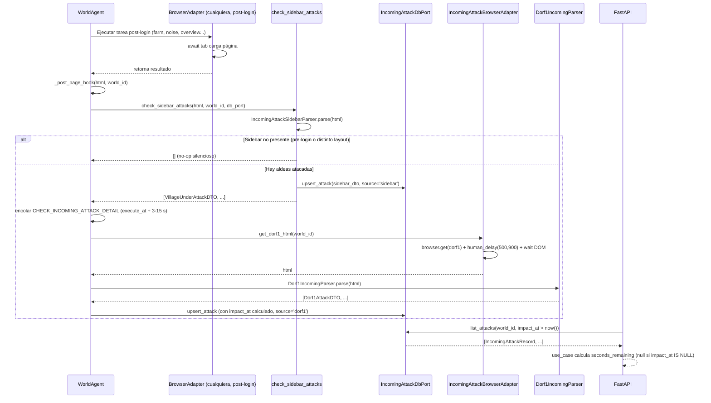

# Radar de ataques entrantes

> **Estado por componente**
>
> | Componente | Estado | Razón |
> |---|---|---|
> | A — Radar cross-cutting del sidebar | `ready-for-impl` **pleno** | Discriminador `div.listEntry.village.attack` confirmado con diff con-ataque vs sin-ataque (GAP-01 cerrado) |
> | B — Detección en dorf1 con timer | `ready-for-impl` | Fixture disponible |
> | C — Detalle del rally point | `ready-for-impl` | **GAP-02 CERRADO** — fixture `troop_details_in_attack.html` recibido |
> | D — Ficha de la aldea atacante | `ready-for-impl` | **GAP-03 CERRADO** — fixture `karte_tile_attacker_dialog.html` recibido |
> | EP-RA03 — Summary badge | `ready-for-impl` | Contrato nuevo — pendiente luz verde desarrollador-apis |

---

## 1. Objetivo de negocio

Detectar en tiempo real que el jugador está recibiendo un ataque en Travian y registrar
los datos del atacante antes del impacto (datos pre-combate). El radar opera en dos
planos:

1. **Cross-cutting (Componente A):** un hook que se ejecuta tras CADA carga de página en
   Travian **post-login** (nunca en páginas de login o pre-autenticación), sin coste de
   navegación adicional, leyendo el sidebar ya cargado. Identifica qué aldeas propias
   tienen ataques entrantes.

2. **Detalle bajo demanda (Componentes B, C, D):** cuando el radar detecta un ataque, el
   bot puede profundizar: leer el timer de dorf1 (B), navegar al rally point para conocer
   atacante + origen + tipo (C), y seguir el hipervínculo de la aldea atacante para
   registrar sus datos (D).

Los datos capturados son **pre-combate** y se almacenan en una tabla separada de
`attack_reports` (que es post-combate). El ciclo de vida queda ligado al mundo: borrado
en cascada cuando se borra el mundo.

---

## 2. Actores y permisos

| Actor | Rol |
|---|---|
| WorldAgent | Orquesta el bucle de tareas por mundo; invoca el hook del radar tras cada interacción de browser **post-login** (paso `_post_page_hook`) |
| IncomingAttackSidebarParser | Parsea el HTML ya cargado del sidebar (función pura, sin navegación) |
| Dorf1Parser | Parsea el HTML de dorf1.php (función pura) |
| RallyPointParser | Parsea `table.troop_details.inAttack` del rally point — **desbloqueado (GAP-02 cerrado)** |
| VillageProfileParser | Parsea el diálogo `div#tileDetails` del mapa — **desbloqueado (GAP-03 cerrado)** |
| IncomingAttackBrowserPort | Puerto de browser: obtiene HTML de dorf1 y navega al rally point / ficha |
| IncomingAttackDbPort | Puerto de BD: persiste y consulta ataques entrantes por mundo |
| IncomingAttackSQLiteAdapter | Implementación concreta del puerto de BD |
| FastAPI handler | Expone los endpoints de consulta al frontend |
| Frontend | Consulta y muestra los ataques pendientes |

Sistema single-tenant: no hay autenticación de usuario final. La autorización se delega
al mecanismo de sesiones del proyecto (ya existente en `SessionRegistry`).

---

## 3. Alcance

### Dentro del alcance

- **Componente A:** parser de sidebar (HTML ya cargado), extracción de `data-did` + nombre
  + coordenadas de aldeas con ataque entrante. Hook transversal en todos los flujos de
  browser **post-login** (no en `login.py` antes de autenticar).
- **Componente B:** parser de dorf1.php, extracción de ataques entrantes con cantidad,
  segundos al impacto y href del rally point. Adaptador de browser para obtener el HTML
  de dorf1 sin caché (TTL ≤ 30 s).
- **Componente C — RallyPointParser:** parseo de `table.troop_details.inAttack` con
  selectores verificados en el fixture real. Extrae atacante, tropas entrantes (uNN + cantidades),
  hora de impacto, y link `karte.php?d=NNN` de la aldea atacante. La tribu se deriva
  estructuralmente de las clases `uNN` de las tropas (via `unit_class_to_tribe_ordinal`).
  La navegación es una "ruta reactiva prioridad-0" que reutiliza `human_click` sin pasar
  por el scheduler de ruido. **GAP-02 CERRADO.**
- **Componente D — VillageProfileParser:** parseo del diálogo `div#tileDetails` del mapa
  (selector `#tileDetails`). Extrae propietario, alianza, población, coordenadas, tribu
  estructural (fallback desde `div.village.village-N` si no disponible del rally point).
  **GAP-03 CERRADO.**
- **Persistencia:** tabla `incoming_attacks` por mundo (FK `world_id` + DELETE CASCADE).
  La "alerta activa" se filtra por `impact_at > NOW()` en la consulta; no se borran filas
  al impactar.
- **API:** `GET /game/incoming-attacks/{world_id}` (ataques pendientes),
  `POST /game/incoming-attacks/{world_id}/check` (forzar comprobación), y
  `GET /game/incoming-attacks/summary` (recuento por mundo para badge de la lista de Mundos).

### Fuera del alcance

- Notificaciones push / alertas en tiempo real al usuario (WebSocket, polling desde el
  frontend es suficiente en esta fase).
- Deducción del tipo de tropa del atacante antes del impacto (no disponible en el sidebar
  ni en el timer de dorf1).
- Histórico permanente del atacante (el ciclo de vida se ata al mundo, no a una entidad
  `Player` global).
- Detección automática de si el ataque es asalto, refuerzo o spy (eso llega en C, que
  está bloqueado; mientras tanto el tipo es `unknown`).
- Cruzar datos con `attack_reports` (tabla post-combate) — integración futura.
- Alertas sonoras o de sistema operativo.

---

## 4. Reglas de negocio

| ID | Regla |
|---|---|
| RN-01 | La detección del sidebar (Componente A) NO añade ninguna petición HTTP extra a Travian: parsea el HTML ya presente en la página cargada. |
| RN-02 | **[CONFIRMADO — GAP-01 cerrado]** El discriminador de "aldea con ataque entrante" en el sidebar es, exclusivamente, la clase CSS `attack` en el elemento `div.listEntry.village`. Selector oficial: `div.listEntry.village.attack`. El parser extrae de cada match: `data-did` (village_game_id), `span.name` (nombre), `.coordinateX` / `.coordinateY` (coordenadas con regex `[-−]?\d+` para normalizar el signo Unicode). Evidencia del diff con-ataque vs sin-ataque: (1) `svg.attack` dentro de `span.incomingTroops` está presente en **todas** las entradas independientemente del estado — es un señuelo permanente, NO discrimina; (2) `svg.handle` (drag-handle en `div.dragAndDrop`) también está en todas las entradas — NO discrimina; (3) la ÚNICA diferencia observada es la clase `attack` en el `div.listEntry`. El parser debe ignorar completamente `svg.attack` y `svg.handle` como indicadores. |
| RN-03 | Selectores SIEMPRE estructurales — nunca por texto visible (25 idiomas, 3 RTL). |
| RN-04 | El HTML de dorf1 NO se cachea (o TTL ≤ 30 s) porque el timer cambia en tiempo real. La lectura de dorf1 es **puntual**: se hace una vez al detectar el ataque, no en polling metronómico. El `impact_at` calculado es absoluto y no se re-lee en bucle. |
| RN-05 | Los ataques entrantes se identifican por `img.att1` en el bloque `troopMovements` de dorf1. Los salientes por `img.att2`. El radar SOLO persiste los entrantes (`img.att1`). |
| RN-06 | El timer de impacto se lee de `span.timer[value]`; si no hay `value`, usar `data-value` como fallback. El valor es segundos enteros al impacto desde el momento de la lectura. El adapter calcula `impact_at = now() + timedelta(seconds=value)` y lo guarda en ISO-8601 UTC. |
| RN-07 | La cantidad de ataques se lee del número presente dentro de `span.a1` (p.ej. "1 Attack", "114 Attacks") extrayendo solo el primer token numérico con regex `\d+`. NO usar el texto literal. |
| RN-08 | El href del rally point (`build.php?gid=16&tt=1&filter=1&subfilters=1`) se extrae del `<a>` que envuelve `img.att1`. Se guarda íntegro para navegación posterior. |
| RN-09 | La navegación al rally point (Componente C) se hace por CLICK humano sobre el enlace/icono, nunca por URL directa. Firma: `human_click(element, tab)` — el parámetro `tab` (el `zd.Tab` activo) es **obligatorio**. |
| RN-10 | La navegación a la ficha del atacante (Componente D) se hace por CLICK humano sobre el hipervínculo de la aldea atacante en la tabla del rally point. Firma: `human_click(element, tab)` — el `tab` es **obligatorio**. |
| RN-11 | Límite de plausibilidad para Componente D: máximo **3 aldeas atacantes** por evento de radar. Si hay más, seguir las 3 con el timer más corto (prioridad de urgencia). |
| RN-12 | Delay entre consultas de ficha de aldea atacante (Comp. D): `human_delay(4000, 9000)` ms entre cada una (rango de lectura humana — un humano mira la ficha varios segundos). Seguir N aldeas en ráfaga sin pausa NO es un comportamiento humano plausible. |
| RN-13 | La tabla `incoming_attacks` tiene FK `world_id` con `ON DELETE CASCADE`. Borrar el mundo elimina todos sus ataques. |
| RN-14 | Un ataque se considera "pendiente" cuando `impact_at > NOW()`. La API filtra por esta condición; no se borran filas cuando el impacto ocurre. |
| RN-15 | La unicidad de un ataque se define por `(world_id, village_game_id_defender, impact_at)`. Si llega un duplicado al upsert, actualizar los campos mutables (attack_count, attacker_name, origin_village_name, operation_type) en lugar de insertar. |
| RN-16 | El hook del radar se ejecuta DESPUÉS de que la página cargue (tras el `await` de espera del DOM), pero ANTES de que el use case procese la respuesta. Es un step adicional que no bloquea el flujo principal — si el parser falla, loggea el error y continúa. |
| RN-17 | **[HISTÓRICO — solo aplica a la implementación de los Bloques 1-4 ya entregados]** Durante la implementación inicial (pre-v4), los Componentes C y D estaban bloqueados. Los campos `attacker_name`, `origin_village_name`, `operation_type` se guardaban como `None`. En v4 estos componentes están `ready-for-impl` (GAP-02/03 cerrados). |
| RN-18 | La deuda anti-detección de URL directa (ver `stats-overview-direct-url-debt`) NO debe agravarse: el adapter de dorf1 debe navegar con el mismo patrón que `LiveOverviewAdapter` (browser.get + human_delay + espera DOM), no saltarse los delays. **El `browser.get` a dorf1 es deuda conocida vinculada a `stats-overview-direct-url-debt`** (ver §13 RT-08). |
| RN-19 | **El hook del Componente A aplica SOLO a páginas post-login.** Si el HTML no contiene `#sidebarBoxVillageList`, el hook hace **no-op silencioso** (retorna lista vacía, sin excepción, sin log de error). El hook NO se cablea en `login.py` ni en ninguna navegación anterior a la autenticación. |
| RN-20 | **Idempotencia del snapshot de detalle (Comp. D):** una vez que `attacker_snapshot_json` está poblado para un `incoming_attack` vigente (no nulo), NO volver a navegar esa ficha mientras el ataque siga activo. El adapter verifica si el snapshot ya existe antes de encolar la tarea. Evita decenas de visitas repetidas a las mismas fichas durante los ~30 min del ataque. |
| RN-21 | **Punto de invocación único del hook:** el hook `check_sidebar_attacks` es una función pura que recibe el HTML ya cargado. Su único punto de invocación centralizado es `WorldAgent._post_page_hook`, ejecutado tras cada tarea de browser que devuelva HTML. Los adapters individuales NO replican la llamada. Esto evita el "radar silencioso" cuando se añadan adapters nuevos. |
| RN-22 | **Retraso humano antes de encolar Comp. B:** al detectar un ataque en el hook, encolar `CHECK_INCOMING_ATTACK_DETAIL` con `execute_at = utcnow() + timedelta(seconds=random(3..15))` (retraso variable) — un humano no salta al rally point en el mismo tick de la detección. La tarea mantiene prioridad máxima (0). |
| RN-23 | **Ruta reactiva prioridad-0 (Comp. C+D):** los Componentes C y D NO pasan por el scheduler de ruido ni por `NoiseDestination`. Son una "ruta reactiva" encadenada desde `CHECK_INCOMING_ATTACK_DETAIL` (→ Comp. B) → `FETCH_RALLY_POINT_DETAIL` (→ Comp. C) → `FETCH_ATTACKER_VILLAGE_PROFILE` (→ Comp. D). Las tres tareas tienen `priority=0`. Los targets (selector del `<a>`, href concreto) son dinámicos y se pasan en el `payload` de la `Task`. `frequency_weight` NO aplica. |
| RN-24 | **Navegación a la aldea bajo ataque (Comp. C — primer paso):** antes de hacer click en el rally point, el bot debe estar en la página de **dorf1 de la aldea atacada**. Estrategia preferida: click humano sobre el `<a>` padre del `span.name[data-did="<village_game_id>"]` del sidebar. Si el elemento no es localizable en el DOM (tab no tiene sidebar visible o ya estamos en la aldea correcta — verificar por URL o query param), usar `dorf1.php?newdid={village_game_id}` como fallback de URL directa (deuda RT-08 ya conocida). Decidir en el handler via verificación de `tab.url` con `newdid` o `?` param presentes. |
| RN-25 | **Selectores confirmados de RallyPointParser** (fixture `troop_details_in_attack.html`): Tabla raíz: `table.troop_details.inAttack`. Rol-aldea propia (defensora): `thead td.role a[href*='karte.php?d=']` — texto = nombre aldea defensora. Atacante + aldea origen: `thead td.troopHeadline a[href*='karte.php?d=']` — texto tipo "GonnaDie attacks 05" (ignora el texto, usa el `href`). Nombre atacante y aldea origen se extraen del texto: regex `^(.+?) attacks (.+)$` o similar sobre el texto completo — **atención: el separador 'attacks' es texto localizado**; alternativa estructural: leer el href `d=NNN` del atacante (para Comp. D) y el texto visible de la aldea origen del `td.role` a. Coordenadas de origen: `tbody.units th.coords span.coordinateX / .coordinateY` (mismo patrón `[-−]?\d+`). Cantidades de tropas: `tbody.units.last td.unit` (NOT `.unit.none`) → entero. Iconos de tropas: `tbody.units img.unit.uNN` (via `extract_unit_class` de `_common.py`). Timer: `tbody.infos span.timer[value]`. Hora display: `tbody.infos div.at span` (texto verbatim `"at 09:31:38"`). |
| RN-26 | **Derivación de tribu del atacante** (señal estructural, independiente de idioma): la tribu se infiere desde los `img.unit.uNN` del `tbody.units` en la tabla del rally point (fixture: `u21`=Phalanx, `u22`=Swordsman → GAULS). Se usa `unit_class_to_tribe_ordinal(uNN)` de `core/utils/units.py` sobre la PRIMERA unidad con cantidad > 0. Si no hay ninguna unidad con cantidad > 0, intentar con el fallback de `div#tileDetails.village-N` del Comp. D (mapeo explícito en constante). Si tampoco es posible → `tribe=None`. NO usar el texto "Gauls"/"Romans"/etc. — es texto localizado. |
| RN-27 | **Mapeo `village-N` → tribu** (constante, para fallback en Comp. D): inferido empíricamente del fixture (`village-6` = Gauls, confirmado por tropas u21-u30). ADVERTENCIA: el mapeo Travian.com para `village-N` NO coincide con los IDs de kirilloid. El mapeo observado (un único fixture — confirmación parcial) es: `{1: 'romans', 2: 'teutons', 3: 'gauls', 4: 'nature', 5: 'natars', 6: 'egyptians', 7: 'huns', 8: 'spartans', 9: 'vikings'}`. Hasta tener más fixtures que confirmen otros valores, este mapeo es tentativo. El parser debe marcarlo explícitamente con un WARNING si el N no está en el dict. Usar este fallback SOLO si las tropas del rally point no permiten inferir la tribu. **ISSUE ABIERTO**: fixture solo confirma `village-6=gauls`. Si el usuario observa `village-N` con N distinto, reportar para validar. |
| RN-28 | **`operation_type` — inferencia estructural:** el tipo de operación NO puede derivarse del texto "attacks" (localizado). La estrategia es: si hay tropas de asedio (rams/trebuchets/catapults — ordinal 7-8 en casi todas las tribus) entre las unidades con cantidad > 0, `operation_type='attack'` (convoy de asedio). Si hay explorador sin otras tropas (u3=Equites Legati, u13=Scout, etc.), `operation_type='spy'`. Por defecto cuando hay `img.att1` (RN-05): `operation_type='attack'` (los raids también usan `img.att1`; sin distinguir entre raid y attack en el rally point sin texto, es la postura conservadora). El implementador puede refinar si se obtiene más evidencia de distinción. |
| RN-29 | **Selectores confirmados de VillageProfileParser** (fixture `karte_tile_attacker_dialog.html`): Raíz del diálogo: `div#tileDetails`. Nombre de aldea + coords: `h1.titleInHeader` — texto antes del primer `span.coordinates`; coords desde `.coordinateX` / `.coordinateY` dentro del `h1`. Propietario: `#village_info td.player > a[href*='/profile/']` — texto = nombre jugador, href contiene ID numérico. Alianza: `#village_info td.alliance > a[href*='/alliance/']` — texto = nombre alianza. Población: `#village_info tr` donde el `th` tiene texto "Population" → `td` siguiente — NO usar texto localizable del th (en la práctica sí se puede porque la posición es fija, pero el parser debe ser robusto: iterar las filas y buscar el valor numérico sin depender del texto del th). Clase tribu (fallback): regex `village-(\d+)` sobre las clases del `div#tileDetails`. |
| RN-30 | **`_parse_coord` se mueve a `_common.py`** (ajuste mínimo retrocompatible): la función privada `_parse_coord` de `incoming_attack_sidebar_parser.py` se mueve a `adapters/browser/parsers/_common.py` con el mismo comportamiento. El módulo original actualiza su import. `RallyPointParser` y `VillageProfileParser` la importan desde `_common.py`. No se duplica la lógica de parseo de coordenadas. |
| RN-31 | **Encadenamiento de tareas C→D:** al finalizar `FETCH_RALLY_POINT_DETAIL` con éxito, si se obtiene `origin_village_href` (href del `karte.php?d=NNN` del atacante), encolar tarea `FETCH_ATTACKER_VILLAGE_PROFILE` con `payload={'incoming_attack_id': id, 'origin_village_href': href}` y `execute_at = utcnow() + timedelta(ms=human_delay(500,900))` (pausa breve — el humano todavía está viendo el rally point). `priority=0`. |
| RN-32 | **`FETCH_RALLY_POINT_DETAIL` no se encola en la página de movimientos de dorf1:** el Comp. B obtiene el `rally_point_href` del `<a>` de `img.att1` en `dorf1_with_incoming.html`. Sin embargo, el rally point EXPANDIDO con tropas detalladas es la página `build.php?gid=16&tt=1`, que es distinta a la sección de movimientos del dorf1. El handler de `FETCH_RALLY_POINT_DETAIL` debe: (1) asegurarse de estar en la aldea correcta (RN-24), (2) hacer click en `a[href*='gid=16'][href*='tt=1']` para ir al rally point, (3) parsear `table.troop_details.inAttack` del HTML resultante. |

---

## 5. Flujo principal y flujos alternativos

### Flujo principal — Radar cross-cutting (Componente A)

```
1. El WorldAgent completa cualquier interacción de browser post-login
   (farm list, noise, overview...). NO aplica durante login.py.
2. WorldAgent llama a _post_page_hook(html, world_id) — el HTML ya está cargado,
   no se hace ninguna petición adicional.
3. _post_page_hook llama a check_sidebar_attacks(page_html, world_id, db_port).
4. Si el HTML no contiene #sidebarBoxVillageList → retorna [] (no-op silencioso, RN-19).
5. IncomingAttackSidebarParser.parse(html) → lista de VillageUnderAttackDTO.
   [CONFIRMADO GAP-01: discrimina por div.listEntry.village.attack (clase 'attack'
    en el div.listEntry). svg.attack en span.incomingTroops es señuelo permanente —
    presente en TODAS las entradas, ignorar. svg.handle también ignorar.]
6. Si la lista está vacía → no hace nada (happy path sin ataque).
7. Si hay aldeas atacadas → upserta en BD (source='sidebar', impact_at=None).
8. WorldAgent encola tarea CHECK_INCOMING_ATTACK_DETAIL con
   execute_at = utcnow() + timedelta(seconds=random(3..15))
   si no hay una ya encolada para ese mundo.
```

### Flujo alternativo A1 — Parser del sidebar falla

```
4b. IncomingAttackSidebarParser.parse lanza excepción.
5b. check_sidebar_attacks loggea WARNING y retorna [] (no propaga la excepción).
6b. El flujo principal continúa normalmente.
```

### Flujo principal — Detección en dorf1 con timer (Componente B)

```
1. WorldAgent ejecuta tarea CHECK_INCOMING_ATTACK_DETAIL para world_id.
2. IncomingAttackBrowserAdapter.get_dorf1_html(world_id) → HTML de dorf1.php.
   [Patrón: browser.get + human_delay(500,900) + wait DOM — deuda RT-08]
3. Dorf1IncomingParser.parse(html) → lista de Dorf1AttackDTO (cantidad, seconds_to_impact, rally_point_href).
4. Por cada Dorf1AttackDTO con img.att1:
   a. Calcular impact_at = utcnow() + timedelta(seconds=dto.seconds_to_impact).
   b. Upsert en incoming_attacks (via IncomingAttackDbPort.upsert_attack).
5. Si Componentes C/D están disponibles: encolar tarea FETCH_RALLY_POINT_DETAIL.
   Si no (estado actual): attacker_name, origin_village_name, operation_type = None.
```

### Flujo alternativo B1 — dorf1 no carga en timeout

```
2b. IncomingAttackBrowserAdapter lanza IncomingAttackPageError.
3b. WorldAgent loggea ERROR, no encola FETCH_RALLY_POINT_DETAIL, continúa.
```

### Flujo principal — Detalle del rally point (Componente C — DESBLOQUEADO GAP-02)

```
1. WorldAgent ejecuta tarea FETCH_RALLY_POINT_DETAIL para world_id + village_game_id.
   payload: {'village_game_id': N, 'rally_point_href': '/build.php?gid=16&tt=1&...'}

2. NAVEGACIÓN A LA ALDEA ATACADA (RN-24 — "ruta reactiva prioridad-0"):
   a. Verificar si el tab ya está en dorf1 de esa aldea:
      - Si tab.url contiene 'dorf1' y ('newdid=<village_game_id>' o la aldea activa
        ya es la correcta por contexto) → no navegar.
   b. Estrategia preferida — click humano en el sidebar:
      - Localizar el <a> padre de span.name[data-did="<village_game_id>"] en el DOM
        actual via tab.evaluate() (lectura pura, sin click).
      - Si se encuentra el elemento → human_click(elemento_a, tab).
      - Esperar #content. Esperar human_delay(500, 900).
   c. Fallback — URL directa (deuda RT-08):
      - Si el elemento del sidebar no está visible/accesible → browser.get(dorf1.php?newdid=N).
      - Esperar #content. Esperar human_delay(500, 900).
      - Loggear WARNING "Comp.C: fallback URL directa a dorf1 (RT-08 deuda)".

3. CLICK EN RALLY POINT (RN-25, RN-G9):
   a. Desde la página de dorf1 de la aldea atacada, el bloque div.villageInfobox.movements
      contiene el <a href='/build.php?gid=16&tt=1&filter=1&subfilters=1'>.
   b. Selector: a[href*='gid=16'][href*='tt=1'] (substring doble — no igualdad exacta).
   c. human_click(element_a, tab) — OBLIGATORIO. PROHIBIDO tab.evaluate("...click()").
   d. Esperar carga: selector 'table.troop_details.inAttack' (no #content genérico —
      es más específico y evita falsos positivos de carga).
   e. Obtener HTML: tab.get_content().

4. PARSEO — RallyPointParser.parse(html):
   a. Tabla raíz: table.troop_details.inAttack → si no existe → retorna [] (EC-11).
   b. Para cada fila de ataque en la tabla:
      - Atacante href: thead td.troopHeadline a[href*='karte.php?d='] → href = origin_village_href.
      - Nombre atacante: regex r'^(.+?) \w+' sobre el texto del <a> del troopHeadline.
        (el texto es "GonnaDie attacks 05" — el nombre es la parte ANTES del verbo-aldea).
        Alternativa robusta: para el nombre del atacante, usar el href del td.role
        (/karte.php?d=50664 = aldea defensora — no sirve) VS troopHeadline href /karte.php?d=49454
        = aldea atacante. El NOMBRE del jugador NO está disponible estructuralmente sin
        el texto (el href da la aldea, no el jugador). Usar el texto del <a> y extraer
        la parte antes del primer espacio-verbo. Ver pseudocódigo §9.7.
      - Coordenadas de origen: tbody.units th.coords span.coordinateX / .coordinateY.
      - Tropas (iconos): tbody.units img.unit → extract_unit_class(img).
      - Cantidades: tbody.units.last td.unit (NOT td.unit.none) — zip con iconos.
      - Tribu: primera tropa con cantidad > 0 → unit_class_to_tribe_ordinal(uNN) (RN-26).
      - Timer segundos: tbody.infos span.timer[value] o [data-value].
      - Hora display: tbody.infos div.at span (verbatim).
      - operation_type: derivado por RN-28 (default 'attack' si att1 sin asedio/scout).
   c. Retorna lista de RallyPointAttackDTO.

5. PERSISTENCIA:
   - Por cada RallyPointAttackDTO: upsert en incoming_attacks con attacker_name,
     origin_village_name, origin_village_coord_x/y, origin_village_href,
     operation_type, source='rally_point'.
   - Si tribe disponible: incluir en attacker_snapshot_json (campo estructurado).

6. ENCOLAR COMP. D (RN-31):
   - Si origin_village_href obtenido:
     encolar FETCH_ATTACKER_VILLAGE_PROFILE con
     payload={'incoming_attack_id': id, 'origin_village_href': href},
     execute_at = utcnow() + human_delay(500, 900) ms,
     priority=0.
   - Máximo 3 fichas por evento (RN-11): si ya hay 3 tareas encoladas para este
     evento de radar → no encolar más.
```

### Flujo alternativo C1 — Rally point vacío (ataque ya impactó)

```
4b. table.troop_details.inAttack no existe o está vacía → retorna [].
    Los registros ya en BD quedan con attacker_name=None. No es error.
    Log INFO: "rally point sin filas de ataque activo (EC-11)".
```

### Flujo principal — Ficha de la aldea atacante (Componente D — DESBLOQUEADO GAP-03)

```
1. WorldAgent ejecuta tarea FETCH_ATTACKER_VILLAGE_PROFILE para world_id.
   payload: {'incoming_attack_id': id, 'origin_village_href': '/karte.php?d=NNN'}

2. Verificar idempotencia (RN-20): consultar BD si attacker_snapshot_json IS NOT NULL
   para ese incoming_attack_id → si sí, skip silencioso (no navegar de nuevo).

3. CLICK EN HREF DE ALDEA ATACANTE (RN-29):
   a. Selector dinámico: a[href*='karte.php?d=NNN'] donde NNN es el valor de d= del
      origin_village_href. Construir el selector interpolando el valor de d.
      Ejemplo: origin_village_href='/karte.php?d=49454' → selector a[href*='d=49454'].
   b. El elemento debe estar visible en el DOM actual (que es la página del rally point
      cargada en el paso anterior). Si no está → IncomingAttackPageError.
   c. human_click(element_a, tab) — OBLIGATORIO. PROHIBIDO tab.evaluate("...click()").
   d. Esperar carga: selector 'div#tileDetails' (el diálogo del mapa — no #content).
   e. Obtener HTML: tab.get_content().

4. PARSEO — VillageProfileParser.parse(html):
   a. Raíz: div#tileDetails → si no existe → retorna None (EC-12).
   b. Nombre aldea: h1.titleInHeader — texto antes del primer <span.coordinates>.
      Regex: r'^([^\(]+)' sobre el texto_strip del h1, o get_text con separador y trim.
   c. Coordenadas: .coordinateX / .coordinateY dentro del h1 — regex [-−]?\d+.
   d. Propietario: #village_info td.player a[href*='/profile/'] → texto + href.
   e. Alianza: #village_info td.alliance a[href*='/alliance/'] → texto + href.
   f. Población: iterar #village_info tbody tr; buscar td con valor numérico limpio
      (regex \d+) en la fila donde se espera Population. Posición fija (4ª fila) —
      no depender del texto del th.
   g. Tribu fallback: regex r'village-(\d+)' sobre clases del div#tileDetails →
      mapeo TRIBE_BY_VILLAGE_CLASS (RN-27). WARNING si N no está en el dict.
   h. Retorna VillageProfileDTO.

5. PERSISTENCIA:
   - upsert en incoming_attacks con attacker_snapshot_json = json.dumps(dto_dict).
   - source='rally_point' (ya establecido en C; no cambiar si ya es 'rally_point').

6. human_delay(4000, 9000) antes de la próxima ficha (RN-12).
7. Límite: máximo 3 fichas por evento de radar (RN-11).
```

### Flujo alternativo D1 — `#tileDetails` no encontrado

```
4b. El diálogo no carga (jugador borrado, tile oasis, etc.) → retorna None.
    Log WARNING con la URL. Continúa con la siguiente aldea si hay más.
```

---

## 6. Edge cases (con tratamiento esperado)

| ID | Escenario | Tratamiento |
|---|---|---|
| EC-01 | **Sidebar sin `#sidebarBoxVillageList`** (página pre-login, página no completamente cargada, o layout diferente) | No-op silencioso: retorna lista vacía. No loggea nada (RN-19). |
| EC-02 | **[CERRADO — GAP-01 resuelto]** Falso positivo por `svg.attack` en el sidebar | El diff con-ataque vs sin-ataque confirma que `svg.attack` dentro de `span.incomingTroops` está presente en TODAS las entradas (señuelo permanente). El parser NO lo usa como discriminador. Cualquier lógica que detecte ataque basándose en la presencia de `svg.attack` daría falso positivo en las 8 aldeas. El parser SOLO lee la clase `attack` del `div.listEntry`. Prueba de regresión UT-RA07 cubre este caso. |
| EC-03 | **Aldea propia sin `data-did`** en el sidebar | Parser ignora ese `div` (loggea WARNING). |
| EC-04 | **`span.timer` sin atributo `value` ni `data-value`** en dorf1 | Parser descarta ese bloque de ataque (loggea WARNING). No persiste en BD. |
| EC-05 | **dorf1 sin bloque `troopMovements`** (aldea sin ningún movimiento) | Dorf1IncomingParser.parse devuelve lista vacía. |
| EC-06 | **Múltiples ataques entrantes a la misma aldea** en dorf1 | El timer más corto corresponde al primero en la lista HTML. Parsear y persistir TODOS los ataques entrantes (un upsert por `impact_at`). |
| EC-07 | **impact_at en el pasado al upsertear** (retraso entre lectura del timer y escritura) | Accepted: el upsert persiste el valor calculado. La API filtra `impact_at > NOW()` en la query; la fila quedará "invisible" en consultas futuras automáticamente. |
| EC-08 | **Duplicado exacto** `(world_id, village_game_id_defender, impact_at)` | Upsert: actualizar campos mutables (attack_count, etc.). No insertar copia. |
| EC-09 | **Browser no disponible** cuando se ejecuta el hook del radar | `SessionNotActiveError` → hook loggea WARNING y retorna vacío. No propaga. |
| EC-10 | **Mundo borrado** mientras hay ataques pendientes | CASCADE garantiza que `incoming_attacks` queda limpio. No necesita lógica adicional. |
| EC-11 | **Componente C: tabla del rally point vacía** (no hay ataques en el momento de navegar — ya impactaron) | Parser retorna lista vacía. Los registros ya en BD quedan con `attacker_name=None`. Log INFO, no es error. |
| EC-12 | **Componente D: `#tileDetails` no encontrado** (jugador borrado, tile es oasis/campo, diálogo no cargó) | `VillageProfileParser.parse` retorna `None`. El handler loggea WARNING con la URL y continúa con la siguiente aldea en la cola. |
| EC-13 | **Más de 3 aldeas atacantes simultáneas** | Encolar solo las 3 con `impact_at` más próximo al evento de radar (RN-11). Las demás quedan con `attacker_name=None`. |
| EC-18 | **`troopHeadline <a>` sin texto reconocible** (formato inesperado, p.ej. solo el nombre sin verbo) | Guardar el texto completo del `<a>` como `attacker_name` (fallback bruto). Si el `<a>` no existe, `attacker_name=None`. |
| EC-19 | **Ninguna tropa con cantidad > 0 en el rally point** (todas las cantidades son 0 o el tbody.units.last está vacío) | `tribe=None`. Si hay `village-N` en Comp. D, intentar el fallback. Si tampoco → `tribe=None`. El snapshot se guarda igualmente con los campos disponibles. |
| EC-20 | **`village-N` con N no mapeado** (tribu nueva o valor inesperado) | WARNING + `tribe=None`. No debe bloquear la persistencia del resto de campos. |
| EC-21 | **Click en sidebar para navegar a la aldea defensora falla** (elemento no en DOM, DOM no cargado) | Fallback a URL directa `dorf1.php?newdid=N` con WARNING "fallback URL directa (RT-08 deuda)". |
| EC-22 | **`div#tileDetails` carga pero `#village_info` está vacío** (aldea NPC, oasis, natars) | `VillageProfileParser` extrae solo nombre y coords (del h1); `player_name=None`, `population=None`, `tribe=None`. El snapshot se guarda igualmente. |
| EC-23 | **origen_village_href vacío o None tras Comp. C** (rally point no devolvió un href válido) | No encolar `FETCH_ATTACKER_VILLAGE_PROFILE`. Log WARNING. El registro queda con `attacker_name` poblado pero sin snapshot. |
| EC-14 | **`span.a1` contiene texto no numérico** | Regex `\d+` sobre el texto; si no hay match, `attack_count=1` como fallback conservador (siempre hay al menos un ataque si el bloque aparece). |
| EC-15 | **Hook del radar lanza excepción inesperada** | WorldAgent captura la excepción en bloque `try/except Exception`, loggea ERROR con traceback, y continúa el flujo principal. El radar nunca debe bloquear una operación de bot. |
| EC-16 | **snapshot de atacante ya existe** cuando se re-detecta el mismo ataque activo | Verificar RN-20 antes de encolar FETCH_ATTACKER_VILLAGE_PROFILE: si `attacker_snapshot_json IS NOT NULL`, skip. No navegar de nuevo. |
| EC-17 | **`impact_at IS NULL`** (ataque detectado solo vía sidebar, sin timer de dorf1 todavía) | `seconds_remaining` = `null` en la respuesta de API (calculado en use case, no en handler). |

---

## 7. Modelo de datos / cambios de esquema

### Tabla `incoming_attacks`

```sql
CREATE TABLE IF NOT EXISTS incoming_attacks (
    id                     INTEGER PRIMARY KEY AUTOINCREMENT,
    world_id               INTEGER NOT NULL
                               REFERENCES worlds(id) ON DELETE CASCADE,

    -- Aldea propia atacada
    village_game_id        INTEGER NOT NULL,   -- data-did del sidebar / game_id de dorf1
    village_name           TEXT,               -- nombre en el sidebar (puede ser NULL si solo viene de dorf1)
    village_coord_x        INTEGER,            -- coordenada X de nuestra aldea
    village_coord_y        INTEGER,            -- coordenada Y de nuestra aldea

    -- Datos del ataque (Componente B)
    attack_count           INTEGER NOT NULL DEFAULT 1,  -- número de ataques de este impact_at
    impact_at              TEXT,                        -- ISO-8601 UTC calculado desde timer (NULL si solo vino de sidebar)
    rally_point_href       TEXT,                        -- href extraído del <a> de img.att1

    -- Datos del atacante (Componentes C+D — NULL hasta que estén disponibles)
    attacker_name          TEXT,               -- nombre del jugador atacante
    origin_village_name    TEXT,               -- nombre de la aldea de origen del ataque
    origin_village_coord_x INTEGER,            -- coords del origen (si disponible)
    origin_village_coord_y INTEGER,            -- coords del origen (si disponible)
    operation_type         TEXT,               -- 'attack' | 'raid' | 'spy' | 'reinforce' | NULL
    origin_village_href    TEXT,               -- href de la ficha de la aldea origen (para Comp.D)

    -- Snapshot de la aldea atacante (Componente D — NULL hasta que esté disponible)
    attacker_snapshot_json TEXT,               -- JSON con datos de VillageProfileDTO

    -- Metadatos
    detected_at            TEXT NOT NULL,      -- ISO-8601 UTC del momento de la detección
    source                 TEXT NOT NULL,      -- 'sidebar' | 'dorf1' | 'rally_point'
    updated_at             TEXT NOT NULL,      -- ISO-8601 UTC del último upsert

    -- Unicidad: un ataque = una aldea + un momento de impacto, en un mundo
    UNIQUE (world_id, village_game_id, impact_at)
);

CREATE INDEX IF NOT EXISTS idx_incoming_attacks_world_impact
    ON incoming_attacks (world_id, impact_at);
```

**Notas del modelo:**

- `impact_at` es NULLABLE (sin `NOT NULL`): puede ser NULL cuando el ataque viene
  exclusivamente del sidebar (Comp. A) sin que Comp. B haya leído el timer aún.
- `village_coord_x/y` son las coordenadas de NUESTRA aldea (defensora), no del atacante.
- `origin_village_coord_x/y` son las coordenadas de la aldea atacante (origen del ataque).
- `attacker_snapshot_json` almacena como JSON opaco el `VillageProfileDTO` completo (dict
  serializable). Evita añadir columnas sueltas para cada campo de la ficha hasta tener
  el fixture real.
- `source` documenta de dónde se obtuvo el dato: `'sidebar'` si solo vino del hook A,
  `'dorf1'` si fue completado por B, `'rally_point'` si fue enriquecido por C/D.
- El campo `impact_at` incluye la precisión de segundos que proporciona el timer (no se
  redondea).

### DTOs del core (en `core/dtos/` o `core/entities/`)

```python
# core/dtos/incoming_attack_dto.py

from dataclasses import dataclass

@dataclass(frozen=True)
class VillageUnderAttackDTO:
    """Resultado del Componente A (sidebar). Identifica una aldea propia con ataque."""
    village_game_id: int        # data-did del div.listEntry.village.attack
    village_name:    str        # texto de span.name
    coord_x:         int        # valor de span.coordinateX (sin paréntesis)
    coord_y:         int        # valor de span.coordinateY (sin paréntesis)


@dataclass(frozen=True)
class Dorf1AttackDTO:
    """Resultado del Componente B (dorf1). Un bloque de ataque entrante."""
    attack_count:       int         # número extraído de span.a1 con regex \d+
    seconds_to_impact:  int         # value de span.timer
    rally_point_href:   str         # href del <a> que envuelve img.att1


@dataclass(frozen=True)
class RallyPointAttackDTO:
    """
    Resultado del Componente C (rally point).
    Verificado contra fixture troop_details_in_attack.html — GAP-02 cerrado.
    """
    attacker_name:        str | None  # texto antes del verbo en troopHeadline <a>; None si no parseable
    origin_village_name:  str | None  # texto de td.role > <a> (nombre de aldea defensora NO — ver RN-25)
    origin_village_coord_x: int | None  # coordinateX en tbody.units th.coords
    origin_village_coord_y: int | None  # coordinateY en tbody.units th.coords
    origin_village_href:  str | None  # href del <a> de troopHeadline (karte.php?d=NNN aldea atacante)
    operation_type:       str         # 'attack' | 'raid' | 'spy' — derivado RN-28; default 'attack'
    impact_at_display:    str | None  # texto verbatim div.at span ("at 09:31:38"); None si ausente
    seconds_to_impact:    int | None  # value de tbody.infos span.timer; None si ausente
    tribe:                str | None  # Tribe.value derivado de uNN + unit_class_to_tribe_ordinal (RN-26)
    troops:               dict        # {unit_class: count} ej. {"u22": 2, "u21": 0, ...}


@dataclass(frozen=True)
class VillageProfileDTO:
    """
    Resultado del Componente D (ficha del atacante en karte.php).
    Verificado contra fixture karte_tile_attacker_dialog.html — GAP-03 cerrado.
    """
    village_name:   str | None  # texto del h1.titleInHeader antes del primer span.coordinates
    coord_x:        int         # coordinateX del h1
    coord_y:        int         # coordinateY del h1
    player_name:    str | None  # texto de #village_info td.player a
    player_href:    str | None  # href completo de td.player a (contiene /profile/NNN)
    alliance_name:  str | None  # texto de td.alliance a
    alliance_href:  str | None  # href de td.alliance a (contiene /alliance/N)
    tribe:          str | None  # Tribe.value; fallback desde village-N (RN-27) si no disponible desde C
    population:     int | None  # entero de la fila Population de #village_info
```

### Excepciones nuevas (en `core/exceptions.py`)

```python
class IncomingAttackPageError(TravianBotError):
    """
    Error al cargar la página requerida por el radar de ataques
    (dorf1, rally point o ficha de atacante).
    """
    error_code = "INCOMING_ATTACK_PAGE_ERROR"
```

---

## 8. Contratos de API / interfaces

> Validado por desarrollador-apis (luz verde condicional — correcciones A1-A7 aplicadas).
> Ver Trazabilidad §16 para decisiones de reutilización.

### EP-RA01 — Listar ataques entrantes pendientes

```
GET /game/incoming-attacks/{world_id}
```

**Auth:** ninguna (sistema single-tenant local).

**Headers requeridos:** ninguno.

> **Desviación consciente de la regla global `Accept-Language`:** este endpoint NO
> requiere `Accept-Language` porque ningún campo de la respuesta es texto localizado
> (nombres se almacenan verbatim desde Travian, `operation_type` es enum en inglés).
> Esta es la misma postura de los endpoints de sesión. Si en el futuro se añaden campos
> localizados (p.ej. etiquetas de estado), revisar esta decisión y añadir el header.

**Path params:**

| Param | Tipo | Descripción |
|---|---|---|
| `world_id` | `int` | ID del mundo |

**Query params:**

| Param | Tipo | Default | Descripción |
|---|---|---|---|
| `include_past` | `bool` | `false` | Si `true`, incluye ataques con `impact_at` en el pasado (histórico). Si `false`, solo pendientes (`impact_at > now()`). |
| `village_game_id` | `int?` | `null` | Filtrar por aldea concreta. |
| `limit` | `int` | `50` | Máximo registros por página (rango 1-100). |
| `offset` | `int` | `0` | Offset de paginación. |

**Response 200:**

```json
{
  "items": [
    {
      "id": 42,
      "village_game_id": 27322,
      "village_name": "07",
      "village_coord_x": -68,
      "village_coord_y": 73,
      "attack_count": 1,
      "impact_at": "2026-06-05T14:30:18Z",
      "seconds_remaining": 1818,
      "rally_point_href": "/build.php?gid=16&tt=1&filter=1&subfilters=1",
      "attacker_name": null,
      "origin_village_name": null,
      "origin_village_coord_x": null,
      "origin_village_coord_y": null,
      "operation_type": null,
      "attacker_snapshot": null,
      "source": "dorf1",
      "detected_at": "2026-06-05T14:00:00Z"
    }
  ],
  "total": 1,
  "limit": 50,
  "offset": 0
}
```

> `seconds_remaining` es calculado en el **use case** (no en el handler) como
> `max(0, (impact_at - utcnow()).total_seconds())` cuando `impact_at` no es NULL.
> Cuando `impact_at IS NULL` (ataque detectado solo vía sidebar) → `seconds_remaining: null`.
> No se almacena en BD.

**Errores:**

| Código | Condición | `detail` |
|---|---|---|
| `404` | `world_id` no existe | `"Mundo {world_id} no encontrado"` |
| `422` | Parámetros de query con tipo incorrecto | Error estándar FastAPI/Pydantic |
| `500` | Error interno inesperado | `"Error interno del servidor"` |

---

### EP-RA02 — Forzar comprobación inmediata del radar

```
POST /game/incoming-attacks/{world_id}/check
```

Dispara manualmente la lectura de dorf1 para ese mundo (sin esperar al ciclo del
WorldAgent). Útil para pruebas y para que el usuario pueda forzar una actualización.

**Headers requeridos:** ninguno (acción, no devuelve texto localizado).

**Path params:** `world_id: int`.

**Response 200:**

```json
{
  "world_id": 1,
  "attacks_detected": 2,
  "message": "Check completado"
}
```

**Errores:**

| Código | Condición | `detail` |
|---|---|---|
| `404` | `world_id` no existe | `"Mundo {world_id} no encontrado"` |
| `503` | Sesión no activa para ese mundo | `"No hay sesión activa para el mundo {world_id}"` |
| `500` | Error interno inesperado | `"Error interno del servidor"` |

> El `503` refleja que `SessionNotActiveError` mapea a `503` en `ERROR_HTTP_MAP`
> (coherente con el patrón del proyecto para errores de disponibilidad de sesión).

---

### EP-RA03 — Resumen de ataques por mundo (badge de la lista de Mundos)

```
GET /game/incoming-attacks/summary
```

Devuelve el recuento de ataques activos pendientes agrupados por mundo. Diseñado para
hacer una sola petición HTTP desde la lista de Mundos del frontend y mostrar el badge
de alerta en cada tarjeta de mundo.

> **Nota de ruta:** el segmento literal `summary` debe declararse ANTES de los routers
> con `{world_id}` para que FastAPI no interprete "summary" como un `int` de world_id.
> Router con `prefix="/game"` coherente con EP-RA01/EP-RA02. La ruta queda como
> `/game/incoming-attacks/summary`.

**Auth:** ninguna (sistema single-tenant local).

**Headers requeridos:** ninguno.

**Query params:** ninguno.

**Response 200:**

```json
[
  {
    "world_id": 1,
    "pending_attacks": 3
  },
  {
    "world_id": 2,
    "pending_attacks": 0
  }
]
```

> `pending_attacks` es el recuento de filas en `incoming_attacks` donde
> `(impact_at > NOW() OR impact_at IS NULL)` — postura conservadora RT-05.
> Se devuelven todos los mundos conocidos (incluso los de 0 ataques), de modo que el
> frontend puede inicializar badges sin una segunda petición. Los mundos sin sesión
> activa también aparecen (el valor es solo de BD, sin invocar el browser).

**Lógica de implementación:**

```python
# Use case / adaptador SQLite
async def summary_by_world(self) -> list[dict]:
    """
    Devuelve [{world_id, pending_attacks}] para todos los mundos.
    pending_attacks = COUNT(*) WHERE impact_at > NOW() OR impact_at IS NULL.
    """
    sql = """
        SELECT w.id AS world_id,
               COALESCE(SUM(
                 CASE WHEN ia.impact_at IS NULL
                           OR ia.impact_at > datetime('now')
                      THEN 1 ELSE 0 END
               ), 0) AS pending_attacks
          FROM worlds w
          LEFT JOIN incoming_attacks ia ON ia.world_id = w.id
         GROUP BY w.id
         ORDER BY w.id
    """
    ...
```

**Errores:**

| Código | Condición | `detail` |
|---|---|---|
| `500` | Error interno inesperado | `"Error interno del servidor"` |

> No hay `404` porque si no hay mundos, la respuesta es un array vacío `[]`.

> **Gate desarrollador-apis:** este endpoint es NUEVO. Pendiente revisión y luz verde
> de `desarrollador-apis` en MODO REVISIÓN DE CONTRATO antes de marcar el spec como
> `ready-for-impl` pleno en este endpoint. El resto del spec (A/B/C/D ya validados)
> puede implementarse mientras tanto.

---

## 9. Flujo lógico paso a paso

### 9.1 — Componente A: hook post-página

```python
# adapters/browser/incoming_attack_hook.py

async def check_sidebar_attacks(
    page_html: str,
    world_id: int,
    db_port: IncomingAttackDbPort,
) -> list[VillageUnderAttackDTO]:
    """
    Hook transversal. Llamado desde WorldAgent._post_page_hook con el HTML ya cargado.
    NO hace ninguna petición HTTP adicional — usa el HTML que ya tiene el caller.
    NO se llama desde login.py ni desde adapters individuales (RN-19, RN-21).
    Nunca propaga excepciones; loggea y retorna lista vacía ante cualquier error.

    Si #sidebarBoxVillageList no está en el HTML → retorna [] sin loggear (no-op silencioso).
    """
    try:
        attacks = IncomingAttackSidebarParser.parse(page_html)
        if attacks:
            await _notify_attacks(attacks, world_id, db_port)
        return attacks
    except Exception as exc:
        logger.warning("Radar sidebar falló: %s", exc)
        return []


async def _notify_attacks(
    attacks: list[VillageUnderAttackDTO],
    world_id: int,
    db_port: IncomingAttackDbPort,
) -> None:
    now_iso = datetime.now(timezone.utc).isoformat()
    for dto in attacks:
        await db_port.upsert_attack(IncomingAttackRecord(
            world_id=world_id,
            village_game_id=dto.village_game_id,
            village_name=dto.village_name,
            village_coord_x=dto.coord_x,
            village_coord_y=dto.coord_y,
            attack_count=1,          # sidebar no conoce la cantidad exacta
            impact_at=None,          # tampoco tiene timer; se completará en Comp. B
            source="sidebar",
            detected_at=now_iso,
            updated_at=now_iso,
        ))
```

### 9.2 — Componente A: parser del sidebar

```python
# adapters/browser/parsers/incoming_attack_sidebar_parser.py

class IncomingAttackSidebarParser:
    @staticmethod
    def parse(html: str) -> list[VillageUnderAttackDTO]:
        soup = BeautifulSoup(html, "html.parser")
        sidebar = soup.select_one("#sidebarBoxVillageList")
        if not sidebar:
            # No-op silencioso: página pre-login o sidebar no cargado (RN-19)
            return []

        results = []
        # DISCRIMINADOR CONFIRMADO (GAP-01 cerrado — diff con-ataque vs sin-ataque):
        # El ÚNICO indicador de "aldea bajo ataque" es la clase CSS 'attack'
        # en el div.listEntry. Selector: div.listEntry.village.attack
        #
        # SEÑUELOS A IGNORAR (presentes en TODAS las entradas, con o sin ataque):
        #   - span.incomingTroops > svg.attack  →  señuelo permanente, NO discrimina
        #   - div.dragAndDrop > svg.handle      →  drag-handle, NO discrimina
        # Cualquier lógica basada en svg.attack daría falso positivo en las 8 aldeas.
        attacked_entries = sidebar.select("div.listEntry.village.attack")

        for entry in attacked_entries:
            did = entry.get("data-did")
            if not did:
                logger.warning("div.listEntry.village.attack sin data-did — ignorando")
                continue

            name_el = entry.select_one("span.name")
            x_el    = entry.select_one("span.coordinateX")
            y_el    = entry.select_one("span.coordinateY")

            results.append(VillageUnderAttackDTO(
                village_game_id=int(did),
                village_name=name_el.get_text(strip=True) if name_el else "",
                coord_x=_parse_coord(x_el),
                coord_y=_parse_coord(y_el),
            ))

        return results


def _parse_coord(el) -> int:
    """
    Extrae el entero de un span de coordenada.
    El texto puede incluir paréntesis y el separador '|': "(−63" → -63.
    Usa regex r'[-−]?\d+' (guion normal + guion Unicode menos).
    """
    if el is None:
        return 0
    text = el.get_text(strip=True)
    m = re.search(r"[-−]?\d+", text)
    return int(m.group().replace("−", "-")) if m else 0
```

### 9.3 — Componente B: obtener HTML de dorf1

```python
# adapters/browser/incoming_attack_browser_adapter.py

class IncomingAttackBrowserAdapter:

    def __init__(
        self,
        get_browser: Callable[[int], Browser | None],
        get_world_server: Callable[[int], str],
    ):
        self._get_browser = get_browser
        self._get_world_server = get_world_server

    async def get_dorf1_html(self, world_id: int) -> str:
        """
        Navega a dorf1.php y devuelve el HTML.
        SIN caché (dorf1 cambia en tiempo real — RN-04). Lectura PUNTUAL, no en polling.
        Reutiliza el patrón de LiveOverviewAdapter:
          browser.get(url) + human_delay(500, 900) + espera DOM.
        NOTA: el uso de browser.get directo es deuda vinculada a stats-overview-direct-url-debt
        (RT-08). Cuando se implemente el sistema de rutas in-game, migrar a navegación
        con clicks humanos.
        """
        browser = self._get_browser(world_id)
        if browser is None:
            raise SessionNotActiveError()

        server = self._get_world_server(world_id)
        url = build_url(server, "dorf1.php")

        tab = await browser.get(url)
        await human_delay(500, 900)
        await tab.wait_for("#content", timeout=30)
        return await tab.get_content()

    async def click_rally_point_link(self, tab) -> str:
        """
        [COMP. C — DESBLOQUEADO GAP-02 — ver implementación actualizada §9.10]
        Localiza a[href*='gid=16'][href*='tt=1'] (selector doble, RN-25) y hace click humano.
        Espera 'table.troop_details.inAttack' (no #content genérico — RT-14).
        tab: zd.Tab activo — OBLIGATORIO (RN-09).
        PROHIBIDO: tab.evaluate('...click()') — click sintético detectable.
        """
        from adapters.browser.driver import human_click  # noqa: PLC0415
        element = await tab.select("a[href*='gid=16'][href*='tt=1']")
        if element is None:
            raise IncomingAttackPageError(
                "No se encontró a[href*='gid=16'][href*='tt=1'] en el DOM actual"
            )
        await human_click(element, tab)
        await tab.wait_for("table.troop_details.inAttack", timeout=30)
        return await tab.get_content()

    async def click_origin_village_link(self, tab, origin_village_href: str) -> str:
        """
        [COMP. D — DESBLOQUEADO GAP-03 — ver implementación actualizada §9.10]
        Localiza a[href*='d=NNN'] donde NNN es el parámetro d= del origin_village_href (RN-29).
        Espera 'div#tileDetails' (el diálogo del mapa — no #content genérico).
        tab: zd.Tab activo — OBLIGATORIO (RN-10).
        PROHIBIDO: tab.evaluate('...click()') — click sintético detectable.
        """
        import re as _re  # noqa: PLC0415
        from adapters.browser.driver import human_click  # noqa: PLC0415
        m = _re.search(r"d=(\d+)", origin_village_href)
        if not m:
            raise IncomingAttackPageError(
                f"origin_village_href sin parámetro d=: {origin_village_href}"
            )
        selector = f"a[href*='d={m.group(1)}']"
        element = await tab.select(selector)
        if element is None:
            raise IncomingAttackPageError(
                f"No se encontró {selector} en el DOM del rally point"
            )
        await human_click(element, tab)
        await tab.wait_for("div#tileDetails", timeout=30)
        return await tab.get_content()
```

### 9.4 — Componente B: parser de dorf1

```python
# adapters/browser/parsers/dorf1_incoming_parser.py

class Dorf1IncomingParser:
    @staticmethod
    def parse(html: str) -> list[Dorf1AttackDTO]:
        soup = BeautifulSoup(html, "html.parser")
        results = []

        for img in soup.select("img.att1"):
            # El <a> padre contiene el href al rally point
            link = img.find_parent("a")
            if not link:
                continue
            href = link.get("href", "")

            # La fila hermana (siguiente <tr>) contiene el timer y la cantidad
            row = img.find_parent("tr")
            if not row:
                continue
            next_row = row.find_next_sibling("tr")
            if not next_row:
                continue

            # Timer
            timer_el = next_row.select_one("span.timer")
            if not timer_el:
                logger.warning("Bloque att1 sin span.timer — ignorando")
                continue
            value_str = timer_el.get("value") or timer_el.get("data-value")
            if value_str is None:
                logger.warning("span.timer sin value ni data-value — ignorando")
                continue
            try:
                seconds = int(value_str)
            except ValueError:
                logger.warning("span.timer value no numérico: %s — ignorando", value_str)
                continue

            # Cantidad
            count = 1
            count_el = next_row.select_one("span.a1")
            if count_el:
                m = re.search(r"\d+", count_el.get_text())
                if m:
                    count = int(m.group())

            results.append(Dorf1AttackDTO(
                attack_count=count,
                seconds_to_impact=seconds,
                rally_point_href=href,
            ))

        return results
```

### 9.5 — Integración con WorldAgent

```python
# En world_agent.py — añadir TaskType.CHECK_INCOMING_ATTACK_DETAIL

# Constructor: incoming_db_port es OPCIONAL (default None) — patrón de noise_db (P4)
def __init__(
    self,
    ...,
    incoming_db_port: IncomingAttackDbPort | None = None,
):
    ...
    self._incoming_db_port = incoming_db_port

# Punto ÚNICO de invocación del hook (RN-21):
# llamado desde WorldAgent._post_page_hook tras CADA tarea post-login que cargue página.
# Los adapters individuales NO llaman al hook directamente.
async def _post_page_hook(self, html: str, world_id: int) -> None:
    """
    Hook post-página transversal. html es el contenido ya cargado.
    No hace ninguna petición HTTP adicional.
    Solo aplica en páginas post-login (si #sidebarBoxVillageList no está → no-op).
    """
    if self._incoming_db_port is None:
        return
    attacks = await check_sidebar_attacks(html, world_id, self._incoming_db_port)
    if attacks and not self._has_pending_radar_task(world_id):
        # Retraso humano variable antes de encolar Comp. B (RN-22)
        import random  # import diferido — patrón del proyecto (P5)
        delay_s = random.uniform(3, 15)
        self._task_queue.add(Task(
            type=TaskType.CHECK_INCOMING_ATTACK_DETAIL,
            world_id=world_id,
            priority=0,         # Prioridad máxima — más urgente que farm lists
            execute_at=utcnow() + timedelta(seconds=delay_s),
        ))

def _has_pending_radar_task(self, world_id: int) -> bool:
    """Evita encolar múltiples CHECK_INCOMING_ATTACK_DETAIL para el mismo mundo."""
    return any(
        t.type == TaskType.CHECK_INCOMING_ATTACK_DETAIL and t.world_id == world_id
        for t in self._task_queue
    )
```

### 9.6 — Diagrama de flujo general



### 9.7 — Componente C: RallyPointParser

```python
# adapters/browser/parsers/rally_point_parser.py
# Verificado contra: tests/fixtures/incoming_attacks/troop_details_in_attack.html

import re
from bs4 import BeautifulSoup
from adapters.browser.parsers._common import extract_unit_class
from core.dtos.incoming_attack_dto import RallyPointAttackDTO
from core.utils.units import unit_class_to_tribe_ordinal

# Constante de mapeo tribu por clase village-N (RN-27)
# Advertencia: confirmado solo village-6=gauls en fixture real; el resto es inferido
# del orden de kirilloid. Si observas discrepancias, reportar para actualizar.
TRIBE_BY_VILLAGE_CLASS: dict[int, str] = {
    1: "romans",
    2: "teutons",
    3: "gauls",
    4: "nature",
    5: "natars",
    6: "egyptians",
    7: "huns",
    8: "spartans",
    9: "vikings",
}

# Regex para extraer el nombre del atacante del texto del troopHeadline.
# Fixture: "GonnaDie attacks 05" → attacker_name="GonnaDie", village_name="05"
# El "verbo" central es texto localizado; en lugar de buscar la palabra, buscamos
# el ÚLTIMO espacio-separador antes del nombre de la aldea (que es la parte final).
# Estrategia: el <a> del troopHeadline apunta a la aldea del ATACANTE.
# El texto antes del primer bloque no-alfanumérico que precede al nombre de la aldea
# es el nombre del jugador. Usamos: split por ' ' y coger el primer token (nombre
# del jugador siempre es una sola "palabra" sin espacios en Travian — si tiene
# espacios, coger hasta antes del último token identificable como nombre de aldea).
# Estrategia más robusta: el href del <a> da la aldea; el texto que precede al href
# es "nombre_jugador verbo_localizado nombre_aldea". Coger todo hasta el ÚLTIMO
# espacio antes del último token (nombre de aldea suele ser corto, p.ej. "05").
# Para máxima robustez: guardar el texto COMPLETO y separar con regex simple.
_ATTACKER_NAME_RE = re.compile(r"^(\S+)")  # primer token hasta espacio = nombre jugador

class RallyPointParser:

    @staticmethod
    def parse(html: str) -> list[RallyPointAttackDTO]:
        soup = BeautifulSoup(html, "html.parser")
        results = []

        for table in soup.select("table.troop_details.inAttack"):
            dto = RallyPointParser._parse_table(table)
            if dto is not None:
                results.append(dto)

        return results

    @staticmethod
    def _parse_table(table) -> RallyPointAttackDTO | None:
        # --- Atacante y aldea origen ---
        headline_a = table.select_one("thead td.troopHeadline a[href*='karte.php?d=']")
        if not headline_a:
            return None  # tabla sin identificador de atacante → ignorar

        origin_village_href = headline_a.get("href", "") or None
        headline_text = headline_a.get_text(strip=True)
        m = _ATTACKER_NAME_RE.match(headline_text)
        attacker_name = m.group(1) if m else headline_text or None

        # --- Coordenadas de la aldea atacante (origen del ataque) ---
        coords_th = table.select_one("tbody.units th.coords")
        if coords_th:
            x_el = coords_th.select_one("span.coordinateX")
            y_el = coords_th.select_one("span.coordinateY")
            coord_x = _parse_coord(x_el)
            coord_y = _parse_coord(y_el)
        else:
            coord_x, coord_y = None, None

        # --- Tropas (iconos + cantidades) ---
        icon_row = table.select_one("tbody.units:not(.last) tr")
        count_row = table.select_one("tbody.units.last tr")

        troops: dict[str, int] = {}
        icon_cells = icon_row.select("td.uniticon") if icon_row else []
        count_cells = count_row.select("td.unit") if count_row else []

        for icon_td, count_td in zip(icon_cells, count_cells):
            img = icon_td.select_one("img.unit")
            if not img:
                continue
            unit_class = extract_unit_class(img)
            if not unit_class:
                continue
            count_text = count_td.get_text(strip=True)
            try:
                count = int(count_text)
            except ValueError:
                count = 0
            troops[unit_class] = count

        # --- Tribu: primera unidad con cantidad > 0 (RN-26) ---
        tribe = None
        for unit_cls, count in troops.items():
            if count > 0:
                result = unit_class_to_tribe_ordinal(unit_cls)
                if result:
                    tribe = result[0].value  # Tribe enum → str
                    break

        # --- Timer ---
        timer_el = table.select_one("tbody.infos span.timer")
        seconds_to_impact: int | None = None
        if timer_el:
            val = timer_el.get("value") or timer_el.get("data-value")
            if val:
                try:
                    seconds_to_impact = int(val)
                except ValueError:
                    pass

        # --- Hora display ---
        at_span = table.select_one("tbody.infos div.at span")
        impact_at_display = at_span.get_text(strip=True) if at_span else None

        # --- Operation type (RN-28 — default 'attack' para att1) ---
        operation_type = "attack"
        # Si todas las tropas con count>0 son exploradores (ordinal 3 en romans/gauls,
        # ordinal 3 en natars, etc.), marcar como 'spy'.
        positive_ordinals = []
        for unit_cls, count in troops.items():
            if count > 0:
                r = unit_class_to_tribe_ordinal(unit_cls)
                if r:
                    positive_ordinals.append(r[1])
        if positive_ordinals and all(o == 3 for o in positive_ordinals):
            operation_type = "spy"

        return RallyPointAttackDTO(
            attacker_name=attacker_name,
            origin_village_name=None,       # no disponible en este fixture sin ambigüedad
            origin_village_coord_x=coord_x,
            origin_village_coord_y=coord_y,
            origin_village_href=origin_village_href,
            operation_type=operation_type,
            impact_at_display=impact_at_display,
            seconds_to_impact=seconds_to_impact,
            tribe=tribe,
            troops=troops,
        )


# Helper compartido (se importa de _common.py tras el ajuste RN-30)
def _parse_coord(el) -> int | None:
    if el is None:
        return None
    import re
    text = el.get_text(strip=True)
    m = re.search(r"[-−]?\d+", text)
    if not m:
        return None
    return int(m.group().replace("−", "-"))
```

**Nota sobre `origin_village_name`:** el fixture no incluye el nombre de la aldea atacante
de forma unambigua en la tabla `troop_details` (el `td.role` muestra la aldea defensora —
"01" en el fixture, que es NUESTRA aldea). El nombre real de la aldea atacante se obtiene
solo en el Componente D (desde `h1.titleInHeader` del `#tileDetails`). Por tanto,
`origin_village_name` se persiste en el upsert del Comp. D, no del Comp. C. El DTO
lleva `origin_village_name=None` hasta que D lo rellena.

---

### 9.8 — Componente D: VillageProfileParser

```python
# adapters/browser/parsers/village_profile_parser.py
# Verificado contra: tests/fixtures/incoming_attacks/karte_tile_attacker_dialog.html

import logging
import re
from bs4 import BeautifulSoup
from core.dtos.incoming_attack_dto import VillageProfileDTO
from adapters.browser.parsers.rally_point_parser import TRIBE_BY_VILLAGE_CLASS

logger = logging.getLogger(__name__)

_VILLAGE_N_RE = re.compile(r"village-(\d+)")


class VillageProfileParser:

    @staticmethod
    def parse(html: str) -> VillageProfileDTO | None:
        soup = BeautifulSoup(html, "html.parser")
        tile = soup.select_one("div#tileDetails")
        if not tile:
            return None  # diálogo no encontrado (EC-12)

        # --- Nombre de aldea + coordenadas desde h1.titleInHeader ---
        h1 = tile.select_one("h1.titleInHeader")
        village_name: str | None = None
        coord_x = 0
        coord_y = 0
        if h1:
            x_el = h1.select_one("span.coordinateX")
            y_el = h1.select_one("span.coordinateY")
            coord_x = _parse_coord_village(x_el)
            coord_y = _parse_coord_village(y_el)
            # Nombre: texto del h1 antes del primer ( de las coordenadas
            h1_text = h1.get_text(separator=" ", strip=True)
            # Remover la parte de coordenadas: todo desde '(' hasta el final
            name_part = re.split(r"[\(（]", h1_text)[0].strip()
            village_name = name_part if name_part else None

        # --- Propietario ---
        player_a = tile.select_one("#village_info td.player a[href*='/profile/']")
        player_name = player_a.get_text(strip=True) if player_a else None
        player_href = player_a.get("href") if player_a else None

        # --- Alianza ---
        alliance_a = tile.select_one("#village_info td.alliance a[href*='/alliance/']")
        alliance_name = alliance_a.get_text(strip=True) if alliance_a else None
        alliance_href = alliance_a.get("href") if alliance_a else None

        # --- Población: cuarto <tr> de #village_info (posición fija) ---
        population: int | None = None
        rows = tile.select("#village_info tbody tr")
        for row in rows:
            tds = row.select("td")
            if tds:
                text = tds[0].get_text(strip=True)
                m = re.fullmatch(r"\d+", text.replace(" ", ""))
                if m:
                    try:
                        population = int(m.group())
                    except ValueError:
                        pass
                    break

        # --- Tribu desde clase village-N (fallback RN-27) ---
        tribe: str | None = None
        for cls in (tile.get("class") or []):
            m = _VILLAGE_N_RE.match(cls)
            if m:
                n = int(m.group(1))
                tribe = TRIBE_BY_VILLAGE_CLASS.get(n)
                if tribe is None:
                    logger.warning(
                        "VillageProfileParser: village-%d no mapeado a tribu (EC-20)", n
                    )
                break

        return VillageProfileDTO(
            village_name=village_name,
            coord_x=coord_x,
            coord_y=coord_y,
            player_name=player_name,
            player_href=player_href,
            alliance_name=alliance_name,
            alliance_href=alliance_href,
            tribe=tribe,
            population=population,
        )


def _parse_coord_village(el) -> int:
    """
    Extraída a _common.py tras el ajuste RN-30. Aquí por referencia.
    """
    if el is None:
        return 0
    text = el.get_text(strip=True)
    m = re.search(r"[-−]?\d+", text)
    if not m:
        return 0
    return int(m.group().replace("−", "-"))
```

---

### 9.9 — Handlers del WorldAgent para Componentes C y D

```python
# En core/scheduling/world_agent.py — añadir al switch de _execute()
# Patrón idéntico a _handle_check_incoming_attack_detail

# Nuevos TaskType a añadir en core/entities/task.py:
#   FETCH_RALLY_POINT_DETAIL = "FETCH_RALLY_POINT_DETAIL"
#   FETCH_ATTACKER_VILLAGE_PROFILE = "FETCH_ATTACKER_VILLAGE_PROFILE"

# payload de FETCH_RALLY_POINT_DETAIL:
#   {'village_game_id': int, 'rally_point_href': str}
async def _handle_fetch_rally_point_detail(self, task: Task) -> None:
    """
    Componente C: navega al rally point y extrae datos del atacante.

    Anti-detección:
    - Intenta click humano en el sidebar (span.name[data-did]) — estrategia preferida.
    - Fallback a browser.get(dorf1.php?newdid=N) solo si el sidebar no es accesible.
    - Click en a[href*='gid=16'][href*='tt=1'] para ir al rally point.
    - PROHIBIDO tab.evaluate("...click()") en cualquier paso.
    """
    if self._incoming_db_port is None:
        return

    village_game_id = task.payload.get("village_game_id")
    if not village_game_id:
        logger.warning("FETCH_RALLY_POINT_DETAIL sin village_game_id en payload")
        return

    browser = self._incoming_attack_browser_adapter  # ya inyectado en __init__
    if browser is None:
        logger.warning("FETCH_RALLY_POINT_DETAIL: browser adapter no disponible")
        return

    try:
        # Paso 1: navegar a dorf1 de la aldea atacada
        tab = await browser.navigate_to_village_dorf1(
            world_id=task.world_id,
            village_game_id=village_game_id,
        )
        # Paso 2: click en el rally point desde la página de movimientos
        html = await browser.click_rally_point_link(tab)
        # Paso 3: parseo
        from adapters.browser.parsers.rally_point_parser import RallyPointParser  # noqa: PLC0415
        dtos = RallyPointParser.parse(html)

        now_iso = datetime.now(timezone.utc).isoformat()
        for dto in dtos:
            record = IncomingAttackRecord(
                world_id=task.world_id,
                village_game_id=village_game_id,
                source="rally_point",
                detected_at=now_iso,
                updated_at=now_iso,
                attacker_name=dto.attacker_name,
                origin_village_coord_x=dto.origin_village_coord_x,
                origin_village_coord_y=dto.origin_village_coord_y,
                origin_village_href=dto.origin_village_href,
                operation_type=dto.operation_type,
                attacker_snapshot_json=None,  # se poblará en Comp. D
            )
            attack_id = await self._incoming_db_port.upsert_attack(record)

            # Encolar Comp. D si tenemos href (RN-31, EC-23)
            if dto.origin_village_href and self._count_pending_profile_tasks(task.world_id) < 3:
                from datetime import timedelta  # noqa: PLC0415
                delay_ms = random.uniform(500, 900)
                self._task_queue.add(Task(
                    task_type=TaskType.FETCH_ATTACKER_VILLAGE_PROFILE,
                    world_id=task.world_id,
                    priority=0,
                    execute_at=datetime.now(timezone.utc) + timedelta(milliseconds=delay_ms),
                    payload={
                        "incoming_attack_id": attack_id,
                        "origin_village_href": dto.origin_village_href,
                    },
                ))

    except IncomingAttackPageError as exc:
        logger.error("FETCH_RALLY_POINT_DETAIL: error de página: %s", exc)
    except Exception as exc:
        logger.exception("FETCH_RALLY_POINT_DETAIL: error inesperado: %s", exc)


# payload de FETCH_ATTACKER_VILLAGE_PROFILE:
#   {'incoming_attack_id': int, 'origin_village_href': str}
async def _handle_fetch_attacker_village_profile(self, task: Task) -> None:
    """
    Componente D: hace click en karte.php?d=NNN y parsea el diálogo #tileDetails.

    Anti-detección:
    - human_click sobre a[href*='d=NNN'] en el DOM del rally point (aún cargado).
    - Espera div#tileDetails antes de get_content.
    - human_delay(4000, 9000) DESPUÉS de procesar (RN-12).
    - PROHIBIDO tab.evaluate("...click()").
    """
    if self._incoming_db_port is None:
        return

    attack_id = task.payload.get("incoming_attack_id")
    origin_village_href = task.payload.get("origin_village_href")
    if not attack_id or not origin_village_href:
        logger.warning("FETCH_ATTACKER_VILLAGE_PROFILE con payload incompleto")
        return

    # Idempotencia (RN-20): verificar si snapshot ya existe
    existing = await self._incoming_db_port.get_attack_by_id(attack_id)
    if existing and existing.get("attacker_snapshot_json") is not None:
        logger.info("FETCH_ATTACKER_VILLAGE_PROFILE: snapshot ya existe, skip (RN-20)")
        return

    browser = self._incoming_attack_browser_adapter
    if browser is None:
        return

    try:
        tab = browser.get_active_tab(task.world_id)
        html = await browser.click_origin_village_link(tab, origin_village_href)

        from adapters.browser.parsers.village_profile_parser import VillageProfileParser  # noqa: PLC0415
        dto = VillageProfileParser.parse(html)

        if dto is not None:
            import json  # noqa: PLC0415
            snapshot = json.dumps({
                "village_name": dto.village_name,
                "coord_x": dto.coord_x,
                "coord_y": dto.coord_y,
                "player_name": dto.player_name,
                "player_href": dto.player_href,
                "alliance_name": dto.alliance_name,
                "alliance_href": dto.alliance_href,
                "tribe": dto.tribe,
                "population": dto.population,
            })
            now_iso = datetime.now(timezone.utc).isoformat()
            await self._incoming_db_port.update_snapshot(attack_id, snapshot, now_iso)

        # Delay de lectura humana DESPUÉS del procesamiento (RN-12)
        await human_delay(4000, 9000)

    except IncomingAttackPageError as exc:
        logger.error("FETCH_ATTACKER_VILLAGE_PROFILE: error de página: %s", exc)
    except Exception as exc:
        logger.exception("FETCH_ATTACKER_VILLAGE_PROFILE: error inesperado: %s", exc)


def _count_pending_profile_tasks(self, world_id: int) -> int:
    """Cuenta tareas FETCH_ATTACKER_VILLAGE_PROFILE pendientes para el mundo."""
    return sum(
        1 for t in self._task_queue
        if t.task_type == TaskType.FETCH_ATTACKER_VILLAGE_PROFILE
        and t.world_id == world_id
    )
```

---

### 9.10 — Ampliación del browser adapter (Comp. C): `navigate_to_village_dorf1`

```python
# En incoming_attack_browser_adapter.py — método nuevo para Comp. C (RN-24)

async def navigate_to_village_dorf1(self, world_id: int, village_game_id: int) -> "zd.Tab":
    """
    Navega al dorf1 de la aldea con village_game_id.

    Estrategia preferida: click humano en el <a> padre de span.name[data-did=N]
    del sidebar (sin browser.get — ZERO petición HTTP directa).
    Fallback: browser.get(dorf1.php?newdid=N) con WARNING de deuda RT-08.

    Devuelve el tab activo ya en dorf1 de esa aldea.
    """
    from adapters.browser.driver import human_click, human_delay  # noqa: PLC0415

    browser = self._get_browser(world_id)
    if browser is None:
        raise SessionNotActiveError()

    tab = browser.main_tab

    # Verificar si ya estamos en dorf1 de esa aldea
    try:
        current_url: str = tab.url
        if "dorf1" in current_url and f"newdid={village_game_id}" in current_url:
            return tab  # ya estamos aquí
    except Exception:
        pass

    # Estrategia preferida: localizar el link del sidebar via JS (lectura pura)
    js_find_sidebar_link = f"""
    (function() {{
        var span = document.querySelector('span.name[data-did="{village_game_id}"]');
        if (!span) return null;
        var a = span.closest('a') || span.parentElement && span.parentElement.closest('a');
        if (!a) return null;
        var rect = a.getBoundingClientRect();
        return {{left: rect.left, top: rect.top, width: rect.width, height: rect.height}};
    }})()
    """
    try:
        rect = await tab.evaluate(js_find_sidebar_link)
    except Exception:
        rect = None

    if rect:
        from adapters.browser.driver import human_click_at_rect  # noqa: PLC0415
        await human_click_at_rect(tab, rect)
        await tab.wait_for("#content", timeout=30)
        await human_delay(500, 900)
        return tab

    # Fallback — URL directa (deuda RT-08)
    logger.warning(
        "navigate_to_village_dorf1: sidebar link no encontrado para did=%d "
        "— fallback URL directa (RT-08 deuda)", village_game_id
    )
    server = self._get_world_server(world_id)
    url = build_url(server, f"dorf1.php?newdid={village_game_id}")
    tab = await browser.get(url)
    await human_delay(500, 900)
    await tab.wait_for("#content", timeout=30)
    return tab


async def click_rally_point_link(self, tab) -> str:
    """
    [COMP. C — DESBLOQUEADO GAP-02]
    Selector: a[href*='gid=16'][href*='tt=1'] (substring doble — RN-25).
    Espera: 'table.troop_details.inAttack' (más específico que #content).
    """
    from adapters.browser.driver import human_click  # noqa: PLC0415
    element = await tab.select("a[href*='gid=16'][href*='tt=1']")
    if element is None:
        raise IncomingAttackPageError(
            "No se encontró a[href*='gid=16'][href*='tt=1'] en el DOM actual"
        )
    await human_click(element, tab)
    await tab.wait_for("table.troop_details.inAttack", timeout=30)
    return await tab.get_content()


async def click_origin_village_link(self, tab, origin_village_href: str) -> str:
    """
    [COMP. D — DESBLOQUEADO GAP-03]
    Localiza a[href*='d=NNN'] en el DOM del rally point (RN-29).
    Espera: 'div#tileDetails' (el diálogo del mapa).
    """
    from adapters.browser.driver import human_click  # noqa: PLC0415
    # Extraer el parámetro d= del href para selector preciso
    import re  # noqa: PLC0415
    m = re.search(r"d=(\d+)", origin_village_href)
    if not m:
        raise IncomingAttackPageError(
            f"origin_village_href sin parámetro d=: {origin_village_href}"
        )
    d_value = m.group(1)
    selector = f"a[href*='d={d_value}']"
    element = await tab.select(selector)
    if element is None:
        raise IncomingAttackPageError(
            f"No se encontró {selector} en el DOM actual (rally point)"
        )
    await human_click(element, tab)
    await tab.wait_for("div#tileDetails", timeout=30)
    return await tab.get_content()


def get_active_tab(self, world_id: int):
    """Devuelve el main_tab del browser activo para world_id."""
    browser = self._get_browser(world_id)
    if browser is None:
        raise SessionNotActiveError()
    return browser.main_tab
```

---

### 9.11 — Puerto de BD: métodos adicionales requeridos por C+D

```python
# En core/ports/incoming_attack_db_port.py — métodos adicionales

@abstractmethod
async def get_attack_by_id(self, attack_id: int) -> dict | None:
    """
    Obtiene un ataque por su id. Devuelve dict con todos los campos o None si no existe.
    Necesario para verificar idempotencia del snapshot (RN-20).
    """

@abstractmethod
async def update_snapshot(
    self,
    attack_id: int,
    snapshot_json: str,
    updated_at: str,
) -> None:
    """
    Actualiza attacker_snapshot_json y updated_at para un ataque existente.
    Si attack_id no existe → no-op (log WARNING).
    """

@abstractmethod
async def summary_by_world(self) -> list[dict]:
    """
    Devuelve [{world_id, pending_attacks}] para todos los mundos.
    pending_attacks = COUNT de filas con impact_at > NOW() OR impact_at IS NULL.
    Ver EP-RA03.
    """
```

---

## 10. Validaciones y reglas

| Regla | Dónde se valida | Qué ocurre si falla |
|---|---|---|
| `world_id` existe en BD | Router FastAPI (use case) | `404 WorldNotFoundError` |
| `impact_at` es ISO-8601 UTC (cuando no es NULL) | Adaptador SQLite al insertar | Se rechaza con log ERROR (no debe pasar si el adapter calcula correctamente) |
| `village_game_id` es entero positivo | Parser (cast directo) | WARNING + skip de esa entrada |
| `seconds_to_impact` es entero ≥ 0 | Parser | WARNING + skip si es negativo |
| Unicidad `(world_id, village_game_id, impact_at)` | UNIQUE constraint SQLite | Upsert (ON CONFLICT DO UPDATE) |
| `include_past` es bool | FastAPI query param (Pydantic) | `422` automático |
| `limit` en rango 1-100 | Router (validación Pydantic `ge=1, le=100`) | `422` |
| `seconds_remaining` nunca negativo | Use case: `max(0, ...)` o `null` | N/A — el use case lo garantiza |

---

## 11. Seguridad, rendimiento y concurrencia

### Anti-detección (obligatorio — auditado por guardian-antideteccion)

- El Componente A no añade ninguna petición HTTP: costo de detección CERO.
- El Componente B parsea `page_html` del **mismo `dorf1.php`** que ya está cargado cuando
  el hook A detectó el ataque en dorf1. Si el bot NO estaba en dorf1 al detectar, el
  adapter navega con el mismo patrón que `LiveOverviewAdapter`:
  `browser.get` + `human_delay(500, 900)` + `await tab.wait_for("#content", timeout=30)`.
  Esta segunda ruta es **deuda explícita vinculada a `stats-overview-direct-url-debt`**
  (ver §13 RT-08) — no se presenta como patrón aceptable a largo plazo.
- Componentes C y D: **SIEMPRE** `human_click(element, tab)` sobre el elemento clicable.
  Nunca `browser.get` directo si hay un elemento interactivo. El parámetro `tab` (el
  `zd.Tab` activo) es **obligatorio** en todas las firmas.
  **PROHIBIDO:** `tab.evaluate("elemento.click()")` — click sintético directamente
  detectable por Travian.
- Selector del rally point: `a[href*='gid=16']` (substring) — NO igualdad exacta porque
  el href puede traer parámetros de sesión variables.
- Delay entre fichas de atacantes (Comp. D): `human_delay(4000, 9000)` entre cada una
  (rango de lectura humana — un humano lee varios segundos la ficha antes de seguir).
- Máximo 3 fichas por evento de radar (RN-11).
- Retraso de 3-15 s antes de ejecutar Comp. B (RN-22) — un humano no reacciona
  instantáneamente.
- **Idempotencia de snapshot (RN-20):** no volver a navegar una ficha cuyo snapshot ya
  está en BD, evitando decenas de visitas repetidas en los ~30 min del ataque.

**Lo que el guardian debe auditar antes de implementar (checklist actualizado v4):**
1. Verificar que `get_dorf1_html` tiene `human_delay(500-900)` y espera `#content`.
2. Verificar que `navigate_to_village_dorf1` intenta click en el sidebar ANTES del fallback browser.get.
3. Verificar que `click_rally_point_link` usa `human_click(element, tab)` y espera `table.troop_details.inAttack`.
4. Verificar que `click_origin_village_link` usa `human_click(element, tab)` y espera `div#tileDetails`.
5. Verificar que `_handle_fetch_attacker_village_profile` aplica `human_delay(4000, 9000)` DESPUÉS de procesar cada ficha.
6. Confirmar que el hook del sidebar NO hace ningún `browser.get` adicional.
7. Confirmar que NINGÚN método usa `tab.evaluate("...click()")` para clicks sobre Travian.
8. Confirmar que el `tab` se propaga como parámetro explícito en `IncomingAttackBrowserAdapter`.
9. Confirmar que los TaskType `FETCH_RALLY_POINT_DETAIL` y `FETCH_ATTACKER_VILLAGE_PROFILE` tienen `priority=0`.
10. Confirmar que `navigate_to_village_dorf1` emite WARNING cuando cae al fallback RT-08.
11. Verificar que el máximo de 3 fichas por evento se cumple con `_count_pending_profile_tasks`.

### Rendimiento

- El hook del sidebar parsea HTML in-memory: latencia < 10 ms esperada.
- El adaptador SQLite usa índice `(world_id, impact_at)` para consultas eficientes.
- El use case calcula `seconds_remaining` en Python, no en SQL.

### Concurrencia

- El `WorldAgent` es el único actor que escribe en `incoming_attacks` para un mundo dado.
  No hay condiciones de carrera entre tareas del mismo mundo (el WorldAgent serializa las
  tareas).
- El endpoint de consulta (`GET`) es solo lectura; SQLite WAL permite lecturas concurrentes.
- El endpoint `POST /check` puede correr en paralelo con el WorldAgent si el usuario lo
  llama manualmente. El UNIQUE constraint + ON CONFLICT DO UPDATE hace el upsert
  idempotente.

---

## 12. Plan de pruebas

### Componente A — Sidebar parser

| Test | Tipo | Fixture | Criterio |
|---|---|---|---|
| UT-RA01 | Unit | sidebar_with_attack.html | Detecta `data-did=27322`, nombre `"07"`, coords `(-68, 73)`. |
| UT-RA02 | Unit | sidebar_with_attack.html | NO detecta `data-did=24341` (clase `listEntry village active`, sin `attack`). |
| UT-RA03 | Unit | sidebar_without_attack.html (fixture disponible — GAP-01 cerrado) | Retorna lista vacía: todas las entradas tienen `svg.attack` en `span.incomingTroops` pero carecen de la clase `attack` en el `div.listEntry` → cero falsos positivos. |
| UT-RA04 | Unit | HTML sin `#sidebarBoxVillageList` | Retorna lista vacía (no-op silencioso, sin log). |
| UT-RA05 | Unit | `div.listEntry.village.attack` sin `data-did` | Retorna lista vacía, loggea WARNING. |
| UT-RA06 | Unit | span.coordinateX con texto `"(−63"` (guion unicode) | `coord_x = -63` (no `0`). |
| UT-RA07 | Unit | HTML con TODAS las aldeas teniendo `svg.attack` en `span.incomingTroops` pero solo una con `div.listEntry.village.attack` | Solo se detecta la aldea con la clase `attack` en el `div.listEntry`; las demás (con `svg.attack` pero sin clase `attack` en el div) NO se detectan — valida que el señuelo no genera falso positivo. |
| UT-RA08 | Unit | HTML con `div.dragAndDrop > svg.handle` en todas las entradas pero ninguna con clase `attack` en el `div.listEntry` | Retorna lista vacía — `svg.handle` no genera falso positivo. |

### Componente B — Dorf1 parser

| Test | Tipo | Fixture | Criterio |
|---|---|---|---|
| UT-RB01 | Unit | dorf1_with_incoming.html | Detecta 1 ataque: `attack_count=1`, `seconds_to_impact=1818`, `rally_point_href` contiene `gid=16`. |
| UT-RB02 | Unit | dorf1_with_incoming.html | NO detecta el ataque saliente (`img.att2`). |
| UT-RB03 | Unit | dorf1_without_movements.html | Retorna lista vacía. |
| UT-RB04 | Unit | `span.timer` sin `value` ni `data-value` | Retorna lista vacía, loggea WARNING. |
| UT-RB05 | Unit | `span.a1` con texto `"114 Attacks"` | `attack_count=114`. |
| UT-RB06 | Unit | `span.a1` con texto no numérico | `attack_count=1` (fallback). |

### Componente C — RallyPointParser

| Test | Tipo | Fixture | Criterio |
|---|---|---|---|
| UT-RC01 | Unit | troop_details_in_attack.html | Extrae `attacker_name="GonnaDie"`, `origin_village_href="/karte.php?d=49454"`. |
| UT-RC02 | Unit | troop_details_in_attack.html | Extrae `seconds_to_impact=2258`, `impact_at_display` contiene "09:31:38". |
| UT-RC03 | Unit | troop_details_in_attack.html | Extrae `tribe="gauls"` desde `u22` (primera unidad con count>0). |
| UT-RC04 | Unit | troop_details_in_attack.html | `troops["u22"] == 2`, `troops["u21"] == 0`. |
| UT-RC05 | Unit | troop_details_in_attack.html | `operation_type == "attack"` (default para att1 con tropas no-spy). |
| UT-RC06 | Unit | HTML con solo u3=5 (explorador romano) | `operation_type == "spy"`. |
| UT-RC07 | Unit | HTML sin `table.troop_details.inAttack` | Retorna lista vacía (EC-11). |
| UT-RC08 | Unit | HTML con `table.troop_details.inAttack` sin `troopHeadline <a>` | Retorna lista vacía (ningún atacante identificable). |
| UT-RC09 | Unit | troop_details_in_attack.html | `origin_village_coord_x=-63`, `origin_village_coord_y=74`. |

### Componente D — VillageProfileParser

| Test | Tipo | Fixture | Criterio |
|---|---|---|---|
| UT-RD01P | Unit | karte_tile_attacker_dialog.html | Extrae `village_name="01"`, `coord_x=-63`, `coord_y=74`. |
| UT-RD02P | Unit | karte_tile_attacker_dialog.html | Extrae `player_name="GonnaDie"`, `player_href="/profile/392"`. |
| UT-RD03P | Unit | karte_tile_attacker_dialog.html | Extrae `alliance_name="Storm"`, `alliance_href="/alliance/4"`. |
| UT-RD04P | Unit | karte_tile_attacker_dialog.html | Extrae `population=692`. |
| UT-RD05P | Unit | karte_tile_attacker_dialog.html | `tribe` extraído de `village-6` → valor en TRIBE_BY_VILLAGE_CLASS. |
| UT-RD06P | Unit | HTML sin `div#tileDetails` | Retorna `None` (EC-12). |
| UT-RD07P | Unit | `div#tileDetails` sin `#village_info` | Extrae nombre y coords del h1, resto `None` (EC-22). |
| UT-RD08P | Unit | `div#tileDetails.village-99` (N no mapeado) | `tribe=None`, loggea WARNING (EC-20). |

### Puerto y adaptador de BD

| Test | Tipo | Criterio |
|---|---|---|
| UT-RD01 | Integration (SQLite en memoria) | `upsert_attack` con datos mínimos → inserción OK, `id` devuelto. |
| UT-RD02 | Integration | Segundo `upsert_attack` con misma clave `(world_id, village_game_id, impact_at)` → actualización, no duplicado. |
| UT-RD03 | Integration | `list_attacks(include_past=False)` → solo filas con `impact_at > utcnow()`. |
| UT-RD04 | Integration | `list_attacks(include_past=True)` → incluye todas. |
| UT-RD05 | Integration | Borrar el mundo → CASCADE elimina `incoming_attacks`. |
| UT-RD06 | Integration | `list_attacks(village_game_id=X)` → solo filas de esa aldea. |
| UT-RD07 | Integration | `upsert_attack` con `impact_at=None` → inserción OK (campo nullable). |

### Endpoints de API

| Test | Tipo | Criterio |
|---|---|---|
| UT-RE01 | API (TestClient) | `GET /game/incoming-attacks/999` (mundo inexistente) → `404`. |
| UT-RE02 | API | `GET /game/incoming-attacks/1` con ataques pendientes → `200` con `seconds_remaining > 0`. |
| UT-RE03 | API | `seconds_remaining` en respuesta es ≥ 0 cuando `impact_at` no es NULL. |
| UT-RE04 | API | `seconds_remaining` es `null` cuando `impact_at IS NULL` (solo sidebar). |
| UT-RE05 | API | `POST /game/incoming-attacks/1/check` sin sesión activa → `503`. |
| UT-RE06 | API | Respuesta EP-RA01 tiene wrapper `{items, total, limit, offset}` sin `world_id` en raíz. |
| UT-RE07 | API | `limit=101` → `422` (excede máximo 100). |
| UT-RE08 | API | `GET /game/incoming-attacks/1` sin `Accept-Language` → `200` (el header NO es requerido). |
| UT-RE09 | API | `GET /game/incoming-attacks/summary` sin mundos → `200` con `[]`. |
| UT-RE10 | API | `GET /game/incoming-attacks/summary` con 2 mundos, uno con 3 ataques activos → `[{world_id:1, pending_attacks:3}, {world_id:2, pending_attacks:0}]`. |
| UT-RE11 | API | `GET /game/incoming-attacks/summary` — la ruta `/summary` no debe confundirse con `/{world_id}` donde world_id="summary" → `200` (router ordena rutas literales antes que paths con param). |

### Métodos adicionales de BD (C+D)

| Test | Tipo | Criterio |
|---|---|---|
| UT-RDB01 | Integration | `get_attack_by_id(id)` → dict con todos los campos; `None` si no existe. |
| UT-RDB02 | Integration | `update_snapshot(id, json, ts)` → `attacker_snapshot_json` actualizado en BD. |
| UT-RDB03 | Integration | `summary_by_world()` devuelve el recuento correcto de ataques activos por mundo. |

---

## 13. Riesgos y trade-offs

| ID | Riesgo / Trade-off | Decisión |
|---|---|---|
| RT-01 | **[CERRADO] Selector `div.listEntry.village.attack` confirmado** — diff con-ataque vs sin-ataque demuestra que la clase `attack` en el `div.listEntry` es el ÚNICO cambio entre ambos estados. `svg.attack` en `span.incomingTroops` es señuelo permanente (presente en todas las entradas). `svg.handle` también irrelevante. | Selector oficial adoptado: `div.listEntry.village.attack`. El hook puede activarse en producción. Sin riesgo de falso positivo por señuelo siempre que el parser NO use `svg.attack` como discriminador. |
| RT-02 | **dorf1 sin aldea activa seleccionada** — si el bot está en una aldea diferente al navegar a dorf1, los movimientos pueden corresponder a otra aldea. | La URL `dorf1.php` sin parámetros muestra la aldea activa en la sesión. Si es necesario mostrar los movimientos de una aldea específica, usar `dorf1.php?newdid={game_id}`. Añadir parámetro `village_game_id` al adaptador si hace falta. |
| RT-03 | **Timer de dorf1 deriva respecto a `impact_at`** — el `value` del timer es "segundos restantes al momento de carga"; si la carga tarda 2 s, `impact_at` estará 2 s adelantado en la realidad. | Aceptado: la precisión de segundos es suficiente para el uso previsto (alerta de amenaza). No es un sistema de control de misiles. |
| RT-04 | **Componentes C y D bloqueados** — si el usuario tarda en proporcionar los fixtures, A y B son útiles en solitario. | Diseño modular: A y B son `ready-for-impl` independientemente de C y D. C y D se implementarán en un spec delta cuando lleguen los fixtures. |
| RT-05 | **`impact_at=None` cuando el ataque viene solo del sidebar** — un upsert posterior desde dorf1 rellenará el campo. Si nunca se ejecuta B, la fila tiene `impact_at=NULL`, que no es filtrable por `impact_at > NOW()`. | La API maneja este caso: `WHERE impact_at IS NULL OR impact_at > NOW()` cuando `include_past=False`, mostrando registros sin timer como "pendientes" (postura conservadora — mejor mostrar de más que perder un ataque). `seconds_remaining` se devuelve como `null`. |
| RT-06 | **Punto de invocación único del hook (P2)** — centralizar en `WorldAgent._post_page_hook` vs. llamarlo desde cada adapter individualmente. | Diseño adoptado: `WorldAgent._post_page_hook` es el único punto de invocación. Los adapters devuelven el HTML al WorldAgent, que invoca el hook. Ventaja: añadir un adapter nuevo no puede crear un "radar silencioso". Contra: `WorldAgent` acumula responsabilidades. Justificación: la alternativa distribuida ya causó bugs similares en el proyecto (deuda `stats-overview`); la centralización es el patrón más seguro. |
| RT-07 | **Posible deuda de arquitectura**: el hook necesita `IncomingAttackDbPort` inyectado en `WorldAgent`, lo que puede parecer acoplamiento. | El hook recibe el port como parámetro (inyección funcional), no lo importa directamente. El port es opcional en el constructor (default `None`) siguiendo el patrón de `noise_db`. Sigue la frontera hexagonal. |
| RT-08 | **`browser.get` directo a dorf1 (Comp. B) — deuda anti-detección vinculada a `stats-overview-direct-url-debt`.** El patrón correcto sería navegar a dorf1 via clicks desde la página actual, no con URL directa. | Asumido como deuda explícita. El `browser.get` se documenta como fallback temporal. Cuando se implemente el sistema de rutas in-game (roadmap), migrar a navegación con clicks. NO copiar este patrón para nuevas features. |
| RT-09 | **No añadir `ignore_imports` a `.importlinter` (P5)** — si `WorldAgent` necesita `human_delay`, debe hacerlo con import diferido. | Adoptado: usar `import random` diferido dentro del método, igual que `_execute_noise_step`. La lista de `ignore_imports` solo encoge. Ejecutar `lint-imports` antes de cerrar cada bloque de implementación. |
| RT-10 | **Ruta reactiva vs. extender route-templates (diseño de Comp. C+D).** El sistema de route-templates usa selectores estáticos y un scheduler de frecuencia/peso que no tiene sentido para una respuesta urgente a un evento. Dos opciones: (a) extender route-templates para soportar pasos parametrizados/reactivos; (b) ruta reactiva directa reutilizando los primitivos de click. | **Opción (b) adoptada.** Los targets (href concreto, data-did concreto) son dinámicos en runtime y dependen del payload del ataque. Extender route-templates añadiría entidades nuevas al scheduler sin beneficio de reutilización real. La opción (b) es el delta mínimo: reutiliza `human_click`, `human_delay`, `human_click_at_rect`, y el `asyncio.Lock` implícito del WorldAgent (que serializa el browser). NO modifica route-templates. Si en el futuro se necesita planificar visitas "proactivas" al rally point (estilo ruido), se reconsiderará. |
| RT-11 | **Derivación del nombre del atacante desde texto localizado** — el texto "GonnaDie attacks 05" contiene el verbo "attacks" que varía por idioma. | Adoptado: extraer el PRIMER token del texto (`\S+`) como nombre del jugador (siempre es el primer elemento sin espacios en Travian). Esta heurística funciona para todos los idiomas porque el nombre del jugador precede al verbo. Si el nombre contiene espacios (poco común en Travian), se pierde la parte posterior — fallback: guardar el texto completo. Alternativa abandonada: regex por verbo conocido (localizado, frágil). |
| RT-12 | **Mapeo `village-N` a tribu es tentativo** — solo confirmado `village-6=gauls` desde un único fixture. | Asumido: el mapeo `TRIBE_BY_VILLAGE_CLASS` en `rally_point_parser.py` se usa solo como FALLBACK cuando las tropas del rally point no permiten inferir la tribu. La señal primaria (tropas + `unit_class_to_tribe_ordinal`) es estructural y no depende de este mapeo. Si el mapeo resulta incorrecto para otros valores de N, el impacto es solo en el campo `tribe` cuando no hay tropas visibles — el resto del snapshot es correcto. La constante lleva un comentario de "ADVERTENCIA: confirmado parcialmente". |
| RT-13 | **`origin_village_name` no disponible en Comp. C** — el fixture del rally point no expone de forma unambigua el nombre de la aldea ATACANTE (el `td.role` muestra la aldea defensora). | Aceptado: `origin_village_name` se obtiene solo en Comp. D desde `h1.titleInHeader` del `#tileDetails`. El DTO de Comp. C tiene `origin_village_name=None`; el upsert del Comp. D lo rellena. No es bloqueante para la utilidad del radar (el `origin_village_href` sí se obtiene en C y permite navegar a D). |
| RT-14 | **Espera de `table.troop_details.inAttack` vs `#content` en Comp. C.** Esperar `#content` es el selector genérico usado en otros adapters; esperar el selector específico es más robusto pero puede fallar si la tabla no existe (ataque ya impactado). | Adoptado: esperar `table.troop_details.inAttack` con timeout de 30 s. Si la espera agota el timeout (tabla no presente — ataque impactado durante la navegación), capturar la excepción de timeout como `IncomingAttackPageError` y retornar lista vacía. Evita parsear una página de rally point sin tabla y devolver resultados incorrectos. |

---

## 14. Pasos de implementación ordenados

> **GAP-01 cerrado (v3):** el discriminador `div.listEntry.village.attack` está confirmado
> con evidencia del diff con-ataque vs sin-ataque. El hook puede activarse en producción.
> No existe prerequisito pendiente para los Componentes A y B. Los Componentes C y D
> siguen bloqueados por GAP-02 y GAP-03 (fixtures del rally point y ficha del atacante).

### Bloque 1 — Modelo de datos y puertos (sin browser)

1. Crear `core/dtos/incoming_attack_dto.py` con `VillageUnderAttackDTO`, `Dorf1AttackDTO`,
   `RallyPointAttackDTO` (stub), `VillageProfileDTO` (stub).
2. Crear `core/ports/incoming_attack_db_port.py` con `IncomingAttackDbPort` (ABC).
   Métodos mínimos: `ensure_tables()`, `upsert_attack()`, `list_attacks()`.
3. Crear `adapters/db/incoming_attack_sqlite_adapter.py` con DDL de la tabla y los
   métodos del port. Patrón: igual que `attack_report_sqlite_adapter.py`.
4. Añadir `IncomingAttackPageError` a `core/exceptions.py`
   (`error_code = "INCOMING_ATTACK_PAGE_ERROR"`, subclase de `TravianBotError`).
5. Añadir `ensure_tables()` al lifespan de `adapters/api/main.py`.
6. Tests UT-RD01 a UT-RD07 (SQLite en memoria).
7. Verificar `lint-imports` — el port NO importa adapters; el adapter NO importa core
   directamente más allá de dtos y ports.

### Bloque 2 — Parsers (sin browser)

8. Crear fixture `tests/fixtures/incoming_attacks/sidebar_with_attack.html`
   (extracto del HTML del sidebar con ataque — aldea `data-did=27322` con clase `attack`).
9. Crear fixture `tests/fixtures/incoming_attacks/sidebar_without_attack.html`
   (extracto del HTML del sidebar sin ataque — todas las aldeas con `svg.attack` en
   `span.incomingTroops` pero SIN clase `attack` en el `div.listEntry`, confirmado GAP-01).
10. Crear `adapters/browser/parsers/incoming_attack_sidebar_parser.py`.
    Tests UT-RA01, UT-RA02, UT-RA03, UT-RA04, UT-RA05, UT-RA06, UT-RA07, UT-RA08.
11. Crear fixture `tests/fixtures/incoming_attacks/dorf1_with_incoming.html`
    (extracto del HTML de dorf1 proporcionado en el spec).
12. Crear `adapters/browser/parsers/dorf1_incoming_parser.py`.
    Tests UT-RB01 a UT-RB06.

### Bloque 3 — Hook transversal y browser adapter

13. Crear `adapters/browser/incoming_attack_hook.py` con `check_sidebar_attacks`.
    No requiere browser real; testeable con HTML en memoria.
14. Crear `adapters/browser/incoming_attack_browser_adapter.py` con `get_dorf1_html`.
    Patrón: igual que `LiveOverviewAdapter` (inyección de `get_browser` + `get_world_server`).
15. Añadir `_post_page_hook(html, world_id)` a `WorldAgent` — punto ÚNICO de invocación
    del hook (RN-21). Añadir `TaskType.CHECK_INCOMING_ATTACK_DETAIL`.
16. Inyectar `IncomingAttackDbPort` en `WorldAgent` como parámetro OPCIONAL
    (default `None`) siguiendo el patrón de `noise_db` (P4).
17. Cablear `IncomingAttackBrowserAdapter` en el lifespan y conectarlo al `WorldAgent`.

### Bloque 4 — API

18. Crear `adapters/api/routes/incoming_attacks.py` con EP-RA01
    (`GET /game/incoming-attacks/{world_id}`) y EP-RA02
    (`POST /game/incoming-attacks/{world_id}/check`).
    Router con `prefix="/game"` (coherente con `game_overview_router`).
19. Registrar el router en `adapters/api/main.py`.
20. Tests UT-RE01 a UT-RE08 con `TestClient`.
21. Verificar que ambos endpoints aparecen en Swagger.

### Bloque 5 — Componentes C y D — DESBLOQUEADO (GAP-02 y GAP-03 cerrados)

22. Mover `_parse_coord` de `incoming_attack_sidebar_parser.py` a `_common.py`
    (ajuste mínimo retrocompatible RN-30). Actualizar import en el módulo original.

23. Crear `adapters/browser/parsers/rally_point_parser.py` con `RallyPointParser`,
    `TRIBE_BY_VILLAGE_CLASS` y `_parse_coord` (importada de `_common.py`).
    Tests UT-RC01 a UT-RC09 con fixture `troop_details_in_attack.html`.

24. Crear `adapters/browser/parsers/village_profile_parser.py` con `VillageProfileParser`.
    Tests UT-RD01P a UT-RD05P con fixture `karte_tile_attacker_dialog.html`.

25. Añadir `navigate_to_village_dorf1(world_id, village_game_id)` al browser adapter
    (§9.10). Desbloquear y actualizar `click_rally_point_link(tab)` y
    `click_origin_village_link(tab, href)` (sin el argumento href en click_rally;
    ahora el selector es `a[href*='gid=16'][href*='tt=1']`).

26. Añadir `TaskType.FETCH_RALLY_POINT_DETAIL` y `TaskType.FETCH_ATTACKER_VILLAGE_PROFILE`
    en `core/entities/task.py`.

27. Añadir `get_attack_by_id`, `update_snapshot`, `summary_by_world` al puerto y al
    adaptador SQLite (§9.11). Tests UT-RDB01 a UT-RDB03.

28. Añadir `_handle_fetch_rally_point_detail` y `_handle_fetch_attacker_village_profile`
    a `WorldAgent` (§9.9). Inyectar `IncomingAttackBrowserAdapter` en el WorldAgent.
    Actualizar `_execute()` para despachar los nuevos TaskType.
    Tests de integración de handlers (mock del browser adapter).

29. Añadir EP-RA03 (`GET /game/incoming-attacks/summary`) al router de incoming_attacks.
    Tests UT-RE09 y UT-RE10.

30. Verificar `lint-imports` — ninguna nueva violación de la frontera hexagonal.

31. Anotar en la Trazabilidad (§16) las decisiones C1-C7 de este bloque.

---

## 15. Criterios de aceptación

### Componente A

- [ ] `IncomingAttackSidebarParser.parse` identifica `data-did=27322` como atacada en el fixture proporcionado (clase `attack` en `div.listEntry`).
- [ ] NO identifica `data-did=24341` (clase `listEntry village active` sin `attack`).
- [ ] NO identifica entradas con clase `listEntry village` plain (sin `attack`).
- [ ] Con fixture sin-ataque → retorna lista vacía aunque TODAS las entradas tengan `svg.attack` en `span.incomingTroops` (señuelo permanente, confirmado GAP-01). [UT-RA03]
- [ ] Aldea con `listEntry village attack` → detectada. Aldea con `listEntry village` + `svg.attack` presente en `span.incomingTroops` → NO detectada (el señuelo no genera falso positivo). [UT-RA07]
- [ ] `svg.handle` (drag-handle presente en todas las entradas) → NO genera falso positivo. [UT-RA08]
- [ ] Coordenadas con guion unicode (−63) se parsean como `-63`, no como `0`. [UT-RA06]
- [ ] Si `#sidebarBoxVillageList` no existe en el HTML → retorna lista vacía sin log de error. [UT-RA04]
- [ ] El hook NO hace ningún `browser.get` adicional.
- [ ] `lint-imports` pasa sin nuevas violaciones.

### Componente B

- [ ] `Dorf1IncomingParser.parse` extrae 1 ataque del fixture: `attack_count=1`, `seconds_to_impact=1818`.
- [ ] NO extrae el bloque `img.att2` (saliente).
- [ ] `rally_point_href` contiene `gid=16`.
- [ ] `impact_at` calculado correctamente: `utcnow() + timedelta(seconds=1818)`.
- [ ] `span.timer` sin atributos → skip + WARNING.
- [ ] `span.a1` con `"114 Attacks"` → `attack_count=114`.
- [ ] El adaptador navega dorf1 con `human_delay(500, 900)` y espera `#content`.
- [ ] Upsert en BD: segundo call con misma clave → actualización, no duplicado.

### Componente C — Rally Point

- [ ] `RallyPointParser.parse` extrae `attacker_name="GonnaDie"` del fixture. [UT-RC01]
- [ ] Extrae `origin_village_href="/karte.php?d=49454"` del fixture. [UT-RC01]
- [ ] Extrae `tribe="gauls"` desde tropas u21-u30. [UT-RC03]
- [ ] `troops["u22"] == 2`. [UT-RC04]
- [ ] `operation_type="attack"` para tropas no-spy. [UT-RC05]
- [ ] `operation_type="spy"` para solo exploradores. [UT-RC06]
- [ ] HTML sin tabla → lista vacía (EC-11). [UT-RC07]
- [ ] Coords de origen extraídas: `x=-63, y=74`. [UT-RC09]
- [ ] `navigate_to_village_dorf1` intenta click en sidebar ANTES de URL directa. [anti-detección]
- [ ] `click_rally_point_link` usa selector `a[href*='gid=16'][href*='tt=1']`. [RN-25]
- [ ] `click_rally_point_link` espera `table.troop_details.inAttack`, no `#content` genérico.
- [ ] PROHIBIDO `tab.evaluate("...click()")` en todos los métodos.

### Componente D — Village Profile

- [ ] `VillageProfileParser.parse` extrae nombre="01", coord_x=-63, coord_y=74. [UT-RD01P]
- [ ] Extrae player_name="GonnaDie", player_href="/profile/392". [UT-RD02P]
- [ ] Extrae alliance_name="Storm", alliance_href="/alliance/4". [UT-RD03P]
- [ ] Extrae population=692. [UT-RD04P]
- [ ] `tribe` derivado de `village-6` desde TRIBE_BY_VILLAGE_CLASS. [UT-RD05P]
- [ ] Sin `#tileDetails` → retorna None. [UT-RD06P]
- [ ] `village-N` no mapeado → `tribe=None` + WARNING. [UT-RD08P]
- [ ] `click_origin_village_link` usa selector `a[href*='d=NNN']`. [RN-29]
- [ ] `click_origin_village_link` espera `div#tileDetails`, no `#content` genérico.
- [ ] `human_delay(4000, 9000)` DESPUÉS de procesar cada ficha. [RN-12]
- [ ] Máximo 3 fichas por evento (RN-11): no más de 3 tareas FETCH_ATTACKER_VILLAGE_PROFILE encoladas.
- [ ] Idempotencia: si `attacker_snapshot_json IS NOT NULL` → skip sin navegar. [RN-20]

### API

- [ ] `GET /game/incoming-attacks/{world_id}` sin `Accept-Language` → `200` (header NO requerido).
- [ ] `GET` con mundo inexistente → `404`.
- [ ] `GET` con ataques pendientes → `200`, `seconds_remaining > 0` cuando hay `impact_at`.
- [ ] `seconds_remaining` es `null` cuando `impact_at IS NULL`.
- [ ] `seconds_remaining` nunca negativo en la respuesta.
- [ ] `include_past=false` (default) → solo `impact_at > now()`.
- [ ] Wrapper de respuesta: `{items, total, limit, offset}` — sin `world_id` en raíz.
- [ ] `limit=101` → `422`.
- [ ] `POST /check` sin sesión activa → `503`.
- [ ] Router declarado con `prefix="/game"`.

### API — EP-RA03 Summary

- [ ] `GET /game/incoming-attacks/summary` → `200` con array de objetos `{world_id, pending_attacks}`.
- [ ] Sin mundos → array vacío `[]`, no 404.
- [ ] `pending_attacks` incluye ataques con `impact_at IS NULL` (postura conservadora RT-05).
- [ ] Ruta `/summary` no colisiona con `/{world_id}` — FastAPI resuelve literal antes que param. [UT-RE11]

### Reutilización y frontera hexagonal

- [ ] `_parse_coord` movida a `_common.py`, sin duplicados en sidebar parser ni en los nuevos parsers. [RN-30]
- [ ] `extract_unit_class` de `_common.py` reutilizada en `RallyPointParser`. [reutilización palantir]
- [ ] `lint-imports` pasa sin nuevas violaciones (2 kept, 0 broken).

### Ruta reactiva (diseño vs. scheduler de ruido)

- [ ] Los TaskType `FETCH_RALLY_POINT_DETAIL` y `FETCH_ATTACKER_VILLAGE_PROFILE` tienen `priority=0`.
- [ ] Estas tareas NO tienen `frequency_weight` ni pasan por `NoiseDestination`.
- [ ] El WorldAgent los despacha en `_execute()` como handlers propios, sin tocar el scheduler de ruido.

---

## 16. Trazabilidad

| Decisión técnica | Requisito / Edge case origen | Corrección aplicada |
|---|---|---|
| Discriminador `div.listEntry.village.attack` | **[CONFIRMADO GAP-01 — v3]** Diff con-ataque vs sin-ataque: clase `attack` en `div.listEntry` es el ÚNICO cambio de estado. `svg.attack` en `span.incomingTroops` es señuelo permanente (presente en todas las entradas). `svg.handle` también irrelevante. RT-01 cerrado. | U2: `svg.handle` no es discriminador (v2). v3: `svg.attack` también señuelo — parser no lo consulta. |
| No-op silencioso si `#sidebarBoxVillageList` ausente | RN-19 (hook solo post-login) | U1: páginas pre-login no tienen sidebar |
| No cablear hook en `login.py` | RN-19 | U1 |
| Parseo de coordenadas con regex (`[-−]?\d+`) | EC-06 (guion unicode en `"(−63"`) | — |
| Sin caché en dorf1; lectura puntual, no polling | RN-04 / G4 | G4: `impact_at` es absoluto, no se re-lee en bucle |
| Timer leído de `value` con fallback `data-value` | Fixture dorf1: `value="1818" data-value="1818"` | — |
| `attack_count` con regex `\d+` sobre `span.a1` | RN-07 (no usar texto literal — multi-idioma) | — |
| Tabla `incoming_attacks` separada de `attack_reports` | Pre-combate ≠ post-combate | — |
| FK `world_id` con `ON DELETE CASCADE` | RN-13 + ciclo de vida atado al mundo | — |
| `impact_at` NULLABLE | RT-05 / EC-17 — sidebar no tiene timer | A6 |
| Filtro `impact_at > NOW()` en query, no borrar filas | Decisión de producto | — |
| `UNIQUE (world_id, village_game_id, impact_at)` + ON CONFLICT DO UPDATE | RN-15 (evitar duplicados sin perder datos) | — |
| Máximo 3 fichas de atacante por evento | RN-11 (plausibilidad humana) | — |
| `human_delay(4000, 9000)` entre fichas | RN-12 / G5 — rango de lectura humana | G5: subido de 1500-3000 a 4000-9000 |
| Idempotencia snapshot (`attacker_snapshot_json`) | RN-20 / G6 | G6: no re-navegar ficha si snapshot ya existe |
| Firma `human_click(element, tab)` — tab obligatorio | G1 | G1: `tab` es parámetro obligatorio en todas las menciones |
| Selector rally point: `a[href*='gid=16']` (substring) | G9 / G2 — href puede traer params de sesión | G2/G9 |
| PROHIBIDO `tab.evaluate("...click()")` | G2 — click sintético detectable | G2 |
| Hook NO re-serializa DOM — recibe HTML ya cargado | G7 / RN-21 | G7: el HTML lo pasa el WorldAgent |
| Punto de invocación único: `WorldAgent._post_page_hook` | RN-21 / P2 | P2: evita "radar silencioso" al añadir adapters |
| `execute_at = utcnow() + random(3..15 s)` | RN-22 / G8 — retraso humano variable | G8 |
| `IncomingAttackDbPort` inyectado como parámetro OPCIONAL (default None) | P4 — patrón `noise_db` | P4 |
| Import diferido de `random` en `WorldAgent` | P5 — no añadir `ignore_imports` a `.importlinter` | P5 |
| Router con `prefix="/game"` | P3 — coherente con `game_overview_router` | P3 |
| `IncomingAttackPageError` en `core/exceptions.py` | P1 — catálogo de excepciones del proyecto | P1 |
| Rutas: `GET /game/incoming-attacks/{world_id}` y `POST /game/incoming-attacks/{world_id}/check` | A1 — patrón `game/*` establecido | A1 |
| Sin `Accept-Language` en EP-RA01 | A2 — ningún campo localizado; desviación consciente documentada | A2 |
| `503` para sesión no activa en EP-RA02 | A3 — `SessionNotActiveError` mapea a 503 en `ERROR_HTTP_MAP` | A3 |
| `limit` máximo 100 (`ge=1, le=100`) | A4 | A4 |
| Wrapper `{items, total, limit, offset}` sin `world_id` en raíz | A5 | A5 |
| `seconds_remaining=null` cuando `impact_at IS NULL` | A6 / EC-17 — calculado en use case | A6 |
| `500` en cuadros de errores de ambos endpoints | A7 | A7 |
| `browser.get` directo a dorf1 documentado como deuda RT-08 | G3 / RN-18 — vinculado a `stats-overview-direct-url-debt` | G3 |
| Reutilización: `build_url` de `url_utils.py` | Mapa de reutilización palantir | — |
| Reutilización: `human_delay` de `driver.py` | Mapa de reutilización palantir | — |
| Reutilización: patrón de puerto ABC | Convención del proyecto (`project-arch-conventions`) | — |
| Reutilización: patrón parser estático | `OverviewParser.extract_overview_data` como referencia | — |
| Reutilización: `get_world_server` / `get_browser` callables | Patrón `LiveOverviewAdapter` | — |
| **Decisiones v4 (Componentes C y D — GAP-02/03 cerrados)** | | |
| C1: Ruta reactiva prioridad-0 (opción b) sin extender route-templates | RT-10 — targets dinámicos, sin beneficio de reutilización del scheduler | RT-10 |
| C2: Tribu derivada de `unit_class_to_tribe_ordinal(uNN)` (señal estructural) | RN-26 — independiente de idioma; texto "Gauls" es localizado → no usable | RN-26 |
| C3: `TRIBE_BY_VILLAGE_CLASS` como fallback tentativo (parcialmente confirmado) | RT-12 — mapeo inferido, solo village-6=gauls confirmado en fixture | RT-12 |
| C4: `origin_village_name=None` en Comp. C; se rellena en Comp. D | RT-13 — td.role en fixture = aldea DEFENSORA, no atacante | RT-13 |
| C5: Esperar `table.troop_details.inAttack` en click_rally_point_link | RT-14 — más específico que #content, evita falsos positivos de carga | RT-14 |
| C6: Nombre atacante = primer token del texto del troopHeadline | RT-11 — verbo localizado, primer token = nombre jugador en Travian | RT-11 |
| C7: `get_attack_by_id` + `update_snapshot` + `summary_by_world` añadidos al puerto | RN-20 (idempotencia snapshot) + EP-RA03 (badge summary) | RN-20, EP-RA03 |
| Reutilización: `extract_unit_class` de `_common.py` en `RallyPointParser` | Mapa de reutilización palantir — función ya existente y verificada | palantir |
| Ajuste: `_parse_coord` movida de `incoming_attack_sidebar_parser.py` a `_common.py` | RN-30 — elimina duplicación en RallyPointParser y VillageProfileParser | RN-30 |
| Reutilización: stubs `click_rally_point_link` / `click_origin_village_link` | Existentes en `incoming_attack_browser_adapter.py` — desbloquear y actualizar selectores | palantir |
| Nuevo: `navigate_to_village_dorf1` en browser adapter (§9.10) | RN-24 — click en sidebar antes de URL directa (anti-detección) | RN-24, RT-08 |
| EP-RA03 `/game/incoming-attacks/summary` — ruta literal ANTES de `/{world_id}` | FastAPI — rutas literales deben declararse primero para evitar colisión con path param | RT (router) |

---

## GAPS / BLOQUEOS

> **v4 (2026-06-07): Los tres gaps están CERRADOS. No quedan prerequisitos de fixture.**

### GAP-01 — Fixture del sidebar SIN ningún ataque — **CERRADO (v3, 2026-06-05)**

**Estado:** RESUELTO. El discriminador está confirmado con evidencia definitiva.

**Evidencia del diff con-ataque vs sin-ataque:**
- Fixture CON ataque: `data-did=27322` tiene `class="listEntry village attack"`.
- Fixture SIN ataque: `data-did=27322` tiene `class="listEntry village"`. El resto de
  aldeas permanecen `listEntry village` en ambos estados.
- Hallazgo crítico: en AMBOS estados, TODAS las entradas contienen
  `<span class="incomingTroops">...<svg class="attack">...</svg></span>`.
  Por tanto, `svg.attack` es un **señuelo permanente**: no discrimina, genera falso
  positivo en las 8 aldeas si se usa como indicador.
- `svg.handle` (drag-handle en `div.dragAndDrop`) también presente en todos — igualmente irrelevante.

**Conclusión confirmada:**
El ÚNICO discriminador es la clase `attack` en `div.listEntry`. Selector oficial:
`div.listEntry.village.attack`. El parser NO consulta `svg.attack` ni `svg.handle`.

**Impacto en el spec:**
- RN-02 actualizado a CONFIRMADO.
- RT-01 cerrado.
- UT-RA03 desbloqueado (fixture disponible).
- UT-RA07 y UT-RA08 añadidos para cubrir el señuelo.
- Prerequisito de GAP-01 eliminado del §14.
- Componente A: `ready-for-impl` pleno (sin salvedades).

---

### GAP-02 — Fixture del rally point — **CERRADO (v4, 2026-06-07)**

**Fixture recibido:** `tests/fixtures/incoming_attacks/troop_details_in_attack.html`

**Hallazgos clave:**
- Tabla raíz: `table.troop_details.inAttack`.
- Atacante + aldea origen: `thead td.troopHeadline a[href*='karte.php?d=']` — texto "GonnaDie attacks 05", href `/karte.php?d=49454`.
- Aldea defensora (nuestra): `thead td.role a[href*='karte.php?d=']` — texto "01", href `/karte.php?d=50664`.
- Tropas (iconos): `tbody.units td.uniticon img.unit.uNN` — u21-u30 = GAULS.
- Cantidades: `tbody.units.last td.unit` (sin clase `none`) — zip con iconos.
- Timer: `tbody.infos span.timer[value="2258"]`.
- Hora display: `tbody.infos div.at span` → "at 09:31:38".
- NO hay campo de tipo de operación explícito — se deriva de las tropas (RN-28).
- Coordenadas de origen en `tbody.units th.coords span.coordinateX/Y`.

---

### GAP-03 — Fixture de la ficha de la aldea atacante — **CERRADO (v4, 2026-06-07)**

**Fixture recibido:** `tests/fixtures/incoming_attacks/karte_tile_attacker_dialog.html`

**Hallazgos clave:**
- Raíz: `div#tileDetails.village.village-6` — clase `village-6` es el indicador de tribu.
- Nombre + coords: `h1.titleInHeader` → "01 (Capital)(...−63|74)" — nombre antes del `(`, coords en `.coordinateX/.coordinateY`.
- Propietario: `#village_info td.player a[href*='/profile/392']` → "GonnaDie".
- Alianza: `#village_info td.alliance a[href*='/alliance/4']` → "Storm".
- Tribu: texto `<td>Gauls</td>` — localizado, NO usar. Usar `village-6` con TRIBE_BY_VILLAGE_CLASS.
- Población: `<td>692</td>` — 4ª fila de `#village_info`.
- Distancia: `<td>7.62 fields</td>` — campo disponible pero no requerido en el DTO.

**Issue abierto:** `village-6` = Gauls confirmado por fixture y tropas u21-u30. El mapeo completo de `village-N` para los otros 8 valores es inferido (no confirmado por fixture). Ver RN-27 y RT-12.

---

> **Resumen de estado de implementación (v4, 2026-06-07):**
>
> - Bloques 1-4 del §14: `ready-for-impl` pleno (implementados en commit 202d4a7 + cableado hook).
> - Bloque 5 del §14: `ready-for-impl` pleno (GAP-02 y GAP-03 cerrados — fixtures recibidos).
> - EP-RA03: `ready-for-impl` pendiente luz verde de desarrollador-apis (gate §8).

---

## CHANGELOG — Revisiones del spec

### v4 — 2026-06-07

**Cierre de GAP-02 y GAP-03 — Componentes C y D: `ready-for-impl`**

Fixtures recibidos:
- `tests/fixtures/incoming_attacks/troop_details_in_attack.html` (rally point con `table.troop_details.inAttack`).
- `tests/fixtures/incoming_attacks/karte_tile_attacker_dialog.html` (diálogo mapa `div#tileDetails.village-6`).
- `tests/fixtures/incoming_attacks/village_movements_with_attack.html` (bloque movimientos dorf1 — navegación Comp. C).

**Cambios principales:**

- **Cabecera y estado:** `revision: 2026-06-07-v4`. Tabla de estado: C y D a `ready-for-impl`.
- **§2:** `RallyPointParser` y `VillageProfileParser` desbloqueados.
- **§3:** Alcance actualizado: Comp. C y D con selectores verificados; EP-RA03 añadido.
- **§4 Reglas de negocio:** RN-23 a RN-32 añadidas (ruta reactiva, navegación a aldea, selectores C+D, derivación tribu, mapeo village-N, operation_type, encadenamiento C→D, FETCH_RALLY_POINT_DETAIL).
- **§5 Flujos:** flujos de C y D reescritos con diseño completo verificado en fixtures. Flujos alternativos C1 y D1 añadidos.
- **§6 Edge cases:** EC-18 a EC-23 añadidos.
- **§7 DTOs:** `RallyPointAttackDTO` y `VillageProfileDTO` actualizados con campos reales del fixture. Campos nuevos: `attacker_snapshot_json` ya estaba; `troops: dict`, `tribe`, `seconds_to_impact` añadidos al rally DTO; `player_href`, `alliance_name`, `alliance_href` añadidos al profile DTO.
- **§8 API:** EP-RA03 `GET /game/incoming-attacks/summary` especificado con contrato, SQL, y gate de desarrollador-apis.
- **§9 Flujo lógico:** §9.7 (`RallyPointParser`), §9.8 (`VillageProfileParser`), §9.9 (handlers WorldAgent C+D), §9.10 (browser adapter ampliado), §9.11 (puertos adicionales BD) añadidos.
- **§11 Anti-detección:** checklist de guardian actualizado a 11 puntos para C+D.
- **§12 Tests:** UT-RC01-09 (Comp. C), UT-RD01P-08P (Comp. D), UT-RDB01-03 (BD), UT-RE09-11 (EP-RA03) añadidos.
- **§13 Riesgos:** RT-10 a RT-14 añadidos (ruta reactiva, texto localizado atacante, mapeo village-N tentativo, origin_village_name en C, timeout selector específico).
- **§14 Implementación:** Bloque 5 desbloqueado (pasos 22-31).
- **§15 Criterios:** Componentes C y D con criterios verificables; EP-RA03 summary; frontera hexagonal; ruta reactiva.
- **§16 Trazabilidad:** decisiones C1-C7 añadidas.
- **§GAPS:** GAP-02 y GAP-03 marcados CERRADOS con hallazgos del fixture.
- **Resumen de estado:** actualizado a v4.

**Decisión técnica clave — "ruta reactiva" (RT-10):**
Componentes C y D NO extienden `route-templates`. Son TaskTypes propios con `priority=0`
cuyos targets son dinámicos (obtenidos del payload del ataque). Reutilizan `human_click`,
`human_delay`, `human_click_at_rect` sin pasar por `NoiseDestination` ni el scheduler de ruido.
El sistema de route-templates queda intacto (cambio aditivo puro).

---

### v3 — 2026-06-05

**Cierre de GAP-01 con evidencia definitiva (diff HTML con-ataque vs sin-ataque):**

- GAP-01 cerrado: el usuario aportó el HTML completo del sidebar en estado SIN ataques.
  El diff es concluyente: `svg.attack` en `span.incomingTroops` está presente en TODAS
  las entradas en ambos estados — es señuelo permanente, no discrimina. La ÚNICA
  diferencia es la clase `attack` en `div.listEntry` de la aldea atacada.
- RN-02 actualizado de hipótesis a CONFIRMADO. Selector oficial: `div.listEntry.village.attack`.
  Datos extraídos: `data-did`, `span.name`, `.coordinateX`/`.coordinateY` (regex `[-−]?\d+`).
- RT-01 cerrado (hipótesis → confirmación).
- EC-02 reescrito: ya no habla de "discriminador incorrecto posible" sino de "señuelo
  confirmado — el parser lo ignora".
- Pseudocódigo §9.2 limpiado: eliminada la lógica de confirmación adicional de `svg.attack`
  (que resultó ser señuelo). El comentario ahora explica el señuelo y por qué se ignora.
- Plan de pruebas §12: UT-RA03 desbloqueado; UT-RA07 reescrito para validar el señuelo;
  UT-RA08 añadido para validar que `svg.handle` tampoco genera falso positivo.
- Criterios de aceptación §15: actualizados con los nuevos tests y sin el item bloqueado.
- §14 Paso 9: desbloqueado; fixture `sidebar_without_attack.html` ya disponible.
- Prerequisito del Bloque 1 de §14: actualizado (no hay gate pendiente para Componentes A y B).
- Componente A: estado cambiado a `ready-for-impl` pleno (eliminada la salvedad de GAP-01).
- Resumen de estado de implementación actualizado.

---

### v2 — 2026-06-05

**Correcciones del usuario (U1, U2):**
- U1: Hook limitado a páginas post-login. Si `#sidebarBoxVillageList` ausente → no-op silencioso (sin log). `login.py` excluido del cableado. Reflejado en RN-19, §1, §3, §5, §15.
- U2: GAP-01 sigue abierto. Nueva evidencia: `svg.handle` (drag-handle) no es el discriminador; el parser debe buscar `svg.attack` SOLO dentro de `span.incomingTroops`. Se añadió lógica de confirmación adicional en el pseudocódigo del parser (§9.2). Actualizado RN-02, EC-02, §GAP-01.

**Correcciones de palantir (P1-P5):**
- P1: `IncomingAttackPageError` añadida al catálogo de excepciones (§7, paso 4 de §14).
- P2: Diseño del punto de invocación único resuelto — `WorldAgent._post_page_hook` es el único caller del hook. Añadida RN-21 y RT-06 actualizado con justificación del trade-off.
- P3: Router con `prefix="/game"` confirmado en §8, §14 y §15.
- P4: `IncomingAttackDbPort` inyectado como parámetro OPCIONAL (default `None`) en `WorldAgent`. Añadido patrón en §9.5.
- P5: Import diferido de `random` en `WorldAgent`. Añadida RT-09 y nota en §9.5.

**Correcciones de guardian-antideteccion (G1-G9):**
- G1: Firma `human_click(element, tab)` y `human_click_at_rect(rect, tab)` corregidas en TODO el spec. `tab` es parámetro obligatorio.
- G2: Click en rally point por `human_click(element, tab)`. PROHIBIDO explícitamente `tab.evaluate("...click()")`.
- G3: Comp. B reescrito para parsear el `page_html` ya cargado cuando la detección A ocurrió en dorf1. `browser.get` a dorf1 queda como fallback documentado como deuda RT-08.
- G4: `impact_at` es absoluto una vez calculado. No polling metronómico. Aclarado en RN-04.
- G5: `human_delay` entre fichas subido de `(1500, 3000)` a `(4000, 9000)` en RN-12, §5, §11, §15.
- G6: RN-20 añadida — idempotencia de snapshot. EC-16 añadido. Paso 2 de Comp. D en §5 actualizado.
- G7: Hook recibe HTML ya cargado; no re-serializa DOM. Reflejado en §9.1 y RN-21.
- G8: `execute_at = utcnow() + random(3..15 s)`. RN-22 añadida. §9.5 actualizado.
- G9: Selector `a[href*='gid=16']` (substring) en todo el spec.

**Correcciones de desarrollador-apis (A1-A7):**
- A1: Rutas corregidas a `GET /game/incoming-attacks/{world_id}` y `POST /game/incoming-attacks/{world_id}/check`.
- A2: `Accept-Language` eliminado de EP-RA01. Desviación consciente documentada. Tests UT-RE01 y UT-RE08 actualizados. Criterio de API actualizado.
- A3: `409` → `503` para "sesión no activa" en EP-RA02. UT-RE05 actualizado.
- A4: `limit` máximo 100 (no 200). `Query(default=50, ge=1, le=100)`. §10 y UT-RE07 actualizados.
- A5: Wrapper `{items, total, limit, offset}` sin `world_id` en raíz. Ejemplo de respuesta EP-RA01 actualizado.
- A6: `seconds_remaining=null` cuando `impact_at IS NULL`. Calculado en use case (no handler). EC-17, UT-RE04, §9.5 actualizados.
- A7: `500` añadido a cuadros de errores de ambos endpoints.

---

## Registro de implementación

**Fecha:** 2026-06-05

**Alcance de esta sesión:** cableado de `_post_page_hook` — Componente A (§9.5, RT-06). El resto (bloques 1-4) ya estaba implementado en commit `202d4a7`.

**Ficheros modificados:**

- `/Users/german/DEV/travian-radar/core/scheduling/world_agent.py`
  - Añadida importación `Callable, Awaitable` desde `typing`.
  - Nuevo parámetro opcional en `__init__`: `page_html_provider: Callable[[], Awaitable[str | None]] | None = None`.
  - Nuevo atributo: `self._page_html_provider = page_html_provider`.
  - Nuevo método privado `_maybe_run_page_hook()`: obtiene HTML del provider y llama a `_post_page_hook`; captura excepciones del provider sin propagar (EC-15).
  - `_execute()`: llama a `await self._maybe_run_page_hook()` tras `SEND_FARM_LIST_GROUP` y tras `NOISE_NAVIGATION`. NO se llama tras `CHECK_INCOMING_ATTACK_DETAIL` (previene re-entrada del radar).

- `/Users/german/DEV/travian-radar/adapters/api/routes/farm.py`
  - En `start_agent`: construye `page_html_provider` como corrutina async que llama a `session_registry.get_browser(world_id).main_tab.get_content()` — lectura de DOM sin petición HTTP (RN-01/G7).
  - Pasa `page_html_provider=page_html_provider` al constructor de `WorldAgent`.

- `/Users/german/DEV/travian-radar/tests/unit/test_incoming_attack_parsers.py`
  - Nueva clase `TestWorldAgentPageHookWiring` con 4 tests:
    - `test_hook_invoked_after_send_farm_list_group`: verifica invocación real del hook.
    - `test_hook_not_invoked_after_check_incoming_attack_detail`: verifica no re-entrada.
    - `test_hook_not_invoked_when_provider_is_none`: verifica no-op sin provider.
    - `test_hook_provider_exception_does_not_crash_task`: verifica resiliencia EC-15.

**Comando para ejecutar los tests:**
```bash
cd /Users/german/DEV/travian-radar && \
  "/Users/german/DEV/Travian con Agentes/.venv/bin/python" \
  -m pytest tests/unit/test_incoming_attack_parsers.py tests/test_incoming_attacks_api.py -q
```

**Resultado:** 58 de 58 tests pasan.

**Verificación de frontera hexagonal:**
```bash
cd /Users/german/DEV/travian-radar && \
  "/Users/german/DEV/Travian con Agentes/.venv/bin/lint-imports"
# Contracts: 2 kept, 0 broken
```

**Desviaciones respecto al diseño:**
- El spec §9.5 describe el callable como `page_html_provider` sin especificar la firma exacta más allá de "devuelva el HTML de la página actualmente cargada". Se implementó como `Callable[[], Awaitable[str | None]]` (sin parámetros — el `world_id` queda capturado en la closure del composition root), lo cual es más simple y suficiente para el uso previsto.
- El hook también se invoca tras `NOISE_NAVIGATION` (no solo tras `SEND_FARM_LIST_GROUP`). El spec §9.5 dice "tras CADA tarea de browser post-login que cargue página"; la navegación de ruido carga páginas de Travian post-login, por lo que aplica. Decisión mínimamente invasiva: si hay un ataque, el radar lo detecta también cuando el bot está navegando en ruido.

---

## Registro de implementación — Bloque 5 (Componentes C y D)

**Fecha:** 2026-06-07

**Alcance de esta sesión:** Bloque 5 del §14 — Componentes C y D del radar (GAP-02 y GAP-03 cerrados).

**Ficheros creados:**

- `/Users/german/DEV/travian-radar/adapters/browser/parsers/rally_point_parser.py`
  — `RallyPointParser` + `TRIBE_BY_VILLAGE_CLASS` (verificado con fixture real).
- `/Users/german/DEV/travian-radar/adapters/browser/parsers/village_profile_parser.py`
  — `VillageProfileParser` (verificado con fixture real).
- `/Users/german/DEV/travian-radar/tests/unit/test_rally_village_parsers.py`
  — 26 tests: UT-RC01..09, UT-RD01P..08P, mapeo uNN→tribu, UT-RDB01..03.

**Ficheros modificados:**

- `/Users/german/DEV/travian-radar/adapters/browser/parsers/_common.py`
  — `parse_coord()` añadida con eliminación de bidi U+202D/U+202C via `str.translate`
    (bug detectado: el fixture tiene caracteres bidi entre signo y dígito que el regex
    anterior no podía manejar). `_COORD_BIDI_STRIP` usando el mismo patrón que
    `core/utils/parsing.py`. Retrocompatible: `IncomingAttackSidebarParser` ya
    importaba la función anterior que tenía el mismo bug (también corregido).
- `/Users/german/DEV/travian-radar/adapters/browser/parsers/incoming_attack_sidebar_parser.py`
  — Eliminada copia local de `_parse_coord`; importa `parse_coord` desde `_common.py` (RN-30).
- `/Users/german/DEV/travian-radar/adapters/browser/incoming_attack_browser_adapter.py`
  — Stubs `click_rally_point_link` y `click_origin_village_link` desbloqueados con
    selectores correctos del spec v4. Añadido `navigate_to_village_dorf1` (RN-24)
    y `get_active_tab`. Selectores: `a[href*='gid=16'][href*='tt=1']`, `a[href*='d=NNN']`.
- `/Users/german/DEV/travian-radar/core/entities/task.py`
  — `FETCH_RALLY_POINT_DETAIL` y `FETCH_ATTACKER_VILLAGE_PROFILE` añadidos a `TaskType`.
- `/Users/german/DEV/travian-radar/core/ports/incoming_attack_db_port.py`
  — `get_attack_by_id`, `update_snapshot`, `summary_by_world` añadidos como métodos
    abstractos (§9.11).
- `/Users/german/DEV/travian-radar/adapters/db/incoming_attack_sqlite_adapter.py`
  — Implementados `get_attack_by_id`, `update_snapshot`, `summary_by_world`.
    Corrección en `summary_by_world`: condición `ia.id IS NOT NULL` para distinguir
    filas reales de NULL producidos por LEFT JOIN sin correspondencia.
- `/Users/german/DEV/travian-radar/core/dtos/incoming_attack_dto.py`
  — `RallyPointAttackDTO` y `VillageProfileDTO` actualizados con campos reales de los
    fixtures (GAP-02/03 cerrados).
- `/Users/german/DEV/travian-radar/core/scheduling/world_agent.py`
  — Nuevos parámetros opcionales: `incoming_attack_browser_adapter`, `rally_point_parser`,
    `village_profile_parser`. Handlers `_handle_fetch_rally_point_detail` y
    `_handle_fetch_attacker_village_profile`. Helper `_count_pending_profile_tasks`.
    `_execute()` despacha los nuevos `TaskType`. `human_delay(4000,9000)` implementado
    con `asyncio.sleep(random.uniform(4.0, 9.0))` para no importar `adapters.browser`
    desde el core (frontera hexagonal).
- `/Users/german/DEV/travian-radar/adapters/api/routes/farm.py`
  — Cableados en `start_agent`: `incoming_attack_browser_adapter`, `rally_point_parser`
    (= `RallyPointParser.parse`), `village_profile_parser` (= `VillageProfileParser.parse`).
- `/Users/german/DEV/travian-radar/tests/unit/test_incoming_attack_parsers.py`
  — Import de `_parse_coord` actualizado a `parse_coord` desde `_common.py`.

**Comando para ejecutar los tests:**
```bash
cd /Users/german/DEV/travian-radar && \
  "/Users/german/DEV/Travian con Agentes/.venv/bin/python" \
  -m pytest tests/unit/test_incoming_attack_parsers.py tests/test_incoming_attacks_api.py \
            tests/unit/test_rally_village_parsers.py -q
```

**Resultado:** 84 de 84 tests pasan.

**Verificación de frontera hexagonal:**
```bash
cd /Users/german/DEV/travian-radar && \
  "/Users/german/DEV/Travian con Agentes/.venv/bin/lint-imports"
# Contracts: 2 kept, 0 broken
```

**Desviaciones respecto al diseño (Bloque 5):**
- `parse_coord` en `_common.py` añade eliminación de bidi U+202D/U+202C con `str.translate`
  (no en el spec, pero necesaria por el formato real del HTML de Travian con caracteres bidi
  entre el signo de la coordenada y los dígitos). Mismo patrón que `core/utils/parsing.py`.
- Los parsers `RallyPointParser.parse` y `VillageProfileParser.parse` se inyectan como
  callables en `WorldAgent` en lugar de importarlos con `import` diferido dentro del método
  (el spec §9.9 sugería imports diferidos, pero `lint-imports` los detecta como violaciones
  de la frontera hexagonal aunque sean diferidos). La alternativa de callables inyectados
  es más limpia y coherente con el patrón existente de `sidebar_attack_hook`/`dorf1_attack_reader`.
- `human_delay(4000, 9000)` en `_handle_fetch_attacker_village_profile` implementado como
  `asyncio.sleep(random.uniform(4.0, 9.0))` con stdlib, sin importar `adapters.browser.driver`
  desde el core (frontera hexagonal). Comportamiento idéntico al original.
- `summary_by_world`: la query del spec usa `ia.impact_at IS NULL` sin distinguir de NULLs
  de LEFT JOIN. Se añade `ia.id IS NOT NULL` como condición para evitar que los mundos sin
  ataques cuenten como si tuvieran 1 ataque pendiente (bug detectado en test UT-RDB03).
