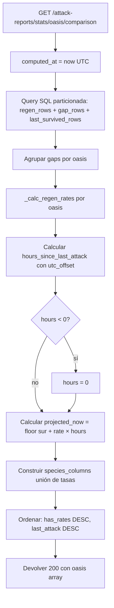

# Comparativa de tasa de reaparición y proyección de animales por oasis

## 1. Objetivo de negocio

El usuario quiere comparar la tasa bruta de reaparición de animales (animales/hora por especie)
entre todos sus oasis conocidos para identificar cuáles regeneran más rápido, y obtener una
proyección del número de animales acumulados en cada oasis en este momento (basada en tasa bruta
× horas transcurridas desde el último ataque), de modo que pueda decidir cuándo volver a atacar.

### Matiz central — no todos los oasis regeneran todas las especies

Un oasis solo muestra tasas para las especies que han aparecido en sus reportes. Si en un oasis
nunca se observaron ratas, la celda de "rata" para ese oasis es "—" (ausencia), no cero. Este
principio rige toda la lógica de cálculo y presentación.

### Inferencia empírica del tipo de oasis

El sistema no hardcodea el mapa tipo→especies de Travian. El "tipo probable" de un oasis se
infiere observando el conjunto de especies que han aparecido en sus reportes: ese conjunto ES la
firma del oasis. La UI puede etiquetar el oasis como "firma: tigres, osos" sin asignarle un tipo
Travian concreto. Esta aproximación empírica es deliberada (RN-01) para no acoplarse al juego.

### Predicción sin population cap

La proyección lineal de animales acumulados NO depende del cap de población (que el usuario
descartó en v1). La fórmula es:

```
proyectado_ahora[especie] =
    survived_último_reporte[especie]
    + floor(avg_regen_per_hour[especie] × horas_desde_último_ataque)
```

Solo se calcula para especies con tasa válida (`avg_regen_per_hour` disponible). El resultado es
orientativo y puede superar el cap real del oasis (no hay tope en v1). El implementador NO debe
añadir lógica de cap sin un spec que lo cubra.

---

## 2. Actores y permisos

| Actor  | Acción                                             |
|--------|----------------------------------------------------|
| Usuario | Lee la tabla comparativa y la proyección de cada oasis. No hay escritura. |

No hay autenticación por endpoint en esta feature (igual que EP-06, EP-08, EP-09 existentes).

---

## 3. Alcance

### Dentro del alcance (v1)

- Endpoint nuevo `GET /attack-reports/stats/oasis/comparison` que devuelve, para TODOS los
  oasis conocidos en BD, la tasa bruta por especie y la proyección de animales en el momento
  de la petición.
- Método nuevo en `AttackReportPort` y su implementación en `AttackReportSQLiteAdapter`.
- Componente React nuevo `OasisComparisonPanel` montado en `StatsTab`, justo encima de
  `GlobalOasisStatsPanel`.
- Mockup editable previo a la implementación de la UI (regla del proyecto).

### Fuera del alcance (v1, extensiones futuras)

- Tiempo hasta repoblación completa (requeriría population cap).
- Persistir el tipo de oasis inferido en BD.
- Alertas de deriva (varianza de la tasa entre intervalos).
- Filtros por tipo de oasis o por especie concreta.
- Actualización en tiempo real (polling / WebSocket).
- Deduplicación o fusión de oasis con coordenadas muy próximas.

---

## 4. Reglas de negocio

| ID    | Regla |
|-------|-------|
| RN-01 | El tipo de oasis NO se hardcodea. Se infiere del perfil de especies observadas (empírico). |
| RN-02 | Solo se calcula tasa para (oasis, especie) con al menos 1 intervalo válido según `_calc_regen_rates`. Una especie sin tasa válida NO aparece en la fila de ese oasis (celda "—"). |
| RN-03 | Las columnas de la tabla comparativa son las uniones de todas las especies que tienen tasa en ALGÚN oasis. Especies que nunca mostraron tasa en ningún oasis no generan columna. |
| RN-04 | La proyección se calcula siempre en el servidor en el momento de la petición, usando `datetime.now(timezone.utc)` como referencia temporal y el `attacked_at` del último reporte de cada oasis (que es hora local del servidor Travian, naive). Ver sección 9 para el tratamiento de la zona horaria. |
| RN-05 | Los oasis con al menos 1 tasa calculable se muestran primero. Dentro de ese grupo, ordenar por `last_attack` DESC (más reciente primero). Los oasis sin ninguna tasa van al final, ordenados también por `last_attack` DESC. |
| RN-06 | Un oasis con solo 1 reporte no tiene ningún intervalo válido → todas sus celdas de tasa son "—" y la proyección es null (sin base). |
| RN-07 | La proyección es `floor()` a entero (no puede haber 2.7 tigres). Mínimo 0. |
| RN-08 | Si `survived` del último reporte de un animal es NULL (reporte de derrota), la proyección para esa especie es null (indeterminada), aunque exista tasa. |
| RN-09 | `valid_intervals` se propaga por especie y por oasis para que la UI pueda indicar confianza. |

---

## 5. Flujo principal y flujos alternativos

### Flujo principal

1. Usuario abre la pestaña Estadísticas de reportes de ataques.
2. `StatsTab` monta `OasisComparisonPanel` (nueva sección, la primera que ve).
3. El componente llama a `GET /attack-reports/stats/oasis/comparison`.
4. El backend ejecuta una sola query SQL particionada por (coord_x, coord_y, animal_ordinal),
   reutilizando la lógica de `_calc_regen_rates`, y calcula las proyecciones.
5. El endpoint devuelve `200` con el array de oasis comparados.
6. La UI renderiza la tabla comparativa con columnas dinámicas (solo especies con tasa).
7. Cada fila muestra la tasa por especie y los animales proyectados ahora. Las celdas sin
   tasa muestran "—".

### Flujo alternativo: BD vacía

- El backend devuelve `200` con `{ "oasis": [] }`.
- La UI muestra el estado vacío con CTA "Ingresar reportes".

### Flujo alternativo: todos los oasis sin tasas calculables

- El backend devuelve `200` con `"oasis"` poblado pero todas las tasas vacías.
- La UI muestra la tabla con todas las celdas de tasa en "—" y el bloque de proyección
  en "—". No es un error; es confianza insuficiente.

---

## 6. Edge cases

| ID     | Descripción | Tratamiento |
|--------|-------------|-------------|
| EC-01  | Oasis con solo 1 reporte | `animal_regen_rates` vacío → todas las celdas "—", proyección null. Se muestra al final de la tabla (RN-05). |
| EC-02  | Especie cuyo `survived` en el último reporte es NULL (reporte de derrota) | Proyección de esa especie = null. La tasa puede existir. La UI muestra "?" o "—" diferenciando de "sin tasa". |
| EC-03  | Oasis con reportes antiguos (last_attack hace semanas) | La proyección puede ser un número muy alto (no hay cap en v1). El implementador NO pone límite. Extensión futura si el usuario lo pide. |
| EC-04  | `attacked_at` es hora local naive (sin zona horaria) | Se usa `utc_offset` del último reporte si está disponible. Si es NULL, se asume UTC (comportamiento defensivo). Ver §9 para la lógica exacta. |
| EC-05  | Un oasis desaparece de BD (todos sus reportes borrados) | No aparece en la respuesta. Consistencia automática. |
| EC-06  | Dos oasis comparten especie, pero solo uno tiene tasa | La columna existe (proviene del otro oasis). El oasis sin tasa muestra "—" en esa celda. |
| EC-07  | `avg_regen_per_hour` es 0 por algún intervalo especial | Se incluye en el cálculo y en la proyección normalmente. La UI muestra "0,00 /h" (no lo oculta). |
| EC-08  | BD tiene muchos oasis (>50) | La query es una sola pasada particionada, no N llamadas. El resultado puede ser grande; la UI debe soportar scroll horizontal en la tabla. |
| EC-09  | `horas_desde_último_ataque` < 0 (reloj del servidor Travian adelantado) | Tratar como 0 (proyección = survived del último reporte). |

---

## 7. Modelo de datos / cambios de esquema

### Sin cambios de BD ni migraciones

Esta feature solo lee las tablas existentes. No hay DDL nuevo.

### Tablas leídas

#### `attack_reports`

| Campo          | Uso en esta feature |
|----------------|---------------------|
| `id`           | Join con animales |
| `coord_x_dest` | Identificador de oasis |
| `coord_y_dest` | Identificador de oasis |
| `attacked_at`  | Timestamp del ataque (ISO 8601 naive, hora local Travian) |
| `utc_offset`   | Para convertir `attacked_at` a UTC al calcular proyección (puede ser NULL) |

#### `attack_report_animals`

| Campo           | Uso en esta feature |
|-----------------|---------------------|
| `report_id`     | Join con cabecera |
| `animal_ordinal`| Identificador de especie (1–10) |
| `animal_name`   | Nombre crudo del animal (texto del usuario) |
| `present`       | Para `_calc_regen_rates` (previos supervivientes → regenerados) |
| `survived`      | Para proyección: base de la acumulación desde el último ataque |

#### Campos NO necesarios en esta feature

`bounty_*`, `capacity_*`, `hero_inventory_json`, `raw_text`, `origin_village_name`,
`attacker_troops`, `world_id`.

---

## 8. Contratos de API / interfaces

> **VALIDADO POR desarrollador-apis (APROBADO-CON-CAMBIOS aplicados)**
> El contrato ha sido revisado por el agente `desarrollador-apis` en MODO REVISIÓN DE CONTRATO.
> Los cambios indicados en el veredicto APROBADO-CON-CAMBIOS han sido aplicados a este spec.
> `apis_validadas_por_desarrollador_apis: true`.

### Sobre Accept-Language — VALIDADO por desarrollador-apis

EP-06 y EP-09 no usan `Accept-Language` (el `animal_name` es texto crudo del usuario, no
localizado). Este nuevo endpoint sigue la misma política: los datos son numéricos y el
`animal_name` es texto crudo. **No se usa `Accept-Language` ni `resolve_language`.**
Esta decisión es coherente con la nota del router existente y ha sido confirmada por
`desarrollador-apis`:
> "Sin Accept-Language obligatorio en este router: los endpoints devuelven datos numéricos e
> ISO 8601; el animal_name es texto crudo del usuario."

### EP-10 — Comparativa de tasas de reaparición por oasis

```
GET /attack-reports/stats/oasis/comparison
```

**Parámetros de query:** ninguno en v1.

**Cabeceras de request:** ninguna requerida (sin Accept-Language).

**Respuesta 200 — éxito (incluso con BD vacía)**

```json
{
  "computed_at": "2026-06-01T12:34:56.789012+00:00",
  "species_columns": [
    { "animal_ordinal": 1, "animal_name": "Rat",    "icon_url": "/static/icons/nature_1.png" },
    { "animal_ordinal": 3, "animal_name": "Spider", "icon_url": "/static/icons/nature_3.png" },
    { "animal_ordinal": 7, "animal_name": "Tiger",  "icon_url": "/static/icons/nature_7.png" }
  ],
  "oasis": [
    {
      "coord_x_dest": -70,
      "coord_y_dest": 73,
      "total_attacks": 8,
      "last_attack": "2026-05-30T20:15:00",
      "hours_since_last_attack": 16.3,
      "has_rates": true,
      "species": [
        {
          "animal_ordinal": 7,
          "animal_name": "Tiger",
          "icon_url": "/static/icons/nature_7.png",
          "avg_regen_per_hour": 1.25,
          "valid_intervals": 6,
          "last_survived": 3,
          "projected_now": 23
        },
        {
          "animal_ordinal": 3,
          "animal_name": "Spider",
          "icon_url": "/static/icons/nature_3.png",
          "avg_regen_per_hour": 0.80,
          "valid_intervals": 4,
          "last_survived": null,
          "projected_now": null
        }
      ]
    },
    {
      "coord_x_dest": 12,
      "coord_y_dest": -45,
      "total_attacks": 1,
      "last_attack": "2026-05-28T10:00:00",
      "hours_since_last_attack": 50.6,
      "has_rates": false,
      "species": []
    }
  ]
}
```

**Descripción de campos:**

| Campo | Tipo | Descripción |
|-------|------|-------------|
| `computed_at` | string (ISO 8601 UTC) | Momento exacto en que el servidor calculó la proyección |
| `species_columns` | array | Unión de todas las especies con tasa en al menos un oasis. Orden: por `animal_ordinal` ASC. Columnas dinámicas de la tabla UI. |
| `species_columns[].icon_url` | string | Ruta del icono de la especie: `/static/icons/nature_{animal_ordinal}.png`. Consistente con EP-06/EP-09. |
| `oasis[].coord_x_dest` / `coord_y_dest` | int | Identificador del oasis |
| `oasis[].total_attacks` | int | Número de reportes para ese oasis |
| `oasis[].last_attack` | string (ISO 8601 naive) | `attacked_at` del último reporte (hora local Travian, sin zona) |
| `oasis[].hours_since_last_attack` | float | Horas entre `last_attack` (convertido a UTC) y `computed_at`. Float redondeado a 2 decimales. Ver §9. |
| `oasis[].has_rates` | bool | `true` si al menos una especie tiene tasa calculable |
| `oasis[].species` | array | Solo especies con tasa válida para este oasis. Especies sin tasa no aparecen (celda "—" en UI inferida por ausencia en el array vs columna en `species_columns`). |
| `species[].icon_url` | string | Ruta del icono de la especie: `/static/icons/nature_{animal_ordinal}.png`. Consistente con EP-06/EP-09. |
| `species[].avg_regen_per_hour` | float | Media aritmética de tasas de regeneración (animales/hora) |
| `species[].valid_intervals` | int | Número de intervalos válidos que contribuyeron a la tasa |
| `species[].last_survived` | int \| null | `survived` del último reporte para esa especie en ese oasis. `null` si ese reporte fue derrota o especie no presente. |
| `species[].projected_now` | int \| null | `floor(last_survived + avg_regen_per_hour × hours_since_last_attack)`. `null` si `last_survived` es null o `hours_since_last_attack` < 0. |

**Códigos de estado:**

| Código | Condición |
|--------|-----------|
| `200`  | Siempre (incluso BD vacía: `oasis: []`) |
| `500`  | Error inesperado de BD (detail genérico, no stack trace) |

**Nota de routing:** EP-10 NO colisiona con EP-06 porque EP-06 usa query params `(x, y)`,
no path params: son paths con distinto número de segmentos y FastAPI los distingue sin importar
el orden entre ellos. EP-10 debe declararse antes de EP-04 `/{id}` (igual que todos los
endpoints literales del router, convención C6), sin ninguna restricción de orden respecto a EP-06.

---

## 9. Flujo lógico paso a paso

### Backend — método `get_all_oasis_regen_comparison()`

```python
async def get_all_oasis_regen_comparison(self) -> dict:
    computed_at = datetime.now(timezone.utc)

    # ── Paso 1: gaps y regeneraciones en UNA query particionada ──────────────
    # Misma lógica que get_global_oasis_stats pero devuelve también:
    # coord_x_dest, coord_y_dest, attacked_at, survived del reporte actual
    #
    # WINDOW w particionado por (coord_x_dest, coord_y_dest, animal_ordinal)
    # ORDER BY attacked_at → LAG no cruza entre oasis ni entre especies

    regen_sql = """
        WITH ordered AS (
            SELECT
                r.id               AS report_id,
                r.attacked_at,
                r.coord_x_dest,
                r.coord_y_dest,
                a.animal_ordinal,
                a.animal_name,
                a.present,
                a.survived,
                LAG(a.survived) OVER w  AS prev_survived
            FROM attack_reports r
            JOIN attack_report_animals a ON a.report_id = r.id
            WINDOW w AS (
                PARTITION BY r.coord_x_dest, r.coord_y_dest, a.animal_ordinal
                ORDER BY r.attacked_at
            )
        )
        SELECT
            report_id, attacked_at, coord_x_dest, coord_y_dest,
            animal_ordinal, animal_name, present, survived, prev_survived,
            CASE WHEN prev_survived IS NOT NULL
                 THEN present - prev_survived
                 ELSE NULL
            END AS regenerated
        FROM ordered
        ORDER BY coord_x_dest, coord_y_dest, attacked_at, animal_ordinal
    """

    gap_sql = """
        SELECT
            r.id,
            r.coord_x_dest,
            r.coord_y_dest,
            r.attacked_at,
            r.utc_offset,
            LAG(r.attacked_at) OVER w            AS prev_attacked_at,
            (UNIXEPOCH(r.attacked_at) - UNIXEPOCH(LAG(r.attacked_at) OVER w))
                                                 AS gap_seconds
        FROM attack_reports r
        WINDOW w AS (
            PARTITION BY r.coord_x_dest, r.coord_y_dest
            ORDER BY r.attacked_at
        )
        ORDER BY r.coord_x_dest, r.coord_y_dest, r.attacked_at
    """

    # ── Paso 2: Recuperar last_survived por (oasis, animal) ──────────────────
    # Para proyección: survived del último reporte de cada (oasis, especie)
    last_survived_sql = """
        SELECT
            r.coord_x_dest,
            r.coord_y_dest,
            a.animal_ordinal,
            a.animal_name,
            a.survived
        FROM attack_report_animals a
        JOIN attack_reports r ON r.id = a.report_id
        WHERE r.attacked_at = (
            SELECT MAX(r2.attacked_at)
            FROM attack_reports r2
            WHERE r2.coord_x_dest = r.coord_x_dest
              AND r2.coord_y_dest = r.coord_y_dest
        )
        ORDER BY r.coord_x_dest, r.coord_y_dest, a.animal_ordinal
    """

    # ── Paso 3: Calcular tasas por oasis usando _calc_regen_rates ────────────
    # Agrupar gaps por (coord_x, coord_y), luego llamar _calc_regen_rates
    # (misma función de módulo, sin modificar)
    oasis_rates: dict[tuple, list] = {}
    for (cx, cy), gaps in gaps_by_oasis.items():
        oasis_rates[(cx, cy)] = _calc_regen_rates(gaps)

    # ── Paso 4: Calcular horas_desde_último_ataque ────────────────────────────
    # Para cada oasis:
    #   last_attack_str = MAX(attacked_at) para ese oasis
    #   utc_offset = utc_offset del reporte más reciente (puede ser NULL)
    #
    # Si utc_offset está disponible:
    #   last_attack_utc = parse_naive(last_attack_str) - timedelta_from_offset(utc_offset)
    # Si utc_offset es NULL:
    #   last_attack_utc = parse_naive(last_attack_str)  # asumir UTC (defensivo)
    #
    # hours = (computed_at - last_attack_utc).total_seconds() / 3600
    # Si hours < 0: hours = 0  (EC-09)

    # ── Paso 5: Calcular projected_now por (oasis, especie) ──────────────────
    # Para cada especie con tasa válida en el oasis:
    #   last_surv = last_survived_by_oasis_species.get((cx, cy, ordinal))
    #   if last_surv is None: projected_now = None  (EC-02, RN-08)
    #   else: projected_now = max(0, floor(last_surv + rate * hours))

    # ── Paso 6: Construir species_columns ────────────────────────────────────
    # Unión de todos los (animal_ordinal, animal_name) con tasa en algún oasis
    # Orden: animal_ordinal ASC

    # ── Paso 7: Ordenar oasis ─────────────────────────────────────────────────
    # has_rates=True primero, luego has_rates=False
    # Dentro de cada grupo: last_attack DESC  (RN-05)

    # ── Paso 8: Construir y devolver el dict de respuesta ────────────────────
    return {
        "computed_at": computed_at.isoformat(),
        "species_columns": [...],
        "oasis": [...],
    }
```

### Diagrama de flujo



---

## 10. Validaciones y reglas

| Regla | Implementación |
|-------|----------------|
| No hay query params → sin validación de entrada | El endpoint no declara parámetros. FastAPI ignora silenciosamente query params extra (comportamiento por defecto); cualquier param desconocido se ignora y la respuesta es `200`. |
| `animal_ordinal` entre 1 y 10 | Garantía del DDL existente (`CHECK`). El adaptador no necesita revalidar. |
| `projected_now >= 0` | `max(0, floor(...))` en el adaptador. |
| `hours_since_last_attack >= 0` | Si negativo, usar 0 (EC-09). Valor redondeado a 2 decimales: `round(hours, 2)`. |
| No `Accept-Language` | El endpoint no llama a `get_language` ni `resolve_language`. Coherente con EP-06/EP-09. Confirmado por desarrollador-apis. |

**Códigos de estado de EP-10:**

| Código | Condición |
|--------|-----------|
| `200` | Siempre, incluso con BD vacía (`oasis: []`) o con params extra ignorados |
| `500` | Error inesperado de BD (detail genérico, sin stack trace al cliente) |

---

## 11. Seguridad, rendimiento y concurrencia

### Rendimiento

- **Una sola pasada SQL**, no N llamadas (una por oasis). La query regen usa `PARTITION BY
  (coord_x_dest, coord_y_dest, animal_ordinal)` sobre toda la tabla, igual que
  `get_global_oasis_stats`. Con los índices existentes `idx_attack_reports_coords_time` y
  `idx_animals_ordinal_report`, la query es eficiente para el volumen esperado (SQLite local,
  usuario único, miles de reportes como máximo).
- El cálculo de proyecciones es O(n_oasis × n_species): despreciable.
- No hay caché en v1 (las tasas cambian con cada nuevo reporte). El endpoint es rápido
  porque no va al browser.

### Seguridad

- Solo lectura de BD. Sin riesgo de inyección (queries parametrizadas con `aiosqlite`).
- No hay autenticación en este módulo (igual que el resto de endpoints de attack-reports).

### Concurrencia

- SQLite en modo WAL. El endpoint solo hace lecturas; no bloquea escrituras concurrentes.
  No hay riesgo de deadlock.

### Nota sobre last_survived query

La subquery correlacionada `WHERE r.attacked_at = (SELECT MAX(...))` puede ser lenta si
hay muchos oasis. Alternativa: hacer la query de `last_survived` con `ROW_NUMBER() OVER
(PARTITION BY coord_x_dest, coord_y_dest ORDER BY attacked_at DESC)` y filtrar `rn=1`.
El implementador puede elegir la variante que el query planner de SQLite ejecute mejor.
Dejar anotado como trade-off de implementación, no bloqueante para el spec.

---

## 12. Plan de pruebas

### Casos felices

| ID | Escenario | Resultado esperado |
|----|-----------|-------------------|
| T-01 | 3 oasis, cada uno con >= 2 ataques y especies distintas | 200 con `oasis` de 3 elementos, `species_columns` con unión, tasas y proyecciones calculadas |
| T-02 | 2 oasis comparten especie; solo uno tiene tasa para ella | `species_columns` tiene esa especie; oasis sin tasa la omite en `species[]`; UI la muestra como "—" |
| T-03 | Oasis con `utc_offset` informado | `hours_since_last_attack` calculado correctamente ajustando por offset |
| T-04 | BD vacía | 200 con `{ "oasis": [], "species_columns": [] }` |
| T-05 | Todos los oasis con 1 solo reporte | 200 con todos `has_rates: false`, `species: []` |
| T-06 | Un oasis con `survived = null` en último reporte (derrota) | `last_survived: null`, `projected_now: null` para esa especie |

### Edge cases a cubrir en tests

| ID | Escenario | Resultado esperado |
|----|-----------|-------------------|
| T-07 | `last_attack` muy antigua (gap > 7 días) | Proyección alta, sin límite ni error. Solo entero >= 0. |
| T-08 | `utc_offset = null` en el último reporte | `attacked_at` tratado como UTC (no error). |
| T-09 | `hours_since_last_attack` negativo (reloj adelantado) | `hours = 0`, `projected_now = last_survived`. |
| T-10 | `avg_regen_per_hour = 0` | `projected_now = last_survived` (sin acumulación). No error. |
| T-11 | Muchos oasis (>50) | 200 sin timeout; una sola query SQL ejecutada (verificar con contador de queries). |
| T-12 | Orden de resultados: oasis con tasas antes que sin tasas | Verificar que `has_rates=True` precede a `has_rates=False`. |

---

## 13. Riesgos y trade-offs

| ID | Riesgo / Trade-off | Decisión | Justificación |
|----|-------------------|----------|---------------|
| TR-01 | Proyección sin cap puede devolver valores irreales | Aceptado en v1 | El usuario descartó explícitamente el cap. Es una proyección orientativa, no una predicción exacta. |
| TR-02 | `attacked_at` naive + `utc_offset` nullable: conversión a UTC puede ser imprecisa | Comportamiento defensivo: NULL → asumir UTC | Mejor que bloquear la feature. Se documenta en la UI ("proyección aproximada"). |
| TR-03 | Query correlacionada para `last_survived` vs `ROW_NUMBER` | Decisión delegada al implementador | Ambas son correctas; la diferencia es de rendimiento en SQLite. Dejar como nota de implementación. |
| TR-04 | `species_columns` dinámicas: el frontend no puede tener columnas hardcodeadas | Columnas dinámicas del backend | Coherente con RN-01 (empírico). El componente itera `species_columns` del response. |
| TR-05 | `animal_name` es texto crudo (puede variar entre servidores Travian) | Aceptado | Mismo criterio que EP-06/EP-09. No se traduce ni normaliza en v1. |

---

## 14. Pasos de implementación ordenados

> Este orden garantiza que cada paso tiene sus dependencias resueltas. El agente
> `desarrollador-funcionalidades` debe seguirlo estrictamente.

1. **Backend — Port:** añadir método abstracto `get_all_oasis_regen_comparison()` en
   `core/ports/attack_report_port.py` con la firma y docstring del §9.

2. **Backend — Adaptador:** implementar `get_all_oasis_regen_comparison()` en
   `adapters/db/attack_report_sqlite_adapter.py`.
   - **Punto de partida (palantir):** partir de la query `regen_sql`/`gap_sql` de
     `get_global_oasis_stats` (~líneas 795–846 del adaptador), extendiéndola con
     `coord_x_dest`, `coord_y_dest`, `survived` y `utc_offset` en el SELECT. NO escribirla
     desde cero ni hacer N llamadas a `get_oasis_stats`.
   - Reutilizar `_calc_regen_rates` (línea 138) tal cual, sin modificar.
   - La conversión `utc_offset ("+01:00") → timedelta` es un helper nuevo
     `_parse_utc_offset` a nivel de módulo en el adaptador (no existe hoy; crearlo aquí).

3. **Backend — Endpoint:** añadir `EP-10` en
   `adapters/api/routes/attack_reports.py`. Declararlo antes de EP-04 `/{id}` (igual que
   todos los endpoints literales del router, convención C6). EP-10 NO tiene restricción de
   orden respecto a EP-06 (que usa query params, no path params; FastAPI los distingue sin
   ambigüedad). Sin `Accept-Language`. Ruta: `GET /attack-reports/stats/oasis/comparison`.

4. **Tests backend:** cubrir los escenarios T-01 a T-12.

5. **Mockup UI (gate humano no salteable):**
   Crear `frontend/mockups/oasis-comparison.playground.html` (drag & drop) con la tabla
   comparativa: cabecera fija (coords, ataques, último ataque), columnas dinámicas de
   especies (tasa /h + proyectado), indicador de confianza, estado vacío y estado
   "baja confianza". El usuario recompone y aprueba el layout antes de pasar al punto 6.

6. **Frontend — Cliente HTTP:** añadir el método `api.getOasisComparison()` a
   `frontend/src/api/client.js` (delta de palantir: no estaba listado previamente).
   Seguir el patrón de los métodos existentes del mismo módulo.

7. **Frontend — Componente:**
   Crear `frontend/src/components/attack-reports/OasisComparisonPanel.jsx`.
   - **Restricción de reutilización (palantir):** NO envolver `RegenRatesSection` para la
     tabla comparativa principal — su contrato es por-especie de un solo oasis y no encaja
     aquí. Reutilizar `NatureIcon` para los iconos de especie, y el patrón
     loading/error/empty de `GlobalOasisStatsPanel` como referencia.
   - Llamar a `api.getOasisComparison()` (añadido en el paso anterior).

8. **Frontend — Montar en StatsTab:**
   Añadir `OasisComparisonPanel` en `StatsTab.jsx`, encima de `GlobalOasisStatsPanel`.
   La carga es independiente: un error en `OasisComparisonPanel` no bloquea el resto.

9. **Frontend — i18n:**
   Añadir claves necesarias para la nueva sección (títulos de columna, estado vacío,
   tooltip de confianza, texto "proyección aproximada"). Seguir la convención de claves
   `ar.stats.comparison.*`.

10. **Prueba manual (gate humano):** el usuario verifica en el entorno real (API + BD real
    con reportes) que las tasas y proyecciones son coherentes con los datos que conoce.

11. **Documentación:** actualizar `documentacion/api/` y `documentacion/funcionalidades/`
    según las reglas de mantenimiento del proyecto (bumpear marca de agua).

---

## 15. Criterios de aceptación

Checklist verificable por el implementador y el usuario:

- [ ] `GET /attack-reports/stats/oasis/comparison` devuelve `200` siempre, incluso con BD vacía.
- [ ] Un oasis donde nunca se observó la especie X NO tiene a X en su array `species[]`
      (ausencia semántica, no cero).
- [ ] `species_columns` contiene solo las especies que tienen tasa en al menos un oasis.
- [ ] Las celdas sin tasa se infieren por ausencia: si el oasis no tiene la especie en
      `species[]` pero sí está en `species_columns`, la UI muestra "—".
- [ ] Los oasis con `has_rates: true` aparecen antes que los de `has_rates: false`.
- [ ] `projected_now` es `null` cuando `last_survived` es `null` (derrota en el último reporte).
- [ ] `projected_now` es siempre `>= 0` (floor, mínimo 0).
- [ ] `hours_since_last_attack` es `>= 0` (negativo → 0).
- [ ] La proyección usa `_calc_regen_rates` ya existente; no hay duplicación de esa lógica.
- [ ] No se ha creado ninguna tabla nueva ni migración.
- [ ] El endpoint EP-10 está declarado antes de EP-04 `/{id}` en el router (convención C6 — literales antes de path params). No hay restricción de orden respecto a EP-06 (que usa query params).
- [ ] El componente `OasisComparisonPanel` ha pasado por mockup editable aprobado por el usuario.
- [ ] La carga de `OasisComparisonPanel` es independiente: si falla, `GlobalOasisStatsPanel`
      y `OasisList` siguen funcionando.
- [ ] Sin `Accept-Language` en EP-10 (coherente con EP-06/EP-09).

---

## 16. Trazabilidad

| Decisión técnica | Requisito / edge case que la origina |
|-----------------|--------------------------------------|
| No hay cambios de BD | Respuesta P2: inferir tipo en runtime, no persistir. Respuesta general: no tocar parser ni BD ni migración. |
| `_calc_regen_rates` reutilizado sin modificar | Palantir: función ya existente en el adaptador. No duplicar. |
| Una sola query SQL particionada | EC-08: escalar a muchos oasis sin N llamadas. Palantir: mismo patrón que `get_global_oasis_stats`. |
| Ausencia semántica en `species[]` vs null | RN-02: especie sin tasa = ausente, no cero. Matiz de negocio central del usuario. |
| `species_columns` dinámicas | RN-03: columnas de la tabla = unión de especies con tasa en algún oasis. Respuesta P5. |
| Proyección sin cap | Reconciliación P1 vs P6: usuario pidió predicción pero descartó cap. Proyección lineal sin límite. |
| `hours_since_last_attack` con utc_offset defensivo | EC-04: `attacked_at` naive; EC-09: horas negativas. |
| `has_rates` para ordenación | RN-05: oasis con tasas calculables primero. Respuesta P4. |
| Sin `Accept-Language` en EP-10 | Nota del router existente y coherencia con EP-06/EP-09: datos numéricos + texto crudo. |
| EP-10 declarado antes de EP-04 `/{id}`, sin restricción respecto a EP-06 | Corrección de desarrollador-apis: EP-06 usa query params (no path params), FastAPI los distingue sin ambigüedad. Convención C6: literales antes de path params. |
| Sin `422` por query params extra en EP-10 | Corrección de desarrollador-apis: FastAPI ignora silenciosamente params extra por defecto. |
| `icon_url` en `species_columns[]` y `species[]` | Corrección de desarrollador-apis: consistencia con EP-06/EP-09 que ya sirven `/static/icons/nature_{ordinal}.png`. |
| `hours_since_last_attack` float redondeado a 2 decimales | Corrección de desarrollador-apis: precisión documentada explícitamente. |
| Accept-Language ausente en EP-10 — VALIDADO | Confirmado por desarrollador-apis: datos numéricos + texto crudo, coherente con EP-06/EP-09. |
| `get_all_oasis_regen_comparison()` parte de `regen_sql`/`gap_sql` de `get_global_oasis_stats` | Palantir (verificado en adaptador ~líneas 795–846): reutilizar lógica existente, no escribir desde cero. |
| `_calc_regen_rates` reutilizada sin modificar | Palantir: función de módulo ya existente (~línea 138). No duplicar. |
| `_parse_utc_offset` como helper nuevo en el adaptador | Palantir: no existe hoy; debe crearse a nivel de módulo, no inline. |
| `OasisComparisonPanel` NO envuelve `RegenRatesSection` | Palantir: contrato de `RegenRatesSection` es por-especie de un solo oasis; no encaja con tabla comparativa multi-oasis. Reutilizar solo `NatureIcon` y patrón loading/error/empty de `GlobalOasisStatsPanel`. |
| `api.getOasisComparison()` añadido explícitamente al cliente HTTP | Delta de palantir: no estaba listado en el plan original. |
| Mockup editable antes de implementar UI | Regla del proyecto "mockup-first" no negociable para cualquier UI. |
| EP-10 como endpoint nuevo (CREAR) | Palantir: no existe comparativa multi-oasis. EP-06 es por oasis individual. |
| Estado del spec = backend ready-for-impl; UI pendiente de mockup | APIs validadas por desarrollador-apis (APROBADO-CON-CAMBIOS). UI bloqueada por regla mockup-first hasta que el usuario apruebe el playground. |

---

## Notas de extensión futura (v2+)

Las siguientes capacidades se han excluido deliberadamente de v1 pero el diseño las anticipa:

- **Population cap**: añadir `cap_by_species[oasis]` y `tiempo_hasta_lleno` cuando se
  disponga del dato. La fórmula de proyección solo necesita añadir el límite superior.
- **Deriva / varianza**: `_calc_regen_rates` ya acumula el array `rates[]` por especie.
  Añadir `std_dev` y `min_rate`/`max_rate` al resultado no requiere cambio de query.
- **Tipo de oasis persistido**: añadir columna `inferred_type` en `attack_reports` o en una
  tabla nueva de oasis, sin romper el flujo actual.
- **Alertas**: umbral sobre `valid_intervals` o desviación estándar → notificación en UI.
