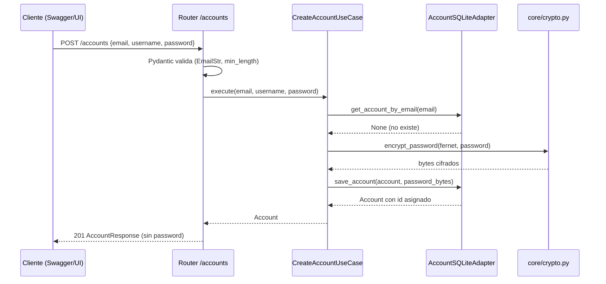

# Registro y persistencia de cuentas Travian y sus mundos

> **Implementación: COMPLETADA (2026-05-25).** Feature en verde: 653 tests passed (incluidos UT/IT/AT del plan de pruebas). Ajustes post-implementación tras revisión de cierre de palantir (caza de duplicación) y verificación de la suite:
> - **Dependencia faltante**: añadido `email-validator` a requirements (lo exige `EmailStr`).
> - **Regresión de tests corregida**: `tests/conftest.py` fija `TRAVIAN_BOT_SECRET_KEY` para toda la sesión (sin ella el lifespan tumbaba todos los tests de API por diseño RN-04).
> - **Dedup D-1**: normalización de email centralizada en `Account.normalize_email` (fuente única); eliminada de los use cases.
> - **Dedup D-2**: normalización de `server_url` sólo en `World.__post_init__`; el use case usa `world.server` para la query de unicidad.
> - **Catálogo i18n**: `DUPLICATE_ACCOUNT` actualizado de `{username}`→`{email}`; añadidas plantillas `DUPLICATE_WORLD` y `ACTIVE_SESSION_CONFLICT` (es/en).
> - **Tests añadidos**: `tests/test_accounts_api.py` (AT-01..24) + test de paridad `PlayableTribe`↔`PLAYABLE_TRIBES` (gap F-1) + actualizado `test_exceptions.py` al contrato email.
> - **Limpieza**: eliminados helpers muertos del router (`_world_to_response`, `_load_world_response`).
> - **Deuda técnica documentada (no bloqueante)**: D-3 (`_now_iso` duplicado entre adaptadores SQLite), D-4 (warning de runtime_port repetido), F-4 (router accede a `db._conn` — falta exponer timestamps vía port/entidad).

> **Validación de APIs: COMPLETADA (luz verde de desarrollador-apis, 2026-05-25).** El contrato de la Sección 8 fue revisado y aprobado tras aplicar 3 correcciones: (1) eliminado el `400` de `POST /accounts` — toda validación Pydantic devuelve `422`; (2) añadida cabecera `Location` en las dos respuestas `201` (`POST /accounts` y `POST /accounts/{id}/worlds`); (3) fijado que `PUT /accounts/{id}` devuelve `AccountResponse` **con** `worlds`. Dictamen adicional: estos endpoints **NO** usan `Accept-Language` (devuelven datos operativos, no catálogo localizado; el handler global ya localiza los `detail` de error con fallback a `es`). Formato de error `{"detail": ...}` confirmado consistente con el resto del proyecto.

---

## 1. Objetivo de negocio

Permitir al bot gestionar múltiples cuentas del lobby de Travian (una por email de jugador) y, dentro de cada cuenta, múltiples mundos (servidores de juego) con su tribu asociada. Esta capa de persistencia es el prerrequisito de todas las features de automatización (login, lectura de recursos, construcción, etc.): sin una cuenta+mundo registrado, el bot no tiene contexto para actuar.

---

## 2. Actores y permisos

| Actor | Descripción |
|---|---|
| Operador (humano) | El propio jugador que usa el dashboard. Registra, edita y borra sus cuentas y mundos vía Swagger o UI futura. |
| Bot (automatización) | Lee cuentas y mundos para ejecutar sesiones de juego. Solo lectura desde esta feature. |
| API (sin autenticación) | La API no tiene autenticación en esta fase (herramienta personal, un único operador). |

---

## 3. Alcance

### Dentro de alcance
- CRUD completo de cuentas: crear, listar, obtener, actualizar, borrar.
- Añadir y borrar mundos dentro de una cuenta; listar mundos de una cuenta.
- Persistencia en SQLite con cifrado Fernet para contraseñas.
- Validaciones de formato (email, URL, tribu jugable) en la capa API (Pydantic).
- Protección contra borrado con sesión activa (409 Conflict).
- Tabla `villages` creada en esquema (con FK) pero sin endpoints — se poblará vía `VillageMapUseCase` tras login.
- Convención de directorio de perfil de Chrome: `profiles/account_{id}/`.
- Endpoints REST testables vía Swagger.

### Fuera de alcance
- UI (se diseñará en un ciclo separado con `disenador-producto`).
- Autenticación/autorización de la API.
- Endpoints de aldeas (se expondrán en feature posterior).
- Lanzar el browser o hacer login real (esta feature es puro backend).
- Validar que el servidor Travian esté vivo (no se hace petición HTTP al server_url).
- Auto-detección de tribu desde Travian.

---

## 4. Reglas de negocio

| ID | Regla |
|---|---|
| RN-01 | Una cuenta se identifica **únicamente por email** (lobby moderno de Travian). El email debe ser único en el sistema. |
| RN-02 | El `username` es un nombre visible libre, no necesita ser único. |
| RN-03 | La **contraseña se cifra con Fernet** (AES-128-CBC + HMAC-SHA256) al persistir y se descifra en memoria solo al ejecutar login. Nunca se expone en respuestas de API. |
| RN-04 | La clave Fernet (`TRAVIAN_BOT_SECRET_KEY`) es obligatoria al arrancar. Si falta, la aplicación no arranca. |
| RN-05 | Solo se pueden registrar **tribus jugables**: ROMANS, TEUTONS, GAULS, EGYPTIANS, HUNS, SPARTANS, VIKINGS. NATURE y NATARS son NPC y se rechazan con 422. |
| RN-06 | El `server_url` acepta cualquier URL con protocolo `http://` o `https://` y dominio válido. Se acepta cualquier dominio (no solo travian.com). Se normaliza: strip + rstrip("/") + "/". |
| RN-07 | Un mundo es único dentro de una cuenta por combinación `(account_id, server_url)`. La misma URL puede existir en cuentas distintas. |
| RN-08 | Borrar una cuenta elimina en cascada todos sus mundos y aldeas (FK ON DELETE CASCADE + PRAGMA foreign_keys=ON). |
| RN-09 | Borrar un mundo elimina en cascada sus aldeas. |
| RN-10 | Si se intenta borrar una cuenta o un mundo con sesión activa en el bot (`WorldRuntimePort.is_active(world_id)` retorna True), se rechaza con 409 Conflict. |
| RN-11 | `PUT /accounts/{id}` es reemplazo total de los campos editables (`email`, `username`, `password`). Si `password` se omite del body, la contraseña no cambia. Si se incluye, se re-cifra. Los mundos no se modifican con este endpoint. |
| RN-12 | El campo `id` de World nunca es None una vez persistido: la BD siempre asigna un INTEGER AUTOINCREMENT. LoginUseCase usa `world.id == world_id` — este invariante lo garantiza la BD, no el dominio. |
| RN-13 | El perfil de Chrome para una cuenta vive en `profiles/account_{id}/` donde `{id}` es el ID entero asignado por la BD. |

---

## 5. Flujo principal y flujos alternativos

### Flujo principal: registrar cuenta y añadir un mundo

```
1. Operador POST /accounts  {email, username, password}
2. API valida formato email y longitudes (Pydantic)
3. CreateAccountUseCase:
   a. Comprueba que email no exista → si existe: DuplicateAccountError → 409
   b. Cifra password con Fernet
   c. Persiste en BD → obtiene account.id
4. API devuelve 201 + AccountResponse (sin password)

5. Operador POST /accounts/{id}/worlds  {server, tribe}
6. API valida: cuenta existe, tribe es jugable, server tiene formato URL
7. AddWorldUseCase:
   a. Comprueba que (account_id, server) no exista → si existe: DuplicateWorldError → 409
   b. Normaliza server (trailing slash)
   c. Persiste en BD → obtiene world.id
8. API devuelve 201 + WorldResponse
```

### Flujo alternativo: actualizar credenciales

```
1. Operador PUT /accounts/{id}  {email, username, password?}
2. API valida formato (Pydantic)
3. UpdateAccountUseCase:
   a. Comprueba que cuenta existe → si no: AccountNotFoundError → 404
   b. Si email cambia: comprueba unicidad → si duplicado: DuplicateAccountError → 409
   c. Si password presente: re-cifra con Fernet; si ausente: conserva el cifrado existente
   d. Actualiza updated_at
   e. Persiste
4. API devuelve 200 + AccountResponse (sin password)
```

### Flujo alternativo: borrar cuenta con sesión activa

```
1. Operador DELETE /accounts/{id}
2. DeleteAccountUseCase:
   a. Carga la cuenta → si no existe: AccountNotFoundError → 404
   b. Para cada world en la cuenta: comprueba WorldRuntimePort.is_active(world.id)
      - Si alguno activo → ActiveSessionConflictError → 409
      - Si WorldRuntimePort no disponible → degradar con seguridad: asumir inactivo, permitir borrado (ver RN-10 y Sección 11)
   c. DELETE accounts WHERE id → cascada a worlds + villages
3. API devuelve 204 No Content
```

### Flujo alternativo: borrar mundo con sesión activa

```
1. Operador DELETE /accounts/{id}/worlds/{world_id}
2. DeleteWorldUseCase:
   a. Comprueba que la cuenta existe → 404 si no
   b. Comprueba que el mundo existe y pertenece a la cuenta → 404 si no
   c. Comprueba WorldRuntimePort.is_active(world_id) → 409 si activo
   d. DELETE worlds WHERE id → cascada a villages
3. API devuelve 204 No Content
```

---

## 6. Edge cases

| ID | Edge case | Tratamiento |
|---|---|---|
| EC-01 | Email duplicado al crear | DuplicateAccountError → 409 + detail con el email |
| EC-02 | Email duplicado al actualizar (PUT) | DuplicateAccountError → 409 |
| EC-03 | Email con mayúsculas/espacios | Normalizar: strip + lower antes de comparar y persistir |
| EC-04 | server_url sin trailing slash | Normalizar: World.__post_init__ añade "/" automáticamente |
| EC-05 | server_url con protocolo inválido (ftp://) | 422 vía validador Pydantic (HttpUrl o regex) |
| EC-06 | server_url sin protocolo (ts1.travian.com) | 422 vía validador Pydantic |
| EC-07 | Tribu NATURE o NATARS en POST world | 422 vía validador Pydantic (PlayableTribe enum) |
| EC-08 | (account_id, server) duplicado dentro de la misma cuenta | DuplicateWorldError → 409 |
| EC-09 | (account_id, server) igual en cuentas distintas | Permitido (RN-07) |
| EC-10 | Borrar cuenta inexistente | AccountNotFoundError → 404 |
| EC-11 | Borrar mundo inexistente | WorldNotFoundError → 404 |
| EC-12 | Borrar mundo que no pertenece a la cuenta indicada | WorldNotFoundError → 404 (no filtrar por cuenta expone existencia de mundos ajenos) |
| EC-13 | Borrar cuenta con sesión activa en algún mundo | ActiveSessionConflictError → 409 |
| EC-14 | Borrar mundo con sesión activa | ActiveSessionConflictError → 409 |
| EC-15 | WorldRuntimePort no disponible en borrado | Degradar con seguridad: asumir inactivo, permitir borrado, loguear warning |
| EC-16 | Password vacío en POST/PUT | 422 (mínimo 1 carácter) |
| EC-17 | Username vacío en POST/PUT | 422 (mínimo 1 carácter) |
| EC-18 | Clave Fernet no configurada al arrancar | La app falla en lifespan con RuntimeError claro (no silencioso) |
| EC-19 | GET /accounts/{id} con ID inexistente | AccountNotFoundError → 404 |
| EC-20 | GET /accounts/{id}/worlds con cuenta inexistente | AccountNotFoundError → 404 |
| EC-21 | Valor entero inválido en path (p.ej. /accounts/abc) | 422 vía FastAPI path validation |
| EC-22 | PUT /accounts/{id} sin password → conservar cifrado existente | Implementar: si `password` es None en body, no se sobrescribe en BD |
| EC-23 | Lista vacía de cuentas | 200 + `{"accounts": []}` (no 404) |
| EC-24 | Lista vacía de mundos de una cuenta | 200 + `{"worlds": []}` (no 404) |

---

## 7. Modelo de datos / cambios de esquema

### 7.1 Esquema SQL

```sql
-- Activar foreign keys (obligatorio en cada conexión)
PRAGMA foreign_keys = ON;

CREATE TABLE IF NOT EXISTS accounts (
    id          INTEGER PRIMARY KEY AUTOINCREMENT,
    email       TEXT    NOT NULL,
    username    TEXT    NOT NULL,
    password    BLOB    NOT NULL,   -- token Fernet cifrado (bytes)
    created_at  TEXT    NOT NULL,   -- ISO-8601 UTC (ej: "2026-05-25T10:30:00+00:00")
    updated_at  TEXT    NOT NULL
);

CREATE UNIQUE INDEX IF NOT EXISTS idx_accounts_email ON accounts(email);

CREATE TABLE IF NOT EXISTS worlds (
    id          INTEGER PRIMARY KEY AUTOINCREMENT,
    account_id  INTEGER NOT NULL REFERENCES accounts(id) ON DELETE CASCADE,
    server      TEXT    NOT NULL,   -- URL normalizada con trailing slash
    tribe       TEXT    NOT NULL,   -- valor del enum Tribe en minúsculas ("romans", "teutons", ...)
    created_at  TEXT    NOT NULL,
    updated_at  TEXT    NOT NULL,
    UNIQUE (account_id, server)
);

CREATE INDEX IF NOT EXISTS idx_worlds_account ON worlds(account_id);

CREATE TABLE IF NOT EXISTS villages (
    id          INTEGER PRIMARY KEY AUTOINCREMENT,
    world_id    INTEGER NOT NULL REFERENCES worlds(id) ON DELETE CASCADE,
    data_id     INTEGER NOT NULL,   -- data-did de Travian (NOT travian gid)
    name        TEXT    NOT NULL,
    x           INTEGER NOT NULL,
    y           INTEGER NOT NULL,
    UNIQUE (world_id, data_id)
);

CREATE INDEX IF NOT EXISTS idx_villages_world ON villages(world_id);
```

### 7.2 Mapeo entidades ↔ tablas

| Columna BD | Campo entidad | Notas |
|---|---|---|
| accounts.id | Account.id | Optional[int] en entidad; NOT NULL tras persistir |
| accounts.email | Account.email | Nuevo campo. Normalizado a lower strip |
| accounts.username | Account.username | Campo existente |
| accounts.password | Account.password | Cifrado en BD; descifrado en memoria solo en login |
| worlds.id | World.id | int en entidad (nunca None tras persistir) |
| worlds.account_id | — | FK; no es campo de World (es relación) |
| worlds.server | World.server | Con trailing slash |
| worlds.tribe | World.tribe.value | Serializado como string en minúsculas |
| villages.* | Village.* | Completo; sin endpoints en esta feature |

### 7.3 Cambios en entidades existentes

#### `core/entities/account.py` — ajuste no-rompedor

Añadir campo `email: str`. Actualizar `__post_init__` para validar email (no vacío; normalizar a lower+strip). El campo `password` se convierte a `str | bytes` (en memoria es `str` descifrado; en BD es `bytes` cifrados; la entidad almacena el tipo que le llega — el adaptador gestiona la conversión).

**Firma nueva:**
```python
@dataclass
class Account:
    id: Optional[int]
    email: str
    username: str
    password: str   # en memoria siempre str (descifrado); el adaptador cifra al persistir
    worlds: list[World] = field(default_factory=list)

    def __post_init__(self) -> None:
        self.email = self.email.strip().lower()
        if not self.email:
            raise ValueError("El email no puede estar vacío.")
        if not self.username:
            raise ValueError("El nombre de usuario no puede estar vacío.")
```

**Impacto en código existente:**
- `LoginUseCase` no usa `email` directamente → sin impacto funcional.
- Tests que construyan `Account(...)` deben añadir el argumento `email`.
- No hay código en producción que actualmente construya `Account` (el adaptador no existía).

#### `core/entities/tribe.py` — ajuste no-rompedor

Añadir `PLAYABLE_TRIBES` como frozenset de clase y propiedad `is_playable`:

```python
PLAYABLE_TRIBES: frozenset["Tribe"]  # definido fuera del enum, ver sección 14

class Tribe(Enum):
    ROMANS    = "romans"
    TEUTONS   = "teutons"
    GAULS     = "gauls"
    EGYPTIANS = "egyptians"
    HUNS      = "huns"
    NATURE    = "nature"    # NPC
    NATARS    = "natars"    # NPC
    SPARTANS  = "spartans"
    VIKINGS   = "vikings"

    @property
    def is_playable(self) -> bool:
        return self in PLAYABLE_TRIBES

PLAYABLE_TRIBES = frozenset({
    Tribe.ROMANS, Tribe.TEUTONS, Tribe.GAULS,
    Tribe.EGYPTIANS, Tribe.HUNS, Tribe.SPARTANS, Tribe.VIKINGS,
})
```

**Impacto:** Adición pura. Ningún código existente se rompe.

### 7.4 Cambios en `core/exceptions.py`

**`DuplicateAccountError`** — cambio de firma (ajuste mínimo):

```python
class DuplicateAccountError(TravianBotError):
    error_code = "DUPLICATE_ACCOUNT"

    def __init__(self, email: str) -> None:
        super().__init__(f"Ya existe una cuenta con el email '{email}'")
        self.email = email
        self.params = {"email": email}
```

**Impacto:** No hay código existente que lance esta excepción (el adaptador aún no existe). El cambio es seguro.

**`DuplicateWorldError`** — nueva excepción:

```python
class DuplicateWorldError(TravianBotError):
    error_code = "DUPLICATE_WORLD"

    def __init__(self, server: str) -> None:
        super().__init__(f"Ya existe un mundo con server '{server}' en esta cuenta")
        self.server = server
        self.params = {"server": server}
```

**`ActiveSessionConflictError`** — nueva excepción:

```python
class ActiveSessionConflictError(TravianBotError):
    error_code = "ACTIVE_SESSION_CONFLICT"

    def __init__(self, world_id: int) -> None:
        super().__init__(
            f"Hay una sesión activa para el mundo {world_id}. Haz logout primero."
        )
        self.world_id = world_id
        self.params = {"world_id": world_id}
```

### 7.5 Cambios en `adapters/api/error_codes.py`

Añadir las **dos** nuevas entradas:

```python
"DUPLICATE_WORLD":          409,
"ACTIVE_SESSION_CONFLICT":  409,
```

> Nota (validada por desarrollador-apis): `DUPLICATE_ACCOUNT → 409`, `ACCOUNT_NOT_FOUND → 404` y `WORLD_NOT_FOUND → 404` **ya existen** en el mapa actual. No hay que añadirlos.

### 7.6 Cambios en `core/ports/db_port.py`

Añadir métodos abstractos para mundos:

```python
@abstractmethod
async def get_world(self, world_id: int) -> Optional[World]:
    """Devuelve un mundo por su ID global, o None."""

@abstractmethod
async def list_worlds(self, account_id: int) -> List[World]:
    """Devuelve todos los mundos de una cuenta."""

@abstractmethod
async def save_world(self, account_id: int, world: World) -> World:
    """Persiste un mundo (crea). Devuelve el mundo con ID asignado."""

@abstractmethod
async def delete_world(self, world_id: int) -> None:
    """Elimina un mundo por su ID."""
```

---

## 8. Contratos de API / interfaces

> **PENDIENTE VALIDACIÓN por desarrollador-apis.**
> Instrucción para desarrollador-apis: MODO REVISIÓN DE CONTRATO DE DISEÑO. No implementes nada. Primero busca en las APIs ya existentes del proyecto si hay que REUTILIZAR, MODIFICAR o CREAR cada endpoint. Después valida y corrige el diseño del contrato según tus estándares (cabeceras mínimas, códigos de estado, formato de error estándar, versionado, paginación, idempotencia, seguridad). Devuelve: (1) decisión de reutilización por necesidad, (2) veredicto CORRECTO o INCORRECTO, (3) contratos corregidos si procede, (4) luz verde explícita para guardar el spec.

### Reglas generales

- Sin prefijo `/api` (el proxy de Vite lo retira).
- `Content-Type: application/json` en todas las respuestas.
- Errores siempre con `{"detail": "<mensaje legible>"}`.
- Sin `Accept-Language` en estos endpoints: devuelven datos operativos (email, server, tribe), no texto localizado del catálogo.
- Cabeceras de seguridad añadidas por el middleware global (X-Request-ID, X-API-Version, X-Content-Type-Options, X-Frame-Options).

### Schemas Pydantic propuestos

```python
# --- Schemas de request ---

class CreateAccountRequest(BaseModel):
    email:    EmailStr          # validación de formato email
    username: str = Field(..., min_length=1, max_length=100)
    password: str = Field(..., min_length=1, max_length=200)

class UpdateAccountRequest(BaseModel):
    email:    EmailStr
    username: str = Field(..., min_length=1, max_length=100)
    password: str | None = Field(default=None, min_length=1, max_length=200)
    # Si password=None → conservar el cifrado existente (RN-11)

class AddWorldRequest(BaseModel):
    server: AnyHttpUrl          # protocolo http/https obligatorio; max 500 chars
    tribe:  PlayableTribe       # enum de las 7 tribus jugables (NATURE/NATARS → 422)

# PlayableTribe es un Enum Pydantic construido a partir de PLAYABLE_TRIBES:
# "romans" | "teutons" | "gauls" | "egyptians" | "huns" | "spartans" | "vikings"

# --- Schemas de response ---

class WorldResponse(BaseModel):
    id:         int
    server:     str             # URL normalizada
    tribe:      str             # valor del enum en minúsculas
    created_at: str             # ISO-8601 UTC

class AccountResponse(BaseModel):
    id:         int
    email:      str
    username:   str
    # password: AUSENTE — write-only, nunca se serializa
    worlds:     list[WorldResponse] = []
    created_at: str
    updated_at: str

class AccountListResponse(BaseModel):
    accounts: list[AccountResponse]

class WorldListResponse(BaseModel):
    worlds: list[WorldResponse]
```

### Endpoints propuestos

#### POST /accounts — Crear cuenta

```
Método:   POST
Ruta:     /accounts
Auth:     ninguna
Tags:     accounts

Request body:
  Content-Type: application/json
  {
    "email":    "jugador@ejemplo.com",
    "username": "MiCuenta",
    "password": "secreto123"
  }

Response 201 Created:
  Headers:
    Location: /accounts/{id}
  Body:
  {
    "id": 1,
    "email": "jugador@ejemplo.com",
    "username": "MiCuenta",
    "worlds": [],
    "created_at": "2026-05-25T10:30:00+00:00",
    "updated_at": "2026-05-25T10:30:00+00:00"
  }

Errores:
  409  → email duplicado                         {"detail": "Ya existe una cuenta con el email 'jugador@ejemplo.com'"}
  422  → validación Pydantic (email malformado, campos faltantes, password vacío)  {"detail": [...]}
  500  → error de BD                             {"detail": "Error al acceder a la base de datos local"}
```

#### GET /accounts — Listar todas las cuentas

```
Método:   GET
Ruta:     /accounts
Auth:     ninguna

Response 200 OK:
  {
    "accounts": [
      {
        "id": 1,
        "email": "jugador@ejemplo.com",
        "username": "MiCuenta",
        "worlds": [
          {"id": 1, "server": "https://ts1.x1.international.travian.com/", "tribe": "romans", "created_at": "..."}
        ],
        "created_at": "...",
        "updated_at": "..."
      }
    ]
  }

  Lista vacía → 200 + {"accounts": []}

Errores:
  500 → error de BD
```

#### GET /accounts/{id} — Obtener cuenta por ID

```
Método:   GET
Ruta:     /accounts/{id}
Path:     id: int

Response 200 OK:  AccountResponse (igual que arriba, con worlds)

Errores:
  404 → cuenta no encontrada   {"detail": "Cuenta 99 no encontrada"}
  422 → id no es entero válido
  500 → error de BD
```

#### PUT /accounts/{id} — Actualizar cuenta

```
Método:   PUT
Ruta:     /accounts/{id}
Path:     id: int

Request body: UpdateAccountRequest
  {
    "email":    "nuevo@ejemplo.com",
    "username": "NuevoNombre",
    "password": "nuevapass"   // opcional — si ausente, no cambia
  }

Response 200 OK:  AccountResponse (incluye worlds — igual que GET /accounts/{id})

Errores:
  404 → cuenta no encontrada
  409 → email duplicado (ya pertenece a otra cuenta)
  422 → validación Pydantic
  500 → error de BD
```

#### DELETE /accounts/{id} — Borrar cuenta

```
Método:   DELETE
Ruta:     /accounts/{id}
Path:     id: int

Response 204 No Content (sin body)

Errores:
  404 → cuenta no encontrada
  409 → sesión activa en algún mundo  {"detail": "Hay una sesión activa para el mundo 3. Haz logout primero."}
  422 → id no es entero válido
  500 → error de BD
```

#### POST /accounts/{id}/worlds — Añadir mundo a una cuenta

```
Método:   POST
Ruta:     /accounts/{id}/worlds
Path:     id: int (account_id)

Request body:
  {
    "server": "https://ts1.x1.international.travian.com/",
    "tribe":  "romans"
  }

Response 201 Created:
  Headers:
    Location: /accounts/{account_id}/worlds/{world_id}
  Body:
  {
    "id": 1,
    "server": "https://ts1.x1.international.travian.com/",
    "tribe": "romans",
    "created_at": "2026-05-25T10:30:00+00:00"
  }

Errores:
  404 → cuenta no encontrada
  409 → (account_id, server) duplicado   {"detail": "Ya existe un mundo con server '...' en esta cuenta"}
  422 → validación Pydantic (URL, tribu NPC)
  500 → error de BD
```

#### GET /accounts/{id}/worlds — Listar mundos de una cuenta

```
Método:   GET
Ruta:     /accounts/{id}/worlds
Path:     id: int (account_id)

Response 200 OK:
  {
    "worlds": [
      {"id": 1, "server": "https://...", "tribe": "romans", "created_at": "..."}
    ]
  }

  Lista vacía → 200 + {"worlds": []}

Errores:
  404 → cuenta no encontrada
  500 → error de BD
```

#### DELETE /accounts/{id}/worlds/{world_id} — Borrar mundo

```
Método:   DELETE
Ruta:     /accounts/{id}/worlds/{world_id}
Path:     id: int (account_id), world_id: int

Response 204 No Content

Errores:
  404 → cuenta no encontrada, o mundo no encontrado / no pertenece a la cuenta
  409 → sesión activa   {"detail": "Hay una sesión activa para el mundo 1. Haz logout primero."}
  422 → path params inválidos
  500 → error de BD
```

---

## 9. Flujo lógico paso a paso

### 9.1 Módulo de cifrado `core/crypto.py`

```
ARRANQUE (llamado desde lifespan de main.py):
  load_fernet_key():
    key_b64 = os.environ.get("TRAVIAN_BOT_SECRET_KEY")
    si key_b64 es None:
      raise RuntimeError("TRAVIAN_BOT_SECRET_KEY no está configurada. ...")
    devolver Fernet(key_b64.encode())

encrypt_password(fernet, plaintext: str) -> bytes:
  devolver fernet.encrypt(plaintext.encode("utf-8"))

decrypt_password(fernet, token: bytes) -> str:
  devolver fernet.decrypt(token).decode("utf-8")
```

### 9.2 Use case CreateAccountUseCase

```
execute(email, username, password_plain):
  email = email.strip().lower()
  existente = await db.get_account_by_email(email)
  si existente:
    raise DuplicateAccountError(email)
  password_cifrada = encrypt_password(fernet, password_plain)
  account = Account(id=None, email=email, username=username, password=password_plain)
  # El adaptador sustituye account.password por los bytes cifrados al persistir
  guardada = await db.save_account(account, password_cifrada)
  devolver guardada
```

### 9.3 Use case UpdateAccountUseCase

```
execute(account_id, email, username, password_plain?):
  existente = await db.get_account(account_id)
  si None: raise AccountNotFoundError(account_id)
  email = email.strip().lower()
  si email != existente.email:
    duplicado = await db.get_account_by_email(email)
    si duplicado y duplicado.id != account_id:
      raise DuplicateAccountError(email)
  si password_plain presente:
    password_cifrada = encrypt_password(fernet, password_plain)
  si no:
    password_cifrada = None  # señal de "no cambiar"
  actualizada = await db.update_account(account_id, email, username, password_cifrada)
  devolver actualizada
```

### 9.4 Use case DeleteAccountUseCase

```
execute(account_id):
  cuenta = await db.get_account(account_id)
  si None: raise AccountNotFoundError(account_id)
  mundos = await db.list_worlds(account_id)
  para cada mundo en mundos:
    si runtime_port disponible:
      activo = await runtime_port.is_active(mundo.id)
      si activo: raise ActiveSessionConflictError(mundo.id)
    si no runtime_port:
      loguear WARNING "WorldRuntimePort no disponible; asumiendo inactivo para world_id={id}"
  await db.delete_account(account_id)  # cascada en BD
```

### 9.5 Use case AddWorldUseCase

```
execute(account_id, server_raw, tribe):
  cuenta = await db.get_account(account_id)
  si None: raise AccountNotFoundError(account_id)
  server = server_raw.strip().rstrip("/") + "/"  # normalización
  # (World.__post_init__ también la hace; normalizar antes de la comprobación de unicidad)
  si tribe no en PLAYABLE_TRIBES:
    # No debería llegar aquí si Pydantic valida; defensa en profundidad
    raise ValueError(f"Tribu '{tribe}' no es jugable")
  existente = await db.get_world_by_account_and_server(account_id, server)
  si existente: raise DuplicateWorldError(server)
  world = World(id=0, server=server, tribe=tribe)  # id=0 placeholder; BD asigna el real
  guardado = await db.save_world(account_id, world)
  devolver guardado
```

### 9.6 Use case DeleteWorldUseCase

```
execute(account_id, world_id):
  cuenta = await db.get_account(account_id)
  si None: raise AccountNotFoundError(account_id)
  mundo = await db.get_world(world_id)
  si mundo es None o mundo no pertenece a account_id:
    raise WorldNotFoundError(world_id)
  si runtime_port disponible:
    si await runtime_port.is_active(world_id):
      raise ActiveSessionConflictError(world_id)
  await db.delete_world(world_id)
```

### 9.7 AccountSQLiteAdapter — métodos clave

```
ensure_tables():
  await conn.execute("PRAGMA foreign_keys = ON")
  await conn.execute(_CREATE_ACCOUNTS)
  await conn.execute(_CREATE_UNIQUE_IDX_ACCOUNTS_EMAIL)
  await conn.execute(_CREATE_WORLDS)
  await conn.execute(_CREATE_VILLAGES)
  await conn.execute(_CREATE_IDX_WORLDS_ACCOUNT)
  await conn.execute(_CREATE_IDX_VILLAGES_WORLD)
  await conn.commit()

save_account(account, password_cifrada_bytes):
  INSERT OR REPLACE INTO accounts (email, username, password, created_at, updated_at)
  VALUES (?, ?, ?, ?, ?)
  → devolver Account con id = cursor.lastrowid

get_account(account_id):
  SELECT * FROM accounts WHERE id = ?
  si row: cargar worlds via list_worlds(account_id) y construir Account
  World.password queda como placeholder; se descifra solo en login

get_account_by_email(email):
  SELECT * FROM accounts WHERE email = ?

list_accounts():
  SELECT * FROM accounts ORDER BY id
  para cada cuenta: cargar worlds

update_account(account_id, email, username, password_cifrada?):
  UPDATE accounts SET email=?, username=?, [password=?,] updated_at=? WHERE id=?
  devolver Account actualizado

delete_account(account_id):
  DELETE FROM accounts WHERE id=?
  (ON DELETE CASCADE borra worlds y villages automáticamente)

save_world(account_id, world):
  INSERT INTO worlds (account_id, server, tribe, created_at, updated_at)
  VALUES (?, ?, ?, ?, ?)
  world.id = cursor.lastrowid
  devolver world actualizado

get_world(world_id):
  SELECT * FROM worlds WHERE id = ?

get_world_by_account_and_server(account_id, server):
  SELECT * FROM worlds WHERE account_id=? AND server=?

list_worlds(account_id):
  SELECT * FROM worlds WHERE account_id=? ORDER BY id

delete_world(world_id):
  DELETE FROM worlds WHERE id=?
```

### 9.8 Diagrama de flujo de creación de cuenta



---

## 10. Validaciones y reglas

| Campo | Validación | Dónde |
|---|---|---|
| `email` | Formato EmailStr (Pydantic), max 254 chars, normalizar a lower+strip | API (Pydantic) + entidad (strip+lower) |
| `username` | min_length=1, max_length=100, not blank | API (Pydantic) + entidad |
| `password` | min_length=1, max_length=200 | API (Pydantic) |
| `server` | AnyHttpUrl (protocolo http/https, dominio válido), max 500 chars; normalizar trailing slash | API (Pydantic) + World.__post_init__ |
| `tribe` | Solo valores de PLAYABLE_TRIBES (7 tribus); NATURE/NATARS → 422 | API (Pydantic enum PlayableTribe) |
| `email` unicidad | UNIQUE en BD + comprobación en use case antes de persistir | BD (UNIQUE INDEX) + use case |
| `(account_id, server)` unicidad | UNIQUE en BD + comprobación en use case | BD (UNIQUE constraint) + use case |
| Clave Fernet | Presente en `TRAVIAN_BOT_SECRET_KEY` al arrancar | Lifespan de main.py |
| `password` en GET | Nunca serializado | Schema de response (campo ausente) |

### Enum PlayableTribe para la API

```python
# Definir en adapters/api/routes/accounts.py o en un módulo compartido
from enum import Enum

class PlayableTribe(str, Enum):
    ROMANS    = "romans"
    TEUTONS   = "teutons"
    GAULS     = "gauls"
    EGYPTIANS = "egyptians"
    HUNS      = "huns"
    SPARTANS  = "spartans"
    VIKINGS   = "vikings"
```

Este enum se usa en `AddWorldRequest.tribe`. FastAPI lo valida automáticamente y devuelve 422 si llega "nature" o "natars".

---

## 11. Seguridad, rendimiento y concurrencia

### Seguridad

- **Contraseña cifrada en reposo:** Fernet (AES-128-CBC + HMAC-SHA256). La clave vive en variable de entorno, nunca en el `.db` ni en el repositorio.
- **Password write-only:** el campo `password` no aparece en ningún schema de respuesta (AccountResponse, WorldResponse).
- **Sin exposición de clave:** `core/crypto.py` expone `encrypt_password` y `decrypt_password`; la clave Fernet nunca abandona el módulo.
- **Enmascarado en logs/traza:** el middleware `_mask_frame_locals` existente en `main.py` enmascara variables con nombre `password` — esto ya aplica a las nuevas rutas sin cambio adicional.
- **Normalización de email:** strip + lower antes de comparar y persistir, para evitar duplicados por diferencia de mayúsculas.
- **Protección de borrado activo:** WorldRuntimePort.is_active previene borrar datos que el bot está usando activamente.

### Rendimiento

- **N+1 en list_accounts:** cargar mundos de todas las cuentas puede generar N queries (una por cuenta). Con el volumen esperado (1-10 cuentas, 1-5 mundos cada una) no es problema. Si crece, se resuelve con una query JOIN en el adaptador. Documentar el trade-off.
- **PRAGMA foreign_keys=ON:** debe activarse en `ensure_tables()` y también en cada nueva conexión si se reutiliza `get_connection()`. Verificar que el lifespan lo activa correctamente (la conexión compartida ya tiene el PRAGMA desde `ensure_tables`).
- **UNIQUE index en email:** garantiza eficiencia en la búsqueda de duplicados (O(log n) en lugar de full scan).

### Concurrencia

- SQLite WAL permite lecturas concurrentes. Las escrituras son serializadas por SQLite.
- El check de unicidad (get_account_by_email → si None → INSERT) tiene una race condition teórica en contextos multi-proceso: dos procesos podrían pasar el check antes de que alguno inserte. La probabilidad es negligible (bot personal, no multi-tenant). La UNIQUE constraint de la BD es la garantía final; si falla, SQLite lanzará IntegrityError que debe mapearse a DuplicateAccountError.
- **Manejo de IntegrityError:** el adaptador debe capturar `aiosqlite.IntegrityError` en save_account/save_world y relanzar como `DuplicateAccountError`/`DuplicateWorldError` respectivamente.

### Degradación de WorldRuntimePort

Cuando `WorldRuntimePort` no está disponible en `app.state` (porque aún no está implementado):
- El use case de borrado asume que no hay sesión activa y permite el borrado.
- Se emite un WARNING en logs: `"WorldRuntimePort no disponible en app.state; asumiendo sesión inactiva para world_id={id}. Revisar cuando se implemente SessionRegistry."`
- Este comportamiento es temporal y se revisará cuando SessionRegistry esté implementado.

---

## 12. Plan de pruebas

### Tests unitarios (sin BD real — mock de DbPort)

| ID | Caso | Resultado esperado |
|---|---|---|
| UT-01 | CreateAccount con email nuevo | Account con id asignado, password cifrada |
| UT-02 | CreateAccount con email duplicado | DuplicateAccountError |
| UT-03 | CreateAccount con email con mayúsculas | Se normaliza a lower antes de buscar y persistir |
| UT-04 | UpdateAccount cambia email a uno libre | Persiste el nuevo email |
| UT-05 | UpdateAccount cambia email a uno ocupado | DuplicateAccountError |
| UT-06 | UpdateAccount sin password → password sin cambio | update_account llamado con password_cifrada=None |
| UT-07 | DeleteAccount con WorldRuntimePort activo en un mundo | ActiveSessionConflictError |
| UT-08 | DeleteAccount sin WorldRuntimePort disponible | Borrado permitido + WARNING en log |
| UT-09 | AddWorld con tribu jugable | World persistido |
| UT-10 | AddWorld con tribu NPC (bloqueado en Pydantic, pero test de use case) | Defensa en profundidad: ValueError |
| UT-11 | AddWorld con (account_id, server) duplicado | DuplicateWorldError |
| UT-12 | DeleteWorld con sesión activa | ActiveSessionConflictError |
| UT-13 | DeleteWorld con mundo no perteneciente a la cuenta | WorldNotFoundError |
| UT-14 | encrypt + decrypt round-trip | plaintext recuperado correctamente |
| UT-15 | load_fernet_key sin variable de entorno | RuntimeError |
| UT-16 | Tribe.is_playable para las 7 jugables | True |
| UT-17 | Tribe.is_playable para NATURE, NATARS | False |
| UT-18 | Account.__post_init__ con email vacío | ValueError |
| UT-19 | World.__post_init__ normaliza trailing slash | server termina con "/" |
| UT-20 | IntegrityError en save_account → DuplicateAccountError | Correcto mapeo |

### Tests de integración (BD real en memoria aiosqlite `:memory:`)

| ID | Caso | Resultado esperado |
|---|---|---|
| IT-01 | ensure_tables crea las 3 tablas | Sin error; tablas existen |
| IT-02 | PRAGMA foreign_keys activado | DELETE account borra worlds en cascada |
| IT-03 | UNIQUE constraint email | Segunda inserción con mismo email → IntegrityError |
| IT-04 | UNIQUE constraint (account_id, server) | Segunda inserción mismo par → IntegrityError |
| IT-05 | save_account devuelve id autoincrement | id > 0 |
| IT-06 | list_accounts con mundos | Carga correcta de relación 1:N |
| IT-07 | delete_account borra worlds | 0 rows en worlds para esa cuenta |

### Tests de API (TestClient con app.state mockeado)

| ID | Ruta | Escenario | Código esperado |
|---|---|---|---|
| AT-01 | POST /accounts | Body válido | 201 + id en response |
| AT-02 | POST /accounts | Email duplicado | 409 |
| AT-03 | POST /accounts | Email inválido (formato) | 422 |
| AT-04 | POST /accounts | Password ausente | 422 |
| AT-05 | GET /accounts | Sin cuentas | 200 + `{"accounts":[]}` |
| AT-06 | GET /accounts/{id} | ID existente | 200 + AccountResponse sin password |
| AT-07 | GET /accounts/{id} | ID inexistente | 404 |
| AT-08 | GET /accounts/abc | Path no entero | 422 |
| AT-09 | PUT /accounts/{id} | Cambio de username | 200 |
| AT-10 | PUT /accounts/{id} | Email a uno duplicado | 409 |
| AT-11 | PUT /accounts/{id} | Sin password → password no cambia | 200 |
| AT-12 | DELETE /accounts/{id} | ID existente | 204 |
| AT-13 | DELETE /accounts/{id} | Sesión activa | 409 |
| AT-14 | DELETE /accounts/{id} | ID inexistente | 404 |
| AT-15 | POST /accounts/{id}/worlds | Body válido con tribu jugable | 201 |
| AT-16 | POST /accounts/{id}/worlds | Tribu "nature" | 422 |
| AT-17 | POST /accounts/{id}/worlds | URL sin protocolo | 422 |
| AT-18 | POST /accounts/{id}/worlds | (account, server) duplicado | 409 |
| AT-19 | POST /accounts/{id}/worlds | Cuenta inexistente | 404 |
| AT-20 | GET /accounts/{id}/worlds | Sin mundos | 200 + `{"worlds":[]}` |
| AT-21 | DELETE /accounts/{id}/worlds/{wid} | Mundo existente | 204 |
| AT-22 | DELETE /accounts/{id}/worlds/{wid} | Sesión activa | 409 |
| AT-23 | DELETE /accounts/{id}/worlds/{wid} | Mundo no pertenece a cuenta | 404 |
| AT-24 | GET /accounts/{id} | password NUNCA en response | Sin campo "password" en JSON |

---

## 13. Riesgos y trade-offs

| ID | Riesgo / Trade-off | Decisión tomada | Justificación |
|---|---|---|---|
| RT-01 | Fernet vs bcrypt para contraseñas | **Fernet (cifrado reversible)** — necesitamos descifrar la contraseña en claro para hacer login en Travian. bcrypt es unidireccional y no vale para automatización. | Requisito funcional: el bot debe hacer login con la contraseña real. |
| RT-02 | Clave Fernet en variable de entorno vs archivo | **Variable de entorno** como primera opción; el implementador puede añadir soporte a archivo en `.env`. No en el repositorio. | Práctica estándar para secretos en entornos de desarrollo/despliegue. |
| RT-03 | N+1 queries en list_accounts | **Aceptado** con la escala actual (1-10 cuentas). Si escala, resolver con JOIN en el adaptador. | Simplicidad del código vs optimización prematura. |
| RT-04 | Race condition check-then-insert | **UNIQUE constraint como red de seguridad**. Con IntegrityError mapeado a DuplicateAccountError. La ventana de race es negligible (uso personal). | SQLite no tiene SELECT FOR UPDATE asíncrono en aiosqlite de forma directa. |
| RT-05 | WorldRuntimePort no implementado | **Degradar con seguridad (asumir inactivo) + WARNING**. No bloquear el borrado en esta fase. | La feature de sesiones viene después; no se puede poner un hard-dependency ahora. |
| RT-06 | PlayableTribe enum duplicado (Tribe + PlayableTribe) | **PlayableTribe solo en la capa API**; en el core se usa `Tribe.is_playable`. Así se evita duplicar la fuente de verdad de qué es jugable. | DRY + separación de capas: el core no sabe de Pydantic. |
| RT-07 | PUT como reemplazo total vs PATCH parcial | **PUT para simplicidad** en esta versión. Si en el futuro hay muchos campos opcionales, se puede añadir PATCH sin romper PUT. | Convención REST: PUT = reemplazo, PATCH = parcial. Con 3 campos, PUT es suficiente. |
| RT-08 | Tabla villages creada pero sin endpoints | **Crear el esquema ya**. Evita una migración disruptiva posterior cuando VillageMapUseCase la necesite. | El esquema es barato de crear; la migración posterior sería más costosa. |

---

## 14. Pasos de implementación ordenados

El implementador debe seguir este orden para evitar dependencias rotas:

1. **`core/entities/tribe.py`** — Añadir `PLAYABLE_TRIBES` frozenset y propiedad `is_playable`. Test UT-16, UT-17.

2. **`core/entities/account.py`** — Añadir campo `email`, actualizar `__post_init__`. Test UT-18.

3. **`core/exceptions.py`** — Ajustar `DuplicateAccountError` (email), añadir `DuplicateWorldError`, añadir `ActiveSessionConflictError`.

4. **`adapters/api/error_codes.py`** — Añadir `DUPLICATE_WORLD → 409`, `ACTIVE_SESSION_CONFLICT → 409`.

5. **`requirements.txt`** — Añadir `cryptography` (librería Fernet). Verificar que no está ya.

6. **`core/crypto.py`** — Módulo nuevo: `load_fernet_key()`, `encrypt_password()`, `decrypt_password()`. Tests UT-14, UT-15.

7. **`core/ports/db_port.py`** — Añadir métodos abstractos de mundos (`get_world`, `list_worlds`, `save_world`, `delete_world`, `get_account_by_email`).

8. **`adapters/db/account_sqlite_adapter.py`** — Clase nueva `AccountSQLiteAdapter(DbPort)`. Constantes DDL, `ensure_tables()`, todos los métodos. Tests IT-01 a IT-07.

9. **`core/use_cases/account_use_cases.py`** — `CreateAccountUseCase`, `UpdateAccountUseCase`, `DeleteAccountUseCase`. Tests UT-01 a UT-08.

10. **`core/use_cases/world_use_cases.py`** — `AddWorldUseCase`, `DeleteWorldUseCase`. Tests UT-09 a UT-13.

11. **`adapters/api/routes/accounts.py`** — Router FastAPI con los 8 endpoints. `PlayableTribe` enum, schemas Pydantic, dependencia `get_db_port`. Tests AT-01 a AT-24.

12. **`adapters/api/dependencies.py`** — Añadir `get_db_port(request) -> DbPort`.

13. **`adapters/api/main.py`** — En el lifespan: (a) `load_fernet_key()` al inicio (falla si no está); (b) instanciar `AccountSQLiteAdapter(conn)`; (c) llamar a `account_adapter.ensure_tables()`; (d) guardar en `app.state.db_port` y `app.state.fernet`; (e) incluir `accounts_router`.

14. **Tests de integración** (`tests/unit/test_account_sqlite_adapter.py`, `tests/unit/test_account_use_cases.py`, `tests/unit/test_accounts_api.py`).

---

## 15. Criterios de aceptación

### Gestión de cuentas

- [ ] `POST /accounts` con body válido devuelve 201 y el campo `id` está presente y es un entero positivo.
- [ ] `POST /accounts` con el mismo email (case-insensitive) devuelve 409 con `detail` que menciona el email.
- [ ] `POST /accounts` con email malformado devuelve 422.
- [ ] `GET /accounts/{id}` con ID existente devuelve 200 y el campo `password` NO aparece en la respuesta.
- [ ] `GET /accounts/{id}` con ID inexistente devuelve 404.
- [ ] `GET /accounts` sin cuentas devuelve 200 con `{"accounts": []}`.
- [ ] `PUT /accounts/{id}` sin campo `password` en el body → la contraseña almacenada no cambia (verificar vía login si está implementado, o vía test de adaptador).
- [ ] `PUT /accounts/{id}` con nuevo email ya usado por otra cuenta devuelve 409.
- [ ] `DELETE /accounts/{id}` devuelve 204 y la cuenta ya no aparece en `GET /accounts`.
- [ ] `DELETE /accounts/{id}` cuando algún mundo tiene sesión activa devuelve 409.
- [ ] Borrar una cuenta elimina en cascada sus mundos (GET /accounts/{id}/worlds devuelve 404 al no existir la cuenta).

### Gestión de mundos

- [ ] `POST /accounts/{id}/worlds` con tribu "romans" devuelve 201.
- [ ] `POST /accounts/{id}/worlds` con tribu "nature" devuelve 422.
- [ ] `POST /accounts/{id}/worlds` con tribu "natars" devuelve 422.
- [ ] `POST /accounts/{id}/worlds` con URL sin protocolo (ej. "ts1.travian.com") devuelve 422.
- [ ] `POST /accounts/{id}/worlds` con el mismo server_url en la misma cuenta devuelve 409.
- [ ] `POST /accounts/{id}/worlds` con el mismo server_url en cuentas distintas devuelve 201 (permitido).
- [ ] `DELETE /accounts/{id}/worlds/{world_id}` devuelve 204 y el mundo ya no aparece en la lista.
- [ ] `DELETE /accounts/{id}/worlds/{world_id}` con sesión activa devuelve 409.
- [ ] `DELETE /accounts/{id}/worlds/{world_id}` con world_id que no pertenece a `id` devuelve 404.

### Cifrado

- [ ] La columna `password` en la BD contiene bytes (token Fernet), no el texto en claro.
- [ ] La API no arranca si `TRAVIAN_BOT_SECRET_KEY` no está en el entorno (error claro en startup).
- [ ] El campo `password` nunca aparece en ninguna respuesta JSON de ningún endpoint de cuentas.

### Esquema BD

- [ ] Las tablas `accounts`, `worlds`, `villages` existen tras el primer arranque.
- [ ] `PRAGMA foreign_keys=ON` está activo: borrar una cuenta borra sus mundos.
- [ ] El UNIQUE INDEX en `accounts.email` impide insertar dos cuentas con el mismo email.
- [ ] El UNIQUE constraint `(account_id, server)` en `worlds` impide duplicar el mismo servidor en la misma cuenta.

### Convención de perfil

- [ ] El directorio de perfil de Chrome para una cuenta con id=5 es `profiles/account_5/` (convención documentada; no se crea en esta feature, solo se declara la convención).

---

## 16. Trazabilidad

| Decisión técnica | Requisito / Edge case origen |
|---|---|
| Unicidad por email (no username) | Decisión cerrada 2: modelo lobby de Travian |
| Campo email en Account | Decisión cerrada 2 |
| DuplicateAccountError.email (no username) | Decisión cerrada 2 |
| Fernet (cifrado reversible, no bcrypt) | Decisión cerrada 3: el bot necesita la password en claro para hacer login |
| TRAVIAN_BOT_SECRET_KEY en variable de entorno | Decisión cerrada 3 |
| Arranque fallido si falta la clave | Decisión cerrada 3: no hay fallback silencioso |
| Password write-only (ausente en responses) | Decisión cerrada 3 |
| PLAYABLE_TRIBES frozenset + is_playable | Decisión cerrada 5: solo tribus jugables |
| PlayableTribe enum en la API | Decisión cerrada 5: NATURE/NATARS → 422 |
| AnyHttpUrl para server_url | Decisión cerrada 6: protocolo http/https obligatorio |
| Normalización trailing slash en World.__post_init__ | Decisión cerrada 6 + EC-04 |
| UNIQUE (account_id, server) en worlds | Decisión cerrada en defaults: mundo único por (account, server) |
| Tabla villages en esquema (sin endpoints) | Decisión cerrada 7: esquema listo para VillageMapUseCase |
| FK ON DELETE CASCADE + PRAGMA foreign_keys=ON | Decisión cerrada: borrado en cascada |
| 409 en borrado con sesión activa | Decisión cerrada 8 |
| Degradación segura de WorldRuntimePort | Decisión cerrada 8 + RT-05 |
| ActiveSessionConflictError nueva excepción | Decisión cerrada 8 |
| DuplicateWorldError nueva excepción | EC-08 |
| PUT = reemplazo total con password opcional | Decisión cerrada: semántica de PUT |
| N+1 aceptado en list_accounts | RT-03: escala actual de 1-10 cuentas |
| IntegrityError → DuplicateAccountError/DuplicateWorldError | RT-04: UNIQUE como red de seguridad |
| Reutilización: AccountSQLiteAdapter CREAR de cero | Palantir: no existe implementación de DbPort para accounts |
| Reutilización: get_connection() REUTILIZAR | Palantir: existe en adapters/db/database.py |
| Reutilización: lifespan MODIFICAR (extensión no-rompedora) | Palantir: ya inicializa game_data_port y translation_port |
| Reutilización: dependencies.py MODIFICAR | Palantir: añadir get_db_port al patrón existente |
| Reutilización: error_codes.py MODIFICAR | Palantir: añadir 2 entradas al mapa existente |
| Reutilización: DbPort MODIFICAR | Palantir: extender con métodos de mundo |
| Tribu devuelta como string crudo (no Accept-Language) | Decisión cerrada: datos operativos, no catálogo localizado |
