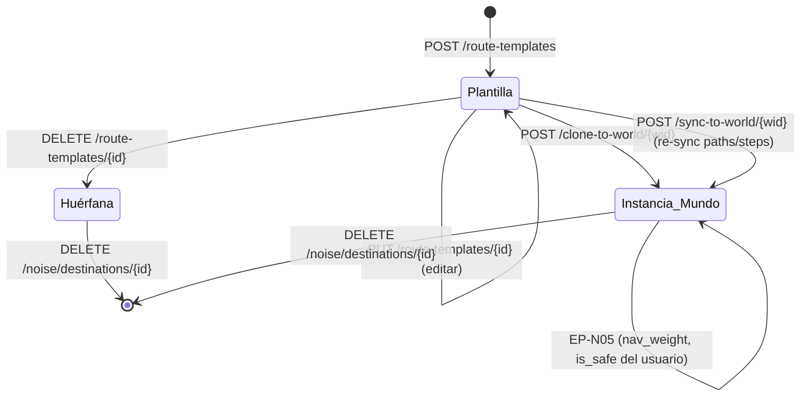

# Portal de Desarrollador de Rutas — Catálogo Maestro de Plantillas

---

## 1. Objetivo de negocio

El desarrollador del bot quiere mapear a mano un catálogo maestro de **rutas
navegables de Travian** (ir al mercado, abrir rally point, ver reportes, abrir un
edificio `gid=X`, ver el mapa, perfil de jugador, info de oasis, etc.), cubriendo
aproximadamente el 80 % de las rutas posibles. El catálogo se define **una sola
vez** y se clona a cualquier mundo cuando el usuario activa ese mundo.

El sistema de "fingir ser humano" (clicks humanos, delays, navegación de ruido)
que ya existe hoy permite interactuar con rutas; este portal convierte esas rutas
en un **catálogo reutilizable global** (`route_templates`), de modo que el usuario
final solo tenga que elegir qué quiere activar y el bot recorra esas rutas para
**meter ruido** (navegación humana de fondo que despista la detección).

---

## 2. Actores y permisos

| Actor | Rol |
|---|---|
| Desarrollador (bot owner) | Curar el catálogo maestro de plantillas: crear, editar, probar y clonar. |
| Usuario final | Elegir qué rutas/plantillas activa en su mundo y ajustar frecuencia/intensidad con los controles ya existentes (`NoiseConfig`, `navigation_weight`). |
| WorldAgent | Ejecuta las rutas de ruido por-mundo; no conoce las plantillas directamente, solo las `noise_destinations` clonadas. |
| Backend FastAPI | Gestiona el CRUD de plantillas globales y el mecanismo de clonado. |
| Frontend Portal | Página global bajo `ManagementShell` en `/rutas` (nueva ruta React). Reutiliza los componentes de `frontend/src/components/world/noise/`. |

---

## 3. Alcance

### Dentro del alcance

- Nueva entidad global `RouteTemplate` en `core/entities/` (sin `world_id`).
- Nueva tabla `route_templates` + `route_template_paths` + `route_template_steps` en SQLite.
- Nuevo puerto `RouteTemplateDbPort` en `core/ports/`.
- Nuevo adaptador `RouteTemplateSQLiteAdapter` en `adapters/db/`.
- Nuevos endpoints CRUD de plantillas globales: EP-RT01..EP-RT06.
- Nuevo endpoint de clonado: EP-RT07 `POST /route-templates/{id}/clone-to-world/{world_id}`.
- Nuevo endpoint de bulk-clone: EP-RT08 `POST /worlds/{id}/noise/apply-templates` (aplica múltiples plantillas a un mundo de una sola llamada).
- Seed inicial: ~20 plantillas pre-cargadas desde `building_catalog.json` + rutas estándar de Travian.
- Página global `/rutas` bajo `ManagementShell` (nueva ruta en `App.jsx`).
- Campo `template_id` en `noise_destinations` para rastrear el origen de una instancia clonada.
- Migración M-RT01 para añadir `template_id` a `noise_destinations`.
- Política de re-sincronización: **instancias independientes** tras clonar (no re-sync automático); botón explícito "Actualizar desde plantilla" (EP-RT09) por instancia.

### Fuera del alcance

- Modo grabación en vivo (record & replay): NO.
- Activación/frecuencia por-mundo: ya existe vía `NoiseConfig` y `navigation_weight`.
- Diseño visual detallado de la UI (eso es del `disenador-producto`); este spec enumera las capacidades de UI.
- Migración de `noise_destinations` existentes a plantillas (si un mundo ya tiene destinos creados a mano, no se retroconvierten en plantillas).
- Versioning de plantillas (historial de cambios en plantillas).

---

## 4. Reglas de negocio

### RN-RT01 — Plantilla es global, sin world_id

`RouteTemplate` no tiene `world_id`. Es un registro de nivel de instalación del bot,
no de un mundo específico. Cualquier plantilla puede clonarse a cualquier mundo.

### RN-RT02 — Unicidad de plantillas: slug

Las plantillas se identifican por un campo `slug` (kebab-case, único global),
además del `id` autoincremental. Permite importar/exportar seeds sin depender de IDs.
Ejemplo: `"rally-point-view"`, `"marketplace-browse"`, `"map-explore"`.

### RN-RT03 — Plantilla contiene rutas y pasos (misma estructura que noise_*)

Una plantilla tiene la misma estructura que `noise_destinations` + sus `NavigationPath`s
con `NavigationStep`s. La diferencia es que no tiene `world_id`, `is_dead`, contadores
de fallos ni `last_used_at` (esos son operacionales por-mundo).

Los steps de una plantilla respetan las mismas restricciones anti-detección que los
steps de producción: `delay_min_ms >= 200`, `delay_max_ms <= 5000`, selector no vacío.

### RN-RT04 — Clonado: plantilla → instancia por-mundo

El clonado materializa una `noise_destination` + sus `NavigationPath`s y `NavigationStep`s
en el mundo destino. El `noise_destination` clonado lleva un campo `template_id`
(FK a `route_templates.id`) para saber de dónde viene.

El clonado es una COPIA INDEPENDIENTE. Tras clonar, la instancia por-mundo y la
plantilla maestra son independientes: modificar la plantilla NO propaga cambios
automáticamente a las instancias. El desarrollador puede usar EP-RT09
"Actualizar desde plantilla" para re-sincronizar instancia(s) específica(s) de forma
explícita.

### RN-RT05 — Colisión en el clonado (UNIQUE world_id + url_pattern)

La tabla `noise_destinations` tiene `UNIQUE(world_id, url_pattern)`. Si ya existe
un destino con el mismo `url_pattern` en ese mundo:

- **Caso A — sin `template_id`** (creado a mano por el usuario): el clonado falla con
  `409 Conflict` y devuelve el ID del destino conflictivo. El desarrollador decide si
  sobreescribir con EP-RT07 usando el flag `force=true`.
- **Caso B — con `template_id` igual** (ya está clonada exactamente esta plantilla):
  el clonado es idempotente; devuelve `200 OK` con la instancia ya existente (no duplica).
- **Caso C — con `template_id` distinto** (otra plantilla diferente ocupa esa URL):
  409 Conflict, igual que el caso A. El desarrollador decide.

El flag `force=true` en EP-RT07 hace un UPSERT: borra la instancia conflictiva
(y sus paths/steps en cascada) y crea la nueva. Requiere confirmación explícita del
desarrollador en el frontend.

### RN-RT06 — Borrado de plantilla: instancias quedan huérfanas

Si una plantilla se borra, los destinos clonados de ella permanecen intactos en sus
mundos. Solo se pone `template_id = NULL` en esos destinos (FK con `ON DELETE SET NULL`).
La operación no es destructiva para los mundos ya configurados.

### RN-RT07 — Re-sincronización explícita (EP-RT09)

EP-RT09 `POST /route-templates/{id}/sync-to-world/{world_id}` re-sincroniza la
instancia de un mundo con la plantilla maestra:
- Localiza el `noise_destination` con `template_id = id` en ese mundo.
- Reemplaza atómicamente sus paths/steps por los de la plantilla.
- NO toca `is_dead`, `consecutive_failures_count`, `last_used_at`, `is_safe` ni
  `navigation_weight` del destino (esos son del usuario final, no del desarrollador).
- Si no existe instancia en ese mundo, se comporta igual que un clonad
  (crear desde cero). 409 solo si hay un destino con misma URL pero `template_id` distinto.

### RN-RT08 — Bulk clone

EP-RT08 `POST /worlds/{id}/noise/apply-templates` acepta una lista de `template_id`s
y los clona en masa al mundo indicado. Cada clon sigue RN-RT05 individualmente.
La respuesta lista el resultado por plantilla: `cloned | already_exists | conflict`.
No es atómica: si una plantilla falla (conflict), las demás siguen.

### RN-RT09 — Seed inicial

El seed se carga en el lifespan de `adapters/api/main.py` (idempotente: comprueba
si las plantillas ya existen por slug antes de insertar). El seed pre-carga ~20
plantillas con sus steps, organizadas en categorías:

Ver §7.4 para la lista completa del seed.

### RN-RT10 — Probar plantilla en vivo

El desarrollador puede probar una plantilla con EP-RT10 `POST /route-templates/{id}/test`
pasando un `world_id`. El backend clona la plantilla TEMPORALMENTE, ejecuta
`execute_path_test` en el mundo indicado (EP-N14 existente), y borra la copia temporal.
Alternativamente se puede clonar primero y probar via EP-N14.

Decisión de diseño: EP-RT10 es un wrapper de EP-N14 que clona temporalmente si el
mundo no tiene ya esa plantilla instanciada. Si ya tiene una instancia, usa la existente
para el test y NO la modifica.

---

## 5. Flujo principal y flujos alternativos

### Flujo principal — Desarrollador crea una plantilla nueva

```
1. Desarrollador abre /rutas en el frontend.
2. UI llama GET /route-templates → lista plantillas existentes.
3. Desarrollador pulsa "Nueva plantilla".
4. UI muestra el formulario (reutiliza NoiseDestinationDrawer adaptado para templates).
5. Desarrollador rellena: slug, label, category, url_pattern, navigation_weight, is_safe.
6. Opcionalmente añade steps (wizard de steps, reutiliza el mismo de noise/).
7. UI llama POST /route-templates → 201 con la plantilla creada.
8. Plantilla aparece en la lista.
```

### Flujo principal — Desarrollador clona una plantilla a un mundo

```
1. Desde /rutas, el desarrollador pulsa "Clonar" en una plantilla.
2. UI muestra un selector de mundos disponibles.
3. Desarrollador elige el mundo destino.
4. UI llama POST /route-templates/{id}/clone-to-world/{world_id}.
5. Backend verifica RN-RT05 (colisión).
6a. Sin colisión → 201 con el noise_destination creado.
6b. Ya existe misma plantilla → 200 (idempotente, devuelve instancia existente).
6c. Colisión con otro destino → 409 con destino conflictivo.
7. UI muestra resultado: "Clonado correctamente" / "Ya existía" / "Conflicto con ID=X".
```

### Flujo principal — Desarrollador actualiza plantilla y re-sincroniza a mundos

```
1. Desarrollador edita la plantilla (cambia un selector CSS que ha cambiado en Travian).
2. UI llama PUT /route-templates/{id} → 200.
3. Las instancias por-mundo NO se actualizan automáticamente.
4. Desde el detalle de la plantilla, el desarrollador ve "Mundos con esta plantilla: [X, Y, Z]".
5. Pulsa "Re-sincronizar al mundo X" → EP-RT09.
6. Backend reemplaza paths/steps de la instancia conservando config del usuario.
7. 200 con el noise_destination actualizado.
```

### Flujo alternativo — Clonado con colisión y force=true

```
1. POST /route-templates/{id}/clone-to-world/{world_id} → 409 Conflict.
2. Desarrollador decide sobreescribir.
3. UI llama POST /route-templates/{id}/clone-to-world/{world_id}?force=true.
4. Backend borra el destino conflictivo (ON DELETE CASCADE) y crea la nueva instancia.
5. 201 con el nuevo noise_destination.
```

### Flujo alternativo — Borrado de plantilla con instancias vivas

```
1. DELETE /route-templates/{id}.
2. Backend pone template_id = NULL en todos los noise_destinations con ese template_id.
3. Los destinos siguen vivos en sus mundos.
4. 204 No Content.
```

---

## 6. Edge cases

| ID | Situación | Tratamiento |
|---|---|---|
| EC-RT01 | Clonar plantilla a mundo que ya la tiene (misma URL, mismo template_id) | 200 idempotente, devuelve la instancia existente sin modificarla (RN-RT05 Caso B). |
| EC-RT02 | Clonar plantilla a mundo con URL ocupada por OTRO destino (distinto template_id o sin template_id) | 409 Conflict con `{conflicting_destination_id: N, message: "..."}`. El desarrollador puede usar force=true. |
| EC-RT03 | Plantilla borrada: ¿qué pasa con sus instancias? | `template_id = NULL` en las instancias (FK ON DELETE SET NULL). Los mundos siguen funcionando. |
| EC-RT04 | Re-sync (EP-RT09) a mundo que NO tiene instancia de la plantilla | Se comporta como clonar: crea la instancia. 201. Si hay colisión de URL, aplica RN-RT05. |
| EC-RT05 | Plantilla sin steps (solo url_pattern + label) | Válido: la plantilla puede tener 0 paths/steps. Se puede clonar y los paths se añaden después en el mundo. |
| EC-RT06 | Bulk clone (EP-RT08) donde algunas plantillas fallan y otras tienen éxito | No atómico. Respuesta por ítem: `{template_id, result: "cloned|already_exists|conflict", destination_id, error}`. |
| EC-RT07 | Slug duplicado en POST /route-templates | 409 Conflict `{detail: "Ya existe una plantilla con slug '...'"}`. |
| EC-RT08 | url_pattern con placeholder dinámico (p.ej. `/karte.php#x={x}&y={y}`) | Válido: el url_pattern puede contener tokens de plantilla. El sistema no los resuelve; el desarrollador los explica en el label. |
| EC-RT09 | Re-sync cuando la plantilla tiene más steps que la instancia (o viceversa) | Reemplazo atómico de los paths/steps: borra los de la instancia e inserta los de la plantilla. El conteo de steps puede cambiar. |
| EC-RT10 | Seed cargado en una BD que ya tiene las plantillas (reinicio del servidor) | Idempotente por slug: INSERT OR IGNORE o check previo. No duplica. |
| EC-RT11 | Probar plantilla (EP-RT10) con world_id de un mundo sin sesión activa | El `execute_path_test` fallará con error de sesión (igual que EP-N14). La plantilla no se borra si usó una instancia existente; si creó temporal, la elimina de todos modos. |
| EC-RT12 | Clonar plantilla con step que referencia un selector que ya no existe en Travian | El clon se crea sin error (el selector es un string, no se valida contra el DOM en el momento del clonado). El error aparecerá al ejecutar/probar la ruta. El step se marca como muerto vía el mecanismo de failures existente. |
| EC-RT13 | url_pattern de una plantilla choca con la constraint de URL válida de `create_destination` (dominio no pertenece al world_server) | La validación de dominio se aplica en el CLONADO, no en la creación de la plantilla (que es global, sin world_server). En EP-RT07 se valida que la url_pattern sea compatible con el world_server del mundo destino. |
| EC-RT14 | `navigation_weight` de la plantilla vs. preferencia del usuario en el mundo | Al clonar, `navigation_weight` de la plantilla se usa como valor inicial. El usuario puede cambiarlo en el mundo vía EP-N05 sin afectar a la plantilla. EP-RT09 (re-sync) NO sobreescribe `navigation_weight`. |

---

## 7. Modelo de datos / cambios de esquema

### 7.1 Entidad `RouteTemplate` (nueva — core/entities/noise.py)

```python
@dataclass
class RouteTemplatePath:
    """
    Ruta dentro de una plantilla global.
    Sin destination_id (la plantilla no es por-mundo).
    Sin is_dead / consecutive_failures_count (operacional por-mundo).
    """
    id: int | None
    template_id: int | None
    origin: str                  # str — admite NavigationOrigin.value + "VILLAGE_<n>"
    label: str
    is_active: bool = True
    steps: list[NavigationStep] = field(default_factory=list)

    def __post_init__(self) -> None:
        if not self.label.strip():
            raise ValueError("label no puede estar vacío")


@dataclass
class RouteTemplate:
    """
    Plantilla global de ruta de navegación de ruido.

    Sin world_id — es global al instalación del bot.
    Slug único globalmente (RN-RT02).
    Los steps siguen las mismas restricciones anti-detección que NavigationStep.
    """
    id: int | None
    slug: str                              # kebab-case, UNIQUE global
    label: str
    category: NoiseCategory
    url_pattern: str
    navigation_weight: float = 1.0         # peso inicial sugerido al clonar (0.1–5.0)
    is_safe: bool = True
    paths: list[RouteTemplatePath] = field(default_factory=list)
    created_at: datetime | None = None
    updated_at: datetime | None = None

    def __post_init__(self) -> None:
        if not (0.1 <= self.navigation_weight <= 5.0):
            raise ValueError(
                "navigation_weight debe estar entre 0.1 y 5.0 "
                "(anti-detección: pesos extremos hacen el ruido predecible)"
            )
        if not self.slug.strip():
            raise ValueError("slug no puede estar vacío")
        if not re.match(r'^[a-z0-9]+(?:-[a-z0-9]+)*$', self.slug):
            raise ValueError("slug debe ser kebab-case: solo letras minúsculas, dígitos y guiones")
        if not self.label.strip():
            raise ValueError("label no puede estar vacío")
        if not self.url_pattern.strip():
            raise ValueError("url_pattern no puede estar vacío")
```

**Nota de arquitectura:** `RouteTemplatePath` y `RouteTemplate` se añaden a
`core/entities/noise.py`, junto a las demás entidades de noise. La entidad
`NavigationStep` se REUTILIZA directamente (mismos campos, mismas validaciones).

### 7.2 Tablas nuevas (adapters/db/route_template_sqlite_adapter.py)

```sql
-- Tabla principal de plantillas globales
CREATE TABLE IF NOT EXISTS route_templates (
    id               INTEGER PRIMARY KEY AUTOINCREMENT,
    slug             TEXT    NOT NULL UNIQUE,
    label            TEXT    NOT NULL,
    category         TEXT    NOT NULL
                             CHECK (category IN (
                                 'MAP','OASIS_INFO','PLAYER_PROFILE',
                                 'MESSAGES','REPORTS','BUILDING_VIEW','OTHER'
                             )),
    url_pattern      TEXT    NOT NULL,
    navigation_weight REAL   NOT NULL DEFAULT 1.0
                             CHECK (navigation_weight >= 0.1 AND navigation_weight <= 5.0),
    is_safe          INTEGER NOT NULL DEFAULT 1,
    created_at       TEXT    NOT NULL,
    updated_at       TEXT    NOT NULL
);

CREATE INDEX IF NOT EXISTS idx_route_templates_slug ON route_templates(slug);
CREATE INDEX IF NOT EXISTS idx_route_templates_category ON route_templates(category);

-- Rutas de plantilla (sin destination_id; sin is_dead; sin consecutive_failures_count)
CREATE TABLE IF NOT EXISTS route_template_paths (
    id          INTEGER PRIMARY KEY AUTOINCREMENT,
    template_id INTEGER NOT NULL REFERENCES route_templates(id) ON DELETE CASCADE,
    origin      TEXT    NOT NULL,
    label       TEXT    NOT NULL,
    is_active   INTEGER NOT NULL DEFAULT 1
);

CREATE INDEX IF NOT EXISTS idx_route_template_paths_template
    ON route_template_paths(template_id);

-- Steps de plantilla (misma estructura que noise_navigation_steps)
CREATE TABLE IF NOT EXISTS route_template_steps (
    id                       INTEGER PRIMARY KEY AUTOINCREMENT,
    template_path_id         INTEGER NOT NULL
                                     REFERENCES route_template_paths(id) ON DELETE CASCADE,
    step_order               INTEGER NOT NULL,
    action                   TEXT    NOT NULL
                                     CHECK (action IN (
                                         'CLICK','WAIT_FOR_SELECTOR','SCROLL_TO','HOVER'
                                     )),
    selector                 TEXT    NOT NULL,
    value                    TEXT    NOT NULL DEFAULT '',
    delay_min_ms             INTEGER NOT NULL DEFAULT 500,
    delay_max_ms             INTEGER NOT NULL DEFAULT 900,
    expected_url_after_click TEXT    DEFAULT NULL,
    UNIQUE (template_path_id, step_order)
);

CREATE INDEX IF NOT EXISTS idx_route_template_steps_path
    ON route_template_steps(template_path_id, step_order);
```

### 7.3 Modificación a noise_destinations — campo template_id (migración M-RT01)

```sql
-- Migración M-RT01: añadir FK a la plantilla origen (NULL si creado a mano)
ALTER TABLE noise_destinations
    ADD COLUMN template_id INTEGER DEFAULT NULL
                           REFERENCES route_templates(id) ON DELETE SET NULL;

CREATE INDEX IF NOT EXISTS idx_noise_destinations_template
    ON noise_destinations(template_id);
```

Esta migración es idempotente (try/except OperationalError si ya existe la columna).

### 7.4 Seed inicial — ~20 plantillas

El seed se organiza en 5 categorías. Se carga en el lifespan de la API, verificando
por slug (idempotente). Los datos del seed viven en `seeds/route_templates.json`
(NO en `seeds/game_data/` ni como constantes Python). Ver §9.4 para el pseudocódigo
de carga y la estructura JSON esperada.

**Navegación estándar (OTHER / MAP):**
1. `map-explore` — Explorar el mapa (`/karte.php`, MAP)
2. `map-to-oasis` — Ver oasis en el mapa (`/karte.php#type=oasis`, MAP)
3. `statistics-players` — Estadísticas de jugadores (`/statistics/players`, OTHER)
4. `statistics-alliances` — Estadísticas de alianzas (`/statistics/alliances`, OTHER)
5. `messages-inbox` — Bandeja de mensajes (`/messages`, MESSAGES)
6. `reports-inbox` — Bandeja de reportes (`/report`, REPORTS)

**Edificios de uso frecuente (BUILDING_VIEW) — 10 plantillas — gids verificados contra `building_catalog.json`:**
7.  `rally-point-view`   — Rally Point (`/build.php?gid=13`, BUILDING_VIEW, military)
8.  `academy-view`       — Academy (`/build.php?gid=14`, BUILDING_VIEW, military)
9.  `barracks-view`      — Barracks (`/build.php?gid=15`, BUILDING_VIEW, infrastructure)
10. `stable-view`        — Stable (`/build.php?gid=16`, BUILDING_VIEW, military)
11. `trade-office-view`  — Trade Office (`/build.php?gid=20`, BUILDING_VIEW, military)
12. `great-market-view`  — Great Market (`/build.php?gid=21`, BUILDING_VIEW, military)
13. `embassy-view`       — Embassy (`/build.php?gid=22`, BUILDING_VIEW, military)
14. `hero-mansion-view`  — Hero's Mansion (`/build.php?gid=23`, BUILDING_VIEW, infrastructure)
15. `warehouse-view`     — Warehouse (`/build.php?gid=10`, BUILDING_VIEW, resources)
16. `granary-view`       — Granary (`/build.php?gid=11`, BUILDING_VIEW, resources)

> **Nota:** `gid=17 alias=workshop` (taller). La farm list en Travian 4.x es un
> submenú dentro del Rally Point (gid=13), no un edificio independiente con gid propio.
> El marketplace de aldea es Trade Office (gid=20) y el gran mercado gid=21.
> Los gids anteriores están verificados contra `seeds/game_data/building_catalog.json`.

**Perfil e información social (PLAYER_PROFILE / OASIS_INFO):**
17. `player-own-profile` — Perfil propio (URL dinámica, `PLAYER_PROFILE`) — sin steps (se completa por-mundo)
18. `alliance-page`      — Página de alianza (URL dinámica, `OTHER`) — sin steps
19. `oasis-info-map`     — Info de oasis desde el mapa (`OASIS_INFO`) — sin steps (requiere coords)
20. `village-dorf1`      — Vista recursos de la aldea (`/dorf1.php`, OTHER) — origen ANY, sin steps adicionales

Las primeras 6 (navegación estándar) vienen con al menos un `RouteTemplatePath` con
un step de tipo `WAIT_FOR_SELECTOR` apuntando al selector principal de la página
(suficiente para verificar que la navegación llegó correctamente).

Las de edificios (7-16) vienen con un path de origen `DORF2` con un step CLICK al
enlace `a[href*='gid=X']` del edificio + un step WAIT_FOR_SELECTOR del header del
edificio.

Las de perfil/oasis (17-20) se crean sin steps (placeholder, el desarrollador las
completa con el wizard).

---

## 8. Contratos de API / interfaces

> **Gate de desarrollador-apis: COMPLETADO (2026-06-05).**
> Contratos revisados y corregidos. Ver nota de validación al final de esta sección (§8.13).
>
> **Gobernanza de idioma (CLAUDE.md):** los endpoints de plantillas devuelven
> datos del desarrollador (labels, slugs), no texto localizado para usuarios finales.
> NO requieren `Accept-Language` obligatorio. Decisión validada por desarrollador-apis:
> `label` y `category` son texto libre del desarrollador, no texto del catálogo de
> idiomas de Travian. Si en el futuro se localizan los labels del seed, se añadiría
> `get_language_optional`. Por ahora: sin `Accept-Language` en ningún EP-RT.

### 8.1 Endpoints nuevos — Resumen

| ID | Método | Ruta | Acción | Es nuevo |
|---|---|---|---|---|
| EP-RT01 | GET | `/route-templates` | Listar plantillas (con filtro opcional por category) | NUEVO |
| EP-RT02 | POST | `/route-templates` | Crear plantilla | NUEVO |
| EP-RT03 | GET | `/route-templates/{id}` | Obtener plantilla con paths+steps | NUEVO |
| EP-RT04 | PUT | `/route-templates/{id}` | PATCH parcial de plantilla | NUEVO |
| EP-RT05 | DELETE | `/route-templates/{id}` | Borrar plantilla (instancias quedan huérfanas) | NUEVO |
| EP-RT06 | GET | `/route-templates/{id}/paths` | Listar paths de una plantilla | NUEVO |
| EP-RT07 | POST | `/route-templates/{id}/clone-to-world/{world_id}` | Clonar plantilla a un mundo | NUEVO |
| EP-RT08 | POST | `/worlds/{world_id}/noise/apply-templates` | Bulk clone a un mundo | NUEVO |
| EP-RT09 | POST | `/route-templates/{id}/sync-to-world/{world_id}` | Re-sincronizar instancia con plantilla | NUEVO |
| EP-RT10 | POST | `/route-templates/{id}/test` | Probar plantilla en vivo | NUEVO |

**Endpoints existentes REUTILIZADOS sin cambio:**
- EP-N11 `POST /worlds/{id}/noise/derive-selector` — el desarrollador lo usa para derivar selectores CSS al crear steps de plantilla, exactamente igual que al crear pasos por-mundo.
- EP-N14 `POST /worlds/{id}/noise/paths/{path_id}/test` — para probar el path ya clonado.

**Endpoints existentes MODIFICADOS:**
- EP-N03 `GET /worlds/{id}/noise/destinations` — añade campo `template_id` (nullable) al response.
- EP-N04 `POST /worlds/{id}/noise/destinations` — permite pasar `template_id` opcional (para clonado manual).

### 8.2 EP-RT01 — GET /route-templates

```
GET /route-templates
Query params:
  category:      string (opcional) — filtra por categoría (MAP, OASIS_INFO, etc.)
  include_paths: bool   (opcional, default false) — incluye paths+steps en la respuesta
  limit:         int    (opcional, default 100, rango [1, 500])
  offset:        int    (opcional, default 0, ge=0)

Response 200:
[
  {
    "id": 1,
    "slug": "rally-point-view",
    "label": "Rally Point — ver edificio",
    "category": "BUILDING_VIEW",
    "url_pattern": "/build.php?gid=13",
    "navigation_weight": 1.0,
    "is_safe": true,
    "paths_count": 1,
    "created_at": "2026-06-05T00:00:00Z",
    "updated_at": "2026-06-05T00:00:00Z"
  },
  ...
]
// Si include_paths=true, cada item incluye además "paths": [{...con steps}]

// Nota: category inválida no devuelve 400 — FastAPI rechaza el valor del enum con 422
// automáticamente (tipo NoiseCategory). No añadir validación manual para este caso.
// 422: { "detail": [{"loc": ["query", "category"], "msg": "..."}] }
```

### 8.3 EP-RT02 — POST /route-templates

```
POST /route-templates
Content-Type: application/json

Request body:
{
  "slug": "rally-point-view",         // requerido, kebab-case, UNIQUE
  "label": "Rally Point — ver edificio",  // requerido
  "category": "BUILDING_VIEW",         // requerido
  "url_pattern": "/build.php?gid=13",  // requerido
  "navigation_weight": 1.0,            // opcional, default 1.0, rango [0.1, 5.0]
  "is_safe": true,                     // opcional, default true
  "paths": [                           // opcional, lista de rutas con steps
    {
      "origin": "DORF2",
      "label": "Desde aldea - edificios",
      "is_active": true,
      "steps": [
        {
          "step_order": 0,
          "action": "CLICK",
          "selector": "a[href*='gid=13']",
          "delay_min_ms": 500,
          "delay_max_ms": 900,
          "expected_url_after_click": "/build.php?gid=13"
        }
      ]
    }
  ]
}

Response 201:
Headers:
  Location: /route-templates/{id}
Body:
{
  "id": 42,
  "slug": "rally-point-view",
  "label": "Rally Point — ver edificio",
  "category": "BUILDING_VIEW",
  "url_pattern": "/build.php?gid=13",
  "navigation_weight": 1.0,
  "is_safe": true,
  "paths": [...],
  "created_at": "...",
  "updated_at": "..."
}

Response 409: { "detail": "Ya existe una plantilla con slug 'rally-point-view'." }
Response 422: { "detail": "navigation_weight debe estar entre 0.1 y 5.0." }
Response 422: { "detail": "slug debe ser kebab-case: solo letras minúsculas, dígitos y guiones." }
Response 422: { "detail": "delay_min_ms debe ser >= 200 ms (anti-detección)." }
```

### 8.4 EP-RT03 — GET /route-templates/{id}

```
GET /route-templates/{id}

Response 200:
{
  "id": 42,
  "slug": "...",
  "label": "...",
  "category": "...",
  "url_pattern": "...",
  "navigation_weight": 1.0,
  "is_safe": true,
  "paths": [
    {
      "id": 1,
      "template_id": 42,
      "origin": "DORF2",
      "label": "...",
      "is_active": true,
      "steps": [
        {
          "id": 1,
          "step_order": 0,
          "action": "CLICK",
          "selector": "a[href*='gid=13']",
          "value": "",
          "delay_min_ms": 500,
          "delay_max_ms": 900,
          "expected_url_after_click": "/build.php?gid=13"
        }
      ]
    }
  ],
  "created_at": "...",
  "updated_at": "..."
}

Response 404: { "detail": "Plantilla no encontrada." }
```

### 8.5 EP-RT04 — PUT /route-templates/{id}

```
PUT /route-templates/{id}
Content-Type: application/json

Request body (PATCH parcial — al menos uno de los campos):
{
  "label": "...",                  // opcional
  "navigation_weight": 1.5,        // opcional
  "is_safe": false,                // opcional
  "paths": [...]                   // opcional — reemplazo ATÓMICO si se pasa
}
// slug, category, url_pattern NO se pueden cambiar tras la creación.

Response 200: mismo esquema que EP-RT03 response
Response 404: { "detail": "Plantilla no encontrada." }
Response 422: { "detail": "El body debe contener al menos uno de: label, navigation_weight, is_safe, paths." }
```

### 8.6 EP-RT05 — DELETE /route-templates/{id}

```
DELETE /route-templates/{id}

Response 204: No Content
// Las instancias clonadas quedan con template_id=NULL (ON DELETE SET NULL).

Response 404: { "detail": "Plantilla no encontrada." }
```

### 8.7 EP-RT06 — GET /route-templates/{id}/paths

```
GET /route-templates/{id}/paths

Response 200:
[
  {
    "id": 1,
    "template_id": 42,
    "origin": "DORF2",
    "label": "...",
    "is_active": true,
    "steps": [...]
  }
]

Response 404: { "detail": "Plantilla no encontrada." }
```

### 8.8 EP-RT07 — POST /route-templates/{id}/clone-to-world/{world_id}

```
POST /route-templates/{id}/clone-to-world/{world_id}
Query params:
  force: bool (opcional, default false) — sobreescribe destino conflictivo

Response 201 (clon nuevo creado — también cuando force=true sobreescribe):
Headers:
  Location: /worlds/{world_id}/noise/destinations/{destination_id}
Body:
{
  "result": "cloned",
  "destination_id": 99,
  "world_id": 3,
  "template_id": 42,
  "url_pattern": "/build.php?gid=13"
}

Response 200 (idempotente — ya existía misma plantilla, Caso B de RN-RT05):
{
  "result": "already_exists",
  "destination_id": 75,
  "world_id": 3,
  "template_id": 42
}

Response 409 (colisión, sin force=true — Casos A y C de RN-RT05):
// CORRECCIÓN: conflicting_destination_id va DENTRO de detail (dict), no en la raíz.
// El patrón del proyecto (HTTPException) siempre usa {"detail": <valor>}; el valor
// puede ser un dict cuando se necesitan campos extra.
{
  "detail": {
    "message": "Ya existe un destino con url_pattern '/build.php?gid=13' en el mundo 3.",
    "conflicting_destination_id": 88
  }
}

Response 422: { "detail": "La url_pattern de la plantilla no es compatible con el servidor del mundo 3." }
Response 404: { "detail": "Plantilla no encontrada." }
Response 404: { "detail": "Mundo no encontrado." }
```

### 8.9 EP-RT08 — POST /worlds/{id}/noise/apply-templates

```
POST /worlds/{world_id}/noise/apply-templates
Content-Type: application/json

Request body:
{
  "template_ids": [1, 2, 3, 5],   // lista de IDs de plantillas a clonar
  "force": false                   // opcional, default false
}

Response 200 (no atómico — resultado por ítem):
{
  "results": [
    {"template_id": 1, "result": "cloned",        "destination_id": 101},
    {"template_id": 2, "result": "already_exists", "destination_id": 75},
    {"template_id": 3, "result": "conflict",        "conflicting_destination_id": 88, "error": "..."},
    {"template_id": 5, "result": "cloned",          "destination_id": 102}
  ]
}

Response 422: { "detail": "template_ids no puede estar vacío." }
Response 404: { "detail": "Mundo no encontrado." }
```

### 8.10 EP-RT09 — POST /route-templates/{id}/sync-to-world/{world_id}

```
POST /route-templates/{id}/sync-to-world/{world_id}

Response 200 (re-sincronizado — instancia ya existía):
{
  "result": "synced",
  "destination_id": 99,
  "paths_replaced": 2
}

Response 201 (no existía instancia — se creó, equivale a clone):
// EC-RT04: cuando el mundo no tiene instancia, sync actúa como clone.
Headers:
  Location: /worlds/{world_id}/noise/destinations/{destination_id}
Body:
{
  "result": "created",
  "destination_id": 103
}

Response 409 (colisión de URL con destino de template_id distinto):
// Mismo patrón que EP-RT07: conflicting_destination_id dentro del dict de detail.
{
  "detail": {
    "message": "Ya existe un destino con esa url_pattern en el mundo pero pertenece a otra plantilla.",
    "conflicting_destination_id": 88
  }
}

Response 404: { "detail": "Plantilla no encontrada." }
Response 404: { "detail": "Mundo no encontrado." }
```

### 8.11 EP-RT10 — POST /route-templates/{id}/test

**Estrategia de ejecución del test (clon temporal → NavigationPath real → borrado):**
EP-RT10 DEBE clonar la plantilla a una instancia temporal en BD, leer el `NavigationPath`
real resultante (que ya tiene `path_id` y `step_id` reales en `noise_navigation_paths` /
`noise_navigation_steps`), llamar a `execute_path_test` con ese `NavigationPath`, y luego
borrar la instancia temporal. No se construyen objetos en memoria con campos ficticios
porque `execute_path_test` espera un `NavigationPath` real con IDs de BD válidos.

El flujo preciso del handler:
```
1. Obtener plantilla → 404 si no existe.
2. Obtener world → 404 si no existe.
3. Buscar instancia ya clonada: find_destination_by_template(world_id, template_id).
   3a. Si existe → usar path[path_index] de esa instancia. NO borrar al acabar.
   3b. Si no existe → clonar con label="[TEST TEMPORAL]", is_safe=False, template_id=template.id.
       Anotar dest_id como temporal.
4. Obtener NavigationPath del mundo (noise_db.list_paths(dest_id))[path_index].
   → 422 si path_index >= len(paths).
5. Llamar execute_path_test(world_id, path.id) → devuelve PathTestResult.
6. Si se creó instancia temporal (3b) → borrarla con noise_db.delete_destination(dest_id)
   independientemente del resultado del test (try/finally).
7. Devolver PathTestResult como response (mismo shape que EP-N14).
```

**Edge case EC-RT11 actualizado:** si `execute_path_test` lanza excepción (sesión muerta,
browser ocupado, error interno), el bloque `finally` del paso 6 garantiza que la instancia
temporal se borra de todos modos. Solo queda huérfana si el proceso Python cae abruptamente;
se limpia con el cleanup periódico mencionado en §13 (destinos con `label="[TEST TEMPORAL]"`
y `is_safe=False`).

```
POST /route-templates/{id}/test
Content-Type: application/json

Request body:
{
  "world_id": 3,          // requerido — mundo en el que ejecutar el test
  "path_index": 0         // opcional, default 0 — índice del path a probar (0-based)
  // NOTA: path_index es posicional (orden de paths en la plantilla). Si el implementador
  // prefiere mayor robustez puede añadir "path_id" (id de RouteTemplatePath). Decisión
  // técnica para el implementador; path_index es suficiente para v1 dado que las
  // plantillas tienen pocos paths y el contrato ya documenta su fragilidad.
}

// El response de EP-RT10 adopta el mismo shape que EP-N14 (PathTestResponse)
// para mantener coherencia. El frontend puede reutilizar el mismo componente de UI.

Response 200 (test ejecutado, éxito total):
{
  "overall": "ok",
  "aborted_at_step": null,
  "anchor_navigated_to": "/dorf2.php",
  "steps": [
    {"step_order": 0, "action": "CLICK", "selector": "a[href*='gid=13']",
     "status": "ok", "reason": null, "current_url": "/build.php?gid=13"},
    {"step_order": 1, "action": "WAIT_FOR_SELECTOR", "selector": ".build-title",
     "status": "ok", "reason": null, "current_url": "/build.php?gid=13"}
  ],
  "browser_note": "El browser queda en la última página visitada durante el test."
}

Response 200 (test ejecutado, algún paso falló — HTTP 200 es correcto, el fallo es semántico):
{
  "overall": "error",
  "aborted_at_step": 1,
  "anchor_navigated_to": "/dorf2.php",
  "steps": [
    {"step_order": 0, "action": "CLICK", "selector": "a[href*='gid=13']",
     "status": "ok", "reason": null, "current_url": "/build.php?gid=13"},
    {"step_order": 1, "action": "WAIT_FOR_SELECTOR", "selector": ".build-title",
     "status": "error", "reason": "Selector .build-title no encontrado tras 5000 ms.",
     "current_url": "/build.php?gid=13"}
  ],
  "browser_note": "El browser queda en la última página visitada durante el test."
}

Response 404: { "detail": "Plantilla no encontrada." }
Response 404: { "detail": "Mundo no encontrado." }
Response 409: { "detail": "El agente del mundo está desconectado. Inicia sesión primero para poder probar la ruta." }
Response 409: { "detail": "El browser está ocupado con otra tarea. Espera a que finalice e inténtalo de nuevo." }
// CORRECCIÓN: EP-RT10 hereda los dos tipos de 409 de EP-N14 (sin sesión activa y
// BrowserBusyError). El spec original solo documentaba el primero.
Response 422: { "detail": "path_index 2 fuera de rango — la plantilla tiene 1 path(s)." }
Response 500: { "detail": "Error interno del servidor." }
```

### 8.12 Modificaciones a endpoints existentes (compatibilidad hacia atrás verificada)

**EP-N03 — GET /worlds/{id}/noise/destinations**
Delta: añadir campo `template_id` (int | null) al objeto de cada destino.

```
// Objeto destino (delta, resto sin cambio):
{
  ...
  "template_id": 42,    // NEW — null si creado a mano, int si clonado desde plantilla
  ...
}
```

**EP-N04 — POST /worlds/{id}/noise/destinations**
Delta: añadir campo `template_id` (int | null, opcional, default null) al request body.
Esto permite crear un destino manualmente con referencia explícita a una plantilla.

Compatibilidad hacia atrás EP-N03 y EP-N04:
- EP-N03: añadir `template_id` al response es retrocompatible (campo nuevo nullable — los
  clientes existentes que no conocen el campo lo ignoran sin error).
- EP-N04: añadir `template_id` como campo opcional al request body es retrocompatible
  (los clientes que no lo envían reciben `null` por defecto, sin cambio de comportamiento).
- El modelo Pydantic `NoiseDestinationResponse` debe añadir `template_id: Optional[int] = None`.
- El modelo Pydantic `CreateDestinationRequest` debe añadir `template_id: Optional[int] = None`.
- El helper `_dest_to_response` debe propagar `template_id` desde la entidad.

### 8.13 Nota de validación — Contrato validado por desarrollador-apis (2026-06-05)

Correcciones aplicadas al borrador del analista:

1. **EP-RT01** — Añadidos parámetros `limit` y `offset` (coherentes con EP-N03).
   Corregido el error 400 por categoría inválida: FastAPI/Pydantic devuelve 422
   automáticamente para valores de enum inválidos; no hay que validar manualmente
   ni documentar un 400 para este caso.

2. **EP-RT02** — Añadida cabecera `Location: /route-templates/{id}` en el response 201
   (CABECERAS MÍNIMAS: Location obligatoria en creaciones).

3. **EP-RT07** — Tres correcciones:
   a) Añadida cabecera `Location` en el response 201 (clon nuevo y force=true).
   b) El 409 tenía `conflicting_destination_id` a nivel raíz del JSON — incompatible con
      el patrón `{"detail": <valor>}` de HTTPException en el proyecto. Corregido:
      `conflicting_destination_id` va ahora dentro del dict de `detail`.
   c) Clarificado que `force=true` también devuelve 201 (crea nuevo, borra el previo).

4. **EP-RT08** — Corregido el parámetro de path en el resumen (§8.1): `{id}` → `{world_id}`
   para coherencia con el contrato del §8.9 y con el resto del router de noise.

5. **EP-RT09** — Dos correcciones:
   a) Añadida cabecera `Location` en el response 201 (cuando sync actúa como clone).
   b) El 409 tenía `conflicting_destination_id` a nivel raíz — mismo problema que EP-RT07.
      Corregido con el mismo patrón: dentro del dict de `detail`.

6. **EP-RT10** — Tres correcciones:
   a) El response shape adoptado es el mismo que EP-N14 (`PathTestResponse` con campos
      `overall`, `aborted_at_step`, `anchor_navigated_to`, `steps`, `browser_note`),
      reemplazando el shape ad-hoc original (`success`, `steps_executed`, `final_url`,
      `log`). Esto permite reutilizar el mismo componente de UI del resultado del test.
   b) Añadido el segundo 409 (BrowserBusyError) que el wrapper hereda de EP-N14 y que
      el spec original no documentaba.
   c) Añadido el 422 para `path_index` fuera de rango y el 500 para errores internos.

7. **EP-N03 / EP-N04 deltas** — Verificada compatibilidad hacia atrás. Añadidas notas
   sobre qué cambiar en los modelos Pydantic y en `_dest_to_response`.

8. **Accept-Language** — Decisión del analista validada y confirmada: ningún EP-RT
   requiere `Accept-Language`. Los labels son texto libre del desarrollador.

9. **Semántica de verbos** — EP-RT04 usa `PUT` para un PATCH parcial. Esto es coherente
   con la convención del proyecto (noise.py usa `PUT` para todos sus PATCH parciales).
   No se cambia: seguir la convención establecida.

No hay puntos abiertos para el analista. Los contratos quedan listos para implementación.

---

## 9. Flujo lógico paso a paso (pseudocódigo / mermaid)

### 9.1 Operación de clonado (EP-RT07)

```python
async def clone_template_to_world(
    template_id: int,
    world_id: int,
    force: bool = False,
    db: RouteTemplateDbPort,
    noise_db: NoiseDbPort,
) -> CloneResult:
    # 1. Cargar plantilla
    template = await db.get_template(template_id)
    if template is None:
        raise TemplateNotFoundError(template_id)

    # 2. Verificar que el mundo existe
    world = await worlds_db.get_world(world_id)
    if world is None:
        raise WorldNotFoundError(world_id)

    # 3. Validar url_pattern contra el world_server (EC-RT13)
    # Solo si la URL es absoluta. Las relativas (/build.php?gid=13) son siempre válidas.
    if is_absolute_url(template.url_pattern):
        validate_url_domain(template.url_pattern, world.server)

    # 4. Verificar colisión UNIQUE(world_id, url_pattern) — RN-RT05
    existing = await noise_db.find_destination_by_url(world_id, template.url_pattern)

    if existing is not None:
        if existing.template_id == template_id:
            # Caso B: idempotente
            return CloneResult(result="already_exists", destination_id=existing.id)
        elif not force:
            # Caso A o C: colisión
            raise ConflictError(conflicting_destination_id=existing.id)
        else:
            # force=True: borrar instancia conflictiva y continuar
            await noise_db.delete_destination(existing.id)

    # 5. Crear noise_destination desde la plantilla
    dest = await noise_db.create_destination(
        world_id=world_id,
        url_pattern=template.url_pattern,
        label=template.label,
        category=template.category,
        frequency_weight=template.navigation_weight,
        is_safe=template.is_safe,
        template_id=template.id,   # nueva columna M-RT01
    )

    # 6. Clonar paths y steps atómicamente
    for tpath in template.paths:
        path = await noise_db.create_path(
            dest_id=dest.id,
            origin=tpath.origin,
            label=tpath.label,
            steps=[NavigationStep(
                id=None,
                path_id=None,
                step_order=s.step_order,
                action=s.action,
                selector=s.selector,
                value=s.value,
                delay_min_ms=s.delay_min_ms,
                delay_max_ms=s.delay_max_ms,
                expected_url_after_click=s.expected_url_after_click,
            ) for s in tpath.steps],
        )

    return CloneResult(result="cloned", destination_id=dest.id)
```

### 9.2 Operación de re-sincronización (EP-RT09)

```python
async def sync_template_to_world(template_id, world_id, ...) -> SyncResult:
    template = await db.get_template(template_id)  # 404 si no existe
    world = await worlds_db.get_world(world_id)    # 404 si no existe

    # Buscar instancia existente
    instance = await noise_db.find_destination_by_template(world_id, template_id)

    if instance is None:
        # No existe: comportarse como clone
        return await clone_template_to_world(template_id, world_id, force=False, ...)

    # Re-sincronizar paths/steps (NO toca is_dead, nav_weight, is_safe, failures, last_used_at)
    # 1. Borrar todos los paths de la instancia (CASCADE borra los steps)
    for path in await noise_db.list_paths(instance.id):
        await noise_db.delete_path(path.id)

    # 2. Re-crear paths+steps desde la plantilla
    paths_replaced = 0
    for tpath in template.paths:
        await noise_db.create_path(
            dest_id=instance.id,
            origin=tpath.origin,
            label=tpath.label,
            steps=[...],  # igual que en clone
        )
        paths_replaced += 1

    return SyncResult(result="synced", destination_id=instance.id, paths_replaced=paths_replaced)
```

### 9.3 Diagrama — ciclo de vida de una plantilla



### 9.4 Seed idempotente (lifespan)

**Ubicación del fichero de datos del seed:**
Los datos del seed viven en `seeds/route_templates.json` (en la raíz de `seeds/`, NO en
`seeds/game_data/` que es exclusivo de datos de juego scrapeados de kirilloid). El
adaptador lee ese JSON en lugar de tener las plantillas como constantes Python embebidas
en el código fuente, por mantenibilidad: añadir o editar plantillas del seed no requiere
tocar código Python.

`seed_route_templates` NO usa `seed_loader.py` (ese loader es específico de
kirilloid / datos de juego). La carga del JSON es responsabilidad directa del adaptador.

```python
import json
from pathlib import Path

async def seed_route_templates(adapter: RouteTemplateSQLiteAdapter) -> None:
    """
    Carga el seed de ~20 plantillas desde seeds/route_templates.json.
    Idempotente por slug: si la plantilla ya existe, no la modifica
    (respeta ediciones posteriores del desarrollador).
    """
    seed_path = Path(__file__).parent.parent.parent / "seeds" / "route_templates.json"
    raw = json.loads(seed_path.read_text(encoding="utf-8"))
    for item in raw:
        existing = await adapter.get_template_by_slug(item["slug"])
        if existing is None:
            tpl = RouteTemplate(
                id=None,
                slug=item["slug"],
                label=item["label"],
                category=NoiseCategory(item["category"]),
                url_pattern=item["url_pattern"],
                navigation_weight=item.get("navigation_weight", 1.0),
                is_safe=item.get("is_safe", True),
                paths=[...],  # deserializar paths/steps del JSON
            )
            await adapter.create_template(tpl)
        # Si ya existe → no modificar
```

Estructura esperada de `seeds/route_templates.json`:
```json
[
  {
    "slug": "map-explore",
    "label": "Explorar el mapa",
    "category": "MAP",
    "url_pattern": "/karte.php",
    "navigation_weight": 1.0,
    "is_safe": true,
    "paths": [
      {
        "origin": "ANY",
        "label": "Desde cualquier aldea",
        "is_active": true,
        "steps": [
          {
            "step_order": 0,
            "action": "WAIT_FOR_SELECTOR",
            "selector": "#map",
            "value": "",
            "delay_min_ms": 500,
            "delay_max_ms": 900
          }
        ]
      }
    ]
  },
  ...
]
```

---

## 10. Validaciones y reglas

| Campo | Tipo | Constraint | Error |
|---|---|---|---|
| `slug` | str | kebab-case, UNIQUE global, no vacío | 409 si duplicado; 422 si formato inválido |
| `label` | str | no vacío | 422 |
| `category` | enum | uno de los 7 valores de NoiseCategory | 422 |
| `url_pattern` | str | no vacío; si absoluta, http/https; sin javascript:/data: | 422 |
| `navigation_weight` | float | [0.1, 5.0] | 422 (mensaje anti-detección) |
| `slug + category + url_pattern` | — | inmutables tras creación | 422 "... no se puede cambiar tras la creación" |
| `template_ids` en EP-RT08 | list | no vacía | 422 |
| `delay_min_ms` en steps | int | >= 200 (anti-detección) | 422 |
| `delay_max_ms` en steps | int | [delay_min_ms, 5000] | 422 |
| `selector` en steps | str | no vacío | 422 |

**Validación de url_pattern en el clonado (EC-RT13):**
- URL relativa (empieza por `/`): siempre válida para cualquier mundo.
- URL absoluta: debe pertenecer al `world.server` del mundo destino. Si no, 422 en el clone.
- La creación de la plantilla NO valida el dominio (no hay world_server en el contexto global).

---

## 11. Seguridad, rendimiento y concurrencia

### Anti-detección

- Los steps de plantilla siguen las mismas restricciones que los steps de producción
  (delay >= 200 ms, <= 5000 ms). La entidad `NavigationStep` ya las blinda.
- El `navigation_weight` de la plantilla se copia al destino como valor INICIAL.
  El clamp al 60 % de `pick_random_safe_destination` aplica después, como siempre.
- EP-RT10 (test en vivo) reutiliza `execute_path_test` existente, que ya usa `human_click`.
  No hay riesgo de bypass de las capas de anti-detección.

### Rendimiento

- Las tablas de plantillas son pequeñas (< 200 filas en un catálogo típico).
  No se anticipan problemas de rendimiento.
- El bulk clone (EP-RT08) itera los template_ids en secuencia (no paralelo) para no
  crear condiciones de carrera en SQLite (single-writer). Con 20 plantillas es
  imperceptible (< 50 ms total).
- El seed se carga en el lifespan una sola vez. El check por slug es una query con
  índice → O(log n).

### Concurrencia

- SQLite serializa escrituras. El clonado y la re-sync son operaciones atómicas por
  diseño (se hacen dentro de una transacción).
- La migración M-RT01 es idempotente (try/except OperationalError).

---

## 12. Plan de pruebas

### Tests unitarios — entidad RouteTemplate

| ID | Caso | Esperado |
|---|---|---|
| TU-RT01 | `RouteTemplate(slug="rally-point-view", ...)` | OK |
| TU-RT02 | `RouteTemplate(slug="Rally Point", ...)` | ValueError (kebab-case inválido) |
| TU-RT03 | `RouteTemplate(navigation_weight=5.01, ...)` | ValueError (> 5.0) |
| TU-RT04 | `RouteTemplate(navigation_weight=0.09, ...)` | ValueError (< 0.1) |
| TU-RT05 | `RouteTemplate(url_pattern="", ...)` | ValueError |
| TU-RT06 | `NavigationStep(delay_min_ms=199, ...)` en path de plantilla | ValueError (< 200 ms) |

### Tests de integración — CRUD de plantillas

| ID | Caso | Esperado |
|---|---|---|
| TI-RT01 | `POST /route-templates` con datos válidos | 201, devuelve plantilla con id |
| TI-RT02 | `POST /route-templates` con slug duplicado | 409 |
| TI-RT03 | `GET /route-templates` | 200, lista con todas las plantillas |
| TI-RT04 | `GET /route-templates?category=MAP` | 200, solo las de categoría MAP |
| TI-RT05 | `GET /route-templates/{id}` existente | 200, con paths y steps |
| TI-RT06 | `GET /route-templates/9999` | 404 |
| TI-RT07 | `PUT /route-templates/{id}` con `label` nuevo | 200, campo actualizado |
| TI-RT08 | `PUT /route-templates/{id}` con `slug` → ignorado o 422 | 422 "slug no se puede cambiar" |
| TI-RT09 | `DELETE /route-templates/{id}` sin instancias | 204 |
| TI-RT10 | `DELETE /route-templates/{id}` con instancias → template_id=NULL en instancias | 204, instancias intactas con template_id=null |

### Tests de integración — Clonado

| ID | Caso | Esperado |
|---|---|---|
| TI-RT11 | Clone plantilla a mundo sin conflicto | 201, `result=cloned`, noise_destination creado con template_id |
| TI-RT12 | Clone misma plantilla a mismo mundo (idempotente) | 200, `result=already_exists` |
| TI-RT13 | Clone con URL conflictiva (otro destino) | 409, `conflicting_destination_id` |
| TI-RT14 | Clone con `force=true` sobre conflicto | 201, `result=cloned`, destino conflictivo borrado |
| TI-RT15 | Clone verifica que paths+steps se crean en el mundo | GET /noise/destinations/{dest_id}/paths devuelve paths copiados |

### Tests de integración — Re-sync

| ID | Caso | Esperado |
|---|---|---|
| TI-RT16 | Sync a mundo con instancia existente | 200, `result=synced`, paths reemplazados |
| TI-RT17 | Sync a mundo SIN instancia | 201, `result=created` (equivale a clone) |
| TI-RT18 | Sync NO modifica `navigation_weight` de la instancia | El peso del usuario se preserva |
| TI-RT19 | Sync NO modifica `is_dead` ni `consecutive_failures_count` | Estado operacional preservado |

### Tests de integración — Bulk clone

| ID | Caso | Esperado |
|---|---|---|
| TI-RT20 | Bulk clone de 3 plantillas, una con conflicto | 200, resultados: cloned/cloned/conflict |
| TI-RT21 | Bulk clone con `template_ids: []` | 422 |

### Tests de integración — Seed

| ID | Caso | Esperado |
|---|---|---|
| TI-RT22 | Seed cargado en BD vacía | ~20 plantillas en la tabla |
| TI-RT23 | Seed re-ejecutado (BD ya con plantillas) | Idempotente, sin duplicados |

---

## 13. Riesgos y trade-offs

| Riesgo | Prob. | Impacto | Mitigación |
|---|---|---|---|
| slug immutable complica renombrar plantillas (error de naming en el seed) | Baja | Bajo | Si el slug se equivoca: borrar + recrear (instancias quedan huérfanas, pocos minutos). Aceptable para uso interno. |
| url_pattern con tokens dinámicos (`/karte.php#x={x}`) no se interpolan | Baja | Bajo | El sistema no resuelve tokens; el desarrollador lo documenta en el label. Se puede añadir en el futuro. |
| Bulk clone no atómico puede dejar el mundo en estado parcial | Media | Bajo | Cada clon es independiente; la respuesta por-ítem permite al frontend reintentar los que fallaron. Rollback completo sería más complejo (múltiples tablas) con SQLite. |
| EP-RT10 (test en vivo) crea un clon temporal que puede quedar huérfano si el proceso falla | Baja | Bajo | El clon temporal se etiqueta con `is_safe=False` y `label="[TEST TEMPORAL]"`. Un cleanup periódico o al reiniciar el servidor los elimina. |
| Migration M-RT01 en BD con miles de noise_destinations puede ser lenta | Muy baja | Bajo | El proyecto es single-user; noise_destinations es pequeña en la práctica. |
| Sync re-crea paths en la instancia pero el motor de noise puede estar ejecutando esa ruta en ese momento | Muy baja | Bajo | SQLite serializa; la transacción del sync espera al write-lock. En la práctica el bot rara vez está justo en ese path al hacer sync. Aceptable sin mutex adicional. |

**Trade-off principal — ¿Instancias independientes vs. re-sync automático?**

Se decidió NO sincronizar automáticamente las instancias cuando se edita una plantilla.
Razones:
1. El usuario puede haber ajustado `navigation_weight`, `is_safe` o marcado pasos como
   inactivos en el mundo — una sincronización automática sobreescribiría esas
   customizaciones silenciosamente.
2. El desarrollador puede estar editando la plantilla en medio de una sesión activa del
   bot, lo que podría interrumpir una navegación en curso.
3. La re-sincronización explícita (EP-RT09) es más segura y mantiene al desarrollador
   en control.

Alternativa descartada: `last_synced_at` + notificación visual "hay una versión más
nueva de esta plantilla". Descartada por complejidad innecesaria en este sprint.

---

## 14. Pasos de implementación ordenados

> **Prerrequisito absoluto:** gate `desarrollador-apis` + gate `palantir`
> (Fase 3 de este spec) antes de ejecutar cualquier paso.

**Paso 1 — Entidad `RouteTemplate` y `RouteTemplatePath` (core/entities/noise.py)**
Añadir los dos dataclasses al fichero existente de entidades de noise. Reutiliza `NavigationStep`.

**Paso 2 — Puerto `RouteTemplateDbPort` (core/ports/route_template_db_port.py)**
Nuevo fichero siguiendo el patrón de `noise_db_port.py`. Métodos:
`get_template`, `get_template_by_slug`, `list_templates`, `create_template`,
`update_template`, `delete_template`, `list_paths_for_template`, `seed_templates`.

**Paso 3 — Adaptador `RouteTemplateSQLiteAdapter` (adapters/db/route_template_sqlite_adapter.py)**
DDL de §7.2. `ensure_tables()` crea las 3 tablas nuevas. Implementa `RouteTemplateDbPort`.
Registrar en `lifespan` de `adapters/api/main.py`.

**Paso 4 — Migración M-RT01 + extensión de `create_destination` (adapters/db/noise_sqlite_adapter.py)**
Añadir `_migrate_noise_destinations_add_template_id(conn)`. Llamarla desde
`ensure_tables()` del adaptador de noise tras las migraciones existentes.

La migración añade la columna `template_id` en BD (§7.3), pero la columna también debe
quedar expuesta en la capa de código. Realizar estos dos cambios **retrocompatibles**:

1. **`NoiseSQLiteAdapter.create_destination`** — añadir parámetro al final de la firma:
   ```python
   async def create_destination(
       self,
       world_id: int,
       url_pattern: str,
       label: str,
       category: NoiseCategory,
       frequency_weight: float,
       is_safe: bool = True,
       template_id: int | None = None,   # NUEVO — default None → retrocompatible
   ) -> NoiseDestination:
   ```
   Propagar `template_id` al INSERT. La firma actual (sin `template_id`) NO acepta el
   parámetro; el pseudocódigo del clonado en §9.1 ya lo usa — sin este cambio el clonado
   fallaría en runtime.

2. **`NoiseDbPort.create_destination`** (core/ports/noise_db_port.py) — actualizar la
   firma abstracta de igual forma con `template_id: int | None = None`. Los call-sites
   existentes (EP-N04 y cualquier test que llame `create_destination` sin `template_id`)
   no se rompen porque el nuevo parámetro tiene default.

3. **Métodos de lookup nuevos en `NoiseDbPort` y `NoiseSQLiteAdapter`** — el pseudocódigo
   de clonado (§9.1) y re-sync (§9.2) usa dos métodos que NO existen todavía en el puerto
   ni en el adaptador. Deben añadirse como métodos NUEVOS en ambas capas:

   ```python
   # En core/ports/noise_db_port.py — añadir a la clase NoiseDbPort:

   @abstractmethod
   async def find_destination_by_url(
       self, world_id: int, url_pattern: str
   ) -> NoiseDestination | None:
       """
       Devuelve el primer NoiseDestination de ese mundo con esa url_pattern,
       o None si no existe. Usado para detectar colisiones antes de clonar (RN-RT05).
       """

   @abstractmethod
   async def find_destination_by_template(
       self, world_id: int, template_id: int
   ) -> NoiseDestination | None:
       """
       Devuelve el NoiseDestination de ese mundo cuyo template_id coincide,
       o None si no existe. Usado por EP-RT09 (sync) para localizar la instancia
       a re-sincronizar (§9.2).
       """
   ```

   Implementación en `NoiseSQLiteAdapter`:
   - `find_destination_by_url`: `SELECT … WHERE world_id=? AND url_pattern=? LIMIT 1`.
   - `find_destination_by_template`: `SELECT … WHERE world_id=? AND template_id=? LIMIT 1`.

   Ambos métodos devuelven la entidad completa (`_row_to_destination`) o `None`.
   Estos métodos se añaden al contrato del puerto de `noise` (NO al de `route_templates`),
   porque son consultas sobre `noise_destinations`, que pertenece al dominio de noise.

**Paso 5 — Lógica de clonado y re-sync (core/use_cases/ o helpers en adapters/db)**
Decisión: la lógica de clonado (RN-RT04, RN-RT05, RN-RT07) vive en el adaptador del
router de API (handler), NO en el core, porque es una operación de coordinación entre
dos adaptadores (`RouteTemplateSQLiteAdapter` y `NoiseSQLiteAdapter`). El core de
anti-detección no se toca.

**Validación de URL en el clonado — REUTILIZAR, no duplicar (EC-RT13):**
La función `_validate_url_pattern(url_pattern, world_server)` ya existe en
`adapters/db/noise_sqlite_adapter.py` (≈línea 570), junto al helper privado
`_same_or_subdomain`. El handler que implementa EP-RT07 (clone) y EP-RT09 (sync)
DEBE reutilizarla para validar la URL absoluta de la plantilla contra el
`world.server` del mundo destino. Opciones (decisión para el implementador):

- **Opción A — Importar directamente:** `from adapters.db.noise_sqlite_adapter import _validate_url_pattern` en el handler. Sencillo, pero importa un símbolo "privado" (prefijo `_`) entre módulos del mismo paquete.
- **Opción B — Extraer a helper compartido:** mover ambas funciones a `adapters/db/_url_validation.py` y hacer que `noise_sqlite_adapter.py` y el handler las importen desde allí. Más limpio a largo plazo si la validación se reutiliza en más sitios.

**NUNCA copiar el cuerpo de `_validate_url_pattern` en el handler ni en `RouteTemplateSQLiteAdapter`.** La plantilla global no conoce `world_server`; la validación de dominio pertenece al handler de clonado, donde `world.server` sí está disponible. `RouteTemplateSQLiteAdapter` NO debe recibir ni validar `world_server`.

**Paso 6 — Router de API: EP-RT01..EP-RT10 (adapters/api/routes/route_templates.py)**
Nuevo fichero de rutas. Registrar en `adapters/api/main.py` con prefijo `/route-templates`
y adicionalmente EP-RT08 bajo `/worlds/{id}/noise/apply-templates` (puede ir en el
router de noise existente o en el nuevo router).

**Paso 7 — Modificar EP-N03 y EP-N04 (adapters/api/routes/noise.py)**
Delta mínimo: añadir `template_id` al response de EP-N03 y al request de EP-N04.

**Paso 8 — Seed (seeds/route_templates.json + adapters/db/route_template_sqlite_adapter.py)**
Crear `seeds/route_templates.json` con las ~20 plantillas de §7.4 en el formato JSON
definido en §9.4. NO usar `seeds/game_data/` (exclusivo de kirilloid) ni constantes
Python embebidas en el código fuente.
Implementar `seed_route_templates(adapter)` en el adaptador leyendo ese JSON (ver §9.4).
Llamar `seed_route_templates()` en el lifespan de `adapters/api/main.py` tras `ensure_tables()`.

**Paso 9 — Tests (tests/)**
Implementar los tests de §12. Carpeta: `tests/test_route_templates_api.py` y
`tests/unit/test_route_templates.py`.

**Paso 10 — Frontend: nueva página /rutas (frontend/src/pages/RouteTemplatesPage.jsx)**
Nueva ruta en `App.jsx` bajo `ManagementShell`: `<Route path="/rutas" element={<RouteTemplatesPage />} />`.

La UI es responsabilidad del `disenador-producto` + `desarrollador-ux-ui`.
Este paso solo añade la ruta en `App.jsx` y el stub de la página. Ver §UI para el
detalle completo de qué componentes reutilizar, cuáles ajustar y cuáles NO montar.

**REGLA CRÍTICA:** `NoiseTab` completo NO se monta en `/rutas`. Sus efectos internos
dependen de `worldId` (`api.getNoiseOrigins(worldId)`, `api.getNoiseConfig(worldId)`,
`api.getNoiseDestinations(worldId)`). En `/rutas` no hay `worldId`. La nueva
`RouteTemplatesPage.jsx` orquesta los hijos directamente (ver §UI para el desglose).

**Paso 11 — Verificar import-linter**
Ejecutar `.venv/bin/lint-imports` antes de cerrar. Las nuevas entidades están en
`core/entities/noise.py` (ya existe), el nuevo puerto en `core/ports/` y el nuevo
adaptador en `adapters/db/` → no cruza la frontera hexagonal.

---

## 15. Criterios de aceptación (checklist verificable por el implementador)

- [ ] **CA-RT01** — `RouteTemplate(slug="bad slug!", ...)` lanza `ValueError`.
- [ ] **CA-RT02** — `RouteTemplate(navigation_weight=5.01, ...)` lanza `ValueError`.
- [ ] **CA-RT03** — `POST /route-templates` con slug válido → 201 con el objeto completo.
- [ ] **CA-RT04** — `POST /route-templates` con slug duplicado → 409.
- [ ] **CA-RT05** — `GET /route-templates` devuelve la lista de plantillas.
- [ ] **CA-RT06** — `GET /route-templates?category=MAP` devuelve solo las de MAP.
- [ ] **CA-RT07** — `PUT /route-templates/{id}` con `slug` → 422 (inmutable).
- [ ] **CA-RT08** — `DELETE /route-templates/{id}` con instancias clonadas → las instancias quedan con `template_id=null`.
- [ ] **CA-RT09** — Clone sin conflicto → 201, destino creado en `noise_destinations` con `template_id` correcto.
- [ ] **CA-RT10** — Clone idempotente (misma plantilla, mismo mundo) → 200 `result=already_exists`.
- [ ] **CA-RT11** — Clone con conflicto y sin `force=true` → 409 con `conflicting_destination_id`.
- [ ] **CA-RT12** — Clone con `force=true` → 201, destino conflictivo borrado.
- [ ] **CA-RT13** — Clone copia los paths+steps de la plantilla al mundo destino.
- [ ] **CA-RT14** — Re-sync (EP-RT09) sustituye paths/steps de la instancia por los de la plantilla.
- [ ] **CA-RT15** — Re-sync NO modifica `navigation_weight` ni `is_dead` de la instancia.
- [ ] **CA-RT16** — Re-sync en mundo sin instancia → comportamiento equivalente a clone (201).
- [ ] **CA-RT17** — Bulk clone (EP-RT08) procesa cada ítem independientemente; la respuesta lista resultado por template_id.
- [ ] **CA-RT18** — Bulk clone con `template_ids: []` → 422.
- [ ] **CA-RT19** — Seed cargado en BD vacía: al menos 18 plantillas (se acepta menos si algunos gids son erróneos tras verificación).
- [ ] **CA-RT20** — Seed re-ejecutado → no duplicados.
- [ ] **CA-RT21** — `GET /worlds/{id}/noise/destinations` devuelve `template_id` (null o entero) en cada destino.
- [ ] **CA-RT22** — `lint-imports` sigue reportando `Contracts: 2 kept, 0 broken` tras la implementación.
- [ ] **CA-RT23** — Route `/rutas` existe en `App.jsx` y renderiza bajo `ManagementShell`.
- [ ] **CA-RT24** — Gate `desarrollador-apis` completado (`apis_validadas_por_desarrollador_apis: true`) antes de implementar.

---

## 16. Trazabilidad

| Decisión técnica | Requisito / edge case que la origina |
|---|---|
| `RouteTemplate` global sin `world_id` | Decisión del usuario: catálogo maestro global (RN-RT01) |
| `slug` kebab-case UNIQUE | RN-RT02 — permite seed idempotente por nombre sin depender de IDs autoincrementales |
| Campos inmutables: slug, category, url_pattern | RN-RT02 / EC-RT07 — cambiarlos rompe las instancias clonadas que referencian esos campos |
| Instancias independientes tras clonar (sin re-sync automático) | Decisión del usuario (§DECISIONES YA TOMADAS 1d) — preservar customizaciones del usuario final |
| Re-sync explícito vía EP-RT09 | Decisión del usuario (§DECISIONES YA TOMADAS 1d) — control explícito del desarrollador |
| `template_id` en noise_destinations con ON DELETE SET NULL | RN-RT06 — borrar plantilla no destruye instancias activas en mundos |
| Colisión → 409 con `force=true` opcional | RN-RT05 — el desarrollador puede sobreescribir intencionalmente |
| Bulk clone no atómico (por-ítem) | EC-RT06 + §13 trade-off — SQLite single-writer + UX más claro con resultado por ítem |
| Validación de dominio URL solo en el clonado (no en create_template) | EC-RT13 — la plantilla es global; el world_server solo existe en el contexto del mundo destino |
| Re-sync NO toca navigation_weight/is_dead/failures | RN-RT07 + EC-RT14 — separación "diseño del desarrollador" vs "estado operacional del usuario" |
| Seed ~20 plantillas en 5 categorías | RN-RT09 — cubrir el 80 % de rutas más comunes con un esfuerzo de primer entregable realista |
| EP-RT10 test en vivo como wrapper de EP-N14 | RN-RT10 — reutilizar el mecanismo ya validado por el guardian de anti-detección |
| Lógica de clonado en el handler (no en core) | §14 Paso 5 — la operación coordina dos adaptadores; no es lógica de dominio pura |
| NavigationStep REUTILIZADO sin cambios desde noise.py | Palantir (gate 3.1) — misma entidad, mismas validaciones anti-detección ya blindadas |
| Nuevas tablas en fichero de adaptador separado (route_template_sqlite_adapter.py) | Convención del proyecto: un adaptador por dominio, patrón XSQLiteAdapter(XPort) |
| Reutilización: `_validate_url_pattern` + `_same_or_subdomain` de `noise_sqlite_adapter.py` (≈línea 570) — decidido por palantir, verificado en `adapters/db/noise_sqlite_adapter.py` | Hallazgo #1 palantir (gate cierre) — EC-RT13: no duplicar la validación de dominio de URL |
| Reutilización: `create_destination` modificado con `template_id: int | None = None` en `NoiseSQLiteAdapter` Y en `NoiseDbPort` — retrocompatible (default None) | Hallazgo #2 palantir (gate cierre) — el clonado en §9.1 pasa `template_id`; sin este ajuste falla en runtime |
| Creación: `find_destination_by_url` y `find_destination_by_template` como métodos NUEVOS de `NoiseDbPort` + `NoiseSQLiteAdapter` | Hallazgo #3 palantir (gate cierre) — el pseudocódigo §9.1/§9.2 los usa; no existían en el puerto ni en el adaptador |
| EP-RT10 estrategia: clonar temporal → leer NavigationPath real de BD → execute_path_test → borrar (try/finally) | Hallazgo #4 palantir (gate cierre) — `execute_path_test` espera un `NavigationPath` con IDs de BD reales; conversiones en memoria serían frágiles |
| Frontend: `NoiseTab` NO se monta en `/rutas`; `NoiseDestinationsTable` y `NoiseDestinationDrawer` se AJUSTAN con prop `mode` sin duplicar fichero | Hallazgo #5 palantir (gate cierre) — `NoiseTab` depende de `worldId`; ficheros gemelos serían duplicación prohibida |
| Seed: datos en `seeds/route_templates.json` (NO en `seeds/game_data/` ni constantes Python) | Hallazgo #6 palantir (gate cierre) — `seeds/game_data/` es exclusivo de kirilloid; JSON externo > constantes embebidas por mantenibilidad |

---

## Capacidades de UI requeridas en la página global /rutas

El `disenador-producto` debe diseñar una página bajo `ManagementShell` que ofrezca:

1. **Lista de plantillas** — tabla con slug, label, category, navigation_weight, paths_count.
   Filtro por categoría. Botón "Nueva plantilla".

2. **Detalle / edición de plantilla** — drawer o página anidada con:
   - Campos editables: label, navigation_weight, is_safe.
   - Campo de solo lectura: slug, category, url_pattern (inmutables).
   - Lista de paths con sus steps (reutiliza el árbol de componentes de `noise/`).
   - Botón "Añadir path" (reutiliza el wizard de steps existente).
   - Botón "Probar" (EP-RT10) — requiere selector de mundo.

3. **Clonado** — botón "Clonar a mundo" en el ítem de la lista o en el detalle.
   Selector de mundos disponibles. Manejo visual de los tres casos: clonado / ya existe / conflicto.

4. **Re-sincronizar** — en el detalle de la plantilla, sección "Instancias en mundos"
   que lista los mundos donde está clonada (información derivable de `noise_destinations.template_id`)
   con botón "Sincronizar" por mundo.

5. **Bulk clone** — botón "Aplicar plantillas al mundo X" (quizás desde la pantalla
   de detalle del mundo, no desde /rutas). Decisión de ubicación exacta para el diseñador.

### Mapa de reutilización de componentes (precisión de palantir — OBLIGATORIO respetar)

**NO montar (sus efectos dependen de `worldId`):**
- `NoiseTab.jsx` — orquesta datos con `api.getNoiseOrigins(worldId)`, `getNoiseConfig`,
  `getNoiseDestinations`. Sin `worldId` sus efectos fallan. `RouteTemplatesPage` NO lo monta;
  orquesta los hijos directamente.

**REUTILIZAR sin tocar (sin modificar el fichero):**
- `NoisePathWizard.jsx` — ya acepta `origins` como prop opcional; si se pasa `origins`
  precargadas (modo "controlled"), NO llama a `api.getNoiseOrigins(worldId)` internamente.
  En el portal de plantillas, pasar las origins por prop desde el padre para evitar la
  llamada interna que requiere `worldId`. Verificar con el código del componente antes de
  integrar: la prop `origins` ya está implementada (línea ≈37 del fichero actual).
- `NoiseStepEditor.jsx` — sin dependencias de `worldId`.
- `NoiseWizardStepForm.jsx` — sin dependencias de `worldId`.
- `NoiseDerivedSelectorFeedback.jsx` — sin dependencias de `worldId`.
- `NoiseOriginSelector.jsx` — recibe origins por prop; no fetcha.

**AJUSTAR sin duplicar el fichero (añadir props opcionales, sin romper usos existentes):**

- `NoiseDestinationsTable.jsx` — hoy recibe `destinations` por prop (dato ya desacoplado);
  los callbacks `onOpenDrawer`, `onDeleted`, `onCreated` se pasan desde el padre.
  Ajuste necesario: parametrizar los callbacks de creación y borrado para que, en modo
  plantillas, apunten a los endpoints EP-RT01..EP-RT06 en lugar de EP-N03/EP-N04.
  Estrategia recomendada: añadir una prop `mode: "world" | "template"` (default `"world"`)
  o bien pasar los callbacks como props y que el padre decida el endpoint. NO duplicar
  el fichero creando `RouteTemplatesTable.jsx` separado.

- `NoiseDestinationDrawer.jsx` — hoy fetcha `api.getNoisePaths(worldId, dest.id)`
  internamente en un `useEffect` (≈línea 147). En modo plantillas no hay `worldId` y
  los paths se obtienen vía `GET /route-templates/{id}/paths` (EP-RT06).
  Ajuste necesario: añadir prop `mode: "world" | "template"` (o factorizar el fetch al
  padre pasando paths como prop). El ajuste debe ser retrocompatible: cuando `mode="world"`
  (default) el comportamiento actual no cambia. NO duplicar el fichero.

**Regla de oro:** cualquier componente de `noise/` que se necesite en `/rutas` se ajusta
con props opcionales sobre el fichero existente. Crear un fichero gemelo (`RouteTemplates*.jsx`
como copia) está **prohibido** salvo que los cambios necesarios rompan irremediablemente la
interfaz existente (lo que no ocurre con ninguno de los casos anteriores).

---

## Registro de implementación

**Fecha:** 2026-06-05
**Agente:** desarrollador-funcionalidades
**Alcance:** Fase A — backend de dominio y persistencia (SIN router HTTP ni UI)

### Ficheros creados

- `core/entities/noise.py` — MODIFICADO: añadidas entidades `RouteTemplatePath` y `RouteTemplate`; añadido campo `template_id: int | None = None` a `NoiseDestination`; añadido `import re`.
- `core/ports/route_template_db_port.py` — CREADO: puerto `RouteTemplateDbPort` con métodos CRUD, seed, conteo y listing.
- `core/ports/noise_db_port.py` — MODIFICADO: `create_destination` con parámetro `template_id: int | None = None`; métodos abstractos nuevos `find_destination_by_url` y `find_destination_by_template`.
- `adapters/db/route_template_sqlite_adapter.py` — CREADO: adaptador SQLite con DDL de 3 tablas, migración M-RT01, función `seed_route_templates()`.
- `adapters/db/noise_sqlite_adapter.py` — MODIFICADO: función `_migrate_noise_destinations_add_template_id` (definida pero llamada desde `route_template_sqlite_adapter`); helper `_has_template_id_column` con caché; `create_destination` con `template_id` y guard dinámico; SELECTs de `get_destination`/`list_destinations` incluyen `template_id` dinámicamente; métodos `find_destination_by_url` y `find_destination_by_template`; `_row_to_destination` usa `dict.get("template_id")`.
- `adapters/api/main.py` — MODIFICADO: importa `RouteTemplateSQLiteAdapter` y `seed_route_templates`; instancia el adaptador en el lifespan y llama al seed.
- `seeds/route_templates.json` — CREADO: 20 plantillas en 5 categorías con steps para las 16 primeras.
- `tests/unit/test_route_templates.py` — CREADO: 18 tests unitarios TU-RT01..TU-RT06 + extras.
- `tests/test_route_templates_adapter.py` — CREADO: 26 tests de integración TI-RT01..TI-RT10, TI-RT22..TI-RT23 + extras.

### Comando para ejecutar los tests

```bash
.venv/bin/pytest tests/unit/test_route_templates.py tests/test_route_templates_adapter.py -v
```

Para la suite completa incluyendo regresión de noise:
```bash
.venv/bin/pytest tests/unit/test_route_templates.py tests/test_route_templates_adapter.py tests/test_noise_api.py tests/test_noise_path_wizard_db.py tests/antideteccion/test_noise_frequency_weight.py tests/unit/test_noise.py -q
```

### Resultado de tests

- `tests/unit/test_route_templates.py`: **18/18 passed**
- `tests/test_route_templates_adapter.py`: **26/26 passed**
- Suite noise (regresión): **140/140 passed** (sin regresiones)
- `lint-imports`: **Contracts: 2 kept, 0 broken**

### Desviaciones respecto al diseño del spec

1. **Migración M-RT01 en `RouteTemplateSQLiteAdapter.ensure_tables()` (no en `NoiseSQLiteAdapter`)**: El spec §14 Paso 4 indicaba llamarla desde `NoiseSQLiteAdapter.ensure_tables()`. Se movió a `RouteTemplateSQLiteAdapter.ensure_tables()` porque la FK `REFERENCES route_templates(id)` requiere que la tabla `route_templates` exista antes del INSERT. Con el orden original, los tests que instancian solo `NoiseSQLiteAdapter` (sin `RouteTemplateSQLiteAdapter`) fallaban con `no such table: main.route_templates`. El comportamiento en producción (lifespan llama ambos adaptadores) es idéntico.

2. **Guard `_has_template_id_column` con caché en `NoiseSQLiteAdapter`**: El INSERT y SELECTs de `noise_destinations` son dinámicos según si la columna `template_id` existe. Necesario para retrocompatibilidad con los tests legacy de noise que no crean la tabla `route_templates`. En producción la columna siempre existe tras el lifespan y el overhead es un PRAGMA en la primera llamada (luego cacheado).

3. **Función `_migrate_noise_destinations_add_template_id` definida en `noise_sqlite_adapter.py` pero no llamada desde allí**: Se mantiene en el módulo (usada por `route_template_sqlite_adapter.py` que la importa implícitamente) para mantener la co-ubicación con el resto de migraciones de `noise_destinations`. No añade entradas a `ignore_imports` del `.importlinter`.

### Lo que queda para Fase B (router HTTP)

Implementar en `adapters/api/routes/route_templates.py` los endpoints EP-RT01..EP-RT10 siguiendo los contratos del §8. El router puede consumir directamente `app.state.route_template_port` (RouteTemplateSQLiteAdapter) y `app.state.noise_db_port` (NoiseSQLiteAdapter). La lógica de clonado del §9.1 vive en el handler según el spec §14 Paso 5.

Para EP-RT07/EP-RT09: reutilizar `_validate_url_pattern` de `adapters/db/noise_sqlite_adapter.py` (Opción A del spec: importación directa del símbolo "privado" entre módulos del mismo paquete).

Modificaciones a EP-N03/EP-N04: añadir `template_id` al response de EP-N03 (ya está en la entidad) y al request body de EP-N04 (pasar a `create_destination`).

### Lo que queda para Fase C (UI)

Página `frontend/src/pages/RouteTemplatesPage.jsx` bajo `ManagementShell`. Ver §UI del spec para el mapa de reutilización de componentes y la regla de oro contra ficheros gemelos.
