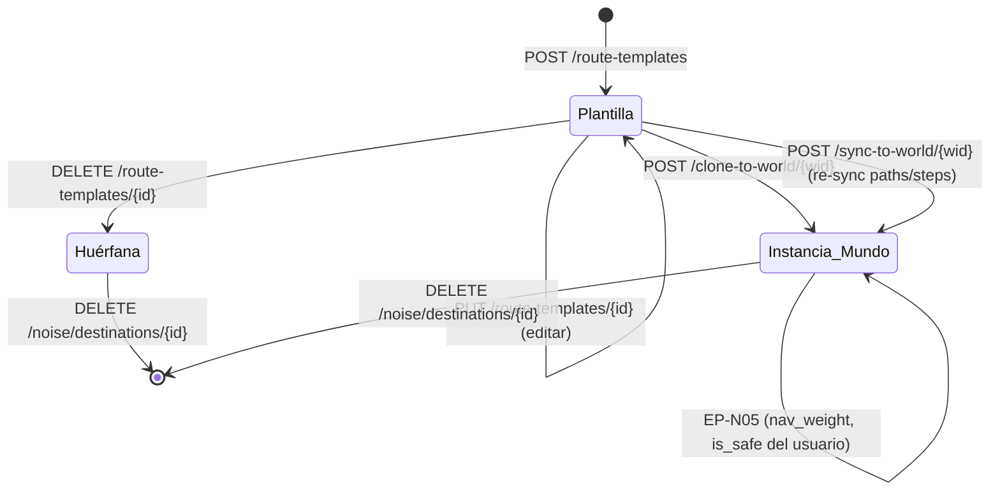

# Portal de Desarrollador de Rutas — Catálogo Maestro de Plantillas

---

## 1. Objetivo de negocio

El desarrollador del bot quiere mapear a mano un catálogo maestro de **rutas
navegables de Travian** (ir al mercado, abrir rally point, ver reportes, abrir un
edificio `gid=X`, ver el mapa, perfil de jugador, info de oasis, etc.), cubriendo
aproximadamente el 80 % de las rutas posibles. El catálogo se define **una sola
vez** y se clona a cualquier mundo cuando el usuario activa ese mundo.

El sistema de "fingir ser humano" (clicks humanos, delays, navegación de ruido)
que ya existe hoy permite interactuar con rutas; este portal convierte esas rutas
en un **catálogo reutilizable global** (`route_templates`), de modo que el usuario
final solo tenga que elegir qué quiere activar y el bot recorra esas rutas para
**meter ruido** (navegación humana de fondo que despista la detección).

---

## 2. Actores y permisos

| Actor | Rol |
|---|---|
| Desarrollador (bot owner) | Curar el catálogo maestro de plantillas: crear, editar, probar y clonar. |
| Usuario final | Elegir qué rutas/plantillas activa en su mundo y ajustar frecuencia/intensidad con los controles ya existentes (`NoiseConfig`, `navigation_weight`). |
| WorldAgent | Ejecuta las rutas de ruido por-mundo; no conoce las plantillas directamente, solo las `noise_destinations` clonadas. |
| Backend FastAPI | Gestiona el CRUD de plantillas globales y el mecanismo de clonado. |
| Frontend Portal | Página global bajo `ManagementShell` en `/rutas` (nueva ruta React). Reutiliza los componentes de `frontend/src/components/world/noise/`. |

---

## 3. Alcance

### Dentro del alcance

- Nueva entidad global `RouteTemplate` en `core/entities/` (sin `world_id`).
- Nueva tabla `route_templates` + `route_template_paths` + `route_template_steps` en SQLite.
- Nuevo puerto `RouteTemplateDbPort` en `core/ports/`.
- Nuevo adaptador `RouteTemplateSQLiteAdapter` en `adapters/db/`.
- Nuevos endpoints CRUD de plantillas globales: EP-RT01..EP-RT06.
- Nuevo endpoint de clonado: EP-RT07 `POST /route-templates/{id}/clone-to-world/{world_id}`.
- Nuevo endpoint de bulk-clone: EP-RT08 `POST /worlds/{id}/noise/apply-templates` (aplica múltiples plantillas a un mundo de una sola llamada).
- Seed inicial: ~20 plantillas pre-cargadas desde `building_catalog.json` + rutas estándar de Travian.
- Página global `/rutas` bajo `ManagementShell` (nueva ruta en `App.jsx`).
- Campo `template_id` en `noise_destinations` para rastrear el origen de una instancia clonada.
- Migración M-RT01 para añadir `template_id` a `noise_destinations`.
- Política de re-sincronización: **instancias independientes** tras clonar (no re-sync automático); botón explícito "Actualizar desde plantilla" (EP-RT09) por instancia.

### Fuera del alcance

- Modo grabación en vivo (record & replay): NO.
- Activación/frecuencia por-mundo: ya existe vía `NoiseConfig` y `navigation_weight`.
- Diseño visual detallado de la UI (eso es del `disenador-producto`); este spec enumera las capacidades de UI.
- Migración de `noise_destinations` existentes a plantillas (si un mundo ya tiene destinos creados a mano, no se retroconvierten en plantillas).
- Versioning de plantillas (historial de cambios en plantillas).

---

## 4. Reglas de negocio

### RN-RT01 — Plantilla es global, sin world_id

`RouteTemplate` no tiene `world_id`. Es un registro de nivel de instalación del bot,
no de un mundo específico. Cualquier plantilla puede clonarse a cualquier mundo.

### RN-RT02 — Unicidad de plantillas: slug

Las plantillas se identifican por un campo `slug` (kebab-case, único global),
además del `id` autoincremental. Permite importar/exportar seeds sin depender de IDs.
Ejemplo: `"rally-point-view"`, `"marketplace-browse"`, `"map-explore"`.

### RN-RT03 — Plantilla contiene rutas y pasos (misma estructura que noise_*)

Una plantilla tiene la misma estructura que `noise_destinations` + sus `NavigationPath`s
con `NavigationStep`s. La diferencia es que no tiene `world_id`, `is_dead`, contadores
de fallos ni `last_used_at` (esos son operacionales por-mundo).

Los steps de una plantilla respetan las mismas restricciones anti-detección que los
steps de producción: `delay_min_ms >= 200`, `delay_max_ms <= 5000`, selector no vacío.

### RN-RT04 — Clonado: plantilla → instancia por-mundo

El clonado materializa una `noise_destination` + sus `NavigationPath`s y `NavigationStep`s
en el mundo destino. El `noise_destination` clonado lleva un campo `template_id`
(FK a `route_templates.id`) para saber de dónde viene.

El clonado es una COPIA INDEPENDIENTE. Tras clonar, la instancia por-mundo y la
plantilla maestra son independientes: modificar la plantilla NO propaga cambios
automáticamente a las instancias. El desarrollador puede usar EP-RT09
"Actualizar desde plantilla" para re-sincronizar instancia(s) específica(s) de forma
explícita.

### RN-RT05 — Colisión en el clonado (UNIQUE world_id + url_pattern)

La tabla `noise_destinations` tiene `UNIQUE(world_id, url_pattern)`. Si ya existe
un destino con el mismo `url_pattern` en ese mundo:

- **Caso A — sin `template_id`** (creado a mano por el usuario): el clonado falla con
  `409 Conflict` y devuelve el ID del destino conflictivo. El desarrollador decide si
  sobreescribir con EP-RT07 usando el flag `force=true`.
- **Caso B — con `template_id` igual** (ya está clonada exactamente esta plantilla):
  el clonado es idempotente; devuelve `200 OK` con la instancia ya existente (no duplica).
- **Caso C — con `template_id` distinto** (otra plantilla diferente ocupa esa URL):
  409 Conflict, igual que el caso A. El desarrollador decide.

El flag `force=true` en EP-RT07 hace un UPSERT: borra la instancia conflictiva
(y sus paths/steps en cascada) y crea la nueva. Requiere confirmación explícita del
desarrollador en el frontend.

### RN-RT06 — Borrado de plantilla: instancias quedan huérfanas

Si una plantilla se borra, los destinos clonados de ella permanecen intactos en sus
mundos. Solo se pone `template_id = NULL` en esos destinos (FK con `ON DELETE SET NULL`).
La operación no es destructiva para los mundos ya configurados.

### RN-RT07 — Re-sincronización explícita (EP-RT09)

EP-RT09 `POST /route-templates/{id}/sync-to-world/{world_id}` re-sincroniza la
instancia de un mundo con la plantilla maestra:
- Localiza el `noise_destination` con `template_id = id` en ese mundo.
- Reemplaza atómicamente sus paths/steps por los de la plantilla.
- NO toca `is_dead`, `consecutive_failures_count`, `last_used_at`, `is_safe` ni
  `navigation_weight` del destino (esos son del usuario final, no del desarrollador).
- Si no existe instancia en ese mundo, se comporta igual que un clonad
  (crear desde cero). 409 solo si hay un destino con misma URL pero `template_id` distinto.

### RN-RT08 — Bulk clone

EP-RT08 `POST /worlds/{id}/noise/apply-templates` acepta una lista de `template_id`s
y los clona en masa al mundo indicado. Cada clon sigue RN-RT05 individualmente.
La respuesta lista el resultado por plantilla: `cloned | already_exists | conflict`.
No es atómica: si una plantilla falla (conflict), las demás siguen.

### RN-RT09 — Seed inicial

El seed se carga en el lifespan de `adapters/api/main.py` (idempotente: comprueba
si las plantillas ya existen por slug antes de insertar). El seed pre-carga ~20
plantillas con sus steps, organizadas en categorías:

Ver §7.4 para la lista completa del seed.

### RN-RT10 — Probar plantilla en vivo

El desarrollador puede probar una plantilla con EP-RT10 `POST /route-templates/{id}/test`
pasando un `world_id`. El backend clona la plantilla TEMPORALMENTE, ejecuta
`execute_path_test` en el mundo indicado (EP-N14 existente), y borra la copia temporal.
Alternativamente se puede clonar primero y probar via EP-N14.

Decisión de diseño: EP-RT10 es un wrapper de EP-N14 que clona temporalmente si el
mundo no tiene ya esa plantilla instanciada. Si ya tiene una instancia, usa la existente
para el test y NO la modifica.

---

## 5. Flujo principal y flujos alternativos

### Flujo principal — Desarrollador crea una plantilla nueva

```
1. Desarrollador abre /rutas en el frontend.
2. UI llama GET /route-templates → lista plantillas existentes.
3. Desarrollador pulsa "Nueva plantilla".
4. UI muestra el formulario (reutiliza NoiseDestinationDrawer adaptado para templates).
5. Desarrollador rellena: slug, label, category, url_pattern, is_safe. SIN campo de peso (navigation_weight se fija al asignar a cada mundo, no en la plantilla).
6. Opcionalmente añade steps (wizard de steps, reutiliza el mismo de noise/).
7. UI llama POST /route-templates → 201 con la plantilla creada.
8. Plantilla aparece en la lista.
```

### Flujo principal — Desarrollador clona una plantilla a un mundo

```
1. Desde /rutas, el desarrollador pulsa "Clonar" en una plantilla.
2. UI muestra un selector de mundos disponibles.
3. Desarrollador elige el mundo destino.
4. UI muestra el campo "Peso de ruta" (navigation_weight, slider/input [0.1–5.0], default 1.0)
   — el peso es la frecuencia con la que ESE MUNDO usará esta ruta para meter ruido.
5. UI llama POST /route-templates/{id}/clone-to-world/{world_id} con el peso elegido en el body.
6. Backend verifica RN-RT05 (colisión).
7a. Sin colisión → 201 con el noise_destination creado (frequency_weight fijado al valor aportado).
7b. Ya existe misma plantilla → 200 (idempotente, devuelve instancia existente).
7c. Colisión con otro destino → 409 con destino conflictivo.
8. UI muestra resultado: "Clonado correctamente" / "Ya existía" / "Conflicto con ID=X".
```

### Flujo principal — Desarrollador actualiza plantilla y re-sincroniza a mundos

```
1. Desarrollador edita la plantilla (cambia un selector CSS que ha cambiado en Travian).
2. UI llama PUT /route-templates/{id} → 200.
3. Las instancias por-mundo NO se actualizan automáticamente.
4. Desde el detalle de la plantilla, el desarrollador ve "Mundos con esta plantilla: [X, Y, Z]".
5. Pulsa "Re-sincronizar al mundo X" → EP-RT09.
6. Backend reemplaza paths/steps de la instancia conservando config del usuario.
7. 200 con el noise_destination actualizado.
```

### Flujo alternativo — Clonado con colisión y force=true

```
1. POST /route-templates/{id}/clone-to-world/{world_id} → 409 Conflict.
2. Desarrollador decide sobreescribir.
3. UI llama POST /route-templates/{id}/clone-to-world/{world_id}?force=true.
4. Backend borra el destino conflictivo (ON DELETE CASCADE) y crea la nueva instancia.
5. 201 con el nuevo noise_destination.
```

### Flujo alternativo — Borrado de plantilla con instancias vivas

```
1. DELETE /route-templates/{id}.
2. Backend pone template_id = NULL en todos los noise_destinations con ese template_id.
3. Los destinos siguen vivos en sus mundos.
4. 204 No Content.
```

---

## 6. Edge cases

| ID | Situación | Tratamiento |
|---|---|---|
| EC-RT01 | Clonar plantilla a mundo que ya la tiene (misma URL, mismo template_id) | 200 idempotente, devuelve la instancia existente sin modificarla (RN-RT05 Caso B). |
| EC-RT02 | Clonar plantilla a mundo con URL ocupada por OTRO destino (distinto template_id o sin template_id) | 409 Conflict con `{conflicting_destination_id: N, message: "..."}`. El desarrollador puede usar force=true. |
| EC-RT03 | Plantilla borrada: ¿qué pasa con sus instancias? | `template_id = NULL` en las instancias (FK ON DELETE SET NULL). Los mundos siguen funcionando. |
| EC-RT04 | Re-sync (EP-RT09) a mundo que NO tiene instancia de la plantilla | Se comporta como clonar: crea la instancia. 201. Si hay colisión de URL, aplica RN-RT05. |
| EC-RT05 | Plantilla sin steps (solo url_pattern + label) | Válido: la plantilla puede tener 0 paths/steps. Se puede clonar y los paths se añaden después en el mundo. |
| EC-RT06 | Bulk clone (EP-RT08) donde algunas plantillas fallan y otras tienen éxito | No atómico. Respuesta por ítem: `{template_id, result: "cloned|already_exists|conflict", destination_id, error}`. |
| EC-RT07 | Slug duplicado en POST /route-templates | 409 Conflict `{detail: "Ya existe una plantilla con slug '...'"}`. |
| EC-RT08 | url_pattern con placeholder dinámico (p.ej. `/karte.php#x={x}&y={y}`) | Válido: el url_pattern puede contener tokens de plantilla. El sistema no los resuelve; el desarrollador los explica en el label. |
| EC-RT09 | Re-sync cuando la plantilla tiene más steps que la instancia (o viceversa) | Reemplazo atómico de los paths/steps: borra los de la instancia e inserta los de la plantilla. El conteo de steps puede cambiar. |
| EC-RT10 | Seed cargado en una BD que ya tiene las plantillas (reinicio del servidor) | Idempotente por slug: INSERT OR IGNORE o check previo. No duplica. |
| EC-RT11 | Probar plantilla (EP-RT10) con world_id de un mundo sin sesión activa | El `execute_path_test` fallará con error de sesión (igual que EP-N14). La plantilla no se borra si usó una instancia existente; si creó temporal, la elimina de todos modos. |
| EC-RT12 | Crear/editar plantilla con step cuyo selector usa texto visible (`:has-text(`, `:contains(`, `text()=`, `contains(text(),`) — **actualizado v2 rev.3 (GAP-4)** | EP-RT02 y EP-RT04 rechazan con **422** y mensaje explicativo multi-idioma. Ver §v2-REGLA-SELECTORES para la lista de patrones prohibidos y el mensaje de error estándar. Un selector estructuralmente válido que apunte a un DOM que ya no existe solo falla en tiempo de ejecución/test; ese fallo activa el mecanismo de `consecutive_failures_count` del step afectado. |
| EC-RT13 | url_pattern de una plantilla choca con la constraint de URL válida de `create_destination` (dominio no pertenece al world_server) | La validación de dominio se aplica en el CLONADO, no en la creación de la plantilla (que es global, sin world_server). En EP-RT07 se valida que la url_pattern sea compatible con el world_server del mundo destino. |
| EC-RT14 | Peso (navigation_weight) al clonar a un mundo | El peso NO viene de la plantilla. EP-RT07 acepta `navigation_weight` en el request (default 1.0 si se omite). El usuario puede cambiarlo en el mundo vía EP-N05 sin afectar a la plantilla. EP-RT09 (re-sync) NO sobreescribe `navigation_weight` del destino. Ver §v2-PESO. |

---

## 7. Modelo de datos / cambios de esquema

### 7.1 Entidad `RouteTemplate` (nueva — core/entities/noise.py)

```python
@dataclass
class RouteTemplatePath:
    """
    Ruta dentro de una plantilla global.
    Sin destination_id (la plantilla no es por-mundo).
    Sin is_dead / consecutive_failures_count (operacional por-mundo).
    """
    id: int | None
    template_id: int | None
    origin: str                  # str — admite NavigationOrigin.value + "VILLAGE_<n>"
    label: str
    is_active: bool = True
    steps: list[NavigationStep] = field(default_factory=list)

    def __post_init__(self) -> None:
        if not self.label.strip():
            raise ValueError("label no puede estar vacío")


@dataclass
class RouteTemplate:
    """
    Plantilla global de ruta de navegación de ruido.

    Sin world_id — es global al instalación del bot.
    Slug único globalmente (RN-RT02).
    Los steps siguen las mismas restricciones anti-detección que NavigationStep.

    NOTA (v2 rev.2): navigation_weight NO pertenece a la plantilla. El peso
    (frecuencia de ruido) se fija por-mundo al clonar/asignar la ruta a un mundo
    concreto; vive en NoiseDestination.frequency_weight. Ver §v2-PESO.
    """
    id: int | None
    slug: str                              # kebab-case, UNIQUE global
    label: str
    category: NoiseCategory
    url_pattern: str
    is_safe: bool = True
    paths: list[RouteTemplatePath] = field(default_factory=list)
    created_at: datetime | None = None
    updated_at: datetime | None = None

    def __post_init__(self) -> None:
        if not self.slug.strip():
            raise ValueError("slug no puede estar vacío")
        if not re.match(r'^[a-z0-9]+(?:-[a-z0-9]+)*$', self.slug):
            raise ValueError("slug debe ser kebab-case: solo letras minúsculas, dígitos y guiones")
        if not self.label.strip():
            raise ValueError("label no puede estar vacío")
        if not self.url_pattern.strip():
            raise ValueError("url_pattern no puede estar vacío")
```

**Nota de arquitectura:** `RouteTemplatePath` y `RouteTemplate` se añaden a
`core/entities/noise.py`, junto a las demás entidades de noise. La entidad
`NavigationStep` se REUTILIZA directamente (mismos campos, mismas validaciones).

### 7.2 Tablas nuevas (adapters/db/route_template_sqlite_adapter.py)

```sql
-- Tabla principal de plantillas globales
-- NOTA (v2 rev.2): navigation_weight se eliminó de esta tabla. El peso vive
-- en noise_destinations.frequency_weight (por-mundo). Ver §v2-PESO.
CREATE TABLE IF NOT EXISTS route_templates (
    id               INTEGER PRIMARY KEY AUTOINCREMENT,
    slug             TEXT    NOT NULL UNIQUE,
    label            TEXT    NOT NULL,
    category         TEXT    NOT NULL
                             CHECK (category IN (
                                 'MAP','OASIS_INFO','PLAYER_PROFILE',
                                 'MESSAGES','REPORTS','BUILDING_VIEW','OTHER'
                             )),
    url_pattern      TEXT    NOT NULL,
    is_safe          INTEGER NOT NULL DEFAULT 1,
    created_at       TEXT    NOT NULL,
    updated_at       TEXT    NOT NULL
);

CREATE INDEX IF NOT EXISTS idx_route_templates_slug ON route_templates(slug);
CREATE INDEX IF NOT EXISTS idx_route_templates_category ON route_templates(category);

-- Rutas de plantilla (sin destination_id; sin is_dead; sin consecutive_failures_count)
CREATE TABLE IF NOT EXISTS route_template_paths (
    id          INTEGER PRIMARY KEY AUTOINCREMENT,
    template_id INTEGER NOT NULL REFERENCES route_templates(id) ON DELETE CASCADE,
    origin      TEXT    NOT NULL,
    label       TEXT    NOT NULL,
    is_active   INTEGER NOT NULL DEFAULT 1
);

CREATE INDEX IF NOT EXISTS idx_route_template_paths_template
    ON route_template_paths(template_id);

-- Steps de plantilla (misma estructura que noise_navigation_steps)
CREATE TABLE IF NOT EXISTS route_template_steps (
    id                       INTEGER PRIMARY KEY AUTOINCREMENT,
    template_path_id         INTEGER NOT NULL
                                     REFERENCES route_template_paths(id) ON DELETE CASCADE,
    step_order               INTEGER NOT NULL,
    action                   TEXT    NOT NULL
                                     CHECK (action IN (
                                         'CLICK','WAIT_FOR_SELECTOR','SCROLL_TO','HOVER'
                                     )),
    selector                 TEXT    NOT NULL,
    value                    TEXT    NOT NULL DEFAULT '',
    delay_min_ms             INTEGER NOT NULL DEFAULT 500,
    delay_max_ms             INTEGER NOT NULL DEFAULT 900,
    expected_url_after_click TEXT    DEFAULT NULL,
    UNIQUE (template_path_id, step_order)
);

CREATE INDEX IF NOT EXISTS idx_route_template_steps_path
    ON route_template_steps(template_path_id, step_order);
```

### 7.3 Modificación a noise_destinations — campo template_id (migración M-RT01)

```sql
-- Migración M-RT01: añadir FK a la plantilla origen (NULL si creado a mano)
ALTER TABLE noise_destinations
    ADD COLUMN template_id INTEGER DEFAULT NULL
                           REFERENCES route_templates(id) ON DELETE SET NULL;

CREATE INDEX IF NOT EXISTS idx_noise_destinations_template
    ON noise_destinations(template_id);
```

Esta migración es idempotente (try/except OperationalError si ya existe la columna).

### 7.3-bis Eliminación de navigation_weight de route_templates (migración M-RT03)

La columna `navigation_weight` fue incluida en el DDL original de `route_templates`
pero pertenece a la asignación por-mundo, no a la plantilla global. Se elimina con
una migración limpia.

**Justificación de DROP en lugar de dejar la columna muerta:** el catálogo está VACÍO
al inicio (sin datos de usuario en producción, solo el seed) y SQLite moderno soporta
`ALTER TABLE … DROP COLUMN` desde la versión 3.35 (2021). Dejar la columna muerta
genera confusión en el código y en futuros devs. La opción limpia es el drop.

```python
# En RouteTemplateSQLiteAdapter.ensure_tables(), después del DDL y M-RT02:

async def _migrate_route_templates_drop_navigation_weight(conn) -> None:
    """
    M-RT03 — Eliminar columna navigation_weight de route_templates.
    Idempotente: si la columna ya no existe, el DROP falla con OperationalError → ignorar.
    El catálogo está vacío en todos los entornos donde se aplica esta migración,
    por lo que no hay pérdida de datos.
    """
    try:
        await conn.execute(
            "ALTER TABLE route_templates DROP COLUMN navigation_weight"
        )
        await conn.commit()
    except OperationalError:
        pass  # columna ya eliminada en una ejecución anterior
```

El seed `seeds/route_templates.json` ya está vacío (no porta pesos), por lo que
no requiere actualización adicional para esta migración.

### 7.4 Seed inicial — ~20 plantillas

El seed se organiza en 5 categorías. Se carga en el lifespan de la API, verificando
por slug (idempotente). Los datos del seed viven en `seeds/route_templates.json`
(NO en `seeds/game_data/` ni como constantes Python). Ver §9.4 para el pseudocódigo
de carga y la estructura JSON esperada.

**Navegación estándar (OTHER / MAP):**
1. `map-explore` — Explorar el mapa (`/karte.php`, MAP)
2. `map-to-oasis` — Ver oasis en el mapa (`/karte.php#type=oasis`, MAP)
3. `statistics-players` — Estadísticas de jugadores (`/statistics/players`, OTHER)
4. `statistics-alliances` — Estadísticas de alianzas (`/statistics/alliances`, OTHER)
5. `messages-inbox` — Bandeja de mensajes (`/messages`, MESSAGES)
6. `reports-inbox` — Bandeja de reportes (`/report`, REPORTS)

**Edificios de uso frecuente (BUILDING_VIEW) — 10 plantillas — gids verificados contra `building_catalog.json`:**
7.  `rally-point-view`   — Rally Point (`/build.php?gid=13`, BUILDING_VIEW, military)
8.  `academy-view`       — Academy (`/build.php?gid=14`, BUILDING_VIEW, military)
9.  `barracks-view`      — Barracks (`/build.php?gid=15`, BUILDING_VIEW, infrastructure)
10. `stable-view`        — Stable (`/build.php?gid=16`, BUILDING_VIEW, military)
11. `trade-office-view`  — Trade Office (`/build.php?gid=20`, BUILDING_VIEW, military)
12. `great-market-view`  — Great Market (`/build.php?gid=21`, BUILDING_VIEW, military)
13. `embassy-view`       — Embassy (`/build.php?gid=22`, BUILDING_VIEW, military)
14. `hero-mansion-view`  — Hero's Mansion (`/build.php?gid=23`, BUILDING_VIEW, infrastructure)
15. `warehouse-view`     — Warehouse (`/build.php?gid=10`, BUILDING_VIEW, resources)
16. `granary-view`       — Granary (`/build.php?gid=11`, BUILDING_VIEW, resources)

> **Nota:** `gid=17 alias=workshop` (taller). La farm list en Travian 4.x es un
> submenú dentro del Rally Point (gid=13), no un edificio independiente con gid propio.
> El marketplace de aldea es Trade Office (gid=20) y el gran mercado gid=21.
> Los gids anteriores están verificados contra `seeds/game_data/building_catalog.json`.

**Perfil e información social (PLAYER_PROFILE / OASIS_INFO):**
17. `player-own-profile` — Perfil propio (URL dinámica, `PLAYER_PROFILE`) — sin steps (se completa por-mundo)
18. `alliance-page`      — Página de alianza (URL dinámica, `OTHER`) — sin steps
19. `oasis-info-map`     — Info de oasis desde el mapa (`OASIS_INFO`) — sin steps (requiere coords)
20. `village-dorf1`      — Vista recursos de la aldea (`/dorf1.php`, OTHER) — origen ANY, sin steps adicionales

Las primeras 6 (navegación estándar) vienen con al menos un `RouteTemplatePath` con
un step de tipo `WAIT_FOR_SELECTOR` apuntando al selector principal de la página
(suficiente para verificar que la navegación llegó correctamente).

Las de edificios (7-16) vienen con un path de origen `DORF2` con un step CLICK al
enlace `a[href*='gid=X']` del edificio + un step WAIT_FOR_SELECTOR del header del
edificio.

Las de perfil/oasis (17-20) se crean sin steps (placeholder, el desarrollador las
completa con el wizard).

---

## 8. Contratos de API / interfaces

> **Gate de desarrollador-apis: COMPLETADO (2026-06-05).**
> Contratos revisados y corregidos. Ver nota de validación al final de esta sección (§8.13).
>
> **Gobernanza de idioma (CLAUDE.md):** los endpoints de plantillas devuelven
> datos del desarrollador (labels, slugs), no texto localizado para usuarios finales.
> NO requieren `Accept-Language` obligatorio. Decisión validada por desarrollador-apis:
> `label` y `category` son texto libre del desarrollador, no texto del catálogo de
> idiomas de Travian. Si en el futuro se localizan los labels del seed, se añadiría
> `get_language_optional`. Por ahora: sin `Accept-Language` en ningún EP-RT.

### 8.1 Endpoints nuevos — Resumen

| ID | Método | Ruta | Acción | Es nuevo |
|---|---|---|---|---|
| EP-RT01 | GET | `/route-templates` | Listar plantillas (con filtro opcional por category) | NUEVO |
| EP-RT02 | POST | `/route-templates` | Crear plantilla | NUEVO |
| EP-RT03 | GET | `/route-templates/{id}` | Obtener plantilla con paths+steps | NUEVO |
| EP-RT04 | PUT | `/route-templates/{id}` | PATCH parcial de plantilla | NUEVO |
| EP-RT05 | DELETE | `/route-templates/{id}` | Borrar plantilla (instancias quedan huérfanas) | NUEVO |
| EP-RT06 | GET | `/route-templates/{id}/paths` | Listar paths de una plantilla | NUEVO |
| EP-RT07 | POST | `/route-templates/{id}/clone-to-world/{world_id}` | Clonar plantilla a un mundo | NUEVO |
| EP-RT08 | POST | `/worlds/{world_id}/noise/apply-templates` | Bulk clone a un mundo | NUEVO |
| EP-RT09 | POST | `/route-templates/{id}/sync-to-world/{world_id}` | Re-sincronizar instancia con plantilla | NUEVO |
| EP-RT10 | POST | `/route-templates/{id}/test` | Probar plantilla en vivo | NUEVO |

**Endpoints existentes REUTILIZADOS sin cambio:**
- EP-N11 `POST /worlds/{id}/noise/derive-selector` — el desarrollador lo usa para derivar selectores CSS al crear steps de plantilla, exactamente igual que al crear pasos por-mundo.
- EP-N14 `POST /worlds/{id}/noise/paths/{path_id}/test` — para probar el path ya clonado.

**Endpoints existentes MODIFICADOS:**
- EP-N03 `GET /worlds/{id}/noise/destinations` — añade campo `template_id` (nullable) al response.
- EP-N04 `POST /worlds/{id}/noise/destinations` — permite pasar `template_id` opcional (para clonado manual).

### 8.2 EP-RT01 — GET /route-templates

```
GET /route-templates
Query params:
  category:      string (opcional) — filtra por categoría (MAP, OASIS_INFO, etc.)
  include_paths: bool   (opcional, default false) — incluye paths+steps en la respuesta
  limit:         int    (opcional, default 100, rango [1, 500])
  offset:        int    (opcional, default 0, ge=0)

Response 200:
[
  {
    "id": 1,
    "slug": "rally-point-view",
    "label": "Rally Point — ver edificio",
    "category": "BUILDING_VIEW",
    "url_pattern": "/build.php?gid=13",
    "is_safe": true,
    "paths_count": 1,
    "created_at": "2026-06-05T00:00:00Z",
    "updated_at": "2026-06-05T00:00:00Z"
  },
  ...
]
// Si include_paths=true, cada item incluye además "paths": [{...con steps}]
// navigation_weight NO aparece en plantillas — vive en NoiseDestination por-mundo.

// Nota: category inválida no devuelve 400 — FastAPI rechaza el valor del enum con 422
// automáticamente (tipo NoiseCategory). No añadir validación manual para este caso.
// 422: { "detail": [{"loc": ["query", "category"], "msg": "..."}] }
```

### 8.3 EP-RT02 — POST /route-templates

```
POST /route-templates
Content-Type: application/json

Request body:
{
  "slug": "rally-point-view",         // requerido, kebab-case, UNIQUE
  "label": "Rally Point — ver edificio",  // requerido
  "category": "BUILDING_VIEW",         // requerido
  "url_pattern": "/build.php?gid=13",  // requerido
  "is_safe": true,                     // opcional, default true
  "paths": [                           // opcional, lista de rutas con steps
    {
      "origin": "DORF2",
      "label": "Desde aldea - edificios",
      "is_active": true,
      "steps": [
        {
          "step_order": 0,
          "action": "CLICK",
          "selector": "a[href*='gid=13']",
          "delay_min_ms": 500,
          "delay_max_ms": 900,
          "expected_url_after_click": "/build.php?gid=13"
        }
      ]
    }
  ]
  // navigation_weight NO va aquí. Se fija al clonar/asignar a cada mundo (EP-RT07/RT08).
}

Response 201:
Headers:
  Location: /route-templates/{id}
Body:
{
  "id": 42,
  "slug": "rally-point-view",
  "label": "Rally Point — ver edificio",
  "category": "BUILDING_VIEW",
  "url_pattern": "/build.php?gid=13",
  "is_safe": true,
  "paths": [...],
  "created_at": "...",
  "updated_at": "..."
}

Response 409: { "detail": "Ya existe una plantilla con slug 'rally-point-view'." }
Response 422: { "detail": "slug debe ser kebab-case: solo letras minúsculas, dígitos y guiones." }
Response 422: { "detail": "delay_min_ms debe ser >= 200 ms (anti-detección)." }
```

### 8.4 EP-RT03 — GET /route-templates/{id}

```
GET /route-templates/{id}

Response 200:
{
  "id": 42,
  "slug": "...",
  "label": "...",
  "category": "...",
  "url_pattern": "...",
  "is_safe": true,
  "paths": [
    {
      "id": 1,
      "template_id": 42,
      "origin": "DORF2",
      "label": "...",
      "is_active": true,
      "steps": [
        {
          "id": 1,
          "step_order": 0,
          "action": "CLICK",
          "selector": "a[href*='gid=13']",
          "value": "",
          "delay_min_ms": 500,
          "delay_max_ms": 900,
          "expected_url_after_click": "/build.php?gid=13"
        }
      ]
    }
  ],
  "created_at": "...",
  "updated_at": "..."
}
// navigation_weight NO aparece en el response de plantilla — pertenece al destino por-mundo.

Response 404: { "detail": "Plantilla no encontrada." }
```

### 8.5 EP-RT04 — PUT /route-templates/{id}

```
PUT /route-templates/{id}
Content-Type: application/json

Request body (PATCH parcial — al menos uno de los campos):
{
  "label": "...",                  // opcional
  "is_safe": false,                // opcional
  "paths": [...]                   // opcional — reemplazo ATÓMICO si se pasa
  // navigation_weight NO es editable en la plantilla; se edita por-mundo vía EP-N05.
}
// slug, category, url_pattern NO se pueden cambiar tras la creación.

Response 200: mismo esquema que EP-RT03 response
Response 404: { "detail": "Plantilla no encontrada." }
Response 422: { "detail": "El body debe contener al menos uno de: label, is_safe, paths." }
```

### 8.6 EP-RT05 — DELETE /route-templates/{id}

```
DELETE /route-templates/{id}

Response 204: No Content
// Las instancias clonadas quedan con template_id=NULL (ON DELETE SET NULL).

Response 404: { "detail": "Plantilla no encontrada." }
```

### 8.7 EP-RT06 — GET /route-templates/{id}/paths

```
GET /route-templates/{id}/paths

Response 200:
[
  {
    "id": 1,
    "template_id": 42,
    "origin": "DORF2",
    "label": "...",
    "is_active": true,
    "steps": [...]
  }
]

Response 404: { "detail": "Plantilla no encontrada." }
```

### 8.8 EP-RT07 — POST /route-templates/{id}/clone-to-world/{world_id}

```
POST /route-templates/{id}/clone-to-world/{world_id}
Query params:
  force: bool (opcional, default false) — sobreescribe destino conflictivo
Content-Type: application/json

Request body (opcional — si se omite el body completo o solo algún campo, se aplica el default):
{
  "navigation_weight": 1.0   // opcional, default 1.0, rango [0.1, 5.0]
                             // Frecuencia con la que ESE MUNDO usará esta ruta para ruido.
                             // Cada mundo puede dar un valor distinto a la misma plantilla.
}

Response 201 (clon nuevo creado — también cuando force=true sobreescribe):
Headers:
  Location: /worlds/{world_id}/noise/destinations/{destination_id}
Body:
{
  "result": "cloned",
  "destination_id": 99,
  "world_id": 3,
  "template_id": 42,
  "url_pattern": "/build.php?gid=13",
  "navigation_weight": 1.0    // peso aplicado al destino clonado en este mundo
}

Response 200 (idempotente — ya existía misma plantilla, Caso B de RN-RT05):
{
  "result": "already_exists",
  "destination_id": 75,
  "world_id": 3,
  "template_id": 42
  // navigation_weight no se devuelve en already_exists; usar EP-N03 para consultar el destino existente
}

Response 409 (colisión, sin force=true — Casos A y C de RN-RT05):
// CORRECCIÓN: conflicting_destination_id va DENTRO de detail (dict), no en la raíz.
// El patrón del proyecto (HTTPException) siempre usa {"detail": <valor>}; el valor
// puede ser un dict cuando se necesitan campos extra.
{
  "detail": {
    "message": "Ya existe un destino con url_pattern '/build.php?gid=13' en el mundo 3.",
    "conflicting_destination_id": 88
  }
}

Response 422: { "detail": "La url_pattern de la plantilla no es compatible con el servidor del mundo 3." }
Response 422: { "detail": "navigation_weight debe estar entre 0.1 y 5.0." }
Response 404: { "detail": "Plantilla no encontrada." }
Response 404: { "detail": "Mundo no encontrado." }
```

### 8.9 EP-RT08 — POST /worlds/{id}/noise/apply-templates

```
POST /worlds/{world_id}/noise/apply-templates
Content-Type: application/json

Request body:
{
  "template_ids": [1, 2, 3, 5],   // lista de IDs de plantillas a clonar
  "force": false,                  // opcional, default false
  "default_navigation_weight": 1.0 // opcional, default 1.0, rango [0.1, 5.0]
                                   // Peso aplicado a TODOS los destinos clonados en este bulk.
                                   // Semántica: peso uniforme para toda la operación bulk.
                                   // Si el usuario quiere pesos distintos por plantilla,
                                   // debe usar EP-RT07 individualmente. Esta es la opción
                                   // más útil para el caso de uso principal ("activa todo
                                   // el catálogo con peso 1.0") y evita un body complejo
                                   // con pesos por-ítem que raramente se necesita.
}

Response 200 (no atómico — resultado por ítem):
{
  "results": [
    {"template_id": 1, "result": "cloned",         "destination_id": 101, "navigation_weight": 1.0},
    {"template_id": 2, "result": "already_exists",  "destination_id": 75},
    {"template_id": 3, "result": "conflict",         "conflicting_destination_id": 88, "error": "..."},
    {"template_id": 5, "result": "cloned",           "destination_id": 102, "navigation_weight": 1.0}
  ]
}

Response 422: { "detail": "template_ids no puede estar vacío." }
Response 422: { "detail": "default_navigation_weight debe estar entre 0.1 y 5.0." }
Response 404: { "detail": "Mundo no encontrado." }
```

### 8.10 EP-RT09 — POST /route-templates/{id}/sync-to-world/{world_id}

```
POST /route-templates/{id}/sync-to-world/{world_id}

Response 200 (re-sincronizado — instancia ya existía):
{
  "result": "synced",
  "destination_id": 99,
  "paths_replaced": 2
}

Response 201 (no existía instancia — se creó, equivale a clone):
// EC-RT04: cuando el mundo no tiene instancia, sync actúa como clone.
Headers:
  Location: /worlds/{world_id}/noise/destinations/{destination_id}
Body:
{
  "result": "created",
  "destination_id": 103
}

Response 409 (colisión de URL con destino de template_id distinto):
// Mismo patrón que EP-RT07: conflicting_destination_id dentro del dict de detail.
{
  "detail": {
    "message": "Ya existe un destino con esa url_pattern en el mundo pero pertenece a otra plantilla.",
    "conflicting_destination_id": 88
  }
}

Response 404: { "detail": "Plantilla no encontrada." }
Response 404: { "detail": "Mundo no encontrado." }
```

### 8.11 EP-RT10 — POST /route-templates/{id}/test

**Estrategia de ejecución del test (clon temporal → NavigationPath real → borrado):**
EP-RT10 DEBE clonar la plantilla a una instancia temporal en BD, leer el `NavigationPath`
real resultante (que ya tiene `path_id` y `step_id` reales en `noise_navigation_paths` /
`noise_navigation_steps`), llamar a `execute_path_test` con ese `NavigationPath`, y luego
borrar la instancia temporal. No se construyen objetos en memoria con campos ficticios
porque `execute_path_test` espera un `NavigationPath` real con IDs de BD válidos.

El flujo preciso del handler:
```
1. Obtener plantilla → 404 si no existe.
2. Obtener world → 404 si no existe.
3. Buscar instancia ya clonada: find_destination_by_template(world_id, template_id).
   3a. Si existe → usar path[path_index] de esa instancia. NO borrar al acabar.
   3b. Si no existe → clonar con label="[TEST TEMPORAL]", is_safe=False, template_id=template.id.
       Anotar dest_id como temporal.
4. Obtener NavigationPath del mundo (noise_db.list_paths(dest_id))[path_index].
   → 422 si path_index >= len(paths).
5. Llamar execute_path_test(world_id, path.id) → devuelve PathTestResult.
6. Si se creó instancia temporal (3b) → borrarla con noise_db.delete_destination(dest_id)
   independientemente del resultado del test (try/finally).
7. Devolver PathTestResult como response (mismo shape que EP-N14).
```

**Edge case EC-RT11 actualizado:** si `execute_path_test` lanza excepción (sesión muerta,
browser ocupado, error interno), el bloque `finally` del paso 6 garantiza que la instancia
temporal se borra de todos modos. Solo queda huérfana si el proceso Python cae abruptamente;
se limpia con el cleanup periódico mencionado en §13 (destinos con `label="[TEST TEMPORAL]"`
y `is_safe=False`).

```
POST /route-templates/{id}/test
Content-Type: application/json

Request body:
{
  "world_id": 3,          // requerido — mundo en el que ejecutar el test
  "path_index": 0         // opcional, default 0 — índice del path a probar (0-based)
  // NOTA: path_index es posicional (orden de paths en la plantilla). Si el implementador
  // prefiere mayor robustez puede añadir "path_id" (id de RouteTemplatePath). Decisión
  // técnica para el implementador; path_index es suficiente para v1 dado que las
  // plantillas tienen pocos paths y el contrato ya documenta su fragilidad.
}

// El response de EP-RT10 adopta el mismo shape que EP-N14 (PathTestResponse)
// para mantener coherencia. El frontend puede reutilizar el mismo componente de UI.

Response 200 (test ejecutado, éxito total):
{
  "overall": "ok",
  "aborted_at_step": null,
  "anchor_navigated_to": "/dorf2.php",
  "steps": [
    {"step_order": 0, "action": "CLICK", "selector": "a[href*='gid=13']",
     "status": "ok", "reason": null, "current_url": "/build.php?gid=13"},
    {"step_order": 1, "action": "WAIT_FOR_SELECTOR", "selector": ".build-title",
     "status": "ok", "reason": null, "current_url": "/build.php?gid=13"}
  ],
  "browser_note": "El browser queda en la última página visitada durante el test."
}

Response 200 (test ejecutado, algún paso falló — HTTP 200 es correcto, el fallo es semántico):
{
  "overall": "error",
  "aborted_at_step": 1,
  "anchor_navigated_to": "/dorf2.php",
  "steps": [
    {"step_order": 0, "action": "CLICK", "selector": "a[href*='gid=13']",
     "status": "ok", "reason": null, "current_url": "/build.php?gid=13"},
    {"step_order": 1, "action": "WAIT_FOR_SELECTOR", "selector": ".build-title",
     "status": "error", "reason": "Selector .build-title no encontrado tras 5000 ms.",
     "current_url": "/build.php?gid=13"}
  ],
  "browser_note": "El browser queda en la última página visitada durante el test."
}

Response 404: { "detail": "Plantilla no encontrada." }
Response 404: { "detail": "Mundo no encontrado." }
Response 409: { "detail": "El agente del mundo está desconectado. Inicia sesión primero para poder probar la ruta." }
Response 409: { "detail": "El browser está ocupado con otra tarea. Espera a que finalice e inténtalo de nuevo." }
// CORRECCIÓN: EP-RT10 hereda los dos tipos de 409 de EP-N14 (sin sesión activa y
// BrowserBusyError). El spec original solo documentaba el primero.
Response 422: { "detail": "path_index 2 fuera de rango — la plantilla tiene 1 path(s)." }
Response 500: { "detail": "Error interno del servidor." }
```

### 8.12 Modificaciones a endpoints existentes (compatibilidad hacia atrás verificada)

**EP-N03 — GET /worlds/{id}/noise/destinations**
Delta: añadir campo `template_id` (int | null) al objeto de cada destino.

```
// Objeto destino (delta, resto sin cambio):
{
  ...
  "template_id": 42,    // NEW — null si creado a mano, int si clonado desde plantilla
  ...
}
```

**EP-N04 — POST /worlds/{id}/noise/destinations**
Delta: añadir campo `template_id` (int | null, opcional, default null) al request body.
Esto permite crear un destino manualmente con referencia explícita a una plantilla.

Compatibilidad hacia atrás EP-N03 y EP-N04:
- EP-N03: añadir `template_id` al response es retrocompatible (campo nuevo nullable — los
  clientes existentes que no conocen el campo lo ignoran sin error).
- EP-N04: añadir `template_id` como campo opcional al request body es retrocompatible
  (los clientes que no lo envían reciben `null` por defecto, sin cambio de comportamiento).
- El modelo Pydantic `NoiseDestinationResponse` debe añadir `template_id: Optional[int] = None`.
- El modelo Pydantic `CreateDestinationRequest` debe añadir `template_id: Optional[int] = None`.
- El helper `_dest_to_response` debe propagar `template_id` desde la entidad.

### 8.13 Nota de validación — Contrato validado por desarrollador-apis (2026-06-05)

Correcciones aplicadas al borrador del analista:

1. **EP-RT01** — Añadidos parámetros `limit` y `offset` (coherentes con EP-N03).
   Corregido el error 400 por categoría inválida: FastAPI/Pydantic devuelve 422
   automáticamente para valores de enum inválidos; no hay que validar manualmente
   ni documentar un 400 para este caso.

2. **EP-RT02** — Añadida cabecera `Location: /route-templates/{id}` en el response 201
   (CABECERAS MÍNIMAS: Location obligatoria en creaciones).

3. **EP-RT07** — Tres correcciones:
   a) Añadida cabecera `Location` en el response 201 (clon nuevo y force=true).
   b) El 409 tenía `conflicting_destination_id` a nivel raíz del JSON — incompatible con
      el patrón `{"detail": <valor>}` de HTTPException en el proyecto. Corregido:
      `conflicting_destination_id` va ahora dentro del dict de `detail`.
   c) Clarificado que `force=true` también devuelve 201 (crea nuevo, borra el previo).

4. **EP-RT08** — Corregido el parámetro de path en el resumen (§8.1): `{id}` → `{world_id}`
   para coherencia con el contrato del §8.9 y con el resto del router de noise.

5. **EP-RT09** — Dos correcciones:
   a) Añadida cabecera `Location` en el response 201 (cuando sync actúa como clone).
   b) El 409 tenía `conflicting_destination_id` a nivel raíz — mismo problema que EP-RT07.
      Corregido con el mismo patrón: dentro del dict de `detail`.

6. **EP-RT10** — Tres correcciones:
   a) El response shape adoptado es el mismo que EP-N14 (`PathTestResponse` con campos
      `overall`, `aborted_at_step`, `anchor_navigated_to`, `steps`, `browser_note`),
      reemplazando el shape ad-hoc original (`success`, `steps_executed`, `final_url`,
      `log`). Esto permite reutilizar el mismo componente de UI del resultado del test.
   b) Añadido el segundo 409 (BrowserBusyError) que el wrapper hereda de EP-N14 y que
      el spec original no documentaba.
   c) Añadido el 422 para `path_index` fuera de rango y el 500 para errores internos.

7. **EP-N03 / EP-N04 deltas** — Verificada compatibilidad hacia atrás. Añadidas notas
   sobre qué cambiar en los modelos Pydantic y en `_dest_to_response`.

8. **Accept-Language** — Decisión del analista validada y confirmada: ningún EP-RT
   requiere `Accept-Language`. Los labels son texto libre del desarrollador.

9. **Semántica de verbos** — EP-RT04 usa `PUT` para un PATCH parcial. Esto es coherente
   con la convención del proyecto (noise.py usa `PUT` para todos sus PATCH parciales).
   No se cambia: seguir la convención establecida.

No hay puntos abiertos para el analista. Los contratos quedan listos para implementación.

---

## 9. Flujo lógico paso a paso (pseudocódigo / mermaid)

### 9.1 Operación de clonado (EP-RT07)

```python
async def clone_template_to_world(
    template_id: int,
    world_id: int,
    force: bool = False,
    navigation_weight: float = 1.0,   # fijado por el usuario en la petición, default 1.0
    db: RouteTemplateDbPort,
    noise_db: NoiseDbPort,
) -> CloneResult:
    # 1. Cargar plantilla
    template = await db.get_template(template_id)
    if template is None:
        raise TemplateNotFoundError(template_id)

    # 2. Verificar que el mundo existe
    world = await worlds_db.get_world(world_id)
    if world is None:
        raise WorldNotFoundError(world_id)

    # 3. Validar url_pattern contra el world_server (EC-RT13)
    # Solo si la URL es absoluta. Las relativas (/build.php?gid=13) son siempre válidas.
    if is_absolute_url(template.url_pattern):
        validate_url_domain(template.url_pattern, world.server)

    # 4. Verificar colisión UNIQUE(world_id, url_pattern) — RN-RT05
    existing = await noise_db.find_destination_by_url(world_id, template.url_pattern)

    if existing is not None:
        if existing.template_id == template_id:
            # Caso B: idempotente
            return CloneResult(result="already_exists", destination_id=existing.id)
        elif not force:
            # Caso A o C: colisión
            raise ConflictError(conflicting_destination_id=existing.id)
        else:
            # force=True: borrar instancia conflictiva y continuar
            await noise_db.delete_destination(existing.id)

    # 5. Crear noise_destination desde la plantilla
    # navigation_weight viene del REQUEST (por-mundo), NO de la plantilla global.
    dest = await noise_db.create_destination(
        world_id=world_id,
        url_pattern=template.url_pattern,
        label=template.label,
        category=template.category,
        frequency_weight=navigation_weight,   # aportado por el usuario en EP-RT07/RT08
        is_safe=template.is_safe,
        template_id=template.id,   # nueva columna M-RT01
    )

    # 6. Clonar paths y steps atómicamente
    for tpath in template.paths:
        path = await noise_db.create_path(
            dest_id=dest.id,
            origin=tpath.origin,
            label=tpath.label,
            steps=[NavigationStep(
                id=None,
                path_id=None,
                step_order=s.step_order,
                action=s.action,
                selector=s.selector,
                value=s.value,
                delay_min_ms=s.delay_min_ms,
                delay_max_ms=s.delay_max_ms,
                expected_url_after_click=s.expected_url_after_click,
            ) for s in tpath.steps],
        )

    return CloneResult(result="cloned", destination_id=dest.id)
```

### 9.2 Operación de re-sincronización (EP-RT09)

```python
async def sync_template_to_world(template_id, world_id, ...) -> SyncResult:
    template = await db.get_template(template_id)  # 404 si no existe
    world = await worlds_db.get_world(world_id)    # 404 si no existe

    # Buscar instancia existente
    instance = await noise_db.find_destination_by_template(world_id, template_id)

    if instance is None:
        # No existe: comportarse como clone
        return await clone_template_to_world(template_id, world_id, force=False, ...)

    # Re-sincronizar paths/steps (NO toca is_dead, nav_weight, is_safe, failures, last_used_at)
    # 1. Borrar todos los paths de la instancia (CASCADE borra los steps)
    for path in await noise_db.list_paths(instance.id):
        await noise_db.delete_path(path.id)

    # 2. Re-crear paths+steps desde la plantilla
    paths_replaced = 0
    for tpath in template.paths:
        await noise_db.create_path(
            dest_id=instance.id,
            origin=tpath.origin,
            label=tpath.label,
            steps=[...],  # igual que en clone
        )
        paths_replaced += 1

    return SyncResult(result="synced", destination_id=instance.id, paths_replaced=paths_replaced)
```

### 9.3 Diagrama — ciclo de vida de una plantilla



### 9.4 Seed idempotente (lifespan)

**Ubicación del fichero de datos del seed:**
Los datos del seed viven en `seeds/route_templates.json` (en la raíz de `seeds/`, NO en
`seeds/game_data/` que es exclusivo de datos de juego scrapeados de kirilloid). El
adaptador lee ese JSON en lugar de tener las plantillas como constantes Python embebidas
en el código fuente, por mantenibilidad: añadir o editar plantillas del seed no requiere
tocar código Python.

`seed_route_templates` NO usa `seed_loader.py` (ese loader es específico de
kirilloid / datos de juego). La carga del JSON es responsabilidad directa del adaptador.

```python
import json
from pathlib import Path

async def seed_route_templates(adapter: RouteTemplateSQLiteAdapter) -> None:
    """
    Carga el seed de ~20 plantillas desde seeds/route_templates.json.
    Idempotente por slug: si la plantilla ya existe, no la modifica
    (respeta ediciones posteriores del desarrollador).
    """
    seed_path = Path(__file__).parent.parent.parent / "seeds" / "route_templates.json"
    raw = json.loads(seed_path.read_text(encoding="utf-8"))
    for item in raw:
        existing = await adapter.get_template_by_slug(item["slug"])
        if existing is None:
            tpl = RouteTemplate(
                id=None,
                slug=item["slug"],
                label=item["label"],
                category=NoiseCategory(item["category"]),
                url_pattern=item["url_pattern"],
                # navigation_weight NO pertenece a la plantilla global.
                # Se fija por-mundo al clonar (EP-RT07/RT08). El seed no porta pesos.
                is_safe=item.get("is_safe", True),
                paths=[...],  # deserializar paths/steps del JSON
            )
            await adapter.create_template(tpl)
        # Si ya existe → no modificar
```

Estructura esperada de `seeds/route_templates.json`:
```json
[
  {
    "slug": "map-explore",
    "label": "Explorar el mapa",
    "category": "MAP",
    "url_pattern": "/karte.php",
    "is_safe": true,
    // navigation_weight ausente — no pertenece a la plantilla global
    "paths": [
      {
        "origin": "ANY",
        "label": "Desde cualquier aldea",
        "is_active": true,
        "steps": [
          {
            "step_order": 0,
            "action": "WAIT_FOR_SELECTOR",
            "selector": "#map",
            "value": "",
            "delay_min_ms": 500,
            "delay_max_ms": 900
          }
        ]
      }
    ]
  },
  ...
]
```

---

## 10. Validaciones y reglas

| Campo | Tipo | Constraint | Error |
|---|---|---|---|
| `slug` | str | kebab-case, UNIQUE global, no vacío | 409 si duplicado; 422 si formato inválido |
| `label` | str | no vacío | 422 |
| `category` | enum | uno de los 7 valores de NoiseCategory | 422 |
| `url_pattern` | str | no vacío; si absoluta, http/https; sin javascript:/data: | 422 |
| `slug + category + url_pattern` | — | inmutables tras creación | 422 "... no se puede cambiar tras la creación" |
| `template_ids` en EP-RT08 | list | no vacía | 422 |
| `navigation_weight` en EP-RT07/EP-RT08 | float | [0.1, 5.0] — fijado en la ASIGNACIÓN por-mundo, no en la plantilla | 422 si fuera de rango |
| `delay_min_ms` en steps | int | >= 200 (anti-detección) | 422 |
| `delay_max_ms` en steps | int | [delay_min_ms, 5000] | 422 |
| `selector` en steps | str | no vacío | 422 |

**Validación de url_pattern en el clonado (EC-RT13):**
- URL relativa (empieza por `/`): siempre válida para cualquier mundo.
- URL absoluta: debe pertenecer al `world.server` del mundo destino. Si no, 422 en el clone.
- La creación de la plantilla NO valida el dominio (no hay world_server en el contexto global).

---

## 11. Seguridad, rendimiento y concurrencia

### Anti-detección

- Los steps de plantilla siguen las mismas restricciones que los steps de producción
  (delay >= 200 ms, <= 5000 ms). La entidad `NavigationStep` ya las blinda.
- El `navigation_weight` del destino clonado se fija en el momento del clonado (aportado
  por el usuario en EP-RT07/EP-RT08). El clamp al 60 % de `pick_random_safe_destination`
  aplica después, como siempre. La plantilla no tiene ningún peso propio que copiar.
- EP-RT10 (test en vivo) reutiliza `execute_path_test` existente, que ya usa `human_click`.
  No hay riesgo de bypass de las capas de anti-detección.

### Rendimiento

- Las tablas de plantillas son pequeñas (< 200 filas en un catálogo típico).
  No se anticipan problemas de rendimiento.
- El bulk clone (EP-RT08) itera los template_ids en secuencia (no paralelo) para no
  crear condiciones de carrera en SQLite (single-writer). Con 20 plantillas es
  imperceptible (< 50 ms total).
- El seed se carga en el lifespan una sola vez. El check por slug es una query con
  índice → O(log n).

### Concurrencia

- SQLite serializa escrituras. El clonado y la re-sync son operaciones atómicas por
  diseño (se hacen dentro de una transacción).
- La migración M-RT01 es idempotente (try/except OperationalError).

---

## 12. Plan de pruebas

### Tests unitarios — entidad RouteTemplate

| ID | Caso | Esperado |
|---|---|---|
| TU-RT01 | `RouteTemplate(slug="rally-point-view", ...)` | OK |
| TU-RT02 | `RouteTemplate(slug="Rally Point", ...)` | ValueError (kebab-case inválido) |
| TU-RT03 | `RouteTemplate(...)` no acepta kwarg `navigation_weight` (campo eliminado) | TypeError o AttributeError |
| TU-RT04 | `RouteTemplate(url_pattern="", ...)` | ValueError |
| TU-RT05 | `NavigationStep(delay_min_ms=199, ...)` en path de plantilla | ValueError (< 200 ms) |
| TU-RT06 | Clone con `navigation_weight=0.09` → NoiseDestination inválida | ValueError / 422 en endpoint |

### Tests de integración — CRUD de plantillas

| ID | Caso | Esperado |
|---|---|---|
| TI-RT01 | `POST /route-templates` con datos válidos | 201, devuelve plantilla con id |
| TI-RT02 | `POST /route-templates` con slug duplicado | 409 |
| TI-RT03 | `GET /route-templates` | 200, lista con todas las plantillas |
| TI-RT04 | `GET /route-templates?category=MAP` | 200, solo las de categoría MAP |
| TI-RT05 | `GET /route-templates/{id}` existente | 200, con paths y steps |
| TI-RT06 | `GET /route-templates/9999` | 404 |
| TI-RT07 | `PUT /route-templates/{id}` con `label` nuevo | 200, campo actualizado |
| TI-RT08 | `PUT /route-templates/{id}` con `slug` → ignorado o 422 | 422 "slug no se puede cambiar" |
| TI-RT09 | `DELETE /route-templates/{id}` sin instancias | 204 |
| TI-RT10 | `DELETE /route-templates/{id}` con instancias → template_id=NULL en instancias | 204, instancias intactas con template_id=null |

### Tests de integración — Clonado

| ID | Caso | Esperado |
|---|---|---|
| TI-RT11 | Clone plantilla a mundo sin conflicto | 201, `result=cloned`, noise_destination creado con template_id |
| TI-RT12 | Clone misma plantilla a mismo mundo (idempotente) | 200, `result=already_exists` |
| TI-RT13 | Clone con URL conflictiva (otro destino) | 409, `conflicting_destination_id` |
| TI-RT14 | Clone con `force=true` sobre conflicto | 201, `result=cloned`, destino conflictivo borrado |
| TI-RT15 | Clone verifica que paths+steps se crean en el mundo | GET /noise/destinations/{dest_id}/paths devuelve paths copiados |

### Tests de integración — Re-sync

| ID | Caso | Esperado |
|---|---|---|
| TI-RT16 | Sync a mundo con instancia existente | 200, `result=synced`, paths reemplazados |
| TI-RT17 | Sync a mundo SIN instancia | 201, `result=created` (equivale a clone) |
| TI-RT18 | Sync NO modifica `navigation_weight` (frequency_weight) de la instancia | El peso fijado por el usuario en el mundo se preserva — re-sync no lo pisa |
| TI-RT19 | Sync NO modifica `is_dead` ni `consecutive_failures_count` | Estado operacional preservado |

### Tests de integración — Bulk clone

| ID | Caso | Esperado |
|---|---|---|
| TI-RT20 | Bulk clone de 3 plantillas, una con conflicto | 200, resultados: cloned/cloned/conflict |
| TI-RT21 | Bulk clone con `template_ids: []` | 422 |

### Tests de integración — Seed

| ID | Caso | Esperado |
|---|---|---|
| TI-RT22 | Seed cargado en BD vacía | ~20 plantillas en la tabla |
| TI-RT23 | Seed re-ejecutado (BD ya con plantillas) | Idempotente, sin duplicados |

---

## 13. Riesgos y trade-offs

| Riesgo | Prob. | Impacto | Mitigación |
|---|---|---|---|
| slug immutable complica renombrar plantillas (error de naming en el seed) | Baja | Bajo | Si el slug se equivoca: borrar + recrear (instancias quedan huérfanas, pocos minutos). Aceptable para uso interno. |
| url_pattern con tokens dinámicos (`/karte.php#x={x}`) no se interpolan | Baja | Bajo | El sistema no resuelve tokens; el desarrollador lo documenta en el label. Se puede añadir en el futuro. |
| Bulk clone no atómico puede dejar el mundo en estado parcial | Media | Bajo | Cada clon es independiente; la respuesta por-ítem permite al frontend reintentar los que fallaron. Rollback completo sería más complejo (múltiples tablas) con SQLite. |
| EP-RT10 (test en vivo) crea un clon temporal que puede quedar huérfano si el proceso falla | Baja | Bajo | El clon temporal se etiqueta con `is_safe=False` y `label="[TEST TEMPORAL]"`. Un cleanup periódico o al reiniciar el servidor los elimina. |
| Migration M-RT01 en BD con miles de noise_destinations puede ser lenta | Muy baja | Bajo | El proyecto es single-user; noise_destinations es pequeña en la práctica. |
| Sync re-crea paths en la instancia pero el motor de noise puede estar ejecutando esa ruta en ese momento | Muy baja | Bajo | SQLite serializa; la transacción del sync espera al write-lock. En la práctica el bot rara vez está justo en ese path al hacer sync. Aceptable sin mutex adicional. |

**Trade-off principal — ¿Instancias independientes vs. re-sync automático?**

Se decidió NO sincronizar automáticamente las instancias cuando se edita una plantilla.
Razones:
1. El usuario puede haber ajustado `navigation_weight`, `is_safe` o marcado pasos como
   inactivos en el mundo — una sincronización automática sobreescribiría esas
   customizaciones silenciosamente.
2. El desarrollador puede estar editando la plantilla en medio de una sesión activa del
   bot, lo que podría interrumpir una navegación en curso.
3. La re-sincronización explícita (EP-RT09) es más segura y mantiene al desarrollador
   en control.

Alternativa descartada: `last_synced_at` + notificación visual "hay una versión más
nueva de esta plantilla". Descartada por complejidad innecesaria en este sprint.

---

## 14. Pasos de implementación ordenados

> **Prerrequisito absoluto:** gate `desarrollador-apis` + gate `palantir`
> (Fase 3 de este spec) antes de ejecutar cualquier paso.

**Paso 1 — Entidad `RouteTemplate` y `RouteTemplatePath` (core/entities/noise.py)**
Añadir los dos dataclasses al fichero existente de entidades de noise. Reutiliza `NavigationStep`.

**Paso 2 — Puerto `RouteTemplateDbPort` (core/ports/route_template_db_port.py)**
Nuevo fichero siguiendo el patrón de `noise_db_port.py`. Métodos:
`get_template`, `get_template_by_slug`, `list_templates`, `create_template`,
`update_template`, `delete_template`, `list_paths_for_template`, `seed_templates`.

**Paso 3 — Adaptador `RouteTemplateSQLiteAdapter` (adapters/db/route_template_sqlite_adapter.py)**
DDL de §7.2. `ensure_tables()` crea las 3 tablas nuevas. Implementa `RouteTemplateDbPort`.
Registrar en `lifespan` de `adapters/api/main.py`.

**Paso 4 — Migración M-RT01 + extensión de `create_destination` (adapters/db/noise_sqlite_adapter.py)**
Añadir `_migrate_noise_destinations_add_template_id(conn)`. Llamarla desde
`ensure_tables()` del adaptador de noise tras las migraciones existentes.

La migración añade la columna `template_id` en BD (§7.3), pero la columna también debe
quedar expuesta en la capa de código. Realizar estos dos cambios **retrocompatibles**:

1. **`NoiseSQLiteAdapter.create_destination`** — añadir parámetro al final de la firma:
   ```python
   async def create_destination(
       self,
       world_id: int,
       url_pattern: str,
       label: str,
       category: NoiseCategory,
       frequency_weight: float,
       is_safe: bool = True,
       template_id: int | None = None,   # NUEVO — default None → retrocompatible
   ) -> NoiseDestination:
   ```
   Propagar `template_id` al INSERT. La firma actual (sin `template_id`) NO acepta el
   parámetro; el pseudocódigo del clonado en §9.1 ya lo usa — sin este cambio el clonado
   fallaría en runtime.

2. **`NoiseDbPort.create_destination`** (core/ports/noise_db_port.py) — actualizar la
   firma abstracta de igual forma con `template_id: int | None = None`. Los call-sites
   existentes (EP-N04 y cualquier test que llame `create_destination` sin `template_id`)
   no se rompen porque el nuevo parámetro tiene default.

3. **Métodos de lookup nuevos en `NoiseDbPort` y `NoiseSQLiteAdapter`** — el pseudocódigo
   de clonado (§9.1) y re-sync (§9.2) usa dos métodos que NO existen todavía en el puerto
   ni en el adaptador. Deben añadirse como métodos NUEVOS en ambas capas:

   ```python
   # En core/ports/noise_db_port.py — añadir a la clase NoiseDbPort:

   @abstractmethod
   async def find_destination_by_url(
       self, world_id: int, url_pattern: str
   ) -> NoiseDestination | None:
       """
       Devuelve el primer NoiseDestination de ese mundo con esa url_pattern,
       o None si no existe. Usado para detectar colisiones antes de clonar (RN-RT05).
       """

   @abstractmethod
   async def find_destination_by_template(
       self, world_id: int, template_id: int
   ) -> NoiseDestination | None:
       """
       Devuelve el NoiseDestination de ese mundo cuyo template_id coincide,
       o None si no existe. Usado por EP-RT09 (sync) para localizar la instancia
       a re-sincronizar (§9.2).
       """
   ```

   Implementación en `NoiseSQLiteAdapter`:
   - `find_destination_by_url`: `SELECT … WHERE world_id=? AND url_pattern=? LIMIT 1`.
   - `find_destination_by_template`: `SELECT … WHERE world_id=? AND template_id=? LIMIT 1`.

   Ambos métodos devuelven la entidad completa (`_row_to_destination`) o `None`.
   Estos métodos se añaden al contrato del puerto de `noise` (NO al de `route_templates`),
   porque son consultas sobre `noise_destinations`, que pertenece al dominio de noise.

**Paso 5 — Lógica de clonado y re-sync (core/use_cases/ o helpers en adapters/db)**
Decisión: la lógica de clonado (RN-RT04, RN-RT05, RN-RT07) vive en el adaptador del
router de API (handler), NO en el core, porque es una operación de coordinación entre
dos adaptadores (`RouteTemplateSQLiteAdapter` y `NoiseSQLiteAdapter`). El core de
anti-detección no se toca.

**Validación de URL en el clonado — REUTILIZAR, no duplicar (EC-RT13):**
La función `_validate_url_pattern(url_pattern, world_server)` ya existe en
`adapters/db/noise_sqlite_adapter.py` (≈línea 570), junto al helper privado
`_same_or_subdomain`. El handler que implementa EP-RT07 (clone) y EP-RT09 (sync)
DEBE reutilizarla para validar la URL absoluta de la plantilla contra el
`world.server` del mundo destino. Opciones (decisión para el implementador):

- **Opción A — Importar directamente:** `from adapters.db.noise_sqlite_adapter import _validate_url_pattern` en el handler. Sencillo, pero importa un símbolo "privado" (prefijo `_`) entre módulos del mismo paquete.
- **Opción B — Extraer a helper compartido:** mover ambas funciones a `adapters/db/_url_validation.py` y hacer que `noise_sqlite_adapter.py` y el handler las importen desde allí. Más limpio a largo plazo si la validación se reutiliza en más sitios.

**NUNCA copiar el cuerpo de `_validate_url_pattern` en el handler ni en `RouteTemplateSQLiteAdapter`.** La plantilla global no conoce `world_server`; la validación de dominio pertenece al handler de clonado, donde `world.server` sí está disponible. `RouteTemplateSQLiteAdapter` NO debe recibir ni validar `world_server`.

**Paso 6 — Router de API: EP-RT01..EP-RT10 (adapters/api/routes/route_templates.py)**
Nuevo fichero de rutas. Registrar en `adapters/api/main.py` con prefijo `/route-templates`
y adicionalmente EP-RT08 bajo `/worlds/{id}/noise/apply-templates` (puede ir en el
router de noise existente o en el nuevo router).

**Paso 7 — Modificar EP-N03 y EP-N04 (adapters/api/routes/noise.py)**
Delta mínimo: añadir `template_id` al response de EP-N03 y al request de EP-N04.

**Paso 8 — Seed (seeds/route_templates.json + adapters/db/route_template_sqlite_adapter.py)**
Crear `seeds/route_templates.json` con las ~20 plantillas de §7.4 en el formato JSON
definido en §9.4. NO usar `seeds/game_data/` (exclusivo de kirilloid) ni constantes
Python embebidas en el código fuente.
Implementar `seed_route_templates(adapter)` en el adaptador leyendo ese JSON (ver §9.4).
Llamar `seed_route_templates()` en el lifespan de `adapters/api/main.py` tras `ensure_tables()`.

**Paso 9 — Tests (tests/)**
Implementar los tests de §12. Carpeta: `tests/test_route_templates_api.py` y
`tests/unit/test_route_templates.py`.

**Paso 10 — Frontend: nueva página /rutas (frontend/src/pages/RouteTemplatesPage.jsx)**
Nueva ruta en `App.jsx` bajo `ManagementShell`: `<Route path="/rutas" element={<RouteTemplatesPage />} />`.

La UI es responsabilidad del `disenador-producto` + `desarrollador-ux-ui`.
Este paso solo añade la ruta en `App.jsx` y el stub de la página. Ver §UI para el
detalle completo de qué componentes reutilizar, cuáles ajustar y cuáles NO montar.

**REGLA CRÍTICA:** `NoiseTab` completo NO se monta en `/rutas`. Sus efectos internos
dependen de `worldId` (`api.getNoiseOrigins(worldId)`, `api.getNoiseConfig(worldId)`,
`api.getNoiseDestinations(worldId)`). En `/rutas` no hay `worldId`. La nueva
`RouteTemplatesPage.jsx` orquesta los hijos directamente (ver §UI para el desglose).

**Paso 11 — Verificar import-linter**
Ejecutar `.venv/bin/lint-imports` antes de cerrar. Las nuevas entidades están en
`core/entities/noise.py` (ya existe), el nuevo puerto en `core/ports/` y el nuevo
adaptador en `adapters/db/` → no cruza la frontera hexagonal.

---

## 15. Criterios de aceptación (checklist verificable por el implementador)

- [ ] **CA-RT01** — `RouteTemplate(slug="bad slug!", ...)` lanza `ValueError`.
- [ ] **CA-RT02** — `RouteTemplate(...)` no acepta el campo `navigation_weight` (eliminado de la entidad). Clone con `navigation_weight=5.01` en EP-RT07 → 422.
- [ ] **CA-RT03** — `POST /route-templates` con slug válido → 201 con el objeto completo.
- [ ] **CA-RT04** — `POST /route-templates` con slug duplicado → 409.
- [ ] **CA-RT05** — `GET /route-templates` devuelve la lista de plantillas.
- [ ] **CA-RT06** — `GET /route-templates?category=MAP` devuelve solo las de MAP.
- [ ] **CA-RT07** — `PUT /route-templates/{id}` con `slug` → 422 (inmutable).
- [ ] **CA-RT08** — `DELETE /route-templates/{id}` con instancias clonadas → las instancias quedan con `template_id=null`.
- [ ] **CA-RT09** — Clone sin conflicto → 201, destino creado en `noise_destinations` con `template_id` correcto.
- [ ] **CA-RT10** — Clone idempotente (misma plantilla, mismo mundo) → 200 `result=already_exists`.
- [ ] **CA-RT11** — Clone con conflicto y sin `force=true` → 409 con `conflicting_destination_id`.
- [ ] **CA-RT12** — Clone con `force=true` → 201, destino conflictivo borrado.
- [ ] **CA-RT13** — Clone copia los paths+steps de la plantilla al mundo destino.
- [ ] **CA-RT14** — Re-sync (EP-RT09) sustituye paths/steps de la instancia por los de la plantilla.
- [ ] **CA-RT15** — Re-sync NO modifica `navigation_weight` ni `is_dead` de la instancia.
- [ ] **CA-RT16** — Re-sync en mundo sin instancia → comportamiento equivalente a clone (201).
- [ ] **CA-RT17** — Bulk clone (EP-RT08) procesa cada ítem independientemente; la respuesta lista resultado por template_id.
- [ ] **CA-RT18** — Bulk clone con `template_ids: []` → 422.
- [ ] **CA-RT19** — Seed cargado en BD vacía: al menos 18 plantillas (se acepta menos si algunos gids son erróneos tras verificación).
- [ ] **CA-RT20** — Seed re-ejecutado → no duplicados.
- [ ] **CA-RT21** — `GET /worlds/{id}/noise/destinations` devuelve `template_id` (null o entero) en cada destino.
- [ ] **CA-RT22** — `lint-imports` sigue reportando `Contracts: 2 kept, 0 broken` tras la implementación.
- [ ] **CA-RT23** — Route `/rutas` existe en `App.jsx` y renderiza bajo `ManagementShell`.
- [ ] **CA-RT24** — Gate `desarrollador-apis` completado (`apis_validadas_por_desarrollador_apis: true`) antes de implementar.

---

## 16. Trazabilidad

| Decisión técnica | Requisito / edge case que la origina |
|---|---|
| `RouteTemplate` global sin `world_id` | Decisión del usuario: catálogo maestro global (RN-RT01) |
| `slug` kebab-case UNIQUE | RN-RT02 — permite seed idempotente por nombre sin depender de IDs autoincrementales |
| Campos inmutables: slug, category, url_pattern | RN-RT02 / EC-RT07 — cambiarlos rompe las instancias clonadas que referencian esos campos |
| Instancias independientes tras clonar (sin re-sync automático) | Decisión del usuario (§DECISIONES YA TOMADAS 1d) — preservar customizaciones del usuario final |
| Re-sync explícito vía EP-RT09 | Decisión del usuario (§DECISIONES YA TOMADAS 1d) — control explícito del desarrollador |
| `template_id` en noise_destinations con ON DELETE SET NULL | RN-RT06 — borrar plantilla no destruye instancias activas en mundos |
| Colisión → 409 con `force=true` opcional | RN-RT05 — el desarrollador puede sobreescribir intencionalmente |
| Bulk clone no atómico (por-ítem) | EC-RT06 + §13 trade-off — SQLite single-writer + UX más claro con resultado por ítem |
| Validación de dominio URL solo en el clonado (no en create_template) | EC-RT13 — la plantilla es global; el world_server solo existe en el contexto del mundo destino |
| Re-sync NO toca navigation_weight/is_dead/failures | RN-RT07 + EC-RT14 — separación "diseño del desarrollador" vs "estado operacional del usuario" |
| Seed ~20 plantillas en 5 categorías | RN-RT09 — cubrir el 80 % de rutas más comunes con un esfuerzo de primer entregable realista |
| EP-RT10 test en vivo como wrapper de EP-N14 | RN-RT10 — reutilizar el mecanismo ya validado por el guardian de anti-detección |
| Lógica de clonado en el handler (no en core) | §14 Paso 5 — la operación coordina dos adaptadores; no es lógica de dominio pura |
| NavigationStep REUTILIZADO sin cambios desde noise.py | Palantir (gate 3.1) — misma entidad, mismas validaciones anti-detección ya blindadas |
| Nuevas tablas en fichero de adaptador separado (route_template_sqlite_adapter.py) | Convención del proyecto: un adaptador por dominio, patrón XSQLiteAdapter(XPort) |
| Reutilización: `_validate_url_pattern` + `_same_or_subdomain` de `noise_sqlite_adapter.py` (≈línea 570) — decidido por palantir, verificado en `adapters/db/noise_sqlite_adapter.py` | Hallazgo #1 palantir (gate cierre) — EC-RT13: no duplicar la validación de dominio de URL |
| Reutilización: `create_destination` modificado con `template_id: int | None = None` en `NoiseSQLiteAdapter` Y en `NoiseDbPort` — retrocompatible (default None) | Hallazgo #2 palantir (gate cierre) — el clonado en §9.1 pasa `template_id`; sin este ajuste falla en runtime |
| Creación: `find_destination_by_url` y `find_destination_by_template` como métodos NUEVOS de `NoiseDbPort` + `NoiseSQLiteAdapter` | Hallazgo #3 palantir (gate cierre) — el pseudocódigo §9.1/§9.2 los usa; no existían en el puerto ni en el adaptador |
| EP-RT10 estrategia: clonar temporal → leer NavigationPath real de BD → execute_path_test → borrar (try/finally) | Hallazgo #4 palantir (gate cierre) — `execute_path_test` espera un `NavigationPath` con IDs de BD reales; conversiones en memoria serían frágiles |
| Frontend: `NoiseTab` NO se monta en `/rutas`; `NoiseDestinationsTable` y `NoiseDestinationDrawer` se AJUSTAN con prop `mode` sin duplicar fichero | Hallazgo #5 palantir (gate cierre) — `NoiseTab` depende de `worldId`; ficheros gemelos serían duplicación prohibida |
| `navigation_weight` eliminado de `RouteTemplate` y de la tabla `route_templates` (migración M-RT03 DROP COLUMN); peso fijado solo en EP-RT07/RT08 al asignar a un mundo (default 1.0 si se omite) | Decisión del usuario (v2 rev.2 2026-06-05) — la plantilla es global y reutilizable; un peso global no tiene sentido. El peso es "cómo de a menudo ESE mundo usa esa ruta" → propiedad de la asignación por-mundo (`NoiseDestination.frequency_weight`), no del catálogo |
| Seed: datos en `seeds/route_templates.json` (NO en `seeds/game_data/` ni constantes Python) | Hallazgo #6 palantir (gate cierre) — `seeds/game_data/` es exclusivo de kirilloid; JSON externo > constantes embebidas por mantenibilidad |

---

## Capacidades de UI requeridas en la página global /rutas

El `disenador-producto` debe diseñar una página bajo `ManagementShell` que ofrezca:

1. **Lista de plantillas** — tabla con slug, label, category, paths_count. SIN columna de
   peso (el peso es por-mundo, no de la plantilla). Filtro por categoría. Botón "Nueva plantilla".

2. **Detalle / edición de plantilla** — drawer o página anidada con:
   - Campos editables: label, is_safe. SIN campo de peso (navigation_weight).
   - Campo de solo lectura: slug, category, url_pattern (inmutables).
   - Lista de paths con sus steps (reutiliza el árbol de componentes de `noise/`).
   - Botón "Añadir path" (reutiliza el wizard de steps existente).
   - Botón "Probar" (EP-RT10) — requiere selector de mundo.

3. **Clonado** — botón "Clonar a mundo" en el ítem de la lista o en el detalle.
   Selector de mundos disponibles.
   **Campo de peso (navigation_weight):** slider/input [0.1–5.0] con default 1.0 —
   visible SOLO en el flujo de clonado/asignación a un mundo concreto. Etiqueta sugerida:
   "Frecuencia en [nombre del mundo]". Cada mundo puede dar un valor distinto.
   Manejo visual de los tres casos: clonado / ya existe / conflicto.

4. **Re-sincronizar** — en el detalle de la plantilla, sección "Instancias en mundos"
   que lista los mundos donde está clonada (información derivable de `noise_destinations.template_id`)
   con botón "Sincronizar" por mundo.

5. **Bulk clone** — botón "Aplicar plantillas al mundo X" (quizás desde la pantalla
   de detalle del mundo, no desde /rutas). Decisión de ubicación exacta para el diseñador.

### Mapa de reutilización de componentes (precisión de palantir — OBLIGATORIO respetar)

**NO montar (sus efectos dependen de `worldId`):**
- `NoiseTab.jsx` — orquesta datos con `api.getNoiseOrigins(worldId)`, `getNoiseConfig`,
  `getNoiseDestinations`. Sin `worldId` sus efectos fallan. `RouteTemplatesPage` NO lo monta;
  orquesta los hijos directamente.

**REUTILIZAR sin tocar (sin modificar el fichero):**
- `NoisePathWizard.jsx` — ya acepta `origins` como prop opcional; si se pasa `origins`
  precargadas (modo "controlled"), NO llama a `api.getNoiseOrigins(worldId)` internamente.
  En el portal de plantillas, pasar las origins por prop desde el padre para evitar la
  llamada interna que requiere `worldId`. Verificar con el código del componente antes de
  integrar: la prop `origins` ya está implementada (línea ≈37 del fichero actual).
- `NoiseStepEditor.jsx` — sin dependencias de `worldId`.
- `NoiseWizardStepForm.jsx` — sin dependencias de `worldId`.
- `NoiseDerivedSelectorFeedback.jsx` — sin dependencias de `worldId`.
- `NoiseOriginSelector.jsx` — recibe origins por prop; no fetcha.

**AJUSTAR sin duplicar el fichero (añadir props opcionales, sin romper usos existentes):**

- `NoiseDestinationsTable.jsx` — hoy recibe `destinations` por prop (dato ya desacoplado);
  los callbacks `onOpenDrawer`, `onDeleted`, `onCreated` se pasan desde el padre.
  Ajuste necesario: parametrizar los callbacks de creación y borrado para que, en modo
  plantillas, apunten a los endpoints EP-RT01..EP-RT06 en lugar de EP-N03/EP-N04.
  Estrategia recomendada: añadir una prop `mode: "world" | "template"` (default `"world"`)
  o bien pasar los callbacks como props y que el padre decida el endpoint. NO duplicar
  el fichero creando `RouteTemplatesTable.jsx` separado.
  **Columna peso:** en modo `"world"` (NoiseDestination por-mundo) la columna de peso
  (navigation_weight / frequency_weight) SE MUESTRA como siempre. En modo `"template"`
  (catálogo global) NO se muestra columna de peso — las plantillas no tienen peso propio.

- `NoiseDestinationDrawer.jsx` — hoy fetcha `api.getNoisePaths(worldId, dest.id)`
  internamente en un `useEffect` (≈línea 147). En modo plantillas no hay `worldId` y
  los paths se obtienen vía `GET /route-templates/{id}/paths` (EP-RT06).
  Ajuste necesario: añadir prop `mode: "world" | "template"` (o factorizar el fetch al
  padre pasando paths como prop). El ajuste debe ser retrocompatible: cuando `mode="world"`
  (default) el comportamiento actual no cambia. NO duplicar el fichero.

**Regla de oro:** cualquier componente de `noise/` que se necesite en `/rutas` se ajusta
con props opcionales sobre el fichero existente. Crear un fichero gemelo (`RouteTemplates*.jsx`
como copia) está **prohibido** salvo que los cambios necesarios rompan irremediablemente la
interfaz existente (lo que no ocurre con ninguno de los casos anteriores).

---

## Registro de implementación

**Fecha:** 2026-06-05
**Agente:** desarrollador-funcionalidades
**Alcance:** Fase A — backend de dominio y persistencia (SIN router HTTP ni UI)

### Ficheros creados

- `core/entities/noise.py` — MODIFICADO: añadidas entidades `RouteTemplatePath` y `RouteTemplate`; añadido campo `template_id: int | None = None` a `NoiseDestination`; añadido `import re`.
- `core/ports/route_template_db_port.py` — CREADO: puerto `RouteTemplateDbPort` con métodos CRUD, seed, conteo y listing.
- `core/ports/noise_db_port.py` — MODIFICADO: `create_destination` con parámetro `template_id: int | None = None`; métodos abstractos nuevos `find_destination_by_url` y `find_destination_by_template`.
- `adapters/db/route_template_sqlite_adapter.py` — CREADO: adaptador SQLite con DDL de 3 tablas, migración M-RT01, función `seed_route_templates()`.
- `adapters/db/noise_sqlite_adapter.py` — MODIFICADO: función `_migrate_noise_destinations_add_template_id` (definida pero llamada desde `route_template_sqlite_adapter`); helper `_has_template_id_column` con caché; `create_destination` con `template_id` y guard dinámico; SELECTs de `get_destination`/`list_destinations` incluyen `template_id` dinámicamente; métodos `find_destination_by_url` y `find_destination_by_template`; `_row_to_destination` usa `dict.get("template_id")`.
- `adapters/api/main.py` — MODIFICADO: importa `RouteTemplateSQLiteAdapter` y `seed_route_templates`; instancia el adaptador en el lifespan y llama al seed.
- `seeds/route_templates.json` — CREADO: 20 plantillas en 5 categorías con steps para las 16 primeras.
- `tests/unit/test_route_templates.py` — CREADO: 18 tests unitarios TU-RT01..TU-RT06 + extras.
- `tests/test_route_templates_adapter.py` — CREADO: 26 tests de integración TI-RT01..TI-RT10, TI-RT22..TI-RT23 + extras.

### Comando para ejecutar los tests

```bash
.venv/bin/pytest tests/unit/test_route_templates.py tests/test_route_templates_adapter.py -v
```

Para la suite completa incluyendo regresión de noise:
```bash
.venv/bin/pytest tests/unit/test_route_templates.py tests/test_route_templates_adapter.py tests/test_noise_api.py tests/test_noise_path_wizard_db.py tests/antideteccion/test_noise_frequency_weight.py tests/unit/test_noise.py -q
```

### Resultado de tests

- `tests/unit/test_route_templates.py`: **18/18 passed**
- `tests/test_route_templates_adapter.py`: **26/26 passed**
- Suite noise (regresión): **140/140 passed** (sin regresiones)
- `lint-imports`: **Contracts: 2 kept, 0 broken**

### Desviaciones respecto al diseño del spec

1. **Migración M-RT01 en `RouteTemplateSQLiteAdapter.ensure_tables()` (no en `NoiseSQLiteAdapter`)**: El spec §14 Paso 4 indicaba llamarla desde `NoiseSQLiteAdapter.ensure_tables()`. Se movió a `RouteTemplateSQLiteAdapter.ensure_tables()` porque la FK `REFERENCES route_templates(id)` requiere que la tabla `route_templates` exista antes del INSERT. Con el orden original, los tests que instancian solo `NoiseSQLiteAdapter` (sin `RouteTemplateSQLiteAdapter`) fallaban con `no such table: main.route_templates`. El comportamiento en producción (lifespan llama ambos adaptadores) es idéntico.

2. **Guard `_has_template_id_column` con caché en `NoiseSQLiteAdapter`**: El INSERT y SELECTs de `noise_destinations` son dinámicos según si la columna `template_id` existe. Necesario para retrocompatibilidad con los tests legacy de noise que no crean la tabla `route_templates`. En producción la columna siempre existe tras el lifespan y el overhead es un PRAGMA en la primera llamada (luego cacheado).

3. **Función `_migrate_noise_destinations_add_template_id` definida en `noise_sqlite_adapter.py` pero no llamada desde allí**: Se mantiene en el módulo (usada por `route_template_sqlite_adapter.py` que la importa implícitamente) para mantener la co-ubicación con el resto de migraciones de `noise_destinations`. No añade entradas a `ignore_imports` del `.importlinter`.

### Lo que queda para Fase B (router HTTP)

Implementar en `adapters/api/routes/route_templates.py` los endpoints EP-RT01..EP-RT10 siguiendo los contratos del §8. El router puede consumir directamente `app.state.route_template_port` (RouteTemplateSQLiteAdapter) y `app.state.noise_db_port` (NoiseSQLiteAdapter). La lógica de clonado del §9.1 vive en el handler según el spec §14 Paso 5.

Para EP-RT07/EP-RT09: reutilizar `_validate_url_pattern` de `adapters/db/noise_sqlite_adapter.py` (Opción A del spec: importación directa del símbolo "privado" entre módulos del mismo paquete).

Modificaciones a EP-N03/EP-N04: añadir `template_id` al response de EP-N03 (ya está en la entidad) y al request body de EP-N04 (pasar a `create_destination`).

### Lo que queda para Fase C (UI)

Página `frontend/src/pages/RouteTemplatesPage.jsx` bajo `ManagementShell`. Ver §UI del spec para el mapa de reutilización de componentes y la regla de oro contra ficheros gemelos.

---

# v2 — Rutas Atómicas Componibles

> **Cómo leer esta sección:**
> Todo lo anterior (v1) describe el sistema ya implementado. Esta sección v2 describe
> el enhancement "rutas atómicas componibles". Cada subsección indica explícitamente
> qué cambia respecto a v1 y qué permanece igual. El implementador que solo trabaje
> en v2 debe haber leído v1 antes (especialmente §7, §8, §9 y §16).
>
> **Estado v2:** `ready-for-impl` — PENDIENTE gate desarrollador-apis (ver §v2.8).
> No implementar hasta recibir la luz verde de ese gate.
>
> **Gate guardian-antideteccion:** La parte de ejecución en producción (§v2.6) toca
> `world_agent.py` y el browser real de Travian. El guardian-antideteccion DEBE auditar
> §v2-REGLA-NAV, §v2.6 y el Paso v2-8 ANTES de cualquier commit que los implemente.
> Sin luz verde del guardian NO se puede commitear world_agent.py.

---

## v2-REGLA-NAV — REGLA ANTI-DETECCIÓN NO NEGOCIABLE: siempre human_click, nunca URL

> Esta sección es la fuente de verdad del vector de navegación en todo v2. Cualquier
> punto del spec que contradiga esta regla queda ANULADO por ella. El implementador
> debe aplicarla con carácter prioritario sobre cualquier redacción previa.

### La regla

**Una ruta NUNCA se accede por URL. SIEMPRE se accede CLICANDO el hipervínculo o
elemento correspondiente mediante `human_click` / `human_click_at_rect`** de
`adapters/browser/driver.py`.

El mecanismo de click humano garantiza:
- Trayectoria de cursor en curva Bézier con waypoints aleatorios (3-8 puntos con ruido
  perpendicular) partiendo del último cursor conocido.
- Punto de destino seleccionado con distribución gaussiana truncada centrada en el rect
  del elemento (clamp al inner 80% del bounding rect).
- Nunca el mismo píxel ni el mismo recorrido entre dos clicks consecutivos.
- `mousedown` + sleep aleatorio [35-110 ms] + `mouseup` separados (no atómicos).

**Está terminantemente prohibido:**
- `browser.get(url)` para moverse entre rutas durante la ejecución de una cadena.
- Navegación directa por URL dentro del flujo de ejecución de una ruta o cadena de rutas.
- Usar `ORIGIN_PATHS` (o cualquier diccionario de URLs de ancla) como mecanismo de
  movimiento entre rutas durante la ejecución de la cadena.

### El rol de url_pattern y expected_url_after_click

`url_pattern` y `expected_url_after_click` son **datos de verificación, no de navegación**.

| Campo | Rol correcto | Uso prohibido |
|---|---|---|
| `url_pattern` de la plantilla | Identificar de qué ruta se trata; verificar en el destino que el click llegó a donde se esperaba | Pasarlo a `browser.get()` para navegar |
| `expected_url_after_click` del step | Verificar que tras el `human_click` la URL actual coincide con la esperada | Pasarlo a `browser.get()` para navegar |

### Cómo se navega, entonces

1. **Rutas "raíz" (origin_template_id = NULL):** son las rutas cuyo botón de acceso es
   visible desde cualquier página de Travian (barra de navegación global, sidebar, tabs
   de aldea). Se alcanzan **clicando su elemento visible** definido por el `selector` del
   step. El `selector` es el selector CSS del enlace/botón que lleva a esa ruta.
   No se usa `ORIGIN_PATHS` como mecanismo de navegación real; si se conserva como enum,
   es solo una etiqueta semántica, no una instrucción de `browser.get`.

2. **Rutas intermedias y hoja (origin_template_id != NULL):** al ejecutar una cadena, el
   motor recorre la secuencia de `ResolvedStep`s en orden. Para cada step: llama a
   `human_click` sobre el elemento cuyo selector es `step.selector`, espera el delay
   humanizado `[delay_min_ms, delay_max_ms]`, y verifica la URL si `expected_url` está
   presente. Nunca un `browser.get` entre un step y el siguiente.

3. **Punto de partida de la cadena:** el motor asume que el browser ya está en alguna
   página de Travian con la sesión activa. El primer step de la cadena (la raíz) CLICA
   el elemento visible en esa página. Si el elemento no está visible en la página actual,
   `human_click` hace scroll al viewport antes de fallar (comportamiento ya implementado
   en `driver.py`). Si el elemento no aparece aunque se haga scroll (p.ej. la verificación
   de URL de un eslabón anterior falló y la página no es la esperada), se aborta la cadena
   y se reporta en qué eslabón/step falló. Ver §v2.6 para el comportamiento completo.

### Consecuencias sobre NavigationOrigin / ORIGIN_PATHS

`NavigationOrigin` y `ORIGIN_PATHS` existían para indicar "navega a esta URL antes de
ejecutar los steps" (mecánica antigua basada en `browser.get`). En v2, para la ejecución
de cadenas de rutas atómicas:

- **`ORIGIN_PATHS` como mecanismo de navegación real queda obsoleto** para rutas atómicas
  componibles. No se usa `browser.get(ORIGIN_PATHS[origin])` en la ejecución de la cadena.
- **`NavigationOrigin.ANY`** sigue siendo válido como etiqueta semántica en el campo
  `origin` de un `RouteTemplatePath` de una plantilla raíz: significa "el elemento de esta
  ruta es visible desde cualquier página; no requiere navegar a un origen previo".
- El enum `NavigationOrigin` y la constante `ORIGIN_PATHS` pueden conservarse para
  compatibilidad con el código de noise v1 (rutas no atómicas que sí usan el mecanismo
  antiguo), pero NO se extienden ni reutilizan en la nueva lógica de ejecución de cadenas
  atómicas.

### INVARIANTE VERIFICABLE — browser.get INALCANZABLE para rutas atómicas (GAP-1)

> Este invariante cierra el GAP-1 detectado por el guardian-antideteccion (2026-06-05).
> Es un requisito de implementación no negociable del Paso v2-8 y de cualquier
> modificación futura de `_execute_noise_action` y `execute_path_test`.

**Definición de "ruta atómica" a efectos de este invariante:**
Una `noise_destination` cuyo `NavigationPath` tiene `origin = "ROUTE_TEMPLATE:<id>"`, o
bien una `RouteTemplate` con `origin_template_id = NULL` (raíz componible) que se usa
como eslabón en una cadena.

**El invariante:**

```
INVARIANTE-NAV-01:
  Cuando el motor (tanto _execute_noise_action como execute_path_test)
  procesa una ruta atómica, NINGUNA rama de código alcanzable desde ese
  punto de entrada puede contener browser.get(...) ni tab.get(...).

  La rama que maneja rutas con origin = "ROUTE_TEMPLATE:<id>" DEBE
  comenzar con un guard de tipo explícito (comprobación del valor del
  campo `origin`) que la dirija EXCLUSIVAMENTE al flujo de resolución
  de cadena + human_click.

  El bloque que contiene browser.get(anchor_url) / ORIGIN_PATHS
  (código de noise v1) es accesible SOLO cuando origin es un valor
  de NavigationOrigin clásico (DORF1, DORF2, ANY, VILLAGE_<n> sin
  prefijo "ROUTE_TEMPLATE:"). Ese bloque es INALCANZABLE para rutas
  atómicas.
```

**Estructura de guard requerida (pseudocódigo, no implementación):**

```
función _execute_noise_action(path, ...):
    si path.origin empieza con "ROUTE_TEMPLATE:":
        # Flujo v2 — SOLO human_click, NUNCA browser.get
        cadena = resolve_origin_chain(template_id_from_origin(path.origin), db)
        para cada step en cadena:
            human_click(step.selector)
            esperar delay humanizado (max(200, step.delay_min_ms)..step.delay_max_ms)
            si step.expected_url: verificar URL actual
        retornar
    # ← el código de abajo (bloque v1 con browser.get / ORIGIN_PATHS) es
    # INALCANZABLE si el origin empieza con "ROUTE_TEMPLATE:"
    ... código v1 existente con browser.get(anchor_url) ...
```

La misma estructura de guard se aplica en `execute_path_test`:
- Si el path tiene `origin = "ROUTE_TEMPLATE:<id>"` → resolver cadena + human_click.
- `browser.get(anchor_url)` del modo test v1 es INALCANZABLE en esa rama.

**Criterio de aceptación verificable (CA-V2-16 en §v2.15):**
`grep -n "browser\.get\|tab\.get"` sobre el bloque de código que maneja
`origin = "ROUTE_TEMPLATE:*"` en `world_agent.py` debe devolver cero resultados.
El guardian debe ejecutar esta búsqueda específicamente sobre la rama atómica antes de
dar luz verde al commit de `world_agent.py`.

### Gate guardian-antideteccion sobre la ejecución

Toda la implementación del Paso v2-8 (extensión de `_execute_noise_action` y
`execute_path_test` en `world_agent.py`) es **anti-detección-crítica** y requiere
auditoría del `guardian-antideteccion` ANTES de implementar y ANTES de commitear.

El guardian DEBE verificar específicamente:
1. Cada clic en la cadena usa `human_click` o `human_click_at_rect` (Bézier + punto
   aleatorio gaussiano). Cero usos de `browser.get` entre rutas.
2. Delay humanizado entre cada step de la cadena: rango `[delay_min_ms, delay_max_ms]`
   del step (piso mínimo garantizado: 200 ms). Sin sleeps fijos añadidos por el motor.
3. `expected_url_after_click` se verifica comparando la URL del browser tras el click,
   no se usa para navegar.
4. Si un step falla la verificación de URL: abortar la cadena, no continuar. Registrar
   en qué eslabón/step falló.
5. El elemento no visible: el scroll al viewport lo hace `human_click` internamente;
   el motor no añade lógica de scroll propia.

---

## v2-PESO — DECISIÓN: el peso (navigation_weight) NO pertenece a la plantilla

> Esta sección documenta una corrección transversal aplicada en v2 rev.2 (2026-06-05).
> Cualquier mención anterior a `navigation_weight` en la plantilla queda ANULADA por esta sección.

### La regla

**`navigation_weight` (frecuencia de ruido) se fija SOLO al asignar/clonar la ruta a un
mundo concreto. La plantilla global NO tiene peso.**

| Capa | ¿Tiene peso? | Dónde vive |
|---|---|---|
| `RouteTemplate` (plantilla global) | NO | — |
| `route_templates` (tabla) | NO | columna `navigation_weight` eliminada (M-RT03 DROP COLUMN) |
| `NoiseDestination` (instancia por-mundo) | SÍ | `frequency_weight` en `noise_destinations` |

### Por qué

La plantilla del catálogo es GLOBAL y reutilizable por cualquier mundo. Un peso global
no tiene sentido: el mismo "Rally Point" puede recibir frecuencia 0.5 en un mundo lento
y frecuencia 3.0 en uno activo. El peso es "cómo de a menudo ESE mundo usa esa ruta",
no una propiedad del elemento del catálogo.

### Consecuencias

- `RouteTemplate` dataclass: sin campo `navigation_weight`, sin validación de rango [0.1, 5.0] en `__post_init__`.
- `route_templates` SQL: columna eliminada via migración idempotente M-RT03 (`ALTER TABLE … DROP COLUMN`).
- `seeds/route_templates.json`: sin campo `navigation_weight` en ningún ítem del seed.
- EP-RT02/03/04/01: sin `navigation_weight` en request ni response de plantilla.
- **EP-RT07** `clone-to-world`: request body incluye `navigation_weight` (default 1.0). El clon crea el `NoiseDestination` con ese peso en `frequency_weight`.
- **EP-RT08** `apply-templates`: request body incluye `default_navigation_weight` (default 1.0) aplicado uniformemente a todos los ítems del bulk.
- **EP-RT09** `sync-to-world`: NO toca `frequency_weight` del destino existente (ya era así en v1; sigue siendo correcto porque el peso es propiedad del mundo, no del catálogo).
- **UI catálogo** (`/rutas`): formulario crear/editar sin campo de peso; tabla de catálogo sin columna de peso.
- **UI clonar a mundo**: slider/input de peso visible SOLO en el flujo de clonado/asignación.
- **UI tabla por-mundo** (`NoiseDestinationsTable` en modo `"world"`): sigue mostrando el peso del destino como siempre.
- El clamp al 60 % de `pick_random_safe_destination` aplica sobre el `frequency_weight` del destino por-mundo, sin cambios.

---

## v2-ARRANQUE-FRIO — INVARIANTE: abortar si el browser no está en Travian (GAP-2)

> Esta sección cierra el GAP-2 detectado por el guardian-antideteccion (2026-06-05).
> Es un invariante de comportamiento no negociable del motor v2. Cualquier implementación
> que contradiga esta regla queda rechazada.

### Contexto

El motor (`_execute_noise_action`, `execute_path_test`) asume que cuando arranca una cadena
el browser ya está en una página de Travian con sesión activa. Si esa precondición no se
cumple (about:blank, pestaña de otra web, sesión expirada, pantalla de login), la raíz de
la cadena intenta clicar un selector que no existe en la página actual, lo que se
manifestaría como un fallo de `human_click` o como una verificación de URL fallida en el
primer step. En cualquier caso el motor debería abortar limpiamente, pero el spec original
no definía el comportamiento de forma explícita, dejando abierta la puerta a que alguna
implementación intentara "recuperarse" navegando por URL — lo cual es el vector prohibido.

### La regla de arranque en frío

**Si al comenzar la ejecución de una cadena el browser no está en una página válida de
Travian con sesión activa, el motor debe ABORTAR la cadena con un error explícito
(`ColdStartAbortError` o equivalente) y dejar que el scheduler reintente en la siguiente
ventana de tiempo (cuando haya una sesión activa en una página de Travian).**

**PROHIBIDO ABSOLUTAMENTE:** resolver el arranque en frío con cualquier forma de
navegación directa por URL (`browser.get(dorf1)`, `tab.get(url)`, o cualquier equivalente),
sea como "navegación de cortesía", como "reintento de sesión", o como cualquier otro
mecanismo. Hacerlo reabre el vector prohibido y anula la regla de §v2-REGLA-NAV.

### Cómo detectar "estamos en una página válida de Travian" (sin navegar)

La detección debe hacerse **sin emitir ninguna petición de navegación**. Criterios
verificables en orden de preferencia:

1. **URL del tab activo pertenece al dominio del world_server:** comprobar que la URL
   actual del tab (accesible por CDP sin navegar) empieza por `https://<world_server>/`
   o contiene el dominio del servidor del mundo. Si no pertenece al dominio → abortar.

2. **La URL no es la pantalla de login:** si la URL actual contiene patrones conocidos de
   login (p.ej. `login`, `logout`, `index.php` con parámetros de autenticación) o si la
   URL no tiene sufijo de página de juego válida → abortar.

3. **Verificación opcional de elemento raíz visible:** si los criterios 1 y 2 pasan pero
   el selector del primer step de la cadena no aparece en el DOM tras el intento de scroll
   de `human_click`, abortar de todas formas (comportamiento natural del fallo de
   `human_click` documentado en §v2-REGLA-NAV punto 3).

Los criterios 1 y 2 son de bajo nivel de CDP (lectura de propiedad, sin petición de red)
y no constituyen navegación. El criterio 3 es el fallback natural del mecanismo de click
existente.

### Comportamiento de aborto

- El motor lanza `ColdStartAbortError(world_id, current_url)` (nueva excepción o
  subclase de la excepción de fallo de ruta existente).
- El scheduler recibe el error, registra el intento fallido y lo trata como cualquier otro
  fallo de ruta (incrementa `consecutive_failures_count` del path si aplica, o simplemente
  descarta el intento).
- NO se marca la `noise_destination` como muerta (`is_dead=True`) por un fallo de arranque
  en frío. El fallo es de contexto (sesión no disponible), no de la ruta.
- El motor NO reintenta la cadena en el mismo ciclo. La sesión debe estar establecida antes
  de que el scheduler vuelva a seleccionar la ruta.

### Criterio de aceptación (ver CA-V2-17 en §v2.15)

Ninguna rama de código del motor alcanzable en condición de arranque en frío contiene
`browser.get`, `tab.get`, ni ninguna función que emita una petición de navegación.
Verificable por inspección del código del motor antes del commit.

---

## v2-REGLA-SELECTORES — RN nueva: selectores SIEMPRE estructurales (GAP-4)

> Esta sección cierra el GAP-4 detectado por el guardian-antideteccion (2026-06-05).
> Es una regla de negocio no negociable. Cualquier selector que viole esta regla debe
> ser rechazado en la API (422) y no puede entrar al catálogo.

### La regla (amplía y hace ejecutable RN-RT03)

**Todo `selector` de step en una plantilla (campo `RouteTemplatePath.steps[*].selector`)
DEBE ser un selector estructural.** Un selector estructural referencia al elemento por
atributo HTML, clase CSS, href, id, tipo o posición DOM — NO por el texto visible que
contiene.

**Está PROHIBIDO usar en cualquier selector de step:**

| Patrón prohibido | Ejemplo que NO se puede usar | Por qué |
|---|---|---|
| `:has-text(` | `a:has-text("Estadísticas")` | Texto visible — varía en los 25 idiomas |
| `:contains(` | `li:contains("Mensajes")` | Ídem |
| `text()=` (XPath) | `//a[text()="Mapa"]` | Ídem |
| `contains(text(),` (XPath) | `//span[contains(text(),"Rally")]` | Ídem |
| Cualquier variante de selector por texto visible | `*[innerText="..."]`, `>>text=...`, etc. | Ídem |

**Selectores correctos (ejemplos verificados en el seed de v1):**

| Selector | Justificación |
|---|---|
| `a[href*='gid=13']` | Atributo href — gid es fijo en Travian, independiente del idioma |
| `a[href*='/statistics']` | Atributo href — ruta fija del servidor |
| `#map` | ID de elemento — constante en el DOM |
| `.build-title` | Clase CSS — no depende del idioma |
| `[type='submit']` | Tipo de elemento — estructural |
| `a.alliance-name:nth-child(2)` | Clase + posición — estructural |

### Cómo se aplica

1. **En la API (EP-RT02 y EP-RT04):** antes de persistir un step, el handler valida que
   ningún `selector` del step contiene los patrones prohibidos. Si alguno los contiene →
   `422 Unprocessable Entity` con un mensaje legible.

   Mensaje de error estándar:
   ```json
   {
     "detail": "El selector 'a:has-text(\"Estadísticas\")' usa selección por texto visible,
      que cambia según el idioma (Travian tiene 25 idiomas). Usa un selector estructural:
      atributo (href, id, class, name), tipo de elemento o posición DOM."
   }
   ```

2. **En el catálogo de seed (`seeds/route_templates.json`):** todos los selectores del seed
   deben pasar el mismo criterio. El desarrollador que edite el seed debe respetarlo. No
   hay validación automática del JSON en el lifespan, pero la validación de la API cubre
   cualquier creación/edición posterior.

3. **En el frontend:** la UI puede mostrar una advertencia inline cuando el campo `selector`
   del wizard de steps detecte en cliente uno de los patrones prohibidos, para dar feedback
   inmediato antes de la llamada a la API. Es una mejora de UX, no un requisito bloqueante
   para la implementación de backend.

### Nota de validación de API para desarrollador-apis

La validación del selector en EP-RT02 y EP-RT04 es una adición al spec después de que
desarrollador-apis diera luz verde al resto del contrato de v2. El 422 por selector inválido
es **consistente con el patrón ya existente** de validación de delay (`delay_min_ms < 200`
también devuelve 422 con mensaje legible). No requiere re-validación formal del gate de
APIs: es una extensión del mismo mecanismo de validación de campos de step, no un nuevo
endpoint ni un cambio de verbo/ruta. Se documenta aquí para que el implementador lo
incorpore al handler sin necesidad de un nuevo ciclo de gate.

### Actualización de EC-RT12

> Reemplaza el texto original de EC-RT12 en §6.

**EC-RT12 (actualizado):** El `selector` de un step se valida como selector estructural
en EP-RT02 y EP-RT04 al crear/editar la plantilla: cualquier selector que contenga
patrones de selección por texto visible (`:has-text(`, `:contains(`, `text()=`,
`contains(text(),`) → `422` con mensaje explicativo. Un selector estructuralmente válido
que apunte a un elemento que ya no existe en el DOM de Travian solo falla en tiempo de
ejecución/test; ese error aparece en el resultado del test y activa el mecanismo de
`consecutive_failures_count` del step afectado.

---

## v2.1 Objetivo del enhancement

El usuario quiere que las rutas sean **componibles**: cada ruta puede declarar otra
ruta como su "origen", formando una cadena. Al ejecutar una ruta con origen, el bot
recorre primero la cadena de orígenes (recursivamente hasta la raíz) y luego ejecuta
el clic propio de esa ruta.

**Granularidad atómica (DECISIÓN CERRADA):** cada ruta aporta exactamente UN clic
sobre su origen. La profundidad se construye encadenando rutas, no añadiendo múltiples
pasos por ruta. Esto permite que cada paso intermedio sea reutilizable como plantilla
independiente.

Ejemplo de cadena de 3 niveles:
```
statistics            → origin: vacío  (ruta raíz — su botón es visible en cualquier página)
top10-alianzas        → origin: statistics
top10-alianza-rivales → origin: top10-alianzas
```

Al ejecutar `top10-alianza-rivales`, el motor:
1. `human_click(selector de statistics)` — clica el enlace de Estadísticas visible en la
   barra global de Travian → verifica que la URL resultante coincide con `expected_url`
   ("/statistics") → ahora en /statistics.
2. `human_click(selector de top10-alianzas)` → verifica URL → ahora en /statistics/alliances.
3. `human_click(selector de top10-alianza-rivales)` → verifica URL.

Nunca se usa `browser.get(url)` entre pasos. Ver §v2-REGLA-NAV.

---

## v2.2 Cambios en el modelo de datos

### v2.2.1 Qué cambia en `route_templates` (tabla principal)

Se añade una columna `origin_template_id` nullable con FK a `route_templates(id)`:

```sql
-- Migración M-RT02: añadir auto-referencia para composición atómica
ALTER TABLE route_templates
    ADD COLUMN origin_template_id INTEGER DEFAULT NULL
                                  REFERENCES route_templates(id) ON DELETE SET NULL;

CREATE INDEX IF NOT EXISTS idx_route_templates_origin
    ON route_templates(origin_template_id);
```

**Semántica:**
- `origin_template_id = NULL` → ruta raíz; se puede clicar desde cualquier parte
  (equivale a `NavigationOrigin.ANY`). La UI la etiqueta como "origen libre".
- `origin_template_id = <id>` → al ejecutar, navegar primero la cadena de esa
  plantilla origen (recursivamente) y luego ejecutar el clic de esta ruta.
- `ON DELETE SET NULL` (igual que en `noise_destinations.template_id` de v1):
  si se borra la ruta origen, esta ruta queda con `origin_template_id = NULL`,
  es decir, pasa a ser "raíz" en lugar de romperse. Se documenta en la UI como
  "origen eliminado → ahora libre".

### v2.2.2 Qué cambia en `RouteTemplatePath.origin` (columna en `route_template_paths`)

El campo `origin TEXT NOT NULL` en `route_template_paths` ya admite strings arbitrarios
(`NavigationOrigin.value` o `VILLAGE_<n>`). En v2, para una ruta atómica, el path de
la ruta hereda implícitamente el `origin_template_id` de su plantilla padre.

**Regla de mapeo (DECISIÓN TÉCNICA):** una ruta atómica tiene exactamente UN path.
El `origin` de ese path se fija automáticamente según `origin_template_id`:

- `origin_template_id = NULL` → `origin = NavigationOrigin.ANY.value` (sin ancla)
- `origin_template_id = <id>` → `origin = f"ROUTE_TEMPLATE:{id}"` (nuevo patrón de
  cadena, análogo al `VILLAGE_<n>` ya existente)

El motor en producción interpreta `"ROUTE_TEMPLATE:<id>"` como "resolver recursivamente
la cadena y ejecutar sus clics antes de este". Ver §v2.6.

### v2.2.3 Qué cambia en `RouteTemplate` (entidad Python)

Se añade `origin_template_id: int | None = None` a la entidad existente:

```python
@dataclass
class RouteTemplate:
    id: int | None
    slug: str
    label: str
    category: NoiseCategory
    url_pattern: str                          # URL que ESTA ruta debe alcanzar tras su clic
    # navigation_weight eliminado (v2 rev.2): el peso vive en NoiseDestination por-mundo.
    is_safe: bool = True
    origin_template_id: int | None = None     # v2 — FK nullable a otra RouteTemplate
    paths: list[RouteTemplatePath] = field(default_factory=list)
    created_at: datetime | None = None
    updated_at: datetime | None = None

    def __post_init__(self) -> None:
        # ... validaciones existentes de v1 (sin validación de navigation_weight) ...
        # v2: auto-referencia no se puede validar en __post_init__ (no hay acceso a la BD)
        # La detección de ciclos vive en el use case de escritura. Ver §v2.3.
```

### v2.2.4 Qué NO cambia respecto a v1

- Las tablas `route_template_paths` y `route_template_steps` no cambian de esquema.
- La entidad `NavigationStep` no cambia.
- `RouteTemplatePath.origin` sigue siendo `str` (acepta los nuevos valores `ROUTE_TEMPLATE:<id>`
  igual que acepta `VILLAGE_<n>`).
- La migración M-RT01 (columna `template_id` en `noise_destinations`) no se toca.
- El mecanismo de clonado v1 (EP-RT07, EP-RT09) no cambia para rutas raíz
  (`origin_template_id = NULL`). Para rutas con origen, ver §v2.7 (impacto en clonado).

### v2.2.5 Seed v2

El catálogo v1 se vacía (20 plantillas borradas, `seeds/route_templates.json` reseteado
a `[]`). El seed v2 se pobla con rutas atómicas encadenadas. El seed idempotente existente
(por slug) funciona sin cambios; simplemente se le pasa el nuevo campo `origin_template_id`
en el JSON.

**Recomendación de anti-detección para el seed (no bloqueante, pero obligatoria de seguir):**
Los rangos `delay_min_ms` / `delay_max_ms` de los steps NO deben ser idénticos en todos
los eslabones del seed. Un intervalo uniforme `(500, 900)` en cada step generaría un
patrón estadístico de inter-click regular que un sistema de detección puede identificar.

Guía para quien escriba `seeds/route_templates.json`:
- Variar los rangos entre eslabones dentro de un rango humanamente creíble
  (p.ej. raíz: 400-800 ms, nivel intermedio: 600-1100 ms, hoja: 350-750 ms).
- Añadir un "dwell" de lectura mayor (p.ej. 800-1800 ms) en el ÚLTIMO step de rutas
  que abren páginas de contenido denso (estadísticas, perfiles, reportes). Un humano
  lee antes de salir; un bot sale inmediatamente — es diferenciable.
- Nunca usar delay_min_ms = delay_max_ms (rango de 0 ms): siempre un rango real de
  al menos 100 ms entre mínimo y máximo.
- Preferir números "sucios" (417-823 ms) sobre redondos (500-900 ms) para los rangos
  del seed, aunque la variación en runtime ya los hace no-deterministas.

**Problema de orden en el seed:** si `top10-alianzas` referencia `statistics`, el seed
debe insertar `statistics` primero para que el FK tenga un ID válido. El cargador de seed
(`seed_route_templates`) debe hacer dos pasadas o un topological sort ligero:

```
Pasada 1: insertar todas las plantillas raíz (origin_template_id = null en JSON como null).
Pasada 2: insertar las que tienen origen (una vez que sus orígenes ya tienen ID asignado,
          resolver el slug del origen → ID real y fijar origin_template_id).
```

El JSON del seed expresará el origen por `slug`, no por `id` (los IDs son autoincrementales
y dependen del orden de inserción):

```json
{
  "slug": "top10-alianzas",
  "label": "Top 10 Alianzas",
  "origin_slug": "statistics",
  "url_pattern": "/statistics/alliances",
  ...
}
```

El cargador resuelve `origin_slug → id` con un diccionario `{slug: id}` construido durante
la pasada 1.

---

## v2.3 Validación anti-ciclos

Una cadena de orígenes no puede contener ciclos (A→B→A o A→A).

### Dónde vive la validación

En un servicio puro del core: `core/use_cases/route_template_service.py` (nuevo fichero,
sin dependencias de adaptadores). El handler llama al servicio antes de persistir.

```python
# core/use_cases/route_template_service.py

class CyclicOriginError(Exception):
    """Se lanza cuando origin_template_id crearía un ciclo en la cadena de orígenes."""
    def __init__(self, cycle_path: list[int]) -> None:
        self.cycle_path = cycle_path
        super().__init__(f"Ciclo detectado en cadena de orígenes: {cycle_path}")


async def validate_no_cycle(
    new_template_id: int,           # ID de la plantilla que se está creando/editando
    proposed_origin_id: int,        # valor de origin_template_id propuesto
    db: RouteTemplateDbPort,        # para hacer lookup de orígenes ascendentes
    max_depth: int = 20,            # límite de profundidad (ver §v2.5 edge cases)
) -> None:
    """
    Recorre la cadena de orígenes empezando por proposed_origin_id.
    Lanza CyclicOriginError si new_template_id aparece en la cadena
    o si la profundidad supera max_depth (protección ante grafos corruptos).

    Complejidad: O(d) queries donde d es la profundidad de la cadena.
    Para d <= 20 y un catálogo < 200 plantillas es imperceptible.
    """
    visited: list[int] = []
    current_id: int | None = proposed_origin_id

    while current_id is not None:
        if current_id == new_template_id:
            raise CyclicOriginError(visited + [current_id])
        if current_id in visited:
            # ciclo entre terceros (no involucra a new_template_id)
            raise CyclicOriginError(visited + [current_id])
        visited.append(current_id)
        if len(visited) > max_depth:
            raise CyclicOriginError(visited)  # profundidad excesiva

        ancestor = await db.get_template(current_id)
        if ancestor is None:
            # origen apunta a plantilla que ya no existe: rompe la cadena, no hay ciclo
            break
        current_id = ancestor.origin_template_id
```

### Cuándo se llama

- `POST /route-templates` (crear) con `origin_template_id != null`: llamar antes de insertar.
- `PUT /route-templates/{id}` (editar) con cambio de `origin_template_id`: llamar antes de actualizar.

### Código HTTP de error

`409 Conflict` (el estado de la BD es válido, el conflicto es lógico):

```json
{
  "detail": {
    "message": "El origin_template_id crea un ciclo en la cadena de orígenes.",
    "cycle_path": [5, 3, 1, 5]
  }
}
```

Se elige 409 porque el conflicto no es de formato (que sería 422) sino de integridad
lógica entre entidades existentes, al igual que el conflicto de slug duplicado.

### Inmutabilidad de origin_template_id

`origin_template_id` NO es inmutable (a diferencia de `slug`, `category` y `url_pattern`).
El desarrollador puede reasignar el origen de una ruta en `PUT /route-templates/{id}`,
siempre que no cree ciclo. Justificación: reorganizar la jerarquía es parte natural
del curado del catálogo.

---

## v2.4 Resolución de la cadena de orígenes

La resolución convierte una ruta atómica en la secuencia ordenada de clics que el
motor debe ejecutar.

### Servicio puro en core

```python
# core/use_cases/route_template_service.py (añadir función)

@dataclass
class ResolvedStep:
    """Un clic resuelto en la cadena, en orden de ejecución."""
    template_id: int
    template_slug: str
    label: str
    path_id: int                     # ID del RouteTemplatePath en BD
    step: NavigationStep             # el único step del path atómico
    expected_url: str | None         # = step.expected_url_after_click

async def resolve_origin_chain(
    template_id: int,
    db: RouteTemplateDbPort,
    max_depth: int = 20,
) -> list[ResolvedStep]:
    """
    Devuelve la lista ORDENADA de pasos (primer elemento = ancla raíz,
    último = clic de la plantilla solicitada).

    Algoritmo:
    1. Cargar la plantilla y todos sus antecesores formando una lista
       [raíz, ..., padre, plantilla_solicitada] en orden INVERSO a la
       dirección de los punteros origin_template_id.
    2. Para cada elemento, cargar su RouteTemplatePath único (que tiene el
       clic atómico) y su NavigationStep.
    3. Devolver la lista en orden de ejecución.

    Lanza CyclicOriginError si detecta ciclo (protección defensiva;
    la validación en escritura ya debería prevenir esto).
    Lanza TemplateNotFoundError si cualquier plantilla de la cadena no existe.
    """
    chain: list[RouteTemplate] = []
    current_id: int | None = template_id
    visited: set[int] = set()

    while current_id is not None:
        if current_id in visited:
            raise CyclicOriginError(list(visited))
        visited.add(current_id)
        if len(visited) > max_depth:
            raise CyclicOriginError(list(visited))

        tpl = await db.get_template(current_id)
        if tpl is None:
            raise TemplateNotFoundError(current_id)
        chain.append(tpl)
        current_id = tpl.origin_template_id

    # chain ahora es [plantilla_solicitada, padre, abuelo, ..., raíz]
    chain.reverse()   # → [raíz, ..., plantilla_solicitada]

    resolved: list[ResolvedStep] = []
    for tpl in chain:
        paths = tpl.paths
        if not paths:
            # plantilla sin path: se salta, no aporta ningún clic a la cadena
            continue
        path = paths[0]          # atómico: exactamente 1 path
        if not path.steps:
            continue             # path sin step: idem
        step = path.steps[0]     # atómico: exactamente 1 step
        resolved.append(ResolvedStep(
            template_id=tpl.id,
            template_slug=tpl.slug,
            label=tpl.label,
            path_id=path.id,
            step=step,
            expected_url=step.expected_url_after_click,
        ))

    return resolved
```

### Endpoint de resolución para la UI (tabla de pasos heredados)

La UI necesita mostrar en tiempo real la cadena de pasos heredados cuando el usuario
selecciona un origen. Ver §v2.8 EP-RT11.

---

## v2.5 Edge cases con decisión explícita

| ID | Situación | Tratamiento |
|---|---|---|
| EC-V2-01 | `origin_template_id` apunta a la propia plantilla (auto-ciclo `A → A`) | `validate_no_cycle` lo detecta en la primera iteración: `current_id == new_template_id`. `409` con `cycle_path: [A, A]`. |
| EC-V2-02 | Ciclo indirecto `C → B → A → C` al crear C con `origin = A` | `validate_no_cycle` recorre A → B → C → detecta que C == new_template_id. `409`. |
| EC-V2-03 | Origen borrado (`ON DELETE SET NULL`) | La plantilla pasa a `origin_template_id = NULL` (raíz libre). No se notifica en tiempo real al desarrollador; lo verá la próxima vez que abra la plantilla en la UI. |
| EC-V2-04 | Cadena muy profunda (> 20 niveles) | Rechazado con `CyclicOriginError` en `validate_no_cycle` y en `resolve_origin_chain`. **Límite fijo: 20.** Justificación: una cadena de 20+ niveles en Travian no tiene sentido práctico (la navegación humana real no supera 5-6 clics desde cualquier página). El límite protege ante ciclos no detectados en datos corruptos. El HTTP es `409` con mensaje `"Cadena de orígenes demasiado profunda (máx. 20)"`. |
| EC-V2-05 | Origen apunta a ruta de categoría diferente | Permitido. No existe restricción de categoría entre rutas encadenadas. Justificación: un clic desde estadísticas puede llevar a un perfil de jugador; encadenar categorías es legítimo. El desarrollador es responsable de que la cadena tenga sentido semántico. |
| EC-V2-06 | Verificación de URL falla a mitad de cadena durante la ejecución (tras un human_click, la URL resultante no coincide con expected_url_after_click) | El motor aborta la cadena en ese step. No intenta los steps posteriores. Registra `consecutive_failures_count` en el `NavigationPath` de la instancia por-mundo afectada, indicando el template_slug y step_order del eslabón fallido (comportamiento existente de v1 reutilizado). Ver §v2.6. |
| EC-V2-07 | Plantilla raíz (`origin = NULL`) no tiene path/step (0 pasos definidos) | La raíz sin steps no aporta ningún clic a la cadena. `resolve_origin_chain` la salta (ver pseudocódigo: `if not paths: continue`). El motor simplemente no ejecuta ningún clic para ese nodo y pasa al siguiente. El `url_pattern` de la raíz es solo un identificador y dato de verificación; NO se usa como ancla de `browser.get`. La ejecución de la cadena comienza con el primer nodo que sí tiene path+step. |
| EC-V2-08 | Dos rutas distintas tienen la misma ruta como origen (diamante: A → C, B → C) | Permitido. La restricción es solo contra ciclos, no contra DAGs en forma de diamante. Cada ruta tiene un único origen. |
| EC-V2-09 | Clonado de ruta con `origin_template_id != NULL` (clonar a mundo) | Ver §v2.7. El clon de la ruta hija NO arrastra el clon de la ruta origen; se clona la hija de forma independiente. El motor en producción resolverá la cadena en tiempo de ejecución buscando en `route_templates`. |
| EC-V2-10 | `PUT /route-templates/{id}` elimina `origin_template_id` (pone null) | Válido: la ruta pasa de hija a raíz. No hay ciclo; no se valida. |
| EC-V2-11 | Editar el `url_pattern` de una ruta raíz usada como origen por otras | `url_pattern` es inmutable (heredado de v1). La composición es por ID, no por URL, por lo que no se rompe. |

---

## v2.6 Ejecución en producción (motor WorldAgent)

> **MARCA GUARDIAN-ANTIDETECCION — CRITICA:** Todo el contenido de esta sección toca
> `core/scheduling/world_agent.py` y el browser real de Travian. El `guardian-antideteccion`
> DEBE auditar esta parte, junto con §v2-REGLA-NAV, antes de cualquier commit que la
> implemente. Verificar específicamente: que cada clic usa `human_click`/`human_click_at_rect`
> (CERO `browser.get` entre rutas), delays inter-paso humanizados sin sleeps fijos, y que
> `expected_url_after_click` se usa solo para verificar (nunca para navegar). Sin luz verde
> del guardian NO se puede commitear world_agent.py.

### Comportamiento esperado del motor

El método de producción que hoy ejecuta una ruta de ruido (`_execute_noise_action` en
`world_agent.py`, línea ≈1057) asume que el browser ya está en el origen correcto. En v2
debe extenderse para soportar rutas con `origin_template_id`.

El implementador NO debe detallar la mecánica del browser a bajo nivel aquí; eso es
responsabilidad del `guardian-antideteccion` + `desarrollador-funcionalidades`. Lo que
este spec especifica es el comportamiento observable:

**Comportamiento esperado al ejecutar una `noise_destination` clonada de una ruta atómica con `origin_template_id`:**

```
1. Resolver la cadena de orígenes del template asociado a la noise_destination
   (usando resolve_origin_chain, servicio puro de core).
   → Resultado: lista [ResolvedStep_raíz, ..., ResolvedStep_actual] en orden de ejecución.

2. Para cada ResolvedStep en orden [raíz, ..., plantilla actual]:
   a. Ejecutar el clic: human_click(selector del step) — OBLIGATORIO, sin excepción.
      - human_click recorre el Bézier, elige punto aleatorio en el rect, mousedown +
        sleep [35-110ms] + mouseup. Esto ya está implementado en driver.py.
      - Si el elemento no está en el viewport, human_click hace scroll internamente
        antes de fallar. El motor NO añade lógica de scroll propia.
   b. Esperar delay humanizado: random.randint(max(200, step.delay_min_ms), step.delay_max_ms) ms.
      NO usar sleeps fijos. El piso de 200 ms se aplica en RUNTIME aunque el dato de
      step.delay_min_ms llegue corrupto con un valor menor. La validación de escritura
      (API) garantiza delay_min_ms >= 200 al crear/editar steps, pero el motor aplica
      max(200, step.delay_min_ms) como defensa en profundidad independiente.
      (GAP-3: piso defensivo en runtime — no solo confiar en la validación de escritura.)
   c. Si step.expected_url != None: verificar que la URL actual del browser coincide.
      - Coincide: continuar al siguiente step.
      - No coincide: ABORTAR la cadena aquí. Registrar fallo indicando el template_slug
        y step_order del eslabón fallido en el NavigationPath de la noise_destination
        por-mundo (comportamiento existente de v1 — reutilizar el mecanismo de
        consecutive_failures_count). No ejecutar los steps posteriores de la cadena.

3. El browser queda en la última página visitada (mismo comportamiento que hoy).
```

**Restricción absoluta:** ningún paso entre los puntos 1 y 3 puede incluir `browser.get(url)`,
`tab.get(url)` ni ninguna forma de navegación directa por URL. La cadena se recorre
EXCLUSIVAMENTE mediante clicks humanos encadenados. Ver §v2-REGLA-NAV.

**Constraints de anti-detección que el guardian debe verificar:**

- Entre step y step de la cadena (incluyendo entre el paso del origen y el paso propio
  de la ruta hija) DEBE haber un delay humanizado. El delay NO puede ser 0 ni fijo.
  Rango esperado: `[delay_min_ms, delay_max_ms]` del step correspondiente (≥ 200 ms).
- El orden de ejecución de la cadena NO puede ser predecible (e.g., siempre el mismo
  intervalo entre pasos). Los delays ya son aleatorios en la entidad `NavigationStep`
  (rango min/max); el motor solo debe garantizar que los usa correctamente, sin añadir
  sleeps fijos adicionales entre nodos de la cadena.
- La verificación de URL por step (`expected_url_after_click`) DEBE usarse si está
  presente en el step. No omitirla para acelerar la ejecución.

**Impacto sobre `execute_path_test` (EP-RT10 / modo test):**

El modo test (EP-RT10) debe aplicar el mismo vector de navegación que el motor de
producción: CLICS HUMANOS encadenados, nunca `browser.get`. El test no es una excepción
a la regla. Comportamiento esperado del modo test en v2:

- Si el `origin` del `NavigationPath` bajo test es `"ROUTE_TEMPLATE:<id>"`, el modo test
  llama a `resolve_origin_chain` para obtener la cadena completa, y recorre esa cadena
  con `human_click` paso a paso (igual que el motor de producción) antes de ejecutar el
  step propio de la ruta que se está probando.
- El resultado del test (`PathTestResponse`) informa de cada step de la cadena, incluidos
  los steps heredados de los orígenes, con su `status` individual y la URL resultante.
- No se usa `browser.get(anchor_url)` como paso previo al test (comportamiento v1 que
  queda obsoleto para rutas atómicas con `origin_template_id`).
- El implementador debe extender `execute_path_test` con este caso sin romper los tests
  existentes (que usan orígenes `NavigationOrigin` del sistema v1).

---

## v2.7 Impacto sobre el mecanismo de clonado (v1)

El clonado (EP-RT07) y la re-sincronización (EP-RT09) de v1 clonan los paths+steps
de una plantilla a una `noise_destination` por-mundo. En v2 esto no cambia estructuralmente,
pero hay dos consideraciones:

**Consideración 1 — El clon NO arrastra la cadena de orígenes:**
Cuando se clona una plantilla con `origin_template_id != NULL`, solo se clona ESA plantilla
(su path y su step). La plantilla origen NO se clona automáticamente al mundo. El motor
en producción resuelve la cadena en tiempo de ejecución consultando `route_templates`
(tabla global), no `noise_destinations`. Esto es correcto porque:
- `route_templates` es global (sin world_id); el motor siempre tiene acceso.
- El motor necesita los steps de TODA la cadena para ejecutar, y esos viven en
  `route_template_steps` (plantillas globales).

Implicación: una `noise_destination` clonada de una ruta hija NO es autocontenida en
`noise_navigation_paths`/`noise_navigation_steps`. El motor tiene que ir a buscar los
pasos de los orígenes en las tablas globales. **Esto es diferente a v1**, donde la
instancia clonada contenía todos sus steps en `noise_navigation_steps`.

**Decisión de diseño para el motor v2:** El `_execute_noise_action` (o el nuevo helper
que lo extienda) recibe la `noise_destination`, mira su `template_id`, carga la plantilla
correspondiente, llama a `resolve_origin_chain`, y ejecuta la cadena completa. El
`NavigationPath` de la instancia por-mundo sigue siendo el punto de entrada (para saber
qué `template_id` resolver), pero los steps de ejecución vienen de las plantillas globales.

**Consideración 2 — Re-sync (EP-RT09) y cadenas:**
EP-RT09 re-sincroniza paths+steps de UNA plantilla en su instancia por-mundo. En v2,
el re-sync sigue siendo por plantilla individual; no propaga cambios a los orígenes
de la cadena. Si el desarrollador edita `statistics` (ruta raíz), debe re-sincronizar
`statistics` a cada mundo donde está clonada. Los mundos que tienen clones de
`top10-alianzas` (que depende de `statistics`) verán automáticamente los cambios de
`statistics` en la próxima ejecución (porque el motor consulta las plantillas globales
en tiempo de ejecución, no las instancias clonadas de los orígenes).

---

## v2.8 Contratos de API (delta sobre v1)

> **Gate desarrollador-apis COMPLETADO para v2 (2026-06-05).**
> Contratos v2 revisados y corregidos. Ver nota de validación §v2.17 al final de esta sección.

### Endpoints existentes que CAMBIAN (delta mínimo sobre v1)

---

#### EP-RT01 — GET /route-templates (lista) — DELTA v2

Delta: añadir `origin_template_id` (int | null) a cada ítem del response.
`navigation_weight` NO aparece — las plantillas no tienen peso propio (v2 rev.2).

```
Response 200 — shape completo corregido v2 (sin navigation_weight):
[
  {
    "id": 1,
    "slug": "rally-point-view",
    "label": "Rally Point — ver edificio",
    "category": "BUILDING_VIEW",
    "url_pattern": "/build.php?gid=13",
    "is_safe": true,
    "origin_template_id": null,   // NEW v2 — null = raíz, int = ruta origen
    "paths_count": 1,
    "created_at": "2026-06-05T00:00:00Z",
    "updated_at": "2026-06-05T00:00:00Z"
  }
]
// navigation_weight NO aparece en plantillas — vive en NoiseDestination por-mundo.
// Si include_paths=true, cada item incluye además "paths": [{...con steps}]
```

Modelos Pydantic afectados: `RouteTemplateListItem` — eliminar `navigation_weight`,
añadir `origin_template_id: Optional[int] = None`.

---

#### EP-RT02 — POST /route-templates (crear) — DELTA v2

Delta: añadir `origin_template_id` (int | null, opcional, default null) al request body
y al response. Eliminar `navigation_weight` del request y del response (v2 rev.2).

```
POST /route-templates
Content-Type: application/json

Request body — shape completo corregido v2 (sin navigation_weight):
{
  "slug": "top10-alianzas",           // requerido, kebab-case, UNIQUE
  "label": "Top 10 Alianzas",         // requerido
  "category": "OTHER",                // requerido
  "url_pattern": "/statistics/alliances",  // requerido
  "is_safe": true,                    // opcional, default true
  "origin_template_id": 5,           // opcional, default null
                                     // null = ruta raíz (cualquier origen)
                                     // int  = ID de plantilla origen (se valida anti-ciclos)
  "paths": [...]                     // opcional, igual que v1
  // navigation_weight NO va aquí. Se fija al clonar/asignar a cada mundo (EP-RT07/RT08).
}

Response 201 — shape completo corregido v2 (sin navigation_weight):
Headers:
  Location: /route-templates/{id}
Body:
{
  "id": 42,
  "slug": "top10-alianzas",
  "label": "Top 10 Alianzas",
  "category": "OTHER",
  "url_pattern": "/statistics/alliances",
  "is_safe": true,
  "origin_template_id": 5,           // null o int
  "paths": [...],
  "created_at": "...",
  "updated_at": "..."
}

Response 409 (slug duplicado — igual que v1):
{ "detail": "Ya existe una plantilla con slug 'top10-alianzas'." }

Response 409 (nuevo v2 — ciclo en origen):
{
  "detail": {
    "message": "El origin_template_id crea un ciclo en la cadena de orígenes.",
    "cycle_path": [5, 3, 1, 5]
  }
}

Response 409 (nuevo v2 — cadena demasiado profunda, > 20 niveles):
{
  "detail": {
    "message": "Cadena de orígenes demasiado profunda (máx. 20).",
    "depth_reached": 21
  }
}

Response 404 (nuevo v2 — origen no encontrado):
{ "detail": "La plantilla origen con id 99 no existe." }

Response 422 (body inválido — slug con formato incorrecto, delay < 200 ms, etc.):
{ "detail": "slug debe ser kebab-case: solo letras minúsculas, dígitos y guiones." }
Response 422 (GAP-4 — selector con texto visible):
{
  "detail": "El selector 'a:has-text(\"Estadísticas\")' usa selección por texto visible,
   que cambia según el idioma (Travian tiene 25 idiomas). Usa un selector estructural:
   atributo (href, id, class, name), tipo de elemento o posición DOM."
}
// Patrones prohibidos que desencadenan este 422: :has-text(, :contains(, text()=,
// contains(text(),  — ver §v2-REGLA-SELECTORES para la lista completa.
// Nota: origin_template_id de tipo incorrecto (ej. string "abc") → 422 automático de Pydantic
// con el formato {"detail": [{"loc": [...], "msg": "..."}]}.
```

Modelos Pydantic afectados: `CreateTemplateRequest` — eliminar `navigation_weight`,
añadir `origin_template_id: Optional[int] = None`. `RouteTemplateResponse` — eliminar
`navigation_weight`, añadir `origin_template_id: Optional[int] = None`.

---

#### EP-RT03 — GET /route-templates/{id} (detalle) — DELTA v2

Delta: añadir `origin_template_id` (int | null) al response. Eliminar `navigation_weight`.

```
Response 200 — shape completo corregido v2 (sin navigation_weight):
{
  "id": 42,
  "slug": "top10-alianzas",
  "label": "Top 10 Alianzas",
  "category": "OTHER",
  "url_pattern": "/statistics/alliances",
  "is_safe": true,
  "origin_template_id": 5,   // NEW v2 — null o int
  "paths": [
    {
      "id": 1,
      "template_id": 42,
      "origin": "ROUTE_TEMPLATE:5",  // generado automáticamente si origin_template_id != null
      "label": "...",
      "is_active": true,
      "steps": [...]
    }
  ],
  "created_at": "...",
  "updated_at": "..."
}
// navigation_weight NO aparece — pertenece al destino por-mundo.

Response 404: { "detail": "Plantilla no encontrada." }
```

---

#### EP-RT04 — PUT /route-templates/{id} (editar) — DELTA v2

Delta: añadir `origin_template_id` (int | null) como campo editable en el request body.
Eliminar `navigation_weight` del request y del response (v2 rev.2).
`origin_template_id` NO es inmutable (a diferencia de `slug`, `category`, `url_pattern`).
El desarrollador puede reasignar o quitar el origen, siempre que no cree ciclo.

```
PUT /route-templates/{id}
Content-Type: application/json

Request body — shape completo corregido v2 (PATCH parcial, al menos un campo):
{
  "label": "...",                  // opcional
  "is_safe": false,                // opcional
  "origin_template_id": null,      // opcional — quitar origen (pasa a raíz)
                                   // o nuevo int con el origen reasignado
                                   // navigation_weight ELIMINADO de este endpoint
  "paths": [...]                   // opcional — reemplazo ATÓMICO si se pasa
}
// slug, category, url_pattern son inmutables → 422 si se intentan cambiar.
// navigation_weight NO es editable aquí: se edita por-mundo vía EP-N05.

Response 200: mismo shape que EP-RT03 response v2 (incluye origin_template_id, sin navigation_weight)

Response 404: { "detail": "Plantilla no encontrada." }

Response 409 (ciclo en origen — mismo shape que EP-RT02):
{
  "detail": {
    "message": "El origin_template_id crea un ciclo en la cadena de orígenes.",
    "cycle_path": [5, 3, 1, 5]
  }
}

Response 409 (cadena demasiado profunda):
{
  "detail": {
    "message": "Cadena de orígenes demasiado profunda (máx. 20).",
    "depth_reached": 21
  }
}

Response 404 (origen no encontrado):
{ "detail": "La plantilla origen con id 99 no existe." }

Response 422 (body inválido):
{ "detail": "El body debe contener al menos uno de: label, origin_template_id, is_safe, paths." }
// CORRECCIÓN: navigation_weight ya no está en este mensaje — se reemplaza por origin_template_id.
// navigation_weight de tipo incorrecto → 422 automático de Pydantic.
Response 422 (GAP-4 — selector con texto visible, mismo mensaje que EP-RT02):
{
  "detail": "El selector '...' usa selección por texto visible, que cambia según el idioma
   (Travian tiene 25 idiomas). Usa un selector estructural: atributo (href, id, class,
   name), tipo de elemento o posición DOM."
}
// Aplica si el campo `paths` incluye steps con selectores prohibidos. Ver §v2-REGLA-SELECTORES.
```

Modelos Pydantic afectados: `UpdateTemplateRequest` — eliminar `navigation_weight`
(campo editable y del validator `at_least_one_mutable_field`), añadir
`origin_template_id: Optional[int] = None` como campo editable. El mensaje del validator
`at_least_one_mutable_field` cambia de
`"El body debe contener al menos uno de: label, navigation_weight, is_safe, paths."` a
`"El body debe contener al menos uno de: label, origin_template_id, is_safe, paths."`.

---

#### EP-RT07 — POST /route-templates/{id}/clone-to-world/{world_id} — CORRECCIÓN v2

**CORRECCIÓN PRINCIPAL v2:** el request body debe incluir `navigation_weight` (el peso
proviene del REQUEST, no de la plantilla). El helper `_clone_template_to_world` debe
recibir `navigation_weight` como parámetro explícito y usarlo al llamar a
`noise_db.create_destination(..., frequency_weight=navigation_weight)`.
El router v1 implementado usaba `frequency_weight=template.navigation_weight` — esto
es incorrecto en v2 porque la entidad `RouteTemplate` ya NO tiene ese campo.

```
POST /route-templates/{id}/clone-to-world/{world_id}
Query params:
  force: bool (opcional, default false)
Content-Type: application/json

Request body — corregido v2:
{
  "navigation_weight": 1.0   // opcional, default 1.0, rango [0.1, 5.0]
                             // Frecuencia con la que ESE MUNDO usará esta ruta para ruido.
                             // NO viene de la plantilla — lo fija el usuario en este momento.
}
// Si se omite el body completo o el campo, se aplica default 1.0.

Response 201 (clon nuevo — también con force=true):
Headers:
  Location: /worlds/{world_id}/noise/destinations/{destination_id}
Body:
{
  "result": "cloned",
  "destination_id": 99,
  "world_id": 3,
  "template_id": 42,
  "url_pattern": "/build.php?gid=13",
  "navigation_weight": 1.0    // peso aplicado al destino clonado en este mundo
}

Response 200 (idempotente — misma plantilla, Caso B RN-RT05):
{
  "result": "already_exists",
  "destination_id": 75,
  "world_id": 3,
  "template_id": 42
  // navigation_weight no se devuelve en already_exists — usar EP-N03 para consultar el existente
}

Response 409 (colisión — dentro de detail):
{
  "detail": {
    "message": "Ya existe un destino con url_pattern '/build.php?gid=13' en el mundo 3.",
    "conflicting_destination_id": 88
  }
}

Response 422: { "detail": "La url_pattern de la plantilla no es compatible con el servidor del mundo 3." }
Response 422: { "detail": "navigation_weight debe estar entre 0.1 y 5.0." }
Response 404: { "detail": "Plantilla no encontrada." }
Response 404: { "detail": "Mundo no encontrado." }
```

Cambios en el handler v2:
- Añadir `CloneTemplateBody` Pydantic con `navigation_weight: float = Field(default=1.0, ge=0.1, le=5.0)`
  como parámetro de body opcional en el handler.
- `_clone_template_to_world` recibe `navigation_weight: float = 1.0` como parámetro;
  usa ese valor al llamar `create_destination(..., frequency_weight=navigation_weight)`.
- Eliminar el uso de `template.navigation_weight` (que ya no existe en la entidad).

---

#### EP-RT08 — POST /worlds/{id}/noise/apply-templates — DELTA v2

El contrato de v1 (§8.9) ya incluye `default_navigation_weight`. Solo se añade la
corrección del mensaje de validación para coherencia con v2.

```
POST /worlds/{world_id}/noise/apply-templates
Content-Type: application/json

Request body:
{
  "template_ids": [1, 2, 3, 5],      // lista de IDs de plantillas a clonar
  "force": false,                     // opcional, default false
  "default_navigation_weight": 1.0   // opcional, default 1.0, rango [0.1, 5.0]
                                     // Peso aplicado uniformemente a todos los ítems del bulk.
}

Response 200 (no atómico — resultado por ítem):
{
  "results": [
    {"template_id": 1, "result": "cloned",        "destination_id": 101, "navigation_weight": 1.0},
    {"template_id": 2, "result": "already_exists", "destination_id": 75},
    {"template_id": 3, "result": "conflict",        "conflicting_destination_id": 88, "error": "..."},
    {"template_id": 5, "result": "cloned",          "destination_id": 102, "navigation_weight": 1.0}
  ]
}
// Ítems "already_exists" y "conflict" no incluyen navigation_weight (no hay nuevo destino creado).

Response 422: { "detail": "template_ids no puede estar vacío." }
Response 422: { "detail": "default_navigation_weight debe estar entre 0.1 y 5.0." }
Response 404: { "detail": "Mundo no encontrado." }
```

Modelos Pydantic afectados: `BulkApplyRequest` — añadir `default_navigation_weight: float = Field(default=1.0, ge=0.1, le=5.0)`.
`BulkResultItem` — añadir `navigation_weight: Optional[float] = None` (presente solo en ítems `"cloned"`).
El handler `apply_templates` debe pasar `navigation_weight=body.default_navigation_weight`
a `_clone_template_to_world` para cada ítem.

---

### Endpoint nuevo EP-RT11 — GET /route-templates/{id}/chain

Devuelve la cadena de pasos resuelta para una plantilla (uso principal: render en tabla
en la UI cuando el usuario selecciona un origen).

```
GET /route-templates/{id}/chain

Response 200 — cadena de 3 niveles:
{
  "template_id": 7,
  "template_slug": "top10-alianza-rivales",
  "depth": 3,
  "steps": [
    {
      "position": 0,
      "template_id": 1,
      "template_slug": "statistics",
      "label": "Estadísticas",
      "selector": "a[href*='/statistics']",
      "expected_url": "/statistics",
      "delay_min_ms": 500,
      "delay_max_ms": 900,
      "is_root": true
    },
    {
      "position": 1,
      "template_id": 4,
      "template_slug": "top10-alianzas",
      "label": "Top 10 Alianzas",
      "selector": "a[href*='/statistics/alliances']",
      "expected_url": "/statistics/alliances",
      "delay_min_ms": 500,
      "delay_max_ms": 900,
      "is_root": false
    },
    {
      "position": 2,
      "template_id": 7,
      "template_slug": "top10-alianza-rivales",
      "label": "Top 10 Alianza Rivales",
      "selector": "a.alliance-name:nth-child(2)",
      "expected_url": "/statistics/alliances/2",
      "delay_min_ms": 600,
      "delay_max_ms": 1200,
      "is_root": false
    }
  ]
}

Response 200 — plantilla raíz (chain de 1 elemento):
{
  "template_id": 1,
  "template_slug": "statistics",
  "depth": 1,
  "steps": [
    {
      "position": 0,
      "template_id": 1,
      "template_slug": "statistics",
      "label": "Estadísticas",
      "selector": "a[href*='/statistics']",
      "expected_url": "/statistics",
      "delay_min_ms": 500,
      "delay_max_ms": 900,
      "is_root": true
    }
  ]
}

Response 200 — plantilla raíz sin path/step definido:
// EC-V2-07: plantilla sin steps → steps vacío en la cadena (no es error).
// El motor la salta en ejecución; la UI la muestra como nodo sin clic definido.
{
  "template_id": 1,
  "template_slug": "statistics",
  "depth": 1,
  "steps": []
}

Response 404: { "detail": "Plantilla no encontrada." }

Response 409 (ciclo detectado en datos de BD — defensivo):
{
  "detail": {
    "message": "Ciclo detectado en cadena de orígenes.",
    "cycle_path": [5, 3, 1, 5]
  }
}

Response 409 (cadena demasiado profunda — defensivo):
{
  "detail": {
    "message": "Cadena de orígenes demasiado profunda (máx. 20).",
    "depth_reached": 21
  }
}
```

**Notas sobre el shape de EP-RT11:**
- `depth`: número de elementos en `steps` (nodos de la cadena con path+step definido).
  Si hay nodos sin steps (EC-V2-07), no se cuentan en `depth` (solo los pasos reales).
- `steps[].expected_url`: el valor de `step.expected_url_after_click`; puede ser `null`
  si el step no define URL esperada. El campo en el JSON es siempre `"expected_url"` (alias),
  no `"expected_url_after_click"` (nombre interno de la entidad).
- Los 409 de EP-RT11 son defensivos: la validación en escritura (EP-RT02/EP-RT04) ya
  previene ciclos. Solo ocurrirían si la BD contiene datos corruptos.
- La cadena con origen borrado (ON DELETE SET NULL ya actuó) devuelve 200 con solo el
  clic propio (la plantilla pasó a raíz).

Modelos Pydantic nuevos necesarios:
```python
class ChainStepResponse(BaseModel):
    position: int
    template_id: int
    template_slug: str
    label: str
    selector: str
    expected_url: Optional[str] = None   # alias de expected_url_after_click
    delay_min_ms: int
    delay_max_ms: int
    is_root: bool

class ChainResponse(BaseModel):
    template_id: int
    template_slug: str
    depth: int                           # len(steps) — nodos con step definido
    steps: list[ChainStepResponse]
```

**Justificación de EP-RT11 como endpoint separado (no incluido en EP-RT03):**
EP-RT03 devuelve la plantilla con SUS paths/steps propios (el clic atómico). EP-RT11
devuelve la cadena resuelta (todos los ancestros + el clic propio) en un formato
aplanado optimizado para el render en tabla de la UI. Separarlos evita que EP-RT03
haga N queries recursivas en cada GET de detalle; EP-RT11 se llama solo cuando la UI
necesita mostrar la tabla de pasos heredados.

---

### Endpoints existentes SIN CAMBIO de contrato en v2

- EP-RT05 (DELETE): el borrado pone `origin_template_id = NULL` en los hijos vía
  `ON DELETE SET NULL` (igual que `template_id` en `noise_destinations`). No cambia el contrato.
- EP-RT06: sin cambio de contrato. Devuelve los paths propios de la plantilla (no la cadena).
- EP-RT09 (re-sync): sin cambio. Preserva `frequency_weight` del destino — correcto en v2.
- EP-RT10 (test): el contrato HTTP no cambia; la lógica interna de ejecución cambia
  (recorre la cadena por human_click en v2). El Paso v2-8 afecta solo a la implementación,
  no al shape de request/response.
- EP-RT07 (clon): el shape del response de clon solo incluye IDs y resultado; el campo
  `origin_template_id` de la plantilla no se expone en el response de clon. Sin delta
  de contrato más allá de la CORRECCIÓN principal documentada arriba.

---

### v2.17 Nota de validación — Contratos v2 validados por desarrollador-apis (2026-06-05)

Correcciones aplicadas al borrador del analista (v2 del spec):

1. **EP-RT01 (lista) — shape completo documentado.** El borrador solo decía "añadir
   `origin_template_id`" sin mostrar el shape completo. Se documenta el response completo
   de v2 sin `navigation_weight`.

2. **EP-RT02 (crear) — shape completo documentado.** El borrador mostraba solo el delta.
   Se documenta el request/response completo de v2 sin `navigation_weight`. Se aclara que
   `origin_template_id` de tipo incorrecto (no int) → 422 automático de Pydantic.

3. **EP-RT03 (detalle) — shape completo documentado.** El borrador solo decía "añadir
   campo". Se documenta el shape completo con `origin_template_id` y sin `navigation_weight`.

4. **EP-RT04 (editar) — tres correcciones:**
   a) Shape completo documentado con `origin_template_id` y sin `navigation_weight`.
   b) El mensaje del validator `at_least_one_mutable_field` debía actualizarse: en v1
      decía `"El body debe contener al menos uno de: label, navigation_weight, is_safe,
      paths."`. En v2 `navigation_weight` ya no es campo editable de la plantilla → mensaje
      correcto: `"El body debe contener al menos uno de: label, origin_template_id,
      is_safe, paths."`. Anotado en el spec y en los Modelos Pydantic afectados.
   c) Añadidos los errores 404 (origen no encontrado) y 409 de ciclo/profundidad que el
      borrador describía para EP-RT02 pero no repetía para EP-RT04.

5. **EP-RT07 (clon) — corrección crítica de implementación.**
   El router implementado (Fase B) usa `frequency_weight=template.navigation_weight` en
   `_clone_template_to_world`. Esto es incorrecto en v2: la entidad `RouteTemplate` ya
   NO tiene `navigation_weight`. El contrato se corrige: `navigation_weight` llega del
   REQUEST (body con default 1.0), no de la plantilla. El helper `_clone_template_to_world`
   debe aceptar `navigation_weight: float = 1.0` como parámetro y pasarlo a
   `create_destination(..., frequency_weight=navigation_weight)`.

6. **EP-RT08 (bulk) — modelos Pydantic completados.**
   El borrador tenía el contrato correcto en §8.9 pero no describía el delta en los
   modelos Pydantic. Se añaden: `BulkApplyRequest.default_navigation_weight`,
   `BulkResultItem.navigation_weight` (solo en ítems "cloned"), y la propagación del
   peso al helper de clonado.

7. **EP-RT09 (re-sync) — confirmado sin cambio.**
   EP-RT09 ya preservaba `frequency_weight` del destino en v1. En v2 sigue siendo correcto
   porque el peso es propiedad del mundo (NoiseDestination), no del catálogo. Sin delta.

8. **EP-RT11 (chain, NUEVO) — cinco correcciones al borrador:**
   a) Shape documentado completamente (el borrador era correcto en lo principal).
   b) Añadido el caso `steps: []` para plantillas sin path/step (EC-V2-07 — no es error,
      el array es vacío).
   c) Aclarado que `depth` cuenta solo nodos con step definido (no nodos sin path).
   d) Aclarado que `steps[].expected_url` es alias de `expected_url_after_click` de la
      entidad interna — el campo en el JSON es siempre `"expected_url"`.
   e) Añadidos los modelos Pydantic `ChainStepResponse` y `ChainResponse` con sus tipos
      exactos, que faltaban en el borrador.

9. **Accept-Language — confirmado sin cambio.**
   La decisión de v1 (sin Accept-Language en endpoints EP-RT) sigue siendo correcta en v2.
   `origin_template_id` no introduce texto localizado.

10. **EP-RT05/RT06/RT09/RT10 — verificados sin rotura.**
    La introducción de `origin_template_id` en la entidad `RouteTemplate` es retrocompatible:
    campo con default `None`, no expuesto en los responses de estos endpoints (que no devuelven
    el objeto completo de plantilla). Sin delta de contrato.

LUZ VERDE para implementar v2. El implementador puede proceder con los pasos v2-1 a v2-11.
La corrección de EP-RT07 (punto 5 arriba) es la más crítica: el router implementado
en Fase B tiene un bug latente que se activará al quitar `navigation_weight` de la entidad.

---

## v2.9 Capacidades de UI requeridas (delta sobre v1)

No se diseñan pantallas (responsabilidad del `disenador-producto`). Se enumeran las
capacidades nuevas requeridas:

1. **Campo "Origen" en el formulario de creación/edición de plantilla:**
   - **REQUISITO NO NEGOCIABLE (usuario): el campo "Origen" es SIEMPRE un DESPLEGABLE
     (`<select>`), NUNCA un input de texto libre.** El desarrollador elige el origen de
     una LISTA de rutas ya existentes; no escribe un id/slug a mano. Cualquier
     implementación con `<input type="text">` para el origen es incorrecta.
   - Un selector (desplegable) de "origen" (campo del formulario, junto a label, url, selector).
   - Opciones del desplegable: "Libre (sin origen)" (default) + lista de plantillas existentes
     (`GET /route-templates` filtrado por las que NO crean ciclo con la actual).
   - La UI NO necesita pre-filtrar rutas que crean ciclo en el selector (demasiado
     complejo); el error 409 del backend es la fuente de verdad. El selector muestra
     todas las plantillas; el backend rechaza si hay ciclo.
   - En `NoiseOriginSelector.jsx`: añadir un 3er grupo "Rutas existentes" (además de
     los grupos "Genéricos" y "Aldeas" que ya tiene). Las rutas existentes vienen de
     `GET /route-templates` (EP-RT01). El componente recibe la lista por prop (patrón
     existente: `origins` como prop en modo controlled).
   - **SIN campo de peso** en este formulario: `navigation_weight` se fija al clonar
     a un mundo (flujo del clon), no al crear/editar la plantilla.

2. **Tabla de pasos heredados (read-only):**
   - Visible solo cuando `origin_template_id != null`.
   - Se obtiene con `GET /route-templates/{id}/chain` (EP-RT11).
   - Se muestra ANTES del clic propio de la ruta (el último elemento de la cadena).
   - Columnas sugeridas: posición, plantilla origen (slug/label), selector, URL esperada.
   - El clic propio (último elemento) se resalta visualmente como "esta ruta".
   - Estado "origen inválido": si `origin_template_id != null` pero EP-RT11 devuelve 404
     (origen borrado pero el SET NULL no ha llegado a la UI aún), mostrar aviso
     "Origen eliminado — esta ruta ejecutará desde cualquier punto".

3. **Indicador de profundidad de cadena:**
   - En la lista de plantillas (EP-RT01), mostrar un badge "encadenada" o el depth
     si `origin_template_id != null`.

4. **Estado de origen inválido en el formulario:**
   - Si una plantilla tiene `origin_template_id` pero ese ID ya no existe (borrado),
     el GET del detalle devuelve la plantilla con `origin_template_id = null`
     (porque ON DELETE SET NULL ya actuó). La UI no necesita manejar el estado
     "apunta a algo inexistente" porque la BD ya lo resuelve.

---

## v2.10 Modelo de datos v2 — resumen visual

```mermaid
erDiagram
    ROUTE_TEMPLATES {
        int id PK
        str slug UNIQUE
        str label
        str category
        str url_pattern
        bool is_safe
        int origin_template_id FK "nullable → ROUTE_TEMPLATES.id (ON DELETE SET NULL)"
        str created_at
        str updated_at
        %% navigation_weight eliminado (v2 rev.2): vive en NOISE_DESTINATIONS.frequency_weight
    }
    ROUTE_TEMPLATE_PATHS {
        int id PK
        int template_id FK "→ ROUTE_TEMPLATES.id CASCADE"
        str origin "NavigationOrigin.value | VILLAGE_N | ROUTE_TEMPLATE:N"
        str label
        bool is_active
    }
    ROUTE_TEMPLATE_STEPS {
        int id PK
        int template_path_id FK "→ ROUTE_TEMPLATE_PATHS.id CASCADE"
        int step_order
        str action
        str selector
        str value
        int delay_min_ms
        int delay_max_ms
        str expected_url_after_click "nullable"
    }
    ROUTE_TEMPLATES ||--o{ ROUTE_TEMPLATE_PATHS : "tiene"
    ROUTE_TEMPLATE_PATHS ||--o{ ROUTE_TEMPLATE_STEPS : "tiene"
    ROUTE_TEMPLATES }o--o| ROUTE_TEMPLATES : "origin_template_id (self-join)"
```

---

## v2.11 Flujo lógico — creación de ruta con origen (pseudocódigo)

```python
# Handler de EP-RT02 (POST /route-templates) con origin_template_id

async def create_route_template(
    body: CreateTemplateRequestV2,
    db: RouteTemplateDbPort,
) -> RouteTemplate:

    # 1. Validar slug único (igual que v1) → 409 si duplicado
    existing = await db.get_template_by_slug(body.slug)
    if existing:
        raise SlugConflictError(body.slug)

    # 2. Validar origen si se proporciona
    if body.origin_template_id is not None:
        origin = await db.get_template(body.origin_template_id)
        if origin is None:
            raise OriginNotFoundError(body.origin_template_id)  # 404

        # IMPORTANTE: new_template_id aún no existe en BD.
        # Se pasa un ID ficticio (None o un sentinel) para validate_no_cycle.
        # En la práctica: si origin_template_id no es None y origin existe,
        # el único caso de ciclo posible en la CREACIÓN es que la propia cadena
        # del origen tenga ya un ciclo entre terceros. El auto-ciclo A→A no puede
        # ocurrir en creación (la plantilla aún no tiene ID).
        #
        # Decisión técnica: en CREACIÓN, validate_no_cycle verifica solo que la
        # cadena del origen NO contiene ciclos entre sí (profundidad <= 20).
        # En EDICIÓN (PUT), sí hay que comprobar que new_template_id no aparece
        # en la cadena del origen propuesto.
        await validate_chain_integrity(body.origin_template_id, db)

    # 3. Crear la plantilla (igual que v1 + origin_template_id)
    # navigation_weight NO se incluye — pertenece a la asignación por-mundo (EP-RT07/RT08).
    template = RouteTemplate(
        id=None,
        slug=body.slug,
        label=body.label,
        category=NoiseCategory(body.category),
        url_pattern=body.url_pattern,
        is_safe=body.is_safe,
        origin_template_id=body.origin_template_id,
        paths=[...],  # igual que v1
    )
    return await db.create_template(template)
```

```python
# Handler de EP-RT04 (PUT /route-templates/{id}) con origin_template_id editable

async def update_route_template(
    template_id: int,
    body: UpdateTemplateRequestV2,
    db: RouteTemplateDbPort,
) -> RouteTemplate:

    tpl = await db.get_template(template_id)
    if tpl is None:
        raise TemplateNotFoundError(template_id)

    if "origin_template_id" in body.fields_set:
        new_origin = body.origin_template_id
        if new_origin is not None:
            origin = await db.get_template(new_origin)
            if origin is None:
                raise OriginNotFoundError(new_origin)
            # En EDICIÓN: validar que template_id no aparece en la cadena de new_origin
            await validate_no_cycle(
                new_template_id=template_id,
                proposed_origin_id=new_origin,
                db=db,
            )

    # Actualizar campos (igual que v1) + origin_template_id
    ...
```

---

## v2.12 Plan de pruebas v2

### Tests unitarios nuevos (core/use_cases)

| ID | Caso | Esperado |
|---|---|---|
| TU-V2-01 | `validate_no_cycle(A, origin=A, ...)` — auto-ciclo en edición | `CyclicOriginError` |
| TU-V2-02 | `validate_no_cycle(C, origin=A)` donde A→B→C | `CyclicOriginError` con `cycle_path=[A,B,C]` |
| TU-V2-03 | `validate_no_cycle(D, origin=A)` donde A→B→C (sin ciclo para D) | Sin error |
| TU-V2-04 | `validate_no_cycle(D, origin=A)` con cadena de 21 niveles | `CyclicOriginError` (profundidad) |
| TU-V2-05 | `resolve_origin_chain(raíz)` — plantilla sin origen | `[ResolvedStep de raíz]` |
| TU-V2-06 | `resolve_origin_chain(hija)` — cadena de 3 niveles | `[paso_raíz, paso_medio, paso_hija]` |
| TU-V2-07 | `resolve_origin_chain(id)` donde nodo intermedio no tiene steps | El nodo se salta; la cadena continúa |

### Tests de integración nuevos (API)

| ID | Caso | Esperado |
|---|---|---|
| TI-V2-01 | `POST /route-templates` con `origin_template_id` válido | 201 con `origin_template_id` en response |
| TI-V2-02 | `POST /route-templates` con `origin_template_id` inexistente | 404 |
| TI-V2-03 | `PUT /route-templates/{id}` que crea ciclo | 409 con `cycle_path` |
| TI-V2-04 | `GET /route-templates/{id}/chain` en cadena de 3 niveles | 200 con 3 steps ordenados |
| TI-V2-05 | `GET /route-templates/{id}/chain` en ruta raíz | 200 con 1 step, `is_root=true` |
| TI-V2-06 | `GET /route-templates/{id}/chain` con origen borrado (`NULL`) | 200 con solo el clic propio |
| TI-V2-07 | `DELETE /route-templates/{id_origen}` → hijas pasan a `origin_template_id=NULL` | 204; GET de hija tiene `origin_template_id=null` |
| TI-V2-08 | Seed v2 con plantillas encadenadas — carga correcta con 2 pasadas | Todos los `origin_template_id` resueltos; no hay FK inválida |
| TI-V2-09 | `GET /route-templates/{id}/chain` con ciclo en datos corruptos | 409 con `cycle_path` |
| TI-V2-10 | `GET /route-templates/{id}/chain` con profundidad > 20 | 409 con mensaje de profundidad |
| TI-V2-11 | (GAP-4) `POST /route-templates` con step que tiene `selector = 'a:has-text("Stats")'` | 422 con mensaje multi-idioma |
| TI-V2-12 | (GAP-4) `PUT /route-templates/{id}` con paths que incluyen selector `:contains("Rally")` | 422 con mensaje multi-idioma |
| TI-V2-13 | (GAP-4) `POST /route-templates` con selector estructural válido `a[href*='/statistics']` | 201, sin error |
| TI-V2-14 | (GAP-3) Motor aplica `max(200, step.delay_min_ms)` cuando step.delay_min_ms = 50 (dato corrupto) | Delay efectivo >= 200 ms; sin lanzar excepción |
| TI-V2-15 | (GAP-2) Motor llama a `_execute_noise_action` con tab en `about:blank` | Lanza `ColdStartAbortError`; cero llamadas a `browser.get` |

---

## v2.13 Riesgos y trade-offs v2

| Riesgo | Prob. | Impacto | Mitigación |
|---|---|---|---|
| El implementador usa `browser.get(url)` en la cadena en lugar de `human_click` (inercia del código v1 que sí usaba `browser.get` para el ancla) | Alta | **Crítico (anti-detección)** | INVARIANTE-NAV-01 (§v2-REGLA-NAV, GAP-1 cerrado): guard de tipo al inicio de la función; el bloque con `browser.get` es inalcanzable para rutas atómicas. CA-V2-16 (grep verificable). El guardian audita antes del merge. |
| El motor no aplica piso de delay en runtime (datos corruptos) | Media | Alto (anti-detección) | GAP-3 cerrado en §v2.6: `max(200, step.delay_min_ms)` en runtime como defensa en profundidad, independiente de la validación de escritura. CA-V2-18 cubre este caso. |
| El motor intenta recuperarse del arranque en frío con un `browser.get` de cortesía | Media | **Crítico (anti-detección)** | GAP-2 cerrado en §v2-ARRANQUE-FRIO: el motor ABORTA con `ColdStartAbortError`; cualquier forma de navegación por URL en arranque frío queda explícitamente prohibida y es verificable por el guardian. CA-V2-17. |
| Un selector por texto visible entra al catálogo (multi-idioma) | Alta | Alto (detección + rotura) | GAP-4 cerrado en §v2-REGLA-SELECTORES: EP-RT02/EP-RT04 rechazan 422 selectores prohibidos. CA-V2-18 cubre la verificación en tests. |
| El motor omite delays entre nodos de la cadena o usa sleeps fijos | Media | Alto (anti-detección) | El guardian audita antes del commit. Los delays están blindados en `NavigationStep.__post_init__` y el motor aplica `max(200, delay_min_ms)` en runtime (GAP-3). |
| El clon de una ruta hija no incluye los steps de los orígenes en la instancia por-mundo → el motor falla en ejecución si no puede acceder a `route_templates` | Baja | Alto | El motor debe leer `route_templates` globales en tiempo de ejecución (no solo `noise_navigation_steps`). Documentado en §v2.7. El implementador debe probar con EP-RT10 (test en vivo) antes del commit. |
| Seed con orden de dependencias incorrecto → FK constraint falla | Media | Medio | El cargador de seed hace 2 pasadas (raíces primero). Se cubre con TI-V2-08. |
| Seed con delays uniformes genera patrón estadístico de bot | Media | Medio (anti-detección) | Recomendación documentada en §v2.2.5: variar rangos entre eslabones, añadir dwell en páginas de contenido. No verificable automáticamente; responsabilidad del desarrollador que escribe el seed. |
| Un desarrollador encadena 10+ rutas creyendo que el motor las ejecutará siempre — en práctica la sesión de Travian puede expirar a mitad | Baja | Bajo | Fuera del alcance de v2. El mecanismo de `consecutive_failures_count` existente cubre el fallo de verificación de URL. |
| `ON DELETE SET NULL` de SQLite requiere PRAGMA foreign_keys=ON activo — si no está activo, el borrado de un origen NO pone NULL en las hijas | Media | Medio | Verificar que `PRAGMA foreign_keys = ON` está activo en `NoiseSQLiteAdapter` antes de cualquier operación. El adaptador existente ya lo hace para otras FKs; confirmarlo. |

**Trade-off principal — ¿Auto-referencia en `route_templates` vs. tabla de árbol separada (`route_template_tree`)?**

Se eligió la **auto-referencia** (`origin_template_id INTEGER REFERENCES route_templates(id)`).

Razones a favor:
- El catálogo tiene < 200 plantillas; la jerarquía no es profunda (límite: 20 niveles, en
  práctica 3-5). La auto-referencia es suficiente y mucho más simple.
- La resolución recursiva en Python (O(d) queries con d <= 20) es imperceptible con
  SQLite local.
- Una tabla de árbol separada (`parent_id, child_id`) añadiría joins sin beneficio real.
- Patrón ya familiar en el proyecto: `noise_destinations.template_id` usa la misma idea
  de FK nullable a otra tabla.

Alternativa descartada: "closure table" o "materialized path" para queries rápidas de
subárbol. Descartada porque el caso de uso es solo resolver la cadena de UNA plantilla
(lineal, sin subárbol), no listar todos los descendientes.

---

## v2.14 Pasos de implementación ordenados (v2)

> Prerrequisito: gate `desarrollador-apis` sobre §v2.8 completado.
> Prerrequisito: Fases A y B de v1 completadas (backend de dominio + router HTTP).

**Paso v2-1 — Migración M-RT02 (`adapters/db/route_template_sqlite_adapter.py`)**
Añadir `_migrate_route_templates_add_origin_template_id(conn)`.
Llamarla desde `RouteTemplateSQLiteAdapter.ensure_tables()` después del DDL inicial.
La migración es idempotente (try/except OperationalError si la columna ya existe).

```python
async def _migrate_route_templates_add_origin_template_id(conn) -> None:
    try:
        await conn.execute("""
            ALTER TABLE route_templates
            ADD COLUMN origin_template_id INTEGER DEFAULT NULL
                REFERENCES route_templates(id) ON DELETE SET NULL
        """)
        await conn.execute("""
            CREATE INDEX IF NOT EXISTS idx_route_templates_origin
            ON route_templates(origin_template_id)
        """)
        await conn.commit()
    except OperationalError:
        pass  # columna ya existe
```

**Paso v2-2 — Entidad `RouteTemplate` (core/entities/noise.py)**
Añadir campo `origin_template_id: int | None = None` a la dataclass existente.
Añadir comentario de spec: "v2 — FK nullable a otra RouteTemplate (composición atómica)".
No añadir validación en `__post_init__` (la detección de ciclos es responsabilidad del use case).

**Paso v2-3 — Puerto `RouteTemplateDbPort` (core/ports/route_template_db_port.py)**
`get_template`, `create_template`, `update_template` ya existen; no cambian de firma
(Python acepta el nuevo campo en el dataclass sin romper los call-sites existentes).
Añadir método nuevo:

```python
@abstractmethod
async def get_templates_by_origin(self, origin_template_id: int) -> list[RouteTemplate]:
    """Devuelve las plantillas que tienen origin_template_id = <id>. Usado para
    mostrar las hijas de una plantilla en la UI y para verificar impacto de borrado."""
```

**Paso v2-4 — Servicio de dominio (core/use_cases/route_template_service.py)**
Nuevo fichero (solo lógica pura, sin imports de adapters).
Implementar: `validate_no_cycle`, `validate_chain_integrity`, `resolve_origin_chain`,
`CyclicOriginError`, `OriginNotFoundError`.

**Paso v2-5 — Adaptador `RouteTemplateSQLiteAdapter`**
- Añadir `origin_template_id` a los INSERTs, SELECTs y `_row_to_template`.
- Implementar `get_templates_by_origin`.
- Actualizar `seed_route_templates` para hacer 2 pasadas (raíces primero, hijas después
  resolviendo `origin_slug → id`).
- Actualizar el JSON de seed: añadir campo `origin_slug` (string | null) por plantilla.

**Paso v2-6 — Router EP-RT01..EP-RT04 (adapters/api/routes/route_templates.py)**
Delta mínimo sobre los handlers v1:
- EP-RT01: añadir `origin_template_id` al response de cada ítem. Sin `navigation_weight`.
- EP-RT02: añadir `origin_template_id` al request/response; NO incluir `navigation_weight`
  en el modelo Pydantic de creación (ya eliminado). Llamar al servicio de dominio antes de insertar.
- EP-RT03: añadir `origin_template_id` al response. Sin `navigation_weight`.
- EP-RT04: añadir `origin_template_id` como campo editable; llamar al servicio de dominio
  si cambia. Eliminar `navigation_weight` del modelo Pydantic de actualización si todavía estaba.
- EP-RT07: añadir `navigation_weight: float = 1.0` al request body (body opcional, default 1.0).
  Pasar el valor a `clone_template_to_world(..., navigation_weight=body.navigation_weight)`.
- EP-RT08: añadir `default_navigation_weight: float = 1.0` al request body.
  Usarlo como `navigation_weight` para cada ítem del bulk.

**Paso v2-7 — Endpoint EP-RT11 (GET /route-templates/{id}/chain)**
Nuevo handler que llama a `resolve_origin_chain` del servicio de dominio y serializa.

**Paso v2-8 — Motor de producción (world_agent.py)**
> REQUIERE revisión y luz verde del `guardian-antideteccion` ANTES de implementar
> y ANTES de commitear. Sin ese gate no se puede commitear world_agent.py.

Extender `_execute_noise_action` para que, cuando el `NavigationPath` de una
`noise_destination` tiene `origin = "ROUTE_TEMPLATE:<id>"`, llame a
`resolve_origin_chain` y ejecute la cadena completa con `human_click`/`human_click_at_rect`
para cada step, con delays humanizados `random.randint(max(200, step.delay_min_ms), step.delay_max_ms)`
entre cada paso (piso defensivo de 200 ms incluso con datos corruptos — GAP-3).

**Restricción absoluta en este paso:** NO usar `browser.get(url)`, `tab.get(url)` ni
ninguna forma de navegación directa por URL dentro del flujo de ejecución de la cadena.
Cada movimiento entre páginas se realiza exclusivamente mediante `human_click`. Ver
§v2-REGLA-NAV.

**Guard de tipo obligatorio (INVARIANTE-NAV-01, GAP-1):** La función debe comenzar con
un guard de tipo explícito sobre `path.origin`. El bloque con `browser.get(anchor_url)`
del flujo v1 debe estar en un `else` (o rama posterior) que sea estructuralmente
INALCANZABLE si `path.origin.startswith("ROUTE_TEMPLATE:")`. Ver el pseudocódigo de guard
en §v2-REGLA-NAV.

**Comportamiento de arranque en frío (GAP-2):** Antes de ejecutar cualquier step de la
cadena, verificar que el tab activo está en el dominio del world_server y no en la pantalla
de login. Si la verificación falla → lanzar `ColdStartAbortError` y retornar sin intentar
ningún clic. Ver §v2-ARRANQUE-FRIO para la especificación completa.

Extender `execute_path_test` de forma análoga: el test también recorre la cadena por
clicks humanos (no por URL). El modo test no es excepción a ninguna de las reglas anteriores.
Ver §v2.6 (impacto sobre execute_path_test).

**Paso v2-9 — Tests**
Implementar los tests de §v2.12 en:
- `tests/unit/test_route_template_service.py` — tests unitarios del servicio de dominio.
- `tests/test_route_templates_adapter.py` — extender con TI-V2-01..TI-V2-10.

**Paso v2-10 — Frontend**
- Extender `NoiseOriginSelector.jsx`: añadir 3er grupo "Rutas existentes" con las
  plantillas de EP-RT01.
- Nuevo componente `RouteChainTable.jsx` (o equivalente): tabla read-only de pasos
  heredados alimentada por EP-RT11. Se monta en el formulario de plantilla cuando
  `origin_template_id != null`.
- Ambos bajo `frontend/src/components/world/noise/` respetando la regla de oro de v1
  (no duplicar ficheros existentes).

**Paso v2-11 — Verificar import-linter**
Ejecutar `.venv/bin/lint-imports` antes de cerrar. El nuevo servicio `core/use_cases/`
no puede importar nada de `adapters/`; recibe el puerto como parámetro (inyección de
dependencias). El adaptador en `adapters/db/` puede importar el servicio del core.

---

## v2.15 Criterios de aceptación v2 (checklist verificable)

- [ ] **CA-V2-01** — `PUT /route-templates/{id}` con `origin_template_id` que crea ciclo directo → 409 con `cycle_path`.
- [ ] **CA-V2-02** — `PUT /route-templates/{id}` con `origin_template_id` que crea ciclo indirecto → 409 con `cycle_path`.
- [ ] **CA-V2-03** — `PUT /route-templates/{id}` con `origin_template_id` válido (sin ciclo) → 200 con `origin_template_id` en response.
- [ ] **CA-V2-04** — `POST /route-templates` con `origin_template_id` inexistente → 404.
- [ ] **CA-V2-05** — `DELETE /route-templates/{id_raiz}` → GET de plantillas hijas devuelve `origin_template_id = null`.
- [ ] **CA-V2-06** — `GET /route-templates/{id}/chain` en cadena de 3 niveles → 3 steps ordenados; el primero tiene `is_root: true`.
- [ ] **CA-V2-07** — `GET /route-templates/{id}/chain` en ruta raíz → 1 step con `is_root: true`.
- [ ] **CA-V2-08** — Seed v2 carga correctamente rutas encadenadas: `origin_template_id` resuelto (no null) en las hijas.
- [ ] **CA-V2-09** — Motor de producción ejecuta la cadena completa con `human_click` para cada step; delays humanizados `random.randint(delay_min_ms, delay_max_ms)` entre cada nodo. Cero llamadas a `browser.get` / `tab.get` en el flujo de la cadena.
- [ ] **CA-V2-10** — Motor aborta la cadena si un step falla la verificación de URL; registra fallo indicando el eslabón (template_slug + step_order) en `consecutive_failures_count` del NavigationPath afectado.
- [ ] **CA-V2-11** — Modo test (EP-RT10) recorre la cadena con `human_click` (no con `browser.get`); el resultado incluye el estado de cada step de la cadena, incluidos los heredados.
- [ ] **CA-V2-12** — `url_pattern` y `expected_url_after_click` se usan solo para VERIFICAR (comparar con la URL actual tras el click), nunca para navegar. Verificable buscando en el código que ninguna de estas cadenas se pasa a `browser.get` / `tab.get`.
- [ ] **CA-V2-13** — `lint-imports` reporta `Contracts: 2 kept, 0 broken` tras la implementación de v2.
- [ ] **CA-V2-14** — Gate `guardian-antideteccion` superado antes del commit de `world_agent.py` (Paso v2-8).
- [ ] **CA-V2-15** — Gate `desarrollador-apis` superado (§v2.8) y `apis_validadas_v2: true` registrado en el historial de implementación.
- [ ] **CA-V2-16** — (GAP-1) `grep -n "browser\.get\|tab\.get"` aplicado EXCLUSIVAMENTE al bloque de código de `world_agent.py` que maneja `origin = "ROUTE_TEMPLATE:*"` devuelve CERO resultados. El guard de tipo al inicio de la función separa el flujo atómico del flujo v1; las llamadas a `browser.get` del flujo v1 son inalcanzables desde el flujo atómico. Verificado por el guardian antes del merge de `world_agent.py`.
- [ ] **CA-V2-17** — (GAP-2) Ninguna rama de código del motor alcanzable en condición de arranque en frío (browser no en Travian) contiene `browser.get` / `tab.get`. El motor aborta con `ColdStartAbortError` (o equivalente) y el scheduler recibe el error sin reintentar en el mismo ciclo. La `noise_destination` NO se marca `is_dead=True` por este fallo.
- [ ] **CA-V2-18** — (GAP-3/GAP-4) El delay entre steps de la cadena nunca baja de 200 ms en runtime: `max(200, step.delay_min_ms)` aplicado incluso si el dato llega corrupto. `POST /route-templates` y `PUT /route-templates/{id}` devuelven 422 si algún `selector` de step contiene `:has-text(`, `:contains(`, `text()=` o `contains(text(),`; el mensaje de error es legible y explica el motivo multi-idioma.

---

## v2.16 Trazabilidad v2

| Decisión técnica | Requisito o edge case que la origina |
|---|---|
| Auto-referencia `origin_template_id` nullable en `route_templates` | Necesidad del usuario: "crear rutas sobre rutas ya creadas". FK nullable = raíz cuando NULL. |
| `ON DELETE SET NULL` en `origin_template_id` | EC-V2-03: borrar origen no destruye las hijas; pasan a raíz libre. Mismo patrón que `noise_destinations.template_id` (v1). |
| Límite de profundidad de cadena: 20 | EC-V2-04: protección ante ciclos no detectados en datos corruptos + coherencia con uso real (< 5 niveles en Travian). Valor elegido con holgura. |
| `validate_no_cycle` en `core/use_cases/` (no en adaptador) | Arquitectura hexagonal: la lógica de negocio pura pertenece al core. El use case recibe el puerto como parámetro. |
| Error de ciclo → 409 (no 422) | El conflicto es entre entidades existentes, no de formato de datos. Patrón coherente con slug-duplicado (v1 también usa 409). |
| `resolve_origin_chain` devuelve lista de `ResolvedStep` (no de `RouteTemplate`) | El motor y la UI necesitan los steps individuales ya aplanados, no las entidades anidadas. Separar la resolución de la serialización. |
| EP-RT11 es endpoint separado de EP-RT03 | EP-RT03 devuelve la plantilla con SUS paths (no la cadena). EP-RT11 hace la resolución recursiva. Evitar N queries en cada GET de detalle. |
| Seed con 2 pasadas (raíces primero, hijas después con `origin_slug`) | EC-V2 de seed (v2.2.5): los IDs son autoincrementales; no se puede referenciar el ID de un nodo antes de insertarlo. `origin_slug` como clave semántica en el JSON. |
| El clon (EP-RT07) NO arrastra los orígenes de la cadena | El motor resuelve la cadena en tiempo de ejecución desde `route_templates` globales. Clonar toda la cadena sería redundante y crearía noise_destinations innecesarias (las rutas intermedias no son destinos de ruido por sí mismas). |
| `"ROUTE_TEMPLATE:<id>"` como valor del campo `origin` en `route_template_paths` | El campo `origin TEXT` ya acepta strings arbitrarios (patrón `VILLAGE_<n>`). Extender con el mismo patrón sin romper el enum existente. |
| guardian-antideteccion obligatorio en Paso v2-8 | §v2.6 + §v2-REGLA-NAV: world_agent.py toca el browser real de Travian. Los delays entre nodos de la cadena y el vector de navegación (human_click, nunca browser.get) son críticos para la indetectabilidad. |
| `navigation_weight` eliminado de `RouteTemplate` y `route_templates`; fijado en EP-RT07/RT08 al clonar (default 1.0); EP-RT09 no lo toca; UI clon pide el peso, UI catálogo no lo muestra; M-RT03 DROP COLUMN | Decisión del usuario (v2 rev.2 2026-06-05) — ver §v2-PESO. La plantilla es global; el peso es por-mundo (propiedad de `NoiseDestination.frequency_weight`). |
| Vector de navegación = human_click exclusivo, prohibido browser.get entre rutas | Regla anti-detección no negociable del usuario (2026-06-05): trayectoria Bézier + punto gaussiano truncado en el rect → nunca el mismo píxel ni recorrido. browser.get navega instantáneamente sin movimiento de ratón → firma trivialmente detectable. |
| url_pattern y expected_url_after_click son solo datos de verificación, no de navegación | Consecuencia directa de la regla anti-detección: la URL de destino sirve para confirmar que el click llegó donde se esperaba, no como instrucción de navegación. Usar browser.get(expected_url) anularía toda la capa de anti-detección del click. |
| ORIGIN_PATHS obsoleto como mecanismo de movimiento en cadenas atómicas | Consecuencia de §v2-REGLA-NAV: ORIGIN_PATHS asumía browser.get como primitiva de movimiento. En v2 el movimiento es siempre por click; ORIGIN_PATHS se conserva como etiqueta semántica compatible con el código de noise v1 pero no se extiende a rutas atómicas. |
| INVARIANTE-NAV-01: guard de tipo explícito al inicio de _execute_noise_action y execute_path_test; flujo "ROUTE_TEMPLATE:*" es inalcanzable por el bloque con browser.get de v1 (GAP-1) | guardian-antideteccion 2026-06-05: el spec v2 decía que browser.get "queda obsoleto para rutas atómicas" pero esa redacción era ambigua y no imponía un guard estructural. Sin un guard explícito el implementador podía dejar caminos de código donde browser.get siguiera siendo alcanzable. El invariante lo hace verificable con grep. |
| Comportamiento de arranque en frío = ABORTAR con ColdStartAbortError, nunca navegar por URL para recuperar sesión (GAP-2) | guardian-antideteccion 2026-06-05: el spec original no definía qué hacer si el browser no está en Travian. La omisión abría la posibilidad de implementar un browser.get(dorf1) de "cortesía" que reabre el vector prohibido. La regla de aborto es la única respuesta anti-detección limpia; el scheduler debe encargarse de la sesión antes de seleccionar rutas. |
| Piso de delay defensivo en runtime: max(200, step.delay_min_ms) en el motor, no solo en la validación de escritura (GAP-3) | guardian-antideteccion 2026-06-05: defensa en profundidad. La validación de API garantiza el piso al crear/editar, pero no protege contra datos corruptos pre-existentes ni contra bugs en la lógica del motor. Un delay de 0 ms es una firma de bot trivialmente detectable; el piso en runtime elimina ese riesgo residual sin coste perceptible. |
| Selectores estructurales obligatorios: rechazo 422 en EP-RT02/EP-RT04 de patrones :has-text(, :contains(, text()=, contains(text(), (GAP-4) | guardian-antideteccion 2026-06-05 + CLAUDE.md §Regla de selectores: Travian tiene 25 idiomas; un selector por texto visible se rompe al cambiar de idioma y es detectable al hacer scraping del comportamiento del bot. La validación en escritura garantiza que el catálogo solo contiene selectores estructurales; el error 422 con mensaje explicativo educa al desarrollador. Patrón consistente con la validación de delay_min_ms < 200 ya existente en v1. |
| Recomendación de variación de delays en el seed: rangos distintos por eslabón + dwell en páginas de contenido (recomendación no bloqueante) | guardian-antideteccion 2026-06-05: un seed con delays idénticos en todos los steps genera un patrón estadístico de inter-click regular detectables como bot. La variación de rangos y el dwell en páginas de contenido imitan el comportamiento humano real (lectura antes de salir). Documentado en §v2.2.5 para el desarrollador que escriba seeds/route_templates.json. |

---

# v3 — Modo PROBAR RUTA con sesión gestionada desde el panel global /rutas

> **Cómo leer esta sección:**
> Todo lo anterior (v1 y v2) describe el sistema ya implementado o en ready-for-impl.
> Esta sección v3 describe el enhancement "modo PROBAR RUTA desde el panel global
> con sesión gestionada on-demand". Cada subsección indica explícitamente qué cambia
> respecto a v1/v2 y qué permanece igual.
>
> **Estado v3:** `ready-for-impl` PENDIENTE gates:
> 1. `desarrollador-apis` sobre EP-RT10-v3 (contrato ajustado) y EP-RT12 (nuevo).
>    No implementar hasta luz verde de ese gate.
> 2. `guardian-antideteccion` sobre: (a) `ensure_session` (login on-demand), (b)
>    `execute_path_test_with_session` (helper libre sin WorldAgent). Sin luz verde del
>    guardian NO se puede commitear ese código.
>
> **Reglas heredadas que NO se reabre:**
> - Modelo atómico (v2), origin FK, navegación siempre por human_click, peso al asignar,
>   selectores estructurales, los 3 gaps del guardian (GAP-1/2/3/4 de rev.3).

---

## v3.1 Objetivo y motivación

El desarrollador, trabajando en el panel global `/rutas` (sin mundo fijo), quiere
**probar una plantilla de ruta en Chrome real** seleccionando cualquiera de sus mundos
disponibles. El flujo actual (v1/v2) exige que el `WorldAgent` esté en estado `RUNNING`
con sesión activa, lo que obliga al desarrollador a ir a la página del mundo, arrancar
el agente y volver a `/rutas`. Esto es innecesario: el desarrollador solo necesita un
Chrome con sesión para poder hacer el test, no el scheduler de ruido ni el WorldAgent
completo.

El requisito del usuario establece:

1. El desarrollador **selecciona cualquier mundo** desde el selector existente en `TestRoutePanel`.
2. Al lanzar el test, se **asegura la sesión** de forma idempotente: si ya hay sesión → reutilizar; si no → hacer login automático.
3. La sesión se **mantiene viva entre pruebas** (no se cierra tras cada test). Esto también es más humano (menos logins repetidos).
4. La sesión solo se cierra cuando el desarrollador pulsa **"Parar mundo"** (parar agente) o de forma explícita desde el panel de `/rutas`.

---

## v3.2 Decisiones de diseño clave

### v3.2.1 Dónde vive `ensure_session`

**Decisión: en el handler de EP-RT10 (adaptador de API), no en el core.**

Justificación:

- `ensure_session` coordina dos adaptadores de infraestructura:
  - `SessionRegistry` (browser, capa de adaptadores de browser)
  - `AccountsDbPort` vía `get_account_id_for_world` + `LoginUseCase` (BD + Fernet)
- Poner esa coordinación en `core/` violaría la frontera hexagonal (el core no puede
  importar `SessionRegistry` ni `LoginUseCase` directamente si estos dependen de
  `zendriver` / `cryptography.fernet`).
- `LoginUseCase` ya está definido en `core/use_cases/login_use_case.py` y se instancia
  en los handlers de accounts. La misma instanciación se replica aquí.
- El handler de EP-RT10 ya coordina `RouteTemplateSQLiteAdapter` y `NoiseSQLiteAdapter`
  (dos adaptadores). Añadir la coordinación de sesión es coherente con esa responsabilidad.

**Posición exacta en el código:** nuevo helper asíncrono privado `_ensure_session` dentro
del módulo `adapters/api/routes/route_templates.py`, llamado desde el handler de EP-RT10
antes de ejecutar el test.

### v3.2.2 Cómo se aloja `execute_path_test` sin WorldAgent activo

**Decisión: opción (c) — extraer `execute_path_test` a un helper libre.**

Las tres opciones eran:
- **(a) WorldAgent on-demand sin bucle:** crear una instancia de WorldAgent solo para
  el test, sin arrancar el scheduler. Implica instanciar un objeto pesado con muchas
  dependencias (session_db, noise_db, farm_db, etc.) solo para llamar a un método.
  Frágil: si el constructor cambia, el helper rompe.
- **(b) Exigir agente arrancado (status quo):** mantiene la restricción actual. Rompe
  el requisito del usuario ("probar sin necesariamente tener el mundo corriendo").
- **(c) Helper libre `execute_path_test_with_session`:** extrae la lógica de ejecución
  del test a una función standalone en `adapters/browser/` (o en `core/scheduling/`
  como función module-level, sin ser método de WorldAgent). Solo necesita:
  `browser`, `path: NavigationPath`, `browser_lock: asyncio.Lock` (el lock puede ser
  un lock temporal ad-hoc para el test, no compartido con el WorldAgent).

**Opción (c) elegida.** Justificación:
- Es la más limpia: el test de ruta es funcionalmente independiente del scheduler de ruido.
- No requiere instanciar WorldAgent completo.
- No rompe el flujo existente: cuando hay WorldAgent en RUNNING, EP-RT10 lo sigue usando
  (reutiliza su `_browser_lock` para no interferir con tareas en curso).
- El helper libre puede usarse tanto desde EP-RT10 sin WorldAgent como desde EP-N14
  (que hoy delega en WorldAgent; opcionalmente puede migrar al helper en el futuro).

**Nombre propuesto:** `execute_path_test_standalone(browser, path, lock)` en
`core/scheduling/world_agent.py` como función module-level (no método), o en un
módulo nuevo `adapters/browser/path_test_runner.py`. La decisión de ubicación exacta
se deja al implementador, con esta restricción: **si se crea en `adapters/browser/`,
no puede importar entidades de `core/` directamente (violación hexagonal); si se crea
en `core/scheduling/`, no puede importar `zendriver` ni `adapters/`**. La solución
natural es mantenerla en `core/scheduling/world_agent.py` como función module-level
que recibe el browser como parámetro de tipo opaco (igual que hace el método actual).

### v3.2.3 Relación entre "parar agente" y "cerrar sesión"

Hoy están separados: `stop_agent` solo llama `agent.request_stop()` y NO cierra Chrome.
El requisito del usuario es: la sesión solo se cierra cuando el usuario "para el mundo".

**Decisión: ajuste mínimo a `POST /worlds/{id}/agent/stop` (retrocompatible).**

Tras `agent.request_stop()`, el handler llama adicionalmente a
`session_registry.close_session(world_id)`. Esto cierra Chrome para ese mundo.

**Consecuencias:**
- El frontend `WorldSpacePage.jsx` que llama `api.stopAgent` no cambia: ya esperaba
  que parar el mundo cierre todo.
- El flujo de `/rutas`: si el desarrollador abrió una sesión on-demand (sin WorldAgent),
  `stop_agent` podría llamarse con `agent=None` (no hay WorldAgent). En ese caso el
  handler ya devuelve 404 actualmente. La alternativa es permitir `stop_agent` cuando
  no hay agente pero sí hay sesión activa → **no se cambia el comportamiento 404**.
  Para cerrar la sesión de un mundo desde `/rutas` sin WorldAgent, se añade un
  **endpoint nuevo EP-RT12** (ver §v3.4.2).

### v3.2.4 Lock de browser en modo sin WorldAgent

Cuando se llama `execute_path_test_standalone` sin WorldAgent, no hay `_browser_lock`
compartido. Se crea un `asyncio.Lock()` ad-hoc local para la llamada. Este lock es
solo para serializar si múltiples requests HTTP concurrentes quieren hacer el test
en el mismo mundo al mismo tiempo. La coherencia es suficiente porque:

- El test es de corta duración (segundos).
- Los locks por-mundo pueden almacenarse en un dict `_test_locks: dict[int, asyncio.Lock]`
  a nivel del módulo del router, o crearse localmente (se acepta no serializar si la
  probabilidad de concurrencia es negligible en uso individual de desarrollador).
- **Decisión conservadora:** lock ad-hoc por request (sin dict global), con una nota de
  que en uso real de un solo desarrollador la concurrencia no es un problema. Si en el
  futuro se necesita serialización estricta, se añade el dict.

---

## v3.3 Lógica de `ensure_session`

```python
async def _ensure_session(
    world_id: int,
    session_registry: SessionRegistry,
    accounts_db: DbPort,
    fernet: Fernet,
) -> None:
    """
    Asegura que hay una sesión Chrome activa para world_id de forma idempotente.

    Flujo:
      1. Si session_registry.is_active(world_id) → sesión ya activa, retornar.
      2. Si no → buscar account_id vía accounts_db.get_account_id_for_world(world_id).
         - None → el mundo no tiene cuenta asociada → WorldOrphanError (404).
      3. Instanciar LoginUseCase y llamar execute(account_id, world_id).
         - LoginUseCase.execute puede lanzar:
           · AccountNotFoundError → 404 "Cuenta no encontrada para el mundo {world_id}."
           · FernetDecryptionError → 401 "Credenciales indescifrables. Verifica TRAVIAN_BOT_SECRET_KEY."
           · LoginFailedError → 401 "Login fallido para el mundo {world_id}. Verifica credenciales."
           · WorldNotFoundError → 404 (no debería ocurrir si accounts_db.get_account_id_for_world devuelve el id correcto)
         - Si execute devuelve False → LoginFailedError (el use case ya lo lanza internamente).
         - Si execute lanza cualquier otra excepción inesperada → re-raise como 500.

    ANTI-DETECCIÓN: el login real abre Chrome, hace navegación humana, tipea con delays.
    Esta función es equivalente a lo que hace PUT /accounts/{id}/worlds/{id}/session.
    El guardian-antideteccion DEBE auditar esta función antes de implementar.

    Nota de seguridad: no loguear cipher, fernet, account.password. Solo world_id y
    account_id. Heredado de LoginUseCase.
    """
    if session_registry.is_active(world_id):
        return  # sesión ya activa — idempotente

    account_id = await accounts_db.get_account_id_for_world(world_id)
    if account_id is None:
        raise WorldOrphanError(world_id)  # v3 — ver §v3.3 errores

    login_uc = LoginUseCase(
        registry=session_registry,
        db=accounts_db,
        fernet=fernet,
    )
    await login_uc.execute(account_id, world_id)
    # execute lanza LoginFailedError/FernetDecryptionError/AccountNotFoundError si falla.
    # Si devuelve False (nunca ocurre con el impl actual que lanza en vez de retornar False),
    # el caller trata la ausencia de excepción como éxito.
```

### Errores de `_ensure_session` y su mapeo HTTP

| Excepción | HTTP | Mensaje |
|---|---|---|
| `WorldOrphanError(world_id)` (nueva, simple) | 404 | "El mundo {world_id} no tiene cuenta asociada." |
| `AccountNotFoundError` | 404 | "Cuenta no encontrada para el mundo {world_id}." |
| `WorldNotFoundError` | 404 | "Mundo no encontrado." |
| `FernetDecryptionError` | 401 | "Credenciales indescifrables. Verifica que TRAVIAN_BOT_SECRET_KEY es la misma que usaste al registrar la cuenta." |
| `LoginFailedError` | 401 | "Login fallido para el mundo {world_id}. Verifica las credenciales en la configuración de la cuenta." |
| Cualquier otra excepción | 500 | "Error interno al abrir la sesión." |

`WorldOrphanError` es una excepción simple nueva en `core/exceptions.py`:
```python
class WorldOrphanError(TravianBotError):
    """El mundo no tiene ninguna cuenta registrada asociada."""
    def __init__(self, world_id: int) -> None:
        self.world_id = world_id
        super().__init__(f"Mundo {world_id} no tiene cuenta asociada.")
```

---

## v3.4 Contratos de API (v3 — delta sobre v2)

> **Gate desarrollador-apis PENDIENTE para v3.**
> Estos contratos NO están validados aún. El implementador no debe proceder hasta
> recibir la luz verde del gate de desarrollador-apis.

### v3.4.1 EP-RT10 ajustado — POST /route-templates/{id}/test

**Cambio principal:** eliminar la restricción `agent.state == RUNNING && agent._session_active()`.
En su lugar, llamar a `_ensure_session` antes de ejecutar. El contrato HTTP cambia en
los códigos de error posibles.

```
POST /route-templates/{id}/test
Content-Type: application/json

Request body (sin cambio respecto a v2):
{
  "world_id": 3,          // requerido
  "path_index": 0         // opcional, default 0
}

// Respuesta de éxito: sin cambio (mismo PathTestResponse que v2)
Response 200 (test ejecutado — ok o error semántico): sin cambio.

// Errores nuevos/modificados en v3:
Response 401: { "detail": "Credenciales indescifrables. Verifica que TRAVIAN_BOT_SECRET_KEY es la misma que usaste al registrar la cuenta." }
Response 401: { "detail": "Login fallido para el mundo 3. Verifica las credenciales en la configuración de la cuenta." }

// Errores que DESAPARECEN en v3:
// El antiguo 409 "El agente del mundo está desconectado. Inicia sesión primero..."
// ya NO aplica: ensure_session lo resuelve automáticamente.

// Errores que SE MANTIENEN:
Response 404: { "detail": "Plantilla no encontrada." }
Response 404: { "detail": "Mundo no encontrado." }
Response 404: { "detail": "El mundo 3 no tiene cuenta asociada." }   // NUEVO v3
Response 409: { "detail": "El browser está ocupado con otra tarea. Espera a que finalice e inténtalo de nuevo." }
Response 422: { "detail": "path_index 2 fuera de rango — la plantilla tiene 1 path(s)." }
Response 500: { "detail": "Error interno del servidor." }
Response 500: { "detail": "Error interno al abrir la sesión." }      // NUEVO v3
```

**Flujo interno ajustado del handler EP-RT10 (v3):**

```
1. Obtener plantilla → 404 si no existe.
2. Obtener world → 404 si no existe.
3. NUEVO v3: llamar _ensure_session(world_id, session_registry, accounts_db, fernet).
   → Si falla → 401 / 404 / 500 según la excepción (ver §v3.3).
   → Si tiene éxito → sesión activa (abierta ahora o ya existía).
4. Decidir si hay WorldAgent en RUNNING para ese mundo:
   4a. Si hay WorldAgent en RUNNING → usarlo para execute_path_test (igual que v2).
       Esto garantiza que el test no interfiere con tareas en curso del scheduler
       (el WorldAgent serializa con su _browser_lock).
   4b. Si NO hay WorldAgent (o está parado) → usar execute_path_test_standalone
       con el browser de session_registry.get_browser(world_id).
5. Paso 3 (clon temporal) en adelante: sin cambio respecto a v2.
```

**Nota sobre el lock en el paso 4b (sin WorldAgent):**

El helper `execute_path_test_standalone(browser, path, lock)` recibe un lock. En el
caso 4b, el handler crea un lock ad-hoc local `asyncio.Lock()`. La serialización entre
requests concurrentes no está garantizada en esta versión (uso de desarrollador individual,
concurrencia negligible). Si en el futuro se necesita, se añade un dict
`_world_test_locks: dict[int, asyncio.Lock]` a nivel módulo del router.

### v3.4.2 EP-RT12 — DELETE /worlds/{world_id}/session (nuevo)

Cierra la sesión Chrome de un mundo desde cualquier contexto (incluyendo el panel global
`/rutas`), sin necesidad de que haya un WorldAgent activo.

Reutiliza `session_registry.close_session(world_id)` (alias de `logout`).

```
DELETE /worlds/{world_id}/session

// Sin body.

Response 204: No Content
// La sesión se ha cerrado o no existía (idempotente).

Response 404: { "detail": "Mundo no encontrado." }
// Si world_id no existe en la BD (para evitar operaciones sobre mundos fantasma).
```

**Nota de diseño:** no requiere WorldAgent. Solo necesita `session_registry` y
`accounts_db` (para verificar que el mundo existe). Es deliberadamente simple: solo
cierra Chrome, no para ningún scheduler.

**Relación con `stop_agent`:**

`POST /worlds/{id}/agent/stop` se **ajusta** para que, tras `agent.request_stop()`,
también llame a `session_registry.close_session(world_id)` si hay una sesión activa.
Esto unifica el comportamiento: parar el mundo cierra también Chrome.

Ajuste al handler de `stop_agent` (retrocompatible):

```python
async def stop_agent(world_id: int, request: Request) -> dict:
    agent = _get_world_agent(request, world_id)
    if agent is None:
        raise HTTPException(status_code=404, ...)
    agent.request_stop()
    # NUEVO v3: cerrar sesión Chrome del mundo al parar el agente
    session_registry = getattr(request.app.state, "world_runtime_port", None)
    if session_registry is not None:
        await session_registry.close_session(world_id)
    return {"status": "stop_requested", "world_id": world_id}
```

**Retrocompatibilidad:** el contrato HTTP de `stop_agent` no cambia (mismo 200/404).
Solo hay efecto secundario adicional (cerrar Chrome). El frontend `WorldSpacePage.jsx`
ya esperaba ese comportamiento semántico.

---

## v3.5 Edge cases v3

| ID | Situación | Tratamiento |
|---|---|---|
| EC-V3-01 | Test lanzado mientras la sesión ya está activa (reutilizar) | `_ensure_session` detecta `is_active=True` y retorna inmediatamente. Sin login. El browser reutilizado puede estar en cualquier página de Travian. Si `execute_path_test_standalone` encuentra que la página no es del dominio → falla en el primer step (comportamiento natural del test; no es error de sesión). |
| EC-V3-02 | Test lanzado sin cuenta asociada al mundo | `get_account_id_for_world` devuelve `None` → `WorldOrphanError` → 404 "El mundo X no tiene cuenta asociada." |
| EC-V3-03 | Test lanzado con clave Fernet incorrecta (TRAVIAN_BOT_SECRET_KEY rotada) | `FernetDecryptionError` → 401 "Credenciales indescifrables. Verifica TRAVIAN_BOT_SECRET_KEY." Nota crítica: TRAVIAN_BOT_SECRET_KEY debe estar fija en `~/.zshrc` o las contraseñas guardadas quedan indescifrables (ver memoria del agente). |
| EC-V3-04 | Test lanzado con credenciales de Travian incorrectas (contraseña cambiada) | `LoginFailedError` → 401 "Login fallido para el mundo X. Verifica las credenciales." La sesión no queda abierta (login_module.login cierra el browser si falla). |
| EC-V3-05 | Dos requests concurrentes de test para el mismo mundo (sin WorldAgent) | Ambos abren sesión (si no existe), pero el segundo `is_active=True` en `_ensure_session` y no hace login de nuevo. Los tests pueden interleavearse en el browser (lock ad-hoc no garantiza serialización sin dict global). Aceptable para uso de desarrollador individual. |
| EC-V3-06 | `ensure_session` abre sesión → WorldAgent arranca en paralelo para el mismo mundo | El WorldAgent llama `session_registry.login` en su arranque, que cierra la sesión previa y abre una nueva. El test en curso puede fallar con `RuntimeError("no hay browser activo")` si el WorldAgent cierra el browser exactamente durante el test. Mitigation: el caso es improbable (el desarrollador no arranca el WorldAgent mientras hace tests manuales). No se añade lógica de protección adicional. |
| EC-V3-07 | `DELETE /worlds/{world_id}/session` mientras hay WorldAgent RUNNING | El WorldAgent sigue ejecutándose pero pierde la sesión Chrome. En la próxima iteración del scheduler, intentará usar el browser y fallará (o re-hará login según su lógica de sesión). Este edge case es responsabilidad del desarrollador: parar el agente antes de cerrar la sesión manualmente. No se añade protección. |
| EC-V3-08 | `stop_agent` en un mundo que tiene sesión abierta sin WorldAgent (abierta desde /rutas) | `stop_agent` devuelve 404 (no hay WorldAgent). La sesión de Chrome sigue abierta. Para cerrarla, usar EP-RT12 `DELETE /worlds/{id}/session`. |
| EC-V3-09 | Login durante `ensure_session` tarda más de N segundos (red lenta, Travian lento) | No hay timeout en v3. El request HTTP queda pendiente hasta que el login termina. El frontend debe mostrar spinner. En el futuro puede añadirse timeout en la llamada a `login_uc.execute`. |
| EC-V3-10 | La sesión expira (Travian cierra la sesión por inactividad) entre tests | `execute_path_test_standalone` detectará que el primer step falla (selector no encontrado o redirect a login). El resultado del test reportará `overall="error"` con el fallo en el paso 0. El desarrollador deberá lanzar otro test: `ensure_session` no re-abre una sesión que Chrome registra como activa pero Travian ha expirado (eso requiere una navegación real para detectarlo). Aceptable: el error del test es suficientemente informativo. |

---

## v3.6 Seguridad y anti-detección v3

> **MARCA GUARDIAN-ANTIDETECCION — CRITICA.**
> `_ensure_session` y `execute_path_test_standalone` tocan el browser real de Travian.
> El `guardian-antideteccion` DEBE auditar ambas funciones antes de implementar y
> antes de commitear. Sin luz verde del guardian NO se puede commitear ese código.

### Por qué `ensure_session` es anti-detección relevante

1. **Login on-demand = evento de Chrome abierto.** El login real implica abrir Chrome,
   navegar a la URL del servidor, escribir credenciales con delays humanos y hacer click
   en el botón de login. Esta es exactamente la misma secuencia que hace el WorldAgent:
   se reutiliza `LoginUseCase` → `session_registry.login` → `login_module.login`.
   No hay nueva lógica de navegación; el guardian ya auditó `login_module.login`.

2. **Reutilizar sesión es lo CORRECTO anti-detección.** Menos logins = menos eventos
   de "abrir Chrome por primera vez" que son más fáciles de detectar. `ensure_session`
   con `is_active → return` garantiza que no se hace login innecesario.

3. **La sesión se mantiene viva entre tests.** Un humano no cierra y reabre el navegador
   entre cada click. Mantener Chrome abierto entre tests es coherente con el comportamiento
   humano. El guardian debe verificar que el implementador no añade `close_session` al
   final de cada test (esto ya está explícitamente prohibido en el requisito del usuario).

4. **El guardian debe verificar específicamente:**
   - `_ensure_session` no loguea cipher, fernet, account.password.
   - `execute_path_test_standalone` usa `human_click` / `human_click_at_rect` (igual que
     el método en WorldAgent). Cero `element.click()` ni `btn.click()` JS.
   - Los delays entre steps son los del step (rango humanizado), con el mismo piso de
     200 ms (GAP-3 heredado de v2).
   - La función no cierra Chrome al terminar el test (sesión persistente).

---

## v3.7 UI — Cambios en `TestRoutePanel`

El componente `TestRoutePanel` en `frontend/src/pages/RouteTemplatesPage.jsx`
(selector de mundo ya existe, ver §v2.9 y §UI principal) debe ampliarse con:

### Estado de sesión del mundo seleccionado

Cuando el usuario selecciona un mundo en el desplegable, el panel muestra el estado
de sesión de ese mundo:

- **Abierta** (badge verde): `GET /worlds/{id}/agent/status` devuelve `state=running`
  O `session_registry.is_active(world_id)=true` (vía nuevo endpoint `GET /worlds/{id}/session-status`
  si se añade, o vía el status del agente si el agente está corriendo).
  Alternativa más simple: el 409 del antiguo EP-RT10 informaba del estado; en v3 ya no
  hay ese 409. El frontend puede mostrar el estado solo cuando hace un test y recibe
  una respuesta 200 (sesión abierta por ensure_session) o 401/404.
  **Decisión de UI para el implementador:** mostrar estado de sesión es deseable pero
  no bloqueante. Si se omite en la primera implementación, el feedback viene de los
  errores del test.

- **Cerrada** (badge gris): no hay sesión activa para el mundo seleccionado.

### Indicador "Abriendo sesión / haciendo login..."

Cuando `ensure_session` abre una sesión nueva (login real), el request de test tarda
más (segundos). El frontend ya muestra `loading=true` durante el request. Es suficiente.
No se añade un estado de "fase de ensure_session" vs "fase de ejecución del test"
(demasiada complejidad para el beneficio).

### Control "Cerrar sesión del mundo"

El `TestRoutePanel` añade un botón **"Cerrar sesión"** que llama a
`DELETE /worlds/{world_id}/session` (EP-RT12). Visible solo si el mundo seleccionado
tiene sesión activa. Permite al desarrollador cerrar Chrome del mundo directamente
desde el panel global sin ir a la página del mundo.

```jsx
// Adición al TestRoutePanel (pseudocódigo)
async function handleCloseSession() {
  await api.closeWorldSession(worldId)
  // actualizar estado visual: sesión cerrada
}

// Botón visible solo cuando hay sesión activa y no hay test en curso
<button onClick={handleCloseSession} disabled={loading || !sessionActive}>
  Cerrar sesión
</button>
```

### Actualización del cliente HTTP `src/api/client.js`

Añadir la llamada a EP-RT12:

```js
// client.js
async closeWorldSession(worldId) {
  return await request(`/worlds/${worldId}/session`, { method: 'DELETE' })
}
```

---

## v3.8 Plan de pruebas v3

### Tests de integración nuevos (API)

| ID | Caso | Esperado |
|---|---|---|
| TI-V3-01 | EP-RT10 con mundo sin sesión activa y cuenta válida → ensure_session hace login | 200 con PathTestResponse; sesión activa tras el test |
| TI-V3-02 | EP-RT10 con sesión ya activa → ensure_session NO hace login de nuevo | 200; `login` del registry no se llama por segunda vez |
| TI-V3-03 | EP-RT10 con mundo sin cuenta asociada (get_account_id_for_world devuelve None) | 404 "El mundo X no tiene cuenta asociada." |
| TI-V3-04 | EP-RT10 con FernetDecryptionError simulado | 401 con mensaje de TRAVIAN_BOT_SECRET_KEY |
| TI-V3-05 | EP-RT10 con LoginFailedError simulado | 401 con mensaje de credenciales |
| TI-V3-06 | EP-RT10 sin WorldAgent activo pero con sesión abierta → usa execute_path_test_standalone | 200 con PathTestResponse |
| TI-V3-07 | EP-RT10 con WorldAgent en RUNNING → sigue usando WorldAgent.execute_path_test | 200; el lock del WorldAgent se usa |
| TI-V3-08 | `DELETE /worlds/{id}/session` con sesión activa → cierra sesión | 204; `session_registry.is_active` devuelve False |
| TI-V3-09 | `DELETE /worlds/{id}/session` sin sesión activa | 204 (idempotente) |
| TI-V3-10 | `DELETE /worlds/{id}/session` con world_id inexistente | 404 |
| TI-V3-11 | `POST /worlds/{id}/agent/stop` → cierra también la sesión Chrome | 200; `session_registry.is_active` devuelve False |
| TI-V3-12 | `POST /worlds/{id}/agent/stop` con sesión abierta sin WorldAgent | 404 (sin WorldAgent, comportamiento sin cambio) |

> Nota: los tests TI-V3-01, TI-V3-06 y TI-V3-07 requieren un mock de `session_registry`
> y `login_module.login`. En el entorno de CI no se puede abrir Chrome real; usar
> `AsyncMock` o un fixture similar al patrón existente en `tests/test_session_api.py`.

---

## v3.9 Pasos de implementación ordenados (v3)

> Prerrequisito: gate `desarrollador-apis` sobre EP-RT10-v3 / EP-RT12 (§v3.4).
> Prerrequisito: gate `guardian-antideteccion` sobre `_ensure_session` y
> `execute_path_test_standalone` antes de implementar o commitear esas funciones.
> Prerrequisito: Fases A, B de v1 + v2 completadas.

**Paso v3-1 — Nueva excepción `WorldOrphanError` (core/exceptions.py)**
Añadir `WorldOrphanError(TravianBotError)` con campo `world_id: int`.

**Paso v3-2 — Extraer `execute_path_test_standalone` (core/scheduling/world_agent.py)**
Extraer la lógica actual del método `WorldAgent.execute_path_test` a una función
module-level `execute_path_test_standalone(browser, path, lock)`. El método existente
`WorldAgent.execute_path_test` se convierte en un thin wrapper que llama a la función
standalone con sus atributos internos:

```python
async def execute_path_test_standalone(
    browser: zd.Browser,
    path: NavigationPath,
    lock: asyncio.Lock,
    timeout_s: float = PATH_TEST_TIMEOUT_SECONDS,
) -> "PathTestReport":
    """
    Helper libre para ejecutar un test de ruta en un browser ya abierto.
    No requiere WorldAgent. Reutiliza la misma lógica de human_click y
    delays que el método execute_path_test de WorldAgent.

    ANTI-DETECCIÓN: mismas reglas que WorldAgent.execute_path_test.
    GATE GUARDIAN: revisar antes de implementar y antes de commitear.
    """
    ...

# WorldAgent.execute_path_test se convierte en:
async def execute_path_test(self, path: NavigationPath) -> "PathTestReport":
    browser = self._session_registry.get_browser(self.world_id)
    if browser is None:
        raise RuntimeError(...)
    return await execute_path_test_standalone(browser, path, self._browser_lock)
```

**Paso v3-3 — Helper `_ensure_session` (adapters/api/routes/route_templates.py)**
Implementar la función privada `_ensure_session` según el pseudocódigo de §v3.3.
Importar `LoginUseCase`, `FernetDecryptionError`, `LoginFailedError`, `AccountNotFoundError`,
`WorldOrphanError` desde `core/`.
Obtener `accounts_db` y `fernet` de `request.app.state` (igual que el handler de accounts).

**Paso v3-4 — Ajustar handler EP-RT10 (adapters/api/routes/route_templates.py)**
Sustituir el bloque de verificación de WorldAgent activo:

```python
# ANTES (v2):
if agent is None or agent.state != AgentState.RUNNING or not session_active:
    raise HTTPException(409, "El agente del mundo está desconectado...")

# DESPUÉS (v3):
await _ensure_session(world_id, session_registry, accounts_db, fernet)
# A partir de aquí hay sesión garantizada.
# Decidir qué helper usar:
if agent is not None and agent.state == AgentState.RUNNING and agent._session_active():
    # Usar WorldAgent para serializar con su lock interno
    ...report = await agent.execute_path_test(path)...
else:
    # Sin WorldAgent o agente parado: usar standalone con lock ad-hoc
    browser = session_registry.get_browser(world_id)
    ad_hoc_lock = asyncio.Lock()
    ...report = await execute_path_test_standalone(browser, path, ad_hoc_lock)...
```

**Paso v3-5 — Nuevo endpoint EP-RT12 (adapters/api/routes/farm.py o route_templates.py)**
Añadir `DELETE /worlds/{world_id}/session`. Recomendación: añadirlo en `farm.py`
(donde ya viven los endpoints de gestión del agente por mundo), no en `route_templates.py`
(que gestiona el catálogo). Registrar el endpoint bajo el router de farm.

**Paso v3-6 — Ajustar `stop_agent` (adapters/api/routes/farm.py)**
Añadir llamada a `session_registry.close_session(world_id)` tras `agent.request_stop()`.

**Paso v3-7 — Frontend: ampliar `TestRoutePanel` (RouteTemplatesPage.jsx)**
- Añadir estado `sessionActive` por mundo seleccionado (opcional, ver §v3.7).
- Añadir botón "Cerrar sesión" que llama a EP-RT12.
- Añadir `closeWorldSession(worldId)` al cliente HTTP.

**Paso v3-8 — Tests**
Implementar TI-V3-01..TI-V3-12 en `tests/test_route_templates_api.py` (extender) y
en un nuevo `tests/test_session_management_v3.py`.

**Paso v3-9 — Verificar import-linter**
La función `execute_path_test_standalone` en `core/scheduling/world_agent.py` no puede
importar nada de `adapters/`. Recibe el browser como parámetro opaco. Si la extracción
se hace correctamente, no hay nueva violación hexagonal. Ejecutar `.venv/bin/lint-imports`.

---

## v3.10 Criterios de aceptación v3

- [ ] **CA-V3-01** — EP-RT10 con mundo sin sesión activa y cuenta+credenciales válidas → test se ejecuta con 200 (ensure_session hizo login transparentemente).
- [ ] **CA-V3-02** — EP-RT10 con sesión ya activa → el método `login` del registry NO se llama (idempotente verificado con mock).
- [ ] **CA-V3-03** — EP-RT10 con mundo sin cuenta asociada → 404 "no tiene cuenta asociada".
- [ ] **CA-V3-04** — EP-RT10 con FernetDecryptionError → 401 con mención a TRAVIAN_BOT_SECRET_KEY.
- [ ] **CA-V3-05** — EP-RT10 con LoginFailedError → 401 con mención a credenciales.
- [ ] **CA-V3-06** — EP-RT10 sin WorldAgent pero con sesión → `execute_path_test_standalone` se invoca (no el método de WorldAgent).
- [ ] **CA-V3-07** — EP-RT10 con WorldAgent RUNNING → `WorldAgent.execute_path_test` se invoca (no standalone).
- [ ] **CA-V3-08** — `DELETE /worlds/{id}/session` cierra sesión; `is_active(id)` devuelve False.
- [ ] **CA-V3-09** — `DELETE /worlds/{id}/session` sin sesión activa → 204 (idempotente).
- [ ] **CA-V3-10** — `POST /worlds/{id}/agent/stop` → Chrome del mundo cerrado (session_registry.is_active devuelve False).
- [ ] **CA-V3-11** — `execute_path_test_standalone` usa `human_click`/`human_click_at_rect` (cero `element.click()` ni `btn.click()` JS). Verificado por el guardian antes del commit.
- [ ] **CA-V3-12** — `execute_path_test_standalone` NO cierra Chrome al terminar (sesión persistente entre tests).
- [ ] **CA-V3-13** — `_ensure_session` no loguea cipher, fernet ni password. Verificado por el guardian.
- [ ] **CA-V3-14** — Gate `desarrollador-apis` superado para EP-RT10-v3 y EP-RT12 antes de implementar.
- [ ] **CA-V3-15** — Gate `guardian-antideteccion` superado para `_ensure_session` y `execute_path_test_standalone` antes del commit.
- [ ] **CA-V3-16** — `lint-imports` reporta `Contracts: 2 kept, 0 broken`.

---

## v3.11 Riesgos y trade-offs v3

| Riesgo | Prob. | Impacto | Mitigación |
|---|---|---|---|
| `ensure_session` hace login repetido si se llama muy frecuentemente (race condition: dos tests en paralelo, ninguno ve `is_active=True` antes de que el otro haga login) | Baja (uso de desarrollador individual) | Bajo (doble login: el segundo cierra y reabre Chrome) | Aceptable en v3. Si se vuelve problema, añadir mutex por world_id en `_ensure_session`. |
| `execute_path_test_standalone` con lock ad-hoc: dos tests concurrentes en el mismo mundo pueden interleavearse en el browser CDP | Baja | Medio (resultados de test corruptos) | Aceptable en v3 para desarrollador individual. Solución futura: dict `_test_locks` por world_id en el router. |
| `stop_agent` ahora cierra Chrome: si el WorldAgent estaba en medio de una operación cuando el request llega, puede dejar Travian en estado inconsistente | Media | Bajo (solo en uso manual) | `request_stop()` ya era una señal de parada limpia (la tarea en curso termina). Cerrar Chrome tras `request_stop()` es correcto: el agente ya no debería intentar más operaciones. El WorldAgent debe manejar el caso de `browser=None` o browser cerrado. |
| `DELETE /worlds/{id}/session` (EP-RT12) con WorldAgent RUNNING sin protección | Media | Medio | Documentado en EC-V3-07. No se añade protección en v3; es responsabilidad del desarrollador. El endpoint es intencionalmente bajo-nivel. |
| Login real durante ensure_session puede durar segundos → el request HTTP queda pendiente largo tiempo | Media | Bajo (solo UX) | El frontend muestra spinner durante `loading=true`. No hay timeout en v3. |
| Sesión expirada por Travian no detectada por `is_active` (Chrome activo pero sesión caducada) | Media | Bajo | EC-V3-10: el test falla en el primer step con mensaje de error informativo. El desarrollador reintenta y ensure_session no re-login (no sabe que la sesión de Travian expiró). Solución futura: detectar redirect a login en el resultado del test y re-login automático. |

**Trade-off principal — ¿WorldAgent on-demand (opción a) vs. helper libre (opción c)?**

Se eligió el **helper libre (opción c)**.

Razones contra la opción (a) WorldAgent on-demand:
- El constructor de WorldAgent recibe `session_db`, `noise_db`, `farm_db`, `route_template_db`,
  `session_registry` y otros. Si cambia en el futuro, el código de test rompe.
- Instanciar un WorldAgent completo para hacer un test de 3 clicks es innecesario.
- El scheduler de ruido (el bucle del WorldAgent) no debe arrancarse para un test manual.

Razones a favor de la opción (c):
- La lógica de `execute_path_test` ya está aislada: no accede al estado interno del WorldAgent,
  solo necesita `browser`, `path` y `lock`. La extracción es limpia.
- Retrocompatible: el método existente `WorldAgent.execute_path_test` no cambia su firma
  pública; internamente llama al helper.
- Permite futuros usos del helper sin pasar por WorldAgent.

---

## v3.12 Trazabilidad v3

| Decisión técnica | Requisito o edge case que la origina |
|---|---|
| `_ensure_session` en el handler (adaptador de API), no en core | Frontera hexagonal: la coordinación de `SessionRegistry` (browser) + `LoginUseCase` + `AccountsDbPort` es infraestructura pura; meterla en core violaría la regla de import-linter. Trazada a la regla de arquitectura hexagonal del proyecto (CLAUDE.md + `.importlinter`). |
| Idempotencia de `_ensure_session`: `is_active → return` | Requisito del usuario §v3 punto 3: "La sesión se MANTIENE VIVA entre pruebas (no se cierra tras cada test)". Si no fuera idempotente, cada test haría re-login. |
| `execute_path_test_standalone` como función module-level | Requisito del usuario §v3 punto 2: "no obligar a arrancar el scheduler de ruido para probar". El WorldAgent completo no se instancia. |
| Cuando hay WorldAgent RUNNING → seguir usando su `execute_path_test` | Serialización con el `_browser_lock` del WorldAgent: evita interleaving entre el test manual y las tareas del scheduler. Si se usa standalone con lock ad-hoc en paralelo con el WorldAgent, habría dos locks distintos para el mismo browser → race condition CDP. |
| Lock ad-hoc por request cuando no hay WorldAgent | Decisión pragmática para v3: el uso es de un solo desarrollador, la concurrencia es negligible. La solución correcta (dict de locks por world_id) se deja para v4 si emerge el problema. |
| `stop_agent` cierra también Chrome (`close_session`) | Requisito del usuario §v3 punto 4: "La sesión solo se CIERRA cuando el usuario PARA EL MUNDO". El comportamiento anterior (parar agente sin cerrar Chrome) era inconsistente con la expectativa del usuario. |
| EP-RT12 `DELETE /worlds/{id}/session` en `farm.py` | Cohesión: los endpoints de gestión del ciclo de vida de un mundo (start/stop/status) ya viven en `farm.py`. Añadir el cierre de sesión allí mantiene la cohesión. `route_templates.py` gestiona el catálogo, no el ciclo de vida del mundo. |
| EP-RT12 devuelve 204 (idempotente, no 404 si no hay sesión) | Patrón del proyecto: `logout` en `SessionRegistry` es idempotente. 204 es más robusto para el cliente (no necesita verificar si había sesión antes de cerrar). |
| Nuevo error `WorldOrphanError` (404) cuando el mundo no tiene cuenta | EC-V3-02: es un estado válido en el sistema (un mundo puede haberse creado sin cuenta, o la cuenta puede haberse borrado). Dar un error informativo en lugar de un 500 genérico. |
| Anti-detección: mantener sesión entre tests (no cerrar Chrome tras cada test) | Requisito explícito del usuario + principio de anti-detección: un humano no reabre el navegador entre cada acción. Menos logins = menos firmas de "bot que se autentica repetidamente". |
| Guardian obligatorio sobre `_ensure_session` y `execute_path_test_standalone` | Ambas funciones tocan el browser real de Travian (login_module.login + human_click). Son el tipo exacto de código que el guardian audita según CLAUDE.md y el flujo estándar de features. |
