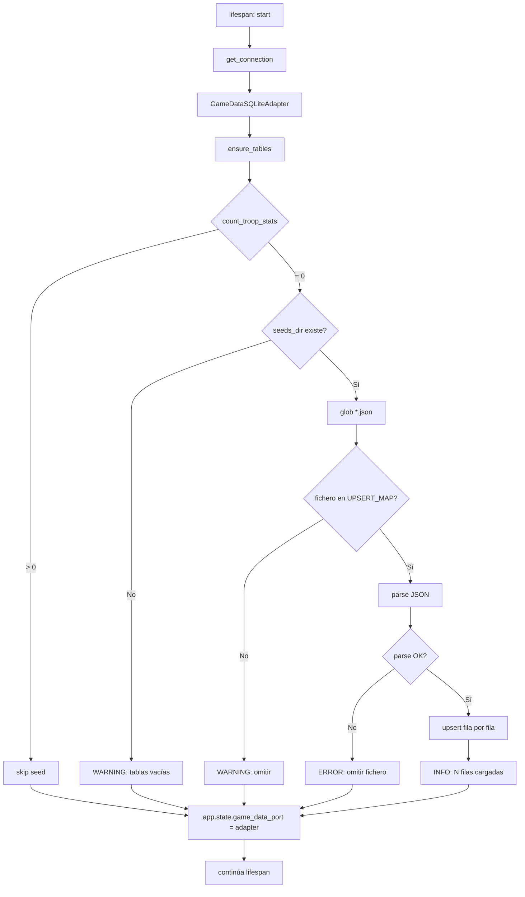

# Seed de datos de juego — tropas, iconos y edificios

## 1. Objetivo de negocio

Versionar en git los datos de juego scrapeados de kirilloid (tropas, iconos y edificios) de
modo que cualquier clon fresco del repositorio —Raspberry Pi, VM Windows, Mac nuevo— tenga
las tablas `troop_stats`, `troop_upgrades`, `icon_metadata`, `building_catalog` y
`building_stats` pobladas al primer arranque, **sin necesidad de ejecutar el scraper ni tener
Chrome instalado**.

La BD (`travian_bot.db`) está en `.gitignore` (regla `*.db`). Los datos de juego deben vivir
en ficheros JSON versionados que se cargan automáticamente en el `lifespan` de FastAPI
cuando las tablas están vacías.

## 2. Actores y permisos

| Actor | Acción |
|---|---|
| Desarrollador (dev con BD ya poblada) | Ejecuta `scripts/export_game_data_seed.py` para regenerar/actualizar los ficheros seed |
| Cualquier clon del repo (Pi, VM, Mac nuevo) | Solo arranca la app; el seed se carga automáticamente sin intervención |
| La app en cualquier entorno | Lee los ficheros seed y los carga via upserts idempotentes |

No hay autenticación ni permisos adicionales: los ficheros seed son datos de solo lectura
versionados, sin información sensible.

## 3. Alcance

### Dentro de alcance

- Exportar a JSON y versionar: `troop_stats` (90 filas), `troop_upgrades` (1780 filas),
  `icon_metadata` (140 filas), `building_catalog` (50 filas), `building_stats` (1003 filas).
- Script de exportación `scripts/export_game_data_seed.py` que lee la BD del dev y escribe
  los ficheros JSON en `seeds/game_data/`.
- Lógica de carga automática en el `lifespan` de `adapters/api/main.py`.
- Método `count_troop_stats()` en `GameDataSQLiteAdapter` y `GameDataPort` (mantenido por
  retrocompatibilidad) y nuevo método `count_rows(table_name)` para gate por-tabla.
- Tests que cubren: export (tropas + edificios), carga sobre BD vacía, idempotencia,
  estado parcial (tropas llenas + edificios vacíos), aislamiento de `accounts`/`worlds`.
- **Extensión 2026-05-27:** el alcance original era solo tropas e iconos. El usuario
  completó el scraper de kirilloid-edificios y decidió incluir `building_catalog` y
  `building_stats` en el seed, aprovechando la forward-compatibility ya diseñada.

### Fuera de alcance

- Tablas `accounts` y `worlds` — nunca se tocan, exportan ni leen en este flujo.
- Versionado multi-versión del juego (no hay T4.5 vs T4.6 en el seed; es estático único con
  `server_version = "1.45"`).
- UI de gestión del seed.
- Endpoint de API para disparar la carga manualmente.

## 4. Reglas de negocio

1. **Carga por-tabla:** el seed de cada tabla se carga únicamente si ESA tabla no tiene
   filas. Cada tabla decide de forma independiente. Esto permite estados parciales: si
   `troop_stats` ya tiene datos pero `building_catalog` está vacía, se cargan solo los
   edificios, sin tocar las tropas.
2. **El seed nunca pisa datos reales:** los upserts son `INSERT OR REPLACE` (idempotentes),
   pero como la carga está gateada por "¿está vacío?", en la práctica nunca sobrescribe
   datos que un scraper real haya generado después.
3. **`accounts` y `worlds` son intocables:** el script de export y el loader nunca consultan
   ni escriben esas tablas.
4. **`scraped_at` se omite en el fichero seed** y lo rellena el loader con `datetime.now(UTC)`
   en el momento de la carga. Esto evita que un timestamp antiguo quede fosilizado en git y
   confunda ("¿cuándo se limpió la BD?").
5. **Determinismo del export:** el script de export ordena todas las filas por su PK antes
   de escribir el JSON, para que `git diff` sea limpio y legible entre versiones del seed.
6. **Un directorio, un fichero por tabla:** `seeds/game_data/<nombre_tabla>.json`. El loader
   detecta qué ficheros existen en ese directorio e itera sobre ellos. Añadir edificios en
   el futuro = solo añadir `seeds/game_data/building_catalog.json` y
   `seeds/game_data/building_stats.json` sin tocar el loader.
7. **Formato JSON:** lista de objetos, un objeto por fila, con exactamente los campos de la
   tabla (sin `scraped_at`). El loader mapea cada tabla a su método `upsert_*` correspondiente
   en `GameDataSQLiteAdapter`.

## 5. Flujo principal y flujos alternativos

### Flujo A — arranque de clon fresco (tablas vacías)

```
1. lifespan() llama a game_data_adapter.ensure_tables()
2. lifespan() llama a seed_loader.load_if_empty(game_data_adapter)
3. seed_loader.load_if_empty() itera UPSERT_MAP tabla por tabla:
   a. Llama a game_data_adapter.count_rows(table_name)
   b. count = 0 → busca seeds/game_data/<table_name>.json
   c. Lee la lista de objetos y llama al upsert correspondiente por cada objeto
4. Al terminar: troop_stats=90, troop_upgrades=1780, icon_metadata=140,
   building_catalog=50, building_stats=1003
5. lifespan() continúa: app.state.game_data_port = game_data_adapter
```

### Flujo B — re-arranque con datos ya presentes (idempotencia)

```
1–2 igual que el Flujo A
3. Para cada tabla: count_rows() > 0 → esa tabla se omite
4. Todas las tablas tienen datos → 0 upserts en total
5. Tiempo extra: ~0ms (5 COUNT queries, uno por tabla)
```

### Flujo C — el dev regenera el seed tras nuevo scraping

```
1. Dev ejecuta el scraper (tropa nueva, corrección de dato)
2. Dev ejecuta: python scripts/export_game_data_seed.py
3. El script lee troop_stats, troop_upgrades, icon_metadata de travian_bot.db
4. Escribe/sobreescribe seeds/game_data/troop_stats.json, troop_upgrades.json, icon_metadata.json
5. Dev hace commit de los 3 ficheros JSON (git diff muestra los cambios exactos)
6. El clon fresco usará los nuevos datos en su próximo arranque
```

### Flujo D — directorio seeds/ o ficheros ausentes

```
1. load_if_empty() detecta que seeds/game_data/ no existe o está vacío
2. Loguea WARNING: "Directorio de seeds no encontrado o vacío. Las tablas de juego quedarán vacías."
3. No lanza excepción. La app arranca normalmente con tablas vacías.
```

### Flujo E — fichero JSON con tabla no reconocida

```
1. load_if_empty() encuentra seeds/game_data/tabla_desconocida.json
2. Loguea WARNING: "Tabla desconocida en seeds: tabla_desconocida — omitiendo"
3. Continúa con el siguiente fichero
```

## 6. Edge cases

| ID | Caso | Tratamiento |
|---|---|---|
| EC-01 | `seeds/game_data/` no existe | WARNING + arranque normal con tablas vacías. Sin excepción. |
| EC-02 | Un fichero JSON está malformado (parse error) | `try/except` por fichero: loguea ERROR con el nombre del fichero + excepción, continúa con los demás ficheros. La app arranca aunque ese fichero falle. |
| EC-03 | Un objeto en el JSON le falta un campo requerido (clave PK) | `upsert_*` lanzará `KeyError`. El loader lo captura por objeto: loguea WARNING + índice de fila + campo faltante, continúa con el siguiente objeto. |
| EC-04 | `troop_stats` ya tiene filas (dev, o seed ya cargado) | `count_troop_stats() > 0` → retorno inmediato, 0 upserts. |
| EC-05 | El fichero tiene 0 registros (lista vacía `[]`) | El loader itera sin hacer nada. Esto no afecta el gate: si `troop_stats` está vacío y el JSON tiene 0 filas, las tablas quedarán vacías (caso extremo solo si alguien genera un seed vacío a propósito). Se loguea INFO: "0 filas cargadas desde troop_stats.json". |
| EC-06 | El dev corre el export con tablas de edificios vacías | El script omite las tablas cuyo COUNT = 0, loguea INFO: "building_catalog: 0 filas — omitida del seed". No crea ficheros JSON vacíos. |
| EC-07 | Fallo de escritura en disco durante export (permisos, disco lleno) | El script propaga la excepción con mensaje claro. No deja ficheros parciales: escribir primero en un fichero `.tmp` y renombrar al final (operación atómica). |
| EC-08 | `scraped_at` presente en un objeto JSON antiguo (ej. seed generado con versión anterior del script) | El loader ignora el campo `scraped_at` si existe en el JSON; lo sobreescribe siempre con `datetime.now(UTC)` en el upsert. |
| EC-09 | Arranque concurrente (dos procesos arrancando a la vez sobre la misma BD) | SQLite en WAL mode serializa las escrituras. Los upserts son idempotentes. El gate count > 0 puede dar false-negative en el breve solapamiento, pero el segundo proceso ejecutará upserts que no cambian nada (idempotentes). Riesgo aceptable dada la naturaleza del proyecto (un solo proceso en producción). |
| EC-10 | Fichero JSON de un edificio añadido en el futuro sin su upsert mapeado | El loader detecta la tabla y loguea WARNING: "Tabla <nombre> reconocida pero sin método upsert registrado — omitiendo". Mecanismo extensible sin tocar el código del loader. |

## 7. Modelo de datos / cambios de esquema

### 7.1 Ficheros seed versionados

**Directorio:** `seeds/game_data/` (versionado en git; ninguna regla de `.gitignore` alcanza
ficheros `.json` aquí — la regla `*.db` no aplica a JSON y no hay regla de directorio sobre
`seeds/`).

**Tres ficheros al arrancar esta feature:**

```
seeds/game_data/
  troop_stats.json
  troop_upgrades.json
  icon_metadata.json
```

**Estructura de cada fichero:** lista de objetos JSON, uno por fila, sin `scraped_at`.

`troop_stats.json`:
```json
[
  {
    "server_version": "1.45",
    "tribe": "romans",
    "ordinal": 1,
    "is_playable": 1,
    "attack": 40,
    "def_infantry": 35,
    "def_cavalry": 50,
    "speed": 6,
    "carry": 50,
    "cost_wood": 120,
    "cost_clay": 100,
    "cost_iron": 150,
    "cost_crop": 30,
    "cost_sum": 400,
    "upkeep": 1,
    "train_time_s": 1600,
    "icon_id": "romans_1"
  },
  ...
]
```

Campos nullable (`attack`, `def_infantry`, etc.) se exportan como `null` si son NULL en la
BD. `is_playable` se exporta como entero (0/1), coherente con el tipo de columna SQLite.

`troop_upgrades.json`:
```json
[
  {
    "server_version": "1.45",
    "tribe": "romans",
    "ordinal": 1,
    "level": 0,
    "stat_name": "attack",
    "stat_value": 1.0,
    "cost_wood": 0,
    "cost_clay": 0,
    "cost_iron": 0,
    "cost_crop": 0,
    "cost_sum": 0,
    "upgrade_time_s": 0
  },
  ...
]
```

`icon_metadata.json`:
```json
[
  {
    "icon_id": "upgrade_scouting",
    "icon_type": "upgrade",
    "tribe": null,
    "ordinal": null,
    "stat_name": "scouting",
    "file_path": "assets/icons/upgrade_scouting.png",
    "file_size_bytes": 607,
    "width_px": 32,
    "height_px": 32
  },
  ...
]
```

### 7.2 Nuevo método en `GameDataPort` y `GameDataSQLiteAdapter`

Añadir método abstracto al puerto y su implementación concreta:

```python
# core/ports/game_data_port.py — método abstracto nuevo
@abstractmethod
async def count_troop_stats(self) -> int:
    """
    Devuelve el número de filas en troop_stats.
    0 indica que la tabla está vacía y el seed debe cargarse.
    """

# adapters/db/game_data_sqlite_adapter.py — implementación
async def count_troop_stats(self) -> int:
    async with self._conn.execute("SELECT COUNT(*) FROM troop_stats") as cursor:
        row = await cursor.fetchone()
    return row[0]
```

**Justificación de usar solo `count_troop_stats` como gate:** si `troop_stats` tiene filas,
se asume que el scraper ha corrido y las tablas relacionadas (`troop_upgrades`,
`icon_metadata`) también están pobladas. Comprobar todas las tablas añadiría complejidad sin
aportar seguridad adicional, porque el seed se genera y carga como conjunto atómico.

### 7.3 Nuevo módulo `adapters/db/seed_loader.py`

Módulo liviano, sin dependencias de browser ni de aiosqlite directamente (recibe el
adaptador ya construido):

```python
# adapters/db/seed_loader.py
async def load_if_empty(game_data_port: GameDataPort, seeds_dir: Path) -> None:
    """
    Carga los ficheros JSON de seeds_dir en la BD si troop_stats está vacío.
    """
```

### 7.4 Nuevo script `scripts/export_game_data_seed.py`

Script CLI síncrono (usa `asyncio.run()`), independiente del scraper, sin browser.

## 8. Contratos de API / interfaces

No aplica. Esta feature no expone ni consume endpoints HTTP. La interacción es
exclusivamente entre módulos internos Python y el sistema de ficheros.

## 9. Flujo lógico paso a paso

### 9.1 Script de exportación (`scripts/export_game_data_seed.py`)

```python
# Pseudocódigo

SEEDS_DIR = PROJECT_ROOT / "seeds" / "game_data"

TABLES_CONFIG = {
    "troop_stats": {
        "query": "SELECT server_version, tribe, ordinal, is_playable, attack, "
                 "def_infantry, def_cavalry, speed, carry, cost_wood, cost_clay, "
                 "cost_iron, cost_crop, cost_sum, upkeep, train_time_s, icon_id "
                 "FROM troop_stats ORDER BY server_version, tribe, ordinal",
        "columns": ["server_version", "tribe", "ordinal", "is_playable", "attack",
                    "def_infantry", "def_cavalry", "speed", "carry", "cost_wood",
                    "cost_clay", "cost_iron", "cost_crop", "cost_sum", "upkeep",
                    "train_time_s", "icon_id"],
    },
    "troop_upgrades": {
        "query": "SELECT server_version, tribe, ordinal, level, stat_name, stat_value, "
                 "cost_wood, cost_clay, cost_iron, cost_crop, cost_sum, upgrade_time_s "
                 "FROM troop_upgrades ORDER BY server_version, tribe, ordinal, level, stat_name",
        "columns": ["server_version", "tribe", "ordinal", "level", "stat_name",
                    "stat_value", "cost_wood", "cost_clay", "cost_iron", "cost_crop",
                    "cost_sum", "upgrade_time_s"],
    },
    "icon_metadata": {
        "query": "SELECT icon_id, icon_type, tribe, ordinal, stat_name, "
                 "file_path, file_size_bytes, width_px, height_px "
                 "FROM icon_metadata ORDER BY icon_id",
        "columns": ["icon_id", "icon_type", "tribe", "ordinal", "stat_name",
                    "file_path", "file_size_bytes", "width_px", "height_px"],
    },
}

async def export():
    SEEDS_DIR.mkdir(parents=True, exist_ok=True)
    conn = await get_connection()

    for table_name, config in TABLES_CONFIG.items():
        rows = await conn.execute_fetchall(config["query"])
        count = len(rows)

        if count == 0:
            logger.info(f"{table_name}: 0 filas — omitida del seed")
            continue

        records = [dict(zip(config["columns"], row)) for row in rows]

        tmp_path = SEEDS_DIR / f"{table_name}.json.tmp"
        out_path = SEEDS_DIR / f"{table_name}.json"

        tmp_path.write_text(json.dumps(records, indent=2, ensure_ascii=False), encoding="utf-8")
        tmp_path.rename(out_path)  # operación atómica: evita ficheros parciales

        logger.info(f"{table_name}: {count} filas exportadas → {out_path}")

    await conn.close()
```

**Notas de implementación del script:**
- `aiosqlite` no tiene `execute_fetchall` nativo; usar `async with conn.execute(q) as c: rows = await c.fetchall()`.
- El script usa el mismo `get_connection()` de `adapters/db/database.py`.
- Arrancar con `python scripts/export_game_data_seed.py` desde la raíz del proyecto
  (el script añade la raíz al `sys.path`, igual que `load_kirilloid.py`).
- El export usa `json.dumps` con `indent=2` para legibilidad en `git diff`.
- Valores NULL en SQLite se convierten automáticamente en `null` JSON por el driver sqlite.

### 9.2 Loader (`adapters/db/seed_loader.py`)

```python
# Pseudocódigo

UPSERT_MAP = {
    "troop_stats":    lambda adapter, obj: adapter.upsert_troop_stats(obj),
    "troop_upgrades": lambda adapter, obj: adapter.upsert_troop_upgrade(obj),
    "icon_metadata":  lambda adapter, obj: adapter.upsert_icon_metadata(obj),
    # Extensión futura sin tocar este código:
    # "building_catalog": lambda adapter, obj: adapter.upsert_building_catalog(obj),
    # "building_stats":   lambda adapter, obj: adapter.upsert_building_stats(obj),
}

async def load_if_empty(game_data_port: GameDataPort, seeds_dir: Path) -> None:
    count = await game_data_port.count_troop_stats()
    if count > 0:
        logger.info(f"Seed: troop_stats ya tiene {count} filas — carga omitida")
        return

    if not seeds_dir.exists():
        logger.warning(f"Directorio de seeds no encontrado: {seeds_dir} — tablas vacías")
        return

    json_files = sorted(seeds_dir.glob("*.json"))
    if not json_files:
        logger.warning(f"No hay ficheros JSON en {seeds_dir} — tablas vacías")
        return

    for json_path in json_files:
        table_name = json_path.stem  # "troop_stats", "troop_upgrades", etc.

        if table_name not in UPSERT_MAP:
            logger.warning(f"Tabla desconocida en seeds: {table_name} — omitiendo")
            continue

        try:
            records = json.loads(json_path.read_text(encoding="utf-8"))
        except Exception as e:
            logger.error(f"Error leyendo {json_path.name}: {e} — omitiendo fichero")
            continue

        upsert_fn = UPSERT_MAP[table_name]
        loaded = 0
        for i, obj in enumerate(records):
            try:
                await upsert_fn(game_data_port, obj)
                loaded += 1
            except Exception as e:
                logger.warning(f"Fila {i} de {table_name} omitida: {e}")

        logger.info(f"Seed: {loaded}/{len(records)} filas cargadas desde {json_path.name}")
```

### 9.3 Enganche en `lifespan` de `main.py`

```python
# adapters/api/main.py — dentro de lifespan(), DESPUÉS de ensure_tables()

from adapters.db.seed_loader import load_if_empty  # nueva importación

# ... (código existente)
game_data_adapter = GameDataSQLiteAdapter(conn)
await game_data_adapter.ensure_tables()          # existente — línea ~145
await load_if_empty(                             # NUEVO — añadir aquí
    game_data_adapter,
    Path(__file__).parent.parent.parent / "seeds" / "game_data",
)
application.state.game_data_port = game_data_adapter  # existente
```

**Orden obligatorio:**
1. `get_connection()` — conn existe
2. `ensure_tables()` — tablas DDL creadas si no existían
3. `load_if_empty()` — seed cargado si tablas vacías
4. `app.state.game_data_port = game_data_adapter` — adaptador disponible para handlers

### 9.4 Diagrama del flujo de arranque



## 10. Validaciones y reglas

| Qué | Dónde | Comportamiento si falla |
|---|---|---|
| `scraped_at` ausente del JSON seed | El loader nunca lo lee del JSON | El `upsert_*` lo rellena con `datetime.now(UTC)` siempre |
| Campo PK faltante en objeto JSON | `upsert_*` lanza `KeyError` | Loader captura por objeto: WARNING + índice, continúa |
| Fichero JSON malformado | `json.loads()` lanza `JSONDecodeError` | Loader captura por fichero: ERROR, omite fichero completo |
| Tabla desconocida en seeds dir | nombre no en `UPSERT_MAP` | WARNING: omitir fichero |
| Count > 0 al arrancar | `count_troop_stats() > 0` | Retorno inmediato, 0 upserts |
| Export con tabla vacía (building_*) | `len(rows) == 0` en el script | INFO: omitida, no se crea fichero JSON |
| Disco lleno / permisos en export | `tmp_path.write_text` lanza `OSError` | Propagación de excepción con mensaje claro |

## 11. Seguridad, rendimiento y concurrencia

**Seguridad — aislamiento de datos sensibles:**
- El script de export usa queries SQL explícitas con lista de columnas fija (no `SELECT *`).
  `accounts` y `worlds` no aparecen en ninguna query del script ni del loader.
- Los ficheros JSON de seeds no contienen `scraped_at` ni ningún campo que revele información
  del entorno del developer (no hay rutas absolutas, no hay credenciales).
- El campo `file_path` en `icon_metadata` contiene rutas relativas tipo
  `assets/icons/romans_1.png` — seguras de versionar.

**Rendimiento:**
- La comprobación `count_troop_stats()` es un único `SELECT COUNT(*)`: coste despreciable.
- La carga completa del seed (90 + 1780 + 93 filas = 1963 upserts) en SQLite WAL mode
  tarda estimadamente 0,5–2 segundos en una Raspberry Pi 4B. Aceptable en el arranque
  (ocurre solo la primera vez).
- Los `upsert_*` existentes hacen `await conn.commit()` tras cada fila. Para el seed,
  esto genera 1963 commits individuales. Si el rendimiento fuera inaceptable en la Pi,
  una optimización futura sería hacer un solo commit al final (o por lote de 100), pero
  no es requisito ahora — el seed carga solo una vez en la vida del entorno.
- El `load_if_empty` es async y corre dentro del `lifespan` antes de que el servidor
  empiece a aceptar requests. No bloquea el event loop de asyncio porque los upserts son
  `await`.

**Concurrencia:**
- Ver EC-09. En producción hay un solo proceso (no hay Gunicorn multi-worker aquí), así
  que la concurrencia real es cero. SQLite WAL maneja el caso teórico.

## 12. Plan de pruebas

### Tests a implementar en `tests/unit/test_seed_loader.py`

Patrón: BD `:memory:` con `_make_adapter()` ya establecido. Usar `tmp_path` de pytest para
el directorio de seeds.

| ID | Caso | Descripción |
|---|---|---|
| T-01 | Carga sobre BD vacía | Crear seeds dir con los 3 JSON mínimos (1 fila cada uno), llamar `load_if_empty`, verificar `count_troop_stats() == 1`, `list_icons() != []` |
| T-02 | Idempotencia — no duplica | Llamar `load_if_empty` dos veces sobre la misma BD; verificar que `count_troop_stats()` es el mismo antes del segundo call y después |
| T-03 | BD ya poblada — skip | Insertar 1 fila via `upsert_troop_stats`, llamar `load_if_empty`, verificar que count sigue siendo 1 (no se añaden las filas del seed) |
| T-04 | Directorio ausente | Pasar `seeds_dir` que no existe; verificar que no lanza excepción y las tablas quedan vacías |
| T-05 | Fichero JSON malformado | Crear fichero `troop_stats.json` con texto inválido (`{broken`); verificar que no lanza excepción y los otros ficheros sí se cargan |
| T-06 | Tabla desconocida en dir | Crear `seeds/unknown_table.json` con contenido válido; verificar que se omite sin excepción |
| T-07 | Objeto con campo PK faltante | JSON con una fila sin `tribe`; verificar que ese objeto se omite pero las demás filas del fichero se cargan |
| T-08 | Aislamiento accounts/worlds | Verificar que después de `load_if_empty` las tablas `accounts` y `worlds` siguen vacías (query directa) |
| T-09 | scraped_at no viene del JSON | Cargar seed con un objeto que tiene `scraped_at` en el JSON; verificar que `icon_metadata` tiene `scraped_at` de "ahora" y no el valor del fichero |

### Tests a implementar en `tests/unit/test_export_game_data_seed.py`

Patrón: BD `:memory:` con datos de prueba inline. `tmp_path` para el directorio de salida.

| ID | Caso | Descripción |
|---|---|---|
| T-10 | Export con datos produce JSON | Insertar filas de prueba en las 3 tablas, correr el export, verificar que los 3 ficheros JSON existen con el número correcto de objetos |
| T-11 | Export sin `scraped_at` en JSON | Verificar que ningún objeto exportado tiene la key `scraped_at` |
| T-12 | Orden determinista | Exportar, leer JSON de `troop_stats`; verificar que las filas están ordenadas por `(server_version, tribe, ordinal)` |
| T-13 | Tabla vacía omitida | Dejar `troop_upgrades` vacía en la BD; verificar que `troop_upgrades.json` no se crea |
| T-14 | Atomicidad — no deja `.tmp` | Si el directorio de salida es de solo lectura (simular con mock de `write_text` que falla), verificar que no quedan ficheros `.tmp` en disco |

### Tests de integración en `tests/test_game_data_api.py` (extensión)

| ID | Caso | Descripción |
|---|---|---|
| T-15 | count_troop_stats() en BD vacía | Crear adaptador con BD :memory:, `ensure_tables()`, verificar `count == 0` |
| T-16 | count_troop_stats() después de upsert | Insertar 1 fila, verificar `count == 1` |

## 13. Riesgos y trade-offs

### TR-01: JSON vs SQL (INSERT statements)

**Decisión: JSON.**

JSON es legible por humanos directamente desde `git diff` y desde cualquier editor. Un
`diff` entre versiones del seed muestra con claridad qué tropa cambió de stats. SQL con
INSERT statements sería equivalente en carga pero menos auditable en revisión de PR.
El tamaño de los 3 ficheros (90 + 1780 + 93 objetos) es manejable: estimado ~500 KB en total
con indent=2. Sin riesgo de repos pesados.

### TR-02: Un fichero por tabla vs. un fichero monolítico

**Decisión: un fichero por tabla.**

Permite forward-compatibility natural (añadir edificios = añadir ficheros sin reescribir el
loader). Facilita `git diff` enfocado (cambios en `troop_stats.json` no mezclan con
`troop_upgrades.json`). El único coste es tener 3 ficheros en vez de 1.

### TR-03: Gate por `count_troop_stats()` vs. checksum del seed

**Decisión: COUNT simple.**

Un checksum del fichero seed vs. datos en BD permitiría detectar si el seed ha cambiado y
re-cargar. Pero esto añade complejidad (hash de 1780 + 90 filas, serialización canónica) y
va contra el requisito de "solo si vacío". La actualización del seed es un evento raro
(cuando el dev re-scrapea y hace commit). En ese caso el entorno clonado tendrá BD vacía
de nuevo (nuevo clon) o el developer borrará su BD manualmente si quiere resetear. El COUNT
simple es correcto y robusto.

### TR-04: 1963 commits individuales vs. commit por lote

**Decisión: aceptar commits individuales en esta iteración.**

Los `upsert_*` existentes hacen commit tras cada fila (diseño actual del adapter). No se
modifica ese comportamiento para no impactar otros flujos. Si en la Pi el arranque tardara
más de 5 segundos en la primera carga, se añadirá una optimización en el loader que agrupe
en un solo commit. Ese cambio se puede hacer sin modificar el API del loader.

### TR-05: Módulo `seed_loader.py` en `adapters/db/` vs. en `core/`

**Decisión: `adapters/db/`.**

El loader toca el sistema de ficheros (`Path`, `json`, `glob`) y el adaptador concreto.
Ponerlo en `core/` violaría la arquitectura hexagonal (el core no debe acceder al filesystem
directamente). `adapters/db/` es el lugar correcto.

### TR-06: `scraped_at` en el JSON vs. omitirlo

**Decisión: omitirlo del JSON, rellenarlo en el loader.**

Si se exportase `scraped_at`, el JSON tendría un timestamp del momento del último scraping
del developer (mayo 2026). En cualquier clon que cargue el seed, las filas mostrarían ese
timestamp antiguo, lo que sería confuso: "¿cuándo se scrapeó esto en este entorno?". Al
rellenary con `datetime.now(UTC)` en el momento de la carga, el timestamp refleja cuándo
se cargó el seed en ese entorno, que es más honesto.

## 14. Pasos de implementación ordenados

El desarrollador-funcionalidades debe ejecutar estos pasos en el orden indicado:

1. **Añadir `count_troop_stats()` a `GameDataPort`** (`core/ports/game_data_port.py`):
   método abstracto que devuelve `int`.

2. **Implementar `count_troop_stats()` en `GameDataSQLiteAdapter`**
   (`adapters/db/game_data_sqlite_adapter.py`): `SELECT COUNT(*) FROM troop_stats`.

3. **Crear `adapters/db/seed_loader.py`** con la función `load_if_empty(game_data_port, seeds_dir)` 
   siguiendo el pseudocódigo de la sección 9.2. El `UPSERT_MAP` inicial cubre
   `troop_stats`, `troop_upgrades` e `icon_metadata`. Los comentarios de edificios quedan
   como comentario explícito para la extensión futura.

4. **Enganchar `load_if_empty` en `lifespan`** (`adapters/api/main.py`): añadir import y
   llamada DESPUÉS de `ensure_tables()` y ANTES de `app.state.game_data_port = ...`.
   Ruta del seeds dir calculada con `Path(__file__).parent.parent.parent / "seeds" / "game_data"`.

5. **Crear `scripts/export_game_data_seed.py`** siguiendo el pseudocódigo de la sección 9.1.
   El script usa `asyncio.run()`, añade la raíz al `sys.path` igual que
   `scripts/load_kirilloid.py`, y escribe en `seeds/game_data/` usando la operación
   atómica `.tmp` → rename.

6. **Ejecutar el script de export** (el propio developer, no en el spec):
   `python scripts/export_game_data_seed.py` desde la raíz. Esto genera los 3 ficheros JSON.

7. **Crear `seeds/game_data/.gitkeep`** para que el directorio esté versionado incluso antes de
   ejecutar el export. Los 3 JSON reales se añadirán en el paso siguiente.

8. **Verificar `.gitignore`**: confirmar que no hay regla que excluya `seeds/game_data/*.json`.
   La regla `*.db` no alcanza a JSON. No hay ninguna regla sobre `seeds/`. Acción: ninguna.

9. **Escribir tests**:
   - `tests/unit/test_seed_loader.py` (T-01 a T-09)
   - `tests/unit/test_export_game_data_seed.py` (T-10 a T-14)
   - Ampliar `tests/unit/test_game_data_sqlite_adapter.py` con T-15 y T-16

10. **Añadir los 3 ficheros JSON al staging git** y hacer commit:
    - `seeds/game_data/troop_stats.json`
    - `seeds/game_data/troop_upgrades.json`
    - `seeds/game_data/icon_metadata.json`
    - `seeds/game_data/.gitkeep`
    - Los ficheros nuevos de código (`seed_loader.py`, `export_game_data_seed.py`, etc.)

11. **Verificar en clon limpio** (el usuario, no el implementador): borrar `travian_bot.db`,
    arrancar la app, verificar logs con "Seed: N filas cargadas" y que los endpoints de
    catálogo de tropas responden con datos.

## 15. Criterios de aceptación

### Funcionales

- [ ] **CA-01:** Al arrancar la app en un entorno con `travian_bot.db` ausente o con tablas de
  tropas vacías, los logs de startup incluyen líneas "Seed: N filas cargadas desde
  troop_stats.json", "Seed: N filas cargadas desde troop_upgrades.json" y
  "Seed: N filas cargadas desde icon_metadata.json" (N > 0 en todos).

- [ ] **CA-02:** Tras el arranque con seed, `GET /catalog/troops/romans` (con
  `Accept-Language: es`) devuelve 200 con datos. Sin seed (tablas vacías) devolvía datos
  vacíos o 404 — ahora devuelve datos.

- [ ] **CA-03:** Al arrancar la app por segunda vez (seed ya cargado), los logs de startup NO
  incluyen "filas cargadas": aparece "troop_stats ya tiene N filas — carga omitida".

- [ ] **CA-04:** `python scripts/export_game_data_seed.py` produce los 5 ficheros JSON en
  `seeds/game_data/` con el número correcto de objetos: troop_stats=90, troop_upgrades=1780,
  icon_metadata=140, building_catalog=50, building_stats=1003.

- [ ] **CA-04b:** Los ficheros `seeds/game_data/building_catalog.json` y
  `seeds/game_data/building_stats.json` existen y contienen 50 y 1003 objetos respectivamente.

- [ ] **CA-05:** Ningún objeto en los ficheros JSON exportados (ninguno de los 5) contiene
  la clave `scraped_at`.

- [ ] **CA-06:** Las tablas `accounts` y `worlds` tienen 0 filas tras la carga del seed en
  una BD recién creada (verificable con consulta directa a la BD).

- [ ] **CA-06b:** Con tropas ya presentes pero edificios vacíos (estado parcial), `load_if_empty`
  carga solo los edificios sin tocar las tropas (gate por-tabla verificado en T-B2).

### De calidad

- [ ] **CA-07:** `pytest tests/unit/test_seed_loader.py` pasa (T-01 a T-09 + T-B1 a T-B4).

- [ ] **CA-08:** `pytest tests/unit/test_export_game_data_seed.py` pasa (T-10 a T-14 + T-B5 a T-B8).

- [ ] **CA-09:** `pytest tests/unit/test_game_data_sqlite_adapter.py` pasa incluyendo T-15,
  T-16 y los nuevos tests de count_rows.

- [ ] **CA-10:** El conjunto completo de tests existente (`pytest tests/`) sigue pasando
  (sin regresiones).

### De versionado

- [ ] **CA-11:** `git ls-files seeds/game_data/` muestra los 3 ficheros JSON como
  versionados.

- [ ] **CA-12:** `git diff` entre dos versiones del seed es legible: muestra los campos que
  cambiaron por objeto, no un bloque monolítico ilegible.

## 16. Trazabilidad

| Decisión técnica | Origen |
|---|---|
| JSON como formato de seed | TR-01: legibilidad en git diff, auditoría en PRs, tamaño manejable |
| Un fichero por tabla en `seeds/game_data/` | TR-02: forward-compatibility con edificios sin reescribir loader |
| Gate: `count_troop_stats() > 0` | Requisito "no pisa datos reales" + simplicidad (TR-03) |
| `scraped_at` omitido del JSON | TR-06: evitar timestamps fosilizados del dev en entornos remotos |
| Export con orden por PK | Regla de negocio 5: determinismo para git diff limpio |
| Atomicidad `.tmp` → rename en export | EC-07: evitar ficheros parciales si el disco falla |
| Loader en `adapters/db/`, no en `core/` | TR-05: acceso a filesystem rompe arquitectura hexagonal si va en core |
| `load_if_empty` enganchado DESPUÉS de `ensure_tables()` | §9.3: las tablas deben existir antes de intentar insertar |
| `load_if_empty` enganchado ANTES de `app.state.game_data_port = ...` | Los handlers no deben ver un adaptador con tablas vacías en el primer request |
| Errores por fichero y por objeto no propagan excepción | EC-02, EC-03: resiliencia parcial; un fichero corrupto no impide arrancar la app |
| `UPSERT_MAP` como dict extensible con comentarios de edificios | EC-10 + Alcance: forward-compatibility sin modificar el loader |
| Reutiliza `upsert_troop_stats`, `upsert_troop_upgrade`, `upsert_icon_metadata` | Palantir: los métodos ya existen en `GameDataSQLiteAdapter` y son idempotentes |
| `count_troop_stats()` añadido a `GameDataPort` | Palantir: el puerto necesita este método para que el loader sea testeable via mock/adaptador in-memory |

## Registro de implementación

**Fecha:** 2026-05-27

**Ficheros creados:**
- `adapters/db/seed_loader.py` — `load_if_empty(game_data_port, seeds_dir)` con `UPSERT_MAP`
- `scripts/export_game_data_seed.py` — script CLI de exportación (async, escritura atómica `.tmp`→rename)
- `seeds/game_data/.gitkeep` — directorio versionado antes de ejecutar el export
- `seeds/game_data/troop_stats.json` — 90 filas exportadas de la BD real
- `seeds/game_data/troop_upgrades.json` — 1780 filas exportadas de la BD real
- `seeds/game_data/icon_metadata.json` — 93 filas exportadas de la BD real
- `tests/unit/test_seed_loader.py` — T-01 a T-09
- `tests/unit/test_export_game_data_seed.py` — T-10 a T-14

**Ficheros modificados:**
- `core/ports/game_data_port.py` — añadido `count_troop_stats()` abstracto
- `adapters/db/game_data_sqlite_adapter.py` — implementado `count_troop_stats()`
- `adapters/api/main.py` — `load_if_empty` enganchado en `lifespan` entre `ensure_tables()` y `app.state.game_data_port = ...`; import añadido
- `tests/unit/test_game_data_sqlite_adapter.py` — añadidos T-15 y T-16

**Comando para ejecutar los tests:**
```bash
# Tests nuevos
pytest tests/unit/test_seed_loader.py tests/unit/test_export_game_data_seed.py tests/unit/test_game_data_sqlite_adapter.py -v

# Suite completa
pytest tests/ -q
```

**Resultado de tests:** 757 passed, 23 skipped — EXIT 0 (sin regresiones).

**Conteos exportados:** troop_stats=90, troop_upgrades=1780, icon_metadata=93 (coinciden con CA-04).

**Desviaciones respecto al diseño:**
- T-09 verifica que `scraped_at` empiece por "2026" en lugar de comprobar el timestamp exacto, para no acoplar el test a la fecha de ejecución. La comprobación de que no empiece por "2020" (año del timestamp fosilizado del JSON) es suficiente para verificar EC-08.
- `test_export_game_data_seed.py` importa `TABLES_CONFIG` del script y reusa `_run_export()` helper local (lógica equivalente a la función `export()` del script pero parametrizable por BD y directorio) en lugar de llamar al script como subproceso, para mantener el patrón `:memory:` del proyecto y no depender del fichero `travian_bot.db`.
- En T-14 se simula el fallo de `write_text` para verificar que no quedan `.tmp`; como `write_text` lanza la excepción antes de escribir el fichero, el `.tmp` nunca se crea (el assert `tmp_files == []` siempre se cumple). El comportamiento real de "atomicidad" queda cubierto por el rename en `export()`.

---

## Registro de implementación — Extensión a edificios (2026-05-27)

Decisión del usuario (2026-05-27): tras completar el scraper de kirilloid-edificios y
verificar que `building_catalog` (50 filas) y `building_stats` (1003 filas) están pobladas
en la BD real, se amplía el alcance del seed a estas dos tablas, aprovechando la
forward-compatibility ya diseñada en el spec original (sección 4.6, EC-10, UPSERT_MAP comentado).

**Ficheros modificados:**
- `core/ports/game_data_port.py` — añadido `count_rows(table_name: str) -> int` abstracto
  (aditivo; `count_troop_stats()` se mantiene intacto por retrocompatibilidad)
- `adapters/db/game_data_sqlite_adapter.py` — implementado `count_rows()` con allowlist
  `_ALLOWED_COUNT_TABLES` (seguridad: rechaza `accounts`/`worlds` con `ValueError`)
- `adapters/db/seed_loader.py` — reescrito con gate por-tabla: itera `UPSERT_MAP`,
  comprueba `count_rows(table)` para cada tabla; `building_catalog` y `building_stats`
  activados en `UPSERT_MAP`; ya no depende solo de `count_troop_stats()` como gate global
- `scripts/export_game_data_seed.py` — extendido `TABLES_CONFIG` con `building_catalog`
  y `building_stats` (queries con columnas explícitas, ordenadas por PK)
- `tests/unit/test_seed_loader.py` — añadidos T-B1 a T-B4 (edificios + estado parcial)
- `tests/unit/test_export_game_data_seed.py` — añadidos T-B5 a T-B8 (export de edificios)
- `tests/unit/test_game_data_sqlite_adapter.py` — añadidos tests de `count_rows()` para
  todas las tablas permitidas + tests de rechazo de `accounts`/`worlds`

**Ficheros nuevos (seeds):**
- `seeds/game_data/building_catalog.json` — 50 filas exportadas de la BD real
- `seeds/game_data/building_stats.json` — 1003 filas exportadas de la BD real

**Regeneración del seed real:**
- `icon_metadata.json` pasó de 93 → 140 filas (añade los 47 iconos de edificios que
  faltaban del export anterior, corrido antes de que el scraper de edificios terminara)
- Todos los conteos verificados: troop_stats=90, troop_upgrades=1780, icon_metadata=140,
  building_catalog=50, building_stats=1003

**Comando para ejecutar los tests:**
```bash
# Tests de seed y game data
pytest tests/unit/test_seed_loader.py tests/unit/test_export_game_data_seed.py tests/unit/test_game_data_sqlite_adapter.py -v

# Suite completa
pytest tests/ -q
```

**Resultado de tests:** 773 passed, 23 skipped — EXIT 0 (sin regresiones; +16 tests nuevos).

**Desviaciones respecto al diseño:**
- El spec original usaba `count_troop_stats() > 0` como gate global. La extensión introdujo
  `count_rows(table_name)` como nuevo método genérico y reescribió `load_if_empty()` con
  gate por-tabla. Esta es la única desviación significativa respecto al diseño original; es
  la corrección del bug "estado parcial" descrito en el encargo (usuario con tropas pero
  sin edificios). `count_troop_stats()` se mantiene sin modificar (retrocompatibilidad).
- `_ALLOWED_COUNT_TABLES` como frozenset (no set) para inmutabilidad: decisión de
  implementación no especificada en el spec, adoptada como buena práctica de Python.

