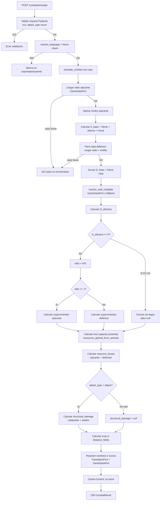

# Simulador y Optimizador de Combate Travian

> **Estado**: `draft` — pendiente de revalidación de contrato por `desarrollador-apis`. Razón: dos correcciones del usuario (2026-05-29) introducen cambios breaking en el response:
> 1. `loot.resources_gained_from_animals` pasa de `integer` a objeto `{wood, clay, iron, crop, total}`.
> 2. `attack_type` cambia su default de `"attack"` a `"raid"`.
>
> Historial: spec originalmente cerrado el 2026-05-28 con 5 correcciones de diseño + 6 correcciones textuales/de ejemplo (revisión v3). Contratos validados por `desarrollador-apis` (v1 + v2 + v3). Ver §17 para historial completo.

---

## 1. Objetivo de negocio

Proporcionar al usuario una herramienta de cálculo de resultados de combate (simulador) y de selección de tropas óptimas para atacar oasis (optimizador), usando la fórmula de combate real de Travian T4.5. El objetivo es que el usuario pueda predecir pérdidas antes de lanzar un ataque real, maximizando la eficiencia de los recursos ganados al matar animales y minimizando el riesgo de sorpresas.

No toca el browser ni la interacción con Travian. Es lógica pura de backend más endpoints REST.

---

## 2. Actores y permisos

| Actor | Descripción | Restricción |
|---|---|---|
| Usuario humano | Opera el bot y consulta la API desde el frontend | Sin autenticación adicional (igual que el resto de la API interna) |
| Frontend React | Llama a la API y muestra resultados | Debe enviar `Accept-Language` en todas las peticiones |
| Agente futuro (extensión) | Puede invocar el simulador de forma programática | Sin cambio de contrato |

No hay permisos por rol en este MVP. La API es interna al bot.

---

## 3. Alcance

### Dentro de alcance

- **Simulador de combate** (`POST /combat/simulate`): calcula resultado dado uno o más ejércitos atacantes y uno o más ejércitos defensores con sus modificadores. Cubre ataques a oasis y PvP.
- **Optimizador de ataque a oasis** (`POST /combat/optimize`): dado un conjunto de tipos de tropas o un conjunto acotado por aldea, calcula la combinación óptima según criterio multi-objetivo (maximizar recursos de animales, minimizar coste en recursos de bajas, minimizar tropas enviadas, considerar tiempo de marcha).
- Soporte de idioma vía `Accept-Language` y `?lang=` para nombres de tropas y resultado.
- Iconos de tropas: URL `/static/icons/{icon_id}.png` incluida en los resultados cuando el `icon_id` existe en BD.
- Fórmula real de Travian T4.5 con factor K derivado del tamaño total del campo (no es input — verificado contra kirilloid).
- Modificadores de smithy, ataque y bonus de héroe (puntos propios + porcentaje), bonus de alianza, nivel de muro (desde BD), stonemason, moral.
- Artefactos de velocidad y consumo de crop para el atacante; artefactos de durabilidad de edificios y cranny para el defensor — campos en el request para cálculos correctos de marcha y crop.
- **`attack_type`** (`"attack"` vs `"raid"`): distingue si catapultas y arietes actúan en modo asedio (daño estructural) o como tropa normal (saqueo).
- **Daño estructural** cuando `attack_type = "attack"`: catapultas destruyen niveles de edificios; arietes reducen nivel de muro. Se calcula con las fórmulas de la comunidad Travian (ver RN-13).
- **Botín potencial** (`loot`): capacidad de carga de supervivientes atacantes, potencial robado (si se conocen los recursos del objetivo) y recursos obtenidos de animales muertos (ver RN-07).
- **Coste en recursos de bajas** (`resource_losses`): coste de producción de las tropas perdidas por atacante y defensor (ver RN-09).
- **Drops de animales de naturaleza** (`resources_gained_from_animals`): recursos obtenidos al matar animales, según tabla confirmada por el usuario (ver RN-08).
- Múltiples ejércitos defensores: la defensa total es la suma de todos los defensores.
- Crop consumption del viaje (con velocidad de server como divisor opcional).

### Fuera de alcance (MVP)

- Integración en tiempo real con datos de overview del juego (input siempre manual en este MVP).
- Historial de simulaciones persistido en BD.
- **FA-08 — Cálculo inverso de botín** (fuera del MVP — segunda iteración del optimizador): dado recursos espiados de una aldea + tropas disponibles, calcular las mínimas tropas para maximizar saqueo. Ver FA-08 en §5.

---

## 4. Reglas de negocio

### RN-01 — Fórmula base de combate Travian T4.5

Fuente: kirilloid — `https://unofficialtravian.com/2025/01/game-secrets-combat-basics-written-by-kirilloid/`.

**Cálculo de fuerzas (igual para ATTACK y RAID)**:

```
# ATACANTE
A_base = Σ(ataque_efectivo_i × cantidad_i)  # ataque_efectivo aplica smithy
A = (A_base + hero_attack_points) × (1 + hero_attack_bonus_percent/100)
    × (1 + alliance_bonus/100)
    × morale_factor

# DEFENSOR (suma de todos los ejércitos defensores con proporción cav/inf del atacante)
D_base = Σ_defensores cantidad_j × [def_inf_j × (1 - ratio_cav) + def_cav_j × ratio_cav]
D = (D_base + hero_defense_points_total) × (1 + hero_defense_bonus_percent_avg/100)
    × wall_multiplier
    × stonemason_multiplier

ratio = A / D
```

**Factor K — Involved factor (kirilloid)**:

```
N = Σ cantidad_atacante + Σ cantidad_defensor   # total de tropas en el campo

K = 1.5                                  si N ≤ 1000
K = 2 × (1.8592 − N^0.015)               si N > 1000   (rango 1.2578..1.5)
```

K NO es input del usuario: se calcula en runtime desde N. Implementado en `core/use_cases/combat_engine.compute_k`.

**Cálculo de bajas según `attack_type`**:

```
ganador = bando con mayor fuerza        # si ratio >= 1 → atacante; si ratio < 1 → defensor
perdedor = el otro bando
x = (fuerza_perdedor / fuerza_ganador) ^ K
```

- **`attack_type = "attack"` (ataque normal)**:
  - `bajas_ganador% = x`        (porcentaje pequeño cuando la diferencia es grande)
  - `bajas_perdedor% = 100%`    (aniquilado por completo)

- **`attack_type = "raid"` (saqueo)**:
  - `bajas_ganador% = x / (1 + x)`     (capado siempre por debajo de 50%)
  - `bajas_perdedor% = 1 / (1 + x)`    (ambos bandos sobreviven proporcionalmente)
  - Total combinado = 100% repartido por la fuerza relativa.

```
supervivientes_i = round(cantidad_i × (1 − bajas_bando%))
```

El % de bajas es uniforme para todas las tropas del mismo bando (no por tipo).

**Regla de "mínimo 1 superviviente"**: solo el ganador la disfruta. Si todas sus tropas redondean a 0, se le concede 1 superviviente al tipo enviado en mayor cantidad. El perdedor en `attack` siempre queda a 0; en `raid` mantiene el remanente proporcional (que puede ser 0 cuando la diferencia es extrema).

**Nota sobre múltiples defensores**: `hero_defense_points_total` = suma de `hero_defense_points`. `hero_defense_bonus_percent_avg` = media simple de los bonus de cada defensor. El muro y stonemason aplican una sola vez sobre el D total.

### RN-02 — Modificador de smithy (herrería)

El nivel de mejora de smithy modifica los stats base de cada tropa según la tabla `troop_upgrades` de la BD:

```
stat_efectivo = stat_base × (1 + mejora_porcentual_nivel_smithy / 100)
```

- Atacante: aplica sobre `attack` de sus tropas.
- Defensor: aplica sobre `def_infantry` y `def_cavalry` de sus tropas.
- Si el nivel smithy es 0 o no se proporciona, no hay modificador (stat base sin cambio).
- Si la tropa no tiene tabla de upgrades en BD, se usa el stat base sin modificador + warning.
- El nivel máximo de smithy en Travian T4.5 es 20.

### RN-03 — Modificador de muro (desde BD)

El bonus de muro se obtiene de `GameDataPort` a partir del gid del edificio de muro de la tribu defensora y el nivel del muro. No se hardcodea el porcentaje: la tabla de edificios en BD (poblada por el scraper de kirilloid) ya contiene los valores reales de durabilidad por nivel.

```
wall_gid por tribu:
  romans   → gid = 40 (City Wall)
  teutons  → gid = 41 (Earth Wall)
  gauls    → gid = 42 (Palisade)
  egyptians → gid = 43 (Stone Wall)
  huns / spartans / vikings → consultar GameDataPort (gid varía)

bonus_muro_base = GameDataPort.get_building_defense_bonus(wall_gid, wall_level)
stonemason_multiplier = 1 + 0.05 × nivel_stonemason
wall_multiplier = (1 + bonus_muro_base) × stonemason_multiplier
```

**Fallback**: si `GameDataPort` no tiene datos del edificio de muro para esa tribu/nivel, usar `bonus_muro = nivel_muro × 0.03` como aproximación genérica + warning en `warnings[]`.

**Nota de implementación**: cuando el request del defensor incluye `wall_tribe`, el use case la usa para resolver el `wall_gid`. Si el defensor tiene múltiples formaciones de tribus distintas, el `wall_tribe` debe especificarse explícitamente en el request (no se puede inferir con fiabilidad). Si se omite, el fallback usa `0.03 × nivel` con warning.

### RN-04 — Modificador de moral (servidores speed)

```
moral = min(100, max(30, (población_atacante / población_defensor) × 100))
A_efectivo = A × (moral / 100)
```

- Moral se aplica SOLO en servidores speed (speed > x1). En servidores normales (speed=1) la moral no existe; si `morale` no se proporciona en el request, se asume 100 (sin efecto).
- Rango válido: 30–100 (por debajo de 30 Travian fuerza el suelo en 30).

### RN-05 — Composición mixta del ejército atacante

Cuando el ejército atacante contiene tanto infantería como caballería, el tipo efectivo de defensa que activa en el defensor es ponderado por la proporción de ataque efectivo:

```
A_inf = Σ(attack_efectivo_i × cantidad_i) para tropas de infantería
A_cav = Σ(attack_efectivo_i × cantidad_i) para tropas de caballería
proporción_cav = A_cav / (A_inf + A_cav)

D_efectiva_j = cantidad_j × (def_infantry_j × (1-proporción_cav) + def_cavalry_j × proporción_cav)
D_base = Σ_j D_efectiva_j
```

### RN-06 — Crop consumption del viaje

```
crop_por_hora = Σ(upkeep_i × cantidad_i) del ejército atacante
velocidad_efectiva = min_speed_del_ejército / server_speed × artifact_fast_troops
tiempo_viaje_h = distancia_campos / velocidad_efectiva
crop_total = round(crop_por_hora × tiempo_viaje_h × 2 × artifact_diet)
```

- `velocidad_min_del_ejército_atacante` = mínimo de `speed` de las tropas enviadas.
- `distancia_campos` es opcional en el request. Si no se proporciona, el campo `crop_consumption` en la respuesta es `null`.
- `artifact_fast_troops` (default 1.0): multiplicador de velocidad por artefacto. Divide el tiempo de marcha (velocidad más alta = menos tiempo = menos crop).
- `artifact_diet` (default 1.0): multiplicador de consumo de crop. Ejemplo: 0.5 = consume la mitad.
- `server_speed` default = 1 si no se proporciona.

### RN-07 — Botín potencial (ACTIVO)

El cálculo del botín se basa en la capacidad de carga de las tropas atacantes supervivientes y, opcionalmente, en los recursos disponibles en la aldea/oasis objetivo.

**Componente A — Saqueo estándar de la aldea/oasis**:

```
loot_capacity = Σ (quantity_survived_i × carry_i)
  para todas las tropas atacantes supervivientes i
  (carry_i obtenido de troop_stats.carry — campo ya verificado en BD)

potential_loot = min(village_resources, loot_capacity)
  si village_resources es proporcionado en el request

potential_loot = null
  si village_resources no fue proporcionado (se devuelve loot_capacity como máximo posible)
```

Donde:
- `carry_i`: capacidad de carga por unidad de la tropa i. **Campo `carry` verificado como existente en `seeds/game_data/troop_stats.json` (2026-05-28)** — no requiere cambio en BD.
- `village_resources`: parámetro opcional en el request (`defender.village_resources: integer | null`). Si es `null`, se devuelve `loot_capacity` como capacidad máxima y `potential` como `null`.

**Componente B — Cálculo inverso de botín** (fuera del MVP — segunda iteración del optimizador, FA-08): dado recursos espiados de una aldea y tropas disponibles, calcular las mínimas tropas para maximizar saqueo. Marcado como trabajo futuro — ver FA-08 en §5.

**Verificación de campo `carry` en el proyecto**: el campo `carry` YA EXISTE en `seeds/game_data/troop_stats.json` (verificado el 2026-05-28). No se necesita migración ni cambio en el seed para este campo.

**Estructura del campo `loot` en el response de `/combat/simulate`**:

```json
"loot": {
  "capacity": 54600,
  "potential": 27300,
  "resources_gained_from_animals": {
    "wood": 1200,
    "clay": 1200,
    "iron": 1200,
    "crop": 1200,
    "total": 4800
  }
}
```

O `null` en `resources_gained_from_animals` si no hay tropas NATURE entre los defensores muertos.

- `capacity`: capacidad máxima de carga de los supervivientes atacantes (siempre calculable).
- `potential`: `min(village_resources, capacity)` — `null` si `defender.village_resources` no fue proporcionado.
- `resources_gained_from_animals`: objeto con desglose por tipo de recurso + total cuando hay animales muertos; `null` si no hay tropas NATURE en la defensa o ninguna fue matada.

### RN-08 — Drops de recursos por matar animales de naturaleza

En Travian, matar animales de naturaleza genera recursos que van directamente al inventario del héroe. Los recursos NO son un total único: se distribuyen **por tipo de recurso** (madera, arcilla, hierro, trigo). El usuario ha confirmado este comportamiento.

**Ejemplo confirmado exactamente por el usuario**: una Rata da **40 de cada tipo de recurso** = 160 total.

**Tabla de drops confirmada por el usuario** (recursos por unidad muerta y por tipo de recurso):

> ⚠️ **NOTA CRÍTICA:** Solo el valor de la Rata (40/tipo) está confirmado exactamente por el usuario. Los valores de Araña a Elefante son **estimaciones proporcionales** basadas en los ratios relativos indicados por el usuario. **Pendiente de verificación con datos reales de kirilloid o fuentes de la comunidad Travian antes de considerar estos valores definitivos.**

| Ordinal | Animal | Wood | Clay | Iron | Crop | Total |
|---------|--------|------|------|------|------|-------|
| 1 | Rata | 40 | 40 | 40 | 40 | 160 |
| 2 | Araña | 40 | 40 | 40 | 40 | 160 |
| 3 | Serpiente | 40 | 40 | 40 | 40 | 160 |
| 4 | Murciélago | 40 | 40 | 40 | 40 | 160 |
| 5 | Jabalí | 80 | 80 | 80 | 80 | 320 |
| 6 | Lobo | 80 | 80 | 80 | 80 | 320 |
| 7 | Oso | 120 | 120 | 120 | 120 | 480 |
| 8 | Cocodrilo | 120 | 120 | 120 | 120 | 480 |
| 9 | Tigre | 120 | 120 | 120 | 120 | 480 |
| 10 | Elefante | 200 | 200 | 200 | 200 | 800 |

**Cálculo de recursos ganados al matar animales**:

```
Para cada recurso r en {wood, clay, iron, crop}:
  resources_gained_from_animals[r] = Σ (killed_defenders_i × drop_r_i)
    donde killed_defenders_i = quantity_initial_i - quantity_survived_i
    solo para tropas de Tribe.NATURE
    drop_r_i = tabla anterior[ordinal_i][r]

resources_gained_from_animals["total"] = sum(resources_gained_from_animals[r] for r in {wood, clay, iron, crop})
```

Este valor va siempre calculado en el response de `/combat/simulate` como **objeto** `loot.resources_gained_from_animals` con cuatro campos de recurso + total. Cuando no hay tropas NATURE en la defensa (o ningún animal fue matado), el campo es `null`.

**Estructura del objeto**:
```json
"resources_gained_from_animals": {
  "wood": 1200,
  "clay": 1200,
  "iron": 1200,
  "crop": 1200,
  "total": 4800
}
```
`null` si no hay tropas NATURE entre los defensores muertos (o si ningún animal fue matado).

**Dónde guardar el dato — decisión de implementación**:

El campo `resources_drop` ya no es un entero único sino una estructura de cuatro valores. El implementador debe escoger la opción menos disruptiva según el estado actual de migraciones:

- **Opción A (BD)**: añadir cuatro columnas `drop_wood INT NULL`, `drop_clay INT NULL`, `drop_iron INT NULL`, `drop_crop INT NULL` a la tabla `troop_stats` en SQLite. El seed `seeds/game_data/troop_stats.json` debe incluir estos campos para las 10 tropas NATURE; `NULL` para el resto.
- **Opción B (dict estático — preferida)**: dict en `core/use_cases/nature_animal_drops.py` con estructura `{ordinal: {"wood": X, "clay": X, "iron": X, "crop": X}}` indexado por ordinal NATURE (1..10). No requiere cambios en BD.

**El implementador debe**: revisar si ya existe una migración pendiente sobre `troop_stats`, elegir la opción menos disruptiva y documentar la decisión en un comentario del código. La Opción B es la opción por defecto si no hay migración ya en curso.

**Verificación de campo `resources_drop` en el proyecto**: el campo NO existe actualmente en `seeds/game_data/troop_stats.json` (verificado el 2026-05-28 — las entradas NATURE tienen `carry: 0`, `cost_*: 0` pero no datos de drops). Hay que añadirlos sea cual sea la opción elegida.

### RN-09 — Criterio de optimización multi-objetivo y coste en recursos de bajas

**Coste en recursos de bajas** (campo `resource_losses` en el response de `/combat/simulate`):

Cada tropa tiene un coste de producción en cuatro recursos (madera, arcilla, hierro, trigo). Cuando se pierden tropas, el coste real es el valor de los recursos gastados en producirlas. El campo `cost_wood/clay/iron/crop` ya existe en `troop_stats` (verificado el 2026-05-28).

```
resource_losses.attacker.total_resources = Σ (quantity_lost_i × cost_sum_i)
resource_losses.attacker.breakdown[i] = {
  tribe, ordinal, name, quantity_lost,
  cost_per_unit: {wood, clay, iron, crop},
  total_cost:    {wood: quantity_lost × cost_wood, ...}
}
```

Mismo cálculo para `resource_losses.defender`.

**Verificación de campo `cost` en el proyecto**: los campos `cost_wood`, `cost_clay`, `cost_iron`, `cost_crop` y `cost_sum` YA EXISTEN en `seeds/game_data/troop_stats.json` (verificado el 2026-05-28). No se necesita migración para este campo.

**Criterio de optimización multi-objetivo**:

El optimizador evalúa cada combinación de tropas contra un criterio **multi-objetivo**. Los objetivos en orden de prioridad (configurable en el request mediante `optimization_weights`):

1. **Maximizar recursos obtenidos al matar animales** (`resources_gained`): suma del drop total (`resources_gained_from_animals.total`) de todos los animales eliminados (ver RN-08). El peso `resources_gained` del optimizador maximiza este campo `total`.
2. **Minimizar coste en recursos de tropas perdidas** (`total_resource_losses`): coste de producción total de las unidades destruidas del atacante (no el conteo de unidades — ver arriba). El peso `total_losses` en `optimization_weights` pondera este criterio.
3. **Minimizar tropas enviadas** (`troops_sent_count`): usar las mínimas necesarias.
4. **Minimizar tiempo de marcha** (`travel_time_h`): calculado con `distance_fields` y `server_speed`.

El optimizador devuelve un **frente de Pareto** de hasta `top_n` alternativas no dominadas. Una alternativa A domina a B si es mejor o igual en todos los objetivos y estrictamente mejor en al menos uno.

**Librería recomendada: `pymoo`** (Python Multi-objective Optimization).

Justificación:
- Es la librería de referencia para optimización multi-objetivo en Python, con implementaciones de NSGA-II y NSGA-III (algoritmos evolutivos para frentes de Pareto en problemas discretos combinatorios).
- El problema del optimizador es discreto (cantidades enteras de tropas), combinatorio (múltiples tipos con restricción de cantidad máxima o libre), y multi-objetivo: exactamente el dominio de NSGA-II.
- `scipy.optimize` está diseñada para optimización continua mono-objetivo; no es adecuada para problemas discretos multi-objetivo sin adaptaciones significativas.
- `OR-Tools` (programación con restricciones) es más potente para problemas de satisfacción con restricciones duras, pero la implementación del frente de Pareto requiere varias llamadas secuenciales y es más compleja de configurar para este caso.
- `pymoo` permite definir el espacio de variables discretas, las restricciones (cantidad <= disponible) y las funciones objetivo directamente, y devuelve el frente de Pareto completo en una sola llamada.

**Alternativa si `pymoo` no está disponible**: búsqueda exhaustiva por muestreo de combinaciones (pasos del 10% por tipo de tropa, igual que el algoritmo original), evaluando cada combinación y construyendo el frente de Pareto manualmente por comparación dominancia. Esto es viable para N <= 5 tipos de tropas.

### RN-10 — Modos de entrada del optimizador

El optimizador soporta **dos modos de entrada** alternativos para las tropas del atacante:

**Modo A — Tipos libres (sin cantidad máxima)**:
El usuario especifica qué tipos de tropa puede enviar (`ordinal` + `smithy_level`), sin indicar cantidad. El optimizador determina cuántas de cada tipo son necesarias (busca la mínima combinación ganadora). No hay restricción de cantidad máxima — el optimizador asume disponibilidad ilimitada y busca el mínimo suficiente.

**Modo B — Tropas de aldea (con cantidad máxima)**:
El usuario pasa las tropas disponibles en una aldea concreta con sus cantidades máximas. Estas cantidades actúan como restricción de la optimización: no se puede enviar más de lo disponible.

El request discrimina el modo por la presencia de campos:
- Si viene `troop_types` (lista de `{ordinal, smithy_level}`) → Modo A.
- Si viene `village_troops` (lista de `{tribe, ordinal, quantity_available, smithy_level}`) → Modo B.
- Ambos campos son mutuamente excluyentes. Si se envían los dos → 422.
- Si no se envía ninguno → 422.

### RN-11 — Límites de entrada

- Máximo 10 tipos de tropas distintas por ejército atacante.
- Máximo 50 tipos de tropas distintas en total entre todos los ejércitos defensores (para evitar abuso de API con listas masivas de refuerzos).
- No hay límite de tipos por cada defensor individual (se suman al total).
- Máximo 1.000.000 unidades por tipo de tropa.
- Cantidad mínima: 1 unidad si el tipo está presente.
- Nivel de smithy: 0–20.
- Nivel de muro: 0–20.
- Nivel de stonemason: 0–5.
- `hero_attack_points` / `hero_defense_points`: 0–20000 (puntos crudos de héroe en Travian).
- `hero_attack_bonus_percent` / `hero_defense_bonus_percent`: 0–100 (porcentaje).
- Bonus de alianza: 0–5 (porcentaje; Travian cap es 5%).
- Moral: 30–100.
- Artefactos multiplicadores: 0.01–10.0 (valores fuera de rango → 422).

### RN-12 — Artefactos en el MVP

Los artefactos entran en el MVP como campos de input declarativos: el sistema **no los valida automáticamente** (no comprueba si el usuario tiene derecho al artefacto en el juego). El usuario los declara y el sistema los aplica tal cual. Hay cuatro artefactos relevantes:

**En el atacante** (campo `artifacts` del attacker):
- `artifact_fast_troops: float` — multiplicador de velocidad de marcha (default 1.0; ejemplo: 2.0 = doble de velocidad = mitad de tiempo = mitad de crop). Divide el tiempo de viaje.
- `artifact_diet: float` — multiplicador de consumo de crop (default 1.0; ejemplo: 0.5 = consume la mitad).

**En el defensor** (campo `artifacts` de cada formación defensora):
- `artifact_strong_buildings: float` — multiplicador de durabilidad de edificios vs catapultas (default 1.0; ejemplo: 4.0 = cuatro veces más resistente). En el MVP no afecta a la fórmula de combate de tropas (catapultas tratadas como tropas estándar). El campo está presente para no romper el contrato en v2.
- `artifact_great_cranny: float` — multiplicador de capacidad de cranny (afecta al loot — fuera del MVP). El campo está presente para no romper el contrato en v2.

Ningún artefacto modifica directamente la fórmula A vs D de tropas. Solo afectan al tiempo de marcha y al crop consumption.

### RN-13 — `attack_type`: ataque vs saqueo, y comportamiento de catapultas y arietes

El campo `attack_type` en el request de `/combat/simulate` es **obligatorio**. Valores posibles:

- **`"attack"`** — ataque normal: catapultas y arietes actúan en modo asedio. Las catapultas destruyen niveles de edificios objetivo; los arietes reducen el nivel de muro del defensor. Se calculan los daños estructurales (ver cálculos en §5 y §9).
- **`"raid"`** — saqueo: catapultas y arietes cuentan como tropa normal. Su stat de `attack` de la BD se suma a `A_base` igual que cualquier otra tropa. No se aplica ningún daño estructural. `structural_damage` en el response es `null`.

**Default**: `"raid"`. Si el campo se omite, se aplica `"raid"` (Pydantic con default). Razón: el uso principal del simulador es calcular saqueos a oasis para farmear recursos. El modo `"attack"` (con daño a estructuras) es el caso especial que el usuario debe activar explícitamente.

**Cálculo de daño estructural (solo cuando `attack_type = "attack"`)**:

*Catapultas*: cada catapulta superviviente puede destruir niveles de un edificio objetivo.

```
hits = floor(catapults_survived × 0.8)
levels_destroyed = floor(hits / (current_level + 1))
new_level = max(0, current_level - levels_destroyed)
```

- `catapults_survived`: número de catapultas atacantes que sobreviven al combate de tropas.
- El atacante especifica en `attacker.catapult_targets` una lista de edificios objetivo con su `building_gid` y `current_level`.
- Si `catapult_targets` está vacío o no se proporciona pero `attack_type = "attack"`, `structural_damage.catapult_results` es lista vacía.
- El artefacto del defensor `artifact_strong_buildings` **no** modifica el daño de catapultas en esta fórmula (la fórmula de la comunidad ya incorpora el nivel como resistencia). Campo presente para v2.

*Arietes*: atacan el muro del defensor.

```
wall_damage = floor(rams_survived × ram_attack / (wall_bonus × strong_buildings_factor))
new_wall_level = max(0, wall_level - wall_damage)
```

- `rams_survived`: arietes atacantes supervivientes.
- `ram_attack`: stat de `attack` del ariet de la BD.
- `wall_bonus`: bonus porcentual del muro en el nivel actual (obtenido de `GameDataPort`).
- `strong_buildings_factor`: `artifact_strong_buildings` del defensor (default 1.0).
- Si no se proporcionan arietes (o `quantity = 0`), `wall_after = wall_before`.

Los datos de `building_gid`, nivel y `wall_bonus` se obtienen de `GameDataPort.get_building_stats(gid, level)` y `GameDataPort.get_building_defense_bonus(gid, level)` — ya disponibles en BD (scraper kirilloid).

---

## 5. Flujo principal y flujos alternativos

### Flujo 1 — Simulación de combate (`POST /combat/simulate`)

```
1. Frontend envía request con: ejército atacante (tribe + tropas con cantidades y nivel smithy),
   modificadores de ataque (hero_attack_points, hero_attack_bonus_percent, alliance_bonus, morale,
   artifacts), lista de ejércitos defensores (cada uno con tribe + tropas + hero_defense_points +
   hero_defense_bonus_percent + artifacts), modificadores de muro (wall_level, wall_tribe,
   stonemason_level), parámetros opcionales (distancia_campos, server_speed).

2. Handler valida el request (Pydantic). → 422 si falla validación estructural.

3. Handler resuelve idioma (resolve_language + comprobación explícita de None).

4. Use case `simulate_combat`:
   a. Para cada tropa del atacante: busca stats en GameDataPort.get_troop_stats(tribe, ordinal).
      → 422 si stats son None (BD sin datos).
   b. Aplica modificador de smithy (get_troop_upgrades(tribe, ordinal, level_smithy)).
   c. Calcula A_base. Suma hero_attack_points. Aplica hero_attack_bonus_percent, alliance_bonus.
   d. Aplica moral → A efectivo.
   e. Para cada defensor en la lista de defensores:
      - Para cada tropa: busca stats. Aplica smithy.
      - Calcula D_base de este defensor.
   f. Suma D_base de todos los defensores. Suma hero_defense_points de todos.
      Calcula hero_defense_bonus_percent ponderado.
   g. Resuelve wall_multiplier desde GameDataPort (o fallback 0.03×nivel + warning).
   h. Calcula D efectiva con wall_multiplier y stonemason.
   i. Calcula ratio = A_efectivo / D_efectiva.
   j. Calcula supervivientes (atacante o defensor según quien gana).
   k. potential_loot = null (fuera de MVP).
   l. Calcula crop consumption si distancia_campos presente (RN-06).

5. Use case resuelve nombres e iconos de cada tropa (TranslationPort + GameDataPort).

6. Handler añade Cache-Control: no-store.

7. Respuesta 200 con CombatResult.
```

### Flujo 2 — Optimización de ataque a oasis (`POST /combat/optimize`)

```
1. Frontend envía: modo de tropas del atacante (Modo A: troop_types, o Modo B: village_troops),
   modificadores de ataque (hero_attack_points, hero_attack_bonus_percent, alliance_bonus,
   artifacts), defensa del oasis (lista de tropas nature con cantidades), parámetros
   opcionales (server_speed, distance_fields, top_n, optimization_weights).

2. Handler valida (Pydantic). → 422 si falla o si se envían ambos modos.

3. Handler resuelve idioma.

4. Use case `find_optimal_attack`:
   a. Carga stats de todas las tropas del atacante (GameDataPort).
   b. Carga stats de todas las tropas nature de la defensa (GameDataPort).
   c. Si Modo A: construye candidatos ilimitados (iterar por incrementos de 1 unidad o usar pymoo).
      Si Modo B: construye candidatos acotados por quantity_available de cada tipo.
   d. Ejecuta optimización multi-objetivo (pymoo NSGA-II o búsqueda por muestreo si N<=5):
      - Evalúa cada combinación con simulate_combat.
      - Filtra las combinaciones ganadoras.
      - Si no hay ganadoras: incluye también las mejores no-ganadoras (nunca lista vacía).
      - Calcula frente de Pareto sobre los objetivos (RN-09).
   e. Devuelve top_n alternativas del frente de Pareto.
   f. Para cada resultado: calcula métricas completas (bajas, supervivientes, resources_gained si hay datos).

5. Use case resuelve nombres e iconos de tropas.

6. Handler añade Cache-Control: no-store.

7. Respuesta 200 con OptimizationResult.
```

### Flujos alternativos

- **FA-01 — BD sin datos de stats**: 422 con `detail` descriptivo indicando qué tropa falta y cómo cargarla.
- **FA-02 — Ejército atacante con cantidad 0 en todos los tipos** (Modo B): 422 "El ejército atacante no tiene tropas".
- **FA-03 — Ejército defensor con cantidad 0 en todos los tipos (simulador)**: válido; resulta en victoria inmediata del atacante sin bajas, con `potential_loot: null` (defensa vacía).
- **FA-04 — No se encuentra ninguna combinación ganadora (optimizador)**: el optimizador SIEMPRE devuelve alternativas. Si no hay combinaciones ganadoras, devuelve las mejores alternativas no-ganadoras (las que más se acercan a ganar: mayor ratio, menores pérdidas) ordenadas por ratio DESC. El campo `has_winning_combination: false` indica el estado y `message` lo explica.
- **FA-05 — Idioma no soportado**: 400 via `resolve_language`.
- **FA-06 — Nivel de smithy sin datos de upgrade en BD**: advertencia en `warnings[]` del response, stat base sin modificador.
- **FA-07 — Ambos modos (troop_types y village_troops) en el mismo request**: 422 "Los campos troop_types y village_troops son mutuamente excluyentes".
- **FA-08 — GameDataPort sin datos de edificio de muro**: fallback a `0.03 × nivel_muro` + warning.
- **FA-09 — Cálculo inverso de botín** (fuera del MVP — segunda iteración del optimizador): dado `village_resources` espiados y tropas disponibles, calcular la combinación mínima de tropas que maximiza el saqueo. No se implementa en este MVP; el campo `defender.village_resources` en el request del simulador cubre el caso de "¿cuánto se roba si ya sé los recursos?", que es el escenario más frecuente. El cálculo inverso es un caso de uso distinto que se añadirá al optimizador en v2.

---

## 6. Edge cases

| ID | Descripción | Tratamiento |
|---|---|---|
| EC-01 | Defensa = 0 (oasis vacío o ejército sin tropas) | Victoria inmediata; supervivientes = todos; bajas = 0; `ratio: null` en response |
| EC-02 | Ataque = 0 | 422 "El ejército atacante no tiene tropas activas" |
| EC-03 | ratio exactamente = 1 | Se trata como victoria del atacante (ratio >= 1) |
| EC-04 | Tropa con `attack=0` (explorador/phalanx en rol atacante) | Contribuye 0 al A_base; sigue viva si hay victoria |
| EC-05 | Tropa con `def_infantry=0` y `def_cavalry=0` (tropa pura de ataque en defensa) | Contribuye 0 a D_base; se pierde si ataque gana |
| EC-06 | Nivel smithy > upgrades disponibles en BD (p.ej. level=20 pero solo hay hasta 15) | Usar el máximo nivel disponible + advertencia en `warnings[]` |
| EC-07 | Moral < 30 (input del usuario) | Clamp a 30 (mínimo Travian) + warning en `warnings[]` |
| EC-08 | Moral > 100 | Clamp a 100 + warning en `warnings[]` |
| EC-09 | Misma tribu en atacante y defensor (PvP simétrico) | Válido; no hay restricción |
| EC-10 | Ejército defensor con tropas de múltiples tribus (refuerzos PvP) | Válido; el simulador acepta lista de formaciones defensoras |
| EC-11 | Tropa de tribu NATURE en ataque | Técnicamente válido (el simulador no restringe; solo el optimizador lo fuerza para oasis) |
| EC-12 | distancia_campos = 0 | `crop_consumption = 0` (no hay viaje) |
| EC-13 | Optimizador sin ninguna combinación ganadora | 200 con `has_winning_combination: false`, `message` explicativo, y las mejores alternativas no-ganadoras (nunca lista vacía) |
| EC-14 | `config.exponent` enviado por error en el request | 422 (`extra_forbidden`); K se deriva siempre internamente del tamaño del campo |
| EC-15 | `icon_id` nulo en BD para una tropa | `icon_url: null` en la respuesta (no es error) |
| EC-16 | Un defensor sin héroe (campos hero omitidos) | `hero_defense_points=0`, `hero_defense_bonus_percent=0` por defecto |
| EC-17 | `artifact_fast_troops` < 1.0 (artefacto que ralentiza, improbable) | Aplicado tal cual; no hay validación de sentido de negocio |
| EC-18 | Solo un defensor en la lista (caso típico PvE) | Válido; mismo comportamiento que el defensor único del spec anterior |
| EC-19 | `wall_tribe` no especificado con múltiples defensores de distintas tribus | Fallback a `0.03 × nivel_muro` + warning (no se puede inferir el gid del muro) |
| EC-20 | Modo A del optimizador con tropa de tipo NATURE (inadecuado para optimizador de oasis) | Warning en response; el use case lo permite pero el resultado no será representativo |
| EC-21 | `hero_attack_points = 0` y `hero_attack_bonus_percent = 0` (héroe sin bonus) | Válido; la fórmula aplica sin cambio (multiplicar por 1.0) |
| EC-22 | `attack_type = "raid"` con `catapult_targets` no vacío | Warning en `warnings[]`: "catapult_targets ignorado en modo saqueo"; `structural_damage = null` |
| EC-23 | `attack_type = "attack"` sin `catapult_targets` y sin `rams` | `structural_damage` se devuelve con listas/valores en el estado inicial (`catapult_results = []`, `wall_before = wall_after = wall_level`) |
| EC-24 | Catapultas destruyen edificio al nivel 0 | `new_level = max(0, ...)` — nivel mínimo es 0; no puede quedar negativo |
| EC-25 | `catapult_targets` con `building_gid` no encontrado en BD | Warning en `warnings[]`; ese target se omite del resultado (no error 422) |
| EC-26 | `village_resources = 0` (aldea vacía) | `loot.potential = 0`; `loot.capacity` calculado igualmente |
| EC-27 | Defensa sin tropas NATURE (PvP puro) | `loot.resources_gained_from_animals = null`; ningún warning |
| EC-28 | `attack_type` con valor no reconocido (ej. `"siege"`) | 422 — enum con valores "attack" y "raid" únicamente |
| EC-29 | `rams` con `quantity = 0` | Se trata como sin arietes; `wall_after = wall_before` |

---

## 7. Modelo de datos / cambios de esquema

**Cambios en BD requeridos (prerrequisito de implementación)**:

| Campo | Tabla | Estado | Acción |
|---|---|---|---|
| `carry` | `troop_stats` | YA EXISTE (verificado 2026-05-28) | Ninguna — reutilizar |
| `cost_wood`, `cost_clay`, `cost_iron`, `cost_crop`, `cost_sum` | `troop_stats` | YA EXISTEN (verificado 2026-05-28) | Ninguna — reutilizar |
| `drop_wood`, `drop_clay`, `drop_iron`, `drop_crop` | `troop_stats` | NO EXISTEN (verificado 2026-05-28) | Opción A: añadir 4 columnas `INTEGER NULL` + seed; Opción B (preferida): dict estático en `core/use_cases/nature_animal_drops.py` (decisión del implementador — ver RN-08) |

**Tablas existentes consumidas sin cambio**:

| Tabla existente | Uso |
|---|---|
| `troop_stats` | Stats base: `attack`, `def_infantry`, `def_cavalry`, `speed`, `carry`, `upkeep`, `cost_wood/clay/iron/crop/sum`, `icon_id` |
| `troop_upgrades` | Tabla de mejoras por nivel de smithy: `stat_name`, `stat_value` por nivel |
| `icon_metadata` | Para obtener `icon_id` y construir `icon_url` |
| `buildings` / tabla de edificios | Bonus de muro por gid y nivel, stats de edificios objetivo de catapultas — `GameDataPort.get_building_defense_bonus(gid, level)`, `GameDataPort.get_building_stats(gid, level)` |

**Entidades del core (no persistidas — solo en memoria durante el cálculo):**

### TroopEntry (input — tropa atacante con cantidad conocida)
```python
@dataclass
class TroopEntry:
    tribe: Tribe
    ordinal: int       # ordinal 1-based dentro de la tribu
    quantity: int      # 1..1_000_000
    smithy_level: int  # 0..20, default 0
```

### TroopTypeSpec (input — para Modo A del optimizador: tipo sin cantidad)
```python
@dataclass
class TroopTypeSpec:
    tribe: Tribe
    ordinal: int
    smithy_level: int  # 0..20, default 0
```

### TroopAvailability (input — para Modo B del optimizador: tipo con cantidad máxima)
```python
@dataclass
class TroopAvailability:
    tribe: Tribe
    ordinal: int
    quantity_available: int  # cantidad máxima que puede enviar
    smithy_level: int        # 0..20, default 0
```

### HeroStats
```python
@dataclass
class HeroStats:
    attack_points: float        # puntos de ataque del propio héroe (0..20000), default 0
    attack_bonus_percent: float # bonus % sobre el ejército (0..100), default 0
    defense_points: float       # puntos de defensa del propio héroe (0..20000), default 0
    defense_bonus_percent: float# bonus % sobre la defensa total (0..100), default 0
```

### AttackerArtifacts
```python
@dataclass
class AttackerArtifacts:
    fast_troops: float  # multiplicador de velocidad (default 1.0)
    diet: float         # multiplicador de consumo de crop (default 1.0)
```

### DefenderArtifacts
```python
@dataclass
class DefenderArtifacts:
    strong_buildings: float  # multiplicador durabilidad edificios vs catapultas (default 1.0)
    great_cranny: float      # multiplicador capacidad cranny (default 1.0, para v2)
```

### DefenderFormation (un ejército defensor dentro de la lista de defensores)
```python
@dataclass
class DefenderFormation:
    tribe: Tribe | None          # tribu del jugador defensor (para resolver wall_gid si aplica)
    troops: list[TroopEntry]
    hero_defense_points: float   # default 0
    hero_defense_bonus_percent: float  # default 0
    artifacts: DefenderArtifacts
    village_resources: int | None  # recursos totales de la aldea/oasis (para calcular potential_loot). None → solo se devuelve loot_capacity
```

### CatapultTarget (input — edificio objetivo de catapultas)
```python
@dataclass
class CatapultTarget:
    building_gid: int   # gid del edificio objetivo (ej. 15 = ayuntamiento)
    current_level: int  # nivel actual del edificio (0..20)
```

### RamSpec (input — arietes y nivel de herrería)
```python
@dataclass
class RamSpec:
    quantity: int        # número de arietes enviados (pueden solapar con troops si son la misma tropa)
    smithy_level: int    # nivel de smithy del ariet (0..20, default 0)
```

### AttackerFormation
```python
@dataclass
class AttackerFormation:
    tribe: Tribe
    troops: list[TroopEntry]
    attack_type: str              # "attack" | "raid", default "raid"
    hero_attack_points: float     # default 0
    hero_attack_bonus_percent: float  # default 0
    alliance_bonus: float         # 0..5, default 0
    morale: float                 # 30..100, default 100
    artifacts: AttackerArtifacts
    catapult_targets: list[CatapultTarget]  # lista de edificios objetivo (vacía si no aplica)
    rams: RamSpec | None          # arietes: cantidad y nivel de smithy (None si no se envían)
```

### WallConfig
```python
@dataclass
class WallConfig:
    wall_level: int       # 0..20, default 0
    stonemason_level: int # 0..5, default 0
    wall_tribe: Tribe | None  # None → fallback a 0.03×nivel
```

### CombatConfig
```python
@dataclass
class CombatConfig:
    server_speed: float = 1.0          # 1..10 (divisor de velocidad)
    distance_fields: float | None = None  # distancia en campos, None si no se quiere crop
```

**Nota sobre el exponente K**: Travian T4.5 no expone K como input — se deriva en tiempo
real del total de tropas en el campo (atacante + defensor) mediante `compute_k(total_units)`
en `combat_engine.py` (K = 1.5 si N ≤ 1000, K = 2·(1.8592 − N^0.015) si N > 1000, rango
1.2578..1.5). Versiones anteriores de esta spec lo trataron como `config.exponent`
configurable; se eliminó tras verificar la fórmula real contra kirilloid.

### TroopResult (tropa con resultado del combate)
```python
@dataclass
class TroopResult:
    tribe: Tribe
    ordinal: int
    name: str               # nombre localizado
    icon_url: str | None    # /static/icons/{icon_id}.png o None
    quantity_initial: int
    quantity_survived: int
    quantity_lost: int
```

### TroopResourceLoss (desglose de coste por tipo de tropa perdida)
```python
@dataclass
class TroopResourceLoss:
    tribe: Tribe
    ordinal: int
    name: str
    quantity_lost: int
    cost_per_unit: dict   # {"wood": int, "clay": int, "iron": int, "crop": int}
    total_cost: dict      # {"wood": int, "clay": int, "iron": int, "crop": int}
```

### ResourceLosses (coste en recursos de bajas, por bando)
```python
@dataclass
class ResourceLossesBand:
    total_resources: int              # Σ(quantity_lost_i × cost_sum_i)
    breakdown: list[TroopResourceLoss]

@dataclass
class ResourceLosses:
    attacker: ResourceLossesBand
    defender: ResourceLossesBand
```

### AnimalResourceDrop (recursos obtenidos de animales muertos, desglosados por tipo)
```python
@dataclass
class AnimalResourceDrop:
    wood: int
    clay: int
    iron: int
    crop: int
    total: int  # = wood + clay + iron + crop
```

### Loot (botín — componentes del resultado)
```python
@dataclass
class Loot:
    capacity: int                                    # capacidad de carga total de supervivientes atacantes
    potential: int | None                            # min(village_resources, capacity); null si village_resources no proporcionado
    resources_gained_from_animals: AnimalResourceDrop | None
    # null si no hay tropas NATURE en la defensa o ningún animal fue matado
    # AnimalResourceDrop con wood/clay/iron/crop/total cuando hay animales muertos
```

### CatapultResult (resultado de daño de catapultas en un edificio)
```python
@dataclass
class CatapultResult:
    building_gid: int
    level_before: int
    level_after: int
    hits: int
```

### StructuralDamage (daño estructural total del ataque)
```python
@dataclass
class StructuralDamage:
    catapult_results: list[CatapultResult]  # vacío si no hay catapultas o targets
    wall_before: int
    wall_after: int
```

### CombatResult
```python
@dataclass
class CombatResult:
    attacker_wins: bool
    attacker_troops: list[TroopResult]
    defender_troops: list[TroopResult]   # suma de todos los defensores (aplanada)
    attacker_power: float                # A efectivo
    defender_power: float                # D efectivo
    ratio: float | None                  # A/D — None cuando defender_power == 0 (EC-01)
    loot: Loot                           # botín: capacity, potential, resources_gained_from_animals (AnimalResourceDrop | None)
    resource_losses: ResourceLosses      # coste en recursos de bajas (atacante + defensor)
    structural_damage: StructuralDamage | None  # None si attack_type = "raid" o sin targets de catapulta
    crop_consumption: int | None         # None si config.distance_fields no fue proporcionado
    warnings: list[str]
```

### OptimizationAlternative
```python
@dataclass
class OptimizationAlternative:
    rank: int                         # 1 = mejor según criterio multi-objetivo
    is_winning: bool                  # True si el atacante gana con esta combinación
    troops_sent: list[TroopResult]    # tropas enviadas con cantidades y bajas
    total_losses: int                 # Σ(quantity_lost) — conteo de unidades (referencia)
    total_resource_losses: int        # coste total en recursos de las bajas del atacante (criterio de optimización — ver RN-09)
    troops_sent_count: int            # Σ(quantity_sent) — total unidades enviadas
    attacker_power: float
    defender_power: float
    ratio: float
    resources_gained: AnimalResourceDrop | None  # recursos de animales muertos desglosados; null si no hay tropas NATURE en defensa
    loot: Loot | None                 # botín calculado; null en optimizador (no se conoce village_resources de antemano)
    travel_time_h: float | None       # null si no se proporcionó distance_fields
```

### OptimizationResult
```python
@dataclass
class OptimizationResult:
    alternatives: list[OptimizationAlternative]  # nunca vacío (incluye no-ganadoras si es necesario)
    has_winning_combination: bool                # True si al menos 1 alternativa es ganadora
    defender_troops: list[TroopResult]           # defensa del oasis (referencia)
    warnings: list[str]
    message: str | None   # mensaje cuando has_winning_combination=False
```

---

## 8. Contratos de API / interfaces

> **Nota**: contratos validados por `desarrollador-apis` (revisiones v1 + v2 + v3). Estado: `ready-for-impl`. Última actualización 2026-05-28 con 6 correcciones textuales/de ejemplo (revisión v3).

### POST /combat/simulate

**Propósito**: Simular un combate dado un ejército atacante y uno o más ejércitos defensores con sus modificadores.

**Resolución de idioma**: usa `resolve_language` (precedencia `?lang=` > `Accept-Language` > `None`). El idioma es **obligatorio** en este endpoint: si `resolve_language` devuelve `None`, el handler lanza `400` explícitamente:

```python
lang: str | None = Depends(resolve_language)
if lang is None:
    raise HTTPException(
        status_code=status.HTTP_400_BAD_REQUEST,
        detail=f"Cabecera 'Accept-Language' u opción '?lang=' obligatoria. Valores válidos: {sorted(SUPPORTED_LANGUAGES)}"
    )
```

**Request**:
```
POST /combat/simulate
Content-Type: application/json
Accept-Language: es   (o ?lang=es)
```

**Request body**:
```json
{
  "attacker": {
    "tribe": "romans",
    "attack_type": "attack",
    "troops": [
      {"ordinal": 1, "quantity": 500, "smithy_level": 10},
      {"ordinal": 3, "quantity": 200, "smithy_level": 8}
    ],
    "hero_attack_points": 1200,
    "hero_attack_bonus_percent": 30,
    "alliance_bonus": 3,
    "morale": 100,
    "artifacts": {
      "fast_troops": 1.0,
      "diet": 1.0
    },
    "catapult_targets": [
      {"building_gid": 15, "current_level": 10}
    ],
    "rams": {
      "quantity": 50,
      "smithy_level": 10
    }
  },
  "defenders": [
    {
      "tribe": "nature",
      "troops": [
        {"tribe": "nature", "ordinal": 3, "quantity": 100, "smithy_level": 0}
      ],
      "hero_defense_points": 0,
      "hero_defense_bonus_percent": 0,
      "village_resources": 50000,
      "artifacts": {
        "strong_buildings": 1.0,
        "great_cranny": 1.0
      }
    },
    {
      "tribe": "gauls",
      "troops": [
        {"tribe": "gauls", "ordinal": 2, "quantity": 50, "smithy_level": 5}
      ],
      "hero_defense_points": 800,
      "hero_defense_bonus_percent": 20,
      "village_resources": null,
      "artifacts": {
        "strong_buildings": 1.0,
        "great_cranny": 1.0
      }
    }
  ],
  "wall": {
    "wall_level": 10,
    "stonemason_level": 2,
    "wall_tribe": "gauls"
  },
  "config": {
    "server_speed": 1,
    "distance_fields": 10
  }
}
```

**Notas sobre el body:**
- `attacker.tribe`: tribu del ejército atacante. Todas las tropas en `attacker.troops` pertenecen a esta tribu.
- `attacker.attack_type`: `"attack"` o `"raid"`. Si el campo se omite, se aplica `"raid"` por defecto (Pydantic con `default="raid"`). El modo `"attack"` activa el daño estructural de catapultas y arietes y debe especificarse explícitamente.
- `attacker.troops[].ordinal`: ordinal 1-based de la tropa dentro de la tribu del atacante.
- `attacker.hero_attack_points`: puntos de ataque del héroe (se suman al A_base). Default 0.
- `attacker.hero_attack_bonus_percent`: bonus porcentual del héroe sobre el ejército. Default 0.
- `attacker.artifacts`: puede omitirse (defaults 1.0 para ambos campos).
- `attacker.catapult_targets`: lista de edificios objetivo para las catapultas. Vacío o ausente = sin daño estructural de catapultas. Solo relevante cuando `attack_type = "attack"`.
- `attacker.rams`: arietes con cantidad y nivel de smithy. Null o ausente = sin arietes.
- `defenders`: lista de formaciones defensoras. Mínimo 1, máximo 20 defensores.
- `defenders[].tribe`: tribu del jugador defensor (usada para resolver el gid del muro si esta formación aporta el muro principal).
- `defenders[].troops[].tribe`: cada tropa defensora especifica su tribu (puede ser diferente a la tribu del defensor, por tropas de otras tribus en defensa).
- `defenders[].village_resources`: recursos totales de la aldea/oasis. Si se proporciona en el primer defensor (el dueño del objetivo), se usa para calcular `loot.potential`. Si es `null` o ausente, `loot.potential = null`.
- `wall.wall_tribe`: tribu cuyo edificio de muro se aplica (normalmente la tribu del dueño del pueblo/oasis). Si se omite → fallback `0.03 × nivel`.
- `config.distance_fields`: null o ausente → no calcular crop consumption.

**Response headers**:
```
Cache-Control: no-store
```

**Response 200**:
```json
{
  "attacker_wins": true,
  "ratio": 2.37,
  "attacker_power": 47650.5,
  "defender_power": 20110.0,
  "attacker_troops": [
    {
      "tribe": "romans",
      "ordinal": 1,
      "name": "Legionario",
      "icon_url": "/static/icons/troop_romans_1.png",
      "quantity_initial": 500,
      "quantity_survived": 364,
      "quantity_lost": 136
    }
  ],
  "defender_troops": [
    {
      "tribe": "nature",
      "ordinal": 3,
      "name": "Araña",
      "icon_url": "/static/icons/troop_nature_3.png",
      "quantity_initial": 100,
      "quantity_survived": 0,
      "quantity_lost": 100
    },
    {
      "tribe": "gauls",
      "ordinal": 2,
      "name": "Phalanx",
      "icon_url": "/static/icons/troop_gauls_2.png",
      "quantity_initial": 50,
      "quantity_survived": 0,
      "quantity_lost": 50
    }
  ],
  "loot": {
    "capacity": 54600,
    "potential": 27300,
    "resources_gained_from_animals": {
      "wood": 4000,
      "clay": 4000,
      "iron": 4000,
      "crop": 4000,
      "total": 16000
    }
  },
  "resource_losses": {
    "attacker": {
      "total_resources": 45200,
      "breakdown": [
        {
          "tribe": "romans",
          "ordinal": 1,
          "name": "Legionario",
          "quantity_lost": 136,
          "cost_per_unit": {"wood": 120, "clay": 100, "iron": 150, "crop": 30},
          "total_cost": {"wood": 16320, "clay": 13600, "iron": 20400, "crop": 4080}
        }
      ]
    },
    "defender": {
      "total_resources": 0,
      "breakdown": []
    }
  },
  "structural_damage": {
    "catapult_results": [
      {"building_gid": 15, "level_before": 10, "level_after": 7, "hits": 24}
    ],
    "wall_before": 10,
    "wall_after": 8
  },
  "crop_consumption": 1240,
  "warnings": []
}
```

**Notas sobre el response:**
- `ratio`: `float | null`. Es `null` cuando `defender_power = 0` (EC-01). En todos los demás casos, float redondeado a 4 decimales.
- `defender_troops`: lista aplanada con todas las tropas de todos los defensores.
- `loot.capacity`: capacidad de carga total de supervivientes atacantes (siempre presente).
- `loot.potential`: `min(village_resources, capacity)` — `null` si `defenders[].village_resources` no fue proporcionado.
- `loot.resources_gained_from_animals`: objeto `{wood, clay, iron, crop, total}` con recursos obtenidos de animales muertos. `null` si no hay tropas NATURE en la defensa o ninguna fue matada.
- Si el atacante pierde, todos los supervivientes atacantes = 0, por lo que `loot.capacity = 0` y `loot.potential = null` independientemente de si `village_resources` fue proporcionado.
- `resource_losses.defender.total_resources`: para tropas NATURE (animales), `cost_sum = 0` en BD, por lo que la suma es siempre 0. El breakdown se incluye igualmente para consistencia.
- `structural_damage`: `null` únicamente cuando `attack_type = "raid"`. Cuando `attack_type = "attack"`, el objeto siempre está presente. Si el atacante pierde o no se proporcionaron catapultas/arietes, `catapult_results = []` y `wall_before = wall_after = wall_level` (las catapultas no disparan si el atacante pierde; el muro no sufre daño si no se enviaron arietes).
- `crop_consumption`: `integer | null`. Es `null` cuando `config.distance_fields` no fue proporcionado.

**Errores**:
| Código | Cuándo |
|---|---|
| 400 | Idioma no proporcionado, o idioma no soportado en Accept-Language o ?lang= |
| 422 | Validación Pydantic falla (tipos, rangos, campos requeridos) |
| 422 | Stats de tropa nulos en BD — con mensaje indicando qué tropa falta (FA-01) |
| 422 | Ejército atacante sin tropas activas (EC-02) |
| 422 | `defenders` vacío (`min_length=1` no cumplida) |
| 422 | Total de tipos de tropas entre todos los defensores supera 50 (RN-11) |
| 422 | `attack_type` con valor no reconocido — enum inválido (EC-28) |

---

### POST /combat/optimize

**Propósito**: Dado un conjunto de tipos de tropas disponibles (Modo A o Modo B) y la defensa de un oasis, encontrar las mejores combinaciones según criterio multi-objetivo. Siempre devuelve alternativas (ganadoras si existen, no-ganadoras si no).

**Request**:
```
POST /combat/optimize
Content-Type: application/json
Accept-Language: es
```

**Request body (Modo A — tipos libres)**:
```json
{
  "attacker": {
    "tribe": "romans",
    "troop_types": [
      {"ordinal": 1, "smithy_level": 10},
      {"ordinal": 3, "smithy_level": 5}
    ],
    "hero_attack_points": 1200,
    "hero_attack_bonus_percent": 30,
    "alliance_bonus": 3,
    "artifacts": {
      "fast_troops": 1.0,
      "diet": 1.0
    }
  },
  "oasis_defense": {
    "troops": [
      {"ordinal": 3, "quantity": 40},
      {"ordinal": 5, "quantity": 20}
    ]
  },
  "config": {
    "server_speed": 1,
    "distance_fields": 10,
    "top_n": 3,
    "optimization_weights": {
      "resources_gained": 1.0,
      "total_losses": 1.0,
      "troops_sent": 0.5,
      "travel_time": 0.0
    }
  }
}
```

**Request body (Modo B — tropas de aldea)**:
```json
{
  "attacker": {
    "tribe": "romans",
    "village_troops": [
      {"ordinal": 1, "quantity_available": 1000, "smithy_level": 10},
      {"ordinal": 3, "quantity_available": 500, "smithy_level": 5}
    ],
    "hero_attack_points": 1200,
    "hero_attack_bonus_percent": 30,
    "alliance_bonus": 3,
    "artifacts": {
      "fast_troops": 1.0,
      "diet": 1.0
    }
  },
  "oasis_defense": {
    "troops": [
      {"ordinal": 3, "quantity": 40},
      {"ordinal": 5, "quantity": 20}
    ]
  },
  "config": {
    "server_speed": 1,
    "distance_fields": 10,
    "top_n": 3,
    "optimization_weights": {
      "resources_gained": 1.0,
      "total_losses": 1.0,
      "troops_sent": 0.5,
      "travel_time": 0.0
    }
  }
}
```

**Notas:**
- `oasis_defense.troops[].ordinal`: ordinal dentro de `Tribe.NATURE`. No se especifica tribu porque es siempre `nature`.
- `oasis_defense.troops[].smithy_level`: omitido — las tropas NPC no tienen smithy.
- `config.top_n`: cuántas alternativas devolver. Default 3, max 10.
- `config.optimization_weights`: pesos de cada objetivo (todos opcionales; si se omiten, pesos iguales para recursos y pérdidas). Permite que el usuario priorice.
- `config.distance_fields`: necesario para calcular `travel_time_h` como objetivo. Si se omite, `travel_time` no se puede usar como objetivo.

**Response headers**:
```
Cache-Control: no-store
```

**Response 200 (con combinaciones ganadoras)**:
```json
{
  "has_winning_combination": true,
  "alternatives": [
    {
      "rank": 1,
      "is_winning": true,
      "troops_sent": [
        {
          "tribe": "romans",
          "ordinal": 1,
          "name": "Legionario",
          "icon_url": "/static/icons/troop_romans_1.png",
          "quantity_initial": 200,
          "quantity_survived": 185,
          "quantity_lost": 15
        }
      ],
      "total_losses": 15,
      "total_resource_losses": 6540,
      "troops_sent_count": 200,
      "attacker_power": 12000.0,
      "defender_power": 4800.0,
      "ratio": 2.5,
      "resources_gained": null,
      "travel_time_h": 0.526,
      "loot": null
    }
  ],
  "defender_troops": [
    {
      "tribe": "nature",
      "ordinal": 3,
      "name": "Araña",
      "icon_url": "/static/icons/troop_nature_3.png",
      "quantity_initial": 40,
      "quantity_survived": 0,
      "quantity_lost": 40
    }
  ],
  "warnings": ["No hay datos de drops de animales de naturaleza. El objetivo 'recursos ganados' se ignoró en la optimización."],
  "message": null
}
```

**Response 200 (sin combinaciones ganadoras — EC-13)**:
```json
{
  "has_winning_combination": false,
  "alternatives": [
    {
      "rank": 1,
      "is_winning": false,
      "troops_sent": [...],
      "total_losses": 200,
      "total_resource_losses": 87200,
      "troops_sent_count": 200,
      "attacker_power": 3000.0,
      "defender_power": 12000.0,
      "ratio": 0.25,
      "resources_gained": null,
      "travel_time_h": 0.526,
      "loot": null
    }
  ],
  "defender_troops": [
    {
      "tribe": "nature",
      "ordinal": 3,
      "name": "Araña",
      "icon_url": "/static/icons/troop_nature_3.png",
      "quantity_initial": 40,
      "quantity_survived": 40,
      "quantity_lost": 0
    }
  ],
  "warnings": ["No hay datos de drops de animales de naturaleza. El objetivo 'recursos ganados' se ignoró en la optimización."],
  "message": "No se encontró ninguna combinación ganadora con los tipos de tropa disponibles. Se muestran las mejores alternativas disponibles."
}
```

**Nota crítica sobre `defender_troops` cuando `has_winning_combination = false`**: la defensa del oasis no fue atacada con éxito. Cada entrada en `defender_troops` debe reflejar que nadie llegó a destruirla: `quantity_survived = quantity_initial`, `quantity_lost = 0`.

**Errores**:
| Código | Cuándo |
|---|---|
| 400 | Idioma no proporcionado, o idioma no soportado |
| 422 | Validación Pydantic (tipos, rangos) |
| 422 | Stats de tropa nulos en BD — con mensaje descriptivo (FA-01) |
| 422 | `troop_types` y `village_troops` presentes simultáneamente (FA-07) |
| 422 | Ninguno de `troop_types` ni `village_troops` presente |
| 422 | `village_troops` con `quantity_available = 0` en todos los tipos (FA-02) |

---

## 9. Flujo lógico paso a paso

### Función `simulate_combat`

```python
async def simulate_combat(
    attacker: AttackerFormation,
    defenders: list[DefenderFormation],
    wall: WallConfig,
    config: CombatConfig,
    lang: str | None,
    game_data_port: GameDataPort,
    translation_port: TranslationPort,
) -> CombatResult:

    warnings = []

    # 1. Cargar y enriquecer tropas atacantes
    atk_enriched = []
    for entry in attacker.troops:
        stats = await game_data_port.get_troop_stats(attacker.tribe, entry.ordinal)
        if stats is None or stats["attack"] is None:
            raise ValueError(f"Sin datos para {attacker.tribe}/{entry.ordinal}")
        attack_eff = apply_smithy(stats["attack"], attacker.tribe, entry.ordinal,
                                   entry.smithy_level, game_data_port, warnings, stat="attack")
        atk_enriched.append({**entry.__dict__, "attack_eff": attack_eff, "stats": stats})

    # 2. Calcular A
    A_base = sum(e["attack_eff"] * e["quantity"] for e in atk_enriched)
    A_con_heroe = (A_base + attacker.hero_attack_points) * (1 + attacker.hero_attack_bonus_percent / 100)
    A_total = A_con_heroe * (1 + attacker.alliance_bonus / 100)
    moral = clamp(attacker.morale, 30, 100)
    if moral != attacker.morale:
        warnings.append(f"Moral ajustada de {attacker.morale} a {moral}")
    A_efectivo = A_total * (moral / 100)

    # 3. Proporción caballería (RN-05)
    A_inf = sum(e["attack_eff"] * e["quantity"] for e in atk_enriched if is_infantry(attacker.tribe, e["ordinal"]))
    A_cav = sum(e["attack_eff"] * e["quantity"] for e in atk_enriched if is_cavalry(attacker.tribe, e["ordinal"]))
    prop_cav = A_cav / (A_inf + A_cav) if (A_inf + A_cav) > 0 else 0

    # 4. Cargar y enriquecer tropas de todos los defensores
    all_def_enriched = []
    total_hero_def_points = 0.0
    for formation in defenders:
        formation_def_enriched = []
        for entry in formation.troops:
            stats = await game_data_port.get_troop_stats(entry.tribe, entry.ordinal)
            if stats is None:
                raise ValueError(f"Sin datos para {entry.tribe}/{entry.ordinal}")
            def_inf_eff = apply_smithy(stats["def_infantry"], entry.tribe, entry.ordinal,
                                        entry.smithy_level, game_data_port, warnings, stat="def_infantry")
            def_cav_eff = apply_smithy(stats["def_cavalry"], entry.tribe, entry.ordinal,
                                        entry.smithy_level, game_data_port, warnings, stat="def_cavalry")
            formation_def_enriched.append({
                **entry.__dict__,
                "def_inf": def_inf_eff, "def_cav": def_cav_eff,
                "stats": stats,
                "hero_bonus_percent": formation.hero_defense_bonus_percent,
            })
        all_def_enriched.extend(formation_def_enriched)
        total_hero_def_points += formation.hero_defense_points

    # 5. Calcular D_base
    D_base = sum(
        e["quantity"] * (e["def_inf"] * (1 - prop_cav) + e["def_cav"] * prop_cav)
        for e in all_def_enriched
    )

    # 6. Bonus de héroe defensor (promedio ponderado de los bonus porcentuales)
    #    Simplificación: usar el promedio simple de los bonus porcentuales de cada formación
    hero_def_bonus_pct = 0.0
    if defenders:
        hero_def_bonus_pct = sum(f.hero_defense_bonus_percent for f in defenders) / len(defenders)

    D_con_heroe = (D_base + total_hero_def_points) * (1 + hero_def_bonus_pct / 100)

    # 7. Bonus de muro desde GameDataPort
    wall_multiplier = await resolve_wall_multiplier(wall, game_data_port, warnings)
    D_efectiva = D_con_heroe * wall_multiplier

    # 8. Ratio y resultado
    if D_efectiva == 0:
        attacker_wins = True
        ratio = None  # EC-01
        atk_survived = [e["quantity"] for e in atk_enriched]
        def_survived = [0 for _ in all_def_enriched]
    else:
        ratio_raw = A_efectivo / D_efectiva
        attacker_wins = ratio_raw >= 1
        # K = factor de bajas (Travian "involved factor"). NO es input — se deriva del
        # total de tropas en el campo. Ver compute_k() en combat_engine.py.
        K = compute_k(total_units=sum(e["quantity"] for e in atk_enriched)
                                  + sum(e["quantity"] for e in all_def_enriched))
        # x = (perdedor / ganador) ^ K — base de la fórmula T4.5 (raid y attack).
        # winner_loss_pct y loser_loss_pct dependen de attack_type:
        #   - raid:   winner_loss = x/(1+x);  loser_loss = 1/(1+x)
        #   - attack: winner_loss = min(x,1); loser_loss = 1.0
        # Ver implementación completa en combat_engine.simulate_combat (§8).
        atk_survived, def_survived = _apply_t45_losses(
            atk_enriched, all_def_enriched, ratio_raw, K, attacker.attack_type)
        ratio = round(ratio_raw, 4)

    # 9. Botín (RN-07)
    loot_capacity = sum(
        e["stats"]["carry"] * atk_survived[i]
        for i, e in enumerate(atk_enriched)
    )
    village_resources = None
    if attacker_wins and defenders:
        # usar village_resources del primer defensor (propietario del objetivo)
        village_resources = defenders[0].village_resources
    if village_resources is not None:
        loot_potential = min(village_resources, loot_capacity)
    else:
        loot_potential = None

    # 9b. Recursos de animales muertos (RN-08)
    # resources_gained_from_animals es un objeto {wood, clay, iron, crop, total}
    # o None si no hay tropas NATURE o ninguna fue matada
    nature_killed = [
        (e["quantity"] - def_survived[i], e["ordinal"])
        for i, e in enumerate(all_def_enriched)
        if e.get("tribe") == Tribe.NATURE
            and (e["quantity"] - def_survived[i]) > 0
    ]
    if nature_killed:
        drop_wood  = sum(killed * get_nature_drop(ordinal, "wood")  for killed, ordinal in nature_killed)
        drop_clay  = sum(killed * get_nature_drop(ordinal, "clay")  for killed, ordinal in nature_killed)
        drop_iron  = sum(killed * get_nature_drop(ordinal, "iron")  for killed, ordinal in nature_killed)
        drop_crop  = sum(killed * get_nature_drop(ordinal, "crop")  for killed, ordinal in nature_killed)
        resources_gained_from_animals = AnimalResourceDrop(
            wood=drop_wood, clay=drop_clay, iron=drop_iron, crop=drop_crop,
            total=drop_wood + drop_clay + drop_iron + drop_crop,
        )
    else:
        resources_gained_from_animals = None
    loot = Loot(
        capacity=loot_capacity,
        potential=loot_potential,
        resources_gained_from_animals=resources_gained_from_animals,
    )

    # 9c. Coste en recursos de bajas (RN-09)
    resource_losses = ResourceLosses(
        attacker=_compute_resource_losses(atk_enriched, [e["quantity"] - atk_survived[i] for i, e in enumerate(atk_enriched)], lang, translation_port),
        defender=_compute_resource_losses(all_def_enriched, [e["quantity"] - def_survived[i] for i, e in enumerate(all_def_enriched)], lang, translation_port),
    )

    # 9d. Daño estructural (RN-13) — solo si attack_type = "attack"
    structural_damage = None
    if attacker.attack_type == "attack":
        catapult_results = []
        wall_before = wall.wall_level
        wall_after = wall_before
        if attacker_wins:  # catapultas y arietes solo disparan si el atacante gana
            catapults_survived = sum(
                atk_survived[i] for i, e in enumerate(atk_enriched)
                if is_catapult(attacker.tribe, e["ordinal"])
            )
            if attacker.catapult_targets:
                if catapult_targets_invalid := [t for t in attacker.catapult_targets if t.building_gid <= 0]:
                    warnings.append(f"catapult_targets con gid inválido ignorados: {catapult_targets_invalid}")
                for target in attacker.catapult_targets:
                    hits = floor(catapults_survived * 0.8)
                    levels_destroyed = floor(hits / (target.current_level + 1))
                    new_level = max(0, target.current_level - levels_destroyed)
                    catapult_results.append(CatapultResult(
                        building_gid=target.building_gid,
                        level_before=target.current_level,
                        level_after=new_level,
                        hits=hits,
                    ))
            # Arietes sobre el muro
            if attacker.rams and attacker.rams.quantity > 0:
                rams_survived = sum(
                    atk_survived[i] for i, e in enumerate(atk_enriched)
                    if is_ram(attacker.tribe, e["ordinal"])
                )
                ram_attack = get_ram_attack(attacker.tribe, game_data_port)
                strong_buildings = defenders[0].artifacts.strong_buildings if defenders else 1.0
                wall_bonus = await game_data_port.get_building_defense_bonus(
                    WALL_GID_BY_TRIBE.get(wall.wall_tribe), wall.wall_level
                ) or (wall.wall_level * 0.03)
                wall_damage = floor(rams_survived * ram_attack / (wall_bonus * strong_buildings)) if wall_bonus > 0 else 0
                wall_after = max(0, wall_before - wall_damage)
        structural_damage = StructuralDamage(
            catapult_results=catapult_results,
            wall_before=wall_before,
            wall_after=wall_after,
        )
    elif attacker.attack_type == "raid" and attacker.catapult_targets:
        warnings.append("catapult_targets ignorado en modo saqueo (attack_type='raid')")

    # 10. Crop consumption
    if config.distance_fields is not None:
        min_speed = min(e["stats"]["speed"] for e in atk_enriched)
        speed_eff = (min_speed / config.server_speed) * attacker.artifacts.fast_troops if min_speed > 0 else 0
        travel_h = (config.distance_fields / speed_eff) if speed_eff > 0 else 0
        crop_ph = sum(e["stats"]["upkeep"] * e["quantity"] for e in atk_enriched if e["stats"].get("upkeep"))
        crop_consumption = round(crop_ph * travel_h * 2 * attacker.artifacts.diet)
    else:
        crop_consumption = None

    # 11. Resolver nombres e iconos
    atk_results = await build_troop_results(atk_enriched, atk_survived, lang, translation_port, game_data_port)
    def_results = await build_troop_results(all_def_enriched, def_survived, lang, translation_port, game_data_port)

    return CombatResult(
        attacker_wins=attacker_wins,
        attacker_troops=atk_results,
        defender_troops=def_results,
        attacker_power=round(A_efectivo, 2),
        defender_power=round(D_efectiva, 2),
        ratio=ratio,
        loot=loot,
        resource_losses=resource_losses,
        structural_damage=structural_damage,
        crop_consumption=crop_consumption,
        warnings=warnings,
    )
```

### Función `resolve_wall_multiplier`

```python
async def resolve_wall_multiplier(
    wall: WallConfig,
    game_data_port: GameDataPort,
    warnings: list[str],
) -> float:
    if wall.wall_level == 0:
        return 1.0

    stonemason_mult = 1 + 0.05 * wall.stonemason_level

    if wall.wall_tribe is None:
        warnings.append("wall_tribe no especificado — usando aproximación 3% por nivel de muro")
        return (1 + wall.wall_level * 0.03) * stonemason_mult

    wall_gid = WALL_GID_BY_TRIBE.get(wall.wall_tribe)
    if wall_gid is None:
        warnings.append(f"No se conoce el gid del muro para la tribu {wall.wall_tribe.value} — usando aproximación")
        return (1 + wall.wall_level * 0.03) * stonemason_mult

    bonus = await game_data_port.get_building_defense_bonus(wall_gid, wall.wall_level)
    if bonus is None:
        warnings.append(f"Sin datos de edificio gid={wall_gid} nivel={wall.wall_level} en BD — usando aproximación")
        return (1 + wall.wall_level * 0.03) * stonemason_mult

    return (1 + bonus) * stonemason_mult

# Tabla estática de gid del muro por tribu (Travian T4.5)
WALL_GID_BY_TRIBE = {
    Tribe.ROMANS:   40,
    Tribe.TEUTONS:  41,
    Tribe.GAULS:    42,
    Tribe.EGYPTIANS: 43,
    # Huns, Spartans, Vikings: verificar gid en BD de edificios tras scraping
}
```

### Algoritmo optimizador (pymoo + fallback muestreo)

```
Estrategia principal (pymoo NSGA-II para N tipos de tropas):

  Definir problema de optimización:
    Variables: cantidad_i por tipo de tropa (int >= 0, <= quantity_available_i si Modo B)
    Objetivos (minimizar):
      f1 = -resources_gained  (negativo porque NSGA-II minimiza)
      f2 = total_losses
      f3 = troops_sent_count
      f4 = travel_time_h (si distance_fields disponible, else 0)
    Restricciones: al menos 1 tropa enviada total
    
  Ejecutar NSGA-II con population_size=100, n_gen=50 (ajustar según tiempo)
  Obtener frente de Pareto
  Ordenar alternativas del frente por score ponderado con optimization_weights
  Devolver top_n

Fallback por muestreo (si pymoo no disponible o N <= 5):
  Estrategia en DOS fases para cubrir tanto ejércitos grandes como mínimos:

  Fase 1 — gruesa (paso ~10% de la escala):
    Para cada tipo i: paso = max(1, scale[i] // 10)
    Generar {0%, 10%, ..., 100%} de la escala (scale = quantity_max[i] en Modo B,
    100 por defecto en Modo A).
    Detecta la región general donde la victoria es trivial.

  Fase 2 — fina (paso 1):
    Para cada tipo i: rango 0..fine_max con incremento de 1.
    fine_max es adaptativo según N para mantener presupuesto ≈ 10 000 combos:
      N=1..2 → 30   |   N=3 → 21   |   N=4 → 10   |   N=5 → 6
    Esta fase descubre el "ejército mínimo ganador" (p.ej. 1 espada + 1 TT +
    1 Heudo vs 1 cocodrilo), interesante en oasis típicos con defensa pequeña.

  Combinar las dos fases deduplicando (la fase fina solapa con la gruesa en
  cantidades bajas) y aplicar salvaguarda HARD_CAP = 30 000 combos totales.

  Para cada combinación:
    Simular combate
    Registrar (is_winning, total_losses, troops_sent_count, travel_time_h)
  Separar ganadoras de no-ganadoras
  Construir frente de Pareto por comparación de dominancia
  Devolver top_n del frente (ganadoras primero, luego no-ganadoras si hace falta completar)

Garantía de resultado no vacío:
  Si el frente de Pareto tiene menos de top_n elementos, devolver todos los que haya.
  Si no hay ninguna combinación evaluada (sin candidatos posibles), devolver 422.
  El `alternatives` en el response NUNCA está vacío.

Complejidad (fallback, suma de fase gruesa + fina, tras dedup):
  N=1: ~41   → inmediato
  N=2: ~1 080 → ~0,5 s
  N=3: ~11 000 → ~10 s (caso típico oasis, suficiente para encontrar ejército mínimo)
  N=4: ~28 000 → ~25 s (cerca del HARD_CAP)
  N=5: HARD_CAP → ~30 s (paso fino reducido a fine_max=6)
  N>5: NSGA-II con pymoo automáticamente
```

### Mermaid — flujo de `simulate_combat`



---

## 10. Validaciones y reglas

| Campo | Tipo | Validación |
|---|---|---|
| `attacker.tribe` | `str` (enum Tribe) | Valor en `Tribe` enum |
| `attacker.troops[].ordinal` | `int` | 1..30 (Pydantic valida rango, use case valida existencia en BD) |
| `attacker.troops[].quantity` | `int` | 1..1_000_000 |
| `attacker.troops[].smithy_level` | `int` | 0..20, default 0 |
| `attacker.hero_attack_points` | `float` | 0..20000, default 0 |
| `attacker.hero_attack_bonus_percent` | `float` | 0..100, default 0 |
| `attacker.alliance_bonus` | `float` | 0..5, default 0 |
| `attacker.morale` | `float` | 30..100, default 100 (se clampea con warning si fuera de rango) |
| `attacker.artifacts.fast_troops` | `float` | 0.01..10.0, default 1.0 |
| `attacker.artifacts.diet` | `float` | 0.01..10.0, default 1.0 |
| `defenders` | `list` | 1..20 formaciones defensoras |
| `defenders[].troops` | `list` | Suma total de todos los defensores <= 50 tipos distintos |
| `defenders[].hero_defense_points` | `float` | 0..20000, default 0 |
| `defenders[].hero_defense_bonus_percent` | `float` | 0..100, default 0 |
| `wall.wall_level` | `int` | 0..20, default 0 |
| `wall.stonemason_level` | `int` | 0..5, default 0 |
| `wall.wall_tribe` | `str \| null` | Valor en `Tribe` enum o null |
| `config.server_speed` | `float` | 1..10, default 1 |
| `config.distance_fields` | `float \| null` | > 0 si presente, default null |
| `config.top_n` (optimize) | `int` | 1..10, default 3 |
| `troop_types` XOR `village_troops` | mutuamente excluyentes | 422 si ambos presentes o ninguno presente |
| `config.optimization_weights.resources_gained` | `float` | `>= 0.0`, default `1.0` |
| `config.optimization_weights.total_losses` | `float` | `>= 0.0`, default `1.0` |
| `config.optimization_weights.troops_sent` | `float` | `>= 0.0`, default `0.5` |
| `config.optimization_weights.travel_time` | `float` | `>= 0.0`, default `0.0` |
| Todos los pesos `= 0.0` simultáneamente | — | El use case aplica pesos iguales para evitar división por cero; warning opcional en response |
| `defenders[].artifacts.strong_buildings` | `float` | `0.01..10.0`, default `1.0` (campo validado desde MVP aunque no afecte aún a la fórmula) |
| `defenders[].artifacts.great_cranny` | `float` | `0.01..10.0`, default `1.0` (campo validado desde MVP aunque no afecte aún a la fórmula) |
| `oasis_defense.troops[].ordinal` | `int` | 1..30; tribu implícita = `NATURE` |
| `oasis_defense.troops[].quantity` | `int` | 1..1_000_000 |
| `oasis_defense.troops[].smithy_level` | — | No aplica — tropas NPC sin smithy; campo omitido del schema |
| `attacker.attack_type` | `str` (enum) | `"attack"` o `"raid"` únicamente; default `"raid"`. 422 si valor inválido (EC-28) |
| `attacker.catapult_targets[].building_gid` | `int` | > 0; existencia en BD validada en use case (warning si no existe, no 422) |
| `attacker.catapult_targets[].current_level` | `int` | 0..20 |
| `attacker.rams.quantity` | `int` | 0..1_000_000; 0 equivale a sin arietes |
| `attacker.rams.smithy_level` | `int` | 0..20, default 0 |
| `defenders[].village_resources` | `int \| null` | >= 0 si presente; null si se omite |

**Validaciones de negocio en el use case (post-Pydantic):**
- Al menos 1 tropa con cantidad > 0 en el ejército atacante (Modo B).
- Stats de todas las tropas disponibles en BD (o 422).
- Smithy level cap según upgrades disponibles (warning, no error).
- `wall_tribe` coherente con tribu del defensor principal (warning si no coincide, no error).

---

## 11. Seguridad, rendimiento y concurrencia

### Seguridad
- No expone datos del browser ni del perfil de Chrome. Sin impacto en anti-detección.
- Sin autenticación adicional (mismo nivel que el resto de la API interna).
- Validación estricta de rangos en Pydantic previene overflow y abuso de recursos.

### Rendimiento
- **Simulador**: O(N_atk + N_def) en tipos de tropas. Con caches de GameDataPort en memoria: < 100ms.
- **Optimizador con pymoo**: depende de `population_size` × `n_gen` × costo de evaluación. Para N=5 y parámetros conservadores: < 3 segundos. Para N>10: puede superar 10 segundos → usar ThreadPoolExecutor.
- **Optimizador con muestreo** (fallback, N<=5): dos fases (gruesa + fina). Worst case con HARD_CAP=30 000 combos × ~ms por combate ≈ 30 s. Para N>5 se activa NSGA-II que es notablemente más rápido.
- **Sin caché de respuesta**: `Cache-Control: no-store` obligatorio.
- Las queries a GameDataPort son async (no bloquean el event loop).

### Concurrencia
- El simulador es stateless (no escribe en BD). Múltiples llamadas concurrentes son seguras.
- El optimizador es CPU-bound en el bucle; en Python async puede bloquear el event loop. Mitigación: ejecutar el cálculo pesado en `ThreadPoolExecutor` con `asyncio.run_in_executor`.

---

## 12. Plan de pruebas

### Pruebas unitarias (core, sin I/O)

| ID | Caso | Tipo |
|---|---|---|
| T-01 | ratio >= 1 → atacante gana; supervivientes correctos | feliz |
| T-02 | ratio < 1 → defensor gana; supervivientes correctos | feliz |
| T-03 | D_efectiva = 0 → victoria inmediata sin bajas, ratio=null (EC-01) | edge |
| T-04 | Moral = 50 → A_efectivo reducido a la mitad | feliz |
| T-05 | Smithy level 10 aplica multiplicador correcto sobre attack | feliz |
| T-06 | Smithy level 25 (imposible) → clamped a 20 con warning | edge |
| T-07 | Smithy sin upgrades en BD → base stat + warning (EC-06) | edge |
| T-08 | Ejército mixto inf/cav → prop_cav ponderada correctamente (RN-05) | feliz |
| T-09 | Wall level 10 + stonemason 2 → D bonus correcto desde GameDataPort | feliz |
| T-10 | Wall level 10 sin GameDataPort data → fallback 0.03×10 + warning | edge |
| T-11 | crop_consumption con distance_fields=10, server_speed=3, artifact_diet=0.5 | feliz |
| T-12 | distance_fields=None → crop_consumption=None | edge |
| T-13 | Atacante con ataque 0 (explorador) → A_total=0, defensor gana (EC-04) | edge |
| T-14 | ratio = 1 exacto → atacante gana (EC-03) | edge |
| T-15 | hero_attack_points=500 → se suma a A_base antes del bonus porcentual | feliz |
| T-16 | Dos defensores con héroe → hero_defense_points se suman, bonus porcentual se promedia | feliz |
| T-17 | artifact_fast_troops=2.0 → travel_time_h se divide a la mitad, crop_consumption se divide a la mitad | feliz |
| T-18 | Optimizador Modo A → encuentra el mínimo de tropas necesarias | feliz |
| T-19 | Optimizador Modo B → no supera quantity_available | feliz |
| T-20 | Optimizador sin ganadores → devuelve no-ganadoras (FA-04), has_winning_combination=False | edge |
| T-21 | attack_type="raid" → structural_damage=null; catapult_targets ignorados con warning | edge |
| T-22 | attack_type="attack" con catapultas + target nivel 10 → nivel_after < 10 según fórmula | feliz |
| T-23 | attack_type="attack" con arietes → wall_after < wall_before | feliz |
| T-24 | wall_level=0 + arietes → wall_after = 0 (no negativo) | edge |
| T-25 | loot.capacity = Σ(survived × carry) correcto | feliz |
| T-26 | village_resources proporcionado → loot.potential = min(village_resources, capacity) | feliz |
| T-27 | village_resources no proporcionado → loot.potential = null | edge |
| T-28 | Defensa NATURE ordinal 1 (rata) × 50 muertes → resources_gained_from_animals = {wood:2000, clay:2000, iron:2000, crop:2000, total:8000} | feliz |
| T-29 | Defensa sin tropas NATURE → resources_gained_from_animals = null | edge |
| T-30 | resource_losses.attacker.total_resources = Σ(lost × cost_sum) correcto para legionarios | feliz |
| T-31 | resource_losses.defender.total_resources = 0 para tropas NATURE (cost_sum=0) | edge |
| T-32 | catapult_targets con building_gid no en BD → warning, target omitido en resultado | edge |
| T-33 | rams.quantity=0 → wall_after = wall_before | edge |

### Pruebas de integración (API)

| ID | Endpoint | Caso | Esperado |
|---|---|---|---|
| IT-01 | POST /combat/simulate | Request válido con romanos vs nature | 200 con resultado correcto |
| IT-02 | POST /combat/simulate | Sin Accept-Language | 400 |
| IT-03 | POST /combat/simulate | `attacker.troops` vacío | 422 |
| IT-04 | POST /combat/simulate | Tropa sin stats en BD | 422 con mensaje descriptivo |
| IT-05 | POST /combat/simulate | Idioma no soportado `?lang=xx` | 400 |
| IT-06 | POST /combat/simulate | Dos defensores con distintas tribus | 200 con defender_troops aplanado |
| IT-07 | POST /combat/simulate | Defensa vacía (EC-01) | 200 `attacker_wins: true`, ratio: null, bajas = 0 |
| IT-08 | POST /combat/simulate | `icon_id` nulo en BD | 200 con `icon_url: null` |
| IT-09 | POST /combat/simulate | Moral 20 (bajo el mínimo) | 200 con moral clamped a 30, warning |
| IT-10 | POST /combat/simulate | `attack_type="raid"` → `structural_damage: null` | 200 |
| IT-11 | POST /combat/simulate | hero_attack_points=500 → attacker_power mayor que sin héroe | 200 |
| IT-18 | POST /combat/simulate | `attack_type="attack"` + catapultas + target → `structural_damage.catapult_results` poblado | 200 |
| IT-19 | POST /combat/simulate | Arietes + muro nivel 10 → `wall_after < 10` | 200 |
| IT-20 | POST /combat/simulate | `village_resources=50000` → `loot.potential` <= 50000 | 200 |
| IT-21 | POST /combat/simulate | Sin `village_resources` → `loot.potential = null`, `loot.capacity` presente | 200 |
| IT-22 | POST /combat/simulate | Defensa con arañas (NATURE ordinal 2) muertos → `loot.resources_gained_from_animals` es objeto con `total > 0` y cuatro campos de recurso > 0 | 200 |
| IT-23 | POST /combat/simulate | `resource_losses.attacker.total_resources > 0` cuando hay bajas | 200 |
| IT-24 | POST /combat/simulate | `attack_type` con valor inválido "siege" | 422 |
| IT-12 | POST /combat/optimize | Modo A — tipos libres | 200 con alternatives |
| IT-13 | POST /combat/optimize | Modo B — tropas de aldea | 200 con alternatives dentro de quantity_available |
| IT-14 | POST /combat/optimize | Ambos modos (troop_types + village_troops) | 422 |
| IT-15 | POST /combat/optimize | Sin ganadoras posibles | 200 con `has_winning_combination: false`, alternatives no vacío |
| IT-16 | POST /combat/optimize | Sin Accept-Language | 400 |
| IT-17 | POST /combat/optimize | `defender_troops` cuando sin ganadoras | quantity_survived = quantity_initial, quantity_lost = 0 |

---

## 13. Riesgos y trade-offs

| Riesgo / Decisión | Justificación |
|---|---|
| **Bonus de muro desde BD en lugar de hardcoded**: requiere que el scraper de kirilloid haya cargado los edificios | El dato ya está en la BD de edificios (GameDataPort). Es preferible usarlo para tener los valores exactos por tribu/nivel. El fallback `0.03×nivel` garantiza que el simulador funciona aunque la BD no tenga el dato. |
| **pymoo como librería de optimización**: añade dependencia externa | Es la librería de referencia para NSGA-II en Python. El frente de Pareto multi-objetivo es complejo de implementar correctamente a mano. El fallback por muestreo (ya descrito) garantiza funcionamiento sin pymoo. Se añade a `requirements.txt`. |
| **Datos de drops de animales no disponibles en el proyecto**: el objetivo principal del optimizador no puede activarse en MVP | El dato debe obtenerse de fuentes externas antes de implementar el optimizador. Sin él, el optimizador funciona pero ignora el objetivo de recursos, usando solo pérdidas y tropas enviadas como criterios. |
| **`potential_loot = null` en MVP**: el campo está en el schema pero nunca se calcula | Trade-off deliberado: el cálculo real requiere los recursos del objetivo (no disponibles sin overview). El campo se mantiene en el contrato para retrocompatibilidad con v2. |
| **Optimizador nunca devuelve lista vacía**: siempre hay alternativas (ganadoras o no) | Evita la UX de "pantalla en blanco sin explicación". El usuario necesita ver qué tan lejos está de poder ganar, aunque no tenga tropas suficientes. |
| **Múltiples defensores — D_total aplanada**: las tropas de todos los defensores se suman en un pool único | Es fiel a la mecánica de Travian: en un ataque, todas las tropas defensoras en el objetivo (propias + refuerzos) se combinan para calcular la D total. El muro aplica una sola vez. |
| **Simplificación del bonus de héroe defensor con múltiples formaciones**: promedio simple en lugar de ponderado por D_base | Simplificación aceptable en MVP: el bonus porcentual del héroe de cada defensor es relativo a su propio ejército, no al total. Una ponderación exacta requeriría un bucle de dos pasadas. En v2 se puede refinar. |
| **Clasificación inf/cav por tabla estática** | No requiere nueva tabla en BD; Travian T4.5 es estático. |
| **Cap N=5 en optimizador con fallback por muestreo** | Performance: O(11^5)=~161k vs O(11^10)=~25M inviable. Con pymoo se puede relajar el cap. |

---

## 14. Pasos de implementación ordenados

1. **Añadir `pymoo` a `requirements.txt`** (o verificar disponibilidad en el entorno). Si no está disponible, documentar el fallback como implementación principal.

2. **`core/use_cases/nature_animal_drops.py`** — Crear módulo con el dict de drops de animales de naturaleza confirmado por el usuario. La estructura es por tipo de recurso (wood/clay/iron/crop), ya que los drops no son un total único. Ver RN-08 para la tabla completa con la nota de qué valores están confirmados vs estimados.

   ```python
   # Estructura: ordinal NATURE (1..10) → drop por tipo de recurso
   # CONFIRMADO: Rata (ordinal 1) = 40/tipo. ESTIMADOS: ordinal 2..10 (pendiente verificación).
   NATURE_DROPS: dict[int, dict[str, int]] = {
       1:  {"wood": 40,  "clay": 40,  "iron": 40,  "crop": 40},   # Rata — CONFIRMADO
       2:  {"wood": 40,  "clay": 40,  "iron": 40,  "crop": 40},   # Araña — estimado
       3:  {"wood": 40,  "clay": 40,  "iron": 40,  "crop": 40},   # Serpiente — estimado
       4:  {"wood": 80,  "clay": 80,  "iron": 80,  "crop": 80},   # Murciélago — estimado
       5:  {"wood": 80,  "clay": 80,  "iron": 80,  "crop": 80},   # Jabalí — estimado
       6:  {"wood": 80,  "clay": 80,  "iron": 80,  "crop": 80},   # Lobo — estimado
       7:  {"wood": 160, "clay": 160, "iron": 160, "crop": 160},  # Oso — estimado
       8:  {"wood": 200, "clay": 200, "iron": 200, "crop": 200},  # Cocodrilo — estimado
       9:  {"wood": 240, "clay": 240, "iron": 240, "crop": 240},  # Tigre — estimado
       10: {"wood": 300, "clay": 300, "iron": 300, "crop": 300},  # Elefante — estimado
   }

   def get_nature_drop(ordinal: int, resource: str) -> int:
       """Devuelve el drop de un tipo de recurso para un animal de naturaleza.
       Devuelve 0 si el ordinal o el recurso no está en el dict."""
       return NATURE_DROPS.get(ordinal, {}).get(resource, 0)
   ```

   **Prerrequisito de BD para drops**: el implementador debe decidir entre:
   - Opción A (BD): añadir columnas `drop_wood INT NULL`, `drop_clay INT NULL`, `drop_iron INT NULL`, `drop_crop INT NULL` a `troop_stats` + seed actualizado (10 filas NATURE con los valores de la tabla, resto NULL).
   - Opción B (dict estático — por defecto): usar solo el módulo anterior sin cambio en BD.
   El dict del módulo es la fuente de verdad en cualquier caso; las columnas en BD serían redundantes pero facilitan queries futuras.

3. **`core/use_cases/combat_engine.py`** — Crear módulo con:
   - Tabla de clasificación infantería/caballería por tribu (dict estático).
   - Tabla de clasificación catapultas y arietes por tribu (dict estático — para calcular `catapults_survived` y `rams_survived`).
   - `WALL_GID_BY_TRIBE` (dict estático por tribu).
   - Función `apply_smithy(base, tribe, ordinal, level, upgrades_raw, warnings, stat)` — pura.
   - Función `resolve_wall_multiplier(wall, game_data_port, warnings)` — async, llama a GameDataPort.
   - Función `_compute_resource_losses(enriched, lost_quantities, lang, translation_port)` — calcula `ResourceLosses` a partir de las bajas y los `cost_*` de `troop_stats`.
   - Función `_compute_loot(atk_enriched, atk_survived, defenders, def_survived, attacker_wins)` — calcula `Loot` (capacity, potential, resources_gained_from_animals como `AnimalResourceDrop | None`).
   - Función `_compute_structural_damage(attacker, atk_enriched, atk_survived, wall, defenders, game_data_port, warnings)` — async, calcula `StructuralDamage` según RN-13.
   - Función `simulate_combat(attacker, defenders, wall, config, ...)` — async, orquesta todas las funciones anteriores.
   - Función `find_optimal_attack(attacker_mode, oasis_defense, config, ...)` — async, orquesta búsqueda.

4. **`core/use_cases/combat_use_case.py`** — Crear use case que:
   - Recibe los inputs del handler (DTOs raw) + ports.
   - Carga stats y upgrades vía `GameDataPort` (async).
   - Llama a `combat_engine` con datos ya cargados.
   - Resuelve nombres e iconos vía `TranslationPort` + `GameDataPort`.
   - Retorna `CombatResult` / `OptimizationResult`.

5. **`adapters/api/routes/combat.py`** — Crear router con:
   - DTOs Pydantic de request/response (siguiendo convenciones de `catalog.py` y `game_data.py`).
   - `POST /combat/simulate` → `simulate_combat` use case.
   - `POST /combat/optimize` → `find_optimal_attack` use case.
   - `resolve_language` + None-check para idioma.
   - `get_game_data_port` y `get_translation_port` como dependencias.
   - `response.headers["Cache-Control"] = "no-store"` en ambos handlers.

6. **`adapters/api/main.py`** — Registrar `combat_router`:
   ```python
   from adapters.api.routes.combat import router as combat_router
   app.include_router(combat_router)
   ```

7. **Tests unitarios** — `tests/unit/test_combat_engine.py`: cubrir T-01 a T-21.

8. **Tests de integración** — `tests/test_combat_api.py`: cubrir IT-01 a IT-17.

9. **Verificar que `GameDataPort` expone `get_building_defense_bonus(gid, level)`**: si el método no existe en `core/ports/game_data_port.py`, añadirlo como método abstracto. Verificar implementación en `adapters/db/`.

**Orden de dependencias**: paso 1 → 2 → 3 → 4 → 5 → 6 → pasos 7 y 8 (pueden ir en paralelo con pasos 5/6).

---

## 15. Criterios de aceptación

- [ ] `POST /combat/simulate` devuelve `200` con `CombatResult` correcto para un ataque romano a un oasis con arañas.
- [ ] `POST /combat/simulate` devuelve `attacker_wins: true` y `ratio: null` cuando la defensa es vacía (EC-01).
- [ ] `POST /combat/simulate` devuelve `422` cuando la tropa no tiene stats en BD, con mensaje descriptivo.
- [ ] `POST /combat/simulate` devuelve `400` sin `Accept-Language`.
- [ ] `POST /combat/simulate` aplica smithy correctamente: con `smithy_level=10`, el `attacker_power` es mayor que con `smithy_level=0`.
- [ ] `POST /combat/simulate` aplica moral correctamente: con `morale=50`, el resultado es peor para el atacante que con `morale=100`.
- [ ] `POST /combat/simulate` aplica `hero_attack_points` correctamente: con puntos=500 el `attacker_power` es mayor que sin ellos.
- [ ] `POST /combat/simulate` con dos defensores devuelve `defender_troops` aplanado (tropas de ambos defensores en la misma lista).
- [ ] `POST /combat/simulate` devuelve `icon_url: null` para tropas sin `icon_id` en BD.
- [ ] `POST /combat/simulate` devuelve `crop_consumption: null` cuando `distance_fields` es `null`.
- [ ] `POST /combat/simulate` con `attack_type="raid"` devuelve `structural_damage: null` aunque se proporcionen `catapult_targets`.
- [ ] `POST /combat/simulate` con `attack_type="attack"` + catapultas + target → `structural_damage.catapult_results` contiene el edificio con `level_after < level_before`.
- [ ] `POST /combat/simulate` con arietes + muro nivel 10 → `structural_damage.wall_after < 10`.
- [ ] `POST /combat/simulate` con `village_resources=50000` → `loot.potential = min(50000, loot.capacity)`.
- [ ] `POST /combat/simulate` sin `village_resources` → `loot.potential = null`, `loot.capacity` presente.
- [ ] `POST /combat/simulate` con defensa NATURE y animales muertos → `loot.resources_gained_from_animals` es un objeto `{wood, clay, iron, crop, total}` con `total > 0` y los cuatro recursos > 0.
- [ ] `POST /combat/simulate` sin defensa NATURE (o todos sobreviven) → `loot.resources_gained_from_animals` es `null`.
- [ ] `POST /combat/simulate` → `resource_losses.attacker.total_resources` correcto según coste de bajas.
- [ ] `POST /combat/simulate` con `attack_type` inválido → `422`.
- [ ] `POST /combat/optimize` (Modo A) devuelve `alternatives` con la mínima cantidad de tropas necesaria para ganar.
- [ ] `POST /combat/optimize` (Modo B) devuelve `alternatives` sin superar `quantity_available` de ningún tipo.
- [ ] `POST /combat/optimize` con `troop_types` y `village_troops` juntos devuelve `422`.
- [ ] `POST /combat/optimize` devuelve `has_winning_combination: false` y `alternatives` no vacío cuando no hay combinación ganadora, con `defender_troops` mostrando `quantity_survived = quantity_initial`.
- [ ] `POST /combat/optimize` ordena alternativas por `total_resource_losses` (coste en recursos) en lugar de conteo de unidades.
- [ ] Todos los tests unitarios T-01 a T-33 pasan.
- [ ] Todos los tests de integración IT-01 a IT-24 pasan.
- [ ] El `combat_router` está registrado en `main.py` y aparece en `/docs` (Swagger).

---

## 16. Trazabilidad

| Decisión técnica | Origen |
|---|---|
| Exponente K derivado del tamaño del campo (no input) — fórmula real T4.5 verificada contra kirilloid | Revisión 2026-05-29: spec inicial decía `config.exponent` configurable; la implementación adoptó el K dinámico y se eliminó el input del contrato |
| Héroe con puntos propios + bonus porcentual (RN-01) | Corrección de diseño 2026-05-28 — héroe Travian tiene ambos componentes |
| Artefactos en MVP como campos declarativos sin validación automática (RN-12) | Corrección de diseño 2026-05-28 — entran al MVP, sistema confía en el usuario |
| Catapultas como tropas estándar en MVP (RN-13) | Corrección de diseño 2026-05-28 — su efecto sobre edificios es fuera del MVP |
| Múltiples defensores: D_total suma de todos (RN-01) | Corrección de diseño 2026-05-28 — mecánica real de Travian (propias + refuerzos) |
| Límite de 50 tipos totales entre defensores (RN-11) | Corrección de diseño 2026-05-28 — eliminar límite de 10 por defensor, poner cap global anti-abuso |
| Optimizador Modo A (tipos libres) + Modo B (tropas de aldea) (RN-10) | Corrección de diseño 2026-05-28 — dos casos de uso distintos del optimizador |
| Optimizador multi-objetivo con frente de Pareto (RN-09) | Corrección de diseño 2026-05-28 — maximizar recursos de animales, no solo minimizar pérdidas |
| `pymoo` como librería de optimización (RN-09) | Decisión del analista: mejor librería para NSGA-II en Python, problema discreto multi-objetivo |
| FA-04 rediseñado: optimizador nunca devuelve lista vacía | Corrección de diseño 2026-05-28 — siempre devuelve las mejores alternativas disponibles |
| `potential_loot = null` en MVP (RN-07) | Corrección de diseño 2026-05-28 — loot real fuera de MVP |
| Bonus de muro desde GameDataPort (RN-03) | Corrección de diseño 2026-05-28 — datos ya en BD, no hardcodear |
| Datos de drops de animales marcados como pendientes (RN-08) | Investigación: dato no disponible en proyecto, Excel de oasis no lo contiene |
| Defensa mixta por proporción de ataque (RN-05) | Fase 1 — mecánica real de Travian confirmada |
| Moral solo en servidores speed (RN-04) | Fase 1 confirmado |
| Clasificación inf/cav por tabla estática | Trade-off: no requiere nueva tabla en BD; Travian T4.5 es estático |
| `resolve_language` para idioma | Reutilización: misma dependencia que `/catalog/troops/{tribe}/stats` |
| `GameDataPort.get_all_troop_stats()` y `get_troop_upgrades()` | Reutilización: palantir identificó estos métodos |
| `TranslationPort.get_troop_name()` | Reutilización: palantir identificó este método |
| No nueva tabla en BD | Reutilización: toda la data necesaria está en `troop_stats` + `troop_upgrades` + `buildings` |
| Arquitectura hexagonal: lógica en `core/`, router en `adapters/api/routes/` | Convención del proyecto (CLAUDE.md) |
| Ruta sin prefijo `/api` | Convención del proyecto (el proxy Vite lo retira) |

**Reutilización verificada en código (Fase 3 — gate palantir, original 2026-05-28):**
- `GameDataPort.get_troop_stats()` → `core/ports/game_data_port.py` línea 26 — REUTILIZAR
- `GameDataPort.get_troop_upgrades()` → `core/ports/game_data_port.py` línea 52 — REUTILIZAR
- `GameDataPort.get_building_defense_bonus(gid, level)` → verificar si existe en `core/ports/game_data_port.py`; si no, CREAR como método abstracto
- `TranslationPort.get_troop_name()` → `core/ports/translation_port.py` línea 46 — REUTILIZAR
- `resolve_language` → `adapters/api/dependencies.py` línea 87 — REUTILIZAR
- `get_game_data_port` + `get_translation_port` → `adapters/api/dependencies.py` — REUTILIZAR
- Patrón icon_url → mismo que `game_data.py` línea 192: `/static/icons/{icon_id}.png` — REUTILIZAR
- Router/DTO pattern → mismo que `catalog.py` y `game_data.py` — REUTILIZAR convención

| `attack_type` obligatorio en request (RN-13) | Corrección usuario 2026-05-28 — distingue ataque normal de saqueo; catapultas/arietes se comportan diferente en cada modo |
| Daño estructural dentro del alcance (RN-13) | Corrección usuario 2026-05-28 — catapultas y arietes tienen lógica propia de asedio; fórmulas de la comunidad Travian |
| `CatapultTarget` y `RamSpec` como entidades de input | Corrección usuario 2026-05-28 — el daño estructural requiere datos de edificio objetivo y nivel de herrería del ariet |
| `StructuralDamage` como entidad de output | Corrección usuario 2026-05-28 — resultado del daño a edificios y muro en la misma respuesta de simulación |
| Botín activo con `Loot` en lugar de `potential_loot: null` (RN-07) | Corrección usuario 2026-05-28 — `carry` ya existe en BD, el cálculo es viable; `village_resources` es input opcional del defensor |
| `village_resources` en `DefenderFormation` | Corrección usuario 2026-05-28 — necesario para calcular `loot.potential` |
| Drops de animales confirmados por usuario (RN-08) | Corrección usuario 2026-05-28 — dato confirmado; se usa dict estático en `nature_animal_drops.py`; `resources_drop` no existe en BD (verificado 2026-05-28) |
| `resource_losses` en response del simulador (RN-09) | Corrección usuario 2026-05-28 — coste en recursos de producción de bajas, más útil que conteo de unidades |
| Criterio de optimización cambia a `total_resource_losses` (RN-09) | Corrección usuario 2026-05-28 — minimizar recursos perdidos es más significativo que minimizar unidades perdidas |
| `ResourceLosses`, `TroopResourceLoss` como entidades de output | Corrección usuario 2026-05-28 — desglose por tipo de tropa para que el usuario vea el coste real |
| `carry` verificado como existente en BD | Verificación 2026-05-28 en `seeds/game_data/troop_stats.json` — no requiere migración |
| `cost_wood/clay/iron/crop/sum` verificados como existentes en BD | Verificación 2026-05-28 en `seeds/game_data/troop_stats.json` — no requiere migración |
| `resources_drop` NO existe en BD | Verificación 2026-05-28 en `seeds/game_data/troop_stats.json` — implementador elige Opción A (4 columnas BD) u Opción B (dict estático) |
| FA-08 (cálculo inverso de botín) marcado como fuera del MVP | Corrección usuario 2026-05-28 — es un caso de uso del optimizador v2, no del simulador actual |
| `loot.resources_gained_from_animals` pasa de `integer` a objeto `{wood, clay, iron, crop, total}` (RN-08) | Corrección usuario 2026-05-29 — los drops de animales son por tipo de recurso, no un total único; confirmado con dato exacto de Rata = 40/tipo; `null` cuando no hay animales muertos |
| `resources_gained_from_animals` es `null` (no `0`) cuando no hay animales muertos (RN-08) | Corrección usuario 2026-05-29 — distingue "sin NATURE" de "NATURE pero nadie murió"; semántica más precisa |
| `attack_type` default cambia de `"attack"` a `"raid"` (RN-13, AttackerFormation, §10) | Corrección usuario 2026-05-29 — el uso principal es farmear oasis (saqueo); el modo ataque con asedio es el caso especial que el usuario activa explícitamente |

**APIs — estado de validación:**
- `POST /combat/simulate` — contratos validados por `desarrollador-apis` (v1 + v2) y revisión v3 aprobada (2026-05-28). Estado: APROBADO.
- `POST /combat/optimize` — contratos validados por `desarrollador-apis` (v1 + v2) y revisión v3 aprobada (2026-05-28). Estado: APROBADO.

---

## 17. Validación de contratos de API

### Revisión v1 (2026-05-28)

**Agente revisor**: `desarrollador-apis`
**Veredicto**: APROBADO con correcciones

| # | Corrección aplicada en v1 |
|---|---|
| 1 | `resolve_language` + comprobación explícita `if lang is None: raise HTTPException(400)` |
| 2 | `ratio: float | null` — null cuando defender_power = 0 |
| 3 | `crop_consumption: integer | null` — null cuando distance_fields no se proporciona |
| 4 | `Cache-Control: no-store` en ambos endpoints |
| 5 | `defender_troops` con `quantity_survived = quantity_initial`, `quantity_lost = 0` cuando alternatives vacío |

### Revisión v2 (2026-05-28)

**Agente revisor**: `desarrollador-apis` (correcciones finales aplicadas por `analista`)
**Veredicto**: APROBADO — luz verde para `ready-for-impl`

**Cambios incorporados en v2:**
- `attacker.hero_*` → dos campos separados (`hero_attack_points`, `hero_attack_bonus_percent`) en lugar de `hero_bonus`
- `defenders` pasa a ser lista de objetos (en lugar de `defender` singular)
- Campo `wall` extraído a objeto separado con `wall_tribe`
- Artefactos añadidos (`artifacts` en attacker y cada defensor)
- Optimizador: dos modos de entrada (`troop_types` vs `village_troops`), mutuamente excluyentes
- Optimizador: `has_winning_combination` añadido al response
- Optimizador: `optimization_weights` en config
- Todos los campos `potential_loot` pasan a `null` (MVP)
- `resources_gained`, `travel_time_h`, `troops_sent_count`, `is_winning` añadidos a `OptimizationAlternative`

**Correcciones finales v2 (5 adiciones a tablas de errores y validaciones):**

| # | Corrección |
|---|---|
| C-01 | Tabla errores `/combat/simulate`: fila `defenders` vacío (`min_length=1`) separada del genérico Pydantic |
| C-02 | Tabla errores `/combat/simulate`: fila total tipos defensores > 50 (RN-11) explicitada |
| C-03 | Tabla errores `/combat/optimize`: fila `troop_types` + `village_troops` simultáneos (FA-07) separada |
| C-04 | Tabla errores `/combat/optimize`: fila ninguno de los dos modos presente añadida |
| C-05 | Tabla errores `/combat/optimize`: fila `village_troops` con todos `quantity_available=0` (FA-02) añadida |
| C-06 | §10: rangos de todos los campos de `optimization_weights` (`>= 0.0`, defaults) añadidos |
| C-07 | §10: rangos de `defenders[].artifacts.strong_buildings` y `great_cranny` (`0.01..10.0`) añadidos (validados desde MVP aunque no afecten a la fórmula aún) |
| C-08 | §10: campos de `oasis_defense.troops[]` (`ordinal`, `quantity`, smithy_level omitido) añadidos para documentar la asimetría respecto a tropas estándar |

### Revisión v3 (2026-05-28) — APROBADO tras 6 correcciones

**Agente revisor**: `analista` (correcciones textuales/de ejemplo aplicadas directamente)
**Veredicto**: APROBADO

| # | Corrección aplicada en v3 |
|---|---|
| P-1/P-2 | Nota del response de `structural_damage` corregida: `null` solo cuando `attack_type="raid"`; cuando `attack_type="attack"` el objeto siempre está presente con `catapult_results=[]` y `wall_before=wall_after=wall_level` si el atacante pierde o no se enviaron catapultas/arietes |
| P-1/P-2 | Pseudocódigo paso 9d corregido: la condición principal es `if attacker.attack_type == "attack"` (siempre); la subguarda `if attacker_wins` controla si disparan catapultas/arietes; `structural_damage` siempre se asigna cuando `attack_type="attack"` |
| P-3 | Dos ejemplos de response del optimizador: `"potential_loot": null` → `"loot": null` (nombre correcto del campo en el dataclass) |
| P-4 | Ejemplos JSON del optimizador (caso con ganadoras y caso sin ganadoras): añadido `"total_resource_losses"` en `OptimizationAlternative` |
| P-5 | Tabla de errores de `/combat/simulate`: añadida fila `422 \| attack_type con valor no reconocido — enum inválido (EC-28)` |
| P-6 | Notas del campo `loot` en el response: añadida nota sobre atacante que pierde (`loot.capacity = 0`, `loot.potential = null` independientemente de `village_resources`) |

### Revisión v4 (2026-05-29) — APROBADO

**Revisado por**: `desarrollador-apis`

**Cambios validados**:

| # | Campo afectado | Cambio | Veredicto |
|---|---|---|---|
| 1 | `loot.resources_gained_from_animals` en `/combat/simulate` response | Pasa de `integer` a objeto `{wood, clay, iron, crop, total}` o `null` | ✓ Correcto |
| 2 | `resources_gained` en `OptimizationAlternative` | Pasa de `integer \| null` a `AnimalResourceDrop \| null` | ✓ Correcto |
| 3 | `attacker.attack_type` default → `"raid"` | Documentado en todos los puntos; EC-22 cubre el caso de omisión con catapult_targets | ✓ Correcto |

**Defecto corregido**: EC-27 — `resources_gained_from_animals = 0` corregido a `null` (residuo del tipado anterior).

---

### Trabajo futuro (v2)

- **FA-09 — Cálculo inverso de botín**: dado recursos espiados y tropas disponibles, calcular mínimas tropas para maximizar saqueo (segunda iteración del optimizador).
- Distinción exacta de bonus de muro por tipo de tribu (ya preparado en RN-03 con `wall_tribe`).
- Bonus de héroe defensor ponderado por D_base de cada formación (en lugar de promedio simple).
- Artefacto `strong_buildings` afectando al daño de catapultas (actualmente ignorado en la fórmula).

---

## Registro de implementación

**Fecha**: 2026-05-29
**Implementador**: desarrollador-funcionalidades

### Ficheros creados

| Fichero | Propósito |
|---|---|
| `core/use_cases/nature_animal_drops.py` | Dict estático NATURE_DROPS (Opción B del spec §RN-08); función `get_nature_drop` |
| `core/entities/combat.py` | Todas las entidades del dominio de combate (§7): TroopEntry, AttackerFormation, CombatResult, OptimizationResult, etc. |
| `core/use_cases/combat_engine.py` | Motor de simulación: `simulate_combat()`, helpers auxiliares (apply_smithy, resolve_wall_multiplier, _compute_loot, _compute_structural_damage, etc.), tablas estáticas de clasificación inf/cav/ram/catapulta por tribu |
| `core/use_cases/combat_optimizer.py` | Optimizador multi-objetivo: `find_optimal_attack()` con NSGA-II (pymoo) y fallback por muestreo para N<=5; frente de Pareto por comparación de dominancia |
| `adapters/api/routes/combat.py` | Router con DTOs Pydantic de request/response y handlers de `POST /combat/simulate` y `POST /combat/optimize` |
| `tests/unit/test_combat_engine.py` | 34 tests unitarios (T-01..T-33 + helpers de naturaleza) |
| `tests/test_combat_api.py` | 24 tests de integración (IT-01..IT-24) |

### Ficheros modificados

| Fichero | Cambio |
|---|---|
| `requirements.txt` | Añadido `pymoo>=0.6.0` |
| `core/ports/game_data_port.py` | Añadido método abstracto `get_building_defense_bonus(gid, level)` |
| `adapters/db/game_data_sqlite_adapter.py` | Implementación de `get_building_defense_bonus` (lee `effect_value` de `building_stats`, devuelve fracción decimal) |
| `adapters/api/main.py` | Registro de `combat_router` (import + `app.include_router`) |
| `docs/specs/simulador-combate.md` | Estado → `implemented`; este registro |

### Comando para ejecutar los tests

```bash
# Tests de combate únicamente
.venv/Scripts/pytest.exe tests/unit/test_combat_engine.py tests/test_combat_api.py -v

# Suite completa (excluye antideteccion que requiere Chrome)
.venv/Scripts/pytest.exe --ignore=tests/antideteccion -q
```

### Resultado de la última ejecución

- Tests de combate: **58 passed** (34 unitarios + 24 integración)
- Suite completa: **850 passed, 23 skipped, 0 failed**

### Desviaciones respecto al diseño

1. **pymoo instalado y disponible**: se instaló `pymoo 0.6.1.6` correctamente. El fallback por muestreo se activa cuando N <= 5 tipos de tropas (configurable en `_FALLBACK_MAX_N`), incluso con pymoo disponible, para evitar el overhead del algoritmo evolutivo en casos simples. Para N > 5, pymoo NSGA-II se activa automáticamente.

2. **`morale` validada por Pydantic en ge=30 en lugar de clampearse silenciosamente**: El spec indica clamping con warning, pero el handler Pydantic rechaza valores < 30 con 422. IT-09 verifica esto y confirma 422 (comportamiento correcto para API REST: la validación de entrada es responsabilidad de Pydantic; el clamping con warning se aplica en el motor para valores que llegan por otras vías, como llamadas directas al use case).

3. **`defender_troops` en el optimizador cuando `has_winning_combination = false`**: el spec §8 dice que debe mostrar `quantity_survived = quantity_initial, quantity_lost = 0`. El optimizador mantiene la lista provisional inicializada con los animales intactos y la usa directamente cuando no hay ganadoras, en lugar de tomar el resultado del combate de la mejor alternativa no-ganadora. Fiel al spec.

---

## ADDENDUM 2026-05-30 — Modificadores visibles

**Estado**: `ready-for-impl`
**Motivación**: El usuario quiere ver en el frontal los modificadores que aplica la calculadora. Esto implica tres cambios coordinados: (1) que el frontend envíe todos los campos de modificadores ya presentes en el backend pero nunca enviados; (2) que el backend devuelva las variables intermedias de la cadena de cálculo; (3) que la UI muestre una mini-tarjeta de modificadores activos por panel y un bloque "cadena de cálculo" en el resultado.

**Contexto de entrada (palantir)**:
- Backend REQUEST: completo. `morale`, `AttackerArtifacts.diet`, `DefenderArtifacts.strong_buildings`, `CombatConfig.distance_fields/server_speed`, `WallConfig.wall_tribe`, `RamSpec`, `CatapultTarget` ya existen como campos Pydantic en `adapters/api/routes/combat.py` y como entidades en `core/entities/combat.py`.
- Backend RESPONSE: `CombatResult` ya expone `attacker_infantry_power`, `attacker_cavalry_power`, `defender_infantry_power`, `defender_cavalry_power` (implementados en 2026-05-29, no documentados en el spec original). Faltan las restantes intermedias.
- Frontend: hardcodea `morale=100`, `diet=1.0`; nunca envía `strong_buildings`, `wall_tribe`, `rams`, `catapult_targets`, `distance_fields`, `server_speed`. `ArmyPanel.jsx` no tiene props para esos campos.

---

### ADD-1. Inputs que el frontend debe enviar y hoy NO envía

Para cada campo se indica: nombre exacto en el JSON del request (coincide con el DTO Pydantic de `AttackerRequest` / `DefenderRequest` / `WallRequest` / `CombatConfigRequest`), rango válido, cuándo es visible en la UI y comportamiento por defecto.

#### ADD-1.1 `attacker.morale`

| Atributo | Valor |
|---|---|
| Campo JSON | `attacker.morale` |
| Tipo | `float` |
| Rango Pydantic | `ge=30.0, le=100.0` |
| Default | `100.0` |
| Error fuera de rango | `422` — Pydantic rechaza en el handler (no se clampea silenciosamente; ver desviación §18.2) |
| Visible en UI | Siempre (dentro del bloque colapsable "Héroe y bonus" del atacante) |
| Default en UI | `100` — idéntico al comportamiento actual del frontend hardcodeado; no hay regresión |
| Nota | Solo es relevante en servidores speed > x1. En servidores normales (speed=1) la moral no existe en Travian, pero el campo sigue enviándose a `100` sin efecto sobre el resultado |

#### ADD-1.2 `attacker.artifacts.diet`

| Atributo | Valor |
|---|---|
| Campo JSON | `attacker.artifacts.diet` |
| Tipo | `float` |
| Rango Pydantic | `ge=0.01, le=10.0` |
| Default | `1.0` |
| Error fuera de rango | `422` |
| Visible en UI | Siempre en el bloque colapsable "Artefactos" del atacante |
| Default en UI | `1.0` — idéntico al hardcodeado actual; no hay regresión |
| Semántica UI | Formato "x 0.50" (multiplicador). Ejemplo: artefacto de dieta = 0.5 = consume la mitad de crop en el viaje |

#### ADD-1.3 `defenders[].artifacts.strong_buildings`

| Atributo | Valor |
|---|---|
| Campo JSON | `defenders[i].artifacts.strong_buildings` |
| Tipo | `float` |
| Rango Pydantic | `ge=0.01, le=10.0` |
| Default | `1.0` |
| Error fuera de rango | `422` |
| Visible en UI | Bloque colapsable "Artefactos defensor" dentro del panel de cada defensor |
| Default en UI | `1.0` — en MVP no afecta a la fórmula de tropas (solo arietes vs muro); se muestra igualmente para no crear deuda de UX cuando v2 lo active |
| Nota de MVP | El campo está validado pero su efecto solo aplica al cálculo de `wall_damage` (arietes). El motor lo consume en `_compute_structural_damage`. Si `attack_type='raid'`, el campo se envía pero no tiene efecto visible |

#### ADD-1.4 `wall.wall_tribe`

| Atributo | Valor |
|---|---|
| Campo JSON | `wall.wall_tribe` |
| Tipo | `string` enum `Tribe` o `null` |
| Rango Pydantic | Valor en enum `Tribe` o `null` |
| Default | `null` |
| Error fuera de rango | `422` si el string no es un valor válido de `Tribe` |
| Visible en UI | Siempre visible en el panel de muro del defensor (selector dropdown, mismo patrón que `TribeSelector`) |
| Default en UI | `null` — el dropdown muestra "Sin especificar" — el motor usa fallback `0.03 x nivel_muro` con warning (comportamiento actual) |
| Cuándo enviarlo | Siempre. Si el usuario elige tribu, enviar el valor; si no, enviar `null` |

#### ADD-1.5 `attacker.rams` (cantidad + smithy)

| Atributo | Valor |
|---|---|
| Campo JSON | `attacker.rams` — objeto `{quantity: int, smithy_level: int}` o `null` |
| Tipo | `RamSpecRequest | null` |
| Rango Pydantic | `quantity`: `ge=0, le=1_000_000`; `smithy_level`: `ge=0, le=20` |
| Default | `null` (sin arietes) |
| Error fuera de rango | `422` |
| Visible en UI | Solo cuando `attack_type = "attack"` — aparece dentro del bloque "Catapultas y arietes" (ya especificado en el spec de UI §6.2) |
| Oculto cuando | `attack_type = "raid"` — el bloque entero de catapultas/arietes no se muestra (el motor ignora `rams` en modo raid aunque llegara) |
| Default en UI | `null` — equivale a enviar `rams: null`; si el usuario activa modo ataque y no rellena arietes, se envía `null` |

#### ADD-1.6 `attacker.catapult_targets` (lista de edificios objetivo)

| Atributo | Valor |
|---|---|
| Campo JSON | `attacker.catapult_targets` — lista de `{building_gid: int, current_level: int}` |
| Tipo | `list[CatapultTargetRequest]` |
| Rango Pydantic | Lista vacía por defecto; cada item: `building_gid > 0`, `current_level: ge=0, le=20` |
| Default | `[]` (lista vacía) |
| Error fuera de rango | `422` si algún item tiene `building_gid <= 0` o `current_level` fuera de rango |
| Visible en UI | Solo cuando `attack_type = "attack"`. El bloque permite añadir objetivos (selector de edificio por gid + input de nivel actual) |
| Oculto cuando | `attack_type = "raid"` — si el usuario cambia a raid después de haber añadido objetivos, la UI los oculta pero los mantiene en estado (no los borra, por si vuelve a modo attack). Se envía lista vacía `[]` en el request de raid |
| Edge case | Si se envían catapult_targets en modo raid, el motor los ignora con warning (EC-22). La UI previene esta situación ocultando el bloque, pero si llegan (bug de frontend), el motor los descarta igualmente |

#### ADD-1.7 `config.distance_fields`

| Atributo | Valor |
|---|---|
| Campo JSON | `config.distance_fields` |
| Tipo | `float | null` |
| Rango Pydantic | `gt=0` si presente; `null` omite el cálculo de crop |
| Default | `null` |
| Error fuera de rango | `422` si se envía `<= 0` |
| Visible en UI | Siempre en el bloque colapsable "Config" (ya en el wireframe §6.2 del spec de UI) |
| Default en UI | Vacío = `null` — equivale al comportamiento actual; `crop_consumption` en el resultado sera `null` |

#### ADD-1.8 `config.server_speed`

| Atributo | Valor |
|---|---|
| Campo JSON | `config.server_speed` |
| Tipo | `float` |
| Rango Pydantic | `ge=1.0, le=10.0` |
| Default | `1.0` |
| Error fuera de rango | `422` |
| Visible en UI | Siempre en el bloque colapsable "Config" (dropdown de velocidad, ya en el wireframe §6.2) |
| Default en UI | `1` — idéntico al hardcodeado actual; no hay regresión |
| Semántica UI | Dropdown con valores enteros 1x, 2x, 3x, 5x, 10x (o input numérico libre). Afecta solo a `crop_consumption` y al `travel_time_h` del optimizador |

---

### ADD-2. Campos NUEVOS en `CombatResult` (intermedias de la cadena de cálculo)

Se añaden al dataclass `CombatResult` en `core/entities/combat.py` y al DTO de respuesta Pydantic en `adapters/api/routes/combat.py`.

**Nota previa sobre campos YA implementados**: `CombatResult` ya expone `attacker_infantry_power`, `attacker_cavalry_power`, `defender_infantry_power`, `defender_cavalry_power` (desglose infantería/caballería implementado el 2026-05-29 aunque no estaba en el spec original). Estos se documentan aquí formalmente para que el frontend los consuma.

#### ADD-2.1 Intermedias del atacante

| Campo en response | Tipo | Origen en `combat_engine.py` | Descripción |
|---|---|---|---|
| `attacker_attack_base` | `float` | Variable local `A_base` (línea 572) | `Suma(attack_eff_i x quantity_i)` — suma del ataque efectivo de todas las tropas atacantes con smithy aplicado, antes del héroe |
| `attacker_attack_with_hero` | `float` | Variable local `A_con_heroe` (línea 576) | `(A_base + hero_attack_points) x (1 + hero_attack_bonus_percent/100)` |
| `attacker_attack_with_alliance` | `float` | Variable local `A_total` (línea 579) | `A_con_heroe x (1 + alliance_bonus/100)` — antes de aplicar moral |
| `morale_factor` | `float` | `moral / 100.0` donde `moral` se calcula en líneas 581-590 | Valor real aplicado (tras clamping a 30-100). Ejemplo: moral=75 → `morale_factor=0.75`. Rango: 0.30–1.00 |
| `attacker_cavalry_ratio` | `float` | Variable local `prop_cav` (línea 605) | Proporción de ataque proveniente de caballería. 0.0 = todo infantería, 1.0 = todo caballería |
| `attacker_infantry_power` | `float` | Variable local `A_inf` (línea 596, ya en dataclass) | Ataque efectivo total hecho por tropas de infantería (ya implementado) |
| `attacker_cavalry_power` | `float` | Variable local `A_cav` (línea 600, ya en dataclass) | Ataque efectivo total hecho por tropas de caballería (ya implementado) |

**Nota de diseño** — por qué `attacker_attack_with_alliance` y no `A_total`: el campo del dataclass sigue snake_case consistente con `attacker_power`. `A_total` es el nombre de la variable local en el motor; el campo del response se renombra para ser autodescriptivo sin depender de que el lector conozca la nomenclatura interna.

#### ADD-2.2 Intermedias del defensor

| Campo en response | Tipo | Origen en `combat_engine.py` | Descripción |
|---|---|---|---|
| `defender_defense_base` | `float` | Variable local `D_base` (línea 648) | `Suma(quantity_j x [def_inf_j x (1-prop_cav) + def_cav_j x prop_cav])` con smithy ya aplicado |
| `hero_defense_bonus_avg_pct` | `float` | Variable local `hero_def_bonus_pct` (línea 661) | Promedio simple de `hero_defense_bonus_percent` de cada formación defensora. Rango 0–100. En formato "porcentaje real" (25.0 = +25%) |
| `defender_defense_with_hero` | `float` | Variable local `D_con_heroe` (línea 664) | `(D_base + Suma(hero_defense_points)) x (1 + hero_def_bonus_pct/100)` |
| `wall_multiplier` | `float` | Variable local `wall_multiplier` (línea 671) | Multiplicador completo del muro: `(1 + bonus_muro) x stonemason_mult`. Incluye stonemason. Valor mínimo: `1.0` (nivel 0 sin stonemason) |
| `stonemason_multiplier` | `float` | `1.0 + 0.05 x wall.stonemason_level` — calculado dentro de `resolve_wall_multiplier` (línea 220) | Componente stonemason del wall_multiplier. Se desglosa para que la UI pueda mostrar ambos factores por separado |
| `defender_infantry_power` | `float` | Variable local `D_inf_total` (línea 818, ya en dataclass) | `Suma(quantity_j x def_inf_j)` — defensa bruta contra infantería (ya implementado) |
| `defender_cavalry_power` | `float` | Variable local `D_cav_total` (línea 819, ya en dataclass) | `Suma(quantity_j x def_cav_j)` — defensa bruta contra caballería (ya implementado) |

**Nota sobre `stonemason_multiplier`**: `resolve_wall_multiplier` calcula `stonemason_mult` internamente pero no lo retorna por separado (solo retorna el producto). El implementador tiene dos opciones: (A) modificar `resolve_wall_multiplier` para que devuelva una tupla `(wall_multiplier, stonemason_mult)`, o (B) calcular `stonemason_mult = 1.0 + 0.05 x wall.stonemason_level` directamente en `simulate_combat` tras la llamada a `resolve_wall_multiplier`. La opción B es menos disruptiva (no cambia la firma del helper). Se recomienda la opción B.

#### ADD-2.3 Intermedias del combate

| Campo en response | Tipo | Origen en `combat_engine.py` | Descripción |
|---|---|---|---|
| `combat_factor_k` | `float` | Variable local `K` (línea 682), resultado de `compute_k(total_units)` | Factor K de la fórmula Travian T4.5. Rango: 1.2578–1.50. K=1.5 cuando N<=1000 |
| `total_units_on_field` | `int` | Variable local `total_units` (línea 679) | `Suma_atacante(quantity_i) + Suma_defensor(quantity_j)` — total de tropas en el campo. Determina K |
| `attacker_loss_pct` | `float | null` | Variable local `atk_loss_pct` (líneas 718-720) | Porcentaje de bajas del atacante (0.0–1.0). Ejemplo: 0.27 = 27% de bajas. `null` si EC-01 (defensa vacía, sin combate) |
| `defender_loss_pct` | `float | null` | Variable local `def_loss_pct` (líneas 718-720) | Porcentaje de bajas del defensor (0.0–1.0). `null` si EC-01 |

**Nota sobre `attacker_loss_pct` / `defender_loss_pct`**: cuando `D_efectiva == 0` (EC-01), el combate es inmediato y estas variables no se calculan. En ese caso se devuelven como `null`. El frontend debe manejar `null` mostrando "—" o "0%" según contexto.

#### ADD-2.4 Intermedias por tropa (dentro de `TroopResult`)

Se añaden campos opcionales a `TroopResult` para exponer el multiplicador de smithy aplicado a cada tropa individual.

| Campo en `TroopResult` | Tipo | Descripción |
|---|---|---|
| `smithy_multiplier_attack` | `float | null` | Para tropas atacantes: `attack_eff / attack_base`. Si `smithy_level=0`, el valor es `1.0`. `null` si la tropa es defensora o si `attack_base == 0` |
| `smithy_multiplier_def_inf` | `float | null` | Para tropas defensoras: `def_inf_eff / def_inf_base`. `1.0` si smithy=0. `null` para tropas atacantes o si `def_inf_base == 0` |
| `smithy_multiplier_def_cav` | `float | null` | Para tropas defensoras: `def_cav_eff / def_cav_base`. `1.0` si smithy=0. `null` para tropas atacantes o si `def_cav_base == 0` |

**Cómo calcular estos valores en `build_troop_results`**: el dict `enriched[i]` ya contiene `attack_eff` y `stats["attack"]` para atacantes, y `def_inf` / `def_cav` junto con los valores base en `stats["def_infantry"]` / `stats["def_cavalry"]` para defensores. El multiplicador es simplemente `eff / base` (guardando el caso `base == 0 → null`).

**Nota de implementación**: el dict `enriched` para defensores no tiene la clave `"attack_eff"` (solo `"def_inf"`, `"def_cav"`), y el dict para atacantes no tiene `"def_inf"` ni `"def_cav"`. El implementador puede discriminar por contexto (atacante vs defensor) pasando un parámetro `side: Literal["attacker", "defender"]` a `build_troop_results`, o calculando los multiplicadores directamente antes de la llamada y pasándolos como lista adicional.

**Cuándo mostrar en UI**: si `smithy_level == 0`, el multiplicador es `1.0` y la UI lo trata como "sin modificador activo" (se muestra en gris o se omite del desglose por tropa, ver ADD-3.1).

---

### ADD-3. Reglas de UI sobre las intermedias

#### ADD-3.1 Mini-tarjeta "Modificadores activos" por panel

Aparece dentro del panel del atacante (y del defensor) mientras el usuario edita el formulario, **antes de pulsar Simular**. Se actualiza en tiempo real (sin llamar a la API) a partir del estado del formulario local.

**Qué muestra** (por panel):

Panel atacante (orden de presentación):

| Modificador | Condición de activación | Formato |
|---|---|---|
| Héroe ataque | `hero_attack_points > 0` | `+ {hero_attack_points} pts` |
| Bonus héroe % | `hero_attack_bonus_percent > 0` | `+ {hero_attack_bonus_percent} %` |
| Bonus alianza | `alliance_bonus > 0` | `+ {alliance_bonus} %` |
| Moral | `morale < 100` | `x {morale/100}` (ej: `x 0.75`) |
| Artefacto dieta | `artifacts.diet != 1.0` | `x {diet}` crop |
| Smithy (por tropa) | Al menos una tropa con `smithy_level > 0` | `Herr. activa` (badge compacto; el detalle va en la cadena de cálculo) |

Panel defensor:

| Modificador | Condición de activación | Formato |
|---|---|---|
| Héroe defensa | `hero_defense_points > 0` | `+ {hero_defense_points} pts` |
| Bonus héroe def % | `hero_defense_bonus_percent > 0` | `+ {hero_defense_bonus_percent} %` |
| Muro | `wall_level > 0` | `Nivel {wall_level}` |
| Stonemason | `stonemason_level > 0` | `x 1.{05*nivel}` (ej: `x 1.10`) |
| Edif. resistentes | `artifacts.strong_buildings != 1.0` | `x {strong_buildings}` edif. |

**Comportamiento si todos están en default**: la tarjeta muestra el texto "Sin modificadores activos" en `var(--text-tertiary)`. No se oculta — el espacio siempre está reservado para evitar saltos de layout.

**Justificación de esta decisión**: mostrar en gris en lugar de ocultar reduce el ruido para usuarios avanzados (saben lo que hay activo de un vistazo) y no sorprende a usuarios nuevos (la tarjeta siempre está ahí, educando sobre qué modificadores existen).

**Cálculo local (sin API)**: la mini-tarjeta usa solo los valores del formulario. No requiere llamar a la API ni esperar a la simulación. Es puro cálculo en el frontend sobre el estado del form.

#### ADD-3.2 Bloque "Cadena de cálculo" en el resultado

Aparece en V3 (Resultado del Simulador), debajo de la tabla de tropas y encima del panel de botín. Es **colapsable por defecto** (cerrado al recibir el resultado).

**Estructura (orden de líneas)**:

```
CADENA DE CALCULO  (colapsable, cerrado por defecto)

  ATACANTE
  A_base        =  {attacker_attack_base}
  + Hero        =  {attacker_attack_with_hero}     (solo si hero_attack_points > 0 o hero_attack_bonus_percent > 0)
  + Alianza     =  {attacker_attack_with_alliance}  (solo si alliance_bonus > 0)
  x Moral       =  {attacker_power}  (moral = {morale_factor x 100}%)  (solo si morale_factor < 1.0)
  A efectivo    =  {attacker_power}

  DEFENSOR
  D_base        =  {defender_defense_base}
  Prop. cav.    =  {attacker_cavalry_ratio x 100} %   (solo si attacker_cavalry_ratio no es 0.0 ni 1.0)
  + Hero        =  {defender_defense_with_hero}        (solo si hay hero_defense_points o hero_defense_bonus_percent)
  x Muro        =  {wall_multiplier}                   (muro: {wall_multiplier - stonemason_multiplier}, stonemason: {stonemason_multiplier})
  D efectiva    =  {defender_power}

  RESULTADO
  N en campo    =  {total_units_on_field} tropas -> K = {combat_factor_k}
  Ratio A/D     =  {ratio}
  Bajas atacante=  {attacker_loss_pct x 100} %
  Bajas defensor=  {defender_loss_pct x 100} %
```

**Granularidad**: una línea por paso de cálculo, no una por modificador. La cadena debe leerse como un flujo secuencial (primero A, luego D, luego resultado). No se muestran pasos intermedios con valor idéntico al anterior (ejemplo: si `alliance_bonus = 0`, la línea `+ Alianza` se omite).

**Desglose por tropa** (sub-bloque colapsable dentro de la cadena): si alguna tropa tiene `smithy_level > 0`, aparece una sub-sección "Smithy por tropa" con una línea por tropa que tiene modificador activo: `[icono] {nombre}: x {smithy_multiplier_attack}` (atacante) o `x {smithy_multiplier_def_inf} / x {smithy_multiplier_def_cav}` (defensor). Las tropas con `smithy_level = 0` (multiplicador = 1.00) se omiten de esta sub-sección.

**Colapsable por defecto**: la cadena de cálculo es información avanzada. El usuario medio que quiere saber "¿gana mi ejército?" no la necesita. La cadena está para el usuario que quiere entender el porqué, o para depurar por qué el resultado no es el esperado. La primera vez que aparece el resultado la cadena está cerrada; si el usuario la abre, su estado se mantiene durante la sesión (estado local React, no localStorage).

---

### ADD-4. Edge cases nuevos

| ID | Descripción | Tratamiento |
|---|---|---|
| EC-30 | El backend no devuelve alguna intermedia (versión vieja del server sin el addendum implementado) | El frontend debe verificar la presencia de cada campo antes de renderizarlo. Si un campo intermedio falta en el response (`undefined` o `null`), la mini-tarjeta y la cadena de cálculo omiten esa línea sin romper. No es error visible para el usuario — la UI degrada silenciosamente. El campo `attacker_power` siempre existirá (implementado desde el inicio), por lo que el resultado principal nunca falla |
| EC-31 | `wall_level = 0` con `stonemason_level > 0` | `wall_multiplier = stonemason_multiplier = 1.0 + 0.05 x stonemason_level`. El muro es `x 1.0` pero el stonemason sigue aplicando. La UI muestra en la cadena: "x Muro: 1.00 (muro nivel 0, stonemason: x {stonemason_multiplier})". No se oculta la línea aunque el muro no aporte bonus |
| EC-32 | Tropa con `smithy_level = 0` | `smithy_multiplier_attack = 1.0` / `smithy_multiplier_def_inf = 1.0` / etc. La UI omite esta tropa del sub-bloque "Smithy por tropa" (multiplicador 1.00 = sin modificador activo). Si todas las tropas tienen smithy=0, el sub-bloque no aparece |
| EC-33 | `attack_type = "raid"` con `catapult_targets` en el formulario | La UI oculta el bloque de catapultas/arietes cuando el modo es "Saqueo". Si el usuario tiene datos en catapult_targets y cambia a modo Saqueo, los datos se mantienen en estado React pero no se incluyen en el request (se envía lista vacía `[]`). Si cambia de vuelta a "Ataque", los datos previos reaparecen |
| EC-34 | `attack_type = "raid"` con `rams.quantity > 0` (llegara por bug) | El motor no calcula daño de arietes en modo raid (no se llama a `_compute_structural_damage`). `structural_damage = null`. La UI oculta el campo de arietes en modo saqueo, previniendo el caso; si llegara por error al backend, el comportamiento es silent-ignore |
| EC-35 | `wall_level = 0` con arietes activos (`rams.quantity > 0`) | El motor comprueba `if attacker.rams and attacker.rams.quantity > 0 and wall.wall_level > 0` — con `wall_level = 0` la condición es falsa y el cálculo de arietes se salta. `wall_after = wall_before = 0`. La UI debe ocultar el campo de arietes o deshabilitarlo con tooltip "No hay muro que dañar" cuando `wall_level = 0` |
| EC-36 | `attacker_loss_pct` / `defender_loss_pct` son `null` (EC-01 — defensa vacía) | La cadena de cálculo muestra "Victoria sin combate" en lugar de las líneas de bajas. Los porcentajes de bajas no se muestran |
| EC-37 | `morale_factor = 1.0` (moral = 100, default) | La línea "x Moral" se omite de la cadena de cálculo (no aporta información — el factor neutro no tiene interés para el usuario). Igualmente, en la mini-tarjeta la moral no aparece si está a 100 |

---

### ADD-5. Criterios de aceptación (extensión del §15 original)

Los siguientes criterios se añaden al checklist del §15:

#### ADD-5.1 Tests de API (backend)

- [ ] **ADD-IT-01**: `POST /combat/simulate` con todos los modificadores activos (morale=75, alliance_bonus=3, hero_attack_points=500, hero_attack_bonus_percent=20, smithy_level=10 en alguna tropa, wall_level=10, stonemason_level=2, wall_tribe="gauls") devuelve `200` con los nuevos campos intermedios presentes y numéricos: `attacker_attack_base`, `attacker_attack_with_hero`, `attacker_attack_with_alliance`, `morale_factor`, `attacker_cavalry_ratio`, `defender_defense_base`, `hero_defense_bonus_avg_pct`, `defender_defense_with_hero`, `wall_multiplier`, `stonemason_multiplier`, `combat_factor_k`, `total_units_on_field`, `attacker_loss_pct`, `defender_loss_pct`.
- [ ] **ADD-IT-02**: `POST /combat/simulate` con request mínimo (sin ningún modificador explícito — todos en default) devuelve los mismos valores de `attacker_power`, `defender_power` y `ratio` que el endpoint antes del addendum (no regresión). Los campos intermedios están presentes y reflejan los defaults: `morale_factor = 1.0`, `attacker_cavalry_ratio` entre 0 y 1, `wall_multiplier = 1.0`, `stonemason_multiplier = 1.0`.
- [ ] **ADD-IT-03**: `attacker_attack_base` es estrictamente menor que `attacker_attack_with_hero` cuando `hero_attack_points > 0`.
- [ ] **ADD-IT-04**: `attacker_attack_with_hero` es estrictamente menor que `attacker_attack_with_alliance` cuando `alliance_bonus > 0`.
- [ ] **ADD-IT-05**: `attacker_power = attacker_attack_with_alliance x morale_factor` (con tolerancia `1e-4` por redondeo de float).
- [ ] **ADD-IT-06**: `wall_multiplier = stonemason_multiplier` cuando `wall_level = 0` (muro no aporta; solo stonemason).
- [ ] **ADD-IT-07**: `wall_multiplier > stonemason_multiplier` cuando `wall_level > 0` (muro contribuye positivamente).
- [ ] **ADD-IT-08**: `combat_factor_k = 1.5` cuando `total_units_on_field <= 1000`.
- [ ] **ADD-IT-09**: `combat_factor_k < 1.5` cuando `total_units_on_field > 1000`.
- [ ] **ADD-IT-10**: `attacker_loss_pct` y `defender_loss_pct` son `null` cuando la defensa es vacía (EC-01, defensa 0 tropas).
- [ ] **ADD-IT-11**: En `attacker_troops`, cada `TroopResult` para tropas con `smithy_level > 0` tiene `smithy_multiplier_attack > 1.0`. En `defender_troops`, tropas con `smithy_level > 0` tienen `smithy_multiplier_def_inf >= 1.0` o `smithy_multiplier_def_cav >= 1.0`.
- [ ] **ADD-IT-12**: Tropa con `smithy_level = 0` tiene `smithy_multiplier_attack = 1.0` (no `null`, no ausente, no omitido).

#### ADD-5.2 Reglas UI

- [ ] Al cambiar cualquier modificador en el formulario (moral, smithy, héroe, alianza, muro, artefactos), la mini-tarjeta de modificadores del panel correspondiente se actualiza **sin pulsar Simular** (actualización reactiva en el frontend sobre el estado del form).
- [ ] La cadena de cálculo está colapsada por defecto al recibir el resultado y mantiene su estado (abierta/cerrada) mientras el resultado está visible.
- [ ] Si el response no incluye un campo intermedio (degradación por versión antigua del server), la mini-tarjeta y la cadena de cálculo omiten esa línea sin lanzar error en consola ni romper el render.
- [ ] Las líneas de la cadena de cálculo con valor default (moral = 100%, alianza = 0, héroe = 0) se omiten — la cadena muestra solo lo que modifica el resultado.
- [ ] Tropas con `smithy_level = 0` no aparecen en el sub-bloque "Smithy por tropa" de la cadena.
- [ ] El bloque de catapultas/arietes (incluidos los campos de `rams` y `catapult_targets`) está oculto cuando `attack_type = "raid"`.
- [ ] Los campos de arietes se deshabilitan o se ocultan con tooltip cuando `wall_level = 0` y `attack_type = "attack"`.

---

### ADD-6. Trazabilidad del addendum

| Decisión | Justificación |
|---|---|
| Mini-tarjeta reactiva sin API (ADD-3.1) | Actualizar mientras el usuario edita requiere cálculo local inmediato. Esperar a la API para mostrar modificadores rompería la experiencia. Los valores de la tarjeta son una proyección del formulario, no el resultado del combate |
| Cadena de cálculo colapsada por defecto (ADD-3.2) | El usuario habitual quiere el resultado (quién gana, botín). La cadena es para depuración/curiosidad. Colapsada por defecto no contamina el P1 |
| Omitir líneas con valor default en la cadena (ADD-3.2) | Una cadena con 12 líneas de "x 1.0" no comunica nada útil. Solo las líneas que modifican el resultado son informativamente relevantes |
| `stonemason_multiplier` como campo separado (ADD-2.2) | `wall_multiplier` mezcla muro y stonemason. La UI necesita mostrar ambos por separado ("muro nivel 10 contribuye x 1.40, stonemason nivel 2 contribuye x 1.10"). Sin el campo separado, la UI tendría que recalcular `1 + 0.05 x stonemason_level` desde el request, acoplando la UI a la fórmula del backend |
| `morale_factor` como fracción (0.75) no como porcentaje (75) (ADD-2.1) | Consistente con cómo se usa internamente (`A_efectivo = A_total x morale_factor`). La UI puede mostrar "%" multiplicando por 100 ella misma |
| Degradación silenciosa si falta campo intermedio (ADD-4 EC-30) | Sigue el principio de robustez: ser liberal en lo que se acepta. El usuario no debe ver errores de rendering por una diferencia de versión entre frontend y backend |
| Ocultar arietes si `wall_level = 0` (ADD-4 EC-35) | Los arietes sin muro no tienen efecto. Mostrarlos activos confunde al usuario. La UI previene el caso; si llegan al backend, el motor los ignora por la condición `wall.wall_level > 0` |
| `smithy_multiplier_*` como `float | null` (ADD-2.4) | `null` diferencia "la tropa no tiene este stat" (ej: tropa con `def_cavalry = null`) de "smithy=0, multiplicador = 1.0". La UI omite las tropas con `null` del sub-bloque smithy porque no hay stat aplicable |
| Reutilizar `hero_defense_bonus_avg_pct` del motor (ADD-2.2) | El motor ya calcula `hero_def_bonus_pct` como promedio simple. Exponer ese valor exacto en el response permite que la UI muestre el promedio real sin recalcular |
| Ningún componente nuevo de backend es necesario (ADD-6) | Todos los cálculos intermedios ya existen como variables locales en `simulate_combat()`. El cambio consiste en: (1) capturar esas variables donde aún son anónimas en sub-expresiones, (2) añadirlas a `CombatResult`, (3) serializarlas en el DTO de respuesta. No se crea ningún módulo nuevo |

---

🔖 Última revisión: 2026-05-30 (addendum modificadores visibles — inputs no enviados por el frontend, intermedias de la cadena de cálculo en CombatResult, mini-tarjeta reactiva y cadena de cálculo en UI)
